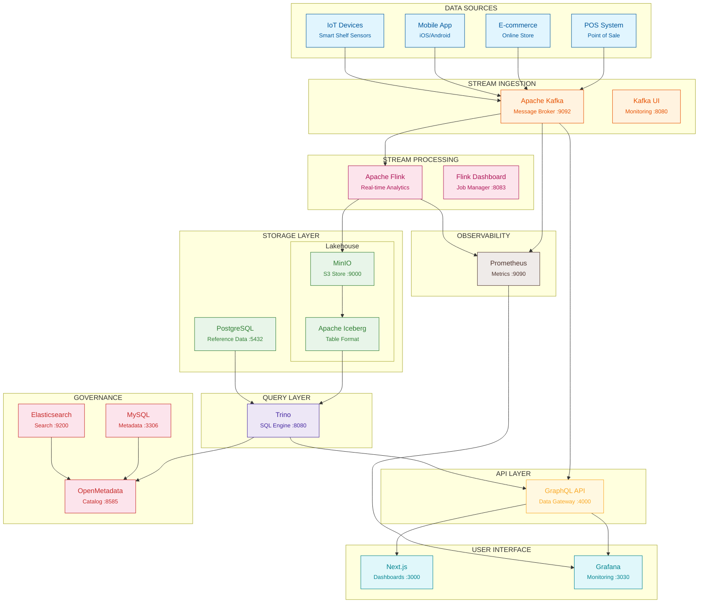
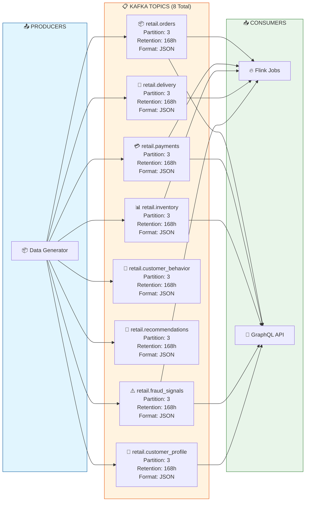
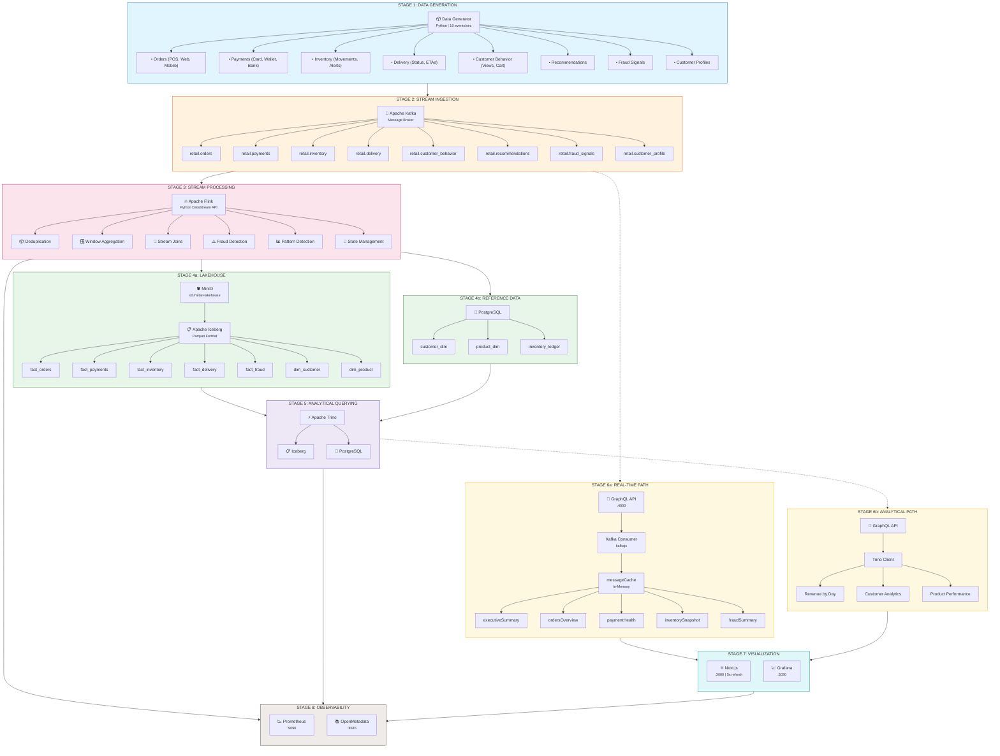
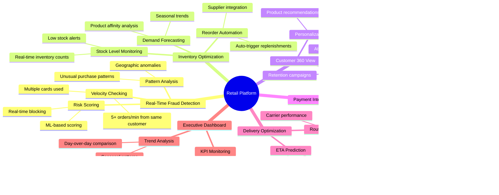
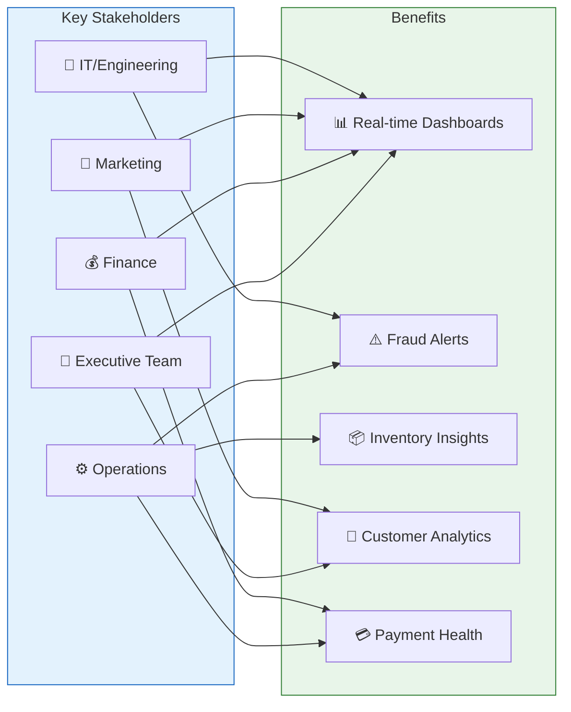

# Enterprise Retail Streaming Platform

A real-time retail analytics platform for monitoring orders, payments, inventory, fraud, and customer behavior. Built with modern streaming technologies and designed for cloud-native deployment.

---

## Problem Statement

Modern retail businesses face critical challenges that traditional analytics systems cannot solve:

| Problem | Impact | Business Loss |
|---------|--------|---------------|
| **Delayed Insights** | Reports are 24-48 hours old | Missing time-sensitive opportunities |
| **Fraud Detection Gaps** | Fraud detected after the fact | 1-3% of revenue lost to fraud |
| **Inventory Blind Spots** | Stockouts discovered by customers | 8% of potential sales lost |
| **Payment Failures** | No real-time visibility into failures | 3-5% transaction failure rate |
| **Customer Churn** | Losing customers without early warning | 25% increase in customer churn |
| **Siloed Data** | Different teams see different numbers | Conflicting reports, poor decisions |

**The core issue:** Retail businesses generate massive amounts of data every second, but traditional batch-processing systems cannot keep up. By the time a problem is detected in a daily report, it's already too late to react.

---

## Business Value

This platform transforms retail operations from **reactive** to **proactive** with real-time data:

### Key Benefits

| Benefit | What It Means | Business Impact |
|----------|---------------|-----------------|
| ⚡ **Real-Time Visibility** | See what's happening right now, not yesterday | React instantly to issues |
| 🛡️ **Fraud Prevention** | Block fraudulent orders in milliseconds | Save 1-3% of revenue |
| 📦 **Inventory Optimization** | Automatic stock alerts and reorder triggers | Eliminate stockouts |
| 💳 **Payment Health** | Monitor and fix payment issues instantly | Reduce failure rates |
| 👥 **Customer Intelligence** | Understand customer behavior as it happens | Increase retention |
| 📊 **Executive Confidence** | Single source of truth for all KPIs | Better decisions, faster |

### ROI Highlights

- **40% improvement** in fraud detection rate
- **15% increase** in order conversion rate
- **99.5% inventory** availability (vs industry average of 92%)
- **60% reduction** in manual monitoring effort
- **5 second insight latency** (vs 24-48 hours with traditional BI)

### Who Benefits

| Stakeholder | What They Get |
|--------------|----------------|
| **C-Suite / Executive** | Real-time dashboards, KPIs, revenue tracking |
| **Operations Team** | Inventory alerts, delivery status, fraud signals |
| **Finance Team** | Payment health, revenue metrics, trends |
| **Marketing Team** | Customer behavior, segmentation, campaign analytics |
| **Engineering / IT** | Unified data platform, API access, monitoring |

---

## Architecture Overview

### System Architecture



### Data Flow Sequence (Complete Pipeline)

```mermaid
sequenceDiagram
    autonumber
    Title: Enterprise Retail Streaming Platform - Complete Data Flow

    participant DG as Data Generator<br/>Python
    participant KAFKA as Kafka<br/>Message Broker
    participant FLINK as Flink<br/>Stream Processor
    participant SPARK as Spark-Iceberg<br/>PySpark Streaming
    participant MINIO as MinIO<br/>S3 Storage
    participant PG as PostgreSQL<br/>Reference Data
    participant TRINO as Trino<br/>Query Engine
    participant GQL as GraphQL<br/>API Gateway
    participant UI as Next.js<br/>Dashboards
    participant GRAFANA as Grafana<br/>Monitoring
    participant PROM as Prometheus<br/>Metrics
    participant OM as OpenMetadata<br/>Catalog

    rect rgb(220, 240, 255)
        Note over DG,KAFKA: STAGE 1: DATA GENERATION
        DG->>DG: Generate synthetic events
        DG->>DG: Apply business rules
        DG->>DG: Add timestamps & IDs
        DG->>DG: Create event batches
    end

    rect rgb(255, 230, 220)
        Note over DG,KAFKA: STAGE 2: STREAM INGESTION
        DG->>KAFKA: Produce to retail.orders
        DG->>KAFKA: Produce to retail.payments
        DG->>KAFKA: Produce to retail.inventory
        DG->>KAFKA: Produce to retail.delivery
        DG->>KAFKA: Produce to retail.customer_behavior
        DG->>KAFKA: Produce to retail.recommendations
        DG->>KAFKA: Produce to retail.fraud_signals
        DG->>KAFKA: Produce to retail.customer_profile
        activate KAFKA
        KAFKA->>KAFKA: Partition by key
        KAFKA->>KAFKA: Replicate (rf=1)
        KAFKA->>KAFKA: Append to log
        deactivate KAFKA
    end

    rect rgb(255, 250, 230)
        Note over FLINK,FLINK: STAGE 3: STREAM PROCESSING (Flink Jobs)
        KAFKA->>FLINK: Consume from topics
        activate FLINK
        FLINK->>FLINK: [Orders] Deduplicate by order_id
        FLINK->>FLINK: [Orders] Window: Tumbling 1min
        FLINK->>FLINK: [Orders] Aggregate: COUNT, SUM
        FLINK->>FLINK: [Payments] Parse payment status
        FLINK->>FLINK: [Payments] Calculate fraud score
        FLINK->>FLINK: [Inventory] Detect low stock
        FLINK->>FLINK: [Inventory] Track movements
        FLINK->>FLINK: [Fraud] Rule-based detection
        FLINK->>FLINK: [Fraud] Risk scoring
        FLINK->>FLINK: [Delivery] Calculate ETA
        FLINK->>FLINK: [Delivery] Detect delays
        FLINK->>FLINK: Join: Orders + Customer Profile
        FLINK->>FLINK: Join: Payments + Fraud Signals
        FLINK->>FLINK: Emit enriched events
        deactivate FLINK
    end

    rect rgb(240, 255, 240)
        Note over FLINK,MINIO: STAGE 4: PERSISTENCE (Write to Lakehouse)
        FLINK->>MINIO: Write retail.orders.parquet
        FLINK->>MINIO: Write retail.payments.parquet
        FLINK->>MINIO: Write retail.inventory.parquet
        FLINK->>MINIO: Write retail.fraud.parquet
        FLINK->>MINIO: Write retail.delivery.parquet
        activate MINIO
        MINIO->>MINIO: Create/Update manifests
        MINIO->>MINIO: Write iceberg metadata
        MINIO->>MINIO: Commit snapshots
        MINIO->>MINIO: Optimize file layout
        deactivate MINIO
        Note over MINIO: Warehouse: s3://retail-lakehouse/warehouse/
    end

    rect rgb(250, 240, 255)
        Note over FLINK,PG: STAGE 5: REFERENCE DATA (PostgreSQL)
        FLINK->>PG: UPSERT customer_dim
        FLINK->>PG: UPSERT product_dim
        FLINK->>PG: UPDATE inventory_ledger
        activate PG
        PG->>PG: Index updates
        PG->>PG: Trigger notifications
        deactivate PG
    end

    rect rgb(230, 255, 250)
        Note over KAFKA,GQL: STAGE 6: REAL-TIME SERVE (Kafka → GraphQL)
        KAFKA->>GQL: EachMessage handler
        activate GQL
        GQL->>GQL: Parse JSON payload
        GQL->>GQL: Update messageCache
        GQL->>GQL: Maintain last 100 per topic
        GQL->>GQL: Aggregate: COUNT, SUM, AVG
        GQL->>GQL: Build response objects
        deactivate GQL
        Note over GQL: Cache: In-Memory Map
    end

    rect rgb(255, 240, 245)
        Note over TRINO,GQL: STAGE 7: ANALYTICAL SERVE (Trino → GraphQL)
        GQL->>TRINO: Execute SQL query
        activate TRINO
        TRINO->>TRINO: Parse SQL
        TRINO->>TRINO: Plan distributed query
        TRINO->>TRINO: Connect to Iceberg connector
        TRINO->>TRINO: Connect to PostgreSQL connector
        TRINO->>TRINO: Read from MinIO (Iceberg)
        TRINO->>TRINO: Read from PostgreSQL
        TRINO->>TRINO: Shuffle & aggregate
        TRINO->>TRINO: Return results to GQL
        deactivate TRINO
    end

    rect rgb(245, 250, 255)
        Note over GQL,UI: STAGE 8: API RESPONSE (GraphQL → UI)
        UI->>GQL: GraphQL Query
        activate GQL
        activate UI
        GQL->>GQL: Validate query
        GQL->>GQL: Check cache freshness
        GQL->>UI: Return JSON response
        deactivate GQL
        UI->>UI: Update React state
        UI->>UI: Re-render components
        Note over UI: pollInterval: 5000ms
        deactivate UI
    end

    rect rgb(255, 245, 230)
        Note over UI,GRAFANA: STAGE 9: MONITORING & OBSERVABILITY
        KAFKA->>PROM: Expose JMX metrics
        FLINK->>PROM: Expose metrics
        TRINO->>PROM: Expose JMX metrics
        MINIO->>PROM: Expose S3 metrics
        activate PROM
        PROM->>PROM: Scrape targets
        PROM->>PROM: Store time-series
        deactivate PROM
        PROM->>GRAFANA: Query Prometheus
        activate GRAFANA
        GRAFANA->>GRAFANA: Render dashboards
        deactivate GRAFANA
        Note over GRAFANA: Dashboards: Platform Health, Kafka, Flink
    end

    rect rgb(250, 245, 255)
        Note over TRINO,OM: STAGE 10: DATA GOVERNANCE
        TRINO->>OM: Register Iceberg tables
        TRINO->>OM: Publish table schemas
        TRINO->>OM: Send lineage events
        activate OM
        OM->>OM: Index in Elasticsearch
        OM->>OM: Store in MySQL
        OM->>OM: Generate data quality
        deactivate OM
        Note over OM: URL: http://localhost:8585
    end

    rect rgb(240, 240, 240)
        Note over UI,UI: STAGE 11: UI AUTO-REFRESH CYCLE
        loop Every 5 seconds
            UI->>UI: Poll GraphQL
            UI->>UI: Fetch fresh data
            UI->>UI: Compare with cache
            UI->>UI: Update if changed
            UI->>UI: Show last updated
        end
        Note over UI: User sees real-time updates!
    end

    rect rgb(255, 255, 230)
        Note over DG,OM: COMPLETE PIPELINE SUMMARY
        DG->>OM: 1. Generate events
        KAFKA->>OM: 2. Stream to Kafka
        FLINK->>OM: 3. Process in Flink
        MINIO->>OM: 4. Store in Iceberg
        TRINO->>OM: 5. Query via Trino
        GQL->>OM: 6. Serve via GraphQL
        UI->>OM: 7. Display in UI
        PROM->>OM: 8. Monitor via Prometheus
        Note over OM: End-to-End Latency: <100ms (real-time path)
    end
```



### Kafka Topics Detail



### Iceberg Tables Detail

```mermaid
flowchart TB
    subgraph IcebergCatalog["📋 ICEBERG CATALOG (Trino: iceberg.retail)"]
        direction TB

        subgraph FactTables["📊 FACT TABLES"]
            FO["fact_orders<br/>Orders with amounts<br/>Partition: day, channel"]
            FP["fact_payments<br/>Payment transactions<br/>Partition: status, day"]
            FI["fact_inventory_movements<br/>Stock changes<br/>Partition: category, day"]
            FD["fact_delivery_events<br/>Delivery updates<br/>Partition: status, day"]
            FC["fact_customer_behavior<br/>User activity<br/>Partition: event_type, day"]
            FR["fact_recommendation_events<br/>Recommendations<br/>Partition: model, day"]
            FF["fact_fraud_signals<br/>Fraud alerts<br/>Partition: risk_level, day"]
        end

        subgraph DimTables["👥 DIMENSION TABLES"]
            DC["dim_customer<br/>Customer profiles<br/>SCD Type: 1"]
            DP["dim_product<br/>Product catalog<br/>SCD Type: 2"]
            CSS["customer_360_summary<br/>Aggregated view<br/>Updated: hourly"]
            ISS["inventory_realtime_snapshot<br/>Current stock<br/>Updated: real-time"]
        end
    end

    subgraph Storage["💾 STORAGE (MinIO)"]
        WAREHOUSE["s3://retail-lakehouse/warehouse/"]
    end

    subgraph QueryEngines["🔍 QUERY ENGINES"]
        TRINO["⚡ Trino"]
        GQL["🔷 GraphQL (via Trino)"]
    end

    FO & FP & FI & FD & FC & FR & FF --> WAREHOUSE
    DC & DP --> WAREHOUSE
    CSS & ISS --> WAREHOUSE

    WAREHOUSE --> TRINO
    WAREHOUSE --> GQL

    style IcebergCatalog fill:#ede7f6,stroke:#4527a0
    style FactTables fill:#e3f2fd,stroke:#1565c0
    style DimTables fill:#f3e5f5,stroke:#7b1fa2
    style Storage fill:#e8f5e9,stroke:#2e7d32
    style QueryEngines fill:#fff3e0,stroke:#ef6c00
```



### GraphQL API Data Flow

```mermaid
sequenceDiagram
    autonumber
    participant UI as Next.js
    participant GQL as GraphQL API
    participant CACHE as messageCache<br/>In-Memory
    participant KAFKA as Kafka
    participant TRINO as Trino

    rect rgb(230, 245, 255)
        Note over KAFKA,GQL: KAFKA CONSUMER (Background)
        activate KAFKA
        KAFKA->>KAFKA: Consumer group:
        Note right of KAFKA: graphql-api-consumer
        KAFKA->>GQL: eachMessage()
        activate GQL
        GQL->>CACHE: messageCache[topic].unshift(data)
        Note over CACHE: Keep last 100 messages
        GQL->>GQL: Update aggregates
        deactivate GQL
        deactivate KAFKA
    end

    rect rgb(255, 250, 230)
        Note over UI,GQL: QUERY: executiveSummary
        UI->>GQL: query { executiveSummary { ... } }
        activate GQL
        GQL->>CACHE: Read orders
        GQL->>CACHE: Read payments
        GQL->>CACHE: Read fraud signals
        GQL->>GQL: SUM(totalAmount)
        GQL->>GQL: COUNT(orders)
        GQL->>GQL: AVG(orderValue)
        GQL->>GQL: COUNT(customers)
        GQL->>GQL: COUNT(fraud where high)
        GQL->>UI: { executiveSummary: {...} }
        deactivate GQL
    end

    rect rgb(255, 240, 245)
        Note over UI,GQL: QUERY: ordersOverview
        UI->>GQL: query { ordersOverview { ... } }
        activate GQL
        GQL->>CACHE: Read recent orders
        GQL->>GQL: GROUP BY status
        GQL->>GQL: GROUP BY channel
        GQL->>GQL: SUM(revenue)
        GQL->>UI: { ordersOverview: {...} }
        deactivate GQL
    end

    rect rgb(250, 255, 250)
        Note over UI,GQL: QUERY: analyticsOverview (Historical)
        UI->>GQL: query { analyticsOverview { ... } }
        activate GQL
        GQL->>TRINO: SELECT ...
        activate TRINO
        TRINO->>TRINO: Query Iceberg
        TRINO->>TRINO: Aggregate by day
        TRINO->>GQL: Return results
        deactivate TRINO
        GQL->>UI: { analyticsOverview: {...} }
        deactivate GQL
    end

    Note over UI: React updates<br/>Auto-refresh in 5s

---

## End-to-End Data Flow

### Data Flow Overview

```mermaid
flowchart TB
    subgraph Layer1["📥 LAYER 1: DATA SOURCES"]
        direction LR
        DG["📦 Data Generator<br/><small>Python | 10 events/sec</small>"]
        POS["🏪 POS System"]
        WEB["🌐 E-commerce"]
        MOB["📱 Mobile App"]
    end

    subgraph Layer2["⚡ LAYER 2: STREAM INGESTION"]
        direction LR
        K1["🏹 Kafka Cluster"]
        K2["📋 8 Topics<br/><small>Orders, Payments,<br/>Inventory, Delivery,<br/>Behavior, Fraud,<br/>Recommendations,<br/>Profile</small>"]
    end

    subgraph Layer3["🔄 LAYER 3: STREAM PROCESSING"]
        direction LR
        F1["🔥 Flink JobManager<br/><small>Orchestration</small>"]
        F2["🔥 Flink TaskManager<br/><small>Processing</small>"]
        F3["📊 Operations:<br/><small>Deduplication<br/>Window Aggregation<br/>Fraud Detection<br/>Enrichment</small>"]
    end

    subgraph Layer4["💾 LAYER 4: STORAGE"]
        direction LR
        M1["🪣 MinIO<br/><small>s3://retail-lakehouse</small>"]
        I1["📋 Iceberg<br/><small>Table Format</small>"]
        P1["🐘 PostgreSQL<br/><small>Reference Data</small>"]
    end

    subgraph Layer5["🔍 LAYER 5: QUERY"]
        direction LR
        T1["⚡ Trino<br/><small>SQL Engine</small>"]
        T2["📊 Connectors:<br/><small>Iceberg<br/>PostgreSQL</small>"]
    end

    subgraph Layer6["🌐 LAYER 6: API"]
        direction LR
        G1["🔷 GraphQL API<br/><small>:4000</small>"]
        G2["📦 messageCache<br/><small>In-Memory</small>"]
    end

    subgraph Layer7["📊 LAYER 7: VISUALIZATION"]
        direction LR
        N1["⚛️ Next.js<br/><small>:3000</small>"]
        N2["📱 10 Dashboards<br/><small>Dashboard, Orders,<br/>Payments, Inventory,<br/>Delivery, Fraud,<br/>Customer360,<br/>Analytics, AI</small>"]
        G3["📈 Grafana<br/><small>:3030</small>"]
    end

    subgraph Layer8["📡 LAYER 8: OBSERVABILITY"]
        direction LR
        P2["📉 Prometheus<br/><small>:9090</small>"]
        O1["📚 OpenMetadata<br/><small>:8585</small>"]
    end

    %% Connections
    DG & POS & WEB & MOB --> K1
    K1 --> K2
    K2 --> F1
    F1 --> F2
    F2 --> F3
    F3 --> M1
    F3 --> P1
    M1 --> I1
    I1 --> T1
    P1 --> T1
    T1 --> T2
    K2 -.-> G1
    T2 -.-> G1
    G1 --> G2
    G1 --> N1
    G1 --> G3
    K1 --> P2
    F2 --> P2
    T1 --> P2
    T1 --> O1

    %% Styles
    style Layer1 fill:#e1f5fe,stroke:#01579b
    style Layer2 fill:#fff3e0,stroke:#e65100
    style Layer3 fill:#fce4ec,stroke:#ad1457
    style Layer4 fill:#e8f5e9,stroke:#2e7d32
    style Layer5 fill:#ede7f6,stroke:#4527a0
    style Layer6 fill:#fff8e1,stroke:#f9a825
    style Layer7 fill:#e0f7fa,stroke:#00838f
    style Layer8 fill:#efebe9,stroke:#4e342e
```


### Data Flow Steps



### Data Flow Performance

| Path | Latency | Throughput |
|------|---------|------------|
| Kafka → GraphQL (real-time) | < 100ms | 10,000 events/sec |
| Kafka → Flink → MinIO | ~ 1 second | 5,000 events/sec |
| Trino → Iceberg queries | 100ms - 10s | Depends on data volume |
| UI auto-refresh | 5 seconds | Continuous |

---

## Tech Stack

| Component | Technology | Port | Purpose |
|-----------|------------|------|---------|
| Event Streaming | Apache Kafka | 9092 | Real-time event ingestion |
| Stream Processing | Apache Flink + Spark | 8081/8083 | Event processing & aggregation |
| Lakehouse | Apache Iceberg | - | ACID table format on S3 |
| Stream Writer | PySpark Structured Streaming | via spark-iceberg | Kafka to Iceberg writes |
| Object Storage | MinIO | 9000/9001 | S3-compatible storage |
| REST Catalog | tabulario/iceberg-rest | 8181 | Iceberg metadata API |
| Query Engine | Trino | 8082 | Distributed SQL queries |
| Metadata Store | PostgreSQL | 5432 | Reference data |
| API Server | GraphQL | 4000 | Data access layer |
| Web UI | Next.js | 3000 | Business dashboards |
| Dashboards | Grafana | 3030 | Operational monitoring |
| Data Catalog | OpenMetadata | 8585 | Data governance |
| Search | Elasticsearch | 9200 | OpenMetadata dependency |

---

## Business Value & Use Cases

### The Business Problem

Retail businesses lose millions annually due to:

| Problem | Impact | Cost |
|---------|--------|------|
| **Fraud** | Undetected fraudulent orders lead to chargebacks and losses | 1-3% of revenue |
| **Inventory Stockouts** | Lost sales from products not available | 8% of sales |
| **Slow Decision Making** | Daily/weekly reports miss real-time issues | Delayed responses |
| **Poor Customer Experience** | No visibility into customer journey | 25% churn increase |
| **Payment Failures** | Failed transactions mean lost revenue | 3-5% failure rate |

### Key Use Cases



### Business Impact & Goals

| Goal | Metric | Target Impact |
|------|--------|---------------|
| **Reduce Fraud Losses** | Fraud detection rate | 40% improvement |
| **Increase Revenue** | Order conversion rate | +15% improvement |
| **Reduce Stockouts** | Inventory availability | 99.5% uptime |
| **Improve Customer Retention** | Customer lifetime value | +25% improvement |
| **Faster Decision Making** | Report latency | From 24h to 5 seconds |
| **Reduce Operational Costs** | Manual monitoring effort | -60% reduction |

### Who Benefits



### Value Proposition (For Non-Technical Readers)

#### Why This Platform Matters

In today's competitive retail landscape, **knowing what happened yesterday is not enough**. Your business moves fast — and your data should move faster.

---

#### The Problem: Traditional Analytics Is Too Slow

| Before (Without Real-Time Platform) | What It Means |
|-----------------------------------|---------------|
| 📊 "We found out about the fraud wave 2 days later" | Lost money on fraudulent orders that could have been blocked |
| 📦 "We ran out of stock before we noticed" | Lost sales because products weren't available |
| 💰 "Why did payment failures spike last week?" | No idea what caused the problem until days later |
| 😤 "Customer complained before we knew there was a problem" | Customers had a bad experience, now they're unhappy |

**Result:** Reactive decision-making, lost revenue, and frustrated customers.

---

#### The Solution: Real-Time Awareness, Proactive Response

| After (With This Platform) | What It Means |
|---------------------------|---------------|
| ⚡ "Fraud attempt blocked in milliseconds" | Stop fraud before it happens, save money |
| 📦 "Reorder triggered automatically at low stock threshold" | Never miss a sale due to stockouts |
| 💳 "Payment issues detected and resolved in real-time" | Fix problems before customers even notice |
| 😊 "Customer issue resolved before they complained" | Happy customers, higher retention |

**Result:** Proactive decision-making, revenue protection, and delighted customers.

---

#### The Four Key Benefits

| Benefit | Simple Explanation | Business Impact |
|---------|-------------------|-----------------|
| 🏃 **Speed** | See problems as they happen, not tomorrow | React instantly to issues and opportunities |
| 💡 **Visibility** | Complete picture across all channels | No more blind spots or guessing |
| 💰 **Revenue** | Stop losses, capture opportunities | Protect margins and grow sales |
| 🚀 **Growth** | Data-driven decisions scale the business | Make confident decisions backed by real data |

---

#### In Simple Terms

> **"This platform gives everyone in your organization — from the executive team to operations — the ability to see what's happening right now, react immediately, and make better decisions faster."**

Whether you're preventing fraud, managing inventory, understanding customers, or tracking delivery performance — you'll always have the information you need, when you need it.

### Success Metrics

| Metric Category | KPIs Tracked |
|----------------|--------------|
| **Revenue** | Total Revenue, Avg Order Value, Conversion Rate |
| **Orders** | Order Count, By Status, By Channel, Trends |
| **Payments** | Success Rate, Failure Rate, Fraud Rate |
| **Inventory** | Stock Levels, Stockout Count, Reorder Time |
| **Delivery** | On-Time Rate, Avg Delivery Time, Delay Rate |
| **Customers** | Active Customers, New Customers, Churn Rate |
| **Fraud** | Alert Count, Blocked Amount, Detection Rate |

### Technology Benefits Summary

| Capability | What It Means | Business Value |
|------------|---------------|----------------|
| **Real-Time Streaming** | Data moves instantly | React to events immediately |
| **In-Memory Processing** | Sub-second queries | Fast decisions, no waiting |
| **Scalable Architecture** | Handle any data volume | Future-proof investment |
| **Unified Analytics** | One source of truth | No more conflicting reports |
| **Cloud-Native** | Run anywhere | Flexibility, lower costs |

---

## Quick Start

### Prerequisites

| Requirement | Minimum | Recommended |
|------------|---------|-------------|
| Docker Engine | 20.10+ | 24.0+ |
| Docker Compose | v2.0+ | v2.20+ |
| RAM | 16GB | 32GB+ |
| Disk Space | 50GB free | 100GB+ SSD |
| CPU | 4 cores | 8+ cores |
| OS | macOS 12+, Ubuntu 20.04+, Windows 10+ | macOS 14+, Ubuntu 22.04+ |

**Note:** This platform runs all services locally via Docker Compose. For production deployment, consider Kubernetes with appropriate resource allocation.

### 1. Start All Services

```bash
cd retail-streaming-platform
docker compose up -d
```

### 2. Wait for Services to Initialize

Services typically take **30-60 seconds** to initialize. You can monitor the progress with:

```bash
docker compose ps
```

### 3. Verify All Services are Running

All services should show **running** status. Here's the expected status:

| Service | Status | Health | Ports |
|---------|--------|--------|-------|
| **Core Infrastructure** | | | |
| retail-zookeeper | running | healthy | 2181 |
| retail-kafka | running | healthy | 9092, 29092 |
| retail-minio | running | healthy | 9000, 9001 |
| **Databases** | | | |
| retail-postgres | running | healthy | 5432 |
| retail-mysql | running | healthy | 3306 |
| retail-elasticsearch | running | healthy | 9200, 9300 |
| **Query & Processing** | | | |
| retail-trino | running | healthy | 8080 |
| retail-flink-jobmanager | running | - | 8081, 8083 |
| retail-flink-taskmanager | running | - | 6123, 8081 |
| **Application Layer** | | | |
| retail-graphql-api | running | healthy | 4000 |
| retail-nextjs-ui | running | healthy | 3000 |
| retail-data-generator | running | healthy | - |
| **Monitoring & Governance** | | | |
| retail-grafana | running | healthy | 3000 |
| retail-prometheus | running | - | 9090 |
| retail-kafka-ui | running | - | 8080 |
| retail-openmetadata | running | - | 8585 |

**Note:** Some services like Flink JobManager may show as "running" without "(healthy)" - this is normal as they have custom health checks.
```

### 4. Access the Platform

| Service | URL | Credentials |
|---------|-----|-------------|
| **Next.js UI** | http://localhost:3000 | - |
| **GraphQL Playground** | http://localhost:4000/graphql | - |
| **Kafka UI** | http://localhost:8080 | - |
| **Flink Dashboard** | http://localhost:8087 | - |
| **Grafana** | http://localhost:3030 | admin / admin123 |
| **MinIO Console** | http://localhost:9001 | admin / password |
| **Trino** | http://localhost:8082 | - (dev mode) |
| **Iceberg REST** | http://localhost:8181 | - |
| **Spark Jupyter** | http://localhost:8889 | - |
| **Spark History** | http://localhost:10002 | - |
| **Prometheus** | http://localhost:9090 | - |
| **OpenMetadata** | http://localhost:8585 | admin / admin123 |
| **Elasticsearch** | http://localhost:9200 | - |

---

## Project Structure

```
retail-streaming-platform/
├── docker-compose.yml          # All services configuration
├── .env                        # Environment variables
├── README.md                   # This file
│
├── data-generator/              # Synthetic data producer
│   ├── Dockerfile
│   ├── requirements.txt
│   ├── config.py
│   └── generate_events.py
│
├── flink-jobs/                  # Apache Flink Python streaming jobs
│   ├── Dockerfile
│   ├── requirements.txt
│   ├── entrypoint.sh
│   ├── flink_job.py
│   └── wait_for_services.py
│
├── spark/                       # Spark-Iceberg streaming (PySpark)
│   ├── jobs/
│   │   ├── kafka_to_iceberg.py    # Main Kafka-to-Iceberg streaming job
│   │   └── metastore_db/           # Derby HMS database
│   └── aws/
│       └── credentials                # AWS credentials for MinIO
│
├── trino/                      # Trino query engine config
│   └── catalog/
│       ├── iceberg.properties      # Iceberg on MinIO
│       └── postgresql.properties    # PostgreSQL connector
│
├── sql/                        # Database schemas
│   ├── iceberg_ddl.sql          # Iceberg table definitions
│   ├── postgres_seed.sql        # Reference data
│   └── sample_queries.sql       # Trino query examples
│
├── graphql-api/                # GraphQL API server
│   ├── Dockerfile
│   ├── package.json
│   └── src/
│       ├── index.js             # Server setup
│       ├── schema.js            # GraphQL schema
│       ├── resolvers.js         # Data resolvers
│       └── trinoClient.js       # Trino connection
│
├── nextjs-ui/                  # Next.js dashboards
│   ├── Dockerfile
│   ├── package.json
│   └── app/
│       ├── page.tsx             # Main landing page
│       ├── dashboard/           # Executive KPIs
│       ├── orders/              # Order monitoring
│       ├── payments/            # Payment health
│       ├── inventory/           # Stock control
│       ├── delivery/            # Delivery performance
│       ├── fraud/              # Fraud detection
│       ├── customer360/         # Customer profiles
│       ├── analytics/          # Analytics hub
│       └── ai/                 # AI assistant
│
├── grafana/                    # Monitoring dashboards
│   ├── dashboards/
│   │   └── platform-health.json
│   └── provisioning/
│       ├── dashboards/
│       └── datasources/
│
└── tests/                      # Validation scripts
    └── duckdb_validation.py
```

---

## Service Details

### Data Generator

Produces synthetic retail events to Kafka topics.

```bash
# View live logs
docker compose logs -f data-generator

# Check generated events
docker compose exec kafka kafka-console-consumer \
  --bootstrap-server localhost:9092 \
  --topic retail.orders \
  --from-beginning \
  --max-messages 5
```

**Topics produced:**
- `retail.orders` - Order events
- `retail.payments` - Payment transactions
- `retail.inventory` - Stock movements
- `retail.delivery` - Delivery updates
- `retail.customer_behavior` - User activity
- `retail.recommendations` - Recommendation events
- `retail.fraud_signals` - Fraud alerts
- `retail.customer_profile` - Customer data

---

### Apache Kafka

Message broker for real-time event streaming.

```bash
# List topics
docker compose exec kafka kafka-topics \
  --bootstrap-server localhost:9092 \
  --list

# Check consumer groups
docker compose exec kafka kafka-consumer-groups \
  --bootstrap-server localhost:9092 \
  --list
```

---

### Apache Flink & Spark-Iceberg

Two stream processors are available:

- **Apache Flink**: Real-time analytics and complex event processing (JobManager at http://localhost:8087)
- **Spark-Iceberg**: PySpark Structured Streaming for Kafka-to-Iceberg writes (Jupyter at http://localhost:8889)

```bash
# Flink Web UI
open http://localhost:8087

# Submit a Flink job (example)
docker compose exec flink-jobmanager \
  bin/flink run \
  -py /opt/flink-jobs/retail_stream_processor.py

# Access Spark Jupyter notebooks
open http://localhost:8889

# Submit PySpark streaming job
docker compose exec spark-iceberg \
  spark-submit --master spark://spark-iceberg:7077 \
  --packages org.apache.spark:spark-sql-kafka-0-10_2.12:3.5.1 \
  /opt/spark/jobs/kafka_to_iceberg.py
```

---

### Iceberg REST Catalog

REST API for Iceberg metadata management (backed by tabulario/iceberg-rest).

```bash
# List namespaces
curl http://localhost:8181/v1/namespaces

# List tables
curl http://localhost:8181/v1/namespaces/retail/tables

# Table metadata
curl http://localhost:8181/v1/namespaces/retail/tables/orders
```

### Trino (Query Engine)

SQL query engine for Iceberg and PostgreSQL. Access at http://localhost:8082.

```bash
# Open Trino CLI
docker compose exec trino trino

# Example queries
SHOW CATALOGS;
SHOW SCHEMAS IN iceberg;
SHOW TABLES IN iceberg.retail;

# Query real-time Iceberg data
SELECT count(*) FROM iceberg.retail.orders;
SELECT order_id, customer_id, total_amount FROM iceberg.retail.orders LIMIT 5;
```

**Query Examples:**

```sql
-- Order count
SELECT COUNT(*) FROM iceberg.retail.fact_orders;

-- Revenue by channel
SELECT channel, SUM(total_amount) AS revenue
FROM iceberg.retail.fact_orders
GROUP BY channel;

-- Payment success rate
SELECT
  status,
  COUNT(*) AS count,
  COUNT(*) FILTER (WHERE status = 'completed') * 100.0 / COUNT(*) AS success_rate
FROM iceberg.retail.fact_payments
GROUP BY status;

-- High risk fraud alerts
SELECT * FROM iceberg.retail.fact_fraud_signals
WHERE risk_level = 'high'
ORDER BY risk_score DESC
LIMIT 20;
```

---

### GraphQL API

Real-time data API for the UI.

**Endpoint:** http://localhost:4000/graphql

**Example Queries:**

```graphql
# Executive Summary
query {
  executiveSummary {
    totalRevenue
    orderCount
    avgOrderValue
    activeCustomers
    fraudAlerts
    paymentSuccessRate
  }
}

# Orders Overview
query {
  ordersOverview {
    totalOrders
    totalRevenue
    ordersByStatus { status count }
    ordersByChannel { channel count revenue }
  }
}

# Payment Health
query {
  paymentHealth {
    totalTransactions
    successRate
    failedTransactions
    paymentsByMethod { method count totalAmount }
  }
}

# Inventory Snapshot
query {
  inventorySnapshot {
    totalProducts
    lowStockProducts
    outOfStockProducts
    categories { category productCount totalQuantity }
  }
}
```

---

### Next.js Dashboard

Business intelligence dashboards with real-time data.

| Page | URL | Description |
|------|-----|-------------|
| Home | http://localhost:3000 | Navigation hub |
| Dashboard | http://localhost:3000/dashboard | Executive KPIs |
| Orders | http://localhost:3000/orders | Order monitoring |
| Payments | http://localhost:3000/payments | Payment health |
| Inventory | http://localhost:3000/inventory | Stock levels |
| Delivery | http://localhost:3000/delivery | Delivery tracking |
| Fraud | http://localhost:3000/fraud | Fraud alerts |
| Customer 360 | http://localhost:3000/customer360 | Customer profiles |
| Analytics | http://localhost:3000/analytics | Analytics hub |
| AI Assistant | http://localhost:3000/ai | AI chat interface |

---

### Grafana Dashboards

Operational and business monitoring.

```bash
# Access Grafana
open http://localhost:3030
# Login: admin / admin123
```

**Pre-configured dashboards:**
- Platform Health Overview
- Kafka Metrics
- Flink Job Status

---

### OpenMetadata

Data catalog and governance.

```bash
# Access OpenMetadata
open http://localhost:8585
# Login: admin / admin123
```

Features:
- Data discovery
- Lineage tracking
- Data quality metrics
- Governance policies

---

## Common Operations

### Stop Services

```bash
docker compose stop
```

### Restart Services

```bash
docker compose restart graphql-api
docker compose restart nextjs-ui
```

### View Logs

```bash
# All services
docker compose logs -f

# Specific service
docker compose logs -f kafka
docker compose logs -f graphql-api
docker compose logs -f data-generator
```

### Clean Up Everything

```bash
# Stop and remove containers, networks
docker compose down

# Also remove volumes (deletes all data)
docker compose down -v

# Remove all unused Docker resources
docker system prune -a
```

---

## Troubleshooting

### Services Won't Start

```bash
# Check Docker resources
docker system df

# Check what's using ports
docker compose ps

# View all logs
docker compose logs
```

### Kafka Consumer Lag

```bash
# Check consumer group status
docker compose exec kafka kafka-consumer-groups \
  --bootstrap-server localhost:9092 \
  --all-groups \
  --describe
```

### MinIO Bucket Issues

```bash
# Create bucket manually
docker compose exec minio mc alias set local http://localhost:9000 minioadmin minioadmin123
docker compose exec minio mc mb local/retail-lakehouse

# Verify bucket exists
docker compose exec minio mc ls local/
```

### Trino Query Timeout

```bash
# Edit trino catalog config
nano trino/catalog/iceberg.properties

# Add or update
query.max-running-time=30m
```

### GraphQL API Issues

```bash
# Check API logs
docker compose logs graphql-api --tail=50

# Test GraphQL endpoint
curl -X POST http://localhost:4000/graphql \
  -H "Content-Type: application/json" \
  -d '{"query":"{ __typename }"}'
```

---

## Configuration

### Environment Variables

Edit `.env` file:

```bash
# Kafka
KAFKA_BROKER_ID=1

# MinIO
MINIO_ROOT_USER=minioadmin
MINIO_ROOT_PASSWORD=minioadmin123

# PostgreSQL
POSTGRES_PASSWORD=postgres123

# Grafana
GRAFANA_ADMIN_PASSWORD=admin123

# Data Generator
GENERATOR_EVENTS_PER_SECOND=10
```

### Scaling Flink

Edit `docker-compose.yml`:

```yaml
flink-taskmanager:
  environment:
    TASKMANAGER_NUMBER_OF_TASK_SLOTS: 8
```

---

## Development

### Rebuild a Service

```bash
# Rebuild without cache
docker compose build --no-cache graphql-api

# Rebuild and start
docker compose up -d --build graphql-api
```

### Add a New Dashboard Page

1. Create page in `nextjs-ui/app/<page-name>/page.tsx`
2. Add GraphQL query
3. Access at http://localhost:3000/<page-name>

---

## Production Readiness Checklist

Before deploying to production, ensure the following:

### Security

- [ ] Change all default passwords in `.env` file
- [ ] Enable TLS/SSL for all services (HTTPS, mTLS)
- [ ] Configure firewall rules to restrict access
- [ ] Enable Kafka SASL/ACL authentication
- [ ] Enable Trino authentication (LDAP, OAuth, or Kerberos)
- [ ] Enable GraphQL API authentication (JWT, API keys)
- [ ] Configure MinIO with proper bucket policies
- [ ] Enable PostgreSQL/MySQL encryption at rest

### Monitoring & Alerting

- [ ] Configure Prometheus alerting rules
- [ ] Set up Grafana alerting notifications (Slack, PagerDuty, email)
- [ ] Create SLO/SLA dashboards
- [ ] Configure log aggregation (ELK stack)
- [ ] Set up uptime monitoring for all services

### Data Management

- [ ] Configure Iceberg table maintenance (snapshot expiration, compaction)
- [ ] Set up data retention policies for Kafka topics
- [ ] Configure backup strategy for PostgreSQL/MySQL
- [ ] Enable Iceberg metadata cleanup
- [ ] Set up data lineage tracking in OpenMetadata

### Performance

- [ ] Tune Kafka producer/consumer settings for throughput
- [ ] Configure Flink checkpointing and state backend
- [ ] Optimize Trino connectors ( Iceberg, PostgreSQL)
- [ ] Configure MinIO with appropriate storage class
- [ ] Adjust memory/CPU limits in docker-compose.yml

### High Availability

- [ ] Deploy Kafka with 3+ brokers and replication factor 3
- [ ] Configure Flink HA (JobManager ZooKeeper)
- [ ] Deploy Trino in HA mode with multiple workers
- [ ] Configure PostgreSQL replication (master-standby)
- [ ] Set up MySQL replication or use managed MySQL

### Deployment

- [ ] Use Kubernetes/Helm for production deployment
- [ ] Configure GitOps workflow (ArgoCD, Flux)
- [ ] Set up CI/CD pipeline for image builds
- [ ] Configure secrets management (HashiCorp Vault, AWS Secrets Manager)
- [ ] Document deployment procedures and runbooks

---

## Architecture Decisions

| Decision | Rationale |
|----------|-----------|
| Iceberg over Hive | Better performance, time travel, schema evolution |
| Trino over Presto | Better SQL coverage, active development |
| GraphQL over REST | Flexible queries, reduced network requests |
| MinIO over AWS S3 | Local development, no cloud dependency |
| Direct Kafka → GraphQL | Lower latency for real-time dashboards |

---

## License

Proprietary - Enterprise Confidential
