# Enterprise Retail Streaming Platform - Complete Architecture Blueprint

**Version:** 1.0  
**Date:** July 2026  
**Status:** Production Architecture Blueprint  
**Classification:** Enterprise Confidential

---

## Executive Summary

This document presents the complete enterprise architecture blueprint for a Real-Time Retail Streaming Platform. The platform enables executives to monitor business operations in near real-time across orders, payments, inventory, fulfillment, delivery, customer behavior, fraud detection, and executive KPIs.

### Architecture Highlights

- **Design Patterns:** Domain-Driven Design (DDD), Event-Driven Architecture (EDA), Data Mesh, Lakehouse
- **Streaming Platform:** Apache Kafka with Apache Flink for stream processing
- **Lakehouse:** Apache Iceberg with MinIO for S3-compatible object storage
- **Query Engine:** Trino for distributed SQL analytics
- **API Layer:** GraphQL for flexible data fetching
- **Visualization:** Apache Superset (analytics) and Grafana (operations monitoring)
- **Metadata Management:** OpenMetadata for data governance and discovery
- **Application Framework:** Next.js for responsive dashboards

### Key Business Outcomes

- Near real-time visibility into business operations (sub-5-minute latency)
- Unified customer 360 view across all touchpoints
- AI-powered fraud detection and recommendations
- Self-service analytics for business users
- Complete data lineage and governance
- Cloud-agnostic, scalable architecture

---

## Table of Contents

1. [Business Architecture](#phase-1-business-architecture)
2. [Domain Architecture](#phase-2-domain-architecture)
3. [Bounded Context Design](#phase-3-bounded-context-design)
4. [Source System Architecture](#phase-4-source-system-architecture)
5. [Event Architecture](#phase-5-event-architecture)
6. [Streaming Architecture](#phase-6-streaming-architecture)
7. [Data Architecture](#phase-7-data-architecture)
8. [Lakehouse Architecture](#phase-8-lakehouse-architecture)
9. [Data Product Architecture](#phase-9-data-product-architecture)
10. [Semantic Layer](#phase-10-semantic-layer)
11. [API Architecture](#phase-11-api-architecture)
12. [Application Architecture](#phase-12-application-architecture)
13. [Analytics Architecture](#phase-13-analytics-architecture)
14. [Governance Architecture](#phase-14-governance-architecture)
15. [Security Architecture](#phase-15-security-architecture)
16. [Observability Architecture](#phase-16-observability-architecture)
17. [Deployment Architecture](#phase-17-deployment-architecture)
18. [Project Modularization](#phase-18-project-modularization)
19. [Architecture Decision Records](#phase-19-architecture-decision-records-adr)
20. [Implementation Roadmap](#phase-20-implementation-roadmap)

---

# Phase 1: Business Architecture

## 1.1 Business Goals

| Goal ID | Business Goal | Priority | Target Date |
|---------|---------------|----------|-------------|
| BG-001 | Real-time inventory visibility across all channels | Critical | Q4 2026 |
| BG-002 | Unified customer 360 with sub-minute latency | Critical | Q4 2026 |
| BG-003 | Fraud detection with >95% accuracy | High | Q1 2027 |
| BG-004 | Personalized recommendations increasing conversion 15% | High | Q1 2027 |
| BG-005 | Executive dashboards with <5s refresh | Critical | Q3 2026 |
| BG-006 | Self-service analytics adoption >80% of business users | Medium | Q2 2027 |
| BG-007 | 99.9% platform uptime | Critical | Q4 2026 |
| BG-008 | GDPR/PCI-DSS compliance | Critical | Ongoing |

## 1.2 Business Capabilities

```
Retail Operations
├── Order Management
│   ├── Order Creation
│   ├── Order Modification
│   ├── Order Cancellation
│   └── Order Tracking
├── Inventory Management
│   ├── Stock Tracking
│   ├── Replenishment
│   ├── Allocation
│   └── Transfers
├── Fulfillment
│   ├── Pick Pack Ship
│   ├── Store Pickup
│   └── Drop Shipping
├── Customer Management
│   ├── Customer Acquisition
│   ├── Customer Retention
│   └── Customer Support
├── Financial Management
│   ├── Payment Processing
│   ├── Billing
│   └── Settlement
└── Analytics & Insights
    ├── Real-time Reporting
    ├── Predictive Analytics
    └── AI/ML Insights
```

## 1.3 Business Domains

| Domain | Description | Strategic Importance |
|--------|-------------|---------------------|
| Retail | Core retail operations and transactions | Core |
| Customer | Customer identity, profile, and relationships | Core |
| Product | Product catalog, attributes, and hierarchy | Core |
| Inventory | Stock management and allocation | Core |
| Pricing | Pricing rules and promotions | Core |
| Promotion | Marketing campaigns and offers | High |
| Order | Order lifecycle management | Core |
| Payment | Payment processing and settlement | Critical |
| Shipment | Logistics and delivery management | Core |
| Returns | Returns processing and refunds | High |
| Loyalty | Rewards and loyalty programs | Medium |
| Recommendation | Personalization and recommendations | High |
| Fraud | Fraud detection and prevention | Critical |
| Supplier | Supplier relationships and procurement | Medium |
| Store | Physical store operations | Core |
| Warehouse | Distribution center operations | Core |
| Analytics | Business intelligence and reporting | Core |
| Governance | Data governance and compliance | Critical |

## 1.4 Business Users

| User Role | Department | Primary Needs |
|-----------|------------|---------------|
| CEO | Executive | Executive KPIs, company-wide metrics |
| CFO | Finance | Revenue, margins, cash flow |
| CMO | Marketing | Campaign performance, customer acquisition |
| COO | Operations | Inventory, fulfillment, logistics |
| CTO | Technology | System performance, availability |
| VP Sales | Sales | Order volume, conversion rates |
| VP Inventory | Supply Chain | Stock levels, replenishment |
| Fraud Analyst | Risk | Fraud alerts, suspicious patterns |
| Data Analyst | Analytics | Ad-hoc queries, reports |
| Business User | Business | Self-service dashboards |

## 1.5 Business Processes

### Order-to-Cash Process
```
Customer Order → Payment Authorization → Inventory Reservation →
Fulfillment → Shipment → Delivery Confirmation → Invoice → Settlement
```

### Inventory Replenishment Process
```
Stock Alert → Requisition → Supplier Order → Goods Receipt →
Quality Check → Stock Update → Floor Replenishment
```

### Customer 360 Process
```
Customer Event → Identity Resolution → Profile Update →
Behavior Analysis → Segmentation → Personalization
```

## 1.6 Business KPIs

| KPI Category | Metrics |
|--------------|---------|
| Revenue | Total Revenue, Revenue by Channel, Revenue by Region, Average Order Value |
| Orders | Order Count, Order Value, Conversion Rate, Abandonment Rate |
| Inventory | Stock Turnover, Inventory Accuracy, Stockout Rate, Days of Supply |
| Customer | Customer Acquisition Cost, Customer Lifetime Value, Churn Rate, NPS |
| Fulfillment | Order Cycle Time, Fill Rate, On-Time Delivery Rate |
| Financial | Gross Margin, Net Margin, Return on Equity, Cash Conversion Cycle |
| Fraud | Fraud Rate, False Positive Rate, Fraud Prevention Rate |

## 1.7 Business Decisions

| Decision Area | Decision Type | Frequency |
|---------------|---------------|-----------|
| Pricing | Promotional pricing, Competitive pricing | Daily |
| Inventory | Reorder points, Safety stock levels | Weekly |
| Assortment | Product mix, New product introduction | Monthly |
| Marketing | Campaign targeting, Channel allocation | Weekly |
| Fulfillment | Shipping method, Warehouse selection | Real-time |
| Fraud | Transaction approval, Review queue | Real-time |

## 1.8 Business Outcomes

- **Operational Excellence:** 30% reduction in order cycle time
- **Customer Experience:** 25% improvement in NPS scores
- **Revenue Growth:** 15% increase in average order value through personalization
- **Risk Mitigation:** 50% reduction in fraud losses
- **Cost Optimization:** 20% reduction in inventory carrying costs
- **Data-Driven Culture:** 80% of business decisions guided by analytics

## 1.9 Business Value

| Value Driver | Measurement | Target |
|--------------|-------------|--------|
| Revenue Impact | Incremental revenue from personalization | $50M annually |
| Cost Reduction | Inventory carrying cost reduction | $10M annually |
| Fraud Prevention | Fraud losses avoided | $5M annually |
| Efficiency Gains | Reduced manual reporting effort | 10,000 hours annually |
| Customer Retention | Increased CLV through better experience | 20% improvement |

---

# Phase 2: Domain Architecture

## 2.1 Domain Overview

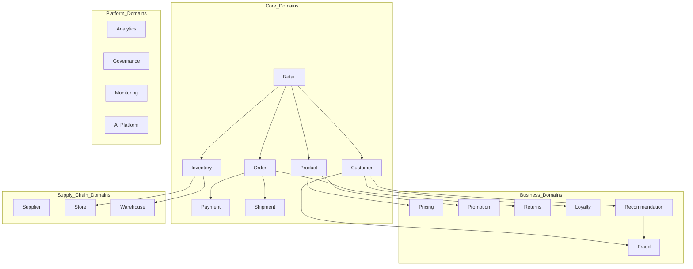

## 2.2 Domain Specifications

### Retail Domain

| Attribute | Description |
|-----------|-------------|
| **Purpose** | Core retail transaction processing and business orchestration |
| **Responsibilities** | Transaction processing, Business rule enforcement, Cross-domain coordination |
| **Owned Data** | Transactions, Sessions, Carts, Checkout |
| **Owned Events** | `TransactionCompleted`, `SessionStarted`, `CartAbandoned` |
| **Consumers** | Customer, Order, Payment, Analytics |
| **Dependencies** | Customer, Product, Inventory, Payment |

### Customer Domain

| Attribute | Description |
|-----------|-------------|
| **Purpose** | Customer identity, profile, and relationship management |
| **Responsibilities** | Identity resolution, Profile management, Segmentation |
| **Owned Data** | Customer profiles, Identities, Segments, Preferences |
| **Owned Events** | `CustomerCreated`, `ProfileUpdated`, `SegmentChanged` |
| **Consumers** | Order, Loyalty, Recommendation, Analytics |
| **Dependencies** | Retail, Analytics |

### Product Domain

| Attribute | Description |
|-----------|-------------|
| **Purpose** | Product catalog and information management |
| **Responsibilities** | Product information, Categories, Attributes, Hierarchy |
| **Owned Data** | Products, Categories, Attributes, Hierarchies |
| **Owned Events** | `ProductCreated`, `ProductUpdated`, `PricingChanged` |
| **Consumers** | Inventory, Order, Recommendation, Promotion |
| **Dependencies** | None (foundational) |

### Inventory Domain

| Attribute | Description |
|-----------|-------------|
| **Purpose** | Stock management and allocation across channels |
| **Responsibilities** | Stock tracking, Allocation, Reservation, Replenishment |
| **Owned Data** | Inventory levels, Reservations, Allocations |
| **Owned Events** | `StockUpdated`, `ReservationCreated`, `ReplenishmentTriggered` |
| **Consumers** | Order, Fulfillment, Warehouse, Analytics |
| **Dependencies** | Product, Warehouse, Store |

### Pricing Domain

| Attribute | Description |
|-----------|-------------|
| **Purpose** | Pricing strategy and price calculation |
| **Responsibilities** | Price determination, Discounts, Price rules |
| **Owned Data** | Prices, Price rules, Discounts |
| **Owned Events** | `PriceCalculated`, `DiscountApplied` |
| **Consumers** | Order, Promotion, Recommendation |
| **Dependencies** | Product, Promotion |

### Promotion Domain

| Attribute | Description |
|-----------|-------------|
| **Purpose** | Marketing campaigns and promotional offers |
| **Responsibilities** | Campaign management, Offer delivery, Tracking |
| **Owned Data** | Promotions, Campaigns, Offers, Coupons |
| **Owned Events** | `PromotionActivated`, `OfferRedeemed`, `CampaignCompleted` |
| **Consumers** | Order, Customer, Analytics |
| **Dependencies** | Pricing, Customer |

### Order Domain

| Attribute | Description |
|-----------|-------------|
| **Purpose** | Order lifecycle management |
| **Responsibilities** | Order creation, Modification, Cancellation, Tracking |
| **Owned Data** | Orders, Order items, Order status |
| **Owned Events** | `OrderCreated`, `OrderModified`, `OrderCancelled`, `OrderCompleted` |
| **Consumers** | Payment, Fulfillment, Customer, Analytics |
| **Dependencies** | Customer, Product, Inventory, Pricing |

### Payment Domain

| Attribute | Description |
|-----------|-------------|
| **Purpose** | Payment processing and settlement |
| **Responsibilities** | Authorization, Capture, Settlement, Refunds |
| **Owned Data** | Payments, Transactions, Settlements |
| **Owned Events** | `PaymentAuthorized`, `PaymentCaptured`, `PaymentFailed`, `RefundProcessed` |
| **Consumers** | Order, Fraud, Analytics |
| **Dependencies** | Order, Fraud |

### Shipment Domain

| Attribute | Description |
|-----------|-------------|
| **Purpose** | Logistics and delivery management |
| **Responsibilities** | Shipment creation, Tracking, Delivery confirmation |
| **Owned Data** | Shipments, Tracking events, Deliveries |
| **Owned Events** | `ShipmentCreated`, `ShipmentInTransit`, `ShipmentDelivered` |
| **Consumers** | Order, Customer, Analytics |
| **Dependencies** | Order, Warehouse, Delivery Provider |

### Returns Domain

| Attribute | Description |
|-----------|-------------|
| **Purpose** | Returns processing and refund management |
| **Responsibilities** | Return authorization, Processing, Refund calculation |
| **Owned Data** | Returns, Refunds, Return reasons |
| **Owned Events** | `ReturnRequested`, `ReturnApproved`, `RefundIssued` |
| **Consumers** | Order, Inventory, Customer, Analytics |
| **Dependencies** | Order, Payment, Inventory |

### Loyalty Domain

| Attribute | Description |
|-----------|-------------|
| **Purpose** | Rewards and loyalty program management |
| **Responsibilities** | Points management, Rewards redemption, Tier management |
| **Owned Data** | Loyalty accounts, Points, Rewards, Tiers |
| **Owned Events** | `PointsEarned`, `PointsRedeemed`, `TierChanged` |
| **Consumers** | Order, Customer, Analytics |
| **Dependencies** | Customer, Order |

### Recommendation Domain

| Attribute | Description |
|-----------|-------------|
| **Purpose** | Personalization and product recommendations |
| **Responsibilities** | Recommendation generation, Personalization, A/B testing |
| **Owned Data** | Recommendations, User preferences, Model outputs |
| **Owned Events** | `RecommendationGenerated`, `RecommendationClicked` |
| **Consumers** | Customer, Analytics, AI |
| **Dependencies** | Customer, Product, Order |

### Fraud Domain

| Attribute | Description |
|-----------|-------------|
| **Purpose** | Fraud detection and prevention |
| **Responsibilities** | Risk scoring, Fraud detection, Alert management |
| **Owned Data** | Fraud alerts, Risk scores, Blacklists |
| **Owned Events** | `FraudAlertRaised`, `TransactionFlagged`, `FraudConfirmed` |
| **Consumers** | Payment, Order, Risk Management |
| **Dependencies** | Order, Payment, Customer, AI |

### Supplier Domain

| Attribute | Description |
|-----------|-------------|
| **Purpose** | Supplier relationships and procurement |
| **Responsibilities** | Supplier management, Purchase orders, Delivery scheduling |
| **Owned Data** | Suppliers, Purchase orders, Contracts |
| **Owned Events** | `PurchaseOrderCreated`, `ShipmentReceived`, `InvoiceReceived` |
| **Consumers** | Inventory, Warehouse, Finance |
| **Dependencies** | Inventory |

### Store Domain

| Attribute | Description |
|-----------|-------------|
| **Purpose** | Physical store operations |
| **Responsibilities** | Store management, POS operations, Staff management |
| **Owned Data** | Stores, POS transactions, Staff |
| **Owned Events** | `StoreOpened`, `SaleCompleted`, `ShiftChanged` |
| **Consumers** | Inventory, Order, Analytics |
| **Dependencies** | Inventory, Customer |

### Warehouse Domain

| Attribute | Description |
|-----------|-------------|
| **Purpose** | Distribution center operations |
| **Responsibilities** | Receiving, Storage, Picking, Packing |
| **Owned Data** | Warehouse inventory, Work orders, Equipment |
| **Owned Events** | `GoodsReceived`, `ItemPicked`, `OrderPacked` |
| **Consumers** | Inventory, Shipment, Analytics |
| **Dependencies** | Inventory, Supplier |

### Analytics Domain

| Attribute | Description |
|-----------|-------------|
| **Purpose** | Business intelligence and reporting |
| **Responsibilities** | Report generation, Dashboard management, Ad-hoc analysis |
| **Owned Data** | Aggregations, Metrics, Reports |
| **Owned Events** | `ReportGenerated`, `DashboardUpdated` |
| **Consumers** | Executive, Business users |
| **Dependencies** | All domains |

### Governance Domain

| Attribute | Description |
|-----------|-------------|
| **Purpose** | Data governance and compliance |
| **Responsibilities** | Policy enforcement, Quality monitoring, Lineage tracking |
| **Owned Data** | Policies, Quality rules, Lineage graphs |
| **Owned Events** | `PolicyViolated`, `QualityIssueDetected` |
| **Consumers** | All domains |
| **Dependencies** | All domains |

---

# Phase 3: Bounded Context Design

## 3.1 Bounded Context Map

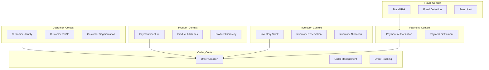

## 3.2 Order Bounded Context

| Element | Description |
|---------|-------------|
| **Responsibilities** | Order lifecycle management from creation to completion |
| **Commands** | CreateOrder, ModifyOrder, CancelOrder, CompleteOrder |
| **Events** | OrderCreated, OrderModified, OrderCancelled, OrderCompleted |
| **Aggregates** | Order (root), OrderLineItem |
| **Entities** | Order, OrderLineItem, OrderAddress, OrderPayment |
| **Value Objects** | Money, Address, OrderStatus, Quantity |
| **Repositories** | OrderRepository |
| **Services** | OrderService, OrderValidationService |
| **APIs** | OrderCommandAPI, OrderQueryAPI |
| **Ownership** | Order Domain Team |

## 3.3 Payment Bounded Context

| Element | Description |
|---------|-------------|
| **Responsibilities** | Payment processing, authorization, capture, and settlement |
| **Commands** | AuthorizePayment, CapturePayment, RefundPayment, SettlePayment |
| **Events** | PaymentAuthorized, PaymentCaptured, PaymentFailed, RefundProcessed |
| **Aggregates** | Payment (root), PaymentTransaction |
| **Entities** | Payment, Transaction, Refund |
| **Value Objects** | Amount, Currency, PaymentMethod, PaymentStatus |
| **Repositories** | PaymentRepository |
| **Services** | PaymentGatewayService, FraudCheckService |
| **APIs** | PaymentCommandAPI, PaymentQueryAPI |
| **Ownership** | Payment Domain Team |

## 3.4 Inventory Bounded Context

| Element | Description |
|---------|-------------|
| **Responsibilities** | Stock management, reservation, and allocation |
| **Commands** | ReserveStock, ReleaseStock, AdjustStock, TransferStock |
| **Events** | StockReserved, StockReleased, StockAdjusted, StockTransferred |
| **Aggregates** | Inventory (root), StockLevel |
| **Entities** | InventoryItem, StockLocation, Reservation |
| **Value Objects** | Quantity, StockStatus, Location |
| **Repositories** | InventoryRepository, ReservationRepository |
| **Services** | AllocationService, ReplenishmentService |
| **APIs** | InventoryCommandAPI, InventoryQueryAPI |
| **Ownership** | Inventory Domain Team |

## 3.5 Customer Bounded Context

| Element | Description |
|---------|-------------|
| **Responsibilities** | Customer identity resolution, profile management |
| **Commands** | CreateCustomer, UpdateProfile, MergeIdentity, SegmentCustomer |
| **Events** | CustomerCreated, ProfileUpdated, IdentityMerged, SegmentChanged |
| **Aggregates** | Customer (root), Identity |
| **Entities** | Customer, Identity, Address, Contact |
| **Value Objects** | CustomerType, Segment, Preference |
| **Repositories** | CustomerRepository, IdentityRepository |
| **Services** | IdentityResolutionService, SegmentationService |
| **APIs** | CustomerCommandAPI, CustomerQueryAPI |
| **Ownership** | Customer Domain Team |

## 3.6 Fraud Detection Bounded Context

| Element | Description |
|---------|-------------|
| **Responsibilities** | Real-time fraud detection and risk assessment |
| **Commands** | EvaluateTransaction, ConfirmFraud, DismissAlert |
| **Events** | FraudAlertRaised, TransactionFlagged, FraudConfirmed |
| **Aggregates** | FraudCase (root), RiskAssessment |
| **Entities** | FraudAlert, RiskScore, BlacklistEntry |
| **Value Objects** | RiskLevel, FraudType, AlertStatus |
| **Repositories** | FraudAlertRepository, BlacklistRepository |
| **Services** | ScoringService, DetectionService |
| **APIs** | FraudQueryAPI, FraudAlertAPI |
| **Ownership** | Fraud Domain Team |

---

# Phase 4: Source System Architecture

## 4.1 Source Systems Overview

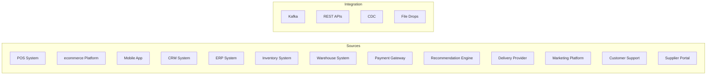

## 4.2 Source System Specifications

### POS (Point of Sale) System

| Attribute | Description |
|-----------|-------------|
| **Data Generated** | Sales transactions, Tender details, Employee transactions, End-of-day reports |
| **Frequency** | Real-time per transaction |
| **Volume** | ~50,000 transactions/day |
| **Integration Method** | Kafka Connect CDC with Debezium |
| **Ownership** | Store Operations |
| **Latency** | <1 second |

### Ecommerce Platform

| Attribute | Description |
|-----------|-------------|
| **Data Generated** | Orders, Cart events, Page views, Search queries, Customer sessions |
| **Frequency** | Real-time per action |
| **Volume** | ~500,000 events/day |
| **Integration Method** | Kafka Connect with custom producer |
| **Ownership** | Digital Commerce |
| **Latency** | <500ms |

### Mobile App

| Attribute | Description |
|-----------|-------------|
| **Data Generated** | App events, Location data, Push notification responses, In-app purchases |
| **Frequency** | Real-time per action |
| **Volume** | ~1,000,000 events/day |
| **Integration Method** | Kafka producer SDK |
| **Ownership** | Mobile Team |
| **Latency** | <500ms |

### CRM System

| Attribute | Description |
|-----------|-------------|
| **Data Generated** | Customer interactions, Support tickets, Email campaigns |
| **Frequency** | Near real-time |
| **Volume** | ~100,000 records/day |
| **Integration Method** | REST API polling + webhooks |
| **Ownership** | Customer Experience |
| **Latency** | <5 minutes |

### ERP System

| Attribute | Description |
|-----------|-------------|
| **Data Generated** | Purchase orders, Invoices, GL entries, Inventory adjustments |
| **Frequency** | Batch + real-time |
| **Volume** | ~500,000 records/day |
| **Integration Method** | REST API + file transfers |
| **Ownership** | Finance |
| **Latency** | <15 minutes |

### Payment Gateway

| Attribute | Description |
|-----------|-------------|
| **Data Generated** | Authorization requests, Settlement data, Chargebacks |
| **Frequency** | Real-time per transaction |
| **Volume** | ~100,000 transactions/day |
| **Integration Method** | Kafka Connect + webhook |
| **Ownership** | Payments |
| **Latency** | <100ms |

### Inventory System

| Attribute | Description |
|-----------|-------------|
| **Data Generated** | Stock levels, Stock movements, Reorder points |
| **Frequency** | Real-time |
| **Volume** | ~1,000,000 updates/day |
| **Integration Method** | Kafka Connect CDC |
| **Ownership** | Supply Chain |
| **Latency** | <1 second |

### Recommendation Engine

| Attribute | Description |
|-----------|-------------|
| **Data Generated** | Model outputs, Recommendation requests, Click-through data |
| **Frequency** | Real-time + batch |
| **Volume** | ~10,000,000 predictions/day |
| **Integration Method** | Kafka producer + REST API |
| **Ownership** | AI Platform |
| **Latency** | <100ms |

### Delivery Provider

| Attribute | Description |
|-----------|-------------|
| **Data Generated** | Tracking events, Delivery status, Proof of delivery |
| **Frequency** | Real-time per status change |
| **Volume** | ~200,000 events/day |
| **Integration Method** | Webhook + SFTP |
| **Ownership** | Logistics |
| **Latency** | <30 seconds |

---

# Phase 5: Event Architecture

## 5.1 Event Design Principles

1. **Immutable Events:** Events cannot be modified once published
2. **Event Sourcing:** State changes captured as events
3. **Backward Compatibility:** New versions must be compatible with old consumers
4. **Semantic Versioning:** Major.Minor.Patch format for event schemas
5. **Retention Policy:** Raw events retained for 7 years for compliance

## 5.2 Core Event Catalog

### Order Events

| Event | Producer | Consumers | Schema |
|-------|----------|-----------|--------|
| `OrderCreated` | Order Service | Payment, Inventory, Fraud, Analytics | [Schema](#order-created) |
| `OrderModified` | Order Service | Payment, Inventory, Analytics | [Schema](#order-modified) |
| `OrderCancelled` | Order Service | Payment, Inventory, Loyalty, Analytics | [Schema](#order-cancelled) |
| `OrderCompleted` | Order Service | Analytics, Loyalty, Customer | [Schema](#order-completed) |

### Payment Events

| Event | Producer | Consumers | Schema |
|-------|----------|-----------|--------|
| `PaymentAuthorized` | Payment Service | Order, Fraud, Analytics | [Schema](#payment-authorized) |
| `PaymentCaptured` | Payment Service | Order, Analytics | [Schema](#payment-captured) |
| `PaymentFailed` | Payment Service | Order, Fraud, Analytics | [Schema](#payment-failed) |
| `RefundProcessed` | Payment Service | Order, Inventory, Analytics | [Schema](#refund-processed) |

### Inventory Events

| Event | Producer | Consumers | Schema |
|-------|----------|-----------|--------|
| `StockUpdated` | Inventory Service | Order, Store, Warehouse, Analytics | [Schema](#stock-updated) |
| `ReservationCreated` | Inventory Service | Order, Analytics | [Schema](#reservation-created) |
| `ReservationReleased` | Inventory Service | Order, Analytics | [Schema](#reservation-released) |
| `ReplenishmentTriggered` | Inventory Service | Warehouse, Supplier, Analytics | [Schema](#replenishment-triggered) |

### Customer Events

| Event | Producer | Consumers | Schema |
|-------|----------|-----------|--------|
| `CustomerCreated` | Customer Service | Order, Loyalty, Analytics | [Schema](#customer-created) |
| `ProfileUpdated` | Customer Service | Recommendation, Analytics | [Schema](#profile-updated) |
| `SegmentChanged` | Customer Service | Marketing, Recommendation | [Schema](#segment-changed) |

### Fraud Events

| Event | Producer | Consumers | Schema |
|-------|----------|-----------|--------|
| `FraudAlertRaised` | Fraud Service | Payment, Order, Risk | [Schema](#fraud-alert-raised) |
| `TransactionFlagged` | Fraud Service | Payment, Analytics | [Schema](#transaction-flagged) |
| `FraudConfirmed` | Fraud Service | Payment, Analytics | [Schema](#fraud-confirmed) |

## 5.3 Event Schema Examples

### OrderCreated Event

```json
{
  "eventId": "uuid-v4",
  "eventType": "OrderCreated",
  "eventVersion": "1.0.0",
  "timestamp": "2026-07-01T12:00:00Z",
  "source": "order-service",
  "correlationId": "uuid-v4",
  "data": {
    "orderId": "ORD-12345",
    "customerId": "CUST-67890",
    "orderType": "ECOMMERCE",
    "status": "PENDING",
    "currency": "USD",
    "totalAmount": 199.99,
    "items": [
      {
        "lineItemId": "LI-001",
        "productId": "PROD-123",
        "quantity": 2,
        "unitPrice": 99.99
      }
    ],
    "shippingAddress": {
      "street": "123 Main St",
      "city": "Seattle",
      "state": "WA",
      "zipCode": "98101",
      "country": "US"
    },
    "createdAt": "2026-07-01T12:00:00Z"
  }
}
```

## 5.4 Event Lifecycle

```
Event Produced → Kafka → Consumer Processing → Dead Letter Queue (if failed)
                    ↓
              State Stores
                    ↓
              Iceberg Tables
                    ↓
              Analytics
```

## 5.5 Event Processing Guarantees

| Requirement | Strategy |
|-------------|----------|
| **Ordering** | Partition by orderId for order events |
| **Exactly Once** | Idempotent producers + deduplication at consumers |
| **Retry** | Exponential backoff with max 3 retries |
| **DLQ** | Separate Kafka topic with failed events |
| **Versioning** | Schema Registry with Avro serialization |

---

# Phase 6: Streaming Architecture

## 6.1 Kafka Cluster Topology

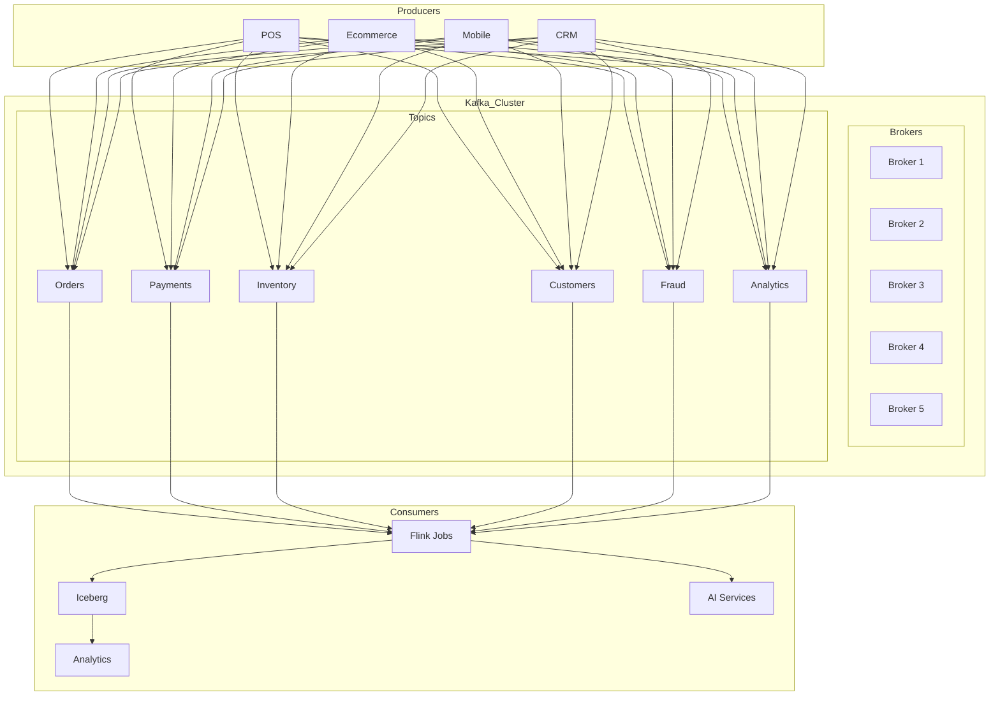

## 6.2 Topic Design

| Topic Name | Partitions | Replication | Retention | Key |
|------------|------------|-------------|-----------|-----|
| `retail.orders` | 12 | 3 | 7 days | orderId |
| `retail.payments` | 12 | 3 | 7 days | paymentId |
| `retail.inventory` | 12 | 3 | 7 days | productId |
| `retail.customers` | 6 | 3 | 30 days | customerId |
| `retail.fraud` | 6 | 3 | 30 days | transactionId |
| `retail.shipments` | 12 | 3 | 7 days | shipmentId |
| `retail.analytics` | 6 | 3 | 90 days | customerId |
| `retail.dlq` | 6 | 3 | 90 days | originalTopic |

## 6.3 Flink Processing Topology

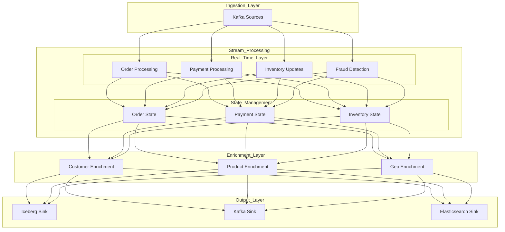

## 6.4 Flink Job Specifications

| Job Name | Input Topics | Output | Processing Mode | Parallelism |
|----------|--------------|--------|-----------------|-------------|
| `order-processing` | retail.orders | Iceberg + Kafka | Event Time | 8 |
| `payment-processing` | retail.payments | Iceberg + Alerts | Event Time | 8 |
| `inventory-sync` | retail.inventory | Iceberg | Processing Time | 4 |
| `fraud-detection` | retail.payments + retail.orders | Kafka + Alerts | Event Time | 12 |
| `customer-enrichment` | retail.customers + retail.orders | Iceberg | Event Time | 4 |
| `analytics-aggregation` | All domains | Iceberg | Event Time | 4 |

## 6.5 State Management

| State Backend | Use Case | Checkpoint Interval |
|---------------|----------|---------------------|
| RocksDB | Order state, Payment state | 30 seconds |
| RocksDB | Inventory state | 60 seconds |
| In-Memory | Fraud scoring | N/A |

## 6.6 Watermark Strategy

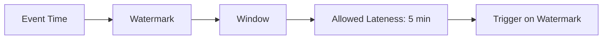

- **Watermark Type:** Periodic with 10-second emission
- **Allowed Lateness:** 5 minutes for most jobs, 1 hour for fraud detection
- **Window Type:** Sliding windows for aggregations, Session windows for user behavior

---

# Phase 7: Data Architecture

## 7.1 Data Flow Architecture

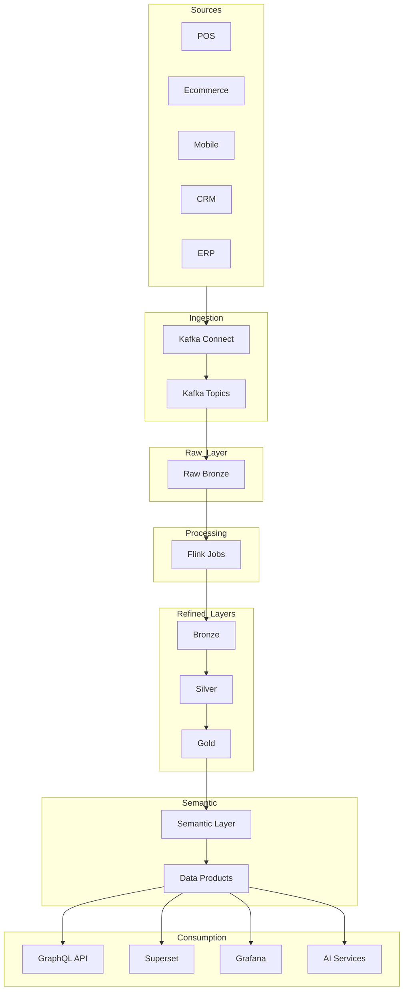

## 7.2 Layer Specifications

### Raw Layer (Bronze)

| Attribute | Description |
|-----------|-------------|
| **Purpose** | Capture all source data exactly as received |
| **Format** | JSON, Avro |
| **Storage** | MinIO S3 bucket: `raw-zone` |
| **Retention** | 90 days |
| **Access** | Data engineering team only |
| **Schema** | Enforced via Schema Registry |

### Bronze Layer

| Attribute | Description |
|-----------|-------------|
| **Purpose** | Cleansed and validated source data |
| **Format** | Iceberg Parquet |
| **Storage** | MinIO S3 bucket: `bronze-zone` |
| **Retention** | 1 year |
| **Access** | Data engineering + analysts |
| **Schema** | Enforced via Iceberg schema |

### Silver Layer

| Attribute | Description |
|-----------|-------------|
| **Purpose** | Business-ready data with conformed dimensions |
| **Format** | Iceberg Parquet |
| **Storage** | MinIO S3 bucket: `silver-zone` |
| **Retention** | 3 years |
| **Access** | All authenticated users |
| **Schema** | Enforced, slowly changing dimensions |

### Gold Layer

| Attribute | Description |
|-----------|-------------|
| **Purpose** | Pre-aggregated data products for analytics |
| **Format** | Iceberg Parquet |
| **Storage** | MinIO S3 bucket: `gold-zone` |
| **Retention** | 5 years |
| **Access** | All authenticated users |
| **Schema** | Enforced, partitioned by time |

### Semantic Layer

| Attribute | Description |
|-----------|-------------|
| **Purpose** | Business-friendly abstraction over physical tables |
| **Implementation** | Trino with LDAP authentication |
| **Access** | Via GraphQL API and direct SQL |
| **Caching** | Live at query level |

### AI Layer

| Attribute | Description |
|-----------|-------------|
| **Purpose** | ML model serving and feature store |
| **Components** | Feature store, Model registry, Inference API |
| **Storage** | Redis for features, MinIO for models |

---

# Phase 8: Lakehouse Architecture (Iceberg)

## 8.1 Iceberg Catalog Design

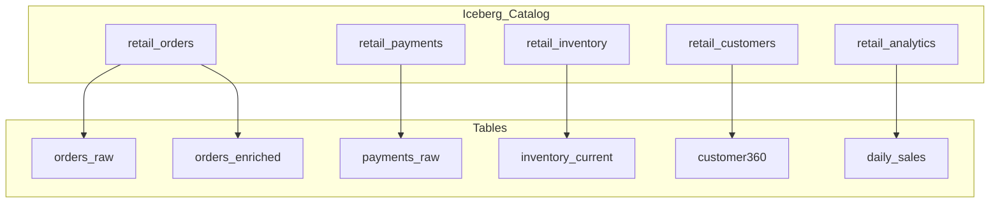

## 8.2 Catalog Structure

| Namespace | Owner | Description |
|-----------|-------|-------------|
| `retail_orders` | Order Team | All order-related tables |
| `retail_payments` | Payment Team | All payment-related tables |
| `retail_inventory` | Inventory Team | All inventory tables |
| `retail_customers` | Customer Team | Customer 360 tables |
| `retail_analytics` | Analytics Team | Aggregated analytics tables |

## 8.3 Table Specifications

### orders_enriched Table

```sql
CREATE TABLE retail_orders.orders_enriched (
    order_id STRING,
    customer_id STRING,
    customer_name STRING,
    customer_segment STRING,
    order_timestamp TIMESTAMP,
    order_status STRING,
    product_id STRING,
    product_name STRING,
    category STRING,
    quantity INT,
    unit_price DECIMAL(10,2),
    total_amount DECIMAL(10,2),
    shipping_address STRING,
    store_id STRING,
    channel STRING,
    payment_method STRING,
    is_fraudulent BOOLEAN,
    event_time TIMESTAMP,
    processing_time TIMESTAMP
)
PARTITIONED BY (days(order_timestamp), channel)
TBLPROPERTIES (
    'write.format.default' = 'parquet',
    'write.parquet.compression-codec' = 'zstd',
    'history.expire.max-snapshot-age-ms' = '2592000000'
);
```

## 8.4 Partition Strategy

| Table Type | Partition Strategy | Reason |
|------------|-------------------|--------|
| Transaction tables | Temporal + Entity | Time-series queries, entity lookups |
| Master data | Entity + Version | Quick entity lookups, audit trail |
| Aggregations | Temporal + Geography | Reporting flexibility |
| Slowly changing | Effective date | Historical tracking |

## 8.5 Time Travel & Rollback

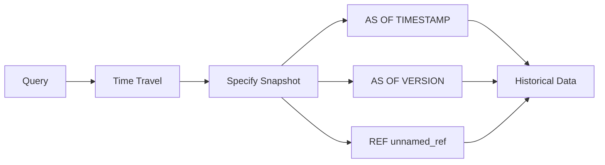

- **Time Travel Retention:** 90 days
- **Snapshot Expiry:** 30 days
- **Rollback Capability:** Yes, via timestamp or version

## 8.6 Optimization & Compaction

| Operation | Frequency | Strategy |
|-----------|-----------|----------|
| Compaction | Every 4 hours | Rewrite small files, target 256MB |
| Bin-packing | Every 2 hours | Optimize partition layout |
| Retention | Daily | Delete files older than retention |
| Partition Evolution | As needed | Add new partition columns |

---

# Phase 9: Data Product Architecture

## 9.1 Data Product Overview

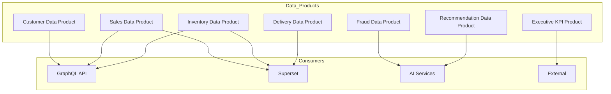

## 9.2 Data Product Specifications

### Customer Data Product

| Attribute | Description |
|-----------|-------------|
| **Owner** | Customer Platform Team |
| **Consumers** | Marketing, Sales, Support, AI |
| **Business Value** | Unified customer view enabling personalization |
| **KPIs** | Profile completeness %, Identity resolution rate |
| **Input** | CRM, Ecommerce, POS, Mobile events |
| **Output** | Customer 360 view, Segments, Preferences |
| **Quality** | 99.9% accuracy, <1% missing data |
| **SLA** | 99.5% availability, <5min refresh |
| **SLO** | Real-time for critical fields, hourly for attributes |
| **Governance** | PII classification, GDPR compliance |

### Sales Data Product

| Attribute | Description |
|-----------|-------------|
| **Owner** | Sales Analytics Team |
| **Consumers** | Executive, Finance, Marketing, Operations |
| **Business Value** | Revenue visibility across all channels |
| **KPIs** | Revenue accuracy, Order completion rate |
| **Input** | Orders, Payments, Returns, Promotions |
| **Output** | Sales metrics, Revenue breakdowns, Trends |
| **Quality** | 99.95% accuracy |
| **SLA** | 99.9% availability, <1min latency |
| **SLO** | Real-time sales dashboards |
| **Governance** | Financial data classification |

### Inventory Data Product

| Attribute | Description |
|-----------|-------------|
| **Owner** | Supply Chain Team |
| **Consumers** | Operations, Stores, Warehouse, Finance |
| **Business Value** | Optimal stock levels, reduced stockouts |
| **KPIs** | Inventory accuracy, Stockout rate |
| **Input** | POS, Warehouse, Ecommerce, Suppliers |
| **Output** | Stock levels, Replenishment alerts, Forecasts |
| **Quality** | 99.5% accuracy |
| **SLA** | 99.9% availability, <30s latency |
| **SLO** | Near real-time stock visibility |
| **Governance** | Supply chain data classification |

### Fraud Data Product

| Attribute | Description |
|-----------|-------------|
| **Owner** | Risk Management Team |
| **Consumers** | Payment, Order, External auditors |
| **Business Value** | Reduced fraud losses, Faster approvals |
| **KPIs** | Fraud detection rate, False positive rate |
| **Input** | Payments, Orders, Customer history |
| **Output** | Risk scores, Fraud alerts, Blacklists |
| **Quality** | 95% detection, <5% false positives |
| **SLA** | 99.99% availability, <100ms latency |
| **SLO** | Real-time scoring |
| **Governance** | Risk data classification, Audit trail |

### Executive KPI Data Product

| Attribute | Description |
|-----------|-------------|
| **Owner** | Analytics Platform Team |
| **Consumers** | C-Suite, VP Level, Board |
| **Business Value** | Strategic decision support |
| **KPIs** | Dashboard load time, Data freshness |
| **Input** | All domain data products |
| **Output** | KPI dashboards, Executive reports |
| **Quality** | 100% accuracy for reported numbers |
| **SLA** | 99.9% availability, <5s dashboard load |
| **SLO** | <5 minute data refresh cycle |
| **Governance** | Executive data classification |

---

# Phase 10: Semantic Layer

## 10.1 Semantic Model Structure

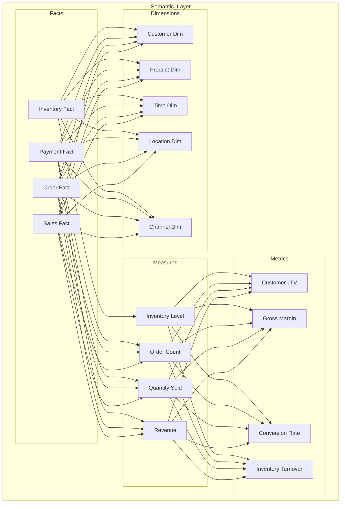

## 10.2 Core Dimensions

### Time Dimension

| Attribute | Type | Description |
|-----------|------|-------------|
| time_key | BIGINT | Surrogate key |
| date | DATE | Calendar date |
| day_of_week | INT | 1-7 |
| week_of_year | INT | 1-52 |
| month | INT | 1-12 |
| quarter | INT | 1-4 |
| year | INT | YYYY |
| fiscal_period | STRING | FY2026-Q3 |

### Customer Dimension

| Attribute | Type | Description |
|-----------|------|-------------|
| customer_key | BIGINT | Surrogate key |
| customer_id | STRING | Natural key |
| customer_name | STRING | Full name |
| email | STRING | Email address |
| phone | STRING | Phone number |
| segment | STRING | Customer segment |
| tier | STRING | Loyalty tier |
| lifetime_value | DECIMAL | CLV calculation |
| acquisition_date | DATE | First purchase |

### Product Dimension

| Attribute | Type | Description |
|-----------|------|-------------|
| product_key | BIGINT | Surrogate key |
| product_id | STRING | Natural key |
| product_name | STRING | Product name |
| category | STRING | Category hierarchy |
| subcategory | STRING | Subcategory |
| brand | STRING | Brand name |
| price | DECIMAL | Current price |
| cost | DECIMAL | Product cost |

## 10.3 Core Facts

### Sales Fact

| Attribute | Type | Description |
|-----------|------|-------------|
| sales_key | BIGINT | Surrogate key |
| order_key | BIGINT | FK to Order |
| customer_key | BIGINT | FK to Customer |
| product_key | BIGINT | FK to Product |
| time_key | BIGINT | FK to Time |
| location_key | BIGINT | FK to Location |
| channel_key | BIGINT | FK to Channel |
| quantity | INT | Units sold |
| unit_price | DECIMAL | Price per unit |
| discount | DECIMAL | Discount amount |
| revenue | DECIMAL | Revenue (quantity * price - discount) |
| cost | DECIMAL | Cost of goods |
| margin | DECIMAL | Revenue - cost |

## 10.4 Business Metrics

| Metric | Formula | Category |
|--------|---------|----------|
| Gross Margin | (Revenue - Cost) / Revenue | Financial |
| Customer LTV | Total Revenue per Customer | Customer |
| Conversion Rate | Orders / Sessions | Sales |
| Average Order Value | Revenue / Orders | Sales |
| Inventory Turnover | COGS / Average Inventory | Inventory |
| Customer Acquisition Cost | Marketing Spend / New Customers | Customer |
| Net Promoter Score | (Promoters - Detractors) / Total | Customer |
| Order Fill Rate | Filled Orders / Orders Placed | Fulfillment |

## 10.5 Business Glossary

| Term | Definition | Domain |
|------|------------|--------|
| Revenue | Total sales value before returns | Finance |
| Gross Profit | Revenue minus COGS | Finance |
| Active Customer | Customer with purchase in last 12 months | Customer |
| Order Complete | Order delivered and payment settled | Order |
| Stockout | Product unavailable when demanded | Inventory |
| Fraud Confirmed | Fraudulent transaction verified | Fraud |

---

# Phase 11: API Architecture

## 11.1 API Architecture Overview

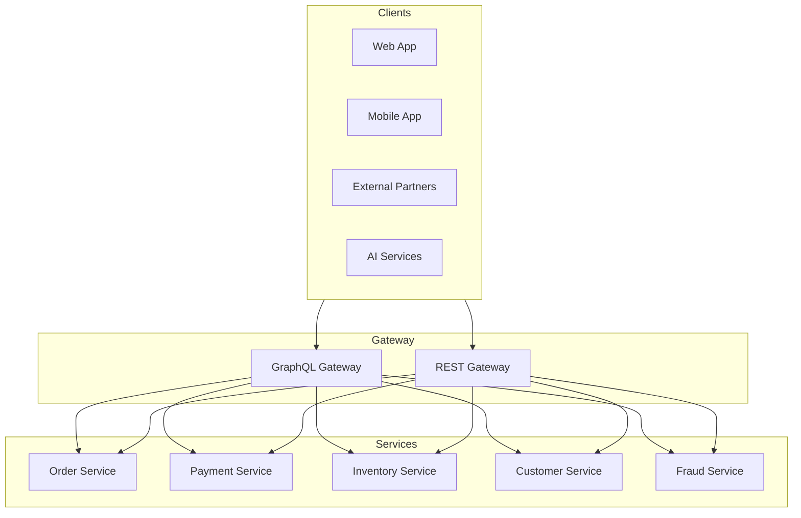

## 11.2 GraphQL Schema Design

```graphql
type Query {
  customer(id: ID!): Customer
  customers(filter: CustomerFilter): CustomerConnection
  order(id: ID!): Order
  orders(filter: OrderFilter): OrderConnection
  product(id: ID!): Product
  products(filter: ProductFilter): ProductConnection
  inventory(productId: ID!, locationId: ID): InventoryLevel
  analytics(filter: AnalyticsFilter!): AnalyticsResult
}

type Mutation {
  createOrder(input: CreateOrderInput!): Order
  updateOrder(id: ID!, input: UpdateOrderInput!): Order
  cancelOrder(id: ID!, reason: String!): CancelResult
  processPayment(input: PaymentInput!): PaymentResult
}

type Subscription {
  orderUpdated(id: ID!): Order
  inventoryChanged(productId: ID!): InventoryUpdate
  fraudAlert(customerId: ID!): FraudAlert
}

type Customer {
  id: ID!
  name: String!
  email: String!
  phone: String
  segment: String!
  tier: String!
  lifetimeValue: Float!
  addresses: [Address!]!
  orders: OrderConnection
  preferences: JSON
  createdAt: DateTime!
  updatedAt: DateTime!
}

type Order {
  id: ID!
  customer: Customer!
  status: OrderStatus!
  items: [OrderItem!]!
  totalAmount: Float!
  currency: String!
  shippingAddress: Address!
  paymentMethod: PaymentMethod!
  createdAt: DateTime!
  updatedAt: DateTime!
}
```

## 11.3 Authentication & Authorization

| Layer | Mechanism | Implementation |
|-------|-----------|----------------|
| API Gateway | OAuth 2.0 + JWT | Access tokens with 1hr expiry |
| Service | RBAC | Role-based permissions per domain |
| Data | Column-level security | PII masking at query level |
| Audit | Full request logging | Correlation ID tracking |

## 11.4 Rate Limiting

| Tier | Requests/Minute | Burst |
|------|-----------------|-------|
| Free | 60 | 10 |
| Standard | 600 | 100 |
| Enterprise | 6000 | 1000 |
| Internal | Unlimited | - |

## 11.5 API Versioning

| API Type | Versioning Strategy | Example |
|----------|--------------------|---------|
| GraphQL | Schema evolution | field deprecation with sunset |
| REST | URL versioning | /v1/, /v2/ |
| Internal | No versioning | Direct service calls |

---

# Phase 12: Application Architecture

## 12.1 Application Portfolio

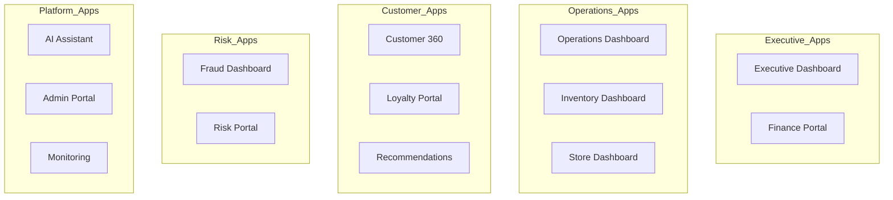

## 12.2 Executive Dashboard

| Attribute | Description |
|-----------|-------------|
| **Purpose** | Real-time executive KPIs and company performance |
| **Users** | C-Suite, VP Level |
| **Pages** | Home, Revenue, Customers, Operations, Trends |
| **Navigation** | Top nav with quick links |
| **Data Sources** | Gold layer via GraphQL |
| **Permissions** | Executive role only |
| **Refresh** | Every 30 seconds |

### Key Metrics Displayed
- Total Revenue (today, MTD, YTD)
- Orders Count and Value
- Customer Acquisition and Retention
- Inventory Status
- Fulfillment Metrics
- Fraud Metrics

## 12.3 Customer 360

| Attribute | Description |
|-----------|-------------|
| **Purpose** | Unified customer view for support and sales |
| **Users** | Support agents, Sales reps, Marketing |
| **Pages** | Overview, Orders, Interactions, Preferences, Segments |
| **Navigation** | Search-based with sidebar |
| **Data Sources** | Customer Data Product via GraphQL |
| **Permissions** | Customer-facing teams |
| **Refresh** | Real-time |

### Features
- Customer profile with 360 view
- Order history with status
- Interaction timeline
- Segmentation display
- Personalization preferences

## 12.4 Fraud Dashboard

| Attribute | Description |
|-----------|-------------|
| **Purpose** | Real-time fraud monitoring and investigation |
| **Users** | Fraud analysts, Risk managers |
| **Pages** | Alerts, Cases, Blacklists, Reports |
| **Navigation** | Left nav with filters |
| **Data Sources** | Fraud Data Product + Kafka streams |
| **Permissions** | Risk team only |
| **Refresh** | Real-time |

### Features
- Live fraud alert stream
- Case management workflow
- Customer/transaction investigation
- Pattern visualization
- Performance metrics

## 12.5 AI Assistant

| Attribute | Description |
|-----------|-------------|
| **Purpose** | Natural language interface for data and operations |
| **Users** | All authenticated users |
| **Pages** | Chat, History, Saved queries |
| **Navigation** | Floating chat button |
| **Data Sources** | Semantic layer + AI services |
| **Permissions** | Based on user role |
| **Features** | NL to SQL, Dashboard generation, Insights |

---

# Phase 13: Analytics Architecture

## 13.1 Analytics Platform Overview

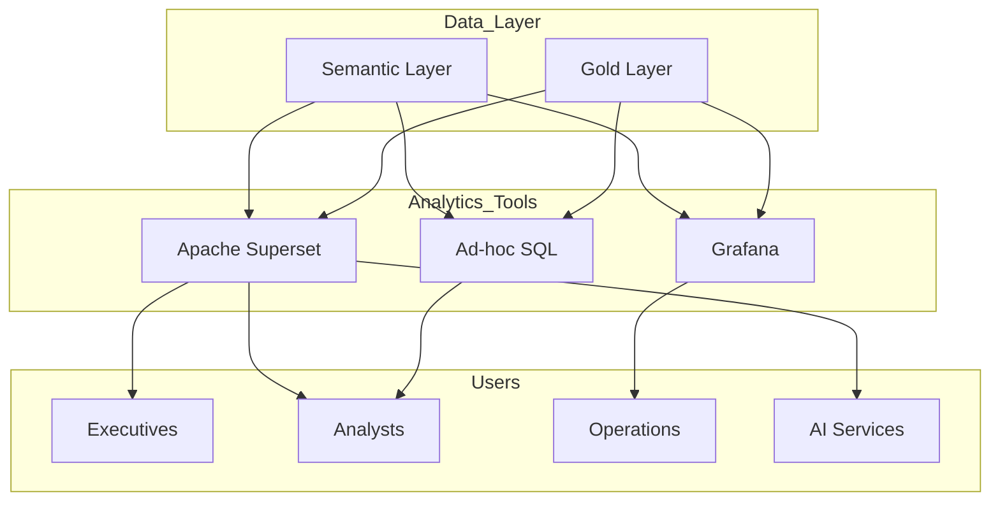

## 13.2 Apache Superset Configuration

| Attribute | Configuration |
|-----------|---------------|
| **Database** | Trino (Iceberg connector) |
| Authentication | OAuth 2.0 with LDAP |
| Cache | Redis with 5-minute TTL |
| Max row limit | 100,000 per query |
| Export | CSV, Excel, JSON |

### Superset Datasets

| Dataset | Source Table | Refresh |
|---------|--------------|---------|
| Daily Sales | retail_analytics.daily_sales | Hourly |
| Customer Metrics | retail_customers.customer_metrics | Daily |
| Inventory Status | retail_inventory.current_levels | Real-time |
| Fraud Metrics | retail_fraud.daily_summary | Daily |

## 13.3 Grafana Configuration

| Attribute | Configuration |
|-----------|---------------|
| **Data Sources** | Prometheus (metrics), Loki (logs), Jaeger (traces) |
| Authentication | OAuth 2.0 |
| Dashboards | JSON provisioning |
| Alert channels | Slack, PagerDuty, Email |

### Grafana Dashboards

| Dashboard | Metrics | Refresh |
|-----------|---------|---------|
| Platform Health | CPU, Memory, Kafka lag, Flink checkpoints | 10 seconds |
| Kafka Overview | Producer rate, Consumer lag, Topic size | 10 seconds |
| Data Quality | Record counts, Error rates, Freshness | 1 minute |
| Business KPIs | Orders, Revenue, Fraud | 30 seconds |

## 13.4 Self-Service Analytics

| Feature | Tool | Access |
|---------|------|--------|
| Ad-hoc SQL | Trino via Superset | Analysts |
| Custom Reports | Superset | Business users |
| Data Export | GraphQL API | All users |
| API Access | REST/GraphQL | Developers |

---

# Phase 14: Governance Architecture

## 14.1 Governance Framework

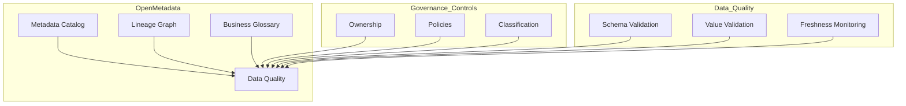

## 14.2 OpenMetadata Integration

| Component | Configuration |
|-----------|---------------|
| **Database** | PostgreSQL for metadata store |
| Elasticsearch | For search indexing |
| Authentication | SSO with LDAP |
| Pipeline | Airflow for metadata ingestion |

### Metadata Ingestion Schedule

| Source | Frequency | Ingestion Method |
|--------|----------|------------------|
| Iceberg Tables | Every 6 hours | Lineage from Flink jobs |
| Kafka Topics | Real-time | Schema Registry integration |
| GraphQL API | Daily | API scanning |
| Dashboards | Daily | Superset integration |

## 14.3 Data Classification

| Classification | Description | Handling |
|----------------|-------------|----------|
| Public | Publicly available | No restrictions |
| Internal | Business internal | Basic access control |
| Confidential | Sensitive business | Encryption required |
| Restricted | PII/Financial | Full governance |
| Highly Restricted | Critical secrets | MFA + audit |

## 14.4 Data Quality Rules

| Rule | Metric | Threshold |
|------|--------|-----------|
| Completeness | Non-null percentage | >99% |
| Accuracy | Valid values | >98% |
| Freshness | Age of data | <24 hours |
| Consistency | Cross-system match | >99% |

---

# Phase 15: Security Architecture

## 15.1 Security Architecture Overview

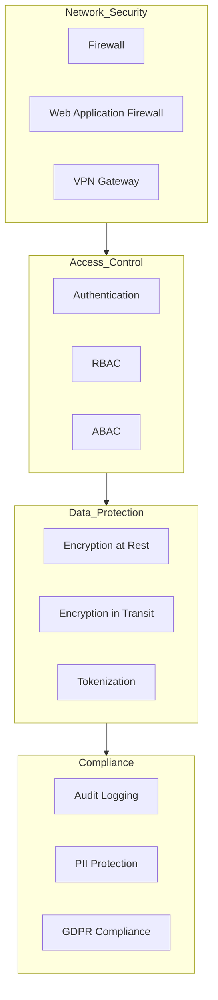

## 15.2 Authentication & Authorization

| Layer | Technology | Configuration |
|-------|------------|---------------|
| SSO | OAuth 2.0 + OIDC | Keycloak with LDAP backend |
| API | JWT tokens | RS256 signed, 1hr expiry |
| Service | mTLS | Certificates from internal CA |
| Database | LDAP | Trino LDAP plugin |

### RBAC Roles

| Role | Permissions |
|------|-------------|
| Admin | Full access |
| Data Engineer | Read/Write all data |
| Analyst | Read all, Write own datasets |
| Business User | Read approved data products |
| Support | Read customer data for account |
| Fraud Analyst | Read fraud data, Write fraud decisions |
| Auditor | Read-only audit logs |

## 15.3 Encryption Strategy

| Data State | Algorithm | Key Management |
|------------|-----------|----------------|
| At Rest (S3) | AES-256 | AWS KMS compatible (MinIO) |
| At Rest (RDBMS) | AES-256 | HashiCorp Vault |
| In Transit | TLS 1.3 | Let's Encrypt / Internal CA |
| PII Fields | AES-256 + Tokenization | Field-level encryption |

## 15.4 Audit & Compliance

| Requirement | Implementation |
|-------------|----------------|
| Audit Logging | All data access logged to immutable store |
| Data Retention | Configurable per data product |
| PII Access | Real-time masking for non-authorized |
| GDPR | Right to delete, Portability, Consent |
| PCI-DSS | Tokenization, Network segmentation |

---

# Phase 16: Observability Architecture

## 16.1 Observability Stack

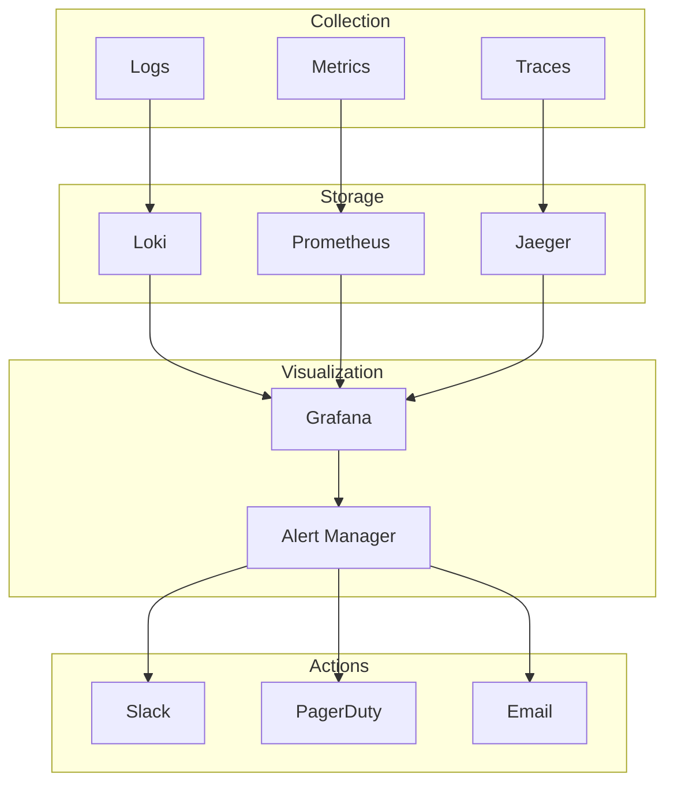

## 16.2 Logging Architecture

| Component | Log Level | Destination |
|-----------|-----------|-------------|
| Kafka | INFO | Loki |
| Flink Jobs | INFO, WARN, ERROR | Loki |
| Trino | INFO | Loki |
| GraphQL API | DEBUG, INFO | Loki |
| Applications | INFO | Loki |
| Infrastructure | WARN, ERROR | Loki |

### Log Format (JSON)

```json
{
  "timestamp": "2026-07-01T12:00:00Z",
  "level": "INFO",
  "service": "order-service",
  "traceId": "abc123",
  "spanId": "def456",
  "message": "Order created",
  "context": {
    "orderId": "ORD-123",
    "customerId": "CUST-456"
  }
}
```

## 16.3 Metrics Collection

| Metric Type | Examples | Scrape Interval |
|-------------|----------|-----------------|
| Platform | CPU, Memory, Disk, Network | 10 seconds |
| Kafka | Producer rate, Consumer lag | 10 seconds |
| Flink | Checkpoint duration, Task health | 10 seconds |
| Trino | Query latency, Active queries | 30 seconds |
| Business | Order count, Revenue | 30 seconds |

## 16.4 Alert Definitions

| Alert | Condition | Severity | Channel |
|-------|-----------|----------|---------|
| Kafka Consumer Lag | lag > 10000 | Warning | Slack |
| Kafka Consumer Lag | lag > 50000 | Critical | PagerDuty |
| Flink Job Down | job not running | Critical | PagerDuty |
| High Error Rate | error rate > 1% | Warning | Slack |
| Data Freshness | age > 1 hour | Warning | Slack |
| Disk Usage | usage > 80% | Warning | Slack |
| Disk Usage | usage > 90% | Critical | PagerDuty |

## 16.5 Platform KPIs

| KPI | Target | Current |
|-----|--------|---------|
| Platform Uptime | 99.9% | - |
| P99 Latency | <200ms | - |
| Data Freshness | <5 min | - |
| Kafka Consumer Lag | <10000 | - |
| Flink Checkpoint Health | >99% | - |
| Query Success Rate | >99.5% | - |

---

# Phase 17: Deployment Architecture

## 17.1 Docker Compose Architecture

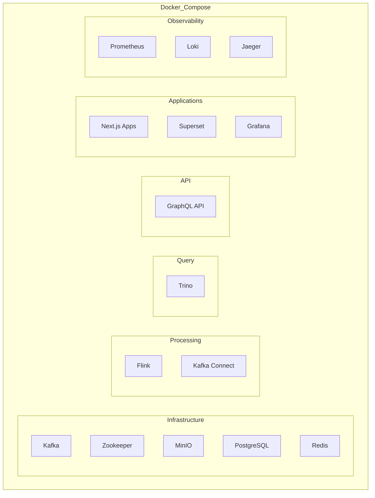

## 17.2 Service Configuration

### Kafka Configuration

```yaml
kafka:
  image: confluentinc/cp-kafka:7.5.0
  environment:
    KAFKA_BROKER_ID: 1
    KAFKA_ZOOKEEPER_CONNECT: zookeeper:2181
    KAFKA_ADVERTISED_LISTENERS: PLAINTEXT://kafka:9092
    KAFKA_OFFSETS_TOPIC_REPLICATION_FACTOR: 1
    KAFKA_TRANSACTION_STATE_LOG_MIN_ISR: 1
    KAFKA_TRANSACTION_STATE_LOG_REPLICATION_FACTOR: 1
  volumes:
    - kafka_data:/var/lib/kafka/data
  resources:
    limits:
      memory: 4G
      cpus: 2
```

### Flink Configuration

```yaml
flink:
  image: flink:1.17
  environment:
    JOB_MANAGER_MEMORY: 1024m
    TASK_MANAGER_MEMORY: 2048m
    parallelism.default: 2
  volumes:
    - flink checkpoints:/opt/flink/checkpoints
```

## 17.3 Network Configuration

```yaml
networks:
  backend:
    driver: bridge
  observability:
    driver: bridge
  public:
    driver: bridge

services:
  kafka:
    networks:
      - backend
  grafana:
    networks:
      - observability
      - public
```

## 17.4 Kubernetes Migration Path

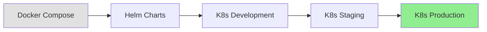

### Migration Considerations

| Component | Docker Compose | Kubernetes |
|-----------|---------------|------------|
| Kafka | Single broker | StatefulSet with 3+ brokers |
| Flink | Single JobManager | High availability JobManager |
| Storage | Local volumes | PersistentVolumeClaims |
| Networking | Host ports | ClusterIP/LoadBalancer |
| Secrets | env files | Kubernetes Secrets |

---

# Phase 18: Project Modularization

## 18.1 Module Structure

```mermaid
flowchart TB
    ROOT[platform/]
    
    ROOT --> CORE[platform-core/]
    ROOT --> STREAM[streaming-platform/]
    ROOT --> EVENTS[event-catalog/]
    ROOT --> GEN[data-generator/]
    ROOT --> FLINK[flink-jobs/]
    ROOT --> LAKE[iceberg/]
    ROOT --> QUERY[trino/]
    ROOT --> API[graphql-api/]
    ROOT --> SEM[semantic-layer/]
    ROOT --> UI[nextjs-ui/]
    ROOT --> SUP[superset/]
    ROOT --> GRF[grafana/]
    ROOT --> META[metadata/]
    ROOT --> SEC[security/]
    ROOT --> SHARED[shared/]
    ROOT --> DOCS[docs/]
    ROOT --> TESTS[tests/]
```

## 18.2 Module Specifications

### platform-core

| Attribute | Description |
|-----------|-------------|
| **Purpose** | Shared infrastructure code, utilities, types |
| **Dependencies** | None |
| **Public Interfaces** | Types, Utilities, Constants |
| **Configuration** | Centralized config loader |
| **Extensions** | New utility functions |

### streaming-platform

| Attribute | Description |
|-----------|-------------|
| **Purpose** | Kafka cluster, topics, schemas |
| **Dependencies** | platform-core, shared |
| **Public Interfaces** | Kafka connection configs, Topic definitions |
| **Configuration** | Kafka broker settings |
| **Extensions** | New topics, new producers |

### event-catalog

| Attribute | Description |
|-----------|-------------|
| **Purpose** | Event definitions, schemas, documentation |
| **Dependencies** | platform-core |
| **Public Interfaces** | Event types, Schema Registry |
| **Configuration** | Avro schemas |
| **Extensions** | New event types |

### flink-jobs

| Attribute | Description |
|-----------|-------------|
| **Purpose** | Stream processing jobs |
| **Dependencies** | platform-core, streaming-platform, event-catalog |
| **Public Interfaces** | Flink job JARs |
| **Configuration** | Job-specific configs |
| **Extensions** | New processing jobs |

### graphql-api

| Attribute | Description |
|-----------|-------------|
| **Purpose** | GraphQL gateway and resolvers |
| **Dependencies** | platform-core, trino, security |
| **Public Interfaces** | GraphQL endpoint |
| **Configuration** | Schema, resolvers, auth |
| **Extensions** | New queries/mutations |

### nextjs-ui

| Attribute | Description |
|-----------|-------------|
| **Purpose** | Next.js application modules |
| **Dependencies** | platform-core, graphql-api |
| **Public Interfaces** | Web application |
| **Configuration** | Environment configs |
| **Extensions** | New dashboards |

## 18.3 Module Dependency Graph

```mermaid
flowchart TB
    SHARED[shared] --> CORE[platform-core]
    SHARED --> STREAM[streaming-platform]
    STREAM --> EVENTS[event-catalog]
    EVENTS --> FLINK[flink-jobs]
    FLINK --> LAKE[iceberg]
    LAKE --> QUERY[trino]
    QUERY --> SEM[semantic-layer]
    SEM --> API[graphql-api]
    API --> UI[nextjs-ui]
    STREAM --> KCONNECT[kafka-connect]
    KCONNECT --> META[metadata]
    CORE --> SEC[security]
    CORE --> TESTS[tests]
```

---

# Phase 19: Architecture Decision Records (ADR)

## ADR-001: Kafka vs Pulsar

### Decision
**Selected:** Apache Kafka

### Context
Need a distributed event streaming platform for real-time data ingestion and processing.

### Comparison

| Criteria | Kafka | Pulsar |
|----------|-------|--------|
| Ecosystem Maturity | Very high | High |
| Performance | Excellent | Excellent |
| Multi-tenancy | Basic | Native |
| Geo-replication | Manual configuration | Built-in |
| Operations | Well-understood | More complex |
| Vendor Support | Multiple | Limited |

### Rationale
- Larger ecosystem and community support
- Extensive tooling (Kafka Connect, KSQL, Flink connector)
- Well-documented operational practices
- Mature Schema Registry integration
- Team has existing Kafka expertise

### Status
**Accepted** - July 2026

---

## ADR-002: Flink vs Spark Streaming

### Decision
**Selected:** Apache Flink

### Context
Need a stream processing engine for real-time event processing with exactly-once semantics.

### Comparison

| Criteria | Flink | Spark Streaming |
|----------|-------|-----------------|
| Processing Model | Native streaming | Micro-batch |
| Latency | Sub-second | Seconds |
| Exactly-once | Native | Limited |
| State Management | RocksDB integrated | Checkpointing |
| Windowing | Flexible | Fixed windows |
| Learning Curve | Steeper | Easier |

### Rationale
- True streaming (not micro-batch)
- Superior exactly-once guarantees
- Native event time processing with watermarks
- Better for complex event processing
- Mature state backend with RocksDB

### Status
**Accepted** - July 2026

---

## ADR-003: Iceberg vs Delta Lake

### Decision
**Selected:** Apache Iceberg

### Context
Need an open-table format for the data lakehouse.

### Comparison

| Criteria | Iceberg | Delta Lake |
|----------|---------|------------|
| Storage Support | S3, HDFS, MinIO, GCS | S3, ADLS, HDFS |
| Trino Support | Native | Via connector |
| Schema Evolution | Full | Limited |
| Time Travel | Native | Limited |
| Partition Evolution | Yes | No |
| ACID commits | Yes | Yes |

### Rationale
- Better Trino integration
- More flexible schema evolution
- Native time travel with full history
- Partition evolution for optimization
- Cloud-agnostic (works with MinIO)

### Status
**Accepted** - July 2026

---

## ADR-004: Trino vs Presto

### Decision
**Selected:** Trino

### Context
Need a distributed SQL query engine for querying Iceberg tables.

### Comparison

| Criteria | Trino | Presto |
|----------|-------|--------|
| Iceberg Support | Native | Via connector |
| Active Development | Very active | Active |
| LDAP Security | Native | Plugin |
| Cost-based Optimizer | Advanced | Basic |
| Ecosystem | Growing | Stable |

### Rationale
- Native Iceberg connector
- More active development
- Better enterprise security features
- Advanced query optimization
- Strong community and support

### Status
**Accepted** - July 2026

---

## ADR-005: GraphQL vs REST

### Decision
**Selected:** GraphQL for API layer, REST for external integrations

### Context
Need an API layer for the Next.js applications.

### Comparison

| Criteria | GraphQL | REST |
|----------|---------|------|
| Flexibility | High | Medium |
| Type Safety | Strong | Weak |
| Over-fetching | None | Common |
| Caching | Complex | Simple |
| Learning Curve | Steeper | Easier |
| Tooling | Growing | Mature |

### Rationale
- Flexible data fetching reduces over-fetching
- Strong typing enables better tooling
- Single endpoint simplifies client code
- Built-in introspection for documentation
- Excellent Next.js integration (Apollo, urql)

### Status
**Accepted** - July 2026

---

## ADR-006: Superset vs Power BI

### Decision
**Selected:** Apache Superset

### Context
Need a business intelligence tool for dashboards and analytics.

### Comparison

| Criteria | Superset | Power BI |
|----------|----------|----------|
| Cost | Open source | License required |
| Data Sources | Many | Microsoft-focused |
| Deployment | Self-hosted | Cloud/Desktop |
| Customization | Full | Limited |
| Embedding | Yes | Limited |
| Enterprise Features | Growing | Mature |

### Rationale
- No licensing costs
- Self-hosted for data security
- Strong visualization capabilities
- Can embed in custom applications
- Good Trino/Grafana integration

### Status
**Accepted** - July 2026

---

## ADR-007: Grafana vs Kibana

### Decision
**Selected:** Grafana

### Context
Need an observability platform for metrics, logs, and traces.

### Comparison

| Criteria | Grafana | Kibana |
|----------|---------|--------|
| Metrics | Excellent | Good |
| Logs | Via Loki | Excellent |
| Traces | Via Jaeger | Good |
| Alerting | Built-in | X-Pack |
| Visualization | Very flexible | Good |
| Ecosystem | Large | Limited |

### Rationale
- Unified platform for metrics, logs, traces
- Excellent alerting capabilities
- Large dashboard community
- Works with multiple data sources
- Better for Prometheus/Loki stack

### Status
**Accepted** - July 2026

---

## ADR-008: MinIO vs AWS S3

### Decision
**Selected:** MinIO (for development/on-prem), AWS S3 (for cloud production)

### Context
Need S3-compatible object storage for the data lakehouse.

### Comparison

| Criteria | MinIO | AWS S3 |
|----------|-------|--------|
| Cost | Open source | Pay per use |
| Deployment | Anywhere | AWS only |
| Performance | Very high | High |
| Operations | Self-managed | Managed |
| Compliance | DIY | Built-in |

### Rationale
- Same API as S3 (easy migration)
- Works for on-prem/cloud deployment
- No vendor lock-in for development
- Can run on any infrastructure
- Easy Kubernetes deployment

### Status
**Accepted** - July 2026

---

## ADR-009: Docker Compose vs Kubernetes

### Decision
**Selected:** Docker Compose for development, Kubernetes for production

### Context
Need container orchestration strategy.

### Comparison

| Criteria | Docker Compose | Kubernetes |
|----------|---------------|-------------|
| Complexity | Low | High |
| Scaling | Manual | Automatic |
| Service Discovery | Basic | Built-in |
| Rolling Updates | Manual | Automated |
| Learning Curve | Easy | Steep |
| Cost | Low | Higher |

### Rationale
- Docker Compose for local development is simpler
- Kubernetes for production offers:
  - Auto-scaling
  - Self-healing
  - Rolling updates
  - Service mesh integration
- Migration path defined via Helm charts

### Status
**Accepted** - July 2026

---

# Phase 20: Implementation Roadmap

## 20.1 Roadmap Overview

```mermaid
gantt
    title Implementation Roadmap
    dateFormat  YYYY-MM
    section Foundation
    Milestone 1: Foundation & Infrastructure    :2026-07: 3m
    Milestone 2: Event Generation               :2026-09: 2m
    section Core Platform
    Milestone 3: Kafka Integration              :2026-10: 2m
    Milestone 4: Flink Processing               :2026-11: 3m
    Milestone 5: Iceberg Lakehouse              :2027-01: 2m
    Milestone 6: Trino Query Layer              :2027-02: 2m
    section Semantic & API
    Milestone 7: Semantic Layer                  :2027-03: 2m
    Milestone 8: GraphQL API                    :2027-04: 2m
    Milestone 9: Next.js UI                    :2027-05: 3m
    section Analytics & Governance
    Milestone 10: Superset Dashboards           :2027-07: 2m
    Milestone 11: Grafana Monitoring            :2027-08: 2m
    Milestone 12: OpenMetadata Integration      :2027-09: 2m
    section Advanced
    Milestone 13: AI Assistant                  :2027-10: 2m
    Milestone 14: Testing & Validation         :2027-11: 2m
    Milestone 15: Production Hardening          :2028-01: 2m
```

## 20.2 Milestone Specifications

### Milestone 1: Foundation & Infrastructure

| Attribute | Details |
|-----------|---------|
| **Objective** | Establish core infrastructure and development environment |
| **Duration** | 3 months (July - September 2026) |
| **Deliverables** | - Project structure created<br>- Docker Compose environment<br>- MinIO cluster deployed<br>- PostgreSQL for metadata<br>- Redis for caching<br>- Network and security configured |
| **Dependencies** | None |
| **Complexity** | Medium |
| **Success Criteria** | All services start successfully, Network connectivity verified |
| **Risks** | Resource constraints for local development |
| **Validation** | Docker Compose up, All services healthy |

### Milestone 2: Event Generation

| Attribute | Details |
|-----------|---------|
| **Objective** | Implement realistic data generators for all source systems |
| **Duration** | 2 months (September - October 2026) |
| **Deliverables** | - POS data generator<br>- Ecommerce event generator<br>- Mobile app event generator<br>- CRM data simulator<br>- Payment gateway simulator<br>- Inventory data generator |
| **Dependencies** | Milestone 1 |
| **Complexity** | Medium |
| **Success Criteria** | Generates realistic test data at scale |
| **Risks** | Data realism may not match production patterns |
| **Validation** | Generated data matches expected schemas |

### Milestone 3: Kafka Integration

| Attribute | Details |
|-----------|---------|
| **Objective** | Deploy Kafka cluster and configure connectors |
| **Duration** | 2 months (October - November 2026) |
| **Deliverables** | - Kafka cluster (5 brokers)<br>- Topic creation and partitioning<br>- Schema Registry deployed<br>- Kafka Connect with Debezium<br>- Producer/consumer configurations |
| **Dependencies** | Milestones 1, 2 |
| **Complexity** | High |
| **Success Criteria** | Events flow from sources to Kafka topics |
| **Risks** | Consumer lag in production loads |
| **Validation** | End-to-end event delivery verified |

### Milestone 4: Flink Processing

| Attribute | Details |
|-----------|---------|
| **Objective** | Implement core stream processing jobs |
| **Duration** | 3 months (November 2026 - January 2027) |
| **Deliverables** | - Order processing job<br>- Payment processing job<br>- Inventory sync job<br>- Customer enrichment job<br>- State management<br>- Checkpointing configured |
| **Dependencies** | Milestone 3 |
| **Complexity** | High |
| **Success Criteria** | Real-time processing with <5s latency |
| **Risks** | State recovery complexity |
| **Validation** | Exactly-once processing verified |

### Milestone 5: Iceberg Lakehouse

| Attribute | Details |
|-----------|---------|
| **Objective** | Implement the Iceberg-based lakehouse |
| **Duration** | 2 months (January - February 2027) |
| **Deliverables** | - Iceberg catalog (Hive Metastore)<br>- Bronze/Silver/Gold tables<br>- Partition strategies defined<br>- Time travel enabled<br>- Compaction jobs scheduled |
| **Dependencies** | Milestone 4 |
| **Complexity** | Medium |
| **Success Criteria** | Data queryable via Iceberg tables |
| **Risks** | Performance optimization needs tuning |
| **Validation** | Query performance meets SLA |

### Milestone 6: Trino Query Layer

| Attribute | Details |
|-----------|---------|
| **Objective** | Deploy Trino and configure Iceberg connector |
| **Duration** | 2 months (February - March 2027) |
| **Deliverables** | - Trino cluster deployed<br>- Iceberg connector configured<br>- LDAP authentication<br>- Query performance tuning<br>- Resource groups configured |
| **Dependencies** | Milestone 5 |
| **Complexity** | Medium |
| **Success Criteria** | SQL queries execute against Iceberg |
| **Risks** | Query performance at scale |
| **Validation** | P99 query latency <10s |

### Milestone 7: Semantic Layer

| Attribute | Details |
|-----------|---------|
| **Objective** | Build the semantic layer with business metrics |
| **Duration** | 2 months (March - April 2027) |
| **Deliverables** | - Dimension tables defined<br>- Fact tables modeled<br>- Business metrics calculated<br>- Business glossary populated<br>- Trino views created |
| **Dependencies** | Milestone 6 |
| **Complexity** | Medium |
| **Success Criteria** | Business users can query without SQL knowledge |
| **Risks** | Metric consistency across reports |
| **Validation** | Metrics match business definitions |

### Milestone 8: GraphQL API

| Attribute | Details |
|-----------|---------|
| **Objective** | Implement the GraphQL API layer |
| **Duration** | 2 months (April - May 2027) |
| **Deliverables** | - GraphQL schema defined<br>- Resolvers implemented<br>- Authentication configured<br>- Rate limiting enabled<br>- Caching layer |
| **Dependencies** | Milestone 7 |
| **Complexity** | Medium |
| **Success Criteria** | API serves all required queries and mutations |
| **Risks** | Query complexity optimization |
| **Validation** | API meets performance targets |

### Milestone 9: Next.js UI

| Attribute | Details |
|-----------|---------|
| **Objective** | Build the Next.js application dashboards |
| **Duration** | 3 months (May - July 2027) |
| **Deliverables** | - Executive Dashboard<br>- Customer 360<br>- Fraud Dashboard<br>- Inventory Dashboard<br>- Operations Dashboard<br>- AI Assistant interface |
| **Dependencies** | Milestone 8 |
| **Complexity** | Medium |
| **Success Criteria** | All dashboards functional and responsive |
| **Risks** | UI performance with real-time data |
| **Validation** | User acceptance testing passed |

### Milestone 10: Superset Dashboards

| Attribute | Details |
|-----------|---------|
| **Objective** | Configure Superset for self-service analytics |
| **Duration** | 2 months (July - August 2027) |
| **Deliverables** | - Superset deployed<br>- Trino connection configured<br>- Dataset definitions<br>- Dashboard templates<br>- User roles configured |
| **Dependencies** | Milestone 7 |
| **Complexity** | Low |
| **Success Criteria** | Business users can create reports |
| **Risks** | Adoption by business users |
| **Validation** | Report creation by non-technical users |

### Milestone 11: Grafana Monitoring

| Attribute | Details |
|-----------|---------|
| **Objective** | Implement comprehensive observability |
| **Duration** | 2 months (August - September 2027) |
| **Deliverables** | - Grafana deployed<br>- Prometheus metrics<br>- Loki logs<br>- Jaeger traces<br>- Alert rules configured<br>- Dashboard templates |
| **Dependencies** | All milestones |
| **Complexity** | Medium |
| **Success Criteria** | Full observability stack operational |
| **Risks** | Alert fatigue from too many alerts |
| **Validation** | All components visible in Grafana |

### Milestone 12: OpenMetadata Integration

| Attribute | Details |
|-----------|---------|
| **Objective** | Implement data governance with OpenMetadata |
| **Duration** | 2 months (September - October 2027) |
| **Deliverables** | - OpenMetadata deployed<br>- Metadata ingestion configured<br>- Lineage graph populated<br>- Business glossary populated<br>- Data quality rules defined |
| **Dependencies** | Milestones 5, 6, 7 |
| **Complexity** | Medium |
| **Success Criteria** | Data governance operational |
| **Risks** | Data team adoption |
| **Validation** | Lineage traceable end-to-end |

### Milestone 13: AI Assistant

| Attribute | Details |
|-----------|-------------|
| **Objective** | Implement AI-powered assistant |
| **Duration** | 2 months (October - November 2027) |
| **Deliverables** | - LLM integration configured<br>- Natural language to SQL<br>- Insight generation<br>- Recommendation summaries |
| **Dependencies** | Milestones 8, 9 |
| **Complexity** | High |
| **Success Criteria** | Natural language queries work |
| **Risks** | Response accuracy |
| **Validation** | User satisfaction surveys |

### Milestone 14: Testing & Validation

| Attribute | Details |
|-----------|-------------|
| **Objective** | Comprehensive testing and validation |
| **Duration** | 2 months (November - December 2027) |
| **Deliverables** | - Integration tests<br>- Performance tests<br>- Security tests<br>- User acceptance tests<br>- Documentation complete |
| **Dependencies** | All previous milestones |
| **Complexity** | High |
| **Success Criteria** | All tests pass, system validated |
| **Risks** | Issues discovered late |
| **Validation** | Test coverage >80% |

### Milestone 15: Production Hardening

| Attribute | Details |
|-----------|-------------|
| **Objective** | Prepare for production deployment |
| **Duration** | 2 months (January - February 2028) |
| **Deliverables** | - HA configuration<br>- Disaster recovery plan<br>- Security hardening<br>- Documentation<br>- Runbooks |
| **Dependencies** | Milestone 14 |
| **Complexity** | High |
| **Success Criteria** | Production-ready |
| **Risks** | Unknown production issues |
| **Validation** | DR test successful |

---

# Appendix A: Non-Functional Requirements

## Performance Requirements

| Metric | Target |
|--------|--------|
| API Response Time (P99) | <200ms |
| Dashboard Load Time | <5s |
| Data Freshness | <5 minutes |
| Kafka End-to-End Latency | <1s |
| Flink Processing Latency | <100ms |

## Scalability Requirements

| Component | Scaling Strategy |
|-----------|-----------------|
| Kafka | Add partitions, scale consumers |
| Flink | Scale parallelism, add TaskManagers |
| Trino | Add workers |
| GraphQL | Horizontal scaling |
| Next.js | Auto-scaling |

## Availability Requirements

| System | SLA | RTO | RPO |
|--------|-----|-----|-----|
| Platform | 99.9% | 30 min | 5 min |
| Kafka | 99.95% | 15 min | 1 min |
| API | 99.9% | 15 min | N/A |
| Dashboards | 99.5% | 1 hour | N/A |

---

# Appendix B: Risk Analysis

| Risk | Probability | Impact | Mitigation |
|------|-------------|--------|------------|
| Kafka consumer lag | High | Medium | Monitoring, capacity planning |
| Flink state recovery | Medium | High | Checkpointing, state backup |
| Data quality issues | Medium | High | DQ rules, alerting |
| Performance at scale | Medium | High | Load testing, optimization |
| Team expertise gaps | Medium | Medium | Training, documentation |
| Vendor lock-in | Low | Medium | Open source stack |

---

# Appendix C: Production Readiness Checklist

## Infrastructure
- [ ] All services containerized
- [ ] Docker Compose for local dev
- [ ] Kubernetes manifests ready
- [ ] Secrets management configured
- [ ] Network security defined
- [ ] Backup strategy implemented

## Data
- [ ] Schema validation enforced
- [ ] Data quality checks in place
- [ ] Lineage tracking enabled
- [ ] Retention policies configured
- [ ] Data catalog populated

## Operations
- [ ] Monitoring deployed
- [ ] Alerting configured
- [ ] Runbooks documented
- [ ] On-call rotation defined
- [ ] Incident response plan

## Security
- [ ] Authentication enabled
- [ ] Authorization configured
- [ ] Encryption in place
- [ ] Audit logging enabled
- [ ] Security扫描 completed

---

**Document Version:** 1.0  
**Last Updated:** July 2026  
**Architecture Owner:** Enterprise Architecture Team  
**Status:** Approved for Implementation
