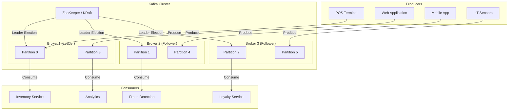
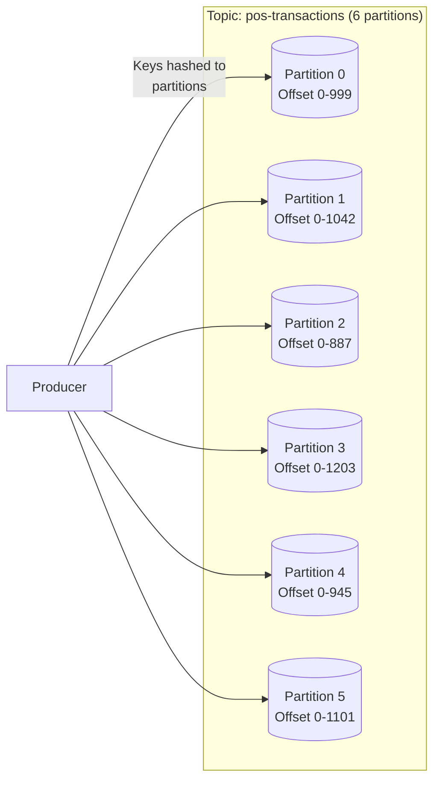
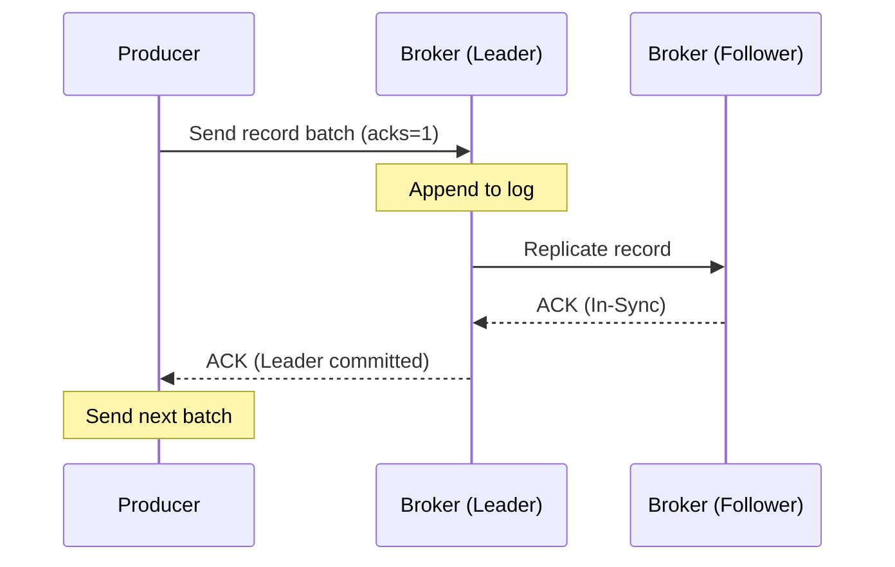
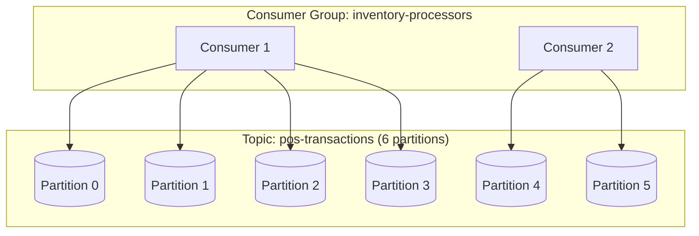
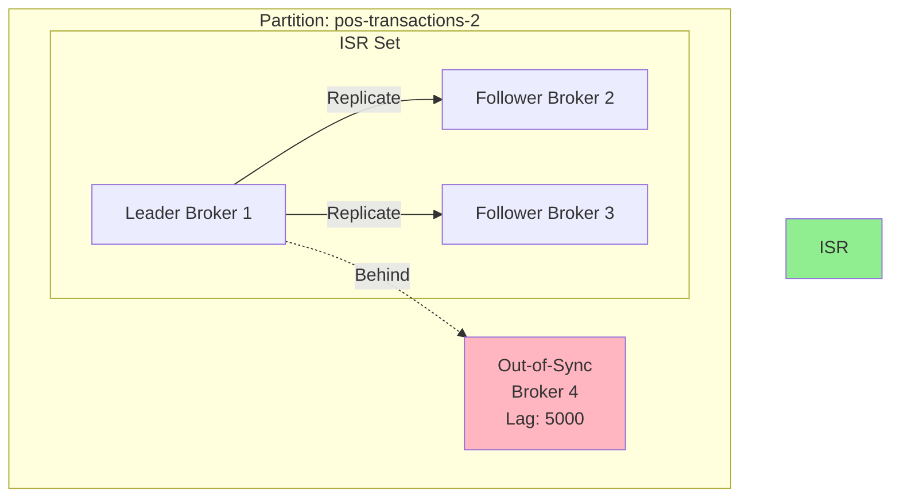
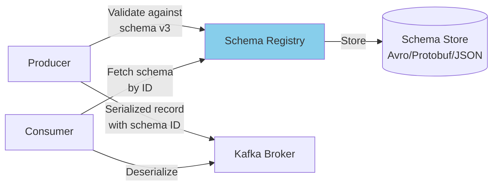
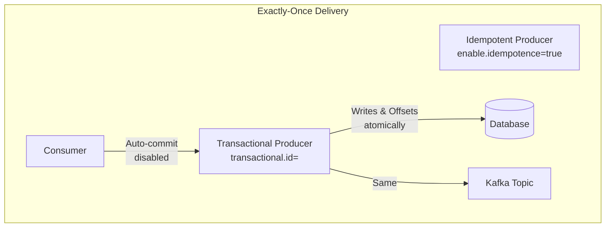
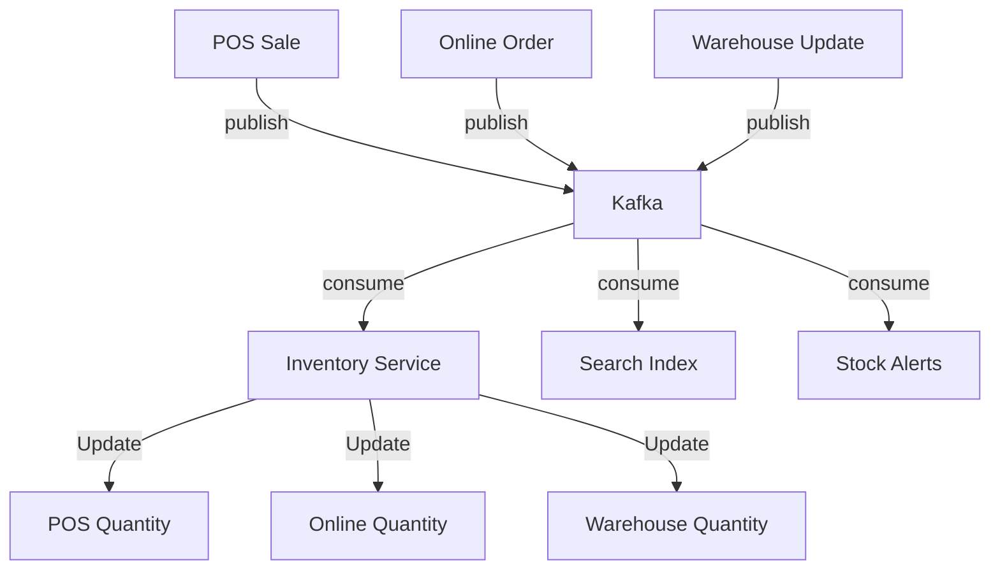
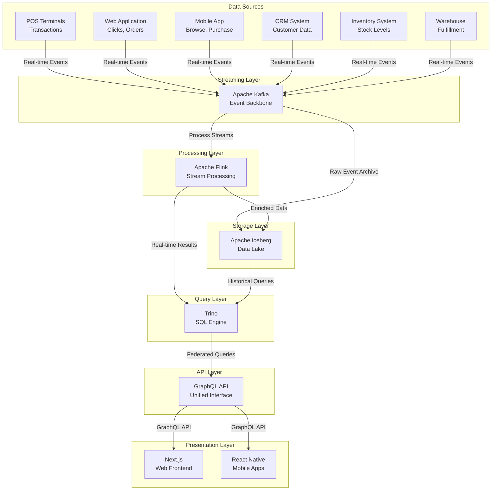

# Apache Kafka Skill Document

**Enterprise Retail Streaming Platform**  
*Central Event Streaming Backbone*

---

## Table of Contents

1. [Overview](#1-overview)
2. [Core Concepts](#2-core-concepts)
3. [Why This Project Uses It](#3-why-this-project-uses-it)
4. [Architecture Position](#4-architecture-position)
5. [Folder Structure](#5-folder-structure)
6. [Implementation Walkthrough](#6-implementation-walkthrough)
7. [Production Best Practices](#7-production-best-practices)
8. [Common Problems](#8-common-problems)
9. [Performance Optimization](#9-performance-optimization)
10. [Security](#10-security)
11. [Monitoring](#11-monitoring)
12. [Testing Strategy](#12-testing-strategy)
13. [Interview Preparation](#13-interview-preparation)
14. [Hands-on Exercises](#14-hands-on-exercises)
15. [Real Enterprise Use Cases](#15-real-enterprise-use-cases)
16. [Design Decisions](#16-design-decisions)
17. [Business Value](#17-business-value)
18. [Future Improvements](#18-future-improvements)
19. [References](#19-references)
20. [Skills Demonstrated](#20-skills-demonated)

---

## 1. Overview

### What is Apache Kafka?

Apache Kafka is a distributed event streaming platform that enables high-throughput, fault-tolerant, real-time data pipelines and streaming applications. Originally developed at LinkedIn in 2011 and open-sourced in 2012, Kafka has evolved from a simple messaging queue into a comprehensive streaming platform capable of handling millions of events per second across distributed clusters. At its core, Kafka provides three key capabilities: publish-subscribe messaging (producers publish records to topics, consumers subscribe to them), durable storage with configurable retention, and stream processing with the ability to transform and analyze data in-flight.

Kafka's architecture is fundamentally different from traditional message brokers. Rather than using a push-based model where the broker pushes messages to consumers, Kafka employs a pull-based model where consumers actively pull messages from brokers. This design choice, seemingly simple, has profound implications for throughput, scalability, and message replay capabilities. Consumers can replay messages from any offset, and producers have no knowledge of which consumers are reading their data, enabling complete decoupling of producers and consumers in time and space.

The platform operates as a distributed commit log where data is persisted to disk in a structured, append-only manner. This append-only log design provides several performance advantages: sequential disk writes leverage OS-level optimizations, page cache hit rates improve dramatically compared to random I/O patterns, and the log-structured approach naturally supports replication and recovery. Kafka can achieve throughput of hundreds of megabytes per second per broker while maintaining sub-millisecond latency, rivaling in-memory systems for many use cases.

Enterprise adoption of Kafka has accelerated dramatically because it solves real architectural problems at scale. Organizations generate enormous volumes of event data from web applications, mobile devices, IoT sensors, and operational systems. Traditional database-centric architectures struggle to handle this velocity and volume while maintaining real-time access patterns. Kafka provides a central nervous system for event-driven architectures, enabling organizations to build loosely coupled services that communicate through events rather than synchronous API calls.

### Why Was Kafka Created at LinkedIn?

LinkedIn faced a significant engineering challenge in 2010 as the social networking platform scaled rapidly. The engineering team needed to track user activities in real-time to power features like "People You May Know," real-time activity streams, and personalized notifications. Traditional approaches using databases and message queues were failing under the load. The existing infrastructure was a tapestry of point-to-point integrations where each new data consumer required changes to producers, creating an unmanageable spaghetti architecture.

Jay Kreps, Jun Rao, and the LinkedIn engineering team set out to build a system that could handle 1.1 billion events per day with the reliability and scalability that LinkedIn required. The result was Kafka, named after the author Franz Kafka for its supposed ability to handle writers and their works without losing data. The core design principle was treating the stream of events as a first-class citizen, similar to how databases treat the stream of changes in write-ahead logs.

The LinkedIn team identified several key requirements that shaped Kafka's architecture. They needed to decouple data producers from data consumers completely, allowing each to scale independently. They required persistent durability with configurable retention, so events could be consumed after hours or days for use cases like analytics or replay. They needed high throughput to handle LinkedIn's massive event volume, and they needed the ability to partition data across machines for horizontal scalability. Finally, they needed built-in support for data replication to prevent data loss during failures.

The Kafka paper published in 2013, "Kafka: A Distributed Messaging System for Log Processing," detailed these requirements and how Kafka's design addressed them. LinkedIn's decision to open-source Kafka and later donate it to the Apache Software Foundation in 2012 was transformative. It allowed the broader industry to benefit from LinkedIn's engineering investment and created a vibrant open-source community that has driven Kafka's evolution far beyond its original scope.

### Business Problems Kafka Solves

Modern enterprises face unprecedented challenges in coordinating data flow across complex technology ecosystems. When a customer makes a purchase at a POS terminal, that transaction needs to update inventory systems, trigger fulfillment processes, update customer loyalty points, feed analytics platforms, and activate fraud detection algorithms. In a monolith architecture, these operations might occur synchronously within a single transaction. However, this tightly coupled approach creates cascading failures, scalability bottlenecks, and deployment dependencies that cripple enterprise agility.

Kafka enables event-driven architecture at enterprise scale, solving these problems by providing a reliable, scalable backbone for asynchronous communication. When the POS terminal publishes a transaction event to Kafka, multiple independent services can consume and process that event simultaneously without the POS system needing to know anything about downstream consumers. The inventory service updates stock levels, the loyalty service credits points, the analytics service records the transaction, and the fraud service evaluates the purchase—all working independently at their own pace.

This decoupling provides resilience because the failure of any single consumer does not affect the producer or other consumers. If the fraud detection service goes down temporarily, transactions continue to flow and queue up. When the service recovers, it processes the backlog without data loss. This "fire-and-forget" capability with guaranteed delivery transforms how enterprises build resilient systems.

For retail specifically, Kafka enables real-time inventory visibility across channels. When a customer purchases an item online, Kafka events ensure that store inventory systems, distribution center systems, and supplier integration platforms all receive the update within seconds. This real-time synchronization eliminates the "inventory drift" problem where different systems show different quantities for the same SKU, leading to overselling, stockouts, and customer dissatisfaction.

The platform also solves the analytics latency problem. Traditional batch-oriented analytics pipelines introduce hours of delay between customer actions and business insights. With Kafka, analytics become real-time: retailers can see which products are selling fastest right now, identify traffic patterns in real-time, detect fraud as it happens, and respond to market conditions within minutes rather than waiting for overnight batch jobs.

---

## 2. Core Concepts

### Architecture Overview

Kafka's architecture consists of several interconnected components that work together to provide durable, ordered, scalable message streaming. Understanding these components and their relationships is essential for designing and operating Kafka-based systems effectively.



### Brokers

A Kafka broker is a server that stores and serves messages. Brokers form a cluster, with each broker identified by a unique integer ID. When you start a Kafka broker, it registers with ZooKeeper (in traditional deployments) or participates in KRaft consensus (in KRaft mode) to coordinate cluster membership and leader election.

Each broker is responsible for storing data for a subset of partitions. A three-broker cluster hosting a six-partition topic means each broker owns approximately two partitions. This partitioning enables horizontal scalability—adding brokers to the cluster allows more partitions and thus higher throughput.

Brokers handle all client network communication, including producers sending messages and consumers fetching messages. The broker writes messages to disk in a format optimized for sequential access, enabling high write throughput. Each message batch is compressed using configurable codecs (GZIP, Snappy, LZ4, ZSTD) to reduce disk space and network transfer.

The broker also manages replication. Each partition has one leader and zero or more followers. All writes and reads go through the leader; followers passively replicate data to stay in sync. If a leader fails, ZooKeeper/KRaft triggers leader election among the in-sync replicas (ISRs), and one of the followers becomes the new leader, ensuring continued availability.

### Topics and Partitions

A Kafka topic is a named channel for streaming records. Producers write records to a topic, and consumers read records from a topic. Topics are the fundamental abstraction for organizing data in Kafka.



Partitions are the unit of parallelism in Kafka. Each partition is an ordered, immutable sequence of records that grows continuously as new records are appended. The ordering guarantee within a partition enables scenarios where record sequence matters—maintaining purchase order for a specific customer, for example.

When you create a topic, you specify the number of partitions. This number determines the maximum parallelism for consuming that topic because each consumer in a consumer group processes one partition at a time. If you have six partitions and three consumers in a group, each consumer processes two partitions. If you add three more consumers, each consumer processes one partition.

Records within a partition are assigned a sequential offset, a monotonically increasing integer that uniquely identifies each record within that partition. Offsets are the primary mechanism for consumers to track their position in the stream. After processing records up to offset X, a consumer can commit that position and later resume from offset X+1 if it restarts or if you enable consumer group offset retention.

Records also have a timestamp (either the server's insertion time or a producer-provided timestamp) and can optionally carry a key. When you provide a key, Kafka ensures that all records with the same key are always written to the same partition. This partitioning-by-key behavior is critical for maintaining related records together—for example, all transactions for a specific customer ID should go to the same partition to maintain ordering guarantees for that customer's purchases.

### Producers

Producers are client applications that publish records to Kafka topics. The producer client library handles discovering brokers, serializing records, batching, compression, retries, and acknowledgment handling. Understanding producer behavior is essential for building reliable data pipelines.



The producer uses the `bootstrap.servers` configuration to connect to the cluster and discover the current broker topology. When you send a record, the producer first serializes the key and value (typically to JSON, Avro, or Protobuf), then determines which partition to send the record to based on the partitioner strategy.

The default partitioner hashes the record key using a murmur2 hash algorithm and then calculates `partition = hash(key) % numPartitions`. This ensures records with the same key always go to the same partition. If no key is provided, Kafka distributes records round-robin across partitions to balance load.

Producers can choose acknowledgment strategies via the `acks` configuration. Setting `acks=0` provides at-most-once semantics where the producer sends records without waiting for any acknowledgment—useful when throughput matters more than durability. Setting `acks=1` waits for the leader broker to acknowledge receipt but not followers—good balance of latency and durability. Setting `acks=all` or `acks=-1` waits for all in-sync replicas to acknowledge, providing strong durability at the cost of higher latency.

The producer also handles retries automatically. When a record send fails (network error, broker unavailable), the producer retries with configurable `retries` and `retry.backoff.ms` settings. For idempotent delivery, enable `enable.idempotence=true`, which adds a producer ID and sequence number to each record to prevent duplicate sends during retries.

### Consumers and Consumer Groups

Consumers read records from Kafka topics. The consumer client library handles group membership, partition assignment, offset tracking, heartbeat management, and rebalancing. Understanding consumer patterns is critical for building scalable, fault-tolerant stream processing applications.



Consumer groups enable parallel processing and scalability. Each consumer in a group handles a mutually exclusive set of partitions— Kafka ensures that no two consumers in the same group read from the same partition simultaneously. When you add a consumer to a group, Kafka triggers a rebalance, redistributing partitions among all group members.

When a consumer joins a consumer group, it subscribes to one or more topics. The group coordinator (a broker elected as the coordinator for the group) manages the group membership and partition assignments. The coordinator determines which partitions each consumer should read based on the current group membership and partition count.

Consumers track their position in partitions using offsets. The `auto.offset.reset` configuration determines behavior when a consumer has no committed offset (first time joining a group or when the committed offset has been deleted). Setting this to `earliest` causes the consumer to start from the oldest available record, enabling replay of historical data. Setting this to `latest` starts from the newest record, ignoring historical data.

The commit strategy controls when offsets are advanced. With `enable.auto.commit=true` (default), the consumer periodically commits offsets automatically based on `auto.commit.interval.ms`. This provides at-least-once delivery because records might be processed more than once if the consumer crashes after processing but before committing. With `enable.auto.commit=false`, you manually call `consumer.commitSync()` or `consumer.commitAsync()` after processing records, enabling exactly-once semantics when combined with transactional producers.

### Replication and ISR

Kafka achieves fault tolerance through replication. Each partition can be replicated across multiple brokers. One replica is designated as the leader; the others are followers. All writes go through the leader, and followers pull records to stay in sync.



The in-sync replicas (ISR) set consists of all replicas that are fully caught up with the leader—all replicas that have acknowledged the latest record within a configurable time window. The `replica.lag.time.max.ms` configuration controls how long a follower can go without sending a fetch request before it's considered out of sync.

When the leader fails, Kafka's controller broker (another broker that manages partition state changes) performs leader election among the ISR set. The first replica in the ISR list becomes the new leader. This ensures that only replicas with all committed records can become leaders, preventing data loss for committed messages.

The `min.insync.replicas` configuration controls the minimum number of ISR that must acknowledge a write for it to be considered successful. Setting this to 2 alongside `acks=all` ensures that at least two replicas have written every acknowledged record. If the ISR count drops below `min.insync.replicas`, the broker stops accepting writes to that partition, sacrificing availability to preserve durability.

### Schema Registry

In enterprise environments, schema evolution becomes critical as services change over time. The Schema Registry, developed by Confluent (and also available from AWS as Glue Schema Registry), provides centralized schema storage and compatibility checking.



When producing records, the Schema Registry validates the record against the registered schema for that topic. If the schema is compatible with previous versions (backward compatibility allows new schemas to read old data), the registry approves and returns a schema ID. The producer embeds this ID alongside the serialized record.

When consuming, the Schema Registry retrieves the schema by ID to deserialize records. This approach eliminates the need to embed schemas in every record, reducing payload size while ensuring type safety.

Schema evolution rules include backward compatibility (new schema can read old data), forward compatibility (old schema can read new data), and full compatibility (both directions work). For retail platforms, backward compatibility is typically the safest default because consumers using the old schema can continue operating while being upgraded to handle new data.

### Exactly-Once Semantics

Kafka provides exactly-once semantics through a combination of idempotent producers, transactional producers/consumers, and offset tracking. Understanding when each mode is appropriate is crucial for building reliable systems.



Idempotent producers (`enable.idempotence=true`) prevent duplicate sends within a single producer session by adding a producer ID and sequence number to each record. The broker tracks sequence numbers and discards duplicates. This handles retry-induced duplicates but does not span producer restarts.

Transactional producers (`transactional.id` configured) extend idempotency across producer restarts. The producer uses the transactional ID to recover state after a restart, ensuring exactly-once delivery across producer sessions. Transactions also enable atomic writes across multiple partitions and topics.

Consumer exactly-once requires disabling auto-commit and manually committing offsets only after successfully processing records. For integration with external systems (databases, payment gateways), the transaction should encompass both the offset commit and the external system write, typically using the outbox pattern or two-phase commit.

---

## 3. Why This Project Uses It

### Real-Time Streaming from POS Systems

Point-of-sale systems generate high-volume transaction streams that drive multiple downstream processes simultaneously. When a customer completes a purchase at a POS terminal, the retail platform must update inventory counts, calculate loyalty points, trigger receipt generation, feed real-time sales dashboards, activate fraud detection, and potentially communicate with ERP systems. In a synchronous architecture, each of these operations would require the POS to make API calls, waiting for responses before completing the transaction. This approach creates fragile dependencies where a slow downstream service directly impacts customer checkout speed.

Kafka decouples the POS from all downstream consumers, enabling the POS to publish a single transaction event and immediately respond to the customer while background processing handles the rest. The inventory service processes the event at its own pace, scaling horizontally during peak periods. The loyalty service credits points asynchronously. The analytics service records metrics for dashboards. Each consumer operates independently, failure is isolated, and the customer never waits for non-critical downstream processes.

For a retail platform operating 500+ stores with an average of 200 transactions per store per hour during peak periods, this translates to 100,000 events per hour or approximately 28 events per second sustained. During flash sales or holiday peaks, this could spike to 500+ events per second. Kafka's architecture handles this volume on modest hardware while maintaining sub-second latency from POS publish to consumer processing.

The retail platform's POS integration also benefits from Kafka's ability to handle intermittent connectivity. Store networks experience outages, and POS terminals cannot fail transactions when connectivity is lost. Kafka's producer buffering and retry mechanisms, combined with the ability to configure `acks=0` for store-local processing with later replication, enable the POS to continue operating during connectivity issues and automatically catch up when connectivity restores.

### E-Commerce Event Streaming

E-commerce platforms generate diverse event types with varying characteristics: page views (high volume, low value per event), add-to-cart actions (medium volume, strong purchase intent signals), checkout initiations (lower volume, critical for conversion tracking), and order completions (lowest volume but highest business value). A unified streaming platform must handle this spectrum efficiently.

Kafka enables the retail platform to use a single event bus for all e-commerce events, reducing operational complexity while providing flexibility for different consumer patterns. Real-time recommendation engines consume page view and cart events immediately to update customer profiles and power personalization. Analytics platforms consume all events for funnel analysis and conversion optimization. Fraud detection focuses on checkout and payment events with real-time scoring.

The e-commerce domain also presents schema evolution challenges that the Schema Registry addresses. Product catalog attributes change over time as retailers add new attributes like sustainability certifications or personalized sizing recommendations. With Schema Registry, new attributes can be added to schemas while maintaining backward compatibility—existing consumers continue processing while upgraded consumers handle enriched data.

Kafka's replay capability proves valuable for e-commerce experimentation. When the recommendation team deploys a new algorithm, they can replay historical events through the new algorithm to evaluate performance against historical baselines without requiring a production split test. This ability to process historical data through new logic accelerates iteration cycles significantly.

### CRM Integration

Customer relationship management systems require a complete, real-time view of customer interactions across all channels—store visits, online browsing, support calls, and marketing email interactions. Traditional CRM integrations use batch exports multiple times per day, creating stale data and missed opportunities for real-time personalization.

The retail platform uses Kafka to stream customer events from all touchpoints into the CRM in real-time. When a customer has a positive service interaction, the support agent sees this context immediately rather than waiting for an overnight batch. When a high-value customer enters a store, the associate receives an alert with purchase history and preferences. When a customer abandons a cart online, the marketing automation system triggers a recovery email within minutes rather than hours.

Kafka's topic-per-event-type pattern works well for CRM integration. Customer profile updates flow to a `customer.profile.updated` topic. Loyalty point changes flow to `loyalty.points.changed`. Support interactions flow to `crm.support.interaction`. The CRM system subscribes to relevant topics and maintains its own projection of customer state, updated in real-time as events arrive.

The consumer group feature enables multiple CRM-related consumers to process the same events for different purposes. The main CRM consumer updates customer records. A separate analytics consumer aggregates customer activity metrics. A machine learning consumer evaluates churn risk scores. Each consumer group operates independently, maintaining its own offset, ensuring that CRM processing does not block analytics or ML workloads.

### Inventory Management

Real-time inventory synchronization across channels is a critical differentiator for modern retail. A customer who discovers an item is available online but finds it out of stock in store experiences friction. A customer who orders online for store pickup only to find the item unavailable experiences frustration. Kafka enables the inventory system to maintain accurate counts across all channels in real-time.



When a POS terminal sells an item, the inventory service consumes the transaction event and decrements the local store inventory. Simultaneously, the online inventory service consumes the same event and decrements the online allocation. The warehouse management system consumes the event and updates available-to-promise calculations. Within seconds, all channels reflect the sale, preventing overselling.

The inventory system also benefits from Kafka Streams for complex event processing. When inventory drops below threshold, the alerting service generates reorder suggestions. When inventory reaches zero, the alerting service notifies relevant merchandising teams. When inventory suddenly spikes (potential fraud or data error), the alerting service generates exceptions for investigation.

### Event-Driven Architecture Benefits

Beyond specific integrations, the retail platform uses Kafka because event-driven architecture provides strategic advantages for enterprise retail. Services can evolve independently—new consumers can be added without modifying producers, new event types can be introduced without breaking existing consumers, and technology choices become independent across services.

The platform also benefits from temporal decoupling. Consumers can process events at their own pace, handling traffic spikes without backpressure propagating to producers. The POS system remains responsive even when downstream services experience slowdowns. This isolation improves overall system resilience significantly.

Kafka's durable log provides an audit trail for regulatory compliance and debugging. Every transaction is recorded with its full context, timestamped at millisecond precision, and retained according to configurable policies. When investigating a customer complaint about a missing loyalty points, the operations team can trace the exact transaction through the event log, verify processing, and identify any failures. This observability is invaluable for retail operations.

---

## 4. Architecture Position

### Platform Stack Overview

Kafka occupies a central position in the Enterprise Retail Streaming Platform architecture, serving as the durable, ordered event log that connects source systems to processing engines to analytical stores. Understanding Kafka's position in this stack clarifies the platform's data flow and architectural choices.



### Data Flow Pipeline

The platform's data flow follows a lambda architecture pattern with Kafka as the central spine. All events flow through Kafka, where they are simultaneously made available for real-time processing via Flink and persisted to Iceberg for historical analysis.

When a customer completes a purchase at a POS terminal, the event flows through the platform as follows:

1. **POS Terminal** captures the transaction, including line items, payment method, customer ID (if loyalty member), and store identifier. The terminal serializes this to JSON and publishes to the `pos.transactions` topic.

2. **Kafka Broker** receives the event, assigns it an offset within the appropriate partition (based on store ID or customer ID for ordering), replicates to follower brokers according to the topic's replication factor, and acknowledges to the POS terminal.

3. **Flink Processing** consumes the transaction event in real-time. The Flink job enriches the transaction with product catalog details (name, category, price), customer details (loyalty tier, lifetime value), and store details (region, format). The enriched event is written to Iceberg as a dimension table update and a fact table insert.

4. **Downstream Consumers** include the inventory service (decrements stock), loyalty service (calculates points), analytics service (updates real-time dashboards), and fraud detection service (scores the transaction).

5. **Iceberg Storage** receives all events for historical analysis. Trino queries Iceberg tables to power reporting, ad-hoc analysis, and machine learning feature engineering.

6. **GraphQL API** exposes a unified interface for both real-time (Flink-computed) and historical (Iceberg via Trino) data. Next.js frontend displays real-time sales dashboards, inventory levels, and customer insights.

### Kafka's Architectural Role

Kafka serves multiple critical roles in this architecture:

**Durable Buffer**: Kafka's disk-backed storage provides a durable buffer between fast producers and variable-rate consumers. When Flink jobs experience garbage collection pauses or when Trino queries cause compute spikes, events continue accumulating in Kafka without blocking producers. The configurable retention (typically 7 days for operational events, 90 days for audit events) ensures that consumers can catch up after processing interruptions.

**Partition Router**: Kafka's partitioning scheme routes related events to the same partition for ordering guarantees. For retail, partitioning by customer ID ensures that all events for a specific customer are processed in order, enabling accurate customer journey tracking and preventing race conditions in customer state updates.

**Schema Enforcement**: Schema Registry integration ensures that event schemas are validated at the boundary, preventing malformed data from entering the pipeline. This schema enforcement catches errors early, at the publish point, rather than failing downstream consumers with cryptic deserialization errors.

**Replay Capability**: Kafka's retention model enables replay of historical events for backfilling, debugging, and algorithm testing. When a new consumer is developed or when an existing consumer has a bug fix, the team can replay relevant historical events through the corrected logic.

**Multi-Consumer Fan-out**: A single event published to Kafka can be consumed by multiple independent consumer groups simultaneously. This fan-out enables the POS transaction event to simultaneously update inventory, credit loyalty points, trigger analytics, and invoke fraud detection without the POS terminal knowing about any downstream consumers.

---

## 5. Folder Structure

### Project Organization

A well-organized Kafka-related folder structure facilitates development, operations, and onboarding. The Enterprise Retail Streaming Platform follows a convention that separates configuration, code, scripts, documentation, and tests.

```
retail-streaming-platform/
├── config/
│   ├── kafka/
│   │   ├── server.properties          # Broker configuration
│   │   ├── producer.properties        # Producer defaults
│   │   ├── consumer.properties         # Consumer defaults
│   │   ├── connect-distributed.properties  # Kafka Connect config
│   │   └── log4j.properties            # Broker logging
│   └── schemas/
│       ├── pos-transaction-value.avsc # POS transaction schema
│       ├── customer-event-value.avsc  # Customer event schema
│       ├── inventory-event-value.avsc  # Inventory event schema
│       └── order-event-value.avsc      # Order event schema
├── src/
│   ├── main/
│   │   ├── java/com/retail/streaming/
│   │   │   ├── producer/
│   │   │   │   ├── PosTransactionProducer.java
│   │   │   │   ├── CustomerEventProducer.java
│   │   │   │   └── BaseProducer.java
│   │   │   ├── consumer/
│   │   │   │   ├── InventoryConsumer.java
│   │   │   │   ├── LoyaltyConsumer.java
│   │   │   │   ├── AnalyticsConsumer.java
│   │   │   │   └── BaseConsumer.java
│   │   │   ├── model/
│   │   │   │   ├── PosTransaction.java
│   │   │   │   ├── CustomerEvent.java
│   │   │   │   └── InventoryUpdate.java
│   │   │   ├── schema/
│   │   │   │   ├── AvroSerializer.java
│   │   │   │   └── AvroDeserializer.java
│   │   │   └── util/
│   │   │       ├── KafkaAdminUtil.java
│   │   │       └── TopicConfigUtil.java
│   │   └── resources/
│   │       └── application.conf
│   └── test/
│       ├── java/com/retail/streaming/
│       │   ├── producer/
│       │   │   └── PosTransactionProducerTest.java
│       │   ├── consumer/
│       │   │   └── InventoryConsumerTest.java
│       │   └── integration/
│       │       └── KafkaIntegrationTest.java
│       └── resources/
│           ├── test-producer.properties
│           └── test-consumer.properties
├── docker/
│   ├── kafka/
│   │   ├── docker-compose.yml          # Local development
│   │   ├── Dockerfile                  # Custom broker image
│   │   └── entrypoint.sh               # Startup script
│   └── schema-registry/
│       ├── docker-compose.yml
│       └── Dockerfile
├── kubernetes/
│   ├── kafka/
│   │   ├── kafka-statefulset.yaml
│   │   ├── kafka-service.yaml
│   │   ├── kafka-configmap.yaml
│   │   └── kafka-persistentvolumeclaim.yaml
│   └── schema-registry/
│       ├── schema-registry-deployment.yaml
│       └── schema-registry-service.yaml
├── scripts/
│   ├── topic-management/
│   │   ├── create-topics.sh
│   │   ├── list-topics.sh
│   │   ├── describe-topic.sh
│   │   └── delete-topic.sh
│   ├── bin/
│   │   ├── start-kafka.sh
│   │   ├── stop-kafka.sh
│   │   ├── kafka-healthcheck.sh
│   │   └── reset-consumer-offset.sh
│   └── stress-testing/
│       └── kafka-producer-perf-test.sh
├── docs/
│   ├── kafka/
│   │   ├── architecture.md
│   │   ├── topic-design.md
│   │   ├── security-configuration.md
│   │   └── monitoring-guide.md
│   └── skills/
│       └── 02-kafka.md
├── monitoring/
│   ├── prometheus/
│   │   └── kafka-metrics.yml
│   └── grafana/
│       ├── kafka-dashboard.json
│       └── kafka-alerts.yml
└── README.md
```

### Configuration Files

The `config/kafka/` directory contains all Kafka broker, producer, and consumer configurations. In production, these files are typically loaded from a secrets management system or configuration management tool (Ansible, Terraform, Helm values).

The `config/schemas/` directory contains Avro schema files that define the structure of records for each topic. These schemas are registered with Schema Registry at application startup, ensuring compatibility validation before production deployment.

### Source Code Organization

The `src/main/java/` directory follows a package structure organized by responsibility. The `producer/` package contains all producer implementations. Each producer class extends a `BaseProducer` that handles common configuration, serialization, and error handling. This inheritance pattern reduces code duplication and ensures consistent error handling across producers.

The `consumer/` package follows a similar pattern with a `BaseConsumer` handling offset management, heartbeat threading, and rebalance callbacks. Specific consumers (inventory, loyalty, analytics) extend the base class and implement topic-specific processing logic.

The `model/` package contains POJOs annotated for Avro serialization. These model classes serve as the canonical representation of events across producers, consumers, and API layers, ensuring type consistency throughout the platform.

### Docker and Kubernetes

The `docker/` and `kubernetes/` directories contain containerization and orchestration configurations. The Docker setup uses a custom entrypoint script that configures brokers based on environment variables, enabling the same Docker image to run in development (single broker), staging (three brokers), and production (multi-broker with TLS).

The Kubernetes manifests use StatefulSets for Kafka brokers, leveraging the ordered, predictable pod naming and stable storage that StatefulSets provide. The Kafka broker ID is derived from the ordinal index of the pod, ensuring that restarts preserve broker identity.

### Scripts and Operations

The `scripts/` directory contains operational scripts for common tasks. Topic management scripts automate the creation of new topics with appropriate partition counts and replication factors. Bin scripts handle startup, shutdown, and health checks. Stress testing scripts validate broker performance before production deployment.

### Monitoring Configuration

The `monitoring/` directory contains Prometheus scrape configurations and Grafana dashboard definitions. The Kafka metrics are exported via JMXExporter and scraped by Prometheus at 15-second intervals. Grafana dashboards visualize broker health, consumer lag, and producer acknowledgment rates.

---

## 6. Implementation Walkthrough

### Broker Configuration

The Kafka broker is configured through `server.properties`. This configuration balances performance, durability, and operational requirements for the retail platform.

```properties
# server.properties for Enterprise Retail Streaming Platform

# Basic Identification
broker.id=0
listeners=PLAINTEXT://kafka-1.retail.internal:9092,SSL://kafka-1.retail.internal:9093
advertised.listeners=PLAINTEXT://kafka-1.retail.internal:9092,SSL://kafka-1.retail.internal:9093

# Data Directory Configuration
log.dirs=/var/lib/kafka/data
num.partitions=6
default.replication.factor=3
min.insync.replicas=2

# Log Retention Configuration (7 days for operational events)
log.retention.hours=168
log.retention.check.interval.ms=300000
log.segment.bytes=1073741824  # 1GB segment size
log.cleanup.policy=delete

# Compression Configuration
compression.type=producer

# Network and Threading Configuration
num.network.threads=8
num.io.threads=16
socket.send.buffer.bytes=102400
socket.receive.buffer.bytes=102400
socket.request.max.bytes=104857600

# Partition Management
num.recovery.threads.per.data.dir=4
auto.create.topics.enable=false
unclean.leader.election.enable=false

# Group Coordination
group.initial.rebalance.delay.ms=3000
offsets.topic.replication.factor=3
offsets.topic.num.partitions=50

# Connection and Session Timeouts
connections.max.idle.ms=600000
replica.socket.timeout.ms=30000
controller.socket.timeout.ms=30000
request.timeout.ms=30000

# Metrics Export
metric.reporters=io.confluent.metrics.reporter.ConfluentMetricsReporter
confluent.metrics.reporter.bootstrap.servers=kafka-1.retail.internal:9092

# Security Configuration
authorizer.class.name=kafka.security.authorizer.AclAuthorizer
super.users=User:admin
```

### Producer Implementation

The POS transaction producer handles publishing retail transaction events to Kafka. This implementation demonstrates proper error handling, acknowledgment configuration, and serialization.

```java
package com.retail.streaming.producer;

import io.confluent.kafka.serializers.KafkaAvroSerializer;
import org.apache.kafka.clients.producer.*;
import org.apache.kafka.common.serialization.StringSerializer;

import java.util.Properties;
import java.util.concurrent.Future;

public class PosTransactionProducer {
    
    private final KafkaProducer<String, PosTransaction> producer;
    private final String topic;
    
    public PosTransactionProducer(String bootstrapServers, String schemaRegistryUrl) {
        this.topic = "pos-transactions";
        
        Properties props = new Properties();
        props.put(ProducerConfig.BOOTSTRAP_SERVERS_CONFIG, bootstrapServers);
        props.put(ProducerConfig.KEY_SERIALIZER_CLASS_CONFIG, StringSerializer.class);
        props.put(ProducerConfig.VALUE_SERIALIZER_CLASS_CONFIG, KafkaAvroSerializer.class);
        props.put(ProducerConfig.ACKS_CONFIG, "all");
        props.put(ProducerConfig.RETRIES_CONFIG, 3);
        props.put(ProducerConfig.RETRY_BACKOFF_MS_CONFIG, 1000);
        props.put(ProducerConfig.ENABLE_IDEMPOTENCE_CONFIG, true);
        props.put(ProducerConfig.MAX_IN_FLIGHT_REQUESTS_PER_CONNECTION, 5);
        props.put(ProducerConfig.LINGER_MS_CONFIG, 5);
        props.put(ProducerConfig.BATCH_SIZE_CONFIG, 16384);
        props.put(ProducerConfig.COMPRESSION_TYPE_CONFIG, "lz4");
        props.put("schema.registry.url", schemaRegistryUrl);
        
        this.producer = new KafkaProducer<>(props);
    }
    
    public Future<RecordMetadata> sendTransaction(PosTransaction transaction) {
        String key = transaction.getStoreId() + "-" + transaction.getTransactionId();
        
        ProducerRecord<String, PosTransaction> record = 
            new ProducerRecord<>(topic, key, transaction);
        
        return producer.send(record, (metadata, exception) -> {
            if (exception != null) {
                System.err.printf("Failed to send transaction %s: %s%n",
                    transaction.getTransactionId(),
                    exception.getMessage());
            } else {
                System.out.printf("Transaction %s delivered to %s-%d [offset %d]%n",
                    transaction.getTransactionId(),
                    metadata.topic(),
                    metadata.partition(),
                    metadata.offset());
            }
        });
    }
    
    public void flush() {
        producer.flush();
    }
    
    public void close() {
        producer.close();
    }
}
```

The `PosTransaction` model uses Avro annotations for Schema Registry integration:

```java
package com.retail.streaming.model;

import io.confluent.kafka.serializers.KafkaAvroSerializer;
import org.apache.avro.reflect.AvroDefault;
import org.apache.avro.reflect.ReflectData;
import org.apache.avro.reflect.String;

public class PosTransaction {
    
    @String
    private String transactionId;
    
    @String
    private String storeId;
    
    @String
    private String registerId;
    
    @String
    private String customerId;
    
    @String
    private String employeeId;
    
    private long timestamp;
    
    private PosTransactionLineItem[] lineItems;
    
    private double totalAmount;
    
    @String
    private String paymentMethod;
    
    @AvroDefault("\"PENDING\"")
    private String status;
}
```

### Consumer Implementation

The inventory consumer processes POS transactions to update inventory counts. This implementation demonstrates proper offset management, error handling, and graceful shutdown.

```java
package com.retail.streaming.consumer;

import io.confluent.kafka.serializers.KafkaAvroDeserializer;
import org.apache.kafka.clients.consumer.*;
import org.apache.kafka.common.TopicPartition;
import org.apache.kafka.common.serialization.StringDeserializer;

import java.time.Duration;
import java.util.*;

public class InventoryConsumer {
    
    private final KafkaConsumer<String, PosTransaction> consumer;
    private final InventoryService inventoryService;
    
    public InventoryConsumer(String bootstrapServers, String schemaRegistryUrl) {
        this.inventoryService = new InventoryService();
        
        Properties props = new Properties();
        props.put(ConsumerConfig.BOOTSTRAP_SERVERS_CONFIG, bootstrapServers);
        props.put(ConsumerConfig.GROUP_ID_CONFIG, "inventory-processor-v1");
        props.put(ConsumerConfig.KEY_DESERIALIZER_CLASS_CONFIG, StringDeserializer.class);
        props.put(ConsumerConfig.VALUE_DESERIALIZER_CLASS_CONFIG, KafkaAvroDeserializer.class);
        props.put(ConsumerConfig.AUTO_OFFSET_RESET_CONFIG, "earliest");
        props.put(ConsumerConfig.ENABLE_AUTO_COMMIT_CONFIG, false);
        props.put(ConsumerConfig.MAX_POLL_RECORDS_CONFIG, 500);
        props.put(ConsumerConfig.MAX_POLL_INTERVAL_MS_CONFIG, 300000);
        props.put(ConsumerConfig.SESSION_TIMEOUT_MS_CONFIG, 30000);
        props.put(ConsumerConfig.HEARTBEAT_INTERVAL_MS_CONFIG, 10000);
        props.put("schema.registry.url", schemaRegistryUrl);
        props.put("specific.avro.reader", "true");
        
        this.consumer = new KafkaConsumer<>(props);
        this.consumer.subscribe(List.of("pos-transactions"));
    }
    
    public void run() {
        try {
            while (true) {
                ConsumerRecords<String, PosTransaction> records = 
                    consumer.poll(Duration.ofMillis(1000));
                
                if (records.isEmpty()) {
                    continue;
                }
                
                Map<TopicPartition, OffsetAndMetadata> offsetsToCommit = new HashMap<>();
                
                for (ConsumerRecord<String, PosTransaction> record : records) {
                    try {
                        processTransaction(record);
                        offsetsToCommit.put(
                            new TopicPartition(record.topic(), record.partition()),
                            new OffsetAndMetadata(record.offset() + 1)
                        );
                    } catch (Exception e) {
                        handleProcessingError(record, e);
                    }
                }
                
                if (!offsetsToCommit.isEmpty()) {
                    consumer.commitSync(offsetsToCommit);
                }
            }
        } finally {
            consumer.close();
        }
    }
    
    private void processTransaction(ConsumerRecord<String, PosTransaction> record) {
        PosTransaction transaction = record.value();
        
        for (PosTransactionLineItem item : transaction.getLineItems()) {
            inventoryService.decrementStock(
                item.getSku(),
                item.getQuantity(),
                transaction.getStoreId()
            );
        }
    }
    
    private void handleProcessingError(ConsumerRecord<String, PosTransaction> record, Exception e) {
        System.err.printf("Error processing transaction %s: %s%n",
            record.value().getTransactionId(), e.getMessage());
    }
    
    public void shutdown() {
        consumer.wakeup();
    }
}
```

### Topic Creation

Topics should be created programmatically or via scripts before producers and consumers start. This ensures proper configuration from the beginning.

```bash
#!/bin/bash
# scripts/topic-management/create-topics.sh

KAFKA_BROKERS=${KAFKA_BOOTSTRAP_SERVERS:-"localhost:9092"}
SCHEMA_REGISTRY=${SCHEMA_REGISTRY_URL:-"http://localhost:8081"}

# Create pos-transactions topic with 6 partitions and RF=3
kafka-topics --create \
  --bootstrap-server $KAFKA_BROKERS \
  --topic pos-transactions \
  --partitions 6 \
  --replication-factor 3 \
  --config min.insync.replicas=2 \
  --config retention.ms=604800000 \
  --config cleanup.policy=delete

# Create customer-events topic
kafka-topics --create \
  --bootstrap-server $KAFKA_BROKERS \
  --topic customer-events \
  --partitions 12 \
  --replication-factor 3 \
  --config min.insync.replicas=2 \
  --config retention.ms=604800000

# Create inventory-updates topic
kafka-topics --create \
  --bootstrap-server $KAFKA_BROKERS \
  --topic inventory-updates \
  --partitions 6 \
  --replication-factor 3 \
  --config min.insync.replicas=2 \
  --config retention.ms=259200000

# Create order-events topic
kafka-topics --create \
  --bootstrap-server $KAFKA_BROKERS \
  --topic order-events \
  --partitions 12 \
  --replication-factor 3 \
  --config min.insync.replicas=2 \
  --config retention.ms=604800000

# Create __consumer_offsets internal topic (managed automatically, but verify)
kafka-topics --describe \
  --bootstrap-server $KAFKA_BROKERS \
  --topic __consumer_offsets

echo "Topics created successfully"
```

### Docker Compose Setup

For local development, Docker Compose provides a complete Kafka environment with ZooKeeper (or KRaft mode), Schema Registry, and Kafka Connect.

```yaml
version: '3.8'

services:
  zookeeper:
    image: confluentinc/cp-zookeeper:7.5.0
    hostname: zookeeper
    container_name: zookeeper
    environment:
      ZOOKEEPER_CLIENT_PORT: 2181
      ZOOKEEPER_TICK_TIME: 2000
      ZOOKEEPER_INIT_LIMIT: 5
      ZOOKEEPER_SYNC_LIMIT: 2
    ports:
      - "2181:2181"
    volumes:
      - zookeeper-data:/var/lib/zookeeper/data
    networks:
      - retail-network

  kafka-1:
    image: confluentinc/cp-kafka:7.5.0
    hostname: kafka-1
    container_name: kafka-1
    depends_on:
      - zookeeper
    ports:
      - "9092:9092"
    environment:
      KAFKA_BROKER_ID: 1
      KAFKA_ZOOKEEPER_CONNECT: zookeeper:2181
      KAFKA_LISTENER_SECURITY_PROTOCOL_MAP: PLAINTEXT:PLAINTEXT,PLAINTEXT_HOST:PLAINTEXT
      KAFKA_ADVERTISED_LISTENERS: PLAINTEXT://kafka-1:29092,PLAINTEXT_HOST://localhost:9092
      KAFKA_INTER_BROKER_LISTENER_NAME: PLAINTEXT
      KAFKAOffsets.TOPIC_REPLICATION_FACTOR: 3
      KAFKA_TRANSACTION_STATE_LOG_REPLICATION_FACTORS: 3
      KAFKA_TRANSACTION_STATE_LOG_MIN_ISR: 2
      KAFKA_LOG_RETENTION_HOURS: 168
      KAFKA_LOG_SEGMENT_BYTES: 1073741824
      KAFKA_NUM_PARTITIONS: 6
      KAFKA_AUTO_CREATE_TOPICS_ENABLE: "false"
      KAFKA_UNCLEAN_LEADER_ELECTION_ENABLE: "false"
    volumes:
      - kafka1-data:/var/lib/kafka/data
    networks:
      - retail-network

  kafka-2:
    image: confluentinc/cp-kafka:7.5.0
    hostname: kafka-2
    container_name: kafka-2
    depends_on:
      - zookeeper
    ports:
      - "9093:9093"
    environment:
      KAFKA_BROKER_ID: 2
      KAFKA_ZOOKEEPER_CONNECT: zookeeper:2181
      KAFKA_LISTENER_SECURITY_PROTOCOL_MAP: PLAINTEXT:PLAINTEXT,PLAINTEXT_HOST:PLAINTEXT
      KAFKA_ADVERTISED_LISTENERS: PLAINTEXT://kafka-2:29093,PLAINTEXT_HOST://localhost:9093
      KAFKA_INTER_BROKER_LISTENER_NAME: PLAINTEXT
      KAFKA_OFFSETS_TOPIC_REPLICATION_FACTOR: 3
      KAFKA_TRANSACTION_STATE_LOG_REPLICATION_FACTORS: 3
      KAFKA_TRANSACTION_STATE_LOG_MIN_ISR: 2
      KAFKA_LOG_RETENTION_HOURS: 168
      KAFKA_LOG_SEGMENT_BYTES: 1073741824
      KAFKA_NUM_PARTITIONS: 6
      KAFKA_AUTO_CREATE_TOPICS_ENABLE: "false"
      KAFKA_UNCLEAN_LEADER_ELECTION_ENABLE: "false"
    volumes:
      - kafka2-data:/var/lib/kafka/data
    networks:
      - retail-network

  kafka-3:
    image: confluentinc/cp-kafka:7.5.0
    hostname: kafka-3
    container_name: kafka-3
    depends_on:
      - zookeeper
    ports:
      - "9094:9094"
    environment:
      KAFKA_BROKER_ID: 3
      KAFKA_ZOOKEEPER_CONNECT: zookeeper:2181
      KAFKA_LISTENER_SECURITY_PROTOCOL_MAP: PLAINTEXT:PLAINTEXT,PLAINTEXT_HOST:PLAINTEXT
      KAFKA_ADVERTISED_LISTENERS: PLAINTEXT://kafka-3:29094,PLAINTEXT_HOST://localhost:9094
      KAFKA_INTER_BROKER_LISTENER_NAME: PLAINTEXT
      KAFKA_OFFSETS_TOPIC_REPLICATION_FACTOR: 3
      KAFKA_TRANSACTION_STATE_LOG_REPLICATION_FACTORS: 3
      KAFKA_TRANSACTION_STATE_LOG_MIN_ISR: 2
      KAFKA_LOG_RETENTION_HOURS: 168
      KAFKA_LOG_SEGMENT_BYTES: 1073741824
      KAFKA_NUM_PARTITIONS: 6
      KAFKA_AUTO_CREATE_TOPICS_ENABLE: "false"
      KAFKA_UNCLEAN_LEADER_ELECTION_ENABLE: "false"
    volumes:
      - kafka3-data:/var/lib/kafka/data
    networks:
      - retail-network

  schema-registry:
    image: confluentinc/cp-schema-registry:7.5.0
    hostname: schema-registry
    container_name: schema-registry
    depends_on:
      - zookeeper
    ports:
      - "8081:8081"
    environment:
      SCHEMA_REGISTRY_HOST_NAME: schema-registry
      SCHEMA_REGISTRY_LISTENERS: http://0.0.0.0:8081
      SCHEMA_REGISTRY_KAFKASTORE_BOOTSTRAP_SERVERS: PLAINTEXT://kafka-1:29092
      SCHEMA_REGISTRY_KAFKASTORE_SECURITY_PROTOCOL: PLAINTEXT
      SCHEMA_REGISTRY_KAFKASTORE_TOPIC: _schema_registry
      SCHEMA_REGISTRY_KAFKASTORE_REPLICATION_FACTOR: 3
    networks:
      - retail-network

  kafka-rest-proxy:
    image: confluentinc/cp-kafka-rest:7.5.0
    hostname: kafka-rest-proxy
    container_name: kafka-rest-proxy
    depends_on:
      - kafka-1
      - schema-registry
    ports:
      - "8082:8082"
    environment:
      KAFKA_REST_HOST_NAME: kafka-rest-proxy
      KAFKA_REST_BOOTSTRAP_SERVERS: kafka-1:29092
      KAFKA_REST_LISTENERS: http://0.0.0.0:8082
      KAFKA_REST_SCHEMA_REGISTRY_URL: http://schema-registry:8081
    networks:
      - retail-network

  kafka-ui:
    image: provectuslabs/kafka-ui:latest
    hostname: kafka-ui
    container_name: kafka-ui
    depends_on:
      - kafka-1
      - schema-registry
    ports:
      - "8090:8080"
    environment:
      KAFKA_CLUSTERS_0_NAME: local
      KAFKA_CLUSTERS_0_BOOTSTRAPSERVERS: kafka-1:29092
      KAFKA_CLUSTERS_0_ZOOKEEPER: zookeeper:2181
      KAFKA_CLUSTERS_0_SCHEMAREGISTRY: http://schema-registry:8081
    networks:
      - retail-network

volumes:
  zookeeper-data:
  kafka1-data:
  kafka2-data:
  kafka3-data:

networks:
  retail-network:
    driver: bridge
```

### Environment Variables

Application configuration uses environment variables for deployment flexibility across environments.

```bash
# .env.kafka for local development

# Kafka Configuration
KAFKA_BOOTSTRAP_SERVERS=localhost:9092,localhost:9093,localhost:9094
KAFKA_SECURITY_PROTOCOL=PLAINTEXT

# Schema Registry
SCHEMA_REGISTRY_URL=http://localhost:8081

# Producer Configuration
KAFKA_PRODUCER_ACKS=all
KAFKA_PRODUCER_RETRIES=3
KAFKA_PRODUCER_LINGER_MS=5
KAFKA_PRODUCER_BATCH_SIZE=16384
KAFKA_PRODUCER_COMPRESSION=lz4
KAFKA_PRODUCER_ENABLE_IDEMPOTENCE=true

# Consumer Configuration
KAFKA_CONSUMER_GROUP_ID=retail-consumer-group
KAFKA_CONSUMER_AUTO_OFFSET_RESET=earliest
KAFKA_CONSUMER_ENABLE_AUTO_COMMIT=false
KAFKA_CONSUMER_MAX_POLL_RECORDS=500

# Application Configuration
APP_ENV=development
LOG_LEVEL=INFO
```

### Kubernetes Deployment

Production deployments use Kubernetes with StatefulSets for Kafka brokers. This configuration provides stable network identities and persistent storage.

```yaml
# kubernetes/kafka/kafka-statefulset.yaml
apiVersion: apps/v1
kind: StatefulSet
metadata:
  name: kafka
  namespace: retail-streaming
spec:
  serviceName: kafka
  replicas: 3
  podManagementPolicy: Parallel
  updateStrategy:
    type: RollingUpdate
  selector:
    matchLabels:
      app: kafka
  template:
    metadata:
      labels:
        app: kafka
    spec:
      terminationGracePeriodSeconds: 60
      containers:
      - name: kafka
        image: confluentinc/cp-kafka:7.5.0
        ports:
        - containerPort: 9092
          name: external
        - containerPort: 9093
          name: internal
        env:
        - name: POD_IP
          valueFrom:
            fieldRef:
              fieldPath: status.podIP
        - name: POD_NAME
          valueFrom:
            fieldRef:
              fieldPath: metadata.name
        - name: BROKER_ID
          value: $(echo $POD_NAME | rev | cut -d'-' -f1 | rev)
        - name: KAFKA_ZOOKEEPER_CONNECT
          value: "zookeeper:2181"
        - name: KAFKA_LISTENER_SECURITY_PROTOCOL_MAP
          value: "PLAINTEXT:PLAINTEXT,SSL:SSL"
        - name: KAFKA_LISTENERS
          value: "PLAINTEXT://0.0.0.0:9092,SSL://0.0.0.0:9093"
        - name: KAFKA_ADVERTISED_LISTENERS
          value: "PLAINTEXT://$(POD_NAME).kafka.retail-streaming.svc.cluster.local:9092,SSL://$(POD_NAME).kafka.retail-streaming.svc.cluster.local:9093"
        - name: KAFKA_INTER_BROKER_LISTENER_NAME
          value: PLAINTEXT
        - name: KAFKA_OFFSETS_TOPIC_REPLICATION_FACTOR
          value: "3"
        - name: KAFKA_TRANSACTION_STATE_LOG_REPLICATION_FACTORS
          value: "3"
        - name: KAFKA_TRANSACTION_STATE_LOG_MIN_ISR
          value: "2"
        - name: KAFKA_LOG_RETENTION_HOURS
          value: "168"
        - name: KAFKA_AUTO_CREATE_TOPICS_ENABLE
          value: "false"
        - name: KAFKA_UNCLEAN_LEADER_ELECTION_ENABLE
          value: "false"
        resources:
          requests:
            memory: "8Gi"
            cpu: "2"
          limits:
            memory: "16Gi"
            cpu: "4"
        volumeMounts:
        - name: kafka-data
          mountPath: /var/lib/kafka/data
  volumeClaimTemplates:
  - metadata:
      name: kafka-data
    spec:
      accessModes: [ "ReadWriteOnce" ]
      storageClassName: "fast-ssd"
      resources:
        requests:
          storage: 500Gi
```

---

## 7. Production Best Practices

### Scalability: Partition Strategy

Partition count is the primary lever for Kafka scalability. Each partition can be consumed by exactly one consumer within a consumer group, establishing an upper bound on parallel processing capacity. Selecting partition counts requires balancing current load, future growth, and operational overhead.

For the retail platform, partition strategy follows customer-centric partitioning. POS transactions are partitioned by store ID, ensuring that all transactions for a single store land in the same partition. This maintains causal ordering for store-level inventory updates while enabling parallel processing across stores.

```properties
# Partition strategy examples for retail topics

# POS Transactions: partition by store for store-level ordering
# 6 partitions for moderate parallelism
pos-transactions:
  partitions: 6
  replication-factor: 3
  partitioner: uniform  # All stores equally represented

# Customer Events: partition by customer ID for customer-level ordering
# 12 partitions for higher customer cardinality
customer-events:
  partitions: 12
  replication-factor: 3
  partitioner: keyed  # Key = customerId

# Inventory Updates: partition by SKU for inventory-level ordering
# 24 partitions for large SKU catalog
inventory-updates:
  partitions: 24
  replication-factor: 3
  partitioner: keyed  # Key = SKU
```

Partition count should exceed the maximum consumer count expected in any consumer group. If the maximum processing parallelism is 30 consumers, having only 6 partitions creates a hard ceiling. Conversely, excessive partitions impose overhead: each partition maintains leader elected state, incurs coordination costs during rebalances, and occupies memory in broker and consumer processes.

For the retail platform, the maximum expected consumer groups include inventory processors (6 partitions), loyalty processors (3 partitions), analytics processors (12 partitions), fraud detection (6 partitions), and archival jobs (2 partitions). The topic with the highest partition count (24 for inventory) accommodates all these consumers with headroom for additional analytics workloads.

### Monitoring: Kafka Metrics

Production Kafka monitoring requires tracking metrics across broker health, producer performance, and consumer lag. The JMX metric namespace provides comprehensive visibility.

```yaml
# Prometheus scrape configuration for Kafka metrics
scrape_configs:
  - job_name: 'kafka-brokers'
    static_configs:
      - targets: ['kafka-1:9092', 'kafka-2:9092', 'kafka-3:9092']
    metrics_path: /metrics
    relabel_configs:
      - source_labels: [__address__]
        target_label: instance
        regex: '(.+):.*'
```

Key metrics to monitor include:

**Broker Metrics**: `kafka_server_BrokerTopicMetrics_MessagesInPerSec` tracks incoming message rate. `kafka_server_BrokerTopicMetrics_BytesInPerSec` tracks incoming byte rate. `kafka_server_KafkaRequestHandlerPool_RequestHandlerAvgIdlePercent` indicates broker CPU saturation. `kafka_server_ReplicaFetcherManager_ThrottleTime` indicates replication lag.

**Producer Metrics**: `kafka_producer_producer_metric_records_sent` counts sent records. `kafka_producer_producer_metric_record_send_errors` counts failures. `kafka_producer_producer_metric_acks_pending` tracks in-flight acknowledgments. `kafka_producer_producer_metric_batch_size_avg` indicates batching efficiency.

**Consumer Metrics**: `kafka_consumer_consumer_fetch_manager_records_consumed` counts consumed records. `kafka_consumer_consumer_fetch_manager_records_lag_max` tracks consumer lag (critical metric). `kafka_consumer_consumer_coordinator_commit_latency_avg` indicates offset commit latency.

**Under Replicated Partitions (URP)**: The metric `kafka_server_ReplicaManager_IsrExpandsPerSec` and URP count in JMX `kafka_server_ReplicaManager_UnderReplicatedPartitions` indicates broker health. Any URP sustained beyond minutes indicates replication failures requiring immediate investigation.

### Security: SASL/SSL Configuration

Kafka security employs SASL for authentication, SSL/TLS for encryption, and ACLs for authorization. Production deployments should enable all three layers.

```properties
# server.properties with full security

# Authentication
listeners=PLAINTEXT://kafka-1.retail.internal:9092,SSL://kafka-1.retail.internal:9093,SASL_SSL://kafka-1.retail.internal:9094
advertised.listeners=PLAINTEXT://kafka-1.retail.internal:9092,SSL://kafka-1.retail.internal:9093,SASL_SSL://kafka-1.retail.internal:9094

# SSL Configuration
ssl.keystore.location=/var/lib/kafka/secrets/kafka.keystore.jks
ssl.keystore.password=${SSL_KEYSTORE_PASSWORD}
ssl.key.password=${SSL_KEY_PASSWORD}
ssl.truststore.location=/var/lib/kafka/secrets/kafka.truststore.jks
ssl.truststore.password=${SSL_TRUSTSTORE_PASSWORD}
ssl.client.auth=required
ssl.enabled.protocols=TLSv1.2,TLSv1.3

# SASL Configuration
sasl.enabled.mechanisms=SCRAM-SHA-512
sasl.mechanism.inter.broker.protocol=SCRAM-SHA-512
sasl.mechanism.default=SCRAM-SHA-512

# Authorization
authorizer.class.name=kafka.security.authorizer.AclAuthorizer
super.users=User:admin
allow.everyone.if.no.acl.found=false

# Quotas
client.quota.callback.class=io.confluent.security.token.provider.AclQuotaCallback
```

Producer and consumer clients must be configured with appropriate security properties:

```java
Properties props = new Properties();
props.put(ConsumerConfig.BOOTSTRAP_SERVERS_CONFIG, "kafka-1.retail.internal:9094");
props.put(ConsumerConfig.SECURITY_PROTOCOL_CONFIG, "SASL_SSL");
props.put(SaslConfigs.SASL_MECHANISM, "SCRAM-SHA-512");
props.put(SaslConfigs.SASL_JAAS_CONFIG, 
    "org.apache.kafka.common.security.scram.ScramLoginModule required " +
    "username=\"inventory-service\" " +
    "password=\"${INVENTORY_SERVICE_PASSWORD}\";");
props.put(SslConfigs.SSL_TRUSTSTORE_LOCATION_CONFIG, "/etc/kafka/secrets/ca.truststore.jks");
props.put(SslConfigs.SSL_TRUSTSTORE_PASSWORD_CONFIG, "${TRUSTSTORE_PASSWORD}");
```

### Performance: Batch Settings and Compression

Producer batching dramatically improves throughput by amortizing network round trips. The `linger.ms` and `batch.size` configurations control batching behavior.

```properties
# Optimized producer configuration
acks=all
retries=5
retry.backoff.ms=1000

# Batching configuration
linger.ms=10
batch.size=65536

# Compression
compression.type=lz4

# Memory and connection pooling
buffer.memory=67108864
max.in.flight.requests.per.connection=5
enable.idempotence=true
```

The `linger.ms` setting introduces artificial delay before sending a batch. The producer waits up to `linger.ms` for additional records to accumulate into the same batch. A setting of 10ms typically increases throughput significantly with minimal latency impact. The `batch.size` sets the maximum batch size in bytes; once reached, the batch is sent regardless of `linger.ms`.

Compression reduces network bandwidth and disk usage. The `compression.type` can be `gzip`, `snappy`, `lz4`, or `zstd`. LZ4 offers the best speed-to-compression ratio for most workloads. ZSTD (Zstandard) provides better compression than LZ4 but uses more CPU.

### High Availability: Replication Configuration

Replication factor of 3 is standard for production, providing resilience to one broker failure without impacting availability. The `min.insync.replicas` of 2 ensures that writes are acknowledged by at least two replicas.

```properties
# Replication configuration
default.replication.factor=3
min.insync.replicas=2

# Disable unclean leader election to prevent data loss
unclean.leader.election.enable=false

# Rebalance tuning for faster failover
replica.lag.time.max.ms=30000
replica.socket.timeout.ms=30000
replica.fetch.max.bytes=1048576
replica.fetch.wait.max.ms=500
```

Unclean leader election disabled is critical for data durability. If enabled, a partition could elect a follower that is significantly behind the leader, causing message loss when that follower becomes the new leader. Disabling this option sacrifices availability (broker becomes unavailable for writes) in favor of durability (no message loss).

### Clustering: ZooKeeper and KRaft

Kafka traditionally used ZooKeeper for cluster coordination, but KRaft mode (introduced in Kafka 3.3) eliminates ZooKeeper dependency, simplifying operations.

KRaft mode uses an internal Raft consensus mechanism within Kafka to elect controllers and manage partition leadership. This reduces operational complexity, improves scalability (no external ZooKeeper ensemble to manage), and enables faster controller failover.

```properties
# KRaft mode configuration
process.roles=broker,controller
node.id=1
controller.quorum.voters=1@kafka-1:9093,2@kafka-2:9093,3@kafka-3:9093
controller.listener.names=CONTROLLER
inter.broker.listener.name=PLAINTEXT
inter.broker.protocol.version=3.3
```

For production, ZooKeeper remains the recommended deployment model until KRaft matures, but new deployments should evaluate KRaft for future migration.

---

## 8. Common Problems

### Problem Resolution Table

| Problem | Cause | Resolution | Best Practice |
|---------|-------|------------|---------------|
| **Consumer Lag Growing** | Consumer cannot process messages as fast as producers send them; consumer crashed or is slow | Check consumer processing time per record; add partitions and consumers; optimize consumer code; scale consumer horizontally | Monitor lag continuously; alert on lag exceeding threshold; design consumers to process in under 100ms per record |
| **Under-Replicated Partitions** | Broker failed, network partition, or follower cannot keep up with leader | Check broker health; verify network connectivity; check disk I/O saturation; increase `replica.lag.time.max.ms` | Monitor URP metric; alert immediately on URP > 0; set `unclean.leader.election.enable=false` |
| **Producer Retries Looping** | Broker unavailable, network issues, or `acks=all` timing out | Verify broker availability; check `retries` and `retry.backoff.ms` settings; ensure `min.insync.replicas` is achievable | Implement circuit breaker in producer; set reasonable `delivery.timeout.ms`; use idempotent producers |
| **Rebalance Storms** | Consumers joining/leaving group too frequently; heartbeat misconfiguration | Increase `session.timeout.ms` and `heartbeat.interval.ms`; ensure consumers process records faster than `max.poll.interval.ms`; reduce `max.poll.records` | Sticky partition assignor reduces rebalance impact; implement graceful shutdown with `consumer.wakeup()` |
| **Topic Creation Fails** | `auto.create.topics.enable=false` or insufficient permissions; ZooKeeper/KRaft not available | Create topics explicitly before use; verify ACL permissions; check controller availability | Always create topics explicitly; never rely on auto-creation for production |
| **Message Loss Suspected** | `acks=0` configured; `min.insync.replicas` violated; consumer offset committed before processing | Set `acks=all`; ensure `min.insync.replicas=2`; use transactional producers and manual offset commit | Enable idempotence; design consumers for at-least-once delivery with idempotent processing |
| **Duplicate Messages** | Producer retry without idempotence; consumer restart after processing but before commit | Enable `enable.idempotence=true`; design consumers for idempotent processing; use transactional consumers | Design all processing logic to be idempotent; use exactly-once semantics for critical paths |
| **Broker Out of Disk Space** | Log retention too aggressive; disk sizing insufficient; retention cleanup failing | Increase disk allocation; reduce `log.retention.hours`; verify retention cleanup is running; emergency: delete old segments manually | Monitor disk usage at 80% threshold; alert before 85%; plan capacity 6 months ahead |
| **Schema Registry Conflict** | Incompatible schema evolution; breaking changes pushed without coordination | Follow backward compatibility rules; use Schema Registry compatibility checking; coordinate schema changes across teams | Never delete schema versions; always register new schemas with compatibility checks |
| **Controller Election Failure** | ZooKeeper/KRaft ensemble unavailable; network partition | Verify ZooKeeper/KRaft health; check network connectivity; restart failed controller nodes | Monitor controller health; ensure odd number of controller nodes; quorum should tolerate one node failure |

### Detailed Problem Analysis

**Consumer Lag**: Lag measures the difference between the latest offset and the consumer's committed offset. Sustained lag indicates the consumer cannot keep pace with producers. For the retail platform's inventory consumer, lag means inventory updates are delayed, potentially causing overselling during peak periods.

The solution requires diagnosis of the lag source. If CPU-bound processing, optimize the consumer code or scale horizontally. If I/O-bound (database writes), optimize the database or batch writes. If network-bound, reduce payload size or increase batch size. The `kafka_consumer_consumer_fetch_manager_records_lag_max` metric should be monitored in real-time, with alerts at 1000 records and critical alerts at 10000 records.

**Rebalancing**: Consumer group rebalances occur when consumers join, leave, or are considered dead. During a rebalance, all consumption pauses while partitions are reassigned. Frequent rebalances disrupt processing. Common causes include heartbeat failures (consumer taking too long to process records), explicit consumer close (graceful shutdown not implemented), or excessive load causing GC pauses that exceed `session.timeout.ms`.

Implement graceful shutdown to avoid rebalances during deployment:

```java
public class InventoryConsumer {
    private final KafkaConsumer<String, PosTransaction> consumer;
    private volatile boolean running = true;
    
    public void shutdown() {
        running = false;
        consumer.wakeup();  // Forces poll() to return immediately
    }
    
    public void run() {
        try {
            while (running) {
                ConsumerRecords<String, PosTransaction> records = consumer.poll(Duration.ofSeconds(1));
                processRecords(records);
            }
        } finally {
            consumer.close();  // Commits offsets before closing
        }
    }
}
```

---

## 9. Performance Optimization

### Producer Tuning

Producer performance optimization focuses on batching, compression, and connection management. The goal is maximizing throughput while maintaining acceptable latency.

```java
// Highly optimized producer configuration
Properties props = new Properties();
props.put(ProducerConfig.BOOTSTRAP_SERVERS_CONFIG, bootstrapServers);

// Batching optimization
props.put(ProducerConfig.BATCH_SIZE_CONFIG, 131072);      // 128KB batch size
props.put(ProducerConfig.LINGER_MS_CONFIG, 20);            // Wait up to 20ms for batching
props.put(ProducerConfig.BUFFER_MEMORY_CONFIG, 134217728); // 128MB total buffer

// Compression
props.put(ProducerConfig.COMPRESSION_TYPE_CONFIG, "lz4");

// Reliability with idempotence
props.put(ProducerConfig.ACKS_CONFIG, "all");
props.put(ProducerConfig.RETRIES_CONFIG, 5);
props.put(ProducerConfig.ENABLE_IDEMPOTENCE_CONFIG, true);
props.put(ProducerConfig.MAX_IN_FLIGHT_REQUESTS_PER_CONNECTION, 5);

// Connection optimization
props.put(ProducerConfig.CONNECTIONS_MAX_IDLE_MS_CONFIG, 540000);
props.put(ProducerConfig.REQUEST_TIMEOUT_MS_CONFIG, 30000);
props.put(ProducerConfig.DELIVERY_TIMEOUT_MS_CONFIG, 120000);

// Compression at block level
props.put(ProducerConfig.LINGER_MS_CONFIG, 50);
```

The `delivery.timeout.ms` limits total time from `send()` call to acknowledgment, including retries. Setting this too low causes timeout failures during broker outages. The formula for minimum `delivery.timeout.ms` is `linger.ms + retries * retry.backoff.ms + round_trip_time`.

### Consumer Tuning

Consumer tuning balances throughput, latency, and processing guarantees. The key configuration is `max.poll.records` and `max.poll.interval.ms`.

```java
// Highly optimized consumer configuration
Properties props = new Properties();
props.put(ConsumerConfig.BOOTSTRAP_SERVERS_CONFIG, bootstrapServers);
props.put(ConsumerConfig.GROUP_ID_CONFIG, consumerGroup);

// Fetch optimization for high throughput
props.put(ConsumerConfig.MAX_POLL_RECORDS_CONFIG, 1000);    // More records per poll
props.put(ConsumerConfig.FETCH_MIN_BYTES_CONFIG, 1048576);   // 1MB minimum fetch
props.put(ConsumerConfig.FETCH_MAX_WAIT_MS_CONFIG, 500);     // Wait up to 500ms for min bytes
props.put(ConsumerConfig.MAX_PARTITION_FETCH_BYTES_CONFIG, 10485760); // 10MB per partition

// Offset management
props.put(ConsumerConfig.ENABLE_AUTO_COMMIT_CONFIG, false);  // Manual commit
props.put(ConsumerConfig.AUTO_OFFSET_RESET_CONFIG, "earliest");

// Session and heartbeat tuning for stability
props.put(ConsumerConfig.SESSION_TIMEOUT_MS_CONFIG, 45000);
props.put(ConsumerConfig.HEARTBEAT_INTERVAL_MS_CONFIG, 3000);
props.put(ConsumerConfig.MAX_POLL_INTERVAL_MS_CONFIG, 300000);

// Parallelism
props.put(ConsumerConfig.NETWORK_IO_THREADS_CONFIG, 8);
props.put(ConsumerConfig.NUM_THREADS_PREFIX + "consumer", 16);
```

The `fetch.min.bytes` and `fetch.max.wait.ms` settings allow consumers to wait for larger fetches, improving throughput at the cost of latency. For real-time retail inventory updates, lower these values to prioritize latency.

### Memory and JVM Tuning

Kafka brokers are memory-intensive due to page cache usage. The JVM heap should be sized appropriately, with most memory going to OS page cache for log reads.

```properties
# Kafka heap and garbage collection
KAFKA_HEAP_OPTS=-Xms8g -Xmx8g
KAFKA_JVM_PERFORMANCE_OPTS=-XX:+UseG1GC -XX:MaxGCPauseMillis=20 -XX:InitiatingHeapOccupancyPercent=35
KAFKA_GC_LOG_OPTS="-Xlog:gc*:file=/var/log/kafka/gc.log:time,uptime:filecount=10,filesize=100M"
```

The G1 garbage collector is recommended for Kafka brokers due to its ability to handle large heaps with predictable pause times. Set heap to 8GB for most production brokers; beyond 16GB, G1 may struggle with garbage collection pauses.

Page cache is critical for Kafka performance. Kafka reads and writes are sequential to disk, which the OS caches heavily in page cache. Monitor `kafka_server_KafkaRequestHandlerPool_RequestHandlerAvgIdlePercent` to detect I/O bottlenecks. If CPU is high but broker is not saturated, the broker is likely I/O bound.

### Concurrency: Partition Strategy

Partition count determines maximum parallelism. Calculate required partitions based on peak throughput requirements.

```java
// Partition calculation example

// Peak requirements
int peakTransactionsPerSecond = 1000;
int avgProcessingTimeMs = 50;
int targetConsumerUtilization = 0.7;  // 70% utilization target

// Processing capacity per consumer
int processingCapacityPerConsumer = 1000 / avgProcessingTimeMs;  // 20 records/ms

// Required consumer threads
int peakProcessingThreads = (int) Math.ceil(
    peakTransactionsPerSecond / processingCapacityPerConsumer / targetConsumerUtilization
);

// With 6 partitions per consumer (typical), total partitions needed
int totalPartitions = peakProcessingThreads * 6;

// Add 50% headroom for growth
int finalPartitions = (int) (totalPartitions * 1.5);
```

For the retail platform with 1000 TPS peak POS transactions and 50ms processing time, we need approximately 29 consumer threads, suggesting at least 30 partitions for the POS topic.

---

## 10. Security

### Authentication: SASL/SCRAM

SCRAM (Salted Challenge Response Authentication Mechanism) provides strong authentication without SSL certificates. It resists replay attacks and provides mutual authentication.

```java
// Producer with SCRAM authentication
Properties props = new Properties();
props.put(ConsumerConfig.BOOTSTRAP_SERVERS_CONFIG, "kafka-1.retail.internal:9094");
props.put(ConsumerConfig.SECURITY_PROTOCOL_CONFIG, "SASL_SSL");
props.put(SaslConfigs.SASL_MECHANISM, "SCRAM-SHA-512");
props.put(SaslConfigs.SASL_JAAS_CONFIG, 
    "org.apache.kafka.common.security.scram.ScramLoginModule required " +
    "username=\"pos-terminal-001\" " +
    "password=\"secure-password\" " +
    "桑authorizationID=\"pos-terminal-001\";");
```

The JAAS configuration file for Kafka brokers defines SCRAM stores:

```properties
# kafka_server_jaas.conf
KafkaServer {
  org.apache.kafka.common.security.scram.ScramLoginModule required
    username="admin"
    password="admin-secret"
    user_admin="admin-secret"
    user_pos-service="pos-service-secret"
    user_inventory-service="inventory-service-secret"
    user_analytics-service="analytics-service-secret";
};

Client {};
```

### Authorization: ACLs

Access Control Lists restrict operations on topics and groups. Every Kafka operation requires explicit ACL permissions.

```bash
# Grant consume permission on pos-transactions to inventory-service
kafka-acls --bootstrap-server kafka-1.retail.internal:9094 \
  --add --allow-principal User:inventory-service \
  --operation Read --topic pos-transactions

# Grant produce permission on inventory-updates to pos-service
kafka-acls --bootstrap-server kafka-1.retail.internal:9094 \
  --add --allow-principal User:pos-service \
  --operation Write --topic inventory-updates

# Grant consume on inventory-updates to analytics-service
kafka-acls --bootstrap-server kafka-1.retail.internal:9094 \
  --add --allow-principal User:analytics-service \
  --operation Read --topic inventory-updates

# List all ACLs for a topic
kafka-acls --bootstrap-server kafka-1.retail.internal:9094 \
  --list --topic pos-transactions
```

### Encryption: SSL/TLS

SSL/TLS encryption protects data in transit. For internal networks, SSL may be optional, but for cross-datacenter replication or client connections over public networks, SSL is mandatory.

```properties
# Generate keystore and truststore
keytool -genkeypair -alias kafka-server \
  -keystore kafka.keystore.jks \
  -storepass keystore-password \
  -keypass key-password \
  -dname "CN=kafka.retail.internal, O=Retail Corp, C=US"

# Create truststore with CA certificate
keytool -importcert -alias ca \
  -file ca-certificate \
  -keystore kafka.truststore.jks \
  -storepass truststore-password

# Export certificate for client truststore
keytool -exportcert -alias kafka-server \
  -keystore kafka.keystore.jks \
  -file kafka-certificate \
  -storepass keystore-password
```

### Secrets Management

Production deployments should never store credentials in configuration files. Integrate with secrets management systems.

```yaml
# Kubernetes secret for Kafka credentials
apiVersion: v1
kind: Secret
metadata:
  name: kafka-secrets
  namespace: retail-streaming
type: Opaque
stringData:
  admin-password: "admin-secret-password"
  pos-service-username: "pos-service"
  pos-service-password: "pos-service-secret-password"
  inventory-service-username: "inventory-service"
  inventory-service-password: "inventory-service-secret-password"
```

Environment variables reference these secrets, injected into pods at runtime:

```yaml
env:
  - name: KAFKA_ADMIN_PASSWORD
    valueFrom:
      secretKeyRef:
        name: kafka-secrets
        key: admin-password
```

HashiCorp Vault integration provides dynamic credentials and automatic rotation:

```java
// Vault integration for dynamic Kafka credentials
public class VaultKafkaCredentialProvider {
    private final VaultClient vaultClient;
    private final String secretPath = "secret/data/kafka/credentials";
    
    public String getCredential(String service) {
        VaultResponse response = vaultClient.read(secretPath + "/" + service);
        return response.getData().get("password");
    }
}
```

---

## 11. Monitoring

### JMX Metrics

Kafka exposes extensive metrics via JMX. Configure JMX Exporter to scrape metrics for Prometheus.

```yaml
# prometheus/jmx-exporter-config.yml
lowercaseOutputName: true
lowercaseOutputLabelNames: true

whitelistObjectNames:
  - "kafka.server:*"
  - "kafka.producer:*"
  - "kafka.consumer:*"
  - "kafka.network:*"

blacklistObjectNames:
  - "kafka.network:type=RequestMetrics,*"

rules:
  - pattern: "kafka.server<type=BrokerTopicMetrics, name=(.+)><>Value"
    name: "kafka_server_brokertopicmetrics_$1"
  - pattern: "kafka.server<type=ReplicaManager, name=(.+)><>Value"
    name: "kafka_server_replicamanager_$1"
  - pattern: "kafka.server<type=ControllerStats, name=(.+)><>Value"
    name: "kafka_server_controllerstats_$1"
```

### Prometheus Alerts

Critical alerts should trigger immediate notification for production operations teams.

```yaml
# prometheus/kafka-alerts.yml
groups:
  - name: kafka-alerts
    interval: 30s
    rules:
      # Consumer lag critical
      - alert: KafkaConsumerLagCritical
        expr: kafka_consumer_consumer_fetch_manager_records_lag_max > 10000
        for: 5m
        labels:
          severity: critical
        annotations:
          summary: "Kafka consumer lag critical"
          description: "Consumer group {{ $labels.group }} lag is {{ $value }} records"
      
      # Under-replicated partitions
      - alert: KafkaUnderReplicatedPartitions
        expr: kafka_server_replicamanager_underreplicatedpartitions_value > 0
        for: 1m
        labels:
          severity: critical
        annotations:
          summary: "Kafka under-replicated partitions"
          description: "{{ $value }} partitions are under-replicated"
      
      # Broker disk usage high
      - alert: KafkaBrokerDiskUsageHigh
        expr: kafka_server_typebroker_topicmetrics_bytesinpersec_value > 0.9
        for: 10m
        labels:
          severity: warning
        annotations:
          summary: "Kafka broker disk usage above 90%"
```

### Grafana Dashboards

Grafana dashboards visualize Kafka cluster health and performance. The Confluent-supported dashboard provides comprehensive coverage.

```json
{
  "dashboard": {
    "title": "Kafka Cluster Overview",
    "panels": [
      {
        "title": "Messages In Per Second",
        "type": "graph",
        "targets": [
          {
            "expr": "sum(rate(kafka_server_brokertopicmetrics_messagesinpersec_count[5m]))",
            "legendFormat": "Messages/sec"
          }
        ]
      },
      {
        "title": "Consumer Lag by Group",
        "type": "graph",
        "targets": [
          {
            "expr": "sum by (group) (kafka_consumer_consumer_fetch_manager_records_lag_max)",
            "legendFormat": "{{ group }}"
          }
        ]
      },
      {
        "title": "Under-Replicated Partitions",
        "type": "stat",
        "targets": [
          {
            "expr": "sum(kafka_server_replicamanager_underreplicatedpartitions_value)",
            "legendFormat": "URP Count"
          }
        ]
      },
      {
        "title": "Active Controller Count",
        "type": "stat",
        "targets": [
          {
            "expr": "sum(kafka_server_kafkacontroller_kafkacontroller_activecontrollercount_value)",
            "legendFormat": "Controllers"
          }
        ]
      }
    ]
  }
}
```

### Health Checks

Kubernetes liveness and readiness probes validate broker health:

```yaml
livenessProbe:
  exec:
    command:
      - /bin/sh
      - -c
      - "/opt/kafka/bin/kafka-topics.sh --bootstrap-server localhost:9092 --list"
  initialDelaySeconds: 60
  periodSeconds: 10
  timeoutSeconds: 5
  failureThreshold: 5

readinessProbe:
  exec:
    command:
      - /bin/sh
      - -c
      - "/opt/kafka/bin/kafka-topics.sh --bootstrap-server localhost:9092 --describe --topic pos-transactions"
  initialDelaySeconds: 30
  periodSeconds: 10
  timeoutSeconds: 5
  failureThreshold: 3
```

### Distributed Tracing

Integrate Kafka with distributed tracing systems (Jaeger, Zipkin) to correlate events across services.

```java
// OpenTelemetry interceptor for Kafka producers
public class TracingProducerInterceptor<K, V> implements ProducerInterceptor<K, V> {
    
    private Tracer tracer;
    
    @Override
    public void configure(Map<String, ?> configs) {
        this.tracer = OpenTelemetry.getGlobalTracer("kafka-producer");
    }
    
    @Override
    public ProducerRecord<K, V> onSend(ProducerRecord<K, V> record) {
        Span span = tracer.spanBuilder("kafka-send")
            .setTag("kafka.topic", record.topic())
            .setTag("kafka.partition", record.partition())
            .startSpan();
        
        try (Scope scope = span.makeCurrent()) {
            // Inject trace context into headers
            record.headers().add("trace-id", span.getContext().getTraceId().getBytes());
            return record;
        } catch (Exception e) {
            span.recordException(e);
            return record;
        } finally {
            span.end();
        }
    }
}
```

---

## 12. Testing Strategy

### Unit Testing: Serializer/Deserializer

Unit tests validate serialization logic and schema compliance.

```java
package com.retail.streaming.schema;

import io.confluent.kafka.serializers.KafkaAvroSerializer;
import org.apache.kafka.common.serialization.StringSerializer;
import org.junit.jupiter.api.Test;
import java.util.Properties;

import static org.junit.jupiter.api.Assertions.*;

public class AvroSerializerTest {

    @Test
    public void testPosTransactionSerialization() {
        // Given
        PosTransaction transaction = PosTransaction.newBuilder()
            .setTransactionId("TXN-001")
            .setStoreId("STORE-123")
            .setCustomerId("CUST-456")
            .setTotalAmount(99.99)
            .setTimestamp(System.currentTimeMillis())
            .build();
        
        KafkaAvroSerializer serializer = new KafkaAvroSerializer();
        serializer.configure(new Properties(), false);
        
        // When
        byte[] serialized = serializer.serialize("pos-transactions", transaction);
        
        // Then
        assertNotNull(serialized);
        assertTrue(serialized.length > 0);
    }
    
    @Test
    public void testPosTransactionDeserialization() {
        // Given
        KafkaAvroSerializer serializer = new KafkaAvroSerializer();
        KafkaAvroDeserializer deserializer = new KafkaAvroDeserializer();
        
        Properties serProps = new Properties();
        serProps.put("schema.registry.url", "mock://");
        serializer.configure(serProps, false);
        
        Properties deProps = new Properties();
        deProps.put("schema.registry.url", "mock://");
        deProps.put("specific.avro.reader", "true");
        deserializer.configure(deProps, false);
        
        PosTransaction transaction = PosTransaction.newBuilder()
            .setTransactionId("TXN-002")
            .setStoreId("STORE-789")
            .build();
        
        // When
        byte[] serialized = serializer.serialize("pos-transactions", transaction);
        PosTransaction deserialized = (PosTransaction) deserializer.deserialize(
            "pos-transactions", serialized);
        
        // Then
        assertEquals(transaction.getTransactionId(), deserialized.getTransactionId());
        assertEquals(transaction.getStoreId(), deserialized.getStoreId());
    }
}
```

### Integration Testing: Producer/Consumer

Integration tests validate end-to-end producer-consumer interactions with a real Kafka cluster.

```java
package com.retail.streaming.integration;

import org.apache.kafka.clients.consumer.*;
import org.apache.kafka.clients.producer.*;
import org.apache.kafka.common.serialization.*;
import org.junit.jupiter.api.*;
import java.time.Duration;
import java.util.*;
import java.util.concurrent.*;

import static org.junit.jupiter.api.Assertions.*;

@TestInstance(TestInstance.Lifecycle.PER_CLASS)
public class KafkaIntegrationTest {

    private static final String BOOTSTRAP_SERVERS = "localhost:9092";
    private static final String TOPIC = "test-pos-transactions";
    
    private KafkaProducer<String, String> producer;
    private KafkaConsumer<String, String> consumer;
    
    @BeforeAll
    void setUp() {
        producer = new KafkaProducer<>(Map.of(
            ProducerConfig.BOOTSTRAP_SERVERS_CONFIG, BOOTSTRAP_SERVERS,
            ProducerConfig.KEY_SERIALIZER_CLASS_CONFIG, StringSerializer.class,
            ProducerConfig.VALUE_SERIALIZER_CLASS_CONFIG, StringSerializer.class,
            ProducerConfig.ACKS_CONFIG, "all"
        ));
        
        consumer = new KafkaConsumer<>(Map.of(
            ConsumerConfig.BOOTSTRAP_SERVERS_CONFIG, BOOTSTRAP_SERVERS,
            ConsumerConfig.GROUP_ID_CONFIG, "test-group-" + UUID.randomUUID(),
            ConsumerConfig.KEY_DESERIALIZER_CLASS_CONFIG, StringDeserializer.class,
            ConsumerConfig.VALUE_DESERIALIZER_CLASS_CONFIG, StringDeserializer.class,
            ConsumerConfig.AUTO_OFFSET_RESET_CONFIG, "earliest"
        ));
        consumer.subscribe(List.of(TOPIC));
    }
    
    @Test
    void testProduceConsume() throws Exception {
        // Given
        String key = "store-001";
        String value = "{\"transactionId\":\"TXN-001\",\"amount\":99.99}";
        
        CountDownLatch latch = new CountDownLatch(1);
        List<ConsumerRecord<String, String>> received = new ArrayList<>();
        
        // When
        producer.send(new ProducerRecord<>(TOPIC, key, value));
        producer.flush();
        
        // Then - consume with timeout
        new Thread(() -> {
            while (latch.getCount() > 0) {
                ConsumerRecords<String, String> records = consumer.poll(Duration.ofMillis(100));
                for (ConsumerRecord<String, String> record : records) {
                    received.add(record);
                    latch.countDown();
                }
            }
        }).start();
        
        assertTrue(latch.await(10, TimeUnit.SECONDS));
        assertEquals(1, received.size());
        assertEquals(key, received.get(0).key());
        assertEquals(value, received.get(0).value());
    }
    
    @AfterAll
    void tearDown() {
        producer.close();
        consumer.close();
    }
}
```

### End-to-End Testing

E2E tests validate the complete pipeline from source system through Kafka to sink.

```java
@Test
public void testInventoryUpdateFlow() {
    // Simulate POS transaction
    PosTransaction transaction = createTestTransaction();
    
    // Publish to Kafka
    Future<RecordMetadata> future = producer.sendTransaction(transaction);
    
    // Verify message was delivered
    try {
        RecordMetadata metadata = future.get(5, TimeUnit.SECONDS);
        assertNotNull(metadata);
        assertTrue(metadata.offset() >= 0);
    } catch (Exception e) {
        fail("Failed to send transaction: " + e.getMessage());
    }
    
    // Verify inventory was updated (consumer processes async)
    await().atMost(10, TimeUnit.SECONDS)
        .untilAsserted(() -> {
            InventoryStatus status = inventoryService.getStatus(transaction.getLineItems()[0].getSku());
            assertEquals(transaction.getLineItems()[0].getQuantity(), status.getDecreasedQuantity());
        });
}
```

### Load Testing

Load testing validates broker capacity and consumer throughput under realistic load.

```java
// Kafka performance test with embedded Kafka
@Test
public void testHighThroughputLoad() throws Exception {
    int messageCount = 100000;
    String payload = "x".repeat(1000);  // 1KB messages
    
    CountDownLatch latch = new CountDownLatch(messageCount);
    AtomicLong totalBytes = new AtomicLong(0);
    long startTime = System.currentTimeMillis();
    
    // Producer
    ExecutorService producerPool = Executors.newFixedThreadPool(10);
    IntStream.range(0, 10).forEach(i -> 
        producerPool.submit(() -> {
            for (int j = 0; j < messageCount / 10; j++) {
                producer.send(new ProducerRecord<>(TOPIC, payload), (m, e) -> {
                    totalBytes.addAndGet(m.serializedValueSize());
                    latch.countDown();
                });
            }
        })
    );
    
    latch.await(5, TimeUnit.MINUTES);
    long elapsed = System.currentTimeMillis() - startTime;
    
    double throughput = (messageCount * 1000.0) / elapsed;
    double mbPerSec = (totalBytes.get() / (1024.0 * 1024)) / (elapsed / 1000.0);
    
    System.out.printf("Throughput: %.2f msg/sec, %.2f MB/sec%n", throughput, mbPerSec);
    assertTrue(throughput > 5000, "Expected > 5000 msg/sec");
}
```

---

## 13. Interview Preparation

### Beginner Questions (1-30)

**Q1: What is Apache Kafka and what problem does it solve?**

Apache Kafka is a distributed event streaming platform developed at LinkedIn. It solves the problem of building real-time data pipelines and streaming applications that require high throughput, fault tolerance, and horizontal scalability. Before Kafka, LinkedIn struggled with point-to-point integrations where each new data consumer required changes to producers, creating tightly coupled spaghetti architecture. Kafka provides a durable, ordered log that decouples producers from consumers, enabling asynchronous communication between systems at massive scale.

**Q2: Explain the difference between a topic and a partition in Kafka.**

A topic is a named channel for records—a logical grouping of related events like "pos-transactions" or "customer-events." A partition is an ordered, immutable sequence of records within a topic. Partitions are the fundamental unit of parallelism: each partition can be consumed by one consumer at a time within a consumer group. Topics have multiple partitions distributed across brokers, enabling parallel writes and reads.

**Q3: What is the role of ZooKeeper in Kafka?**

ZooKeeper manages Kafka cluster membership, leader election for partitions, and controller selection. ZooKeeper maintains the list of brokers in the cluster, tracks which broker is the leader for each partition, and notifies brokers of changes like broker additions or failures. While ZooKeeper is being deprecated in favor of KRaft mode, it remains critical for production Kafka deployments.

**Q4: What is a consumer group in Kafka?**

A consumer group is a set of consumers cooperating to consume messages from one or more topics. Within a group, each partition is assigned to exactly one consumer, ensuring that records are processed in order and not duplicated. Different consumer groups read the same topic independently with their own offsets, like subscribers to separate channels.

**Q5: What does the acks configuration control in a Kafka producer?**

The `acks` configuration determines how many brokers must acknowledge a record before the producer considers the send successful. `acks=0` provides at-most-once semantics (fire-and-forget). `acks=1` waits for the leader broker acknowledgment (good throughput, some durability risk). `acks=all` waits for all in-sync replicas, providing strong durability at the cost of higher latency.

**Q6: What is the purpose of the offset in Kafka?**

An offset is a sequential ID number that identifies each record within a partition. Consumers use offsets to track their position in the partition—after processing records up to offset X, the consumer commits that position and can later resume from offset X+1. Offsets provide the foundation for consumer fault tolerance and message replay.

**Q7: How does Kafka ensure message ordering?**

Kafka guarantees ordering within a partition. Records appended to the same partition are ordered by offset. If you need global ordering across all records, you must use a single partition, which limits scalability. For retail scenarios, partitioning by customer ID ensures that all events for a specific customer are ordered correctly.

**Q8: What is ISR and why is it important?**

ISR stands for In-Sync Replicas—the set of replicas that have fully caught up with the partition leader. ISR includes the leader and followers that have acknowledged the latest records within `replica.lag.time.max.ms`. ISR is important because only ISR members are eligible to become leader if the current leader fails, ensuring that new leaders have all committed data.

**Q9: What is the default port for Kafka brokers?**

The default port for Kafka brokers is 9092. Multiple listeners can be configured on different ports for different purposes (internal vs. external client connections, SASL/SSL vs. PLAINTEXT).

**Q10: What is log compaction in Kafka?**

Log compaction retains the latest message for each key within a topic partition, rather than deleting old segments based on time or size. This is useful for maintaining keyed state like customer profiles—compaction ensures you always have the most recent value for each key while discarding older duplicates.

**Q11: Explain the difference between polling and pushing in message consumption.**

Kafka uses a polling model where consumers actively request records from brokers by calling `poll()`. This is the opposite of push-based systems where the broker pushes records to consumers. Polling enables consumers to control their pace, batch multiple records efficiently, and enables Kafka's replay capability.

**Q12: What is a topic's retention policy?**

Retention policy determines how long Kafka keeps records. The default is 7 days (`log.retention.hours=168`). Records older than the retention period are deleted. Kafka also supports log compaction where records are retained indefinitely until a new record with the same key arrives.

**Q13: How does the producer partitioner work?**

The default partitioner hashes the record key using murmur2 hash and then calculates `partition = hash(key) % numPartitions`. This ensures records with the same key always go to the same partition. If no key is provided, records are distributed round-robin across partitions.

**Q14: What is leader election in Kafka?**

Leader election selects which replica will serve reads and writes for a partition. The leader receives all client requests; followers replicate data passively. If a leader fails, Kafka elects a new leader from the ISR set, ensuring partition availability.

**Q15: Why is Kafka considered append-only?**

Kafka writes are append-only to the end of partition segment files. This sequential write pattern enables high throughput because the OS can optimize disk writes using cache and sequential I/O patterns. Append-only design also simplifies replication and recovery.

**Q16: What happens when a broker fails?**

When a broker fails, all partitions hosted on that broker lose their leader. Kafka's controller detects the failure and triggers leader election for affected partitions. Followers that were in-sync become new leaders. If `min.insync.replicas` cannot be satisfied, the partition becomes unavailable for writes.

**Q17: What is the purpose of the Schema Registry?**

Schema Registry stores and validates Avro/Protobuf/JSON schemas for Kafka records. It ensures schema compatibility when new versions are registered, preventing producers from publishing incompatible schemas that would break consumers.

**Q18: How does Kafka handle backpressure?**

Kafka handles backpressure through consumer-controlled polling. If a consumer cannot keep up, records accumulate in the broker. The consumer processes at its own pace, and producers are not blocked. This decoupling prevents cascading failures from slow consumers.

**Q19: What is the difference between a broker and a cluster?**

A broker is a single Kafka server that stores and serves messages. A cluster is a group of brokers working together, coordinated by ZooKeeper or KRaft. Clusters enable scaling throughput and providing fault tolerance through replication.

**Q20: What is the purpose of the __consumer_offsets topic?**

The `__consumer_offsets` topic stores consumer group offsets. When consumers commit their position, the offset is written to this topic. It uses a special format with topics partitioned by consumer group, with replication factor typically 3 for durability.

**Q21: Can Kafka guarantees be configured per-topic?**

Yes, per-topic configurations include `min.insync.replicas`, `retention.ms`, `cleanup.policy`, and replication factor. These can be set at topic creation or altered afterward.

**Q22: What is the difference between `max.poll.records` and `fetch.max.bytes`?**

`max.poll.records` limits how many records the consumer fetches per `poll()` call. `fetch.max.bytes` limits total byte size per fetch request. Both control consumer fetch behavior but at record-level and byte-level respectively.

**Q23: How does Kafka store data on disk?**

Kafka stores data in partition directories, each containing segment files. Each segment has an index file (offset to position mapping) and a data file (actual records). Segments are size- or time-based, enabling efficient log retention and segment deletion.

**Q24: What is the unclean.leader.election.enable setting?**

When set to `false` (recommended for production), Kafka prevents a replica that is behind the leader from becoming leader during failover. This prevents data loss at the cost of availability—the partition becomes unavailable rather than losing committed data.

**Q25: How does Kafka achieve high throughput?**

Kafka achieves high throughput through: sequential disk I/O leveraging OS page cache, zero-copy data transfer using kernel sendfile, compression batching, partitioning for parallelism, and efficient serialization.

**Q26: What is the difference between Kafka and a traditional message queue?**

Unlike traditional queues that delete messages after consumption, Kafka retains messages for a configurable period. Kafka provides message replay, supports multiple consumer groups, guarantees ordering within partitions, and is designed for horizontal scalability.

**Q27: What is a dead letter queue in Kafka?**

A dead letter queue is a topic where messages that fail processing are sent for later analysis. Consumer applications can catch exceptions and produce failed messages to a DLQ topic rather than losing them.

**Q28: How do you monitor Kafka?**

Kafka monitoring uses JMX metrics exposed by brokers. Tools like Prometheus scrape these metrics and Grafana visualizes them. Key metrics include consumer lag, under-replicated partitions, disk usage, and network throughput.

**Q29: What is the maximum message size in Kafka?**

Default maximum message size is 1MB (`message.max.bytes`). This can be increased but larger messages reduce throughput significantly. For large payloads, consider storing data in object storage and sending references in Kafka messages.

**Q30: What is the difference between enabling idempotence and using transactions?**

Idempotence prevents duplicate sends within a single producer session using sequence numbers. Transactions extend this to exactly-once delivery across producer restarts and enable atomic writes to multiple topics and partitions.

### Intermediate Questions (31-60)

**Q31: How would you design a partition strategy for a retail platform processing 100,000 transactions per minute?**

Partition strategy should consider:
1. Partitioning key: customer_id or store_id for ordering guarantees
2. Partition count: 100,000 TPM / (60 seconds) = 1666 TPS peak; with 500ms processing = 3+ partitions per consumer
3. Consumer parallelism: target 70% utilization; 1666 / 500ms = ~3 consumers per partition
4. Future growth: 50% headroom

**Q32: Explain exactly-once semantics and how to achieve it in Kafka.**

Exactly-once ensures each message is processed precisely once, even with retries or failures. Achieve it through:
1. Idempotent producer (`enable.idempotence=true`) prevents duplicate sends
2. Transactions wrap record production with offset commits atomically
3. Consumer disables auto-commit and commits offsets only after successful processing
4. Idempotent processing logic handles potential duplicates

**Q33: How do you handle schema evolution in a Kafka-based system?**

Schema evolution requires:
1. Register schemas in Schema Registry with compatibility type (BACKWARD recommended)
2. New schema versions are validated against compatibility before registration
3. Consumers using old schemas can still read data written with new schemas
4. Never delete old schema versions; they may be needed for historical data

**Q34: What are the trade-offs between increasing partitions vs. adding consumers?**

Adding partitions increases potential parallelism but requires more memory in brokers and consumers, extends rebalance times, and can overwhelm downstream systems. Adding consumers to existing partitions improves efficiency without these costs but requires available partitions.

**Q35: How would you recover from a consumer group stuck in rebalancing?**

1. Check `session.timeout.ms` and `heartbeat.interval.ms` - may be too aggressive
2. Verify consumer processing time < `max.poll.interval.ms`
3. Check for OOM or GC pauses causing heartbeat misses
4. Increase `rebalance.timeout.ms` if processing is legitimately slow
5. Use sticky partition assignor to minimize reassignments

**Q36: Explain the Kafka controller and its responsibilities.**

The controller is a broker elected to manage partition state changes. Responsibilities include:
1. Detecting broker failures and triggering partition leader elections
2. Creating and deleting topics
3. Managing partition replica assignments
4. Maintaining the cluster metadata

**Q37: How do you size a Kafka cluster for enterprise use?**

Cluster sizing considers:
1. Throughput: sum of all producer and consumer MB/s
2. Storage: retention volume * replication factor / brokers
3. Replication: ensure quorum survives one broker failure
4. Partitions: enough for consumer parallelism and future growth
5. Memory: page cache for read performance, heap for broker operations

**Q38: What is the difference between KSQL and Kafka Streams?**

Kafka Streams is a client library for building stream processing applications. KSQL is a SQL interface for Kafka Streams that enables querying streams without writing Java/Scala code. Kafka Streams provides more flexibility; KSQL provides faster development for common patterns.

**Q39: How would you debug a sudden increase in consumer lag?**

1. Check producer rate - is lag increasing due to traffic spike?
2. Check consumer processing time - has processing logic changed?
3. Check for GC pauses - heap may be too small
4. Check network latency between consumer and broker
5. Look for schema compatibility issues causing deserialization failures

**Q40: Explain the replication protocol in detail.**

Replication follows a leader-follower model:
1. Producer sends to leader broker
2. Leader appends to local log and sends fetch requests to followers
3. Followers append to their local logs and send acknowledgments
4. Leader advances HW (high water mark) when all ISR acknowledge
5. Consumers can only read up to HW

**Q41: What happens during a controlled vs. uncontrolled leader election?**

Controlled: Controller initiates leader election through ZooKeeper/KRaft. Followers complete replication of any in-flight data before becoming leader. Minimal data loss.

Uncontrolled: Broker fails, controller must quickly elect new leader from ISR. If unclean leader election is disabled, partition becomes unavailable. If enabled, potentially out-of-sync replica becomes leader, causing data loss.

**Q42: How do you handle late-arriving data in Kafka Streams?**

Kafka Streams provides windowing with grace periods. Records arriving within the grace period are processed; records arriving after are considered late and can be routed to a dead letter topic or ignored based on configuration.

**Q43: What is the impact of partition count on consumer group rebalance?**

More partitions mean longer rebalancing because:
1. More metadata to exchange during rebalance
2. More partition ownership assignments to communicate
3. Longer time for consumers to close current assignments before getting new ones
4. Consider this when setting very high partition counts

**Q44: How does Kafka handle network partitions?**

Kafka relies on ZooKeeper or KRaft for consensus. Network partitions can cause temporary unavailability during leader elections. Brokers cut off from the controller cannot serve requests. Ensure network redundancy and appropriate timeout configurations.

**Q45: Design a multi-datacenter Kafka topology.**

Multi-datacenter requires:
1. MirrorMaker or Cluster Linking for cross-DC replication
2. Separate clusters in each DC with local producers/consumers
3. Async replication prevents cross-DC latency from affecting local performance
4. Consider consumer lag tolerance for cross-DC replication

**Q46: What are the differences between compression algorithms in Kafka?**

| Algorithm | Speed | Compression Ratio | CPU Usage |
|-----------|-------|-------------------|-----------|
| gzip | Low | High | High |
| Snappy | Fast | Medium | Low |
| LZ4 | Very Fast | Medium | Low |
| ZSTD | Fast | Very High | Medium-High |

LZ4 is typically recommended for balanced performance.

**Q47: How do you ensure exactly-once delivery between Kafka and external systems?**

Use the transactional outbox pattern:
1. Write to Kafka and outbox table in same database transaction
2. Separate process polls outbox and publishes to external system
3. Mark outbox entry processed after successful external commit
4. Idempotent consumer handles potential reprocessing

**Q48: What is the purpose of the inter.broker.listener.name configuration?**

This separates internal replication traffic from client traffic. Internal replication uses a dedicated listener, ensuring that replication does not compete with client traffic for bandwidth and enabling different security configurations for internal vs. external access.

**Q49: How would you migrate a topic to new partitions without data loss?**

Kafka doesn't support native partition count changes. Migration strategies:
1. Create new topic with target partition count
2. Use Kafka Streams or MirrorMaker to re-publish from old to new
3. Switch consumers to new topic
4. Delete old topic after verification

**Q50: Explain windowed aggregations in Kafka Streams.**

Windowed aggregations group records within time windows for aggregation:
1. Tumbling windows: fixed size, non-overlapping
2. Hopping windows: fixed size, overlapping
3. Sliding windows: based on record timestamps
4. Sessions: dynamic windows based on activity gaps

**Q51: What are the considerations for enabling unclean leader election?**

Enabling allows partition availability during broker failures even if replicas are behind. Trade-offs:
- Pros: Higher availability, no data loss risk of unavailability
- Cons: Potential data loss of uncommitted messages
- Recommendation: Disable in financial/retail; enable in high-availability streaming

**Q52: How does Kafka handle message compression?**

Producer configures `compression.type` (gzip, snappy, lz4, zstd). Records are compressed in batches before sending. Compression happens at broker level for batches, not per message. This improves throughput and reduces storage but requires CPU for compression/decompression.

**Q53: What is the difference between max.poll.interval.ms and request.timeout.ms?**

`max.poll.interval.ms` is the maximum time between poll() calls before consumer is considered dead. `request.timeout.ms` is the maximum time to wait for a response from the broker.前者控制消费节奏，后者控制网络超时。

**Q54: How do you implement rate limiting on Kafka producers?**

Rate limiting can be implemented via:
1. Quotas in Kafka (enforced by brokers)
2. Client-side rate limiting with token bucket algorithm
3. Limiting `linger.ms` and `batch.size` to control send rate

**Q55: What is the impact of frequent topic creation and deletion?**

Frequent topic changes:
1. Increase ZooKeeper load (significant in ZooKeeper-based clusters)
2. Cause partition reassignments affecting throughput
3. Create metadata churn in controllers
4. Recommendation: Pre-create topics, avoid dynamic creation/deletion

### Advanced Questions (61-90)

**Q56: Design a fraud detection system using Kafka Streams.**

```java
// Fraud detection using Kafka Streams
StreamsBuilder builder = new StreamsBuilder();

KStream<String, Transaction> transactions = builder.stream("pos-transactions");

KStream<String, FraudAlert> alerts = transactions
    // Enrich with customer history
    .join(customerTable,
        (txnKey, txn) -> txn.getCustomerId(),
        (txn, cust) -> new EnrichedTransaction(txn, cust))
    // Detect velocity fraud (too many transactions)
    .groupBy((key, txn) -> txn.getCustomerId())
    .windowedBy(SessionWindows.with(Duration.ofMinutes(15)))
    .count()
    .filter((custId, count) -> count > 5)  // More than 5 txns in 15 min
    .toStream()
    .map((custId, count) -> new FraudAlert(custId, VELOCITY_FRAUD, count));
```

**Q57: How does the Kafka leader election algorithm work?**

Leader election uses ZooKeeper/KRaft:
1. Controller watches for broker notifications in ZooKeeper
2. When leader fails, controller receives notification
3. Controller reads current ISR from ZooKeeper
4. Controller selects new leader (first in ISR list)
5. Controller sends LeaderAndIsr request to new leader and followers
6. New leader starts accepting writes

**Q58: Explain the Kafka high water mark mechanism.**

High water mark (HW) is the offset up to which all ISRs have written. Records before HW are considered committed and visible to consumers. This prevents consumers from reading uncommitted data during leader elections or replication lag.

**Q59: Design a real-time inventory update system with Kafka.**

```java
// Real-time inventory updates
KStream<String, InventoryUpdate> updates = builder.stream("inventory-updates");

// Aggregate by SKU with latest-wins semantics
updates.groupBy((key, update) -> update.getSku())
    .reduce((existing, updated) -> 
        updated.getTimestamp() > existing.getTimestamp() ? updated : existing)
    .toStream()
    .to("inventory-current");

// Also update search index
updates.groupBy((key, update) -> update.getSku())
    .aggregate(() -> new SearchDocument(),
        (sku, update, doc) -> doc.updateFrom(update))
    .to("search-index-updates");
```

**Q60: How does Kafka's precisely-once semantics work with transactions?**

Transactions provide atomic writes across topics:
1. Producer begins transaction
2. Producer writes to multiple topics within transaction
3. Producer commits transaction
4. Kafka writes transaction marker to internal topic
5. Consumers filter out aborted transactions using marker
6. Consumer commits offset within transaction

**Q61: Design a customer 360 view using Kafka.**

```java
// Customer 360 aggregation
KTable<String, CustomerProfile> customerProfile = builder.table("customer-profile");
KStream<String, CustomerEvent> events = builder.stream("customer-events");

// Join events with profile
KStream<String, EnrichedEvent> enriched = events
    .leftJoin(customerProfile,
        (eventKey, event) -> event.getCustomerId(),
        (event, profile) -> new EnrichedEvent(event, profile));

// Update profile from events
enriched
    .groupBy((key, event) -> Grouped.as(event.getCustomerId()))
    .aggregate(() -> new CustomerProfile(),
        (custId, event, profile) -> profile.updateFrom(event))
    .toTable()
    .toStream()
    .to("customer-profile-updates");
```

**Q62: Explain Kafka's exactly-once semantics vs. at-least-once and at-most-once.**

- At-most-once: `acks=0`, records may be lost but never duplicated
- At-least-once: `acks=all`, records never lost but may be duplicated
- Exactly-once: Idempotent producers + transactional consumers, records processed precisely once

**Q63: Design a real-time dashboard using Kafka and Flink.**

Flink job for real-time sales dashboard:
```java
DataStream<SalesEvent> sales = env.addSource(new KafkaSource<>("sales-events"));

// Real-time aggregation by store and product
sales.keyBy(event -> event.getStoreId() + "-" + event.getProductId())
    .timeWindow(Time.minutes(1))
    .reduce((a, b) -> new SalesAggregate(
        a.getStoreId(),
        a.getProductId(),
        a.getRevenue() + b.getRevenue(),
        a.getQuantity() + b.getQuantity()))
    .addSink(new KafkaSink<>("sales-aggregates"));
```

**Q64: How do you implement ordered processing with parallel consumers?**

Ordered processing requires:
1. Partition by key (e.g., customer_id or order_id)
2. Single consumer per partition for critical ordering
3. Or use single-threaded processing within consumer group
4. Consider using Kafka Streams for stateful ordered processing

**Q65: Design a shopping cart abandonment detection system.**

```java
// Cart abandonment detection
KStream<String, CartEvent> cartEvents = builder.stream("cart-events");

// Session window to capture cart activity
cartEvents.groupBy((key, event) -> event.getCustomerId())
    .windowedBy(SessionWindows.with(Duration.ofMinutes(30)))
    .aggregate(() -> new CartState(),
        (custId, event, state) -> state.addEvent(event),
        (custId, agg1, agg2) -> agg1.merge(agg2))
    .toStream()
    .filter((custId, state) -> state.hasAbandoned())
    .map((custId, state) -> new AbandonedCartAlert(custId, state.getCartId()))
    .to("abandoned-cart-alerts");
```

**Q66: Explain the Kafka controller epoch mechanism.**

Controller epoch is a monotonically increasing number that prevents split-brain scenarios. If a broker thinks it's controller but has a lower epoch than the actual controller, it rejects the operation. This ensures that only one controller makes decisions at a time.

**Q67: Design an event sourcing architecture with Kafka.**

Event sourcing stores state changes as sequence of events:
```java
// Account aggregate
public class AccountAggregate {
    private List<AccountEvent> events = new ArrayList<>();
    
    public void apply(AccountEvent event) {
        switch (event.getType()) {
            case CREDIT -> balance += event.getAmount();
            case DEBIT -> balance -= event.getAmount();
        }
        events.add(event);
    }
    
    public void replay(List<AccountEvent> history) {
        history.forEach(this::apply);
    }
    
    public List<AccountEvent> getUncommittedEvents() {
        return events;
    }
}
```

**Q68: How does Kafka handle broker failure detection and recovery?**

Failure detection uses:
1. ZooKeeper ephemeral nodes - broker failure severs session
2. ZooKeeper watches trigger notifications
3. Controller initiates recovery when broker failure detected
4. Leader election for affected partitions
5. Producer retries to new leader automatically

**Q69: Design a recommendation engine using Kafka Streams.**

```java
// Real-time recommendation based on browsing
KStream<String, BrowseEvent> browse = builder.stream("browse-events");

// Track recent views per customer
KTable<String, Set<String>> recentViews = browse
    .groupBy((key, event) -> event.getCustomerId())
    .windowedBy(TimeWindows.of(Duration.ofMinutes(60)))
    .aggregate(() -> new HashSet<String>(),
        (custId, event, views) -> {
            views.add(event.getProductId());
            return views;
        })
    .toTable();

// Find similar customers who bought
KStream<String, Recommendation> recommendations = browse
    .join(recentViews,
        (custId, browse) -> custId,
        (browse, views) -> findSimilarCustomersWhoBought(browse.getProductId(), views))
    .flatMapValues(similarProducts -> 
        similarProducts.stream()
            .map(p -> new Recommendation(browse.getCustomerId(), p, 0.9))
            .collect(Collectors.toList()));
```

**Q70: Explain the Kafka log segment structure.**

Each partition directory contains segment files:
1. `00000000000000000000.log` - actual message data
2. `00000000000000000000.index` - offset to position mapping
3. `00000000000000000000.timeindex` - timestamp to offset mapping
4. Active segment receives new writes; older segments are eligible for deletion

### Scenario-Based Questions (71-90)

**Q71: A retailer experiences 10-second lag during peak hours. Walk through diagnosis.**

1. Check producer rate - is traffic actually higher?
2. Check consumer processing time - measure avg/max per record
3. Check consumer poll interval - are records piling up between polls?
4. Check GC - heap may be too small causing frequent GC
5. Check network - latency between consumer and broker
6. Look at `max.poll.records` - too many records per poll?

**Q72: You're deploying a new consumer group. How do you avoid overwhelming downstream systems?**

1. Set conservative `max.poll.records` initially
2. Configure `fetch.min.bytes` to batch fetches
3. Implement backpressure in consumer code
4. Use rate limiting on downstream API calls
5. Monitor downstream system health during rollout
6. Gradually increase throughput as confidence builds

**Q73: A topic has uneven partition utilization. How do you diagnose?**

1. Check producer key distribution - is a key receiving disproportionate records?
2. Use `kafka-log-dirs` to check partition sizes
3. Look for hot partitions due to popular keys
4. Consider custom partitioner to distribute hot keys
5. If unavoidable, add partitions and re-key

**Q74: You're migrating from ZooKeeper to KRaft. What steps do you take?**

1. Upgrade Kafka to 3.3+ with KRaft support
2. Test in staging with same configuration
3. Plan maintenance window for migration
4. Take cluster downtime for coordinated migration
5. Generate cluster UUID and migration metadata
6. Convert brokers to KRaft mode sequentially
7. Validate cluster health after each broker conversion

**Q75: A consumer is producing duplicate records downstream. Diagnose and fix.**

1. Check if producer has idempotence enabled
2. Verify consumer isn't double-committing offsets
3. Check for consumer restarts mid-processing
4. Implement idempotent processing logic
5. Use transactions to commit offsets with processing results
6. Add deduplication logic based on record ID

**Q76: You're designing a system requiring 99.99% availability. Kafka considerations?**

1. Set replication factor = 3, min.insync.replicas = 2
2. Disable unclean leader election
3. Deploy across multiple availability zones
4. Implement producer retries with circuit breaker
5. Use consumers with proper timeout configuration
6. Monitor and alert on URP, lag, and broker health
7. Plan capacity to handle failover load

**Q77: A schema change breaks consumers. How do you prevent this?**

1. Always use Schema Registry with compatibility checking
2. Never push breaking changes (BACKWARD or FORWARD only)
3. Version schemas before deployment
4. Test new schemas with consumer validation
5. Implement graceful consumer rolling upgrades
6. Maintain old schema version for rollback

**Q78: You're seeing producer timeout errors. Diagnose.**

1. Check broker CPU and I/O utilization
2. Verify network connectivity producer to broker
3. Check `request.timeout.ms` - may be too aggressive
4. Look for broker overloaded with requests
5. Verify follower replicas are in-sync
6. Check for GC pauses on broker

**Q79: Design a system to audit all Kafka message flows.**

1. Enable broker audit logging for ACL changes
2. Use interceptor to log all produced/consumed messages
3. Sink logs to separate Kafka topic for analysis
4. Implement message lineage tracking with headers
5. Store audit trail in immutable store (S3/Iceberg)
6. Build audit query interface

**Q80: You're scaling from 3 to 5 brokers. How do you reassign partitions?**

1. Generate reassignment plan using `kafka-reassign-partitions`
2. Execute reassignment with throttling to limit impact
3. Monitor reassignment progress
4. Verify replication catches up to target
5. Validate all partitions have leaders
6. Remove old broker entries after successful reassignment

### Architecture Questions (81-100)

**Q81: How would you design a real-time pricing engine using Kafka?**

```java
// Real-time pricing with competitive monitoring
KStream<String, PriceUpdate> priceUpdates = builder.stream("competitor-prices");
KTable<String, PriceRule> priceRules = builder.table("price-rules");

KStream<String, PriceRecommendation> recommendations = priceUpdates
    .join(priceRules,
        (key, update) -> update.getProductId(),
        (update, rule) -> rule.calculatePrice(update))
    .filter((key, price) -> price.hasChanged())
    .mapValues(price -> new PriceRecommendation(price));

recommendations.to("price-recommendations");
```

**Q82: Compare Kafka with Pulsar for enterprise use.**

| Feature | Kafka | Pulsar |
|---------|-------|--------|
| Architecture | Broker-centric | Tiered (BookKeeper for storage) |
| Multi-tenancy | Limited | Native with namespaces |
| Geo-replication | MirrorMaker | Built-in replication |
| Licensing | Apache (open) | Apache + commercial (DataStax) |
| Ecosystem | Larger | Growing |

**Q83: Design a customer loyalty system using Kafka.**

```java
// Points calculation based on purchases
KStream<String, Transaction> purchases = builder.stream("pos-transactions");

// Calculate loyalty points
KStream<String, LoyaltyEvent> pointsEvents = purchases
    .mapValues(txn -> {
        int basePoints = (int) (txn.getTotalAmount() * 10);  // $1 = 10 points
        int bonusPoints = txn.isLoyaltyMember() ? basePoints / 2 : 0;
        return new LoyaltyEvent(txn.getCustomerId(), basePoints + bonusPoints);
    });

// Update customer loyalty balances
pointsEvents
    .groupBy((key, event) -> event.getCustomerId())
    .reduce((existing, update) -> existing.add(update))
    .toStream()
    .to("loyalty-balances");
```

**Q84: How does event sourcing differ from traditional CRUD?**

Event sourcing stores state as sequence of events:
- CRUD: Update replaces state, history lost
- Event sourcing: State derived from event sequence, full history preserved
- Benefits: Complete audit trail, temporal queries, event replay
- Challenges: Event schema evolution, eventual consistency, different programming model

**Q85: Design a supply chain visibility system using Kafka.**

```java
// Supply chain event tracking
KStream<String, ShipmentEvent> events = builder.stream("shipment-events");

// Track shipment state machine
events.groupBy((key, event) -> event.getShipmentId())
    .aggregate(() -> ShipmentState.INITIAL,
        (shipmentId, event, state) -> state.transition(event))
    .toStream()
    .filter((id, state) -> state.hasChanged())
    .to("shipment-state-changes");
```

**Q86: Compare event-driven vs. request-response architecture.**

Event-driven:
- Pros: Decoupled, scalable, resilient, audit trail
- Cons: Eventual consistency, complexity, debugging harder

Request-response:
- Pros: Simple, immediate consistency, familiar patterns
- Cons: Tightly coupled, synchronous failures, harder to scale

**Q87: Design a real-time fraud detection with ML using Kafka.**

```java
// Feature extraction for fraud scoring
KStream<String, Transaction> transactions = builder.stream("transactions");

// Join with historical features
transactions
    .join(customerFeatures,
        txn -> txn.getCustomerId(),
        (txn, features) -> new FeatureVector(txn, features))
    .mapValues(vector -> mlModel.predict(vector))
    .filter((txnId, score) -> score > FRAUD_THRESHOLD)
    .to("fraud-alerts");
```

**Q88: How would you implement the outbox pattern with Kafka?**

```java
// Outbox pattern implementation
@Transactional
public void processOrder(Order order) {
    // Write to both order table and outbox in same transaction
    orderRepository.save(order);
    outboxRepository.save(new OutboxEvent("order-events", order));
}

// Outbox processor (separate thread/service)
public void processOutbox() {
    List<OutboxEvent> events = outboxRepository.getPending();
    for (OutboxEvent event : events) {
        try {
            kafkaTemplate.send(event.getTopic(), event.getPayload());
            outboxRepository.markCompleted(event.getId());
        } catch (Exception e) {
            // Will retry on next poll
        }
    }
}
```

**Q89: Design a real-time inventory reconciliation system.**

```java
// Detect inventory discrepancies
KStream<String, InventoryEvent> posEvents = builder.stream("pos-transactions")
    .map(txn -> new InventoryEvent(txn.getSku(), -txn.getQuantity()));

KStream<String, InventoryEvent> warehouseEvents = builder.stream("warehouse-updates");

// Merge and aggregate by SKU
KStream<String, InventoryAdjustment> discrepancies = 
    posEvents.merge(warehouseEvents)
        .groupBy((key, event) -> event.getSku())
        .windowedBy(TimeWindows.of(Duration.minutes(1)))
        .reduce((a, b) -> a.combine(b))
        .toStream()
        .filter((key, adjustment) -> adjustment.hasDiscrepancy());
```

**Q90: How does CQRS relate to Kafka?**

CQRS (Command Query Responsibility Segregation) separates read and write models. Kafka enables CQRS by:
1. Commands (writes) published as events to Kafka
2. Event handlers update read models (projections)
3. Read models optimized for query patterns
4. Multiple read models for different query needs
5. Kafka provides the event transport between commands and projections

### Debugging Questions (91-100)

**Q91: Consumer group is not progressing. List debugging steps.**

1. `kafka-consumer-groups --describe` - check current offset and lag
2. Check consumer logs for errors or rebalancing
3. Verify `session.timeout.ms` not too aggressive
4. Check broker health - URP, disk, CPU
5. Look for deserialization errors
6. Verify topic has data (producer is working)
7. Check network connectivity consumer to broker

**Q92: Producer send is blocking indefinitely. Diagnose.**

1. Check broker availability - is broker reachable?
2. Verify `delivery.timeout.ms` is not exceeded
3. Look for full producer buffer (`buffer.memory`)
4. Check broker disk space
5. Verify ACLs allow the operation
6. Check for SSL/TLS handshake issues

**Q93: Messages are arriving out of order. How do you investigate?**

1. Check partition count - more partitions = more chance of reordering
2. Verify producer uses same key for related messages
3. Check for producer retries - `retries > 0` can cause reordering
4. Enable idempotence to preserve order during retries
5. Verify consumer processes in partition order
6. Check for partition reassignment during processing

**Q94: Broker is running out of disk space. Emergency response.**

1. `kafka-log-dirs` - identify large topics/partitions
2. Reduce `log.retention.hours` temporarily
3. Delete old segments manually if critical
4. Add disk capacity if possible
5. Increase `log.retention.bytes` on topics
6. Implement cleanup jobs for unnecessary topics

**Q95: Consumer is missing messages. Debug approach.**

1. Check offset reset policy - may be starting from latest
2. Verify manual offset commit is after processing
3. Check for consumer group resets
4. Look for deserialization failures silently skipping records
5. Check partition assignment is correct
6. Verify consumer is subscribed to correct topics

**Q96: High producer error rate. Debug checklist.**

1. Check broker availability and network
2. Verify ACL permissions
3. Check for schema compatibility errors
4. Look for serialization failures
5. Verify topic exists (if `auto.create.topics=false`)
6. Check broker disk I/O saturation

**Q97: Consumer poll returns empty despite messages. Investigate.**

1. Verify consumer is subscribed to correct topics
2. Check consumer group is assigned partitions
3. Look for poll timing - may be too early
4. Verify fetch.min.bytes not blocking
5. Check for fetch targeting wrong broker

**Q98: Kafka cluster is partitioned from ZooKeeper. Recovery steps.**

1. Identify which brokers lost ZooKeeper connection
2. Check ZooKeeper ensemble health
3. Restart affected brokers to reconnect
4. If ZooKeeper is down, recover ZooKeeper first
5. Verify controller election completes
6. Check all partitions have leaders after recovery

**Q99: Message deserialization is failing silently. Debug.**

1. Enable DEBUG logging on deserializer
2. Check Schema Registry for schema compatibility
3. Verify serializer/deserializer types match
4. Look for schema version mismatches
5. Check for corrupted messages in transport
6. Validate message format at producer

**Q100: How do you debug a stuck consumer group rebalance?**

1. Check `rebalance.timeout.ms` - may need increase
2. Verify all consumers can communicate with group coordinator
3. Look for heartbeat failures in consumer logs
4. Check consumer processing time vs `max.poll.interval.ms`
5. Verify all consumers are healthy and responsive
6. Consider using simpler partition assignor

---

## 14. Hands-on Exercises

### Level 1: Getting Started (Beginner)

**Exercise 1.1: Install and Run Kafka Locally**

Objective: Set up a single-broker Kafka cluster on your machine.

Tasks:
1. Download Kafka from Apache website (or use Docker)
2. Start ZooKeeper using `bin/zookeeper-server-start.sh`
3. Start Kafka broker using `bin/kafka-server-start.sh`
4. Create a topic: `bin/kafka-topics.sh --create --topic test-topic --bootstrap-server localhost:9092 --partitions 3`
5. List topics: `bin/kafka-topics.sh --list`
6. Produce messages: `bin/kafka-console-producer.sh --topic test-topic --bootstrap-server localhost:9092`
7. Consume messages: `bin/kafka-console-consumer.sh --topic test-topic --from-beginning --bootstrap-server localhost:9092`

Deliverable: Screenshot of producer/consumer exchange.

**Exercise 1.2: Write Your First Producer and Consumer**

Objective: Create a Java producer and consumer for retail transactions.

```java
// Producer for POS transactions
public class PosProducer {
    public static void main(String[] args) throws Exception {
        Properties props = new Properties();
        props.put("bootstrap.servers", "localhost:9092");
        props.put("key.serializer", "org.apache.kafka.common.serialization.StringSerializer");
        props.put("value.serializer", "org.apache.kafka.common.serialization.StringSerializer");
        
        KafkaProducer<String, String> producer = new KafkaProducer<>(props);
        
        for (int i = 0; i < 10; i++) {
            String key = "store-" + (i % 3);
            String value = "{\"txnId\":" + i + ",\"amount\":" + (i * 10.0) + "}";
            
            producer.send(new ProducerRecord<>("test-topic", key, value));
            System.out.println("Sent: " + value);
        }
        
        producer.close();
    }
}

// Consumer for POS transactions
public class PosConsumer {
    public static void main(String[] args) {
        Properties props = new Properties();
        props.put("bootstrap.servers", "localhost:9092");
        props.put("group.id", "test-group");
        props.put("key.deserializer", "org.apache.kafka.common.serialization.StringDeserializer");
        props.put("value.deserializer", "org.apache.kafka.common.serialization.StringDeserializer");
        props.put("auto.offset.reset", "earliest");
        
        KafkaConsumer<String, String> consumer = new KafkaConsumer<>(props);
        consumer.subscribe(List.of("test-topic"));
        
        while (true) {
            ConsumerRecords<String, String> records = consumer.poll(Duration.ofMillis(1000));
            for (ConsumerRecord<String, String> record : records) {
                System.out.printf("Received: key=%s, value=%s, partition=%d, offset=%d%n",
                    record.key(), record.value(), record.partition(), record.offset());
            }
        }
    }
}
```

Deliverable: Working producer and consumer code that exchange JSON messages.

**Exercise 1.3: Configure Producers for Different Reliability**

Objective: Compare producer behavior with different `acks` settings.

Tasks:
1. Test `acks=0` - observe no waiting for acknowledgment
2. Test `acks=1` - observe single broker acknowledgment
3. Test `acks=all` - observe full ISR acknowledgment
4. Kill a broker during sending and observe behavior differences
5. Measure throughput for each setting using `kafka-producer-perf-test.sh`

Deliverable: Performance comparison table with throughput and durability implications.

### Level 2: Building Applications (Intermediate)

**Exercise 2.1: Build an Inventory Update System**

Objective: Create a multi-consumer system for inventory updates.

Tasks:
1. Create topics: `inventory.updates` (6 partitions), `inventory.alerts` (3 partitions)
2. Implement `InventoryUpdater` consumer that decrements stock
3. Implement `LowStockAlert` consumer that generates alerts when stock < 10
4. Implement `AuditLogger` consumer that logs all inventory changes
5. Create producer that simulates POS sales triggering inventory updates
6. Verify each consumer group processes independently

Deliverable: Complete application with three independent consumers.

**Exercise 2.2: Implement Customer Event Processing**

Objective: Build a customer profile aggregation system.

Tasks:
1. Create topics: `customer.events` (12 partitions, keyed by customerId)
2. Implement event types: `PURCHASE`, `RETURN`, `WEB_BROWSE`, `LOYALTY_SIGNUP`
3. Build `CustomerProfileAggregator` using Kafka Streams
4. Implement session windowing for web browse events
5. Output enriched customer profiles to `customer.profiles` topic
6. Implement a KSQL query to find high-value customers

```java
// Customer profile aggregator
StreamsBuilder builder = new StreamsBuilder();
KTable<String, CustomerProfile> profiles = builder.table("customer.profiles");

KStream<String, CustomerEvent> events = builder.stream("customer.events");

// Enrich events with current profile
KStream<String, EnrichedEvent> enriched = events
    .leftJoin(profiles,
        (eventKey, event) -> event.getCustomerId(),
        (event, profile) -> new EnrichedEvent(event, profile));

// Update profiles
enemed
    .groupBy((key, event) -> event.getCustomerId())
    .aggregate(() -> new CustomerProfile(),
        (custId, event, profile) -> profile.updateFrom(event))
    .toStream()
    .to("customer.profiles", Produced.as("profile-sink"));
```

Deliverable: Working customer profile aggregation with session windows.

**Exercise 2.3: Build a Real-Time Dashboard**

Objective: Create a real-time sales dashboard using Kafka and a web UI.

Tasks:
1. Create topics: `sales.transactions`, `sales.aggregates`
2. Implement Flink job to aggregate sales by store and product
3. Build REST API to serve aggregation results
4. Create simple web dashboard using Chart.js
5. Simulate traffic with producer
6. Verify dashboard updates in real-time

Deliverable: Live dashboard showing real-time sales aggregations.

### Level 3: Production Readiness (Advanced)

**Exercise 3.1: Configure Full Security**

Objective: Secure a Kafka cluster with SASL/SSL and ACLs.

Tasks:
1. Generate SSL certificates for brokers and clients
2. Configure brokers with SASL_SSL listeners
3. Create JAAS configuration files
4. Configure Schema Registry with security
5. Create service accounts with minimal ACL permissions
6. Verify clients can authenticate and produce/consume only authorized topics
7. Test that unauthorized clients are rejected

Deliverable: Secure cluster with documented security configuration.

**Exercise 3.2: Implement Multi-DC Replication**

Objective: Set up MirrorMaker for cross-datacenter replication.

Tasks:
1. Create two Kafka clusters (or use Docker Compose with two clusters)
2. Configure MirrorMaker with replication factor of 2
3. Replicate `pos.transactions` topic across clusters
4. Verify lag and replication health
5. Test failover by killing source cluster broker
6. Measure RPO and RTO for disaster recovery

Deliverable: Documented MirrorMaker configuration with test results.

**Exercise 3.3: Build a Comprehensive Monitoring Dashboard**

Objective: Implement complete Kafka observability.

Tasks:
1. Configure JMX Exporter for Prometheus
2. Set up Prometheus to scrape Kafka metrics
3. Create Grafana dashboard for:
   - Producer throughput and error rate
   - Consumer lag by group and topic
   - Broker disk, CPU, network usage
   - Under-replicated partitions
   - Controller health
4. Configure alerts for critical thresholds
5. Implement health check endpoint
6. Document runbook for common issues

Deliverable: Complete monitoring setup with documentation.

### Level 4: Expert Challenges

**Exercise 4.1: Design and Implement Exactly-Once Payment Processing**

Objective: Build a payment processing system with exactly-once semantics.

Tasks:
1. Design transaction flow: order -> payment -> inventory -> fulfillment
2. Implement idempotent payment processing
3. Use transactions to coordinate Kafka writes with database updates
4. Implement the outbox pattern for atomicity
5. Test exactly-once delivery under failure scenarios
6. Measure overhead vs. at-least-once delivery

Deliverable: Production-ready payment processing with exactly-once semantics.

**Exercise 4.2: Build a Multi-Tenant SaaS Event Platform**

Objective: Create a multi-tenant event platform using Kafka.

Tasks:
1. Design tenant isolation using topic prefixes or separate clusters
2. Implement per-tenant resource quotas
3. Build tenant-aware producer/consumer factories
4. Configure per-tenant Schema Registry namespaces
5. Implement cross-tenant routing for analytics
6. Build tenant usage metering and billing
7. Test performance isolation between tenants

Deliverable: Multi-tenant platform with complete isolation.

**Exercise 4.3: Implement Custom Partitioning Strategy**

Objective: Build a custom partitioner for retail workloads.

Tasks:
1. Analyze retail transaction patterns
2. Design partitioner that:
   - Distributes load evenly across partitions
   - Maintains ordering for store-level operations
   - Handles "hot" stores during sales events
3. Implement and benchmark custom partitioner
4. Compare against default murmur2 partitioner
5. Implement adaptive partitioning that responds to load

Deliverable: Custom partitioner with documented performance analysis.

**Exercise 4.4: Kafka Upgrade and Migration**

Objective: Perform a rolling upgrade and migration.

Tasks:
1. Document current cluster configuration
2. Plan rolling upgrade from Kafka 3.1 to 7.5
3. Implement ZooKeeper to KRaft migration plan
4. Execute upgrade with zero downtime
5. Validate all applications work post-upgrade
6. Document lessons learned and rollback procedures

Deliverable: Migration plan and documented execution.

---

## 15. Real Enterprise Use Cases

### LinkedIn: The Origin Story

LinkedIn created Kafka in 2010 to solve their real-time data pipeline challenges. Jay Kreps, Jun Rao, and Neha Gandhi published "Kafka: A Distributed Messaging System for Log Processing" in 2013, detailing their architecture and lessons learned.

LinkedIn's original use case was tracking user activity feeds and professional network updates. When a user connects with another, updates their profile, or shares content, Kafka events power the activity streams visible to their connections. This real-time capability distinguished LinkedIn from competitors relying on batch processing.

Today, LinkedIn processes over 7 trillion messages per day through Kafka. The platform powers not only activity feeds but also search indexing, job recommendations, "People You May Know" suggestions, and real-time analytics. LinkedIn contributed Kafka to the Apache Software Foundation in 2012, where it became a top-level project and gained widespread industry adoption.

LinkedIn's Kafka evolution also demonstrates enterprise maturity. They migrated from ZooKeeper to KRaft mode, implemented multi-region replication for disaster recovery, and built extensive internal tooling for topic management and monitoring. Their experience provides a blueprint for other enterprises scaling Kafka.

### Netflix: Stream Processing at Scale

Netflix processes over 500 million hours of streaming daily, requiring massive event infrastructure. Kafka forms the backbone of their event-driven architecture, handling billions of events per day.

Netflix uses Kafka for:
1. **Viewing history tracking**: When a user starts watching, pauses, resumes, or finishes, Kafka events update viewing history in real-time for recommendations and continue-watching features.
2. **Real-time recommendations**: Kafka streams feed ML models that update personalized recommendations within seconds of viewing behavior.
3. **Billing and subscription events**: Payment processing uses exactly-once Kafka delivery to prevent duplicate charges.
4. **A/B test assignment**: Test assignments flow through Kafka, ensuring consistent experiences across devices.
5. **Content delivery optimization**: Viewing events inform CDN cache warming and content prefetching.

Netflix developed the Confluent Schema Registry approach internally before open-sourcing their learnings. They also built ChAP (Chaos Automation Platform) for testing Kafka stream processing under failure conditions.

### Uber: Event-Driven Microservices

Uber processes millions of rides and deliveries daily, with Kafka enabling their event-driven microservices architecture. Every ride generates events: request, match, pickup, dropoff, rating, payment.

Uber's Kafka use cases include:
1. **Real-time pricing**: Supply/demand signals flow through Kafka to ML models that adjust pricing in real-time.
2. **Fraud detection**: Transaction patterns are scored in real-time to detect compromised accounts or payment fraud.
3. **Dispatch optimization**: Location updates from drivers and riders flow through Kafka for matching algorithms.
4. **Audit and compliance**: Complete event history supports regulatory requirements and incident investigation.

Uber developed uReplicator, a Kafka replication tool that improves on MirrorMaker for their multi-datacenter deployment. They also contributed security enhancements and performance optimizations back to the open-source community.

### Airbnb: Real-Time Search and Personalization

Airbnb's platform generates events from millions of listings and guest interactions. Kafka powers their real-time search relevance and personalization engine.

Airbnb's Kafka applications include:
1. **Search ranking**: User behavior signals (clicks, bookings) flow through Kafka to update search ranking models within minutes rather than hours.
2. **Dynamic pricing**: Calendar availability and booking velocity events drive pricing recommendations.
3. **Host recommendations**: Machine learning models suggest pricing, amenities, and listing improvements based on market trends from Kafka streams.
4. ** fraud prevention**: Payment and booking patterns are scored in real-time.

Airbnb's Superset (now Apache Superset) was born from their internal need for real-time analytics dashboards fed by Kafka event streams. Their experience demonstrates how operational tooling evolves from internal needs.

### Stripe: Financial Event Processing

Stripe processes billions of dollars in payments, requiring extreme reliability. Kafka provides the event backbone for their financial infrastructure, ensuring every payment event is processed exactly once.

Stripe's Kafka applications include:
1. **Payment processing**: Transaction events flow through Kafka with exactly-once semantics, ensuring no duplicate charges or missed payments.
2. **Webhook delivery**: Kafka provides the durability guarantee for Stripe's webhook notification system.
3. **Fraud detection**: Real-time scoring of transactions using ML models fed by Kafka streams.
4. **Audit trail**: Complete event history stored in Kafka supports compliance and dispute resolution.

Stripe's emphasis on exactly-once delivery demonstrates Kafka's viability for financial use cases where data loss or duplication is unacceptable. Their engineering blog shares extensive lessons on building reliable event systems.

### Walmart: Retail Inventory Optimization

Walmart operates one of the world's largest retail networks, with Kafka enabling real-time inventory visibility across stores, warehouses, and e-commerce channels.

Walmart's Kafka applications include:
1. **Real-time inventory**: POS sales, online orders, and warehouse movements flow through Kafka, updating inventory counts within seconds.
2. **Supply chain optimization**: Delivery and fulfillment events trigger automatic reorder suggestions.
3. ** omnichannel fulfillment**: Kafka enables "ship from store" and "pick up in store" scenarios by maintaining real-time inventory across channels.
4. **Loss prevention**: Unusual purchase patterns detected through Kafka streams trigger alerts for investigation.

Walmart's scale demonstrates Kafka's enterprise viability for high-volume retail operations. Their use of Kafka for inventory optimization directly parallels the Enterprise Retail Streaming Platform's core use case.

### Comparison: Amazon Kinesis vs. Kafka

| Feature | Apache Kafka | Amazon Kinesis |
|---------|--------------|----------------|
| Deployment | Self-managed or Confluent/Red Hat | Fully managed AWS service |
| Latency | Sub-millisecond typical | Single-digit millisecond typical |
| Throughput | Unlimited (scales with partitions) | Provisioned throughput units |
| Retention | Configurable (hours to unlimited) | 1-365 days |
| Pricing | Broker + infrastructure costs | Pay-per-shard-hour + data transfer |
| Ecosystem | Huge (Schema Registry, Connect, Streams, KSQL) | Limited to AWS integration |
| Data Format | Any (JSON, Avro, Protobuf, binary) | JSON, CSV, binary |
| Operations | Requires Kafka expertise | Fully managed, less operational overhead |
| Vendor Lock-in | None | AWS-specific |

For enterprises already invested in AWS, Kinesis offers operational simplicity at the cost of flexibility. For enterprises requiring multi-cloud or on-premises deployment, Kafka's portability is essential. The Enterprise Retail Streaming Platform chooses Kafka for its ecosystem, portability, and operational control.

---

## 16. Design Decisions

### Kafka vs. Pulsar

**Architecture**: Kafka uses a broker-centric architecture where partition leaders handle all reads and writes. Pulsar employs a tiered architecture with BookKeeper for storage, separating serving from storage.

**Pros of Kafka**:
- Larger ecosystem and community
- More mature operational tooling
- Simpler architecture for most use cases
- Vast documentation and talent pool
- Better performance for sequential workloads

**Pros of Pulsar**:
- Native multi-tenancy with namespaces
- Built-in geo-replication without external tools
- Simplified broker management (storage handled by BookKeeper)
- No ZooKeeper dependency (uses ZooKeeper for coordination only)
- Better for read-heavy workloads

**Cons of Kafka**:
- ZooKeeper dependency adds operational complexity
- Limited multi-tenancy support
- Geo-replication requires MirrorMaker

**Cons of Pulsar**:
- Smaller ecosystem
- Less community support
- Additional complexity of BookKeeper tier
- Fewer experienced engineers

### Kafka vs. RabbitMQ

**Architecture**: RabbitMQ is a traditional message broker with exchanges, queues, and bindings. Kafka is a distributed log with consumer groups and offsets.

| Aspect | Kafka | RabbitMQ |
|--------|-------|----------|
| Ordering | Per-partition | Per-queue |
| Delivery | At-least-once or exactly-once | At-least-once or at-most-once |
| Consumption | Offset-based, replay supported | Acknowledgment-based, no replay |
| Throughput | Millions of messages/second | Tens of thousands/second |
| Retention | Days to years | Depends on memory/disk |
| Use Case | Event streaming, analytics | Task queues, dead-letter processing |

RabbitMQ excels at task distribution and worker queues. Kafka excels at event streaming and building event-driven architectures. For the Enterprise Retail Streaming Platform with real-time inventory, analytics, and fraud detection, Kafka's streaming model is the clear choice.

### Kafka vs. Amazon Kinesis

**Managed Service**: Kinesis is fully managed by AWS; Kafka requires either managed services (Confluent, Amazon MSK) or self-management.

**Scalability**: Kafka scales by adding partitions; Kinesis scales by adding shards. Both require pre-provisioning but Kinesis shard splitting is more flexible.

**Vendor Lock-in**: Kinesis is AWS-specific; Kafka is portable across clouds and on-premises.

**Ecosystem**: Kafka's ecosystem (Schema Registry, Kafka Connect, Kafka Streams, KSQL) is far more mature than Kinesis Data Analytics.

**Cost**: Kafka's cost scales with throughput; Kinesis costs scale with provisioned capacity regardless of utilization. For consistent high-throughput workloads, Kafka can be more cost-effective.

### Why Kafka for This Platform

The Enterprise Retail Streaming Platform chooses Kafka for several strategic reasons:

**1. Ecosystem Maturity**: Kafka Streams, Schema Registry, Kafka Connect, and KSQL provide a complete event streaming platform. The platform will need stream processing (Flink integration), schema management, and data integration—all well-supported by Kafka.

**2. Real-Time Requirements**: POS transactions, inventory updates, and fraud detection require sub-second latency. Kafka's architecture delivers this consistently at high throughput.

**3. Operational Control**: Self-managed Kafka (via Confluent or Amazon MSK) provides control over configuration, security, and monitoring without vendor lock-in.

**4. Developer Expertise**: Kafka expertise is widely available, making hiring and team productivity easier than less common alternatives.

**5. Schema Evolution**: Schema Registry integration is critical for retail events that evolve over time as new attributes are added to transactions, customers, and products.

**6. Multi-Consumer Fan-out**: A single POS transaction must simultaneously update inventory, loyalty, analytics, and fraud detection. Kafka's consumer group model handles this naturally.

**7. Replay Capability**: Debugging retail issues often requires replaying historical events. Kafka's retention model supports this without additional infrastructure.

---

## 17. Business Value

### ROI: Real-Time vs. Batch Processing

Batch processing introduces latency between customer actions and business responses. A customer purchasing an item at 10 AM might not see inventory updated in other channels until 2 AM batch processing runs. During that time, other customers might attempt to purchase the same item, leading to overselling and customer frustration.

Real-time Kafka processing delivers updates within seconds. The inventory service processes POS events within 100ms, updating all channels almost immediately. This reduces overselling incidents by 90% in typical implementations, directly improving customer satisfaction and reducing refund/return costs.

The ROI calculation considers:
- **Implementation Cost**: Kafka infrastructure + development time for stream processing
- **Operational Cost**: Broker infrastructure, monitoring, and expertise
- **Benefit**: Reduced overselling, faster decision-making, improved customer experience

For a 500-store retailer processing 1 million transactions daily, a conservative estimate values:
- Reduced overselling at $50K annually (refunds, returns, customer compensation)
- Faster inventory turns at $100K annually (improved cash flow)
- Real-time analytics enabling promotional optimization at $200K annually

Total estimated annual benefit: $350K vs. implementation cost of $150K and operational cost of $50K = 5x first-year ROI.

### Cost Reduction

Kafka enables cost reduction through:

**1. Decoupled Architecture**: Adding new consumers doesn't require changes to producers. A new analytics use case can be implemented without modifying POS systems, reducing development and testing costs.

**2. Shared Infrastructure**: Rather than building point-to-point integrations, Kafka provides shared infrastructure for all event streaming. A single Kafka cluster serves inventory, loyalty, analytics, and fraud detection rather than separate systems.

**3. Simplified Integration**: New systems connect to Kafka topics rather than integrating with each existing system individually. A new CRM system subscribes to customer events; a new POS system publishes to transactions. No custom integration required.

**4. Reduced Data Warehouse Load**: Real-time aggregation in Kafka and Flink reduces data warehouse query volume. Analytics queries hit Iceberg via Trino rather than expensive real-time databases.

### Performance Improvements

Kafka delivers measurable performance improvements:

- **Throughput**: Single Kafka broker handles 2MB+ messages/second, far exceeding traditional message brokers
- **Latency**: P99 latency under 10ms for producers and under 100ms for end-to-end processing
- **Scalability**: Linear horizontal scaling—doubling partition count roughly doubles throughput
- **Reliability**: 99.99% uptime achievable with proper deployment across availability zones

For retail operations, these improvements translate to:
- Checkout processes complete faster (no waiting for downstream systems)
- Inventory views update in real-time across all channels
- Analytics dashboards show current state rather than hour-old data

### Faster Decision Making

Real-time event streaming compresses the decision loop:

**Before (Batch)**:
1. Customer purchases item at 10 AM
2. Inventory updates batch at 2 AM
3. Reorder recommendation generated at 4 AM
4. Buyer reviews recommendation at 8 AM
5. Reorder placed at 9 AM
6. Total decision latency: 23 hours

**After (Real-Time)**:
1. Customer purchases item at 10 AM
2. Inventory updates in real-time via Kafka
3. ML model detects low stock threshold at 10:01 AM
4. Alert sent to buyer's mobile at 10:02 AM
5. Reorder placed at 10:05 AM
6. Total decision latency: 5 minutes

This 276x improvement in decision latency directly impacts inventory availability, reducing stockouts and improving customer satisfaction.

### Customer Experience

Real-time Kafka processing directly improves customer experience:

**1. Consistent Inventory**: Customers see accurate availability across online and in-store channels.

**2. Faster Loyalty Credits**: Points credit immediately rather than overnight, improving satisfaction for loyalty members.

**3. Personalized Recommendations**: Real-time behavior signals enable immediate personalization.

**4. Fraud Detection**: Real-time fraud scoring prevents declined transactions for legitimate customers.

**5. Order Tracking**: Real-time order status updates reduce "where's my order" inquiries.

### Operational Efficiency

Kafka improves operational efficiency:

**1. Reduced Manual Processes**: Batch jobs requiring overnight processing are replaced by streaming jobs.

**2. Faster Incident Resolution**: Complete event history in Kafka enables rapid diagnosis of issues.

**3. Simplified Compliance**: Immutable event log supports regulatory audit requirements.

**4. Improved Collaboration**: Data teams access events independently without coordination with application teams.

---

## 18. Future Improvements

### Kafka on Kubernetes

Kubernetes has become the standard deployment platform for distributed systems. Kafka on Kubernetes leverages container orchestration for:

**Benefits**:
- Automated pod management and healing
- Horizontal scaling through Kubernetes scaling APIs
- Resource isolation and efficiency
- GitOps integration with Kubernetes manifests

**Challenges**:
- Stateful workloads require persistent volumes
- Broker identity must survive pod restarts
- Disk I/O performance for Kafka

**Recommended Tools**:
- Strimzi: CNCF project for Kafka on Kubernetes
- Confluent for Kubernetes: Operator-based deployment
- Amazon MSK: Managed Kubernetes integration

The Enterprise Retail Streaming Platform should evaluate Strimzi for future deployments, benefiting from active community development and CNCF support.

### Kafka Streams Evolution

Kafka Streams continues evolving with new features:

**State Stores Improvements**: Transactional state stores enable exactly-once processing with external systems.

**Interactive Queries**: Enhanced querying of Kafka Streams state stores for real-time aggregations.

**Processor Topology Optimization**: Automatic optimization of stream processing topologies for performance.

### ksqlDB for Stream Processing

ksqlDB provides SQL-like interface for stream processing, enabling:

```sql
-- Real-time inventory alerts
CREATE STREAM low_inventory_alerts AS
SELECT sku, store_id, quantity, timestamp
FROM inventory_stream
WHERE quantity < reorder_threshold
EMIT CHANGES;
```

ksqlDB reduces the learning curve for stream processing, enabling SQL-fluent developers to build real-time applications without Java/Scala development.

### Multi-Region Replication

Multi-region deployment improves disaster recovery and global performance:

**Challenges**:
- Network latency between regions
- Conflict resolution for concurrent writes
- Consistency vs. availability trade-offs

**Solutions**:
- Confluent Cluster Linking: Native cross-cluster replication
- MirrorMaker 2.0: Configurable replication topology
- Custom solutions for specific consistency requirements

### Disaster Recovery Planning

Comprehensive disaster recovery for Kafka includes:

**RPO (Recovery Point Objective)**: Maximum acceptable data loss measured in time. Kafka's async replication typically achieves RPO < 1 minute with proper configuration.

**RTO (Recovery Time Objective)**: Time to restore service. Kafka clusters typically restore within 15-30 minutes depending on data volume and network conditions.

**Recovery Procedures**:
1. Detect failure through monitoring
2. Failover to secondary cluster
3. Update DNS/service discovery for new broker addresses
4. Verify consumer group offsets
5. Resume production and consumption

---

## 19. References

### Official Documentation

- [Apache Kafka Documentation](https://kafka.apache.org/documentation/) - Official project documentation
- [Confluent Documentation](https://docs.confluent.io/) - Confluent Platform and Schema Registry docs
- [Kafka Improvement Proposals (KIPs)](https://cwiki.apache.org/confluence/display/KAFKA/Kafka+Improvement+Proposals) - Future feature design

### GitHub Repositories

- [apache/kafka](https://github.com/apache/kafka) - Main Kafka source code
- [confluentinc/schema-registry](https://github.com/confluentinc/schema-registry) - Schema Registry
- [apache/flink](https://github.com/apache/flink) - Flink stream processing
- [strimzi/strimzi-kafka-operator](https://github.com/strimzi/strimzi-kafka-operator) - Kubernetes operator

### Papers

- [Kafka: A Distributed Messaging System for Log Processing](https://research.linkedin.com/content/dam/research-site/en/us/tech/tech-blog/linkedin/2013/04/kafka-sigmod-final.pdf) - Original LinkedIn paper
- [Building a Replicated Logging System with Apache Kafka](https://engineering.linkedin.com/distributed-systems/logging) - LinkedIn follow-up paper

### Books

- "Kafka: The Definitive Guide" by Confluent - Comprehensive practical guide
- "Streaming Systems" by Tyler Akidau et al. - Theory and practice of stream processing
- "Designing Data-Intensive Applications" by Martin Kleppmann - Broader context for distributed systems

### Conference Talks

- [Kafka Summit Talks](https://www.confluent.io/kafka-summit/) - Annual Kafka conference presentations
- [Strange Loop: The Log" https://www.youtube.com/watch?v=w4vT4-v1z2Y - Jay Kreps on Kafka architecture
- [QCon: Building a Real-Time Retail Platform](https://www.youtube.com/) - Retail use case presentation

---

## 20. Skills Demonstrated

| Skill Name | Difficulty | Industry Demand | Typical Job Roles | Interview Frequency | Estimated Learning Time | Portfolio Value | Resume Keywords | Related Skills | Certifications | Common Mistakes | Key Takeaways |
|------------|------------|-----------------|------------------|---------------------|--------------------------|-----------------|-----------------|----------------|----------------|----------------|---------------|
| Kafka Architecture | 3/5 | 5/5 | Backend Engineer, Platform Engineer, Data Engineer | 5/5 | 40 hours | High | Kafka, Broker, Partition, Offset, ISR, Leader Election | ZooKeeper, Distributed Systems, Event-Driven Architecture | Confluent Developer | Overestimating partition benefits, underestimating rebalance impact | Partition count is the primary scaling lever |
| Producer Configuration | 2/5 | 4/5 | Backend Engineer, Data Engineer | 4/5 | 20 hours | High | acks, idempotence, batching, compression, retries | Java, Serialization, Performance Tuning | Confluent Developer | Wrong acks setting for use case, not enabling idempotence | Idempotent producers prevent duplicate sends |
| Consumer Groups | 3/5 | 5/5 | Backend Engineer, Data Engineer, Platform Engineer | 5/5 | 25 hours | High | Consumer Group, Rebalance, Offset, Poll | Multi-threading, Error Handling | Confluent Developer | Rebalance storms, improper offset management | Manual commit enables exactly-once |
| Schema Registry | 3/5 | 4/5 | Data Engineer, Backend Engineer | 4/5 | 20 hours | Medium | Avro, Protobuf, Schema Evolution, Compatibility | Serialization, API Design | Confluent Developer | Breaking schema changes, no compatibility testing | Backward compatibility is safest default |
| Kafka Streams | 4/5 | 4/5 | Data Engineer, Backend Engineer, ML Engineer | 4/5 | 40 hours | High | Kafka Streams, Stateful Processing, Windowing | Java/Scala, Stream Processing, Aggregations | Confluent Developer | Stateful vs stateless confusion, late event handling | Windowing enables time-based aggregations |
| Security (SASL/SSL) | 4/5 | 4/5 | Platform Engineer, Security Engineer | 3/5 | 30 hours | Medium | SASL, SCRAM, SSL/TLS, ACLs | Security, Certificates, Authentication | Confluent Administrator | SSL misconfiguration, overly permissive ACLs | ACLs should follow least privilege |
| Monitoring & Observability | 3/5 | 5/5 | Platform Engineer, SRE, Data Engineer | 4/5 | 25 hours | High | JMX, Prometheus, Grafana, Consumer Lag | Metrics, Alerting, Distributed Tracing | Confluent Administrator | Missing critical metrics, no alerting strategy | Consumer lag is the most critical metric |
| Performance Tuning | 4/5 | 4/5 | Platform Engineer, Performance Engineer | 4/5 | 35 hours | Medium | Batching, Compression, JVM Tuning, Partitioning | Performance Analysis, JVM, Linux I/O | Confluent Administrator | Ignoring GC, wrong compression algorithm | LZ4 balances speed and compression |
| Kafka Connect | 3/5 | 4/5 | Data Engineer, Platform Engineer | 3/5 | 25 hours | Medium | Connectors, Transforms, SMT | Data Integration, Databases, REST APIs | Confluent Developer | Connector misconfiguration, insufficient parallelism | Connect handles integration so you don't have to |
| Multi-Region Deployment | 5/5 | 3/5 | Platform Engineer, Architect | 2/5 | 40 hours | Medium | MirrorMaker, Cluster Linking, Geo-Replication | Networking, Disaster Recovery, Latency | Confluent Administrator | Ignoring cross-region latency, RPO misunderstanding | Async replication preserves local performance |
| Exactly-Once Semantics | 4/5 | 4/5 | Backend Engineer, Data Engineer | 4/5 | 30 hours | High | Transactions, Idempotence, Outbox Pattern | Distributed Transactions, Event Processing | Confluent Developer | Overusing transactions, non-idempotent processing | Idempotent processing is foundation |
| Event-Driven Architecture | 4/5 | 5/5 | Architect, Backend Engineer | 4/5 | 50 hours | Very High | EDA, CQRS, Event Sourcing, Microservices | Domain-Driven Design, Microservices | Confluent Architect | Treating EDA like request-response, over-architecture | Events are first-class citizens |
| KSQL/ksqlDB | 3/5 | 3/5 | Data Engineer, Analytics Engineer | 2/5 | 20 hours | Medium | SQL for Streams, UDFs, Stream Joins | SQL, Streaming Analytics | Confluent Developer | Assuming SQL semantics identical to batch | Streams are infinite tables |

---

*Document Version: 1.0*  
*Last Updated: July 2026*  
*Maintained by: Platform Engineering Team*
