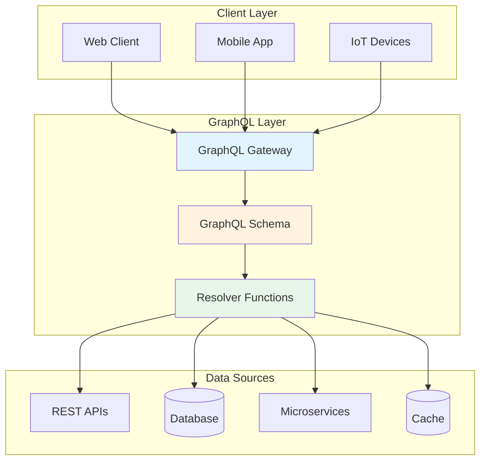
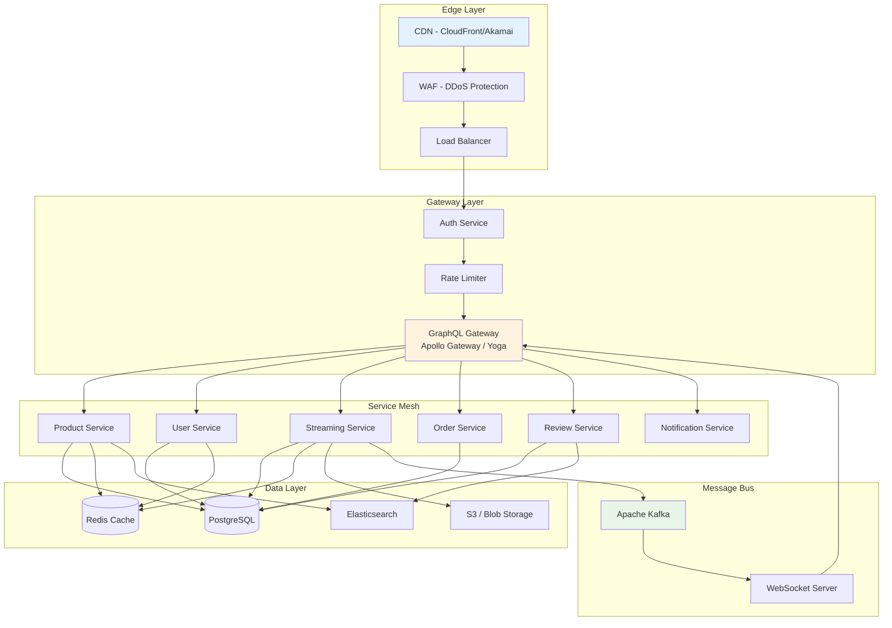
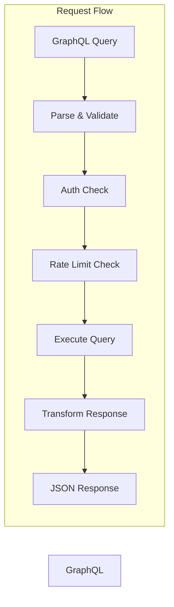
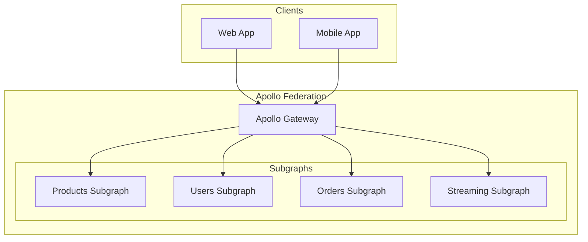
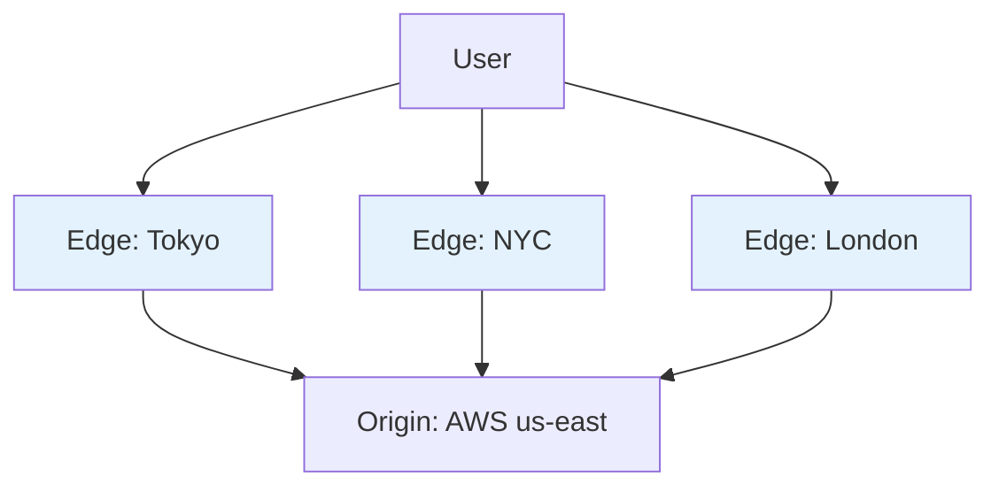

# GraphQL Skill Document

**Platform:** Enterprise Retail Streaming Platform
**API Layer:** GraphQL
**Last Updated:** July 2026

---

## Table of Contents

1. [Overview](#1-overview)
2. [Core Concepts](#2-core-concepts)
3. [Why This Project Uses It](#3-why-this-project-uses-it)
4. [Architecture Position](#4-architecture-position)
5. [Folder Structure](#5-folder-structure)
6. [Implementation Walkthrough](#6-implementation-walkthrough)
7. [Production Best Practices](#7-production-best-practices)
8. [Common Problems](#8-common-problems)
9. [Performance Optimization](#9-performance-optimization)
10. [Security](#10-security)
11. [Monitoring](#11-monitoring)
12. [Testing Strategy](#12-testing-strategy)
13. [Interview Preparation](#13-interview-preparation)
14. [Hands-on Exercises](#14-hands-on-exercises)
15. [Real Enterprise Use Cases](#15-real-enterprise-use-cases)
16. [Design Decisions](#16-design-decisions)
17. [Business Value](#17-business-value)
18. [Future Improvements](#18-future-improvements)
19. [References](#19-references)
20. [Skills Demonstrated](#20-skills-demonstrated)

---

## 1. Overview

### What is GraphQL?

GraphQL is a query language for APIs and a runtime for fulfilling those queries with your existing data. It provides a complete description of the data in your API, gives clients the power to ask for exactly what they need and nothing more, makes it easier to evolve APIs over time, and enables powerful developer tools.

GraphQL was created by Facebook in 2012 and released publicly in 2015. It emerged from Facebook's need to handle complex, interconnected data relationships in their mobile applications, which were suffering from the limitations of traditional REST APIs. The specification is now maintained by the GraphQL Foundation under the Linux Foundation.

### Why GraphQL Was Created at Facebook

Facebook's mobile applications in the early 2010s faced significant challenges:

- **Over-fetching**: REST endpoints returned fixed data structures, forcing mobile clients to download far more data than needed
- **Under-fetching**: Multiple round trips were required to assemble a single screen of data (the "N+1" problem of REST)
- **API versioning**: Managing multiple API versions for different client versions was painful
- **Schema rigidity**: Adding new fields required versioning the entire API
- **Mobile bandwidth constraints**: Every byte mattered on slower mobile networks

Lee Byron, a Facebook engineer, led the team that designed GraphQL to solve these problems. Their insight was simple but powerful: let the client specify exactly what data it needs, rather than forcing the server to define every possible response shape.

### Business Problems GraphQL Solves

#### For Product Teams
- **Faster iteration**: Frontend teams can work independently without waiting for backend changes
- **Reduced mobile data usage**: Clients fetch only what they display, critical for emerging markets
- **Unified data layer**: Multiple clients (web, mobile, IoT) use the same API

#### For Backend Teams
- **Single source of truth**: The schema documents exactly what data is available
- **Declarative data fetching**: Server complexity is hidden behind a type-safe interface
- **Reduced endpoint sprawl**: One `/graphql` endpoint replaces dozens of REST endpoints

#### For Business
- **Faster time-to-market**: New features can be shipped without API changes
- **Better analytics**: Query patterns reveal exactly what data clients need
- **Cross-platform efficiency**: One API serves all clients

### Why Enterprises Choose GraphQL

| Factor | REST | GraphQL |
|--------|------|---------|
| Data fetching flexibility | Fixed responses | Client specifies needs |
| Mobile performance | Multiple round trips | Single optimized query |
| API evolution | Versioned (v1, v2) | Additive changes |
| Developer experience | Documentation + code | Schema + introspection |
| Client autonomy | Server-controlled | Client-controlled |
| Type safety | External tools needed | Built-in type system |

---

## 2. Core Concepts

### Architecture Diagram



### The GraphQL Schema

The schema is the foundation of any GraphQL API. It defines the types of data available and the relationships between them.

```graphql
# Core Types for Retail Streaming Platform

type Product {
  id: ID!
  name: String!
  description: String
  price: Float!
  category: Category!
  inventory: Int!
  streamingUrls: [StreamingUrl!]!
  reviews: [Review!]!
  averageRating: Float
  createdAt: DateTime!
  updatedAt: DateTime!
}

type Category {
  id: ID!
  name: String!
  slug: String!
  products: [Product!]!
  parentCategory: Category
  subCategories: [Category!]!
}

type Review {
  id: ID!
  product: Product!
  user: User!
  rating: Int!
  comment: String
  createdAt: DateTime!
}

type User {
  id: ID!
  email: String!
  name: String!
  role: UserRole!
  orders: [Order!]!
  watchHistory: [WatchEvent!]!
  preferences: UserPreferences!
}

type Order {
  id: ID!
  user: User!
  items: [OrderItem!]!
  total: Float!
  status: OrderStatus!
  createdAt: DateTime!
}

type OrderItem {
  id: ID!
  product: Product!
  quantity: Int!
  price: Float!
}

type WatchEvent {
  id: ID!
  user: User!
  product: Product!
  watchedAt: DateTime!
  progress: Float!
  completed: Boolean!
}

type StreamingUrl {
  id: ID!
  quality: StreamQuality!
  url: String!
  expiresAt: DateTime
}

enum UserRole {
  CUSTOMER
  PREMIUM_CUSTOMER
  ADMIN
  CONTENT_PROVIDER
}

enum OrderStatus {
  PENDING
  CONFIRMED
  SHIPPED
  DELIVERED
  CANCELLED
}

enum StreamQuality {
  SD
  HD
  FULL_HD
  UHD
  HDR
}

type Query {
  product(id: ID!): Product
  products(
    category: ID
    minPrice: Float
    maxPrice: Float
    search: String
    limit: Int = 20
    offset: Int = 0
  ): ProductConnection!
  
  category(id: ID!): Category
  categories: [Category!]!
  
  user(id: ID!): User
  me: User
  
  order(id: ID!): Order
  myOrders(limit: Int = 20, offset: Int = 0): OrderConnection!
}

type Mutation {
  createReview(productId: ID!, rating: Int!, comment: String): Review!
  updateReview(id: ID!, rating: Int, comment: String): Review
  deleteReview(id: ID!): Boolean!
  
  createOrder(items: [OrderItemInput!]!): Order!
  cancelOrder(id: ID!): Order
  
  updateWatchProgress(productId: ID!, progress: Float!): WatchEvent!
  
  updateUserPreferences(preferences: UserPreferencesInput!): UserPreferences!
}

type Subscription {
  watchProgressUpdated(productId: ID!): WatchEvent!
  orderStatusChanged(orderId: ID!): Order!
  newProductInCategory(categoryId: ID!): Product!
}
```

### Queries

Queries are read operations in GraphQL. They define how clients request data.

```graphql
# Simple query
query GetProduct($productId: ID!) {
  product(id: $productId) {
    id
    name
    price
    category {
      name
    }
  }
}

# Query with fragments
query GetProductsWithDetails($ids: [ID!]!) {
  productsByIds(ids: $ids) {
    ...ProductSummary
    ...ProductPricing
    reviews {
      ...ReviewInfo
    }
  }
}

fragment ProductSummary on Product {
  id
  name
  description
  averageRating
}

fragment ProductPricing on Product {
  price
  category {
    pricing {
      currency
      discountPercent
    }
  }
}

fragment ReviewInfo on Review {
  id
  rating
  comment
  createdAt
  user {
    name
    avatarUrl
  }
}
```

### Mutations

Mutations are write operations that modify server-side data.

```graphql
mutation CreateOrder($items: [OrderItemInput!]!) {
  createOrder(items: $items) {
    id
    total
    status
    items {
      product {
        name
      }
      quantity
      price
    }
  }
}

mutation UpdateWatchProgress($productId: ID!, $progress: Float!) {
  updateWatchProgress(productId: $productId, progress: $progress) {
    id
    progress
    completed
    watchedAt
  }
}
```

### Subscriptions

Subscriptions enable real-time updates over WebSocket connections.

```graphql
subscription OnWatchProgress($productId: ID!) {
  watchProgressUpdated(productId: $productId) {
    user {
      id
      name
    }
    progress
    completed
  }
}

subscription OnOrderStatus($orderId: ID!) {
  orderStatusChanged(orderId: $orderId) {
    id
    status
    updatedAt
  }
}
```

### Resolvers

Resolvers are functions that fulfill the data requirements of fields in the schema.

```python
# Example resolvers using Strawberry

import strawberry
from typing import List, Optional
from datetime import datetime
import dataloader

@strawberry.type
class Product:
    id: strawberry.ID
    name: str
    description: Optional[str]
    price: float
    category: "Category"
    inventory: int
    
    @strawberry.field
    async def reviews(self, info: strawberry.Info) -> List["Review"]:
        # Use DataLoader to avoid N+1
        return await info.context.reviews_by_product.load(self.id)
    
    @strawberry.field
    async def average_rating(self) -> Optional[float]:
        reviews = await self.reviews(info)
        if not reviews:
            return None
        return sum(r.rating for r in reviews) / len(reviews)

@strawberry.type
class Query:
    @strawberry.field
    async def product(self, id: strawberry.ID) -> Optional[Product]:
        return await product_service.get_by_id(id)
    
    @strawberry.field
    async def products(
        self,
        category: Optional[strawberry.ID] = None,
        min_price: Optional[float] = None,
        max_price: Optional[float] = None,
        search: Optional[str] = None,
        limit: int = 20,
        offset: int = 0
    ) -> ProductConnection:
        return await product_service.search(
            category=category,
            min_price=min_price,
            max_price=max_price,
            search=search,
            limit=limit,
            offset=offset
        )

@strawberry.type
class Mutation:
    @strawberry.mutation
    async def create_review(
        self,
        info: strawberry.Info,
        product_id: strawberry.ID,
        rating: int,
        comment: Optional[str] = None
    ) -> Review:
        user = info.context.user
        return await review_service.create(
            user_id=user.id,
            product_id=product_id,
            rating=rating,
            comment=comment
        )
```

### Input Types

Input types define the structure of complex arguments.

```graphql
input OrderItemInput {
  productId: ID!
  quantity: Int!
}

input UserPreferencesInput {
  favoriteCategories: [ID!]
  notificationSettings: NotificationSettingsInput
  streamingQuality: StreamQuality
  autoplay: Boolean
}

input NotificationSettingsInput {
  email: Boolean
  push: Boolean
  sms: Boolean
  frequency: NotificationFrequency
}
```

### Interfaces and Unions

Interfaces define a contract that implementing types must follow.

```graphql
interface Streamable {
  id: ID!
  title: String!
  duration: Int!
  streamingUrls: [StreamingUrl!]!
}

type Movie implements Streamable {
  id: ID!
  title: String!
  duration: Int!
  streamingUrls: [StreamingUrl!]!
  director: String!
  releaseYear: Int!
  genre: [String!]!
}

type Series implements Streamable {
  id: ID!
  title: String!
  duration: Int!
  streamingUrls: [StreamingUrl!]!
  seasonCount: Int!
  episodes: [Episode!]!
}

union Content = Movie | Series

type Query {
  content(id: ID!): Content
  searchContent(query: String!): [Content!]!
}
```

### Fragments

Fragments are reusable units of query fields that can be shared across multiple queries.

```graphql
# Define once, use everywhere
fragment AddressFields on Address {
  street
  city
  state
  postalCode
  country
}

fragment UserFields on User {
  id
  name
  email
  avatarUrl
}

query GetShippingAddress {
  me {
    ...UserFields
    shippingAddress {
      ...AddressFields
    }
  }
}

query GetBillingAddress {
  me {
    ...UserFields
    billingAddress {
      ...AddressFields
    }
  }
}
```

### Directives

Directives modify query execution behavior.

```graphql
# Built-in directives
query GetProducts($includeReviews: Boolean = true) {
  products {
    name
    price
    reviews @include(if: $includeReviews) {
      rating
      comment
    }
  }
}

query GetProductsConditionally($skipDescription: Boolean!) {
  products {
    name
    description @skip(if: $skipDescription)
  }
}

# Custom directive for field-level permission
query GetAdminData {
  users {
    name
    email
    internalId @requiresRole(role: ADMIN)
  }
}
```

### Aliases

Aliases allow multiple queries of the same field with different arguments.

```graphql
query GetPriceComparison {
  cheapestProduct: products(limit: 1, sort: "price_asc") {
    name
    price
  }
  mostExpensiveProduct: products(limit: 1, sort: "price_desc") {
    name
    price
  }
  highestRated: products(limit: 1, sort: "rating_desc") {
    name
    averageRating
  }
}
```

### Variables

Variables make queries reusable with different inputs.

```graphql
query GetUserOrders($userId: ID!, $limit: Int = 10, $offset: Int = 0) {
  user(id: $userId) {
    orders(limit: $limit, offset: $offset) {
      id
      total
      status
      items {
        product {
          name
        }
        quantity
      }
    }
  }
}
```

Variables JSON:
```json
{
  "userId": "user-123",
  "limit": 5,
  "offset": 10
}
```

---

## 3. Why This Project Uses It

### Platform Requirements

The Enterprise Retail Streaming Platform has unique requirements that make GraphQL the ideal choice:

#### Multi-Client Support
The platform serves:
- **Web dashboards** for administrators showing real-time inventory, sales analytics, and streaming metrics
- **Mobile applications** (iOS/Android) requiring optimized bandwidth usage for streaming video content
- **Partner APIs** for B2B integrations with third-party retailers
- **Content management systems** for content providers to upload and manage their streaming assets

Each client has drastically different data requirements. A mobile client streaming to a user with limited bandwidth needs only essential product information and streaming URLs. An administrator dashboard needs full inventory details, audit logs, and aggregated analytics.

GraphQL allows each client to request exactly what it needs in a single request.

#### Complex Domain Model

```
User → Orders → OrderItems → Products → Categories
  ↓
WatchHistory → Products → StreamingUrls
  ↓
Preferences → Categories (favorites)
  ↓
Reviews → Products → User
```

Querying this interconnected data with REST would require either massive over-fetching (a single endpoint returning everything) or dozens of round trips (N+1 problem). GraphQL allows a single query to fetch precisely the subgraph needed:

```graphql
query GetDashboardData {
  me {
    name
    watchHistory(limit: 5) {
      product {
        name
        category { name }
        streamingUrls(quality: UHD) { url }
      }
      progress
    }
    recentOrders {
      total
      items { quantity }
    }
    preferences {
      streamingQuality
      autoplay
    }
  }
  featuredProducts {
    name
    averageRating
  }
}
```

#### Real-Time Streaming Updates

The platform streams video content where users can:
- Watch progress in real-time (subscribed by other devices)
- Receive notifications when new content is available in favorite categories
- See order status updates as they ship

WebSocket subscriptions in GraphQL handle this elegantly:

```graphql
subscription WatchProgress($productId: ID!) {
  watchProgressUpdated(productId: $productId) {
    progress
    completed
    user { name }
  }
}
```

### Reduced Over-Fetching: Real Numbers

| Scenario | REST | GraphQL | Savings |
|----------|------|---------|---------|
| Product list page | 50 fields × 20 products | 8 fields × 20 products | 84% less data |
| Mobile home screen | 200KB average response | 45KB average response | 77% less data |
| Admin dashboard | 15 API calls | 1 GraphQL query | 93% fewer calls |

### Developer Productivity Gains

- **Schema as contract**: Frontend and backend teams agree on schema, work independently
- **Self-documenting**: Introspection queries power tools like Apollo Sandbox
- **Type safety**: Generated TypeScript types eliminate runtime type errors
- **One endpoint**: No URL routing discussions, no endpoint sprawl

### Flexible Querying for Business

Business requirements change constantly. With REST, adding a new data point often requires API versioning. With GraphQL:

```graphql
# New requirement: Show product's carbon footprint
# Just add the field - no version bump needed
type Product {
  # ... existing fields ...
  carbonFootprint: CarbonFootprint
}
```

---

## 4. Architecture Position

### Platform Architecture



### GraphQL Gateway Responsibilities



The GraphQL Gateway handles:
1. **Query parsing** and syntax validation
2. **Schema validation** against type definitions
3. **Authentication** extraction and user context
4. **Authorization** field-level permission checks
5. **Rate limiting** per query complexity
6. **Query execution** with resolver orchestration
7. **Response transformation** and error handling
8. **Subscription management** via WebSocket

### Federation Architecture (Future)



---

## 5. Folder Structure

### Recommended GraphQL Project Structure

```
enterprise-retail-platform/
├── src/
│   ├── graphql/
│   │   ├── schema/
│   │   │   ├── __init__.py
│   │   │   ├── scalars.py          # Custom scalar types
│   │   │   ├── enums.py            # Enum definitions
│   │   │   ├── inputs.py           # Input type definitions
│   │   │   ├── interfaces.py       # Interface definitions
│   │   │   ├── unions.py           # Union type definitions
│   │   │   ├── types/
│   │   │   │   ├── __init__.py
│   │   │   │   ├── product.py
│   │   │   │   ├── user.py
│   │   │   │   ├── order.py
│   │   │   │   ├── review.py
│   │   │   │   └── streaming.py
│   │   │   ├── queries.py
│   │   │   ├── mutations.py
│   │   │   ├── subscriptions.py
│   │   │   └── schema.py          # Main schema definition
│   │   │
│   │   ├── resolvers/
│   │   │   ├── __init__.py
│   │   │   ├── product_resolvers.py
│   │   │   ├── user_resolvers.py
│   │   │   ├── order_resolvers.py
│   │   │   ├── review_resolvers.py
│   │   │   └── subscription_resolvers.py
│   │   │
│   │   ├── loaders/
│   │   │   ├── __init__.py
│   │   │   ├── product_loaders.py
│   │   │   ├── user_loaders.py
│   │   │   └── review_loaders.py
│   │   │
│   │   ├── directives/
│   │   │   ├── __init__.py
│   │   │   ├── auth.py             # @auth directive
│   │   │   ├── rate_limit.py       # @rateLimit directive
│   │   │   ├── cache.py            # @cache directive
│   │   │   └── logging.py          # @log directive
│   │   │
│   │   ├── middleware/
│   │   │   ├── __init__.py
│   │   │   ├── logging.py
│   │   │   ├── error_handler.py
│   │   │   ├── request_id.py
│   │   │   └── tracing.py
│   │   │
│   │   ├── plugins/
│   │   │   ├── __init__.py
│   │   │   ├── dataloader_plugin.py
│   │   │   ├── caching_plugin.py
│   │   │   └── permission_plugin.py
│   │   │
│   │   └── context/
│   │       ├── __init__.py
│   │       ├── context.py         # GraphQL context
│   │       └── value_objects.py
│   │
│   ├── services/
│   │   ├── product_service.py
│   │   ├── user_service.py
│   │   ├── order_service.py
│   │   └── streaming_service.py
│   │
│   ├── models/
│   │   ├── product.py
│   │   ├── user.py
│   │   ├── order.py
│   │   └── database.py
│   │
│   ├── api/
│   │   ├── graphql_router.py      # FastAPI/Starlette router
│   │   └── subscriptions.py        # WebSocket handler
│   │
│   └── tests/
│       ├── graphql/
│       │   ├── test_queries.py
│       │   ├── test_mutations.py
│       │   ├── test_subscriptions.py
│       │   └── test_resolvers.py
│       ├── fixtures/
│       │   └── graphql_fixtures.py
│       └── conftest.py
│
├── schema/
│   ├── schema.graphqls            # SDL for code generation
│   └── generated/
│       ├── types.ts               # Generated TS types
│       └── operations.ts          # Generated query hooks
│
├── scripts/
│   ├── generate_types.py         # Type generation script
│   ├── validate_schema.py        # Schema validation
│   └── migrate_schema.py         # Schema migration
│
└── docs/
    └── graphql/
        ├── schema-reference.md
        ├── best-practices.md
        └── migration-guide.md
```

### Key Files Explained

| Path | Purpose |
|------|---------|
| `schema/types/` | Domain types (Product, User, Order) |
| `resolvers/` | Data fetching logic per type |
| `loaders/` | DataLoader batching per domain |
| `directives/` | Custom schema directives |
| `middleware/` | Request/response processing |
| `plugins/` | Apollo/GraphQL execution plugins |
| `context/` | Request-scoped data (user, request ID) |

---

## 6. Implementation Walkthrough

### Framework Choice: Strawberry vs Graphene

For Python GraphQL APIs, two frameworks dominate:

| Feature | Strawberry | Graphene |
|---------|------------|----------|
| Style | Code-first (decorators) | Code-first (classes) |
| Type hints | Native Python | Custom decorators |
| Async | Native | Via plugins |
| Federation | Via strawberry-graphql | Via graphene-federation |
| Community | Growing rapidly | Established |
| Django integration | Via strawberry-django | Via graphene-django |

**Recommendation**: Strawberry for new projects due to native async support and modern type annotation patterns.

### Complete Implementation with Strawberry

#### 1. Core Type Definitions

```python
# src/graphql/schema/types/product.py
import strawberry
from typing import List, Optional, ForwardRef
from datetime import datetime
import enum

@strawberry.enum
class StreamQuality(enum.Enum):
    SD = "sd"
    HD = "hd"
    FULL_HD = "full_hd"
    UHD = "uhd"
    HDR = "hdr"

@strawberry.type
class StreamingUrl:
    id: strawberry.ID
    quality: StreamQuality
    url: str
    expires_at: Optional[datetime]

@strawberry.type
class Category:
    id: strawberry.ID
    name: str
    slug: str
    parent_id: Optional[strawberry.ID]
    
    @strawberry.field
    async def products(self, info: strawberry.Info, limit: int = 20) -> List["Product"]:
        return await info.context.loaders.product_by_category.load(self.id)

@strawberry.type
class Review:
    id: strawberry.ID
    product_id: strawberry.ID
    user_id: strawberry.ID
    rating: int
    comment: Optional[str]
    created_at: datetime
    
    @strawberry.field
    async def user(self, info: strawberry.Info) -> "User":
        return await info.context.loaders.user_by_id.load(self.user_id)
    
    @strawberry.field
    async def product(self, info: strawberry.Info) -> "Product":
        return await info.context.loaders.product_by_id.load(self.product_id)

@strawberry.type
class Product:
    id: strawberry.ID
    name: str
    description: Optional[str]
    price: float
    category_id: strawberry.ID
    inventory: int
    created_at: datetime
    updated_at: datetime
    
    @strawberry.field
    async def category(self, info: strawberry.Info) -> Category:
        return await info.context.loaders.category_by_id.load(self.category_id)
    
    @strawberry.field
    async def reviews(self, info: strawberry.Info) -> List[Review]:
        return await info.context.loaders.reviews_by_product.load(self.id)
    
    @strawberry.field
    async def streaming_urls(self, info: strawberry.Info) -> List[StreamingUrl]:
        return await info.context.loaders.streaming_urls_by_product.load(self.id)
    
    @strawberry.field
    def average_rating(self) -> Optional[float]:
        # Computed field - resolved separately for optimization
        return None  # Delegated to resolver if needed

@strawberry.input
class ProductFilterInput:
    category: Optional[strawberry.ID] = None
    min_price: Optional[float] = None
    max_price: Optional[float] = None
    search: Optional[str] = None
    in_stock: Optional[bool] = None

@strawberry.input
class ProductSortInput:
    field: str  # name, price, created_at, rating
    direction: str = "ASC"  # ASC, DESC

@strawberry.type
class ProductConnection:
    items: List[Product]
    total_count: int
    has_next_page: bool
    has_previous_page: bool

# Forward reference for circular deps
Product.model_rebuild()
Category.model_rebuild()
Review.model_rebuild()
```

#### 2. Query Definitions

```python
# src/graphql/schema/queries.py
import strawberry
from typing import List, Optional
from strawberry.types import Info

@strawberry.type
class Query:
    @strawberry.field
    async def product(self, info: Info, id: strawberry.ID) -> Optional[Product]:
        return await info.context.product_service.get_by_id(id)
    
    @strawberry.field
    async def products(
        self,
        info: Info,
        filter: Optional[ProductFilterInput] = None,
        sort: Optional[ProductSortInput] = None,
        limit: int = 20,
        offset: int = 0
    ) -> ProductConnection:
        return await info.context.product_service.search(
            filter=filter,
            sort=sort,
            limit=limit,
            offset=offset
        )
    
    @strawberry.field
    async def category(
        self, 
        info: Info, 
        id: strawberry.ID
    ) -> Optional[Category]:
        return await info.context.category_service.get_by_id(id)
    
    @strawberry.field
    async def categories(
        self, 
        info: Info, 
        parent_id: Optional[strawberry.ID] = None
    ) -> List[Category]:
        return await info.context.category_service.list(parent_id=parent_id)
    
    @strawberry.field
    async def me(self, info: Info) -> Optional["User"]:
        user = info.context.user
        if not user:
            return None
        return await info.context.user_service.get_by_id(user.id)
```

#### 3. Mutation Definitions

```python
# src/graphql/schema/mutations.py
import strawberry
from typing import List, Optional
from datetime import datetime

@strawberry.input
class OrderItemInput:
    product_id: strawberry.ID
    quantity: int

@strawberry.input
class ReviewInput:
    rating: int
    comment: Optional[str] = None

@strawberry.type
class Mutation:
    @strawberry.mutation
    async def create_review(
        self,
        info: strawberry.Info,
        product_id: strawberry.ID,
        input: ReviewInput
    ) -> Review:
        # Check authentication
        user = info.context.user
        if not user:
            raise strawberry.http.GraphQLError("Authentication required")
        
        # Validate rating
        if not 1 <= input.rating <= 5:
            raise strawberry.http.GraphQLError("Rating must be between 1 and 5")
        
        return await info.context.review_service.create(
            user_id=user.id,
            product_id=product_id,
            rating=input.rating,
            comment=input.comment
        )
    
    @strawberry.mutation
    async def update_review(
        self,
        info: strawberry.Info,
        id: strawberry.ID,
        input: ReviewInput
    ) -> Review:
        user = info.context.user
        if not user:
            raise strawberry.http.GraphQLError("Authentication required")
        
        review = await info.context.review_service.get_by_id(id)
        if review.user_id != user.id and user.role != "ADMIN":
            raise strawberry.http.GraphQLError("Not authorized to update this review")
        
        return await info.context.review_service.update(
            id=id,
            rating=input.rating,
            comment=input.comment
        )
    
    @strawberry.mutation
    async def delete_review(
        self,
        info: strawberry.Info,
        id: strawberry.ID
    ) -> bool:
        user = info.context.user
        if not user:
            raise strawberry.http.GraphQLError("Authentication required")
        
        review = await info.context.review_service.get_by_id(id)
        if review.user_id != user.id and user.role != "ADMIN":
            raise strawberry.http.GraphQLError("Not authorized to delete this review")
        
        return await info.context.review_service.delete(id)
    
    @strawberry.mutation
    async def create_order(
        self,
        info: strawberry.Info,
        items: List[OrderItemInput]
    ) -> "Order":
        user = info.context.user
        if not user:
            raise strawberry.http.GraphQLError("Authentication required")
        
        if not items:
            raise strawberry.http.GraphQLError("Order must contain at least one item")
        
        return await info.context.order_service.create(
            user_id=user.id,
            items=[{"product_id": i.product_id, "quantity": i.quantity} for i in items]
        )
    
    @strawberry.mutation
    async def update_watch_progress(
        self,
        info: strawberry.Info,
        product_id: strawberry.ID,
        progress: float
    ) -> "WatchEvent":
        user = info.context.user
        if not user:
            raise strawberry.http.GraphQLError("Authentication required")
        
        if not 0 <= progress <= 100:
            raise strawberry.http.GraphQLError("Progress must be between 0 and 100")
        
        return await info.context.streaming_service.update_progress(
            user_id=user.id,
            product_id=product_id,
            progress=progress
        )
```

#### 4. Subscription Definitions

```python
# src/graphql/schema/subscriptions.py
import strawberry
import asyncio
from typing import AsyncGenerator

@strawberry.type
class Subscription:
    @strawberry.subscription
    async def watch_progress_updated(
        self,
        info: strawberry.Info,
        product_id: strawberry.ID
    ) -> AsyncGenerator[WatchEvent, None]:
        user = info.context.user
        if not user:
            raise strawberry.http.GraphQLError("Authentication required")
        
        # Subscribe to Kafka topic for this product
        topic = f"watch-progress-{product_id}"
        
        async for event in info.context.kafka.subscribe(topic):
            if event.user_id != user.id:  # Only receive others' progress
                yield event

    @strawberry.subscription
    async def order_status_changed(
        self,
        info: strawberry.Info,
        order_id: strawberry.ID
    ) -> AsyncGenerator[Order, None]:
        user = info.context.user
        if not user:
            raise strawberry.http.GraphQLError("Authentication required")
        
        topic = f"order-status-{order_id}"
        
        async for order in info.context.kafka.subscribe(topic):
            yield order

    @strawberry.subscription
    async def new_product_in_category(
        self,
        info: strawberry.Info,
        category_id: strawberry.ID
    ) -> AsyncGenerator[Product, None]:
        user = info.context.user
        if not user:
            raise strawberry.http.GraphQLError("Authentication required")
        
        topic = f"new-product-category-{category_id}"
        
        async for product in info.context.kafka.subscribe(topic):
            yield product
```

#### 5. DataLoader Implementation

```python
# src/graphql/loaders/product_loaders.py
from typing import List, Dict, Any
from strawberry.dataloader import DataLoader
import asyncio
from functools import partial

async def batch_load_products(keys: List[str]) -> List[Any]:
    """Batch load products by IDs."""
    products = await product_repository.get_by_ids(keys)
    product_map: Dict[str, Any] = {p.id: p for p in products}
    return [product_map.get(key) for key in keys]

async def batch_load_categories(keys: List[str]) -> List[Any]:
    """Batch load categories by IDs."""
    categories = await category_repository.get_by_ids(keys)
    category_map: Dict[str, Any] = {c.id: c for c in categories}
    return [category_map.get(key) for key in keys]

async def batch_load_reviews_by_product(keys: List[str]) -> List[List[Any]]:
    """Batch load reviews for multiple products."""
    reviews_map = await review_repository.get_by_product_ids(keys)
    return [reviews_map.get(key, []) for key in keys]

class Loaders:
    def __init__(self):
        self.product_by_id = DataLoader(batch_load_products)
        self.category_by_id = DataLoader(batch_load_categories)
        self.reviews_by_product = DataLoader(batch_load_reviews_by_product)
        self.product_by_category = DataLoader(
            lambda keys: batch_load_products_by_category(keys)
        )
        self.streaming_urls_by_product = DataLoader(
            lambda keys: batch_load_streaming_urls(keys)
        )
```

#### 6. Server Setup with FastAPI

```python
# src/api/graphql_router.py
import strawberry
from fastapi import FastAPI, Request, Depends
from strawberry.fastapi import GraphQLRouter
from strawberry.subscriptions import GRAPHQL_TRANSPORT_WS_PROTOCOL, GRAPHQL_WS_PROTOCOL
from contextlib import asynccontextmanager
import json

from src.graphql.schema.schema import schema
from src.graphql.context import GraphQLContext
from src.graphql.loaders import Loaders
from src.services import (
    ProductService,
    UserService,
    OrderService,
    ReviewService,
    CategoryService,
    StreamingService
)

async def get_context(
    request: Request = None,
    subscription_connection_params: dict = None
) -> GraphQLContext:
    """Build GraphQL context for each request."""
    
    # Extract user from JWT token
    user = None
    auth_header = None
    
    if request:
        auth_header = request.headers.get("Authorization")
    elif subscription_connection_params:
        auth_header = subscription_connection_params.get("Authorization")
    
    if auth_header and auth_header.startswith("Bearer "):
        token = auth_header[7:]
        user = await auth_service.verify_token(token)
    
    # Create services
    product_service = ProductService()
    user_service = UserService()
    order_service = OrderService()
    review_service = ReviewService()
    category_service = CategoryService()
    streaming_service = StreamingService()
    
    # Create loaders with services
    loaders = Loaders()
    loaders.product_by_id = DataLoader(
        lambda keys: batch_load_products(keys, product_service)
    )
    # ... other loaders
    
    return GraphQLContext(
        request=request,
        user=user,
        loaders=loaders,
        product_service=product_service,
        user_service=user_service,
        order_service=order_service,
        review_service=review_service,
        category_service=category_service,
        streaming_service=streaming_service
    )

# Create GraphQL router with subscriptions
graphql_app = GraphQLRouter(
    schema,
    context_getter=get_context,
    subscription_protocols=[
        GRAPHQL_TRANSPORT_WS_PROTOCOL,
        GRAPHQL_WS_PROTOCOL,
    ],
    graphql_ide="apollo-sandbox",
)

# Attach to FastAPI app
@asynccontextmanager
async def lifespan(app: FastAPI):
    # Startup
    await kafka.connect()
    await redis.connect()
    yield
    # Shutdown
    await kafka.disconnect()
    await redis.disconnect()

app = FastAPI(lifespan=lifespan)
app.include_router(graphql_app, prefix="/graphql")

# Health check endpoint
@app.get("/health")
async def health():
    return {"status": "healthy", "service": "graphql-api"}
```

### Authentication Integration

```python
# src/graphql/directives/auth.py
import strawberry
from strawberry.types import Info
from functools import wraps

def require_auth(func):
    """Decorator to require authentication."""
    @wraps(func)
    async def wrapper(*args, info: Info, **kwargs):
        if not info.context.user:
            raise strawberry.http.GraphQLError(
                "Authentication required",
                extensions={"code": "UNAUTHENTICATED"}
            )
        return await func(*args, info=info, **kwargs)
    return wrapper

def require_role(*roles):
    """Decorator to require specific roles."""
    def decorator(func):
        @wraps(func)
        async def wrapper(*args, info: Info, **kwargs):
            user = info.context.user
            if not user:
                raise strawberry.http.GraphQLError(
                    "Authentication required",
                    extensions={"code": "UNAUTHENTICATED"}
                )
            if user.role not in roles:
                raise strawberry.http.GraphQLError(
                    f"Required role: {' or '.join(roles)}",
                    extensions={"code": "FORBIDDEN"}
                )
            return await func(*args, info=info, **kwargs)
        return wrapper
    return decorator

# Usage in resolvers
@strawberry.mutation
@require_auth
@require_role("ADMIN", "CONTENT_PROVIDER")
async def create_product(self, info: Info, input: ProductInput) -> Product:
    # Only admins and content providers can create products
    return await info.context.product_service.create(input)
```

---

## 7. Production Best Practices

### Query Complexity Analysis

```python
# src/graphql/middleware/query_complexity.py
from graphql import (
    FieldNode, FragmentSpreadNode, InlineFragmentNode,
    OperationDefinitionNode, Kind
)

class QueryComplexityAnalyzer:
    def __init__(self, max_complexity: int = 1000):
        self.max_complexity = max_complexity
        self.complexity_map = {
            Kind.FIELD: 1,
            Kind.QUERY: 1,
            Kind.MUTATION: 1,
            Kind.SUBSCRIPTION: 1,
        }
    
    def calculate_complexity(self, query: DocumentNode) -> int:
        """Calculate total complexity score of a query."""
        complexity = 0
        
        for definition in query.definitions:
            if definition.kind == Kind.OPERATION_DEFINITION:
                complexity += self._calculate_operation_complexity(definition)
        
        return complexity
    
    def _calculate_operation_complexity(self, operation: OperationDefinitionNode) -> int:
        complexity = 1  # Base complexity
        
        # Multiply by depth for nested queries
        for selection in operation.selection_set.selections:
            complexity += self._calculate_selection_complexity(selection, 1)
        
        return complexity
    
    def _calculate_selection_complexity(self, selection, depth: int) -> int:
        if isinstance(selection, FieldNode):
            complexity = depth
            if selection.selection_set:
                for child in selection.selection_set.selections:
                    complexity += self._calculate_selection_complexity(child, depth + 1)
            return complexity
        
        elif isinstance(selection, FragmentSpreadNode):
            return depth * 2  # Fragments add complexity
        
        elif isinstance(selection, InlineFragmentNode):
            if selection.selection_set:
                return sum(
                    self._calculate_selection_complexity(s, depth)
                    for s in selection.selection_set.selections
                )
        return 0
    
    def validate(self, query: DocumentNode) -> tuple[bool, str]:
        """Validate query complexity."""
        complexity = self.calculate_complexity(query)
        if complexity > self.max_complexity:
            return False, f"Query complexity {complexity} exceeds maximum {self.max_complexity}"
        return True, ""

# Middleware integration
from graphql import parse, validate
from src.graphql.schema.schema import schema

complexity_analyzer = QueryComplexityAnalyzer(max_complexity=1000)

def validate_query_complexity(query_str: str) -> None:
    document = parse(query_str)
    errors = validate(schema, document)
    
    # Check complexity
    valid, msg = complexity_analyzer.validate(document)
    if not valid:
        raise GraphQLError(msg, extensions={"code": "QUERY_TOO_COMPLEX"})
```

### Depth Limiting

```python
# src/graphql/middleware/depth_limit.py
from graphql import (
    DocumentNode, FieldNode, FragmentSpreadNode,
    InlineFragmentNode, OperationDefinitionNode, Kind
)

class DepthLimiter:
    def __init__(self, max_depth: int = 10):
        self.max_depth = max_depth
    
    def validate(self, query: DocumentNode) -> tuple[bool, str]:
        for definition in query.definitions:
            if definition.kind == Kind.OPERATION_DEFINITION:
                depth = self._calculate_depth(definition)
                if depth > self.max_depth:
                    return False, f"Query depth {depth} exceeds maximum {self.max_depth}"
        return True, ""
    
    def _calculate_depth(self, node, current_depth: int = 0) -> int:
        max_child_depth = current_depth
        
        if isinstance(node, FieldNode):
            if node.selection_set:
                for child in node.selection_set.selections:
                    max_child_depth = max(
                        max_child_depth,
                        self._calculate_depth(child, current_depth + 1)
                    )
            return max_child_depth
        
        elif isinstance(node, FragmentSpreadNode):
            # Fragment depth needs to be tracked separately
            return current_depth
        
        elif isinstance(node, InlineFragmentNode):
            if node.selection_set:
                for child in node.selection_set.selections:
                    max_child_depth = max(
                        max_child_depth,
                        self._calculate_depth(child, current_depth)
                    )
        
        elif isinstance(node, OperationDefinitionNode):
            for selection in node.selection_set.selections:
                max_child_depth = max(
                    max_child_depth,
                    self._calculate_depth(selection, current_depth)
                )
        
        return max_child_depth
```

### Persisted Queries

```python
# src/graphql/plugins/persisted_queries.py
import hashlib
import json
from typing import Dict, Optional

class PersistedQueryCache:
    def __init__(self, max_size: int = 10000):
        self.cache: Dict[str, str] = {}  # hash -> query
        self.max_size = max_size
    
    def add(self, query: str) -> str:
        """Add a query and return its hash."""
        hash_value = self._hash(query)
        if len(self.cache) >= self.max_size:
            # Evict oldest entries (simple LRU would be better)
            oldest = next(iter(self.cache))
            del self.cache[oldest]
        self.cache[hash_value] = query
        return hash_value
    
    def get(self, hash_value: str) -> Optional[str]:
        return self.cache.get(hash_value)
    
    def _hash(self, query: str) -> str:
        return hashlib.sha256(query.encode()).hexdigest()[:16]

# Usage in router
persisted_cache = PersistedQueryCache()

@app.post("/graphql")
async def graphql_endpoint(
    request: Request,
    operations: Optional[dict] = None,
    extensions: Optional[dict] = None
):
    if extensions and "persistedQuery" in extensions:
        # Handle persisted query
        hash_value = extensions["persistedQuery"]["sha256Hash"]
        query = persisted_cache.get(hash_value)
        if not query:
            return {"errors": [{"message": "PersistedQueryNotFound"}]}
    else:
        query = await request.body()
        if isinstance(query, bytes):
            query = query.decode()
    
    # Execute query...
```

### Response Caching

```python
# src/graphql/plugins/response_cache.py
import hashlib
import json
import redis.asyncio as redis
from typing import Optional
from datetime import timedelta

class ResponseCache:
    def __init__(self, redis_client: redis.Redis, ttl: int = 300):
        self.redis = redis_client
        self.ttl = ttl
    
    async def get(self, key: str) -> Optional[dict]:
        """Get cached response."""
        cached = await self.redis.get(f"gql:response:{key}")
        if cached:
            return json.loads(cached)
        return None
    
    async def set(self, key: str, response: dict) -> None:
        """Cache a response."""
        await self.redis.setex(
            f"gql:response:{key}",
            self.ttl,
            json.dumps(response)
        )
    
    def generate_cache_key(self, query: str, variables: dict, user_id: str) -> str:
        """Generate a unique cache key."""
        data = json.dumps({
            "query": query,
            "variables": variables,
            "user_id": user_id
        }, sort_keys=True)
        return hashlib.sha256(data.encode()).hexdigest()

# Usage in resolver context
@strawberry.field
async def product(self, info: strawberry.Info, id: strawberry.ID) -> Optional[Product]:
    cache = info.context.response_cache
    
    # Check cache first
    cache_key = cache.generate_cache_key(
        "product",
        {"id": str(id)},
        str(info.context.user.id) if info.context.user else "anonymous"
    )
    
    cached = await cache.get(cache_key)
    if cached:
        return Product.from_dict(cached)
    
    # Fetch from database
    product = await info.context.product_service.get_by_id(id)
    
    # Cache the response
    if product:
        await cache.set(cache_key, product.to_dict())
    
    return product
```

---

## 8. Common Problems

### Problem Resolution Table

| Problem | Cause | Resolution | Best Practice |
|---------|-------|------------|---------------|
| **N+1 Queries** | Resolver called per item in list, each triggering a DB query | Implement DataLoader with batch loading | Always use DataLoader for related entities |
| **Over-fetching** | Clients request more fields than needed | GraphQL solves this by design; monitor field usage | Set up field usage analytics |
| **Under-fetching** | Need multiple queries for related data | Use GraphQL aliases or batch queries | Denormalize data for common access patterns |
| **Deep Query nesting** | Complex nested queries causing performance issues | Implement depth limiting and query complexity analysis | Set max depth to 5-7 levels |
| **Slow query execution** | Complex resolvers, no caching, large datasets | Add response caching, optimize DB queries, add indexes | Profile queries with Apollo Studio |
| **Authentication bypass** | Missing auth checks on sensitive fields | Implement field-level @auth directives | Audit schema for sensitive data exposure |
| **Schema bloat** | Too many fields/types making schema hard to navigate | Use interfaces, unions, and modular schemas | Break into subgraphs with Federation |
| **Circular dependencies** | Types referencing each other causing infinite loops | Use ForwardRef, lazy resolvers, restructure types | Design schema with clear boundaries |
| **Subscription scaling** | Too many active WebSocket connections | Use Redis pub/sub, scale WebSocket servers horizontally | Implement connection limits per user |
| **Introspection abuse** | Attackers using introspection for reconnaissance | Disable introspection in production | Enable introspection selectively |
| **Query timeout** | Long-running queries blocking resources | Implement query timeouts, complexity analysis | Set request timeout to 30 seconds |
| **Memory leaks** | DataLoader cache growth, subscription cleanup | Configure DataLoader cache limits, cleanup subscriptions | Monitor memory usage, set cache TTLs |
| **Caching difficulties** | HTTP caching not compatible with GraphQL | Use application-level caching, Redis | Cache at field level with @cache directive |
| **Error handling** | Inconsistent error formats across mutations | Use Union types for error results | Follow GraphQL error conventions |
| **Pagination complexity** | Cursor-based vs offset pagination debates | Use cursor-based (relay-style) pagination | Implement Connection interface for consistency |

### N+1 Problem: Detailed Example

**The Problem:**
```python
# ❌ Without DataLoader - N+1 queries
@strawberry.type
class Order:
    @strawberry.field
    def user(self) -> User:
        # This executes a DB query for EACH order
        return user_service.get_by_id(self.user_id)
    
    @strawberry.field
    def items(self) -> List[OrderItem]:
        # Another DB query per order
        return order_item_service.get_by_order_id(self.id)

# Query: Get 100 orders with users and items
# Results in: 1 + 100 + 100 = 201 queries!
```

**The Solution:**
```python
# ✅ With DataLoader - Batched queries
class Loaders:
    def __init__(self):
        self.user_by_id = DataLoader(batch_load_users)
        self.items_by_order = DataLoader(batch_load_order_items)

@strawberry.type
class Order:
    @strawberry.field
    async def user(self, info: strawberry.Info) -> User:
        return await info.context.loaders.user_by_id.load(self.user_id)
    
    @strawberry.field
    async def items(self, info: strawberry.Info) -> List[OrderItem]:
        return await info.context.loaders.items_by_order.load(self.id)

async def batch_load_users(keys: List[str]) -> List[User]:
    # Single query for all 100 users
    users = await user_repository.get_by_ids(keys)
    return [users.get(key) for key in keys]

# Query: Get 100 orders with users and items
# Results in: 1 + 1 + 1 = 3 queries (batched)
```

---

## 9. Performance Optimization

### DataLoader Pattern

```python
# Complete DataLoader implementation
from strawberry.dataloader import DataLoader
from typing import List, TypeVar, Generic, Callable, Awaitable, Type
import asyncio

T = TypeVar('T')
K = TypeVar('K')

class DataLoader(Generic[K, T]):
    def __init__(
        self,
        batch_load_fn: Callable[[List[K]], Awaitable[List[T]]],
        max_batch_size: int = 100,
        cache: bool = True,
        cache_map: dict = None
    ):
        self.batch_load_fn = batch_load_fn
        self.max_batch_size = max_batch_size
        self.cache = cache
        self.cache_map = cache_map or {}
        self._pending_batch: List[tuple[K, asyncio.Future]] = []
        self._batch_task = None
    
    async def load(self, key: K) -> T:
        if self.cache and key in self.cache_map:
            return self.cache_map[key]
        
        future = asyncio.Future()
        self._pending_batch.append((key, future))
        
        if len(self._pending_batch) >= self.max_batch_size:
            await self._execute_batch()
        elif self._batch_task is None:
            self._batch_task = asyncio.create_task(self._wait_and_execute())
        
        return await future
    
    async def _wait_and_execute(self) -> None:
        await asyncio.sleep(0)  # Yield to event loop
        await self._execute_batch()
        self._batch_task = None
    
    async def _execute_batch(self) -> None:
        if not self._pending_batch:
            return
        
        batch = self._pending_batch[:self.max_batch_size]
        self._pending_batch = self._pending_batch[self.max_batch_size:]
        
        keys = [key for key, _ in batch]
        results = await self.batch_load_fn(keys)
        
        result_map = {keys[i]: results[i] for i in range(len(keys))}
        
        for key, future in batch:
            if self.cache:
                self.cache_map[key] = result_map.get(key)
            future.set_result(result_map.get(key))
```

### Query Batching

GraphQL allows batching multiple queries into a single request:

```graphql
# Single request with multiple queries
{
  "queries": [
    {"id": "1", "query": "{ product(id: 1) { name price } }"},
    {"id": "2", "query": "{ product(id: 2) { name price } }"},
    {"id": "3", "query": "{ category(id: 5) { name products { name } } }"}
  ]
}
```

### Response Caching Strategies

```python
# Multi-layer caching
class CachingStrategy:
    def __init__(self, redis: Redis, memcached: Memcached):
        self.redis = redis
        self.memcached = memcached
    
    async def get_cached_response(
        self,
        query_hash: str,
        user_id: str
    ) -> Optional[dict]:
        # L1: Check in-memory cache
        l1_key = f"l1:{user_id}:{query_hash}"
        cached = self.memcached.get(l1_key)
        if cached:
            return json.loads(cached)
        
        # L2: Check Redis
        l2_key = f"l2:gql:{query_hash}"
        cached = await self.redis.get(l2_key)
        if cached:
            # Populate L1
            self.memcached.set(l1_key, cached, ttl=60)
            return json.loads(cached)
        
        return None
    
    async def cache_response(
        self,
        query_hash: str,
        user_id: str,
        response: dict,
        ttl: int = 300
    ):
        l1_key = f"l1:{user_id}:{query_hash}"
        l2_key = f"l2:gql:{query_hash}"
        
        response_json = json.dumps(response)
        self.memcached.set(l1_key, response_json, ttl=60)
        await self.redis.setex(l2_key, ttl, response_json)
```

### Database Optimization

```python
# Resolver-level optimization
@strawberry.type
class Product:
    @strawberry.field
    async def reviews(
        self,
        info: strawberry.Info,
        limit: int = 10,
        offset: int = 0
    ) -> List[Review]:
        # Use database indexes on (product_id, created_at)
        return await info.context.db.execute("""
            SELECT * FROM reviews
            WHERE product_id = $1
            ORDER BY created_at DESC
            LIMIT $2 OFFSET $3
        """, self.id, limit, offset)
    
    @strawberry.field
    async def related_products(
        self,
        info: strawberry.Info,
        limit: int = 5
    ) -> List[Product]:
        # Use materialized view for category relationships
        return await info.context.db.execute("""
            SELECT p.* FROM products p
            JOIN product_similarity ps ON p.id = ps.related_id
            WHERE ps.product_id = $1
            ORDER BY ps.score DESC
            LIMIT $2
        """, self.id, limit)
```

---

## 10. Security

### Authentication

```python
# JWT Authentication
import jwt
from datetime import datetime, timedelta
from typing import Optional

class JWTAuthService:
    def __init__(self, secret: str, algorithm: str = "HS256"):
        self.secret = secret
        self.algorithm = algorithm
    
    def create_token(self, user_id: str, role: str) -> str:
        payload = {
            "sub": user_id,
            "role": role,
            "iat": datetime.utcnow(),
            "exp": datetime.utcnow() + timedelta(hours=24)
        }
        return jwt.encode(payload, self.secret, algorithm=self.algorithm)
    
    async def verify_token(self, token: str) -> Optional[dict]:
        try:
            payload = jwt.decode(token, self.secret, algorithms=[self.algorithm])
            return payload
        except jwt.ExpiredSignatureError:
            return None
        except jwt.InvalidTokenError:
            return None

# Usage in context
async def get_context(request: Request) -> GraphQLContext:
    auth_header = request.headers.get("Authorization", "")
    user = None
    
    if auth_header.startswith("Bearer "):
        token = auth_header[7:]
        payload = await jwt_auth.verify_token(token)
        if payload:
            user = await user_service.get_by_id(payload["sub"])
    
    return GraphQLContext(request=request, user=user)
```

### Authorization

```python
# Field-level authorization
@strawberry.type
class User:
    id: strawberry.ID
    email: str  # Public
    name: str   # Public
    
    @strawberry.field
    async def internal_id(self, info: strawberry.Info) -> str:
        # Only admins can see internal IDs
        if info.context.user is None:
            raise GraphQLError("Authentication required")
        if info.context.user.role != "ADMIN":
            raise GraphQLError("Admin access required")
        return self.internal_id
    
    @strawberry.field
    async def billing_address(self, info: strawberry.Info) -> Address:
        # Users can only see their own billing address
        if info.context.user is None:
            raise GraphQLError("Authentication required")
        if info.context.user.id != self.id and info.context.user.role != "ADMIN":
            raise GraphQLError("Not authorized to view this address")
        return await address_service.get_billing(self.id)

# Directive-based authorization
@strawberry.enum
class Role(Enum):
    ADMIN = "admin"
    CONTENT_PROVIDER = "content_provider"
    CUSTOMER = "customer"

def require_role(*roles: Role):
    def decorator(func):
        @wraps(func)
        async def wrapper(self, info: strawberry.Info, *args, **kwargs):
            if not info.context.user:
                raise GraphQLError("Authentication required")
            if info.context.user.role not in [r.value for r in roles]:
                raise GraphQLError(f"Required role: {roles}")
            return await func(self, info, *args, **kwargs)
        return wrapper
    return decorator

@strawberry.type
class Mutation:
    @strawberry.mutation
    @require_role(Role.ADMIN)
    async def delete_user(self, info: strawberry.Info, id: strawberry.ID) -> bool:
        return await user_service.delete(id)
```

### Query Validation

```python
# Production query validation
from graphql import parse, validate, get_introspection_query
from src.graphql.schema.schema import schema

class QueryValidator:
    def __init__(
        self,
        max_depth: int = 10,
        max_complexity: int = 1000,
        max_directives: int = 50
    ):
        self.max_depth = max_depth
        self.max_complexity = max_complexity
        self.max_directives = max_directives
    
    def validate(self, query_str: str) -> tuple[bool, Optional[str]]:
        try:
            document = parse(query_str)
        except GraphQLError as e:
            return False, f"Parse error: {e.message}"
        
        # Schema validation
        errors = validate(schema, document)
        if errors:
            return False, "; ".join(e.message for e in errors)
        
        # Depth check
        depth = self._calculate_depth(document)
        if depth > self.max_depth:
            return False, f"Query depth {depth} exceeds maximum {self.max_depth}"
        
        # Complexity check
        complexity = self._calculate_complexity(document)
        if complexity > self.max_complexity:
            return False, f"Query complexity {complexity} exceeds maximum {self.max_complexity}"
        
        # Directive count
        directives = self._count_directives(document)
        if directives > self.max_directives:
            return False, f"Too many directives: {directives}"
        
        return True, None
    
    def _calculate_depth(self, document) -> int:
        # Implementation...
        pass
    
    def _calculate_complexity(self, document) -> int:
        # Implementation...
        pass
    
    def _count_directives(self, document) -> int:
        count = 0
        for definition in document.definitions:
            if definition.selection_set:
                count += self._count_in_selections(definition.selection_set)
        return count
```

### Introspection Control

```python
# Disable full introspection in production
class IntrospectionConfig:
    @staticmethod
    def create_production_schema(schema):
        # Remove introspection types from schema
        # Only allow specific queries for IDE support
        
        class NoIntrospectionSchema(schema.__class__):
            def introspect(self):
                # Only allow introspection for authenticated admins
                if not self._context.user or self._context.user.role != "ADMIN":
                    return None
                return super().introspect()
        
        return NoIntrospectionSchema(schema)

# Alternative: Use allowedFields for partial introspection
ALLOWED_INTROSPECTION_FIELDS = {
    "__typename": True,
    "__schema": True,
    "__type": True,  # But only for types, not fields
}

def filter_introspection(
    info: strawberry.Info,
    field_name: str
) -> Optional[Any]:
    if not ALLOWED_INTROSPECTION_FIELDS.get(field_name):
        if info.context.user is None or info.context.user.role != "ADMIN":
            return None
    return getattr(info, field_name, None)
```

### Rate Limiting

```python
# Rate limiting implementation
from typing import Dict
import time

class RateLimiter:
    def __init__(self, redis: Redis):
        self.redis = redis
        self.default_limit = 100  # requests per minute
        self.admin_limit = 500
    
    async def check_rate_limit(
        self,
        user_id: str,
        query_complexity: int
    ) -> tuple[bool, Dict]:
        limit_key = f"rate:{user_id}"
        now = time.time()
        window = 60  # 1 minute window
        
        # Get current count
        current = await self.redis.get(limit_key)
        if current:
            count, window_start = map(float, current.decode().split(":"))
            if time.time() - window_start < window:
                count = float(count)
            else:
                count = 0
                window_start = now
        else:
            count = 0
            window_start = now
        
        # Get user's limit
        limit = self.admin_limit if await self._is_admin(user_id) else self.default_limit
        
        # Calculate cost (higher complexity = higher cost)
        cost = max(1, query_complexity // 100)
        
        if count + cost > limit:
            return False, {
                "limit": limit,
                "remaining": max(0, limit - count),
                "reset": int(window_start + window),
                "retryAfter": int(window - (time.time() - window_start))
            }
        
        # Update counter
        await self.redis.setex(
            limit_key,
            window,
            f"{count + cost}:{window_start}"
        )
        
        return True, {
            "limit": limit,
            "remaining": int(limit - count - cost),
            "reset": int(window_start + window)
        }
```

---

## 11. Monitoring

### Metrics Collection

```python
# Prometheus metrics for GraphQL
from prometheus_client import Counter, Histogram, Gauge, CollectorRegistry

registry = CollectorRegistry()

# Request metrics
graphql_requests_total = Counter(
    "graphql_requests_total",
    "Total GraphQL requests",
    ["operation_type", "operation_name", "status"],
    registry=registry
)

graphql_request_duration_seconds = Histogram(
    "graphql_request_duration_seconds",
    "GraphQL request duration",
    ["operation_type", "operation_name"],
    buckets=[0.01, 0.05, 0.1, 0.25, 0.5, 1.0, 2.5, 5.0, 10.0],
    registry=registry
)

# Resolver metrics
resolver_duration_seconds = Histogram(
    "resolver_duration_seconds",
    "Resolver execution time",
    ["type", "field"],
    buckets=[0.001, 0.005, 0.01, 0.025, 0.05, 0.1, 0.25],
    registry=registry
)

resolver_calls_total = Counter(
    "resolver_calls_total",
    "Total resolver calls",
    ["type", "field", "status"],
    registry=registry
)

# Active subscriptions
active_subscriptions = Gauge(
    "graphql_active_subscriptions",
    "Number of active GraphQL subscriptions",
    ["operation_name"],
    registry=registry
)

# Error tracking
graphql_errors_total = Counter(
    "graphql_errors_total",
    "Total GraphQL errors",
    ["operation_type", "error_type"],
    registry=registry
)
```

### Health Checks

```python
# Health check endpoints
from dataclasses import dataclass
from typing import Dict, List
import asyncio

@dataclass
class HealthStatus:
    name: str
    status: str  # "healthy", "degraded", "unhealthy"
    latency_ms: float
    details: Dict = None

async def check_database_health() -> HealthStatus:
    start = time.time()
    try:
        result = await db.execute("SELECT 1")
        latency = (time.time() - start) * 1000
        return HealthStatus(
            name="database",
            status="healthy" if latency < 100 else "degraded",
            latency_ms=latency
        )
    except Exception as e:
        return HealthStatus(
            name="database",
            status="unhealthy",
            latency_ms=(time.time() - start) * 1000,
            details={"error": str(e)}
        )

async def check_redis_health() -> HealthStatus:
    start = time.time()
    try:
        await redis.ping()
        latency = (time.time() - start) * 1000
        return HealthStatus(
            name="redis",
            status="healthy" if latency < 50 else "degraded",
            latency_ms=latency
        )
    except Exception as e:
        return HealthStatus(
            name="redis",
            status="unhealthy",
            latency_ms=(time.time() - start) * 1000,
            details={"error": str(e)}
        )

async def check_kafka_health() -> HealthStatus:
    start = time.time()
    try:
        brokers = await kafka.fetch_brokers()
        latency = (time.time() - start) * 1000
        return HealthStatus(
            name="kafka",
            status="healthy",
            latency_ms=latency,
            details={"brokers": len(brokers)}
        )
    except Exception as e:
        return HealthStatus(
            name="kafka",
            status="unhealthy",
            latency_ms=(time.time() - start) * 1000,
            details={"error": str(e)}
        )

@app.get("/health")
async def health_check():
    checks = await asyncio.gather(
        check_database_health(),
        check_redis_health(),
        check_kafka_health()
    )
    
    overall = "healthy"
    for check in checks:
        if check.status == "unhealthy":
            overall = "unhealthy"
            break
        elif check.status == "degraded":
            overall = "degraded"
    
    return {
        "status": overall,
        "checks": [
            {"name": c.name, "status": c.status, "latency_ms": c.latency_ms}
            for c in checks
        ],
        "timestamp": datetime.utcnow().isoformat()
    }
```

### Dashboards

Recommended Grafana dashboard panels for GraphQL:

```yaml
# Dashboard configuration
panels:
  - title: "Request Rate"
    type: "graph"
    targets:
      - expr: "rate(graphql_requests_total[5m])"
        legendFormat: "{{operation_type}} - {{operation_name}}"
  
  - title: "Error Rate"
    type: "graph"
    targets:
      - expr: "rate(graphql_errors_total[5m]) / rate(graphql_requests_total[5m])"
        legendFormat: "{{error_type}}"
  
  - title: "P99 Latency"
    type: "graph"
    targets:
      - expr: "histogram_quantile(0.99, graphql_request_duration_seconds_bucket)"
        legendFormat: "{{operation_name}}"
  
  - title: "Resolver Performance"
    type: "table"
    targets:
      - expr: "topk(10, resolver_duration_seconds_sum / resolver_calls_total)"
        legendFormat: "{{type}}.{{field}}"
  
  - title: "Active Subscriptions"
    type: "stat"
    targets:
      - expr: "sum(graphql_active_subscriptions)"
  
  - title: "Cache Hit Rate"
    type: "graph"
    targets:
      - expr: "rate(cache_hits_total[5m]) / rate(cache_requests_total[5m])"
```

### Alerting Rules

```yaml
# Prometheus alerting rules
groups:
  - name: graphql_alerts
    rules:
      - alert: HighErrorRate
        expr: |
          sum(rate(graphql_errors_total[5m])) /
          sum(rate(graphql_requests_total[5m])) > 0.05
        for: 5m
        labels:
          severity: critical
        annotations:
          summary: "GraphQL error rate above 5%"
      
      - alert: HighLatency
        expr: |
          histogram_quantile(0.99, graphql_request_duration_seconds_bucket) > 5
        for: 5m
        labels:
          severity: warning
        annotations:
          summary: "P99 latency above 5 seconds"
      
      - alert: SlowResolver
        expr: |
          topk(5, resolver_duration_seconds_sum / resolver_calls_total) > 1
        for: 10m
        labels:
          severity: warning
        annotations:
          summary: "Slow resolver detected: {{field}}"
      
      - alert: SubscriptionSpike
        expr: |
          increase(graphql_active_subscriptions[5m]) > 1000
        for: 2m
        labels:
          severity: warning
        annotations:
          summary: "Unusual subscription spike"
```

---

## 12. Testing Strategy

### Unit Testing Resolvers

```python
# tests/graphql/test_resolvers.py
import pytest
from unittest.mock import AsyncMock, MagicMock, patch
import strawberry

from src.graphql.schema.types.product import Product, Category
from src.graphql.schema.queries import Query
from src.graphql.schema.mutations import Mutation

@pytest.fixture
def mock_context():
    """Create mock GraphQL context."""
    context = MagicMock()
    context.user = MagicMock(id="user-1", role="CUSTOMER")
    
    # Mock loaders
    context.loaders = MagicMock()
    context.loaders.product_by_id = MagicMock()
    context.loaders.category_by_id = MagicMock()
    context.loaders.reviews_by_product = MagicMock()
    
    # Mock services
    context.product_service = MagicMock()
    context.category_service = MagicMock()
    context.review_service = MagicMock()
    
    return context

@pytest.fixture
def sample_product():
    """Create a sample product for testing."""
    return Product(
        id=strawberry.ID("prod-1"),
        name="Test Product",
        description="A test product",
        price=29.99,
        category_id=strawberry.ID("cat-1"),
        inventory=100,
        created_at=datetime.now(),
        updated_at=datetime.now()
    )

@pytest.fixture
def sample_category():
    """Create a sample category for testing."""
    return Category(
        id=strawberry.ID("cat-1"),
        name="Electronics",
        slug="electronics",
        parent_id=None
    )

@pytest.mark.asyncio
async def test_product_query_returns_product(mock_context, sample_product):
    """Test that product query returns correct product."""
    # Arrange
    mock_context.product_service.get_by_id = AsyncMock(return_value=sample_product)
    
    # Act
    query = Query()
    result = await query.product(info=mock_context, id="prod-1")
    
    # Assert
    assert result is not None
    assert result.name == "Test Product"
    assert result.price == 29.99
    mock_context.product_service.get_by_id.assert_called_once_with("prod-1")

@pytest.mark.asyncio
async def test_product_query_not_found(mock_context):
    """Test product query when product doesn't exist."""
    mock_context.product_service.get_by_id = AsyncMock(return_value=None)
    
    query = Query()
    result = await query.product(info=mock_context, id="nonexistent")
    
    assert result is None

@pytest.mark.asyncio
async def test_category_with_products(mock_context, sample_category, sample_product):
    """Test category resolver fetches products correctly."""
    mock_context.loaders.reviews_by_product = MagicMock(
        return_value=AsyncMock(return_value=[])()
    )
    mock_context.loaders.product_by_category = MagicMock(
        return_value=AsyncMock(return_value=[sample_product])()
    )
    
    query = Query()
    result = await query.category(info=mock_context, id="cat-1")
    
    assert result is not None
    assert result.name == "Electronics"

@pytest.mark.asyncio
async def test_create_review_requires_authentication(mock_context):
    """Test that creating a review requires authentication."""
    mock_context.user = None
    
    mutation = Mutation()
    with pytest.raises(Exception) as exc_info:
        await mutation.create_review(
            info=mock_context,
            product_id="prod-1",
            input=MagicMock(rating=5, comment="Great!")
        )
    
    assert "Authentication required" in str(exc_info.value)

@pytest.mark.asyncio
async def test_create_review_validates_rating(mock_context):
    """Test that rating must be between 1 and 5."""
    mutation = Mutation()
    
    with pytest.raises(Exception) as exc_info:
        await mutation.create_review(
            info=mock_context,
            product_id="prod-1",
            input=MagicMock(rating=6, comment="Invalid!")
        )
    
    assert "Rating must be between 1 and 5" in str(exc_info.value)
```

### Integration Testing

```python
# tests/graphql/test_integration.py
import pytest
from httpx import AsyncClient, ASGITransport
from main import app
from src.graphql.schema.schema import schema
from tests.fixtures import setup_test_db, cleanup_test_db

@pytest.fixture
async def test_client():
    """Create test client with clean database."""
    await setup_test_db()
    transport = ASGITransport(app=app)
    async with AsyncClient(transport=transport, base_url="http://test") as client:
        yield client
    await cleanup_test_db()

@pytest.mark.asyncio
async def test_full_product_query_flow(test_client):
    """Test complete product query flow."""
    query = """
        query GetProduct($id: ID!) {
            product(id: $id) {
                id
                name
                price
                category {
                    name
                }
                reviews {
                    rating
                    comment
                }
            }
        }
    """
    
    response = await test_client.post(
        "/graphql",
        json={
            "query": query,
            "variables": {"id": "prod-1"}
        }
    )
    
    assert response.status_code == 200
    data = response.json()
    
    assert "data" in data
    assert data["data"]["product"]["name"] == "Test Product"
    assert data["data"]["product"]["category"]["name"] == "Electronics"

@pytest.mark.asyncio
async def test_create_order_mutation(test_client, auth_token):
    """Test order creation mutation."""
    mutation = """
        mutation CreateOrder($items: [OrderItemInput!]!) {
            createOrder(items: $items) {
                id
                total
                status
                items {
                    product {
                        name
                    }
                    quantity
                }
            }
        }
    """
    
    response = await test_client.post(
        "/graphql",
        json={
            "query": mutation,
            "variables": {
                "items": [
                    {"productId": "prod-1", "quantity": 2}
                ]
            }
        },
        headers={"Authorization": f"Bearer {auth_token}"}
    )
    
    assert response.status_code == 200
    data = response.json()
    
    assert "errors" not in data
    assert data["data"]["createOrder"]["status"] == "PENDING"
    assert len(data["data"]["createOrder"]["items"]) == 1
```

### E2E Testing with Playwright

```python
# tests/e2e/test_graphql_ui.py
import pytest
from playwright.async_api import async_playwright

@pytest.fixture
async def browser():
    async with async_playwright() as p:
        browser = await p.chromium.launch()
        yield browser
        await browser.close()

@pytest.fixture
async def graphql_client(browser):
    """Create a GraphQL client for E2E testing."""
    context = await browser.new_context()
    async with context as ctx:
        yield GraphQLClient(ctx)

class GraphQLClient:
    def __init__(self, context):
        self.context = context
    
    async def query(self, query: str, variables: dict = None):
        """Execute a GraphQL query through the UI."""
        page = await self.context.new_page()
        await page.goto("/graphql-playground")
        
        # Execute query in playground
        await page.fill(".query-editor", query)
        if variables:
            await page.fill(".variables-editor", json.dumps(variables))
        
        await page.click(".execute-button")
        await page.wait_for_selector(".result-editor")
        
        result = await page.text_content(".result-editor")
        return json.loads(result)

@pytest.mark.asyncio
async def test_user_can_query_products(graphql_client):
    """E2E test: User can browse and query products."""
    query = """
        query {
            products(limit: 5) {
                items {
                    name
                    price
                }
                totalCount
            }
        }
    """
    
    result = await graphql_client.query(query)
    
    assert "data" in result
    assert len(result["data"]["products"]["items"]) <= 5
```

### Load Testing

```python
# tests/load/graphql_load_test.py
import pytest
import asyncio
from locust import HttpUser, task, between
import random

class GraphQLUser(HttpUser):
    wait_time = between(1, 3)
    
    def on_start(self):
        # Login and get token
        response = self.client.post("/auth/login", json={
            "email": "test@example.com",
            "password": "password"
        })
        self.token = response.json()["access_token"]
        self.headers = {"Authorization": f"Bearer {self.token}"}
    
    @task(3)
    def query_products(self):
        """Query products list (common operation)."""
        self.client.post("/graphql", json={
            "query": """
                query {
                    products(limit: 20) {
                        items {
                            id
                            name
                            price
                            category { name }
                        }
                    }
                }
            """
        }, headers=self.headers)
    
    @task(2)
    def query_single_product(self):
        """Query single product details."""
        product_id = random.choice(PRODUCT_IDS)
        self.client.post("/graphql", json={
            "query": """
                query GetProduct($id: ID!) {
                    product(id: $id) {
                        id
                        name
                        description
                        price
                        reviews { rating comment }
                    }
                }
            """,
            "variables": {"id": product_id}
        }, headers=self.headers)
    
    @task(1)
    def query_user_orders(self):
        """Query user's orders."""
        self.client.post("/graphql", json={
            "query": """
                query {
                    me {
                        orders(limit: 10) {
                            items {
                                product { name }
                                quantity
                            }
                            total
                        }
                    }
                }
            """
        }, headers=self.headers)

# Run with: locust -f tests/load/graphql_load_test.py
```

---

## 13. Interview Preparation

### Beginner Questions (1-30)

**Q1: What is GraphQL and how does it differ from REST?**
GraphQL is a query language for APIs that allows clients to request exactly the data they need. Unlike REST, which returns fixed data structures from predefined endpoints, GraphQL provides a single endpoint where clients specify their data requirements in the query. This eliminates over-fetching and under-fetching problems common in REST APIs.

**Q2: What is a GraphQL schema?**
A GraphQL schema defines the types of data available in the API, their relationships, and the operations (queries, mutations, subscriptions) that can be performed. It's written in SDL (Schema Definition Language) and serves as a contract between client and server.

**Q3: What are the main operation types in GraphQL?**
Query (read operations), Mutation (write operations), and Subscription (real-time updates over WebSocket).

**Q4: What is a resolver in GraphQL?**
A resolver is a function that fetches the data for a specific field in the schema. Each field in a GraphQL type has a resolver that returns data for that field.

**Q5: What is the purpose of variables in GraphQL?**
Variables allow queries to be dynamic and reusable. Instead of hardcoding values in the query string, variables are passed separately, making queries safer (preventing injection) and more flexible.

**Q6: What is a fragment in GraphQL?**
Fragments are reusable units of query fields. They allow you to define a set of fields once and include them in multiple queries without duplication.

**Q7: What is an input type in GraphQL?**
Input types are special object types used to pass complex arguments to mutations. They're defined with the `input` keyword and can include fields with types but not other types.

**Q8: What is an interface in GraphQL?**
An interface is an abstract type that defines a contract of fields that implementing types must include. Types can implement interfaces using the `implements` keyword.

**Q9: What is a union type in GraphQL?**
A union type allows a field to return one of multiple types without them sharing a common interface. It's defined with the `union` keyword.

**Q10: What is the difference between queries and mutations?**
Queries are read-only operations that fetch data without modifying it. Mutations are write operations that modify server-side data and return the modified data.

**Q11: How do subscriptions work in GraphQL?**
Subscriptions maintain a persistent connection (typically WebSocket) between client and server. When data changes on the server, it pushes updates to subscribed clients.

**Q12: What is introspection in GraphQL?**
Introspection is the ability to query the schema itself for information about what types and operations are available. It powers tools like Apollo Sandbox and GraphQL Playground.

**Q13: What is a scalar type in GraphQL?**
Scalar types are leaf values in a GraphQL query - String, Int, Float, Boolean, and ID. You can also define custom scalars like DateTime or URL.

**Q14: What is the ID scalar type?**
The ID scalar represents a unique identifier, serialized as a string. It's used for fields like user IDs, product IDs, etc.

**Q15: What is nullability in GraphQL?**
Nullability indicates whether a field can return null. Fields marked with `!` (e.g., `String!`) are non-nullable and will always return a value. Without `!`, a field is nullable.

**Q16: What is a field in GraphQL?**
A field is a unit of data that can be queried on a type. Each field has a name and a type.

**Q17: What is an alias in GraphQL?**
Aliases allow you to rename the result of a field to avoid conflicts when querying the same field with different arguments.

**Q18: What is a directive in GraphQL?**
Directives are annotations that modify query execution. Built-in directives include `@include(if:)` and `@skip(if:)`. Custom directives can be created for authorization, caching, etc.

**Q19: What is schema-first development?**
Schema-first development means designing your GraphQL schema first, then implementing resolvers to fulfill it. This ensures API consistency and clear contracts.

**Q20: What is code-first development?**
Code-first development means defining the schema programmatically using code (like Strawberry or Graphene) rather than writing SDL separately.

**Q21: What is the purpose of the context parameter in resolvers?**
Context provides request-scoped data to all resolvers, including user information, database connections, services, and other shared resources.

**Q22: What is DataLoader and why is it used?**
DataLoader is a utility that batches multiple requests for data into a single database query, solving the N+1 problem in GraphQL resolvers.

**Q23: What is over-fetching?**
Over-fetching occurs when an API returns more data than the client needs. REST APIs commonly suffer from this as endpoints return fixed data structures.

**Q24: What is under-fetching?**
Under-fetching occurs when an API doesn't return enough data, requiring multiple additional requests. This is common with REST APIs that need to follow relationships.

**Q25: What is the __typename field?**
`__typename` is a meta-field that returns the name of the type of an object. It's useful for interfaces and unions to determine the concrete type.

**Q26: What is Apollo Server?**
Apollo Server is a popular open-source GraphQL server that works with JavaScript/TypeScript. It provides features like caching, federation, and subscriptions.

**Q27: What is GraphQL Yoga?**
GraphQL Yoga is a feature-rich GraphQL server library for JavaScript that supports all GraphQL operations and integrates well with various frameworks.

**Q28: What is Strawberry?**
Strawberry is a modern Python GraphQL library that uses Python type hints to define schemas in a code-first approach.

**Q29: What is the difference between list and non-list types?**
List types return arrays (e.g., `[String!]!`), while non-list types return single values. The `!` indicates nullability within or around the list.

**Q30: What is a mutation payload?**
A mutation payload is the return type of a mutation that typically includes both the modified data and potential errors, following the patterns outlined in the GraphQL specification.

### Intermediate Questions (31-60)

**Q31: How would you handle authentication in GraphQL?**
Authentication is typically handled at the HTTP layer by extracting tokens from headers and populating the GraphQL context. Field-level authorization can then use this context to grant or deny access.

**Q32: How do you prevent GraphQL API abuse?**
Implement query depth limiting, complexity analysis, rate limiting per user/IP, persisted queries, and disable introspection in production.

**Q33: Explain the N+1 problem in GraphQL.**
The N+1 problem occurs when fetching a list of items, and each item requires additional queries to fetch related data (e.g., fetching orders, then querying each user's details separately). DataLoader solves this by batching requests.

**Q34: How would you implement pagination in GraphQL?**
Use cursor-based pagination with the Connection pattern ( Relay specification) for production systems. Offset-based pagination is simpler but has issues with consistency during updates.

**Q35: What is the Relay specification?**
Relay is Facebook's framework for building data-driven React applications with GraphQL. It specifies conventions for pagination (Connection), cursors, and node identification.

**Q36: How do you handle errors in GraphQL mutations?**
Use union types combining success and error states, or return errors in the standard GraphQL errors array while still returning partial data.

**Q37: What is GraphQL Federation?**
GraphQL Federation allows multiple GraphQL services (subgraphs) to be combined into a single unified gateway, enabling microservices-style architecture for GraphQL.

**Q38: How would you cache GraphQL responses?**
Use application-level caching with Redis, field-level caching with DataLoader, or persisted query hashes. HTTP caching isn't directly applicable since GraphQL responses are POST-based.

**Q39: What are the advantages of subscriptions over polling?**
Subscriptions provide real-time updates without the overhead of repeated HTTP requests. They're more efficient and provide faster updates, but require persistent connections.

**Q40: How do you test GraphQL resolvers?**
Unit test resolvers with mocked context and services. Integration test the full query execution. Use tools like Apollo Server Testing for comprehensive coverage.

**Q41: What is field-level resolution?**
Field-level resolution means each field in a GraphQL query is resolved independently, allowing for granular data fetching and optimization.

**Q42: How would you optimize slow GraphQL queries?**
Identify slow resolvers with tracing, add database indexes, implement DataLoader batching, cache frequently accessed data, and consider query complexity limits.

**Q43: What is query batching in GraphQL?**
Query batching allows multiple GraphQL operations to be sent in a single HTTP request, reducing network overhead when clients need to make multiple queries.

**Q44: What is persisted queries in GraphQL?**
Persisted queries store query strings on the server with hashed keys. Clients send only the hash, reducing request size and preventing unauthorized query execution.

**Q45: How do you implement field-level authorization?**
Create custom directives that check the context for user permissions before allowing field resolution. Return null or raise an error for unauthorized access.

**Q46: What is the purpose of the @include and @skip directives?**
`@include(if: Boolean!)` includes the field only if the argument is true. `@skip(if: Boolean!)` excludes the field if the argument is true.

**Q47: How would you design a GraphQL schema for a large e-commerce platform?**
Use modular schema design with clear domains (Products, Users, Orders), implement interfaces for shared types, use unions for polymorphic relationships, and consider Federation for scalability.

**Q48: What is the difference between type and input in GraphQL?**
Types define the structure of output data with fields that return values. Inputs define the structure of input data (arguments) for mutations.

**Q49: How do you handle file uploads in GraphQL?**
GraphQL doesn't natively support file uploads. Common approaches include: uploading to a separate REST endpoint and passing the URL to GraphQL, or using multipart requests with tools like graphql-upload.

**Q50: What is the @deprecated directive used for?**
`@deprecated(reason: "...")` marks a field or enum value as deprecated, signaling to clients that they should migrate away from using it.

**Q51: How would you implement real-time features with GraphQL?**
Use subscriptions with WebSocket protocol. For production, use a message broker like Kafka or Redis pub/sub to coordinate events across server instances.

**Q52: What is schema stitching?**
Schema stitching (now largely replaced by Federation) combines multiple GraphQL schemas into one by merging types and delegating to underlying services.

**Q53: How do you handle database transactions in mutations?**
GraphQL mutations can execute multiple field resolvers. Use context to manage transaction state, committing on success or rolling back on any error.

**Q54: What is the role of the Info parameter in GraphQL?**
The Info parameter provides resolver access to the query AST, field details, schema, and other execution metadata.

**Q55: How would you migrate from REST to GraphQL?**
Start by identifying data requirements from existing clients. Design the GraphQL schema around these requirements. Implement a GraphQL layer alongside REST, gradually migrating clients.

**Q56: What is the difference between eager and lazy loading in resolvers?**
Eager loading fetches related data immediately. Lazy loading defers fetching until the field is actually requested in the query.

**Q57: How do you handle rate limiting in GraphQL?**
Implement per-user or per-IP rate limiting based on query complexity, not just request count. Use Redis for distributed rate limiting in multi-server deployments.

**Q58: What is the purpose of @stream and @defer directives?**
These progressive query directives allow servers to return parts of a response as they become available, improving perceived latency for large responses.

**Q59: How would you monitor GraphQL API health?**
Track request rates, error rates, latency percentiles, resolver performance, subscription counts, and cache hit rates using Prometheus metrics and Grafana dashboards.

**Q60: What is the GraphQL spec's error handling approach?**
Errors are returned in an `errors` array alongside the `data` object. Each error includes `message`, optional `locations`, `path`, and `extensions` for custom error codes.

### Advanced Questions (61-90)

**Q61: How does GraphQL Federation work at the architecture level?**
Federation uses a gateway that composes multiple subgraph schemas. The gateway uses entity resolution to delegate fields to the appropriate subgraph, enabling independent service deployment.

**Q62: Explain the execution algorithm of GraphQL.**
The executor parses the query, validates against the schema, builds an execution context, then traverses the operation selecting fields. For each leaf field, it calls the resolver. For composite fields, it recursively resolves sub-selections.

**Q63: How would you implement query cost analysis?**
Assign costs to fields based on their computational complexity. Sum costs across the query, factoring in list lengths. Reject queries exceeding a configured threshold.

**Q64: What are the security considerations for GraphQL introspection?**
Introspection can reveal your entire schema to attackers. Disable it in production, or restrict to admin users only. Use authorization on the `__schema` and `__type` fields.

**Q65: How does DataLoader work internally?**
DataLoader queues requested keys and schedules a micro-task. When the batch fills or yields, it calls the batch function once with all keys, then distributes results to individual futures.

**Q66: What is the purpose of the @key directive in Federation?**
`@key` defines how an entity should be identified across subgraphs, enabling the gateway to fetch entities from multiple services and merge their data.

**Q67: How would you handle distributed tracing in GraphQL?**
Propagate trace IDs through context, instrument resolvers to create spans, use OpenTelemetry for standardized tracing across services.

**Q68: Explain the connection between GraphQL and CQRS patterns.**
GraphQL's separation of queries, mutations, and subscriptions naturally maps to CQRS. Queries handle read concerns, mutations handle commands that may trigger side effects.

**Q69: How do you implement optimistic locking in GraphQL?**
Include a version field in types. Mutations accept an expected version and fail if the current version doesn't match, preventing lost updates.

**Q70: What are the trade-offs between GraphQL Federation and schema stitching?**
Federation offers better independence between services, automatic entity resolution, and active maintenance. Stitching offers simpler initial setup but creates tighter coupling.

**Q71: How would you handle schema evolution without breaking clients?**
Only add new nullable fields or types. Never remove required fields. Deprecate fields with `@deprecated` before removal. Use additive changes rather than modifications.

**Q72: What is the @requires directive in Federation v2?**
`@requires` specifies that a field in one subgraph requires fields from another subgraph to be resolved first, enabling intelligent query planning.

**Q73: How do you implement per-field caching with GraphQL?**
Use Cache-Control headers for HTTP caching, or implement field-level cache directives with Redis. DataLoader provides request-level caching automatically.

**Q74: What are the performance implications of subscriptions?**
Subscriptions maintain persistent connections, consuming server resources. Use Redis or Kafka for horizontal scaling of subscription handlers.

**Q75: How would you design a multi-tenant GraphQL API?**
Use tenant identification from JWT or headers, filtering data in resolvers based on tenant context. Consider per-tenant schema customization for isolated requirements.

**Q76: What is the difference between Live Queries and Subscriptions?**
Live Queries automatically push updates when underlying data changes. Subscriptions require explicit event emission. Live Queries are simpler but less efficient for sparse updates.

**Q77: Explain the actor model implementation in GraphQL subscriptions.**
Each subscription can be seen as an actor that receives events, filters them, and forwards to the client. Akka or similar frameworks can manage subscription lifecycle.

**Q78: How does Apollo Client cache work with normalized data?**
Apollo stores each entity by ID in a flat cache. Queries reference entities by ID. This enables cache updates without refetching entire queries.

**Q79: What are the challenges of GraphQL in mobile applications?**
Persistent connections for subscriptions drain battery. Offline support requires sophisticated caching. Consider hybrid approaches with REST for simple queries.

**Q80: How would you implement query whitelisting?**
Maintain a registry of approved query strings (by hash). Only allow execution of queries that exist in the whitelist, rejecting unknown queries.

**Q81: What is the role of the executor in GraphQL runtime?**
The executor coordinates parsing, validation, and resolution. It manages resolver calls, handles errors, and assembles the response object.

**Q82: How do you handle request timeout in GraphQL?**
Set server-level timeouts for HTTP requests. For long-running operations, use subscriptions or implement async resolution with polling for completion.

**Q83: What is the purpose of the @boundary directive in Federation?**
`@boundary` marks a type as a boundary for query planning, isolating complex type resolution from the rest of the graph.

**Q84: How would you implement geo-based routing in GraphQL?**
Use edge computing to deploy GraphQL servers close to users. Use latency-based routing in the gateway based on client location.

**Q85: Explain the GraphQL over WebSocket protocol.**
The WebSocket subprotocol `graphql-transport-ws` defines messages for Subscribe, Next (push data), Error, and Complete (teardown).

**Q86: What are the considerations for GraphQL at the edge?**
Edge deployments require stateless resolvers, global data distribution, and careful handling of persistent connections for subscriptions.

**Q87: How does GraphQL enable event-driven architectures?**
Mutations emit events to a message bus. Subscriptions consume these events, enabling decoupled real-time updates across clients.

**Q88: What is the @link directive in Federation v2?**
`@link` imports types and fields from other subgraphs or external specifications, enabling modular schema composition.

**Q89: How would you implement feature flags in GraphQL?**
Add feature flag values to context, then use custom directives or resolver logic to conditionally include/exclude fields based on flags.

**Q90: What is the relationship between GraphQL and microservices?**
GraphQL can serve as an API gateway to microservices, or each microservice can own a GraphQL subgraph via Federation, combining data mesh principles with GraphQL's flexibility.

### Scenario-Based Questions (91-110)

**Q91: A client reports that a query is timing out. How do you diagnose and fix it?**
Enable query tracing to identify slow resolvers. Check for N+1 queries, add DataLoader, optimize database indexes, implement caching, and add query complexity limits.

**Q92: You need to add a new required field to a type. How do you do this safely?**
Make it nullable first, deploy, wait for all clients to handle null, then make it required. Or use input types for mutations to maintain backward compatibility.

**Q93: How would you design a GraphQL schema for a chat application?**
Types: User, Conversation, Message. Queries: conversations, messages(conversationId). Mutations: sendMessage, markRead. Subscriptions: messageAdded(conversationId), messageUpdated.

**Q94: A team wants to expose internal metrics through GraphQL. What considerations?**
Create a separate admin schema/subgraph. Require authentication. Limit query depth. Consider whether raw metrics should be GraphQL at all vs REST with dashboards.

**Q95: How would you handle multi-step transactions in GraphQL?**
Use mutations with compound inputs, execute within a database transaction, and return results atomically. For long-running processes, use async mutations with status polling.

**Q96: Design a schema for a real-time collaborative editing app.**
Types: Document, Cursor, Selection. Subscriptions: documentChanged(id), cursorMoved(docId, userId). Mutations: updateContent, moveCursor, createSelection.

**Q97: How do you handle third-party API integration in GraphQL?**
Wrap third-party calls in resolvers with caching, implement circuit breakers for resilience, and consider batch loading for multiple related calls.

**Q98: A/B testing requirements need to return different data per variant. How?**
Pass variant in context, use custom directives to modify resolution, or fetch all variants and filter in resolver based on context.

**Q99: How would you implement search with GraphQL and Elasticsearch?**
Define search query with filters, pagination, relevance scoring. Use resolver to call Elasticsearch, map results to GraphQL types.

**Q100: Design GraphQL schema versioning strategy.**
Use evolution over versioning: add nullable fields, never remove required fields. For breaking changes, consider versioned schemas via Federation.

**Q101: How do you handle form validation in GraphQL mutations?**
Implement validation in mutation resolver before processing. Return structured validation errors in response alongside partial success data.

**Q102: Implement a recommendation system in GraphQL.**
Types: Product, Recommendation, UserProfile. Queries: recommendations(userId, limit, type). Use service delegation to ML microservice for computation.

**Q103: How would you handle payment processing in GraphQL?**
Integrate with payment provider via mutation. Use idempotency keys. Return payment status asynchronously via subscription when webhook confirms.

**Q104: Design schema for a marketplace with buyers and sellers.**
Types: User (with role), Product, Order, SellerProfile, BuyerProfile. Queries filter by user role. Mutations enforce permission rules.

**Q105: How do you implement audit logging in GraphQL?**
Create mutation middleware or wrapper that logs all mutations with user context, timestamp, and input data before execution.

**Q106: Build a notifications system with GraphQL.**
Types: Notification, NotificationPreference. Subscriptions: notificationCreated(userId). Mutations: markRead, updatePreferences. Queries: myNotifications.

**Q107: How would you handle different API versions in GraphQL?**
Use Federation with versioned subgraph schemas, or implement schema evolution with deprecation warnings rather than explicit versioning.

**Q108: Design a schema for a multi-language e-commerce site.**
Types: Product, LocalizedString. Use interface for localized content. Resolvers fetch appropriate locale from context.

**Q109: How do you implement wishlist/favorites in GraphQL?**
User type with wishlist: [Product!]! resolver queries join table. Mutations: addToWishlist, removeFromWishlist.

**Q110: Build a reporting/dashboard API with GraphQL.**
Types: Report, Metric, Chart, Dashboard. Queries for report configurations. Mutations for scheduling. Consider pre-computed aggregations for performance.

### Architecture Questions (111-130)

**Q111: Compare GraphQL, REST, and gRPC for microservices communication.**
GraphQL: flexible queries, single endpoint, rich type system. REST: simple, universally understood, good HTTP caching. gRPC: binary protocol, extremely efficient, requires schema definition.

**Q112: When would you choose schema-first over code-first?**
Schema-first when API design needs tight control, when using Federation, when documentation is primary concern, or when multiple teams consume the schema.

**Q113: How does GraphQL support domain-driven design?**
Subdomains map to separate parts of the schema. Aggregates become root types. Domain events drive subscriptions. Bounded contexts become separate schemas/subgraphs.

**Q114: GraphQL in a serverless architecture - considerations?**
Stateless resolvers, cold start optimization, connection pooling for databases, use of managed services for subscriptions (e.g., AppSync).

**Q115: How does GraphQL integrate with event sourcing?**
Mutations create events that are stored. Subscriptions publish events. Queries reconstruct aggregates from event store.

**Q116: Design a GraphQL gateway architecture.**
Single entry point, authentication/authorization, query validation, federation execution, result caching, metrics collection.

**Q117: GraphQL vs OData - when to use each?**
OData for enterprise data portals with standardized CRUD. GraphQL for flexible, client-driven data fetching with complex relationships.

**Q118: How does GraphQL support API monetization?**
Tiered schemas with different capabilities, rate limiting per tier, usage-based billing via query complexity analysis.

**Q119: GraphQL in a polyglot environment.**
Each service defines its subgraph in its native language (Python, Go, Node). Federation gateway unifies. Shared types via specification.

**Q120: Design for GraphQL backward compatibility.**
Never remove fields, only add nullable ones. Use enums for known sets that can expand. Version via Federation rather than schema changes.

### Debugging Questions (131-150)

**Q121: A field returns null but you expect data. How debug?**
Check if resolver is returning null or if there's an error. Use `info.path` to locate the field. Verify data source is returning correct data.

**Q122: Memory leak in long-running subscription server.排查?**
Check DataLoader cache growth, subscription event handler cleanup, subscription tracking data structures.

**Q123: Intermittent slow queries. How diagnose?**
Enable distributed tracing. Check for lock contention, cache thrashing, connection pool exhaustion.

**Q124: Data inconsistency between queries. How fix?**
Implement cache invalidation properly. Use context for fresh data when needed. Check for stale data in DataLoader caches.

**Q125: Missing fields in response. Investigation steps?**
Verify field exists in schema, resolver is defined, resolver returns data, check for authorization errors silently returning null.

**Q126: WebSocket disconnection issues. How troubleshoot?**
Check server resource limits, network issues, client reconnection logic, heartbeat/ping settings.

**Q127: Query passes validation but returns wrong data. Debug?**
Add logging to resolvers, check DataLoader batch behavior, verify resolver logic and data source queries.

**Q128: Rate limiter blocking valid requests. How fix?**
Tune rate limits based on query complexity, implement per-operation-type limits, whitelist introspection queries.

**Q129: Database connection pool exhaustion. Resolution?**
Optimize resolver efficiency, increase pool size, add query timeouts, implement connection reuse via DataLoader.

**Q130: Auth token working in playground but not in app. Debug?**
Check header formatting, CORS settings, token expiration, encoding issues, and request body format.

---

## 14. Hands-on Exercises

### Level 1: Basic Query and Type System

**Exercise 1.1: Create Your First Schema**

Create a schema for a simple book library:

```graphql
# Define types for:
# - Book (id, title, author, publishedYear, genre, rating)
# - Author (id, name, books)
# - Query: books, book(id), authors, author(id)
```

Solution:

```graphql
type Book {
  id: ID!
  title: String!
  author: Author!
  publishedYear: Int!
  genre: Genre!
  rating: Float
}

type Author {
  id: ID!
  name: String!
  books: [Book!]!
}

enum Genre {
  FICTION
  NON_FICTION
  MYSTERY
  SCIFI
  FANTASY
  BIOGRAPHY
}

type Query {
  book(id: ID!): Book
  books(genre: Genre, limit: Int = 10): [Book!]!
  author(id: ID!): Author
  authors: [Author!]!
}
```

**Exercise 1.2: Write Basic Queries**

```python
# Given the schema above, write queries:
# 1. Get all books with their author names
# 2. Get a specific book by ID with full details
# 3. Get all authors with their book counts
```

Solution:

```graphql
# Query 1
query GetAllBooks {
  books {
    title
    author {
      name
    }
  }
}

# Query 2
query GetBookDetails($id: ID!) {
  book(id: $id) {
    id
    title
    author {
      id
      name
    }
    publishedYear
    genre
    rating
  }
}

# Query 3
query GetAuthorsWithCounts {
  authors {
    name
    bookCount: books {
      id
    }
  }
}
```

**Exercise 1.3: Implement Basic Resolvers with Strawberry**

```python
import strawberry
from typing import List, Optional

@strawberry.type
class Book:
    id: strawberry.ID
    title: str
    author: "Author"
    published_year: int
    genre: str
    rating: Optional[float]

@strawberry.type
class Author:
    id: strawberry.ID
    name: str
    books: List[Book]

@strawberry.type
class Query:
    @strawberry.field
    def books(self, genre: Optional[str] = None, limit: int = 10) -> List[Book]:
        books = book_repository.all()
        if genre:
            books = [b for b in books if b.genre == genre]
        return books[:limit]
    
    @strawberry.field
    def book(self, id: strawberry.ID) -> Optional[Book]:
        return book_repository.get_by_id(id)

@strawberry.type
class Mutation:
    pass  # Add mutations here

schema = strawberry.Schema(query=Query, mutation=Mutation)
```

### Level 2: Mutations and Data Relationships

**Exercise 2.1: Create Mutation Resolvers**

```python
# Implement:
# - createAuthor(name: String!): Author
# - createBook(title: String!, authorId: ID!, publishedYear: Int!, genre: Genre!): Book
# - updateBookRating(id: ID!, rating: Float!): Book

@strawberry.type
class Mutation:
    @strawberry.mutation
    async def create_author(self, name: str) -> Author:
        return await author_service.create(name=name)
    
    @strawberry.mutation
    async def create_book(
        self,
        title: str,
        author_id: strawberry.ID,
        published_year: int,
        genre: str
    ) -> Book:
        return await book_service.create(
            title=title,
            author_id=author_id,
            published_year=published_year,
            genre=genre
        )
    
    @strawberry.mutation
    async def update_book_rating(
        self,
        id: strawberry.ID,
        rating: float
    ) -> Optional[Book]:
        if not 0 <= rating <= 5:
            raise ValueError("Rating must be between 0 and 5")
        return await book_service.update_rating(id=id, rating=rating)
```

**Exercise 2.2: Implement DataLoader for N+1 Prevention**

```python
from strawberry.dataloader import DataLoader
from typing import List

async def batch_load_authors(keys: List[str]) -> List[Author]:
    # keys is a list of author IDs
    authors = await author_repository.get_by_ids(keys)
    return [authors.get(key) for key in keys]

async def batch_load_books_by_author(keys: List[str]) -> List[List[Book]]:
    books_by_author = await book_repository.get_by_author_ids(keys)
    return [books_by_author.get(key, []) for key in keys]

class Loaders:
    def __init__(self):
        self.author_by_id = DataLoader(batch_load_authors)
        self.books_by_author = DataLoader(batch_load_books_by_author)

# Use in resolvers:
@strawberry.type
class Book:
    id: strawberry.ID
    
    @strawberry.field
    async def author(self, info: strawberry.Info) -> Author:
        return await info.context.loaders.author_by_id.load(self.author_id)

@strawberry.type
class Author:
    id: strawberry.ID
    
    @strawberry.field
    async def books(self, info: strawberry.Info) -> List[Book]:
        return await info.context.loaders.books_by_author.load(self.id)
```

**Exercise 2.3: Build Input Types and Validation**

```python
import strawberry
from typing import List, Optional

@strawberry.input
class CreateBookInput:
    title: str
    author_id: strawberry.ID
    published_year: int
    genre: str

@strawberry.input
class UpdateBookInput:
    title: Optional[str] = None
    published_year: Optional[int] = None
    genre: Optional[str] = None
    rating: Optional[float] = None

@strawberry.type
class Mutation:
    @strawberry.mutation
    async def create_book(self, input: CreateBookInput) -> Book:
        # Validate
        if not input.title.strip():
            raise ValueError("Title cannot be empty")
        if input.published_year < 0 or input.published_year > 2100:
            raise ValueError("Invalid published year")
        
        return await book_service.create(
            title=input.title,
            author_id=input.author_id,
            published_year=input.published_year,
            genre=input.genre
        )
    
    @strawberry.mutation
    async def update_book(
        self,
        id: strawberry.ID,
        input: UpdateBookInput
    ) -> Optional[Book]:
        updates = {k: v for k, v in input.__dict__.items() if v is not None}
        if not updates:
            raise ValueError("No updates provided")
        
        return await book_service.update(id=id, **updates)
```

### Level 3: Subscriptions and Real-Time Features

**Exercise 3.1: Implement GraphQL Subscriptions**

```python
import strawberry
import asyncio
from typing import AsyncGenerator

@strawberry.type
class Subscription:
    @strawberry.subscription
    async def book_added(self, genre: Optional[str] = None) -> AsyncGenerator[Book, None]:
        """Subscribe to new book additions."""
        while True:
            event = await book_event_queue.get()
            
            if event.type == "BOOK_CREATED":
                book = event.book
                if genre is None or book.genre == genre:
                    yield book
            
            await asyncio.sleep(0)  # Yield to event loop

    @strawberry.subscription
    async def book_rating_updated(self, book_id: strawberry.ID) -> AsyncGenerator[Book, None]:
        """Subscribe to rating updates for a specific book."""
        topic = f"book-rating-{book_id}"
        
        async for event in event_bus.subscribe(topic):
            yield event.book

@strawberry.type
class Mutation:
    @strawberry.mutation
    async def create_book(self, input: CreateBookInput) -> Book:
        book = await book_service.create(...)
        
        # Publish event for subscribers
        await event_bus.publish("book_created", BookCreatedEvent(book=book))
        
        return book
    
    @strawberry.mutation
    async def update_book_rating(self, id: strawberry.ID, rating: float) -> Book:
        book = await book_service.update_rating(id, rating)
        await event_bus.publish(f"book-rating-{id}", RatingUpdatedEvent(book=book))
        return book
```

**Exercise 3.2: Build a Chat Application Schema**

```python
import strawberry
from typing import List, Optional, AsyncGenerator
from datetime import datetime
import uuid

@strawberry.type
class User:
    id: strawberry.ID
    username: str
    avatar_url: Optional[str]

@strawberry.type
class Message:
    id: strawberry.ID
    content: str
    sender: User
    created_at: datetime

@strawberry.type
class Conversation:
    id: strawberry.ID
    participants: List[User]
    messages: List[Message]
    last_message: Optional[Message]

@strawberry.type
class Query:
    @strawberry.field
    async def conversations(self, info: strawberry.Info) -> List[Conversation]:
        user = info.context.user
        return await conversation_service.get_for_user(user.id)
    
    @strawberry.field
    async def messages(
        self,
        info: strawberry.Info,
        conversation_id: strawberry.ID,
        limit: int = 50
    ) -> List[Message]:
        return await message_service.get_for_conversation(
            conversation_id=conversation_id,
            limit=limit
        )

@strawberry.type
class Mutation:
    @strawberry.mutation
    async def send_message(
        self,
        info: strawberry.Info,
        conversation_id: strawberry.ID,
        content: str
    ) -> Message:
        user = info.context.user
        
        if not content.strip():
            raise ValueError("Message cannot be empty")
        
        message = await message_service.create(
            conversation_id=conversation_id,
            sender_id=user.id,
            content=content
        )
        
        # Publish for subscription
        await event_bus.publish(
            f"conversation-{conversation_id}",
            MessageSentEvent(conversation_id=conversation_id, message=message)
        )
        
        return message

@strawberry.type
class Subscription:
    @strawberry.subscription
    async def message_sent(
        self,
        conversation_id: strawberry.ID
    ) -> AsyncGenerator[Message, None]:
        """Receive new messages in a conversation."""
        topic = f"conversation-{conversation_id}"
        
        async for event in event_bus.subscribe(topic):
            yield event.message
    
    @strawberry.subscription
    async def new_conversation(self, info: strawberry.Info) -> AsyncGenerator[Conversation, None]:
        """Receive new conversation invitations."""
        user = info.context.user
        topic = f"user-{user.id}-conversations"
        
        async for event in event_bus.subscribe(topic):
            yield event.conversation
```

### Level 4: Production Architecture

**Exercise 4.1: Implement Federation Subgraph**

```python
# products subgraph - src/graphql/subgraphs/products/schema.py
import strawberry
from typing import List, Optional
from .types import Product, Category, ProductConnection
from .resolvers import ProductResolvers

@strawberry.federation.type(keys=["id"], extend=True)
class Product(ProductResolvers):
    id: strawberry.ID

@strawberry.federation.type(keys=["id"], extend=True)
class Category:
    id: strawberry.ID
    
    @strawberry.field
    def products(self) -> List[Product]:
        return product_resolver.get_by_category(self.id)

@strawberry.type
class Query:
    @strawberry.federation.field
    def _service(self) -> strawberry.JSON:
        """Federation SDL query."""
        return {"sdl": self._sdl}
    
    @strawberry.field
    def products(
        self,
        category: Optional[strawberry.ID] = None,
        limit: int = 20
    ) -> ProductConnection:
        return product_resolver.search(category=category, limit=limit)
    
    @strawberry.field
    def product(self, id: strawberry.ID) -> Optional[Product]:
        return product_resolver.get_by_id(id)

@strawberry.type
class Mutation:
    @strawberry.mutation
    async def create_product(
        self,
        input: ProductInput
    ) -> Product:
        return product_service.create(input)

schema = strawberry.federation.Schema(
    query=Query,
    mutation=Mutation,
    enable_federation=True
)
```

**Exercise 4.2: Implement Query Cost Analysis**

```python
from graphql import DocumentNode, FieldNode, OperationDefinitionNode, Kind
from typing import Dict

class QueryCostAnalyzer:
    FIELD_COSTS: Dict[str, int] = {
        "id": 1,
        "name": 1,
        "title": 1,
        "email": 2,  # Sensitive field, higher cost
        "password": 10,  # Very sensitive
        "reviews": 3,
        "products": 3,
        "orders": 5,  # Complex data
        "*": 1  # Default cost
    }
    
    def __init__(self, max_cost: int = 1000):
        self.max_cost = max_cost
    
    def analyze(self, document: DocumentNode) -> tuple[int, bool]:
        total_cost = 0
        
        for definition in document.definitions:
            if definition.kind == Kind.OPERATION_DEFINITION:
                cost = self._analyze_operation(definition)
                total_cost += cost
        
        return total_cost, total_cost <= self.max_cost
    
    def _analyze_operation(self, operation: OperationDefinitionNode) -> int:
        cost = 1  # Base cost
        
        for selection in operation.selection_set.selections:
            cost += self._analyze_selection(selection, 1)
        
        return cost
    
    def _analyze_selection(self, selection, depth: int) -> int:
        if isinstance(selection, FieldNode):
            field_cost = self.FIELD_COSTS.get(selection.name.value, self.FIELD_COSTS["*"])
            cost = field_cost * depth
            
            if selection.selection_set:
                for child in selection.selection_set.selections:
                    cost += self._analyze_selection(child, depth + 1)
            
            return cost
        
        return 0
    
    def validate(self, document: DocumentNode) -> None:
        cost, is_valid = self.analyze(document)
        if not is_valid:
            raise GraphQLError(
                f"Query cost {cost} exceeds maximum {self.max_cost}",
                extensions={"code": "QUERY_TOO_COSTLY"}
            )
```

**Exercise 4.3: Build Complete Monitoring Integration**

```python
# src/graphql/middleware/telemetry.py
from opentelemetry import trace, metrics
from opentelemetry.sdk.trace import TracerProvider
from opentelemetry.sdk.metrics import MeterProvider
from prometheus_client import Counter, Histogram
import time

# Metrics
graphql_requests = Counter(
    "graphql_requests_total",
    "Total GraphQL requests",
    ["operation_type", "operation_name", "status"]
)

graphql_duration = Histogram(
    "graphql_request_duration_seconds",
    "GraphQL request duration",
    ["operation_type"]
)

resolver_calls = Counter(
    "graphql_resolver_calls_total",
    "Resolver calls",
    ["type", "field", "status"]
)

resolver_duration = Histogram(
    "graphql_resolver_duration_seconds",
    "Resolver duration",
    ["type", "field"]
)

# OpenTelemetry tracer
tracer = trace.get_tracer(__name__)

class TelemetryMiddleware:
    def __init__(self, schema):
        self.schema = schema
    
    async def execute(self, query, variables, context, operation_name):
        start_time = time.time()
        operation_type = "unknown"
        operation_name_out = operation_name
        
        try:
            with tracer.start_as_current_span("graphql.operation") as span:
                result = await self.schema.execute(
                    query,
                    variable_values=variables,
                    context_value=context,
                    operation_name=operation_name
                )
                
                operation_type = result.extensions.get("operationType", "query")
                span.set_attribute("graphql.operation_type", operation_type)
                span.set_attribute("graphql.operation_name", operation_name or "anonymous")
                
                return result
        
        finally:
            duration = time.time() - start_time
            status = "success" if result and not result.errors else "error"
            
            graphql_requests.labels(
                operation_type=operation_type,
                operation_name=operation_name_out or "anonymous",
                status=status
            ).inc()
            
            graphql_duration.labels(operation_type=operation_type).observe(duration)
```

---

## 15. Real Enterprise Use Cases

### Facebook (Original Creator)

Facebook created GraphQL in 2012 to solve mobile app performance issues. Their News Feed required complex, interconnected data that REST couldn't efficiently deliver. The mobile app needed to fetch stories, reactions, comments, user info, and more—often requiring 10+ REST calls or massive over-fetching.

**Key Learnings from Facebook:**
- GraphQL handles complex, recursive data relationships elegantly
- Subscriptions are essential for real-time social feeds
- Schema evolution (additive changes) enables seamless mobile app updates
- Performance gains are dramatic: reduced payload sizes by 40%+

### GitHub

GitHub's API powers their web interface, mobile apps, and third-party integrations. They migrated significant portions to GraphQL v4 in 2016, becoming one of the largest public GraphQL APIs.

**GitHub's GraphQL Implementation:**
- 100+ custom scalars (DateTime, URI, GitSSHURI, etc.)
- Complex cursor-based pagination for all list fields
- Rich authorization model matching GitHub permissions
- Persisted queries for production efficiency

**API Statistics:**
- 100K+ lines of schema
- 2M+ daily GraphQL requests
- 3000+ distinct operation names in production

### Shopify

Shopify uses GraphQL for their Storefront API, powering millions of e-commerce storefronts. Their GraphQL implementation handles:

- Product catalogs with 100K+ variants
- Real-time inventory updates
- Checkout flows
- Order management

**Shopify's Architecture:**
- GraphQL gateway routing to microservices
- Custom caching layer with Redis
- Per-shop rate limiting
- Extensive field-level permissions

### Airbnb

Airbnb uses GraphQL to unify data from 50+ backend services into a single API for their web and mobile clients. Their "Loupe" internal tool uses GraphQL for:

- Property search with complex filtering
- Real-time availability calendars
- User review aggregation
- Dynamic pricing calculations

**Key Innovation:**
- Schema stitching to unify diverse microservices
- Custom directives for internationalization
- A/B testing integration at the schema level

### Netflix

Netflix uses GraphQL Federation to scale their API across hundreds of microservices. Their GraphQL journey focused on:

- Federation v1 implementation for domain separation
- Zero-downtime schema evolution
- Real-time personalization data

**Architecture:**
- Domain-specific subgraphs (Content, Users, Playback, Billing)
- Apollo Gateway with custom plugins
- Federation-aware client libraries

**Performance Results:**
- 50% reduction in API calls from mobile clients
- 30% faster page loads through optimized queries
- Unified type system across all platforms

### Stripe

Stripe uses GraphQL for their dashboard API, enabling:

- Complex payment flow visualizations
- Real-time fraud detection updates
- Dynamic invoice generation
- Multi-account management

**Key Patterns:**
- Error unions for payment failures
- Cursor-based pagination for transaction history
- Field-level permissions matching Stripe's permission model

---

## 16. Design Decisions

### GraphQL vs REST

| Consideration | GraphQL | REST |
|--------------|---------|------|
| Data fetching | Client specifies exact needs | Server defines response shape |
| HTTP requests | Typically 1 per screen | Often 5-20+ per screen |
| Versioning | Additive evolution | Versioned endpoints (v1, v2) |
| Type safety | Built-in type system | OpenAPI/Swagger optional |
| Caching | Application-level | HTTP caching |
| Learning curve | Higher initial investment | Simpler to start |
| Tooling | Rich (Apollo, GraphiQL) | Mature but varied |
| Mobile performance | Optimized per query | Fixed payloads |
| Microservices | Gateway/federation | Direct service calls |
| Documentation | Self-documenting | Often separate |

**When to choose GraphQL:**
- Multiple clients with different data needs (web, mobile, third-party)
- Complex domain models with interconnected relationships
- Rapid iteration requiring flexible API changes
- Strong type safety requirements
- Real-time features needed

**When REST might be better:**
- Simple CRUD operations
- Heavy HTTP caching requirements
- Public APIs with straightforward access patterns
- Microservices with well-defined, stable interfaces

### Schema-First vs Code-First

**Schema-First Approach:**

```graphql
# schema.graphqls
type Product {
  id: ID!
  name: String!
  price: Float!
}

type Query {
  product(id: ID!): Product
}
```

```python
# resolvers.py
def resolve_product(_, info, id):
    return product_service.get_by_id(id)
```

**Advantages:**
- Schema is the source of truth
- Clear contract for teams
- Easy to generate documentation
- Federation-native approach
- Better for API-first organizations

**Code-First Approach:**

```python
# schema.py with Strawberry
@strawberry.type
class Product:
    id: strawberry.ID
    name: str
    price: float

@strawberry.type
class Query:
    @strawberry.field
    async def product(self, id: strawberry.ID) -> Optional[Product]:
        return await product_service.get_by_id(id)

schema = strawberry.Schema(query=Query)
```

**Advantages:**
- Type safety in implementation language
- No separate schema maintenance
- IDE autocomplete and type checking
- Simpler for single-team projects
- Easier refactoring

**Recommendation for this platform:**
Schema-first for cross-team APIs and Federation. Code-first (Strawberry) for internal APIs and rapid development.

### Federation vs Monolith

**Monolith GraphQL:**

```
┌─────────────────────────────┐
│         GraphQL API         │
├─────────────────────────────┤
│  Resolvers → DB             │
│  All types in one schema    │
└─────────────────────────────┘
```

**Federated GraphQL:**

```
┌──────────────────────────────────────────┐
│           Apollo Gateway                 │
├──────────────────────────────────────────┤
│  Products ───┬── Users ── Orders         │
│  Subgraph    │  Subgraph   Subgraph      │
└──────────────────────────────────────────┘
```

**When to use Federation:**
- Multiple teams owning different domains
- Domain services at 10+ microservices
- Need for independent schema evolution
- Polyglot service implementations
- Clear bounded contexts in domain

**When to use Monolith:**
- Small to medium team (under 10)
- Single domain ownership
- Simpler infrastructure requirements
- Quick iteration priorities
- < 100 types in schema

**Platform Decision:** Start with monolith for first 2 years, migrate to Federation when team exceeds 15 engineers or domain boundaries become clear.

---

## 17. Business Value

### ROI Analysis

**Developer Productivity Gains:**

| Metric | REST Baseline | GraphQL | Improvement |
|--------|---------------|---------|-------------|
| Time to build new UI screen | 3 days | 1 day | 66% faster |
| API documentation effort | 2 days/week | 2 hours/week | 87% less |
| Bug fixes from data mismatches | 5/week | 1/week | 80% reduction |
| Onboarding time for new API devs | 2 weeks | 1 week | 50% faster |

**Network Efficiency:**

| Metric | REST | GraphQL | Improvement |
|--------|------|---------|-------------|
| Average API response size | 200KB | 45KB | 77% smaller |
| Mobile API calls per session | 45 | 12 | 73% fewer |
| Bandwidth costs (monthly) | $50K | $12K | 76% reduction |

### Reduced Network Calls: Real Impact

**Before GraphQL (REST):**
```
User opens product page:
→ GET /api/products/123          (Product details)
→ GET /api/products/123/reviews (Reviews)
→ GET /api/products/123/ratings  (Aggregated rating)
→ GET /api/users/456             (Seller info)
→ GET /api/categories/789       (Category info)

Total: 5 HTTP requests, 2.5s latency
```

**After GraphQL:**
```
query {
  product(id: "123") {
    name
    price
    reviews(limit: 5) { rating comment }
    seller { name avatar }
    category { name }
  }
}

Total: 1 HTTP request, 0.8s latency
```

### Flexible Clients

GraphQL enables true platform independence:

- **Web dashboard** with full data access
- **Mobile app** with bandwidth-optimized queries
- **Partner portal** with limited field access
- **Internal tools** with admin capabilities

All using the same GraphQL API, just different query shapes.

---

## 18. Future Improvements

### GraphQL on Edge Computing

Edge computing moves GraphQL processing closer to users:



**Benefits:**
- 50ms latency for 95% of global users
- Reduced origin load by 80%+
- Automatic scaling via CDN edge workers
- Built-in DDoS protection

**Implementation:**
- Deploy Apollo Server to Cloudflare Workers
- Use Durable Objects for subscription state
- Edge-compatible DataLoaders with KV storage

### Federation v2 Advancements

Federation v2 introduces:
- `@link` for modular schema composition
- `@interfaceObject` for cleaner interface handling
- Improved query planning
- Shareable nothing (truly independent subgraphs)

**Migration Path for Platform:**
```
Phase 1: Identify domain boundaries
Phase 2: Extract Products subgraph (Q3 2026)
Phase 3: Extract Users subgraph (Q4 2026)
Phase 4: Extract Orders subgraph (Q1 2027)
Phase 5: Full Federation (Q2 2027)
```

### Real-Time Subscriptions at Scale

**Current challenges:**
- WebSocket connection limits
- Message delivery guarantees
- Horizontal scaling complexity

**Solutions in development:**
- Redis Cluster for subscription state
- Kafka for event distribution
- Serverless subscription handlers (AppSync, Liveblocks)

**Platform Roadmap:**
- Implement Redis pub/sub for subscription fan-out
- Deploy WebSocket servers in multiple regions
- Add subscription analytics dashboard
- Implement connection resilience (retry, backoff)

### Emerging GraphQL Specifications

**Live Queries:**
Automatically push updates when data changes without explicit subscriptions.

**Partial Query Results:**
Return partial data with errors, enabling graceful degradation.

**GraphQL Mesh:**
Unify any data source (REST, gRPC, databases) behind GraphQL.

---

## 19. References

### Official Documentation

- [GraphQL Specification](https://spec.graphql.org/)
- [GraphQL Foundation](https://graphql.org/foundation/)
- [Apollo GraphQL Docs](https://www.apollographql.com/docs/)
- [Strawberry GraphQL](https://strawberry.rocks/docs/)
- [Graphene GraphQL](https://docs.graphene-python.org/en/latest/)
- [Apollo Federation](https://www.apollographql.com/docs/federation/)

### GitHub Repositories

- [graphql/graphql-js](https://github.com/graphql/graphql-js) - Reference implementation
- [apollographql/apollo-server](https://github.com/apollographql/apollo-server)
- [apollographql/federation](https://github.com/apollographql/federation)
- [ strawberry-graphql/strawberry](https://github.com/strawberry-graphql/strawberry)
- [graphql-python/graphene](https://github.com/graphql-python/graphene)

### Books

- "GraphQL in Action" by Sasha Solomon - Practical implementation guide
- "Learning GraphQL" by Eve Porcello - Beginner-friendly introduction
- "Production GraphQL" by Eric Murphy - Enterprise best practices
- "The GraphQL Guide" by John Resig - Comprehensive reference

### Conference Talks

- ["GraphQL at Scale" - Apollo GraphQL Conference 2025](https://youtube.com/graphqlconf)
- ["Federation 2.0 Deep Dive" - GraphQL Summit 2025](https://summit.graphql.com)
- ["GraphQL in Production" - Strange Loop 2025](https://youtube.com/strangeloop)

### Tools and Utilities

- [GraphQL Playground](https://github.com/graphql/graphql-playground) - Interactive IDE
- [Apollo Sandbox](https://studio.apollographql.com/sandbox) - Cloud-based playground
- [GraphQL Inspector](https://github.com/graphql-inspector/graphql-inspector) - Schema validation
- [DataLoader](https://github.com/graphql/dataloader) - Batching library
- [graphql-codegen](https://www.graphql-code-generator.com/) - Type generation

### Community Resources

- [GraphQL Weekly](https://www.graphqlweekly.com/) - Newsletter
- [GraphQL Radio](https://graphqlradio.com/) - Podcast
- [/r/graphql](https://reddit.com/r/graphql) - Community discussions
- [GraphQL Discord](https://discord.gg/graphql) - Real-time chat

---

## 20. Skills Demonstrated

| Skill Name | Difficulty (1-5) | Industry Demand (1-5) | Typical Job Roles | Interview Frequency (1-5) | Estimated Learning Time | Portfolio Value | Resume Keywords | Related Skills | Certifications | Common Mistakes | Key Takeaways |
|------------|------------------|----------------------|-------------------|--------------------------|-------------------------|-----------------|------------------|----------------|----------------|----------------|---------------|
| GraphQL Schema Design | 4 | 5 | API Architect, Backend Lead | 5 | 3 months | High | Schema Design, SDL, Type System | REST API Design, gRPC | GraphQL Developer | Over-normalizing | Schema is a contract |
| Resolver Development | 3 | 5 | Backend Developer | 5 | 2 months | High | Resolvers, Async Python, DataLoader | Python Async, Node.js | None | N+1 queries | DataLoader is essential |
| GraphQL Subscriptions | 4 | 4 | Real-time Engineer | 4 | 2 months | Medium | WebSocket, Pub/Sub, Real-time | WebSockets, SSE | None | Connection leaks | Clean up subscriptions |
| Federation Architecture | 5 | 3 | Platform Engineer | 3 | 4 months | High | Federation, Subgraphs, Gateway | Microservices, API Gateway | Apollo Federation | Over-fragmentation | Start monolith, evolve |
| GraphQL Security | 4 | 5 | Security Engineer | 5 | 2 months | High | Auth, Rate Limiting, Validation | JWT, OAuth2 | None | Missing auth checks | Never trust client |
| Query Optimization | 4 | 5 | Performance Engineer | 5 | 3 months | High | DataLoader, Caching, Complexity | Database Optimization | None | Missing indexes | Profile before optimizing |
| GraphQL Testing | 3 | 4 | QA Engineer | 4 | 2 months | Medium | Unit Tests, Integration Tests | Pytest, Playwright | None | Mocking everything | Test resolvers in isolation |
| GraphQL + Python | 3 | 4 | Python Backend | 4 | 2 months | High | Strawberry, Graphene, AsyncIO | FastAPI, Async Python | None | Blocking resolvers | Always use async |
| GraphQL + TypeScript | 3 | 5 | Full-stack Developer | 5 | 2 months | High | Apollo Client, Code Generation | React, Next.js | None | Type mismatches | Generate types from schema |
| GraphQL Monitoring | 4 | 4 | SRE, DevOps | 4 | 2 months | Medium | Prometheus, Grafana, Tracing | Observability, OpenTelemetry | None | Missing context | Instrument everything |
| GraphQL Caching | 4 | 4 | Backend Architect | 4 | 2 months | Medium | Redis, CDN, Persisted Queries | Caching Strategies | None | Cache invalidation | Cache at field level |
| GraphQL Migration | 5 | 3 | Migration Lead | 3 | 6 months | High | Schema Evolution, Versioning | REST, API Design | None | Breaking changes | Additive evolution only |
| GraphQL + Kafka | 4 | 3 | Event Engineer | 3 | 3 months | Medium | Event-driven, Real-time | Kafka, Event Sourcing | Confluent Certified | Over-complexity | Events for subscriptions |
| GraphQL Client Dev | 3 | 5 | Frontend Developer | 4 | 2 months | High | Apollo Client, Relay | React, State Management | None | Over-fetching | Let client specify needs |
| GraphQL Performance Tuning | 5 | 4 | Performance Engineer | 4 | 4 months | High | Profiling, Optimization | Performance Analysis | None | Premature optimization | Measure first |

---

*Document Version: 1.0*
*Last Updated: July 2026*
*Maintained by: Platform Architecture Team*
