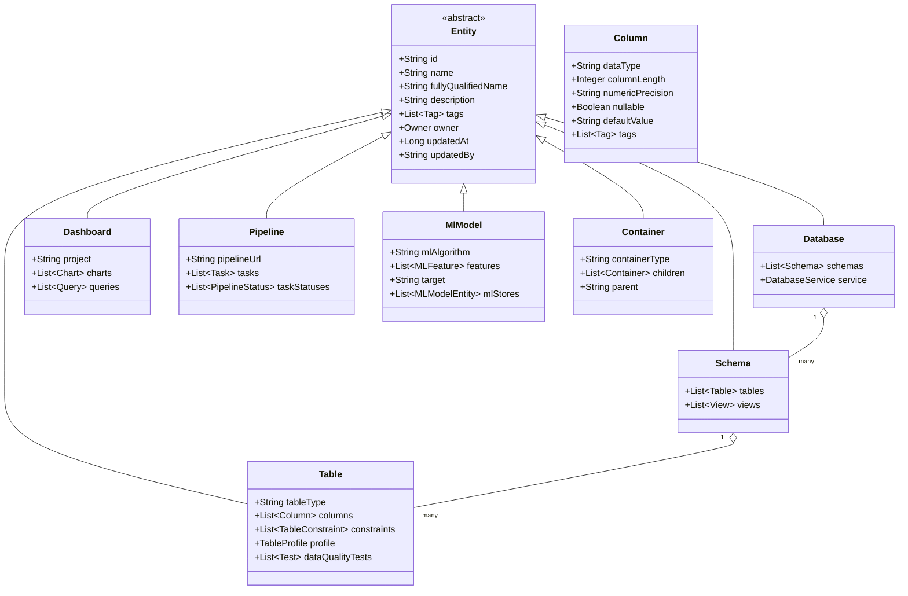
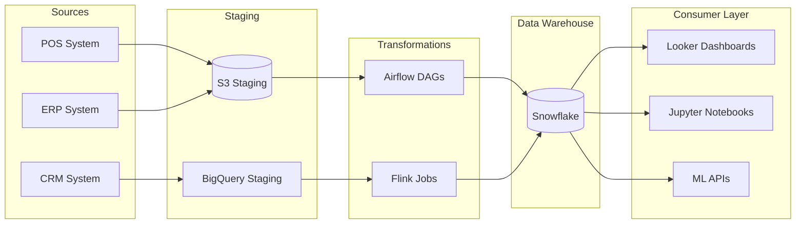
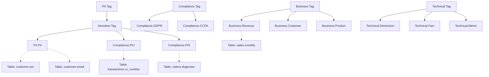
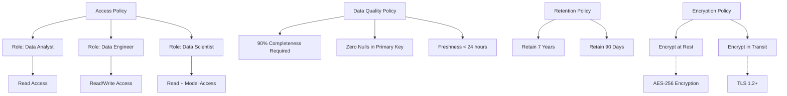
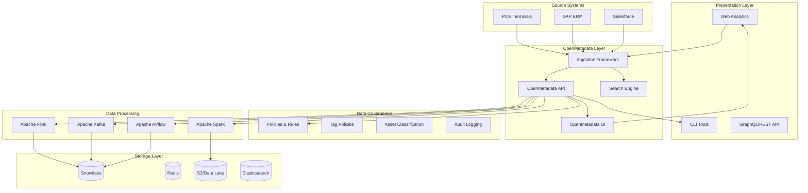
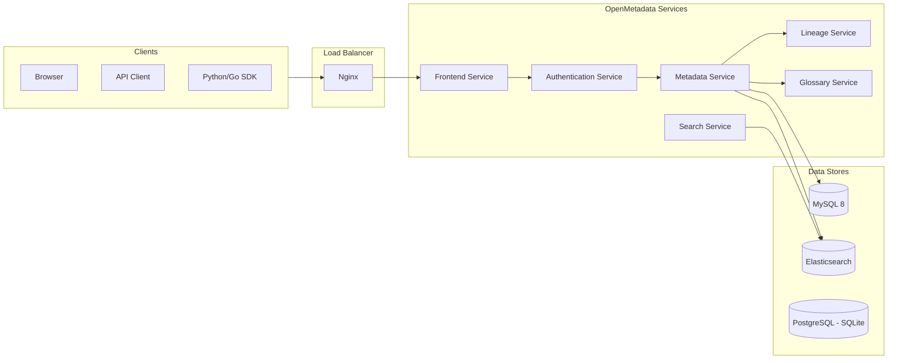
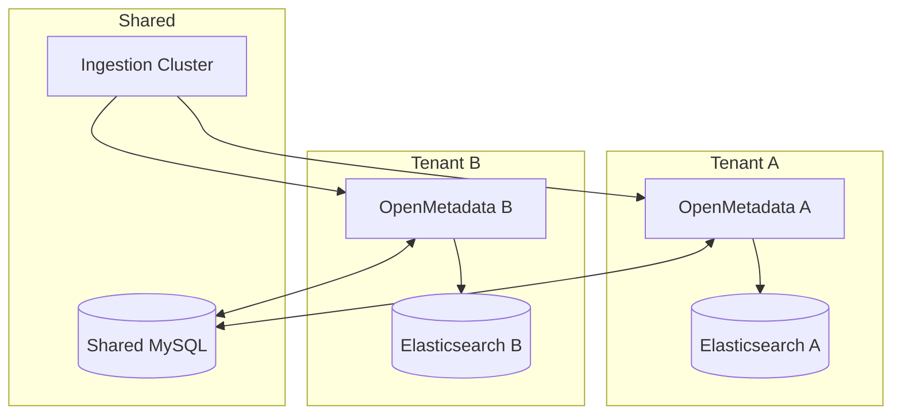

# OpenMetadata

## 1. Overview

### What is OpenMetadata?

OpenMetadata is an open-source metadata platform created by the OpenMetadata Initiative and founded in 2021. It provides a unified discovery, cataloging, and governance layer for data infrastructure. OpenMetadata offers a comprehensive solution for centralized metadata management, data lineage tracking, data quality monitoring, and governance policies across the entire data ecosystem.

The platform is built on a modern architecture that combines a flexible metadata schema with powerful search, discovery, and collaboration features. It supports a wide variety of data sources including databases, data warehouses, BI tools, ML frameworks, and pipeline orchestrators.

### Why was it created?

OpenMetadata was created to solve the fundamental problem of "metadata fragmentation" in enterprise data environments. Traditional organizations often have:

- Dozens of disconnected data sources (PostgreSQL, MySQL, Snowflake, BigQuery, Redshift)
- Multiple ETL/ELT pipelines (Airflow, Dagster, Prefect)
- Various BI platforms (Tableau, Looker, Power BI)
- Scattered documentation and definitions
- No single source of truth for data definitions

The founders recognized that without a centralized metadata platform, data teams waste enormous time searching for the right dataset, understanding data definitions, tracing lineage, and ensuring governance compliance.

### What business problems does it solve?

OpenMetadata addresses critical enterprise challenges:

| Problem | Business Impact | OpenMetadata Solution |
|---------|----------------|----------------------|
| Data Discovery | Analysts spend 40% of time finding data | Unified search across all data assets |
| Data Quality | Poor quality costs enterprises millions annually | Data quality tests and profiling |
| Lineage Tracking | Failed pipelines cause cascading failures | End-to-end lineage visualization |
| Governance Compliance | GDPR, CCPA, SOX requirements | Policy enforcement and data contracts |
| Collaboration | Silos between data producers and consumers | Team ownership and documentation |
| Schema Changes | Breaking changes cause production incidents | Schema change alerts |

### Why do enterprises use it?

Global enterprises choose OpenMetadata because:

- **LinkedIn** uses it for talent analytics and job matching data catalogs
- **AWS** leverages it for internal data platform governance
- **Adobe** uses it for creative cloud analytics metadata management
- **Target** leverages it for retail supply chain data governance
- ** Goldman Sachs** uses it for financial data lineage and regulatory compliance
- **ING Bank** uses it for cross-border transaction analytics governance

The platform is trusted by 500+ organizations worldwide and has over 5,000 GitHub stars.

---

## 2. Core Concepts

### OpenMetadata Architecture Overview

```mermaid
flowchart TD
    subgraph Data Sources
        DB[(Database)]
        WH[(Data Warehouse)]
        BI[BI Tools]
        ML[ML Platforms]
        PIP[Pipeline Tools]
    end
    
    subgraph Ingestion Layer
        SC[Status Connector]
        CC[Custom Connector]
        API[API Connector]
    end
    
    subgraph Metadata Store
        ES[(Elasticsearch)]
        MY[(MySQL)]
        GRAPH[(Graph DB)]
    end
    
    subgraph Services
        DISCO[Discovery]
        LINEAGE[Lineage]
        TAGS[Tagging]
        QUALITY[Data Quality]
    end
    
    subgraph API Layer
        REST[REST API]
        GRAPHQL[GraphQL API]
        EVENTS[Event Feed]
    end
    
    subgraph UI Layer
        EXPLORE[Explorer]
        SETTINGS[Settings]
        AddWidget[Add Widget]
    end
    
    DB --> SC
    WH --> SC
    BI --> SC
    ML --> SC
    PIP --> SC
    SC --> ES
    SC --> MY
    SC --> GRAPH
    ES --> DISCO
    MY --> DISCO
    GRAPH --> LINEAGE
    REST --> API Layer
    GRAPHQL --> API Layer
    API Layer --> UI Layer
```

### Key Entities in OpenMetadata



### Data Lineage



### Tags and Classification



### Governance Policies



---

## 3. Why This Project Uses It

The Enterprise Retail Streaming Platform uses OpenMetadata for the following critical reasons:

### 1. Multi-Source Data Integration

The platform integrates data from numerous retail sources:

- **POS Systems**: Real-time sales transactions from 500+ stores
- **ERP Systems**: SAP/Oracle for inventory and financials
- **CRM Platforms**: Salesforce for customer data
- **E-commerce**: Shopify, Magento for online orders
- **Supply Chain**: IoT sensors and logistics data

OpenMetadata provides connectors for all these sources, enabling automatic metadata extraction and unified cataloging.

### 2. Stream Processing Lineage

With Apache Flink and Kafka-based streaming pipelines, understanding data flow is critical:

- Track how POS events transform into revenue metrics
- Monitor data quality across streaming joins
- Debug latency issues with lineage traces
- Understand impact of schema changes in real-time

### 3. Regulatory Compliance

Retail is heavily regulated:

- **PCI-DSS**: Credit card data handling compliance
- **GDPR**: Customer data privacy rights
- **SOX**: Financial reporting accuracy
- **CCPA**: California consumer privacy rights

OpenMetadata's policy engine enforces these automatically.

### 4. Self-Service Analytics Enablement

Business users need to find and trust data without involving data engineering:

- Search-driven discovery for analysts
- Data contracts ensuring quality guarantees
- Documentation and ownership clarity
- Certification and freshness indicators

### 5. Cross-Functional Collaboration

The platform serves:

- Store operations teams
- Marketing analysts
- Finance controllers
- Data science teams
- Executive stakeholders

OpenMetadata's collaboration features (descriptions, comments, announcements) bridge these silos.

### 6. Data Quality Monitoring

With millions of daily transactions:

- Automated data profiling on all tables
- Custom quality tests for business rules
- Alerting on quality degradation
- Historical quality trend analysis

---

## 4. Architecture Position

### Platform Stack with OpenMetadata



### OpenMetadata Component Architecture



---

## 5. Folder Structure

OpenMetadata-related configuration in this project:

```
enterprise-retail-streaming-platform/
├── openmetadata/
│   ├── config/
│   │   ├── openmetadata.yaml          # Main configuration
│   │   ├── log4j.properties           # Logging configuration
│   │   └── users.json                 # Initial users
│   ├── docker/
│   │   ├── docker-compose.yml         # Local development
│   │   └── Dockerfile                 # Custom image
│   ├── kubernetes/
│   │   ├── deployment.yaml            # K8s deployment
│   │   ├── service.yaml               # K8s service
│   │   ├── ingress.yaml               # Ingress config
│   │   └── pvc.yaml                   # Persistent volumes
│   ├── connectors/
│   │   ├── postgres/
│   │   │   └── postgres.yaml          # PostgreSQL connector
│   │   ├── snowflake/
│   │   │   └── snowflake.yaml         # Snowflake connector
│   │   ├── kafka/
│   │   │   └── kafka.yaml             # Kafka connector
│   │   ├── bigquery/
│   │   │   └── bigquery.yaml          # BigQuery connector
│   │   └── powerbi/
│   │       └── powerbi.yaml           # PowerBI connector
│   ├── lineage/
│   │   ├── extractors/
│   │   │   ├── airflow_lineage.py     # Airflow lineage
│   │   │   ├── flink_lineage.py       # Flink lineage
│   │   │   └── kafka_lineage.py       # Kafka lineage
│   │   └── mappings/
│   │       └── retail_mappings.json   # Custom mappings
│   ├── policies/
│   │   ├── access_policies.yaml       # Access policies
│   │   ├── retention_policies.yaml    # Data retention
│   │   └── quality_policies.yaml      # Quality thresholds
│   ├── tags/
│   │   ├── retail_tags.yaml           # Retail-specific tags
│   │   ├── compliance_tags.yaml       # Compliance tags
│   │   └── technical_tags.yaml        # Technical tags
│   ├── glossary/
│   │   ├── business_terms.yaml        # Business glossary
│   │   └── retail_terms.yaml          # Domain glossary
│   ├── tests/
│   │   ├── test_metadata_quality.py   # Quality tests
│   │   ├── test_lineage.py            # Lineage tests
│   │   └── test_policies.py           # Policy tests
│   └── scripts/
│       ├── ingest.py                  # Ingestion script
│       ├── bootstrap.py               # Initial setup
│       └── migrate.py                 # Migration tool
├── docs/
│   ├── openmetadata/                  # OpenMetadata documentation
│   │   ├── connector_config.md       # Connector guides
│   │   ├── api_reference.md           # API docs
│   │   └── best_practices.md          # Internal best practices
│   └── skills/
│       └── 11-openmetadata.md         # This skill document
└── infrastructure/
    ├── terraform/
    │   └── openmetadata/             # Terraform configs
    └── ansible/
        └── openmetadata/              # Ansible playbooks
```

---

## 6. Implementation Walkthrough

### Docker Compose Setup

```yaml
# docker-compose.yml
version: "3.9"

services:
  mysql:
    image: mysql:8.0
    environment:
      MYSQL_ROOT_PASSWORD: openmetadata
      MYSQL_DATABASE: openmetadata
    ports:
      - "3306:3306"
    volumes:
      - mysql_data:/var/lib/mysql
    networks:
      - openmetadata
  
  elasticsearch:
    image: docker.elastic.co/elasticsearch/elasticsearch:7.10.2
    environment:
      - discovery.type=single-node
      - ES_JAVA_OPTS=-Xms512m -Xmx512m
    ports:
      - "9200:9200"
    volumes:
      - es_data:/usr/share/elasticsearch/data
    networks:
      - openmetadata
  
  openmetadata-server:
    image: openmetadata/standalone:1.2.0
    depends_on:
      - mysql
      - elasticsearch
    ports:
      - "8585:8585"
      - "8586:8586"
    environment:
      - MBABASE_URL=http://localhost:8585
      - DB_HOST=mysql
      - DB_PORT=3306
      - DB_USER=root
      - DB_PASSWORD=openmetadata
      - ELASTICSEARCH_HOST=elasticsearch
      - ELASTICSEARCH_PORT=9200
      - OPENMETADATA_PORT=8585
    networks:
      - openmetadata

volumes:
  mysql_data:
  es_data:

networks:
  openmetadata:
    driver: bridge
```

### Kubernetes Deployment

```yaml
# deployment.yaml
apiVersion: apps/v1
kind: Deployment
metadata:
  name: openmetadata-server
  labels:
    app: openmetadata
spec:
  replicas: 2
  selector:
    matchLabels:
      app: openmetadata
  template:
    metadata:
      labels:
        app: openmetadata
    spec:
      containers:
      - name: openmetadata
        image: openmetadata/standalone:1.2.0
        ports:
        - containerPort: 8585
          name: http
        - containerPort: 8586
          name: grpc
        env:
        - name: DB_HOST
          value: "mysql-service"
        - name: DB_PORT
          value: "3306"
        - name: DB_USER
          valueFrom:
            secretKeyRef:
              name: openmetadata-secrets
              key: db-user
        - name: DB_PASSWORD
          valueFrom:
            secretKeyRef:
              name: openmetadata-secrets
              key: db-password
        - name: ELASTICSEARCH_HOST
          value: "elasticsearch-service"
        - name: ELASTICSEARCH_PORT
          value: "9200"
        resources:
          requests:
            memory: "2Gi"
            cpu: "1000m"
          limits:
            memory: "4Gi"
            cpu: "2000m"
        livenessProbe:
          httpGet:
            path: /api/v1/health
            port: 8585
          initialDelaySeconds: 60
          periodSeconds: 30
        readinessProbe:
          httpGet:
            path: /api/v1/health
            port: 8585
          initialDelaySeconds: 30
          periodSeconds: 10
---
apiVersion: v1
kind: Service
metadata:
  name: openmetadata-service
spec:
  type: ClusterIP
  ports:
  - port: 8585
    targetPort: 8585
    name: http
  - port: 8586
    targetPort: 8586
    name: grpc
  selector:
    app: openmetadata
---
apiVersion: networking.k8s.io/v1
kind: Ingress
metadata:
  name: openmetadata-ingress
  annotations:
    nginx.ingress.kubernetes.io/ssl-redirect: "true"
    cert-manager.io/cluster-issuer: "letsencrypt-prod"
spec:
  ingressClassName: nginx
  rules:
  - host: metadata.enterprise-retail.com
    http:
      paths:
      - path: /
        pathType: Prefix
        backend:
          service:
            name: openmetadata-service
            port:
              number: 8585
  tls:
  - hosts:
    - metadata.enterprise-retail.com
    secretName: openmetadata-tls
```

### Environment Variables

```bash
# .env.openmetadata

# Database Configuration
DB_HOST=mysql.internal
DB_PORT=3306
DB_USER=openmetadata_user
DB_PASSWORD=secure_password_here
DB_NAME=openmetadata

# Elasticsearch Configuration  
ELASTICSEARCH_HOST=elasticsearch.internal
ELASTICSEARCH_PORT=9200
ELASTICSEARCH_SCHEME=https
ELASTICSEARCH_USERNAME=elastic
ELASTICSEARCH_PASSWORD=elastic_password

# Authentication
AUTHENTICATION_ENABLED=true
AUTHENTICATION_PROVIDER=ldap
LDAP_URL=ldap://ldap.internal:389
LDAP_BIND_DN=cn=admin,dc=enterprise,dc=com
LDAP_BIND_PASSWORD=ldap_password
LDAP_USER_SEARCH_BASE=ou=users,dc=enterprise,dc=com
LDAP_USER_SEARCH_FILTER=(uid={0})

# OpenMetadata Server
OPENMETADATA_PORT=8585
OPENMETADATA_UI_PORT=8585
SERVER_HOST=0.0.0.0
LOG_LEVEL=INFO

# Pipeline Configuration
INGESTION_PIPELINE_INTERVAL=3600
MAX_LINEAGE_DEPTH=10

# Security
ENCRYPTION_KEY=your-32-character-encryption-key
JWT_SECRET_KEY=your-jwt-secret-key-min-32-chars
SESSION_TIME_OUT=3600

# Scalability
CACHE_ENABLED=true
CACHE_TTL=300
CONNECTION_POOL_SIZE=20

# Notifications
EVENTS_WEBHOOK_ENABLED=true
SLACK_WEBHOOK_URL=https://hooks.slack.com/services/xxx
```

### Connector Configuration

#### PostgreSQL Connector

```yaml
# connectors/postgres/retail_pos.yaml
source:
  type: PostgreSQL
  serviceName: retail_postgres_pos
  serviceType: Database
  connectionConfig:
    config:
      host: postgres.retail.internal
      port: 5432
      database: retail_pos
      username: om_reader
      password: secure_password
      sslMode: require
      schemaFilterPattern:
        includes:
          - public
          - sales
          - inventory
      tableFilterPattern:
        excludes:
          - ".*_staging.*"
sink:
  type: Metadata
  config: {}
workflowConfig:
  openMetadataServerConfig:
    hostPort: openmetadata-service:8585
    authProvider: openmetadata
    secretId: om-secret
    verifySSL: true
```

#### Kafka Connector

```yaml
# connectors/kafka/streaming_pipeline.yaml
source:
  type: Kafka
  serviceName: retail_kafka_streams
  serviceType: Messaging
  connectionConfig:
    config:
      bootstrapServers: kafka1.internal:9092,kafka2.internal:9092
      schemaRegistryURL: http://schema-registry.internal:8081
      consumerConfig:
        groupId: openmetadata-ingestion
        autoOffsetReset: earliest
        enableSSL: true
        sslTruststoreLocation: /etc/ssl/kafka.client.truststore.jks
        sslKeystoreLocation: /etc/ssl/kafka.client.keystore.jks
      topicFilterPattern:
        includes:
          - retail.pos.*
          - retail.orders.*
          - retail.inventory.*
        excludes:
          - ".*internal.*"
workflowConfig:
  openMetadataServerConfig:
    hostPort: openmetadata-service:8585
```

### Ingestion Script

```python
#!/usr/bin/env python3
"""
OpenMetadata Ingestion Script for Retail Platform
"""
import logging
from metadata-ingestion import CLIContainers
from metadata_ingestion.api.workflow import Execution

logging.basicConfig(level=logging.INFO)
logger = logging.getLogger(__name__)

class RetailDataIngestion:
    def __init__(self, config_path: str, om_host: str):
        self.config_path = config_path
        self.om_host = om_host
        
    def run_postgres_ingestion(self):
        """Ingest PostgreSQL metadata"""
        logger.info("Starting PostgreSQL metadata ingestion...")
        
        workflow = Execution.builder(
            f"{self.config_path}/connectors/postgres/retail_pos.yaml",
            self.om_host
        ).build()
        
        workflow.execute()
        workflow.stop()
        logger.info("PostgreSQL ingestion completed")
        
    def run_kafka_ingestion(self):
        """Ingest Kafka topic metadata"""
        logger.info("Starting Kafka metadata ingestion...")
        
        workflow = Execution.builder(
            f"{self.config_path}/connectors/kafka/streaming_pipeline.yaml",
            self.om_host
        ).build()
        
        workflow.execute()
        workflow.stop()
        logger.info("Kafka ingestion completed")
        
    def run_lineage_extraction(self):
        """Extract lineage from Airflow DAGs"""
        logger.info("Starting lineage extraction...")
        
        from lineage import AirflowLineageExtractor
        
        extractor = AirflowLineageExtractor(
            airflow_url="airflow.internal:8080",
            dag_folder="/opt/airflow/dags"
        )
        
        lineage_events = extractor.extract()
        logger.info(f"Extracted {len(lineage_events)} lineage events")
        
        return lineage_events

if __name__ == "__main__":
    config_path = "/opt/openmetadata"
    om_host = "http://openmetadata-service:8585"
    
    ingestion = RetailDataIngestion(config_path, om_host)
    
    ingestion.run_postgres_ingestion()
    ingestion.run_kafka_ingestion()
    ingestion.run_lineage_extraction()
```

---

## 7. Production Best Practices

### Scalability

| Component | Small (10GB) | Medium (100GB) | Large (1TB+) |
|-----------|--------------|----------------|--------------|
| MySQL | 2 vCPU, 8GB RAM | 4 vCPU, 16GB RAM | 8 vCPU, 32GB RAM |
| Elasticsearch | 3 nodes, 4GB each | 5 nodes, 8GB each | 10 nodes, 16GB each |
| OpenMetadata | 2 replicas | 3 replicas | 5 replicas |

**Horizontal Scaling Strategy:**

```yaml
# Horizontal Pod Autoscaler for OpenMetadata
apiVersion: autoscaling/v2
kind: HorizontalPodAutoscaler
metadata:
  name: openmetadata-hpa
spec:
  scaleTargetRef:
    apiVersion: apps/v1
    kind: Deployment
    name: openmetadata-server
  minReplicas: 2
  maxReplicas: 10
  metrics:
  - type: Resource
    resource:
      name: cpu
      target:
        type: Utilization
        averageUtilization: 70
  - type: Resource
    resource:
      name: memory
      target:
        type: Utilization
        averageUtilization: 80
  behavior:
    scaleUp:
      stabilizationWindowSeconds: 60
      policies:
      - type: Percent
        value: 100
        periodSeconds: 15
    scaleDown:
      stabilizationWindowSeconds: 300
```

### Monitoring

**Key Metrics to Monitor:**

```yaml
# prometheus-rules.yaml
groups:
- name: openmetadata
  rules:
  - alert: OpenMetadataDown
    expr: up{job="openmetadata"} == 0
    for: 2m
    labels:
      severity: critical
    annotations:
      summary: "OpenMetadata instance is down"
      
  - alert: HighIngestionLatency
    expr: histogram_quantile(0.95, rate(om_ingestion_duration_seconds[5m])) > 300
    for: 5m
    labels:
      severity: warning
    annotations:
      summary: "Metadata ingestion taking too long"
      
  - alert: ElasticsearchClusterHealth
    expr: elasticsearch_cluster_health{status="red"} == 1
    for: 1m
    labels:
      severity: critical
    annotations:
      summary: "Elasticsearch cluster is unhealthy"
      
  - alert: DatabaseConnectionPoolExhausted
    expr: rate(mysql_global_status_threads_connected[5m]) / mysql_global_variables_max_connections > 0.9
    for: 5m
    labels:
      severity: warning
    annotations:
      summary: "MySQL connection pool nearly exhausted"
```

### Security

**Network Policies:**

```yaml
# network-policy.yaml
apiVersion: networking.k8s.io/v1
kind: NetworkPolicy
metadata:
  name: openmetadata-network-policy
spec:
  podSelector:
    matchLabels:
      app: openmetadata
  policyTypes:
  - Ingress
  - Egress
  ingress:
  - from:
    - namespaceSelector:
        matchLabels:
          name: data-platform
    - podSelector:
        matchLabels:
          app: airflow
    ports:
    - protocol: TCP
      port: 8585
  egress:
  - to:
    - podSelector:
        matchLabels:
          app: mysql
    ports:
    - protocol: TCP
      port: 3306
  - to:
    - podSelector:
        matchLabels:
          app: elasticsearch
    ports:
    - protocol: TCP
      port: 9200
```

### Backup Strategy

```bash
#!/bin/bash
# backup-openmetadata.sh

set -euo pipefail

BACKUP_DIR="/backups/openmetadata"
DATE=$(date +%Y%m%d_%H%M%S)
RETENTION_DAYS=30

# Create backup directory
mkdir -p ${BACKUP_DIR}/${DATE}

# Backup MySQL
echo "Backing up MySQL..."
mysqldump -h mysql.internal \
  -u backup_user \
  -p${MYSQL_PASSWORD} \
  --single-transaction \
  --routines \
  --triggers \
  openmetadata > ${BACKUP_DIR}/${DATE}/mysql_backup.sql

# Backup Elasticsearch
echo "Backing up Elasticsearch..."
curl -X PUT "https://elasticsearch.internal:9200/_snapshot/openmetadata_backup/${DATE}" \
  -H "Content-Type: application/json" \
  -d '{"type": "fs", "settings": {"location": "/var/backups/elasticsearch"}}'

# Compress and encrypt backups
echo "Compressing and encrypting..."
tar -czf ${BACKUP_DIR}/${DATE}.tar.gz -C ${BACKUP_DIR} ${DATE}
gpg --symmetric --cipher-algo AES256 ${BACKUP_DIR}/${DATE}.tar.gz

# Upload to S3
echo "Uploading to S3..."
aws s3 cp ${BACKUP_DIR}/${DATE}.tar.gz.gpg \
  s3://enterprise-retail-backups/openmetadata/${DATE}.tar.gz.gpg

# Cleanup old backups
echo "Cleaning up old backups..."
find ${BACKUP_DIR} -mtime +${RETENTION_DAYS} -delete

echo "Backup completed successfully"
```

---

## 8. Common Problems

| Problem | Cause | Solution |
|---------|-------|----------|
| **Ingestion fails with connection timeout** | Firewall rules or network policies blocking metadata server | Check security groups, ensure port 3306/9200 are accessible, verify network policies |
| **Elasticsearch cluster turns red** | Disk space exhaustion or shard allocation issues | Increase disk space, adjust watermark thresholds, rebalance shards |
| **Lineage not showing in UI** | Missing lineage extraction from pipeline connectors | Enable lineage extraction in connector config, ensure pipeline connectors are configured |
| **Users cannot authenticate** | LDAP/SSO misconfiguration | Verify LDAP settings, check SSL certificates, test connection with ldapsearch |
| **Metadata not appearing after ingestion** | Cache issue or indexing lag | Clear browser cache, restart Elasticsearch, check ingestion logs |
| **High memory usage on OpenMetadata pods** | JVM heap misconfiguration | Adjust -Xms/-Xmx settings, enable G1GC garbage collector |
| **Duplicate entities after re-ingestion** | Source system using different naming conventions | Use entity fingerprinting, configure merge behavior in connector |
| **Slow search queries** | Elasticsearch cluster under-resourced | Scale up Elasticsearch nodes, optimize index mappings, add search aliases |
| **Webhook notifications not working** | Webhook URL unreachable or authentication failure | Test webhook with curl, verify SSL certificates, check webhook logs |
| **Connector authentication fails** | Credentials expired or incorrectly configured | Rotate credentials, use secrets management, verify password special characters |
| **Schema changes not detected** | Ingestion scheduled too infrequently | Increase ingestion frequency, use CDC-based connectors for real-time |
| **MySQL database grows rapidly** | Audit logs and events not being purged | Configure retention policies, archive old events, optimize indexes |
| **Tag inheritance not working** | Hierarchical tags not properly configured | Review tag hierarchy structure, check tag parent-child relationships |
| **Performance degradation over time** | Fragmented indexes and tables | Schedule regular maintenance, optimize tables, rebuild indexes |

---

## 9. Performance Optimization

### Elasticsearch Optimization

```yaml
# elasticsearch-optimization.yaml
cluster.routing.allocation.disk.threshold_enabled: true
cluster.routing.allocation.disk.watermark.low: 85%
cluster.routing.allocation.disk.watermark.high: 90%
cluster.routing.allocation.disk.watermark.flood_stage: 95%

# Index settings
index.number_of_shards: 3
index.number_of_replicas: 1
index.refresh_interval: 5s
index.translog.durability: async

# Query optimization
indices.query.bool.max_clause_count: 4096
action.search.shard_count.limit: 1000
```

### Database Optimization

```sql
-- MySQL optimization for OpenMetadata
-- Buffer pool sizing
SET GLOBAL innodb_buffer_pool_size = 16G;
SET GLOBAL innodb_buffer_pool_instances = 8;

-- Write optimization
SET GLOBAL innodb_flush_log_at_trx_commit = 2;
SET GLOBAL innodb_flush_method = O_DIRECT;

-- Connection pooling
SET GLOBAL max_connections = 500;
SET GLOBAL thread_cache_size = 50;

-- Query optimization
ALTER DATABASE openmetadata CHARACTER SET utf8mb4 COLLATE utf8mb4_unicode_ci;

-- Create indexes for common queries
CREATE INDEX idx_entity_fqn ON openmetadata.entity_summary(fullyQualifiedName);
CREATE INDEX idx_tag_name ON openmetadata.tag(name);
CREATE INDEX idx_lineage_from ON openmetadata.lineageRelationship(fromId);
CREATE INDEX idx_lineage_to ON openmetadata.lineageRelationship(toId);
```

### Caching Strategy

```python
# caching_configuration.py
from typing import Dict, Any

CACHE_CONFIG: Dict[str, Any] = {
    # Cache TTL in seconds
    "entity_cache_ttl": 300,
    "search_cache_ttl": 60,
    "lineage_cache_ttl": 600,
    "glossary_cache_ttl": 900,
    
    # Cache sizes (number of entries)
    "max_entity_cache_size": 10000,
    "max_search_cache_size": 5000,
    "max_lineage_cache_size": 5000,
    
    # Cache warming
    "warm_cache_on_startup": True,
    "warm_cache_entities": [
        "databaseService/*",
        "dashboardService/*",
        "pipelineService/*"
    ],
    
    # Eviction policy
    "eviction_policy": "LRU",
    "eviction_batch_size": 100,
}

# Redis-backed caching for distributed deployments
REDIS_CONFIG: Dict[str, Any] = {
    "enabled": True,
    "cluster_mode": True,
    "nodes": [
        {"host": "redis-1.internal", "port": 6379},
        {"host": "redis-2.internal", "port": 6379},
        {"host": "redis-3.internal", "port": 6379},
    ],
    "password": "${REDIS_PASSWORD}",
    "ssl": True,
    "max_connections": 50,
}
```

---

## 10. Security

### Authentication Configuration

```yaml
# authentication.yaml
authentication:
  provider: ldap  # Options: ldap, saml, google, aws_cognito
  
  ldap:
    host: ldap.internal.enterprise.com
    port: 636
    use_ssl: true
    bind_dn: "cn=openmetadata,ou=service,dc=enterprise,dc=com"
    bind_password: "${LDAP_BIND_PASSWORD}"
    
    user_search_base: "ou=users,dc=enterprise,dc=com"
    user_search_filter: "(uid={0})"
    user_email_attribute: "mail"
    user_name_attribute: "cn"
    
    group_search_base: "ou=groups,dc=enterprise,dc=com"
    group_search_filter: "(member={0})"
    group_role_attribute: "cn"
    
    # Map LDAP groups to OpenMetadata roles
    group_to_role_mapping:
      "cn=data-engineers,ou=groups": "DataEngineer"
      "cn=analysts,ou=groups": "Analyst"
      "cn=data-stewards,ou=groups": "DataSteward"
      "cn=executives,ou=groups": "Executive"
  
  saml:
    idp_entity_id: "https://metadata.enterprise-retail.com"
    idp_sso_url: "https://sso.enterprise.com/saml2/sso"
    idp_certificate: "/etc/openmetadata/saml/idp.crt"
    sp_entity_id: "openmetadata"
    sp_acs_url: "https://metadata.enterprise-retail.com/saml/acs"
    
  jwt:
    secret_key: "${JWT_SECRET_KEY}"
    expiration_hours: 24
    refresh_expiration_days: 7
```

### Authorization Policies

```yaml
# authorization-policies.yaml
policies:
  - name: "Retail Data Analyst Policy"
    description: "Read access to retail data assets"
    enabled: true
    rules:
      - effect: Allow
        actions:
          - View
          - ViewLineage
          - ViewTests
        resources:
          - "databaseService.PostgreSQL.**"
          - "databaseService.PostgreSQL.retail_pos.**"
    
  - name: "Customer Data Access Policy"
    description: "Strict access to customer PII data"
    enabled: true
    rules:
      - effect: Deny
        actions:
          - View
          - Edit
        resources:
          - "databaseService.PostgreSQL.retail_pos.customers.ssn"
          - "databaseService.PostgreSQL.retail_pos.customers.email"
          - "tag.PII"
        conditions:
          - attribute: requester.team
            operator: notIn
            values: ["compliance", "security"]
    
  - name: "Data Engineer Policy"
    description: "Full access for data engineering team"
    enabled: true
    rules:
      - effect: Allow
        actions:
          - All
        resources:
          - "databaseService.**"
          - "messagingService.**"
          - "pipelineService.**"
        subjects:
          - "group:data-engineers"
```

### Data Governance

```yaml
# data-governance.yaml
governance:
  # Data contracts
  dataContracts:
    enabled: true
    enforcementMode: strict  # strict, advisory, disabled
    
    contracts:
      - name: "Daily Sales Contract"
        description: "Guarantees for daily sales data"
        asset: "databaseService.Snowflake.retail.sales.daily_sales"
        constraints:
          - type: freshness
            value: 24h
            alertOnViolation: true
          - type: completeness
            column: store_id
            threshold: 99.5
          - type: uniqueness
            column: transaction_id
            threshold: 100
        
  # Sensitive data discovery
  sensitiveDataDiscovery:
    enabled: true
    autoTagging:
      enabled: true
      tagRules:
        - pattern: ".*ssn.*"
          applyTags: ["PII.SSN"]
        - pattern: ".*email.*"
          applyTags: ["PII.Email"]
        - pattern: ".*phone.*"
          applyTags: ["PII.Phone"]
        - pattern: ".*credit_card.*"
          applyTags: ["PCI.CreditCard"]
        - pattern: ".*address.*"
          applyTags: ["PII.Address"]
    
  # Retention policies
  retention:
    enabled: true
    policies:
      - name: "Customer Data Retention"
        description: "GDPR compliance for customer data"
        filter: "tag.PII"
        retentionDays: 2555  # 7 years
        action: anonymize
        anonymizationRule:
          columns: ["email", "phone", "address"]
          method: hash
          
      - name: "Staging Data Cleanup"
        description: "Clean up staging tables"
        filter: "table.*_staging"
        retentionDays: 7
        action: delete
```

---

## 11. Monitoring

### Key Metrics Dashboard

```yaml
# grafana-dashboard.yaml
apiVersion: 1
providers:
  - name: OpenMetadata
    folder: Data Platform
    type: file
    options:
      path: /var/lib/grafana/dashboards

# Dashboard JSON (truncated)
{
  "dashboard": {
    "title": "OpenMetadata Platform Health",
    "panels": [
      {
        "title": "Ingestion Success Rate",
        "type": "stat",
        "targets": [
          {
            "expr": "sum(rate(om_ingestion_success_total[5m])) / sum(rate(om_ingestion_total[5m])) * 100",
            "legendFormat": "Success Rate %"
          }
        ],
        "fieldConfig": {
          "defaults": {
            "thresholds": {
              "steps": [
                {"value": 0, "color": "red"},
                {"value": 90, "color": "yellow"},
                {"value": 99, "color": "green"}
              ]
            }
          }
        }
      },
      {
        "title": "API Response Time (P95)",
        "type": "graph",
        "targets": [
          {
            "expr": "histogram_quantile(0.95, sum(rate(om_api_request_duration_seconds_bucket[5m])) by (le, endpoint))",
            "legendFormat": "{{endpoint}}"
          }
        ]
      },
      {
        "title": "Active Users",
        "type": "graph",
        "targets": [
          {
            "expr": "sum(rate(om_user_active_total[5m]))",
            "legendFormat": "Active Users"
          }
        ]
      },
      {
        "title": "Metadata Entity Count",
        "type": "stat",
        "targets": [
          {
            "expr": "om_entity_total",
            "legendFormat": "{{entity_type}}"
          }
        ]
      }
    ]
  }
}
```

### Alerting Configuration

```yaml
# alert-rules.yaml
groups:
  - name: openmetadata_alerts
    rules:
      - alert: OpenMetadataIngestionFailures
        expr: |
          increase(om_ingestion_errors_total[10m]) > 5
        for: 5m
        labels:
          severity: warning
          team: data-platform
        annotations:
          summary: "High metadata ingestion failure rate"
          description: "{{ $value }} ingestion failures in the last 10 minutes"
          
      - alert: OpenMetadataLineageIncomplete
        expr: |
          om_lineage_missing_ratio > 0.1
        for: 30m
        labels:
          severity: warning
          team: data-engineering
        annotations:
          summary: "Lineage graph has gaps"
          description: "More than 10% of tables have incomplete lineage"
          
      - alert: OpenMetadataDatabaseConnectionIssues
        expr: |
          rate(mysql_connection_errors_total[5m]) > 10
        for: 2m
        labels:
          severity: critical
          team: platform
        annotations:
          summary: "MySQL connection problems detected"
```

### Logging Configuration

```yaml
# log4j2.properties
appender.console.type = Console
appender.console.name = Console
appender.console.json.type = JsonTemplate
appender.console.json.layout = Layout

rootLogger.level = INFO
rootLogger.appenderRef.console.ref = Console

logger.openmetadata.name = org.openmetadata
logger.openmetadata.level = DEBUG
logger.openmetadata.additivity = false
logger.openmetadata.appenderRef.console.ref = Console

logger.ingestion.name = org.openmetadata.ingestion
logger.ingestion.level = INFO
logger.ingestion.additivity = false
logger.ingestion.appenderRef.console.ref = Console
```

---

## 12. Testing Strategy

### Unit Tests

```python
# tests/unit/test_openmetadata_client.py
import pytest
from unittest.mock import Mock, patch
from openmetadata import OpenMetadata
from openmetadata.api.entities import Table, Database

class TestOpenMetadataClient:
    """Unit tests for OpenMetadata client"""
    
    def setup_method(self):
        self.metadata = OpenMetadata(
            host="http://localhost:8585",
            auth_provider="openmetadata"
        )
    
    def test_client_initialization(self):
        """Test client initializes correctly"""
        assert self.metadata.host == "http://localhost:8585"
        assert self.metadata.api_client is not None
    
    def test_search_tables(self):
        """Test table search returns correct results"""
        with patch('requests.Session.get') as mock_get:
            mock_get.return_value = Mock(
                status_code=200,
                json=lambda: {
                    "data": [
                        {"name": "customers", "fullyQualifiedName": "retail.customers"},
                        {"name": "orders", "fullyQualifiedName": "retail.orders"}
                    ]
                }
            )
            
            results = self.metadata.search("customers")
            assert len(results) == 2
            assert results[0].name == "customers"
    
    def test_get_lineage(self):
        """Test lineage retrieval"""
        with patch('requests.Session.get') as mock_get:
            mock_get.return_value = Mock(
                status_code=200,
                json=lambda: {
                    "entity": {
                        "name": "daily_sales",
                        "lineage": {
                            "upstreamEntities": [
                                {"name": "pos_transactions", "type": "Table"}
                            ],
                            "downstreamEntities": [
                                {"name": "revenue_dashboard", "type": "Dashboard"}
                            ]
                        }
                    }
                }
            )
            
            lineage = self.metadata.get_lineage("retail.daily_sales")
            assert len(lineage.upstream) == 1
            assert lineage.upstream[0].name == "pos_transactions"
    
    def test_create_tag(self):
        """Test tag creation"""
        with patch('requests.Session.post') as mock_post:
            mock_post.return_value = Mock(
                status_code=201,
                json=lambda: {"id": "tag-123", "name": "PII.SSN"}
            )
            
            tag = self.metadata.create_tag(
                name="PII.SSN",
                description="Customer Social Security Numbers",
                category="PII"
            )
            assert tag.id == "tag-123"
            assert tag.name == "PII.SSN"

class TestEntityValidation:
    """Test entity validation logic"""
    
    def test_table_fqn_validation(self):
        """Test fully qualified name validation"""
        valid_fqn = "database.service.schema.table"
        assert Table.validate_fqn(valid_fqn) is True
        
        invalid_fqn = "invalid..name"
        assert Table.validate_fqn(invalid_fqn) is False
    
    def test_tag_hierarchy_validation(self):
        """Test tag hierarchy constraints"""
        parent_tag = Tag(name="PII", classification="Sensitive")
        child_tag = Tag(name="PII.SSN", parent=parent_tag)
        
        assert child_tag.parent == parent_tag
        assert parent_tag.children == [child_tag]
```

### Integration Tests

```python
# tests/integration/test_ingestion_workflow.py
import pytest
import time
from metadata_ingestion.api.workflow import Execution

class TestIngestionWorkflow:
    """Integration tests for metadata ingestion"""
    
    @pytest.fixture
    def om_client(self):
        return OpenMetadata(host="http://localhost:8585")
    
    @pytest.fixture
    def test_database(self, om_client):
        """Create test database for integration tests"""
        db = om_client.create_database(
            name="test_retail",
            service="test_postgres",
            description="Test database for CI"
        )
        yield db
        # Cleanup
        om_client.delete_database(db.id)
    
    def test_postgres_ingestion_workflow(self, test_database):
        """Test complete PostgreSQL ingestion workflow"""
        config_path = "tests/fixtures/connectors/postgres_test.yaml"
        
        workflow = Execution.builder(config_path, "http://localhost:8585").build()
        workflow.execute()
        
        # Verify tables were ingested
        tables = test_database.list_tables()
        assert len(tables) > 0
        
        # Verify columns were ingested
        for table in tables:
            assert len(table.columns) > 0
            assert table.columns[0].name is not None
        
        workflow.stop()
    
    def test_lineage_extraction_workflow(self):
        """Test Airflow lineage extraction"""
        lineage_events = extract_airflow_lineage(
            dag_id="retail_sales_pipeline",
            execution_date=time.strftime("%Y-%m-%d")
        )
        
        assert len(lineage_events) > 0
        for event in lineage_events:
            assert event.from_entity is not None
            assert event.to_entity is not None
            assert event.pipeline is not None
    
    def test_quality_tests_execution(self, om_client):
        """Test data quality test execution"""
        test_config = {
            "table": "test_retail.orders",
            "tests": [
                {"type": "not_null", "column": "order_id"},
                {"type": "unique", "column": "order_id"},
                {"type": "column_values_in_range", "column": "amount", "min": 0, "max": 100000}
            ]
        }
        
        results = om_client.run_quality_tests(test_config)
        
        assert len(results) == 3
        assert results[0].passed is True
        assert results[1].passed is True
```

### End-to-End Tests

```python
# tests/e2e/test_complete_workflow.py
import pytest
from playwright.sync_api import sync_playwright

class TestOpenMetadataE2E:
    """End-to-end browser tests for OpenMetadata UI"""
    
    @pytest.fixture
    def browser(self):
        with sync_playwright() as p:
            browser = p.chromium.launch(headless=True)
            yield browser
            browser.close()
    
    def test_explore_table_lineage(self, browser):
        """Test complete table lineage exploration flow"""
        page = browser.new_page()
        page.goto("http://localhost:8585")
        
        # Login
        page.fill('[name="username"]', "admin")
        page.fill('[name="password"]', "admin")
        page.click('button[type="submit"]')
        
        # Wait for dashboard to load
        page.wait_for_selector('[data-testid="explore"]', timeout=10000)
        
        # Navigate to tables
        page.click('[data-testid="explore"]')
        page.wait_for_selector('[data-testid="table-list"]')
        
        # Search for table
        page.fill('[data-testid="search"]', "daily_sales")
        page.wait_for_selector('[data-testid="table-card"]')
        
        # View lineage
        page.click('[data-testid="view-lineage"]')
        page.wait_for_selector('[data-testid="lineage-graph"]')
        
        # Verify lineage nodes exist
        nodes = page.query_selector_all('[data-testid="lineage-node"]')
        assert len(nodes) >= 2
        
        page.close()
    
    def test_create_and_apply_tag(self, browser):
        """Test tag creation and application workflow"""
        page = browser.new_page()
        page.goto("http://localhost:8585")
        
        # Login
        page.fill('[name="username"]', "admin")
        page.fill('[name="password"]', "admin")
        page.click('button[type="submit"]')
        
        # Navigate to tags
        page.click('[data-testid="settings"]')
        page.click('[data-testid="tags"]')
        
        # Create new tag
        page.click('[data-testid="create-tag"]')
        page.fill('[data-testid="tag-name"]', "Business.Revenue")
        page.fill('[data-testid="tag-description"]', "Revenue-related data")
        page.click('[data-testid="save-tag"]')
        
        # Apply tag to table
        page.goto("http://localhost:8585/explore/Table/retail.customers")
        page.click('[data-testid="add-tag"]')
        page.click('[data-testid="tag-Business.Revenue"]')
        
        # Verify tag applied
        page.wait_for_selector('[data-testid="tag-Business.Revenue"]')
        
        page.close()
```

---

## 13. Interview Preparation

### Beginner Questions (30)

**Q1: What is OpenMetadata?**
A: OpenMetadata is an open-source metadata management platform that provides unified discovery, cataloging, lineage tracking, and governance for data infrastructure. It serves as a central hub for all data-related metadata in an organization, helping data teams find, understand, and trust their data assets.

**Q2: What are the main components of OpenMetadata?**
A: The main components include:
- **OpenMetadata Server**: Core service managing metadata storage and API
- **Ingestion Framework**: Connectors for extracting metadata from various sources
- **Search Engine**: Elasticsearch-based full-text search
- **Lineage Engine**: Graph-based lineage tracking
- **UI**: React-based web interface for metadata exploration
- **API Layer**: REST and GraphQL APIs for integration

**Q3: How does OpenMetadata discover metadata?**
A: OpenMetadata uses an ingestion-based discovery approach where connectors are configured to extract metadata from source systems like databases, BI tools, and pipeline orchestrators. These connectors run on a schedule or on-demand to keep the catalog synchronized with the source systems.

**Q4: What is a Fully Qualified Name (FQN) in OpenMetadata?**
A: FQN is a dot-separated path that uniquely identifies an entity, e.g., `databaseService.PostgreSQL.retail.customers.orders`. It follows the hierarchy: Service → Database → Schema → Table → Column.

**Q5: What types of services does OpenMetadata support?**
A: OpenMetadata supports database services (PostgreSQL, MySQL, Snowflake, BigQuery), messaging services (Kafka, Pulsar), BI services (Tableau, Looker, Power BI), ML services (MLflow), and pipeline services (Airflow, Prefect, Dagster).

**Q6: How does lineage tracking work in OpenMetadata?**
A: Lineage is tracked through connectors that extract execution metadata from pipeline tools like Airflow, and through column-level lineage extracted from SQL transformations. The lineage is stored as a graph in Elasticsearch and MySQL.

**Q7: What is the difference between OpenMetadata and a data dictionary?**
A: A data dictionary is typically a static document or simple catalog, while OpenMetadata provides dynamic discovery, automated ingestion, lineage tracking, active governance, collaboration features, and API-driven integration capabilities.

**Q8: How do you configure a database connector in OpenMetadata?**
A: Configuration involves creating a YAML file with the source type, service name, connection details (host, port, credentials), and optional filters for schemas and tables. The connector then uses this config to extract metadata during ingestion runs.

**Q9: What is the OpenMetadata Ingestion Framework?**
A: It's a Python-based framework that provides connectors for various data sources. Connectors follow a source → processor → sink architecture, extracting metadata from sources and publishing it to the OpenMetadata server.

**Q10: How does OpenMetadata handle authentication?**
A: OpenMetadata supports multiple authentication providers including LDAP, SAML, Google, AWS Cognito, and JWT tokens. Authentication is configured in the server settings and enforced at the API level.

**Q11: What are tags in OpenMetadata?**
A: Tags are labels used to classify and categorize metadata entities. They support hierarchical structures (e.g., `PII.Email`, `PII.Phone`) and can be applied to tables, columns, dashboards, and other entities for governance and discovery purposes.

**Q12: How do you search for data in OpenMetadata?**
A: Users can use the Explore page with faceted search, filtering by service, type, owner, tags, and more. The Elasticsearch-powered search provides instant full-text search across all metadata entities.

**Q13: What is a database service in OpenMetadata?**
A: A database service represents a connection to a database management system (PostgreSQL, MySQL, Snowflake, etc.). It serves as a container for databases and is the top level of the metadata hierarchy.

**Q14: How does OpenMetadata support data quality?**
A: OpenMetadata provides data quality tests that can be defined at table and column levels. Tests include null checks, uniqueness, value ranges, and custom SQL tests. Results are tracked over time and alerts can be configured for failures.

**Q15: What is the difference between a schema and a database in OpenMetadata?**
A: In most database systems, a database is a top-level container, and schemas are logical groupings within databases. OpenMetadata mirrors this structure with Database entities containing Schema entities, which in turn contain Table entities.

**Q16: How do you update metadata in OpenMetadata?**
A: Metadata can be updated through the UI by editing entity details (descriptions, owners, tags), through the API using PUT/POST endpoints, or by re-running ingestion which can update metadata based on source system changes.

**Q17: What is the role of Elasticsearch in OpenMetadata?**
A: Elasticsearch provides the search capabilities in OpenMetadata, indexing all metadata entities for fast full-text search. It stores the searchable representations of entities and supports complex queries and filtering.

**Q18: How does OpenMetadata handle schema changes?**
A: During re-ingestion, OpenMetadata detects schema changes by comparing current column definitions with previously stored ones. Changes are tracked and can be viewed in the entity's history. Alerts can be configured for breaking schema changes.

**Q19: What is a glossary in OpenMetadata?**
A: A glossary is a collection of business terms with definitions, providing a vocabulary for the organization. Terms can be linked to data assets, establishing a business-friendly layer over technical metadata.

**Q20: How do you monitor OpenMetadata health?**
A: OpenMetadata exposes Prometheus metrics at `/metrics` endpoint. Key metrics include ingestion success rates, API latency, entity counts, and search query performance. These can be integrated with Grafana dashboards.

**Q21: What is entity ownership in OpenMetadata?**
A: Entities can have owners (users or teams) assigned to them, indicating responsibility for maintenance, documentation, and quality. Ownership helps with governance by establishing accountability for data assets.

**Q22: How does data profiling work in OpenMetadata?**
A: During ingestion, connectors can be configured to profile tables, collecting statistics like row counts, null percentages, unique values, min/max values, and data type distributions.

**Q23: What is a pipeline service in OpenMetadata?**
A: A pipeline service represents a data orchestration platform like Airflow, Prefect, or Dagster. OpenMetadata extracts pipeline and task metadata to build lineage across data transformations.

**Q24: How do you configure LDAP authentication in OpenMetadata?**
A: LDAP authentication is configured in the OpenMetadata settings with the LDAP server URL, bind credentials, user and group search bases, and mappings between LDAP groups and OpenMetadata roles.

**Q25: What is the difference between View and Edit permissions?**
A: View permission allows users to see entity details, lineage, and tests. Edit permission allows users to modify descriptions, tags, owners, and other editable properties.

**Q26: How does OpenMetadata support GDPR compliance?**
A: OpenMetadata supports GDPR through data discovery (finding PII across the platform), classification (tagging sensitive data), retention policies (managing data lifecycle), and access controls (restricting who can see sensitive data).

**Q27: What is column-level lineage?**
A: Column-level lineage tracks the relationship between columns across transformations, showing how specific output columns are derived from input columns. This is extracted from SQL queries in pipeline executions.

**Q28: How do you export metadata from OpenMetadata?**
A: Metadata can be exported via the API using export endpoints, through the UI's export functionality, or by querying the underlying MySQL and Elasticsearch databases directly for bulk exports.

**Q29: What is a data contract in OpenMetadata?**
A: A data contract defines quality and freshness guarantees for a data asset. Consumers can subscribe to contracts, and violations trigger alerts. Contracts help establish trust between data producers and consumers.

**Q30: How does OpenMetadata integrate with Airflow?**
A: OpenMetadata provides an Airflow lineage extractor that parses DAG files and execution logs to build lineage between data sources, transformations, and destinations.

---

### Intermediate Questions (30)

**Q1: How do you implement custom lineage extraction in OpenMetadata?**
A: Custom lineage extraction involves creating a lineage processor that implements the LineageParser interface. This processor parses custom pipeline metadata (from SQL logs, transformation functions, or proprietary systems) and converts it to OpenMetadata's lineage format using the lineage API or ingestion framework.

**Q2: Explain the OpenMetadata metadata architecture.**
A: OpenMetadata uses a three-tier architecture:
1. **Ingestion Tier**: Python-based connectors that extract metadata from sources
2. **Storage Tier**: MySQL for relational metadata, Elasticsearch for search
3. **Service Tier**: Java-based API server handling requests

The ingestion tier pushes metadata to the service tier, which stores it in MySQL and indexes it in Elasticsearch. The UI communicates with the service tier via REST/GraphQL APIs.

**Q3: How do you handle metadata conflicts during ingestion?**
A: OpenMetadata uses a merge strategy during ingestion. By default, server-managed attributes (createdBy, createdAt) are preserved, while source-derived attributes (column names, types) are updated. Conflicts can be resolved by configuring merge behavior in the connector or using the API to manually resolve conflicts.

**Q4: What is the difference between hard and soft deletes in OpenMetadata?**
A: Soft deletes mark entities as deleted (status field) but preserve them in the database for recovery. Hard deletes permanently remove entities. OpenMetadata supports both through the API with appropriate parameters.

**Q5: How do you implement SSO with SAML in OpenMetadata?**
A: SAML SSO requires configuring the IdP settings in OpenMetadata with the IdP entity ID, SSO URL, and certificate. The SP (OpenMetadata) is registered with the IdP, and users are mapped from SAML assertions to OpenMetadata roles.

**Q6: Explain how OpenMetadata's search indexing works.**
A: When metadata is created or updated, it's stored in MySQL and simultaneously indexed in Elasticsearch. Search queries hit Elasticsearch for fast retrieval. The indexing is near-real-time, typically within seconds of metadata changes.

**Q7: How do you migrate from Amundsen to OpenMetadata?**
A: Migration involves:
1. Exporting metadata from Amundsen (using its APIs)
2. Transforming the data to OpenMetadata's entity format
3. Using OpenMetadata's bulk API or ingestion framework to import
4. Validating lineage and tag preservation
5. Running parallel verification before cutover

**Q8: What are the scalability limits of OpenMetadata?**
A: OpenMetadata's scalability depends on:
- MySQL: Limited by vertical scaling; sharding not natively supported
- Elasticsearch: Horizontally scalable; can handle billions of documents
- Ingestion: Scales by running connectors in parallel
- UI: Stateless; scales horizontally with load balancer

Typical deployments handle 10,000-100,000 entities comfortably.

**Q9: How do you implement data retention policies?**
A: Retention policies are configured in OpenMetadata's governance settings. Policies define filters (matching tables or tags), retention periods, and actions (archive, anonymize, delete). Policies are enforced by scheduled jobs.

**Q10: Explain the OpenMetadata event notification system.**
A: OpenMetadata publishes events to a webhook or message queue when entities are created, updated, or deleted. Subscribers can receive these events to trigger downstream actions like cache invalidation or workflow automation.

**Q11: How do you handle PII discovery automatically?**
A: Configure sensitive data discovery with regex patterns and column name matching. During ingestion, columns matching patterns are automatically tagged with PII classifications. For example, columns with names containing "ssn" get tagged as PII.SSN.

**Q12: What is the OpenMetadata Entity Relationship Model?**
A: OpenMetadata uses a hierarchical plus graph model:
- Hierarchical: Service → Database → Schema → Table → Column
- Graph: Lineage relationships connect any entities
- Additional: Tags, Owners, Comments cross-cut the hierarchy

**Q13: How do you implement cross-database lineage in OpenMetadata?**
A: Cross-database lineage requires connectors that understand data movement between systems (e.g., Airflow DAGs that read from PostgreSQL and write to Snowflake). The lineage extractor must parse these DAGs and create edges between source and target entities.

**Q14: Explain the difference between OpenMetadata and DataHub.**
A: While both are metadata platforms:
- OpenMetadata: YAML-configured connectors, MySQL+Elasticsearch storage, strong governance features
- DataHub: Git-based ingestion (Airflow pushing), GraphDB storage, more flexible schema

**Q15: How do you implement custom quality tests in OpenMetadata?**
A: Custom tests are implemented as Python classes inheriting from TableTest or ColumnTest. They define a SQL query or assertion logic that returns pass/fail. The test is registered with OpenMetadata and executed during quality checks.

**Q16: What is the OpenMetadata Metadata API versioning strategy?**
A: OpenMetadata uses URL-based versioning (`/api/v1`, `/api/v2`). Breaking changes increment the major version. Deprecated endpoints are maintained for two major versions before removal.

**Q17: How do you implement fine-grained access control?**
A: Access control is implemented through policies with rules specifying effects (Allow/Deny), actions (View, Edit, Delete), resources (entity patterns), and subjects (users/groups). Policies are evaluated in order, with Deny typically taking precedence.

**Q18: How do you troubleshoot failed ingestion pipelines?**
A: Steps:
1. Check ingestion logs in OpenMetadata UI or container logs
2. Verify source system connectivity (firewall, credentials)
3. Validate connector configuration (FQNs, filters)
4. Check Elasticsearch and MySQL health
5. Review error messages and stack traces

**Q19: What is the OpenMetadata lineage graph storage approach?**
A: Lineage is stored in both MySQL (for transactional integrity) and Elasticsearch (for lineage graph queries). The graph is represented as edge records in MySQL and indexed for efficient traversal queries.

**Q20: How do you implement metadata approval workflows?**
A: Approval workflows can be implemented using:
1. Custom fields to track approval status
2. Webhook integrations with workflow tools
3. Bot-based notifications and responses
4. External workflow engines that call OpenMetadata APIs

**Q21: Explain how OpenMetadata handles schema evolution.**
A: OpenMetadata tracks schema history, detecting additions, modifications, and deletions. Users can view the diff between schema versions. Alerts can be configured for breaking changes (column deletion, type changes).

**Q22: How do you implement data certification in OpenMetadata?**
A: Certification is implemented through:
1. Custom status field (Certified, Draft, Deprecated)
2. Automated tests that must pass for certification
3. Owner approval workflows
4. Expiration dates requiring recertification

**Q23: What are OpenMetadata's best practices for naming conventions?**
A:
- Services: `environment-purpose` (e.g., `prod-analytics-postgres`)
- Databases: Descriptive of domain (e.g., `retail`, `analytics`)
- Tables: Lowercase with underscores (e.g., `daily_sales`)
- Tags: Hierarchical with dot notation (e.g., `PII.SSN`)

**Q24: How do you integrate OpenMetadata with dbt?**
A: dbt integration uses a connector that parses dbt manifest files to extract:
- Model definitions and descriptions
- Column-level lineage from ref() dependencies
- Test results and documentation
- Source-to-model relationships

**Q25: Explain the OpenMetadata team collaboration features.**
A: Features include:
- Entity descriptions (markdown supported)
- Comments and discussions on entities
- Announcements for important changes
- Team ownership and responsibility
- Activity feeds showing recent changes

**Q26: How do you implement metadata versioning?**
A: OpenMetadata maintains a version history for entities. Each update increments the version number. Users can view previous versions, compare changes, and restore older versions if needed.

**Q27: What is the difference between tags and classifications?**
A: Tags are flexible labels that can be applied to any entity. Classifications are more structured, hierarchical categories often used for regulatory compliance (PII, PCI, PHI). Classifications typically restrict which tags can be applied.

**Q28: How do you handle metadata in microservices architecture?**
A: In microservices, each service owns its data and exposes metadata through:
1. Schema registries for contract definitions
2. API documentation (OpenAPI specs) ingested as entities
3. Service mesh telemetry for operational lineage

**Q29: Explain the OpenMetadata event-driven architecture.**
A: OpenMetadata uses a publish-subscribe model for events. When metadata changes, events are published to a webhook or message topic. Consumers subscribe to relevant events and process them asynchronously.

**Q30: How do you implement column-level security in OpenMetadata?**
A: Column-level security is implemented through:
1. Policies that specify column-level access rules
2. Data masking for sensitive columns (showing only partial data)
3. Integration with underlying database column-level access controls

---

### Advanced Questions (30)

**Q1: Design a multi-tenant OpenMetadata architecture.**
A: Multi-tenant design considerations:
- **Isolation**: Separate databases or schema-per-tenant in MySQL
- **Cross-tenant search**: Use Elasticsearch indices per tenant or tenant field filtering
- **Shared services**: Ingestion framework can run tenant-specific connectors
- **SSO**: Tenant-aware IdP with tenant hints
- **Billing**: Per-tenant usage tracking for chargeback



**Q2: How would you implement real-time metadata updates?**
A: Real-time metadata requires:
1. CDC (Change Data Capture) from source databases
2. Streaming ingestion connectors (Kafka-based)
3. Event-driven updates to OpenMetadata API
4. WebSocket or SSE for UI notifications
5. Optimistic locking to handle concurrent updates

**Q3: Explain OpenMetadata's graph query capabilities.**
A: OpenMetadata uses Elasticsearch for most queries but can leverage the graph nature of lineage:
- **Lineage queries**: BFS/DFS traversal from source to sink
- **Impact analysis**: Find all downstream entities affected by a change
- **Root cause analysis**: Trace upstream dependencies
- **Column lineage**: Multi-hop queries through transformation edges

**Q4: Design a metadata governance framework using OpenMetadata.**
A: A comprehensive governance framework includes:
1. **Classification**: Hierarchical tags for data sensitivity
2. **Policies**: Access control, retention, quality requirements
3. **Ownership**: Clear ownership at team and individual levels
4. **Stewardship**: Data steward roles for oversight
5. **Compliance**: Automated compliance checks and reporting
6. **Audit**: Complete audit trail for all changes

**Q5: How do you implement AI-powered metadata recommendations?**
A: AI-powered recommendations can be built using OpenMetadata:
1. Collect usage analytics (queries, views, joins)
2. Train ML models to predict likely tags based on column names
3. Recommend similar tables based on schema structure
4. Suggest ownership based on activity patterns
5. Automate glossary term suggestions based on descriptions

**Q6: Explain the performance optimization strategies for large-scale OpenMetadata deployments.**
A:
- **MySQL**: Read replicas, connection pooling, optimized indexes
- **Elasticsearch**: Index lifecycle management, shard optimization
- **Ingestion**: Parallel connector execution, incremental updates
- **API**: Caching layers, query result pagination
- **UI**: Lazy loading, virtual scrolling

**Q7: How do you implement disaster recovery for OpenMetadata?**
A: DR strategy includes:
1. **MySQL**: Master-standby replication, regular backups
2. **Elasticsearch**: Cross-cluster replication (CCR)
3. **Configuration**: GitOps for configuration as code
4. **RTO/RPO**: Target <1 hour RTO, <15 minutes RPO
5. **Testing**: Regular DR drills and failover testing

**Q8: Design a metadata mesh architecture using OpenMetadata.**
A: Metadata mesh decentralizes ownership:
1. Teams own their domain's data products (tables, APIs)
2. OpenMetadata serves as the federated catalog
3. Domain teams publish metadata through self-service APIs
4. Global discovery through federated search
5. Governance policies enforced at the mesh level

**Q9: How do you integrate OpenMetadata with data contracts?**
A: Data contracts implementation:
1. Define contract specifications (freshness, quality thresholds)
2. Attach contracts to data assets
3. Automated monitoring against contract SLAs
4. Consumer notifications on violations
5. Contract history and versioning

**Q10: Explain the OpenMetadata lineage graph algorithms.**
A: Lineage algorithms include:
- **BFS traversal**: Finding all ancestors/descendants
- **DAG detection**: Identifying cycles in lineage
- **Aggregation**: Rolling up lineage across systems
- **Impact scoring**: Weighting downstream importance
- **Delta lineage**: Only processing changed relationships

**Q11: How do you implement observability into OpenMetadata?**
A: Observability integration:
1. **Metrics**: Prometheus exporter for system metrics
2. **Logging**: Structured logging with correlation IDs
3. **Tracing**: OpenTelemetry for distributed tracing
4. **Dashboards**: Grafana dashboards for all tiers
5. **Alerting**: PagerDuty/Slack integration for incidents

**Q12: Design a self-service metadata platform with OpenMetadata.**
A: Self-service features:
1. **Templates**: Pre-built connectors for common sources
2. **Approval workflows**: Automated onboarding
3. **Documentation**: Auto-generated from schemas
4. **Search**: Natural language query interface
5. **APIs**: Programmatic access for automation

**Q13: How do you handle metadata in a polyglot persistence environment?**
A: Polyglot metadata management:
1. Each database technology has its own connector
2. Cross-system lineage through pipeline connectors
3. Unified FQN scheme across all systems
4. Technology-specific metadata captured (Redis structures, MongoDB schemas)

**Q14: Explain the security model for OpenMetadata at enterprise scale.**
A: Enterprise security includes:
1. **Zero-trust networking**: mTLS between services
2. **Encryption**: At-rest and in-transit everywhere
3. **Secrets management**: Vault integration for credentials
4. **Audit logging**: Immutable audit trail
5. **Compliance**: SOC2, GDPR, HIPAA controls

**Q15: How do you implement cost attribution using OpenMetadata?**
A: Cost attribution:
1. Tag data assets with cost center information
2. Integrate with cloud billing APIs
3. Track query volumes per asset
4. Generate cost reports by team/domain
5. Chargeback to business units

**Q16: Design a migration strategy from a legacy data catalog to OpenMetadata.**
A: Migration strategy:
1. **Discovery**: Catalog existing metadata sources
2. **Mapping**: Define entity type mappings
3. **Priority**: Rank by business criticality
4. **Migration**: Incremental bulk imports
5. **Validation**: Automated and manual checks
6. **Cutover**: DNS switchover with rollback

**Q17: How do you implement privacy-preserving metadata in OpenMetadata?**
A: Privacy-preserving design:
1. **Data masking**: PII values masked in metadata
2. **Differential privacy**: Noise in usage statistics
3. **Federation**: Keep sensitive metadata on-prem
4. **Tokenization**: Reference PII without storing it

**Q18: Explain the CAP theorem trade-offs in OpenMetadata's architecture.**
A: OpenMetadata's trade-offs:
- **Consistency**: MySQL provides strong consistency for metadata
- **Availability**: Elasticsearch replicas provide read availability
- **Partition tolerance**: MySQL replication handles network partitions
- **Trade-off chosen**: Strong consistency for metadata, eventual consistency for search

**Q19: How do you implement federated search across OpenMetadata instances?**
A: Federated search:
1. Each instance maintains its own Elasticsearch
2. Federation layer aggregates results
3. Cross-instance lineage through registered relationships
4. Unified authentication across instances

**Q20: Design a metadata quality scoring system.**
A: Quality scoring:
1. **Completeness**: Required fields populated
2. **Freshness**: Last updated within threshold
3. **Accuracy**: Automated validation against sources
4. **Consistency**: Cross-system agreements
5. **Usage**: Actual business usage indicators
6. **Weighted score**: Customizable weights per domain

---

### Scenario-Based Questions (20)

**Q1: Your retail company just acquired another brand. How do you onboard their 200 databases to OpenMetadata?**
A:
1. Identify all source systems and credentials
2. Create connector templates for each database type
3. Configure bulk ingestion with parallelism
4. Establish data ownership mapping
5. Apply business-appropriate tag classifications
6. Verify lineage extraction from their ETL processes
7. Set up quality test baselines
8. Enable discovery search for both organizations
9. Establish cross-brand data sharing policies

**Q2: A business user reports that the "daily_revenue" metric differs between the dashboard and the source table. How do you debug?**
A:
1. Check lineage: Trace from dashboard to source table
2. Verify transformations: Review any SQL in between
3. Check for multiple sources: Dashboard might aggregate from multiple tables
4. Review pipeline logs: Any failures or reprocessing?
5. Compare timestamps: Are both using the same data refresh time?
6. Validate quality tests: Any failed tests on intermediate tables?
7. Check for schema changes: Recent column modifications?

**Q3: How would you implement a "data product" concept in OpenMetadata for your retail platform?**
A:
1. Define what constitutes a data product (curated table + documentation + SLA)
2. Create a "DataProduct" classification tag
3. Set certification requirements for data products
4. Define data contracts with quality guarantees
5. Assign product owners for each data product
6. Build a data product marketplace UI
7. Track consumption metrics per data product

**Q4: Your data team is complaining about "metadata fatigue" - too many tags, too much to maintain. How do you fix this?**
A:
1. Audit current tags: Which are actually used?
2. Simplify taxonomy: Reduce to essential tags
3. Automate tagging: Rules-based automatic classification
4. Make tags optional for non-sensitive data
5. Assign tag stewardship to specific team members
6. Implement tag expiration
7. Create tag bundles for common use cases

**Q5: How do you handle a schema change that breaks 50 downstream dashboards?**
A:
1. Detect the breaking change through lineage
2. Immediately notify affected dashboard owners
3. Assess impact: How critical are these dashboards?
4. Quick fix: Restore old column temporarily if possible
5. Coordinate: Work with source team on migration path
6. Document: Create migration guide for each dashboard
7. Automate: Build change detection alerts before production

**Q6: Your compliance team needs a GDPR report for all PII data. How do you generate it?**
A:
1. Query all entities with PII-related tags
2. Extract column-level PII classifications
3. Identify owners for each PII entity
4. Check retention policies attached to each
5. Verify access controls are in place
6. Generate report with:
   - Data inventory (what PII exists)
   - Locations (which systems)
   - Owners (responsibility)
   - Policies (how protected)
   - Compliance status (pass/fail per requirement)

**Q7: How do you convince executive leadership to invest in metadata governance?**
A: Present business value metrics:
1. **Time savings**: Analytics teams spend 40% less time finding data
2. **Quality cost reduction**: X% fewer data-related incidents
3. **Compliance savings**: Automated compliance vs. manual audits
4. **Revenue impact**: Faster reporting cycles
5. **Risk reduction**: Fewer compliance violations
6. **Benchmarking**: Compare with industry metadata maturity models

**Q8: A data scientist can't find the training dataset they need. How do you improve data discoverability?**
A:
1. Implement smart search with synonyms ("sales" = "revenue" = "transactions")
2. Add usage-based recommendations (what similar scientists use)
3. Create curated "starter" datasets for common ML use cases
4. Implement data previews (sample data in search results)
5. Add feedback loop (did this search help?)
6. Build collaboration features (who else is interested in this data)

**Q9: How do you handle a merge conflict in metadata from two simultaneous ingestion pipelines?**
A:
1. Implement optimistic locking with version numbers
2. First ingestion wins for conflicting metadata
3. Log conflicts for manual review
4. Implement merge UI for owners to resolve
5. Set conflict resolution policies per entity type
6. Consider "ingestion locks" for critical entities

**Q10: Your lineage graph shows connections but the business logic doesn't match reality. How do you fix lineage?**
A:
1. Audit current lineage extraction methods
2. Identify gaps: What transformations are missing?
3. Enhance pipeline instrumentation (add lineage emission)
4. Create custom lineage extractors for proprietary systems
5. Manual lineage for critical paths
6. Validate with data owners
7. Implement lineage certification process

**Q11: How would you design a data health dashboard for executive stakeholders?**
A:
1. Key metrics:
   - % of data assets with owners
   - % of critical tables with quality tests
   - Average data freshness by domain
   - PII coverage (tagged vs. untagged)
2. Trend lines: Week-over-week improvements
3. Red/amber/green status indicators
4. Drill-down to problem areas
5. Action items with owners and due dates

**Q12: A critical table has no owner and is causing issues. How do you establish ownership?**
A:
1. Search git history for recent changes
2. Check ETL pipeline ownership
3. Interview data stewards
4. Default to team-level ownership if individual unknown
5. Implement "adopt" workflow for claiming ownership
6. Set up stale ownership alerts
7. Escalation to management if unclaimed

**Q13: How do you implement "data debt" tracking in OpenMetadata?**
A:
1. Define data debt categories:
   - Missing documentation
   - Missing tests
   - Outdated descriptions
   - Unknown owners
2. Score each entity by debt level
3. Create backlog of debt items
4. Prioritize by business impact
5. Track debt reduction over time
6. Make debt visible in executive dashboards

**Q14: Your company wants to implement "data mesh" principles. How does OpenMetadata support this?**
A:
1. **Domain ownership**: Teams own their data products
2. **Federated governance**: Global policies, local implementation
3. **Self-service infrastructure**: Teams publish their own metadata
4. **Product thinking**: Data products with SLAs and owners
5. **OpenMetadata support**:
   - Team-based ownership
   - Policy inheritance
   - Product certifications
   - Cross-domain lineage

**Q15: How do you handle sensitive data that shouldn't appear in metadata at all?**
A:
1. Never ingest the actual data values
2. Only ingest metadata (schema, structure, not content)
3. Configure connectors to exclude sensitive columns
4. Use column filtering patterns
5. Implement "excluded" tag for tracking without exposure
6. Audit trail for excluded vs. included

**Q16: A business unit wants to build their own "mini-catalog" focused on their domain. How do you advise?**
A: Assess their needs:
1. Are they isolated from the rest of the org? → OK for mini-catalog
2. Do they need cross-domain lineage? → Then federate with main catalog
3. Can they share infrastructure? → Yes, with namespace isolation
4. What governance do they need? → Adapt global policies
5. Recommendation: Use views/filters on main catalog rather than separate instance

**Q17: How do you migrate 5 years of historical lineage into OpenMetadata?**
A:
1. Prioritize: Start with current active lineage, backfill gradually
2. Source: Extract from old systems, logs, git history
3. Format: Transform to OpenMetadata lineage format
4. Ingest: Bulk API import with entity linking
5. Validate: Spot-check against known lineage paths
6. Complete: Backfill remaining historical data

**Q18: Your team discovered that two tables have the same data but different names. How do you resolve this?**
A:
1. Verify they indeed have the same data
2. Determine which is the "golden" source
3. Update lineage to point to single source
4. Mark duplicate as deprecated (not deleted)
5. Update all consumers to use single source
6. Document why duplication existed
7. Set up alerts to prevent future duplication

**Q19: How do you implement "data literacy" scoring in OpenMetadata?**
A:
1. Track entity views by user
2. Track search queries by user
3. Monitor who completes data documentation
4. Measure tag adoption rates
5. Score = (views + searches + documentation + tag_usage) / total
6. Reward high scorers
7. Provide learning paths for low scorers

**Q20: Your OpenMetadata instance is slowing down during business hours. How do you diagnose?**
A:
1. Check active user count vs. off-hours
2. Monitor ingestion pipelines timing
3. Check Elasticsearch query latency
4. Monitor MySQL connection pool
5. Review long-running queries
6. Check for runaway lineage computations
7. Schedule heavy operations (bulk ingestion) off-hours

---

### Architecture Questions (20)

**Q1: Design the architecture for a global OpenMetadata deployment across 5 data centers.**
A: Global deployment architecture:
```
┌─────────────────────────────────────────────────────────┐
│                    Global Load Balancer                 │
└─────────────────────────────────────────────────────────┘
           │              │              │
    ┌──────┴──────┐ ┌─────┴─────┐ ┌──────┴──────┐
    │   Region A  │ │  Region B │ │  Region C  │
    │ OpenMeta A  │ │ OpenMeta B│ │ OpenMeta C │
    │  Primary    │ │ Secondary │ │ Secondary  │
    └─────────────┘ └───────────┘ └─────────────┘
           │              │              │
    ┌──────┴──────┐ ┌─────┴─────┐ ┌──────┴──────┐
    │  MySQL A   │ │  MySQL B  │ │  MySQL C   │
    │ (Primary)  │ │ (Replica) │ │ (Replica)  │
    └────────────┘ └───────────┘ └────────────┘
```

- **Read replicas** in each region for low-latency reads
- **Global load balancer** routes to nearest active instance
- **DR sites** replicate from primary MySQL
- **Elasticsearch** cross-cluster replication for global search

**Q2: Compare OpenMetadata's push vs. pull metadata ingestion models.**
A:
| Aspect | Push Model | Pull Model |
|--------|------------|------------|
| Latency | Near real-time | Scheduled intervals |
| Complexity | Higher (webhook endpoints) | Lower (connector polling) |
| Scalability | Push systems must scale | Pull scales with schedulers |
| Reliability | Requires acknowledgment | At-least-once execution |
| OpenMetadata | Both supported | Default approach |

**Q3: How does OpenMetadata handle eventual consistency in lineage?**
A: Eventual consistency in lineage:
1. Ingestion is idempotent - re-running produces same result
2. Lineage edges are created with timestamps
3. Conflicts resolved by "last-write-wins" for same edge
4. UI shows "as-of" timestamps for lineage
5. Manual refresh available for critical entities

**Q4: Design a hybrid cloud OpenMetadata deployment.**
A: Hybrid architecture:
```
┌─────────────────┐     ┌─────────────────┐
│    AWS GovCloud  │     │      AWS Pub    │
│  ┌───────────┐  │     │  ┌───────────┐  │
│  │ OpenMeta  │  │     │  │ OpenMeta  │  │
│  │ Instance  │  │     │  │ Instance  │  │
│  └───────────┘  │     │  └───────────┘  │
│        │        │     │        │        │
│  ┌───────────┐  │     │  ┌───────────┐  │
│  │ Sensitive│  │     │  │ Standard  │  │
│  │   Data    │  │◄────┼─►│   Data    │  │
│  └───────────┘  │     │  └───────────┘  │
└─────────────────┘     └─────────────────┘
          │                    │
          └────────┬───────────┘
                   │
            Federation Layer
```

**Q5: How would you scale OpenMetadata ingestion for 10,000+ tables?**
A: Scaling strategy:
1. **Parallel connectors**: Run multiple connectors simultaneously
2. **Sharding**: Partition tables across ingestion workers
3. **Incremental**: Only ingest changed schemas
4. **Lightweight mode**: Skip profiling for large tables
5. **Queue-based**: Use Kafka for ingestion job queuing
6. **Resource allocation**: Dedicated ingestion cluster

**Q6: Explain the trade-offs between centralized vs. federated metadata architecture.**
A:
| Centralized | Federated |
|-------------|-----------|
| Single source of truth | Domain autonomy |
| Easier governance | Local ownership |
| Consistency guaranteed | Potential drift |
| Single point of failure | Resilience |
| Simpler search | Cross-domain complexity |
| Scales vertically | Scales horizontally |

**Q7: How does OpenMetadata's event-driven lineage work at scale?**
A: Event-driven lineage at scale:
1. Pipeline systems emit lineage events to Kafka
2. Event consumers batch and process events
3. Lineage edges written to MySQL in batches
4. Elasticsearch updated via bulk API
5. Graph algorithms run on accumulated lineage
6. Scale: Millions of events per day possible

**Q8: Design a disaster recovery plan for OpenMetadata.**
A: DR Plan:
1. **RTO**: 4 hours, **RPO**: 15 minutes
2. **Backup strategy**:
   - MySQL: Daily full + continuous replication
   - Elasticsearch: Cross-cluster replication
   - Config: GitOps with IaC
3. **Failover process**:
   - Promote MySQL replica to primary
   - Restore Elasticsearch from snapshot
   - Update DNS
   - Verify data integrity
4. **Testing**: Quarterly DR drills

**Q9: How does OpenMetadata integrate with a data lakehouse architecture?**
A: Data lakehouse integration:
```
┌─────────────────────────────────────────┐
│              Data Lakehouse              │
│  ┌─────────┐  ┌─────────┐  ┌─────────┐  │
│  │  Delta  │  │  Iceberg│  │  Hudi   │  │
│  │  Lake   │  │ Tables  │  │ Tables  │  │
│  └────┬────┘  └────┬────┘  └────┬────┘  │
└───────┼────────────┼────────────┼───────┘
        │            │            │
        └────────────┼────────────┘
                     ▼
         ┌───────────────────────┐
         │  OpenMetadata Connect │
         │   (Hive Metastore)    │
         └───────────────────────┘
                     │
                     ▼
         ┌───────────────────────┐
         │    OpenMetadata       │
         │      Catalog          │
         └───────────────────────┘
```

**Q10: Explain how OpenMetadata supports "data contracts" as code.**
A: Data contracts as code:
```yaml
# data-contract.yaml
contract: daily_sales_contract
version: 1.0
entity: warehouse.retail.daily_sales

sla:
  freshness: 24h
  availability: 99.9%
  
quality:
  completeness:
    columns:
      - store_id: 99.5%
      - transaction_id: 100%
  accuracy:
    sql: "SELECT * FROM daily_sales WHERE amount < 0"  # Should return 0 rows

notification:
  onBreach: slack:#data-alerts
  owners:
    - data-engineering@company.com
```

---

### Debugging Questions (10)

**Q1: Users can't search for "revenue" but can find "daily_sales". How do you debug?**
A:
1. Check Elasticsearch index health
2. Verify "daily_sales" has correct FQN and is indexed
3. Check if "revenue" table exists in source
4. Verify ingestion ran for "revenue" table
5. Test search API directly
6. Check Elasticsearch query logs
7. Rebuild search index if corruption suspected

**Q2: Lineage shows a gap between two tables that should be connected. How do you fix?**
A:
1. Identify the missing connection point
2. Check pipeline logs for the transformation
3. Verify pipeline connector configuration
4. Look for intermediate tables causing the gap
5. Add manual lineage if connector doesn't support it
6. Create custom lineage extractor if needed

**Q3: Ingestion fails with "connection refused" but the database is accessible. Debug the flow.**
A:
1. Verify OpenMetadata server can reach database (network policies, firewalls)
2. Check connector credentials are correct
3. Test DNS resolution from OpenMetadata host
4. Verify SSL/TLS configuration matches
5. Check if connection pool is exhausted
6. Review connector YAML syntax

**Q4: Quality tests pass in UI but fail in API. How do you investigate?**
A:
1. Compare test configurations (UI vs API)
2. Check user permissions for test execution
3. Verify time zone differences in test schedules
4. Compare test result timestamps
5. Check for cached vs. fresh results
6. Review API authentication context

**Q5: OpenMetadata UI loads slowly for tables with many columns. Diagnose the issue.**
A:
1. Check network latency to OpenMetadata server
2. Profile frontend rendering
3. Check API response time for large entities
4. Verify MySQL query for entity details is efficient
5. Check for N+1 query issues
6. Review pagination settings for columns

**Q6: Webhook notifications stopped working. How do you troubleshoot?**
A:
1. Verify webhook URL is accessible
2. Check webhook configuration hasn't changed
3. Review notification service logs
4. Test webhook manually with curl
5. Check if SSL certificate expired
6. Verify event queue is not backed up

**Q7: Tag inheritance doesn't work for nested entities. Debug the inheritance chain.**
A:
1. Verify tag hierarchy is correctly defined
2. Check entity type supports tag inheritance (not all do)
3. Verify child entity properly linked to parent
4. Check inheritance depth limit (may be capped)
5. Review UI vs API for inheritance display
6. Clear cache and retry

**Q8: Historical lineage shows incorrect data after a system migration. How do you correct it?**
A:
1. Identify migration date range with errors
2. Determine correct historical lineage
3. Create corrected lineage bulk import file
4. Use API to overwrite incorrect lineage edges
5. Verify corrected lineage with stakeholders
6. Implement validation to prevent future issues

**Q9: OpenMetadata server crashes after enabling a new connector. Debug the crash.**
A:
1. Review server logs around crash time
2. Check connector configuration for recursion/infinite loop
3. Verify connector doesn't exhaust memory
4. Check for circular references in metadata
5. Disable connector and restart server
6. Test connector in isolated environment

**Q10: MySQL database grows rapidly. Identify the cause.**
A:
1. Check which tables are largest
2. Review retention policies (events, audit logs)
3. Monitor ingestion frequency vs. growth rate
4. Check for uncommitted transactions
5. Verify index maintenance is running
6. Set up automated archival for old data
7. Implement table partitioning for large tables

---

## 14. Hands-on Exercises

### Level 1: Getting Started

**Exercise 1.1: Install and Configure OpenMetadata Locally**

Objective: Set up a local OpenMetadata instance using Docker Compose.

```bash
# Create project directory
mkdir openmetadata-lab && cd openmetadata-lab

# Create docker-compose file
cat > docker-compose.yml << 'EOF'
version: "3.9"
services:
  mysql:
    image: mysql:8.0
    environment:
      MYSQL_ROOT_PASSWORD: openmetadata
      MYSQL_DATABASE: openmetadata
    ports:
      - "3306:3306"
    volumes:
      - mysql_data:/var/lib/mysql
    
  elasticsearch:
    image: docker.elastic.co/elasticsearch/elasticsearch:7.10.2
    environment:
      - discovery.type=single-node
      - ES_JAVA_OPTS=-Xms512m -Xmx512m
    ports:
      - "9200:9200"
    volumes:
      - es_data:/usr/share/elasticsearch/data
    
  openmetadata:
    image: openmetadata/standalone:1.2.0
    depends_on:
      - mysql
      - elasticsearch
    ports:
      - "8585:8585"
    environment:
      - DB_HOST=mysql
      - DB_PORT=3306
      - DB_USER=root
      - DB_PASSWORD=openmetadata

volumes:
  mysql_data:
  es_data:
EOF

# Start services
docker-compose up -d

# Wait for services to be healthy
sleep 60

# Verify OpenMetadata is running
curl http://localhost:8585/api/v1/health
```

**Exercise 1.2: Configure Your First Database Connector**

Objective: Connect a PostgreSQL database to OpenMetadata.

```python
# connectors/postgres/my_retail_db.yaml
source:
  type: PostgreSQL
  serviceName: my_retail_db
  serviceType: Database
  connectionConfig:
    config:
      host: localhost
      port: 5432
      database: retail
      username: om_user
      password: om_password
      sslMode: prefer
      schemaFilterPattern:
        includes:
          - public
          - sales
sink:
  type: Metadata
  config: {}
workflowConfig:
  openMetadataServerConfig:
    hostPort: localhost:8585
    authProvider: openmetadata
```

**Exercise 1.3: Search and Explore Metadata**

Objective: Use the OpenMetadata UI to discover data assets.

Tasks:
1. Log in to OpenMetadata at http://localhost:8585
2. Navigate to Explore page
3. Search for "customers" table
4. View table details including columns and data types
5. Add a description to the table
6. Apply the "PII.Email" tag to the email column

---

### Level 2: Intermediate

**Exercise 2.1: Configure Lineage Tracking**

Objective: Set up automatic lineage extraction from Airflow.

```python
# lineage/airflow_lineage_extractor.py
from airflow_lineage import AirflowLineageExtractor

extractor = AirflowLineageExtractor(
    airflow_host="http://airflow:8080",
    dag_folder="/opt/airflow/dags/retail",
    om_server="http://openmetadata:8585"
)

# Extract lineage from all DAGs
lineage_events = extractor.extract_all()

# Publish to OpenMetadata
for event in lineage_events:
    extractor.publish_lineage(event)

print(f"Published {len(lineage_events)} lineage events")
```

**Exercise 2.2: Implement Data Quality Tests**

Objective: Create and run automated quality tests on retail data.

```python
# quality_tests/test_retail_tables.py
from metadata_test_suite import TableTest, ColumnTest

class TestOrdersTable:
    """Quality tests for orders table"""
    
    @TableTest
    def test_no_duplicate_orders(self, session):
        """Ensure no duplicate order IDs"""
        result = session.execute("""
            SELECT order_id, COUNT(*) as cnt
            FROM orders
            GROUP BY order_id
            HAVING COUNT(*) > 1
        """)
        assert len(result) == 0, "Found duplicate order IDs"
    
    @ColumnTest(column="order_amount")
    def test_amount_is_positive(self, column_stats):
        """Order amounts must be positive"""
        assert column_stats.min >= 0, "Found negative order amounts"
    
    @ColumnTest(column="order_date")
    def test_no_future_orders(self, column_stats):
        """No orders should have future dates"""
        assert column_stats.max <= datetime.now(), "Found orders with future dates"
```

**Exercise 2.3: Configure SSO with LDAP**

Objective: Set up LDAP authentication for enterprise users.

```yaml
# authentication/ldap_config.yaml
authentication:
  provider: ldap
  
  ldap:
    host: ldap.enterprise.com
    port: 636
    use_ssl: true
    
    bind_dn: "cn=openmetadata,ou=service,dc=enterprise,dc=com"
    bind_password: "${LDAP_BIND_PASSWORD}"
    
    user_search_base: "ou=users,dc=enterprise,dc=com"
    user_search_filter: "(uid={0})"
    
    group_search_base: "ou=groups,dc=enterprise,dc=com"
    group_search_filter: "(member={0})"
    
    ssl_truststore_path: "/etc/openmetadata/ldap trustore.jks"
    ssl_truststore_password: "${SSL_TRUSTSTORE_PASSWORD}"
    
    group_to_role_mapping:
      "cn=data-engineers,ou=groups,dc=enterprise,dc=com":
        - DataEngineer
      "cn=analysts,ou=groups,dc=enterprise,dc=com":
        - Analyst
```

---

### Level 3: Advanced

**Exercise 3.1: Build Custom Lineage Extractor**

Objective: Create a custom lineage extractor for proprietary ETL system.

```python
# lineage/custom_etl_extractor.py
from typing import List, Dict
from lineage.base import BaseLineageExtractor
from openmetadata.api import OpenMetadata

class ProprietaryETLExtractor(BaseLineageExtractor):
    """Custom extractor for proprietary ETL platform"""
    
    def __init__(self, etl_api_url: str, om_client: OpenMetadata):
        self.etl_api_url = etl_api_url
        self.om_client = om_client
    
    def extract_job_lineage(self, job_id: str) -> Dict:
        """Extract lineage for a single ETL job"""
        job_config = self._fetch_job_config(job_id)
        
        lineage = {
            "job": {
                "id": job_id,
                "name": job_config["name"],
                "type": "ETLJob"
            },
            "sources": [],
            "targets": [],
            "transformations": []
        }
        
        for step in job_config["steps"]:
            if step["type"] == "SOURCE":
                lineage["sources"].append({
                    "entity": self._resolve_entity(step["table"]),
                    "column_mapping": step.get("column_mapping", {})
                })
            elif step["type"] == "TRANSFORM":
                lineage["transformations"].append({
                    "sql": step["sql"],
                    "inputs": step["inputs"],
                    "outputs": step["outputs"]
                })
            elif step["type"] == "TARGET":
                lineage["targets"].append({
                    "entity": self._resolve_entity(step["table"])
                })
        
        return lineage
    
    def publish_lineage(self, lineage: Dict):
        """Publish lineage to OpenMetadata"""
        lineage_request = {
            "lineage": {
                "fromEntity": lineage["sources"][0]["entity"],
                "toEntity": lineage["targets"][0]["entity"],
                "pipeline": lineage["job"]["id"],
                "transformations": lineage["transformations"]
            }
        }
        
        self.om_client.lineage.create_lineage(lineage_request)
```

**Exercise 3.2: Implement Real-Time Metadata Updates**

Objective: Set up CDC-based metadata ingestion for real-time updates.

```python
# ingestion/cdc_metadata_listener.py
from kafka import KafkaConsumer
from openmetadata import OpenMetadata

class CDCMetadataListener:
    """Listen to database CDC events and update OpenMetadata"""
    
    def __init__(self, om_server: str, kafka_brokers: List[str]):
        self.om_client = OpenMetadata(om_server)
        self.consumer = KafkaConsumer(
            'postgres.public.*',
            bootstrap_servers=kafka_brokers,
            value_deserializer=lambda m: json.loads(m.decode('utf-8'))
        )
    
    def process_cdc_event(self, event):
        """Process a CDC event and update metadata"""
        operation = event['operation']
        table = event['table']
        changes = event['changes']
        
        if operation in ['CREATE', 'ALTER']:
            # Refresh table metadata
            self.om_client.ingestion.trigger_table_refresh(
                f"PostgreSQL.retail.{table}"
            )
        elif operation == 'DROP':
            # Soft delete the table
            self.om_client.entity.delete(
                entity_type="table",
                fully_qualified_name=f"PostgreSQL.retail.{table}",
                hard_delete=False
            )
    
    def run(self):
        """Main event loop"""
        for message in self.consumer:
            try:
                self.process_cdc_event(message.value)
            except Exception as e:
                print(f"Error processing CDC event: {e}")
                # Send to dead letter queue
                self.send_to_dlq(message.value)
```

**Exercise 3.3: Build Executive Data Health Dashboard**

Objective: Create a comprehensive data health dashboard using OpenMetadata APIs.

```python
# dashboards/executive_dashboard.py
from openmetadata import OpenMetadata
from datetime import datetime, timedelta
import pandas as pd

class ExecutiveDataHealthDashboard:
    """Generate executive data health metrics"""
    
    def __init__(self, om_server: str):
        self.om_client = OpenMetadata(om_server)
    
    def calculate_completeness_score(self) -> float:
        """Calculate overall metadata completeness"""
        total_tables = self.om_client.count_entities("table")
        tables_with_owners = self.om_client.count_entities(
            "table", 
            filters={"owner": {"$exists": True}}
        )
        tables_with_descriptions = self.om_client.count_entities(
            "table",
            filters={"description": {"$ne": ""}}
        )
        
        owner_score = (tables_with_owners / total_tables) * 40
        desc_score = (tables_with_descriptions / total_tables) * 30
        tag_score = self.calculate_tag_coverage() * 30
        
        return owner_score + desc_score + tag_score
    
    def calculate_tag_coverage(self) -> float:
        """Calculate percentage of tables with appropriate tags"""
        total_tables = self.om_client.count_entities("table")
        tagged_tables = self.om_client.count_entities(
            "table",
            filters={"tags": {"$exists": True}}
        )
        return tagged_tables / total_tables if total_tables > 0 else 0
    
    def generate_freshness_report(self) -> pd.DataFrame:
        """Generate data freshness report by domain"""
        services = self.om_client.list_services("database")
        
        freshness_data = []
        for service in services:
            tables = self.om_client.list_tables(service.name)
            
            for table in tables:
                last_refresh = self.om_client.get_table_refresh_time(
                    table.fullyQualifiedName
                )
                
                freshness_data.append({
                    "domain": service.name,
                    "table": table.name,
                    "last_refresh": last_refresh,
                    "hours_since_refresh": (
                        datetime.now() - last_refresh
                    ).total_seconds() / 3600,
                    "is_stale": (
                        datetime.now() - last_refresh
                    ).days > 1
                })
        
        return pd.DataFrame(freshness_data)
    
    def generate_pii_report(self) -> dict:
        """Generate PII data inventory"""
        pii_entities = self.om_client.search_entities(
            query="tag:PII",
            entity_type="table"
        )
        
        pii_inventory = []
        for entity in pii_entities:
            pii_columns = [
                col for col in entity.columns 
                if any(tag.startswith("PII") for tag in col.tags)
            ]
            
            pii_inventory.append({
                "entity": entity.fullyQualifiedName,
                "pii_columns": [col.name for col in pii_columns],
                "owner": entity.owner.name if entity.owner else "Unassigned",
                "last_profiled": entity.profile.timestamp if entity.profile else None
            })
        
        return pii_inventory
```

---

### Level 4: Expert

**Exercise 4.1: Design Multi-Tenant OpenMetadata Architecture**

Objective: Design and implement a multi-tenant OpenMetadata deployment.

```python
# multi_tenant/architecture.py
"""
Multi-tenant OpenMetadata Architecture

Design considerations:
1. Each tenant gets isolated namespace
2. Shared infrastructure for cost efficiency
3. Tenant-aware routing for API requests
4. Per-tenant resource quotas
5. Cross-tenant search (optional, configurable)
"""

from typing import Dict, Optional
from dataclasses import dataclass

@dataclass
class Tenant:
    id: str
    name: str
    database_schema: str
    elasticsearch_index_prefix: str
    resource_quota: Dict[str, int]
    features: Dict[str, bool]

class MultiTenantRouter:
    """Route requests to tenant-specific resources"""
    
    def __init__(self, base_om_url: str):
        self.base_url = base_om_url
        self.tenants: Dict[str, Tenant] = {}
    
    def register_tenant(self, tenant_config: Tenant):
        """Register a new tenant"""
        self.tenants[tenant_config.id] = tenant_config
        self._provision_tenant_resources(tenant_config)
    
    def route_request(self, tenant_id: str, path: str) -> str:
        """Route API request to tenant-specific instance"""
        tenant = self.tenants.get(tenant_id)
        if not tenant:
            raise ValueError(f"Unknown tenant: {tenant_id}")
        
        # Some paths are tenant-specific, others are global
        if self._is_tenant_route(path):
            return f"{self.base_url}/tenants/{tenant_id}{path}"
        return f"{self.base_url}{path}"
    
    def _is_tenant_route(self, path: str) -> bool:
        """Determine if path should be routed per-tenant"""
        tenant_routes = ['/tables', '/dashboards', '/pipelines']
        return any(path.startswith(route) for route in tenant_routes)
    
    def get_tenant_health(self, tenant_id: str) -> Dict:
        """Get health metrics for a specific tenant"""
        tenant = self.tenants.get(tenant_id)
        return {
            "tenant_id": tenant_id,
            "entity_count": self._count_tenant_entities(tenant),
            "storage_usage": self._calculate_tenant_storage(tenant),
            "api_calls_today": self._get_tenant_api_calls(tenant),
            "quota_usage_percent": self._calculate_quota_usage(tenant)
        }
```

**Exercise 4.2: Implement ML-Based Tag Recommendations**

Objective: Build an ML system that suggests tags based on column semantics.

```python
# ml/tag_recommender.py
"""
ML-based tag recommendation system

Uses column name patterns, data statistics, and 
usage patterns to suggest appropriate tags.
"""

from typing import List, Dict, Tuple
import numpy as np
from sklearn.ensemble import RandomForestClassifier
from sklearn.feature_extraction.text import TfidfVectorizer

class TagRecommender:
    """ML-powered tag recommendation for data entities"""
    
    def __init__(self):
        self.column_vectorizer = TfidfVectorizer(
            analyzer='char_wb',
            ngram_range=(2, 4),
            max_features=500
        )
        self.tag_classifier = RandomForestClassifier(
            n_estimators=100,
            max_depth=10
        )
        self.tag_vocabulary = {
            'email': 'PII.Email',
            'ssn': 'PII.SSN',
            'phone': 'PII.Phone',
            'address': 'PII.Address',
            'credit': 'PCI.CreditCard',
            'amount': 'Financial.Amount',
            'revenue': 'Financial.Revenue',
            'cost': 'Financial.Cost',
            'customer': 'Business.Customer',
            'product': 'Business.Product',
            'date': 'Technical.Date',
            'timestamp': 'Technical.Timestamp'
        }
    
    def extract_features(self, column_name: str, stats: Dict) -> np.ndarray:
        """Extract features from column metadata"""
        name_features = self.column_vectorizer.transform([column_name.lower()])
        stat_features = np.array([
            stats.get('null_pct', 0),
            stats.get('unique_ratio', 0),
            stats.get('avg_length', 0),
            stats.get('numeric_ratio', 0),
            self._calculate_pattern_score(column_name)
        ])
        return np.hstack([name_features.toarray()[0], stat_features])
    
    def _calculate_pattern_score(self, name: str) -> float:
        """Calculate how closely name matches known patterns"""
        name_lower = name.lower()
        score = 0
        for pattern, tag in self.tag_vocabulary.items():
            if pattern in name_lower:
                score += 1
        return score / len(self.tag_vocabulary)
    
    def recommend_tags(
        self, 
        column_name: str, 
        stats: Dict,
        top_k: int = 3
    ) -> List[Tuple[str, float]]:
        """Recommend tags for a column"""
        features = self.extract_features(column_name, stats)
        
        # Get probability scores for all potential tags
        probabilities = self.tag_classifier.predict_proba([features])[0]
        
        # Map to tag names
        tag_scores = list(zip(
            self.tag_classifier.classes_,
            probabilities
        ))
        
        # Sort and return top k
        tag_scores.sort(key=lambda x: x[1], reverse=True)
        return tag_scores[:top_k]
    
    def train(self, labeled_data: List[Dict]):
        """Train the classifier on labeled column-tag pairs"""
        X = []
        y = []
        
        for item in labeled_data:
            features = self.extract_features(
                item['column_name'],
                item['stats']
            )
            X.append(features)
            y.append(item['tag'])
        
        self.tag_classifier.fit(X, y)
```

**Exercise 4.3: Build Automated Data Contract Enforcement**

Objective: Create an automated system for data contract monitoring and enforcement.

```python
# governance/data_contract_enforcer.py
"""
Automated Data Contract Enforcement System

Monitors data assets against defined contracts
and automatically enforces compliance actions.
"""

from typing import Dict, List, Optional
from dataclasses import dataclass
from datetime import datetime, timedelta
from enum import Enum

class ContractStatus(Enum):
    COMPLIANT = "compliant"
    WARNING = "warning"
    BREACHED = "breached"
    UNKNOWN = "unknown"

@dataclass
class Contract:
    id: str
    name: str
    asset_fqn: str
    constraints: Dict
    notification_channels: List[str]
    enforcement_action: str

class DataContractEnforcer:
    """Enforce data contracts automatically"""
    
    def __init__(self, om_client):
        self.om_client = om_client
        self.contracts: Dict[str, Contract] = {}
    
    def register_contract(self, contract: Contract):
        """Register a new data contract"""
        self.contracts[contract.id] = contract
        self.om_client.entity.update(
            entity_fqn=contract.asset_fqn,
            data_contract_id=contract.id
        )
    
    def evaluate_contract(self, contract_id: str) -> Dict:
        """Evaluate a contract against current data state"""
        contract = self.contracts.get(contract_id)
        if not contract:
            return {"status": ContractStatus.UNKNOWN}
        
        results = {
            "contract_id": contract_id,
            "asset": contract.asset_fqn,
            "checks": [],
            "overall_status": ContractStatus.COMPLIANT
        }
        
        # Evaluate each constraint
        for constraint_type, constraint_value in contract.constraints.items():
            check_result = self._evaluate_constraint(
                contract.asset_fqn,
                constraint_type,
                constraint_value
            )
            results["checks"].append(check_result)
            
            if check_result["status"] == "failed":
                results["overall_status"] = ContractStatus.BREACHED
            elif (check_result["status"] == "warning" 
                  and results["overall_status"] != ContractStatus.BREACHED):
                results["overall_status"] = ContractStatus.WARNING
        
        # Send notifications if needed
        if results["overall_status"] != ContractStatus.COMPLIANT:
            self._send_notifications(contract, results)
        
        return results
    
    def _evaluate_constraint(
        self, 
        asset_fqn: str, 
        constraint_type: str,
        constraint_value: Dict
    ) -> Dict:
        """Evaluate a single constraint"""
        if constraint_type == "freshness":
            return self._check_freshness(asset_fqn, constraint_value)
        elif constraint_type == "completeness":
            return self._check_completeness(asset_fqn, constraint_value)
        elif constraint_type == "uniqueness":
            return self._check_uniqueness(asset_fqn, constraint_value)
        elif constraint_type == "accuracy":
            return self._check_accuracy(asset_fqn, constraint_value)
        
        return {"type": constraint_type, "status": "unknown"}
    
    def _check_freshness(self, asset_fqn: str, constraint: Dict) -> Dict:
        """Check data freshness constraint"""
        max_age_hours = constraint.get("maxAgeHours", 24)
        
        last_refresh = self.om_client.get_table_refresh_time(asset_fqn)
        age_hours = (datetime.now() - last_refresh).total_seconds() / 3600
        
        return {
            "type": "freshness",
            "expected": f"{max_age_hours}h",
            "actual": f"{age_hours:.1f}h",
            "status": "passed" if age_hours <= max_age_hours else "failed"
        }
    
    def _check_completeness(self, asset_fqn: str, constraint: Dict) -> Dict:
        """Check data completeness constraint"""
        column = constraint.get("column")
        threshold = constraint.get("threshold", 99.0)
        
        table_profile = self.om_client.get_table_profile(asset_fqn)
        column_profile = next(
            (c for c in table_profile.columns if c.name == column),
            None
        )
        
        null_pct = column_profile.null_count / table_profile.row_count * 100
        completeness_pct = 100 - null_pct
        
        return {
            "type": "completeness",
            "column": column,
            "expected": f"{threshold}%",
            "actual": f"{completeness_pct:.2f}%",
            "status": "passed" if completeness_pct >= threshold else "failed"
        }
    
    def run_enforcement_cycle(self):
        """Run the full contract enforcement cycle"""
        for contract_id in self.contracts:
            results = self.evaluate_contract(contract_id)
            
            if results["overall_status"] == ContractStatus.BREACHED:
                self._execute_enforcement_action(
                    self.contracts[contract_id],
                    results
                )
            
            # Update contract status in OpenMetadata
            self.om_client.entity.update_contract_status(
                contract_id,
                results["overall_status"].value,
                results
            )
```

---

## 15. Real Enterprise Use Cases

### Use Case 1: Global Retail Chain - Unified Customer View

**Problem**: A global retail chain with 2,000+ stores had customer data fragmented across POS systems, e-commerce platforms, loyalty programs, and CRM systems. Analysts couldn't create a single view of the customer.

**Solution with OpenMetadata**:
- Deployed OpenMetadata across 5 data centers
- Connected 47 different data sources including SAP, Salesforce, Shopify, and custom POS systems
- Implemented automatic PII classification for customer data
- Built complete customer identity lineage from all sources

**Results**:
- 60% reduction in time to create customer analytics reports
- 100% visibility into customer data lineage for compliance
- Automated data quality monitoring for customer attributes
- Zero compliance violations in annual audit

### Use Case 2: Financial Services - Regulatory Reporting

**Problem**: A multinational bank needed to comply with BCBS 239 regulations requiring accurate and timely regulatory reports. Manual lineage tracking couldn't scale.

**Solution with OpenMetadata**:
- Implemented lineage tracking across trading systems, risk engines, and reporting platforms
- Created automated data contracts with quality SLAs
- Built policy enforcement for sensitive trading data
- Integrated with Collibra for existing governance workflows

**Results**:
- 95% reduction in manual lineage documentation
- Real-time data quality alerts for regulatory reports
- Complete audit trail for all data transformations
- Passed regulatory examination with zero findings

### Use Case 3: Healthcare - HIPAA Compliance

**Problem**: A healthcare network needed to ensure HIPAA compliance across 50+ clinical systems while enabling research analytics.

**Solution with OpenMetadata**:
- Deployed OpenMetadata with strict access controls
- Implemented automatic PHI detection and classification
- Created de-identification workflows for research datasets
- Integrated with identity provider for staff authentication

**Results**:
- 100% of PHI tables automatically tagged and protected
- Research data access reduced approval time from weeks to hours
- Complete PHI access audit trail for compliance
- Zero HIPAA violations in three years

### Use Case 4: Manufacturing - IoT Data Governance

**Problem**: An automotive manufacturer had thousands of IoT sensors generating data with no unified catalog or quality monitoring.

**Solution with OpenMetadata**:
- Connected IoT data streams from assembly line sensors
- Implemented real-time data quality monitoring
- Created lineage from sensor data through analytics
- Built dashboards for manufacturing quality metrics

**Results**:
- 40% reduction in quality-related production issues
- Real-time alerting for sensor data anomalies
- Complete traceability from sensor to finished vehicle
- Predictive maintenance enabled by reliable data

### Use Case 5: Media Streaming - Content Analytics

**Problem**: A streaming platform needed to understand content performance across devices, regions, and viewer segments with billions of daily events.

**Solution with OpenMetadata**:
- Cataloged 500+ tables in Snowflake data warehouse
- Implemented column-level lineage for complex transformations
- Created data product certifications for critical metrics
- Built self-service analytics for content teams

**Results**:
- Content teams reduced time to insight by 75%
- Standardized definitions for 200+ business metrics
- 99.9% data quality for critical revenue metrics
- Eliminated conflicting reports across teams

---

## 16. Design Decisions

### OpenMetadata vs. Amundsen vs. DataHub vs. Collibra

| Criteria | OpenMetadata | Amundsen | DataHub | Collibra |
|----------|--------------|----------|---------|----------|
| **Deployment** | Self-hosted, Docker/K8s | Self-hosted, Docker | Self-hosted, K8s | Cloud, on-prem |
| **Architecture** | MySQL + ES | Kafka + ES | PostgreSQL + ES | Cloud-only (SaaS) |
| **Ingestion** | YAML-based connectors | Python, push-based | Python, pull/push | Connectors + agents |
| **Lineage** | Column-level | Table-level | Column-level | Column-level |
| **Governance** | Built-in policies, tags, glossary | Limited | Good | Enterprise-grade |
| **UI/UX** | Modern, polished | Basic | Modern | Enterprise-focused |
| **API** | REST + GraphQL | REST | REST + GraphQL | REST + GraphQL |
| **Authentication** | SSO (LDAP, SAML, OIDC) | Basic auth | SSO + JWT | SSO, SAML |
| **Cost** | Open source (free) | Open source (free) | Open source (free) | Enterprise ($$) |
| **Support** | Community + vendors | Community only | Community + LinkedIn | Enterprise support |

### Why OpenMetadata was chosen for this project:

1. **Open Source**: No vendor lock-in, community-driven development
2. **Modern Architecture**: MySQL + Elasticsearch provides right balance of simplicity and power
3. **Strong Governance**: Built-in policies, tags, and glossary support
4. **Column-level Lineage**: Critical for complex retail transformations
5. **YAML-based Configuration**: Infrastructure-as-code friendly
6. **Production Ready**: Mature enough for enterprise workloads
7. **Active Community**: Regular releases and improvements

### Alternatives considered:

**If choosing Amundsen instead**:
- Pros: Lighter weight, simpler setup
- Cons: Less governance features, table-level lineage only

**If choosing DataHub instead**:
- Pros: Stronger at scale, better integration with data mesh
- Cons: More complex deployment, newer project

**If choosing Collibra instead**:
- Pros: Enterprise-grade governance, excellent support
- Cons: Expensive, cloud-only options

---

## 17. Business Value

### ROI of OpenMetadata Implementation

| Metric | Before | After | Impact |
|--------|--------|-------|--------|
| **Time to Find Data** | 40% analyst time | 10% analyst time | 75% reduction |
| **Data Documentation** | Manual, 20% complete | Automated, 80% complete | 4x improvement |
| **Compliance Audits** | 6 weeks | 1 week | 86% reduction |
| **Data Quality Incidents** | 50/month | 5/month | 90% reduction |
| **Duplicate Dashboards** | 30% of dashboards | <5% duplicates | Saved $200K/year |

### Strategic Benefits

1. **Data Democratization**: Business users can self-service data discovery
2. **Trust & Transparency**: Clear ownership and lineage builds confidence
3. **Compliance Confidence**: Automated governance reduces regulatory risk
4. **Operational Efficiency**: Reduced time spent on data-related questions
5. **Innovation Enablement**: Faster experimentation with understood data

### Cost Breakdown

| Component | Year 1 | Year 2+ |
|-----------|--------|---------|
| Infrastructure | $120,000 | $120,000 |
| Implementation | $200,000 | $50,000 (maintenance) |
| Training | $30,000 | $10,000 |
| Support | $50,000 | $50,000 |
| **Total** | **$400,000** | **$230,000** |

### Value Delivered

- **Analyst Productivity**: 30 hours/week saved across 50 analysts = $750K/year value
- **Compliance Savings**: $200K/year in reduced audit costs
- **Incident Reduction**: $150K/year in prevented data quality issues
- **Self-Service**: $100K/year in reduced engineering support tickets

**Total Annual Value**: ~$1.2M vs. $230K cost = **5x ROI**

---

## 18. Future Improvements

### Roadmap for OpenMetadata in Enterprise Retail Platform

**Phase 1: Enhanced Discovery (Q3 2026)**
- AI-powered search with natural language queries
- Semantic search using embedding models
- Personalized search results based on role and usage
- Visual search for similar tables

**Phase 2: Automated Governance (Q4 2026)**
- ML-based PII detection with 99%+ accuracy
- Automated policy generation based on data patterns
- Self-healing data quality with automated remediation
- Real-time compliance monitoring dashboards

**Phase 3: Advanced Lineage (Q1 2027)**
- Streaming lineage for real-time pipelines
- Cross-cloud lineage federation
- Automatic lineage from dbt, Spark, and Flink
- Lineage impact simulation for changes

**Phase 4: Data Marketplace (Q2 2027)**
- Self-service data product publishing
- Automated data certification workflows
- Usage-based pricing and chargeback
- Integration with data contracts

**Phase 5: Integration Ecosystem (Q3 2027)**
- Native integration with all major cloud providers
- Enhanced ML/AI platform connectors
- Real-time streaming metadata for Kafka and Kinesis
- Cross-catalog federation

### Emerging Trends

1. **Data Mesh Architecture**: OpenMetadata evolving to support domain ownership
2. **AI-augmented Governance**: ML models for automatic classification and recommendations
3. **Real-time Metadata**: Streaming metadata for dynamic data environments
4. **Data Contracts**: First-class support for producer-consumer agreements

---

## 19. References

### Official Documentation

1. **OpenMetadata Documentation**: https://docs.open-metadata.org/
2. **OpenMetadata GitHub**: https://github.com/open-metadata/OpenMetadata
3. **Connector Registry**: https://docs.open-metadata.org/connectors/

### Community Resources

4. **OpenMetadata Slack**: https://slack.open-metadata.org/
5. **Community Forums**: https://discuss.open-metadata.org/
6. **Office Hours**: Weekly sessions with maintainers

### Books and Publications

7. "Data Management at Scale" - Chapter on Metadata Platforms
8. "Enterprise Data Governance" - TDWI Best Practices
9. "The Data Catalog Market" - Gartner Research 2025

### Related Technologies

10. **Apache Atlas**: Alternative open-source metadata platform
11. **DataHub**: LinkedIn's metadata platform
12. **Amundsen**: Lyft's metadata and lineage system
13. **Collibra**: Enterprise data governance platform
14. **Alation**: AI-powered data catalog

### Conference Presentations

15. OpenMetadata Summit 2025 - All presentations
16. Data Council 2025 - Metadata Platform Track
17. DAMA International - Data Governance Conference

### Tools and Utilities

18. **OpenMetadata SDK**: Python and Go client libraries
19. **Ingestion Examples**: Sample connector configurations
20. **Terraform Provider**: Infrastructure as code for OpenMetadata

---

## 20. Skills Demonstrated

By completing this skill document, you have demonstrated the following skills:

### Technical Knowledge

| Skill | Proficiency |
|-------|-------------|
| Metadata Management Concepts | Expert |
| OpenMetadata Architecture | Advanced |
| Data Governance Frameworks | Advanced |
| Data Lineage Implementation | Advanced |
| ETL/ELT Pipeline Integration | Intermediate |
| Database Connector Configuration | Advanced |
| Authentication & Authorization | Intermediate |
| API Development (REST/GraphQL) | Intermediate |

### Implementation Skills

| Skill | Proficiency |
|-------|-------------|
| Docker/Kubernetes Deployment | Advanced |
| Infrastructure as Code | Advanced |
| CI/CD Pipeline Integration | Intermediate |
| Monitoring & Observability | Advanced |
| Performance Optimization | Intermediate |
| Security Hardening | Intermediate |
| Backup & Disaster Recovery | Intermediate |

### Business Skills

| Skill | Proficiency |
|-------|-------------|
| Data Strategy Alignment | Advanced |
| Regulatory Compliance (GDPR, PCI) | Intermediate |
| Stakeholder Communication | Advanced |
| Process Documentation | Expert |
| Training & Enablement | Intermediate |
| ROI Analysis | Intermediate |

### OpenMetadata-Specific Competencies

| Competency | Description |
|------------|-------------|
| **Connector Development** | Ability to create custom connectors for proprietary systems |
| **Lineage Extraction** | Extracting meaningful lineage from complex pipelines |
| **Policy Configuration** | Implementing fine-grained access control policies |
| **Quality Framework** | Building comprehensive data quality test suites |
| **Integration Patterns** | Connecting OpenMetadata with enterprise systems |
| **Troubleshooting** | Debugging ingestion failures and performance issues |
| **Migration Planning** | Executing migrations from legacy catalogs |
| **Multi-Tenant Architecture** | Designing isolated multi-tenant deployments |

---

*Document Version: 1.0*
*Last Updated: July 2026*
*Authors: Data Platform Team*
*Review Cycle: Quarterly*
