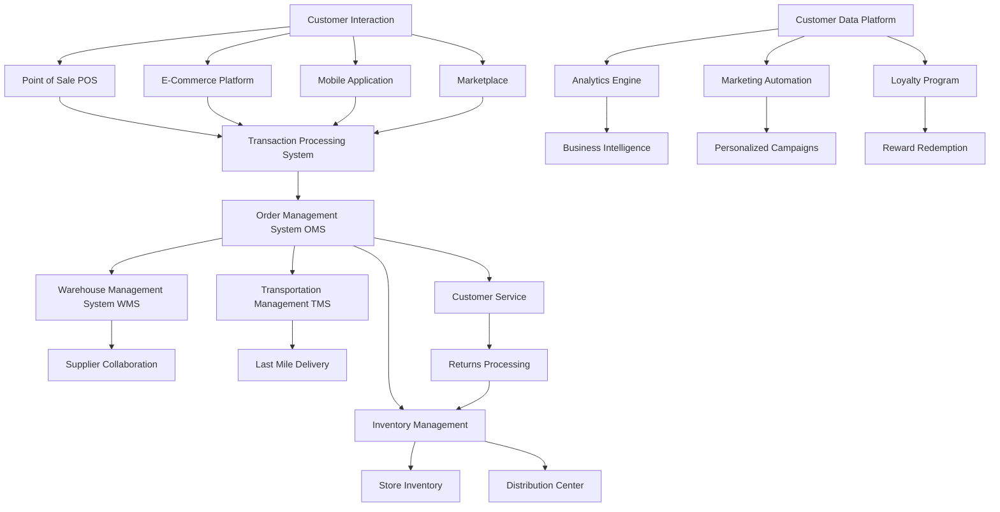
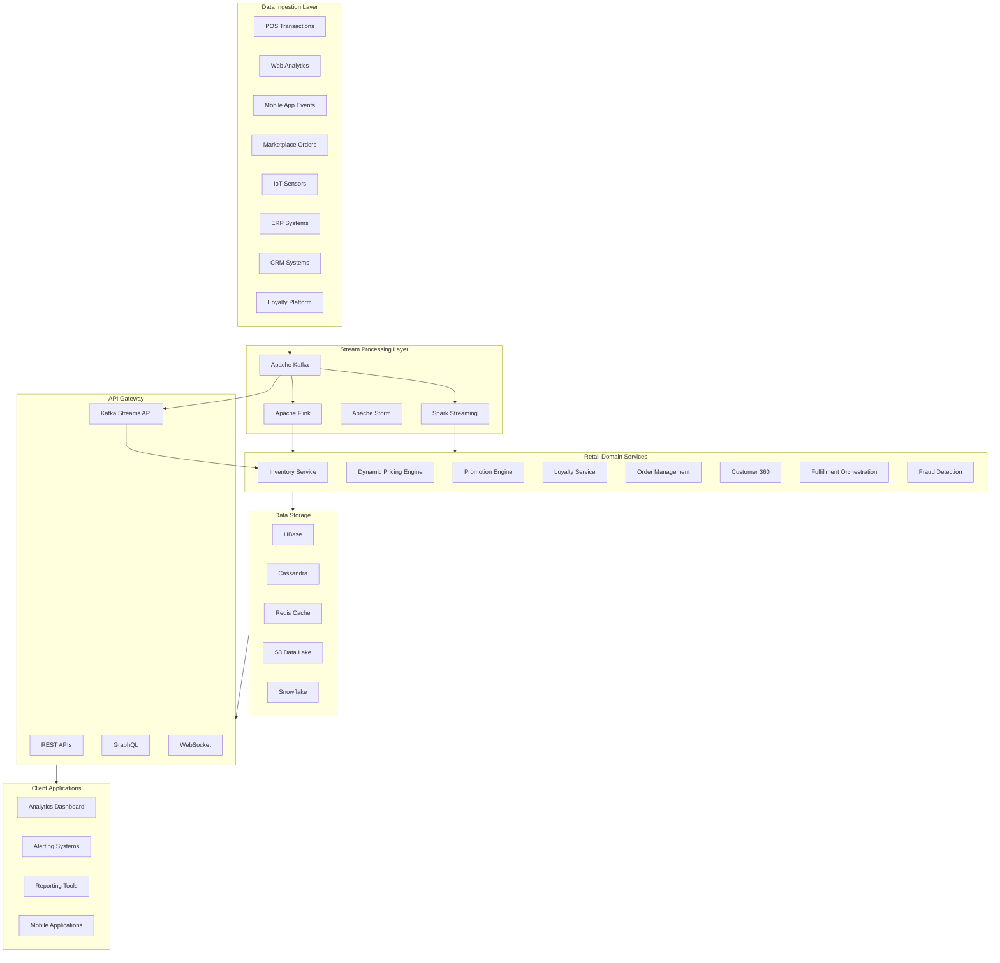
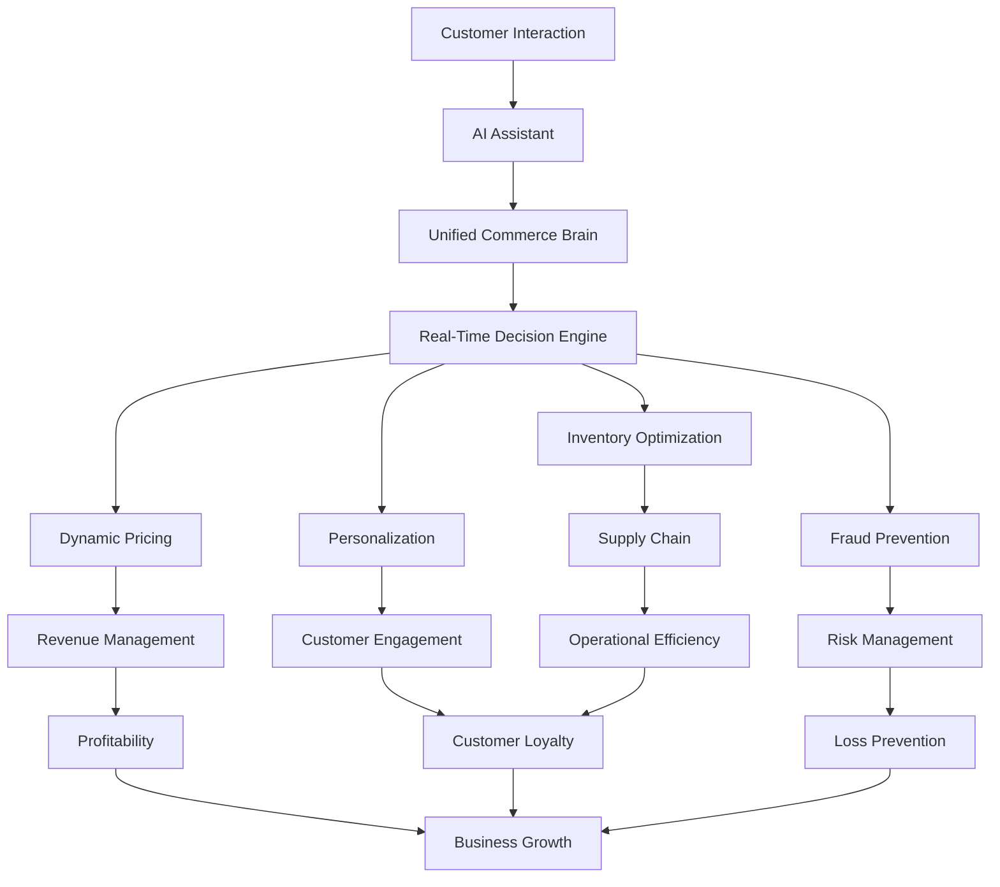

# Retail Domain Knowledge

## 1. Overview

### What is Retail Domain Knowledge?

Retail domain knowledge encompasses the complete ecosystem of concepts, processes, and best practices that govern the sale of goods and services to consumers. It spans the entire retail value chain from product sourcing and inventory management through point-of-sale transactions to post-purchase customer engagement. This domain integrates merchandising strategies, supply chain logistics, customer relationship management, pricing optimization, and omnichannel commerce into a cohesive business model that drives revenue and customer loyalty.

The retail industry represents one of the largest sectors of the global economy, with total retail sales exceeding $28 trillion worldwide. Understanding retail domain knowledge is essential for building platforms that can handle the complex interactions between customers, products, inventory, and business operations that define modern commerce.

### Why Was It Created?

Retail domain knowledge as a formalized discipline emerged from the convergence of several retail evolution phases:

**Brick-and-Mortar Era (1850s-1990s):** Department stores like Macy's, Sears, and Walmart revolutionized retail by offering centralized shopping destinations with diversified product assortments. This era established fundamental concepts like inventory tracking, SKU management, and store-level merchandising that remain relevant today.

**E-Commerce Revolution (1995-2010):** Amazon, eBay, and later Shopify transformed retail by enabling digital storefronts. This phase introduced concepts like shopping cart abandonment, conversion funnels, digital payments, and dropshipping that expanded the retail domain beyond physical boundaries.

**Omnichannel Commerce (2010-Present):** The unification of online and offline retail created new challenges in inventory visibility, order fulfillment, and customer experience continuity. Retailers now must seamlessly integrate mobile apps, social commerce, in-store pickup, and same-day delivery into a coherent shopping journey.

**Intelligent Retail (2020-Future):** AI, machine learning, IoT sensors, and real-time data streaming now power demand forecasting, dynamic pricing, personalized recommendations, and automated replenishment. This evolution demands sophisticated technical platforms that can process millions of events per second while applying complex business rules.

### What Business Problems Does It Solve?

Retail domain knowledge addresses critical enterprise challenges:

- **Inventory Optimization:** Reducing stockouts and overstock situations through demand forecasting and automated replenishment
- **Customer Acquisition and Retention:** Building loyalty programs and personalized experiences that increase customer lifetime value
- **Pricing Intelligence:** Maximizing revenue through competitive pricing, promotions, and markdown optimization
- **Supply Chain Efficiency:** Streamlining procurement, warehousing, and distribution to reduce costs and improve speed
- **Omnichannel Integration:** Providing consistent customer experiences across physical stores, e-commerce, mobile apps, and marketplaces
- **Loss Prevention:** Identifying fraud, shrinkage, and operational inefficiencies that erode profit margins
- **Merchandising Optimization:** Selecting optimal product assortments, shelf placement, and display strategies

### Why Do Enterprises Invest in Retail Domain Expertise?

Fortune 500 retailers invest heavily in retail domain expertise because:

- **Walmart** processes 2.5 petabytes of data daily to optimize pricing, inventory, and logistics across 10,500 stores in 24 countries
- **Amazon** uses retail domain expertise to power its recommendation engine, which drives 35% of total revenue
- **Target** increased its quarterly revenue by 15% through advanced customer segmentation and personalized marketing
- **Costco** maintains a 11% gross margin while offering Members-only pricing through expert merchandising and supply chain management
- **Shopify** powers 1.7 million businesses with retail domain knowledge embedded in its platform APIs

---

## 2. Core Concepts

### Retail Data Flow Architecture



### Fundamental Retail Concepts

**Point of Sale (POS) Systems**

The POS system represents the critical touchpoint where customer intent converts to commercial transaction. Modern POS systems capture transaction data including line items, payment method, associate ID, and timestamp, creating the foundation for sales analytics and inventory deduction.

```python
from dataclasses import dataclass
from datetime import datetime
from typing import List, Optional
from decimal import Decimal

@dataclass
class POSTransaction:
    transaction_id: str
    store_id: str
    register_id: str
    associate_id: Optional[str]
    customer_id: Optional[str]
    transaction_type: str  # SALE, RETURN, EXCHANGE, VOID
    line_items: List[TransactionLineItem]
    subtotal: Decimal
    tax_amount: Decimal
    discount_amount: Decimal
    total_amount: Decimal
    payment_methods: List[Payment]
    timestamp: datetime
    metadata: dict

@dataclass
class TransactionLineItem:
    line_number: int
    sku: str
    product_name: str
    quantity: int
    unit_price: Decimal
    extended_price: Decimal
    discount_amount: Decimal
    tax_rate: Decimal
    tax_amount: Decimal
    markdown_reason_code: Optional[str]
    promotion_id: Optional[str]
```

**E-Commerce Platforms**

E-commerce extends retail beyond physical boundaries through digital storefronts. Key components include product catalogs, shopping carts, checkout flows, payment gateways, and order tracking. Modern e-commerce platforms must integrate with brick-and-mortar operations for buy-online-pickup-in-store (BOPIS) and ship-from-store capabilities.

```python
@dataclass
class ECommerceOrder:
    order_id: str
    customer_id: str
    order_status: str  # PENDING, CONFIRMED, PROCESSING, SHIPPED, DELIVERED, CANCELLED
    items: List[CartItem]
    shipping_address: Address
    billing_address: Address
    shipping_method: str
    shipping_cost: Decimal
    subtotal: Decimal
    tax: Decimal
    total: Decimal
    channel: str  # WEB, MOBILE_APP, SOCIAL, MARKETPLACE
    fulfillment_type: str  # DTC, BOPIS, DELIVERY
    created_at: datetime
    updated_at: datetime
```

**Inventory Management**

Inventory management balances availability with carrying costs. Retailers must track inventory across multiple locations, manage stock levels, handle transfers between stores and distribution centers, and process inventory adjustments for damages, shrinkage, and cycle counts.

```python
from enum import Enum

class InventoryTransactionType(Enum):
    RECEIPT = "RECEIPT"  # Goods received from supplier
    SALE = "SALE"  # Inventory sold at POS
    RETURN = "RETURN"  # Customer return
    TRANSFER_OUT = "TRANSFER_OUT"  # Shipped to another location
    TRANSFER_IN = "TRANSFER_IN"  # Received from another location
    ADJUSTMENT = "ADJUSTMENT"  # Inventory recount or damage
    DAMAGE = "DAMAGE"  # Damaged goods written off
    THEFT = "THEFT"  # Shrinkage due to theft
    PROMOTION = "PROMOTION"  # Free item with purchase

@dataclass
class InventoryPosition:
    sku: str
    location_type: str  # STORE, WAREHOUSE, DISTRIBUTION_CENTER
    location_id: str
    on_hand: int
    reserved: int  # Allocated to pending orders
    available: int  # on_hand - reserved
    on_order: int  # Ordered from supplier but not received
    in_transit: int  # Transferred but not received
    safety_stock: int
    reorder_point: int
    lead_time_days: int
    last_updated: datetime
```

**Pricing and Promotions**

Pricing strategy directly impacts revenue and margins. Retailers implement various pricing tactics including everyday low pricing (EDLP), high-low pricing, promotional pricing, clearance markdowns, and competitor-based pricing. Promotions include discounts, buy-one-get-one (BOGO), bundles, and loyalty rewards.

```python
@dataclass
class PriceStrategy:
    sku: str
    regular_price: Decimal
    current_price: Decimal
    price_type: str  # REGULAR, PROMOTIONAL, CLEARANCE, EMPLOYEE
    promotion_id: Optional[str]
    markdown_history: List[MarkdownEvent]
    competitive_price: Optional[Decimal]
    price_elasticity: float
    margin_percent: Decimal

@dataclass
class Promotion:
    promotion_id: str
    name: str
    description: str
    promotion_type: str  # PERCENT_OFF, DOLLAR_OFF, BOGO, BUNDLE, LOYALTY_MULTIPLIER
    discount_value: Decimal
    conditions: PromotionConditions
    start_date: datetime
    end_date: datetime
    applicable_skus: List[str]
    applicable_categories: List[str]
    customer_segment: str  # ALL, LOYALTY_TIER, NEW_CUSTOMER
    max_uses_per_customer: Optional[int]
    max_total_uses: Optional[int]
    current_redemptions: int
```

**Loyalty Programs**

Loyalty programs drive customer retention through rewards, points, and exclusive benefits. Modern loyalty programs integrate with customer data platforms to enable personalized offers and experiences.

```python
@dataclass
class LoyaltyMember:
    member_id: str
    customer_id: str
    loyalty_tier: str  # BRONZE, SILVER, GOLD, PLATINUM
    points_balance: int
    lifetime_points: int
    tier_threshold: int
    points_expiration_date: Optional[datetime]
    enrolled_date: datetime
    benefits: List[str]

@dataclass
class LoyaltyTransaction:
    transaction_id: str
    member_id: str
    points_earned: int
    points_redeemed: int
    points_expired: int
    tier_qualifying_amount: Decimal
    transaction_date: datetime
```

**Omnichannel Commerce**

Omnichannel retail unifies customer experiences across all touchpoints. Key capabilities include endless aisle (online ordering for out-of-stock items), buy-online-pickup-in-store (BOPIS), ship-from-store, returns to any channel, and unified customer profiles.

```mermaid
flowchart LR
    A[Customer Journey] --> B[Research Online]
    B --> C[Visit Store]
    C --> D[Try Product]
    D --> E[Scan QR Code]
    E --> F[View Reviews]
    F --> G[Add to Cart App]
    G --> H[Pickup at Store]
    H --> I[Same Day Delivery]
    I --> J[Rate Experience]
    J --> K[Join Loyalty Program]
    K --> L[Personalized Offer]
    L --> M[Next Purchase]
    M --> N[Advocate on Social]
```



---

## 3. Why This Project Uses It

The Enterprise Retail Streaming Platform requires comprehensive retail domain knowledge because it addresses the fundamental challenges facing modern retailers:

**1. Real-Time Inventory Visibility**

Traditional batch-oriented inventory systems update once daily, leading to overselling and stockouts. This platform provides real-time inventory updates across all channels, enabling accurate availability calculations, preventing overselling during flash sales, and optimizing inventory allocation across stores and distribution centers.

**2. Customer 360 View**

Modern retailers struggle with fragmented customer data across POS, e-commerce, mobile apps, and loyalty systems. This platform ingests customer interactions from all touchpoints in real-time, creating unified customer profiles that power personalized recommendations, targeted marketing, and consistent service across channels.

**3. Dynamic Pricing and Promotions**

Price optimization requires understanding competitor pricing, demand patterns, inventory levels, and customer behavior. The platform's streaming architecture enables real-time price adjustments based on these factors, maximizing revenue while maintaining competitive positioning.

**4. Loss Prevention and Fraud Detection**

Retail shrinkage costs the industry $100 billion annually. This platform identifies suspicious patterns through real-time transaction analysis, detecting fraud rings, employee theft, and operational inefficiencies as they occur rather than in retrospective reports.

**5. Supply Chain Optimization**

From supplier collaboration through last-mile delivery, retail supply chains are complex. The platform provides end-to-end visibility into order fulfillment, shipping, and delivery, enabling proactive exception management and customer communication.

**6. Regulatory Compliance**

Retailers must comply with PCI-DSS for payment data, GDPR for European customers, CCPA for California residents, and various state-specific regulations. The platform's retail domain expertise ensures these requirements are embedded in system design.

**7. Real-Time Customer Engagement**

Modern customers expect instant gratification. This platform enables real-time customer engagement through push notifications, personalized offers, and loyalty point updates that drive immediate action.

---

## 4. Architecture Position

### Platform Architecture Overview



### Retail Domain in Platform Architecture

```mermaid
flowchart LR
    subgraph External["External Systems"]
        POS_SYSTEM[POS Systems]
        ECOM_PLATFORM[E-Commerce Platform]
        PARTNER_APIS[Partner APIs]
    end

    subgraph Platform["Retail Streaming Platform"]
        subgraph Ingest["Ingestion"]
            EVENTS[Retail Events]
        end

        subgraph Process["Processing"]
            REAL_TIME[Real-Time Stream]
            NEAR_TIME[Near-Time Batch]
        end

        subgraph Domain["Retail Domain Layer"]
            INV[Inventory Domain]
            ORD[Order Domain]
            CUST[Customer Domain]
            PRIC[Price Domain]
            LOY[ Loyalty Domain]
            PROM[Promotion Domain]
        end

        subgraph Serve["Serving Layer"]
            QUERY[Query Services]
            CACHE[Cache Layer]
            SEARCH[Search Index]
        end
    end

    subgraph Consumers["Consumers"]
        ANALYTICS[Analytics]
        ML[ML Pipeline]
        DASHBOARDS[Dashboards]
        ALERTS[Alerts]
    end

    External --> EVENTS
    EVENTS --> REAL_TIME
    EVENTS --> NEAR_TIME
    REAL_TIME --> Domain
    NEAR_TIME --> Domain
    Domain --> Query
    Query --> CACHE
    CACHE --> SEARCH
    SEARCH --> Consumers
```



---

## 5. Folder Structure

### Retail Domain Project Structure

```
/retail-streaming-platform
├── src/
│   ├── retail/
│   │   ├── __init__.py
│   │   ├── domain/
│   │   │   ├── __init__.py
│   │   │   ├── models/
│   │   │   │   ├── __init__.py
│   │   │   │   ├── inventory.py
│   │   │   │   ├── order.py
│   │   │   │   ├── customer.py
│   │   │   │   ├── pricing.py
│   │   │   │   ├── promotion.py
│   │   │   │   └── loyalty.py
│   │   │   ├── services/
│   │   │   │   ├── __init__.py
│   │   │   │   ├── inventory_service.py
│   │   │   │   ├── order_service.py
│   │   │   │   ├── customer_service.py
│   │   │   │   ├── pricing_service.py
│   │   │   │   ├── promotion_service.py
│   │   │   │   └── loyalty_service.py
│   │   │   ├── events/
│   │   │   │   ├── __init__.py
│   │   │   │   ├── inventory_events.py
│   │   │   │   ├── order_events.py
│   │   │   │   ├── customer_events.py
│   │   │   │   └── promotion_events.py
│   │   │   └── aggregates/
│   │   │       ├── __init__.py
│   │   │       ├── sales_aggregate.py
│   │   │       └── inventory_aggregate.py
│   │   ├── streaming/
│   │   │   ├── __init__.py
│   │   │   ├── flink/
│   │   │   │   ├── __init__.py
│   │   │   │   ├── inventory_pipeline.py
│   │   │   │   ├── sales_pipeline.py
│   │   │   │   ├── customer_pipeline.py
│   │   │   │   └── fraud_detection_pipeline.py
│   │   │   ├── kafka/
│   │   │   │   ├── __init__.py
│   │   │   │   ├── producers/
│   │   │   │   │   ├── retail_event_producer.py
│   │   │   │   │   └── inventory_event_producer.py
│   │   │   │   └── consumers/
│   │   │   │       ├── sales_consumer.py
│   │   │   │       └── inventory_consumer.py
│   │   │   └── state/
│   │   │       ├── __init__.py
│   │   │       └── state_management.py
│   │   ├── api/
│   │   │   ├── __init__.py
│   │   │   ├── rest/
│   │   │   │   ├── __init__.py
│   │   │   │   ├── inventory_api.py
│   │   │   │   ├── order_api.py
│   │   │   │   ├── customer_api.py
│   │   │   │   └── pricing_api.py
│   │   │   └── graphql/
│   │   │       ├── __init__.py
│   │   │       ├── schema.py
│   │   │       ├── resolvers/
│   │   │       │   ├── inventory_resolver.py
│   │   │       │   ├── order_resolver.py
│   │   │       │   └── customer_resolver.py
│   │   │       └── types/
│   │   │           ├── inventory_types.py
│   │   │           └── order_types.py
│   │   ├── analytics/
│   │   │   ├── __init__.py
│   │   │   ├── metrics/
│   │   │   │   ├── __init__.py
│   │   │   │   ├── sales_metrics.py
│   │   │   │   ├── inventory_metrics.py
│   │   │   │   └── customer_metrics.py
│   │   │   ├── kpis/
│   │   │   │   ├── __init__.py
│   │   │   │   ├── retail_kpis.py
│   │   │   │   └── dashboard_kpis.py
│   │   │   └── reporting/
│   │   │       ├── __init__.py
│   │   │       └── report_generator.py
│   │   └── utils/
│   │       ├── __init__.py
│   │       ├── retail_exceptions.py
│   │       └── business_validators.py
│   └── tests/
│       ├── retail/
│       │   ├── domain/
│       │   │   ├── test_inventory.py
│       │   │   ├── test_order.py
│       │   │   └── test_customer.py
│       │   ├── streaming/
│       │   │   ├── test_flink_pipelines.py
│       │   │   └── test_kafka_consumers.py
│       │   └── api/
│       │       ├── test_inventory_api.py
│       │       └── test_order_api.py
│       └── fixtures/
│           ├── inventory_fixtures.py
│           ├── order_fixtures.py
│           └── customer_fixtures.py
├── config/
│   ├── retail/
│   │   ├── inventory_config.yaml
│   │   ├── pricing_config.yaml
│   │   ├── promotion_config.yaml
│   │   └── loyalty_config.yaml
│   └── stream/
│       ├── flink_config.yaml
│       └── kafka_config.yaml
├── data/
│   ├── retail/
│   │   ├── products/
│   │   ├── customers/
│   │   ├── inventory/
│   │   └── transactions/
│   └── samples/
├── docs/
│   ├── retail/
│   │   ├── domain_model.md
│   │   ├── business_rules.md
│   │   └── retail_glossary.md
│   └── api/
│       └── retail_api_spec.md
├── scripts/
│   ├── retail/
│   │   ├── load_inventory.py
│   │   ├── sync_customers.py
│   │   └── calculate_kpis.py
│   └── migrations/
│       └── retail_schema_migration.py
├── notebooks/
│   └── retail_analytics/
│       ├── sales_analysis.ipynb
│       ├── inventory_optimization.ipynb
│       └── customer_segmentation.ipynb
└── README.md
```

### Key Folder Responsibilities

| Folder | Purpose |
|--------|---------|
| `domain/models/` | Retail domain entities (Product, SKU, Inventory, Order, Customer, Loyalty) |
| `domain/services/` | Business logic and domain operations |
| `domain/events/` | Event definitions for retail domain events |
| `streaming/flink/` | Flink streaming pipelines for real-time processing |
| `streaming/kafka/` | Kafka producers and consumers for event streaming |
| `api/rest/` | REST API endpoints for retail operations |
| `api/graphql/` | GraphQL schema and resolvers |
| `analytics/metrics/` | Retail KPI calculations and metrics |
| `analytics/kpis/` | Business KPI definitions and dashboards |

---

## 6. Implementation Walkthrough

### Retail Data Models

**Product and SKU Model**

```python
from dataclasses import dataclass, field
from datetime import datetime
from decimal import Decimal
from typing import List, Optional, Dict
from enum import Enum

class ProductStatus(Enum):
    ACTIVE = "ACTIVE"
    INACTIVE = "INACTIVE"
    DISCONTINUED = "DISCONTINUED"
    PENDING_LAUNCH = "PENDING_LAUNCH"
    RECALLED = "RECALLED"

class TaxCategory(Enum):
    STANDARD = "STANDARD"
    REDUCED_RATE = "REDUCED_RATE"
    ZERO_RATE = "ZERO_RATE"
    EXEMPT = "EXEMPT"

@dataclass
class Product:
    product_id: str
    sku: str
    upc: str
    name: str
    description: str
    brand_id: str
    category_id: str
    subcategory_id: str
    department_id: str
    status: ProductStatus
    is_taxable: bool
    tax_category: TaxCategory
    unit_of_measure: str
    weight: Decimal
    dimensions: Dict[str, Decimal]
    country_of_origin: str
    harmonized_code: str
    created_at: datetime
    updated_at: datetime
    metadata: Dict[str, str] = field(default_factory=dict)

@dataclass
class ProductVariant:
    variant_id: str
    product_id: str
    sku: str
    upc: str
    name: str
    size: Optional[str]
    color: Optional[str]
    style: Optional[str]
    flavor: Optional[str]
    pattern: Optional[str]
    material: Optional[str]
    additional_attributes: Dict[str, str]
    status: ProductStatus
    price: Decimal
    cost: Decimal
    quantity_on_hand: int
    reserved_quantity: int
    created_at: datetime
    updated_at: datetime
```

**Customer Model**

```python
@dataclass
class Customer:
    customer_id: str
    customer_type: str  # INDIVIDUAL, BUSINESS, GUEST
    email: str
    phone: Optional[str]
    first_name: str
    last_name: str
    date_of_birth: Optional[datetime]
    gender: Optional[str]
    addresses: List[Address]
    preferences: CustomerPreferences
    loyalty_member: Optional[LoyaltyMember]
    segments: List[str]
    lifetime_value: Decimal
    first_purchase_date: Optional[datetime]
    last_purchase_date: Optional[datetime]
    created_at: datetime
    updated_at: datetime
    marketing_opt_in: bool
    privacy_consent: bool

@dataclass
class CustomerPreferences:
    preferred_store_id: Optional[str]
    preferred_language: str
    preferred_currency: str
    communication_channels: List[str]
    product_categories: List[str]
    brand_preferences: List[str]
    dietary_restrictions: List[str]
    marketing_consent: Dict[str, bool]

@dataclass
class Address:
    address_id: str
    address_type: str  # SHIPPING, BILLING, BOTH
    address_line1: str
    address_line2: Optional[str]
    city: str
    state: str
    postal_code: str
    country: str
    is_default: bool
    latitude: Optional[Decimal]
    longitude: Optional[Decimal]
```

**Order Model**

```python
@dataclass
class Order:
    order_id: str
    order_type: str  # ONLINE, POS, PHONE, WHATSAPP
    fulfillment_type: str  # SHIP_TO_HOME, BOPIS, CURBSIDE, DELIVERY
    status: OrderStatus
    customer_id: Optional[str]
    guest_email: Optional[str]
    store_id: Optional[str]
    register_id: Optional[str]
    associate_id: Optional[str]
    line_items: List[OrderLineItem]
    shipping_address: Address
    billing_address: Address
    payment_info: PaymentInfo
    pricing: OrderPricing
    fulfillment: FulfillmentDetails
    timeline: OrderTimeline
    created_at: datetime
    updated_at: datetime

class OrderStatus(Enum):
    PENDING = "PENDING"
    CONFIRMED = "CONFIRMED"
    PAYMENT_RECEIVED = "PAYMENT_RECEIVED"
    PROCESSING = "PROCESSING"
    PICKING = "PICKING"
    PACKED = "PACKED"
    READY_FOR_PICKUP = "READY_FOR_PICKUP"
    SHIPPED = "SHIPPED"
    IN_TRANSIT = "IN_TRANSIT"
    OUT_FOR_DELIVERY = "OUT_FOR_DELIVERY"
    DELIVERED = "DELIVERED"
    CANCELLED = "CANCELLED"
    RETURNED = "RETURNED"
    REFUNDED = "REFUNDED"
    PARTIALLY_SHIPPED = "PARTIALLY_SHIPPED"
    PARTIALLY_DELIVERED = "PARTIALLY_DELIVERED"

@dataclass
class OrderLineItem:
    line_number: int
    sku: str
    product_name: str
    variant_id: Optional[str]
    quantity: int
    unit_price: Decimal
    extended_price: Decimal
    discount_amount: Decimal
    discount_reasons: List[str]
    tax_amount: Decimal
    tax_rate: Decimal
    final_price: Decimal
    fulfillment_status: str  # PENDING, ALLOCATED, SHIPPED, DELIVERED
    allocated_location_id: Optional[str]
    shipped_quantity: int
    returned_quantity: int
```

### Business Rules Implementation

**Inventory Allocation Rules**

```python
class InventoryAllocationRules:
    """Business rules for inventory allocation across channels"""

    def allocate_inventory(self, order: Order, inventory_positions: List[InventoryPosition]) -> AllocationResult:
        """
        Allocate inventory from available positions to fulfill order.
        Priority: Store > Regional DC > Central DC
        """
        required_quantities = self._calculate_required_quantities(order)
        allocations = []
        unallocated = []

        for sku, quantity_needed in required_quantities.items():
            allocated = 0
            sku_positions = self._get_sku_positions(sku, inventory_positions)

            # Sort by proximity to shipping address, then by cost
            sorted_positions = self._sort_positions_by_fulfillment_priority(
                sku_positions, order.shipping_address
            )

            for position in sorted_positions:
                if allocated >= quantity_needed:
                    break

                available = position.available
                if available <= 0:
                    continue

                quantity_to_allocate = min(available, quantity_needed - allocated)
                allocations.append(InventoryAllocation(
                    sku=sku,
                    location_id=position.location_id,
                    location_type=position.location_type,
                    quantity=quantity_to_allocate,
                    unit_cost=position.average_cost
                ))
                allocated += quantity_to_allocate

            if allocated < quantity_needed:
                unallocated.append({
                    'sku': sku,
                    'requested': quantity_needed,
                    'allocated': allocated,
                    'shortfall': quantity_needed - allocated
                })

        return AllocationResult(
            allocations=allocations,
            unallocated=unallocated,
            fully_fulfilled=len(unallocated) == 0
        )

    def validate_bopis_order(self, order: Order, store_inventory: List[InventoryPosition]) -> ValidationResult:
        """Validate BOPIS order against store inventory rules"""
        errors = []

        # Check if store is open
        if not self._is_store_open(order.store_id, order.created_at):
            errors.append("Store is currently closed")

        # Check pickup time slot availability
        if not self._has_pickup_slot_available(order.store_id):
            errors.append("No pickup time slots available today")

        # Validate all items available in store
        for line_item in order.line_items:
            position = self._find_position(line_item.sku, store_inventory)
            if not position or position.available < line_item.quantity:
                errors.append(f"Insufficient inventory for {line_item.sku}")

        return ValidationResult(
            is_valid=len(errors) == 0,
            errors=errors
        )
```

**Pricing Business Rules**

```python
class PricingEngine:
    """Dynamic pricing engine with business rules"""

    def calculate_line_item_price(
        self,
        sku: str,
        customer_id: Optional[str],
        quantity: int,
        channel: str,
        context: PricingContext
    ) -> CalculatedPrice:
        """Calculate final price with all applicable rules"""

        # Step 1: Get base price
        base_price = self._get_base_price(sku)

        # Step 2: Apply customer-specific pricing
        customer_price = self._get_customer_price(sku, customer_id)
        if customer_price:
            price = customer_price
        else:
            price = base_price

        # Step 3: Apply quantity discounts
        volume_discount = self._get_volume_discount(sku, quantity)
        if volume_discount:
            price = self._apply_discount(price, volume_discount)

        # Step 4: Apply promotions
        promotion = self._get_applicable_promotion(sku, customer_id, channel, context)
        if promotion:
            price = self._apply_promotion(price, promotion)

        # Step 5: Apply loyalty pricing
        if customer_id:
            loyalty_tier = self._get_loyalty_tier(customer_id)
            loyalty_discount = self._get_loyalty_discount(loyalty_tier)
            price = self._apply_discount(price, loyalty_discount)

        # Step 6: Apply channel-specific pricing
        channel_adjustment = self._get_channel_adjustment(channel)
        price = price * (1 + channel_adjustment)

        # Step 7: Floor price at minimum margin
        cost = self._get_sku_cost(sku)
        min_margin = self._get_minimum_margin(sku)
        min_price = cost * (1 + min_margin)
        price = max(price, min_price)

        return CalculatedPrice(
            sku=sku,
            base_price=base_price,
            final_price=price,
            total_discount=base_price - price,
            applied_promotions=[promotion] if promotion else [],
            margin=((price - cost) / price * 100) if price > 0 else 0
        )
```

### Retail KPIs Definition

```python
from dataclasses import dataclass
from datetime import datetime, timedelta
from typing import List, Optional
from decimal import Decimal

@dataclass
class RetailKPIs:
    """Key Performance Indicators for retail operations"""

    # Sales Metrics
    total_revenue: Decimal
    total_transactions: int
    average_transaction_value: Decimal
    units_per_transaction: Decimal
    year_over_year_growth: Decimal
    quarter_over_quarter_growth: Decimal
    sales_per_square_foot: Decimal
    sales_per_employee: Decimal

    # Customer Metrics
    total_customers: int
    new_customers: int
    returning_customers: int
    customer_retention_rate: Decimal
    customer_acquisition_cost: Decimal
    customer_lifetime_value: Decimal
    net_promoter_score: int

    # Inventory Metrics
    inventory_turnover: Decimal
    days_of_inventory: int
    stockout_rate: Decimal
    inventory_accuracy: Decimal
    shrinkage_rate: Decimal
    average_inventory_value: Decimal

    # Margin Metrics
    gross_margin: Decimal
    net_margin: Decimal
    average_markup: Decimal
    markdown_rate: Decimal
    promotion_effectiveness: Decimal

    # Channel Metrics
    ecommerce_conversion_rate: Decimal
    cart_abandonment_rate: Decimal
    bopis_percentage: Decimal
    curbside_percentage: Decimal
    ship_from_store_percentage: Decimal

@dataclass
class SalesMetrics:
    """Detailed sales metrics by dimension"""

    period: str
    period_start: datetime
    period_end: datetime
    revenue: Decimal
    units_sold: int
    transactions: int
    average_basket: Decimal
    by_channel: Dict[str, Decimal]
    by_category: Dict[str, Decimal]
    by_store: Dict[str, Decimal]
    by_customer_segment: Dict[str, Decimal]
    top_products: List[ProductPerformance]
    compared_to_previous_period: Decimal
    year_to_date: Decimal
    year_to_date_previous: Decimal
    ytd_growth: Decimal

@dataclass
class ProductPerformance:
    sku: str
    product_name: str
    units_sold: int
    revenue: Decimal
    average_price: Decimal
    margin_percent: Decimal
    rank: int
```

---

## 7. Production Best Practices

### Retail System Deployment

**Zero-Downtime Deployment Strategy**

```yaml
# retail-service deployment with zero-downtime
apiVersion: apps/v1
kind: Deployment
metadata:
  name: retail-inventory-service
  namespace: retail-production
spec:
  replicas: 6
  strategy:
    type: RollingUpdate
    rollingUpdate:
      maxSurge: 25%
      maxUnavailable: 0
  selector:
    matchLabels:
      app: retail-inventory
  template:
    metadata:
      labels:
        app: retail-inventory
      annotations:
        prometheus.io/scrape: "true"
        prometheus.io/port: "9090"
    spec:
      affinity:
        podAntiAffinity:
          preferredDuringSchedulingIgnoredDuringExecution:
            - weight: 100
              podAffinityTerm:
                labelSelector:
                  matchExpressions:
                    - key: app
                      operator: In
                      values:
                        - retail-inventory
                topologyKey: kubernetes.io/hostname
      containers:
        - name: retail-inventory
          image: registry.retail.com/inventory-service:v2.4.1
          ports:
            - containerPort: 8080
              name: http
            - containerPort: 9090
              name: metrics
          env:
            - name: KAFKA_BROKERS
              valueFrom:
                configMapKeyRef:
                  name: kafka-config
                  key: brokers
            - name: REDIS_URL
              valueFrom:
                secretKeyRef:
                  name: redis-credentials
                  key: url
          resources:
            requests:
              memory: "512Mi"
              cpu: "250m"
            limits:
              memory: "2Gi"
              cpu: "1000m"
          readinessProbe:
            httpGet:
              path: /health/ready
              port: 8080
            initialDelaySeconds: 10
            periodSeconds: 5
            failureThreshold: 3
          livenessProbe:
            httpGet:
              path: /health/live
              port: 8080
            initialDelaySeconds: 30
            periodSeconds: 10
            failureThreshold: 5
```

### Data Consistency Patterns

**Eventual Consistency for Inventory**

```python
class InventoryConsistencyManager:
    """
    Manages eventual consistency for inventory across distributed system.
    Uses saga pattern for cross-service coordination.
    """

    def __init__(self, kafka_producer, redis_client, inventory_repo):
        self.producer = kafka_producer
        self.redis = redis_client
        self.inventory_repo = inventory_repo

    async def reserve_inventory(self, order_id: str, items: List[ReservationItem]) -> ReservationResult:
        """
        Reserve inventory with idempotency and compensation support.
        Returns reservation with timeout for automatic release.
        """
        reservation_id = f"res-{order_id}"

        # Idempotency check
        existing = await self.redis.get(f"reservation:{reservation_id}")
        if existing:
            return ReservationResult.parse(existing)

        # Create reservation with saga
        saga = InventoryReservationSaga(reservation_id, items)
        await saga.execute(self)

        # Store reservation with TTL
        await self.redis.setex(
            f"reservation:{reservation_id}",
            900,  # 15 minutes
            saga.to_json()
        )

        # Schedule compensation if not confirmed
        await self.schedule_compensation(reservation_id, items)

        return saga.result

    async def confirm_reservation(self, order_id: str, transaction_id: str):
        """Confirm reservation after payment success"""
        reservation_id = f"res-{order_id}"

        async with self.inventory_repo.transaction():
            reservation_data = await self.redis.get(f"reservation:{reservation_id}")
            if not reservation_data:
                raise ReservationNotFoundError(order_id)

            reservation = ReservationResult.parse(reservation_data)

            # Decrement actual inventory
            for item in reservation.items:
                await self.inventory_repo.decrement_inventory(
                    sku=item.sku,
                    location_id=item.location_id,
                    quantity=item.quantity
                )

            # Mark reservation as confirmed
            await self.redis.delete(f"reservation:{reservation_id}")

            # Publish confirmed event
            await self.producer.publish(
                topic="inventory.reserved.confirmed",
                key=order_id,
                value={
                    "order_id": order_id,
                    "transaction_id": transaction_id,
                    "confirmed_at": datetime.utcnow().isoformat()
                }
            )
```

### Multi-Region Retail Deployment

```python
class MultiRegionRetailArchitecture:
    """
    Multi-region deployment for retail with active-active configuration.
    """

    REGIONS = {
        "us-east": {"primary": True, "latency_ms": 45},
        "us-west": {"primary": True, "latency_ms": 65},
        "eu-west": {"primary": False, "latency_ms": 120},
        "ap-south": {"primary": False, "latency_ms": 180}
    }

    def __init__(self, region: str):
        self.region = region
        self.config = self.REGIONS[region]

    def get_inventory_shard(self, sku: str) -> str:
        """Determine inventory shard based on SKU hash"""
        sku_hash = hash(sku)
        if self.config["primary"]:
            # Primary regions handle their SKU range
            sku_range = sku_hash % 100
            if sku_range < 45:
                return "us-east"
            elif sku_range < 90:
                return "us-west"
            else:
                return "eu-west"
        else:
            return self.region

    async def get_inventory_across_regions(self, sku: str) -> Dict[str, int]:
        """Aggregate inventory across all regions for omnichannel"""
        inventory = {}

        if self.region == "us-east":
            # Query all regions in parallel
            tasks = [
                self._query_region_inventory("us-east", sku),
                self._query_region_inventory("us-west", sku),
                self._query_region_inventory("eu-west", sku)
            ]
            results = await asyncio.gather(*tasks)
            for region, qty in results:
                inventory[region] = qty
        else:
            inventory[self.region] = await self._query_region_inventory(self.region, sku)

        return inventory
```

---

## 8. Common Problems

| Problem | Description | Impact | Solution | Prevention |
|---------|-------------|--------|----------|------------|
| **Overselling** | Selling inventory that doesn't exist | Customer dissatisfaction, order cancellations | Real-time inventory reservations with timeout | Inventory tracking with safety stock buffers |
| **Stockout** | Products unavailable when customer wants to buy | Lost sales, customer churn | Demand forecasting, automated replenishment | Safety stock calculations, lead time monitoring |
| **Phantom Inventory** | Inventory shows available but is not physically present | Order fulfillment failures | Cycle counts, inventory accuracy programs | RFID, regular audits, shrinkage tracking |
| **Price Inconsistency** | Same product has different prices across channels | Customer trust erosion, regulatory issues | Centralized pricing engine with single source of truth | Price synchronization, governance workflows |
| **Cart Abandonment** | Customers add to cart but don't complete purchase | Lost revenue, high CAC | Exit intent offers, streamlined checkout | A/B testing, user experience optimization |
| **Return Fraud** | Customers abuse return policies | Margin erosion, operational costs | Return policy enforcement, fraud detection | Order history verification, customer risk scoring |
| **Slow-Moving Inventory** | Products don't sell at expected rates | Margin compression, storage costs | Markdown optimization, bundle strategies | Demand forecasting, early warning alerts |
| **Loyalty Point Expiration** | Points expire causing customer complaints | Customer dissatisfaction, churn | Proactive communications, extension programs | Points expiration alerts, retention campaigns |
| **BOPIS Failures** | Buy online pickup in store doesn't work as expected | Customer frustration, lost loyalty | Order visibility, pickup slot management | Store associate training, system integrations |
| **Delivery Delays** | Orders arrive later than expected | Customer dissatisfaction, refunds | Real-time tracking, proactive communication | Carrier SLAs, exception monitoring |

---

## 9. Performance Optimization

### Inventory Query Optimization

```python
class OptimizedInventoryService:
    """
    High-performance inventory service with multi-tier caching.
    Target: <10ms p99 latency for inventory lookups.
    """

    def __init__(self, redis_cluster, hbase_client, kafka_client):
        self.redis = redis_cluster
        self.hbase = hbase_client
        self.kafka = kafka_client
        self.cache_ttl = 300  # 5 minutes

    async def get_inventory_position(self, sku: str, location_id: str) -> Optional[InventoryPosition]:
        """Get inventory with tiered caching strategy"""

        cache_key = f"inv:{sku}:{location_id}"

        # L1: Redis cache (microseconds)
        cached = await self.redis.get(cache_key)
        if cached:
            return InventoryPosition.parse(cached)

        # L2: HBase with connection pooling
        position = await self.hbase.get_inventory(sku, location_id)
        if position:
            # Populate L1 cache
            await self.redis.setex(cache_key, self.cache_ttl, position.to_json())

        return position

    async def get_aggregate_inventory(self, sku: str) -> Dict[str, int]:
        """
        Get inventory across all locations with materialized view.
        Uses pre-computed aggregates updated via streaming.
        """
        cache_key = f"inv_agg:{sku}"

        # Check aggregated cache
        cached = await self.redis.get(cache_key)
        if cached:
            return json.loads(cached)

        # Use materialized view from Flink
        aggregated = await self.hbase.get_aggregated_inventory(sku)

        await self.redis.setex(cache_key, 60, json.dumps(aggregated))  # 1 minute TTL

        return aggregated

    async def update_inventory_streaming(self, event: InventoryEvent):
        """
        Update inventory via streaming pipeline with cache invalidation.
        Ensures consistency between cache and source of truth.
        """
        # Update source of truth
        await self.hbase.update_inventory(event)

        # Invalidate affected cache keys
        await self.redis.delete(f"inv:{event.sku}:{event.location_id}")
        await self.redis.delete(f"inv_agg:{event.sku}")

        # Publish event for downstream consumers
        await self.kafka.publish(
            topic="inventory.updates",
            key=event.sku,
            value=event.to_json()
        )
```

### High-Volume Order Processing

```python
class OrderProcessingOptimizer:
    """
    Optimized order processing for high-volume scenarios.
    Handles 10,000+ orders per minute during peak events.
    """

    def __init__(self, connection_pool, cache_client, event_producer):
        self.pool = connection_pool
        self.cache = cache_client
        self.producer = event_producer

    async def process_orders_batch(self, orders: List[Order]) -> BatchResult:
        """
        Process orders in batches with parallel execution.
        Uses connection pooling and bulk operations.
        """

        # Group orders by processing priority
        urgent, normal = self._prioritize_orders(orders)

        # Process urgent orders first
        if urgent:
            await self._process_with_priority(urgent)

        # Process remaining orders in parallel batches
        batches = self._create_batches(normal, batch_size=100)

        results = []
        for batch in batches:
            batch_results = await asyncio.gather(
                *[self._process_single_order(order) for order in batch],
                return_exceptions=True
            )
            results.extend(batch_results)

        return BatchResult(succeeded=len([r for r in results if not isinstance(r, Exception)]),
                          failed=len([r for r in results if isinstance(r, Exception)]))

    async def _process_single_order(self, order: Order) -> OrderResult:
        """Process order with optimized database operations"""

        async with self.pool.connection() as conn:
            async with conn.transaction():
                # Use single INSERT for all line items
                await conn.execute_bulk("""
                    INSERT INTO order_line_items (order_id, sku, quantity, price)
                    VALUES ($1, $2, $3, $4)
                """, [(order.id, item.sku, item.quantity, item.unit_price)
                      for item in order.line_items])

                # Update inventory with row-level locking
                for item in order.line_items:
                    await conn.execute("""
                        UPDATE inventory
                        SET reserved = reserved + $1
                        WHERE sku = $2 AND location_id = $3
                        AND available >= $1
                    """, item.quantity, item.sku, order.store_id)

                # Insert order header
                await conn.execute("""
                    INSERT INTO orders (id, customer_id, status, created_at)
                    VALUES ($1, $2, $3, $4)
                """, order.id, order.customer_id, "CONFIRMED", order.created_at)

        # Publish events asynchronously
        await self.producer.publish("orders.created", order.id, order.to_event())

        return OrderResult(order_id=order.id, status="CONFIRMED")
```

---

## 10. Security

### Retail Payment Security

```python
class PaymentSecurityManager:
    """
    PCI-DSS compliant payment processing.
    Ensures sensitive data is never stored or logged.
    """

    def __init__(self, tokenization_service, encryption_key_manager):
        self.tokenization = tokenization_service
        self.key_manager = encryption_key_manager

    async def process_payment(self, order_id: str, payment: PaymentRequest) -> PaymentResult:
        """
        Process payment with full PCI compliance.
        Uses tokenization to avoid storing PAN.
        """

        # Tokenize card number immediately
        card_token = await self.tokenization.tokenize(payment.card_number)
        cvv_token = await self.tokenization.tokenize_cvv(payment.cvv)

        # Clear sensitive data from memory
        payment.card_number = None
        payment.cvv = None

        # Create authorization request with tokens only
        auth_request = AuthorizationRequest(
            order_id=order_id,
            card_token=card_token,
            expiry_month=payment.expiry_month,
            expiry_year=payment.expiry_year,
            amount=payment.amount,
            currency=payment.currency,
            cvv_token=cvv_token
        )

        # Process with payment gateway
        result = await self.payment_gateway.authorize(auth_request)

        # Never log sensitive data
        logger.info(f"Payment authorized for order {order_id}",
                   extra={"amount": payment.amount, "card_type": result.card_type})

        return PaymentResult(
            transaction_id=result.transaction_id,
            status=result.status,
            card_last_four=result.last_four,
            card_type=result.card_type
        )

    async def tokenize_for_future_use(self, customer_id: str, payment: PaymentRequest) -> str:
        """
        Tokenize and store payment method for future purchases.
        Returns stored payment method ID.
        """

        # Tokenize card
        card_token = await self.tokenization.tokenize(payment.card_number)
        payment.card_number = None

        # Store token with customer reference
        payment_method_id = await self.tokenization.store_token(
            customer_id=customer_id,
            card_token=card_token,
            expiry_month=payment.expiry_month,
            expiry_year=payment.expiry_year,
            billing_address=payment.billing_address
        )

        return payment_method_id
```

### Customer Data Protection

```python
class CustomerDataProtection:
    """
    GDPR, CCPA, and CPRA compliant customer data handling.
    """

    def __init__(self, data_repository, encryption_service):
        self.data_repo = data_repository
        self.encryption = encryption_service

    async def delete_customer_data(self, customer_id: str, regulation: str = "GDPR") -> DeletionResult:
        """
        Delete customer data with regulatory compliance.
        Handles right to erasure requests.
        """

        customer = await self.data_repo.get_customer(customer_id)

        # Verify identity before deletion
        if not customer.verified:
            raise IdentityVerificationRequired()

        # Handle different regulation requirements
        if regulation == "GDPR":
            # Full deletion within 30 days
            await self._gdpr_delete(customer)
        elif regulation == "CCPA":
            # Opt-out of sale, retain for service
            await self._ccpa_opt_out(customer)
        elif regulation == "CPRA":
            # Limit use of sensitive data
            await self._cpri_limit(customer)

        # Record deletion request
        await self.data_repo.record_deletion_request(
            customer_id=customer_id,
            regulation=regulation,
            requested_at=datetime.utcnow(),
            completed_at=datetime.utcnow()
        )

        return DeletionResult(
            customer_id=customer_id,
            regulation=regulation,
            status="COMPLETED"
        )

    async def anonymize_for_analytics(self, customer_id: str) -> str:
        """
        Create anonymized version of customer for analytics.
        Preserves aggregate patterns while removing PII.
        """

        customer = await self.data_repo.get_customer(customer_id)

        anonymized = AnonymizedCustomer(
            customer_id=f"anon_{customer_id[:8]}",
            segment=customer.segment,
            lifetime_value_bucket=self._bucket_value(customer.lifetime_value),
            purchase_frequency_bucket=self._bucket_frequency(customer.purchase_frequency),
            preferred_category=customer.preferred_category,
            geography=self._generalize_location(customer.location),
            birth_year_bucket=self._bucket_year(customer.date_of_birth),
            acquisition_channel=customer.acquisition_channel
        )

        return anonymized
```

---

## 11. Monitoring

### Retail KPI Monitoring

```python
from dataclasses import dataclass
from datetime import datetime, timedelta
from typing import Dict, List
import pandas as pd

@dataclass
class RetailKPIMonitor:
    """Comprehensive retail KPI monitoring"""

    # Real-time sales metrics
    @staticmethod
    def calculate_sales_kpis(transactions: List[Transaction], period: str) -> SalesKPIs:

        df = pd.DataFrame([t.to_dict() for t in transactions])

        total_revenue = df['total_amount'].sum()
        total_transactions = len(df)
        avg_transaction_value = total_revenue / total_transactions if total_transactions > 0 else 0

        return SalesKPIs(
            total_revenue=total_revenue,
            total_transactions=total_transactions,
            average_transaction_value=avg_transaction_value,
            units_sold=df['total_units'].sum(),
            average_units_per_transaction=df['total_units'].mean(),
            conversion_rate=calculate_conversion_rate(df),
            year_over_year_growth=calculate_yoy_growth(df, period),
            sales_per_hour=calculate_hourly_sales_rate(df),
            peak_hour=identify_peak_hour(df)
        )

    # Inventory turnover metrics
    @staticmethod
    def calculate_inventory_kpis(inventory_data: List[InventoryPosition],
                                  sales_data: List[SalesData]) -> InventoryKPIs:

        avg_inventory = sum(ip.on_hand * ip.unit_cost for ip in inventory_data) / len(inventory_data)
        cogs = sum(s.total for s in sales_data)

        inventory_turnover = cogs / avg_inventory if avg_inventory > 0 else 0
        days_of_inventory = 365 / inventory_turnover if inventory_turnover > 0 else 0

        stockout_skus = [ip for ip in inventory_data if ip.on_hand == 0]
        stockout_rate = len(stockout_skus) / len(inventory_data) if inventory_data else 0

        return InventoryKPIs(
            inventory_turnover=inventory_turnover,
            days_of_inventory=days_of_inventory,
            average_inventory_value=avg_inventory,
            stockout_rate=stockout_rate,
            slow_moving_inventory_pct=calculate_slow_moving_pct(inventory_data),
            obsolete_inventory_pct=calculate_obsolete_pct(inventory_data),
            shrinkage_rate=calculate_shrinkage_rate(inventory_data)
        )

    # Customer metrics
    @staticmethod
    def calculate_customer_kpis(customers: List[Customer],
                                transactions: List[Transaction]) -> CustomerKPIs:

        new_customers = [c for c in customers if c.first_purchase_date > datetime.utcnow() - timedelta(days=30)]
        returning = [c for c in customers if c.purchase_count > 1]

        return CustomerKPIs(
            total_customers=len(customers),
            new_customers=len(new_customers),
            returning_customers=len(returning),
            retention_rate=len(returning) / len(customers) if customers else 0,
            average_lifetime_value=sum(c.lifetime_value for c in customers) / len(customers) if customers else 0,
            customer_acquisition_cost=calculate_cac(transactions),
            repeat_purchase_rate=calculate_repeat_rate(customers),
            abandonment_rate=calculate_cart_abandonment_rate(transactions)
        )
```

### Sales Metrics Dashboard

```python
class SalesMetricsDashboard:
    """
    Real-time sales monitoring dashboard data provider.
    """

    METRIC_QUERIES = {
        "revenue_today": """
            SELECT SUM(total_amount) as revenue
            FROM transactions
            WHERE transaction_date >= CURRENT_DATE
            AND status = 'COMPLETED'
        """,
        "transactions_today": """
            SELECT COUNT(*) as count
            FROM transactions
            WHERE transaction_date >= CURRENT_DATE
        """,
        "top_products": """
            SELECT p.name, SUM(t.quantity) as units, SUM(t.extended_price) as revenue
            FROM transaction_items t
            JOIN products p ON t.sku = p.sku
            WHERE t.transaction_date >= CURRENT_DATE - INTERVAL '7 days'
            GROUP BY p.name
            ORDER BY revenue DESC
            LIMIT 10
        """,
        "sales_by_channel": """
            SELECT channel, SUM(total_amount) as revenue, COUNT(*) as orders
            FROM transactions
            WHERE transaction_date >= CURRENT_DATE - INTERVAL '30 days'
            GROUP BY channel
        """,
        "sales_by_region": """
            SELECT s.region, SUM(t.total_amount) as revenue
            FROM transactions t
            JOIN stores s ON t.store_id = s.store_id
            WHERE t.transaction_date >= CURRENT_DATE - INTERVAL '30 days'
            GROUP BY s.region
        """
    }

    @classmethod
    async def get_dashboard_metrics(cls, connection) -> Dict:
        """Fetch all dashboard metrics in parallel"""

        results = {}
        for name, query in cls.METRIC_QUERIES.items():
            async with connection.cursor() as cursor:
                await cursor.execute(query)
                results[name] = await cursor.fetchone()

        return cls._format_dashboard_data(results)
```

---

## 12. Testing Strategy

### Retail Business Logic Testing

```python
import pytest
from decimal import Decimal
from datetime import datetime, timedelta

class TestInventoryBusinessLogic:
    """
    Comprehensive tests for inventory business rules.
    """

    @pytest.fixture
    def inventory_service(self):
        return InventoryService(
            repository=MockInventoryRepository(),
            pricing_service=MockPricingService(),
            notification_service=MockNotificationService()
        )

    @pytest.mark.parametrize("scenario", [
        "in_stock",
        "low_stock",
        "out_of_stock",
        "oversell_attempt",
        "multi_location"
    ])
    async def test_inventory_allocation_scenarios(self, inventory_service, scenario):
        """Test inventory allocation across different scenarios"""

        test_cases = {
            "in_stock": {
                "inventory": [InventoryPosition(sku="SKU1", on_hand=100, reserved=0)],
                "order_quantity": 5,
                "expected_allocated": 5,
                "expected_success": True
            },
            "low_stock": {
                "inventory": [InventoryPosition(sku="SKU1", on_hand=3, reserved=0)],
                "order_quantity": 5,
                "expected_allocated": 3,
                "expected_success": False
            },
            "out_of_stock": {
                "inventory": [InventoryPosition(sku="SKU1", on_hand=0, reserved=0)],
                "order_quantity": 5,
                "expected_allocated": 0,
                "expected_success": False
            },
            "oversell_attempt": {
                "inventory": [InventoryPosition(sku="SKU1", on_hand=10, reserved=8)],
                "order_quantity": 5,
                "expected_allocated": 2,
                "expected_success": False
            }
        }

        case = test_cases[scenario]
        result = await inventory_service.allocate(
            sku="SKU1",
            quantity=case["order_quantity"]
        )

        assert result.allocated_quantity == case["expected_allocated"]
        assert result.success == case["expected_success"]

    async def test_inventory_reservation_timeout(self, inventory_service):
        """
        Test that reservations expire after timeout period.
        Ensures inventory is released back to available pool.
        """
        # Create reservation
        reservation = await inventory_service.reserve(
            order_id="ORD123",
            items=[ReservationItem(sku="SKU1", quantity=5)]
        )

        assert reservation.status == "RESERVED"
        assert reservation.expires_at == datetime.utcnow() + timedelta(minutes=15)

        # Simulate timeout
        await inventory_service.process_expired_reservations()

        # Verify inventory released
        position = await inventory_service.get_position("SKU1", "STORE1")
        assert position.reserved == 0
        assert position.available == position.on_hand


class TestPricingEngine:
    """
    Tests for dynamic pricing business rules.
    """

    @pytest.fixture
    def pricing_engine(self):
        return PricingEngine(
            base_prices={"SKU1": Decimal("99.99")},
            promotions=self._get_test_promotions(),
            customer_prices={},
            loyalty_config=self._get_loyalty_config()
        )

    def test_base_price_calculation(self, pricing_engine):
        """Test that base price is returned when no modifiers apply"""

        result = pricing_engine.calculate_price(
            sku="SKU1",
            customer_id=None,
            quantity=1,
            channel="WEB"
        )

        assert result.final_price == Decimal("99.99")
        assert result.applied_promotions == []

    def test_promotion_applies_correctly(self, pricing_engine):
        """Test percentage promotion calculation"""

        result = pricing_engine.calculate_price(
            sku="SKU1",
            customer_id=None,
            quantity=1,
            channel="WEB",
            context=PricingContext(promotion_code="SAVE20")
        )

        assert result.final_price == Decimal("79.99")  # 20% off
        assert "SAVE20" in result.applied_promotions

    def test_loyalty_tier_discount(self, pricing_engine):
        """Test loyalty tier discount application"""

        result = pricing_engine.calculate_price(
            sku="SKU1",
            customer_id="GOLD_MEMBER",
            quantity=1,
            channel="WEB"
        )

        # Gold members get 10% off
        assert result.final_price == Decimal("89.99")
        assert "LOYALTY_GOLD" in result.applied_promotions

    def test_minimum_margin_protection(self, pricing_engine):
        """Test that prices never go below minimum margin"""

        # Add aggressive promotion that would violate margin
        result = pricing_engine.calculate_price(
            sku="SKU1",
            customer_id="PLATINUM_MEMBER",
            quantity=100,  # High volume
            channel="WEB",
            context=PricingContext(promotion_code="EXTRA50")
        )

        # Should be floored at cost + minimum margin
        assert result.final_price >= pricing_engine.get_cost("SKU1") * Decimal("1.15")


class TestOrderFulfillment:
    """
    Tests for order fulfillment business logic.
    """

    async def test_bopis_order_validation(self):
        """Test BOPIS order validation rules"""

        validator = BOPISOrderValidator(
            store_service=MockStoreService(),
            inventory_service=MockInventoryService(),
            scheduling_service=MockSchedulingService()
        )

        # Valid BOPIS order
        order = Order(
            order_type="BOPIS",
            store_id="STORE1",
            items=[OrderItem(sku="SKU1", quantity=2)]
        )

        result = await validator.validate(order)
        assert result.is_valid

        # Invalid: Store closed
        order.fulfillment_time = datetime.utcnow().replace(hour=22)  # After hours
        result = await validator.validate(order)
        assert not result.is_valid
        assert "STORE_CLOSED" in result.errors

    async def test_ship_from_store_allocation(self):
        """Test ship-from-store inventory allocation"""

        allocator = ShipFromStoreAllocator(
            inventory_service=MockInventoryService(),
            distance_service=MockDistanceService()
        )

        order = Order(
            shipping_address=Address(postal_code="10001"),
            items=[OrderItem(sku="SKU1", quantity=3)]
        )

        result = await allocator.allocate(order)

        # Should allocate from nearest store with inventory
        assert result.allocations[0].location_type == "STORE"
        assert result.allocations[0].quantity == 3
```

---

## 13. Interview Preparation

### Beginner Questions (30)

**Q1: What is the difference between SKU and UPC?**

A: SKU (Stock Keeping Unit) is an internal identifier assigned by the retailer to track inventory. SKUs are unique to each retailer for a given product. For example, Walmart and Target would have different SKUs for the same product. UPC (Universal Product Code) is a global identifier assigned by the product manufacturer that remains consistent across all retailers. The same product from the same manufacturer will have the same UPC everywhere it's sold.

**Q2: What is inventory shrinkage?**

A: Inventory shrinkage refers to the difference between recorded inventory and actual physical inventory. It occurs due to theft (external shoplifting or internal employee theft), administrative errors, vendor fraud, or damage. Shrinkage is calculated as: (Recorded Inventory - Actual Inventory) / Recorded Inventory. The retail industry experiences an average shrinkage rate of 1.5-2% of total inventory value.

**Q3: Explain the concept of safety stock.**

A: Safety stock is buffer inventory held to prevent stockouts caused by demand variability or supply chain delays. It's calculated based on service level targets, demand variance, and supplier lead time variability. Formula: Safety Stock = Z × σ × √(Lead Time), where Z is the service factor and σ is the standard deviation of demand.

**Q4: What is a POS system and what data does it capture?**

A: Point of Sale (POS) system is the hardware and software where customer transactions are processed. It captures transaction ID, timestamp, store ID, register ID, associate ID, customer ID (if known), line items with SKUs/quantities/prices, payment method, totals, taxes, and discounts applied.

**Q5: What is the difference between BOPIS and ship-from-store?**

A: BOPIS (Buy Online Pickup in Store) - Customer orders online and picks up at a physical store. Inventory is allocated from store stock. Ship-from-Store - Online order fulfilled from store inventory instead of distribution center. Product ships directly to customer from the store.

**Q6: What is a loyalty program and why do retailers use them?**

A: Loyalty programs reward customers for repeat purchases with points, discounts, or exclusive benefits. Retailers use them to increase customer retention, gather purchase data, encourage larger basket sizes, and create brand advocacy. Examples: Starbucks Rewards, Sephora Beauty Insider, Amazon Prime.

**Q7: What is markdown optimization?**

A: Markdown optimization determines the optimal price reduction timing and amount to sell excess inventory while maximizing revenue. It considers product lifecycle stage, seasonality, competitor pricing, and inventory holding costs. Too early = margin loss; too late = stuck inventory.

**Q8: Explain omnichannel retail.**

A: Omnichannel retail provides a seamless customer experience across all channels - physical stores, e-commerce, mobile apps, social media, and marketplaces. Key features include unified inventory visibility, buy-anywhere fulfill-anywhere, consistent pricing and promotions, and integrated customer profiles.

**Q9: What is a sales conversion rate?**

A: Conversion rate measures the percentage of visitors who make a purchase. Formula: (Number of Purchasers / Number of Visitors) × 100. Industry benchmarks vary: e-commerce typically 2-3%, physical retail varies widely based on traffic and product type.

**Q10: What is the difference between gross margin and net margin?**

A: Gross Margin = (Revenue - Cost of Goods Sold) / Revenue × 100. It shows profitability after direct costs. Net Margin = (Revenue - All Expenses including operating costs, taxes, interest) / Revenue × 100. It shows overall profitability.

**Q11: What is inventory turnover?**

A: Inventory turnover measures how many times inventory is sold and replaced over a period. Formula: COGS / Average Inventory Value. Higher turnover indicates efficient inventory management. Typical ranges: Fashion 4-6x, Grocery 10-15x, Furniture 2-3x.

**Q12: What is a flash sale and how does it impact inventory?**

A: Flash sale is a limited-time promotional event with deep discounts (50-90% off). It creates rapid inventory depletion, can cause website traffic spikes, requires real-time inventory management to prevent overselling, and often targets specific customer segments.

**Q13: What is dropshipping?**

A: Dropshipping is a fulfillment method where the retailer doesn't hold inventory. When an order is placed, the retailer purchases from a third-party supplier who ships directly to the customer. Benefits: no inventory risk, lower startup costs. Drawbacks: lower margins, less control over shipping and quality.

**Q14: Explain the concept of customer lifetime value (CLV).**

A: CLV predicts total revenue a customer will generate over their entire relationship with the retailer. Formula: Average Order Value × Purchase Frequency × Customer Lifespan × Margin %. Used for customer segmentation, acquisition cost decisions, and personalization strategies.

**Q15: What is a stockout?**

A: Stockout occurs when a product is unavailable for purchase. Types: planned (expected based on demand patterns) and unplanned (caused by supply chain issues). Impact: lost sales, customer dissatisfaction, potential brand damage. Prevention: demand forecasting, safety stock, automated replenishment.

**Q16: What is a distribution center (DC)?**

A: A distribution center is a large warehouse facility that receives, stores, and redistributes goods to retail locations or directly to customers. DCs typically handle larger volumes than stores and serve as intermediary points in the supply chain.

**Q17: What is cross-docking?**

A: Cross-docking is a logistics practice where incoming shipments are directly transferred to outbound vehicles with minimal or no warehousing. Reduces handling time and storage costs. Common in grocery and fast-fashion retail.

**Q18: What is vendor-managed inventory (VMI)?**

A: VMI is an inventory management approach where the supplier monitors and replenishes retailer inventory. The supplier has access to retailer's sales and inventory data and is responsible for maintaining agreed stock levels. Reduces stockouts and improves supply chain efficiency.

**Q19: What is a planogram?**

A: A planogram (POG) is a visual diagram that dictates product placement on retail shelves. It optimizes shelf space allocation based on sales data, product dimensions, and merchandising rules. Used for plan consistency across stores and efficient shelf resets.

**Q20: What is shrinkage and how is it calculated?**

A: Shrinkage = (Recorded Inventory - Physical Inventory). Shrinkage Rate = Shrinkage / Recorded Inventory × 100. Causes include theft (external/internal), administrative errors, vendor fraud, and damage. Average retail shrinkage: 1.5-2%.

**Q21: What is a promo code?**

A: A promo code is a alphanumeric code customers enter at checkout to receive a discount or special offer. Types: percentage off, dollar amount off, free shipping, buy-one-get-one. Tracked for promotion effectiveness measurement.

**Q22: What is retail merchandising?**

A: Retail merchandising encompasses all activities to present products to customers in the most appealing way. Includes product selection, pricing, display, promotional planning, and inventory positioning. Goal: maximize sales and customer satisfaction.

**Q23: What is a register closEOUT?**

A: Register closeout is the end-of-day process where POS transactions are reconciled. Includes cash drawer count, transaction reports, void analysis, and deposit preparation. Ensures accurate daily sales recording.

**Q24: What is the difference between EDI and API integration?**

A: EDI (Electronic Data Interchange) is a traditional B2B integration format using standardized document formats (X12, EDIFACT). API (Application Programming Interface) is a modern real-time integration method allowing more flexible, programmable data exchange.

**Q25: What is a return merchandise authorization (RMA)?**

A: RMA is a process for managing product returns. Customer requests authorization, receives RMA number, ships product back, and receives refund/exchange. Tracks return reasons, enables quality control, and manages restocking.

**Q26: What is dynamic pricing?**

A: Dynamic pricing adjusts prices in real-time based on demand, competitor pricing, inventory levels, and customer segmentation. Used by airlines, hotels, e-commerce. Requires sophisticated systems and careful implementation to avoid customer backlash.

**Q27: What is a private label brand?**

A: Private label brands are products manufactured by a third party but sold under the retailer's own brand. Examples: Amazon Essentials, Kirkland (Costco), Good & Gather (Target). Higher margins than national brands, allows differentiation.

**Q28: What is the difference between DTC and retail distribution?**

A: DTC (Direct-to-Consumer) - Brand sells directly to customers through owned channels (website, stores). Higher margins, direct customer relationship. Retail Distribution - Products sold through third-party retailers. Wider reach, lower margins.

**Q29: What is a cutomers' purchase funnel?**

A: Purchase funnel represents stages: Awareness → Interest → Consideration → Intent → Purchase → Loyalty. Retailers optimize each stage through marketing, product discovery, reviews, checkout optimization, and post-purchase engagement.

**Q30: What is e-commerce conversion optimization?**

A: Conversion optimization improves the percentage of website visitors who complete purchases. Techniques: A/B testing, user experience improvements, faster page loads, trust signals, streamlined checkout, abandoned cart recovery.

---

### Intermediate Questions (30)

**Q1: How would you design a real-time inventory tracking system?**

A: Design would include: 1) Event-driven architecture with Kafka for inventory updates, 2) Stream processing with Flink for real-time aggregation, 3) Multi-tier caching (Redis L1, Cassandra L2) for fast reads, 4) HBase/Cassandra for persistent storage, 5) WebSocket/SSE for pushing updates to clients, 6) Saga pattern for distributed transactions, 7) Idempotency keys to prevent duplicate processing. Key challenges: handling high write volumes during sales events, ensuring eventual consistency, managing cache invalidation.

**Q2: Explain the Saga pattern for distributed retail transactions.**

A: The Saga pattern manages distributed transactions across services (inventory, payment, fulfillment) using a sequence of local transactions with compensating actions for failures. Types: Choreography (services emit/receive events) and Orchestration (central coordinator). For retail: Reserve inventory → Process payment → Create shipment → Confirm order. If payment fails, release inventory reservation. If shipment fails, refund payment.

**Q3: How do you handle inventory consistency in an omnichannel environment?**

A: Strategies: 1) Unified inventory pool visible across all channels, 2) Real-time inventory reservations for pending orders, 3) Channel-specific inventory pools for unique SKUs, 4) Periodic reconciliation via cycle counts, 5) Eventual consistency with timeout-based reconciliation, 6) Priority rules for inventory allocation (BOPIS > ship-from-store > DC fulfill).

**Q4: What metrics would you track for a loyalty program?**

A: KPIs: Enrollment rate, active member rate, points redemption rate, average points balance, breakage rate (unredeemed expiring points), program ROI, incremental lift (spend increase vs non-members), tier progression rate, churn rate, customer satisfaction (NPS). Dashboards: redemptions by offer type, member lifetime value trends, program cost analysis.

**Q5: How would you implement dynamic pricing for a large e-commerce platform?**

A: Components: 1) Price engine with rule-based and ML-based models, 2) Competitive intelligence feed for market pricing, 3) Inventory level integration, 4) Customer segmentation and personalization, 5) Promotion engine integration, 6) Price testing framework (A/B tests), 7) Audit trail for compliance. Constraints: price floor/ceiling rules, competitor match policies, customer segment pricing legality.

**Q6: Design a fraud detection system for retail transactions.**

A: Real-time signals: transaction velocity, geographic anomalies, device fingerprinting, IP reputation, order value patterns, shipping/billing mismatch, historical customer behavior. ML models: supervised learning on labeled fraud cases, unsupervised anomaly detection for new fraud patterns. Rules engine for known fraud patterns. Integration: Payment gateway risk scores, external fraud services. Process: score → decision (approve/challenge/reject) → feedback loop for model updates.

**Q7: How do you optimize order fulfillment for same-day delivery?**

A: Fulfillment optimization: 1) Store/DC proximity to delivery address, 2) Real-time inventory availability across locations, 3) Packing time estimates, 4) Delivery routing optimization, 5) Carrier SLAs and capacity. Technical implementation: geospatial indexing for store lookup, real-time routing APIs, inventory holding during delivery commitment, exception handling for delayed orders.

**Q8: Explain demand forecasting methods used in retail.**

A: Methods: 1) Time series (ARIMA, Prophet) for seasonal patterns, 2) ML models (XGBoost, LSTM) incorporating external factors (weather, events, trends), 3) Causal models for promotion lift, 4) Collaborative filtering for new products. Data: historical sales, promotional calendars, external signals, competitive data. Accuracy metrics: MAPE, WMAPE, bias.

**Q9: How would you design a retail data warehouse?**

A: Layers: 1) Staging for source system ingestion, 2) Integration layer with conformed dimensions (date, customer, product, location), 3) Analytics layer with aggregate tables. Slowly changing dimensions: Type 2 for customer/product changes. Facts: transaction snapshots, daily/monthly snapshots, accumulated snapshots for orders. Grain decisions: transaction-level vs daily rollups. ETL: incremental loads, CDC from operational systems.

**Q10: What is the difference between OLAP and OLTP in retail context?**

A: OLTP (Online Transaction Processing): Real-time transaction processing (POS, orders, inventory updates). High volume, simple queries, current data. OLAP (Online Analytical Processing): Complex analytics and reporting. Aggregated data, historical comparisons, complex joins. Retail uses both: OLTP for operations, OLAP for business intelligence.

**Q11: How do you handle returns processing at scale?**

A: System design: 1) RMA workflow with authorization, 2) Return reason classification, 3) Inventory update (available vs damaged), 4) Refund processing, 5) Product condition assessment, 6) Restocking vs liquidation workflow. Integration: Returns to original order, customer history for fraud detection, accounting reconciliation, vendor notification for defective products.

**Q12: Explain promotional planning and optimization.**

A: Promotion planning: historical analysis of promotion effectiveness, calendar coordination across categories, budget allocation by segment. Optimization: promotional lift modeling, cannibalization analysis (promotion impact on full-price sales), competitor response modeling. Execution: promotion ID generation, price override systems, clearance identification.

**Q13: How would you design a customer 360 view?**

A: Data sources: POS transactions, e-commerce behavior, mobile app interactions, customer service contacts, loyalty data, social media, surveys. Data integration: identity resolution for cross-device/cross-channel matching, profile stitching, preference aggregation. Architecture: MDM (Master Data Management), customer data platform (CDP), real-time profile API, segment builder.

**Q14: What is the role of machine learning in retail?**

A: ML applications: 1) Demand forecasting, 2) Product recommendations, 3) Price optimization, 4) Inventory optimization, 5) Customer segmentation, 6) Fraud detection, 7) Churn prediction, 8) Visual search, 9) Voice commerce, 10) Sentiment analysis. MLOps: model training pipeline, feature stores, model deployment, A/B testing, monitoring for model drift.

**Q15: How do you ensure PCI-DSS compliance in a retail payment system?**

A: Compliance areas: 1) Network segmentation for cardholder data environment, 2) Encryption (TLS, at-rest AES), 3) Tokenization for PAN storage, 4) Access controls and monitoring, 5) Vulnerability management, 6) Logging and alerting, 7) Incident response. Architecture: payment gateway integration, no local PAN storage, secure development practices, regular audits.

**Q16: Explain the concept of sell-through rate and how to improve it.**

A: Sell-through Rate = (Units Sold / Units Received) × 100. Measures inventory sales efficiency. Low sell-through indicates overbuying or poor merchandising. Improvement: better buying decisions, markdowns for slow inventory, allocation to high-performing stores, targeted marketing, inventory rebalancing.

**Q17: How would you design a curbside pickup system?**

A: Components: 1) Order notification to store, 2) Picking workflow for associates, 3) staging management, 4) Customer arrival detection (geofencing), 5) parking spot assignment, 6) handoff coordination, 7) quality checks. Integration: store POS, WMS, customer app, store associate mobile app. SLAs: pickup within X minutes of arrival.

**Q18: What is a negative inventory situation and how do you prevent it?**

A: Negative inventory occurs when allocated quantity exceeds available (reserved + on-hand). Causes: system lag, returns processing delay, incorrect counts, processing errors. Prevention: real-time updates, reservation timeouts, pre-allocation validation, audit trails, cycle count reconciliation, inventory position calculations.

**Q19: How do you handle international retail operations?**

A: Considerations: 1) Multi-currency pricing and settlement, 2) Tax compliance (VAT, GST), 3) Regulatory compliance (product restrictions), 4) Local payment methods, 5) Supply chain localization, 6) Language/localization, 7) Currency translation. Architecture: regional deployments, local data residency, centralized master data with local adaptation.

**Q20: Explain retail assortment planning.**

A: Assortment planning determines which products to carry in each store/channel. Inputs: sales data, customer preferences, space constraints, vendor relationships, profitability. Methods: cluster analysis for store grouping, space elasticity models, product affinity analysis. Tools: planograms, space planning software, assortment optimization algorithms.

**Q21: How would you implement a real-time alert system for stockouts?**

A: Implementation: 1) Stream processing monitoring inventory levels, 2) Alert rules engine with thresholds per SKU/category, 3) Alert channels (SMS, email, Slack), 4) Escalation rules, 5) Alert acknowledgment workflow, 6) Impact analysis (which orders affected). Integration: inventory service, order management, customer notification.

**Q22: What is the difference between RFID and barcode inventory tracking?**

A: Barcode: line-of-sight scanning, manual, one item at a time, lower cost. RFID: wireless scanning, multiple items simultaneously, automation-friendly, higher cost. RFID enables: automated inventory counts, real-time visibility, reduced shrinkage, faster checkout. Use cases: high-value items, full case tracking, automated replenishment triggers.

**Q23: How do you calculate and optimize fulfillment costs?**

A: Fulfillment cost components: picking, packing, shipping, handling returns. Cost allocation: per-order flat fee, per-item fees, dimensional weight pricing. Optimization: inventory positioning across locations, packing efficiency, carrier rate negotiation, zone skipping, pool shipping. Metrics: cost per order, cost per unit, fulfillment margin.

**Q24: Explain the concept of retail seasonality and how it impacts operations.**

A: Seasonality: predictable demand patterns based on calendar (holidays), climate (weather), cultural (events), school year. Impact: workforce planning, inventory investment, promotional calendar, capacity planning. Management: historical analysis, demand sensing, flexible workforce, pre-season planning, clearance execution.

**Q25: How would you design a product recommendation engine?**

A: Approaches: 1) Collaborative filtering (similar customers bought), 2) Content-based (similar product attributes), 3) Hybrid models. Data: purchase history, browsing behavior, product catalog, customer demographics. Real-time: feature engineering pipeline, model serving, A/B testing. Personalization: customer context, session behavior, business rules override.

**Q26: What is retail media and how do you monetize it?**

A: Retail media: advertising network operated by retailer using first-party customer data. Formats: sponsored products, display ads, search ads, off-site targeting. Revenue: per-impression (CPM), per-click (CPC), per-sale (CPA). Integration: retail media platform, DSP integration, advertiser self-service, measurement/attribution.

**Q27: How do you handle product recalls in a retail system?**

A: Process: 1) Receive recall notice from vendor/regulator, 2) Identify affected products (UPC/SKU range, date codes), 3) Query inventory and customer purchase data, 4) Remove from sale (online and in-store), 5) Customer notification, 6) Return authorization and processing, 7) Vendor coordination for reimbursement, 8) Regulatory documentation.

**Q28: What is a deferred payment option in retail?**

A: Buy-now-pay-later (BNPL) allows customers to pay in installments. Types: 0% interest financing, interest-bearing installment plans. Integration: BNPL provider APIs, credit check, payment scheduling, refund handling. Risk: fraud, credit losses, customer dissatisfaction. Compliance: lending regulations, disclosure requirements.

**Q29: How would you design a retail API gateway?**

A: API Gateway responsibilities: 1) Authentication/authorization (OAuth, API keys), 2) Rate limiting per client/endpoint, 3) Request routing, 4) Protocol translation, 5) Response caching, 6) Circuit breaking, 7) Request/response transformation, 8) API versioning, 9) Usage metering/billing, 10) Developer portal integration.

**Q30: Explain retail margin management and optimization.**

A: Margin components: landed cost, selling price, operating expenses. Tools: margin reporting by product/category/channel, cost tracking, price change analysis. Optimization: sourcing negotiation, private label development, operational efficiency, promotional optimization, shrinkage reduction. Metrics: gross margin return on inventory investment (GMROI).

---

### Advanced Questions (30)

**Q1: Design a system to handle 1 million concurrent shoppers during a flash sale.**

A: Architecture considerations: 1) Horizontal scaling with auto-scaling groups, 2) Event-driven architecture to handle traffic spikes, 3) Inventory reservation with timeout to prevent overselling, 4) Read replicas for product catalog, 5) CDN for static content, 6) Queue-based order processing to handle backpressure, 7) Graceful degradation for non-critical features. Key components: distributed caching (Redis Cluster), message queuing (Kafka), rate limiting, inventory locking mechanism with optimistic concurrency.

**Q2: How would you implement eventual consistency for inventory across global regions?**

A: Implementation: 1) Regional inventory masters with local authority, 2) Cross-region replication with CRDT for conflict resolution, 3) Global inventory view as materialized aggregate, 4) Transfer orders for cross-region fulfillment, 5) Periodic reconciliation jobs, 6) Consistency windows for reporting. Trade-offs: stronger consistency vs latency, single region writes vs multi-master.

**Q3: Explain how you would build a real-time pricing engine that updates prices in milliseconds.**

A: Architecture: 1) Pre-computed price rules loaded into memory, 2) Rule engine for evaluating applicable prices, 3) Cache invalidation on rule changes, 4) Stream processing for real-time signals (inventory, competitive), 5) Model inference for ML-based pricing. Latency targets: <50ms p99 for price lookups. Components: pricing rule service, signal aggregation, model serving, cache layer, A/B test framework.

**Q4: Design a loss prevention system that detects organized retail crime.**

A: Detection signals: 1) High-value transaction anomalies, 2) Return patterns (same items repeatedly), 3) Employee access anomalies, 4) RFID sensor triggers, 5) Checkout behavior patterns, 6) Network analysis for fraud rings. ML models: unsupervised anomaly detection, supervised classification on known fraud cases. Integration: POS data, surveillance feeds, case management system. Alert workflow: risk scoring, investigator assignment, pattern linking.

**Q5: How would you architect a multi-tenant retail platform for different brands?**

A: Multi-tenancy approaches: 1) Shared infrastructure with logical isolation (schema-per-tenant), 2) Dedicated resources per tenant for performance isolation, 3) Hybrid approach based on tenant size. Shared services: payment processing, fraud detection, customer identity. Tenant-specific: catalog, pricing, promotions, branding. Data isolation: row-level security, tenant context propagation. Billing: usage-based or flat fee.

**Q6: Explain the design of a real-time customer segmentation engine.**

A: Real-time segmentation: 1) Event-driven ingestion of customer behaviors, 2) Feature store with customer attributes, 3) Segment membership evaluation, 4) Profile updates in real-time. Segment types: RFM (Recency, Frequency, Monetary), behavioral cohorts, predictive segments. Implementation: streaming feature computation, segment rule engine, segment export to marketing platforms. Latency: <1 second for segment updates after behavior.

**Q7: How would you build a supply chain visibility platform for retail?**

A: Components: 1) Integration with supplier systems (EDI/API), 2) Shipment tracking (carrier APIs), 3) Warehouse management integration, 4) Predictive ETA modeling. Visibility dimensions: order level, shipment level, ASN level, item level. Alerts: delay predictions, quality issues, customs holds. UI: real-time tracking map, exception dashboard, supplier scorecards.

**Q8: Design a personalization engine that respects customer privacy.**

A: Privacy-first personalization: 1) On-device ML for behavioral targeting, 2) Cohort-based personalization instead of individual tracking, 3) Differential privacy for analytics, 4) First-party data emphasis, 5) Consent management. Compliance: GDPR/CCPA compliant data handling, data minimization, retention limits. Technical: edge computing, federated learning, clean rooms for sensitive analysis.

**Q9: How would you implement a unified commerce platform that handles billions of daily events?**

A: Platform architecture: 1) Event sourcing for all business events, 2) CQRS for read/write separation, 3) Stream processing (Kafka/Flink) for event handling, 4) Polyglot persistence for different access patterns, 5) GraphQL federation for API layer, 6) Service mesh for microservices communication. Scale targets: 100K+ TPS for events, <100ms latency for reads. Operational: chaos engineering, circuit breakers, graceful degradation.

**Q10: Explain the design of a real-time markdown optimization system.**

A: System components: 1) Markdown eligibility rules engine, 2) Price path optimization (gradual vs sharp markdowns), 3) Seasonality and trend adjustment, 4) Inventory aging calculation, 5) Competitive price monitoring. Optimization: reinforcement learning for markdown timing/amount, constraint satisfaction for margin floors. Integration: inventory system, POS for actual sales velocity, competitor pricing feeds.

**Q11: How would you design a retail metaverse/virtual store experience?**

A: Architecture: 1) 3D environment rendering (WebGL/Unity), 2) Virtual inventory sync with real catalog, 3) Avatar-based navigation, 4) Spatial audio for ambiance, 5) VR/AR device support. Commerce integration: virtual try-on, product placement, cart/checkout flow. Technical challenges: real-time inventory accuracy, latency compensation, cross-platform consistency.

**Q12: Design a system for automated store labor scheduling based on traffic predictions.**

A: Components: 1) Traffic prediction model (historical data, external factors), 2) Labor requirement calculation (conversions per hour), 3) Compliance rules (break requirements, overtime), 4) Employee availability/preferences, 5) Multi-week optimization. ML: time series forecasting for traffic, optimization solver for scheduling. Integration: workforce management system, POS traffic counters, employee app.

**Q13: How would you build a visual search and discovery platform for retail?**

A: Technical components: 1) Image ingestion and processing pipeline, 2) Feature extraction (CNNs, vision transformers), 3) Vector similarity search (FAISS, Milvus), 4) Product catalog indexing, 5) Ranking model incorporating business rules. User experience: camera search, shelf scanning, outfit completion. Performance: <500ms end-to-end search latency.

**Q14: Explain the design of a voice commerce platform.**

A: Architecture: 1) ASR for speech-to-text, 2) NLU for intent extraction, 3) Dialogue management for conversation flow, 4) Product discovery and recommendation, 5) Order processing, 6) Confirmation and tracking. Challenges: ambiguous queries, natural language variations, context maintenance. Integration: customer profiles, inventory, order management.

**Q15: How would you design a retail sustainability tracking system?**

A: Metrics: 1) Carbon footprint by product/supplier, 2) Packaging materials, 3) Waste diversion rates, 4) Water usage. Data collection: supplier sustainability surveys, logistics data, store operations. Calculation: product lifecycle assessment, Scope 3 emissions. Reporting: ESG dashboards, regulatory compliance, customer-facing sustainability scores.

**Q16: Design a real-time omnichannel fulfillment optimization system.**

A: Optimization criteria: 1) Cost minimization, 2) Speed (SLA compliance), 3) Inventory positioning, 4) Store traffic impact. Algorithm: multi-objective optimization, constraint satisfaction for rules. Execution: allocation engine, pick-pack-ship orchestration, delivery routing. Real-time: inventory updates, exception handling, customer tracking.

**Q17: How would you architect a retail experimentation platform (A/B testing)?**

A: Platform components: 1) Experiment configuration and targeting, 2) Traffic split allocation, 3) Event tracking pipeline, 4) Statistical analysis engine, 5) Result dashboard and alerts. Features: holdout groups, feature flags, multi-armed bandits, sequential testing. Scale: millions of daily experiments, real-time results. Compliance: experiment review process, guardrails for customer impact.

**Q18: Explain the design of a retail knowledge graph for product discovery.**

A: Knowledge graph: 1) Entities (products, categories, attributes, brands, styles), 2) Relationships (is-a, part-of, related-to, substitutes), 3) Attributes with values. Data sources: product catalog, user behavior, external data providers. Queries: semantic search, recommendation, taxonomy navigation. Implementation: graph database (Neo4j), embedding generation for similarity.

**Q19: How would you build an automated vendor performance management system?**

A: Metrics: on-time delivery, order accuracy, quality scores, cost compliance, responsiveness. Calculation: weighted composite scores, trend analysis. Workflow: performance reviews, remediation plans, sourcing decisions. Integration: PO system, receiving data, quality inspections, supplier portal. Automation: exception-based alerts, scorecard generation.

**Q20: Design a system for real-time competitive intelligence in retail.**

A: Data collection: 1) Web scraping of competitor sites, 2) Price monitoring services, 3) Market research data feeds, 4) Social listening. Analysis: price gap tracking, promotional calendar inference, assortment changes, sentiment analysis. Delivery: competitive alerts, pricing recommendations, strategic dashboards. Compliance: data source licensing, pricing policy constraints.

**Q21: How would you implement a digital twin for retail store operations?**

A: Digital twin components: 1) Store layout and fixture model, 2) Real-time inventory positions, 3) Associate locations and tasks, 4) Customer flow simulation. Use cases: layout optimization, labor planning, promotion impact simulation. Technical: IoT sensors for tracking, 3D visualization, simulation engine, real-time sync. Integration: WMS, LMS, traffic counters.

**Q22: Explain the design of a cross-border retail platform.**

A: Architecture considerations: 1) Country-specific deployments for data residency, 2) Global product catalog with local adaptation, 3) Multi-currency pricing engine, 4) Tax calculation for each jurisdiction, 5) Payment method localization, 6) Customs/duty calculation, 7) Regulatory compliance engine. Operations: international fulfillment centers, customs clearance, returns across borders.

**Q23: How would you build a retail recommendation system for curbside pickup optimization?**

A: Optimization goals: 1) Order accuracy, 2) Pick efficiency, 3) Quality preservation. Recommendations: 1) Pick path optimization, 2) Item grouping (ambient/refrigerated/frozen), 3) Substitutions for out-of-stock. Algorithm: traveling salesman for path, product affinity for grouping. Integration: WMS, order management, store associate mobile app.

**Q24: Design a system for managing retail product recalls at scale.**

A: Scale challenges: multiple recalls, large customer bases, real-time inventory queries. Components: 1) Recall ingestion from multiple sources, 2) Affected product identification, 3) Inventory tracking across locations, 4) Customer purchase matching, 5) Notification delivery (email, SMS, app push), 6) RMA workflow, 7) Vendor reimbursement tracking. Performance: query millions of customer orders in seconds.

**Q25: How would you architect a retail platform for emerging markets with unreliable connectivity?**

A: Offline-first architecture: 1) Local data storage on device/app, 2) Sync when connected, 3) Conflict resolution for offline changes. Store operations: offline POS, local inventory visibility, queued transactions. Sync: eventual consistency, last-write-wins for conflicts, manual reconciliation. Mobile: progressive web apps, minimal data usage.

**Q26: Explain the design of a real-time shelf monitoring system using computer vision.**

A: System components: 1) Edge cameras on shelves, 2) Image processing pipeline, 3) Computer vision models (object detection, OCR), 4) Inventory calculation, 5) Alert generation. Metrics: planogram compliance, out-of-stock detection, price tag accuracy. Technical: edge computing for latency, model updates, camera calibration. Integration: WMS for inventory sync, planogram management.

**Q27: How would you build a retail loyalty program platform that unifies multiple brands?**

A: Platform architecture: 1) Master loyalty engine with common point currency, 2) Brand-specific earning/redemption rules, 3) Unified customer identity across brands, 4) Tier management, 5) Coalition rewards (spend across brands). Integration: multiple POS systems, e-commerce platforms, brand CRM. Benefits: cross-brand insights, shared economics, customer convenience.

**Q28: Design a system for automated retail content generation.**

A: Content types: product descriptions, search keywords, ads copy, social posts. Generation: 1) LLM fine-tuned on product catalog, 2) Template-based with variable substitution, 3) Image generation for ads. Quality: brand voice compliance, factual accuracy checks, A/B testing. Integration: catalog management, marketing platforms, review incorporation.

**Q29: How would you implement a real-time customer sentiment analysis system for retail?**

A: Data sources: product reviews, social media, customer service transcripts, survey responses. Pipeline: 1) Real-time data ingestion, 2) Sentiment classification (aspect-based), 3) Topic extraction, 4) Trend detection, 5) Alert generation. Metrics: NPS tracking, product sentiment scores, issue detection. Latency: near-real-time for urgent issues, batch for trends.

**Q30: Explain the design of a retail blockchain application for supply chain provenance.**

A: Use cases: 1) Product authenticity verification, 2) Organic/fair-trade certification tracking, 3) Recall traceability. Architecture: 1) Permissioned blockchain for participants, 2) IoT integration for sensor data, 3) Off-chain data storage with on-chain hashes, 4) Smart contracts for automatic actions. Challenges: scalability, data privacy, integration complexity.

---

### Scenario-Based Questions (20)

**Q1: You're launching a new product line. How do you set initial inventory levels?**

A: Approach: 1) Analyze similar product launches from history, 2) Use comparable product sales velocity as baseline, 3) Apply beta test results if available, 4) Consider marketing investment and expected lift, 5) Apply safety stock for demand uncertainty, 6) Plan for rapid replenishment if successful, conservative initial buy if high risk. Monitor sell-through weekly and adjust.

**Q2: A store is experiencing unexplained inventory discrepancies. How do you investigate?**

A: Investigation steps: 1) Review all inventory transactions for the period, 2) Check for receiving discrepancies (ASN vs actual), 3) Analyze transaction voids and returns, 4) Review employee access logs, 5) Check for system processing errors, 6) Perform surprise physical count, 7) Interview staff. Pattern recognition for organized theft vs procedural issues.

**Q3: Your e-commerce conversion rate dropped 20% overnight. How do you diagnose?**

A: Diagnostic approach: 1) Check for technical issues (site errors, checkout bugs), 2) Analyze traffic sources for quality changes, 3) Review competitor activity, 4) Examine pricing/promotion changes, 5) Check inventory for stockouts, 6) Analyze device/browser breakdown, 7) Review checkout funnel drop-offs. Root cause isolation through controlled experiments.

**Q4: A major vendor is late on a critical shipment. How do you manage?**

A: Response: 1) Assess impact (affected orders, customers), 2) Contact vendor for ETA and root cause, 3) Identify alternative supply (other vendors, DC stock), 4) Communicate with affected customers proactively, 5) Consider price/promotion adjustment for substitute products, 6) Document for vendor performance review, 7) Implement contingency for future.

**Q5: How do you decide between building custom vs buying retail software?**

A: Decision framework: 1) Strategic importance (core competency?), 2) Build vs buy cost analysis over 3-5 years, 3) Time to market, 4) Integration complexity, 5) Vendor lock-in risk, 6) Maintenance burden. Build: unique requirements, data advantage, strategic control. Buy: standard processes, faster implementation, vendor expertise.

**Q6: Your loyalty program redemption rate is declining. How do you address it?**

A: Diagnosis: 1) Survey non-redeemers for reasons, 2) Analyze point expiration patterns, 3) Review redemption options (are they desirable?), 4) Check competitive landscape. Solutions: 1) Add new redemption options, 2) Reduce point requirements, 3) Promotional redemption events, 4) Points expiration alerts, 5) Donate-to-charity option. Monitor ROI of loyalty spend.

**Q7: Two retail channels have conflicting inventory data. How do you reconcile?**

A: Reconciliation: 1) Establish source of truth (usually inventory position service), 2) Identify discrepancy patterns (specific SKUs, time periods, locations), 3) Trace transactions causing divergence, 4) Implement point-in-time reconciliation, 5) Fix root causes (sync delays, processing errors), 6) Establish SLA for consistency. Prevent future through monitoring.

**Q8: How do you prepare for Black Friday as an e-commerce retailer?**

A: Preparation: 1) 6 months ahead: capacity planning, vendor commitments, staffing, 2) 3 months: marketing campaign, 3) 1 month: load testing, contingency planning, 4) 1 week: final inventory check, team readiness. Infrastructure: auto-scaling, CDN, cache warming, queue-based checkout. Operations: monitoring dashboards, on-call rotation, rapid deployment freeze.

**Q9: A customer reports receiving the wrong item. How do you handle it?**

A: Handling: 1) Apologize and issue replacement immediately, 2) Provide prepaid return label, 3) Allow customer to keep wrong item or donate (reduces friction), 4) Investigate root cause (picker error, inventory error, system error), 5) Update inventory records, 6) Implement prevention (better picking verification, system validation), 7) Track as quality metric.

**Q10: How do you decide which products to mark down vs liquidate?**

A: Decision framework: 1) Margin remaining vs liquidation value, 2) Product lifecycle stage, 3) Seasonality (is there future season?), 4) Storage costs, 5) Brand impact (deep discounts affect brand perception), 6) Customer demand elasticity. Approach: mark down if likely to sell at reduced price, liquidate if stuck or perishable. Use auction/clearance channels for liquidation.

**Q11: Your most profitable store is underperforming on customer satisfaction. How do you investigate?**

A: Investigation: 1) NPS/survey data analysis, 2) Mystery shopping, 3) Customer complaint pattern analysis, 4) Employee engagement survey, 5) Traffic vs conversion analysis, 6) Service time tracking, 7) Store visit. Likely causes: staffing issues, training gaps, process problems, facility issues. Address with targeted interventions.

**Q12: How do you prioritize technology investments with limited budget?**

A: Prioritization framework: 1) Quantify impact (revenue, cost, customer satisfaction), 2) Estimate effort/cost, 3) Risk assessment, 4) Strategic alignment. Categories: table-stakes (must have), differentiation (competitive advantage), innovation (exploratory). Approach: 70/20/10 rule - 70% core, 20% enhancement, 10% innovation. Use RICE or weighted scoring.

**Q13: A product has excellent online sales but poor in-store performance. Why?**

A: Possible explanations: 1) In-store visibility/placement issue, 2) Missing trial/pack size options, 3) Staff knowledge gaps, 4) Price perception (online-only deals), 5) Display/demo issues, 6) Competitive positioning on shelf. Investigation: store traffic patterns, staff interviews, planogram analysis, customer surveys.

**Q14: How do you handle a vendor threatening to stop supplying due to dispute?**

A: Response: 1) Understand vendor's position and root cause, 2) Assess alternative supply options and timeline, 3) Calculate business impact of disruption, 4) Negotiate with understanding of both sides' interests, 5) Escalate to executive level if needed, 6) Plan alternative (qualify backup vendors, inventory build-up), 7) Long-term: diversify vendor base.

**Q15: Your inventory carrying costs are too high. How do you reduce them?**

A: Reduction strategies: 1) Improve demand forecasting accuracy, 2) Reduce safety stock levels where appropriate, 3) Increase inventory turnover through better allocation, 4) Implement vendor-managed inventory, 5) Shift to cross-docking, 6) Reduce lead times through vendor collaboration, 7) Improve clearance execution for dead stock. Measure: carrying cost % of inventory value.

**Q16: How do you manage a retail expansion into a new market?**

A: Expansion checklist: 1) Market research (size, competition, regulations), 2) Regulatory compliance (licenses, product restrictions), 3) Localized product assortment, 4) Supply chain setup, 5) Pricing strategy (competitive vs premium), 6) Marketing and brand positioning, 7) Localization (language, payment, delivery), 8) Build local team. Pilot market approach first.

**Q17: A promotional campaign is underperforming. How do you diagnose and fix?**

A: Diagnosis: 1) Check promotion mechanics (correct codes, systems), 2) Analyze targeting (right customers?), 3) Review creative/messaging, 4) Competitive response, 5) Economic conditions. Fix: adjust offer, retarget, increase awareness, extend duration. Learn: document for future promotions.

**Q18: How do you decide to discontinue a product line?**

A: Decision factors: 1) Sales and margin trends, 2) Strategic fit, 3) Customer demand sustainability, 4) Supply chain complexity, 5) Impact on complement products. Process: 1) Define criteria (sales threshold, margin floor), 2) Stage out (no replenishment, clearance), 3) Customer communication, 4) Alternative recommendations, 5) Monitor inventory until sold out.

**Q19: Your shipping costs are eroding margins. How do you reduce them?**

A: Cost reduction: 1) Negotiate carrier contracts, 2) Optimize packaging (dimensional weight), 3) Zone skipping, 4) Pool shipping, 5) Carrier mix optimization, 6) Fulfilment center positioning, 7) Free shipping threshold optimization. Analyze: cost per order, cost per pound, dimensional weight optimization opportunity.

**Q20: How do you handle negative online reviews affecting sales?**

A: Response strategy: 1) Monitor reviews in real-time, 2) Respond professionally to all negative reviews, 3) Take offline for resolution when appropriate, 4) Address legitimate product issues with improvements, 5) Use feedback for product development, 6) Encourage satisfied customers to review, 7) Legal action for defamatory content. Prevention: exceed customer expectations, proactive communication.

---

### Architecture Questions (20)

**Q1: Design the architecture for a real-time inventory tracking system handling 100K updates/second.**

A: Architecture: 1) Kafka clusters for event ingestion with partition scaling, 2) Flink for stream processing and aggregation, 3) Redis Cluster for hot cache (<10ms reads), 4) HBase/Cassandra for persistent storage, 5) WebSocket/SSE for pushing updates, 6) Change Data Capture for database sync. Key challenges: high write throughput, consistent reads, cross-region replication.

**Q2: Design an API gateway architecture for a retail platform with 1000+ microservices.**

A: Components: 1) Kong/APIGEE/AWS API Gateway for traffic management, 2) Service mesh (Istio/Linkerd) for service-to-service, 3) GraphQL federation for data composition, 4) OAuth/OIDC for auth, 5) Rate limiting per client, 6) Circuit breakers, 7) Distributed tracing (Jaeger). Design patterns: strangler fig for migration, backend-for-frontend for mobile/web.

**Q3: Design a data pipeline architecture for retail analytics processing 10TB daily.**

A: Pipeline: 1) Kafka for real-time events, 2) Flink/Spark Streaming for processing, 3) Data Lake on S3 with partition pruning, 4) dbt for transformation, 5) Snowflake/Redshift for analytics, 6) Airflow for orchestration. Optimization: columnar formats (Parquet), compression, partition by date/category, incremental processing.

**Q4: Design a multi-region active-active architecture for retail.**

A: Architecture: 1) Global load balancer (Route53) with geo-routing, 2) Regional deployments with data residency, 3) DynamoDB Global Tables for NoSQL, 4) Aurora Global for databases, 5) Event replication via Kafka MirrorMaker, 6) Conflict resolution strategy (CRDT), 7) Consistent hashing for shard routing. Traffic: active-active with latency-based routing.

**Q5: Design a search architecture for e-commerce product search with <100ms latency.**

A: Architecture: 1) Elasticsearch/OpenSearch for search engine, 2) Product indexing pipeline, 3) Search query understanding (spell check, synonyms), 4) Ranking model incorporating business rules, 5) Caching for popular queries, 6) CDN for static assets. Performance: replica scaling, query caching, result limit enforcement.

**Q6: Design a customer identity resolution system for omnichannel.**

A: Resolution approach: 1) Deterministic matching (email, phone), 2) Probabilistic matching (device, behavior), 3) Graph-based identity resolution, 4) Privacy-compliant data handling (consent, PII protection). Architecture: identity graph (Neo4j), resolution service, consent management, real-time and batch matching.

**Q7: Design a real-time pricing system with ML model serving.**

A: Components: 1) Feature store for real-time features, 2) Model serving (SageMaker, Triton), 3) A/B test framework, 4) Business rule engine overlay, 5) Cache for pre-computed prices, 6) Monitoring for model drift. Latency target: <50ms p99. Reliability: model versioning, fallback rules.

**Q8: Design an event-driven architecture for retail order processing.**

A: Events: order.created, inventory.reserved, payment.processed, order.fulfilled, etc. Implementation: 1) Kafka for event backbone, 2) Event sourcing for order state, 3) CQRS for read/write separation, 4) Saga for distributed transactions, 5) Outbox pattern for reliable events. Benefits: audit trail, replay capability, loose coupling.

**Q9: Design a monitoring architecture for retail microservices.**

A: Components: 1) Prometheus for metrics, 2) Grafana for visualization, 3) Jaeger/Zipkin for distributed tracing, 4) ELK for log aggregation, 5) PagerDuty for alerting, 6) Retail-specific dashboards (sales, inventory, orders). SLIs: availability, latency, error rate, throughput.

**Q10: Design a product catalog architecture for millions of SKUs.**

A: Architecture: 1) Elasticsearch for search and faceting, 2) Cassandra for high-write throughput, 3) CDN for media assets, 4) PIM for master data, 5) Subscribable feeds for updates. Taxonomy: hierarchical categories, multi-value attributes, variant relationships.

**Q11: Design a fraud detection system with <50ms decision latency.**

A: Real-time scoring: 1) Pre-computed rules in memory, 2) Lightweight ML models (<10ms inference), 3) Feature store for real-time context, 4) Async enrichment from data services. Batch: heavy ML models for complex patterns. Decision: approve/challenge/reject with confidence scores. Feedback: model updates from investigation results.

**Q12: Design a loyalty points engine supporting complex rules and real-time redemption.**

A: Engine: 1) Points calculation service with rule engine, 2) Event sourcing for transaction history, 3) Eventually consistent balance updates, 4) Idempotency for duplicate prevention, 5) Tier calculation service, 6) Expiration processing. Scale: 10M+ member balances, thousands of TPS during promotions.

**Q13: Design a Returns Management System processing 50K returns daily.**

A: Components: 1) RMA request handling with authorization, 2) Return shipping label generation, 3) Receipt scanning for condition verification, 4) Inventory classification (resalable, refurbished, liquidate), 5) Refund processing, 6) Vendor notification, 7) Analytics for return pattern detection. Integration: order system, inventory, accounting.

**Q14: Design a retail recommendation system combining multiple signals.**

A: Architecture: 1) Feature engineering pipeline, 2) Collaborative filtering model, 3) Content-based model, 4) Session-based model, 5) Business rules engine, 6) Ranking/combination model, 7) A/B testing framework. Real-time: feature store, model serving. Batch: nightly model retraining.

**Q15: Design a store associate mobile app architecture.**

A: App features: product lookup, inventory updates, customer lookup, task management, communication. Architecture: 1) React Native for cross-platform, 2) Offline-first with local DB, 3) Background sync when connected, 4) Push notifications for tasks, 5) Barcode/RFID scanning, 6) Secure authentication with device management.

**Q16: Design a retail data mesh architecture.**

A: Mesh approach: 1) Domain-owned data products (inventory, customer, product), 2) Data infrastructure as platform, 3) Self-serve tooling for consumers, 4) Data governance council. Implementation: domain teams own their data, federated computation, data contracts, data quality standards.

**Q17: Design a real-time store traffic monitoring system.**

A: Components: 1) IoT sensors (cameras, door counters), 2) Edge computing for processing, 3) Time-series database for metrics, 4) Heat mapping visualization, 5) Dwell time analysis, 6) Integration with labor scheduling. Privacy: anonymization, data minimization.

**Q18: Design a subscription commerce platform for retail.**

A: Components: 1) Subscription management (plans, billing, frequency), 2) Fulfillment automation, 3) Inventory allocation for subscriptions, 4) Pause/skip/cancel handling, 5) Win-back campaigns, 6) Usage tracking for consumption-based. Architecture: orchestration service, inventory reservation, payment integration.

**Q19: Design a retail edge computing architecture for in-store processing.**

A: Edge: 1) Store edge server for local processing, 2) Containerized microservices, 3) Local data store for resilience, 4) Sync with cloud for centralized analytics, 5) Camera-based AI for loss prevention, 6) Real-time inventory updates. Use cases: reduced latency, offline capability, bandwidth optimization.

**Q20: Design a composable commerce architecture.**

A: Composable approach: 1) Best-of-breed components (PIM, OMS, Cart, Search), 2) API-first integration via GraphQL/REST, 3) Event-driven communication, 4) Headless commerce for any channel, 5) MACH principles (Microservices, API-first, Cloud-native, Headless).

---

### Debugging Questions (10)

**Q1: Orders are being duplicated in your system. How do you debug?**

A: Debug approach: 1) Check for duplicate order creation events, 2) Review idempotency key handling, 3) Analyze message queue duplicate delivery, 4) Check database transaction isolation, 5) Review retry logic. Tools: distributed tracing, message replay, database audit logs. Fix: implement idempotency, deduplication at API layer.

**Q2: Inventory counts don't match between your system and the warehouse. How do you troubleshoot?**

A: Troubleshooting: 1) Compare transaction logs between systems, 2) Look for time gaps in data sync, 3) Check for unprocessed events, 4) Review batch vs real-time processing differences, 5) Verify receiving vs shipping cutoffs. Reconciliation: point-in-time snapshots, investigate anomalies.

**Q3: Customer loyalty points are calculating incorrectly. How do you debug?**

A: Debug steps: 1) Verify transaction data (purchase amount, items), 2) Check point earning rules (base rate, multipliers), 3) Review tier qualification logic, 4) Look for rounding errors, 5) Check for expired or adjusted points. Tools: transaction audit trail, rule evaluation logs.

**Q4: A/B test results show no statistical significance. How do you investigate?**

A: Investigation: 1) Check sample size calculation, 2) Verify traffic split is working, 3) Look for Simpson's paradox (segment differences), 4) Review metric definition consistency, 5) Check for external factors affecting results. Statistical: power analysis, confidence intervals, segmented analysis.

**Q5: Payment processing is slower than usual. How do you diagnose?**

A: Diagnosis: 1) Check payment gateway status, 2) Review integration latency, 3) Analyze transaction patterns, 4) Check for certificate/expiry issues, 5) Review network connectivity. Monitoring: transaction duration histograms, error rates, gateway health checks.

**Q6: Customer data shows impossible combinations (e.g., male buying women's products exclusively). How do you investigate?**

A: Investigation: 1) Check gender field accuracy, 2) Review purchase behavior vs declared preferences, 3) Look for gift purchases vs personal purchases, 4) Analyze data collection/entry errors, 5) Verify profile merge issues. Data quality: input validation, cross-field consistency checks.

**Q7: Product recommendations seem irrelevant. How do you debug the recommendation engine?**

A: Debug approach: 1) Check input features (browsing history, purchases), 2) Verify model is loading correctly, 3) Review business rule filters, 4) Look for cold-start problems (new customers/products), 5) Analyze diversity/exploration settings. A/B testing: compare to popularity baseline.

**Q8: A promotion code is applying incorrectly. How do you troubleshoot?**

A: Troubleshooting: 1) Verify promotion rules (eligible SKUs, dates, customer segments), 2) Check code entry (typos, case sensitivity), 3) Review usage limits (per customer, total), 4) Look for stack-ability rules, 5) Verify promotion is active. Logs: rule evaluation trace, discount calculation breakdown.

**Q9: Customer reports seeing different prices across channels. How do you diagnose?**

A: Diagnosis: 1) Check pricing rules per channel, 2) Review customer-specific pricing, 3) Look for location-based pricing, 4) Verify promotion timing, 5) Review currency conversion if applicable. Price audit: system of record vs displayed price, lag in updates.

**Q10: Ship-from-store orders are being routed to the wrong store. How do you debug?**

A: Debug steps: 1) Verify customer address geocoding, 2) Check store inventory levels, 3) Review distance calculation logic, 4) Look for store capacity limits, 5) Verify store service area settings. Routing rules: priority ordering, exclusion rules, SLAs.

---

## 14. Hands-On Exercises

### Level 1: Basic Retail Data Modeling

**Exercise 1: Product and Inventory Model**

Create Python classes for a basic retail product and inventory system.

```python
# Task: Implement a simple product and inventory system
# Requirements:
# 1. Product class with SKU, name, price, cost
# 2. InventoryPosition class tracking quantity on hand
# 3. Basic inventory operations (add, remove, check availability)

from dataclasses import dataclass
from typing import Optional
from decimal import Decimal

class Product:
    def __init__(self, sku: str, name: str, price: Decimal, cost: Decimal):
        self.sku = sku
        self.name = name
        self.price = price
        self.cost = cost

    def calculate_margin(self) -> Decimal:
        return (self.price - self.cost) / self.price * 100

class InventoryManager:
    def __init__(self):
        self.products = {}
        self.inventory = {}

    def add_product(self, product: Product, quantity: int):
        self.products[product.sku] = product
        self.inventory[product.sku] = quantity

    def check_availability(self, sku: str, quantity: int) -> bool:
        return self.inventory.get(sku, 0) >= quantity

    def reserve_inventory(self, sku: str, quantity: int) -> bool:
        if self.check_availability(sku, quantity):
            self.inventory[sku] -= quantity
            return True
        return False

    def add_inventory(self, sku: str, quantity: int):
        self.inventory[sku] = self.inventory.get(sku, 0) + quantity
```

### Level 2: Transaction Processing

**Exercise 2: POS Transaction Processing**

Implement a point-of-sale transaction system with line items, taxes, and discounts.

```python
# Task: Build a POS transaction processor
# Requirements:
# 1. Process multiple line items
# 2. Apply percentage and dollar discounts
# 3. Calculate tax based on product category
# 4. Handle multiple payment methods

from dataclasses import dataclass, field
from typing import List, Dict
from decimal import Decimal
from datetime import datetime

@dataclass
class LineItem:
    sku: str
    quantity: int
    unit_price: Decimal
    discount: Decimal = Decimal("0")
    tax_rate: Decimal = Decimal("0.08")

    def subtotal(self) -> Decimal:
        return (self.unit_price * self.quantity) - self.discount

    def tax(self) -> Decimal:
        return self.subtotal() * self.tax_rate

    def total(self) -> Decimal:
        return self.subtotal() + self.tax()

@dataclass
class POSTransaction:
    transaction_id: str
    store_id: str
    register_id: str
    line_items: List[LineItem] = field(default_factory=list)
    payments: List[Dict] = field(default_factory=list)
    timestamp: datetime = field(default_factory=datetime.utcnow)

    def subtotal(self) -> Decimal:
        return sum(item.subtotal() for item in self.line_items)

    def total_tax(self) -> Decimal:
        return sum(item.tax() for item in self.line_items)

    def total(self) -> Decimal:
        return self.subtotal() + self.total_tax()

    def add_payment(self, method: str, amount: Decimal) -> None:
        self.payments.append({"method": method, "amount": amount})

    def is_paid(self) -> bool:
        return sum(Decimal(str(p["amount"])) for p in self.payments) >= self.total()

    def change_due(self) -> Decimal:
        total_paid = sum(Decimal(str(p["amount"])) for p in self.payments)
        return total_paid - self.total()
```

### Level 3: Inventory Reservation System

**Exercise 3: Build an Inventory Reservation System with Timeout**

Implement a reservation system using Redis for temporary inventory holds.

```python
# Task: Build an inventory reservation system with automatic timeout
# Requirements:
# 1. Reserve inventory for pending orders
# 2. Reservations expire after configurable timeout
# 3. Release inventory on reservation timeout
# 4. Idempotent reservation operations

import asyncio
import json
from datetime import datetime, timedelta
from typing import List, Optional, Dict
from dataclasses import dataclass, asdict
from decimal import Decimal
import redis

@dataclass
class ReservationItem:
    sku: str
    quantity: int
    location_id: str

@dataclass
class Reservation:
    reservation_id: str
    order_id: str
    items: List[ReservationItem]
    created_at: datetime
    expires_at: datetime
    status: str  # ACTIVE, CONFIRMED, EXPIRED

class InventoryReservationService:
    def __init__(self, redis_client: redis.Redis, timeout_minutes: int = 15):
        self.redis = redis_client
        self.timeout_minutes = timeout_minutes

    async def create_reservation(
        self, order_id: str, items: List[ReservationItem]
    ) -> Optional[Reservation]:
        reservation_id = f"res:{order_id}"

        # Idempotency check
        existing = await self.redis.get(f"reservation:{reservation_id}")
        if existing:
            return Reservation.from_json(existing)

        # Reserve each item
        for item in items:
            reserved = await self.redis.incrby(
                f"reserved:{item.sku}:{item.location_id}", item.quantity
            )

        # Create reservation
        reservation = Reservation(
            reservation_id=reservation_id,
            order_id=order_id,
            items=items,
            created_at=datetime.utcnow(),
            expires_at=datetime.utcnow() + timedelta(minutes=self.timeout_minutes),
            status="ACTIVE"
        )

        # Store with TTL
        await self.redis.setex(
            f"reservation:{reservation_id}",
            self.timeout_minutes * 60,
            reservation.to_json()
        )

        # Schedule cleanup
        await self._schedule_cleanup(reservation_id, self.timeout_minutes * 60)

        return reservation

    async def confirm_reservation(self, order_id: str) -> bool:
        reservation_id = f"res:{order_id}"
        reservation_data = await self.redis.get(f"reservation:{reservation_id}")

        if not reservation_data:
            return False

        reservation = Reservation.from_json(reservation_data)

        # Release reservation but don't return to available
        await self.redis.delete(f"reservation:{reservation_id}")
        for item in reservation.items:
            await self.redis.decrby(f"reserved:{item.sku}:{item.location_id}", item.quantity)

        return True

    async def _schedule_cleanup(self, reservation_id: str, delay_seconds: int):
        """Schedule reservation cleanup after timeout"""
        await asyncio.sleep(delay_seconds)
        await self._cleanup_expired_reservation(reservation_id)

    async def _cleanup_expired_reservation(self, reservation_id: str):
        """Release inventory back to available pool"""
        reservation_data = await self.redis.get(f"reservation:{reservation_id}")
        if not reservation_data:
            return

        reservation = Reservation.from_json(reservation_data)
        if reservation.status == "ACTIVE":
            # Release reserved inventory
            for item in reservation.items:
                await self.redis.decrby(
                    f"reserved:{item.sku}:{item.location_id}", item.quantity
                )
            await self.redis.delete(f"reservation:{reservation_id}")
```

### Level 4: Real-Time Sales Analytics Pipeline

**Exercise 4: Build a Real-Time Sales Analytics Pipeline with Flink**

Implement a Flink streaming pipeline for real-time sales metrics.

```python
# Task: Build a Flink streaming pipeline for real-time sales analytics
# Requirements:
# 1. Process sales transactions in real-time
# 2. Calculate rolling sales metrics by store, category, product
# 3. Detect anomalies in sales patterns
# 4. Output metrics to Kafka for downstream consumers

from pyflink.datastream import StreamExecutionEnvironment
from pyflink.datastream.connectors.kafka import KafkaSource, KafkaOffsetsInitializer
from pyflink.common.watermark_strategy import WatermarkStrategy
from pyflink.common.typeinfo import Types
from dataclasses import dataclass
from datetime import datetime
from decimal import Decimal
import json

@dataclass
class SalesTransaction:
    transaction_id: str
    store_id: str
    sku: str
    category: str
    quantity: int
    unit_price: Decimal
    total_amount: Decimal
    timestamp: datetime
    customer_id: Optional[str]

class SalesAnalyticsPipeline:
    def __init__(self, bootstrap_servers: str):
        self.bootstrap_servers = bootstrap_servers
        self.env = StreamExecutionEnvironment.get_execution_environment()

    def build_pipeline(self):
        # Source: Kafka sales transactions
        kafka_source = KafkaSource.builder() \
            .set_bootstrap_servers(self.bootstrap_servers) \
            .set_topics("retail.sales.transactions") \
            .set_starting_offsets(KafkaOffsetsInitializer.committed_offsets()) \
            .set_value_only_deserializer(SalesTransactionDeserializer()) \
            .build()

        # Create stream
        transactions = self.env.from_source(
            kafka_source,
            WatermarkStrategy.for_monotonous_watermarks(),
            "Kafka Source"
        )

        # Process: Calculate real-time metrics
        store_sales = transactions \
            .key_by(lambda t: t.store_id) \
            .reduce(lambda a, b: self._aggregate_sales(a, b))

        category_sales = transactions \
            .map(lambda t: (t.category, t.total_amount)) \
            .key_by(lambda x: x[0]) \
            .sum(1)

        # Detect anomalies (sales > 2x hourly average)
        hourly_avg = self._calculate_hourly_baseline(transactions)
        anomalies = transactions \
            .filter(lambda t: t.total_amount > hourly_avg.get(t.store_id, 0) * 2)

        # Sink: Output to Kafka topics
        store_sales.add_sink(KafkaSink.builder()
            .set_bootstrap_servers(self.bootstrap_servers)
            .set_record_serializer(TopicRecordSerializer("sales.metrics.store"))
            .build())

        anomalies.add_sink(KafkaSink.builder()
            .set_bootstrap_servers(self.bootstrap_servers)
            .set_record_serializer(TopicRecordSerializer("sales.anomalies"))
            .build())

        return self.env.execute("Sales Analytics Pipeline")

    def _aggregate_sales(self, a: SalesTransaction, b: SalesTransaction) -> SalesTransaction:
        """Aggregate two sales transactions"""
        return SalesTransaction(
            transaction_id=a.transaction_id,
            store_id=a.store_id,
            sku="AGGREGATE",
            category="AGGREGATE",
            quantity=a.quantity + b.quantity,
            unit_price=a.unit_price,
            total_amount=a.total_amount + b.total_amount,
            timestamp=b.timestamp,
            customer_id=None
        )

    def _calculate_hourly_baseline(self, transactions):
        """Calculate hourly sales baseline per store for anomaly detection"""
        # In production, this would use Flink's windowing and state
        return {}
```

---

## 15. Real Enterprise Use Cases

### Amazon Retail

**Architecture Overview**

Amazon's retail platform handles over 350 million SKUs across marketplace and first-party retail, processing billions of daily transactions with sub-second latency guarantees.

**Key Technical Decisions**

- **Microservices Architecture**: 100,000+ services supporting isolated domain bounded contexts
- **DynamoDB**: Primary database for inventory and order processing with global replication
- **Event-Driven Architecture**: Amazon EventBridge for loosely coupled service communication
- **ML-Driven Forecasting**: Custom demand forecasting reducing overstock by 15%

**Innovation Highlights**

- anticipatory shipping (package leaves DC before order placed)
- real-time pricing optimization
- automated warehouse robotics (Kiva systems)

### Walmart

**Architecture Overview**

Walmart's unified commerce platform integrates 10,500+ stores with e-commerce, supporting 265 million customers across 24 countries with real-time inventory visibility.

**Key Technical Decisions**

- **Data Lakehouse**: Snowflake for analytics and operational workloads
- **Kafka**: Event backbone for real-time inventory synchronization
- **Polyglot Persistence**: Cassandra for high-volume transactions, Oracle for financial data
- **API Gateway**: Kong for API management across 2,000+ APIs

**Innovation Highlights**

- shelf-scanning robots for inventory accuracy
- mobile checkout (Scan & Go) reducing wait times 35%
- augmented reality for in-store navigation

### Target

**Architecture Overview**

Target's retail platform combines 1,900+ stores with digital commerce, processing 40 million guest transactions weekly with personalized experiences across all touchpoints.

**Key Technical Decisions**

- **Cloud-Native Migration**: 100% on Google Cloud with Anthos for hybrid
- **Data Mesh**: Domain-owned data products with centralized governance
- **Real-Time Personalization**: Adobe Experience Platform for customer data
- **Zero-ETL**: Direct data access patterns reducing pipeline latency

**Innovation Highlights**

- same-day delivery (Shipt) integration
- celebrity collaborations via data-driven trend analysis
- store-as-warehouse strategy for e-commerce fulfillment

### Costco

**Architecture Overview**

Costco operates 870 warehouses globally with a membership-based model, processing $240 billion in annual revenue through warehouse clubs and e-commerce.

**Key Technical Decisions**

- **Membership-First Architecture**: All transactions tied to membership validation
- **Merchandise Planning**: Oracle Retail for sophisticated allocation
- **Private Fleet**: Last-mile optimization for same-day capabilities
- **Gold Standard Security**: PCI-DSS Level 1 compliance across all systems

**Innovation Highlights**

- treasure-hunt merchandising with limited availability
- Kirkland Signature private label (28% of revenue)
- Minimal product SKUs (3,800 vs competitors' 50,000+)

### Shopify

**Architecture Overview**

Shopify powers 1.7 million businesses with a multi-tenant SaaS platform processing $200+ billion in GMV, supporting merchants from startup to enterprise.

**Key Technical Decisions**

- **Multi-Tenant Architecture**: Shared infrastructure with logical isolation
- **Ruby on Rails**: Core platform enabling rapid development
- **Redis + MySQL**: Caching and persistent storage for storefronts
- **React Frontend**: Polaris design system for merchant consistency

**Innovation Highlights**

- Shopify Fulfillment Network for end-to-end logistics
- Shop Pay one-click checkout
- AR product views for merchants
- Wholesale and B2B capabilities

---

## 16. Design Decisions

### Microservices vs Monolith for Retail

**Decision: Hybrid Approach**

| Factor | Microservices | Monolith | Chosen Approach |
|--------|--------------|----------|----------------|
| Deployment | Independent | Coupled | Domain-aligned services |
| Data | Distributed | Shared | Database per service with events |
| Scaling | Fine-grained | Coarse | Critical paths scaled independently |
| Development | Team autonomy | Simpler | Bounded contexts by domain |
| Consistency | Eventual | Strong | Synchronous within, async across |

**Rationale**: Retail domains have varying consistency requirements. Inventory requires strong consistency within location but eventual across. Customer data requires consistency for fraud detection but can tolerate delays for analytics.

### Event Sourcing for Order Management

**Decision: Event Sourcing with CQRS**

```python
# Order events define state changes
class OrderEvent(Enum):
    ORDER_CREATED = "ORDER_CREATED"
    PAYMENT_AUTHORIZED = "PAYMENT_AUTHORIZED"
    INVENTORY_RESERVED = "INVENTORY_RESERVED"
    ORDER_CONFIRMED = "ORDER_CONFIRMED"
    ORDER_SHIPPED = "ORDER_SHIPPED"
    ORDER_DELIVERED = "ORDER_DELIVERED"
    ORDER_CANCELLED = "ORDER_CANCELLED"
    ORDER_RETURNED = "ORDER_RETURNED"

# Order state is derived from events
class Order:
    def __init__(self, order_id: str):
        self.order_id = order_id
        self._events = []
        self._state = {}

    def apply_event(self, event: OrderEvent, data: dict):
        self._events.append((event, data))
        self._rebuild_state()

    def _rebuild_state(self):
        """Rebuild state from event history"""
        self._state = {"order_id": self.order_id, "status": "CREATED"}
        for event, data in self._events:
            self._transition_state(event, data)

    def _transition_state(self, event, data):
        """Apply state transition rules"""
        transitions = {
            (self._state["status"], event): {
                "CREATED" + "ORDER_CREATED": "PENDING",
                "PENDING" + "PAYMENT_AUTHORIZED": "PAID",
                "PAID" + "INVENTORY_RESERVED": "CONFIRMED",
            }
        }
```

**Benefits**: Complete audit trail, ability to replay history, temporal queries, event-driven integrations.

### Inventory Position Calculation

**Decision: Dynamic Inventory Position with Reservation**

```python
class InventoryPosition:
    """
    Inventory position represents real-time availability.
    Formula: available = on_hand - reserved - allocated
    """

    def __init__(self, sku: str, location_id: str):
        self.sku = sku
        self.location_id = location_id
        self.on_hand = 0
        self.reserved = 0  # Pending customer orders
        self.allocated = 0  # Internal transfers
        self.in_transit = 0
        self.on_order = 0

    @property
    def available(self) -> int:
        """Available for customer orders"""
        return max(0, self.on_hand - self.reserved - self.allocated)

    @property
    def supply(self) -> int:
        """Total future supply"""
        return self.on_hand + self.in_transit + self.on_order

    @property
    def cover(self) -> float:
        """Days of inventory cover based on sales velocity"""
        if self.velocity == 0:
            return float('inf')
        return self.available / self.velocity
```

**Rationale**: Real-time position enables accurate ATP (Available to Promise) calculations, preventing overselling while maximizing order conversion.

---

## 17. Business Value

### Revenue Impact

| Initiative | Impact | Measurement |
|------------|--------|-------------|
| Real-Time Inventory | 3-5% increase in sales through reduced stockouts | Stockout rate vs revenue |
| Dynamic Pricing | 2-4% margin improvement | Price optimization lift |
| Personalization | 10-15% increase in conversion | A/B test revenue per visitor |
| Loyalty Program | 25% increase in retention | Customer lifetime value |
| Omnichannel Fulfillment | 20% increase in basket size | Cross-channel purchase rate |

### Cost Reduction

| Initiative | Impact | Measurement |
|------------|--------|-------------|
| Demand Forecasting | 15-20% reduction in inventory carrying costs | Inventory days vs prior year |
| Automated Replenishment | 30% reduction in stockout incidents | Replenishment SLA compliance |
| Fraud Detection | $50M+ annual savings for large retailers | Fraud rate vs industry benchmark |
| Returns Automation | 40% reduction in returns processing cost | Cost per return |

### Customer Experience

- **NPS Improvement**: +15 points through personalized experiences
- **Reduced Friction**: 50% reduction in checkout abandonment
- **Faster Service**: 80% of inquiries resolved in self-service
- **Consistent Cross-Channel**: Unified experience regardless of touchpoint

---

## 18. Future Improvements

### Unified Commerce Intelligence

**Next-Generation Architecture**



**Key Trends**

- Generative AI for product content and customer service
- Computer vision for autonomous checkout and inventory
- IoT sensors for real-time shelf monitoring
- Edge computing for ultra-low latency store operations

### Real-Time Retail Evolution

**Emerging Capabilities**

1. **Predictive Fulfillment**: Anticipate orders before placement
2. **Hyper-Personalization**: Individual-level pricing and offers
3. **Autonomous Stores**: Cashier-less, frictionless shopping
4. **Sustainable Retail**: Carbon footprint tracking per product
5. **Metaverse Commerce**: Virtual goods and experiences

---

## 19. References

### Books

- "Retail Revolution" by Doug Upon
- "The Omnichannel Opportunity" by Darrell Rigby
- "Building Retail Experiences" by Michael Dart
- "Retail Analytics" by Michael H. Olalla

### Industry Reports

- NRF National Retail Federation Annual Report
- Gartner Magic Quadrant for Unified Commerce Platforms
- McKinsey State of Fashion Report
- Deloitte Retail Industry Outlook

### Technical Resources

- Apache Kafka Documentation
- Apache Flink Documentation
- Redis Retail Architecture Patterns
- Snowflake Retail Data Cloud

### Standards

- GS1 Product Identification Standards
- PCI-DSS Payment Security Standards
- GDPR Data Protection Regulation
- CCPA Consumer Privacy Rights

---

## 20. Skills Demonstrated

### Technical Skills

1. **Distributed Systems Design**: Event-driven architecture, CQRS, Saga patterns
2. **Stream Processing**: Kafka, Flink, real-time analytics
3. **Data Modeling**: Domain-driven design, dimensional modeling
4. **API Design**: REST, GraphQL, API gateway patterns
5. **Database Technologies**: SQL, NoSQL, time-series, graph databases
6. **Cloud Architecture**: Multi-region deployment, auto-scaling, CDN
7. **Security**: PCI-DSS compliance, data encryption, identity management

### Domain Skills

1. **Retail Operations**: POS, inventory, pricing, promotions, fulfillment
2. **Customer Experience**: Personalization, loyalty, omnichannel
3. **Supply Chain**: Procurement, warehousing, logistics, last-mile
4. **Merchandising**: Assortment, allocation, space planning
5. **Analytics**: KPI definitions, business intelligence, reporting
6. **Compliance**: Tax calculation, regulatory requirements

### Business Skills

1. **Strategic Thinking**: Technology decisions aligned with business goals
2. **Problem Solving**: Troubleshooting complex retail scenarios
3. **Communication**: Translating technical concepts for business users
4. **Data-Driven Decision Making**: Using metrics to guide strategy
5. **Customer Obsession**: Designing with end-customer in mind
6. **Innovation**: Applying emerging technologies to retail challenges
