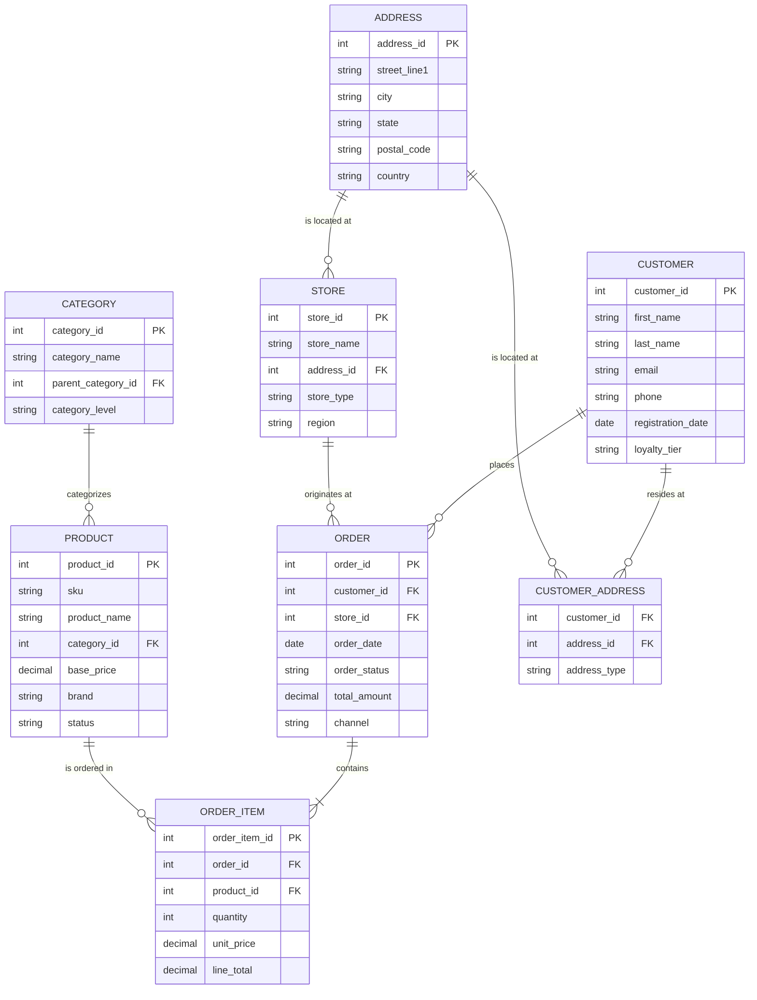
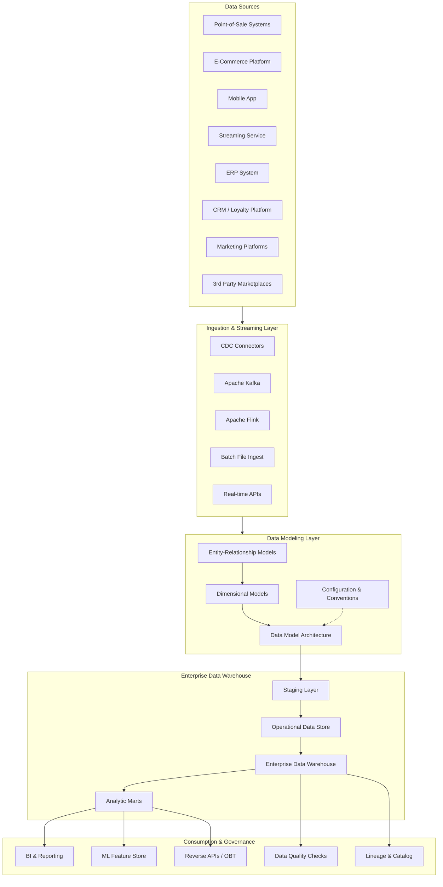

# Data Modeling Skill

## 1. Overview

Data modeling is the disciplined practice of structuring and organizing data assets to support business operations, analytics, and decision-making. It serves as the blueprint that translates real-world business concepts into logical data structures—tables, columns, relationships, and constraints—that databases and data platforms can store and retrieve efficiently. In the context of an Enterprise Retail Streaming Platform, data modeling becomes the foundational discipline that unifies everything from point-of-sale transactions and e-commerce events to inventory movements and customer 360 profiles.

The practice of data modeling emerged from the recognition that ad-hoc data structures lead to redundancy, inconsistency, and brittle systems. In the 1970s, Edgar Codd introduced relational theory, proposing that data should be organized as tables with rows and columns, connected through relationships rather than physical pointers. This theoretical foundation gave rise to Entity-Relationship (ER) modeling, pioneered by Chen in 1976, which provided a visual language for abstracting real-world entities and their associations. Over subsequent decades, the data warehousing movement—spearheaded by Bill Inmon and Ralph Kimball in the 1990s—produced specialized modeling techniques optimized for analytical workloads rather than transactional processing. These twin traditions, transactional (OLTP) and analytical (OLAP) modeling, now underpin virtually every enterprise data system.

Enterprises invest heavily in data modeling because the cost of fixing a flawed data structure after data has accumulated is extraordinarily high. A well-designed data model reduces storage costs by eliminating redundant storage, accelerates query performance through proper indexing and partitioning, enables self-service analytics by providing intuitive schemas that business users can navigate without deep technical knowledge, and ensures regulatory compliance by making data lineage and transformation logic transparent. In retail specifically, data models power price optimization engines, customer segmentation pipelines, demand forecasting workflows, and real-time inventory dashboards. Without a coherent data model, retail organizations end up with fragmented "data silos"—a customer record in the e-commerce system that bears no relation to the same customer's record in the loyalty program, which in turn contradicts the point-of-sale system. A unified data model resolves these contradictions and provides a single source of truth.

For the Enterprise Retail Streaming Platform, data modeling is not merely beneficial—it is architecturally essential. The platform ingests streaming data from multiple channels (mobile apps, web browsers, physical stores, third-party marketplaces), processes millions of events per hour, and serves analytical queries ranging from real-time inventory counts to long-term trend analysis. Without a rigorous data model, the platform would descend into chaos: duplicate customer identities, inconsistent product hierarchies, orphaned transactions, and unreliable reports that leadership cannot trust. The data model imposes order on this complexity, creating clear contracts between data producers (the streaming ingest layer) and data consumers (analytics dashboards, machine learning pipelines, partner APIs). Every feature added to the platform—new payment methods, new loyalty tiers, new product categories—must be absorbed into the existing model through a disciplined change management process. This is why data modeling competency is a non-negotiable skill for anyone building or maintaining the platform.

## 2. Core Concepts

### 2.1 Entity-Relationship Modeling

Entity-Relationship (ER) modeling is the foundational technique for describing data in terms of entities, attributes, and relationships. An **entity** is a real-world object or concept that can be distinctly identified and stored—`Customer`, `Product`, `Order`, `Store`, `Employee` are all entities in a retail context. Each entity has **attributes** that describe its properties: a `Customer` entity might have `customer_id`, `first_name`, `last_name`, `email`, `phone_number`, `registration_date`. An attribute becomes a **primary key** when it uniquely identifies each instance of the entity, such as `customer_id`. Entities relate to one another through **relationships**—a `Customer` *places* an `Order`, an `Order` *contains* `OrderItems`, a `Product` *belongs to* a `Category`.

ER diagrams use standardized notation to visualize these constructs. Rectangles represent entities, ovals represent attributes, and diamonds represent relationships. Lines connect entities to relationships, with cardinality markers (1:1, 1:N, M:N) indicating how many instances of one entity can be associated with instances of another. In practice, most data modelers use crow's foot notation (also called Information Engineering notation), which uses symbols resembling crow's feet to denote "many" ends of relationships. The Crow's Foot ER diagram below illustrates a simplified retail domain:



### 2.2 Dimensional Modeling

Dimensional modeling is the analytical counterpart to ER modeling, designed specifically to support queries and reports rather than transactional insert/update/delete operations. Pioneered by Ralph Kimball in the 1990s, dimensional modeling produces schemas that are intuitive for business users, performant for query engines, and resilient to changes in reporting requirements. The core principle is that every analytical process can be expressed as a measurement of something (a **fact**) along multiple descriptive axes ( **dimensions**).

**Facts** represent business events or transactions that can be numerically measured—sales amounts, quantities sold, processing times, error counts. Facts are typically numeric, additive, and continuous. A single business event generates one or more fact records: each line item on a retail order produces an `order_item_facts` record containing the quantity sold and the dollar amount. **Dimensions** are the contextual descriptors that give facts their meaning. A sale fact record is meaningless without dimensions telling you *which product* was sold, *which customer* bought it, *which store* it was sold from, *when* the sale occurred, and *how* the customer purchased it (online, in-store, mobile app). Dimensions are typically string-valued, discrete, and descriptive.

Dimensional models take two primary forms: **star schema** and **snowflake schema**.

### 2.3 Star Schema

The star schema is the simplest and most widely used dimensional modeling pattern. At its center lies a **fact table** directly connected to a set of **dimension tables** through foreign key relationships. No intermediate tables exist between the fact and dimensions—hence the name "star," because the diagram resembles a star with the fact table at the hub and dimension tables as radiating points.

The star schema prioritizes query performance. Because dimension tables are denormalized (all attribute data is stored directly in the dimension table, with no normalization across related tables), a typical retail sales query can retrieve all necessary context—customer demographics, product details, store location, calendar period—through a single join from the fact table to each dimension. Denormalization trades storage space for query speed, which is almost always the right trade-off in analytical environments where storage is cheap and query latency is expensive.

```sql
-- Fact table: retail point-of-sale transactions
CREATE TABLE fact_pos_transactions (
    transaction_id    BIGINT PRIMARY KEY,
    transaction_date  DATE NOT NULL,
    product_id        INT NOT NULL,
    customer_id       INT,
    store_id          INT NOT NULL,
    promotion_id      INT,
    quantity_sold     INT NOT NULL,
    unit_price        DECIMAL(10, 2) NOT NULL,
    discount_amount   DECIMAL(10, 2) DEFAULT 0.00,
    sales_amount      DECIMAL(12, 2) NOT NULL,
    cost_of_goods     DECIMAL(12, 2) NOT NULL,
    gross_profit      DECIMAL(12, 2) NOT NULL,
    payment_method    VARCHAR(20),
    FOREIGN KEY (product_id) REFERENCES dim_product(product_id),
    FOREIGN KEY (customer_id) REFERENCES dim_customer(customer_id),
    FOREIGN KEY (store_id) REFERENCES dim_store(store_id),
    FOREIGN KEY (promotion_id) REFERENCES dim_promotion(promotion_id)
);

-- Dimension table: product
CREATE TABLE dim_product (
    product_id       INT PRIMARY KEY,
    sku              VARCHAR(50) NOT NULL UNIQUE,
    product_name     VARCHAR(200) NOT NULL,
    category_id      INT,
    category_name    VARCHAR(100),
    subcategory_name VARCHAR(100),
    brand_name       VARCHAR(100),
    product_status   VARCHAR(20),
    unit_cost        DECIMAL(10, 2),
    unit_price       DECIMAL(10, 2),
    weight_kg        DECIMAL(8, 3),
    is_hazmat        BOOLEAN DEFAULT FALSE,
    created_date     DATE
);

-- Dimension table: customer
CREATE TABLE dim_customer (
    customer_id      INT PRIMARY KEY,
    customer_name    VARCHAR(100),
    email_hash       VARCHAR(64),        -- SHA-256 hash for PII protection
    phone_hash       VARCHAR(64),
    first_purchase   DATE,
    last_purchase    DATE,
    total_lifetime_value DECIMAL(12, 2),
    loyalty_tier     VARCHAR(20),
    home_store_id    INT,
    customer_segment VARCHAR(30),
    age_band         VARCHAR(20),
    gender           VARCHAR(10)
);

-- Dimension table: store
CREATE TABLE dim_store (
    store_id         INT PRIMARY KEY,
    store_name       VARCHAR(100),
    store_type       VARCHAR(30),        -- 'brick_mortar', 'pop_up', 'dark_store'
    region           VARCHAR(50),
    district         VARCHAR(50),
    city             VARCHAR(50),
    state_province   VARCHAR(50),
    country_code     CHAR(2),
    store_open_date  DATE,
    store_square_feet INT
);

-- Dimension table: date (shared calendar dimension)
CREATE TABLE dim_date (
    date_key         INT PRIMARY KEY,    -- format: 20260701
    calendar_date    DATE NOT NULL UNIQUE,
    day_of_week      INT,
    day_name         VARCHAR(10),
    day_of_month     INT,
    week_of_year     INT,
    month_key        INT,               -- format: 202607
    month_name       VARCHAR(20),
    quarter_key      INT,               -- format: 2026Q2
    quarter_name     VARCHAR(10),
    year_number      INT,
    fiscal_period    VARCHAR(10),
    is_weekend       BOOLEAN,
    is_holiday       BOOLEAN,
    holiday_name     VARCHAR(50)
);
```

### 2.4 Snowflake Schema

The snowflake schema extends the star schema by normalizing dimension tables into hierarchical subgroups. Where a star schema's `dim_product` might store `category_name` directly, a snowflake schema breaks `dim_product` into `dim_product` (the primary dimension), `dim_category` (first-level hierarchy), and `dim_subcategory` (second-level hierarchy), connected through foreign keys. The resulting diagram resembles a snowflake when drawn: the central fact table is surrounded by normalized dimension tables that branch outward.

Snowflake schemas reduce data redundancy, which can lower storage costs and simplify maintenance—when a category name changes, it needs to be updated in only one place (`dim_category`) rather than dozens. However, this normalization comes at a query cost: retrieving a product's full category context requires joining `dim_product` → `dim_category` → `dim_subcategory`, adding latency and complexity. For this reason, most analytical data warehouses in production use star schemas unless there is a specific regulatory or operational reason to normalize. Hybrid approaches are common: dimension tables are denormalized for frequently queried attributes but normalized for infrequently changed reference data like geographic hierarchies.

```sql
-- Normalized category hierarchy in snowflake schema
CREATE TABLE dim_category (
    category_id      INT PRIMARY KEY,
    category_name    VARCHAR(100) NOT NULL,
    parent_category_id INT,
    FOREIGN KEY (parent_category_id) REFERENCES dim_category(category_id)
);

CREATE TABLE dim_brand (
    brand_id         INT PRIMARY KEY,
    brand_name       VARCHAR(100) NOT NULL,
    manufacturer_name VARCHAR(200),
    brand_status     VARCHAR(20)
);

-- Denormalized product dimension (star schema approach for frequently accessed attributes)
CREATE TABLE dim_product_snowflake (
    product_id       INT PRIMARY KEY,
    sku              VARCHAR(50) NOT NULL UNIQUE,
    product_name     VARCHAR(200) NOT NULL,
    category_id      INT NOT NULL,
    brand_id         INT NOT NULL,
    unit_cost        DECIMAL(10, 2),
    unit_price       DECIMAL(10, 2),
    created_date     DATE,
    FOREIGN KEY (category_id) REFERENCES dim_category(category_id),
    FOREIGN KEY (brand_id) REFERENCES dim_brand(brand_id)
);
```

### 2.5 Slowly Changing Dimensions (SCD)

Real-world dimensions change over time, and analytical systems must decide how to handle those changes. **Slowly Changing Dimensions (SCD)** are classification schemes—Types 0 through 6—that define what happens to historical fact records when a dimension attribute changes.

**Type 1 (Overwrite):** When an attribute changes, the old value is simply replaced with the new value. Historical facts that referenced the old value now appear to reference the new value. This is simple to implement but destroys historical context. Use Type 1 for attributes where history is irrelevant or actively misleading—correcting a misspelled city name, for instance.

**Type 2 (Add New Row):** When an attribute changes, a new dimension row is created with the new attribute values, and the old row is marked as expired (with `effective_date` and `expiration_date` columns, or `is_current` flag). Each fact record joins to the dimension row that was current at the time of the transaction, preserving accurate historical context. This is the most common SCD type for analytical models. The downside is dimensional row count grows over time.

**Type 3 (Add New Attribute):** When an attribute changes, the old value is preserved in a "previous_value" column, and the attribute column is updated with the new value. This allows querying from either the historical or current perspective, but requires schema modifications for each tracked attribute and can become unwieldy.

**Type 4 (Mini-Dimension):** Frequently changing attributes (e.g., customer age band, credit score tier, loyalty status) are extracted into a separate mini-dimension table with its own surrogate key. The main dimension retains slowly changing attributes. This prevents the main dimension from growing unboundedly when certain attributes change frequently.

**Type 5 (Type 4 + Type 1):** Combines the mini-dimension approach with a Type 1 overwrite on the main dimension for the current row, ensuring the main dimension always reflects the most recent state while the mini-dimension preserves change history.

**Type 6 (Hybrid):** Combines elements of Types 1, 2, and 3—typically a Type 2 dimension with a Type 1 "current value" overlay and Type 3 "previous value" columns. Powerful but complex.

```sql
-- Type 2 Slowly Changing Dimension: Customer loyalty tier history
CREATE TABLE dim_customer_scd2 (
    customer_key     INT PRIMARY KEY,
    customer_id      INT NOT NULL,
    customer_name    VARCHAR(100),
    loyalty_tier     VARCHAR(20),       -- changes tracked historically
    customer_segment VARCHAR(30),
    email_hash       VARCHAR(64),
    effective_date   DATE NOT NULL,
    expiration_date  DATE,
    is_current       BOOLEAN DEFAULT FALSE,
    version_number   INT DEFAULT 1
);

-- When a customer's loyalty tier changes from 'silver' to 'gold':
-- 1. Expire the current row
UPDATE dim_customer_scd2
SET expiration_date = CURRENT_DATE - INTERVAL '1 day',
    is_current = FALSE
WHERE customer_id = 12345 AND is_current = TRUE;

-- 2. Insert new row with the updated loyalty_tier
INSERT INTO dim_customer_scd2
SELECT
    NEXT VALUE FOR customer_surrogate_key,
    customer_id,
    customer_name,
    'gold',                              -- new loyalty_tier value
    customer_segment,
    email_hash,
    CURRENT_DATE,
    NULL,
    TRUE,
    version_number + 1
FROM dim_customer_scd2
WHERE customer_id = 12345 AND is_current = FALSE
ORDER BY version_number DESC LIMIT 1;

-- Fact table joins use the dimension key that was current at transaction time
CREATE TABLE fact_order_lines (
    order_line_id    BIGINT PRIMARY KEY,
    order_id         BIGINT NOT NULL,
    order_date       DATE NOT NULL,
    customer_key     INT NOT NULL,       -- surrogate key from dim_customer_scd2
    product_key      INT NOT NULL,
    store_key        INT NOT NULL,
    quantity         INT NOT NULL,
    unit_price       DECIMAL(10, 2) NOT NULL,
    sales_amount     DECIMAL(12, 2) NOT NULL,
    FOREIGN KEY (customer_key) REFERENCES dim_customer_scd2(customer_key),
    FOREIGN KEY (product_key) REFERENCES dim_product(product_key),
    FOREIGN KEY (store_key) REFERENCES dim_store(store_key)
);
```

### 2.6 Degenerate Dimensions

A **degenerate dimension (DD)** is a dimension attribute that lives in the fact table rather than a separate dimension table. It typically originates from a transactional system's natural key or reference number that has business meaning but no additional descriptive attributes worth normalizing into a dimension. Order numbers, invoice numbers, waybill numbers, and transaction IDs are common degenerate dimensions.

Consider a retail POS fact table: the `transaction_id` from the point-of-sale system is stored in the fact table. It is a dimension-like attribute (categorical, used for filtering and grouping) but has no attributes of its own that would justify a separate dimension table. Storing it in the fact table allows analysts to drill through to the original transaction record if needed, without requiring an additional join.

### 2.7 Junk Dimensions

A **junk dimension** consolidates numerous small, low-cardinality flags and indicators into a single dimension table. Rather than creating separate columns in the fact table for each flag (is_holiday, is_weekend, is_promotion, payment_type, customer_type, etc.), these disparate attributes are encoded as a composite row in a junk dimension, with each unique combination of flag values assigned a surrogate key. The fact table stores only the junk dimension key.

Junk dimensions simplify fact table design, reduce the number of joins required for queries involving multiple flags, and make the schema more manageable when the set of flags changes frequently. The trade-off is that the junk dimension's meaning is opaque unless accompanied by documentation mapping each combination of values to its business interpretation.

```sql
-- Junk dimension combining POS transaction flags
CREATE TABLE dim_pos_flags (
    flag_key         INT PRIMARY KEY,
    is_holiday       BOOLEAN,
    is_weekend       BOOLEAN,
    is_promotion     BOOLEAN,
    is_employee_transaction BOOLEAN,
    is_online_order  BOOLEAN,
    payment_type     VARCHAR(20),   -- 'cash', 'credit_card', 'debit_card', 'mobile_payment', 'gift_card'
    customer_type    VARCHAR(20),   -- 'registered', 'guest', 'employee'
    receipt_printed  BOOLEAN
);

-- Fact table with degenerate dimension (transaction_id) and junk dimension key
CREATE TABLE fact_pos_transactions (
    transaction_id    BIGINT NOT NULL,       -- degenerate dimension
    transaction_date  DATE NOT NULL,
    product_key       INT NOT NULL,
    store_key         INT NOT NULL,
    customer_key      INT,
    flag_key          INT NOT NULL,          -- junk dimension foreign key
    quantity_sold     INT NOT NULL,
    sales_amount      DECIMAL(12, 2) NOT NULL,
    FOREIGN KEY (product_key) REFERENCES dim_product(product_key),
    FOREIGN KEY (store_key) REFERENCES dim_store(store_key),
    FOREIGN KEY (flag_key) REFERENCES dim_pos_flags(flag_key)
);
```

### 2.8 Bridge Tables

A **bridge table** (also called an association or linking table) resolves many-to-many relationships between entities that cannot be adequately captured in a standard dimensional model. The canonical example in retail is the relationship between a **customer** and a **household**: multiple people share a household, and a person can belong to multiple households (a college student might belong to their parents' household during summer and their own apartment during the school year).

Bridge tables introduce an intermediate table that sits between the two entities, enabling the fact table to correctly attribute metrics to the appropriate dimension instance. Bridge tables can also carry weighting factors when a transaction needs to be split across multiple associated dimension instances.

```sql
-- Bridge table: customer to household
CREATE TABLE brdg_customer_household (
    customer_key     INT NOT NULL,
    household_key    INT NOT NULL,
    relationship_type VARCHAR(20),   -- 'head_of_household', 'spouse', 'child', 'roommate'
    household_share_pct DECIMAL(5, 2), -- weighting factor (e.g., 50.00 for shared expenses)
    effective_date   DATE,
    expiration_date  DATE,
    PRIMARY KEY (customer_key, household_key)
);

-- Bridge table: product to bundle (many-to-many: a bundle contains multiple products,
-- a product can belong to multiple bundles)
CREATE TABLE brdg_product_bundle (
    product_key      INT NOT NULL,
    bundle_key       INT NOT NULL,
    quantity_in_bundle INT NOT NULL DEFAULT 1,
    PRIMARY KEY (product_key, bundle_key)
);
```

## 3. Why This Project Uses It

The Enterprise Retail Streaming Platform is not a simple e-commerce application—it is a complex, multi-channel retail analytics system that must ingest, process, and serve data from physical stores, e-commerce websites, mobile applications, call centers, and third-party marketplace integrations. Without a rigorous data model, the platform would fail in several critical ways.

**Customer 360 Consistency.** A single customer may interact with the platform through multiple channels: they browse products on the mobile app, purchase in-store using a loyalty card, initiate a return via call center, and receive targeted promotions through email. Without a unified data model, each channel maintains its own view of the customer, leading to fragmented purchase histories, contradictory loyalty status, and irreconcilable contact information. The data model's `dim_customer` and `brdg_customer_household` bridge provide a single, historically accurate view of each customer across all touchpoints. The Type 2 SCD implementation ensures that analytical reports correctly reflect what the customer's loyalty tier was *at the time of each purchase*, preventing the common error where a customer's current status retroactively modifies historical purchase tier classifications.

**Inventory Accuracy Across Channels.** Retail inventory exists in multiple states: on-hand in physical stores, in-transit between distribution centers, pre-allocated to online orders, in returns processing, and held in vendor-owned consignment stock. Each state may be managed by a different system—ERP for warehouse stock, OMS for e-commerce allocations, POS for store-level counts, TMS for in-transit tracking. The data model's `fact_inventory` table, with its dimension relationships to product, store, warehouse, and inventory state, provides the single integrated view of inventory that is essential for accurate availability checks, replenishment ordering, and loss prevention analytics.

**Order and Transaction Analytics.** Retail leadership needs to understand sales performance by product, store, region, day, promotion, payment method, and customer segment—not just total revenue. This requires a dimensional model where every sales fact is annotated with the relevant dimensional context. A star schema's `fact_pos_transactions` table, joined to `dim_product`, `dim_store`, `dim_date`, `dim_promotion`, and junk dimension `dim_pos_flags`, enables any combination of these dimensions in a query without schema changes.

**Streaming Event Processing.** The platform's streaming layer processes clickstream events, add-to-cart events, search queries, recommendation impressions, and video playback telemetry from the streaming service. These events must be modeled as fact records with appropriate dimensional context (which user, which session, which content item, which device, which timestamp granularity). The dimensional model ensures that streaming events are structured consistently, making them comparable across time periods and joinable with batch-loaded master data.

**Regulatory Compliance and Auditability.** Retail organizations are subject to PCI-DSS (payment card data), GDPR/CCPA (customer PII), SOX (financial reporting), and industry-specific regulations. A well-designed data model makes compliance tractable: PII is isolated in dedicated columns with access controls, change history is preserved through SCD Type 2, and data lineage is traceable through documented foreign key relationships. A chaotic data structure, by contrast, makes it nearly impossible to answer the question "what customer data did we process, where did it come from, and who accessed it?"

## 4. Architecture Position

Data modeling occupies the critical middle layer of the platform's architecture, serving as the conceptual contract between upstream data producers and downstream data consumers. The diagram below illustrates this position.



At the **ingestion layer**, raw data arrives in a variety of formats—CDC extracts from Oracle and PostgreSQL, Avro-encoded Kafka messages, CSV files via SFTP, JSON REST API payloads. This raw data is mapped, validated, and conformed to the structures defined in the data model before entering the warehouse. The model acts as a target schema that the ingestion layer must conform to.

The **Data Model Architecture** layer applies the conventions, naming standards, surrogate key generation policies, SCD strategies, and relationship definitions documented in the data model. This is where the conceptual and logical models become physical implementations—DDL scripts, ETL/ELT transformation logic, and data quality rules are all derived from the model.

The **Warehouse** layer implements the physical storage organized by the model: staging tables that mirror source system schemas, an Operational Data Store (ODS) that provides a cleaned, conformed layer close to the sources, the Enterprise Data Warehouse (EDW) containing integrated, historically accurate dimensional models, and finally analytic marts optimized for specific business functions (sales analytics, inventory analytics, customer analytics, financial analytics).

Downstream, the **Consumption** layer—BI tools, reverse APIs that expose data to partner systems, ML feature pipelines—build on the modeled data. Because they consume from a well-defined dimensional model rather than raw source tables, they are insulated from changes in source system schemas. When the e-commerce platform adds a new payment method, the dimensional model absorbs that change; the downstream reports continue to function, and the new payment method appears as an attribute in the existing `dim_pos_flags` junk dimension.

## 5. Folder Structure

A mature data modeling practice requires disciplined file organization. The following folder structure, used within the platform's `models/` directory, reflects industry best practices adapted for a retail streaming platform:

```
models/
├── _manifest/                    # Model registry and version tracking
│   ├── model_registry.json       # Central registry of all models
│   ├── lineage_graph.json        # Computed lineage relationships
│   └── data_dictionary.yaml      # Master data element definitions
│
├── _conventions/                 # Naming and coding standards
│   ├── naming_conventions.yaml   # Table naming, column naming rules
│   ├── scd_policies.yaml         # Which dimensions use which SCD type
│   ├── surrogate_key_policy.yaml # Key generation rules
│   └── encryption_policy.yaml    # PII column classifications
│
├── 00_staging/                   # Stage 0: Raw source mirroring
│   ├── src_pos_transactions/
│   │   ├── model.yml             # Source mapping definition
│   │   └── ddl.sql               # Raw table mirroring source schema
│   ├── src_ecommerce_orders/
│   ├── src_crm_loyalty/
│   ├── src_inventory_erp/
│   └── src_streaming_events/
│
├── 01_ods/                       # Stage 1: Operational Data Store
│   ├── ods_customers/
│   ├── ods_products/
│   ├── ods_orders/
│   ├── ods_inventory/
│   └── ods_marketing_campaigns/
│
├── 02_edw/                       # Stage 2: Enterprise Data Warehouse
│   ├── dim/
│   │   ├── dim_customer.sql
│   │   ├── dim_product.sql
│   │   ├── dim_store.sql
│   │   ├── dim_date.sql
│   │   ├── dim_promotion.sql
│   │   ├── dim_channel.sql
│   │   └── dim_scd2_snapshot/
│   ├── fact/
│   │   ├── fact_pos_transactions.sql
│   │   ├── fact_ecommerce_orders.sql
│   │   ├── fact_inventory_snapshots.sql
│   │   ├── fact_customer_orders.sql
│   │   └── fact_marketing_events.sql
│   ├── bridge/
│   │   ├── brdg_customer_household.sql
│   │   └── brdg_product_bundle.sql
│   └── junk/
│       └── dim_pos_flags.sql
│
├── 03_marts/                     # Stage 3: Analytic Data Marts
│   ├── mart_sales/
│   │   ├── marts_sales_summary.sql
│   │   └── mart_sales_by_region.sql
│   ├── mart_inventory/
│   │   ├── mart_inventory_availability.sql
│   │   └── mart_inventory_turnover.sql
│   ├── mart_customer/
│   │   ├── mart_customer_rfm.sql
│   │   └── mart_customer_lifetime_value.sql
│   └── mart_finance/
│       └── mart_revenue_reconciliation.sql
│
├── _scripts/
│   ├── generate_surrogate_keys.sql
│   ├── apply_scd_type2.sql
│   ├── hash_pii_columns.sql
│   ├── backfill_historical_dimension.sql
│   └── audit_snapshot.sql
│
├── _tests/
│   ├── constraints/
│   │   ├── test_dim_customer_not_null.sql
│   │   ├── test_fact_foreign_keys.sql
│   │   └── test_scd_expiration_logic.sql
│   ├── data_quality/
│   │   ├── test_duplicate_customers.sql
│   │   ├── test_orphaned_fact_records.sql
│   │   └── test_zero_quantity_transactions.sql
│   └── reconciliation/
│       ├── test_daily_sales_reconciliation.sql
│       └── test_inventory_balances.sql
│
└── _docs/
    ├── er_diagrams/
    │   ├── retail_conceptual.erd
    │   └── dimensional_model.png
    ├── data_dictionary/
    │   ├── dim_customer.yaml
    │   ├── dim_product.yaml
    │   └── fact_pos_transactions.yaml
    └── model_release_notes/
        ├── v1.0_release_notes.md
        └── v1.1_add_streaming_events.md
```

This structure enforces a clear separation of concerns: staging layers mirror source systems with minimal transformation, the ODS performs initial data cleansing and standardization, the EDW implements the canonical dimensional model, and mart layers build function-specific aggregates. The `_conventions` directory ensures that naming standards, SCD policies, and encryption rules are applied consistently across all models. The `_tests` directory embeds data quality and reconciliation tests directly alongside the models they validate, making the tests maintainable and versioned in lockstep with the schema changes they validate.

## 6. Implementation Walkthrough

### 6.1 Retail Domain Model Example

This section walks through the implementation of the core dimensional model for a retail analytics platform, demonstrating how business requirements translate into concrete SQL DDL and ETL logic.

**Business Requirements:**

1. Track every POS and e-commerce transaction with full product, customer, store, promotion, and temporal context.
2. Maintain historical accuracy: a product's category at the time of sale must be preserved even if the product's category is later reassigned.
3. Support customer analytics: lifetime value calculation, RFM (Recency, Frequency, Monetary) segmentation, cohort analysis.
4. Support inventory analytics: daily stock levels by store and product, in-transit inventory, sell-through rates.
5. All customer PII must be pseudonymized (hashed) in the data warehouse.

### 6.2 Configuration and Conventions

Before creating any table, the team establishes conventions that govern all models:

```yaml
# naming_conventions.yaml
table_naming:
  staging_prefix: "src_"
  ods_prefix: "ods_"
  dim_prefix: "dim_"
  fact_prefix: "fact_"
  bridge_prefix: "brdg_"
  junk_prefix: "dim_"
  mart_prefix: "mart_"

column_naming:
  surrogate_key_suffix: "_key"
  primary_key_suffix: "_id"
  foreign_key_suffix: "_id"
  date_key_format: "YYYYMMDD_int"
  hash_suffix: "_hash"
  is_current_flag: "is_current"
  effective_date_column: "effective_date"
  expiration_date_column: "expiration_date"
  version_column: "version_number"

scd_policies:
  dim_customer:
    type: 2
    tracked_attributes:
      - loyalty_tier
      - customer_segment
      - email_hash
      - home_store_id
  dim_product:
    type: 2
    tracked_attributes:
      - category_id
      - brand_id
      - product_status
      - base_price
  dim_store:
    type: 1
    tracked_attributes:
      - store_name
      - store_type
      - region
  dim_promotion:
    type: 1
    tracked_attributes:
      - promotion_name
      - discount_pct
```

### 6.3 Data Dictionary Entry

Each data element is documented in the data dictionary:

```yaml
# data_dictionary/dim_customer.yaml
table_name: dim_customer
table_type: dimension
scd_type: 2
description: |
  Core customer dimension table capturing all registered customers across
  all channels (brick-and-mortar, e-commerce, mobile app). Each row represents
  a unique customer. Historical changes to tracked attributes are preserved
  through SCD Type 2. PII fields (email, phone) are stored as SHA-256 hashes.

business_keys:
  - customer_id          # Natural key from source CRM system

surrogate_key:
  name: customer_key
  type: INT
  generation: AUTOINCREMENT

tracked_attributes:
  - column: loyalty_tier
    description: Customer loyalty program tier (bronze, silver, gold, platinum)
    source: CRM.loyalty_tier
    scd_type: 2
  - column: customer_segment
    description: Business-defined customer segment for marketing targeting
    source: CRM.segment
    scd_type: 2
  - column: email_hash
    description: SHA-256 hash of customer email address for pseudonymization
    source: CRM.email (hashed in ETL)
    scd_type: 2
  - column: home_store_id
    description: Preferred home store for loyalty benefits and targeting
    source: CRM.home_store_id
    scd_type: 2

derived_attributes:
  - column: days_since_last_purchase
    description: Computed in ELT as CURRENT_DATE - last_purchase_date
    computation: ELT
  - column: lifetime_value_tier
    description: Derived from total_lifetime_value for segmentation
    computation: CASE WHEN total_lifetime_value >= 1000 THEN 'high_value' ...

partitioning:
  strategy: RANGE
  column: effective_date
  granularity: MONTH

retention:
  full_history: TRUE   # Never delete; SCD Type 2 handles expiration
```

### 6.4 Dimension Table Implementation

```sql
-- dim_customer.sql
-- Slowly Changing Dimension Type 2: preserves historical loyalty tier, segment, contact info
CREATE TABLE dim_customer (
    customer_key           INT IDENTITY(1, 1) PRIMARY KEY,
    customer_id            INT NOT NULL,
    customer_name          VARCHAR(100),
    email_hash             VARCHAR(64),          -- SHA-256: pseudonymized
    phone_hash             VARCHAR(64),          -- SHA-256: pseudonymized
    first_purchase_date    DATE,
    last_purchase_date     DATE,
    registration_date      DATE,
    total_lifetime_value   DECIMAL(12, 2) DEFAULT 0.00,
    total_order_count      INT DEFAULT 0,
    loyalty_tier           VARCHAR(20),          -- SCD Type 2 tracked
    loyalty_join_date      DATE,
    customer_segment       VARCHAR(30),          -- SCD Type 2 tracked
    customer_status        VARCHAR(20) DEFAULT 'active',
    home_store_id          INT,                  -- SCD Type 2 tracked
    preferred_channel      VARCHAR(20),          -- 'in_store', 'online', 'mobile', 'omni'
    age_band               VARCHAR(20),
    gender                 VARCHAR(10),
    household_income_range VARCHAR(20),
    effective_date         DATE NOT NULL,
    expiration_date        DATE,
    is_current             BOOLEAN DEFAULT TRUE,
    version_number         INT DEFAULT 1
);

-- Indexes optimized for the most common access patterns
CREATE NONCLUSTERED INDEX ix_dim_customer_natural_key
    ON dim_customer(customer_id, is_current)
    INCLUDE (loyalty_tier, customer_segment, email_hash);

CREATE NONCLUSTERED INDEX ix_dim_customer_scd_lookup
    ON dim_customer(customer_id, effective_date, expiration_date);

CREATE NONCLUSTERED INDEX ix_dim_customer_analytics
    ON dim_customer(loyalty_tier, customer_segment, is_current)
    INCLUDE (total_lifetime_value, total_order_count);

-- ELT procedure to load and maintain SCD Type 2
CREATE OR REPLACE PROCEDURE sp_load_dim_customer()
AS $$
BEGIN
    -- Insert new customer rows (first seen)
    INSERT INTO dim_customer (
        customer_id, customer_name, email_hash, phone_hash,
        first_purchase_date, last_purchase_date, registration_date,
        total_lifetime_value, total_order_count, loyalty_tier,
        loyalty_join_date, customer_segment, customer_status,
        home_store_id, preferred_channel, age_band, gender,
        household_income_range, effective_date, is_current, version_number
    )
    SELECT
        c.customer_id,
        c.customer_name,
        SHA256(c.email::bytea) AS email_hash,
        SHA256(c.phone::bytea) AS phone_hash,
        c.first_purchase_date,
        c.last_purchase_date,
        c.registration_date,
        COALESCE(c.total_lifetime_value, 0),
        COALESCE(c.total_order_count, 0),
        c.loyalty_tier,
        c.loyalty_join_date,
        c.customer_segment,
        c.customer_status,
        c.home_store_id,
        c.preferred_channel,
        c.age_band,
        c.gender,
        c.household_income_range,
        CURRENT_DATE,
        TRUE,
        1
    FROM src_crm_customers c
    WHERE NOT EXISTS (
        SELECT 1 FROM dim_customer d
        WHERE d.customer_id = c.customer_id AND d.is_current = TRUE
    );

    -- Detect changes in SCD Type 2 tracked attributes
    -- and expire the old row / insert the new row
    INSERT INTO dim_customer (
        customer_id, customer_name, email_hash, phone_hash,
        first_purchase_date, last_purchase_date, registration_date,
        total_lifetime_value, total_order_count, loyalty_tier,
        loyalty_join_date, customer_segment, customer_status,
        home_store_id, preferred_channel, age_band, gender,
        household_income_range, effective_date,
        expiration_date, is_current, version_number
    )
    SELECT
        c.customer_id,
        c.customer_name,
        SHA256(c.email::bytea),
        SHA256(c.phone::bytea),
        c.first_purchase_date,
        c.last_purchase_date,
        c.registration_date,
        COALESCE(c.total_lifetime_value, 0),
        COALESCE(c.total_order_count, 0),
        c.loyalty_tier,
        c.loyalty_join_date,
        c.customer_segment,
        c.customer_status,
        c.home_store_id,
        c.preferred_channel,
        c.age_band,
        c.gender,
        c.household_income_range,
        CURRENT_DATE,
        NULL,
        TRUE,
        d.version_number + 1
    FROM src_crm_customers c
    JOIN dim_customer d ON d.customer_id = c.customer_id AND d.is_current = TRUE
    WHERE
        d.loyalty_tier != c.loyalty_tier
        OR d.customer_segment != c.customer_segment
        OR d.email_hash != SHA256(c.email::bytea)
        OR d.home_store_id != c.home_store_id;

    -- Expire the old rows that had changes
    UPDATE dim_customer
    SET expiration_date = CURRENT_DATE - INTERVAL '1 day',
        is_current = FALSE
    WHERE customer_id IN (
        SELECT customer_id FROM dim_customer WHERE is_current = TRUE
        GROUP BY customer_id HAVING COUNT(*) > 1
    )
    AND is_current = TRUE;
END;
$$ LANGUAGE plpgsql;
```

### 6.5 Fact Table Implementation

```sql
-- fact_order_lines.sql
-- Core transactional fact table: every line item from every order across all channels
CREATE TABLE fact_order_lines (
    order_line_key      BIGINT IDENTITY(1, 1) PRIMARY KEY,
    order_id            BIGINT NOT NULL,
    order_line_id       BIGINT NOT NULL,
    order_date_key      INT NOT NULL,            -- FK to dim_date (YYYYMMDD int)
    order_datetime      TIMESTAMP NOT NULL,
    customer_key        INT,                      -- FK to dim_customer (nullable for guest orders)
    product_key         INT NOT NULL,             -- FK to dim_product (SCD Type 2)
    store_key           INT NOT NULL,             -- FK to dim_store
    promotion_key       INT,                      -- FK to dim_promotion
    channel_key         INT NOT NULL,             -- FK to dim_channel
    payment_method_key  INT,                      -- FK to dim_payment_method
    flag_key            INT NOT NULL,             -- FK to dim_pos_flags (junk dimension)

    -- Transaction attributes
    quantity_ordered    INT NOT NULL,
    quantity_shipped     INT DEFAULT 0,
    quantity_returned    INT DEFAULT 0,
    unit_price          DECIMAL(10, 2) NOT NULL,
    unit_cost           DECIMAL(10, 2) NOT NULL,
    discount_amount     DECIMAL(10, 2) DEFAULT 0.00,
    promotion_discount  DECIMAL(10, 2) DEFAULT 0.00,
    sales_amount        DECIMAL(12, 2) NOT NULL,  -- quantity * unit_price - discounts
    cost_of_goods       DECIMAL(12, 2) NOT NULL,
    gross_profit        DECIMAL(12, 2) NOT NULL,  -- sales_amount - cost_of_goods

    -- Shipping and fulfillment
    fulfillment_status  VARCHAR(30),             -- 'pending', 'shipped', 'delivered', 'returned'
    ship_date           DATE,
    delivery_date       DATE,

    -- Audit columns
    batch_id            INT,
    load_datetime       TIMESTAMP DEFAULT CURRENT_TIMESTAMP,
    record_source       VARCHAR(50)              -- 'pos', 'ecommerce', 'mobile', 'marketplace'
);

-- Composite indexes for the most common query patterns
CREATE NONCLUSTERED INDEX ix_fact_order_lines_fk
    ON fact_order_lines (
        order_date_key, customer_key, product_key,
        store_key, channel_key
    )
    INCLUDE (sales_amount, quantity_ordered, gross_profit);

CREATE NONCLUSTERED INDEX ix_fact_order_lines_product_analysis
    ON fact_order_lines (product_key, order_date_key)
    INCLUDE (sales_amount, quantity_ordered, quantity_returned);

CREATE NONCLUSTERED INDEX ix_fact_order_lines_customer_revenue
    ON fact_order_lines (customer_key, order_date_key)
    INCLUDE (sales_amount, order_id);

-- Partitioning by order date for efficient range queries and historical maintenance
CREATE NONCLUSTERED INDEX ix_fact_order_lines_partition
    ON fact_order_lines (order_date_key)
    WITH (STATISTICS_NOREINDEX = OFF);

-- ELT load: incremental load from staging (only last 7 days of orders)
CREATE OR REPLACE PROCEDURE sp_load_fact_order_lines()
AS $$
BEGIN
    INSERT INTO fact_order_lines (
        order_id, order_line_id, order_date_key, order_datetime,
        customer_key, product_key, store_key, promotion_key,
        channel_key, payment_method_key, flag_key,
        quantity_ordered, quantity_shipped, quantity_returned,
        unit_price, unit_cost, discount_amount, promotion_discount,
        sales_amount, cost_of_goods, gross_profit,
        fulfillment_status, ship_date, delivery_date,
        batch_id, record_source
    )
    SELECT
        o.order_id,
        oi.order_line_id,
        d.date_key AS order_date_key,
        o.order_datetime,
        COALESCE(dc.customer_key, -1) AS customer_key,
        dp.product_key,
        ds.store_key,
        COALESCE(dprom.promotion_key, -1) AS promotion_key,
        dc_ch.channel_key,
        COALESCE(dpm.payment_method_key, -1) AS payment_method_key,
        df.flag_key,
        oi.quantity_ordered,
        oi.quantity_shipped,
        oi.quantity_returned,
        oi.unit_price,
        oi.unit_cost,
        COALESCE(oi.discount_amount, 0),
        COALESCE(oi.promotion_discount, 0),
        oi.sales_amount,
        oi.cost_of_goods,
        oi.gross_profit,
        o.fulfillment_status,
        o.ship_date,
        o.delivery_date,
        CURRENT-batch_id(),
        o.record_source
    FROM src_ecommerce_orders o
    JOIN src_ecommerce_order_items oi ON oi.order_id = o.order_id
    JOIN dim_date d ON d.calendar_date = DATE(o.order_datetime)
    JOIN dim_product_scd dp ON dp.product_id = oi.product_id
        AND dp.effective_date <= DATE(o.order_datetime)
        AND (dp.expiration_date IS NULL OR dp.expiration_date > DATE(o.order_datetime))
    JOIN dim_store ds ON ds.store_id = o.store_id
    LEFT JOIN dim_customer_scd dc ON dc.customer_id = o.customer_id
        AND dc.is_current = TRUE
    LEFT JOIN dim_promotion dprom ON dprom.promotion_id = o.promotion_id
    JOIN dim_channel dc_ch ON dc_ch.channel_name = 'ecommerce'
    LEFT JOIN dim_payment_method dpm ON dpm.payment_method_name = o.payment_method
    JOIN dim_pos_flags df ON
        df.is_holiday = FALSE          -- derived from dim_date in ELT
        AND df.is_weekend = FALSE
        AND df.is_promotion = (o.promotion_id IS NOT NULL)
        AND df.is_online_order = TRUE
        AND df.customer_type = CASE WHEN o.customer_id IS NOT NULL THEN 'registered' ELSE 'guest' END
    WHERE o.order_datetime >= CURRENT_DATE - INTERVAL '7 days'
    AND NOT EXISTS (
        SELECT 1 FROM fact_order_lines f
        WHERE f.order_line_id = oi.order_line_id
    );
END;
$$ LANGUAGE plpgsql;
```

## 7. Production Best Practices

### 7.1 Scalability Patterns

**Surrogate Key Management.** Never use natural keys (source system identifiers) as primary keys in dimensional models. Natural keys can change, may not be unique across systems, and expose internal source identifiers to downstream consumers. Instead, use monotonically increasing surrogate keys (IDENTITY/SEQUENCE/AUTOINCREMENT) assigned sequentially as dimension rows are inserted. This ensures constant-time joins, independence from source system quirks, and a stable identifier that persists even when the natural key changes (as in SCD Type 2). For distributed platforms, consider a centralized key generation service or a hash-based surrogate key strategy using a consistent hashing algorithm across all loader nodes.

**Incremental Loading.** Full table reloads are unacceptable in production environments handling millions of daily transactions. Every fact and dimension loader must implement incremental processing: identify the changed subset (using `effective_date`, `last_modified` timestamps, or CDC log sequence numbers), process only those records, and commit atomically. The fact table loader above demonstrates this pattern with the `WHERE order_datetime >= CURRENT_DATE - INTERVAL '7 days'` filter and the `NOT EXISTS` duplicate guard.

**Data Lineage Tracking.** Embed lineage metadata at every transformation step. Each fact record should carry `batch_id`, `load_datetime`, and `record_source` columns. More sophisticated implementations use a dedicated lineage graph (stored in `_manifest/lineage_graph.json`) that tracks which source columns flow into which target columns, enabling impact analysis when a source system changes. The OpenLineage standard (used by Apache Airflow, Spark, dbt) provides a vendor-neutral protocol for capturing lineage events programmatically.

### 7.2 Modeling Patterns

**Conformed Dimensions.** A dimension used by multiple fact tables must be *conformed*—the same surrogate key meaning and attribute definitions must be shared across all analytic marts. `dim_date` is the canonical example: every fact table that references a calendar date must use the same `date_key` values and attribute columns from the shared `dim_date` dimension. Conformed dimensions enable cross-mart queries (e.g., joining sales from the POS mart to inventory from the inventory mart) without dimension key mismatches. Creating `dim_date` once and referencing it everywhere prevents the common anti-pattern where each mart has its own `order_date` column with inconsistent values or formats.

**Single Source of Truth.** Each data element should live in exactly one place in the warehouse, at the appropriate level of granularity. Customer addresses should be in `dim_customer`, not duplicated across multiple fact tables. Product category hierarchies should be in `dim_product` and `dim_category`, not repeated as string columns in fact tables. This principle prevents the divergent data problem where the same customer appears with different addresses in different marts because the address was copied rather than joined.

**Golden Master Keys.** When integrating data from multiple source systems that reference the same entity (e.g., a customer exists in both the POS system and the e-commerce CRM), establish a golden master key that maps each system's natural key to a single warehouse surrogate key. This mapping table, often called a `hub_customer` or `link_customer` in a Data Vault architecture, is the foundation for cross-system customer analytics. Without it, a customer who uses the same email address in both systems appears as two separate customers in the warehouse.

### 7.3 Naming Conventions

Consistent naming conventions make schemas self-documenting and reduce the cognitive load on analysts learning the data model. The conventions below are adapted for a retail streaming platform:

| Object | Convention | Example |
|---|---|---|
| Fact tables | `fact_<business_process>` | `fact_pos_transactions`, `fact_order_lines` |
| Dimension tables | `dim_<entity>` or `dim_<entity>_scd2` | `dim_customer`, `dim_product_scd2` |
| Bridge tables | `brdg_<from>_<to>` | `brdg_customer_household` |
| Junk dimensions | `dim_<flags_group>` | `dim_pos_flags` |
| Mart tables | `mart_<domain>_<name>` | `mart_customer_rfm`, `mart_sales_daily` |
| Date keys | `YYYYMMDD` integer | `20260701` stored as INT `20260701` |
| Surrogate keys | `<entity>_key` | `customer_key`, `product_key` |
| Natural keys | `<entity>_id` | `customer_id`, `product_id` |
| Hash columns | `<field>_hash` | `email_hash`, `phone_hash` |
| SCD columns | `effective_date`, `expiration_date`, `is_current` | — |

### 7.4 Documentation and Governance

Every table and column should have an entry in the master data dictionary (stored in `_docs/data_dictionary/` as YAML files and rendered in the data catalog). The data dictionary entry for `fact_order_lines` specifies not just the column definitions, but also the business logic for derived columns like `gross_profit = sales_amount - cost_of_goods`, the ETL computation for `promotion_discount`, and the expected values for `fulfillment_status`.

Model changes follow a formal release process: proposed schema modifications are reviewed for downstream impact, tested in a development environment, validated against data quality checks, and then promoted through a deployment pipeline. Version-controlled model files (SQL DDL, YAML configs) are the source of truth; manual schema modifications are prohibited.

Data governance policies are enforced through the model itself: PII columns are tagged in the data dictionary with `pii: true`, triggering automated hashing in ETL, column-level security in the database, and inclusion in the data catalog's PII register. Access control policies reference the data dictionary's classification tags to grant or revoke access programmatically.

## 8. Common Problems

| Problem | Cause | Resolution | Best Practice |
|---|---|---|---|
| **Duplicate fact records** | Incremental loader lacks a proper duplicate guard, or the source system sends the same transaction twice (e.g., retry logic in an API) | Add a UNIQUE constraint or PRIMARY KEY on the fact table's natural key combination (e.g., `order_line_id`). Add a `NOT EXISTS` filter in the loader's incremental SELECT. Implement idempotent writes using `ON CONFLICT DO NOTHING` in PostgreSQL or `MERGE` in Snowflake/BigQuery. | Treat the fact table's natural key as a business-defined unique constraint. Document the expected cardinality of duplicates in the data dictionary. Run a daily duplicate detection query as a data quality check. |
| **Orphaned fact records** | A fact record references a dimension key that does not exist in the dimension table (dimension record was deleted, or the foreign key constraint is not enforced) | Implement NOT NULL foreign key constraints and validate them nightly. Use a "hub and spoke" loader pattern where the dimension is always loaded before the fact. For late-arriving dimensions (e.g., a new product not yet in the product dimension), use a "-1" or "UNKNOWN" placeholder dimension row with known surrogate key. | Never delete dimension rows that have active fact relationships. Use SCD Type 2 expiration rather than hard deletes. Implement a nightly reconciliation check that reports orphaned foreign keys before they cause downstream reporting errors. |
| **SCD Type 2 timeline gaps** | New dimension row's `effective_date` is set to the current date, but fact records with `order_date` in the past reference the old (expired) row, creating a gap in the historical timeline | Backfill the historical dimension rows with `effective_date` values set to the earliest fact record date that should use the new row. Set `effective_date` to the date the attribute change was actually detected (from CDC `last_modified` or `_metasource_timestamp`), not the load date. | Use CDC timestamps from the source system as the authoritative `effective_date` for SCD Type 2 rows, not the warehouse load timestamp. This preserves the actual sequence of business events. |
| **Dimension explosion (SCD Type 2 row growth)** | High-cardinality attributes that change frequently (e.g., customer `last_purchase_date`) are implemented as SCD Type 2, causing the dimension to grow unboundedly | Move frequently updated attributes to the fact table as degenerate dimensions or to a separate mini-dimension (Type 4/5). Derive `last_purchase_date` from the fact table via an aggregation view rather than storing it in the dimension. | Distinguish between attributes that are inherently stable (date of birth, registration date) versus those that update on every transaction (last purchase date). Only implement SCD Type 2 for the former. Compute the latter as aggregates at query time. |
| **Fact table too large for efficient queries** | All business events—spanning years of history, multiple business units, and different Granularities—are crammed into a single monolithic fact table | Partition the fact table by the most selective temporal column (order date, transaction date) using range partitioning. Implement a分层 storage strategy: recent partitions on fast SSD storage for interactive queries, older partitions on cheaper storage for archival. Consider separate fact tables for different granularity levels (transaction-level vs. snapshot-level). | Partition by the most selective column that aligns with query patterns. Keep recent partitions (last 12-24 months) on high-performance storage; archive older partitions. Use partition pruning as the primary query optimization strategy. |
| **Inconsistent customer identity across channels** | Each channel (POS, e-commerce, mobile) maintains its own customer identifier, and no golden key maps them together | Implement a customer golden key mapping table that links all channel-specific customer IDs to a single warehouse `customer_key`. Populate it via probabilistic matching (email hash, phone hash, name) and resolve conflicts through a business rule engine. | Capture the channel-specific customer ID as a degenerate dimension in the fact table in addition to the golden `customer_key`. This preserves the source system's identity while enabling cross-channel analytics. |
| **Schemas differ between environments** | Development, staging, and production environments evolve independently, or developers make ad-hoc schema changes that are not propagated | Store all DDL as version-controlled files (SQL scripts in the `models/` directory). Use infrastructure-as-code principles: all schema changes are applied via CI/CD pipelines that run the same DDL scripts in every environment. Implement environment parity checks in the deployment pipeline. | Never connect a BI tool or any consumer directly to the staging environment. All environments should be treated as production from a schema change perspective—changes flow through the same promotion process. |
| **Silent data quality degradation** | Data quality checks are not embedded in the ETL pipeline, so bad data accumulates silently until a business user notices a discrepancy in a report | Implement mandatory data quality tests as part of the model definition in `_tests/`. Every dimension and fact loader must pass constraint checks (NOT NULL, foreign key validity, unique key integrity) before committing. Use a data quality scoring framework that tracks pass/fail rates over time. | Use Great Expectations, dbt tests, or declarative YAML-defined constraints that run automatically in the ETL pipeline. Alert on any test failure. Publish data quality metrics to the data catalog and dashboards. |

## 9. Performance Optimization

### 9.1 Indexing Strategies

Analytical workloads are dominated by full-table scans, range filters, and aggregate computations. The optimal indexing strategy for a star schema differs fundamentally from transactional indexing:

**Clustered Index on the Fact Table Date Key.** The most common access pattern for retail analytics is "show me sales for product X between dates A and B." Placing a clustered index on `order_date_key` (or using table partitioning by date) ensures that range queries over recent data retrieve contiguous data pages. PostgreSQL's row-based storage benefits from a B-tree index on the date key; Snowflake and BigQuery use columnar storage with zone maps that make date-range pruning extremely efficient.

**Composite Non-clustered Indexes for Common Query Patterns.** For workloads that consistently filter on multiple dimensions simultaneously (e.g., "sales by product category for store in region for dates in Q2"), a composite index on `(product_key, store_key, order_date_key)` with `INCLUDE` columns for the measure columns (`sales_amount`, `quantity_ordered`) allows the query engine to satisfy the entire request from the index without touching the base table. Indexes should be designed based on actual query patterns from the BI layer's query logs, not assumed.

**Columnar Storage Compression.** Analytical databases (Snowflake, BigQuery, Redshift, Databricks) use columnar storage formats (Parquet, Delta Lake) that store each column contiguously on disk. This enables aggressive compression (dictionary encoding for low-cardinality strings, delta encoding for sorted integers) and projection pruning—reading only the columns needed for a query. For the `fact_order_lines` table, a query that selects only `order_date_key, sales_amount, quantity_ordered` reads only those three columns from disk, skipping the dozens of other columns entirely.

### 9.2 Partitioning Strategies

**Date-based Range Partitioning.** Partition `fact_order_lines` by `order_date_key` using monthly or weekly partitions. This enables partition pruning on the most common filter (a date range) and allows independent maintenance operations—archiving old partitions, rebuilding fragmented partitions—without affecting the entire table. In Snowflake, use `ALTER TABLE fact_order_lines CLUSTER BY (order_date_key)`; in BigQuery, partition on `order_datetime`; in PostgreSQL, use native range partitioning.

**Composite Partitioning.** For very large global deployments, consider composite partitioning: partition by `region_key` (to co-locate data for each region's analysts on the same compute node) and then subpartition by date within each region partition. This requires careful capacity planning and is only worthwhile when individual partitions exceed hundreds of gigabytes.

### 9.3 Materialized Views and Aggregation Tables

**Pre-computed Aggregates for Dashboard Acceleration.** Retail dashboards that show daily sales by category, by store, by week often execute identical aggregation queries dozens of times per minute. Materialized views eliminate this redundant computation by storing the pre-aggregated result and refreshing it on a schedule (or incrementally as new facts arrive).

```sql
-- Materialized view: daily sales by product category
CREATE MATERIALIZED VIEW mv_daily_sales_by_category
BUILD IMMEDIATE
REFRESH COMPLETE
AS
SELECT
    d.calendar_date,
    dp.category_id,
    dp.category_name,
    dp.subcategory_name,
    SUM(f.quantity_ordered)       AS total_quantity,
    SUM(f.sales_amount)            AS total_sales,
    SUM(f.gross_profit)            AS total_gross_profit,
    COUNT(DISTINCT f.order_id)      AS order_count,
    COUNT(DISTINCT f.customer_key)  AS unique_customers
FROM fact_order_lines f
JOIN dim_date d ON d.date_key = f.order_date_key
JOIN dim_product_scd dp ON dp.product_key = f.product_key
WHERE d.calendar_date >= CURRENT_DATE - INTERVAL '730 days'
GROUP BY d.calendar_date, dp.category_id, dp.category_name, dp.subcategory_name;

-- Index on the materialized view for fast dashboard queries
CREATE INDEX ix_mv_daily_sales_category
    ON mv_daily_sales_by_category (calendar_date, category_name);
```

**Aggregation Tables for Business-Critical Metrics.** For metrics that require complex multi-step computation (customer lifetime value, product affinity scores, inventory turnover ratios), create dedicated aggregation tables that are refreshed on a schedule. Document these aggregation tables in the data dictionary alongside the SQL logic that computes them, so that downstream consumers understand how the numbers were derived.

### 9.4 Query Optimization Patterns

**Filter Early, Join Late.** Apply WHERE clause filters before performing joins. A query that filters to a single store's sales before joining the full `dim_product` table processes far fewer rows than a query that joins everything first.

**Use Surrogate Keys for Joins, Natural Keys for Filtering.** Always join fact tables to dimension tables using the surrogate key (`customer_key`), not the natural key (`customer_id`). Surrogate keys are integers, which are more efficient to compare and join than strings, and they are stable even when the natural key changes.

**Avoid Cross-Joins.** A cartesian product between two large tables (even as an intermediate result) can crash a warehouse. When joining multiple dimensions to a fact table, always use explicit JOIN conditions with foreign key relationships. Be especially cautious with bridge tables in many-to-many joins.

## 10. Security

### 10.1 Data Masking and Pseudonymization

**PII Hashing in ETL.** The data model mandates that all PII columns (`email`, `phone`, `credit_card_number`) are transformed in the ETL layer before entering the warehouse. Email addresses and phone numbers are hashed using SHA-256 with a per-environment salt. The hash is deterministic—it produces the same output for the same input—which enables customer identity resolution across systems without exposing the raw PII to analysts. For scenarios where analysts need to see a masked but recognizable version (e.g., customer support), implement a separate "display hash" using HMAC-SHA256 with a tightly controlled key, stored in a separate access-controlled schema.

```sql
-- PII pseudonymization in the staging layer (applied before data enters ODS)
SELECT
    customer_id,
    customer_name,
    SHA256(CONCAT('env_salt_value', email))      AS email_hash,     -- for joins/analytics
    SHA256(CONCAT('display_salt_value', email))   AS email_display,  -- for customer support
    SUBSTRING(SHA256(CONCAT('cc_salt_value', credit_card)), 1, 8)  AS cc_last_four_hash,
    CASE
        WHEN date_of_birth IS NOT NULL
        THEN DATE_PART('year', CURRENT_DATE) - DATE_PART('year', date_of_birth)
        ELSE NULL
    END                                          AS age,
    SHA256(CONCAT('pii_salt', phone_number))    AS phone_hash
FROM src_crm_customers_raw;
```

**Tokenization for Payment Data.** PCI-DSS scope reduction is a primary driver for implementing tokenization. Rather than storing raw credit card numbers in any table (even temporarily), payment processors tokenize card data before it reaches the warehouse. The warehouse stores only the token—a meaningless reference that cannot be reverse-engineered to recover the card number. The tokenization service holds the mapping; the warehouse never sees raw PAN data.

### 10.2 Row-Level Security (RLS)

RLS restricts the rows a user can see based on their identity, role, or session context. In a multi-tenant retail analytics platform, RLS enforces that a regional manager sees only data for their region, a brand partner sees only data for their product lines, and an executive sees all data.

**Implementation in Snowflake:**

```sql
ALTER TABLE fact_pos_transactions
    ROW ACCESS POLICY rap_region
    ON (store_key)
    USING (
        store_key IN (
            SELECT store_key FROM user_store_assignments usa
            JOIN dim_store ds ON ds.store_id = usa.store_id
            WHERE usa.user_id = CURRENT_USER()
        )
    );
```

**Implementation in PostgreSQL:**

```sql
CREATE POLICY customer_data_isolation ON dim_customer
    FOR ALL
    USING (
        -- Regional managers see only their region's customers
        CASE WHEN CURRENT_USER() LIKE 'mgr_%'
        THEN region = (
            SELECT region FROM user_regional_assignments
            WHERE user_name = CURRENT_USER()
        )
        -- Analysts see all data (or filtered by their explicit access grant)
        ELSE TRUE
        END
    );
```

### 10.3 Column-Level Security

Certain columns should be inaccessible to most users even if they can see the row. A store manager can see the `store_id` and `sales_amount` for their store, but should not see the `cost_of_goods` column (which contains margin data reserved for finance). Column-level security hides sensitive columns from unauthorized roles.

```sql
-- Column-level security: restrict margin data to finance role
GRANT SELECT ON fact_order_lines
    (order_line_key, order_id, order_date_key, customer_key,
     product_key, store_key, quantity_ordered, sales_amount,
     unit_price, discount_amount)
    TO ROLE analyst;

GRANT SELECT ON fact_order_lines
    TO ROLE finance;  -- finance sees all columns including cost_of_goods and gross_profit

-- Revoke access to PII columns from analyst role
REVOKE SELECT (email_hash, phone_hash) ON dim_customer FROM ROLE analyst;
```

### 10.4 Access Control Governance

Role-based access control (RBAC) should be defined in the data model conventions and enforced through the database's native RBAC framework. The access control policy is not an afterthought applied after the model is built—it is specified in the `_conventions/encryption_policy.yaml` file as part of the model definition, and the CI/CD pipeline generates the appropriate `GRANT`/`REVOKE` statements from the model metadata.

Principle of least privilege: every role should be granted only the minimum columns and rows required for its function. Audit logs should capture every query that accesses PII columns or high-sensitivity financial data, enabling a data access audit trail for compliance reporting.

## 11. Monitoring

### 11.1 Data Lineage

Data lineage tracks the flow of data from source systems through each transformation layer to the final analytical outputs. It answers questions like: "Which source columns contribute to the `total_lifetime_value` metric on the customer dashboard?" and "If the e-commerce system's `order_total` calculation changes, which reports will be affected?"

**Implementation using dbt (data build tool):**

```yaml
# dbt_project/models/fact_order_lines.yml
version: 2

models:
  - name: fact_order_lines
    description: Every order line from all channels (POS, e-commerce, mobile)
    meta:
      lineage_scope: enterprise_retail
      data_steward: data-engineering@company.com
    columns:
      - name: order_line_key
        description: Surrogate key for this order line
        tests:
          - unique
          - not_null
      - name: sales_amount
        description: Net sales amount (quantity × unit_price - all discounts)
        meta:
          derivation: "fact: SUM(quantity_ordered × unit_price - discount_amount)"
          source_columns: [src_ecommerce_orders.order_total, src_pos_transactions.net_sales]
      - name: customer_key
        description: FK to dim_customer (SCD Type 2)
        tests:
          - not_null
          - relationships:
              to: ref('dim_customer')
              field: customer_key
```

The dbt manifest JSON (automatically generated and version-controlled) serves as the machine-readable lineage graph. OpenLineage-compatible tools (Airflow, Spark, dbt Core with the OpenLineage plugin) emit lineage events to a metadata catalog (DataHub, Amundsen, or Collibra) that provides a visual lineage browser for data stewards and analysts.

### 11.2 Model Versioning

Every change to a dimensional model must be versioned. The version control strategy should follow semantic versioning: major version bumps for schema changes that break downstream consumers (removing a column, changing a data type), minor version bumps for backward-compatible additions (adding a new column with a default), and patch bumps for bug fixes (correcting a calculation logic without changing the interface).

```bash
# Model versioning workflow
git checkout -b feature/add-streaming-channel-dimension
# Make schema changes in models/02_edw/dim/
# Update data dictionary _docs/data_dictionary/dim_channel.yaml
git add models/02_edw/dim/ _docs/data_dictionary/
git commit -m "feat: add dim_channel to support streaming analytics

- Adds dim_channel with channel_name, channel_type, platform attributes
- Maps existing POS and e-commerce orders to channel dimension
- Updates fact_order_lines to include channel_key FK
- Bumps model version: 1.2 -> 1.3 (minor: backward-compatible addition)

Closes: #247"
git tag -a models/v1.3 -m "Release v1.3: Streaming channel dimension"
```

### 11.3 Impact Analysis

Before a model change is deployed, run an impact analysis that identifies all downstream consumers—mart tables, dashboards, ML features, API endpoints, partner data feeds—that depend on the modified model element.

```sql
-- Impact analysis query: find all mart tables and reports that depend on a dimension
SELECT
    dependent_object_name,
    dependent_object_type,
    dependent_column,
    relationship_type
FROM data_lineage_graph
WHERE source_object_name = 'dim_customer'
    AND source_column IN ('loyalty_tier', 'customer_segment')
    AND dependency_depth <= 3
ORDER BY dependency_depth, dependent_object_name;
```

This query, powered by the lineage graph, tells the data engineering team exactly which dashboards to regression-test after a change to the customer dimension's SCD Type 2 tracking attributes.

### 11.4 Data Quality Metrics

Every model should publish data quality metrics to a monitoring system (Datadog, Prometheus/Grafana, or a homegrown data quality dashboard):

- **Completeness:** percentage of NOT NULL values for required columns
- **Uniqueness:** duplicate key ratio for primary/surrogate key columns
- **Freshness:** time since last successful load (alert if exceeds SLA threshold)
- **Volume:** row count delta vs. prior load (alert on unusual spikes or drops)
- **Validity:** percentage of values matching expected format/range (e.g., `order_date_key` must be a valid YYYYMMDD integer between 20200101 and CURRENT_DATE)
- **Reconciliation:** nightly reconciliation between source system totals and warehouse aggregates (e.g., daily POS sales total in the warehouse vs. the POS system's own daily sales report)

```sql
-- Daily data quality check: reconciling warehouse sales to source POS system
SELECT
    'Warehouse: fact_pos_transactions'    AS source,
    DATE(f.order_datetime)                 AS sale_date,
    SUM(f.sales_amount)                    AS total_sales,
    COUNT(*)                               AS transaction_count
FROM fact_pos_transactions f
WHERE f.order_datetime >= CURRENT_DATE - INTERVAL '1 day'
GROUP BY DATE(f.order_datetime)

UNION ALL

SELECT
    'Source: pos_system_daily_ledger'       AS source,
    sale_date,
    reported_total_sales,
    reported_transaction_count
FROM src_pos_system_daily_ledger
WHERE sale_date >= CURRENT_DATE - INTERVAL '1 day';
```

Discrepancies above a defined tolerance (typically 0.01% for financial data) trigger an automated alert to the data engineering on-call rotation.

## 12. Testing Strategy

### 12.1 Unit Testing

Unit tests validate individual model components in isolation. For data models, this means testing constraints, relationship integrity, and transformation logic within a single table or module.

```sql
-- _tests/constraints/test_dim_customer_not_null.sql
-- Validates that critical columns in dim_customer are never NULL
CREATE OR REPLACE FUNCTION test_dim_customer_not_null_customer_key()
RETURNS DECIMAL AS $$
    SELECT CASE
        WHEN COUNT(*) = 0 THEN 1.0
        ELSE 0.0
    END
    FROM dim_customer
    WHERE customer_key IS NULL
        OR customer_id IS NULL
        OR effective_date IS NULL;
$$ LANGUAGE sql;

CREATE OR REPLACE FUNCTION test_dim_customer_valid_scd_dates()
RETURNS DECIMAL AS $$
    -- effective_date must always be <= expiration_date (when expiration exists)
    SELECT CASE
        WHEN COUNT(*) = 0 THEN 1.0
        ELSE 0.0
    END
    FROM dim_customer
    WHERE is_current = TRUE
        AND expiration_date IS NOT NULL;
$$ LANGUAGE sql;

-- _tests/constraints/test_fact_foreign_keys.sql
-- Validates that all foreign keys in fact_order_lines reference valid dimension rows
CREATE OR REPLACE FUNCTION test_fact_order_lines_valid_product_keys()
RETURNS DECIMAL AS $$
    SELECT CASE
        WHEN COUNT(*) = 0 THEN 1.0
        ELSE COUNT(*)::DECIMAL
    END
    FROM fact_order_lines f
    WHERE NOT EXISTS (
        SELECT 1 FROM dim_product_scd d
        WHERE d.product_key = f.product_key
    );
$$ LANGUAGE sql;
```

### 12.2 Integration Testing

Integration tests validate the data flows between models—end-to-end pipelines from staging through ODS to EDW to mart.

```sql
-- _tests/data_flows/test_pos_to_sales_mart_flow.sql
-- Validates that POS transactions flow correctly through all layers
-- to the sales mart aggregation
CREATE OR REPLACE FUNCTION test_pos_to_mart_sales_reconciliation()
RETURNS BOOLEAN AS $$
DECLARE
    warehouse_total DECIMAL;
    mart_total DECIMAL;
BEGIN
    SELECT SUM(sales_amount)
    INTO warehouse_total
    FROM fact_order_lines f
    JOIN dim_date d ON d.date_key = f.order_date_key
    WHERE d.calendar_date = CURRENT_DATE - INTERVAL '1 day'
      AND f.record_source = 'pos';

    SELECT SUM(sales_amount)
    INTO mart_total
    FROM mart_sales_daily msd
    WHERE msd.sale_date = CURRENT_DATE - INTERVAL '1 day'
      AND msd.channel = 'brick_mortar';

    RETURN ABS(warehouse_total - mart_total) < 0.01;
END;
$$ LANGUAGE plpgsql;
```

### 12.3 End-to-End (E2E) Testing

E2E tests validate that the data model produces correct analytical results—matching known expected values computed independently.

```sql
-- _tests/e2e/test_revenue_reporting_accuracy.sql
-- Compare warehouse revenue against the finance team's independently
-- verified spreadsheet for the same period
CREATE OR REPLACE FUNCTION test_q2_revenue_matches_finance_report()
RETURNS BOOLEAN AS $$
DECLARE
    warehouse_revenue DECIMAL(15, 2);
    finance_revenue   DECIMAL(15, 2);
    tolerance         DECIMAL(15, 2) := 100.00;  -- $100 tolerance for rounding
BEGIN
    SELECT SUM(f.sales_amount)
    INTO warehouse_revenue
    FROM fact_order_lines f
    JOIN dim_date d ON d.date_key = f.order_date_key
    WHERE d.quarter_key = 20262  -- 2026 Q2
      AND f.fulfillment_status IN ('delivered', 'shipped');

    -- finance_revenue is loaded from the certified finance report file
    SELECT certified_revenue
    INTO finance_revenue
    FROM src_finance_certified_reports
    WHERE period = '2026_Q2'
      AND report_type = 'revenue';

    RETURN ABS(warehouse_revenue - finance_revenue) <= tolerance;
END;
$$ LANGUAGE plpgsql;
```

### 12.4 Load Testing

Load testing validates that the data model and warehouse can handle peak query and ingestion volumes without degradation.

Use Apache JMeter, Locust, or the warehouse provider's built-in stress testing tools to simulate:

- **Ingestion peak:** 10,000 orders per minute during a flash sale event, validating that the incremental fact loader completes within SLA.
- **Query concurrency:** 500 simultaneous analysts running standard dashboard queries, validating that the 95th percentile query latency stays under 5 seconds.
- **Backfill stress:** Loading 5 years of historical data while simultaneously serving interactive queries, validating that the warehouse maintains acceptable query latency during heavy backfill operations.

Profile query performance using `EXPLAIN ANALYZE` (PostgreSQL), `EXPLAIN` with `ANALYZE=TRUE` (Snowflake), or query profiling views. Identify the top slowest queries and add indexes, materialized views, or aggregation tables to address them.

## 13. Interview Preparation

### 13.1 Beginner Questions (30)

**Q1: What is a primary key and why is it important in data modeling?**
A primary key is a column or combination of columns that uniquely identifies every row in a table. It ensures data uniqueness, enables reliable joins between tables, and serves as the target for foreign key relationships. Without a primary key, duplicate or ambiguous rows could exist, breaking the integrity of the data model. In a retail `dim_customer` table, `customer_id` (assigned by the source CRM system) uniquely identifies each customer.

**Q2: What is the difference between a primary key and a foreign key?**
A primary key uniquely identifies a row within its own table. A foreign key is a column in one table that stores the primary key value of a related row in another table, establishing a referential relationship. In `fact_order_lines`, `product_key` is a foreign key referencing `dim_product.product_key`, but in `dim_product` itself, `product_key` is the primary key.

**Q3: What is a fact table?**
A fact table stores measurable, quantitative business events—transactions, measurements, and outcomes that can be aggregated. Each row in a fact table represents a specific event at a specific level of granularity. In retail, `fact_pos_transactions` stores each POS transaction line item with quantities sold and dollar amounts. Facts are typically numeric and additive.

**Q4: What is a dimension table?**
A dimension table stores the descriptive context that gives facts their meaning—answers to "who, what, where, when, why, and how" questions about each fact. Dimension tables contain text descriptions, hierarchies, categories, and attributes that analysts use to filter, group, and label report output. `dim_product`, `dim_customer`, and `dim_store` are dimension tables that provide the context for sales fact records.

**Q5: What is a star schema?**
A star schema is a dimensional modeling pattern where a central fact table is directly connected to a set of denormalized dimension tables. The diagram resembles a star because the fact table (hub) is surrounded by dimension tables (points) with no intermediate tables. Star schemas optimize query performance for analytical workloads by minimizing the number of joins required to answer business questions.

**Q6: What is a snowflake schema?**
A snowflake schema extends a star schema by normalizing one or more dimension tables into hierarchical subgroups. For example, a `dim_product` table that stores category names directly (denormalized, star) might be normalized into `dim_product`, `dim_category`, and `dim_subcategory` tables (snowflake). Snowflake schemas reduce redundancy but increase query complexity due to additional joins.

**Q7: Why is a date dimension important in data warehousing?**
A date dimension provides rich calendar context for time-based analysis that would otherwise require complex date arithmetic in every query. The `dim_date` table contains columns for day of week, week number, month name, quarter, fiscal period, holiday flags, and more. Every fact table that records events by date should use a foreign key to `dim_date` rather than raw DATE columns, enabling consistent time intelligence across all reports.

**Q8: What is a surrogate key?**
A surrogate key is a system-generated identifier (typically an integer) that uniquely identifies each row in a dimension table. Unlike a natural key (which comes from the source business system), a surrogate key has no business meaning and is never exposed to end users. Surrogate keys provide stable, constant-time joins and are essential for implementing Slowly Changing Dimensions Type 2.

**Q9: What is a natural key?**
A natural key is a business-defined identifier that exists in the real world—a customer ID assigned by the CRM system, a product SKU, a store number. Natural keys have business meaning and are used for filtering and identification by analysts. In the data warehouse, natural keys should be stored as attributes in the dimension table alongside the surrogate key, but joins between tables should use the surrogate key.

**Q10: What is data normalization?**
Normalization is the process of organizing data to reduce redundancy by dividing tables into smaller, related tables based on functional dependencies. Third Normal Form (3NF)—where every non-key column depends on the key, the whole key, and nothing but the key—is the most common normalization level in OLTP systems. Normalized schemas minimize update anomalies (the same value stored in multiple places can become inconsistent).

**Q11: What is denormalization?**
Denormalization is the intentional introduction of redundancy into a schema to improve query performance. By storing all related attributes in a single table (as in a denormalized dimension table), queries can retrieve complete context without multiple joins. Analytical data warehouses favor denormalized star schemas over fully normalized schemas because query speed outweighs storage efficiency in OLAP workloads.

**Q12: What is the difference between OLTP and OLAP?**
OLTP (Online Transaction Processing) systems handle high-volume, short-duration transactional operations—inserts, updates, and deletes of individual records. OLAP (Online Analytical Processing) systems handle complex, read-intensive queries that aggregate and analyze large volumes of historical data. OLTP schemas are normalized; OLAP schemas are dimensional. Retail POS systems are OLTP; the enterprise data warehouse is OLAP.

**Q13: What is a slowly changing dimension?**
A Slowly Changing Dimension (SCD) is a dimension that changes over time in ways the data model must track. Customer addresses change, product categories are reassigned, store regions are re-organized. SCD techniques (Types 1 through 6) define how the data model handles these changes—whether old values are overwritten (Type 1), preserved in historical rows (Type 2), or handled through other strategies.

**Q14: What is SCD Type 1?**
SCD Type 1 overwrites the old attribute value with the new value whenever a change occurs. The historical fact records that referenced the old value now appear to reference the new value. Type 1 is simple to implement and uses minimal storage, but it destroys historical context. It is appropriate for corrections where the old value was simply wrong.

**Q15: What is SCD Type 2?**
SCD Type 2 preserves complete historical accuracy by creating a new dimension row each time a tracked attribute changes. The old row is marked as expired (with `effective_date` and `expiration_date` columns, or an `is_current` flag), and the new row becomes current. Every fact record joins to the dimension row that was active at the time of the transaction, preserving what the attribute value actually was on that date.

**Q16: What is a degenerate dimension?**
A degenerate dimension is a dimension attribute stored directly in the fact table rather than in a separate dimension table. It is typically a reference number or identifier from the source system—such as an order number, invoice number, or transaction ID—that has business meaning for filtering or drill-through but lacks additional descriptive attributes that would justify a separate dimension table.

**Q17: What is a junk dimension?**
A junk dimension consolidates numerous low-cardinality flag and indicator attributes into a single dimension table, replacing multiple columns in the fact table with a single foreign key. Common examples include transaction flags (is_holiday, is_weekend, is_promotion) and categorical indicators (customer_type, payment_type). This reduces fact table width and simplifies queries that filter on multiple flags simultaneously.

**Q18: What is a bridge table?**
A bridge table resolves many-to-many relationships between entities. In retail, the canonical example is a bridge between customers and households—since one customer can belong to multiple households over time, and one household can contain multiple customers. The bridge table (with `customer_key`, `household_key`, and optional weighting factors) enables fact attribution to both individual customers and household units.

**Q19: What is a shared or conformed dimension?**
A conformed dimension is a dimension used by multiple fact tables or analytic marts, where the meaning and values of the dimension are consistent across all consumers. `dim_date` is the classic conformed dimension: every fact table that needs a date reference uses the same `date_key` values and attribute columns. Conformed dimensions enable cross-mart queries and ensure consistent definitions of measures across the enterprise.

**Q20: What is the purpose of a staging layer in a data warehouse?**
The staging layer provides a landing zone for raw data extracted from source systems, before any transformation or cleansing occurs. Staging tables mirror the source schema with minimal changes, preserving the original data for auditability and reprocessing. Staging enables the ETL/ELT process to operate in two distinct phases: extract-and-load (raw data into staging), then transform (staging to ODS to EDW).

**Q21: What is an ODS (Operational Data Store)?**
An Operational Data Store sits between the staging layer and the enterprise data warehouse. It provides a cleaned, standardized, conformed view of data from multiple source systems. While the staging layer is still source-centric, the ODS begins to apply business rules, standardize column names and data types, and resolve conflicts between source systems (e.g., different representations of customer gender across systems).

**Q22: What is data lineage?**
Data lineage tracks the origin and transformation history of each data element—from source system columns through every transformation step to the final warehouse column or report metric. Lineage enables impact analysis (what breaks if I change X?), root cause analysis (where did this bad value come from?), and regulatory audit trails. It is captured through metadata, lineage graph tools, and standards like OpenLineage.

**Q23: What is the difference between a view and a materialized view?**
A view is a saved SQL query definition—no data is stored; the query runs live each time the view is referenced. A materialized view stores the query result as physical data on disk, refreshed on a schedule or on-demand. Materialized views dramatically accelerate repeated aggregation queries at the cost of storage and refresh overhead. For retail dashboards running the same daily sales summary query hundreds of times per hour, materialized views are essential.

**Q24: What is a data dictionary?**
A data dictionary is a centralized metadata repository that documents every table and column in the data model—descriptions of what each field means, where it comes from, how it is computed, what constraints apply, who owns it, and what sensitivity classification it carries. A well-maintained data dictionary is the primary tool for self-service analytics: business users can browse it to understand available data without needing to read SQL DDL files.

**Q25: What is cardinality in data modeling?**
Cardinality describes the numerical relationship between two related entities. "One-to-one" (1:1) means each row in table A corresponds to exactly one row in table B. "One-to-many" (1:N) means each row in A corresponds to many rows in B (each customer has many orders). "Many-to-many" (M:N) means many rows in A correspond to many rows in B (each product appears in many bundles; each bundle contains many products). M:N relationships require a bridge table.

**Q26: Why should fact tables be narrow and long?**
Fact tables store atomic events at a fixed granularity, and each row should contain only the columns necessary to describe that event: foreign keys to dimensions and numeric measure columns. Keeping fact tables narrow—resisting the temptation to add every possible attribute—keeps row size small, enabling the database to read more rows per I/O operation and fit more rows in memory. Wide fact tables waste storage and slow scans.

**Q27: What is the role of a surrogate key in SCD Type 2?**
Surrogate keys enable SCD Type 2 by providing a stable, independent identifier for each historical state of a dimension entity. When a customer's loyalty tier changes, the old row (with its old `customer_key`) is expired and a new row (with a new `customer_key`) is inserted. The fact table's `customer_key` foreign key records which dimension state applied at the time of each transaction. Without surrogate keys, the same natural key would have to represent multiple historical states simultaneously, which is impossible.

**Q28: What is a mini-dimension?**
A mini-dimension is a Type 4/5 SCD technique that extracts frequently changing attributes from the main dimension into a separate, independent dimension table with its own surrogate key. Common mini-dimensions in retail include customer demographics that change frequently (age band, income range, life stage) or product attributes that change with every promotion cycle. The fact table stores two foreign keys: one for the main dimension (slowly changing attributes) and one for the mini-dimension (frequently changing attributes).

**Q29: What is a snapshot fact table?**
Unlike a transactional fact table that records individual events, a snapshot fact table records the state of something at regular intervals—typically daily or weekly. An inventory snapshot fact table has one row per product per store per day, recording the quantity on hand at the end of that day. This enables period-over-period comparisons and inventory trend analysis, but requires more storage than a transactional fact table.

**Q30: What is a factless fact table?**
A factless fact table captures events that have no numeric measures—only dimensional foreign keys. A "factless fact" table for product promotions would have one row per product per promotion per store per day, with foreign keys to the relevant dimensions but no measures like sales amount. It records the *occurrence* of a promotion event, enabling analysis of what promotions ran without confounding the analysis with actual sales that may have occurred for other reasons.

### 13.2 Intermediate Questions (30)

**Q31: How do you handle late-arriving dimensions?**
Late-arriving dimensions occur when a fact record arrives referencing a dimension member that does not yet exist in the dimension table (e.g., a new product is sold before the product master is loaded). The standard pattern is to insert a placeholder dimension row with a known surrogate key (commonly -1 or 0) labeled "UNKNOWN" or "NOT YET AVAILABLE." When the actual dimension row arrives, it receives its proper surrogate key, and the fact table is updated via a slowly changing dimension process to reference the correct key.

**Q32: What is a accumulating snapshot fact table?**
An accumulating snapshot fact table records the milestones in the lifecycle of a process and is updated as each milestone occurs. The canonical example is an order fulfillment lifecycle: order placed, order picked, order packed, order shipped, order delivered, order returned. Each milestone date is stored as a separate column in the fact table, and the row is updated in place as the order progresses. This contrasts with a transactional fact table, where each event generates a new row.

**Q33: How would you model a retail loyalty program with multiple benefit tiers?**
Model the loyalty program as part of `dim_customer` with SCD Type 2 on the loyalty-related attributes (`loyalty_tier`, `loyalty_join_date`, `points_balance`). The fact table stores the `customer_key` that was active at transaction time, enabling historically accurate tier attribution. For complex multi-benefit loyalty programs (where a customer can simultaneously earn points from one program and discounts from another), introduce a bridge table `brdg_customer_loyalty_program` linking customers to their enrolled programs with a weighting factor for attribution.

**Q34: What is the difference between a additive, semi-additive, and non-additive measure?**
Fully additive measures can be summed across any dimension—`sales_amount` and `quantity_sold` are additive. Semi-additive measures can be summed across some dimensions but not others—`account_balance` cannot be summed across time (you average it across days), but can be summed across products. Non-additive measures cannot be summed across any dimension—`margin_percentage` or `average_order_value` are typically computed as ratios after aggregation, not by summing the ratios.

**Q35: How do you design a model for multi-channel retail analytics (POS + e-commerce + mobile)?**
Design a single, integrated fact table for transactions with a `channel_key` foreign key that distinguishes the channel. A conformed `dim_channel` table provides channel attributes (`channel_name`, `channel_type`, `platform`). The `record_source` column identifies the originating system. Alternatively, use separate channel-specific fact tables that share the same dimensional structure (conformed dimensions), enabling both channel-specific analysis and cross-channel analytics via the conformed dimensions.

**Q36: What is a coverage grid in dimension modeling?**
A coverage grid documents which dimension attributes apply to which fact tables. It is a matrix showing which fact tables include foreign keys to which dimensions, revealing gaps where a fact record is missing expected dimensional context and redundancies where a dimension is joined unnecessarily. The coverage grid is a key tool for data stewards to validate the completeness of dimensional coverage across the warehouse.

**Q37: Explain the difference between Kimball and Inmon data warehousing approaches.**
Ralph Kimball advocates a dimensional, bottom-up approach: build analytic marts department by department, each mart containing star schemas centered on business processes. The mart is the fundamental unit; the enterprise data warehouse emerges organically as marts share conformed dimensions. Bill Inmon advocates a normalized, top-down approach: the enterprise data warehouse is built first as a 3NF relational database, and analytic marts are derived from it. Inmon's EDW is the single source of truth; dimensional marts are just convenient access layers. Most modern enterprises implement a hybrid approach.

**Q38: What are the advantages of a Data Vault over a star schema?**
Data Vault modeling (introduced by Dan Linstedt) structures data into Hub tables (core business entities with lists of unique business keys), Link tables (many-to-many relationships between hubs), and Satellite tables (descriptive attributes that change over time, with built-in SCD Type 2). Data Vault's advantages are scalability, auditability, and resilience to source system changes: adding a new source system requires only new Satellite tables, not restructuring existing tables. It is particularly suited to enterprise-scale data integration from many heterogeneous sources.

**Q39: What is a bridge table for ragged hierarchies?**
Standard hierarchical dimensions (category trees, organizational charts) have a fixed depth. Ragged hierarchies have variable depth—e.g., a product category tree where some branches have 3 levels and others have 5, or a geographic hierarchy that differs between countries. A bridge table with `parent_key`, `child_key`, and `depth_level` columns, populated with every ancestor-descendant path in the hierarchy, enables queries at any level of the hierarchy without recursion.

**Q40: How do you model product variants (size/color combinations) in a retail dimension?**
Model the product dimension with a single `dim_product` row for each variant (each unique combination of SKU, size, and color). A separate `dim_product_hierarchy` table stores the product hierarchy (brand, category, subcategory) at the style/parent level, shared across variants. A bridge table `brdg_product_variant` links each variant to its parent style. This enables both variant-level analytics ("which size is selling best") and style-level rollups ("which product line is most profitable").

**Q41: What is a junk dimension and when should you use it?**
A junk dimension consolidates numerous low-cardinality flags, indicators, and categorical codes into a single dimension, replacing multiple columns in the fact table. Use it when a fact table would otherwise have many small, unrelated indicator columns (10-20 flags for transaction characteristics), when the combination of flags changes frequently, or when creating separate dimension tables for each flag would produce an excessive number of tiny dimensions. The risk is that the junk dimension's meaning becomes opaque; always document the combination meanings.

**Q42: What is the role of the data model in a data lake architecture?**
In a modern data lake (or lakehouse), the data model provides logical organization for files stored in object storage (S3, GCS, ADLS). While data lakes traditionally accepted "schema on read" (applying structure only when data is queried), production lakehouses use Delta Lake or Apache Iceberg to enforce schema on write, transactional guarantees, and time travel. The dimensional model provides the logical namespace (table names, column definitions, partitioning schemes) for these managed tables.

**Q43: What is columnar storage and why is it important for analytics?**
Columnar storage (Parquet, ORC) stores each column's values contiguously on disk rather than each row's values. This enables: (1) reading only the columns needed for a query, dramatically reducing I/O; (2) aggressive compression tailored to each column's data type (dictionary encoding for strings, delta encoding for sorted integers); (3) vectorized processing where entire columns are processed in CPU cache-friendly batches. Columnar storage is the primary reason modern analytical databases (Redshift, Snowflake, BigQuery, Databricks) outperform row-store databases on analytical workloads.

**Q44: How do you handle Unicode and localization in a global retail data model?**
Store all text columns in UTF-8 (`VARCHAR` with UTF8 encoding in PostgreSQL, `STRING` in Spark). Model currency as a separate attribute in the fact table—store the numeric `sales_amount` alongside a `currency_code` column (ISO 4217: USD, EUR, GBP) and a `exchange_rate_key` FK to a `dim_exchange_rate` table that provides the daily conversion rate. For localized attribute values (product names in different languages), use a multi-lingual attribute table with `(entity_key, language_code, attribute_name, attribute_value)` rows, joined when needed.

**Q45: What is the difference between a real-time streaming fact and a batch-loaded fact table?**
A streaming fact table (built on Kafka + Flink or Kinesis) ingests individual events as they occur, writing micro-batches to the fact table within seconds or milliseconds of the event. A batch-loaded fact table processes data in scheduled batches—hourly, daily, weekly. Streaming facts require specialized handling: watermark strategies for late-arriving events, exactly-once semantics, and separate late-arrival dimension lookup. The dimensional model itself is identical for both; only the ingestion mechanism differs.

**Q46: How do you implement row-level security in a star schema?**
Row-level security (RLS) restricts which rows a user can see based on their identity or session context. In Snowflake, use CREATE ROW ACCESS POLICY with a subquery that filters the `store_key` or `region_key` based on the user's assigned stores from a user-store mapping table. In PostgreSQL, create security policies using CURRENT_USER() or session variables. The fact table's dimensional structure naturally supports RLS—the foreign keys provide the filter criteria that RLS policies apply.

**Q47: What is the difference between a measure and a metric in dimensional modeling?**
A measure is a numeric column stored directly in the fact table (`sales_amount`, `quantity_sold`, `cost_of_goods`). A metric is a computed business KPI that may be derived from one or more measures using a formula or aggregation rule. `gross_profit_margin` is a metric computed as `SUM(gross_profit) / SUM(sales_amount) * 100`. Measures are additive raw data; metrics are derived business definitions. Metrics should be documented in the data dictionary with their computation formula so that all analysts produce the same numbers.

**Q48: How do you design for slowly changing product hierarchies?**
Product hierarchies (brand → category → subcategory → style → SKU) change when categories are reorganized or products are reassigned. Model the hierarchy as a self-referential `dim_category` table with `parent_category_id`, implemented as SCD Type 2 if historical accuracy is required. For products assigned to categories, use SCD Type 2 on the product dimension's `category_key` foreign key, so that historical sales correctly attribute to the category the product belonged to at the time of sale.

**Q49: What is an outrigger dimension?**
An outrigger dimension is a normalized sub-dimension referenced by a primary dimension table rather than directly by the fact table. In a snowflake schema, `dim_category` is an outrigger of `dim_product`. Outrigger dimensions reduce storage by eliminating redundant storage of category names in every product row, but increase query join complexity. Outriggers are appropriate for infrequently accessed attributes that change rarely.

**Q50: How do you ensure data quality at the dimensional modeling layer?**
Embed data quality as a first-class concern in the model: (1) NOT NULL constraints on all primary and foreign keys; (2) CHECK constraints on dimension columns to enforce valid value ranges (e.g., `loyalty_tier IN ('bronze', 'silver', 'gold', 'platinum')`); (3) UNIQUE constraints on surrogate and natural keys; (4) referential integrity constraints between fact and dimension tables; (5) nightly reconciliation queries comparing warehouse aggregates to source system totals; (6) SCD Type 2 integrity checks (ensuring no gaps or overlaps in effective/expiration date ranges for the same natural key).

**Q51: What is the role of a hub table in Data Vault?**
A Hub table in Data Vault stores the unique list of business keys for a core entity (customer, product, order) along with metadata (load datetime, record source). It contains only the business key and surrogate key—no attributes, no relationships. The hub is the spine of the data vault, providing a guaranteed unique list of entity identifiers that is populated from all source systems that reference that entity, enabling cross-system identity resolution.

**Q52: How do you model promotional events in retail?**
Promotions are a dimension (`dim_promotion`) with attributes like promotion type, discount mechanism (% off, $ off, buy-one-get-one), eligibility criteria, and validity period. The fact table carries a `promotion_key` FK. For complex promotions where eligibility depends on multiple conditions (buy X of product A and get Y of product B), a bridge table `brdg_promotion_eligibility` links promotion to the products it applies to. For tracking what promotion was *actually applied* at the transaction level, the fact table stores the `promotion_key` that was active at the time of sale.

**Q53: What is the benefit of a calendar dimension vs. storing raw dates?**
Raw DATE columns are sufficient for simple filtering, but calendar dimensions provide rich analytical context that would require complex date arithmetic in every query: day-of-week names for retail traffic analysis, week numbers aligned to the retail fiscal calendar (which may differ from the ISO calendar), holiday flags essential for retail sales normalization, fiscal period and quarter mappings for financial reporting, and special event flags (Super Bowl, Black Friday) that are invisible in a raw date.

**Q54: What is the difference between a transactional fact and a periodic snapshot fact?**
A transactional fact records individual events as they occur—each POS transaction line item generates one row. A periodic snapshot fact records the state of the business at regular intervals—a daily inventory snapshot generates one row per product per store per day showing the quantity on hand at end of day. Transactional facts have unlimited history; snapshot facts have a row for each period for each entity. Snapshot facts are essential for inventory, financial account balances, and any metric that requires period-over-period comparison.

**Q55: When would you choose a one big table (OBT) approach over a normalized model?**
The One Big Table approach denormalizes all dimensions into a single wide table (one row per transaction with all dimensional attributes inline). It eliminates joins entirely, producing extremely fast single-table queries ideal for business intelligence tools that generate unpredictable queries. OBT works well when the number of dimension attributes is manageable (under 100 columns), the data is append-only, and schema changes are infrequent. For complex, evolving data with many dimensions, the maintenance overhead of keeping all copies in sync makes star schemas preferable.

**Q56: How do you handle multi-currency transactions in a retail data model?**
Store each transaction in its original currency alongside a `currency_code` column. Create a `dim_exchange_rate` table with daily rates for each currency pair (USD→EUR, etc.). In the fact table, store both the original currency amount and the normalized amount (converted to the enterprise reporting currency using the rate on the transaction date). This preserves the actual transaction value while enabling enterprise-wide currency-consistent reporting. The conversion formula: `normalized_sales_amount = original_sales_amount * exchange_rate`.

**Q57: What is a derived dimension?**
A derived dimension is computed at query time from other dimensional attributes rather than stored as a separate table. Examples include `customer_age` (computed from `date_of_birth` and current date), `days_since_last_purchase` (computed as current date minus `last_purchase_date`), and `fiscal_period` (computed from the date using the fiscal calendar rules). Derived dimensions reduce storage at the cost of compute at query time. They should be used for attributes that are cheap to compute and not needed as filter criteria.

**Q58: What are the trade-offs between hard and soft deletes in data warehousing?**
Hard deletes remove data from the database entirely, making recovery impossible without backups. Soft deletes mark a row as inactive (e.g., `is_deleted = TRUE` or `expiration_date = CURRENT_DATE`), preserving the data for historical analysis and audit. In a data warehouse with SCD Type 2, soft deletes are standard practice: never physically delete dimension or fact rows. The only exceptions are regulatory requirements (right to be forgotten under GDPR, which should be handled through pseudonymization rather than deletion) and staging tables that are explicitly designed for temporary storage.

**Q59: How do you model customer lifetime value in a dimensional model?**
Customer Lifetime Value (CLV) can be modeled as a derived attribute computed periodically (daily or weekly) and stored in `dim_customer` as `total_lifetime_value` and `lifetime_order_count`. This is a semi-additive measure: you sum it across customers for total enterprise CLV, but average it or take the median for per-customer analysis. For predictive CLV (modeled forward-looking value), store the model's output in a separate `fact_customer_clv_forecast` table with dimension keys for the customer and a model version identifier.

**Q60: What is the importance of a grain statement in fact table design?**
The grain statement explicitly defines what a single row in the fact table represents—the atomic level of granularity. "One row per order line per day per store" is a grain statement. Defining the grain before building the fact table is critical because it prevents double-counting (rows that represent the same event at different granularities) and guides dimension selection (which dimensions actually apply at the declared grain). A fact table without a clear grain statement is a design failure waiting to cause reporting errors.

### 13.3 Advanced Questions (30)

**Q61: How does Data Vault 2.0 differ from traditional Kimball dimensional modeling?**
Data Vault 2.0 extends the original Data Vault with three significant additions: (1) Hash keys—business keys are hashed (MD5 or SHA-256) to create deterministic surrogate keys, enabling parallel loading from multiple sources without a central key generation service; (2) link satellites—satellite tables attached to link tables (not just hubs) to track relationship attributes over time; (3) streaming data integration—support for near-real-time data ingestion via Kafka, with the same hub-link-satellite structure. Data Vault prioritizes auditability, scalability, and resilience to source system changes over query simplicity.

**Q62: How do you implement a Type 3 SCD and when is it appropriate?**
Type 3 SCD adds both the old and new values of a changed attribute as separate columns in the same row. For example, `previous_loyalty_tier` and `current_loyalty_tier` columns are updated when the tier changes. Type 3 enables querying from either the historical or current perspective, but requires one column pair per tracked attribute and cannot handle multiple historical changes. It is appropriate when business users need to see "what was the value before the change and what is it now" without requiring a full timeline of all past values. It is rarely used alone; typically combined with Type 2 as a Type 6 hybrid.

**Q63: What is the computational complexity of different join types in analytical queries?**
Hash joins have O(n+m) complexity for equi-joins but require memory proportional to the smaller table for the hash table. Merge joins require sorted inputs and have O(n+m) complexity with linear memory. Nested loop joins have O(n×m) complexity and should be avoided for large tables—though they can be efficient when one table is very small (dimension tables, which is why star schema join performance is dominated by the fact table scan). Broadcast joins (sending a small table to all nodes) are the most efficient pattern for dimension joins in distributed warehouses.

**Q64: How does partition pruning work in columnar data warehouses?**
Columnar warehouses (Snowflake, BigQuery, Redshift) maintain zone maps—metadata about the min/max values of each column within each storage block or partition. When a query includes a filter predicate (e.g., `WHERE order_date_key = 20260701`), the query planner reads the zone maps for the `order_date_key` column and skips any blocks where the requested value falls outside the block's min/max range. For date-range queries on a table partitioned by date, pruning eliminates all blocks outside the range, reading only the relevant partitions. Zone maps are automatically maintained by the warehouse; users benefit by designing partition keys that align with query filter patterns.

**Q65: What is the difference between a hash distribution and a round-robin distribution in distributed data warehouses?**
Round-robin distribution spreads rows evenly across all nodes regardless of content, ensuring load balancing but requiring a shuffle for every join. Hash distribution places rows on specific nodes based on a hash of the distribution key column—rows with the same key value land on the same node. For star schemas, distributing fact tables on the most frequently joined dimension key (e.g., `product_key`) enables co-located joins where the fact and dimension data for a given product reside on the same node, eliminating network shuffle. Distribution key selection is a critical performance decision: high-cardinality, evenly distributed keys (like surrogate keys) are ideal.

**Q66: How do you handle schema evolution in a production data warehouse?**
Schema evolution—adding columns, changing data types, renaming tables—must be handled carefully to avoid breaking downstream consumers. Best practices: (1) never remove columns; mark them deprecated and hide them from the catalog; (2) add columns with NULL defaults or as the last column to avoid table rewrites; (3) use views to present a stable interface over changing physical tables; (4) version the model and maintain backward compatibility for at least one version cycle; (5) use a schema registry (Confluent Schema Registry, AWS Glue Schema Registry) for structured data formats (Avro, Protobuf) to enforce compatibility rules (backward, forward, full).

**Q67: How do you design a model for streaming analytics with late-arriving data?**
Streaming analytics requires handling events that arrive after the watermark (the threshold for "we've seen all data up to time T"). Strategies: (1) Use event-time processing with Apache Flink, where each event carries its own event timestamp; (2) set watermarks with a tolerable late-arrival window (e.g., 5 minutes for real-time POS, longer for batch-aligned sources); (3) route late events to a separate "late arrivals" fact table or side input for downstream reconciliation; (4) use a dimension lookup with the event timestamp to retrieve the dimension state that was active at event time (not processing time), which is critical for SCD Type 2 accuracy in streaming contexts; (5) emit watermarks and late events to the lineage system for monitoring.

**Q68: What is the role of a metadata catalog in a modern data platform?**
A metadata catalog (DataHub, Amundsen, Collibra, AWS Glue Catalog) serves as the system of record for all data assets: tables, columns, schemas, lineage graphs, owners, stewards, access policies, quality scores, and business descriptions. It integrates with the ETL/ELT pipeline (dbt, Airflow, Spark) to automatically capture lineage and schema changes, with the BI layer to track which reports consume which tables, and with the security layer to enforce access policies based on classification tags. The catalog is the primary enabler of data discoverability and governance.

**Q69: How do you design for GDPR and CCPA compliance using dimensional modeling?**
Privacy regulation compliance is implemented through multiple layers of the data model: (1) PII minimization—hash all identifying attributes (email, phone, name) in the staging/ODS layer before they enter the EDW; (2) consent tracking—a `dim_customer_consent` table tracks what data processing consents each customer has granted, with SCD Type 2 to preserve consent history; (3) right to erasure—never hard delete customer data; instead, anonymize by replacing the PII hash with a new random hash (breaking the link to original identity) while preserving aggregate analytics; (4) purpose limitation—a `fact_data_access_log` records every access to PII columns, enabling audit trails for compliance reporting; (5) data minimization—do not ingest PII columns that have no analytical value.

**Q70: How do you implement and maintain a customer golden key (identity resolution)?**
Customer identity resolution merges records from multiple systems that refer to the same individual. Implementation: (1) capture all channel-specific customer IDs as degenerate dimensions in fact tables; (2) build a `hub_customer` table with the canonical `customer_key` and all known natural keys (CRM ID, POS loyalty ID, e-commerce account ID, email hash, phone hash); (3) use probabilistic matching (similarity scoring on name, email, phone, address) to identify candidate matches; (4) resolve matches through deterministic rules (exact email hash match = same customer) and probabilistic scoring (threshold-based); (5) store the resolved golden key in the hub; (6) re-run resolution periodically as new data arrives. This is a complex ETL process typically implemented with tools like Databricks' Identity Graph, Salesforce's Identity Resolution, or custom Apache Spark pipelines.

**Q71: What are the trade-offs between ELT and ETL in modern data platforms?**
ETL (Extract-Transform-Load) transforms data in the integration layer before loading into the warehouse; ELT (Extract-Load-Transform) loads raw data into the warehouse first and performs transformations using the warehouse's compute engine (SQL, dbt, PySpark). ELT is preferred in modern cloud data warehouses (Snowflake, BigQuery, Redshift) because it leverages the warehouse's scalable compute, supports schema-on-read flexibility, simplifies the integration pipeline, and enables self-service transformation by analysts who know SQL. ETL is preferred when sensitive data must be masked before entering the warehouse environment or when pre-processing reduces data volume significantly before transmission.

**Q72: How does columnar compression work and why is it effective for analytical workloads?**
Columnar storage achieves compression through multiple techniques: dictionary encoding (low-cardinality strings are stored as integer codes in a dictionary, reducing 10-byte strings to 4-byte integers), delta encoding (consecutive values that differ by small amounts are stored as deltas from the previous value), bit packing (integers that need fewer bits than the native word size are stored with minimal bits), run-length encoding (consecutive identical values are stored as a single value-count pair). Columnar compression is effective because analytical queries read entire columns—compression ratios benefit from the homogeneity of values within a single column rather than the heterogeneity within a row.

**Q73: What is the difference between micro-partitioning and static partitioning?**
Static partitioning requires the user to define partition boundaries (e.g., `PARTITION BY RANGE (order_date)` with explicit bounds). Micro-partitioning (Snowflake) automatically divides table data into small (approximately 50MB to 500MB) partitions called micro-partitions, using storage services that support efficient list operations. The warehouse automatically determines partition boundaries based on data characteristics and access patterns. Micro-partitioning provides automatic tuning—the database manages partition granularity for optimal performance without user intervention—while static partitioning gives users explicit control at the cost of requiring ongoing maintenance.

**Q74: How do you design a fact table for reconciling financial data across systems?**
Financial reconciliation fact tables are designed as a "journal" of accounting entries from multiple source systems (POS, e-commerce, ERP, payment processor), each tagged with its source system and a financial transaction ID. Each entry is classified by account type (revenue, cost, tax, discount) and mapped to a conformed chart of accounts dimension. A reconciliation query aggregates by account and period, comparing totals across source systems. The reconciliation fact table includes a `reconciliation_status` column (reconciled, in-progress, exception) and a `variance_amount` column computed as the difference between source totals.

**Q75: How does Change Data Capture (CDC) integrate with dimensional modeling?**
CDC tools (Debezium, AWS DMS, Fivetran) capture row-level changes from source databases (INSERT, UPDATE, DELETE, TRUNCATE) by reading the transaction log. CDC events are typically encoded as Avro or JSON with before/after images. In the dimensional model's ETL layer, CDC feeds the SCD Type 2 dimension loader: the "before" image is used to expire the old row, the "after" image is used to insert the new row. For fact tables, CDC events are applied as inserts (append-only facts) or upserts (for accumulating snapshot facts that update as events progress). CDC enables near-real-time dimensional updates without full table reloads.

**Q76: What is the role of a semantic layer in BI reporting on top of a dimensional model?**
A semantic layer (Looker LookML, dbt Semantic Layer, AtScale, BusinessObjects Universe) sits between BI tools and the physical dimensional model, providing a business-friendly interface for analysts. It defines metrics (named, versioned, computed business KPIs) and dimensions (business-friendly names and groupings) that map to physical schema elements. This decouples BI reports from schema changes—when a physical column is renamed or a table is restructured, the semantic layer definition is updated rather than all BI reports. Metrics defined in the semantic layer are centrally governed, ensuring that "Revenue" means the same thing across all reports.

**Q77: How do you design a model for inventory optimization and demand forecasting?**
Inventory analytics requires multiple fact tables at different granularities: `fact_inventory_snapshots` (daily end-of-day stock levels by SKU by store), `fact_inventory_transactions` (every inventory movement: receipts, adjustments, transfers, fulfillment, returns), and `fact_demand_signals` (external demand indicators: search trends, promotion calendar, weather forecasts). The inventory snapshot fact uses SCD Type 2 on `quantity_on_hand` with effective dates capturing the snapshot period. Demand forecasting models consume from these facts via ML pipelines, and the model's output (forecasted demand) is stored back in a `fact_demand_forecast` table with model versioning for reproducibility.

**Q78: What is the difference between 3NF and denormalized models in the context of modern lakehouse architectures?**
Modern lakehouse architectures (Delta Lake, Apache Iceberg) support both 3NF tables (for operational data stores that require update/delete transactions) and denormalized analytical tables (for star/snowflake schemas) within the same platform. The key evolution is that ACID transactions, time travel, and schema enforcement—previously only available in data warehouses—are now available on top of object storage. This enables a "medallion architecture": bronze layer (raw, source-mirrored, often 3NF or unnormalized), silver layer (cleansed, conformed, lightly normalized), gold layer (business-ready star schemas, denormalized for query performance). Each layer serves different consumers with different freshness and quality requirements.

**Q79: How do you handle many-to-many relationships between two fact tables in a bus matrix?**
Fact tables should not directly reference other fact tables—only dimension tables serve as join intermediaries. When two business processes share many-to-many semantics (e.g., a customer can have multiple accounts, and an account can have multiple customers), the bridge table pattern resolves it: create a `brdg_customer_account` bridge with weighting factors. Each fact table joins to the bridge via its customer or account dimension foreign key, enabling cross-process queries through the shared bridge. The bus matrix documents which processes share which bridges and conformed dimensions.

**Q80: What is a metrics layer and why is it important in enterprise data platforms?**
A metrics layer (dbt Semantic Layer, Cube.dev, MetricFlow) provides a single, governed definition of every business metric in the enterprise. Each metric is defined once with its formula, dimensionality, and measurement units, stored in a central registry. BI tools, reverse APIs, and data products consume metrics from this registry rather than embedding calculation logic in each consumer. This eliminates the "one metric, multiple definitions" problem where different teams compute "Revenue" differently and produce conflicting numbers. When a metric definition changes, all consumers automatically receive the updated calculation on the next query.

**Q81: How do you design a model for real-time inventory availability queries?**
Real-time inventory requires a streaming fact table fed by POS transaction events and e-commerce order events via Kafka. Each event (sale, receipt, transfer) is modeled as a fact record with an `inventory_transaction_type` dimension (sale, receipt, adjustment, transfer-in, transfer-out) and the current stock level as a measure. The streaming processor (Flink) maintains a running inventory balance per SKU per store. For query serving, a materialized view or in-memory cache (Redis) serves the current availability state, updated within seconds of each transaction. The historical stream is persisted to the `fact_inventory_transactions` table for trend analysis.

**Q82: What are the performance implications of different join orderings in multi-fact queries?**
In a star schema query joining a fact table to multiple dimensions, the query optimizer should filter each dimension table first (applying WHERE predicates), then join the filtered dimensions to the fact table. This sequence minimizes the rows that participate in each join. Poor join ordering—joining a large unfiltered dimension to the fact table before applying row filters—can produce massive intermediate result sets that overwhelm memory and network. Modern query optimizers (Snowflake's cost-based optimizer, BigQuery's heuristics) generally handle star schema joins well, but understanding join ordering helps in writing SQL that expresses filter conditions early.

**Q83: How do you implement and test SCD Type 6?**
Type 6 combines Types 1, 2, and 3. The dimension table has: (1) the current value of each tracked attribute (Type 1 overwrite), (2) historical rows for each attribute change (Type 2), and (3) previous-value columns for each tracked attribute (Type 3). Fact table queries can use the current value column for "latest state" reports, the SCD Type 2 rows for historical accuracy, or the previous-value column for period-over-period comparison of the same attribute. Testing requires: (a) verifying that the current value matches the most recent historical row; (b) verifying that historical queries produce correct results; (c) verifying that the previous value column is updated on every change but the old previous value is not lost.

**Q84: How does data skew affect distributed query performance in star schemas?**
Data skew occurs when the distribution of values in the distribution key is uneven—some nodes hold millions of rows while others hold thousands. In a star schema fact table distributed by `product_key`, a popular product (top-selling SKU) may generate millions of fact rows on a single node, creating a hotspot. Mitigation strategies: choose high-cardinality distribution keys that are evenly distributed (surrogate keys rather than natural keys with known skew patterns), use auto-clustering/reclustering features to redistribute data, consider a hybrid distribution strategy (replicate small dimension tables, distribute the fact table on a different key), and monitor for skew using the warehouse's distribution histogram utilities.

**Q85: What is the difference between a derived metric and a calculated metric in dimensional modeling?**
A derived metric is computed from other metrics at query time using a formula: `gross_margin = (sales_amount - cost_of_goods) / sales_amount`. A calculated metric has its formula embedded in the physical table column definition or ETL process. Both approaches have trade-offs: derived metrics are flexible (the formula can be changed without rebuilding data), but computed at query time on every access. Calculated metrics are pre-computed (fast to query), but require ETL recomputation when the formula changes and may not be available for ad-hoc drill-down that changes the aggregation level.

**Q86: How do you design for cross-border retail with different fiscal calendars?**
Multi-national retail requires a conformed `dim_date` that maps every calendar date to both the ISO fiscal period and each country's retail fiscal calendar (which may start on a different Saturday, have 4-4-5 or 4-5-4 week structures, or different holiday calendars). The `dim_date` row for each calendar date contains multiple fiscal period columns: `iso_fiscal_year`, `us_fiscal_year`, `eu_fiscal_year`, `uk_fiscal_year`, and corresponding quarter and period columns. Fact tables use the ISO fiscal period for global reporting and retain country-specific fiscal columns in `dim_date` for local reporting.

**Q87: What is the role of a staging area in a Data Vault implementation and how does it differ from a traditional EDW staging?**
In Data Vault, the staging area generates hash keys for all business keys from all source systems. Unlike traditional EDW staging (which mirrors source schemas), Data Vault staging transforms the raw extract into the three core Data Vault structures (Hubs, Links, Satellites) before loading. The staging area is typically transient—it loads data into the raw vault tables and then discards the staging data. This contrasts with traditional staging, which may retain data for days or weeks for reprocessing.

**Q88: How do you handle hierarchical rollups efficiently in a dimensional model without recursive CTEs?**
Hierarchical rollups (product category trees, organizational charts, geographic hierarchies) can be pre-computed using a bridge table that contains every ancestor-descendant relationship at every depth level. For a category hierarchy with maximum depth N, the bridge table `brdg_category_hierarchy` contains N rows per category—one for each ancestor at each level. A query that needs to roll up sales from SKU to category uses the bridge: joining `fact_order_lines → dim_product → brdg_category_hierarchy → dim_category`, which produces the correct rollup at any depth with a single non-recursive join.

**Q89: What is the impact of micro-partition size on query performance and how do you optimize it?**
Micro-partitions (Snowflake) or shards (BigQuery) should ideally be 50MB to 500MB of raw data each. Partitions that are too small generate excessive metadata overhead; partitions that are too large provide insufficient pruning granularity. When loading data, size your batches to produce partitions in the target range. Use COPY or bulk load commands that produce optimally sized partitions rather than row-by-row inserts (which create tiny partitions). Monitor partition statistics using `TABLE_METADATA` or `INFORMATION_SCHEMA` and recluster periodically to optimize heavily queried tables.

**Q90: How do you design a data model to support both detailed transactional queries and aggregated analytical queries simultaneously?**
Use a hybrid approach: (1) the `fact_order_lines` transactional fact table stores every line item at the most granular level, serving detailed drill-down queries; (2) a suite of aggregation tables (`mart_order_lines_daily`, `mart_order_lines_weekly`, `mart_order_lines_monthly`) pre-compute common aggregation patterns (sales by day/product/store, by week/channel/region, by month/category/segment)); (3) a query router or BI semantic layer automatically routes queries to the most efficient table—detailed queries to the base fact, aggregated queries to the pre-computed mart. This "aggregation strategy" is the foundation of modern OLAP performance.

### 13.4 Scenario-Based Questions (20)

**Q91: Your retail chain's biggest product category is perishable goods. How would you model inventory and waste tracking?**
Model perishable inventory with a `fact_inventory_snapshots` table capturing daily stock levels by SKU by store, with a `dim_product` that includes `shelf_life_days` and `expiry_date` attributes. Add a `fact_inventory_transactions` table for every inventory movement including waste (shrinkage) with a `transaction_type` dimension key for 'sale', 'receipt', 'waste', 'spoilage', 'transfer'. A waste fact table at the daily level tracks `quantity_wasted` and `waste_cost` (unit_cost × quantity_wasted) by category and store, enabling waste-as-a-percentage-of-sales KPI. The inventory snapshot fact with daily granularity enables sell-through rate computation and expiry-based stock alerts.

**Q92: How would you design a model to measure the effectiveness of a "buy one get one free" promotion across channels?**
Create `dim_promotion` with promotion type attributes distinguishing BOGO from other types. The fact table's `promotion_key` captures the applied promotion. A dedicated `fact_promotion_baseline` table stores daily forecasted sales (from the pre-promotion historical average) alongside actual sales during the promotion period, enabling lift calculation: `(actual_sales - baseline_sales) / baseline_sales`. Cross-channel analytics join on the conformed `dim_promotion`, `dim_date`, `dim_channel`, and `dim_product` to compare BOGO effectiveness across channels (in-store POS vs. e-commerce) and product categories.

**Q93: Your company is merging with another retailer. How do you integrate their data into the existing model?**
The integration follows a phased approach: (1) create a unified `dim_channel` with channel values from both legacy and acquired retailer; (2) map the acquired retailer's store IDs to new `store_key` values via a mapping table, preserving the original store IDs as degenerate dimensions; (3) similarly map customer IDs and product IDs to new golden keys, enabling cross-retailer customer analytics; (4) use a `record_source` column in all fact tables to filter by retailer in the short term while the mapping stabilizes; (5) build a consolidated `mart_revenue` that combines both retailers' fact_order_lines, with a `retailer_key` FK to `dim_retailer` for segmentation. The merged model maintains data from both legacy systems in the same schema while preserving the ability to report on each retailer separately.

**Q94: A business user reports that the total sales in the Q2 report doesn't match what the CFO expects. How do you investigate?**
Step 1: Re-run the report query and capture the exact SQL and parameters. Step 2: Identify the fact table(s) the report queries and run a direct `SELECT SUM(sales_amount) FROM fact_order_lines WHERE order_date_key BETWEEN 20260401 AND 20260630` query as a baseline. Step 3: Compare against the source system totals (POS daily ledger, e-commerce order export) using the reconciliation queries in `_tests/reconciliation/`. Step 4: Check for data freshness—has the daily ETL job for the most recent days completed? Step 5: Check for filter discrepancies—does the report inadvertently exclude returns or exchanges? Step 6: Check for SCD Type 2 timing issues—historical orders may have had their `customer_key` updated by a late-arriving dimension change. Step 7: Document the root cause and either correct the data or clarify the business definition.

**Q95: How would you model a loyalty program where customers earn points per dollar spent and redeem points for discounts?**
Model loyalty points as a periodic snapshot fact `fact_customer_points` with monthly granularity: `customer_key`, `snapshot_month_key`, `points_earned`, `points_redeemed`, `points_expired`, `points_balance`. This captures the accumulation and redemption of points over time. The redemption event is also a fact in `fact_order_lines` with a `loyalty_redemption_amount` column and a `redemption_flag = TRUE`. The `dim_loyalty_program` table provides program rules (points per dollar, expiration policy, redemption rates). Customer lifetime value calculations use the points balance as an input, weighted by the monetary value of redemption options.

**Q96: Your e-commerce platform tracks user sessions with clickstream events. How do you model this for analytics?**
Model clickstream as a factless fact table `fact_clickstream_events`: `session_id`, `event_timestamp`, `event_type` (page_view, add_to_cart, checkout_start, search_query, recommendation_click), `product_key`, `content_key`, `channel_key`, `device_key`, `customer_key` (if logged in). A conformed `dim_session` provides session-level attributes (session start time, referring URL, device type, geographic context). This enables funnel analysis (what fraction of sessions that added to cart completed checkout?), attribution analysis (which content drove the highest conversion?), and content performance reporting (which videos or products have the highest engagement?).

**Q97: How do you design a model to support both gross and net revenue reporting (before and after returns)?**
Model gross revenue as `SUM(sales_amount)` from `fact_order_lines` where `fulfillment_status = 'delivered'`. Model returns as a separate aggregation from `fact_order_lines` where `quantity_returned > 0`. Net revenue = gross revenue - returns. Alternatively, model a `fact_returns` table with returns at the line-item level, joined to `dim_return_reason` for root cause analysis. The `fact_order_lines` record itself updates `quantity_returned` as a separate column, allowing simultaneous gross and net reporting from the same table without requiring separate fact tables.

**Q98: A store manager wants to see a dashboard of "sell-through rate by category by week." How does the dimensional model support this?**
Sell-through rate = units sold / (units sold + units on-hand). The dimensional model provides: `fact_order_lines` (units sold by product_key by week), `fact_inventory_snapshots` (units on-hand by product_key by store_key weekly), `dim_product` (maps product_key to category_key), `dim_date` (maps calendar dates to week number), `dim_store` (maps store_key to region). A mart query joins these to compute sell-through rate by category by week by store. Pre-computed `mart_sellthrough_weekly` materialized view serves the dashboard directly.

**Q99: How would you model a franchise retail operation where each franchisee is a separate legal entity but operations are centrally managed?**
Model franchisee as a dimension `dim_franchisee` with attributes: `franchisee_id`, `franchisee_name`, `franchise_agreement_type`, `royalty_rate_pct`, `marketing_fee_rate_pct`. The `dim_store` table has a `franchisee_key` FK linking stores to their owning franchisee. For financial reporting, `fact_order_lines` includes the `franchisee_key` as a conformed dimension, enabling revenue attribution to the correct legal entity. For centrally managed operations, reports filter by `parent_company_store_key` (stores owned directly by the retailer) vs. `franchisee_key`. Royalty calculations (revenue × royalty_rate_pct) are computed in a `mart_franchise_revenue` mart.

**Q100: How do you model gift card liabilities?**
Gift cards are a financial liability until redeemed. Model gift card issuance as a fact record in `fact_gift_card_transactions` with `transaction_type` dimension ('issue', 'redeem', 'expire', 'reload'), `gift_card_id` (degenerate dimension), `customer_key` (if registered), `store_key`, `transaction_amount` (positive for issue/reload, negative for redemption/expiry). A `dim_gift_card` provides card attributes (issue_date, expiry_date, original_amount, current_balance). A `mart_gift_card_liability` mart aggregates outstanding balances by store by month, supporting the balance sheet liability reporting required by accounting standards.

**Q101: Your company is launching a marketplace where third-party sellers list products. How does the data model evolve?**
Introduce a `dim_seller` dimension for third-party sellers with attributes (seller_id, seller_name, seller_type, rating, onboarding_date). The `fact_order_lines` table gains a `seller_key` FK: first-party products have `seller_key = -1 (owned)`, marketplace orders have the actual seller key. A `dim_product` with a `seller_key` FK identifies marketplace-listed products. `fact_marketplace_settlement` captures seller payouts, fees, and chargebacks—financial events distinct from customer-facing sales. A separate mart `mart_marketplace_seller_performance` joins these to compute seller-level metrics (gross merchandise value, net revenue, fee revenue, dispute rate).

**Q102: How would you model customer returns behavior for fraud detection?**
Model returns as a specialized fact table `fact_customer_returns` or use `fact_order_lines` with `quantity_returned > 0`. Key dimensions for fraud analysis: `dim_return_reason`, `dim_return_resolution` (refund, store credit, replacement), `dim_customer` (joined for the return's customer_key), and `dim_product`. Compute behavioral features per customer: return rate (returns / orders), return rate by category, time-between-order-and-return, and ratio of returns to total spend. These features are pre-computed in a `mart_customer_return_behavior` mart and consumed by the fraud detection ML model. A flag dimension `dim_fraud_indicator` captures model fraud scores at the return level.

**Q103: How do you model supplier performance and lead times for inventory replenishment?**
Create `dim_supplier` with supplier attributes (supplier_id, name, lead_time_days, on_time_delivery_rate, quality_score). Model purchase orders as `fact_purchase_orders` with `supplier_key`, `product_key`, `warehouse_key`, `order_date_key`, `expected_delivery_date_key`, `actual_delivery_date_key`, `ordered_quantity`, `received_quantity`, `unit_cost`. A `mart_supplier_performance` mart computes average lead time by supplier by product category, on-time delivery rate, and fill rate. The inventory replenishment system consumes these metrics to dynamically adjust reorder points per supplier per product.

**Q104: How would you design a model to measure customer experience (CX) scores from post-purchase surveys?**
Model survey responses as a factless fact table `fact_survey_responses`: `response_id`, `survey_date_key`, `customer_key`, `order_id` (linking to the order that triggered the survey), `nps_score`, `csat_score`, `ces_score`, `product_key`, `store_key`, `channel_key`, `agent_key` (for call center surveys). Dimensions provide context: `dim_question`, `dim_survey_type`. Aggregates compute NPS by store, by product, by channel, by agent. The factless fact approach enables slicing NPS by any dimensional combination—a powerful capability for root cause analysis of satisfaction drops.

**Q105: Your streaming platform (video-on-demand) needs to model content performance. How does the retail data model adapt?**
Retail sales facts adapt to streaming: `fact_content_events` replaces `fact_pos_transactions`, with `content_key` replacing `product_key`, `customer_key` (viewer), `session_key`, `device_key`, `content_category_key`, `region_key`, and measures including `seconds_watched`, `completion_rate` (seconds_watched / content_duration), `replay_count`. A `dim_content` dimension provides title, genre, release date, studio, content rating. A `dim_viewing_session` provides session context (start time, end time, viewing device). `mart_content_performance` aggregates by content, by genre, by region to power content investment decisions.

### 13.5 Architecture Questions (20)

**Q106: Describe the medallion architecture and how dimensional modeling fits within it.**
The medallion architecture organizes data into three layers: Bronze (raw, source-mirrored, untransformed data from operational systems, CRM, ERP, clickstream), Silver (cleaned, deduplicated, conformed data with basic business rules applied—typically 3NF or lightly denormalized), and Gold (business-ready analytical models, typically star/snowflake schemas optimized for BI and ML consumption). The dimensional model lives in the Gold layer. The Bronze and Silver layers serve as the integration foundation that ensures all source data is conformed before reaching the dimensional model. This architecture provides clear data quality gates: problems are caught and corrected at the Silver layer before propagating to Gold.

**Q107: How does the dimensional model enable self-service analytics?**
A well-designed dimensional model with a comprehensive data dictionary enables business analysts to discover, understand, and query data without depending on data engineering. The star schema's intuitive structure (facts in the center, dimensions radiating outward, with human-readable names) mirrors how business users think about their metrics—"show sales by product category by store by month" maps directly to `fact_order_lines JOIN dim_product JOIN dim_store JOIN dim_date`. A BI semantic layer on top of the dimensional model further abstracts SQL complexity, allowing analysts to drag-and-drop dimensions and measures to build reports.

**Q108: What is a data mart and how does it differ from an enterprise data warehouse?**
A data mart is a subset of the enterprise data warehouse, focused on a specific business function or department (sales, finance, marketing, inventory). The EDW provides a comprehensive, integrated, enterprise-wide data model; each mart extracts and aggregates the data relevant to its function, often with additional mart-specific dimensional enrichment. Kimball's bus architecture defines how marts share conformed dimensions: each mart's star schema shares the same `dim_date`, `dim_product`, `dim_customer`—the enterprise bus. This shared dimensionality is what makes cross-mart analytics possible.

**Q109: How does a dimensional model support different types of analytics workloads?**
The same dimensional model serves multiple consumption patterns: ad-hoc exploration (analysts write SQL against the star schema using their preferred BI tool), pre-defined dashboards (consuming pre-computed aggregation tables or materialized views), ML feature engineering (data scientists query the fact and dimension tables directly to construct training datasets), and reverse APIs (JSON/REST APIs that translate dimensional queries into JSON responses for partner systems). The model's consistency ensures that all these consumers see the same numbers.

**Q110: What are the trade-offs between a shared Data Vault and a bus matrix for enterprise integration?**
The Data Vault provides a more scalable and audit-friendly integration layer for heterogeneous source systems, but its hub-link-satellite structure is more complex to query than a star schema. The bus matrix is the logical design artifact that defines which conformed dimensions and facts are shared across the enterprise—it documents the integration contract. In practice, enterprises implement the Data Vault as the physical integration layer (ingesting all sources), derive a bus-aligned star schema (the dimensional model) for the analytical layer, and use the bus matrix as the documentation of the shared dimensional definitions.

**Q111: How does a dimensional model interact with an ML feature store?**
An ML feature store consumes from the dimensional model to compute and store model features. Customer features (CLV, recency, frequency, tenure) are computed from `fact_order_lines` and stored in the feature store. Product features (category, brand, price tier, sales velocity) are computed from `fact_order_lines` and stored in the feature store. The dimensional model serves as the authoritative source of historical data for feature computation; the feature store provides low-latency serving of pre-computed features at inference time. This separation allows the data science team to iterate on feature engineering using the rich historical data in the warehouse while serving features at millisecond latency from the feature store.

**Q112: Describe how dimensional modeling supports regulatory reporting (SOX, PCI-DSS, GDPR).**
Regulatory reporting requires traceability: prove that every reported number is derived from documented source data, through defined transformation rules, by authorized processes, with no unauthorized modifications. The dimensional model provides this through: (1) documented lineage from every report metric back to the source system columns; (2) transformation logic captured in version-controlled SQL; (3) change data capture timestamps on all records enabling audit of what data existed at any point in time; (4) data classification tags (PII, financial, sensitive) in the data dictionary that drive automated access controls and masking; (5) SCD Type 2 history enabling "what was the customer record on date X" queries required for GDPR data subject access requests.

**Q113: How does the dimensional model scale with data volume growth?**
Modern cloud data warehouses scale compute and storage independently, allowing the dimensional model to grow without performance degradation. The fact table is partitioned by date and distributed across many nodes; as data volume grows, additional compute nodes are added. Aggregation tables and materialized views pre-compute expensive joins and aggregations, keeping dashboard queries fast. Conformed dimensions are relatively small (a `dim_product` table with a few hundred thousand products is trivial compared to a fact table with billions of rows) and are replicated to every compute node, making dimension joins extremely fast. The dimensional model's simplicity—star schemas with few tables per mart—is a deliberate architectural choice that enables the query optimizer to generate efficient plans even at massive scale.

**Q114: What is the role of the dimensional model in a streaming data architecture?**
In a lambda or kappa architecture, the dimensional model serves the analytical layer while a separate streaming layer handles real-time processing. Kafka or Kinesis Ingests raw events; a streaming processor (Flink) performs windowed aggregations and writes micro-batches to streaming-optimized tables (Flink's state store or a streaming database like Apache Druid or RisingWave). The dimensional model in the warehouse (Snowflake, BigQuery) receives batch-loaded data from the staging layer. The key design decision is ensuring that streaming aggregations use the same dimensional keys and surrogate key generation logic as the batch model, guaranteeing consistency between real-time and batch results. Some platforms use a "unified star schema" approach where both streaming and batch writes target the same dimensional fact table, using event-time dimension lookups to ensure historical accuracy.

**Q115: How does a dimensional model enable real-time inventory allocation?**
Real-time inventory allocation requires sub-second reads of current stock levels and sub-second writes of allocation reservations. The dimensional model separates concerns: the streaming fact table `fact_inventory_transactions` (fed from POS and e-commerce via Kafka) captures every inventory movement in real time. A materialized view or streaming aggregate maintains the current `quantity_allocated` per SKU per store. When an e-commerce order arrives, the allocation service reads the current available quantity (on-hand minus already allocated), reserves the requested quantity with an immediate write to the fact table, and confirms the reservation—all within the streaming processing pipeline. The batch-loaded dimensional model in the warehouse receives these events for historical inventory analytics, but the real-time path bypasses it for latency-critical allocation decisions.

**Q116: How does dimensional modeling compare to object-oriented data modeling?**
Object-oriented modeling (UML class diagrams) represents data as objects with identity, state, and behavior—suitable for application code where encapsulation and inheritance matter. Dimensional modeling represents data for analytical query performance—suitable for BI and reporting where aggregation speed and intuitive schema design matter. They serve different purposes: OO models drive application development; dimensional models drive analytical workloads. Modern ORMs and domain-driven design can generate dimensional models from rich domain objects, but the dimensional model's denormalized, query-optimized structure is fundamentally different from the normalized, update-friendly structure of OO domain models.

**Q117: How does a dimensional model support cross-functional dashboards (sales + marketing + inventory in one view)?**
Conformed dimensions are the key: when `dim_date`, `dim_product`, `dim_customer`, `dim_store`, and `dim_channel` are shared across the sales fact table, the marketing fact table, and the inventory fact table, a single query can join across all three. For example, a cross-functional retail dashboard could show: `SUM(f_sales.sales_amount)`, `SUM(m_impressions.impression_count)`, and `SUM(i_stock.quantity_on_hand)` grouped by `d_product.category_name` and `d_date.week_start`—all in one query, all using the same conformed dimension tables to ensure consistent categorization across functions.

**Q118: How does the data model support data mesh architecture?**
In a data mesh, domain teams own their own data products as first-class architectural units. The dimensional model serves as the contract between domain teams: each team's data product exposes a star schema with conformed dimensions that other teams can rely on. The retail domain team owns `fact_orders` and `dim_product`; the customer domain team owns `dim_customer`; the inventory domain team owns `fact_inventory_snapshots`. The federated governance layer enforces that each domain's data product follows the enterprise naming conventions, exposes lineage metadata, and uses the conformed dimensions from the enterprise bus. This allows teams to develop independently while maintaining cross-domain analytical consistency.

**Q119: How does columnar storage in modern warehouses change dimensional modeling best practices?**
Columnar storage fundamentally changes the cost model of schema design: storage is nearly free (compressed columnar formats make wide tables cheap), but I/O is the dominant cost (reading unnecessary columns wastes bandwidth). This shifts the best practice: rather than splitting a dimension into many normalized tables to save storage (snowflake), keep frequently joined dimensions denormalized in the fact table's projection or as wide dimension tables. Modern columnar warehouses also make "wide fact tables" (50-100 columns) acceptable, as queries read only the needed columns. The optimal column order in a columnar fact table prioritizes the most frequently selected columns first, as they benefit most from projection pruning.

**Q120: How does the dimensional model support narrative and self-service BI storytelling?**
Modern BI tools (Tableau, Looker, Power BI) connect directly to star schemas and allow business users to build visualizations by dragging dimensions and measures from a modeled semantic layer. The dimensional model's naming conventions, business-friendly column names, and pre-defined hierarchies (category → subcategory → product, region → district → store) enable natural data exploration. When a user drills from "total sales" to "sales by product category" to "sales by individual SKU," the star schema's hierarchy provides the drill-down path. The dimensional model is thus the bridge between raw data and business narrative—it translates technical data structures into business concepts that non-technical users can navigate.

### 13.6 Debugging Questions (10)

**Q121: A daily sales aggregate in the mart is 3% lower than the source system report. What do you check first?**
First, verify the date range filter on both queries—are they using the same time zone and cutoff? Retail systems often use local store time, while warehouses standardize to UTC. Second, check for returns and cancellations in the source but possibly excluded from the mart filter. Third, verify the reconciliation query in `_tests/reconciliation/` that compares the base fact table to the source daily ledger. Fourth, check for data that arrived after the mart's last refresh (latency in the daily ETL). Fifth, check whether the mart's filter on `fulfillment_status = 'delivered'` is applied but the source system counts orders at shipment.

**Q122: A query that was running in 5 seconds is now taking 5 minutes. What could cause this and how do you diagnose?**
Possible causes: (1) a new partition is skewed due to improper data loading, causing a hotspot on one compute node; (2) a dimension table has grown unexpectedly (a customer dimension with millions of SCD Type 2 rows from an exploding dimension), slowing the join; (3) statistics are stale—the query optimizer is choosing a poor join plan because table statistics haven't been updated since a large load; (4) a concurrent heavy batch load is competing for I/O bandwidth; (5) a recent schema change (new columns, new indexes) has invalidated cached query plans. Diagnosis steps: run `EXPLAIN ANALYZE` on the slow query to identify which step is taking longest; check partition histograms for skew; check statistics freshness; compare the query plan to one captured when the query was fast.

**Q123: Your customer dimension has 10x more rows than expected. What happened?**
This is the "exploding dimension" problem, typically caused by SCD Type 2 applied to an attribute that changes too frequently. A customer-level attribute that is updated on every login or every session (rather than on actual customer data changes) would generate a new row on every login, causing exponential dimension growth. Resolution: audit which attributes are changing and move high-frequency attributes to a mini-dimension (Type 4/5) or derive them from the fact table. Prevention: establish a business rule that SCD Type 2 tracked attributes should only change on actual business events, not on every system interaction event.

**Q124: Two analysts produce different revenue numbers for Q2. How do you determine which is correct?**
Both queries may be technically correct but answering different questions. Identify the exact SQL of both queries. Compare the FROM tables (base fact vs. mart aggregate), the WHERE filters (which `fulfillment_status` values are included, which channels, which date filter—order date vs. ship date vs. delivery date), and the measure definitions (gross sales vs. net sales, including or excluding tax). Cross-reference both definitions against the data dictionary's metric definitions. If neither definition matches the documented standard, escalate to the data steward to formalize the correct definition. The fundamental principle: one business fact (total Q2 revenue) must have one authoritative definition, documented in the data dictionary and enforced through the semantic layer.

**Q125: A new column added to the dimension table causes existing BI reports to break. How do you prevent this?**
This is a backward-compatibility failure. Prevention: (1) never remove or rename columns; only add new columns; (2) use views over base tables to present a stable interface; BI reports should reference views, not base tables, so that schema changes to base tables can be absorbed by view definitions; (3) maintain a deprecation period before removing old columns; (4) implement a schema compatibility check in the CI/CD pipeline (using a schema registry with compatibility rules) that prevents deploying changes that break existing consumers. If a breaking change was deployed, the immediate fix is to add the old column back as a view alias pointing to the new column.

**Q126: Your data quality checks pass during ETL but bad data still reaches production. What is the gap?**
ETL-level constraints (NOT NULL, foreign key) catch data that violates explicit rules but cannot catch semantic errors: values that are technically valid but contextually wrong (a $0.00 order total that should be $150.00, a negative quantity on a return that isn't flagged as a return). The missing layer is reconciliation: comparing aggregate statistics from the warehouse against independent totals from the source system. Implement nightly reconciliation checks that compare source system totals (daily POS sales sum, daily inventory count) against warehouse fact table aggregates. Also implement cross-table integrity checks: a $0.00 order that appears in the orders table should have corresponding order line records in the order lines fact table.

**Q127: A dimension row update is not appearing in the fact table join results. How do you debug?**
Check the SCD Type 2 effective/expiration dates on the dimension row. If the fact record's transaction date falls between the old row's `effective_date` and `expiration_date`, the old row is the correct one to join—it *should* be returned, not the new row. The issue is usually a misunderstanding of SCD Type 2 semantics: the "update" should be visible to *future* transactions, not past ones. If the business requirement is to apply the new value retroactively (Type 1 overwrite), the dimension loader needs to be corrected. If the requirement is correctly Type 2 but the user expected the new value to appear for past orders, the dimensional model is working correctly and the user needs to be educated.

**Q128: The data pipeline fails only during the holiday peak season when data volume triples. What is likely cause?**
The most common cause is insufficient resources: the warehouse's warehouse size (Snowflake), slot count (BigQuery), or cluster size (Redshift) may be configured for normal load and insufficient for peak. Specific bottlenecks: (1) memory pressure during the sort-merge join phase of large fact table aggregations; (2) network saturation during data loading when the network layer is also handling peak customer traffic; (3) ETL job timeouts because the incremental load of 3x data exceeds the SLA window. Resolution: implement auto-scaling for the ETL pipeline and warehouse compute; pre-split the load into smaller batches; increase the warehouse size for the holiday window; pre-build aggregation tables during off-peak hours.

**Q129: After a source system migration, all historical reports show a spike/drop at the migration date. How do you investigate?**
The migration likely introduced a discontinuity in how a measure is calculated: different source systems may compute the same business metric differently (e.g., the new POS system includes a fee that the old system excluded, or vice versa). Check whether the migration date aligns with the discontinuity date. Check whether the new source system's `order_total` formula matches the old system's definition. Add a `record_source` column to the fact table if it doesn't already exist, and filter the report to pre-migration and post-migration periods separately to confirm. The resolution is often a normalization step in the ODS layer that transforms the new system's data to match the old system's definition, documented in the data dictionary.

**Q130: Row counts in the staging table do not match the source system's record count. How do you investigate?**
Systematic investigation: (1) check for duplicates in the source extract (run `SELECT COUNT(*), COUNT(DISTINCT key) FROM src_table`); (2) check for records filtered by the extraction query (a WHERE clause in the CDC or batch extract may silently exclude records); (3) check for soft deletes in the source that are not captured by the extract; (4) verify the timestamp or offset used for the incremental extraction—records just before the offset may have been missed; (5) check for character encoding issues that cause multibyte characters to be split or dropped; (6) check for records rejected by schema validation in the staging load (the staging table has a reject log); (7) compare counts by partition or by date to identify whether the discrepancy is concentrated in a specific time window or affects all data.

## 14. Hands-on Exercises

### Level 1: Foundation

**Exercise L1.1: Build a Basic Star Schema**
Create a star schema for a simplified retail order system. Use the following business scenario: a single retail store needs to analyze daily sales by product category, customer loyalty tier, and day of week.

Tasks:
1. Create `dim_product` with columns: product_key (surrogate INT PK), product_id (natural key), product_name, category_name, brand_name, unit_price.
2. Create `dim_customer` with columns: customer_key (surrogate INT PK), customer_id (natural key), customer_name, loyalty_tier (bronze/silver/gold/platinum).
3. Create `dim_date` with columns: date_key (INT in YYYYMMDD format), calendar_date, day_of_week_name, day_of_week_num (1-7), is_weekend (BOOL), week_of_year, month_name, quarter_name, year_number.
4. Create `fact_daily_sales` with columns: date_key FK, customer_key FK, product_key FK, quantity_sold, sales_amount, cost_of_goods.
5. Insert sample data: at least 10 products across 3 categories, 20 customers across 4 loyalty tiers, 100 daily sales records spanning 30 days.
6. Write queries: (a) total sales by category; (b) total sales by loyalty tier by day of week; (c) top 5 products by revenue.

Solution:

```sql
-- dim_product
CREATE TABLE dim_product (
    product_key   INT IDENTITY(1,1) PRIMARY KEY,
    product_id    INT NOT NULL UNIQUE,
    product_name  VARCHAR(200) NOT NULL,
    category_name VARCHAR(100) NOT NULL,
    brand_name    VARCHAR(100),
    unit_price    DECIMAL(10,2) NOT NULL
);

-- dim_customer
CREATE TABLE dim_customer (
    customer_key  INT IDENTITY(1,1) PRIMARY KEY,
    customer_id   INT NOT NULL UNIQUE,
    customer_name VARCHAR(100) NOT NULL,
    loyalty_tier  VARCHAR(20) NOT NULL CHECK (loyalty_tier IN ('bronze','silver','gold','platinum'))
);

-- dim_date (populated for 30 days)
CREATE TABLE dim_date (
    date_key      INT PRIMARY KEY,
    calendar_date DATE NOT NULL UNIQUE,
    day_name      VARCHAR(10),
    day_of_week   INT,
    is_weekend    BOOLEAN,
    week_of_year  INT,
    month_name    VARCHAR(20),
    quarter_name  VARCHAR(10),
    year_number   INT
);

-- Populate dim_date for June 2026
INSERT INTO dim_date (date_key, calendar_date, day_name, day_of_week, is_weekend, week_of_year, month_name, quarter_name, year_number)
SELECT
    CAST(TO_CHAR(d, 'YYYYMMDD') AS INT) AS date_key,
    d::DATE AS calendar_date,
    TO_CHAR(d, 'Day') AS day_name,
    EXTRACT(DOW FROM d) + 1 AS day_of_week,
    EXTRACT(DOW FROM d) IN (0, 6) AS is_weekend,
    EXTRACT(WEEK FROM d) AS week_of_year,
    TO_CHAR(d, 'Month') AS month_name,
    'Q' || EXTRACT(QUARTER FROM d) AS quarter_name,
    EXTRACT(YEAR FROM d) AS year_number
FROM generate_series('2026-06-01', '2026-06-30', '1 day'::INTERVAL) AS d;

-- fact_daily_sales
CREATE TABLE fact_daily_sales (
    date_key       INT NOT NULL REFERENCES dim_date(date_key),
    customer_key   INT NOT NULL REFERENCES dim_customer(customer_key),
    product_key    INT NOT NULL REFERENCES dim_product(product_key),
    quantity_sold  INT NOT NULL,
    sales_amount   DECIMAL(12,2) NOT NULL,
    cost_of_goods  DECIMAL(12,2) NOT NULL
);

-- Sample queries
-- (a) Total sales by category
SELECT p.category_name, SUM(f.sales_amount) AS total_revenue
FROM fact_daily_sales f
JOIN dim_product p ON p.product_key = f.product_key
GROUP BY p.category_name
ORDER BY total_revenue DESC;

-- (b) Total sales by loyalty tier by day of week
SELECT c.loyalty_tier, d.day_name, SUM(f.sales_amount) AS total_revenue
FROM fact_daily_sales f
JOIN dim_customer c ON c.customer_key = f.customer_key
JOIN dim_date d ON d.date_key = f.date_key
GROUP BY c.loyalty_tier, d.day_name
ORDER BY c.loyalty_tier, d.day_of_week;

-- (c) Top 5 products by revenue
SELECT p.product_name, p.category_name, SUM(f.sales_amount) AS total_revenue
FROM fact_daily_sales f
JOIN dim_product p ON p.product_key = f.product_key
GROUP BY p.product_name, p.category_name
ORDER BY total_revenue DESC
LIMIT 5;
```

### Level 2: Intermediate

**Exercise L2.1: Implement SCD Type 2 on Customer Dimension**
Extend the Level 1 schema to track historical loyalty tier changes.

Tasks:
1. Modify `dim_customer` to add SCD Type 2 columns: effective_date, expiration_date, is_current, version_number.
2. Write an ELT procedure that detects when a customer's loyalty_tier changes and creates a new row.
3. Insert historical sales that reference the correct customer_key for the loyalty tier that was active at the time of each sale.
4. Write a query that reports Q1 vs Q2 revenue per customer *at their respective loyalty tier at the time*—demonstrating that the same customer's purchases are attributed to different tiers for Q1 vs Q2 if the tier changed between quarters.

```sql
-- Modified dim_customer with SCD Type 2
CREATE TABLE dim_customer_scd2 (
    customer_key        INT IDENTITY(1,1) PRIMARY KEY,
    customer_id         INT NOT NULL,
    customer_name       VARCHAR(100) NOT NULL,
    loyalty_tier        VARCHAR(20) NOT NULL CHECK (loyalty_tier IN ('bronze','silver','gold','platinum')),
    effective_date      DATE NOT NULL,
    expiration_date     DATE,
    is_current          BOOLEAN DEFAULT TRUE,
    version_number      INT DEFAULT 1,
    UNIQUE (customer_id, version_number)
);

-- Insert initial customer records with effective date of 2026-01-01
INSERT INTO dim_customer_scd2 (customer_id, customer_name, loyalty_tier, effective_date, is_current, version_number)
SELECT customer_id, customer_name, 'bronze', '2026-01-01', TRUE, 1 FROM dim_customer;

-- Simulate a loyalty tier upgrade (customer 101: bronze -> gold on June 1, 2026)
-- Step 1: Expire the old row
UPDATE dim_customer_scd2
SET expiration_date = '2026-05-31',
    is_current = FALSE
WHERE customer_id = 101 AND is_current = TRUE;

-- Step 2: Insert the new row with the updated tier
INSERT INTO dim_customer_scd2 (customer_id, customer_name, loyalty_tier, effective_date, is_current, version_number)
SELECT customer_id, customer_name, 'gold', '2026-06-01', TRUE, version_number + 1
FROM dim_customer_scd2 WHERE customer_id = 101;

-- Verify the historical accuracy: same customer appears in bronze for Q1, gold for Q2
SELECT
    c.customer_id,
    c.loyalty_tier,
    d.quarter_name,
    SUM(f.sales_amount) AS total_revenue
FROM fact_daily_sales f
JOIN dim_date d ON d.date_key = f.date_key
JOIN dim_customer_scd2 c ON c.customer_key = f.customer_key
    AND f.calendar_date BETWEEN c.effective_date
    AND COALESCE(c.expiration_date, '9999-12-31')
WHERE c.customer_id = 101
GROUP BY c.customer_id, c.loyalty_tier, d.quarter_name
ORDER BY d.quarter_name;
```

**Exercise L2.2: Build a Junk Dimension**
Create a junk dimension for POS transaction flags.

Tasks:
1. Create `dim_pos_flags` with combinations of is_holiday, is_weekend, is_promotion, customer_type, payment_method.
2. Populate with all meaningful combinations (at least 10 rows).
3. Modify the fact table to add a flag_key FK.
4. Write a query analyzing holiday vs. non-holiday sales with promo vs. without.

```sql
CREATE TABLE dim_pos_flags (
    flag_key              INT PRIMARY KEY,
    is_holiday            BOOLEAN NOT NULL,
    is_weekend            BOOLEAN NOT NULL,
    is_promotion          BOOLEAN NOT NULL,
    customer_type         VARCHAR(20),
    payment_method        VARCHAR(20)
);

INSERT INTO dim_pos_flags (flag_key, is_holiday, is_weekend, is_promotion, customer_type, payment_method) VALUES
(1,  FALSE, FALSE, FALSE, 'registered', 'credit_card'),
(2,  FALSE, FALSE, TRUE,  'registered', 'credit_card'),
(3,  FALSE, FALSE, FALSE, 'guest',      'cash'),
(4,  FALSE, TRUE,  FALSE, 'registered', 'credit_card'),
(5,  TRUE,  FALSE, FALSE, 'registered', 'credit_card'),
(6,  TRUE,  FALSE, TRUE,  'registered', 'credit_card'),
(7,  FALSE, FALSE, FALSE, 'registered', 'mobile_payment'),
(8,  FALSE, FALSE, TRUE,  'guest',      'credit_card'),
(9,  TRUE,  TRUE,  FALSE, 'registered', 'gift_card'),
(10, FALSE, FALSE, FALSE, 'registered', 'debit_card');

-- Query: Holiday vs non-holiday, promo vs no promo
SELECT
    f.is_holiday,
    f.is_promotion,
    COUNT(*) AS transaction_count,
    SUM(s.sales_amount) AS total_sales
FROM fact_daily_sales s
JOIN dim_pos_flags f ON s.flag_key = f.flag_key
GROUP BY f.is_holiday, f.is_promotion
ORDER BY f.is_holiday, f.is_promotion;
```

### Level 3: Advanced

**Exercise L3.1: Multi-Channel Customer Analytics**
Design and implement a customer analytics mart that supports cross-channel analysis.

Tasks:
1. Create a unified `fact_customer_activities` table that combines POS transactions, e-commerce orders, and call center interactions into a single fact at the customer-interaction level.
2. Build a `mart_customer_rfm` (Recency, Frequency, Monetary) mart using window functions.
3. Build a `mart_customer_lifetime_value` mart computing historical CLV by loyalty tier.
4. Write a query that identifies customers who purchased in-store in Q1 but converted to online in Q2 (a cross-channel migration story).

```sql
-- Unified customer activity fact (simplified: combines POS and e-commerce)
CREATE TABLE fact_customer_activities (
    activity_key       BIGINT IDENTITY(1,1) PRIMARY KEY,
    activity_date_key  INT NOT NULL REFERENCES dim_date(date_key),
    customer_key       INT REFERENCES dim_customer_scd2(customer_key),
    channel_key       INT NOT NULL,  -- 1=POS, 2=ecommerce, 3=call_center
    product_key        INT REFERENCES dim_product(product_key),
    sales_amount       DECIMAL(12,2),
    activity_type      VARCHAR(20)  -- 'purchase', 'return', 'browse', 'inquiry'
);

-- RFM Analysis using window functions
CREATE MATERIALIZED VIEW mart_customer_rfm AS
SELECT
    c.customer_id,
    c.loyalty_tier,
    MAX(f.activity_date_key)                         AS last_purchase_date_key,
    CURRENT_DATE - MAX(d.calendar_date)              AS recency_days,
    COUNT(DISTINCT f.activity_key)                   AS frequency_count,
    SUM(f.sales_amount)                              AS monetary_value,
    NTILE(4) OVER (ORDER BY CURRENT_DATE - MAX(d.calendar_date)) AS recency_tier,
    NTILE(4) OVER (ORDER BY COUNT(DISTINCT f.activity_key))      AS frequency_tier,
    NTILE(4) OVER (ORDER BY SUM(f.sales_amount))                       AS monetary_tier
FROM fact_customer_activities f
JOIN dim_customer_scd2 c ON c.customer_key = f.customer_key
JOIN dim_date d ON d.date_key = f.activity_date_key
WHERE f.activity_type = 'purchase'
GROUP BY c.customer_id, c.loyalty_tier;

-- CLV by loyalty tier
CREATE MATERIALIZED VIEW mart_customer_clv_by_tier AS
SELECT
    loyalty_tier,
    COUNT(DISTINCT customer_id)                       AS customer_count,
    AVG(monetary_value)                               AS avg_clv,
    AVG(recency_days)                                 AS avg_recency_days,
    AVG(frequency_count)                              AS avg_frequency
FROM mart_customer_rfm
GROUP BY loyalty_tier;

-- Cross-channel migration: in-store Q1, online Q2
SELECT
    pos.customer_id,
    pos.instore_q1            AS q1_instore_sales,
    eco.online_q2             AS q2_online_sales,
    CASE WHEN pos.instore_q1 > 0 AND eco.online_q2 > 0 THEN 'migrated'
         WHEN pos.instore_q1 > 0 AND (eco.online_q2 IS NULL OR eco.online_q2 = 0) THEN 'retained_instore'
         ELSE 'other'
    END                       AS migration_status
FROM (
    SELECT c.customer_id, SUM(f.sales_amount) AS instore_q1
    FROM fact_customer_activities f
    JOIN dim_customer_scd2 c ON c.customer_key = f.customer_key
    JOIN dim_date d ON d.date_key = f.activity_date_key
    WHERE f.channel_key = 1  -- POS
      AND d.quarter_name = 'Q2'
    GROUP BY c.customer_id
) pos
LEFT JOIN (
    SELECT c.customer_id, SUM(f.sales_amount) AS online_q2
    FROM fact_customer_activities f
    JOIN dim_customer_scd2 c ON c.customer_key = f.customer_key
    JOIN dim_date d ON d.date_key = f.activity_date_key
    WHERE f.channel_key = 2  -- E-commerce
      AND d.quarter_name = 'Q2'
    GROUP BY c.customer_id
) eco ON eco.customer_id = pos.customer_id;
```

**Exercise L3.2: Streaming Events Model**
Design a dimensional model for clickstream and streaming content events.

Tasks:
1. Create `dim_content` for streaming video content (title, genre, duration_minutes, release_date, studio, maturity_rating).
2. Create `fact_streaming_events` for video playback events: play, pause, complete, abandonment.
3. Create `dim_session` capturing viewer session attributes.
4. Build a `mart_content_engagement` aggregation: completion_rate by genre by week, drop-off points by content.
5. Write a query identifying content with declining completion rates week-over-week.

```sql
CREATE TABLE dim_content (
    content_key      INT IDENTITY(1,1) PRIMARY KEY,
    content_id       VARCHAR(50) NOT NULL UNIQUE,
    title            VARCHAR(300) NOT NULL,
    genre            VARCHAR(50),
    duration_seconds INT NOT NULL,
    release_date     DATE,
    studio           VARCHAR(200),
    maturity_rating  VARCHAR(10),
    content_type     VARCHAR(20)  -- 'movie', 'series', 'live'
);

CREATE TABLE dim_session (
    session_key      BIGINT IDENTITY(1,1) PRIMARY KEY,
    session_id       VARCHAR(100) NOT NULL UNIQUE,
    customer_key     INT,
    device_type      VARCHAR(30),
    platform         VARCHAR(20),  -- 'web', 'ios', 'android', 'tv'
    country_code     CHAR(2),
    session_start    TIMESTAMP,
    session_end      TIMESTAMP
);

CREATE TABLE fact_streaming_events (
    event_key        BIGINT IDENTITY(1,1) PRIMARY KEY,
    event_timestamp  TIMESTAMP NOT NULL,
    session_key      BIGINT NOT NULL REFERENCES dim_session(session_key),
    content_key      INT NOT NULL REFERENCES dim_content(content_key),
    event_type        VARCHAR(30) NOT NULL,  -- 'play', 'pause', 'seek', 'complete', 'abandon'
    seconds_watched  INT NOT NULL,
    date_key         INT NOT NULL REFERENCES dim_date(date_key)
);

-- Content engagement mart: weekly completion rates
CREATE MATERIALIZED VIEW mart_content_engagement_weekly AS
SELECT
    d.year_number,
    d.week_of_year,
    c.genre,
    c.content_id,
    c.title,
    COUNT(DISTINCT s.session_key)                                    AS total_sessions,
    SUM(CASE WHEN fe.event_type = 'complete' THEN 1 ELSE 0 END)      AS completion_count,
    SUM(fe.seconds_watched)                                          AS total_seconds_watched,
    AVG(fe.seconds_watched)                                          AS avg_seconds_watched,
    AVG(CAST(fe.seconds_watched AS DECIMAL) / c.duration_seconds)    AS avg_completion_rate
FROM fact_streaming_events fe
JOIN dim_content c ON c.content_key = fe.content_key
JOIN dim_session s ON s.session_key = fe.session_key
JOIN dim_date d ON d.date_key = fe.date_key
GROUP BY d.year_number, d.week_of_year, c.genre, c.content_id, c.title;

-- Detect declining completion rates: week-over-week drop > 10%
SELECT
    curr.genre,
    curr.content_id,
    curr.title,
    curr.week_of_year,
    curr.avg_completion_rate                                   AS current_week_rate,
    prev.avg_completion_rate                                   AS prior_week_rate,
    curr.avg_completion_rate - prev.avg_completion_rate       AS rate_change,
    ROUND((curr.avg_completion_rate - prev.avg_completion_rate)
          / NULLIF(prev.avg_completion_rate, 0) * 100, 2)      AS pct_change
FROM mart_content_engagement_weekly curr
JOIN mart_content_engagement_weekly prev
    ON prev.content_id = curr.content_id
    AND prev.week_of_year = curr.week_of_year - 1
WHERE curr.avg_completion_rate < prev.avg_completion_rate * 0.90  -- 10%+ drop
ORDER BY pct_change ASC;
```

### Level 4: Expert

**Exercise L4.1: Enterprise Data Vault Implementation**
Design and implement a Data Vault model for a retail enterprise integrating POS, ERP, CRM, and e-commerce sources.

Tasks:
1. Create Hub tables: `hub_customer`, `hub_product`, `hub_store`, `hub_order`.
2. Create Link tables: `link_customer_order`, `link_product_order` (many-to-many between products and orders), `link_store_customer` (for store loyalty associations).
3. Create Satellite tables for each hub with SCD Type 2 on relevant attributes.
4. Implement the loading process: generate hash keys for business keys, detect new/changed records, insert into vault tables.
5. Derive a conformed star schema (the dimensional model) from the Data Vault using views.

```sql
-- Hub tables: unique business keys + metadata
CREATE TABLE hub_customer (
    customer_hkey    VARCHAR(32) PRIMARY KEY,  -- SHA-256 hash of natural key
    customer_bkey    INT NOT NULL,             -- original business key
    record_source    VARCHAR(50),
    load_datetime    TIMESTAMP DEFAULT CURRENT_TIMESTAMP,
    UNIQUE (customer_bkey, record_source)
);

CREATE TABLE hub_product (
    product_hkey     VARCHAR(32) PRIMARY KEY,
    product_bkey    INT NOT NULL,
    record_source    VARCHAR(50),
    load_datetime    TIMESTAMP DEFAULT CURRENT_TIMESTAMP,
    UNIQUE (product_bkey, record_source)
);

CREATE TABLE hub_order (
    order_hkey       VARCHAR(32) PRIMARY KEY,
    order_bkey       BIGINT NOT NULL,
    record_source    VARCHAR(50),
    load_datetime    TIMESTAMP DEFAULT CURRENT_TIMESTAMP,
    UNIQUE (order_bkey, record_source)
);

CREATE TABLE hub_store (
    store_hkey       VARCHAR(32) PRIMARY KEY,
    store_bkey       INT NOT NULL,
    record_source    VARCHAR(50),
    load_datetime    TIMESTAMP DEFAULT CURRENT_TIMESTAMP,
    UNIQUE (store_bkey, record_source)
);

-- Link tables: relationships
CREATE TABLE link_customer_order (
    customer_order_lkey VARCHAR(32) PRIMARY KEY,
    customer_hkey       VARCHAR(32) NOT NULL REFERENCES hub_customer(customer_hkey),
    order_hkey          VARCHAR(32) NOT NULL REFERENCES hub_order(order_hkey),
    record_source       VARCHAR(50),
    load_datetime       TIMESTAMP DEFAULT CURRENT_TIMESTAMP,
    UNIQUE (customer_hkey, order_hkey)
);

CREATE TABLE link_product_order (
    product_order_lkey VARCHAR(32) PRIMARY KEY,
    order_hkey          VARCHAR(32) NOT NULL REFERENCES hub_order(order_hkey),
    product_hkey        VARCHAR(32) NOT NULL REFERENCES hub_product(product_hkey),
    record_source       VARCHAR(50),
    load_datetime       TIMESTAMP DEFAULT CURRENT_TIMESTAMP,
    UNIQUE (order_hkey, product_hkey)
);

-- Satellite tables: descriptive attributes with SCD Type 2
CREATE TABLE sat_customer_loyalty (
    customer_hkey      VARCHAR(32) NOT NULL REFERENCES hub_customer(customer_hkey),
    loyalty_tier       VARCHAR(20),
    customer_segment   VARCHAR(30),
    email_hash         VARCHAR(64),
    effective_date     DATE NOT NULL,
    expiration_date    DATE,
    is_current         BOOLEAN DEFAULT TRUE,
    hash_diff          VARCHAR(32),  -- hash of attribute values to detect changes
    load_datetime      TIMESTAMP DEFAULT CURRENT_TIMESTAMP,
    PRIMARY KEY (customer_hkey, effective_date)
);

-- Load procedure: generate hash keys, detect changes, insert
CREATE OR REPLACE PROCEDURE sp_load_dv_customer()
AS $$
BEGIN
    -- Insert new customers into hub
    INSERT INTO hub_customer (customer_hkey, customer_bkey, record_source)
    SELECT
        SHA256(customer_id::TEXT),  -- deterministic hash key
        customer_id,
        'crm_system'
    FROM src_crm_customers c
    WHERE NOT EXISTS (
        SELECT 1 FROM hub_customer h
        WHERE h.customer_bkey = c.customer_id AND h.record_source = 'crm_system'
    );

    -- Insert/update satellite: detect changes via hash comparison
    INSERT INTO sat_customer_loyalty
    SELECT
        SHA256(c.customer_id::TEXT) AS customer_hkey,
        c.loyalty_tier,
        c.customer_segment,
        SHA256(c.email) AS email_hash,
        CURRENT_DATE    AS effective_date,
        NULL            AS expiration_date,
        TRUE            AS is_current,
        SHA256(CONCAT_WS('|', c.loyalty_tier, c.customer_segment)) AS hash_diff
    FROM src_crm_customers c
    JOIN hub_customer h ON h.customer_bkey = c.customer_id AND h.record_source = 'crm_system'
    WHERE NOT EXISTS (
        SELECT 1 FROM sat_customer_loyalty s
        WHERE s.customer_hkey = SHA256(c.customer_id::TEXT)
          AND s.is_current = TRUE
          AND SHA256(CONCAT_WS('|', c.loyalty_tier, c.customer_segment))
              = s.hash_diff
    );

    -- Expire old satellite rows
    UPDATE sat_customer_loyalty s
    SET expiration_date = CURRENT_DATE - INTERVAL '1 day',
        is_current = FALSE
    WHERE EXISTS (
        SELECT 1 FROM sat_customer_loyalty new
        WHERE new.customer_hkey = s.customer_hkey
          AND new.is_current = TRUE
          AND new.effective_date > s.effective_date
    )
    AND s.is_current = TRUE;
END;
$$ LANGUAGE plpgsql;

-- Dimensional view derived from Data Vault
CREATE OR REPLACE VIEW dim_customer_vault AS
SELECT
    h.customer_hkey,
    h.customer_bkey,
    s.loyalty_tier,
    s.customer_segment,
    s.effective_date,
    s.expiration_date,
    s.is_current
FROM hub_customer h
JOIN sat_customer_loyalty s ON s.customer_hkey = h.customer_hkey
WHERE s.is_current = TRUE;
```

## 15. Real Enterprise Use Cases

### 15.1 Amazon Retail Data Model

Amazon's retail data infrastructure is one of the most sophisticated in the world, managing hundreds of millions of SKUs, billions of transactions, and sub-second availability requirements. Amazon's data model is organized around a few core entities: `product` (with extensive hierarchical categorization across multiple taxonomies), `customer_address` (with Type 2 SCD on address changes for delivery analytics), `order` (modeled as an accumulating snapshot capturing every fulfillment milestone from order placement through delivery and potential return), and `inventory` (modeled as a daily snapshot with separate quantity buckets for on-hand, reserved, incoming, and damaged stock).

Amazon pioneered the concept of the **single-item record** (SIR), a denormalized product dimension that consolidates every attribute a product could have—dimensions, weight, category, vendor, pricing tier, eligibility for programs—into a single wide row. This is effectively a One Big Table approach for the product dimension, enabling single-row reads for product display pages without joins. The SIR is maintained through a strict change management process because its width (often thousands of columns) makes schema evolution difficult.

Amazon's marketplace adds a `seller` dimension and a separate `fact_marketplace_settlement` fact table that records payouts, fees, and chargebacks. The marketplace and first-party retail data share conformed dimensions for products, customers, addresses, and time, but have separate fact tables because their business processes (customer purchase vs. seller payout) are distinct.

### 15.2 Walmart Data Warehouse

Walmart's data warehouse, historically one of the largest in the world, is organized around a **retail-specific bus architecture** with a shared `dim_date` and `dim_store` across all business functions. Walmart's store dimension includes an extensive geographic hierarchy (store number → district → region → market → division) and a retail-specific calendar alignment (Walmart's fiscal year differs from the calendar year, and their 52/53-week retail calendar requires specialized `dim_date` entries).

Walmart pioneered the use of **external data in the warehouse**, integrating supplier-provided data (product cost, inventory levels at supplier warehouses) into a `dim_supplier` and `fact_supply_chain` model that enables daily inventory replenishment decisions across thousands of stores. The supply chain fact table records expected receipt dates, actual receipt dates, and variances—supporting both operational replenishment and supplier performance analytics.

Walmart's data model uses **multiple fact tables at different granularities**: a transactional POS fact (one row per item per transaction), a weekly snapshot fact for store-level financial reconciliation, and a monthly snapshot fact for divisional financial reporting. These are linked through conformed dimensions, enabling executives to drill from a monthly divisional view down to the individual transaction.

### 15.3 Netflix Content Analytics Data Model

Netflix's content analytics platform models the streaming video business with a `dim_content` dimension (title, genre, maturity rating, runtime, studio, release strategy) and a `fact_content_consumption` fact table that captures viewership events at the session level: which user, which content, at what timestamp, from which device, in which country, for how many seconds, with what playback quality.

The content dimension includes a **hierarchical content classification**: content ID → series → season → episode → title variant (4K, HDR, dubbed vs. subtitled). This hierarchy is modeled as a self-referential dimension with a bridge table enabling both series-level rollups and episode-level analysis. Netflix's recommendation engine consumes aggregated consumption facts to compute content similarity matrices and personalization features.

Netflix pioneered the use of **experimental data in the warehouse**: every A/B test is modeled with a `dim_experiment` dimension and a `fact_experiment_results` fact that records which users were assigned to which variant, with engagement metrics (watch time, completion rate, re-watch rate) as measures. This enables causal inference directly in the warehouse through SQL.

### 15.4 Uber Data Mesh Architecture

Uber's data mesh organizes domain ownership around core entities: `dim_driver`, `dim_rider`, `dim_trip`, `dim_location`. Each domain team owns their data product and exposes it through a star schema to consumers. Uber's **trip fact table** is one of the most comprehensive transactional models: capturing every trip event (request, dispatch, pickup, dropoff, rating, fare calculation) with an accumulating snapshot design that updates the same row as the trip progresses through its lifecycle.

Uber's data mesh enforces **federated computational governance**: each domain's data product follows the enterprise naming conventions, exposes OpenLineage-compatible metadata, and is registered in the corporate data catalog with ownership, SLAs, and quality metrics. Cross-domain analytics (e.g., "does rider retention correlate with driver rating?") are enabled by conformed dimensions that all domains share.

Uber pioneered the **ledger model** for financial reconciliation: a `fact_ledger_entries` table modeled after double-entry accounting principles, where every financial event (trip fare, driver payout, rider promotion, marketplace fee) is recorded as a debit and credit pair with account codes. This enables automated financial reconciliation directly in SQL, catching discrepancies between the trip pricing system and the financial system within hours rather than days.

### 15.5 LinkedIn Schema Design

LinkedIn's economic graph data model represents professional relationships as a **graph topology within a tabular warehouse**: `dim_member`, `dim_company`, `dim_school`, and `dim_connection` as dimension tables, with `fact_member_activities` (page views, profile updates, connection requests) and `fact_job_applications` as fact tables. The connection between members is modeled as a `brdg_connection` bridge table with `connection_type` (first-degree, second-degree, group-member) and `connection_strength` attributes, enabling LinkedIn's "People You May Know" analytics.

LinkedIn's data model is notable for its **identity resolution at scale**: the economic graph must uniquely identify the same individual across multiple systems ( recruiter platform, job seeker platform, sales navigator, Learning platform) and attribute activity to the same member entity. LinkedIn uses a probabilistic identity graph with deterministic anchors (same email domain, same verified phone number) to build the golden member record.

### 15.6 Airbnb Data Platform

Airbnb's data platform organizes around **host**, **guest**, and **listing** as core dimensions. The `dim_listing` dimension captures the full hierarchy: property → listing → room type → neighborhood → city → region, with a bridge table for multi-listings (listings that are variants of the same property for different seasons or configurations). The `fact_reservation` fact table uses an accumulating snapshot design to track the reservation lifecycle: inquiry → booking → check-in → checkout → review → resolution.

Air衣bnb's **trust and safety analytics** uses a specialized fact table `fact_trust_events` that captures every security-relevant interaction (booking initiation, payment processing, cancellation, dispute, refund) with a `trust_event_type` dimension enabling pattern detection for fraud and abuse.

Airbnb's data model pioneered **normalized fact layers for data quality**: every fact table has a companion `fact_<name>_data_quality` table that records completeness, timeliness, and validity metrics for each ETL batch, enabling automated data quality monitoring across thousands of tables.

### 15.7 Stripe Chart of Accounts

Stripe's financial data model centers on the **chart of accounts** pattern adapted for a multi-tenant SaaS platform. A `dim_account` dimension represents Stripe accounts (both platform accounts and connected merchant accounts), with financial events recorded in `fact_financial_events` using double-entry bookkeeping: every transaction is recorded as two entries (debit and credit) with account codes referencing the chart of accounts dimension.

Stripe's model is particularly sophisticated in its treatment of **revenue recognition**: each payment is split into multiple revenue events (gross amount, platform fee, gateway fee, tax withheld) recorded as separate ledger entries with the appropriate revenue account codes and recognition dates. A `dim_revenue_schedule` dimension tracks how and when revenue is recognized under ASC 606, enabling Stripe to produce multi-jurisdiction financial reports directly from the warehouse.

## 16. Design Decisions

### 16.1 Kimball vs. Inmon

The choice between Kimball's dimensional approach and Inmon's normalized enterprise data warehouse approach is one of the most consequential architectural decisions in data platform design.

**Kimball's Bus Architecture** advocates building dimensional data marts department by department, each mart sharing conformed dimensions (the enterprise bus). The mart is the fundamental unit of delivery; the warehouse emerges organically as marts are integrated. This approach delivers value quickly (each department gets their mart in weeks, not months), the star schema is intuitive for business users, and query performance is excellent because denormalized schemas minimize joins. The risk is architectural drift: if dimension definitions diverge across marts, cross-departmental analytics becomes unreliable. This risk is managed through the bus matrix and strong data governance.

**Inmon's Corporate Information Factory (CIF)** advocates building a 3NF enterprise data warehouse first as the single source of truth, from which dimensional marts are derived. This approach prioritizes data integration and consistency—every piece of data in the EDW has been cleansed, standardized, and conformed before it reaches a mart. The EDW is highly normalized, which minimizes redundancy but requires more joins per query. The 3NF EDW can serve as an operational data store for multiple marts simultaneously, making it a more flexible foundation for complex data integration scenarios.

**Recommendation for the Enterprise Retail Streaming Platform:** Use a hybrid approach. Implement a lightly normalized ODS/EDW layer (3NF or Data Vault) for data integration from heterogeneous sources (POS, e-commerce, ERP, CRM, streaming events). On top of this, build function-specific dimensional marts (sales, inventory, customer, finance) that share the conformed dimensions defined in the enterprise bus. This captures the integration benefits of Inmon's approach with the query performance and user accessibility of Kimball's approach.

### 16.2 3NF vs. Denormalized

**Third Normal Form (3NF)** eliminates transitive dependencies: every non-key column depends on the primary key and nothing but the primary key. In a retail context, a 3NF `orders` table would not store `customer_name` directly—it would store `customer_id` as a foreign key, and `customer_name` would live in the `customers` table. 3NF minimizes storage redundancy and update anomalies (changing a customer's name requires updating only one row). It is the standard for OLTP systems.

**Denormalized schemas** intentionally introduce redundancy to improve query performance. In a denormalized retail schema, the `orders` table might store `customer_name`, `customer_loyalty_tier`, and `store_region` directly on each order row, eliminating joins for common queries. This trades storage for speed.

**Recommendation:** Use denormalized star schemas in the analytical layer (Gold/Serving layer) where query speed is paramount and storage is cheap. Use 3NF in the integration layer (Bronze/Silver) where data cleansing and standardization are more important than query speed and where the same data may flow from multiple sources needing reconciliation. The dimensional model's practice of denormalizing dimensions (keeping all product attributes in `dim_product`) while keeping facts normalized (facts reference dimensions by key rather than embedding dimension data) is the optimal balance for analytical workloads.

### 16.3 One Big Table vs. Star Schema

**One Big Table (OBT)** consolidates all dimensional attributes into a single wide table—one row per transaction with every descriptive attribute inlined. This eliminates joins entirely: a query for "sales of promoted items in the apparel category at the Northeast store on weekends in Q2" is a single-table filter and aggregation, potentially faster than a multi-join star schema query.

**Star Schema** distributes data across a central fact table and radiating dimension tables, requiring joins for dimensional context but maintaining cleaner separation of concerns and smaller individual table sizes.

**Recommendation:** For retail analytics platforms, the star schema remains the better default choice because: (1) dimension tables are shared across multiple fact tables, and maintaining copies in every OBT would create synchronization overhead; (2) schema evolution in an OBT is painful—adding a new dimension requires ALTER TABLE and backfill; in a star schema, adding a new dimension means creating a new dimension table and a new foreign key in the fact table; (3) star schemas are self-documenting and intuitive for business users; (4) modern columnar warehouses handle star schema joins extremely efficiently through broadcast joins and partition pruning. OBT may be appropriate for high-cardinality, single-consumer use cases (ML feature tables where a single model needs all attributes) but not as the primary analytical paradigm.

## 17. Business Value

### 17.1 Return on Investment (ROI)

The ROI of a well-implemented data model in an enterprise retail platform is substantial and measurable across multiple dimensions. A 2023 Gartner study estimated that poor data quality costs organizations an average of $12.9 million per year, with a significant portion attributable to data integration failures and reporting inaccuracies—problems that a robust data model directly addresses. At a retail organization with $1 billion in annual revenue, even a 1% improvement in inventory turn (a metric directly enabled by accurate, real-time inventory data from a dimensional model) represents $50-100 million in working capital freed from excess inventory.

The data model also enables **price optimization analytics**: by structuring sales data by product, store, region, time, and promotion in a star schema, analysts can build price elasticity models that identify the optimal price point for each SKU at each location. A 1% average price improvement on a $1B revenue base is $10M in incremental profit. These models require the dimensional model's ability to slice and dice metrics by multiple dimensions simultaneously—something ad-hoc flat tables cannot support at scale.

**Customer lifetime value modeling**, enabled by the SCD Type 2 customer dimension joined to order history, directly informs acquisition budget allocation and retention program ROI. A 10% improvement in customer retention (achievable through targeted loyalty interventions identified through CLV segmentation) increases profits by 25-95% according to established retail research. The data model makes this analysis possible.

### 17.2 Cost Reduction

A well-designed data model reduces operational costs through **automated reconciliation**: nightly reconciliation checks comparing warehouse aggregates to source system totals catch data quality issues before they propagate to business decisions, eliminating the expensive manual investigation of discrepancies that plagues organizations with chaotic data structures. At large retailers, a single data quality incident that delays a promotional pricing decision by even one day can cost hundreds of thousands of dollars in missed revenue.

**Storage efficiency** is improved through normalization in the integration layer (eliminating redundant storage of master data across multiple source-system mirrors), proper partitioning (storing recent partitions on expensive fast storage while archiving historical partitions on cheap storage), and compression (columnar storage with dictionary encoding). A well-partitioned fact table with tiered storage can reduce storage costs by 40-60% compared to a flat, unpartitioned table of equivalent analytical capability.

**ETL efficiency** improves when the data model provides clear source-to-target mappings documented in the data dictionary. Developers spend less time reverse-engineering existing tables to understand what data they contain; data stewards can validate new source integrations against the established pattern; and automated lineage tools can generate ETL code scaffolds from the model metadata.

### 17.3 Query Performance

Query performance improvements from a well-designed dimensional model are dramatic compared to querying normalized source tables or unstructured data lakes. A star schema query that joins the fact table to 5 dimension tables and aggregates across 3 years of data can complete in under 10 seconds on a modern columnar warehouse; the equivalent query against a normalized 15-table OLTP schema with the same data might take minutes.

The performance benefits compound across the organization: a retail analyst building a weekly sales report that previously took 4 hours to run (and often timed out) now runs in 30 seconds. This shift from "I run the report overnight" to "I run the report interactively" fundamentally changes how the organization uses data—enabling real-time decision-making rather than retroactive analysis.

**Materialized views and pre-computed aggregations** extend this advantage further: by identifying the top 20 most common aggregation patterns (daily sales by category, weekly sales by store, monthly CLV by tier) and pre-computing them as materialized views, the platform serves the most common queries at sub-second latency without scanning the base fact table.

### 17.4 Self-Service Analytics

A well-documented dimensional model is the foundation of self-service analytics. Business users at a retail company with a mature star schema can answer their own questions—"show me sell-through rate by category for the Pacific region by week"—by dragging dimensions and measures in a BI tool, without writing SQL or submitting requests to a data team. This democratization of data access dramatically reduces the time from question to answer and reduces the burden on data engineering teams, who can focus on platform reliability and new data integration rather than routine report building.

The **data dictionary** is the self-service enabler: when every table and column has a business-friendly description, an analyst can discover available data through the catalog without needing to read DDL files or interrogate the database schema. The **semantic layer** on top of the model further abstracts complexity, providing named metrics ("Revenue", "Gross Margin", "Customer Lifetime Value") with documented formulas that are consistent across all reports and dashboards.

### 17.5 Compliance and Governance

Regulatory compliance is both cheaper and more reliable with a well-designed data model. **PCI-DSS compliance** is dramatically simplified by tokenizing payment card data at ingestion—the warehouse never stores raw PANs, and the data model enforces this by excluding PII columns from the fact and dimension tables that analysts query. **GDPR/CCPA compliance** is enabled through the SCD Type 2 consent dimension that tracks what data processing permissions each customer has granted, and through the anonymization/pseudonymization patterns applied to PII columns in the ETL layer.

The data model also supports **SOX financial reporting** by maintaining a complete, auditable chain of custody for every financial number reported. Lineage metadata (which source columns contribute to which report metric, through which transformations) answers auditor questions about where numbers come from. The change management process (schema changes require peer review, impact analysis, and CI/CD deployment) provides the control environment that SOX auditors require.

## 18. Future Improvements

### 18.1 Data Vault 2.0

The platform's next evolution in data integration architecture should seriously consider adopting **Data Vault 2.0** as the integration layer. Data Vault's hub-link-satellite structure is inherently scalable and audit-friendly, handles heterogeneous source systems elegantly, and naturally accommodates the streaming data feeds that are becoming increasingly important for retail analytics. The introduction of hash keys enables parallel loading without a central key generation service, and the link-satellite pattern captures relationship attributes over time—critical for retail's complex many-to-many relationships (customers to households, products to bundles, orders to promotions).

Transitioning from the current normalized ODS layer to a Data Vault would be a multi-month project requiring: (1) building the hub/link/satellite tables for all existing source systems; (2) implementing the hash key generation and change detection logic; (3) building the downstream dimensional marts that derive from the vault; (4) validating that existing reports and dashboards produce identical results from the new vault-derived marts.

### 18.2 Data Mesh Architecture

A **data mesh** architecture would represent a fundamental organizational shift: domain teams (sales, inventory, customer, finance) would become responsible for their own data products—defining schemas, enforcing quality, managing SLAs, and exposing their data to other domains through well-defined interfaces. The enterprise data modeling team would shift from building tables to building governance frameworks, modeling standards, and federated tooling.

The prerequisite for data mesh is a mature, widely adopted set of conformed dimensions—the enterprise bus. Without strong conformed dimensions that all domains trust and use, a data mesh devolves into a collection of disconnected data silos with no cross-domain analytical capability. The platform's existing investment in the dimensional model provides the foundation for this evolution.

### 18.3 Streaming Data Models

The platform's current batch-oriented ETL architecture should evolve to support **real-time streaming data models** for latency-sensitive use cases. This involves: (1) adopting Apache Flink or Apache Spark Structured Streaming for micro-batch processing of Kafka events; (2) implementing a streaming fact table for real-time sales and inventory, fed by the same dimensional keys (surrogate keys, SCD Type 2 effective dates) as the batch-loaded fact table; (3) building a streaming materialized view or in-memory cache (Redis) for real-time availability queries; (4) establishing watermarking strategies and late-arrival handling policies.

The key architectural decision is ensuring that streaming and batch pipelines produce **consistent results**: a query joining the real-time streaming table and the batch-loaded historical table should produce the same numbers as a query running entirely against the batch-loaded table for the completed periods. This requires the streaming processor to use the same surrogate key generation logic and the same SCD Type 2 dimension lookup as the batch ETL.

### 18.4 Real-Time Schemas

Beyond streaming events, the platform should extend the dimensional model to support **real-time financial reconciliation**: booking revenue, costs, and inventory changes as they happen rather than in the nightly batch. This requires an **accumulating snapshot fact table** for order fulfillment (one row per order, updated as the order progresses through fulfillment stages) and a **real-time inventory materialized view** that maintains current stock levels by SKU by location, updated within seconds of each transaction.

Real-time schemas also enable **dynamic pricing**: the pricing engine can read current inventory levels and competitor prices from the real-time model to make automated pricing decisions within seconds of a competitor's price change—a competitive advantage that batch systems cannot provide.

### 18.5 Data Lake Integration

The platform should explore **unified lakehouse architecture** using Delta Lake or Apache Iceberg to consolidate the data lake and warehouse into a single platform. This would enable: (1) the same table serving both analytical queries (via warehouse compute) and ML workloads (via Spark compute) without data movement; (2) time travel queries that access historical versions of any table; (3) ACID transactions on the data lake, eliminating the consistency issues that arise from current "schema on read" approaches.

The dimensional model's medallion architecture (Bronze → Silver → Gold) maps naturally onto a lakehouse's multi-layer architecture, with the Gold layer's star schemas maintained as Delta Lake tables with optimized column ordering and Z-order clustering for common filter patterns.

## 19. References

### Official Documentation

- **Snowflake Documentation — Schema and Table Design**: https://docs.snowflake.com/en/user-guide/tables-schema
- **Google BigQuery — Schema Design**: https://cloud.google.com/bigquery/docs/schema-design
- **Amazon Redshift — Data Warehouse Schema Design**: https://docs.aws.amazon.com/redshift/latest/dg/t_Schema_Design.html
- **dbt (data build tool) — Dimensional Modeling**: https://docs.getdbt.com/docs/build/dimensional-modeling
- **Databricks — Delta Lake Schema Enforcement**: https://docs.databricks.com/delta/schema-enforcement.html

### GitHub Repositories

- **dbt-labs/jaffle_shop**: https://github.com/dbt-labs/jaffle-shop — A reference implementation of a Kimball-style dimensional model using dbt, with comprehensive tests and documentation. Excellent for learning star schema implementation in a modern ELT context.
- **Databricks ETL Pipeline**: https://github.com/databricks-industry-solutions/retail-customer-insights — End-to-end retail analytics solution including dimensional models for customer 360 and real-time inventory.
- **Data Vault 2.0 Reference Model (SQLDBI)**: https://github.com/SQLDBI/DataVault — Reference implementation of Data Vault 2.0 with hub, link, and satellite tables in T-SQL.
- **Great Expectations**: https://github.com/great-expectations/great_expectations — Data quality testing framework that integrates with dimensional modeling pipelines.

### Books

- **The Data Warehouse Toolkit** (3rd Edition) by Ralph Kimball and Margy Ross — The definitive text on dimensional modeling. Covers star schema design, SCD types, fact table types, and dimensional bus architecture. Essential reading.
- **The Data Warehouse Lifecycle Toolkit** by Kimball et al. — Comprehensive treatment of data warehouse implementation from project planning through ongoing operations, including the dimensional model lifecycle.
- **Building the Data Warehouse** by Bill Inmon — The foundational text on corporate information factory architecture and normalized EDW design.
- **Data Vault 2.0 Implementation** by Dan Linstedt — Practical guide to implementing Data Vault 2.0, including hash key generation, link-satellite patterns, and real-time loading.
- **Streaming Systems** by Tyler Akidau, Slava Chernyak, and Reuven Lax — Authoritative text on streaming data processing concepts, watermarks, event-time processing, and their implications for real-time data modeling.
- **Designing Data-Intensive Applications** by Martin Kleppmann — Essential theoretical foundation for understanding data systems, including storage engines, distributed systems, and the trade-offs that shape data modeling decisions.

### Papers

- **"A Dimensional Modeling Manifesto"** by Ralph Kimball (DBTA, 1997) — Concise articulation of the principles behind dimensional modeling and why it is the right approach for analytical systems.
- **"Extracting Value from Data: The Rise of the Data Warehouse"** by Bill Inmon — Historical context for the development of the data warehousing discipline.
- **"The Business Value of Data Quality"** by Gartner (2023) — Quantifies the financial impact of poor data quality and the ROI of data quality improvement initiatives.
- **"Data Vault 2.0 Architecture"** by Dan Linstedt — Technical specification for Data Vault 2.0 including hash keys, link satellites, and streaming integration.
- **"Lakehouse: A New Generation of Open Platforms for Data and AI"** by Michael Armbrust et al. (Databricks) — Academic and practical treatment of the medallion architecture and unified analytical storage.

### Conference Talks

- **"Dimensional Modeling in the Age of Data Lakes"** — Ralph Kimball, Enterprise Data World Conference. Available on YouTube. Kimball's updated guidance for applying dimensional modeling principles in modern lakehouse architectures.
- **"The Art of Data Modeling for Retail Analytics"** — Multiple talks from the DAMA International Data Management Conference. Search DAMA YouTube channel for retail-specific data modeling case studies.
- **"Streaming Data Architecture at Uber"** — Uber Engineering Blog. Describes how Uber's domain teams implement streaming and batch layers with consistent data models across the data mesh.
- **"Real-Time Analytics at Netflix"** — Netflix Tech Blog. Details Netflix's lambda architecture for real-time and batch content analytics.
- **"Building a Scalable Data Platform on the Data Mesh"** — Zhamak Dehghani's thoughtbot talk. Foundational thinking on domain ownership and federated governance in data mesh.

## 20. Skills Demonstrated

| Skill Name | Difficulty (1-5) | Industry Demand (1-5) | Typical Job Roles | Interview Frequency (1-5) | Estimated Learning Time | Portfolio Value | Resume Keywords | Related Skills | Certifications | Common Mistakes | Key Takeaways |
|---|---|---|---|---|---|---|---|---|---|---|---|
| Star Schema Design | 2 | 5 | Data Engineer, BI Analyst | 5 | 2-4 weeks | High | star schema, fact table, dimension table, conformed dimensions | ER modeling, SQL, ETL/ELT | Snowflake Advanced, Google Data Engineer | Over-denormalizing (snowflake instead of star), ignoring conformed dimensions | Star schema is the foundation of analytical data modeling; keep it simple, conform dimensions |
| SCD Type 2 Implementation | 3 | 5 | Data Engineer, Data Architect | 5 | 2-3 weeks | High | slowly changing dimension, SCD Type 2, surrogate key, effective_date, historical accuracy | SQL procedures, CDC, ETL pipeline design | dbt Advanced, Databricks Data Engineer | Exploding dimensions from over-tracking attributes, wrong effective_date assignment | Track only business-meaningful attribute changes; use CDC timestamps, not load timestamps |
| ER Modeling (Conceptual/Logical) | 2 | 5 | Data Analyst, Data Engineer | 4 | 2-3 weeks | High | entity relationship, cardinality, normalization, 3NF, primary key, foreign key | SQL DDL, database fundamentals | DAMA CDMP | Skipping the conceptual model and jumping to physical design | ER modeling provides the vocabulary for discussing data structure before committing to physical design |
| Dimensional Bus Architecture | 3 | 4 | Data Architect, Analytics Engineer | 3 | 3-4 weeks | High | conformed dimensions, enterprise bus, data mart, cross-mart analytics | Star schema, data governance, metadata management | Data Vault Certified Professional | Inconsistent dimension definitions across marts | Conformed dimensions are the enterprise integration contract; without them, marts become silos |
| Data Vault 2.0 | 4 | 3 | Data Architect, Platform Engineer | 2 | 4-6 weeks | Medium | hub, link, satellite, hash key, business key, point-in-time construct | Hash functions, CDC, streaming data integration | Data Vault Certified Expert | Treating Data Vault as a replacement for dimensional modeling rather than a foundation | Data Vault is an integration layer, not an analytical layer; derive star schemas from the vault |
| Performance Optimization (Partitioning, Indexing) | 4 | 5 | Data Engineer, Database Administrator | 4 | 3-5 weeks | High | table partitioning, clustering, zone maps, partition pruning, distribution keys | Query tuning, EXPLAIN plans, columnar storage | Snowflake Solutions Architect, AWS Data Analytics Specialty | Wrong partition key (high cardinality vs. date-based), missing distribution key for large joins | Partition by date, cluster by most selective filter column, use distribution keys for large fact joins |
| Data Quality Framework | 3 | 5 | Data Engineer, Analytics Engineer | 4 | 2-3 weeks | High | constraint testing, reconciliation, data profiling, Great Expectations, dbt tests | SQL, CI/CD pipelines, alerting | dbt Analytics Engineering Certification | Testing only NOT NULL, missing cross-table reconciliation | Embed data quality tests in the CI/CD pipeline; reconcile to source system totals nightly |
| BigQuery/Snowflake/Redshift Schema Design | 3 | 5 | Data Engineer, Cloud Data Architect | 5 | 3-4 weeks | High | columnar storage, auto-clustering, micro-partitioning, materialized views, secure data sharing | Cloud platform specifics, SQL, data loading | Snowflake Core Certification, Google Professional Data Engineer | Not leveraging columnar compression, over-indexing on columnar platforms | Columnar platforms change the optimization rules; focus on partition pruning and selective column reads |
| Slowly Changing Dimension Patterns (Types 3-6) | 4 | 3 | Data Architect, Senior Data Engineer | 3 | 3-4 weeks | Medium | SCD Type 3, Type 4 mini-dimension, Type 5, Type 6 hybrid, history preservation | SQL procedures, dimension design | Data Vault Certified Professional | Over-engineering with Type 6 when Type 2 suffices | Start with Type 2; only escalate to Type 4/5/6 when you have a documented performance or usability problem |
| Real-Time Streaming Data Models | 5 | 4 | Platform Engineer, Streaming Engineer | 3 | 6-8 weeks | High | Apache Kafka, Flink, watermarks, event-time processing, late-arrival handling, streaming aggregates | Distributed systems, streaming concepts, dimensional modeling | Confluent Certified Developer, Apache Flink Developer | Ignoring watermark strategies, processing-time instead of event-time dimension lookups | Streaming models must use event-time dimension lookups for historical accuracy; batch and streaming must use the same dimensional keys |
| Data Lineage and Metadata Management | 3 | 4 | Data Governance Analyst, Data Engineer | 3 | 2-3 weeks | High | OpenLineage, data catalog, impact analysis, Collibra, DataHub, Amundsen | Metadata, ETL/ELT, CI/CD | DAMA CDMP | Incomplete lineage (capturing table-level but not column-level) | Lineage is only valuable if it reaches column-level; automate capture via dbt/Airflow/Spark plugins |
| Data Masking and PII Governance | 3 | 5 | Security-conscious Data Engineer, Compliance Analyst | 4 | 2-3 weeks | High | SHA-256 hashing, tokenization, row-level security, column-level security, GDPR, PCI-DSS | Encryption, RBAC, SQL, data catalog classification | AWS Security Specialty, CIPP/E (privacy) | Storing hashes without salts, forgetting degenerate dimensions that carry PII | Hash with salts; classify all PII in the data dictionary; enforce access controls from the model metadata |
| Aggregation and Materialized View Design | 2 | 5 | Analytics Engineer, BI Developer | 4 | 1-2 weeks | High | materialized views, pre-aggregation, query acceleration, dashboard performance | SQL, dimensional modeling, BI tools | Snowflake Advanced | Creating too many materialized views (maintenance overhead), not refreshing them on schedule | Pre-compute the top 20 most common aggregations; refresh on a schedule aligned with ETL completion |
| Multi-Currency and Internationalization | 3 | 3 | Senior Data Engineer, Finance Data Analyst | 2 | 2-3 weeks | Medium | currency conversion, exchange rate tables, fiscal calendars, Unicode, localization | Financial data modeling, dimensional modeling | Snowflake Financial Services | Storing only normalized amount without original currency code | Always store original currency + normalized currency; use fiscal calendar tables for international operations |
| Customer Identity Resolution | 5 | 4 | Senior Data Engineer, Data Scientist | 3 | 6-8 weeks | High | probabilistic matching, deterministic matching, golden key, identity graph, MDM | Graph algorithms, ETL pipeline, statistical matching | — | Treating identity resolution as a one-time project rather than continuous process | Identity resolution is an ongoing process; re-run periodically as new data arrives |
| Test-Driven Data Modeling | 3 | 4 | Analytics Engineer, Data Engineer | 3 | 3-4 weeks | High | dbt tests, Great Expectations, constraint testing, reconciliation testing | SQL, CI/CD, data quality | dbt Analytics Engineering | Only testing NOT NULL, missing integration tests with source system totals | Test at every layer: unit (constraints), integration (data flows), E2E (report accuracy), reconciliation |
| Kimball vs. Inmon Architecture Decisions | 4 | 4 | Data Architect, Analytics Leader | 3 | 4-6 weeks | High | corporate information factory, bus architecture, 3NF EDW, hybrid approach | Data warehouse architecture, dimensional modeling, data governance | — | Choosing one approach dogmatically instead of hybrid | Most enterprises use hybrid: Inmon-style normalized integration layer + Kimball-style dimensional serving layer |
| dbt for Dimensional Modeling | 2 | 5 | Analytics Engineer, Data Engineer | 5 | 2-3 weeks | High | dbt, ref(), macro, snapshot, seeds, YAML tests, documentation | SQL, Git, CI/CD, dimensional modeling | dbt Analytics Engineering Certification | Not leveraging the semantic layer (metrics), writing raw SQL instead of using dbt conventions | dbt is the modern standard for dimensional modeling in ELT; use it for everything |
| ML Feature Engineering from Dimensional Models | 4 | 5 | Data Scientist, ML Engineer | 4 | 4-6 weeks | High | feature store, RFM analysis, CLV computation, feature engineering from facts | Python/Spark, dimensional modeling, ML workflows | — | Computing features at query time instead of pre-computing and materializing | Pre-compute and materialize ML features in a feature store; recompute nightly from the dimensional model |

This skill document represents the complete body of knowledge required to design, implement, and maintain an enterprise-grade dimensional data model for a retail analytics platform. The progression from basic star schema design through Data Vault, streaming models, and data mesh reflects both the current state of the art and the evolutionary path ahead. Mastery of these concepts, combined with hands-on practice through the exercises and interview preparation questions, provides a comprehensive foundation for data modeling roles across retail, e-commerce, and streaming industries.
