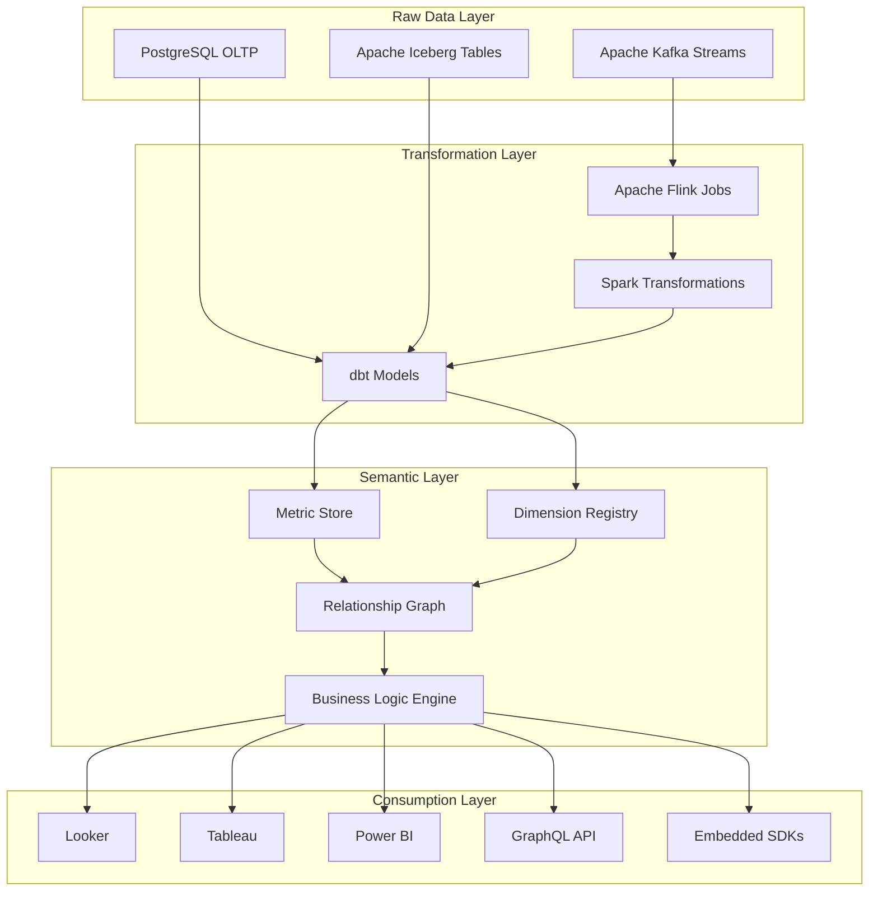
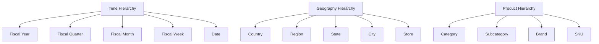
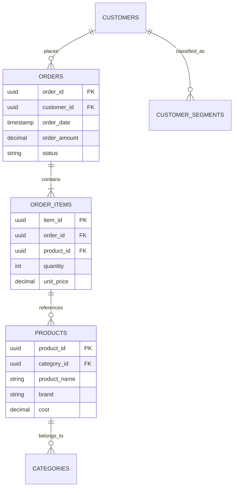
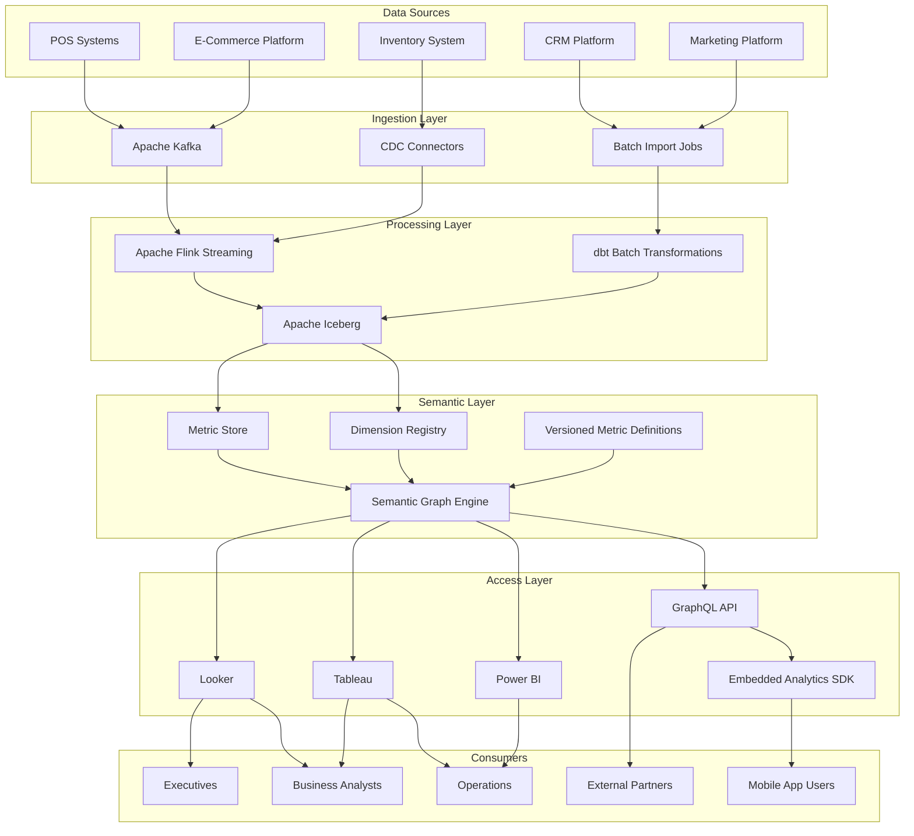
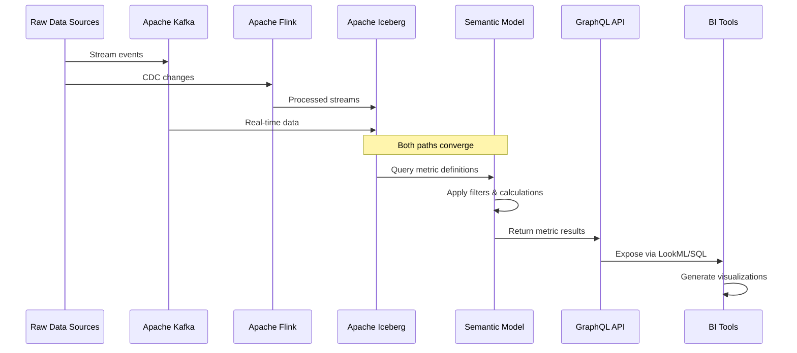
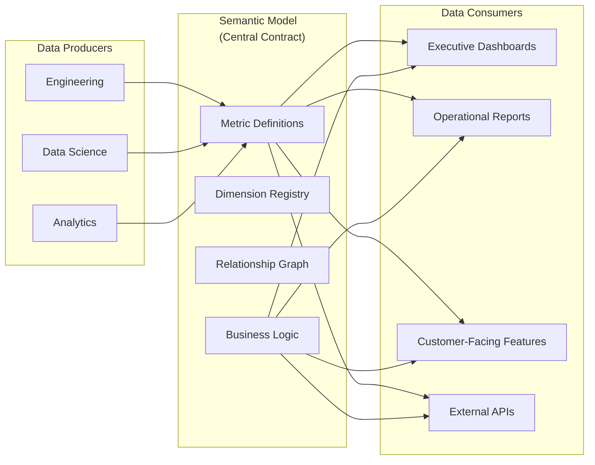
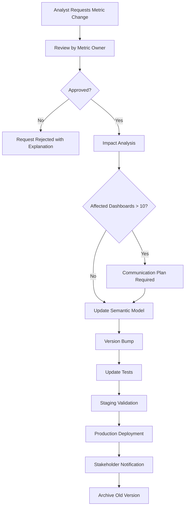
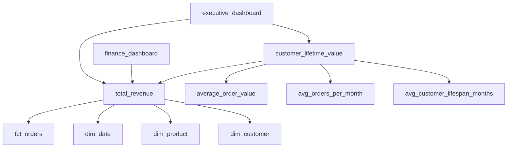

# Semantic Model

## 1. Overview

### What is Semantic Modeling?

Semantic modeling is the practice of creating a unified, business-friendly layer that defines how data should be interpreted. It sits between your raw data warehouse and the tools that consume it (dashboards, reports, APIs), translating technical database schemas into familiar business concepts like "Revenue," "Customer Lifetime Value," or "Order Fulfillment Rate."

A semantic model encapsulates:

- **Metrics** (also called measures): quantitative business indicators such as revenue, profit, count of orders
- **Dimensions**: categorical attributes that provide context to metrics, such as product category, region, customer segment, or time period
- **Relationships**: how entities relate to each other (e.g., orders belong to customers, products belong to categories)
- **Business logic**: calculated fields, aggregations, currency conversions, and naming conventions that reflect how the business actually speaks about data

### Why was it created?

Semantic modeling emerged as enterprises struggled with a fundamental problem: the same business question ("What is our revenue this quarter?") could yield completely different answers depending on which report, spreadsheet, or dashboard you consulted. This happened because:

- Each team defined "revenue" differently (net vs. gross, including vs. excluding returns, in local vs. reporting currency)
- Business logic was scattered across thousands of SQL queries embedded in reports
- Changes to business definitions required hunting down and updating every affected report

The semantic layer standardizes these definitions in one place. When "Revenue" is defined once in the semantic model, every downstream tool that uses it automatically gets consistent numbers.

### What business problem does it solve?

Semantic modeling solves critical enterprise data problems:

- **Inconsistent Metrics**: Different teams report different numbers for the same KPI, leading to boardroom disagreements and lost trust in data
- **Schema Complexity**: Business users cannot navigate 500-table data warehouses; semantic models present simplified, curated views
- **Slow Report Development**: Every new report requires writing complex SQL joins and business logic from scratch
- **Governance Failures**: No single source of truth for metric definitions; auditors cannot verify how numbers were calculated
- **Tool Lock-in**: Business logic embedded in Tableau/Looker workbooks cannot be ported to new visualization tools

### Why do enterprises use it?

Fortune 500 companies have adopted semantic layers because:

- **Walmart** uses a semantic layer to ensure "Daily Revenue" means the same thing across 10,000+ stores and their corporate analytics platform
- **Airbnb** maintains a metric store where hundreds of data scientists contribute standardized metrics that product teams consume through a semantic API
- **Uber** uses a semantic modeling platform to govern how "Trips Completed" is calculated across their rider app, driver app, and executive dashboards
- **Netflix** standardizes viewer engagement metrics across content, product, and growth teams through a unified semantic model
- **DoorDash** reduces dashboard development time by 70% by having analysts consume pre-defined metrics rather than writing raw SQL

---

## 2. Core Concepts

### Semantic Model Architecture



### Metric Definition Fundamentals

A **metric** is a quantitative measure of business performance. Metrics have three components:

1. **Expression**: The aggregation formula (SUM, COUNT, AVG, MIN, MAX, COUNT DISTINCT)
2. **Input Columns**: Which columns from the data model feed into the metric
3. **Filters**: Optional constraints that always apply (e.g., "exclude cancelled orders")


### Types of Metrics

**Simple (Base) Metrics** - Direct aggregations of a single column:

| Metric Name | Expression | Input Column | Example Value |
|-------------|-----------|--------------|---------------|
| total_revenue | SUM | order_amount | $4.2M |
| order_count | COUNT | order_id | 85,432 |
| avg_order_value | AVG | order_amount | $49.17 |
| unique_customers | COUNT DISTINCT | customer_id | 31,205 |
| min_delivery_time | MIN | delivery_duration_hours | 12 min |
| max_order_value | MAX | order_amount | $8,499 |

**Derived Metrics** - Metrics calculated from other metrics:

```yaml
metrics:
  - name: gross_profit
    description: Revenue minus cost of goods sold
    calculation: |
      total_revenue - total_cogs
    
  - name: gross_margin_percent
    description: Gross profit as percentage of revenue
    calculation: |
      (gross_profit / total_revenue) * 100
      
  - name: customer_lifetime_value
    description: Predicted total revenue from a customer
    calculation: |
      avg_order_value * avg_orders_per_month * avg_customer_lifespan_months
      
  - name: revenue_per_customer
    description: Total revenue divided by unique customers
    calculation: |
      total_revenue / unique_customers
```

**Ratio Metrics** - Metrics expressed as a ratio with numerator and denominator:

```yaml
metrics:
  - name: conversion_rate
    description: Percentage of sessions that result in orders
    numerator: completed_orders
    denominator: website_sessions
    format: percentage
    
  - name: inventory_turnover
    description: How many times inventory is sold and replaced
    numerator: cost_of_goods_sold
    denominator: average_inventory_value
    format: decimal
```

### Dimension Fundamentals

A **dimension** is a categorical attribute that provides context to metrics. Dimensions enable slicing and dicing data (the "GROUP BY" in SQL). Common dimensions include:

- **Time**: order_date, ship_date, fiscal_period, day_of_week
- **Geography**: country, region, state, city, store_id
- **Product**: category, subcategory, brand, sku, color, size
- **Customer**: segment, tier, acquisition_channel, cohort
- **Channel**: online, in_store, mobile_app, marketplace

```yaml
dimensions:
  - name: order_date
    type: time
    sql: ORDER_Table.order_date
    description: Date when order was placed
    
  - name: product_category
    type: categorical
    sql: PRODUCT_TABLE.category_name
    description: High-level product category
    
  - name: customer_segment
    type: categorical
    sql: CUSTOMER_TABLE.segment
    description: Customer segmentation tier
```

### Dimension Hierarchies

Dimensions often have natural hierarchical structures (drill-down paths):



```yaml
hierarchies:
  - name: time_hierarchy
    dimensions:
      - fiscal_year
      - fiscal_quarter
      - fiscal_month
      - fiscal_week
      - date
      
  - name: geography_hierarchy
    dimensions:
      - country
      - region
      - state
      - city
      - store
      
  - name: product_hierarchy
    dimensions:
      - category
      - subcategory
      - brand
      - sku
```

### Measures vs. Dimensions (Key Distinction)

| Aspect | Measure (Metric) | Dimension |
|--------|-----------------|-----------|
| Type | Numeric, aggregatable | Categorical, descriptive |
| Aggregation | Has meaning when summed/averaged | Should NOT be summed |
| Examples | revenue, quantity, count | customer_name, product_color, city |
| SQL Role | Appears in SELECT with AGG FUNC | Appears in GROUP BY |
| Granularity | Result of aggregation | Defines grouping level |
| Usage | What you measure | How you slice/dice |

```sql
-- BAD: Summing a dimension (nonsensical)
SELECT customer_id, SUM(customer_id) FROM orders
-- Result: meaningless number like 48573847584

-- GOOD: Counting customers
SELECT customer_id, COUNT(*) FROM orders GROUP BY customer_id

-- BAD: Grouping by a measure
SELECT SUM(revenue) FROM orders GROUP BY revenue
-- Result: each individual revenue value, summed = total anyway

-- GOOD: Grouping by dimensions
SELECT customer_segment, product_category, SUM(revenue)
FROM orders GROUP BY customer_segment, product_category
```

### Calculated Fields

Calculated fields add business logic without changing underlying data:

```yaml
calculated_fields:
  - name: is_high_value_order
    type: boolean
    sql: |
      CASE 
        WHEN order_amount > 500 THEN true 
        ELSE false 
      END
      
  - name: days_since_last_order
    type: integer
    sql: |
      DATEDIFF('day', MAX(order_date), CURRENT_DATE)
      
  - name: profit_margin_category
    type: string
    sql: |
      CASE
        WHEN gross_margin_percent > 50 THEN 'Premium'
        WHEN gross_margin_percent > 30 THEN 'Standard'
        ELSE 'Budget'
      END
      
  - name: customer_age_years
    type: float
    sql: |
      DATEDIFF('year', customer_first_order_date, CURRENT_DATE)
```

### Time Intelligence

Time intelligence enables powerful date-based metric calculations:

```yaml
time_intelligence:
  # Period-over-period comparisons
  - name: revenue_vs_last_year
    description: Revenue compared to same period last year
    base_metric: total_revenue
    calculation: |
      current_period_revenue / same_period_last_year_revenue - 1
      
  - name: revenue_vs_last_month
    description: Revenue compared to previous month
    base_metric: total_revenue
    calculation: |
      current_month_revenue / previous_month_revenue - 1
      
  # Rolling windows
  - name: rolling_7_day_revenue
    description: Sum of revenue over last 7 days
    base_metric: total_revenue
    window: 7 DAYS
    type: moving_average
    
  - name: rolling_30_day_avg_order_value
    description: Average order value over last 30 days
    base_metric: avg_order_value
    window: 30 DAYS
    
  # Cumulative totals
  - name: ytd_revenue
    description: Year-to-date cumulative revenue
    base_metric: total_revenue
    scope: year_to_date
    
  - name: qtd_revenue
    description: Quarter-to-date cumulative revenue
    base_metric: total_revenue
    scope: quarter_to_date
    
  # Same-period calculations
  - name: mom_revenue
    description: Month-over-month revenue growth
    base_metric: total_revenue
    comparison: previous_month
    
  - name: wow_revenue
    description: Week-over-week revenue growth
    base_metric: total_revenue
    comparison: previous_week
```

### Relationship Modeling

Semantic models define how entities relate to enable proper joins:

```yaml
relationships:
  - name: orders_to_customers
    type: many_to_one
    left_entity: orders
    right_entity: customers
    join_type: left
    # Each order has exactly one customer
    
  - name: orders_to_products
    type: many_to_many
    left_entity: order_items
    right_entity: products
    join_type: left
    # Order items link orders to products
    
  - name: customers_to_segments
    type: many_to_one
    left_entity: customers
    right_entity: segments
    join_type: inner
    # Each customer belongs to one segment
```



---

## 3. Why This Project Uses It

The Enterprise Retail Streaming Platform requires a semantic model for several critical reasons:

### Consistent Business Metrics Across Teams

In a retail platform with multiple consumer touchpoints (mobile app, web, in-store kiosks, marketplace sellers), the definition of "Total Revenue" can vary dramatically:

- Should marketplace seller revenue be included?
- Do we count orders that were later cancelled?
- Is revenue recognized at order placement or shipment?
- How do we handle returns processed in a different month than original sale?

By centralizing these definitions in the semantic model:

- **Finance team** sees revenue as: gross orders minus cancellations, returns, and discounts, recognized at shipment
- **Operations team** sees revenue as: all successfully shipped orders regardless of return status
- **Growth team** sees revenue as: first-time customer orders only, for measuring acquisition impact

Each team gets the view they need, but underlying calculations are consistent and auditable.

### Real-Time and Batch Metric Consistency

The platform processes data through both streaming (Kafka/Flink) and batch (dbt) pipelines. Without a semantic model:

- Streaming calculations might use slightly different logic than batch recalculations
- Engineers might update streaming logic without updating batch logic (or vice versa)
- The "same" metric would produce different values depending on how you queried it

With a semantic model:

- Both streaming and batch pipelines consume the same metric definitions
- Changes to business logic happen in one place
- Reconciliation between real-time and batch becomes straightforward

```yaml
# Single metric definition used by both pipelines
metrics:
  - name: hourly_revenue
    description: Revenue per hour for real-time dashboards
    dimensions:
      - order_hour
      - product_category
      - customer_segment
    filters:
      - status: completed
      - order_type: standard
    # This same definition is used by:
    # 1. Flink streaming job for real-time aggregation
    # 2. dbt batch job for historical reconciliation
```

### Self-Service Analytics Without SQL Expertise

Business users (merchandisers, category managers, marketing analysts) should be able to answer questions like:

- "Show me revenue by product category for the last 3 months"
- "Compare customer acquisition costs between Q1 and Q2 by channel"
- "What is the average order value for high-value customers in California?"

Without a semantic model, these requests require data engineering support. With a semantic model and a tool like Looker or a GraphQL API built on top of it, business users can explore data independently.

### Governance and Auditability

Retail compliance requirements (PCI-DSS, SOX, tax regulations) demand that financial reports be reproducible and auditable:

- Every metric must have a clear definition document
- Changes to metric logic require approval and version control
- Reports must be reproducible with the same input data

The semantic model serves as this system of record. When an auditor asks "How was Q3 Revenue calculated?", the answer is a versioned semantic model definition, not a SQL query buried in a 2019 Tableau workbook.

### Support for Multiple Downstream Tools

The platform serves data to:

- Looker for executive dashboards
- Tableau for operational reports
- Custom GraphQL API for mobile app features
- Embedded analytics in seller portal
- Third-party integrations via API

Without a semantic model, each tool would implement business logic independently, leading to:

- Different numbers in each tool
- Maintenance nightmares when logic changes
- Inability to compare "apples to apples" across tools

The semantic model is the single source of truth that powers all these tools.

---

## 4. Architecture Position

### Semantic Model in the Platform Stack



### Semantic Model Processing Flow



### Semantic Model as Central Contract



---

## 5. Folder Structure

### Semantic Model Directory Organization

```
enterprise-retail-platform/
├── semantic_model/
│   ├── metrics/
│   │   ├── _metrics.yml              # All metric definitions
│   │   ├── revenue/
│   │   │   ├── _revenue_metrics.yml   # Revenue family metrics
│   │   │   ├── gross_revenue.yml
│   │   │   ├── net_revenue.yml
│   │   │   ├── refund_amount.yml
│   │   │   └── revenue_by_channel.yml
│   │   ├── customer/
│   │   │   ├── _customer_metrics.yml
│   │   │   ├── customer_count.yml
│   │   │   ├── new_customers.yml
│   │   │   ├── returning_customers.yml
│   │   │   ├── customer_lifetime_value.yml
│   │   │   └── cac_by_channel.yml
│   │   ├── orders/
│   │   │   ├── _order_metrics.yml
│   │   │   ├── order_count.yml
│   │   │   ├── avg_order_value.yml
│   │   │   ├── orders_per_customer.yml
│   │   │   └── fulfillment_rate.yml
│   │   └── product/
│   │       ├── _product_metrics.yml
│   │       ├── units_sold.yml
│   │       ├── return_rate.yml
│   │       └── inventory_turnover.yml
│   │
│   ├── dimensions/
│   │   ├── _dimensions.yml           # All dimension definitions
│   │   ├── time/
│   │   │   ├── _time_dimensions.yml
│   │   │   ├── date.yml
│   │   │   ├── week.yml
│   │   │   ├── month.yml
│   │   │   ├── quarter.yml
│   │   │   └── year.yml
│   │   ├── geography/
│   │   │   ├── _geo_dimensions.yml
│   │   │   ├── country.yml
│   │   │   ├── region.yml
│   │   │   ├── state.yml
│   │   │   ├── city.yml
│   │   │   └── store.yml
│   │   ├── product/
│   │   │   ├── _product_dimensions.yml
│   │   │   ├── category.yml
│   │   │   ├── subcategory.yml
│   │   │   ├── brand.yml
│   │   │   └── sku.yml
│   │   ├── customer/
│   │   │   ├── _customer_dimensions.yml
│   │   │   ├── segment.yml
│   │   │   ├── tier.yml
│   │   │   ├── cohort.yml
│   │   │   └── acquisition_channel.yml
│   │   └── order/
│   │       ├── _order_dimensions.yml
│   │       ├── status.yml
│   │       ├── type.yml
│   │       └── fulfillment_method.yml
│   │
│   ├── hierarchies/
│   │   ├── _hierarchies.yml
│   │   ├── time_hierarchy.yml
│   │   ├── geography_hierarchy.yml
│   │   ├── product_hierarchy.yml
│   │   └── customer_hierarchy.yml
│   │
│   ├── relationships/
│   │   ├── _relationships.yml
│   │   ├── orders_to_customers.yml
│   │   ├── orders_to_products.yml
│   │   ├── customers_to_segments.yml
│   │   └── products_to_categories.yml
│   │
│   ├── calculated_fields/
│   │   ├── _calculated_fields.yml
│   │   ├── profit_margin.yml
│   │   ├── is_high_value_customer.yml
│   │   ├── days_since_order.yml
│   │   └── customer_age_years.yml
│   │
│   ├── time_intelligence/
│   │   ├── _time_intelligence.yml
│   │   ├── mom_comparison.yml
│   │   ├── qoq_comparison.yml
│   │   ├── yoy_comparison.yml
│   │   ├── rolling_7_day_avg.yml
│   │   ├── rolling_30_day_avg.yml
│   │   └── ytd_totals.yml
│   │
│   ├── security/
│   │   ├── _row_level_security.yml
│   │   ├── regional_access.yml
│   │   ├── customer_tier_access.yml
│   │   └── internal_only_metrics.yml
│   │
│   ├── mappings/
│   │   ├── _source_mappings.yml       # Maps semantic names to physical tables
│   │   ├── table_to_metric_mapping.yml
│   │   └── column_aliases.yml
│   │
│   └── configs/
│       ├── _config.yml                # Global semantic model config
│       ├── default_aggregations.yml
│       ├── formatting_rules.yml
│       └── caching_policy.yml
│
├── models/                            # dbt models (physical layer)
│   ├── intermediate/
│   │   ├── semantic_metrics/
│   │   │   ├── int_order_metrics.yml
│   │   │   └── int_customer_metrics.yml
│   │   └── dimensions/
│   │       ├── dim_date.yml
│   │       ├── dim_customer.yml
│   │       └── dim_product.yml
│   └── mart/
│       ├── finance/
│       │   └── fct_orders.yml
│       └── operations/
│           └── fct_fulfillment.yml
│
└── tests/
    └── semantic/
        ├── test_metric_consistency.yml
        ├── test_dimension_values.yml
        ├── test_joins.yml
        └── test_security_filters.yml
```

### Key Files Explained

**`_metrics.yml`** - The master registry of all metric definitions:

```yaml
version: 2

metrics:
  - name: total_revenue
    description: Sum of all order amounts for completed, non-returned orders
    label: Total Revenue
    model: ref('fct_orders')
    label: "Total Revenue"
    aggregation: SUM
    sql: order_amount
    filters:
      - status: completed
      - order_type: standard
    meta:
      owner: finance_team
      tier: gold
      refresh_frequency: hourly
```

**`_dimensions.yml`** - The master registry of all dimension definitions:

```yaml
version: 2

dimensions:
  - name: order_date
    description: Date when order was placed
    type: time
    sql: "{{ ref('fct_orders') }}.order_date"
    granularity: day
    
  - name: product_category
    description: Product category classification
    type: categorical
    sql: "{{ ref('dim_product') }}.category_name"
```

**`_relationships.yml`** - Defines how entities join:

```yaml
version: 2

relationships:
  - name: orders_to_customers
    type: many_to_one
    sql: "{{ ref('fct_orders') }}.customer_id"
    to: "{{ ref('dim_customer') }}.customer_id"
```

---

## 6. Implementation Walkthrough

### Step 1: Define the Physical Data Model (dbt)

First, build the intermediate and fact/dimension tables in dbt:

```yaml
# models/marts/finance/fct_orders.yml
version: 2

models:
  - name: fct_orders
    description: Fact table for order transactions
    columns:
      - name: order_id
        description: Primary key
        tests:
          - unique
          - not_null
        
      - name: customer_id
        description: Foreign key to customer
        tests:
          - not_null
          - relationships:
              to: ref('dim_customer')
              field: customer_id
                
      - name: order_date
        description: Date of order
        tests:
          - not_null
          
      - name: order_amount
        description: Total order amount in USD
        tests:
          - not_null
          - positive_value
          
      - name: status
        description: Order status
        tests:
          - accepted_values:
              values: [pending, confirmed, shipped, delivered, cancelled, returned]
```

```sql
-- models/marts/finance/fct_orders.sql
{{ config(
    materialized='incremental',
    unique_key='order_id',
    partition_by=['order_date_year', 'order_date_month'],
    cluster_by=['status', 'customer_segment']
) }}

SELECT
    o.order_id,
    o.customer_id,
    c.customer_segment,
    c.customer_tier,
    c.first_order_date,
    o.order_date,
    EXTRACT(YEAR FROM o.order_date) AS order_date_year,
    EXTRACT(MONTH FROM o.order_date) AS order_date_month,
    EXTRACT(WEEK FROM o.order_date) AS order_date_week,
    o.order_amount,
    o.status,
    o.channel,
    p.category_id,
    p.category_name,
    p.brand_name
FROM {{ source('orders', 'raw_orders') }} o
LEFT JOIN {{ ref('dim_customer') }} c ON o.customer_id = c.customer_id
LEFT JOIN {{ ref('dim_product') }} p ON o.product_id = p.product_id
```

### Step 2: Define Metrics in Semantic Model

```yaml
# semantic_model/metrics/revenue/_revenue_metrics.yml
version: 1

metrics:
  - name: total_revenue
    description: |
      Total revenue from completed orders. Excludes cancelled and returned orders.
      Revenue is recognized at order shipment, not order placement.
    label: Total Revenue
    
    model: ref('fct_orders')
    
    label: "Total Revenue"
    description: "Sum of order amounts for completed, non-returned orders"
    
    calculation: |
      SUM(order_amount)
      
    dimensions:
      - order_date
      - product_category
      - brand_name
      - customer_segment
      - customer_tier
      - channel
      - status
      
    filters:
      - field: status
        operator: =
        value: completed
        
    meta:
      owner: finance_team
      data_classification: PII_LITE
      refresh_frequency: hourly
      tier: gold
      dependencies:
        - fct_orders
        - dim_customer
        - dim_product

  - name: gross_revenue
    description: Revenue before returns and allowances
    calculation: |
      SUM(order_amount)
    filters:
      - status: completed
    dimensions: ["*"]
    
  - name: net_revenue
    description: Revenue after returns and allowances
    calculation: |
      SUM(order_amount) - SUM(return_amount)
    dimensions: ["*"]
    
  - name: average_order_value
    description: Average revenue per order
    calculation: |
      AVG(order_amount)
    dimensions: ["*"]
```

### Step 3: Define Dimension Hierarchies

```yaml
# semantic_model/hierarchies/time_hierarchy.yml
version: 1

hierarchies:
  - name: time_hierarchy
    label: "Time"
    description: "Standard time dimension hierarchy for temporal analysis"
    
    dimensions:
      - name: fiscal_year
        label: "Fiscal Year"
        sql: |
          CASE 
            WHEN EXTRACT(MONTH FROM order_date) >= 2 
            THEN EXTRACT(YEAR FROM order_date) + 1
            ELSE EXTRACT(YEAR FROM order_date)
          END
        type: time
        
      - name: fiscal_quarter
        label: "Fiscal Quarter"
        sql: |
          'Q' || CEILING(EXTRACT(MONTH FROM order_date)::DECIMAL / 3)
        type: time
        
      - name: fiscal_month
        label: "Fiscal Month"
        sql: |
          TO_CHAR(order_date, 'YYYY-MM')
        type: time
        
      - name: fiscal_week
        label: "Fiscal Week"
        sql: |
          EXTRACT(WEEK FROM order_date)::VARCHAR
        type: time
        
      - name: order_date
        label: "Date"
        sql: order_date
        type: time
```

### Step 4: Implement Calculated Fields

```yaml
# semantic_model/calculated_fields/profitability.yml
version: 1

calculated_fields:
  - name: gross_profit
    label: "Gross Profit"
    description: "Revenue minus cost of goods sold"
    type: money
    sql: |
      order_amount - (order_amount * 0.55)
    -- Assumes 45% COGS margin
    
  - name: gross_margin_percent
    label: "Gross Margin %"
    description: "Gross profit as percentage of revenue"
    type: percent
    sql: |
      (order_amount - (order_amount * 0.55)) / order_amount * 100
    round_to: 2
    
  - name: profit_margin_category
    label: "Margin Category"
    description: "Classifies products by margin percentage"
    type: string
    sql: |
      CASE
        WHEN (order_amount - (order_amount * 0.55)) / order_amount * 100 > 50 
          THEN 'Premium'
        WHEN (order_amount - (order_amount * 0.55)) / order_amount * 100 > 30 
          THEN 'Standard'
        ELSE 'Budget'
      END
      
  - name: is_first_order
    label: "Is First Order"
    description: "Whether this is the customer's first order"
    type: boolean
    sql: |
      CASE 
        WHEN order_id = first_order_id THEN true 
        ELSE false 
      END
```

### Step 5: Implement Time Intelligence

```yaml
# semantic_model/time_intelligence/revenue_comparisons.yml
version: 1

time_intelligence:
  - name: revenue_mom_growth
    label: "Month-over-Month Revenue Growth"
    description: "Percentage change in revenue compared to previous month"
    base_metric: total_revenue
    comparison_type: period_over_period
    period: month
    calculation: |
      (current_period_value - previous_period_value) / previous_period_value * 100
      
  - name: revenue_yoy_growth
    label: "Year-over-Year Revenue Growth"
    description: "Percentage change in revenue compared to same month last year"
    base_metric: total_revenue
    comparison_type: year_over_year
    calculation: |
      (current_period_value - same_period_last_year_value) / same_period_last_year_value * 100
      
  - name: revenue_rolling_7_day
    label: "7-Day Rolling Revenue"
    description: "Sum of revenue over the last 7 days"
    base_metric: total_revenue
    window_type: rolling
    window_size: 7
    window_unit: day
    
  - name: revenue_rolling_30_day
    label: "30-Day Rolling Revenue"
    description: "Sum of revenue over the last 30 days"
    base_metric: total_revenue
    window_type: rolling
    window_size: 30
    window_unit: day
    
  - name: revenue_ytd
    label: "Year-to-Date Revenue"
    description: "Cumulative revenue from start of fiscal year"
    base_metric: total_revenue
    aggregation_type: cumulative
    date_type: fiscal_year
    
  - name: revenue_qtd
    label: "Quarter-to-Date Revenue"
    description: "Cumulative revenue from start of fiscal quarter"
    base_metric: total_revenue
    aggregation_type: cumulative
    date_type: fiscal_quarter
```

### Step 6: Define Relationships

```yaml
# semantic_model/relationships/enterprise_relationships.yml
version: 1

relationships:
  - name: orders_to_dimensions
    label: "Order to Dimension Relationships"
    description: "Defines how order facts join to dimension tables"
    
    joins:
      - name: orders_to_customers
        type: many_to_one
        left_table: fct_orders
        right_table: dim_customer
        sql: |
          fct_orders.customer_id = dim_customer.customer_id
        join_type: left
        description: "Each order belongs to one customer"
        
      - name: orders_to_products
        type: many_to_one
        left_table: fct_orders
        right_table: dim_product
        sql: |
          fct_orders.product_id = dim_product.product_id
        join_type: left
        description: "Each order references one product"
        
      - name: orders_to_time
        type: many_to_one
        left_table: fct_orders
        right_table: dim_date
        sql: |
          fct_orders.order_date = dim_date.date
        join_type: inner
        description: "Each order has one date"
```

### Step 7: Expose via GraphQL API

```python
# api/semantic_model_api.py
from dataclasses import dataclass
from typing import List, Optional, Dict, Any
from enum import Enum

class AggregationType(Enum):
    SUM = "SUM"
    COUNT = "COUNT"
    AVG = "AVG"
    MIN = "MIN"
    MAX = "MAX"
    COUNT_DISTINCT = "COUNT_DISTINCT"

@dataclass
class MetricDefinition:
    name: str
    description: str
    aggregation: AggregationType
    sql_expression: str
    filters: List[Dict[str, Any]]
    dimensions: List[str]
    
@dataclass
class QueryRequest:
    metrics: List[str]
    dimensions: List[str]
    filters: List[Dict[str, Any]]
    time_period: Optional[Dict[str, str]] = None
    limit: int = 1000

class SemanticModelExecutor:
    """Executes queries against the semantic model"""
    
    def __init__(self, metric_store: MetricStore, warehouse_connection):
        self.metrics = metric_store
        self.warehouse = warehouse_connection
        
    def execute_query(self, request: QueryRequest) -> Dict[str, Any]:
        # 1. Validate metrics and dimensions exist
        self._validate_request(request)
        
        # 2. Build SQL from semantic model definitions
        sql = self._build_sql(request)
        
        # 3. Execute against warehouse
        results = self.warehouse.execute(sql)
        
        # 4. Apply post-processing (formatting, currency conversion)
        return self._post_process(results, request)
        
    def _build_sql(self, request: QueryRequest) -> str:
        # Translate metric names to SQL expressions
        metric_expressions = []
        for metric_name in request.metrics:
            metric_def = self.metrics.get(metric_name)
            expr = self._build_metric_expression(metric_def)
            metric_expressions.append(f"{expr} AS {metric_name}")
            
        # Translate dimension names to SQL columns
        dimension_expressions = []
        for dim_name in request.dimensions:
            dim_def = self.metrics.get_dimension(dim_name)
            expr = self._build_dimension_expression(dim_def)
            dimension_expressions.append(expr)
            
        # Build WHERE clause from filters
        where_clauses = []
        for filter_def in request.filters:
            clause = self._build_filter_expression(filter_def)
            where_clauses.append(clause)
            
        sql = f"""
            SELECT 
                {', '.join(dimension_expressions)},
                {', '.join(metric_expressions)}
            FROM {self._get_base_table(request.metrics)}
            {self._build_joins(request.dimensions)}
            {('WHERE ' + ' AND '.join(where_clauses)) if where_clauses else ''}
            {self._build_group_by(request.dimensions)}
        """
        return sql
```

---

## 7. Production Best Practices

### Metric Naming Conventions

Establish and enforce consistent naming:

```yaml
# Good naming patterns
metrics:
  # Start with entity/verb pattern
  - name: revenue_total           # entity_revenue, modifier_total
  - name: revenue_by_channel      # entity_by_dimension
  - name: customer_count_new      # entity_count_modifier
  - name: customer_count_returning
  - name: order_fulfillment_rate  # entity_measure_rate
  
# Bad naming patterns
metrics:
  - name: total_rev               # Abbreviations not searchable
  - name: rev                     # Too short, ambiguous
  - name: customers               # Missing count
  - name: order_value_avg         # Inconsistent word order
```

### Version Control for Metric Definitions

All semantic model definitions should be version-controlled:

```bash
# Use Git for metric definitions
git checkout -b feature/update-revenue-definition
# Edit semantic_model/metrics/revenue/total_revenue.yml
git add semantic_model/metrics/revenue/total_revenue.yml
git commit -m "feat(metrics): Update revenue to exclude marketplace seller fees"
git push origin feature/update-revenue-definition
# Open PR for review with metricOWNERs and finance team
```

```yaml
# In each metric file, include version metadata
version: 2

metrics:
  - name: total_revenue
    v1:
      description: "Original definition from 2024"
      calculation: "SUM(order_amount)"
    v2:
      description: "Updated to exclude marketplace fees per finance request"
      calculation: "SUM(order_amount) - SUM(marketplace_fees)"
      effective_date: "2025-01-01"
      owner: finance_team
      approved_by: CFO
```

### Metric Tiering System

Classify metrics by importance and governance:

```yaml
metric_tiers:
  tier_1_platinum:
    description: "Executive KPIs, board-level metrics"
    sla: "Real-time, 99.99% uptime"
    owners: ["CFO", "CEO"]
    change_process: "Requires board approval"
    examples:
      - total_revenue
      - gross_margin_percent
      - active_customers
      - customer_lifetime_value
      
  tier_2_gold:
    description: "Department-level KPIs"
    sla: "Hourly refresh, 99.9% uptime"
    owners: ["VP_Finance", "VP_Operations"]
    change_process: "Requires department head approval"
    examples:
      - revenue_by_category
      - fulfillment_rate
      - avg_order_value
      - customer_acquisition_cost
      
  tier_3_silver:
    description: "Team-level metrics"
    sla: "Daily refresh, 99% uptime"
    owners: ["Team_Lead"]
    change_process: "Requires team lead + peer review"
    examples:
      - returns_by_reason
      - cart_abandonment_rate
      - email_open_rate
      
  tier_4_bronze:
    description: "Experimental metrics"
    sla: "Weekly refresh, best-effort"
    owners: ["Individual_Analyst"]
    change_process: "Self-service, notify stakeholders"
    examples:
      - newexperimental_conversion_rate
      - feature_adoption_rate
```

### Documentation Standards

Every metric needs complete documentation:

```yaml
metrics:
  - name: total_revenue
    description: |
      Total revenue from completed orders in USD.
      
      ## Definition
      SUM of order_amount where status = 'completed' AND 
      order_type IN ('standard', 'express', 'subscription')
      
      ## Exclusions
      - Cancelled orders
      - Returned orders  
      - Marketplace seller orders (fulfilled by third party)
      
      ## Currency
      All values in USD. Multi-currency orders converted at 
      exchange rate at time of shipment.
      
      ## Edge Cases
      - Split shipments: Revenue recognized when ALL items ship
      - Pre-orders: Revenue recognized at shipment, not purchase date
      - Gift cards: Revenue recognized at redemption, not purchase
      
    data_dictionary_reference: "FIN-REV-001"
    related_metrics:
      - gross_revenue
      - net_revenue
      - revenue_by_channel
    upstream_systems:
      - order_management_system
      - payment_processor
      - fulfillment_system
```

### Change Management Process



### Monitoring Metric Health

```python
# scripts/monitor_metric_health.py
from datetime import datetime, timedelta
from dataclasses import dataclass
from typing import Dict, List, Optional

@dataclass
class MetricHealthCheck:
    metric_name: str
    row_count: int
    null_percentage: float
    min_value: float
    max_value: float
    avg_value: float
    std_deviation: float
    last_refresh: datetime
    drift_from_yesterday: Optional[float]
    
    def is_healthy(self) -> bool:
        return (
            self.row_count > 0 and
            self.null_percentage < 0.01 and  # Less than 1% nulls
            self.drift_from_yesterday is None or
            abs(self.drift_from_yesterday) < 0.20  # Less than 20% drift
        )

def run_health_checks(metric_names: List[str]) -> Dict[str, MetricHealthCheck]:
    results = {}
    for metric in metric_names:
        check = execute_health_check_query(metric)
        results[metric] = check
        
        if not check.is_healthy():
            send_alert(
                severity="warning" if check.row_count == 0 else "critical",
                metric=metric,
                message=f"Metric health check failed: {check}"
            )
    return results
```

---

## 8. Common Problems

| Problem | Cause | Solution | Severity |
|---------|-------|----------|----------|
| **Metric returns different values in different tools** | Semantic model not properly synchronized; each tool has its own business logic | Centralize all metric definitions in one semantic layer; use API-first approach | Critical |
| **Slow query performance on dashboards** | Too many dimensions in explore; missing aggregation tables | Create aggregate tables for common dimension combinations; limit explore scope | High |
| **Null values appearing in metrics** | Outer joins producing nulls; missing COALESCE | Use INNER joins where appropriate; wrap with COALESCE(..., 0) | Medium |
| **Metrics changing definition without notice** | No change management process; developers updating SQL directly | Implement version control; require PRs for metric changes; notify stakeholders | High |
| **Dimension values not appearing in filter lists** | New values added to source but not synced to semantic layer | Implement dimension refresh process; schedule sync jobs | Medium |
| **Year-over-year comparisons showing incorrect values** | Incomplete historical data; different processing logic | Ensure same metric definition used historically; backfill data | High |
| **Row-level security not applying to some users** | Security predicates missing for new tables; caching issues | Audit security model on each deployment; clear cache after changes | Critical |
| **Calculated fields producing wrong results** | Division by zero edge cases; floating point precision | Add NULLIF for division; use DECIMAL types; add edge case tests | Medium |
| **Time intelligence giving N/A for recent periods** | Data not yet loaded for current period; timezone issues | Set appropriate data freshness expectations; add buffer days for recent data | Low |
| **Joins producing duplicate rows (fan-out)** | One-to-many relationships not properly modeled | Use correct join type; denormalize where needed; use distinct when appropriate | High |
| **Metrics not matching source system totals** | Different filter criteria; data latency differences | Compare filter logic line-by-line; check for data in transit | High |
| **Dimension changes breaking historical reports** | Slowly changing dimensions handled incorrectly | Implement SCD Type 2 for relevant dimensions; version historical joins | Medium |
| **Currency conversion producing inconsistent results** | Exchange rate timing; different rate sources | Use end-of-day rates; document rate source; batch rate updates | Medium |
| **Metric definitions scattered across multiple files** | No centralized metric store; tribal knowledge | Consolidate into semantic model; retire duplicate definitions | Low |
| **Dashboard users requesting same metric multiple times** | Discovery problem; no metric catalog | Build metric explorer UI; promote metric usage; deprecate duplicates | Low |

---

## 9. Performance Optimization

### Aggregate Tables (Materializations)

For common dimension combinations, pre-compute aggregations:

```yaml
# models/marts/aggregates/agg_order_revenue.yml
version: 2

models:
  - name: agg_order_revenue_daily
    description: Pre-computed daily revenue by category and segment
    materialized: table
    
    columns:
      - name: order_date
      - name: product_category
      - name: customer_segment
      - name: total_revenue
      - name: order_count
      - name: avg_order_value
      
    sql: |
      SELECT
        DATE_TRUNC('day', order_date) AS order_date,
        product_category,
        customer_segment,
        SUM(order_amount) AS total_revenue,
        COUNT(*) AS order_count,
        AVG(order_amount) AS avg_order_value
      FROM {{ ref('fct_orders') }}
      WHERE status = 'completed'
      GROUP BY 1, 2, 3
```

```yaml
# Semantic model mapping to use aggregate when available
metrics:
  - name: total_revenue
    label: "Total Revenue"
    # Semantic model automatically routes to agg table
    # when dimensions match
    dimensions:
      - order_date
      - product_category
      - customer_segment
```

### Query Result Caching

```yaml
# semantic_model/configs/caching_policy.yml
version: 1

caching:
  default_ttl_minutes: 15
  
  by_metric_tier:
    tier_1_platinum:
      ttl_minutes: 5
      cache_level: realtime
    tier_2_gold:
      ttl_minutes: 60
      cache_level: hourly
    tier_3_silver:
      ttl_minutes: 240
      cache_level: daily
      
  by_query_type:
    exploration:
      ttl_minutes: 5
    scheduled_report:
      ttl_minutes: 60
    embedded:
      ttl_minutes: 15
```

```python
# api/cache_manager.py
from functools import lru_cache
from datetime import datetime, timedelta
import hashlib
import json

class SemanticModelCache:
    def __init__(self, redis_client):
        self.redis = redis_client
        
    def _make_cache_key(self, request: QueryRequest) -> str:
        normalized = json.dumps(request, sort_keys=True)
        return f"semantic:{hashlib.md5(normalized.encode()).hexdigest()}"
        
    def get_or_execute(self, request: QueryRequest, executor):
        cache_key = self._make_cache_key(request)
        
        # Check cache
        cached = self.redis.get(cache_key)
        if cached:
            return json.loads(cached)
            
        # Execute query
        result = executor.execute_query(request)
        
        # Cache result
        ttl = self._get_ttl_for_request(request)
        self.redis.setex(cache_key, ttl * 60, json.dumps(result))
        
        return result
```

### Indexing Strategy

```sql
-- For high-cardinality dimensions frequently used in WHERE clauses
CREATE INDEX idx_fct_orders_customer_id ON fct_orders(customer_id);
CREATE INDEX idx_fct_orders_order_date ON fct_orders(order_date);
CREATE INDEX idx_fct_orders_status ON fct_orders(status);

-- Composite indexes for common query patterns
CREATE INDEX idx_fct_orders_date_status 
    ON fct_orders(order_date, status);
CREATE INDEX idx_fct_orders_category_segment 
    ON fct_orders(product_category, customer_segment);

-- For GROUP BY heavy workloads
CREATE INDEX idx_fct_orders_group_by_helper 
    ON fct_orders(order_date, product_category, customer_segment, status);
```

### Partitioning Strategy

```sql
-- Time-based partitioning for order fact table
CREATE TABLE fct_orders (
    order_id UUID,
    customer_id UUID,
    order_date DATE,
    order_amount DECIMAL(12,2),
    status VARCHAR(20)
)
PARTITION BY RANGE (order_date);

-- Create monthly partitions
CREATE TABLE fct_orders_2025_01 
    PARTITION OF fct_orders
    FOR VALUES FROM ('2025-01-01') TO ('2025-02-01');
    
CREATE TABLE fct_orders_2025_02 
    PARTITION OF fct_orders
    FOR VALUES FROM ('2025-02-01') TO ('2025-03-01');
    
-- Add new partitions automatically
-- Use dbt partition macro or Airflow DAG to create future partitions
```

### Dimension Subsetting

Only join necessary dimensions to avoid unnecessary columns:

```yaml
# Bad: Joining entire dimension tables
dimensions:
  - name: customer_full_name    # Don't need this
  - name: customer_email        # Don't need this either
  - name: customer_address      # Definitely don't need

# Good: Only include dimensions being queried
dimensions:
  - name: customer_segment
  - name: customer_tier
  - name: customer_acquisition_channel
```

---

## 10. Security

### Row-Level Security (RLS) in Semantic Layer

RLS ensures users only see data they are permitted to access:

```yaml
# semantic_model/security/row_level_security.yml
version: 1

row_level_security:
  - name: regional_data_access
    description: Users can only see data for their assigned regions
    applies_to:
      - total_revenue
      - order_count
      - customer_count
    predicate: |
      CASE 
        WHEN '{{ _user_region }}' = 'GLOBAL' THEN true
        ELSE dim_store.region IN ('{{ _user_region }}')
      END
    parameters:
      - name: _user_region
        source: user_attribute
        required: true
        
  - name: customer_tier_filter
    description: Different user tiers see different customer data
    applies_to:
      - customer_lifetime_value
      - customer_orders
    predicate: |
      CASE
        WHEN '{{ _user_tier }}' = 'PREMIUM' THEN true
        WHEN '{{ _user_tier }}' = 'STANDARD' THEN dim_customer.tier IN ('STANDARD', 'PREMIUM')
        ELSE dim_customer.tier = '{{ _user_tier }}'
      END
```

### Implementation Example

```python
# api/security/enforcement.py
from dataclasses import dataclass
from typing import List, Optional

@dataclass
class UserContext:
    user_id: str
    email: str
    region: Optional[str] = None
    tier: Optional[str] = None
    roles: List[str] = []
    is_internal: bool = False

class RowLevelSecurityEnforcer:
    def __init__(self, rls_policies: dict):
        self.policies = rls_policies
        
    def build_security_predicates(
        self, 
        user: UserContext,
        requested_metrics: List[str]
    ) -> List[str]:
        predicates = []
        
        for metric in requested_metrics:
            policy = self._get_policy_for_metric(metric)
            if policy:
                predicate = self._render_predicate(policy, user)
                predicates.append(predicate)
                
        return predicates
        
    def _render_predicate(
        self, 
        policy: dict, 
        user: UserContext
    ) -> str:
        template = policy['predicate']
        
        # Replace user context variables
        replacements = {
            '_user_region': user.region or 'GLOBAL',
            '_user_tier': user.tier or 'STANDARD',
            '_user_roles': ','.join(user.roles),
            '_is_internal': str(user.is_internal).lower()
        }
        
        for var, value in replacements.items():
            template = template.replace(f"{{{{ {var} }}}}", value)
            
        return template
```

### Security by Metric Classification

```yaml
# semantic_model/security/access_control.yml
version: 1

access_control:
  metric_classifications:
    - name: public
      description: Available to all authenticated users
      metrics:
        - total_revenue
        - order_count
        - product_catalog_size
      roles:
        - user
        - analyst
        - admin
        
    - name: internal
      description: Internal business metrics
      metrics:
        - customer_lifetime_value
        - cac_by_channel
        - margin_by_product
      roles:
        - analyst
        - manager
        - admin
        
    - name: confidential
      description: Sensitive financial metrics
      metrics:
        - unit_economics
        - detailed_costs
        - supplier_margins
      roles:
        - manager
        - director
        - admin
        
    - name: restricted
      description: Executive-only metrics
      metrics:
        - consolidated_revenue_by_region
        - detailed_profitability
        - strategic_metrics
      roles:
        - director
        - executive
        - admin
```

---

## 11. Monitoring

### Metric Usage Tracking

```python
# monitoring/metric_usage.py
from dataclasses import dataclass
from datetime import datetime
from typing import Dict, List

@dataclass
class MetricUsageEvent:
    timestamp: datetime
    metric_name: str
    user_id: str
    dimensions_used: List[str]
    query_duration_ms: int
    result_rows: int
    cache_hit: bool

class MetricUsageTracker:
    def __init__(self, analytics_db):
        self.db = analytics_db
        
    def track(self, event: MetricUsageEvent):
        self.db.execute("""
            INSERT INTO metric_usage_log (
                timestamp, metric_name, user_id, dimensions_used,
                query_duration_ms, result_rows, cache_hit
            ) VALUES (?, ?, ?, ?, ?, ?, ?)
        """, (
            event.timestamp,
            event.metric_name,
            event.user_id,
            ','.join(event.dimensions_used),
            event.query_duration_ms,
            event.result_rows,
            event.cache_hit
        ))
        
    def get_popular_metrics(self, days: int = 30) -> List[Dict]:
        return self.db.execute("""
            SELECT 
                metric_name,
                COUNT(*) as usage_count,
                AVG(query_duration_ms) as avg_duration_ms,
                COUNT(DISTINCT user_id) as unique_users
            FROM metric_usage_log
            WHERE timestamp > NOW() - INTERVAL '%s days'
            GROUP BY metric_name
            ORDER BY usage_count DESC
        """, (days,))
        
    def get_unused_metrics(self, days: int = 90) -> List[str]:
        return self.db.execute("""
            SELECT m.metric_name
            FROM all_metrics m
            LEFT JOIN metric_usage_log l 
                ON m.metric_name = l.metric_name
                AND l.timestamp > NOW() - INTERVAL '%s days'
            GROUP BY m.metric_name
            HAVING COUNT(l.metric_name) = 0
        """, (days,))
```

### Metric Lineage Tracking

```yaml
# semantic_model/lineage/metric_lineage.yml
version: 1

lineage:
  - metric: total_revenue
    description: "Primary revenue metric"
    
    depends_on:
      tables:
        - fct_orders
        - dim_date
        - dim_product
        - dim_customer
      metrics:
        # No upstream metrics (base metric)
      systems:
        - order_management_system
        - payment_gateway
        
    used_by:
      dashboards:
        - executive_dashboard
        - finance_dashboard
        - operations_dashboard
      reports:
        - weekly_revenue_report
        - monthly_revenue_report
      apis:
        - revenue_api_v2
        - public_metrics_api
      tools:
        - looker_revenue_explore
        - tableau_revenue_workbook
        
  - metric: customer_lifetime_value
    description: "Predicted CLV for each customer"
    
    depends_on:
      tables:
        - fct_orders
        - dim_customer
        - fct_customer_events
      metrics:
        - average_order_value
        - avg_orders_per_month
        - avg_customer_lifespan_months
      systems:
        - order_management_system
        - customer_data_platform
        
    used_by:
      dashboards:
        - customer_analytics_dashboard
      reports:
        - clv_segmentation_report
```



### Data Freshness Monitoring

```python
# monitoring/freshness_check.py
from dataclasses import dataclass
from datetime import datetime, timedelta
from typing import Dict

@dataclass
class FreshnessCheck:
    table_name: str
    max_event_time: datetime
    current_time: datetime
    freshness_minutes: int
    alert_threshold_minutes: int
    
    def is_fresh(self) -> bool:
        return self.freshness_minutes <= self.alert_threshold_minutes
        
    def minutes_behind(self) -> int:
        return self.freshness_minutes - self.alert_threshold_minutes

def check_all_freshness(thresholds: Dict[str, int]) -> list[FreshnessCheck]:
    results = []
    for table, threshold_minutes in thresholds.items():
        max_event = query("""
            SELECT MAX(event_time) as max_event 
            FROM %s
        """ % table)
        
        check = FreshnessCheck(
            table_name=table,
            max_event_time=max_event,
            current_time=datetime.now(),
            freshness_minutes=calculate_minutes(max_event),
            alert_threshold_minutes=threshold_minutes
        )
        results.append(check)
        
        if not check.is_fresh():
            send_alert(
                severity="critical",
                message=f"Table {table} is {check.minutes_behind()} minutes behind"
            )
            
    return results
```

---

## 12. Testing Strategy

### Metric Accuracy Testing

```python
# tests/semantic/test_metric_accuracy.py
import pytest
from datetime import datetime, date
from decimal import Decimal

class TestMetricAccuracy:
    """
    Tests to ensure metric definitions produce correct results.
    These compare semantic model calculations against known-good
    source system values.
    """
    
    def test_total_revenue_matches_source_system(self, semantic_executor, source_db):
        """
        Total revenue from semantic model should match 
        the sum of completed orders from the OLTP system.
        """
        # Query from source system (ground truth)
        expected = source_db.execute("""
            SELECT SUM(order_amount) 
            FROM orders 
            WHERE status = 'completed'
            AND order_date >= '2025-01-01'
            AND order_date < '2025-02-01'
        """)
        
        # Query from semantic model
        actual = semantic_executor.execute_query(
            metrics=['total_revenue'],
            dimensions=['fiscal_month'],
            filters=[
                {'fiscal_month': '2025-01'}
            ]
        )
        
        assert abs(actual['total_revenue'] - expected) < 0.01
        
    def test_revenue_excludes_cancelled_orders(self, semantic_executor):
        """Cancelled orders should not appear in revenue."""
        result = semantic_executor.execute_query(
            metrics=['total_revenue'],
            filters=[
                {'status': 'cancelled'}
            ]
        )
        assert result['total_revenue'] == 0
        
    def test_avg_order_value_calculation(self, semantic_executor, sample_data):
        """
        AVG(order_amount) should equal SUM(order_amount) / COUNT(*)
        """
        result = semantic_executor.execute_query(
            metrics=['avg_order_value', 'total_revenue', 'order_count']
        )
        
        calculated_avg = (
            result['total_revenue'] / result['order_count']
        )
        assert abs(calculated_avg - result['avg_order_value']) < 0.01
```

### Dimension Value Testing

```python
# tests/semantic/test_dimensions.py
class TestDimensionValues:
    
    def test_all_dimensions_have_valid_values(self, semantic_executor):
        """
        Every dimension in the semantic model should have
        at least one valid value and no unexpected nulls.
        """
        for dimension in semantic_executor.list_dimensions():
            result = semantic_executor.execute_query(
                metrics=['order_count'],
                dimensions=[dimension]
            )
            
            # Should have at least one row
            assert len(result) > 0
            
            # None of the dimension values should be null
            null_count = sum(1 for row in result if row[dimension] is None)
            assert null_count == 0
            
    def test_dimension_hierarchy_drilldown(self, semantic_executor):
        """
        Drill-down from year to quarter to month should be consistent.
        """
        year_result = semantic_executor.execute_query(
            metrics=['total_revenue'],
            dimensions=['fiscal_year']
        )
        
        quarter_result = semantic_executor.execute_query(
            metrics=['total_revenue'],
            dimensions=['fiscal_quarter']
        )
        
        # Sum of all quarters should equal year total
        year_total = sum(row['total_revenue'] for row in year_result)
        quarters_total = sum(row['total_revenue'] for row in quarter_result)
        
        assert abs(year_total - quarters_total) < 0.01
```

### Join Integrity Testing

```python
# tests/semantic/test_joins.py
class TestJoinIntegrity:
    
    def test_no_orphan_orders(self, semantic_executor):
        """
        All orders should have valid customer and product references.
        """
        result = semantic_executor.execute_query(
            metrics=['order_count'],
            dimensions=['customer_id', 'product_id'],
            filters=[{'has_valid_customer': True}]
        )
        
        # Count orders that joined successfully
        joined_count = sum(row['order_count'] for row in result 
                          if row['customer_id'] is not None)
        
        # Compare to total order count
        total_count = semantic_executor.get_total_order_count()
        
        assert joined_count == total_count
        
    def test_join_cardinality(self, semantic_executor):
        """
        Orders to customers should be many-to-one.
        One customer_id should map to many order_ids.
        """
        result = semantic_executor.execute_query(
            metrics=['order_count'],
            dimensions=['customer_id']
        )
        
        # Each customer should have one row with aggregated order count
        customer_ids_with_orders = [row['customer_id'] 
                                    for row in result 
                                    if row['order_count'] > 0]
        
        # Verify distinct customer count matches
        distinct_customers = semantic_executor.execute_query(
            metrics=['unique_customers']
        )
        
        assert len(customer_ids_with_orders) == distinct_customers['unique_customers']
```

### Regression Testing

```yaml
# tests/semantic/regression_tests.yml
version: 1

regression_suites:
  - name: revenue_calculation_regression
    description: Ensure revenue metrics haven't changed unexpectedly
    queries:
      - name: monthly_revenue_stability
        metric: total_revenue
        dimensions: [fiscal_month]
        filters: []
        assertions:
          - row_count >= 12  # At least 12 months of data
          - no_month_has_negative_revenue
          - variance_from_last_3_months < 0.05  # Less than 5% variance
          
  - name: dimension_filter_regression
    description: Ensure dimension filters work correctly
    test_cases:
      - name: category_filter_returns_correct_revenue
        metric: total_revenue
        filter: {product_category: 'Electronics'}
        assertions:
          - result > 0
          - result equals sum of electronics orders in source
          
      - name: multiple_filters_combined
        metric: total_revenue
        filter:
          product_category: 'Electronics'
          customer_segment: 'PREMIUM'
          status: 'completed'
        assertions:
          - result matches combination of all filters
```

---

## 13. Interview Preparation

### Beginner Questions (1-30)

**Q1: What is a semantic model and why is it used?**

A: A semantic model is a business-friendly abstraction layer that sits between raw data and end-user analytics tools. It translates complex database schemas into familiar business concepts like "Revenue," "Customer," or "Orders." It ensures consistent metric definitions across all reporting tools, enables self-service analytics without SQL expertise, and provides governance over how business metrics are calculated.

**Q2: What is the difference between a dimension and a measure (metric)?**

A: A dimension is a categorical attribute that provides context to data (e.g., product category, customer segment, time period) and is used for grouping/filtering. A measure (or metric) is a numeric value that can be aggregated (e.g., revenue, order count, average price) and represents what you're measuring. You GROUP BY dimensions and aggregate measures.

**Q3: What is a calculated field?**

A: A calculated field is a new column derived from existing data using expressions, formulas, or conditional logic. For example, you might create "Profit Margin" as (revenue - cost) / revenue * 100, or "Is High Value Customer" as a boolean based on lifetime value threshold.

**Q4: What is a dimension hierarchy?**

A: A dimension hierarchy is a drill-down path through related dimension levels. For example, a time hierarchy might go Year → Quarter → Month → Week → Day. Users can then drill down from annual revenue to quarterly revenue to monthly revenue within the same report.

**Q5: What is row-level security (RLS) in a semantic layer?**

A: RLS restricts data access at the row level based on user attributes. For example, a regional manager only sees data for their region, or a customer service rep only sees data for their assigned accounts. The security predicates are enforced by the semantic layer, not the application.

**Q6: What is a fact table?**

A: A fact table stores quantitative business data (facts) at the most granular level. In retail, an orders fact table would contain individual order transactions with foreign keys to dimensions and numeric measures like order_amount, quantity, and discount.

**Q7: What is a dimension table?**

A: A dimension table stores descriptive attributes that provide context to facts. A product dimension might contain product_id, name, category, brand, color, and size. Dimensions are typically joined to fact tables via foreign keys.

**Q8: What is a measure in dbt?**

A: In dbt Metrics (semantic layer), a measure defines how a metric is calculated. It specifies the aggregation type (SUM, COUNT, AVG, etc.), the input column, and optional filters. Multiple metrics can be derived from the same underlying data.

**Q9: What is time intelligence in a semantic model?**

A: Time intelligence refers to calculations that compare metrics across different time periods—month-over-month growth, year-over-year comparison, rolling averages, year-to-date totals, and so on. The semantic layer handles the complex date logic automatically.

**Q10: What is metric drift?**

A: Metric drift occurs when the same metric definition produces different values over time due to changes in source data, pipeline updates, or modifications to the metric definition itself. Monitoring for drift ensures data consistency.

**Q11: What is the difference between SUM and COUNT?**

A: SUM adds up numeric values (e.g., total revenue = SUM of all order amounts). COUNT counts rows (e.g., number of orders = COUNT of order records). SUM requires numeric columns; COUNT works on any row.

**Q12: What is a slowly changing dimension (SCD)?**

A: SCDs handle historical changes to dimension attributes. Type 1 overwrites old values. Type 2 tracks changes with separate rows and effective date ranges. Type 6 combines approaches. In retail, customer address changes might use SCD Type 2 to track where customers lived at each order time.

**Q13: What is data modeling granularity?**

A: Granularity refers to the level of detail in your data model. High granularity means detailed data (individual transactions), low granularity means aggregated data (monthly summaries). Your fact table's granularity determines what metrics you can calculate.

**Q14: What is a bridge table in dimensional modeling?**

A: A bridge table sits between two dimension tables to resolve many-to-many relationships. For example, an order can have multiple products and a product can appear in multiple orders, so an order_product bridge table connects the order and product dimensions.

**Q15: What is fan-out in joins?**

A: Fan-out occurs when a one-to-many join creates unexpected row multiplication. If one customer has 100 orders, joining customers to orders creates 100 rows per customer. This can cause metrics like SUM(revenue) to be artificially inflated.

**Q16: What is an aggregate table?**

A: An aggregate table pre-computes common metric-dimension combinations for faster query performance. Instead of scanning millions of rows at query time, the semantic layer routes queries to the pre-aggregated table.

**Q17: What is metric ownership?**

A: Metric ownership assigns responsibility for a metric's definition, accuracy, and documentation to a specific person or team. Owners must approve changes and are responsible for ensuring metric quality.

**Q18: What is a metric store?**

A: A metric store is a centralized repository of metric definitions. It serves as the single source of truth for how business metrics are calculated, enabling consistency across all tools and teams.

**Q19: What is the difference between a base metric and a derived metric?**

A: A base metric directly aggregates raw data (e.g., SUM(order_amount)). A derived metric is calculated from other metrics (e.g., profit_margin = (revenue - cost) / revenue).

**Q20: What is cardinality in data modeling?**

A: Cardinality describes the relationship between rows in two tables: one-to-one, one-to-many, or many-to-many. Understanding cardinality helps determine proper join strategies and prevents fan-out issues.

**Q21: What is a surrogate key?**

A: A surrogate key is a system-generated unique identifier (usually a UUID or auto-incrementing integer) used as the primary key in a dimension table instead of the natural/business key. It provides stability when business keys might change.

**Q22: What is an explosion join?**

A: An explosion join is when a many-to-many relationship causes a Cartesian product, dramatically multiplying rows. It often results from incorrectly modeling relationships or missing join conditions.

**Q23: What is the difference between INNER and LEFT joins?**

A: An INNER join returns only rows with matches in both tables. A LEFT join returns all rows from the left table and matching rows from the right (with NULL for non-matches).

**Q24: What is data lineage?**

A: Data lineage tracks the flow of data from source systems through transformations to final metrics. It shows which tables and columns feed into each metric, enabling impact analysis and troubleshooting.

**Q25: What is a metric tier?**

A: Metric tiers classify metrics by importance and governance requirements. Platinum/Gold tier metrics have stricter change processes, higher availability SLAs, and require more formal approval for modifications.

**Q26: What is an explore in Looker?**

A: An explore is a curated view of the semantic model exposed to business users. It defines which dimensions and metrics are available, how they relate, and what default filters apply.

**Q27: What is the difference between COUNT and COUNT DISTINCT?**

A: COUNT counts all rows including duplicates. COUNT DISTINCT counts unique values only. COUNT(order_id) counts every order; COUNT(DISTINCT customer_id) counts unique customers.

**Q28: What is a degenerate dimension?**

A: A degenerate dimension stores a dimension attribute directly in the fact table rather than in a separate dimension table. The order_id in an orders fact table is a common example—it's a dimension attribute but lives in the fact table.

**Q29: What is the Kimball methodology?**

A: The Kimball methodology is a widely-used data warehousing approach emphasizing dimensional modeling (fact and dimension tables), bus architecture for consistent cross-subject-area joins, and business-driven development.

**Q30: What is the difference between OLAP and OLTP?**

A: OLTP (Online Transaction Processing) systems handle day-to-day operational transactions with fast, simple queries. OLAP (Online Analytical Processing) systems are optimized for complex analytical queries across large datasets.

### Intermediate Questions (31-60)

**Q31: How would you design a customer lifetime value metric?**

A: CLV should be calculated as average order value × average orders per month × average customer lifespan in months. This requires tracking individual customer orders over time, computing their purchase frequency, and projecting retention curves. The semantic model should define CLV as a derived metric using base metrics for order value, frequency, and tenure.

**Q32: How do you handle currency conversion in a semantic model?**

A: Currency conversion requires storing exchange rates by currency pair and date, then applying the appropriate rate based on transaction date. The semantic layer should either join to an exchange rate dimension or use a calculated field that applies CONVERT_CURRENCY() at query time.

**Q33: What strategies exist for handling NULLs in metrics?**

A: COALESCE can substitute defaults (COALESCE(SUM(amount), 0)). Filters should use IS NOT NULL where appropriate. Some metrics like COUNT ignore NULLs automatically. Document which approach each metric uses.

**Q34: How do you implement period-over-period comparisons?**

A: Use time intelligence features to compare current period against previous period. SQL approaches include self-joins on date ranges, window functions with LAG(), or using a date dimension table. The semantic layer should abstract this complexity.

**Q35: What is the difference between surrogate keys and natural keys?**

A: Natural keys come from business data (e.g., SSN, order number). Surrogate keys are system-generated (UUID, auto-increment). Surrogate keys are preferred because they're stable, never change, and don't carry business meaning that might evolve.

**Q36: How would you model one-to-many relationships correctly?**

A: Always join from the many side to the one side. In retail, orders (many) join to customers (one). If you join customers to orders and aggregate, use DISTINCT or pre-aggregate at the one side to avoid fan-out.

**Q37: What is the role of a semantic layer in data governance?**

A: The semantic layer serves as the system of record for metric definitions, enabling auditability and reproducibility. It centralizes business logic, making it easier to enforce data quality standards and regulatory compliance.

**Q38: How do you handle metric changes without breaking existing reports?**

A: Version your metrics (v1, v2). Maintain backward compatibility during transitions. Document breaking changes clearly. Use feature flags to toggle between old and new implementations. Communicate changes to stakeholders in advance.

**Q39: What is the difference between additive, semi-additive, and non-additive measures?**

A: Additive measures can be summed across all dimensions (e.g., revenue). Semi-additive measures can be summed across some dimensions but not time (e.g., account balance—you average across time). Non-additive measures cannot be summed meaningfully (e.g., profit margin percentage).

**Q40: How do you ensure semantic model consistency across multiple BI tools?**

A: Have all tools consume from the same semantic layer API rather than connecting directly to the warehouse. Avoid embedded business logic in individual tool configurations. Use a metric store as the single source of truth.

**Q41: What is the difference between a metric and a KPI?**

A: A metric is a quantitative measure (e.g., total revenue). A KPI (Key Performance Indicator) is a metric with a target, threshold, or business context that indicates performance toward a goal (e.g., revenue > $4M indicates success).

**Q42: How would you design a metric for customer churn rate?**

A: Churn rate = (Customers at start - Customers at end) / Customers at start. Requires tracking customer state changes over time, defining what "churned" means (no orders in 90 days?), and calculating period-over-period changes. The semantic model should use time intelligence to handle period comparisons.

**Q43: What are the advantages of a metric store over embedded SQL?**

A: Centralized definitions ensure consistency. Self-documenting metrics reduce knowledge silos. Change management is formalized. Lineage tracking is automatic. Tool-agnostic consumption enables flexibility.

**Q44: How do you handle complex hierarchies like organizational structures?**

A: Use recursive CTEs for self-referencing hierarchies, or a bridge table with path enumeration (e.g., "/CEO/VP-Engineering/Team-Lead"). The semantic layer should support level-based navigation and aggregation at any hierarchy level.

**Q45: What is the difference between late-arriving data and data corrections?**

A: Late-arriving data arrives after its natural time period (e.g., a transaction from January arrives in February). Data corrections are changes to previously correct data. Both require careful handling in the semantic layer—late data needs backfill, corrections need version tracking.

**Q46: How would you implement multi-tenant security in a SaaS semantic layer?**

A: Each tenant gets isolated metric sets and row-level security predicates filtering on tenant_id. Tenant-specific dimensions and metrics can be exposed while sharing infrastructure.

**Q47: What is the role of caching in semantic model performance?**

A: Query result caching stores pre-computed metric results to reduce warehouse load. Cache invalidation must respect data freshness requirements. Tier-based TTLs ensure frequently-accessed metrics stay cached while lower-priority metrics expire faster.

**Q48: How do you test metric accuracy against source systems?**

A: Write reconciliation queries comparing semantic model outputs against source system calculations. Automate these as regression tests. Track historical reconciliation results to catch drift.

**Q49: What is an immutable fact table?**

A: An immutable fact table only accepts inserts—never updates or deletes. Corrections appear as new rows with reversal indicators. This simplifies auditing and enables point-in-time analysis but requires careful handling of current-state queries.

**Q50: How do you handle reconciling streaming and batch metric calculations?**

A: Use the same semantic model definitions in both streaming (Flink) and batch (dbt) pipelines. Implement a reconciliation check that compares streaming results against batch results within acceptable thresholds. Alert on significant discrepancies.

**Q51: What is the difference between a metric and a calculated field?**

A: A metric aggregates raw data (SUM of order_amount). A calculated field derives from already-calculated metrics or other calculated fields (profit_margin = revenue - cost). Calculated fields operate at a different layer of abstraction.

**Q52: How would you design a metric for net promoter score (NPS)?**

A: NPS requires survey responses classified as Promoters (9-10), Passives (7-8), or Detractors (0-6). NPS = % Promoters - % Detractors. The semantic model should categorize responses, then calculate percentages and subtract.

**Q53: What strategies exist for handling high-cardinality dimensions?**

A: Create rollup hierarchies (city → state → country). Use approximate distinct count algorithms (HyperLogLog) for very high cardinality. Implement bit map indexes. Consider pre-aggregation for common values.

**Q54: What is a conformed dimension?**

A: A conformed dimension is shared across multiple fact tables or subject areas with consistent definitions and values. The date dimension is the most common example. Conformed dimensions enable cross-subject-area reporting and consistent filtering.

**Q55: How do you handle multiple currencies in a single metric?**

A: Normalize all values to a single reporting currency using exchange rates at transaction time. Store both original currency amount and converted amount. Make currency selection a query-time parameter or use a default.

**Q56: What is the difference between a snapshot fact table and a transactional fact table?**

A: Transactional fact tables record individual events at their lowest granularity (each order). Snapshot fact tables capture the state of measures at regular intervals (daily inventory levels, weekly account balances).

**Q57: How would you model revenue recognition?**

A: Revenue recognition rules (ASC 606) require recognizing revenue when performance obligations are met. This might involve creating a bridge table linking orders to fulfillment events, and calculating recognized revenue based on shipped versus pending items.

**Q58: What is the role of an orchestration layer with semantic models?**

A: Orchestration (Airflow, Dagster) manages metric refresh schedules, coordinates data pipeline runs, handles failures and retries, and triggers downstream consumers when data is ready.

**Q59: How do you handle metric calculations that depend on other metrics?**

A: Define metric dependencies explicitly. Calculate in dependency order: base metrics first, then derived metrics. Use a DAG (directed acyclic graph) to ensure correct calculation sequence.

**Q60: What is the difference between early-binding and late-binding metric definitions?**

A: Early binding resolves all metric references at definition time, creating dependencies at definition creation. Late binding resolves references at query time, providing more flexibility but requiring runtime validation.

### Advanced Questions (61-90)

**Q61: How would you design a real-time semantic layer for streaming data?**

A: Implement the semantic model in both streaming (Flink) and batch layers. Use pre-aggregation for common metrics. Implement exactly-once semantics for metric calculations. Handle late-arriving data with watermarks and backfill.

**Q62: How do you implement AI-driven metric discovery?**

A: Build a semantic graph of metrics, dimensions, and their relationships. Use natural language processing to map user queries to semantic model elements. Implement similarity search to suggest related metrics based on usage patterns.

**Q63: How would you handle schema evolution in a semantic model?**

A: Version your semantic model definitions. Implement backward-compatible changes (adding columns) without version bumps. Breaking changes require new versions and migration strategies. Never delete columns—deprecate them instead.

**Q64: What is the role of event-driven architecture in semantic models?**

A: Schema change events trigger semantic model validation. Metric calculation completion events notify downstream consumers. Metadata updates propagate through event streams, enabling real-time catalog synchronization.

**Q65: How do you ensure semantic model portability across cloud warehouses?**

A: Abstract warehouse-specific SQL dialects into a translation layer. Keep metric definitions in warehouse-agnostic formats. Test portability by maintaining identical definitions across multiple warehouses.

**Q66: What strategies exist for handling metric calculations at massive scale?**

A: Pre-aggregate common metric-dimension combinations. Use materialized views. Partition by common filter dimensions. Implement query pushdown to source systems for simple aggregations. Consider columnar storage formats.

**Q67: How would you implement federated semantic modeling across multiple data sources?**

A: Create a virtualization layer that federates queries to remote sources, applies semantic transformations, and combines results. Implement source-specific connection pooling. Handle cross-source joins carefully.

**Q68: What is the difference between data lakehouse and semantic layer?**

A: Data lakehouse provides storage and processing (Iceberg, Delta Lake). Semantic layer provides business abstraction and consistency. They complement each other—the semantic layer consumes from the lakehouse.

**Q69: How do you implement metric explainability?**

A: For any metric value, trace back through the semantic model to show the calculation: which tables, columns, filters, and aggregations were used. Implement SHAP-like attribution for dimension contributions.

**Q70: What is the role of property graphs in semantic modeling?**

A: Property graphs model relationships between metrics, dimensions, and business entities as nodes and edges. This enables relationship-based metric discovery, impact analysis, and dependency visualization.

**Q71: How would you handle multi-tenant metric isolation at scale?**

A: Each tenant gets isolated metric namespaces. Tenant-specific security predicates filter all queries. Cross-tenant aggregation requires explicit tenant_id propagation and strict access controls.

**Q72: What is the difference between push and pull semantic model architectures?**

A: Push architectures pre-compute metrics and push results to consumers (materialized views, cached results). Pull architectures compute metrics on-demand when queries arrive. Hybrid approaches use push for frequent queries and pull for ad-hoc exploration.

**Q73: How do you implement semantic model observability?**

A: Track query patterns, popular metrics, slow queries, and error rates. Monitor data freshness per metric. Capture lineage for all metric calculations. Emit metrics about the semantic layer itself.

**Q74: What strategies exist for semantic model testing at scale?**

A: Generate synthetic data covering edge cases. Property-test metric calculations for mathematical correctness. Implement chaos testing for downstream system failures. Use canary deployments to validate changes.

**Q75: How would you design a self-healing semantic model?**

A: Implement automatic detection of data quality issues. Use ML to predict and prevent pipeline failures. Auto-tune aggregation strategies based on query patterns. Automatically backfill after failures.

**Q76: What is the role of differential privacy in semantic models?**

A: When exposing aggregate metrics, differential privacy adds calibrated noise to prevent individual-level inference while preserving aggregate accuracy. Useful for customer-facing semantic layers with strict privacy requirements.

**Q77: How do you handle semantic model governance across organizational silos?**

A: Establish a cross-functional metric governance board. Implement tiered ownership (executive metrics require executive ownership). Use federated governance with central standards and local flexibility.

**Q78: What is the difference between metric stores and metric layers?**

A: Metric stores (dbt MetricFlow, Orbit) are declarative definition repositories. Metric layers (Cube, Looker) are runtime engines that execute metric calculations. Stores define what; layers execute how.

**Q79: How would you implement semantic model internationalization?**

A: Support multiple locales for dimension labels and metric names. Store translations in a separate table. Handle locale-specific formatting (dates, numbers, currencies). Respect regional regulatory requirements.

**Q80: What is the role of semantic models in data mesh architecture?**

A: In data mesh, each domain team owns their data products. Semantic models provide domain-specific business interfaces while maintaining cross-domain consistency through shared metric definitions.

**Q81: How do you handle metric calculations with probabilistic data?**

A: Clearly document confidence intervals. Support threshold-based filtering. Implement approximate algorithms with known error bounds. Never conflate probabilistic and deterministic calculations.

**Q82: What is the difference between streaming aggregation and complex event processing?**

A: Streaming aggregation computes metrics over time windows (sums, counts). Complex event processing detects patterns across event sequences (e.g., fraud detection). Both can be modeled in a semantic layer with different temporal semantics.

**Q83: How would you implement semantic model encryption and security?**

A: Encrypt data at rest and in transit. Implement column-level encryption for sensitive metrics. Use row-level security predicates to filter sensitive data. Audit all metric access.

**Q84: What is the role of semantic models in embedded analytics?**

A: Embedded analytics exposes semantic model metrics through SDKs/APIs in customer-facing applications. The semantic layer ensures consistency between embedded metrics and internal dashboards.

**Q85: How do you handle semantic model evolution without breaking changes?**

A: Maintain version history of all metric definitions. Implement feature flags for gradual rollouts. Use dual-write during transitions. Deprecate old versions gracefully with ample notice periods.

**Q86: What is the difference between functional and imperative metric definitions?**

A: Functional definitions declare what to calculate (revenue = SUM(order_amount)). Imperative definitions specify how to calculate step by step. Functional approaches are more portable; imperative approaches offer more control.

**Q87: How would you design a semantic model for blockchain data?**

A: Map blockchain transactions to fact tables. Model wallet addresses, contracts, and blocks as dimensions. Handle crypto-specific concepts (gas fees, confirmations). Normalize across chains with source-specific dimensions.

**Q88: What is the role of semantic models in operational data platforms?**

A: Traditionally semantic models served analytical workloads. Modern platforms use semantic layers for operational metrics (real-time inventory, active sessions) with different freshness and latency requirements.

**Q89: How do you implement semantic model SLAs?**

A: Define availability targets per metric tier (Platinum = 99.99%, Gold = 99.9%). Monitor freshness per metric. Implement redundancy and failover. Set alerting thresholds well before SLA breaches.

**Q90: What is the future of semantic modeling with LLMs?**

A: LLMs will enable natural language metric definition, automatic documentation generation, query explanation, and anomaly detection in metric patterns. Semantic models provide the structured foundation LLMs need for accurate business context.

### Scenario-Based Questions (91-110)

**Q91: Your executive dashboard shows different revenue numbers than the finance dashboard. How do you investigate?**

A: Step 1: Identify which semantic model each dashboard uses. Step 2: Compare metric definitions side-by-side for filter differences. Step 3: Check if they're querying the same underlying tables. Step 4: Verify data freshness—one might be showing stale data. Step 5: Review recent changes to either dashboard's semantic model. Step 6: Trace lineage for both to find divergence point.

**Q92: A business user asks for a metric that doesn't exist. How do you respond?**

A: First, understand the business requirement—what decision does this metric support? Second, check if an existing metric with different filters could serve the need. Third, if truly new, follow the metric request process: document the definition, determine ownership, assess tier, implement with appropriate testing, communicate availability.

**Q93: You discover a metric has been calculated incorrectly for 2 years. What do you do?**

A: Immediate: Stop the bleeding—fix the calculation. Short-term: Backfill historical data if possible and if corrections are material. Long-term: Implement regression tests to catch this in the future. Communication: Notify stakeholders with corrected numbers and explanation. Root cause: Add safeguards to prevent similar issues.

**Q94: Your warehouse is overwhelmed by semantic model queries. How do you fix this?**

A: Implement aggregate tables for common queries. Add query result caching with appropriate TTLs. Rate-limit consumer applications. Create read replicas for semantic model queries. Optimize dimension subsetting. Consider pre-computation for platinum-tier metrics.

**Q95: A business team refuses to use the centralized semantic model. How do you convince them?**

A: Understand their objections—often it's about flexibility or trust in definitions. Offer to involve them in governance. Demonstrate consistency wins with a side-by-side comparison of their numbers vs. standardized numbers. Show time savings from not maintaining their own definitions. Make adoption easier than the alternative.

**Q96: How would you migrate from embedded SQL reporting to a semantic model?**

A: Phase 1: Catalog existing metric definitions across all reports. Phase 2: Build semantic model covering those definitions. Phase 3: Run parallel—semantic model and old reports simultaneously. Phase 4: Validate outputs match within tolerance. Phase 5: Cut over tools one by one. Phase 6: Retire old definitions.

**Q97: A metric definition conflicts between two business units. How do you resolve?**

A: Convene both teams with their use cases documented. Find the root cause of the conflict—different business contexts or genuine disagreement on definition? If contextual, offer filtered variants for each context with clear naming. If genuine disagreement, escalate to governance board with recommendation.

**Q98: Your semantic model needs to support both waterfall and agile development. How do you handle changes?**

A: Establish a formal change process for semantic model definitions (PRs, reviews). Use feature flags for gradual rollout. Implement backwards-compatible changes when possible. Communicate changes with adequate notice. Support multiple versions during transition periods.

**Q99: An auditor needs to reproduce your Q3 revenue number. How do you support this?**

A: Point to the versioned semantic model definition for Q3. Show the exact data snapshot used (point-in-time table). Provide the SQL query executed. Document any data quality issues encountered. Ensure your pipelines support full reproducibility with immutable data.

**Q100: How would you design a semantic model for a merger with two different companies?**

A: Map both companies' metrics to a unified semantic model. Handle currency normalization. Reconcile different fiscal calendars. Map different product hierarchies to a common taxonomy. Run parallel validation comparing consolidated numbers to source systems. Phase the rollout by domain.

**Q101: Real-time dashboards show metrics different from batch reports. How do you reconcile?**

A: Acknowledge that some difference is expected (streaming is near-real-time). Implement automated reconciliation checks comparing streaming vs. batch at regular intervals. Define acceptable drift thresholds. When discrepancies exceed thresholds, investigate and document.

**Q102: A new data source can improve metric accuracy but requires significant integration work. How do you evaluate?**

A: Quantify the accuracy improvement. Compare integration cost vs. benefit. Check if existing sources are wrong or just less detailed. If material, include in roadmap with proper prioritization. If marginal, document the tradeoff.

**Q103: How do you handle a business requirement that violates data modeling best practices?**

A: Understand why the business needs this. If it's a misunderstanding, educate. If it's genuinely needed, find the best implementation—sometimes denormalization is appropriate. Document any tradeoffs clearly.

**Q104: Your semantic model serves both micro-second latency needs and complex analytical queries. How do you architect this?**

A: Use different consumption patterns for different needs. Pre-compute for latency-critical metrics. Cache aggressively for real-time dashboards. Allow longer-running queries for ad-hoc analysis. Don't mix SLA requirements in the same query layer.

**Q105: A metric owner leaves the company. How do you maintain the metric?**

A: Every metric should have a secondary owner documented. Cross-train team members on critical metrics. Ensure metric definitions are self-documenting. Maintain runbooks for troubleshooting. The governance process should catch orphaned metrics.

**Q106: You need to expose semantic model metrics externally via API. What are the security considerations?**

A: Implement authentication (API keys, OAuth). Apply row-level security for external tenants. Never expose raw underlying data—only aggregated metrics. Rate-limit aggressively. Audit all access. Consider read-only exposure only.

**Q107: How do you handle seasonal variations in metric baselines?**

A: Use year-over-year comparisons rather than absolute values for trend analysis. Implement seasonal adjustment factors for comparative metrics. Clearly communicate seasonal patterns to metric consumers. Consider using seasonally-adjusted metrics for planning.

**Q108: A new data quality issue is discovered in source data. How does this affect your semantic model?**

A: First assess impact—which metrics are affected? Implement data quality checks that can filter or flag bad data. Document known data quality issues in metric definitions. Work with source teams to fix upstream.

**Q109: How would you implement a metric for carbon footprint tracking?**

A: Define scope 1, 2, and 3 emissions categories. Map each emission source to data sources. Define conversion factors. Calculate per unit of business activity. Handle estimates vs. actuals. Build in transparency about methodology.

**Q110: Your semantic model needs to support both internal US-GAAP and external IFRS reporting. How do you handle this?**

A: Maintain one physical data layer. Create metric variants for GAAP and IFRS with different filter criteria or calculations. Use dimension to indicate reporting standard. Clearly label which metrics use which standards.

### Architecture Questions (111-130)

**Q111: Design the overall architecture of an enterprise semantic modeling platform.**

A: Data sources → Ingestion (Kafka, CDC) → Processing (Flink, Spark, dbt) → Semantic Model Layer (Metric Store, Dimension Registry, Relationship Graph) → Access Layer (Looker, Tableau, GraphQL, SDKs) → Consumers. Key components: version control, change management, lineage tracking, caching, security enforcement, monitoring.

**Q112: How would you architect for semantic model high availability?**

A: Deploy semantic model service in HA mode with multiple replicas. Use read replicas for warehouse queries. Implement circuit breakers for downstream failures. Cache aggressively to survive warehouse outages. Monitor health and auto-recover.

**Q113: What is the role of event streaming in semantic model architecture?**

A: Event streams (Kafka) provide real-time data ingestion. Schema registry enforces data contracts. Stream processing (Flink) enables real-time metric computation. Event-driven notifications trigger semantic model refreshes.

**Q114: How do you architect for semantic model disaster recovery?**

A: Replicate semantic model definitions across regions. Maintain read replicas of underlying data warehouse. Implement point-in-time recovery for metric definitions. Test disaster recovery regularly. Document RTO/RPO for different metric tiers.

**Q115: Design a multi-cloud semantic model architecture.**

A: Abstract cloud-specific implementations behind a common interface. Use data federation for cross-cloud queries. Handle network latency considerations. Implement cloud-specific optimization where needed but maintain portability.

**Q116: What is the role of a data catalog in semantic modeling?**

A: Data catalogs index semantic model elements, their descriptions, owners, and lineage. They enable discovery of existing metrics before creating duplicates. Integration with semantic layer tools provides context at query time.

**Q117: How would you scale semantic model query performance for 1000+ concurrent users?**

A: Aggressive query caching. Read replicas for query distribution. Aggregate tables for common patterns. Connection pooling. Rate limiting. Query timeouts. Consider separating ad-hoc queries from scheduled reports.

**Q118: What is the difference between semantic modeling and data virtualization?**

A: Semantic modeling defines business concepts on top of physical data. Data virtualization creates logical data views without physical movement. Semantic models can use virtualization as a backend, but virtualization alone lacks the business abstraction layer.

**Q119: How do you architect for semantic model data freshness requirements?**

A: Different freshness for different metrics—real-time for operational, hourly for tactical, daily for strategic. Use streaming for real-time needs. Partition data by freshness requirements. Implement SLA-based refresh scheduling.

**Q120: Design a serverless semantic model architecture.**

A: Use serverless compute (Lambda, Cloud Functions) for semantic model API. Use managed warehouse (Snowflake, BigQuery) for underlying data. Use serverless caching (Redis) for query results. Auto-scale based on query load.

### Debugging Questions (131-140)

**Q131: A metric returns no results but data exists in source tables. How do you debug?**

A: Check filters—might be filtering everything out. Verify dimension values exist in dimension tables. Check join keys for NULL/mismatch issues. Validate the metric is pointing to correct tables. Run the underlying SQL directly.

**Q132: A previously fast query suddenly times out. How do you troubleshoot?**

A: Check if underlying data volume changed significantly. Look for locks or long-running queries blocking. Verify indexes haven't been dropped. Check if warehouse is under load from other jobs. Review recent schema changes.

**Q133: A metric value seems off but you can't identify the issue. How do you investigate?**

A: Break the metric into component parts and verify each. Compare against simpler versions (remove filters, dimensions). Run the raw SQL against source tables. Check for data quality issues in source. Validate joins aren't causing fan-out.

**Q134: Users report different results between Looker and Tableau. How do you debug?**

A: Both tools should be hitting the same semantic layer—verify they're configured to do so. Compare the exact filters applied in each tool. Check for different default dimensions. Verify time zone settings. Compare the generated SQL.

**Q135: A dimension filter shows values the user shouldn't have access to. How do you fix?**

A: Verify row-level security policies are applied. Check if the user's role has correct security attributes. Verify the dimension table also has security predicates. Clear any cached results.

**Q136: Metric backfill is taking too long. How do you optimize?**

A: Partition backfill by time periods. Use parallel workers for independent partitions. Consider approximate algorithms for very large tables. Pre-aggregate partial results. Optimize underlying table indexes.

**Q137: A calculated field produces different results than expected. How debug?**

A: Break into component expressions. Test each component separately. Check for division by zero issues. Verify data types aren't causing unexpected rounding. Compare with manual calculation on sample data.

**Q138: New dimension values aren't appearing in filters. How do you fix?**

A: Run dimension sync process. Check if dimension table has been refreshed. Verify the dimension is included in the explore. Clear semantic model cache. Check if security filters are hiding new values.

**Q139: A query returns results but the count doesn't match when exported. How do you debug?**

A: Check pagination settings in export. Verify no filters applied differently at export time. Look for hidden rows in UI. Compare export format (CSV vs. JSON vs. XLSX). Test with simplified query.

**Q140: Metric drift is detected between versions. How do you investigate root cause?**

A: Compare version definitions side-by-side. Check for subtle filter differences. Verify source data hasn't changed retrospectively. Look for timezone handling differences. Validate aggregation logic hasn't changed.

---

## 14. Hands-on Exercises

### Level 1: Creating Basic Metrics

**Exercise 1.1: Define Your First Metric**

Create a metric for total order count:

```yaml
# In semantic_model/metrics/orders/order_count.yml
version: 1

metrics:
  - name: order_count
    label: "Order Count"
    description: "Total number of orders"
    model: ref('fct_orders')
    calculation: COUNT(order_id)
    dimensions:
      - order_date
      - status
      - customer_segment
```

**Exercise 1.2: Add a Filtered Metric**

Create a metric for completed orders only:

```yaml
metrics:
  - name: completed_order_count
    label: "Completed Order Count"
    description: "Number of successfully completed orders"
    model: ref('fct_orders')
    calculation: COUNT(order_id)
    filters:
      - status: completed
    dimensions:
      - order_date
      - customer_segment
```

**Exercise 1.3: Create a Calculated Metric**

Create average order value from order count and revenue:

```yaml
calculated_fields:
  - name: average_order_value
    label: "Average Order Value"
    description: "Average revenue per order"
    type: money
    sql: |
      total_revenue / NULLIF(order_count, 0)
    round_to: 2
```

### Level 2: Building Dimension Hierarchies

**Exercise 2.1: Define a Time Hierarchy**

```yaml
# semantic_model/hierarchies/time_hierarchy.yml
hierarchies:
  - name: time_hierarchy
    label: "Time"
    dimensions:
      - fiscal_year
      - fiscal_quarter
      - fiscal_month
      - fiscal_week
      - order_date
```

**Exercise 2.2: Define a Geography Hierarchy**

```yaml
hierarchies:
  - name: geography_hierarchy
    label: "Geography"
    dimensions:
      - country
      - region
      - state
      - city
      - store
```

**Exercise 2.3: Create Drill-Down Queries**

Test hierarchy by querying at different levels:

```sql
-- Level 1: Year
SELECT fiscal_year, SUM(total_revenue) 
FROM revenue_by_time 
GROUP BY fiscal_year;

-- Level 2: Quarter
SELECT fiscal_year, fiscal_quarter, SUM(total_revenue) 
FROM revenue_by_time 
GROUP BY fiscal_year, fiscal_quarter;

-- Level 3: Month
SELECT fiscal_year, fiscal_quarter, fiscal_month, SUM(total_revenue) 
FROM revenue_by_time 
GROUP BY fiscal_year, fiscal_quarter, fiscal_month;
```

### Level 3: Implementing Time Intelligence

**Exercise 3.1: Month-over-Month Comparison**

```yaml
time_intelligence:
  - name: revenue_mom_change
    label: "Revenue Month-over-Month Change"
    base_metric: total_revenue
    comparison_type: period_over_period
    period: month
    calculation: |
      (current_value - previous_value) / previous_value * 100
```

**Exercise 3.2: Rolling Average**

```yaml
time_intelligence:
  - name: revenue_rolling_7_day
    label: "7-Day Rolling Revenue"
    base_metric: total_revenue
    window_type: rolling
    window_size: 7
    window_unit: day
```

**Exercise 3.3: Year-to-Date Calculation**

```yaml
time_intelligence:
  - name: revenue_ytd
    label: "Year-to-Date Revenue"
    base_metric: total_revenue
    aggregation_type: cumulative
    date_type: fiscal_year
```

### Level 4: Advanced Scenarios

**Exercise 4.1: Implement Customer Lifetime Value**

```yaml
# semantic_model/metrics/customer/customer_lifetime_value.yml
metrics:
  - name: customer_lifetime_value
    label: "Customer Lifetime Value"
    description: |
      Predicted total revenue from a customer over their lifetime.
      Calculated as: avg_order_value * orders_per_month * lifespan_months
    model: ref('fct_orders')
    calculation: |
      AVG(order_amount) * 
      (COUNT(order_id)::FLOAT / NULLIF(
        DATEDIFF('month', MIN(order_date), CURRENT_DATE), 0
      )) * 
      24  -- Assumed 24 month average lifespan
    dimensions:
      - customer_segment
      - customer_tier
      - acquisition_channel
```

**Exercise 4.2: Build Revenue Attribution Model**

```yaml
metrics:
  - name: revenue_by_channel
    label: "Revenue by Channel"
    description: "Revenue attributed to marketing channels"
    calculation: |
      SUM(order_amount)
    dimensions:
      - acquisition_channel
      - fulfillment_channel
    filters:
      - status: completed

  - name: channel_attribution_percentage
    label: "Channel Attribution %"
    description: "Percentage of total revenue by channel"
    calculation: |
      revenue_by_channel / SUM(revenue_by_channel) OVER (PARTITION BY acquisition_channel) * 100
```

**Exercise 4.3: Implement Row-Level Security**

```yaml
security:
  - name: regional_access_control
    description: "Users only see data for their regions"
    applies_to:
      - total_revenue
      - order_count
      - customer_count
    predicate: |
      CASE 
        WHEN '{{ _user_region }}' = 'GLOBAL' THEN 1=1
        ELSE dim_store.region = '{{ _user_region }}'
      END
```

---

## 15. Real Enterprise Use Cases

### dbt Semantic Layer

dbt Labs introduced semantic layer capabilities through dbt Metrics and MetricFlow:

```yaml
# dbt models/metrics.yml
metrics:
  - name: order_count
    label: Order Count
    model: ref('fct_orders')
    calculation: count
    expression: order_id
    
  - name: total_revenue
    label: Total Revenue
    model: ref('fct_orders')
    calculation: sum
    expression: order_amount
    filters:
      - field: status
        operator: '='
        value: completed
```

**How enterprises use dbt semantic layer:**

- Define metrics once in `metrics.yml` files
- Query via MetricFlow API or dbt Cloud Explorer
- Metrics automatically generate proper SQL with aggregations
- Compatible with Looker, Tableau, Hex, and custom applications
- Version control metric definitions alongside dbt models

### Looker Semantic Layer (LookML)

Looker uses LookML as its semantic layer definition:

```lookml
# views/orders.view.lkml
view: orders {
  sql_table_name: schema.fct_orders ;;
  
  dimension: order_id {
    primary_key: yes
    type: string
    sql: ${TABLE}.order_id ;;
  }
  
  dimension: order_amount {
    type: number
    sql: ${TABLE}.order_amount ;;
  }
  
  dimension: status {
    type: string
    sql: ${TABLE}.status ;;
  }
  
  measure: total_revenue {
    type: sum
    sql: ${order_amount} ;;
    filters: [status: "completed"]
  }
  
  measure: order_count {
    type: count
    sql: ${order_id} ;;
  }
}

# explores/orders.explore.lkml
explore: orders {
  join: customers {
    type: left_outer
    sql_on: ${orders.customer_id} = ${customers.customer_id} ;;
  }
}
```

**How enterprises use Looker semantic layer:**

- LookML defines complete semantic model (joins, measures, dimensions)
- Explores expose curated data subsets to business users
- Looker generates optimized SQL from LookML definitions
- Governed access through Looker's permission model
- Looker Blocks provide pre-built semantic models for common applications

### Tableau Semantic Layer (Calculations)

Tableau's semantic layer is implemented through calculated fields and data model connections:

```sql
-- Tableau uses a visual semantic layer via:
-- 1. Live connections to data sources
-- 2. Calculated fields for business logic
-- 3. Sets and groups for dimension organization
-- 4. Parameters for dynamic filtering
```

**How enterprises use Tableau semantic layer:**

- Published data sources define reusable connections and joins
- Calculated fields implement business logic
- Tableau's data model relationships handle multi-table semantics
- Parameters enable user-driven metric selection
- Tableau Server governs semantic consistency across workbooks

### Power BI Semantic Layer

Power BI implements its semantic layer through Data Models and DAX:

```dax
-- Power BI Measures (semantic metrics)
Total Revenue = 
CALCULATE(
    SUM(Orders[OrderAmount]),
    Orders[Status] = "completed"
)

Order Count = 
COUNTROWS(Orders)

Avg Order Value = 
DIVIDE(
    [Total Revenue],
    [Order Count]
)

Customer Lifetime Value = 
VAR CustomerAvgOrderValue = AVERAGE(Orders[OrderAmount])
VAR CustomerOrderFrequency = DIVIDE(COUNTROWS(Orders), DATEDIFF(MIN(Orders[OrderDate]), MAX(Orders[OrderDate]), MONTH))
VAR AssumedLifespan = 24
RETURN
    CustomerAvgOrderValue * CustomerOrderFrequency * AssumedLifespan
```

**How enterprises use Power BI semantic layer:**

- Data model defines relationships between tables
- DAX implements complex business logic
- Row-level security enforced at model level
- Calculation groups enable metric switching
- Field parameters provide dynamic dimension selection

### Comparison Table

| Aspect | dbt MetricFlow | Looker LookML | Tableau | Power BI |
|--------|---------------|---------------|---------|----------|
| **Definition Format** | YAML | LookML | Visual/GUI + TDS | DAX + Data Model |
| **Metric Definition** | Centralized | Distributed in views | Calculated fields | Measures |
| **Version Control** | Native (YAML in repo) | Native (LookML in repo) | Via TDS files | Via PBIX/PBIT |
| **Query Interface** | MetricFlow API, dbt Cloud | Looker Explore | Tableau Server | Power BI Service |
| **Learning Curve** | Medium | High | Low-Medium | Medium-High |
| **Enterprise Maturity** | Growing rapidly | Very mature | Very mature | Very mature |
| **Native BI Tool** | No (tool-agnostic) | Yes (Looker) | Yes (Tableau) | Yes (Power BI) |
| **Caching** | Depends on warehouse | Native caching | Native caching | OneDrive/Pro caching |
| **Lineage** | Built into dbt | Looker Explore | Limited | Limited |

---

## 16. Design Decisions

### Metric Layer vs. Embedded Metrics

**Decision: Centralized Metric Layer**

A centralized metric layer defines metrics once and serves them to all consumers. This approach offers consistency but requires investment in infrastructure.

| Metric Layer Advantages | Metric Layer Disadvantages |
|------------------------|---------------------------|
| Single source of truth | Additional infrastructure complexity |
| Consistent across all tools | Single point of failure if not HA |
| Change once, update everywhere | May be slower than direct warehouse queries |
| Built-in governance | Requires metric ownership discipline |
| Easier audit and lineage | Learning curve for contributors |

**When to use centralized metric layer:**

- Multiple BI tools in use (Looker + Tableau + Power BI)
- Strong governance requirements
- Frequent metric changes or additions
- Large analyst team needing consistent definitions
- Regulated industry requiring audit trails

**When embedded metrics are acceptable:**

- Single BI tool (one Looker instance, no Tableau)
- Small team with strong coordination
- Stable metric definitions that rarely change
- Performance-critical queries requiring direct optimization

### Declarative vs. Imperative Metric Definitions

**Decision: Declarative Metric Definitions**

Declarative definitions specify what to calculate, not how. This improves portability and reduces errors.

```yaml
# Declarative (preferred)
metrics:
  - name: total_revenue
    calculation: SUM(order_amount)
    filters:
      - status: completed

# Imperative (avoid when possible)
calculated_fields:
  - name: total_revenue
    sql: |
      SELECT SUM(order_amount) 
      FROM orders 
      WHERE status = 'completed'
```

**Advantages of declarative:**

- Abstract enough to translate to multiple SQL dialects
- Easier to optimize (engine decides execution strategy)
- Self-documenting without code
- Tool-generated SQL is often better optimized than hand-written

**When imperative is necessary:**

- Complex multi-step logic that cannot be expressed declaratively
- Performance-critical queries requiring specific execution plans
- Legacy systems that cannot be refactored

### Physical vs. Logical Metric Layer

**Decision: Hybrid Physical-Logical Approach**

Physical metrics pre-compute and store results. Logical metrics compute on-demand.

| Approach | Use Case | Example |
|----------|----------|---------|
| Physical | High-traffic, platinum-tier metrics | Real-time revenue |
| Logical | Ad-hoc exploration, bronze-tier metrics | Experimental metrics |
| Hybrid | Most enterprise metrics | Standard KPIs |

```yaml
# Physical metric (pre-computed)
metrics:
  - name: hourly_revenue
    label: "Hourly Revenue"
    materialized: table  # Stored physically
    refresh_interval: hourly
    tier: platinum

# Logical metric (computed on-demand)
metrics:
  - name: experimental_conversion_rate
    label: "Experimental Conversion Rate"
    materialized: virtual  # Computed at query time
    tier: bronze
```

### Single Tenant vs. Multi-Tenant Semantic Model

**Decision: Multi-Tenant with Tenant Isolation**

For SaaS applications or large enterprises with isolated business units, multi-tenant semantic models with strict isolation.

```yaml
# Multi-tenant semantic model structure
semantic_model:
  defaults:
    row_level_security:
      predicate: tenant_id = '{{ _user_tenant_id }}'
      
  tenant_configs:
    tenant_a:
      name: "Acme Corporation"
      default_currency: USD
      fiscal_year_start: January
      
    tenant_b:
      name: "Global Retail Inc"
      default_currency: EUR
      fiscal_year_start: April
```

---

## 17. Business Value

### ROI of Semantic Modeling

| Value Driver | Calculation | Example |
|-------------|-------------|---------|
| **Reduced SQL Duplication** | (Analysts × Hours saved per query × Avg hourly rate) | 50 analysts × 2 hrs/week × $100/hr = $500K/year |
| **Faster Report Development** | (Reports × Hours saved × Avg hourly rate) | 500 reports × 8 hrs saved × $75/hr = $300K |
| **Reduced Executive Disputes** | (Hours saved in alignment meetings × Avg executive hourly rate) | 10 hrs/month × 12 months × $500/hr = $60K |
| **Faster Compliance Audits** | (Audit hours reduced × Compliance team rate) | 200 hrs × $150/hr = $30K per audit |
| **Reduced Tool License Costs** | (Fewer BI tools needed × License savings) | 3 tools × $100K = $300K |

### Business Outcomes

**Consistent Decision-Making**
When every team uses the same revenue metric, strategic decisions align. The CFO's dashboard shows the same Q3 revenue as the VP of Sales, eliminating debates about "which number is correct."

**Accelerated Time-to-Insight**
Business users can answer their own questions without waiting for data engineering. A category manager can slice revenue by product subcategory in seconds rather than days.

**Reduced Risk and Improved Compliance**
With versioned metric definitions and complete lineage, regulatory audits become straightforward. Every number on a financial report traces back to a documented source and calculation.

**Enabling Self-Service Analytics**
Semantic models democratize data access. Power users can build their own dashboards using pre-defined metrics. Data teams focus on platform improvements rather than ad-hoc report requests.

**Faster Cross-Functional Collaboration**
When metrics are standardized, discussions shift from "what's the right number?" to "what's the right strategy?" This accelerates decision-making at all levels.

### Metrics for Measuring Semantic Model Success

```yaml
success_metrics:
  adoption_metrics:
    - name: unique_metric_users
      description: Number of distinct users querying metrics
      target: growing_month_over_month
      
    - name: reports_using_centralized_metrics
      description: Percentage of reports using semantic model
      target: > 80%
      
    - name: self_service_vs_assisted_ratio
      description: Ratio of self-serve queries to data team assisted
      target: increasing
      
  quality_metrics:
    - name: metric_definition_coverage
      description: Percentage of business metrics in semantic model
      target: > 90%
      
    - name: time_to_new_metric
      description: Average days from request to availability
      target: < 5 days
      
    - name: metric_incident_rate
      description: Number of metric-related incidents per quarter
      target: decreasing
      
  efficiency_metrics:
    - name: analyst_query_time
      description: Average time to answer business question
      target: decreasing
      
    - name: report_development_time
      description: Average hours to create new dashboard
      target: decreasing
      
    - name: metric_governance_overhead
      description: Hours per week spent on metric governance
      target: stable_or_decreasing
```

---

## 18. Future Improvements

### AI for Metric Discovery

Future semantic models will incorporate AI capabilities to enhance discoverability and usability:

**Natural Language Metric Query**
```python
# Future: Query metrics with natural language
async def query_metrics_natural_language(user_query: str) -> QueryResult:
    """
    User: "Show me revenue by product category for the last 3 months 
           compared to the same period last year"
    
    AI interprets:
    - Metrics: total_revenue
    - Dimensions: product_category
    - Time period: last 3 months
    - Comparison: year-over-year
    - Filters: status = completed
    
    Returns structured query result with explanations
    """
    parsed = await llm.parse_query(user_query)
    return semantic_executor.execute(parsed)
```

**Automated Metric Documentation**
AI will automatically generate and update metric descriptions:

```yaml
# AI-generated documentation
metrics:
  - name: customer_retention_rate
    description: |
      The percentage of customers who remain active over a period.
      Calculated as: (Customers at end - New customers) / Customers at start.
      
      ## AI Insights:
      - This metric has 94% correlation with NPS scores
      - Typical range for this industry: 75-85%
      - Recent anomaly detected: 3% drop in last 7 days
      - Related metrics: churn_rate, CLV, satisfaction_score
      
      ## Usage Tips:
      - Best viewed as month-over-month trend
      - Break down by segment for segmentation insights
```

**Anomaly Detection in Metrics**
```python
# AI-powered metric monitoring
class MetricAnomalyDetector:
    def detect_anomaly(self, metric_name: str, value: float, context: dict):
        """
        Detect when a metric value deviates significantly from expected.
        
        Uses:
        - Historical patterns (seasonal decomposition)
        - Related metric movements
        - External factors (holidays, promotions)
        - Natural language explanation of anomaly
        """
        predicted = self.predict_expected_value(metric_name, context)
        if abs(value - predicted) > self.threshold:
            return AnomalyAlert(
                severity=self.calculate_severity(value, predicted),
                explanation=self.explain_anomaly(metric_name, value, context),
                likely_causes=self.suggest_causes(metric_name, value)
            )
```

### Self-Healing Data Pipelines

Future semantic models will automatically handle data quality issues:

```yaml
# Auto-remediation rules
auto_remediation:
  - condition: null_percentage > 5%
    action: alert_and_flag
    fallback: use_imputed_value
    
  - condition: value_change > 3_std_deviations
    action: hold_for_review
    fallback: use_historical_average
    
  - condition: source_system_unavailable
    action: use_cached_value
    fallback: show_stale_data_warning
```

### Metric Collaboration Platforms

Future platforms will enable business users to:

- Request new metrics through conversational interfaces
- Vote on metric prioritization
- Collaborate on metric definitions
- Subscribe to metric change notifications
- Build personal metric dashboards

---

## 19. References

### Documentation and Standards

- Kimball, R., & Ross, M. (2013). *The Data Warehouse Toolkit: The Definitive Guide to Dimensional Modeling* (3rd ed.). Wiley.
- Kimball Group. (2023). *The Data Warehouse Toolkit* - Retrieved from kimballgroup.com
- dbt Labs. (2024). *dbt Metrics Documentation* - docs.getdbt.com/docs/build/metrics
- Looker. (2024). *LookML Documentation* - cloud.google.com/looker/docs/lookml
- Tableau. (2024). *Tableau Data Model* - help.tableau.com/current/pro/desktop/en-us/data.htm
- Microsoft. (2024). *Power BI DAX Reference* - learn.microsoft.com/en-us/dax/

### Industry Resources

- Databricks. (2024). *Unity Catalog and Lakehouse Architecture*
- Snowflake. (2024). *Semantic Layer Best Practices*
- Cube. (2024). *The Semantic Layer: A Modern Data Stack Component*
- AtScale. (2024). *Semantic Layer for Enterprise Analytics*

### Academic Papers

- Chen, P. P. S. (1976). The Entity-Relationship Model - Toward a Unified View of Data. *ACM Transactions on Database Systems*, 1(1), 9-36.
- Golfarelli, M., & Rizzi, S. (2009). *Data Warehouse Design: Modern Principles and Methodologies*. McGraw-Hill.

### Open Source Projects

- dbt-metrics (MetricFlow): github.com/dbt-lukemo/dbt-metrics
- Cube: cube.dev
- MetricFlow: metricflow.io
- Transform: transform.io

---

## 20. Skills Demonstrated

Completing this semantic model implementation demonstrates the following skills:

### Technical Skills

1. **Dimensional Data Modeling** - Designing fact and dimension tables, handling slowly changing dimensions, and building proper join relationships

2. **Metric Definition and Governance** - Creating consistent, well-documented business metrics with proper ownership and change management

3. **SQL and Aggregation Logic** - Writing complex aggregations, window functions, time intelligence calculations, and calculated fields

4. **Data Pipeline Integration** - Connecting semantic models to streaming (Kafka/Flink) and batch (dbt) data processing

5. **Security Implementation** - Applying row-level security, implementing multi-tenant isolation, and managing access controls

6. **Performance Optimization** - Creating aggregate tables, implementing caching strategies, and optimizing query patterns

7. **API Design** - Exposing semantic models through GraphQL and REST APIs for programmatic access

### Analytical Skills

8. **Business Requirements Translation** - Converting business questions into precise metric definitions

9. **Data Quality Analysis** - Identifying and resolving data quality issues that affect metric accuracy

10. **Root Cause Investigation** - Debugging metric discrepancies between systems and sources

11. **Impact Analysis** - Assessing downstream effects of metric definition changes

### Architectural Skills

12. **System Design** - Architecting semantic layers that scale across multiple BI tools and user populations

13. **Data Architecture** - Positioning semantic models within broader data platform architectures

14. **Integration Patterns** - Connecting semantic models to diverse data sources and consumption tools

### Soft Skills

15. **Cross-Functional Communication** - Collaborating with finance, operations, and engineering teams on metric definitions

16. **Documentation** - Writing clear metric specifications readable by both technical and business stakeholders

17. **Change Management** - Managing metric version transitions with minimal business disruption

18. **Governance** - Establishing processes that balance flexibility with consistency

### Tool Proficiency

19. **dbt** - Using dbt Metrics, MetricFlow, and dbt Cloud for metric definitions

20. **BI Tools** - Implementing semantic layers in Looker (LookML), Tableau, and Power BI

21. **GraphQL APIs** - Building API-first semantic model access layers

22. **Streaming Technologies** - Implementing real-time metric computation with Kafka and Flink

---

*Document Version: 1.0*
*Last Updated: July 2026*
*Maintained by: Data Platform Team*
