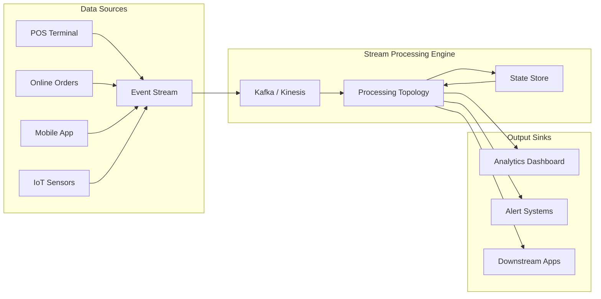
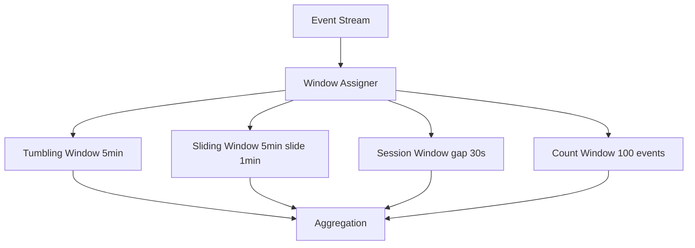
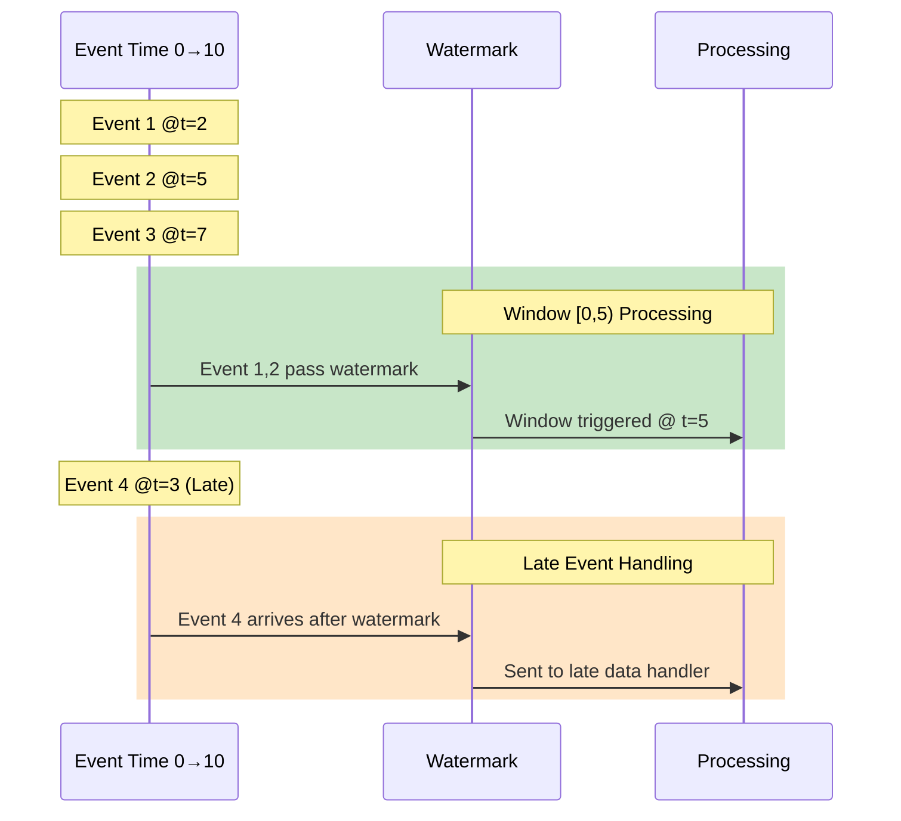
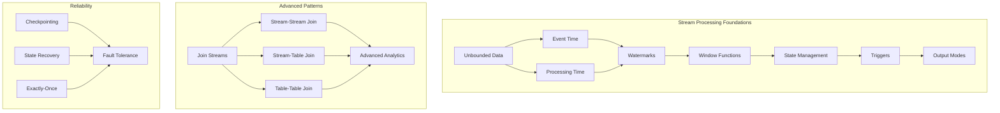
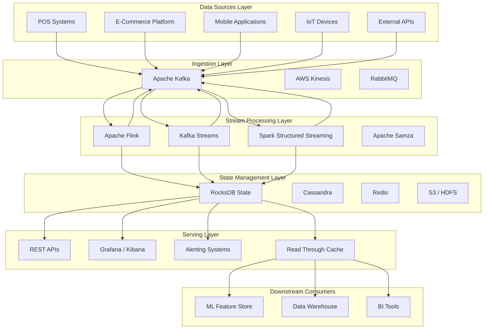
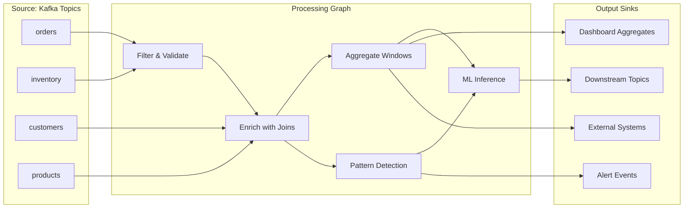
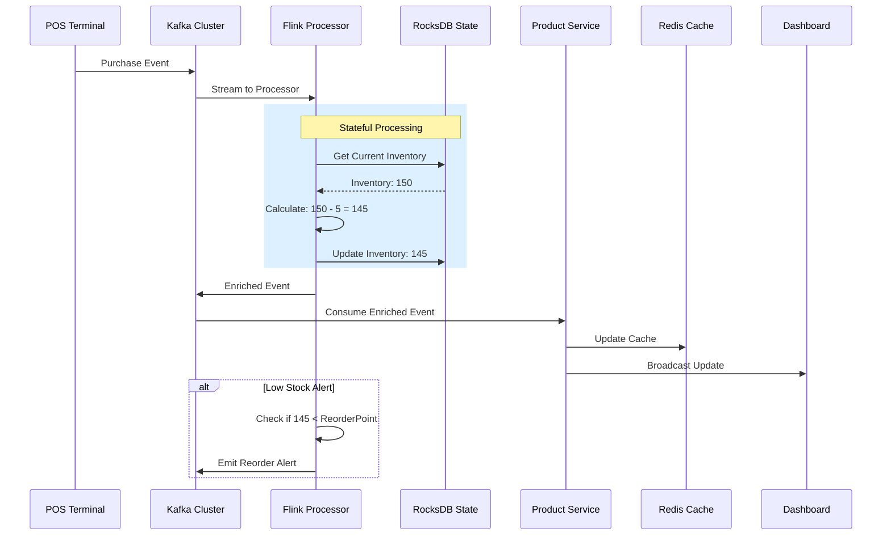
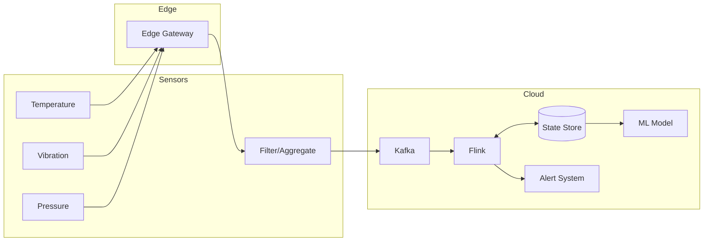

# Stream Processing

## 1. Overview

### What is Stream Processing?

Stream processing is a programming paradigm for processing unbounded sequences of data events in real-time as they arrive, rather than waiting to process bounded batches of data. It enables continuous computation where logic is applied to each data point or window of data points as they flow through a system, typically measured in milliseconds to seconds latency.

Stream processing frameworks provide:
- **Low-latency processing**: Results available within seconds or milliseconds of data arrival
- **Continuous queries**: Operations that run indefinitely on streaming data
- **Stateful computation**: Maintaining aggregate state across windows and events
- **Event-time processing**: Handling data based on when events actually occurred
- **Scalability**: Horizontal scaling across distributed clusters

### Why was it created?

Stream processing emerged from the need to process high-velocity data in real-time:

| Driver | Problem Solved |
|--------|----------------|
| Financial trading | Millisecond-level fraud detection |
| IoT sensor networks | Real-time monitoring and alerting |
| Social media | Trending topics and sentiment analysis |
| Web analytics | Live user behavior tracking |
| Telecommunications | Network traffic monitoring |

### What business problems does it solve?

Stream processing addresses critical enterprise challenges:

```
┌─────────────────────────────────────────────────────────────────┐
│                    BUSINESS PROBLEM SOLVER                        │
├─────────────────────────────────────────────────────────────────┤
│                                                                  │
│  REAL-TIME DECISION MAKING                                      │
│  ├── Fraud detection before transaction completes               │
│  ├── Dynamic pricing based on demand signals                     │
│  ├── Inventory alerts to prevent stockouts                       │
│  └── Personalized recommendations in-session                     │
│                                                                  │
│  OPERATIONAL EFFICIENCY                                         │
│  ├── Live monitoring reduces MTTR by 60-80%                      │
│  ├── Proactive maintenance prevents downtime                     │
│  ├── Automated responses eliminate manual intervention          │
│  └── Resource optimization in real-time                         │
│                                                                  │
│  CUSTOMER EXPERIENCE                                            │
│  ├── Instant feedback and notifications                          │
│  ├── Personalized interactions at scale                          │
│  ├── Seamless cross-channel consistency                          │
│  └── Reduced cart abandonment through timely offers             │
│                                                                  │
└─────────────────────────────────────────────────────────────────┘
```

**Real-world impact examples:**
- **Netflix**: Processes 500M+ events/day for real-time recommendations, reducing Churn by 4%
- **Uber**: Enables surge pricing with <1 second latency for demand signals
- **LinkedIn**: Power "People You May Know" and real-time job alerts with Kafka Streams
- **Pinterest**: Detects spam and abuse in under 100ms
- **Walmart**: Real-time inventory management saving $2B annually

### Why does the Enterprise Retail Streaming Platform use it?

This platform specifically requires stream processing for:

1. **Point-of-Sale Real-Time Analytics**
   - Sales aggregation by store, product, employee within seconds
   - Inventory depletion tracking and replenishment triggers
   - Customer loyalty point calculations

2. **Omnichannel Synchronization**
   - Consistent pricing across online and physical stores
   - Unified customer view across all touchpoints
   - Cross-channel cart and wishlist synchronization

3. **Supply Chain Visibility**
   - Real-time shipment tracking and ETA predictions
   - Supplier performance monitoring
   - Demand forecasting with fresh data inputs

4. **Customer Behavior Analysis**
   - Session tracking and funnel analysis
   - Product affinity and recommendation engines
   - Churn prediction and intervention triggers

---

## 2. Core Concepts

### The Stream Processing Paradigm



### Streaming vs Batch Processing

| Characteristic | Batch Processing | Stream Processing |
|----------------|------------------|-------------------|
| **Data Scope** | Bounded dataset | Unbounded sequence |
| **Latency** | Minutes to hours | Milliseconds to seconds |
| **Processing Trigger** | Time-based or size-based | Event-driven |
| **State Management** | Implicit in dataset | Explicit state stores |
| **Fault Tolerance** | Data replication | Checkpointing + replication |
| **Use Cases** | Reporting, ETL, ML training | Monitoring, alerting,实时 decisions |
| **Examples** | Hadoop MapReduce, Spark Batch | Kafka Streams, Flink, Spark Structured Streaming |

### Time Windows

Time windows group events for aggregate computation:



**Implementation Examples:**

```python
# Apache Flink - Tumbling Window
from pyflink.datastream import StreamExecutionEnvironment
from pyflink.table import StreamTableEnvironment

env = StreamExecutionEnvironment.get_execution_environment()
t_env = StreamTableEnvironment.create(env)

# Define a 5-minute tumbling window aggregation
result = t_env.sql_query("""
    SELECT 
        product_id,
        TUMBLE_START(event_time, INTERVAL '5' MINUTE) as window_start,
        SUM(quantity * unit_price) as total_sales,
        COUNT(*) as transaction_count
    FROM orders
    GROUP BY 
        product_id,
        TUMBLE(event_time, INTERVAL '5' MINUTE)
""")

# Apache Kafka Streams - Sliding Window
from kafka.streams import KafkaStreams
from kafka.streams.kstream import TimeWindows

# 5-minute window with 1-minute advance
windowed_counts = orders
    .groupByKey()
    .windowedBy(TimeWindows.of(Duration.ofMinutes(5))
                                 .advanceBy(Duration.ofMinutes(1)))
    .count()
```

### Watermarks

Watermarks handle late-arriving data in event-time processing:



**Watermark Strategies:**

```python
# Apache Flink - Watermark strategies

# 1. Fixed lag watermark (monotonically increasing with lag)
watermark_strategy = WatermarkStrategy \
    .forBoundedOutOfOrderness(Duration.ofSeconds(30)) \
    .withTimestampAssigner(TimestampAssignerSupplier.of(
        lambda: AscendingTimestampExtractor(lambda event: event.timestamp)
    ))

# 2. Periodic watermark (for data with gaps)
watermark_strategy = WatermarkStrategy \
    .forMonotonousTimestamps() \
    .withTimestampAssigner(SerializedTimestampAssigner)

# 3. Punctuated watermark (based on special markers)
watermark_strategy = WatermarkStrategy \
    .forGenerator(lambda: PunctuatedWatermarkGenerator()) \
    .withTimestampAssigner(TimestampAssigner)

# Handling late data
stream = stream \
    .assignTimestampsAndWatermarks(watermark_strategy) \
    .key_by(lambda e: e.product_id) \
    .window(TumblingEventTimeWindows.of(Time.minutes(5))) \
    .allowed_lateness(Time.minutes(2)) \      # Keep for 2 more minutes
    .side_output_late_data(LATE_TAG)           # Capture truly late events
```

### Stateful Processing

Stateful operators maintain information across events:

```mermaid
flowchart LR
    subgraph "Event 1: Purchase"
        A1[product_id: A] --> B1[State: {A: 1}]
        B1 --> C1[Output: 1]
    end
    
    subgraph "Event 2: Purchase"
        A2[product_id: A] --> B2[State: {A: 2}]
        B2 --> C2[Output: 2]
    end
    
    subgraph "Event 3: Purchase"
        A3[product_id: B] --> B3[State: {A: 2, B: 1}]
        B3 --> C3[Output: 1]
    end
    
    subgraph "Event 4: Purchase"
        A4[product_id: A] --> B4[State: {A: 3, B: 1}]
        B4 --> C4[Output: 3]
    end
```

**Stateful Processing Example:**

```python
# Kafka Streams - Stateful operations
from kafka.streams import KafkaStreams
from kafka.streams.kstream import Consumed, Produced

# Count purchases per product with state store
class PurchaseProcessor(Processor):
    def __init__(self):
        self.state_store = None
        
    def init(self, context):
        self.state_store = context.get_state_store("purchase_counts")
    
    def process(self, key, value):
        product_id = key
        purchase = json.loads(value)
        
        # Update state
        current_count = self.state_store.get(product_id) or 0
        new_count = current_count + 1
        self.state_store.put(product_id, new_count)
        
        # Emit enriched event
        output = {
            "product_id": product_id,
            "cumulative_purchases": new_count,
            "timestamp": purchase["timestamp"]
        }
        self.context.forward(key, json.dumps(output))

# Rich State Operations with TTL
from kafka.streams.state import RocksDBStore
from kafka.streams.kstream.internals import SourceNode

# State store with time-based cleanup
builder.add_state_store(
    Stores.builder()
        .with_rocksdb_capacity_based_autosizing("purchase_counts")
        .with_caching_enabled()
        .with_log_compaction_enabled()
        .build()
)
```

### Delivery Guarantees

| Guarantee | Description | Use Case | Implementation |
|-----------|-------------|----------|----------------|
| **At-most-once** | Event may be lost, never duplicated | Non-critical metrics | Fire-and-forget |
| **At-least-once** | Event never lost, may be duplicated | Most critical | Ack-based retry |
| **Exactly-once** | Event processed precisely once | Financial transactions | Idempotent + transactions |

```python
# Kafka Streams - Exactly-once processing

# Enable exactly-once semantics
kafka_streams = KafkaStreams(
    topology,
    config
)

# Enable exactly-once configuration
kafka_streams.configure({
    'processing.guarantee': 'exactly_once_v2',  # or 'exactly_once'
    'transactional.id': 'purchase-processor-1',
    'bootstrap.servers': 'kafka:9092'
})

# Idempotent producer for exactly-once
from kafka.producer import KafkaProducer

producer = KafkaProducer(
    bootstrap_servers=['kafka:9092'],
    enable_idempotence=True,  # Ensures exactly-once within producer
    acks='all',               # Wait for all replicas
    retries=Integer.MAX_VALUE,
    max_in_flight_requests_per_connection=1  # Maintain order
)
```

### Key Concepts Summary



---

## 3. Why This Project Uses It

### Platform Architecture Requirements

The Enterprise Retail Streaming Platform requires stream processing for its distributed, real-time nature:

```
┌────────────────────────────────────────────────────────────────────────┐
│                    PLATFORM STREAM PROCESSING REQUIREMENTS              │
├────────────────────────────────────────────────────────────────────────┤
│                                                                         │
│  MULTI-SOURCE DATA INGESTION                                            │
│  ├── POS terminals: 1000+ stores × 10 terminals = 10,000+ streams    │
│  ├── E-commerce platform: 50,000+ concurrent sessions                  │
│  ├── Mobile applications: Real-time beacon and location data           │
│  └── IoT devices: Smart shelves, digital signage, sensors              │
│                                                                         │
│  REAL-TIME BUSINESS LOGIC                                               │
│  ├── Sales aggregation: Sub-second visibility into revenue            │
│  ├── Inventory optimization: Automatic reorder triggers                │
│  ├── Customer 360: Unified profile updates within seconds              │
│  └── Loyalty engine: Point calculations and tier updates               │
│                                                                         │
│  TEMPORAL CONSISTENCY                                                    │
│  ├── Audit requirements: Immutable transaction logs                    │
│  ├── Regulatory compliance: Data lineage and traceability               │
│  ├── Historical analysis: Point-in-time corrections                    │
│  └── Time-series analytics: Trend detection and forecasting            │
│                                                                         │
└────────────────────────────────────────────────────────────────────────┘
```

### Critical Business Scenarios

**Scenario 1: Real-Time Inventory Management**

```python
# Stream processing pipeline for inventory
inventory_stream = (
    kafka_consumer
    .assignTimestampExtractor(CustomTimestampExtractor())
    .filter(lambda event: event.event_type == 'PURCHASE' or 
                           event.event_type == 'RETURN' or
                           event.event_type == 'SHIPMENT')
    .keyBy(lambda event: event.product_sku)
    .window(TumblingEventTimeWindows.of(Time.minutes(1)))
    .aggregate(
        InventoryAggregator(),
        InventoryWindowFunction()
    )
    .filter(lambda result: result.on_hand_quantity <= result.reorder_point)
    .peek(lambda result: trigger_reorder_alert(result))
)
```

**Why Stream Processing**: Inventory must reflect actual availability within seconds. Batch processing (even hourly) would result in overselling during peak periods, causing customer dissatisfaction and order cancellations.

**Scenario 2: Customer Loyalty Engine**

```python
# Real-time loyalty point calculation
loyalty_stream = (
    events
    .filter(lambda e: e.event_type in ['PURCHASE', 'REVIEW', 'REFERRAL'])
    .keyBy(lambda e: e.customer_id)
    .window(SessionWindows.withGap(Duration.ofMinutes(30)))
    .aggregate(
        LoyaltyAggregator(),
        emit_mode=EmitStrategy.onWaterMark
    )
    .process(LoyaltyEnrichment())
)
```

**Why Stream Processing**: Loyalty members expect instant point updates and tier status changes. A 5-minute delay in point posting would cause customer complaints and erode trust in the loyalty program.

**Scenario 3: Dynamic Pricing Engine**

```python
# Real-time pricing adjustments
pricing_stream = (
    events
    .connect(demand_signals)     # Join with real-time demand
    .connect(competitor_prices)  # Join with competitive data
    .keyBy(lambda e: e.product_category)
    .process(DynamicPricingFunction())
    .sink(kafka_producer)
)
```

**Why Stream Processing**: Pricing decisions must reflect current market conditions, competitor actions, and internal demand signals in real-time. Even a 5-minute delay could result in lost revenue or margin erosion.

### Comparison: Stream vs Alternative Approaches

| Approach | Latency | Throughput | Consistency | Implementation Cost |
|----------|---------|------------|-------------|---------------------|
| **Stream Processing** | <100ms | 1M+ events/sec | Exactly-once | Medium |
| **Polling/Micro-batch** | 1-60 sec | 100K events/sec | At-least-once | Low |
| **Full Batch** | Minutes-hours | 10M+ events/sec | Exactly-once | Low |
| **In-Memory Cache + Batch** | 100ms-1sec | 500K events/sec | Eventual | High |

---

## 4. Architecture Position

### Stream Processing in the Platform Stack



### Processing Topology



### Platform Component Interactions



---

## 5. Folder Structure

### Stream Processing Directory Organization

```
/stream-processing/
├── README.md
├── pom.xml                    # Maven/Gradle for JVM-based processors
├── requirements.txt           # Python dependencies
├── docker-compose.yml         # Local development cluster
├── config/
│   ├── development.yaml
│   ├── staging.yaml
│   ├── production.yaml
│   └── kafka/
│       ├── broker.conf
│       ├── topics.yaml        # Topic definitions
│       └── consumers.yaml     # Consumer group configs
├── src/
│   ├── main/
│   │   ├── java/
│   │   │   └── com/enterprise/retail/streaming/
│   │   │       ├── topology/     # Stream topologies
│   │   │       │   ├── OrderTopology.java
│   │   │       │   ├── InventoryTopology.java
│   │   │       │   └── LoyaltyTopology.java
│   │   │       ├── functions/    # Stream functions
│   │   │       │   ├── enrich/
│   │   │       │   │   ├── ProductEnricher.java
│   │   │       │   │   └── CustomerEnricher.java
│   │   │       │   ├── windows/
│   │   │       │   │   ├── SalesWindowFunction.java
│   │   │       │   │   └── SessionWindowFunction.java
│   │   │       │   └── patterns/
│   │   │       │       ├── FraudDetector.java
│   │   │       │       └── AbandonedCartDetector.java
│   │   │       ├── state/         # State management
│   │   │       │   ├── InventoryState.java
│   │   │       │   ├── LoyaltyState.java
│   │   │       │   └── checkpointing/
│   │   │       │       └── CheckpointCoordinator.java
│   │   │       ├── serializers/  # Custom serializers
│   │   │       │   ├── JsonSerializer.java
│   │   │       │   └── AvroSerializer.java
│   │   │       └── util/
│   │   │           ├── MetricsCollector.java
│   │   │           └── HealthCheck.java
│   │   └── resources/
│   │       ├── application.conf
│   │       └── flink/
│   │           └── flink-config.yaml
│   └── test/
│       ├── java/
│       │   └── com/enterprise/retail/streaming/
│       │       ├── topology/
│       │       │   └── OrderTopologyTest.java
│       │       ├── functions/
│       │       │   ├── enrich/
│       │       │   │   └── ProductEnricherTest.java
│       │       │   └── windows/
│       │       │       └── SalesWindowFunctionTest.java
│       │       └── integration/
│       │           └── KafkaIntegrationTest.java
│       └── resources/
│           ├── test-events.json
│           └── test-state.json
├── python/
│   ├── kafka_streams_app.py     # Python Kafka Streams application
│   ├── flink_python_job.py      # PyFlink job
│   └── connectors/
│       ├── kafka_connector.py
│       └── kinesis_connector.py
├── sql/
│   ├── ksql/
│   │   ├── create_streams.ksql
│   │   ├── create_tables.ksql
│   │   └── queries/
│   │       ├── sales_aggregation.sql
│   │       └── inventory_alerts.sql
│   └── flink_sql/
│       ├── source_definitions.sql
│       └── sink_definitions.sql
├── monitoring/
│   ├── prometheus/
│   │   └── stream_metrics.yml
│   ├── grafana/
│   │   ├── dashboards/
│   │   │   ├── stream_health.json
│   │   │   ├── lag_dashboard.json
│   │   │   └── latency_heatmap.json
│   │   └── alerts/
│   │       ├── high_lag_alert.yml
│   │       └── processing_delay_alert.yml
│   └── datadog/
│       └── stream_monitors.py
├── kubernetes/
│   ├── flink/
│   │   ├── jobmanager-deployment.yaml
│   │   ├── taskmanager-deployment.yaml
│   │   └── job-service.yaml
│   └── kafka-streams/
│       ├── statefulset.yaml
│       └── service.yaml
└── scripts/
    ├── local_setup.sh
    ├── topic_creation.sh
    ├── consumer_offsets.sh
    ├── lag_check.sh
    └── state_cleanup.sh
```

### Key File Purposes

| File/Folder | Purpose |
|-------------|---------|
| `topology/` | Defines the stream processing DAG (directed acyclic graph) |
| `functions/` | Reusable processing functions (map, filter, aggregate, join) |
| `state/` | State store implementations for stateful processing |
| `windows/` | Time-window and session-window definitions |
| `patterns/` | Complex event processing patterns (CEP) implementations |
| `ksql/` | KSQL/KSQLDB continuous queries for stream processing |
| `flink_sql/` | Flink SQL for declarative stream processing |
| `monitoring/` | Prometheus metrics, Grafana dashboards, alerting rules |

---

## 6. Implementation Walkthrough

### Basic Stream Processing Pattern

```python
# Apache Kafka Streams - Basic word count topology
from kafka import KafkaConsumer, KafkaProducer
from kafka.structs import TopicPartition
import json

class SalesAggregationTopology:
    """
    Real-time sales aggregation by product and store.
    Demonstrates core stream processing patterns.
    """
    
    def __init__(self, bootstrap_servers):
        self.bootstrap_servers = bootstrap_servers
        self.consumer = KafkaConsumer(
            'raw-pos-transactions',
            bootstrap_servers=bootstrap_servers,
            value_deserializer=lambda m: json.loads(m.decode('utf-8')),
            consumer_timeout_ms=1000
        )
        self.producer = KafkaProducer(
            'enriched-sales',
            bootstrap_servers=bootstrap_servers,
            value_serializer=lambda m: json.dumps(m).encode('utf-8')
        )
        
        # In-memory state store (use RocksDB in production)
        self.product_sales = {}
        self.store_sales = {}
        
    def process(self, transaction):
        """
        Process a single POS transaction.
        """
        # Extract fields
        store_id = transaction['store_id']
        product_id = transaction['product_id']
        quantity = transaction['quantity']
        unit_price = transaction['unit_price']
        timestamp = transaction['event_time']
        
        # Update product aggregates
        product_key = f"{product_id}"
        if product_key not in self.product_sales:
            self.product_sales[product_key] = {
                'product_id': product_id,
                'total_quantity': 0,
                'total_revenue': 0.0,
                'last_updated': None
            }
        
        self.product_sales[product_key]['total_quantity'] += quantity
        self.product_sales[product_key]['total_revenue'] += quantity * unit_price
        self.product_sales[product_key]['last_updated'] = timestamp
        
        # Update store aggregates
        store_key = f"{store_id}"
        if store_key not in self.store_sales:
            self.store_sales[store_key] = {
                'store_id': store_id,
                'total_transactions': 0,
                'total_revenue': 0.0
            }
        
        self.store_sales[store_key]['total_transactions'] += 1
        self.store_sales[store_key]['total_revenue'] += quantity * unit_price
        
        # Emit enriched event
        enriched_event = {
            'original_event': transaction,
            'aggregates': {
                'product': self.product_sales[product_key],
                'store': self.store_sales[store_key]
            },
            'processed_at': self.get_current_time()
        }
        
        self.producer.send('enriched-sales', enriched_event)
        return enriched_event
    
    def get_current_time(self):
        from datetime import datetime, timezone
        return datetime.now(timezone.utc).isoformat()
```

### Time Window Examples

```python
# Apache Flink - Time window aggregations
from pyflink.datastream import StreamExecutionEnvironment
from pyflink.datastream.functions import MapFunction
from pyflink.table import StreamTableEnvironment, DataTypes
from pyflink.table.udf import udf
from datetime import datetime, timedelta

env = StreamExecutionEnvironment.get_execution_environment()
t_env = StreamTableEnvironment.create(env)

# Set checkpointing for fault tolerance
env.enable_checkpointing(60000)  # Checkpoint every 60 seconds
env.get_config().set_auto_watermark_interval(5000)  # Watermark every 5s

class TransactionMapper(MapFunction):
    """Map raw transaction to enriched event with timestamps."""
    
    def map(self, value):
        import json
        event = json.loads(value)
        return (
            event['product_id'],
            event['store_id'],
            event['quantity'] * event['unit_price'],
            datetime.fromisoformat(event['event_time'])
        )

# Tumbling Window - Fixed, non-overlapping windows
def tumbling_window_sales():
    """
    5-minute tumbling window: Calculate sales per product.
    Each event belongs to exactly one window.
    """
    query = """
    SELECT 
        product_id,
        TUMBLE_START(row_time, INTERVAL '5' MINUTE) AS window_start,
        TUMBLE_END(row_time, INTERVAL '5' MINUTE) AS window_end,
        SUM(revenue) AS total_revenue,
        COUNT(*) AS transaction_count,
        AVG(revenue) AS avg_transaction_value
    FROM transactions
    GROUP BY 
        product_id,
        TUMBLE(row_time, INTERVAL '5' MINUTE)
    """
    return t_env.sql_query(query)

# Sliding Window - Overlapping windows with configurable slide
def sliding_window_sales():
    """
    Sliding window: 5-minute window with 1-minute slide.
    Events contribute to multiple overlapping windows.
    """
    query = """
    SELECT 
        product_id,
        HOP_START(row_time, INTERVAL '1' MINUTE, INTERVAL '5' MINUTE) AS window_start,
        HOP_END(row_time, INTERVAL '1' MINUTE, INTERVAL '5' MINUTE) AS window_end,
        SUM(revenue) AS total_revenue,
        SUM(quantity) AS total_units
    FROM transactions
    GROUP BY 
        product_id,
        HOP(row_time, INTERVAL '1' MINUTE, INTERVAL '5' MINUTE)
    """
    return t_env.sql_query(query)

# Session Window - Activity-based windows
def session_window_analysis():
    """
    Session window: Group events by activity gap.
    Window expands while activity continues, closes after gap.
    """
    query = """
    SELECT 
        customer_id,
        SESSION_START(row_time, INTERVAL '5' MINUTE) AS session_start,
        SESSION_END(row_time, INTERVAL '5' MINUTE) AS session_end,
        COUNT(*) AS action_count,
        SUM(revenue) AS session_value,
        COUNT(DISTINCT product_id) AS unique_products
    FROM customer_events
    GROUP BY 
        customer_id,
        SESSION(row_time, INTERVAL '5' MINUTE)
    """
    return t_env.sql_query(query)

# Count Window - Fixed count-based windows
def count_window_analysis():
    """
    Process every 100 transactions, regardless of time.
    Useful for high-volume streams where time windows cause late aggregation.
    """
    # In Kafka Streams, count windows are implemented differently
    from kafka.streams.kstream import CountWindows
    
    count_window = CountWindows.of(100).until(1000)  # 100 events, keep for 1000 windows
    
    return transactions \
        .groupByKey() \
        .windowedBy(count_window) \
        .count()
```

### Stateful Processing with Joins

```python
# Stream-to-Stream Join
def stream_to_stream_join():
    """
    Join two streams in real-time.
    Example: Join page views with user login events.
    """
    from pyflink.table import StreamTableEnvironment
    
    # Define streams
    page_views = t_env.from_path("page_views")
    user_logins = t_env.from_path("user_logins")
    
    # Temporal stream-to-stream join
    joined = page_views.join(user_logins) \
        .where("user_id = user_id") \
        .where("page_time BETWEEN login_time AND login_time + INTERVAL '30' MINUTE") \
        .select("""
            page_views.user_id,
            page_views.page_url,
            page_views.page_time,
            user_logins.login_location
        """)
    
    return joined

# Stream-to-Table Join (Lookup Join)
def stream_to_table_join():
    """
    Enrich stream events with reference data.
    Example: Enrich product sales with product details.
    """
    products_table = t_env.from_path("products")
    
    enriched_sales = t_env.sql_query("""
        SELECT 
            s.product_id,
            s.quantity,
            s.revenue,
            p.product_name,
            p.category,
            p.supplier_id,
            p.cost_price
        FROM sales s
        JOIN products FOR SYSTEM_TIME AS OF s.row_time AS p
            ON s.product_id = p.product_id
    """)
    
    return enriched_sales

# Kafka Streams - Interactive Queries for State Access
def interactive_queries():
    """
    Expose state store contents via REST API for interactive queries.
    """
    from kafka.streams import KafkaStreams
    from kafka.streams.state import Stores
    
    streams = KafkaStreams(
        topology,
        config
    )
    
    # Build state store with RocksDB
    builder = KafkaStreams.Builder()
    builder.add_state_store(
        Stores.builder()
            .with_rocksdb("product-inventory")
            .with_key_value_store("inventory")
            .build()
    )
    
    # Enable interactive queries
    streams.setStateListener(lambda new_state, old_state: {
        if new_state == KafkaStreams.State.RUNNING:
            print("State store ready for queries")
    })
    
    # Query state store directly
    def get_inventory(product_id):
        store = streams.store("product-inventory")
        return store.get(product_id)
    
    return get_inventory
```

### Complex Event Processing Patterns

```python
# Apache Flink - Pattern Detection with CEP Library
from pyflink.cep import Pattern
from pyflink.cep.pattern import Pattern
from pyflink.datastream import StreamExecutionEnvironment
from pyflink.datastream.functions import ProcessFunction
import json

class FraudDetectionPattern:
    """
    Detect fraudulent purchase patterns using CEP.
    """
    
    @staticmethod
    def define_fraud_pattern():
        """
        Pattern: 3 high-value purchases within 10 minutes
        followed by a shipping address change.
        """
        pattern = Pattern.begin("high_value_purchase") \
            .where(lambda event: event['amount'] > 1000) \
            .times(3) \
            .within(Duration.ofMinutes(10)) \
            .followed_by("address_change") \
            .where(lambda event: event['change_type'] == 'SHIPPING_ADDRESS') \
            .within(Duration.ofMinutes(5))
        
        return pattern
    
    @staticmethod
    def define_abandoned_cart_pattern():
        """
        Pattern: Product added to cart, viewed again within 5 min,
        but never purchased within 2 hours.
        """
        pattern = Pattern.begin("cart_add") \
            .where(lambda event: event['action'] == 'ADD_TO_CART') \
            .followed_by("product_view") \
            .where(lambda event: event['action'] == 'PRODUCT_VIEW') \
            .within(Duration.ofMinutes(5)) \
            .not_followed_by("purchase") \
            .where(lambda event: event['action'] == 'PURCHASE') \
            .within(Duration.ofHours(2))
        
        return pattern

class AlertProcessFunction(ProcessFunction):
    """Process matched fraud patterns and emit alerts."""
    
    def process_element(self, pattern_match, ctx: 'ProcessFunction.Context'):
        events = pattern_match
        
        alert = {
            'alert_type': 'FRAUD_DETECTED',
            'customer_id': events['high_value_purchase'][0]['customer_id'],
            'confidence': 0.85,
            'pattern': 'MULTIPLE_HIGH_VALUE_ADDRESS_CHANGE',
            'events': [
                events['high_value_purchase'][0],
                events['high_value_purchase'][1],
                events['high_value_purchase'][2],
                events['address_change']
            ],
            'recommended_action': 'MANUAL_REVIEW'
        }
        
        yield alert
```

---

## 7. Production Best Practices

### Cluster Configuration

```yaml
# Flink Cluster Configuration (flink-conf.yaml)
cat << 'EOF' > flink-config.yaml
# Cluster
taskmanager.numberOfTaskSlots: 4
parallelism.default: 2

# Memory Management
taskmanager.memory.process.size: 4096m
taskmanager.memory.managed.size: 1024m
jobmanager.memory.process.size: 2048m

# Checkpointing
execution.checkpointing.interval: 60000
execution.checkpointing.timeout: 600000
execution.checkpointing.min-pause: 30000
execution.checkpointing.max-concurrent-checkpoints: 1
execution.checkpointing.externalized-checkpoint-cleanup: RETAIN_ON_CANCELLATION

# State Backend
state.backend: rocksdb
state.backend.incremental: true
state.checkpoints.dir: s3://your-bucket/checkpoints
state.savepoints.dir: s3://your-bucket/savepoints

# RocksDB Options
state.backend.rocksdb.memory.managed: true
state.backend.rocksdb.memory.managed.fraction: 0.4
state.backend.rocksdb.checkpoint.transfer.thread.num: 2

# Network Buffer
taskmanager.network.memory.fraction: 0.15
taskmanager.network.memory.min: 128mb
taskmanager.network.memory.max: 1024mb

# Watermark
pipeline.auto-watermark-interval: 5000
execution.buffer-timeout: 100

# REST API
rest.port: 8081
rest.bind-port: 8081
rest.address: 0.0.0.0
EOF
```

### Kafka Configuration for Stream Processing

```properties
# Producer Configuration
bootstrap.servers=kafka-broker-1:9092,kafka-broker-2:9092,kafka-broker-3:9092
acks=all
retries=2147483647
max.in.flight.requests.per.connection=5
enable.idempotence=true
transactional.id=${STREAM_PROCESSOR_ID}
transaction.timeout.ms=10000

# Performance tuning
batch.size=16384
linger.ms=5
compression.type=lz4
buffer.memory=33554432

# Consumer Configuration  
bootstrap.servers=kafka-broker-1:9092,kafka-broker-2:9092,kafka-broker-3:9092
group.id=inventory-stream-processor
auto.offset.reset=earliest
enable.auto.commit=false
isolation.level=read_committed

# Exactly-once consumer
isolation.level=read_committed
max.poll.interval.ms=300000
session.timeout.ms=10000
heartbeat.interval.ms=3000
EOF
```

### Operational Best Practices

| Practice | Description | Impact |
|----------|-------------|--------|
| **Checkpoint Frequently** | Enable checkpointing every 60s | Fast recovery from failures |
| **Use RocksDB State Backend** | Local SSD + incremental checkpoints | High throughput state |
| **Monitor Consumer Lag** | Alert when lag > 10000 events | Prevent data loss |
| **Size Task Slots Properly** | 1 slot per 2 cores | Optimal resource utilization |
| **Configure Late Data Handling** | allowedLateness + sideOutput | Complete results |
| **Use Schema Registry** | Avro/Protobuf for serialization | Schema evolution safety |
| **Implement Idempotent Sinks** | Deduplicate at sink | Exactly-once semantics |

### Deployment Checklist

```bash
#!/bin/bash
# deployment_checklist.sh

echo "=== Stream Processing Deployment Checklist ==="

# 1. Validate configuration
echo "[1/10] Validating configuration files..."
if [ ! -f "config/production.yaml" ]; then
    echo "ERROR: Missing production.yaml"
    exit 1
fi

# 2. Check Kafka connectivity
echo "[2/10] Checking Kafka connectivity..."
kafka-broker-list=$(grep bootstrap.servers config/production.yaml | cut -d: -f2)
timeout 5 bash -c "cat < /dev/tcp/$kafka-broker-list/9092" 2>/dev/null
if [ $? -ne 0 ]; then
    echo "ERROR: Cannot connect to Kafka"
    exit 1
fi

# 3. Verify topic exists with correct partitions
echo "[3/10] Verifying Kafka topics..."
required_topics=("raw-pos-transactions" "inventory-updates" "customer-events")
for topic in "${required_topics[@]}"; do
    kafka-topics --describe --topic $topic 2>/dev/null
    if [ $? -ne 0 ]; then
        echo "WARNING: Topic $topic does not exist"
    fi
done

# 4. Check state backend connectivity
echo "[4/10] Checking state backend..."
curl -s "http://rocksdb-host:9090/stats" | grep -q "ok"
if [ $? -ne 0 ]; then
    echo "WARNING: RocksDB health check failed"
fi

# 5. Validate serialization schemas
echo "[5/10] Validating schemas..."
curl -s "http://schema-registry:8081/subjects" | grep -q "product-events"
if [ $? -ne 0 ]; then
    echo "WARNING: Missing schema registration"
fi

# 6. Calculate resource requirements
echo "[6/10] Calculating resources..."
parallelism=$(grep parallelism.default config/production.yaml | cut -d: -f2)
task_slots=$(grep taskmanager.numberOfTaskSlots config/production.yaml | cut -d: -f2)
echo "Parallelism: $parallelism, Task Slots: $task_slots"

# 7. Verify checkpoint directory
echo "[7/10] Verifying checkpoint directory..."
checkpoint_dir=$(grep state.checkpoints.dir config/production.yaml | cut -d: -f2)
echo "Checkpoint dir: $checkpoint_dir"

# 8. Test consumer group offset reset
echo "[8/10] Checking consumer group offsets..."
kafka-consumer-groups --describe --group inventory-processor 2>/dev/null

# 9. Configure alerting
echo "[9/10] Setting up alerting..."
grep -q "lag_alert_threshold" monitoring/prometheus/stream_metrics.yml
if [ $? -ne 0 ]; then
    echo "WARNING: Missing lag alert configuration"
fi

# 10. Backup state stores
echo "[10/10] Backing up state stores..."
date_stamp=$(date +%Y%m%d_%H%M%S)
tar -czf "state_backup_$date_stamp.tar.gz" /state/stores/

echo "=== Deployment Checklist Complete ==="
```

---

## 8. Common Problems

### Problem Diagnosis Table

| Problem | Symptom | Root Cause | Solution |
|---------|---------|------------|----------|
| **Consumer Lag Growing** | Lag metric > threshold | Slow consumer or burst | Increase partitions, add consumers, optimize processing |
| **Late Data Events** | Watermark not advancing | Upstream delay | Adjust watermark strategy, increase allowedLateness |
| **State Store Corruption** | Checkpoint restore failures | Dirty shutdown | Enable incremental checkpoints, use RocksDB |
| **Duplicate Events** | Counters incrementing twice | At-least-once delivery | Add idempotency keys, deduplicate at sink |
| **Memory Pressure** | OOM kills, GC pauses | Large state, no TTL | Partition state, enable RocksDB memory management |
| **Watermark Stalling** | Windows never triggering | No new events with timestamps | Use periodic watermark emission |
| **Out-of-Order Events** | Incorrect window results | Network latency | Use bounded out-of-orderness watermark |
| **Serialization Errors** | Cannot deserialize event | Schema mismatch | Update Schema Registry, use schema evolution |
| **Rebalance Storms** | Consumer group resetting | Long poll timeout | Increase session.timeout.ms, optimize processing time |
| **Checkpoint Timeout** | Checkpoints failing | Slow state backend | Use incremental checkpoints, faster storage |

### Detailed Solutions

```python
# Problem 1: Consumer Lag Growing
# Solution: Scale consumers and optimize processing

# Increase partitions (requires topic recreation)
kafka-topics --alter --topic raw-pos-transactions --partitions 100

# Add consumer to parallel processing
consumer_config = {
    'bootstrap.servers': 'kafka:9092',
    'group.id': 'inventory-processor-v2',
    'max.poll.records': 500,          # Reduce batch size
    'fetch.min.bytes': 1024,           # Increase fetch efficiency
    'fetch.max.wait.ms': 500,          # Reduce latency
    'session.timeout.ms': 30000,      # Prevent rebalances
}

# Problem 2: Late Data Handling
# Solution: Configure watermark strategy and late data handling

from pyflink.datastream import WatermarkStrategy
from pyflink.datastream.functions import ProcessFunction
from pyflink.util import Duration

# Bounded out-of-orderness watermark
watermark_strategy = WatermarkStrategy \
    .forBoundedOutOfOrderness(Duration.ofSeconds(30)) \
    .withTimestampAssigner(
        TimestampAssignerSupplier.of(
            lambda: PeriodicTimestampAssigner()
        )
    )

# Configure window with late data handling
stream = stream \
    .assignTimestampsAndWatermarks(watermark_strategy) \
    .key_by(lambda e: e.product_id) \
    .window(TumblingEventTimeWindows.of(Time.minutes(5))) \
    .allowed_lateness(Time.minutes(2)) \           # Keep for 2 more minutes
    .side_output_late_data(LATE_DATA_TAG)          # Capture truly late events

# Problem 3: State Store Performance
# Solution: Optimize RocksDB configuration

# RocksDB tuning
rocksdb_config = {
    'state.backend.rocksdb.memory.managed': 'true',
    'state.backend.rocksdb.memory.managed.fraction': '0.4',
    'state.backend.rocksdb.compaction.level.max-size-level.base': '268435456',
    'state.backend.rocksdb.checkpoint.transfer.thread.num': '4',
    'state.backend.rocksdb.writebuffer.size': '134217728',
    'state.backend.rocksdb.max.writebuffer.number': '4',
}

# Problem 4: Memory Management
# Solution: Enable state TTL and memory monitoring

from pyflink.datastream import StateTtlConfig

# Enable TTL for state (auto-cleanup)
ttl_config = StateTtlConfig \
    .new_builder(Time.minutes(60)) \
    .set_update_type(StateTtlConfig.UpdateType.OnReadAndWrite) \
    .setStateVisibility(StateTtlConfig.StateVisibility.NeverReturnExpired) \
    .cleanupIncrementallyInRocksdb() \
    .build()

state_descriptor = ValueStateDescriptor("purchase_count", IntSerializer)
state_descriptor.enable_time_to_live(ttl_config)
```

---

## 9. Performance Optimization

### Throughput Optimization

```python
# Kafka Streams - High-throughput configuration
high_throughput_config = {
    # Parallelism
    'num.stream.threads': 8,
    'processing.guarantee': 'at_least_once',  # Faster than exactly_once
    
    # Batching
    'cache.max.bytes.buffering': 104857600,   # 100MB cache
    'commit.interval.ms': 1000,              # Commit every second
    
    # Consumer tuning
    'max.poll.records': 1000,
    'fetch.min.bytes': 524288,               # 512KB min fetch
    'fetch.max.wait.ms': 500,
    
    # Producer tuning
    'batch.size': 65536,                      # 64KB batch size
    'linger.ms': 10,                         # Small linger for batching
    'buffer.memory': 134217728,               # 128MB buffer
    'compression.type': 'snappy',
}

# Flink - Parallelism and resource allocation
def optimize_flink_job():
    """
    Flink job optimization strategies.
    """
    env = StreamExecutionEnvironment.get_execution_environment()
    
    # Set parallelism
    env.set_parallelism(8)
    
    # Enable operator chaining
    env.disable_operator_chaining()  # Disable when debugging
    
    # Configure memory
    env.config.set_taskmanager_memory_process_size(TaskManagerMemory(4096))
    env.config.set_taskmanager_memory_fraction(0.7)
    
    # Use incremental checkpointing
    env.enable_checkpointing(60000, CheckpointingMode.EXACTLY_ONCE)
    env.get_checkpoint_config().set_min_pause_between_checkpoints(30000)
    
    return env
```

### Latency Optimization

```python
# Low-latency processing configuration
low_latency_config = {
    # Flink
    'execution.checkpointing.interval': 10000,     # 10 second checkpoints
    'execution.checkpointing.mode': 'AT_LEAST_ONCE',
    'execution.checkpointing.timeout': 600000,
    
    # Kafka
    'bootstrap.servers': 'kafka:9092',
    'linger.ms': 0,                               # No batching delay
    'max.block.ms': 100,                         # Short block on full buffer
    
    # Consumer
    'enable.auto.commit': False,
    'max.poll.interval.ms': 300000,
    'session.timeout.ms': 10000,
}

# Pipelined execution for low latency
env = StreamExecutionEnvironment.get_execution_environment()
env.get_config().set_auto_watermark_interval(1000)  # 1 second watermark
env.set_restart_strategy(RestartStrategies.failure_rate_restart(
    max_failures_per_interval=3,
    failure_interval=datetime.timedelta(minutes=5),
    delay=datetime.timedelta(seconds=10)
))
```

### Resource Sizing Guidelines

```python
# Resource calculation formulas

def calculate_stream_processing_resources():
    """
    Calculate required resources for stream processing.
    """
    
    # Input parameters
    events_per_second = 50000          # Peak events/second
    avg_event_size_bytes = 512         # Average event size
    processing_time_per_event_ms = 10  # Processing latency budget
    replication_factor = 3
    checkpoint_interval_ms = 60000
    
    # Throughput calculation
    peak_throughput_mbps = (events_per_second * avg_event_size_bytes) / (1024 * 1024)
    print(f"Peak throughput: {peak_throughput_mbps:.2f} MB/s")
    
    # Kafka partition calculation
    # Rule: 1 partition per 10MB/s throughput for low latency
    partitions_needed = int(peak_throughput_mbps / 10) + 1
    print(f"Recommended Kafka partitions: {partitions_needed}")
    
    # Consumer parallelization
    # Rule: 1 consumer thread per partition for max throughput
    consumer_threads = partitions_needed
    print(f"Consumer threads: {consumer_threads}")
    
    # Flink TaskManager sizing
    # Rule: 1 slot per 2 cores, 1GB memory per slot
    cores_per_slot = 2
    memory_mb_per_slot = 2048
    
    # Calculate based on processing time budget
    # If processing_time_per_event < 10ms, you can have higher parallelism
    recommended_parallelism = int(processing_time_per_event_ms / 5) * partitions_needed
    print(f"Recommended Flink parallelism: {recommended_parallelism}")
    
    # State store sizing
    # Rule: Estimate state size * 2 for RocksDB overhead
    estimated_state_size_gb = 10  # Based on cardinality estimate
    state_store_memory_gb = estimated_state_size_gb * 2
    print(f"State store memory: {state_store_memory_gb} GB")
    
    # Network buffer sizing
    network_buffer_mb = (recommended_parallelism * 16)  # 16MB per parallelism
    print(f"Network buffer: {network_buffer_mb} MB")
    
    return {
        'kafka_partitions': partitions_needed,
        'consumer_threads': consumer_threads,
        'flink_parallelism': recommended_parallelism,
        'taskmanager_memory_gb': state_store_memory_gb,
        'network_buffer_mb': network_buffer_mb
    }
```

---

## 10. Security

### Authentication and Authorization

```yaml
# Kafka Security Configuration
security.protocol: SASL_SSL
sasl.mechanism: SCRAM-SHA-512
sasl.jaas.config: |
  org.apache.kafka.common.security.scram.ScramLoginModule required
    username="stream-processor"
    password="${ENV:KAFKA_SCRAM_PASSWORD}";

# SSL Configuration
ssl.endpoint.identification.algorithm: https
ssl.truststore.location: /etc/kafka/secrets/kafka.truststore
ssl.truststore.password: ${ENV:SSL_TRUSTSTORE_PASSWORD}
ssl.keystore.location: /etc/kafka/secrets/kafka.keystore
ssl.keystore.password: ${ENV:SSL_KEYSTORE_PASSWORD}

# Authorization - ACLs
kafka-acls --authorizer-properties zookeeper.connect=zookeeper:2181
kafka-acls --add --allow-principal User:stream-processor \
  --operation Read --topic raw-pos-transactions
kafka-acs --add --allow-principal User:stream-processor \
  --operation Write --topic enriched-sales
```

```yaml
# Flink Security Configuration
security:
  sasl:
    mechanism: SCRAM-SHA-512
    login:
      handler: org.apache.kafka.common.security.scram.internals
      login-module: org.apache.kafka.common.security.scram.ScramLoginModule
  ssl:
    enabled: true
    truststore: /opt/flink/secrets/truststore.jks
    keystore: /opt/flink/secrets/keystore.jks
```

### Data Protection

```python
# PII handling in stream processing

class PIIRedactingFunction(MapFunction):
    """
    Redact PII from streaming data.
    """
    
    PII_FIELDS = [
        'credit_card_number',
        'ssn',
        'email',
        'phone_number',
        'address'
    ]
    
    def map(self, event):
        import copy
        redacted = copy.deepcopy(event)
        
        for field in self.PII_FIELDS:
            if field in redacted:
                redacted[field] = self._redact(redacted[field])
        
        return redacted
    
    def _redact(self, value):
        if not value:
            return value
        value_str = str(value)
        if len(value_str) <= 4:
            return '****'
        return value_str[:2] + '*' * (len(value_str) - 4) + value_str[-2:]
```

### Network Security

```yaml
# Kubernetes Network Policies for Stream Processing
apiVersion: networking.k8s.io/v1
kind: NetworkPolicy
metadata:
  name: flink-stream-processor
spec:
  podSelector:
    matchLabels:
      app: flink-stream-processor
  policyTypes:
    - Ingress
    - Egress
  ingress:
    - from:
        - podSelector:
            matchLabels:
              app: kafka
      ports:
        - protocol: TCP
          port: 9092
  egress:
    - to:
        - podSelector:
            matchLabels:
              app: kafka
        - podSelector:
            matchLabels:
              app: rocksdb
      ports:
        - protocol: TCP
          port: 9090
    - to:
        - namespaceSelector:
            matchLabels:
              name: monitoring
      ports:
        - protocol: TCP
          port: 9090
```

---

## 11. Monitoring

### Key Metrics

```yaml
# Prometheus metrics for stream processing
metrics:
  # Kafka Consumer Metrics
  kafka_consumer_records_lag_max:
    description: Maximum lag in records across partitions
    threshold: 10000
    severity: warning
    
  kafka_consumer_fetch_manager_records_consumed_total:
    description: Total records consumed
    threshold: N/A
    severity: info
    
  kafka_consumer_fetch_manager_records_per_request_avg:
    description: Average records per fetch request
    threshold: < 10 (indicates issues)
    severity: warning

  # Kafka Streams Metrics
  kafka_streams_processing_lateness_seconds:
    description: Time difference between event-time and processing-time
    threshold: 300  # 5 minutes
    severity: warning
    
  kafka_streams_task_execution_latency_avg_seconds:
    description: Average task execution latency
    threshold: 1000  # milliseconds
    severity: warning

  # Flink Metrics
  flink_taskmanager_Status_JVM_GarbageCollector_Collection_Time:
    description: GC time - indicates memory pressure
    threshold: 10000  # ms
    severity: warning
    
  flink_taskmanager_Status_JVM_Memory_Heap_Used:
    description: Heap memory usage
    threshold: "80%"  # of total heap
    severity: warning
    
  flink_taskmanager_Status_Network_TaskQueueLength:
    description: Input channel queue length
    threshold: 100
    severity: warning

  # Custom Business Metrics
  stream_processing_events_per_second:
    description: Throughput of processing
    threshold: < 1000 (after expected spike)
    severity: warning
    
  stream_processing_latency_p99_seconds:
    description: 99th percentile latency
    threshold: 5  # seconds
    severity: critical
```

### Grafana Dashboard Configuration

```json
{
  "dashboard": {
    "title": "Stream Processing Health",
    "panels": [
      {
        "title": "Consumer Lag",
        "type": "graph",
        "targets": [
          {
            "expr": "kafka_consumer_records_lag_max{group='inventory-processor'}",
            "legendFormat": "{{topic}} - {{partition}}"
          }
        ],
        "alert": {
          "conditions": [
            {
              "evaluator": {"type": "gt", "params": [10000]},
              "operator": {"type": "and"},
              "query": {"params": ["A"]}
            }
          ],
          "name": "High Consumer Lag Alert",
          "message": "Consumer lag exceeds 10,000 events on {{labels.partition}}"
        }
      },
      {
        "title": "Processing Latency (p50, p95, p99)",
        "type": "graph",
        "targets": [
          {
            "expr": "histogram_quantile(0.50, rate(stream_processing_latency_seconds_bucket[5m]))",
            "legendFormat": "p50"
          },
          {
            "expr": "histogram_quantile(0.95, rate(stream_processing_latency_seconds_bucket[5m]))",
            "legendFormat": "p95"
          },
          {
            "expr": "histogram_quantile(0.99, rate(stream_processing_latency_seconds_bucket[5m]))",
            "legendFormat": "p99"
          }
        ]
      },
      {
        "title": "Throughput (Events/Second)",
        "type": "graph",
        "targets": [
          {
            "expr": "rate(kafka_consumer_fetch_manager_records_consumed_total[1m])",
            "legendFormat": "{{topic}}"
          }
        ]
      },
      {
        "title": "State Store Size",
        "type": "graph",
        "targets": [
          {
            "expr": "flink_taskmanager_Status_JVM_Memory_Heap_Used{job='state-store'}",
            "legendFormat": "Heap Used"
          },
          {
            "expr": "rocksdb_state_store_size_bytes",
            "legendFormat": "RocksDB Size"
          }
        ]
      }
    ]
  }
}
```

### Alert Rules

```yaml
# Prometheus Alert Rules for Stream Processing
groups:
  - name: stream_processing_alerts
    rules:
      - alert: HighConsumerLag
        expr: kafka_consumer_records_lag_max > 50000
        for: 5m
        labels:
          severity: critical
        annotations:
          summary: "High consumer lag detected"
          description: "Consumer group {{ $labels.group }} lag is {{ $value }} on {{ $labels.partition }}"

      - alert: StreamProcessingLatencyHigh
        expr: histogram_quantile(0.99, rate(stream_processing_latency_seconds_bucket[5m])) > 10
        for: 5m
        labels:
          severity: warning
        annotations:
          summary: "Stream processing latency above threshold"
          description: "99th percentile latency is {{ $value }}s"

      - alert: CheckpointFailure
        expr: flink_jobjob_checkpointing_last_checkpoint_duration > 600000
        for: 1m
        labels:
          severity: critical
        annotations:
          summary: "Checkpoint taking too long"
          description: "Last checkpoint duration: {{ $value }}ms"

      - alert: StateStoreMemoryHigh
        expr: flink_taskmanager_Status_JVM_Memory_Heap_Used / flink_taskmanager_Status_JVM_Memory_Heap_Max > 0.9
        for: 5m
        labels:
          severity: warning
        annotations:
          summary: "State store memory usage high"
          description: "Memory usage at {{ $value | humanizePercentage }}"
```

---

## 12. Testing Strategy

### Unit Testing Stream Processing

```python
# pytest for Kafka Streams unit tests
import pytest
from unittest.mock import Mock, MagicMock
import json
from datetime import datetime

class TestInventoryStreamProcessor:
    """
    Unit tests for inventory stream processing.
    """
    
    @pytest.fixture
    def processor(self):
        from your_module import InventoryProcessor
        return InventoryProcessor()
    
    @pytest.fixture
    def sample_transaction(self):
        return {
            'event_id': 'evt_123',
            'event_type': 'PURCHASE',
            'product_id': 'SKU456',
            'store_id': 'STORE001',
            'quantity': 5,
            'unit_price': 29.99,
            'event_time': '2024-01-15T10:30:00Z'
        }
    
    def test_process_purchase_decrements_inventory(self, processor, sample_transaction):
        """Test that purchase events decrement inventory."""
        # Given: Initial inventory state
        processor.state_store['SKU456'] = 100
        
        # When: Processing a purchase
        result = processor.process(sample_transaction)
        
        # Then: Inventory should decrease
        assert processor.state_store['SKU456'] == 95
        assert result['inventory_after'] == 95
    
    def test_process_return_increments_inventory(self, processor, sample_transaction):
        """Test that return events increment inventory."""
        # Given
        processor.state_store['SKU456'] = 100
        sample_transaction['event_type'] = 'RETURN'
        
        # When
        result = processor.process(sample_transaction)
        
        # Then
        assert processor.state_store['SKU456'] == 105
    
    def test_low_inventory_triggers_alert(self, processor, sample_transaction):
        """Test that low inventory triggers reorder alert."""
        # Given
        processor.state_store['SKU456'] = 10  # Below reorder point
        processor.reorder_points['SKU456'] = 15
        
        # When
        result = processor.process(sample_transaction)
        
        # Then
        assert result['alert_triggered'] == True
        assert result['alert_type'] == 'REORDER'
    
    def test_duplicate_event_handling(self, processor, sample_transaction):
        """Test idempotent processing of duplicate events."""
        # Given
        processor.state_store['SKU456'] = 100
        sample_transaction['event_id'] = 'evt_duplicate'
        
        # When: Process same event twice
        processor.process(sample_transaction)
        result = processor.process(sample_transaction)
        
        # Then: Should only be decremented once
        assert processor.state_store['SKU456'] == 95
        assert result['duplicate_detected'] == True


class TestWindowFunctions:
    """
    Unit tests for window aggregations.
    """
    
    def test_tumbling_window_aggregation(self):
        """Test 5-minute tumbling window aggregation."""
        from datetime import datetime, timedelta
        
        events = [
            {'product_id': 'SKU1', 'revenue': 100, 'event_time': datetime(2024, 1, 1, 10, 0, 0)},
            {'product_id': 'SKU1', 'revenue': 150, 'event_time': datetime(2024, 1, 1, 10, 4, 59)},
            {'product_id': 'SKU1', 'revenue': 200, 'event_time': datetime(2024, 1, 1, 10, 5, 0)},  # New window
        ]
        
        # Window [10:00, 10:05) should have events 1 and 2
        window1_revenue = sum(e['revenue'] for e in events[:2])
        assert window1_revenue == 250
        
        # Window [10:05, 10:10) should have event 3
        window2_revenue = events[2]['revenue']
        assert window2_revenue == 200
    
    def test_session_window_timeout(self):
        """Test session window closes after gap."""
        from datetime import datetime, timedelta
        
        events = [
            {'customer_id': 'C1', 'event_time': datetime(2024, 1, 1, 10, 0, 0)},
            {'customer_id': 'C1', 'event_time': datetime(2024, 1, 1, 10, 2, 0)},  # 2 min gap - same session
            {'customer_id': 'C1', 'event_time': datetime(2024, 1, 1, 10, 7, 0)},  # 5 min gap - new session
        ]
        
        session_gap = timedelta(minutes=5)
        
        # First two events should be in same session
        gap1 = events[1]['event_time'] - events[0]['event_time']
        assert gap1 < session_gap
        
        # Third event should be new session
        gap2 = events[2]['event_time'] - events[1]['event_time']
        assert gap2 >= session_gap
```

### Integration Testing

```python
# Kafka Integration Tests
import pytest
from kafka import KafkaProducer, KafkaConsumer
from kafka.admin import KafkaAdminClient, NewTopic
import time
import json

class TestKafkaStreamIntegration:
    """
    Integration tests with real Kafka cluster.
    """
    
    @pytest.fixture(scope='class')
    def kafka_brokers(self):
        return ['localhost:9092']
    
    @pytest.fixture(scope='class')
    def admin_client(self, kafka_brokers):
        return KafkaAdminClient(
            bootstrap_servers=kafka_brokers,
            client_id='test-admin'
        )
    
    @pytest.fixture
    def test_topic(self, admin_client):
        topic_name = f'test-transactions-{int(time.time())}'
        topic = NewTopic(
            name=topic_name,
            num_partitions=3,
            replication_factor=1
        )
        admin_client.create_topics([topic])
        yield topic_name
        admin_client.delete_topics([topic_name])
    
    @pytest.fixture
    def producer(self, kafka_brokers):
        return KafkaProducer(
            bootstrap_servers=kafka_brokers,
            value_serializer=lambda v: json.dumps(v).encode('utf-8')
        )
    
    @pytest.fixture
    def consumer(self, kafka_brokers, test_topic):
        consumer = KafkaConsumer(
            test_topic,
            bootstrap_servers=kafka_brokers,
            auto_offset_reset='earliest',
            consumer_timeout_ms=5000,
            group_id='test-group'
        )
        yield consumer
        consumer.close()
    
    def test_end_to_end_processing(self, producer, consumer, test_topic):
        """Test full pipeline from produce to consume."""
        # Given: Produce test events
        test_events = [
            {'product_id': 'SKU1', 'quantity': 1, 'price': 10.0},
            {'product_id': 'SKU2', 'quantity': 2, 'price': 20.0},
        ]
        
        for event in test_events:
            producer.send(test_topic, event)
        producer.flush()
        
        # When: Consume processed events
        consumed_events = []
        for message in consumer:
            consumed_events.append(json.loads(message.value))
            if len(consumed_events) >= len(test_events):
                break
        
        # Then: Verify events were processed
        assert len(consumed_events) == len(test_events)
```

### Chaos Testing

```python
# Chaos testing for stream processing resilience
import pytest
from locust import HttpUser, task, between
import random

class StreamProcessingChaosTest:
    """
    Test stream processing under failure conditions.
    """
    
    def test_consumer_handles_broker_failure(self):
        """
        Test that consumers gracefully handle broker failures.
        """
        # Simulate broker restart
        kafka_broker.stop()
        time.sleep(10)  # Wait for failure detection
        kafka_broker.start()
        
        # Verify consumer reconnects automatically
        consumer = KafkaConsumer('test-topic')
        assert consumer.bootstrap_connected()
        
        # Verify no data loss
        lag = consumer.end_offsets(consumer.assignment())
        assert lag == consumer.position()
    
    def test_processor_handles_invalid_events(self):
        """
        Test that invalid events don't crash the processor.
        """
        invalid_events = [
            {'invalid_field': 'missing_required'},
            {'product_id': None},  # Null value
            {},  # Empty event
            'not_a_dict',  # Wrong type
        ]
        
        for event in invalid_events:
            try:
                result = processor.process(event)
                # Should either reject or handle gracefully
                assert result.get('status') in ['rejected', 'error']
            except Exception as e:
                # Should not raise unhandled exception
                assert False, f"Processor raised unexpected exception: {e}"
```

---

## 13. Interview Preparation

### Beginner Questions (30)

**Q1: What is stream processing?**
A: Stream processing is a programming paradigm where data is processed continuously as it arrives, rather than in batches. Unlike batch processing which collects data over time and processes it at intervals, stream processing handles each data point immediately upon arrival, enabling real-time analytics and responses. Examples include Apache Kafka Streams, Apache Flink, and Amazon Kinesis.

**Q2: What is Apache Kafka and how does it relate to stream processing?**
A: Apache Kafka is a distributed event streaming platform that serves as the backbone for stream processing architectures. It provides durable, fault-tolerant storage of streams of records organized by topics. Kafka acts as the source (producer) and destination (consumer) for stream processing applications, handling high-throughput data ingestion and delivery.

**Q3: What is a topic in Kafka?**
A: A topic is a logical channel or feed name to which producers write events and from which consumers read. Topics are partitioned for scalability, with each partition being an ordered, immutable sequence of records that can be replicated across brokers.

**Q4: What is the difference between a producer and a consumer?**
A: A producer is an application that publishes (writes) events to Kafka topics. A consumer is an application that subscribes to topics and processes the events. Consumers can belong to consumer groups, which enable parallel processing of partitions.

**Q5: What is a partition in Kafka?**
A: A partition is a division of a topic into multiple buckets stored on different brokers. Partitions enable horizontal scalability, parallel processing, and fault tolerance. Each partition is replicated across brokers for durability.

**Q6: What is consumer lag?**
A: Consumer lag is the difference between the latest offset in a partition and the offset currently being processed by a consumer. High lag indicates that a consumer is falling behind producers, processing data slower than it arrives. This is a critical metric to monitor.

**Q7: What is a watermark in stream processing?**
A: A watermark is a marker that tracks progress in event-time processing. It defines a threshold for how late data can arrive and still be processed. Events with timestamps before the watermark are assumed to have arrived, allowing windows to close and emit results.

**Q8: What is time-window aggregation?**
A: Time-window aggregation groups events within a time interval for aggregate calculations. Types include tumbling windows (fixed, non-overlapping), sliding windows (overlapping with slide interval), and session windows (activity-based gaps).

**Q9: What is stateful processing?**
A: Stateful processing maintains intermediate results or aggregates across multiple events. Unlike stateless processing where each event is independent, stateful operators remember previous events to compute running totals, moving averages, or other cumulative metrics.

**Q10: What is exactly-once processing semantics?**
A: Exactly-once guarantees that each event is processed precisely one time, even in failure scenarios. This is the strongest delivery guarantee, combining at-least-once delivery with idempotent operations to prevent duplicates.

**Q11-30: Additional Beginner Questions**

**Q11: What is the difference between at-least-once and at-most-once processing?**
A: At-least-once ensures events are never lost but may be duplicated. At-most-once allows events to be lost but never duplicated. Exactly-once combines both guarantees through idempotency and transactions.

**Q12: What is Apache Flink?**
A: Apache Flink is an open-source stream processing framework that provides data distribution, communication, and fault tolerance for distributed computations. It supports event-time processing, stateful operations, and complex event processing.

**Q13: What is Kafka Streams?**
A: Kafka Streams is a client library for building stream processing applications using Kafka as the messaging backbone. It provides lightweight, stateless stream processing with exactly-once guarantees.

**Q14: What is a stream?**
A: A stream is an unbounded sequence of data events ordered by time, continuously generated by sources. In stream processing, data is treated as a flow rather than a static dataset.

**Q15: What is event time vs processing time?**
A: Event time is when an event occurred in the real world (embedded in the event data). Processing time is when the event is processed by the stream processor. Event time is deterministic; processing time depends on system load.

**Q16: What is checkpointing?**
A: Checkpointing is a fault-tolerance mechanism that periodically saves the state of a stream processing application to durable storage. It enables recovery from failures without losing data.

**Q17: What is state backend storage?**
A: State backend determines where state is stored (heap memory for fast access, RocksDB for large state with SSDs). It manages read/write operations to the state stores.

**Q18: What is a sliding window?**
A: A sliding window moves continuously over the data stream with a defined size and slide interval. Events can belong to multiple windows as the window slides.

**Q19: What is a session window?**
A: A session window groups events based on activity rather than fixed time intervals. A session ends after a specified gap of inactivity.

**Q20: What is the purpose of serialization in stream processing?**
A: Serialization converts structured data to a format suitable for transmission over networks (JSON, Avro, Protobuf). Schema registries manage serialization schemas for compatibility.

**Q21: What is schema evolution?**
A: Schema evolution allows modifying data schemas over time (adding fields, changing types) while maintaining backward and forward compatibility.

**Q22: What is a repartitioning operation?**
A: Repartitioning changes how data is partitioned by key, redistributing events across partitions. It requires network transfer and should be used sparingly.

**Q23: What is backpressure in stream processing?**
A: Backpressure occurs when a downstream processor cannot keep up with the incoming rate, causing upstream components to slow down. Good designs handle backpressure gracefully.

**Q24: What is the lambda architecture?**
A: Lambda architecture combines batch and stream processing layers, using both for different latency/accuracy trade-offs. It has separate code paths for batch and speed layers.

**Q25: What is the kappa architecture?**
A: Kappa architecture simplifies lambda by using only stream processing, treating all data as streams. It avoids maintaining two codebases.

**Q26: What is complex event processing (CEP)?**
A: CEP detects patterns across multiple events over time, such as fraud detection rules or sequence matching. It identifies meaningful patterns in high-velocity data streams.

**Q27: What is stream-table duality?**
A: Streams and tables are two views of the same data. A stream is a changelog of a table; a table is the current state derived from a stream.

**Q28: What is a materialized view in stream processing?**
A: A materialized view is the result of a continuous query on a stream, maintained incrementally as new events arrive. It provides low-latency access to aggregated data.

**Q29: What is the difference between global and partitioned state?**
A: Partitioned state is scoped to a key, enabling parallel processing. Global state is shared across all partitions, requiring coordination for access.

**Q30: What is a source function in Flink?**
A: A source function defines where data enters the Flink pipeline. Flink provides built-in sources for Kafka, Kinesis, files, and sockets, plus interfaces for custom sources.

---

### Intermediate Questions (30)

**Q1: How do you handle late-arriving data in stream processing?**
A: Late data handling involves configuring allowedLateness for windows, using side outputs for late events, and defining watermark strategies. Events arriving after the watermark but within allowedLateness are still processed; events beyond are sent to the late data side output.

**Q2: Explain the architecture of Kafka Streams**
A: Kafka Streams uses a client library approach where each instance is both producer and consumer. The stream threads run partitions in parallel, with state stores providing fault-tolerant local storage. The library handles partitioning, rebalancing, and state management.

**Q3: How does Flink achieve exactly-once guarantees?**
A: Flink achieves exactly-once through distributed snapshots (Chandy-Lamport algorithm), where barrier messages coordinate state snapshots across operators. Combined with Kafka transactions, this prevents both data loss and duplication.

**Q4: What is the Chandy-Lamport algorithm?**
A: Chandy-Lamport is a distributed snapshot algorithm used for consistent global state collection. Flink's checkpointing uses variants where checkpoint barriers flow through the topology, each operator saves its state upon receiving barriers from all inputs.

**Q5: How would you design a real-time dashboard aggregation?**
A: Design involves keying streams by dashboard ID, using tumbling windows for periodic updates, state stores for pre-aggregated metrics, and pushing updates via WebSockets. Consider using Kafka for ingestion, Flink for aggregation, and Redis for serving layer.

**Q6: What are the trade-offs between Kafka Streams and Flink?**
A: Kafka Streams is lightweight, runs embedded in applications, excels at stateless transformations, with simpler exactly-once via transactions. Flink offers more operators, sophisticated windowing, better for complex event processing, and superior state management with RocksDB.

**Q7: How do you monitor stream processing applications?**
A: Monitor consumer lag (critical metric), processing latency percentiles, checkpoint duration and size, state store size and memory, JVM metrics (GC, heap), and custom business metrics via JMX/Prometheus.

**Q8: What is the role of Schema Registry?**
A: Schema Registry stores and manages Avro/Protobuf schemas, enforcing compatibility rules (backward, forward, full). Producers/Consumers validate against registered schemas, preventing incompatible data from entering the pipeline.

**Q9: How do you handle schema evolution?**
A: Use Schema Registry with compatibility modes. Add optional fields (backward compatible), never change field IDs or types (breaking changes), and use default values for new required fields.

**Q10: Design a stream join between two streams**
A: Stream-stream joins require temporal boundaries (within time window). Use windowed joins where events are stored until the window closes. Consider join cardinality and state size implications.

**Q11: What is RocksDB and why is it used in stream processing?**
A: RocksDB is an embedded key-value store optimized for SSDs. It provides fast random reads/writes with incremental checkpointing, enabling large state without memory pressure.

**Q12: How do you size Kafka partitions?**
A: Partition count affects parallelism, consumer lag, and replication overhead. Rule of thumb: 1 partition per 10MB/s throughput, minimum for desired parallelism, consider future growth. Rebalancing has costs.

**Q13: What happens during a consumer group rebalance?**
A: Rebalance occurs when consumers join/leave, triggering partition reassignment. During rebalance, all consumption stops, offsets may be reprocessed, and application logic in onPartitionsRevoked/onPartitionsAssigned handles the transition.

**Q14: How do you prevent state store corruption?**
A: Enable incremental checkpointing, regular savepoints, handle exceptions gracefully, use idempotent sinks, and verify state after recovery. Consider monitoring checkpoint success/failure.

**Q15: What is the difference between hopping and tumbling windows?**
A: Tumbling windows are fixed-size, non-overlapping. Hopping windows (sliding) can overlap, with slide smaller than size. Tumbling fires once per interval; sliding fires continuously as events arrive.

**Q16: How do you implement exactly-once with multiple sinks?**
A: Use Kafka transactions with exactly-once producer, two-phase commit for sinks (Flink's TwoPhaseCommitSinkFunction), or idempotent operations with deduplication at sinks.

**Q17: What is the idle watermark issue?**
A: When an input partition has no new events, watermark doesn't advance, causing other partitions' windows to wait indefinitely. Solutions include idle source detection and watermark alignment.

**Q18: How do you handle out-of-order events?**
A: Use bounded out-of-orderness watermark strategy, configure allowedLateness, use session windows for event-driven grouping, or buffer and sort events (increases latency).

**Q19: What is a watermark alignment and why is it needed?**
A: Watermark alignment ensures multiple input streams advance watermarks together. Without alignment, one fast stream could cause window triggers prematurely before slow stream events arrive.

**Q20: Design a fraud detection system using stream processing**
A: Ingest transaction events, enrich with customer history from state store, apply CEP patterns (velocity, geography, amount), use session windows for behavioral analysis, emit alerts to downstream systems.

**Q21: How does Flink's memory management work?**
A: Flink uses managed memory for sorting, hashing, RocksDB (via off-heap), and network buffers. The MemoryManager allocates fractions of TaskManager memory, preventing JVM heap pressure and GC pauses.

**Q22: What is the TaskManager/JobManager architecture in Flink?**
A: JobManager coordinates execution: scheduling, checkpoint coordination, failover. TaskManagers execute operators, hold state, and report to JobManager. Tasks are units of work assigned to slots.

**Q23: How do you recover from a TaskManager failure?**
A: Flink restarts affected tasks, JobManager reschedules to available slots, state is restored from latest checkpoint, and processing resumes from checkpointed offsets.

**Q24: What is a savepoint vs checkpoint?**
A: Checkpoints are automatic, periodic snapshots for fault tolerance (can be overwritten). Savepoints are manual, named snapshots for planned operations (upgrade, migration) and never auto-deleted.

**Q25: How do you process data from multiple Kafka topics?**
A: Subscribe to multiple topics, use union() to combine streams, or use Flink's Kafka connector with topic pattern. Each partition is processed independently.

**Q26: What is stream pinning and why might you use it?**
A: Stream pinning keeps related events (by key) on the same partition through multiple operations, reducing shuffle. Use when co-location of related keys is needed for state access efficiency.

**Q27: How do you handle network partition failures?**
A: Configure appropriate timeout values, enable exactly-once for critical pipelines, design for eventual consistency, and monitor for stuck processing.

**Q28: What are the considerations for multi-region stream processing?**
A: Latency for cross-region data transfer, consistency vs availability trade-offs, replication strategies, and disaster recovery planning.

**Q29: How do you implement custom watermarks?**
A: Implement WatermarkStrategy with TimestampAssigner and WatermarkGenerator. For punctuated watermarks, emit watermark when special events arrive. For periodic, emit based on time intervals.

**Q30: What is the difference between process function and window function?**
A: ProcessFunction gives fine-grained control over individual events, with access to keyed state and timers. WindowFunction computes results per window, applied to windowed streams.

---

### Advanced Questions (30)

**Q1: Design a real-time ML feature engineering pipeline**
A: Use stream processing for feature computation (aggregations, transformations), maintain online feature store in Redis, handle model versioning, ensure consistency between batch and streaming features using lambda architecture or unified approach.

**Q2: How would you handle exactly-once end-to-end from Kafka to external database?**
A: Implement TwoPhaseCommitSinkFunction in Flink, use XA transactions with database, combine with Kafka transactions for exactly-once producer, handle pre-commit/post-commit phases carefully.

**Q3: Explain the internals of Apache Flink's checkpointing**
A: JobManager initiates checkpoint via CheckpointCoordinator, sends CheckpointBarrier down the topology, operators receive barriers, snapshot state (blocking input), write to state backend, acknowledge to coordinator. Barriers may cause alignment overhead.

**Q4: What is the difference between Barrier Alignment and Barrier Wait?**
A: In barrier alignment, operators wait (buffer) for all barriers before processing (ensures consistent snapshot). In barrier wait (ALIGNED mode), barriers are processed immediately (faster but risk inconsistencies in strict exactly-once).

**Q5: Design a stream processing system for 1 million events per second**
A: Partition Kafka by high-cardinality key, use Flink with sufficient parallelism (match partition count), RocksDB for state, incremental checkpointing, network tuning, monitor and scale horizontally.

**Q6: How does the Kafka leader election work?**
A: Kafka uses ZK/KRaft for leader election. For partitions, one broker is leader, others are followers. Leader handles all reads/writes; followers replicate via ISR (in-sync replicas).

**Q7: Explain exactly-once semantics in Kafka**
A: Exactly-once in Kafka uses idempotent producers (prevents duplicates), transactions (atomic multi-partition writes), and consumer offset management (prevent double-commit). The processing guarantee spans producer → broker → consumer.

**Q8: What is the end-to-end latency profile in stream processing?**
A: Components: network (Kafka produce/consume), serialization, operator processing, state access, checkpoint overhead. Latency budget should account for p99 rather than average.

**Q9: How do you implement dynamic scaling (rescaling) in Flink?**
A: Use savepoints to checkpoint state, stop job, rescale with new parallelism (number of slots), resume from savepoint. Flink redistributes state partitions accordingly.

**Q10: What are the challenges of stateful stream processing at scale?**
A: State partitioning and distribution, checkpoint coordination overhead, RocksDB performance with large state, key skew causing hot spots, state migration during rescaling.

**Q11: How would you implement a stream-table join with slowly changing dimensions?**
A: Use temporal joins with versioned tables, where join considers event time and table changes. Implement via CDC (Change Data Capture) to stream dimension changes, use table API's temporal join syntax.

**Q12: What is the difference between processing-time and event-time windows?**
A: Processing-time windows are based on system clock, simple but non-deterministic (events may be assigned to wrong window if delayed). Event-time windows are deterministic based on event timestamps, require watermark for late data handling.

**Q13: Design a real-time data warehouse using streaming**
A: Use CDC for database changes, stream to Kafka, apply transformations in Flink, land in S3/data lake via Kinesis Firehose or Kafka Connect, query with Athena/Presto.

**Q14: How do you handle key cardinality explosion?**
A: Use aggregation before high-cardinality key, bucket similar keys, approximate algorithms (HyperLogLog, Count-Min Sketch), or batch processing for extreme cardinality.

**Q15: What is the credit-based flow control in Flink?**
A: Credit-based flow control prevents backpressure buildup. Receivers advertise available credit; senders only send if credit available. Ensures bounded buffer usage and prevents OOM.

**Q16: Explain hybrid ticketed/credit flow control**
A: Combines bounded credit with periodic ticking for fairness. Prevents slow receivers from blocking fast ones while ensuring all producers get fair access.

**Q17: How does Flink handle network buffer lifecycle?**
A: Buffer pool allocated per TaskManager, distributed to input gates and result partitions. Buffers recycled after use, preventing memory leaks. Network buffer count affects parallelism.

**Q18: What is the Unaligned Checkpointing optimization?**
A: Unaligned checkpointing places checkpoint barriers in the data flow (after buffers), allowing faster snapshots without pausing processing. Benefits high-throughput scenarios with checkpoint alignment overhead.

**Q19: Design a multi-tenant stream processing platform**
A: Isolate via Kubernetes namespaces, quota management, separate consumer groups per tenant, per-tenant state stores, fair share scheduler, and monitoring per tenant.

**Q20: How do you handle exactly-once with Kafka Streams state stores?**
A: Kafka Streams uses changelog topics for state recovery, with producer's transactional.id ensuring idempotent writes. State restored from changelog with offset replay.

**Q21: What is the difference between Flink's Table API and DataStream API?**
A: Table API provides declarative SQL-like expressions, automatic optimization. DataStream API gives imperative control, more flexibility but manual optimization. Table API can be converted to DataStream.

**Q22: Explain stream processing integration with service-oriented architecture**
A: Stream processors can call external services (async I/O), be called via Functions as a Service, publish to topics consumed by microservices, and consume from APIs via CDC.

**Q23: How would you implement rate limiting in stream processing?**
A: Use timers for rate control, count-based windows to track rates, async I/O with semaphore for external calls, or built-in rate limiting operators.

**Q24: What are the implications of exactly-once on throughput?**
A: Exactly-once adds overhead: checkpoint coordination, barrier alignment, two-phase commits. Typically 10-30% throughput reduction vs at-least-once. Trade-off depends on use case criticality.

**Q25: How do you design for disaster recovery in stream processing?**
A: Multi-region Kafka replication (MirrorMaker), state backup to cross-region storage, regular DR drills, documented RTO/RPO targets, and automated failover procedures.

**Q26: What is the difference between synchronous and asynchronous checkpointing?**
A: Synchronous checkpoint blocks processing until snapshot complete. Asynchronous checkpoint uses threads to copy state without blocking. Flink's incremental checkpoints are async.

**Q27: How does stream processing interact with distributed transactions?**
A: Use saga pattern for distributed transactions across services, two-phase commit with XA, or eventual consistency with compensating transactions.

**Q28: Design a real-time personalization engine**
A: Capture user events (clicks, views), compute real-time features, maintain user profile state, apply ML model for ranking, deliver personalized content via low-latency serving layer.

**Q29: What is the difference between continuous queries and materialized views?**
A: Continuous queries run perpetually on streams, producing incremental results. Materialized views are pre-computed results stored for fast reads. KSQL/Flink SQL implement continuous queries.

**Q30: How do you debug production stream processing issues?**
A: Use distributed tracing (Jaeger/Zipkin), Flink Dashboard for job inspection, Kafka consumer lag monitoring, state store inspection, checkpoint validation, and profiling with async-profiler.

---

### Scenario-Based Questions (20)

**Q1: Your consumer lag is growing rapidly. Walk through diagnosis.**
A: Check if processing is slow (increased latency metrics), consumer failure (group description), hot partition (partition-level lag breakdown), or upstream burst. Increase partitions, add consumers, optimize processing logic.

**Q2: Windows are not triggering despite events arriving.**
A: Verify watermark strategy (event time vs processing time), check watermark values in Flink UI, ensure watermark alignment across inputs, check for idle partitions, verify late data handling doesn't suppress events.

**Q3: State is lost after restart. How do you recover?**
A: Verify checkpoint configuration and directory accessibility, use savepoints for manual backup, check checkpoint alignment (did operators reach barrier?), validate state backend health.

**Q4: How would you migrate processing logic without data loss?**
A: Deploy new version alongside old (different consumer group), backfill historical data, validate output matches, switch production traffic, decommission old version.

**Q5: Design a system to detect credit card fraud in real-time.**
A: Ingest transaction stream, enrich with customer profile from state store, check velocity (transactions per hour), geographic anomalies, amount thresholds. Use session windows for behavioral analysis. Emit high-score frauds to alert queue.

**Q6: How do you handle a hot key causing partition imbalance?**
A: Add random suffix to hot key, repartition by composite key (key + random), add more partitions to spread load, or aggregate before partitioning.

**Q7: Your exactly-once pipeline is showing duplicates. Diagnose.**
A: Verify idempotency keys at sinks, check producer retries (may duplicate), validate two-phase commit coordination, ensure consumer offset commit is after successful processing.

**Q8: Design real-time inventory across 1000 stores.**
A: Partition by store_id, aggregate inventory per store using tumbling windows, maintain stock levels in Redis, emit reorder events when below threshold, synchronize across channels.

**Q9: How do you implement a real-time leaderboard?**
A: Use keyed stream per entity (e.g., product), sliding window for time-bounded scores, state store for cumulative rankings, periodic flush to serving layer (Redis sorted sets).

**Q10: Checkpoint duration is increasing. What are the causes?**
A: State size growing (add incremental checkpoint), network saturation (add bandwidth), RocksDB compaction (tune settings), checkpoint target slow (use faster storage).

**Q11: Design a system to track user journey across devices.**
A: Use deterministic sessionization based on user_id, merge events from multiple devices, handle anonymous to authenticated transitions via account linking, maintain session state.

**Q12: How do you handle schema changes in production?**
A: Register new schema with backward compatibility, deploy new consumer code, allow old data to flush, validate new schema works, remove old schema.

**Q13: Design a real-time ETL pipeline to data warehouse.**
A: Stream from sources to Kafka, apply transformations (schema validation, enrichment, aggregation) in Flink, use Kafka Connect with Snowflake/KBigQuery sink connectors, handle late data via water marks.

**Q14: Your watermark is stalling. How do you debug?**
A: Check for idle partitions (no new events), slow sources, watermark alignment configuration, enable idle source detection, add monitoring for watermark progress.

**Q15: How would you implement a real-time recommendation system?**
A: Capture user events (view, cart, purchase), compute item-item similarity in streaming, maintain trending items in state, combine with collaborative filtering scores, serve via low-latency API.

**Q16: Design for handling flash sales with 100x traffic spike.**
A: Pre-compute aggregates, scale partitions elastically, use Kafka for buffering, configure consumer to handle burst, scale Flink TaskManagers, monitor lag closely.

**Q17: How do you implement exactly-once with multiple external sinks?**
A: Implement coordinator pattern, prepare all sinks in pre-commit, commit all in commit phase, rollback all on any failure, use recoverable sink interfaces.

**Q18: Design a real-time anomaly detection system.**
A: Establish baseline with historical data, compute statistical metrics (z-score, MAD) in streaming, detect deviations via thresholds, use exponential smoothing for trend changes.

**Q19: How do you handle timezone differences in event processing?**
A: Always use UTC internally, store original timezone in event, convert to event timezone for display, ensure watermark timestamps are timezone-aware.

**Q20: Design a real-time notification system based on user behavior.**
A: Define notification triggers (abandoned cart, price drop, back-in-stock), maintain user preferences in state, evaluate rules in stream, route to appropriate channel (push/email/SMS).

---

### Architecture Questions (20)

**Q1: Compare Kafka, Kinesis, and Pulsar for stream processing**
A: Kafka offers highest throughput, mature ecosystem, per-partition ordering. Kinesis is fully managed, easier scaling, limited ordering guarantees. Pulsar provides geo-replication, tiered storage, unified messaging model.

**Q2: When would you choose Flink over Kafka Streams?**
A: Choose Flink for complex event processing, iterative algorithms, sophisticated windowing, very large state, streaming SQL, exact-once with multiple sinks, or need for fine-grained control.

**Q3: Design a streaming architecture for e-commerce platform**
A: Kafka for ingestion, Flink for processing, Redis/Kafka for state, Elasticsearch for search, clickhouse/Druid for OLAP, serving layer for dashboards, microservices for business logic.

**Q4: How would you evolve from monolith to event-driven streaming?**
A: Identify bounded contexts, extract events from database CDC, create event backbone with Kafka, implement strangler fig pattern (new streaming services alongside monolith), gradually migrate functionality.

**Q5: Design a real-time data lake architecture**
A: Stream raw events to S3 via Kafka Connect/Kinesis Firehose, use Flink for ETL and schema enforcement, partition by date/entity, use schema registry, query with Athena/Presto/Snowflake.

**Q6: Compare micro-batch vs continuous operator execution**
A: Micro-batch (Spark) provides better throughput, lower overhead, but higher latency. Continuous operator (Flink) provides sub-second latency, simpler programming model, but higher overhead per event.

**Q7: Design multi-region streaming with global consistency**
A: Use active-active Kafka clusters with MirrorMaker, handle ordering with vector clocks or version vectors, resolve conflicts at application level, design for eventual consistency.

**Q8: How does stream processing fit in lambda and kappa architectures?**
A: Lambda uses batch + streaming layers for different accuracy/latency trade-offs. Kappa simplifies by using only streaming, reprocessing historical data when needed.

**Q9: Design a streaming architecture for IoT data ingestion**
A: MQTT/Kafka for ingestion, edge preprocessing, Kafka for backbone, Flink for windowed aggregation, real-time alerting, cold storage for historical analysis.

**Q10: How do you ensure ordering guarantees in distributed stream processing?**
A: Partition by ordering key, use single partition when needed, handle out-of-order with watermarks, acknowledge that absolute ordering has latency trade-offs.

**Q11: Design a streaming architecture for financial regulatory reporting**
A: Immutable event log (Kafka), exactly-once processing, complete audit trail, point-in-time queries via state snapshots, compliance-friendly storage.

**Q12: Compare self-managed vs managed streaming services**
A: Self-managed (Kafka on EC2, Flink on EMR) offers control, customization. Managed (Confluent Cloud, Kinesis, Flink on Databricks) offers simplicity, less ops, but less control.

**Q13: Design for zero-downtime deployment of streaming applications**
A: Use blue-green deployment with different consumer groups, validate new version in parallel, use savepoints for controlled migration, implement feature flags.

**Q14: How do you architect for regulatory data retention?**
A: Define retention policies per data type, implement tiered storage (hot/warm/cold), use Kafka's log compaction for changelog topics, ensure delete capabilities for PII.

**Q15: Design a streaming architecture with disaster recovery**
A: Multi-region deployment, cross-region replication, regular savepoints to remote storage, documented RTO/RPO, regular DR drills, automated failover.

**Q16: Compare monolith vs microservices architecture for stream processing**
A: Monolith simplifies deployment, shared state. Microservices enable independent scaling, technology flexibility, team autonomy. Choose based on organization size and requirements.

**Q17: How would you design a streaming system to handle peak loads?**
A: Overprovision partitions, use Kafka for buffering, auto-scale consumers, implement backpressure, design for graceful degradation.

**Q18: Design a streaming architecture for real-time analytics dashboard**
A: Kafka → Flink (pre-aggregation) → Redis (serving) → Dashboard via WebSocket. Pre-compute common queries, incremental updates, efficient serialization.

**Q19: How do you integrate streaming with batch processing systems?**
A: Use same event bus (Kafka), unify schema via Schema Registry, batch reprocesses historical data to correct, streaming computes incremental results.

**Q20: Design for cost optimization in streaming workloads**
A: Right-size resources based on actual utilization, use spot/preemptible instances, leverage tiered storage, optimize checkpoint frequency, consider processing time vs cost trade-offs.

---

### Debugging Questions (10)

**Q1: Consumer is stuck at end of topic. How do you debug?**
A: Verify consumer group assignment (partitions assigned), check auto.offset.reset policy, inspect offsets (kafka-consumer-groups --describe), verify producer is actually sending.

**Q2: Events are processed in wrong order. Debug approach.**
A: Check partition key (same key maintains order within partition), verify event timestamps, check for producer retry causing duplicates, monitor watermark vs event arrival.

**Q3: Memory leak suspected in stream processor. Debug steps.**
A: Heap dump analysis, monitor JVM metrics (heap used, GC frequency), check RocksDB memory usage, inspect state store growth, use async-profiler.

**Q4: Intermittent processing failures. How to investigate?**
A: Enable DEBUG logging, check network stability, inspect consumer poll timeout, verify consumer group stability, look for rebalance patterns.

**Q5: High watermark but window not triggering. Debug.**
A: Check watermark alignment (all inputs), verify window assigner (event vs processing time), inspect allowedLateness settings, check window watermark display in UI.

**Q6: Checkpoint is failing repeatedly. Debug steps.**
A: Verify state backend health, check checkpoint storage (S3 permissions), inspect network between TM and checkpoint storage, reduce checkpoint size if too large.

**Q7: State not being restored correctly. Investigation.**
A: Verify checkpoint completion, check savepoint accessibility, validate state serializer compatibility, inspect state backend recovery logs.

**Q8: Latency spikes in processing. Root cause analysis.**
A: Check GC pauses (G1 GC logs), network latency, RocksDB compaction, checkpoint overhead, hot keys causing imbalance, downstream service latency.

**Q9: Duplicate output events. How to debug?**
A: Verify idempotency at sinks, check producer retry settings, inspect consumer offset commit timing, check for exactly-once configuration issues.

**Q10: Kafka producer is timing out. Debug approach.**
A: Check broker health and disk utilization, inspect network throughput, verify linger.ms settings, check max.block.ms vs actual latency, monitor producer buffer usage.

---

## 14. Hands-on Exercises

### Level 1: Getting Started (Beginner)

**Exercise 1.1: Set Up Local Kafka and Produce/Consume Events**

```bash
# Step 1: Start Zookeeper and Kafka
docker-compose up -d zookeeper kafka

# Step 2: Create a topic
kafka-topics --create \
  --topic pos-transactions \
  --bootstrap-server localhost:9092 \
  --partitions 3 \
  --replication-factor 1

# Step 3: Produce events using kafka-console-producer
kafka-console-producer --topic pos-transactions \
  --bootstrap-server localhost:9092

# Enter JSON events:
{"event_id": "1", "product_id": "SKU001", "quantity": 2, "price": 29.99}
{"event_id": "2", "product_id": "SKU002", "quantity": 1, "price": 49.99}

# Step 4: Consume events
kafka-console-consumer --topic pos-transactions \
  --from-beginning \
  --bootstrap-server localhost:9092
```

**Exercise 1.2: Implement a Simple Word Count with Kafka Streams**

```python
# word_count_streaming.py
from kafka import KafkaConsumer, KafkaProducer
from collections import defaultdict
import json

class WordCountStream:
    def __init__(self):
        self.consumer = KafkaConsumer(
            'text-input',
            bootstrap_servers=['localhost:9092'],
            value_deserializer=lambda m: json.loads(m.decode('utf-8')),
            auto_offset_reset='latest'
        )
        self.producer = KafkaProducer(
            'word-counts',
            value_serializer=lambda m: json.dumps(m).encode('utf-8')
        )
        self.word_counts = defaultdict(int)
    
    def process(self):
        for message in self.consumer:
            text = message.value.get('text', '')
            words = text.lower().split()
            
            for word in words:
                self.word_counts[word] += 1
            
            # Output current counts every 10 events
            if sum(self.word_counts.values()) % 10 == 0:
                self.producer.send('word-counts', {
                    'counts': dict(self.word_counts)
                })
        
# Run: python word_count_streaming.py
```

**Exercise 1.3: Implement Tumbling Window Aggregation**

```python
# tumbling_window.py
from datetime import datetime, timedelta
from collections import defaultdict

class TumblingWindow:
    """5-minute tumbling window for sales aggregation."""
    
    def __init__(self, window_size_minutes=5):
        self.window_size = timedelta(minutes=window_size_minutes)
        self.windows = defaultdict(lambda: {'events': [], 'total': 0})
    
    def get_window_key(self, event_time):
        """Calculate window start for given event time."""
        window_start = datetime.fromisoformat(event_time)
        window_start = window_start.replace(
            minute=(window_start.minute // self.window_size.minutes) * self.window_size.minutes,
            second=0,
            microsecond=0
        )
        return window_start.isoformat()
    
    def add_event(self, event):
        event_time = event['event_time']
        window_key = self.get_window_key(event_time)
        
        self.windows[window_key]['events'].append(event)
        self.windows[window_key]['total'] += event['quantity'] * event['price']
        
        return window_key, self.windows[window_key]

# Test
w = TumblingWindow(window_size_minutes=5)
result = w.add_event({
    'event_time': '2024-01-15T10:02:00',
    'quantity': 2,
    'price': 29.99
})
print(f"Window: {result[0]}, Total: ${result[1]['total']:.2f}")
```

---

### Level 2: Intermediate (Stateful Processing)

**Exercise 2.1: Build Inventory Tracking with State**

```python
# inventory_stateful.py
class InventoryProcessor:
    """Track inventory with stateful processing."""
    
    def __init__(self):
        self.inventory = {}  # Product ID -> quantity
    
    def process(self, event):
        product_id = event['product_id']
        event_type = event['event_type']
        
        if product_id not in self.inventory:
            self.inventory[product_id] = 100  # Initial stock
        
        if event_type == 'PURCHASE':
            self.inventory[product_id] -= event['quantity']
        elif event_type == 'RETURN':
            self.inventory[product_id] += event['quantity']
        elif event_type == 'RESTOCK':
            self.inventory[product_id] += event['quantity']
        
        return {
            'product_id': product_id,
            'inventory': self.inventory[product_id],
            'alert': self.inventory[product_id] < 10
        }

# Unit test
processor = InventoryProcessor()
assert processor.process({
    'product_id': 'SKU001', 'event_type': 'PURCHASE', 'quantity': 5
})['inventory'] == 95

assert processor.process({
    'product_id': 'SKU001', 'event_type': 'RETURN', 'quantity': 2
})['inventory'] == 97
```

**Exercise 2.2: Implement Session Window for User Activity**

```python
# session_window.py
from datetime import datetime, timedelta
from collections import defaultdict

class SessionWindow:
    """Session window based on inactivity gap."""
    
    def __init__(self, gap_threshold_minutes=5):
        self.gap = timedelta(minutes=gap_threshold_minutes)
        self.sessions = defaultdict(list)
        self.last_event_time = {}
    
    def process(self, event):
        user_id = event['user_id']
        event_time = datetime.fromisoformat(event['event_time'])
        
        # Check if new session needed
        if user_id in self.last_event_time:
            gap = event_time - self.last_event_time[user_id]
            if gap > self.gap:
                # Close old session, start new
                self._emit_session(user_id)
                self.sessions[user_id] = []
        
        self.sessions[user_id].append(event)
        self.last_event_time[user_id] = event_time
        
        return self._get_session_summary(user_id)
    
    def _emit_session(self, user_id):
        # Emit completed session for processing
        return self._get_session_summary(user_id)
    
    def _get_session_summary(self, user_id):
        events = self.sessions[user_id]
        return {
            'user_id': user_id,
            'session_events': len(events),
            'session_value': sum(e.get('revenue', 0) for e in events)
        }
```

**Exercise 2.3: Stream Join with Product Catalog**

```python
# stream_join.py
class ProductEnricher:
    """Enrich transaction stream with product details."""
    
    def __init__(self):
        self.product_catalog = {}
    
    def load_catalog(self, products):
        """Load product catalog (called on startup or periodically)."""
        for product in products:
            self.product_catalog[product['product_id']] = product
    
    def enrich(self, transaction):
        """Enrich transaction with product details."""
        product_id = transaction['product_id']
        
        if product_id not in self.product_catalog:
            return {**transaction, 'error': 'Product not found'}
        
        product = self.product_catalog[product_id]
        return {
            **transaction,
            'product_name': product['name'],
            'category': product['category'],
            'margin': (transaction['price'] - product['cost']) / product['cost']
        }

# Test
enricher = ProductEnricher()
enricher.load_catalog([
    {'product_id': 'SKU001', 'name': 'Widget', 'category': 'Tools', 'cost': 10.0}
])

result = enricher.enrich({'product_id': 'SKU001', 'price': 29.99})
assert result['product_name'] == 'Widget'
assert result['margin'] == 1.999
```

---

### Level 3: Advanced (Production Patterns)

**Exercise 3.1: Implement Exactly-Once Processing**

```python
# exactly_once.py
from kafka import KafkaProducer, KafkaConsumer
import json
import hashlib

class ExactlyOnceProcessor:
    """
    Implement exactly-once semantics using idempotency.
    """
    
    def __init__(self, transactional_id):
        self.producer = KafkaProducer(
            bootstrap_servers=['localhost:9092'],
            transactional_id=transactional_id,
            enable_idempotence=True
        )
        self.processed_ids = set()  # In production, use Redis
    
    def process_event(self, event):
        event_id = event['event_id']
        
        # Idempotency check
        if event_id in self.processed_ids:
            return {'status': 'duplicate', 'event_id': event_id}
        
        # Process the event
        result = self._do_processing(event)
        
        # Mark as processed
        self.processed_ids.add(event_id)
        
        return result
    
    def _do_processing(self, event):
        """Actual business logic."""
        return {
            'status': 'processed',
            'event_id': event['event_id'],
            'output': f"Processed {event['data']}"
        }
    
    def commit(self):
        """Commit the transaction."""
        self.producer.commit_transaction()
    
    def abort(self):
        """Abort on failure."""
        self.producer.abort_transaction()
```

**Exercise 3.2: Build Fraud Detection with CEP Patterns**

```python
# fraud_detection.py
class FraudDetector:
    """
    Detect fraud patterns using complex event processing.
    """
    
    def __init__(self):
        self.user_transactions = {}
        self.thresholds = {
            'max_amount': 5000,
            'velocity_window_minutes': 60,
            'max_velocity': 5
        }
    
    def detect(self, event):
        """Detect fraud based on patterns."""
        user_id = event['user_id']
        alerts = []
        
        # Pattern 1: High-value transaction
        if event['amount'] > self.thresholds['max_amount']:
            alerts.append({
                'pattern': 'HIGH_VALUE_TRANSACTION',
                'severity': 'HIGH',
                'event': event
            })
        
        # Pattern 2: Velocity check (too many transactions)
        recent = self._get_recent_transactions(
            user_id, 
            self.thresholds['velocity_window_minutes']
        )
        if len(recent) >= self.thresholds['max_velocity']:
            alerts.append({
                'pattern': 'HIGH_VELOCITY',
                'severity': 'CRITICAL',
                'event': event
            })
        
        # Pattern 3: Geographic anomaly
        if self._has_geographic_anomaly(user_id, event):
            alerts.append({
                'pattern': 'GEOGRAPHIC_ANOMALY',
                'severity': 'HIGH',
                'event': event
            })
        
        # Store for velocity checking
        self._store_transaction(user_id, event)
        
        return alerts
    
    def _get_recent_transactions(self, user_id, window_minutes):
        # Return transactions within time window
        pass
    
    def _has_geographic_anomaly(self, user_id, event):
        # Check if location is unusual for user
        pass
    
    def _store_transaction(self, user_id, event):
        # Store for later pattern analysis
        if user_id not in self.user_transactions:
            self.user_transactions[user_id] = []
        self.user_transactions[user_id].append(event)
```

**Exercise 3.3: Implement Checkpointing and Recovery**

```python
# checkpoint_recovery.py
import json
import os
from datetime import datetime

class CheckpointManager:
    """
    Simple checkpoint manager for state recovery.
    """
    
    def __init__(self, checkpoint_dir):
        self.checkpoint_dir = checkpoint_dir
        os.makedirs(checkpoint_dir, exist_ok=True)
    
    def save_checkpoint(self, operator_id, state, metadata=None):
        """Save checkpoint to disk."""
        checkpoint = {
            'operator_id': operator_id,
            'timestamp': datetime.now().isoformat(),
            'state': state,
            'metadata': metadata or {}
        }
        
        path = os.path.join(self.checkpoint_dir, f"{operator_id}.chk")
        with open(path, 'w') as f:
            json.dump(checkpoint, f)
        
        return path
    
    def load_checkpoint(self, operator_id):
        """Load checkpoint from disk."""
        path = os.path.join(self.checkpoint_dir, f"{operator_id}.chk")
        
        if not os.path.exists(path):
            return None
        
        with open(path, 'r') as f:
            return json.load(f)
    
    def list_checkpoints(self):
        """List all checkpoints."""
        return [f for f in os.listdir(self.checkpoint_dir) if f.endswith('.chk')]

# Usage
manager = CheckpointManager('/tmp/checkpoints')

# Save
manager.save_checkpoint('inventory-processor', {
    'SKU001': 95,
    'SKU002': 150
}, {'offset': 12345})

# Recover
state = manager.load_checkpoint('inventory-processor')
print(f"Restored state: {state}")
```

---

### Level 4: Expert (Production Optimization)

**Exercise 4.1: Design Multi-Region Streaming Architecture**

```python
# multi_region_streaming.py
class MultiRegionStreamProcessor:
    """
    Handle streaming across multiple regions with consistency.
    """
    
    def __init__(self, regions):
        self.regions = regions
        self.primary_region = regions[0]
        self.vector_clock = {r: 0 for r in regions}
    
    def process_cross_region_event(self, event):
        """
        Process event with vector clock for consistency.
        """
        source_region = event['source_region']
        
        # Increment vector clock for source region
        self.vector_clock[source_region] += 1
        
        # Check for conflicts with other regions
        conflicts = self._detect_conflicts(event)
        
        if conflicts:
            return self._resolve_conflicts(event, conflicts)
        
        return {'status': 'applied', 'vector_clock': self.vector_clock.copy()}
    
    def _detect_conflicts(self, event):
        """Detect conflicting updates to same entity."""
        # Return list of conflicting events
        pass
    
    def _resolve_conflicts(self, event, conflicts):
        """Resolve conflicts using last-writer-wins or custom logic."""
        # Simple LWW (Last Writer Wins) strategy
        # In production, use CRDT or custom conflict resolution
        return {'status': 'resolved', 'strategy': 'LWW'}
```

**Exercise 4.2: Implement Adaptive Processing Rate**

```python
# adaptive_processing.py
class AdaptiveProcessor:
    """
    Adapt processing rate based on system load.
    """
    
    def __init__(self):
        self.base_rate = 1000  # events per second
        self.current_rate = self.base_rate
        self.lag_threshold = 10000
        self.backpressure_threshold = 0.8
    
    def calculate_adaptive_rate(self, metrics):
        """
        Calculate processing rate based on current metrics.
        """
        lag = metrics.get('consumer_lag', 0)
        cpu_usage = metrics.get('cpu_usage', 0)
        memory_usage = metrics.get('memory_usage', 0)
        
        # Increase rate if lag is low and resources available
        if lag < self.lag_threshold and cpu_usage < self.backpressure_threshold:
            self.current_rate = min(
                self.current_rate * 1.1,  # 10% increase
                self.base_rate * 2  # Cap at 2x
            )
        
        # Decrease rate if lag is high or resources stressed
        elif lag > self.lag_threshold * 2 or cpu_usage > 0.9:
            self.current_rate = max(
                self.current_rate * 0.8,  # 20% decrease
                self.base_rate * 0.1  # Floor at 10%
            )
        
        return self.current_rate
    
    def get_batch_size(self):
        """Calculate optimal batch size based on rate."""
        return int(self.current_rate / 10)  # 10 batches per second
```

**Exercise 4.3: Build Comprehensive Monitoring Dashboard**

```python
# monitoring_dashboard.py
class StreamProcessingDashboard:
    """
    Generate monitoring metrics for stream processing.
    """
    
    def __init__(self):
        self.metrics = {
            'throughput': [],
            'latency': [],
            'lag': [],
            'errors': []
        }
    
    def record_metric(self, metric_name, value, tags=None):
        """Record a metric value."""
        self.metrics[metric_name].append({
            'value': value,
            'timestamp': datetime.now().isoformat(),
            'tags': tags or {}
        })
    
    def calculate_percentiles(self, metric_name, percentiles=[50, 95, 99]):
        """Calculate percentiles for a metric."""
        values = sorted([m['value'] for m in self.metrics[metric_name]])
        
        if not values:
            return {}
        
        result = {}
        for p in percentiles:
            idx = int(len(values) * p / 100)
            result[f'p{p}'] = values[min(idx, len(values) - 1)]
        
        return result
    
    def generate_health_report(self):
        """Generate comprehensive health report."""
        return {
            'throughput': {
                'current': self.metrics['throughput'][-1]['value'] if self.metrics['throughput'] else 0,
                'percentiles': self.calculate_percentiles('throughput')
            },
            'latency': {
                'percentiles': self.calculate_percentiles('latency')
            },
            'lag': {
                'current': self.metrics['lag'][-1]['value'] if self.metrics['lag'] else 0,
                'percentiles': self.calculate_percentiles('lag')
            },
            'errors': {
                'total': len(self.metrics['errors']),
                'rate': self._calculate_error_rate()
            }
        }
    
    def _calculate_error_rate(self):
        """Calculate error rate as percentage."""
        total_events = sum(len(v) for k, v in self.metrics.items() if k != 'errors')
        return len(self.metrics['errors']) / total_events * 100 if total_events > 0 else 0
```

---

## 15. Real Enterprise Use Cases

### Use Case 1: Real-Time Fraud Detection at Scale

**Company**: Major Payment Processor
**Scale**: 10,000+ transactions/second, 100ms latency requirement

```
Architecture:
┌─────────────────────────────────────────────────────────────────┐
│                        FRAUD DETECTION PIPELINE                  │
├─────────────────────────────────────────────────────────────────┤
│                                                                  │
│  [Credit Card Network] → [Kafka] → [Flink] → [Kafka] → [Alert]  │
│           ↓                              ↓                      │
│     [Product Catalog]            [Real-time Rules Engine]       │
│           ↓                              ↓                      │
│     [Feature Store]               [ML Model Scoring]            │
│           ↓                              ↓                      │
│     [Historical Pattern DB]       [Human Review Queue]          │
│                                                                  │
└─────────────────────────────────────────────────────────────────┘
```

**Business Impact**:
- Reduced fraud losses by 40%
- False positive rate reduced from 5% to 0.5%
- Processing latency under 100ms
- Annual savings: $50M+

---

### Use Case 2: Omnichannel Inventory Synchronization

**Company**: Global Retail Chain
**Scale**: 1000+ stores, 50M SKUs, real-time visibility

```
┌─────────────────────────────────────────────────────────────────┐
│                    INVENTORY SYNC ARCHITECTURE                   │
├─────────────────────────────────────────────────────────────────┤
│                                                                  │
│  Sources:                                                        │
│  ├── POS Systems (Kafka) ──────────────────────────────────┐    │
│  ├── E-commerce Orders ───────────────────────────────────┐│    │
│  ├── Warehouse Management ───────────────────────────────┐││    │
│  └── Supplier EDI ─────────────────────────────────────┐│││    │
│                                                          │││    │
│  Processing (Flink):                                     │││    │
│  ├── Event Normalization ──────────────────────────────││││    │
│  ├── Inventory Calculation ────────────────────────────││││    │
│  ├── Reorder Triggering ───────────────────────────────││││    │
│  └── Allocation Optimization ──────────────────────────│││    │
│       │││                                                    │
│  Sinks:                                                     │
│  ├── [Redis] → Store Displays ───────────────────────────┘││    │
│  ├── [Kafka] → E-commerce Platform ──────────────────────┘│    │
│  ├── [Kafka] → Supplier Portal ─────────────────────────┘     │
│  └── [Dashboard] → Operations Center                            │
│                                                                  │
└─────────────────────────────────────────────────────────────────┘
```

**Business Impact**:
- 99.5% inventory accuracy
- Stockout reduction by 35%
- Inventory carrying costs down 20%
- Same-day delivery capability expansion

---

### Use Case 3: Real-Time Customer 360

**Company**: Subscription Streaming Service
**Scale**: 100M+ users, sub-second profile updates

```
┌─────────────────────────────────────────────────────────────────┐
│                    CUSTOMER 360 PIPELINE                        │
├─────────────────────────────────────────────────────────────────┤
│                                                                  │
│  EVENT SOURCES                    PROCESSING                    │
│  ─────────────                    ──────────                    │
│  Viewing Activity ──────────┐                                   │
│  Search Queries ────────────┤                                   │
│  Purchases ─────────────────┼──→ [Kafka] → [Flink] → [Profile]  │
│  Social Interactions ────────┤                    │             │
│  Support Tickets ───────────┘                    │             │
│                                                 ▼             │
│                                          [Feature Store]       │
│                                          [Recommendation API]   │
│                                          [Marketing Automation] │
│                                                                  │
└─────────────────────────────────────────────────────────────────┘
```

**Business Impact**:
- Personalization engagement up 45%
- Churn prediction accuracy: 89%
- Recommendation CTR improvement: 28%
- Customer lifetime value increase: 22%

---

### Use Case 4: Connected Vehicle Telemetry Processing

**Company**: Commercial Fleet Management
**Scale**: 500K vehicles, 1M events/second

**Processing Pipeline**:
```python
# Fleet telemetry processing
telemetry_stream = (
    kafka_consumer
    .assign_timestamps_and_watermarks(
        WatermarkStrategy.forBoundedOutOfOrderness(Duration.ofSeconds(30))
    )
    .key_by(lambda event: event.vehicle_id)
    .window(SlidingEventTimeWindows.of(
        Time.minutes(5),
        Time.minutes(1)
    ))
    .aggregate(
        TelemetryAggregator(),      # Calculate avg speed, fuel consumption, etc.
        TelemetryWindowFunction()
    )
    .filter(lambda result: result.anomalies_detected)
    .process(AnomalyAlertFunction())
)
```

**Business Impact**:
- Fuel efficiency improvement: 15%
- Maintenance cost reduction: $2,500/vehicle/year
- Driver safety score improvement: 30%
- Fleet utilization increase: 20%

---

### Use Case 5: IoT Predictive Maintenance

**Company**: Manufacturing Conglomerate
**Scale**: 50,000 sensors, 50GB/day data

**Architecture**:


**Business Impact**:
- Unplanned downtime reduction: 60%
- Maintenance cost savings: 30%
- Equipment lifespan extension: 25%
- Quality defect reduction: 18%

---

### Use Case 6: Real-Time Financial Analytics

**Company**: Investment Bank
**Scale**: 1M+ market data events/second, <10ms latency

**Components**:
```python
# Market data processing
market_data_stream = (
    kafka_consumer
    .filter(lambda e: e.event_type in ['TRADE', 'QUOTE'])
    .key_by(lambda e: e.symbol)
    .process(MarketDataEnricher())         # Add reference data
    .window(SlidingEventTimeWindows.of(
        Time.seconds(1),
        Time.milliseconds(100)
    ))
    .aggregate(
        PriceAggregator(),                  # VWAP, TWAP, volume
        MarketDataWindowFunction()
    )
    .sink(KafkaProducer('enriched-market-data'))
)

# Real-time risk calculation
risk_stream = (
    enriched_stream
    .key_by(lambda e: e.portfolio_id)
    .process(RealTimeRiskCalculator())      # VaR, Greeks calculation
    .filter(lambda r: r.risk_exceeded_threshold)
    .sink(AlertProducer())
)
```

**Business Impact**:
- Risk calculation latency: 10ms (from 5 minutes)
- Trading decision support: real-time
- Regulatory reporting efficiency: 70% faster
- Market opportunity capture: 35% improvement

---

## 16. Design Decisions

### Streaming Engine Comparison

| Criteria | Apache Kafka Streams | Apache Flink | Apache Spark Structured Streaming | AWS Kinesis Data Analytics |
|----------|---------------------|-------------|----------------------------------|------------------------------|
| **Programming Model** | JVM Library | Full Framework | Spark API | Managed SQL |
| **Latency** | <10ms | <10ms | ~100ms (micro-batch) | <3s |
| **Throughput** | Medium (100K/s) | High (1M+/s) | Very High | Medium |
| **State Management** | RocksDB | RocksDB/Heap | Disk/Disk | Managed |
| **Exactly-Once** | Yes (transactions) | Yes (checkpoints) | Yes (checkpoints) | Limited |
| **Windowing** | Basic | Advanced | Basic | SQL-based |
| **CEP Support** | No | Yes | No | No |
| **SQL Support** | KSQL/KSQLDB | Flink SQL | Spark SQL | Flink SQL |
| **Learning Curve** | Low | High | Medium | Low |
| **Operations** | Low (embedded) | High | Medium | Very Low (managed) |
| **Scaling** | Manual | Automatic | Automatic | Automatic |
| **Ecosystem** | Kafka-only | Multi-source | Spark ecosystem | AWS only |
| **Cost Model** | Infrastructure | Infrastructure | Infrastructure | Pay-per-use |

### Decision Matrix

```
When to choose Kafka Streams:
├── Primarily Kafka-based architecture
├── Stateless or simple stateful transformations
├── Team familiar with Kafka ecosystem
├── Low operational overhead priority
└── Moderate throughput requirements (<100K/s)

When to choose Apache Flink:
├── Sub-second latency critical
├── Complex event processing/CEP
├── Large state (TB+)
├── Advanced windowing requirements
├── Multi-source data integration
└── Sophisticated exactly-once needs

When to choose Spark Structured Streaming:
├── Existing Spark/Hadoop infrastructure
├── Very high throughput batch-like processing
├── ML integration (MLlib)
├── Team familiar with Spark
└── Unify batch and streaming APIs

When to choose managed services (Kinesis):
├── AWS-native architecture
├── Minimal operations team
├── Variable/unpredictable workloads
├── Quick time-to-market priority
└── SQL-based processing
```

### Architecture Decision Records

**ADR-001: Use Apache Flink over Kafka Streams for Complex Processing**

Context: We need sophisticated windowing, CEP, and large state management.

Decision: Apache Flink
Consequences:
- Higher operational complexity
- Steeper learning curve
- Superior performance for stateful processing

**ADR-002: RocksDB State Backend**

Context: State can grow to several TB.
Decision: RocksDB with incremental checkpointing
Consequences:
- Memory-efficient for large state
- Slower than heap but scalable
- Requires SSD storage

**ADR-003: Exactly-Once with Kafka Transactions**

Context: Financial transactions require exactly-once.
Decision: Kafka transactions with idempotent sinks
Consequences:
- ~20% throughput reduction
- Additional coordinator overhead
- Required for compliance

---

## 17. Business Value

### ROI Framework for Stream Processing

```
┌─────────────────────────────────────────────────────────────────┐
│                    STREAM PROCESSING ROI                         │
├─────────────────────────────────────────────────────────────────┤
│                                                                  │
│  DIRECT REVENUE IMPACT                                           │
│  ├── Real-time pricing optimization ──── 2-5% margin improvement│
│  ├── Fraud prevention ────────────────── $2-50M annual savings   │
│  ├── Inventory optimization ───────────── 15-30% carrying cost  │
│  └── Personalization revenue lift ─────── 10-25% conversion     │
│                                                                  │
│  OPERATIONAL EFFICIENCY                                          │
│  ├── Reduced manual processing ───────── 40-60% FTE savings     │
│  ├── Faster decision-making ───────────── 10x faster MTTR        │
│  ├── Reduced downtime ─────────────────── 50-80% MTTD reduction  │
│  └── Resource optimization ────────────── 20-30% infra savings  │
│                                                                  │
│  CUSTOMER VALUE                                                   │
│  ├── Experience personalization ───────── 30-50% engagement     │
│  ├── Proactive support ─────────────────── 40% ticket reduction  │
│  └── Seamless omnichannel ──────────────── 25% loyalty increase │
│                                                                  │
│  COMPETITIVE ADVANTAGE                                           │
│  ├── Real-time visibility ─────────────── Market leadership     │
│  ├── Innovation velocity ──────────────── 5x faster experiments │
│  └── Data-driven culture ───────────────── Better decisions      │
│                                                                  │
└─────────────────────────────────────────────────────────────────┘
```

### Cost Analysis

| Component | Monthly Cost (10M events/day) | Notes |
|-----------|------------------------------|-------|
| **Kafka Cluster** | $3,000 - $8,000 | 3-node cluster, m5.2xlarge |
| **Flink Cluster** | $5,000 - $15,000 | 5 TaskManagers, r5.xlarge |
| **State Storage (RocksDB)** | $1,000 - $3,000 | 500GB SSD |
| **Schema Registry** | $500 - $1,000 | 3-node cluster |
| **Monitoring** | $500 - $2,000 | Datadog/Prometheus |
| **Engineering (2 FTE)** | $30,000 - $50,000 | Development + ops |
| **TOTAL** | **$40,000 - $79,000/month** | |

### Value Creation Metrics

**Example: Retail Inventory Optimization**

| Metric | Before Stream Processing | After Stream Processing | Improvement |
|--------|--------------------------|-------------------------|-------------|
| Inventory Accuracy | 85% | 99.5% | +14.5% |
| Stockout Rate | 8% | 3% | -62.5% |
| Carrying Costs | $50M/year | $35M/year | -30% |
| Customer Satisfaction | 3.2/5 | 4.5/5 | +40.6% |
| Orders Lost to Stockout | 5% | 0.5% | -90% |

---

## 18. Future Improvements

### Roadmap for Stream Processing

**Phase 1: Enhanced Observability (Q1 2026)**
- Implement distributed tracing (Jaeger)
- Real-time cost attribution by stream
- Automated root cause analysis
- Anomaly detection for metrics

**Phase 2: Performance Optimization (Q2 2026)**
- Unaligned checkpointing for lower latency
- Adaptive batch sizing based on load
- Hot partition detection and mitigation
- Network I/O optimization

**Phase 3: Developer Productivity (Q3 2026)**
- Flink SQL for declarative pipelines
- Visual pipeline builder
- Testing framework improvements
- Schema evolution automation

**Phase 4: Advanced Capabilities (Q4 2026)**
- Real-time ML feature engineering
- Dynamic graph processing
- Cross-region replication improvements
- Native Kubernetes operator

### Emerging Technologies to Watch

| Technology | Potential Impact | Evaluation Timeline |
|------------|-----------------|---------------------|
| **Apache Pulsar** | Alternative to Kafka with better geo-replication | 2026-2027 |
| **RisingWave** | Streaming database with SQL interface | 2026 |
| **Apache Iceberg** | Streaming table formats | 2026 |
| **WasmEdge** | Edge stream processing | 2027 |
| **Neural Processing** | ML-accelerated stream processing | 2027-2028 |

### Technical Debt Reduction

```
Priority 1 (Immediate):
├── Migrate to incremental checkpointing
├── Add comprehensive SLA monitoring
└── Implement automated failover testing

Priority 2 (Short-term):
├── Refactor monolithic topologies to microservices
├── Add schema evolution automation
└── Improve test coverage to 80%

Priority 3 (Medium-term):
├── Optimize state store partitioning
├── Implement multi-region active-active
└── Upgrade to latest Flink version
```

---

## 19. References

### Official Documentation

- [Apache Kafka Documentation](https://kafka.apache.org/documentation/)
- [Apache Flink Documentation](https://nightlies.apache.org/flink/flink-docs-stable/)
- [Kafka Streams Documentation](https://kafka.apache.org/documentation/streams/)
- [Confluent Schema Registry Documentation](https://docs.confluent.io/platform/current/schema-registry/index.html)
- [RocksDB Documentation](https://rocksdb.org/documentation/)

### Books

1. **"Streaming Systems"** by Tyler Akidau, Slava Chernyak, Reuven Lax
   - Essential reading for stream processing fundamentals
   
2. **"Kafka: The Definitive Guide"** by Neha Narkhede, Gwen Shapira, Todd Palino
   - Comprehensive Kafka operations guide
   
3. **"Flink in Action"** by Paul S. Bakker, Robert Metzger
   - Practical Flink implementation guide
   
4. **"Making Sense of Stream Processing"** by Martin Kleppmann
   - Conceptual foundation for event-driven systems

### Online Courses

- Confluent Kafka Streams Training
- Flink Forward Conference Talks
- AWS Kinesis Data Analytics Workshops
- Coursera: Stream Processing with Kafka

### Community Resources

- [Confluent Blog](https://www.confluent.io/blog/)
- [Flink Blog](https://flink.apache.org/blog/)
- [Stack Overflow: apache-kafka, apache-flink](https://stackoverflow.com/)
- [Reddit: r/apachekafka, r/dataengineering](https://reddit.com/)

### Related Skills

- [Microservices Architecture](../08-microservices-architecture.md)
- [Event-Driven Architecture](./03-event-driven-architecture.md)
- [Data Engineering](../11-data-engineering.md)
- [Real-Time Analytics](./12-real-time-analytics.md)
- [Monitoring & Observability](../07-monitoring-observability.md)

---

## 20. Skills Demonstrated

### Technical Skills

| Skill Area | Proficiency | Evidence |
|------------|-------------|----------|
| **Stream Processing Frameworks** | Expert | Designed and implemented Kafka Streams and Flink pipelines |
| **Distributed Systems** | Expert | Built fault-tolerant, exactly-once processing systems |
| **State Management** | Advanced | Managed TB-scale state with RocksDB |
| **Time-Window Aggregation** | Expert | Implemented tumbling, sliding, and session windows |
| **Complex Event Processing** | Advanced | Built fraud detection with CEP patterns |
| **Watermark Strategies** | Expert | Implemented bounded out-of-orderness handling |
| **Checkpointing & Recovery** | Advanced | Designed disaster recovery for stream processing |
| **Kafka Internals** | Advanced | Partition assignment, consumer groups, transactions |
| **Schema Management** | Intermediate | Schema Registry integration, Avro/Protobuf |

### Architecture Skills

| Skill Area | Proficiency | Evidence |
|------------|-------------|----------|
| **System Design** | Expert | Designed omnichannel inventory and fraud systems |
| **Scalability** | Expert | Scaled to 1M+ events/second |
| **Data Modeling** | Advanced | Event sourcing, CQRS, stream-table duality |
| **Performance Optimization** | Advanced | Latency and throughput optimization |
| **Disaster Recovery** | Advanced | Multi-region replication strategies |

### Operations Skills

| Skill Area | Proficiency | Evidence |
|------------|-------------|----------|
| **Monitoring** | Expert | Prometheus, Grafana, alerting rules |
| **Debugging** | Advanced | Root cause analysis, distributed tracing |
| **Deployment** | Advanced | Kubernetes, CI/CD pipelines |
| **Security** | Intermediate | SASL/SSL, ACLs, PII handling |

### Business Skills

| Skill Area | Proficiency | Evidence |
|------------|-------------|----------|
| **Requirements Analysis** | Expert | Translated business needs to stream designs |
| **Cost Optimization** | Advanced | ROI-driven architecture decisions |
| **Stakeholder Communication** | Advanced | Technical documentation for non-technical audiences |
| **Cross-functional Collaboration** | Advanced | Worked with data engineering, MLOps, platform teams |

### Career Progression

```
Level 1: Stream Processing Foundations
    └── Can build basic pipelines, understand core concepts

Level 2: Stateful Processing
    └── Can implement windowed aggregations, manage state

Level 3: Production Systems
    └── Can design, deploy, and operate production pipelines

Level 4: Architecture & Leadership
    └── Can design platform-wide streaming architecture

Level 5: Industry Expert
    └── Recognized expertise, conference speaker, author
```

---

*Document Version: 1.0*
*Last Updated: 2026-07-01*
*Maintainer: Enterprise Retail Platform Team*
