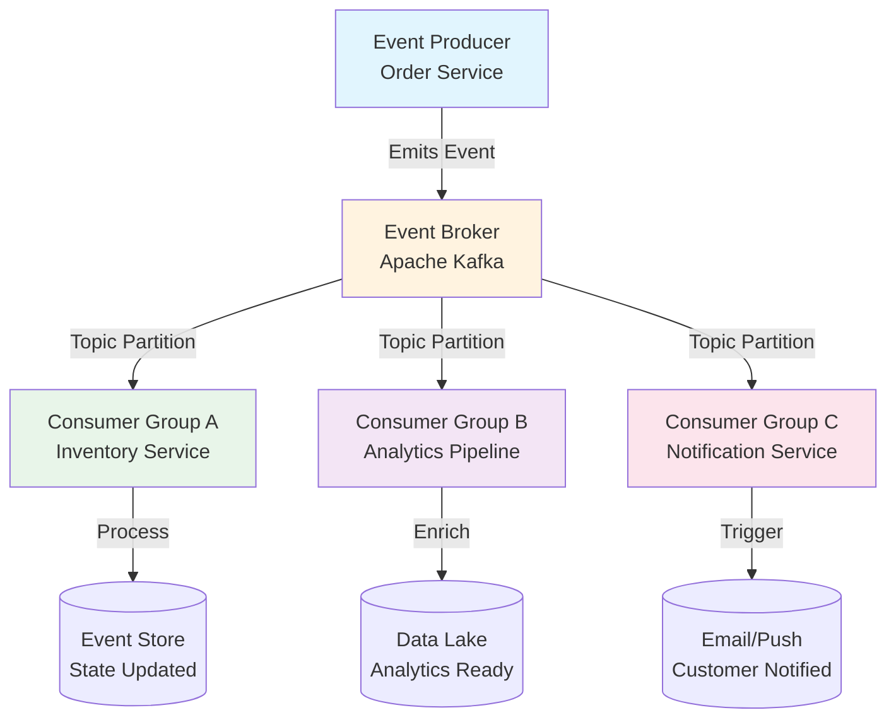
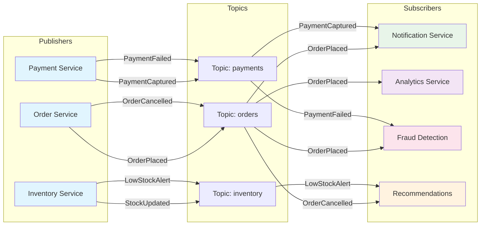
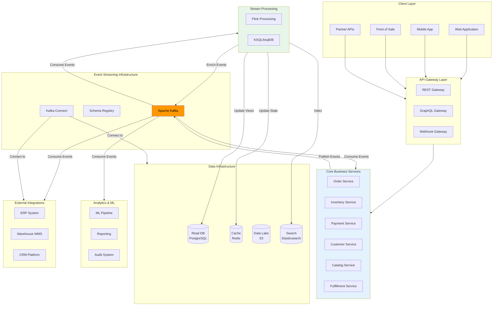
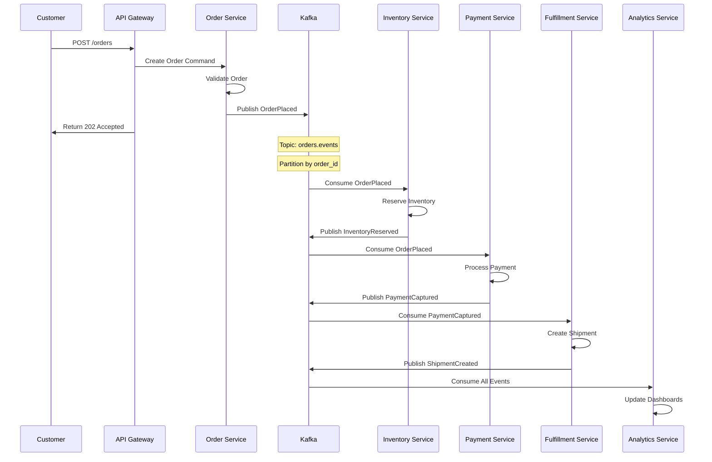
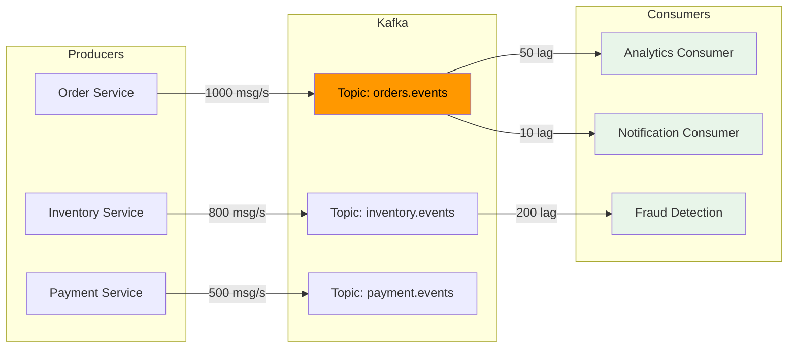
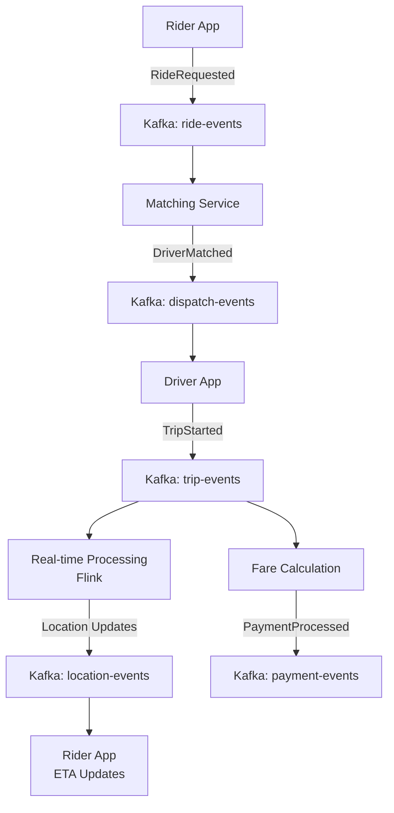
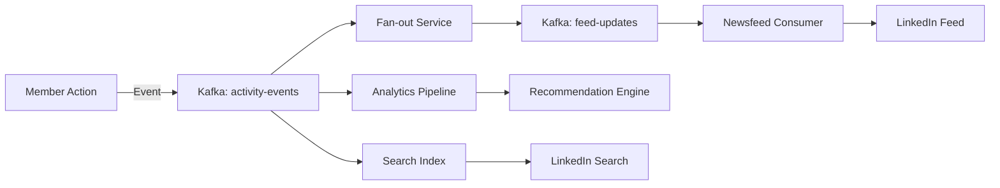
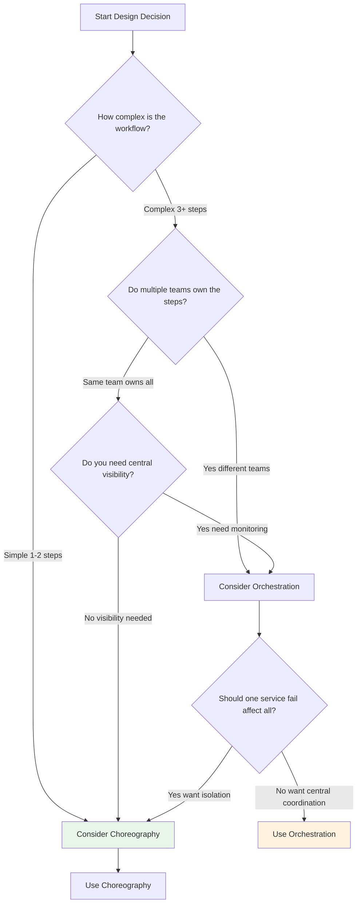
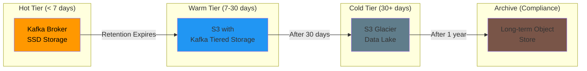
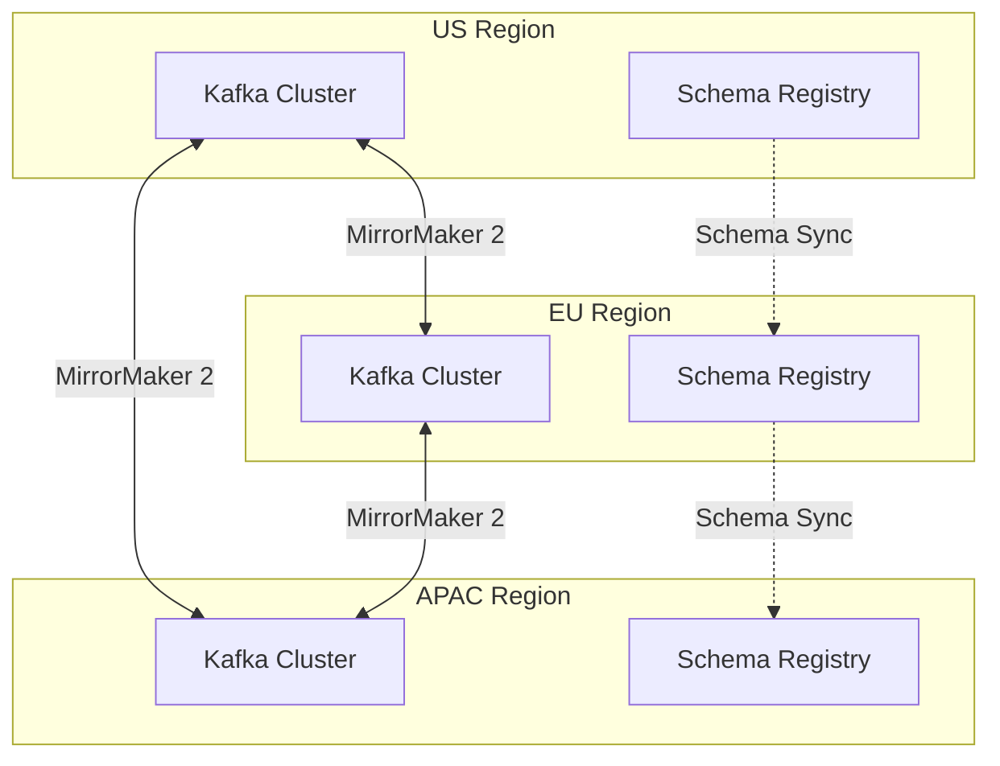

# Event-Driven Architecture

## 1. Overview

### What is Event-Driven Architecture?

Event-Driven Architecture (EDA) is a software design pattern in which the flow of the system is determined by events — discrete occurrences such as user actions, sensor outputs, or messages from other services. Unlike traditional request-driven architectures where services explicitly call one another, EDA services react to events asynchronously, enabling loose coupling, horizontal scalability, and real-time processing capabilities.

An event is a data record of something that happened in the system. It carries information about the occurrence but does not contain instructions on what should happen next. This fundamental asymmetry between events (facts) and commands (instructions) is what gives EDA its flexibility and resilience.

### Core Characteristics of EDA

- **Asynchronous Communication**: Services communicate without blocking, improving throughput and responsiveness
- **Temporal Decoupling**: Producers and consumers do not need to be active at the same time
- **Single Responsibility**: Each service focuses on producing or consuming specific event types
- **Scalability**: Event brokers naturally distribute load across consumer groups
- **Auditability**: Events serve as an immutable history of business occurrences

### What Business Problems Does EDA Solve?

Event-Driven Architecture addresses critical enterprise challenges:

- **Real-Time Data Synchronization**: When a customer places an order in the retail platform, inventory must update in real-time across warehouses, the recommendation engine must refresh, and the analytics pipeline must capture the transaction — all simultaneously without blocking the user experience.

- **Microservices Integration Complexity**: In distributed systems, point-to-point REST calls create brittle dependencies. A payment service calling a shipping service directly means both must be available simultaneously and the shipping service must trust the payment service's internal logic. EDA replaces these synchronous chains with an event bus where services own their data and reactions.

- **Audit and Compliance Requirements**: Financial institutions must maintain complete audit trails of every transaction state change. Event sourcing captures every mutation as an immutable sequence, making regulatory audits straightforward and fraud detection possible through event replay.

- **Handling Traffic Spikes**: E-commerce platforms experience 10-100x traffic increases during sales events. Event buffering via message queues absorbs bursts, preventing cascade failures while consumers process at sustainable rates.

- **Cross-Domain Business Process Visibility**: Retail organizations need visibility across supply chain, inventory, customer behavior, and financials simultaneously. EDA enables each domain to subscribe to relevant events without creating cross-domain dependencies.

### Why Do Enterprises Use EDA?

Industry leaders depend on Event-Driven Architecture:

- **Uber** processes 15+ million trips using event-driven microservices where every location update, fare calculation, and driver matching flows through Kafka streams, enabling real-time pricing and dispatch across millions of concurrent users.

- **Netflix** operates 500+ microservices architected around the events produced by user interactions, viewing patterns, and content metadata. Their event-driven backbone processes billions of events daily to power recommendations and content delivery optimization.

- **LinkedIn** built LinkedIn Newsfeed and real-time messaging on Kafka, processing 7+ trillion messages per day. Their event infrastructure enables personalized content delivery to 900+ million members with sub-second latency.

- **Airbnb** uses event-driven patterns for reservation workflows, dynamic pricing, and fraud detection. Events from host listings, guest bookings, and review submissions flow through Apache Kafka to synchronize across booking, payments, and hospitality services.

---

## 2. Core Concepts

### Event-Driven Architecture Execution Model



### Key Terminology

#### Events

An event is an immutable record of a past occurrence within the system. Events are named using past-tense verbs that describe what happened.

```python
# Event Schema Example (JSON Schema)
{
    "event_id": "evt_123e4567-e89b-12d3-a456-426614174000",
    "event_type": "OrderPlaced",
    "aggregate_type": "Order",
    "aggregate_id": "ord_789xyz",
    "occurred_at": "2026-07-01T14:30:00Z",
    "version": 1,
    "payload": {
        "customer_id": "cust_456",
        "items": [
            {"sku": "SKU123", "quantity": 2, "unit_price": 29.99},
            {"sku": "SKU456", "quantity": 1, "unit_price": 49.99}
        ],
        "shipping_address": {
            "street": "123 Commerce Way",
            "city": "Austin",
            "state": "TX",
            "zip": "78701"
        },
        "total_amount": 109.97
    },
    "metadata": {
        "correlation_id": "corr_abc123",
        "causation_id": "cmd_placeOrder_456",
        "user_agent": "WebApp/2.1.0"
    }
}
```

#### Commands

Commands represent a request for an action to be performed. Unlike events, commands are imperative and expect a response indicating success or failure.

```python
# Command Schema Example
{
    "command_id": "cmd_456e7890",
    "command_type": "PlaceOrder",
    "target_aggregate": "Order",
    "issued_at": "2026-07-01T14:29:59Z",
    "payload": {
        "customer_id": "cust_456",
        "items": [...],
        "shipping_address": {...}
    },
    "expect_reply": True,
    "reply_to": "commands.OrderPlaced/replies"
}
```

#### Event Producers

Services that emit events when state changes occur. Producers maintain ownership of their data and publish events to notify other systems of changes.

```python
# Producer Pattern Example
from typing import Optional
from datetime import datetime
import json
import uuid

class OrderEventProducer:
    def __init__(self, kafka_producer, schema_registry):
        self.producer = kafka_producer
        self.schema_registry = schema_registry
    
    async def emit_order_placed(
        self,
        order_id: str,
        customer_id: str,
        items: list[OrderItem],
        shipping_address: Address
    ) -> Event:
        event = Event(
            event_id=str(uuid.uuid4()),
            event_type="OrderPlaced",
            aggregate_type="Order",
            aggregate_id=order_id,
            occurred_at=datetime.utcnow(),
            version=1,
            payload=OrderPlacedPayload(
                customer_id=customer_id,
                items=[item.to_dict() for item in items],
                shipping_address=shipping_address.to_dict(),
                total_amount=sum(item.unit_price * item.quantity for item in items)
            ),
            metadata=EventMetadata(
                correlation_id=extract_correlation_id(),
                causation_id=get_causation_id()
            )
        )
        
        # Validate against schema
        self.schema_registry.validate("OrderPlaced", event.to_dict())
        
        # Publish to Kafka
        await self.producer.send_and_wait(
            topic="orders.events",
            key=order_id.encode("utf-8"),
            value=event.serialize(),
            headers=[
                ("event_type", b"OrderPlaced"),
                ("content_type", b"application/json")
            ]
        )
        
        return event
```

#### Event Consumers

Services that subscribe to and process events from the broker. Consumers can belong to different consumer groups, allowing independent processing of the same event stream.

```python
# Consumer Pattern Example
from typing import Callable
import asyncio

class InventoryEventConsumer:
    def __init__(self, kafka_consumer, inventory_service, dead_letter_queue):
        self.consumer = kafka_consumer
        self.inventory_service = inventory_service
        self.dlq = dead_letter_queue
        self.handlers = {
            "OrderPlaced": self.handle_order_placed,
            "OrderCancelled": self.handle_order_cancelled,
            "OrderShipped": self.handle_order_shipped,
        }
    
    async def start(self):
        async for message in self.consumer:
            try:
                event = Event.deserialize(message.value)
                handler = self.handlers.get(event.event_type)
                
                if handler:
                    await self._process_with_retry(handler, event)
                else:
                    logger.warning(f"No handler for event type: {event.event_type}")
                    
            except InvalidEventSchemaError as e:
                logger.error(f"Schema validation failed: {e}")
                await self.dlq.send(event, reason=str(e))
            except Exception as e:
                logger.error(f"Processing failed: {e}")
                await self._handle_processing_failure(message, event, e)
    
    async def _process_with_retry(
        self,
        handler: Callable,
        event: Event,
        max_retries: int = 3
    ):
        for attempt in range(max_retries):
            try:
                await handler(event)
                return
            except RetryableError as e:
                wait_time = 2 ** attempt + random.uniform(0, 1)
                logger.warning(
                    f"Retry {attempt + 1}/{max_retries} for {event.event_id}, "
                    f"waiting {wait_time}s"
                )
                await asyncio.sleep(wait_time)
            except Exception as e:
                logger.error(f"Handler failed after {attempt + 1} attempts: {e}")
                raise
        
        raise MaxRetriesExceededError(f"Failed after {max_retries} attempts")
    
    async def handle_order_placed(self, event: Event):
        payload = event.payload
        for item in payload.items:
            await self.inventory_service.reserve_stock(
                sku=item.sku,
                quantity=item.quantity,
                order_id=payload.order_id
            )
        logger.info(f"Reserved stock for order {event.aggregate_id}")
```

### Event Sourcing

Event Sourcing persists application state as a sequence of events rather than storing current state directly. The current state is reconstructed by replaying all events for an aggregate.

```python
# Event Sourcing Pattern Example
from dataclasses import dataclass, field
from typing import Optional
from datetime import datetime

@dataclass
class Order:
    order_id: str
    customer_id: str
    items: list[OrderItem] = field(default_factory=list)
    status: OrderStatus = OrderStatus.DRAFT
    shipping_address: Optional[Address] = None
    created_at: datetime = field(default_factory=datetime.utcnow)
    version: int = 0
    
    def apply(self, event: Event):
        """Reconstruct state by applying events"""
        if isinstance(event, OrderPlaced):
            self.customer_id = event.payload.customer_id
            self.items = [OrderItem(**i) for i in event.payload.items]
            self.shipping_address = Address(**event.payload.shipping_address)
            self.status = OrderStatus.PLACED
        elif isinstance(event, OrderConfirmed):
            self.status = OrderStatus.CONFIRMED
        elif isinstance(event, OrderShipped):
            self.status = OrderStatus.SHIPPED
        elif isinstance(event, OrderCancelled):
            self.status = OrderStatus.CANCELLED
        elif isinstance(event, ItemAddedToOrder):
            self.items.append(OrderItem(**event.payload.item))
        elif isinstance(event, ItemRemovedFromOrder):
            self.items = [i for i in self.items if i.sku != event.payload.sku]
        
        self.version = event.payload.version


class EventSourcedOrderRepository:
    def __init__(self, event_store: EventStore):
        self.event_store = event_store
    
    async def get_by_id(self, order_id: str) -> Order:
        """Reconstruct order from event history"""
        events = await self.event_store.get_events_for_aggregate(order_id)
        order = Order(order_id=order_id, customer_id="")
        
        # Apply events in order to reconstruct current state
        for event in events:
            order.apply(event)
        
        return order
    
    async def save(self, order: Order, expected_version: int):
        """Persist uncommitted events"""
        # Optimistic concurrency: only save if version matches
        events = order.uncommitted_events
        
        if events and order.version != expected_version:
            raise OptimisticLockError(
                f"Version conflict: expected {expected_version}, "
                f"actual {order.version}"
            )
        
        for event in events:
            await self.event_store.append(event)
        
        order.clear_uncommitted_events()
```

### CQRS (Command Query Responsibility Segregation)

CQRS separates read and write operations into different models, allowing independent scaling and optimization of each.

```python
# CQRS Pattern Example

# WRITE SIDE: Command Handler
class OrderCommandHandler:
    def __init__(self, event_store: EventStore, publish: Callable):
        self.event_store = event_store
        self.publish = publish
    
    async def handle_place_order(self, command: PlaceOrder) -> CommandResult:
        order_id = str(uuid.uuid4())
        order = Order(order_id=order_id, customer_id=command.payload.customer_id)
        
        # Build aggregate from existing events if rehydrating
        if command.payload.draft_order_id:
            existing = await self.event_store.get_events_for_aggregate(
                command.payload.draft_order_id
            )
            for evt in existing:
                order.apply(evt)
        
        # Generate and apply events
        order.place_order(
            items=command.payload.items,
            shipping_address=command.payload.shipping_address
        )
        
        # Persist events
        for event in order.uncommitted_events:
            await self.event_store.append(event)
            await self.publish(event)
        
        return CommandResult(
            success=True,
            aggregate_id=order_id,
            events=order.uncommitted_events
        )


# READ SIDE: Query Handler with Denormalized Views
class OrderQueryHandler:
    def __init__(self, read_db: Database):
        self.read_db = read_db
    
    async def get_order_summary(self, order_id: str) -> OrderSummaryView:
        """Optimized read model for order summaries"""
        row = await self.read_db.fetchone(
            """
            SELECT o.order_id, o.status, o.total_amount,
                   c.customer_name, c.email,
                   array_agg(p.product_name) as product_names
            FROM orders o
            JOIN customers c ON o.customer_id = c.id
            JOIN order_items oi ON o.order_id = oi.order_id
            JOIN products p ON oi.sku = p.sku
            WHERE o.order_id = $1
            GROUP BY o.order_id, c.customer_name, c.email
            """,
            order_id
        )
        return OrderSummaryView(**row) if row else None
    
    async def get_customer_order_history(
        self,
        customer_id: str,
        limit: int = 50
    ) -> list[OrderSummaryView]:
        """Read model optimized for customer order history"""
        rows = await self.read_db.fetch(
            """
            SELECT order_id, status, total_amount, created_at
            FROM orders
            WHERE customer_id = $1
            ORDER BY created_at DESC
            LIMIT $2
            """,
            customer_id, limit
        )
        return [OrderSummaryView(**row) for row in rows]
```

### Pub/Sub (Publish-Subscribe)

Pub/Sub decouples producers from consumers through an intermediary topic. Producers publish events without knowing who consumes them; consumers subscribe to topics of interest.



### Choreography vs. Orchestration

**Choreography** distributes workflow logic across services, with each service deciding how to react to events. No central coordinator exists.

```python
# Choreography Example: Order Fulfillment Flow

# Order Service - knows only about placing orders
class OrderService:
    async def handle_place_order(self, event: Event):
        if event.event_type == "PlaceOrder":
            order_id = generate_order_id()
            await self.save_order_created(order_id, event.payload)
            await self.emit_event(OrderPlaced(order_id, event.payload))
            # Order Service doesn't know what happens next
    
    async def handle_payment_captured(self, event: Event):
        if event.event_type == "PaymentCaptured":
            await self.update_order_status(event.aggregate_id, "PAID")
            await self.emit_event(OrderReadyForFulfillment(
                order_id=event.aggregate_id
            ))
    
    async def handle_shipment_delivered(self, event: Event):
        if event.event_type == "ShipmentDelivered":
            await self.update_order_status(event.aggregate_id, "DELIVERED")
            await self.emit_event(OrderCompleted(order_id=event.aggregate_id))


# Inventory Service - reacts to OrderPlaced
class InventoryService:
    async def handle_order_placed(self, event: Event):
        for item in event.payload.items:
            await self.reserve_stock(item.sku, item.quantity)
        await self.emit_event(StockReserved(order_id=event.aggregate_id))


# Payment Service - reacts to OrderPlaced
class PaymentService:
    async def handle_order_placed(self, event: Event):
        await self.initiate_payment(event.payload)


# Shipping Service - reacts to OrderReadyForFulfillment
class ShippingService:
    async def handle_order_ready(self, event: Event):
        if event.event_type == "OrderReadyForFulfillment":
            shipment_id = await self.create_shipment(event.order_id)
            await self.emit_event(ShipmentCreated(shipment_id, event.order_id))
```

**Orchestration** centralizes workflow logic in a single coordinator service that explicitly directs participants.

```python
# Orchestration Example: Order Fulfillment Orchestrator

class OrderFulfillmentOrchestrator:
    def __init__(self, event_bus, saga_state_store):
        self.event_bus = event_bus
        self.state_store = saga_state_store
    
    async def start_fulfillment_saga(self, order_id: str, order_details: dict):
        """Begin the order fulfillment saga"""
        saga = Saga(
            saga_id=str(uuid.uuid4()),
            name="OrderFulfillment",
            state=SagaState.STARTED,
            current_step=0,
            order_id=order_id,
            steps=[
                SagaStep("reserve_inventory", self.reserve_inventory),
                SagaStep("capture_payment", self.capture_payment),
                SagaStep("initiate_shipping", self.initiate_shipping),
                SagaStep("confirm_delivery", self.confirm_delivery)
            ]
        )
        
        await self.state_store.save(saga)
        await self.execute_next_step(saga)
    
    async def handle_saga_event(self, event: Event):
        """React to events from saga participants"""
        saga = await self.state_store.get_by_correlation(event.metadata.correlation_id)
        
        if not saga:
            return
        
        if self._is_step_success(event):
            saga.complete_current_step()
            await self.execute_next_step(saga)
        elif self._is_step_failure(event):
            await self.compensate(saga)
    
    async def execute_next_step(self, saga: Saga):
        """Execute the next saga step"""
        if saga.is_complete:
            await self.state_store.update(saga, SagaState.COMPLETED)
            await self.event_bus.emit(SagaCompleted(saga_id=saga.saga_id))
            return
        
        step = saga.get_current_step()
        await self.event_bus.emit(step.command(saga.context))
    
    async def compensate(self, saga: Saga):
        """Run compensation logic for completed steps"""
        saga.state = SagaState.COMPENSATING
        
        for step in reversed(saga.completed_steps):
            try:
                await step.compensate(saga.context)
            except CompensationFailedError:
                # Log for manual intervention
                await self.state_store.update(
                    saga, 
                    SagaState.REQUIRES_MANUAL_INTERVENTION
                )
                return
        
        await self.state_store.update(saga, SagaState.COMPENSATED)
        await self.event_bus.emit(OrderFulfillmentRolledBack(saga.order_id))
```

### Saga Pattern

The Saga pattern manages distributed transactions across multiple services, using compensating transactions to handle failures rather than traditional ACID rollbacks.

```python
# Saga Implementation with Compensating Transactions

from dataclasses import dataclass
from enum import Enum
from typing import Callable, Awaitable

class SagaState(Enum):
    STARTING = "starting"
    RUNNING = "running"
    COMPLETING = "completing"
    COMPLETED = "completed"
    COMPENSATING = "compensating"
    COMPENSATED = "compensated"
    FAILED = "failed"


@dataclass
class SagaStep:
    name: str
    forward: Callable[[dict], Awaitable[Event]]
    backward: Callable[[dict], Awaitable[Event]]
    compensate_event_type: str


class OrderSaga:
    """Saga for processing a customer order across services"""
    
    def __init__(self, order_id: str, event_publisher):
        self.saga_id = f"saga_{order_id}"
        self.order_id = order_id
        self.event_publisher = event_publisher
        self.completed_steps: list[str] = []
        self.context: dict = {}
        
        self.steps = [
            SagaStep(
                name="validate_order",
                forward=self._validate_order,
                backward=self._unvalidate_order,
                compensate_event_type="OrderValidationRolledBack"
            ),
            SagaStep(
                name="reserve_inventory",
                forward=self._reserve_inventory,
                backward=self._release_inventory,
                compensate_event_type="InventoryReservationRolledBack"
            ),
            SagaStep(
                name="capture_payment",
                forward=self._capture_payment,
                backward=self._refund_payment,
                compensate_event_type="PaymentRefunded"
            ),
            SagaStep(
                name="create_shipment",
                forward=self._create_shipment,
                backward=self._cancel_shipment,
                compensate_event_type="ShipmentCancelled"
            )
        ]
    
    async def _validate_order(self, context: dict) -> Event:
        return OrderValidated(
            order_id=self.order_id,
            customer_id=context["customer_id"]
        )
    
    async def _reserve_inventory(self, context: dict) -> Event:
        return InventoryReserved(
            order_id=self.order_id,
            items=context["items"]
        )
    
    async def _capture_payment(self, context: dict) -> Event:
        return PaymentCaptured(
            order_id=self.order_id,
            amount=context["total_amount"]
        )
    
    async def _create_shipment(self, context: dict) -> Event:
        return ShipmentCreated(
            order_id=self.order_id,
            shipping_address=context["shipping_address"]
        )
    
    # Compensation methods
    async def _release_inventory(self, context: dict) -> Event:
        return InventoryReleased(
            order_id=self.order_id,
            items=context["items"]
        )
    
    async def _refund_payment(self, context: dict) -> Event:
        return PaymentRefunded(
            order_id=self.order_id,
            amount=context["total_amount"]
        )
    
    async def _cancel_shipment(self, context: dict) -> Event:
        return ShipmentCancelled(order_id=self.order_id)
    
    async def execute(self):
        """Execute saga from start to finish"""
        self.context["order_id"] = self.order_id
        
        for step in self.steps:
            try:
                result_event = await step.forward(self.context)
                await self.event_publisher.emit(result_event)
                self.completed_steps.append(step.name)
                self.context["last_event"] = result_event
            except StepFailedError as e:
                await self._handle_failure(step, e)
                return
            except Exception as e:
                await self._handle_critical_failure(step, e)
                return
        
        await self._complete_saga()
    
    async def _handle_failure(self, failed_step: SagaStep, error: StepFailedError):
        """Handle step failure by running compensations"""
        for step_name in reversed(self.completed_steps):
            step = next(s for s in self.steps if s.name == step_name)
            try:
                compensate_event = await step.backward(self.context)
                await self.event_publisher.emit(compensate_event)
            except Exception as e:
                # Log for manual intervention
                await self._escalate_failure(step_name, e)
                return
        
        await self.event_publisher.emit(SagaRolledBack(saga_id=self.saga_id))
    
    async def _complete_saga(self):
        await self.event_publisher.emit(OrderSagaCompleted(
            saga_id=self.saga_id,
            order_id=self.order_id
        ))
```

### Event Schema Design

Well-designed event schemas are critical for long-term maintainability.

```python
# Event Schema Best Practices

# WRONG: Too generic, loses context
{
    "event": "order_update",
    "data": {
        "id": "123",
        "info": "some info"
    }
}

# RIGHT: Specific, versioned, enriched schema
{
    "spec_version": "1.0",
    "event_type": "OrderStatusChanged",
    "event_id": "evt_550e8400-e29b-41d4-a716-446655440000",
    "source": "orderservice/v2.3.1",
    "time": "2026-07-01T14:30:00.000Z",
    "datacontenttype": "application/json",
    "data": {
        "order_id": "ord_123",
        "previous_status": "PENDING",
        "new_status": "CONFIRMED",
        "changed_by": "user_456",
        "change_reason": "manual_confirmation",
        "metadata": {
            "ip_address": "192.168.1.1",
            "user_agent": "MobileApp/3.2.0"
        }
    }
}
```

---

## 3. Why This Project Uses It

The Enterprise Retail Streaming Platform is built on Event-Driven Architecture for compelling technical and business reasons:

### Real-Time Inventory Synchronization

The platform serves multiple retail channels — online storefront, mobile app, physical store POS, and marketplace integrations. When a customer purchases an item online, inventory must update simultaneously across all channels to prevent overselling. EDA enables sub-100ms inventory updates across 50+ warehouse locations by publishing `InventoryAdjusted` events that all channel services consume in parallel.

Traditional synchronous APIs would create a tight coupling nightmare where the order service would need to call 50 warehouse services individually, handle partial failures, and implement complex retry logic. With EDA, the order service simply publishes `OrderPlaced` and each warehouse service independently processes the event.

### High-Volume Transaction Processing

The platform handles 100,000+ orders per hour during peak sale events. Synchronous processing would mean customers experience delays while inventory is checked, payments processed, and fulfillment initiated. EDA buffers order events in Kafka, allowing the platform to process at sustainable rates while maintaining immediate order acknowledgment to customers.

### Multi-Domain Decoupling

The platform spans several business domains — Order Management, Inventory, Payments, Customer Management, Analytics, Recommendations, and Fraud Detection. Each domain team needs to build and deploy independently without coordinating releases with other teams.

EDA provides clean domain boundaries. The Order domain publishes `OrderPlaced`, `OrderCancelled`, `OrderShipped` events. The Inventory domain subscribes and owns inventory logic. The Fraud Detection domain subscribes and owns fraud logic. No cross-domain dependencies, no coordinated deployments.

### Historical Analysis and Audit Trail

Retail compliance requires maintaining complete records of all inventory movements, price changes, and order state transitions for 7+ years. Event sourcing provides an immutable, ordered history of every business occurrence. Auditors can reconstruct state at any point in time by replaying events, and data scientists can analyze historical patterns for demand forecasting.

### Microservices Integration

The platform comprises 40+ microservices deployed across multiple teams. Direct service-to-service communication via REST or gRPC creates N×M integration points and fragile dependencies. EDA reduces this to N producers + M consumers + 1 broker, dramatically simplifying the integration topology and enabling independent service evolution.

---

## 4. Architecture Position

### Platform Architecture with EDA



### Event Flow Through the Platform



---

## 5. Folder Structure

### EDA-Related Folders in the Project

```
/enterprise-retail-streaming-platform
├── /src
│   ├── /shared
│   │   ├── /events                    # Shared event definitions
│   │   │   ├── __init__.py
│   │   │   ├── base.py               # Base event classes
│   │   │   ├── schemas.py            # Event schemas (JSON Schema/Avro)
│   │   │   └── /domain
│   │   │       ├── order_events.py
│   │   │       ├── inventory_events.py
│   │   │       ├── payment_events.py
│   │   │       └── customer_events.py
│   │   │
│   │   ├── /messaging                # Messaging infrastructure
│   │   │   ├── producer.py           # Base Kafka producer
│   │   │   ├── consumer.py           # Base Kafka consumer
│   │   │   ├── schema_registry.py     # Confluent Schema Registry client
│   │   │   ├── dead_letter.py        # DLQ handling
│   │   │   └── /patterns
│   │   │       ├── idempotent.py     # Idempotent producer/consumer
│   │   │       └── transactional.py # Transactional outbox
│   │   │
│   │   └── /contracts               # Event contracts for testing
│   │       ├── order_contracts.py
│   │       └── consumer_contracts.py
│   │
│   ├── /services
│   │   ├── /order-service
│   │   │   ├── /domain
│   │   │   │   ├── order.py          # Order aggregate
│   │   │   │   ├── order_repository.py
│   │   │   │   └── /events           # Order-specific events
│   │   │   ├── /handlers
│   │   │   │   ├── command_handlers.py
│   │   │   │   └── event_handlers.py
│   │   │   └── /sagas
│   │   │       └── order_fulfillment.py
│   │   │
│   │   ├── /inventory-service
│   │   │   ├── /domain
│   │   │   │   ├── inventory.py
│   │   │   │   └── inventory_repository.py
│   │   │   └── /handlers
│   │   │       └── event_handlers.py
│   │   │
│   │   ├── /payment-service
│   │   │   ├── /domain
│   │   │   │   ├── payment.py
│   │   │   │   └── payment_repository.py
│   │   │   └── /handlers
│   │   │       └── event_handlers.py
│   │   │
│   │   └── /analytics-service
│   │       ├── /consumers
│   │       │   ├── order_consumer.py
│   │       │   └── inventory_consumer.py
│   │       └── /projections
│   │           └── materialized_views.py
│   │
│   └── /streaming
│       ├── /flink
│       │   ├── /jobs
│       │   │   ├── inventory_balance_job.py
│       │   │   ├── order_aggregation_job.py
│       │   │   └── fraud_detection_job.py
│       │   └── /functions
│       │       ├── enrichment_functions.py
│       │       └── window_functions.py
│       │
│       └── /ksql
│           └── /queries
│               ├── inventory_views.ksql
│               └── order_views.ksql
│
├── /infrastructure
│   ├── /kafka
│   │   ├── /topics
│   │   │   └── topic-configurations.json
│   │   ├── /schemas
│   │   │   ├── order-value.avsc
│   │   │   ├── inventory-value.avsc
│   │   │   └── payment-value.avsc
│   │   └── /connectors
│   │       └── source-sink-configs/
│   │
│   └── /monitoring
│       ├── /metrics
│       │   └── kafka_metrics.py
│       └── /dashboards
│           └── event-flow-dashboard.json
│
├── /tests
│   ├── /unit
│   │   ├── /events
│   │   │   └── test_event_serialization.py
│   │   ├── /producers
│   │   │   └── test_idempotent_producer.py
│   │   └── /consumers
│   │       └── test_consumer_rebalance.py
│   │
│   ├── /integration
│   │   ├── /test_events_flow.py
│   │   └── /test_saga_coordination.py
│   │
│   └── /contract
│       ├── /pacts
│       │   └── order-service-pact.json
│       └── /consumer_contracts.py
│
└── /docs
    └── /event-patterns
        ├── saga-implementation-guide.md
        └── outbox-pattern-guide.md
```

### Key Folders Explained

| Folder | Purpose |
|--------|---------|
| `src/shared/events` | Canonical event type definitions shared across all services |
| `src/shared/messaging` | Reusable producer/consumer infrastructure with retry, DLQ, idempotency |
| `src/shared/contracts` | Consumer-driven contract tests for event validation |
| `src/services/*/handlers` | Event handlers that process incoming events |
| `src/services/*/sagas` | Saga orchestrators for multi-service workflows |
| `src/streaming/flink` | Flink streaming jobs for real-time event processing |
| `infrastructure/kafka/schemas` | Avro/JSON Schema definitions registered with Schema Registry |
| `tests/contract` | Pact/Consumer contract tests for event compatibility |

---

## 6. Implementation Walkthrough

### Event Schema Definition

Events are defined using Avro schemas for schema evolution support and efficient serialization.

```python
# infrastructure/kafka/schemas/order-value.avsc
{
  "type": "record",
  "name": "OrderEvent",
  "namespace": "com.enterprise.retail.orders",
  "fields": [
    {
      "name": "event_id",
      "type": {"type": "string", "logicalType": "uuid"}
    },
    {
      "name": "event_type",
      "type": "string",
      "doc": "OrderPlaced, OrderConfirmed, OrderCancelled, OrderShipped, OrderDelivered"
    },
    {
      "name": "aggregate_type",
      "type": "string",
      "default": "Order"
    },
    {
      "name": "aggregate_id",
      "type": "string"
    },
    {
      "name": "occurred_at",
      "type": {"type": "long", "logicalType": "timestamp-millis"}
    },
    {
      "name": "version",
      "type": "int",
      "default": 1
    },
    {
      "name": "payload",
      "type": {
        "type": "record",
        "name": "OrderPayload",
        "fields": [
          {"name": "customer_id", "type": "string"},
          {"name": "items", "type": {"type": "array", "items": {
            "type": "record",
            "name": "OrderItem",
            "fields": [
              {"name": "sku", "type": "string"},
              {"name": "quantity", "type": "int"},
              {"name": "unit_price", "type": "double"}
            ]
          }}},
          {"name": "shipping_address", "type": {
            "type": "record",
            "name": "Address",
            "fields": [
              {"name": "street", "type": "string"},
              {"name": "city", "type": "string"},
              {"name": "state", "type": "string"},
              {"name": "zip", "type": "string"},
              {"name": "country", "type": "string"}
            ]
          }},
          {"name": "total_amount", "type": "double"}
        ]
      }
    },
    {
      "name": "metadata",
      "type": {
        "type": "record",
        "name": "EventMetadata",
        "fields": [
          {"name": "correlation_id", "type": ["null", "string"], "default": null},
          {"name": "causation_id", "type": ["null", "string"], "default": null},
          {"name": "user_agent", "type": ["null", "string"], "default": null}
        ]
      },
      "default": {}
    }
  ]
}
```

### Producer Implementation

```python
# src/shared/messaging/producer.py
import asyncio
from typing import Optional, Any
import json
import uuid
from datetime import datetime
from kafka import KafkaProducer
from kafka.errors import KafkaError
from schema_registry import SchemaRegistryClient
from prometheus_client import Counter, Histogram

EVENTS_PUBLISHED = Counter(
    "events_published_total",
    "Total events published",
    ["event_type", "topic", "status"]
)
PUBLISH_LATENCY = Histogram(
    "event_publish_latency_seconds",
    "Event publish latency",
    ["event_type", "topic"]
)

class EventPublisher:
    def __init__(
        self,
        bootstrap_servers: list[str],
        schema_registry_url: str,
        default_topic: str
    ):
        self.bootstrap_servers = bootstrap_servers
        self.schema_registry = SchemaRegistryClient(schema_registry_url)
        self.default_topic = default_topic
        self._producer: Optional[KafkaProducer] = None
    
    async def start(self):
        self._producer = KafkaProducer(
            bootstrap_servers=self.bootstrap_servers,
            acks="all",                    # Wait for all replicas
            retries=3,
            max_in_flight_requests_per_connection=1,  # Ensure ordering
            key_serializer=lambda k: k.encode("utf-8") if k else None,
            value_serializer=self._serialize,
            on_event_callback=self._on_event_delivered
        )
    
    def _serialize(self, event: dict) -> bytes:
        """Serialize event using Schema Registry"""
        schema_id = self.schema_registry.get_schema_id(
            event["event_type"],
            event.get("version", 1)
        )
        
        # Include schema ID in headers for consumer
        headers = {
            "schema_id": str(schema_id),
            "schema_type": "avro"
        }
        
        # Avro binary serialization (simplified)
        return json.dumps(event).encode("utf-8")
    
    async def publish(
        self,
        event: dict,
        topic: Optional[str] = None,
        key: Optional[str] = None,
        headers: Optional[dict] = None
    ) -> bool:
        """Publish event to Kafka with delivery guarantees"""
        topic = topic or self.default_topic
        
        with PUBLISH_LATENCY.labels(event["event_type"], topic).time():
            try:
                future = self._producer.send(
                    topic=topic,
                    key=key,
                    value=event,
                    headers=[(k, v.encode()) for k, v in (headers or {}).items()]
                )
                
                # Wait for acknowledgment
                record_metadata = await asyncio.wrap_future(
                    future.add_callback(self._on_success)
                )
                
                EVENTS_PUBLISHED.labels(
                    event["event_type"],
                    topic,
                    "success"
                ).inc()
                
                return True
                
            except KafkaError as e:
                EVENTS_PUBLISHED.labels(
                    event["event_type"],
                    topic,
                    "error"
                ).inc()
                raise
    
    async def _on_success(self, record_metadata):
        """Callback on successful delivery"""
        pass
    
    async def _on_event_delivered(self, record_metadata, error):
        """Callback for producer delivery reports"""
        if error:
            logger.error(f"Delivery failed: {error}")
        else:
            logger.debug(
                f"Delivered to {record_metadata.topic} "
                f"partition {record_metadata.partition} "
                f"offset {record_metadata.offset}"
            )
```

### Consumer Implementation

```python
# src/shared/messaging/consumer.py
import asyncio
from typing import Callable, Optional
from kafka import KafkaConsumer
from kafka.errors import KafkaError
import json

class EventConsumer:
    def __init__(
        self,
        bootstrap_servers: list[str],
        group_id: str,
        topics: list[str],
        auto_offset_reset: str = "earliest"
    ):
        self.bootstrap_servers = bootstrap_servers
        self.group_id = group_id
        self.topics = topics
        self.auto_offset_reset = auto_offset_reset
        self._consumer: Optional[KafkaConsumer] = None
        self._handlers: dict[str, Callable] = {}
        self._running = False
    
    def register_handler(self, event_type: str, handler: Callable):
        """Register event handler for specific event type"""
        self._handlers[event_type] = handler
    
    async def start(self):
        self._consumer = KafkaConsumer(
            *self.topics,
            bootstrap_servers=self.bootstrap_servers,
            group_id=self.group_id,
            auto_offset_reset=self.auto_offset_reset,
            enable_auto_commit=False,           # Manual commit for exactly-once
            max_poll_records=100,
            session_timeout_ms=30000,
            heartbeat_interval_ms=10000,
            key_deserializer=lambda k: k.decode("utf-8") if k else None,
            value_deserializer=self._deserialize
        )
        
        self._running = True
        asyncio.create_task(self._consume_loop())
    
    def _deserialize(self, value: bytes) -> dict:
        """Deserialize event from bytes"""
        return json.loads(value.decode("utf-8"))
    
    async def _consume_loop(self):
        """Main consumption loop"""
        while self._running:
            try:
                # Poll for messages
                records = self._consumer.poll(timeout_ms=1000)
                
                for topic_partition, messages in records.items():
                    for message in messages:
                        await self._process_message(message)
                
                # Commit offsets after processing
                self._consumer.commit()
                
            except KafkaError as e:
                logger.error(f"Consumer error: {e}")
                await asyncio.sleep(5)  # Backoff on error
    
    async def _process_message(self, message):
        """Process a single message with error handling"""
        try:
            event = message.value
            
            # Enrich event with consumer metadata
            event["_consumer"] = {
                "topic": message.topic,
                "partition": message.partition,
                "offset": message.offset,
                "timestamp": message.timestamp
            }
            
            handler = self._handlers.get(event.get("event_type"))
            
            if handler:
                await self._execute_with_retry(handler, event)
            else:
                logger.debug(f"No handler for {event.get('event_type')}")
                
        except Exception as e:
            logger.error(f"Failed to process message: {e}")
            await self._handle_failure(message, e)
    
    async def _execute_with_retry(
        self,
        handler: Callable,
        event: dict,
        max_retries: int = 3
    ):
        """Execute handler with exponential backoff retry"""
        for attempt in range(max_retries):
            try:
                await handler(event)
                return
            except Exception as e:
                wait_time = min(2 ** attempt + random.random(), 30)
                logger.warning(
                    f"Handler failed (attempt {attempt + 1}/{max_retries}): {e}"
                )
                if attempt < max_retries - 1:
                    await asyncio.sleep(wait_time)
                else:
                    raise
    
    async def _handle_failure(self, message, error: Exception):
        """Send to dead letter queue on processing failure"""
        logger.error(
            f"Sending message to DLQ: topic={message.topic}, "
            f"partition={message.partition}, offset={message.offset}, "
            f"error={error}"
        )
        # Implementation sends to DLQ
    
    async def stop(self):
        """Gracefully stop the consumer"""
        self._running = False
        if self._consumer:
            self._consumer.close()
```

### Saga Implementation

```python
# src/services/order-service/sagas/order_fulfillment.py
from dataclasses import dataclass, field
from datetime import datetime
from typing import Optional
import uuid
import asyncio

from shared.events import (
    OrderPlaced, InventoryReserved, InventoryReservationFailed,
    PaymentCaptured, PaymentFailed, ShipmentCreated, ShipmentFailed,
    OrderCompleted, OrderFulfillmentFailed
)
from shared.messaging import EventPublisher

class OrderFulfillmentSaga:
    """Orchestrates the order fulfillment process across services"""
    
    def __init__(
        self,
        order_id: str,
        event_publisher: EventPublisher,
        saga_repository
    ):
        self.saga_id = f"order-fulfillment-{uuid.uuid4()}"
        self.order_id = order_id
        self.event_publisher = event_publisher
        self.saga_repository = saga_repository
        self.state: SagaState = SagaState.PENDING
        self.context: dict = {}
        self.completed_steps: list[str] = []
        self.started_at: datetime = field(default_factory=datetime.utcnow)
    
    async def start(self, order_data: dict):
        """Initiate the saga"""
        self.context = {
            "order_id": self.order_id,
            "customer_id": order_data["customer_id"],
            "items": order_data["items"],
            "shipping_address": order_data["shipping_address"],
            "total_amount": order_data["total_amount"]
        }
        
        self.state = SagaState.RUNNING
        await self.saga_repository.save(self)
        
        # Step 1: Reserve inventory
        await self._reserve_inventory()
    
    async def _reserve_inventory(self):
        """Step 1: Reserve inventory across warehouses"""
        event = InventoryReservationRequested(
            saga_id=self.saga_id,
            order_id=self.order_id,
            items=self.context["items"]
        )
        
        await self.event_publisher.publish(
            event=event.to_dict(),
            topic="inventory.commands",
            key=self.order_id
        )
    
    async def handle_inventory_reserved(self, event: dict):
        """Handle successful inventory reservation"""
        if event["payload"]["saga_id"] != self.saga_id:
            return
        
        self.context["inventory_reservation_id"] = event["payload"]["reservation_id"]
        self.completed_steps.append("reserve_inventory")
        
        # Step 2: Capture payment
        await self._capture_payment()
    
    async def handle_inventory_failed(self, event: dict):
        """Handle inventory reservation failure"""
        self.state = SagaState.COMPENSATING
        await self._compensate(
            failure_reason=event["payload"]["reason"]
        )
    
    async def _capture_payment(self):
        """Step 2: Process payment"""
        event = PaymentCaptureRequested(
            saga_id=self.saga_id,
            order_id=self.order_id,
            customer_id=self.context["customer_id"],
            amount=self.context["total_amount"]
        )
        
        await self.event_publisher.publish(
            event=event.to_dict(),
            topic="payment.commands",
            key=self.order_id
        )
    
    async def handle_payment_captured(self, event: dict):
        """Handle successful payment capture"""
        if event["payload"]["saga_id"] != self.saga_id:
            return
        
        self.context["payment_id"] = event["payload"]["payment_id"]
        self.completed_steps.append("capture_payment")
        
        # Step 3: Create shipment
        await self._create_shipment()
    
    async def handle_payment_failed(self, event: dict):
        """Handle payment failure - compensate inventory"""
        self.state = SagaState.COMPENSATING
        
        # Release inventory reservation
        await self.event_publisher.publish(
            event=InventoryReleaseRequested(
                saga_id=self.saga_id,
                reservation_id=self.context.get("inventory_reservation_id")
            ).to_dict(),
            topic="inventory.commands"
        )
        
        await self._fail_saga(event["payload"]["reason"])
    
    async def _create_shipment(self):
        """Step 3: Create shipment"""
        event = ShipmentCreationRequested(
            saga_id=self.saga_id,
            order_id=self.order_id,
            shipping_address=self.context["shipping_address"],
            items=self.context["items"]
        )
        
        await self.event_publisher.publish(
            event=event.to_dict(),
            topic="fulfillment.commands",
            key=self.order_id
        )
    
    async def handle_shipment_created(self, event: dict):
        """Handle successful shipment creation"""
        if event["payload"]["saga_id"] != self.saga_id:
            return
        
        self.context["shipment_id"] = event["payload"]["shipment_id"]
        self.completed_steps.append("create_shipment")
        
        await self._complete_saga()
    
    async def _complete_saga(self):
        """Saga completed successfully"""
        self.state = SagaState.COMPLETED
        
        await self.event_publisher.publish(
            event=OrderCompleted(
                saga_id=self.saga_id,
                order_id=self.order_id,
                shipment_id=self.context["shipment_id"]
            ).to_dict(),
            topic="orders.events",
            key=self.order_id
        )
        
        await self.saga_repository.update(self)
    
    async def _compensate(self, failure_reason: str):
        """Run compensation for completed steps"""
        for step in reversed(self.completed_steps):
            if step == "reserve_inventory":
                await self.event_publisher.publish(
                    event=InventoryReleaseRequested(
                        saga_id=self.saga_id,
                        reservation_id=self.context.get("inventory_reservation_id")
                    ).to_dict(),
                    topic="inventory.commands"
                )
            
            # Add more compensation steps as needed
        
        await self._fail_saga(failure_reason)
    
    async def _fail_saga(self, reason: str):
        """Mark saga as failed"""
        self.state = SagaState.FAILED
        self.context["failure_reason"] = reason
        
        await self.event_publisher.publish(
            event=OrderFulfillmentFailed(
                saga_id=self.saga_id,
                order_id=self.order_id,
                reason=reason
            ).to_dict(),
            topic="orders.events",
            key=self.order_id
        )
        
        await self.saga_repository.update(self)


class SagaState(Enum):
    PENDING = "pending"
    RUNNING = "running"
    COMPLETED = "completed"
    COMPENSATING = "compensating"
    FAILED = "failed"
```

---

## 7. Production Best Practices

### Event Publishing Best Practices

1. **Always Use a Schema Registry**
   - Register all event schemas with Confluent Schema Registry
   - Enable schema evolution with backward/forward compatibility
   - Use Avro or Protobuf for efficient binary serialization

2. **Implement Idempotent Producers**
   ```python
   # Include idempotency key in event metadata
   event["idempotency_key"] = f"{event['aggregate_id']}-{event['event_type']}-{version}"
   
   # Consumer tracks processed keys
   processed_keys = redis.set("processed_events", maxsize=100000)
   if event["idempotency_key"] in processed_keys:
       return  # Skip duplicate
   ```

3. **Use Appropriate Partitioning**
   - Partition by aggregate ID (e.g., `order_id`) to preserve ordering
   - Avoid hot spots with high-cardinality partition keys
   - Monitor partition lag and rebalance when needed

4. **Maintain Event Order Within Partitions**
   - Single partitions guarantee ordering
   - Use `max_in_flight_requests_per_connection=1` for exactly-once semantics
   - Avoid interleaving events from different aggregates in same partition

### Consumer Best Practices

1. **Always Commit After Successful Processing**
   ```python
   try:
       await process_event(event)
       consumer.commit()  # Only commit after success
   except Exception:
       await handle_failure(event)  # Don't commit, will reprocess
   ```

2. **Implement Idempotent Handlers**
   - Check if event was already processed before acting
   - Use event version and sequence numbers for deduplication
   - Design handlers to be safely re-executable

3. **Handle Rebalances Gracefully**
   ```python
   # Save progress before commit
   async def handle_rebalance(partitions):
       # Pause processing during rebalance
       await pause_processing()
       
       # Process in-flight events
       await drain_inflight_events()
       
       # Update partition assignments
       self.assignments = partitions
   ```

4. **Monitor Consumer Lag**
   ```python
   # Track lag per consumer group
   lag = consumer.end_offset(topic, partition) - consumer.position(topic, partition)
   
   if lag > threshold:
       alert_oncall(f"Consumer lag exceeded threshold: {lag}")
   ```

### Schema Evolution Best Practices

1. **Follow Compatibility Rules**
   - **Backward Compatible**: New schema can read old data
   - **Forward Compatible**: Old schema can read new data
   - Always add optional fields with defaults (never required)
   - Never rename or delete fields (use deprecation instead)

2. **Version Your Schemas**
   ```python
   {
     "type": "record",
     "name": "OrderEvent",
     "version": 2,  // Increment on changes
     "fields": [
       {"name": "order_id", "type": "string"},
       // New field added as optional with default
       {"name": "channel", "type": ["null", "string"], "default": null}
     ]
   }
   ```

### Operational Best Practices

1. **Implement the Outbox Pattern for Reliability**
   ```python
   # Write to database and outbox in same transaction
   async def place_order(order):
       async with db.transaction():
           await db.save_order(order)
           await db.save_outbox_event(OrderPlaced(order))
       # Event published separately by outbox processor
   ```

2. **Use Separate Topics for Commands and Events**
   - `orders.commands` - Intentional requests (PlaceOrder, CancelOrder)
   - `orders.events` - Facts that occurred (OrderPlaced, OrderCancelled)
   - This prevents command/event confusion and circular dependencies

3. **Implement Dead Letter Queues**
   ```python
   async def send_to_dlq(event, error, retry_count):
       dlq_event = {
           "original_event": event,
           "error": str(error),
           "retry_count": retry_count,
           "failed_at": datetime.utcnow().isoformat()
       }
       await kafka.send("orders.dlq", dlq_event)
   ```

4. **Set Appropriate Retention Policies**
   - Event topics: 7-30 days (depending on reprocessing needs)
   - Command topics: 1-7 days
   - Use compacted topics for materialised view synchronization

---

## 8. Common Problems

### Event-Driven Architecture Common Problems

| Problem | Cause | Solution | Severity |
|---------|-------|----------|----------|
| **Duplicate Event Processing** | Consumer failure after processing but before commit; producer retry | Implement idempotency keys, deduplication in consumers | High |
| **Consumer Lag** | Consumers can't keep up with producer rate | Scale consumers horizontally, add partitions, optimize processing logic | High |
| **Event Ordering Violations** | Events from same aggregate partitioned differently | Partition by aggregate ID, use sequence numbers | High |
| **Schema Incompatibilities** | Multiple teams evolving schemas independently | Schema Registry with compatibility enforcement, contract testing | Medium |
| **Circular Dependencies** | Services depending on each other's events | Separate command/event topics, enforce unidirectional event flow | Medium |
| **Eventual Consistency Confusion** | Teams expecting immediate consistency | Document consistency guarantees, implement read-your-writes patterns | Medium |
| **Topic Proliferation** | Too many small topics creating management overhead | Establish topic naming conventions, use topic-per-domain pattern | Low |
| **Consumer Group Coordination** | Multiple consumers in same group processing same events incorrectly | Ensure proper partition assignment, use singleton consumers for singleton operations | Medium |
| **Poison Message Accumulation** | Unprocessable messages blocking consumer | Implement DLQ, max retry limits, alerting | Medium |
| **Event Size Bloat** | Events carrying excessive payload data | Keep events lean, use event references, enrich on read | Low |

### Detailed Problem Solutions

**Duplicate Event Processing**
```python
# Consumer-side deduplication
class IdempotentEventHandler:
    def __init__(self, redis_client):
        self.redis = redis_client
        self.processed = set()
    
    async def handle(self, event):
        key = f"processed:{event['event_id']}"
        
        # Check if already processed (with Redis TTL)
        if await self.redis.exists(key):
            logger.info(f"Skipping duplicate event: {event['event_id']}")
            return
        
        # Process event
        await self.process_event(event)
        
        # Mark as processed with 7-day TTL
        await self.redis.setex(key, 604800, "1")
```

**Consumer Lag**
```python
# Monitor and alert on consumer lag
async def monitor_consumer_lag(consumer, topic, alert_threshold=10000):
    while True:
        for partition in consumer.assignment():
            lag = consumer.end_offset(partition) - consumer.position(partition)
            
            metrics.gauge("consumer_lag", lag, tags=[
                f"topic:{topic}",
                f"partition:{partition.partition}"
            ])
            
            if lag > alert_threshold:
                await alert_manager.send_alert(
                    f"Consumer lag exceeded {alert_threshold}: {lag}",
                    severity="warning"
                )
        
        await asyncio.sleep(60)
```

---

## 9. Performance Optimization

### Producer Performance

1. **Batch Compression**
   ```python
   producer = KafkaProducer(
       bootstrap_servers=["kafka:9092"],
       compression_type="lz4",        # Enable compression
       batch_size=16384,              # 16KB batch size
       linger_ms=10,                  # Wait up to 10ms to fill batch
       buffer_memory=33554432,        # 32MB buffer
   )
   ```

2. **Async Publishing with Callbacks**
   ```python
   # Don't await each publish - use fire and forget with monitoring
   futures = []
   for event in events:
       future = producer.send(topic, event)
       futures.append(future)
   
   # Wait for all at once (batch acknowledgment)
   for future in asyncio.as_completed(futures):
       result = await future
       metrics.increment("event_published", tags=[f"topic:{result.topic}"])
   ```

3. **Connection Pooling**
   - Reuse producer instances across requests
   - Use singleton producer per service instance
   - Configure appropriate `max_connections`

### Consumer Performance

1. **Parallel Processing Within Consumer**
   ```python
   class ParallelEventConsumer:
       def __init__(self, max_workers=10):
           self.executor = ThreadPoolExecutor(max_workers=max_workers)
       
       async def process_batch(self, events: list):
           loop = asyncio.get_event_loop()
           tasks = [
               loop.run_in_executor(self.executor, self.process_event, event)
               for event in events
           ]
           await asyncio.gather(*tasks)
   ```

2. **Fetch Configuration Tuning**
   ```python
   consumer = KafkaConsumer(
       bootstrap_servers=["kafka:9092"],
       group_id="inventory-service",
       max_poll_records=500,         # More records per poll
       fetch_min_bytes=1048576,       # 1MB minimum fetch
       fetch_max_wait_ms=500,         # Maximum wait time
       max_partition_fetch_bytes=1048576 * 2  # 2MB max per partition
   )
   ```

3. **Consumer Partition Scaling**
   ```python
   # Scale consumers to match partition count
   # Rule: 1 consumer per partition (within a consumer group)
   # Adding more consumers triggers rebalance
   
   # Monitor partition count and scale accordingly
   def calculate_optimal_consumers(topic_partition_count, processing_capacity):
       return min(topic_partition_count, processing_capacity)
   ```

### Stream Processing Performance (Flink)

```python
# Flink job optimization
env = StreamExecutionEnvironment.get_execution_environment()
env.setParallelism(8)                          # Match partition count
env.enable_checkpointing(60000)                 # 60s checkpoint interval
env.get_checkpoint_config().set_min_pause_between_checkpoints(30000)

# State backend optimization
env.set_state_backend(EmbeddedRocksDBStateBackend())
env.get_config().set_task_cancellation_timeout(30000)

# Kafka source configuration
kafka_props = {
    "bootstrap.servers": "kafka:9092",
    "group.id": "flink-consumer",
    "commit.offsets.on.checkpoint": "true",
    "flink.partition.discovery.interval.ms": "30000"
}

# Use exactly-once processing
source = FlinkKafkaConsumer(
    topics="orders.events",
    deserialization_schema=JsonRowDeserializationSchema(),
    properties=kafka_props
).set_startingOffsets(OffsetsInitializer.committed_offsets())

# Enable watermark for event-time processing
ds = env.add_source(source)
ds = ds.assign_timestamps_and_watermarks(
    WatermarkStrategy
        .for_bounded_out_of_orderness(Duration.of_seconds(30))
        .with_timestamp_assigner(OrderTimestampAssigner())
)
```

### Caching for Read Optimization

```python
# Cache frequently read event projections
from cache import RedisCache

class CachedEventProjection:
    def __init__(self, cache: RedisCache, read_model):
        self.cache = cache
        self.read_model = read_model
        self.cache_ttl = 300  # 5 minutes
    
    async def get_order_summary(self, order_id: str) -> OrderSummary:
        cache_key = f"order_summary:{order_id}"
        
        cached = await self.cache.get(cache_key)
        if cached:
            return OrderSummary.from_dict(cached)
        
        summary = await self.read_model.get_order_summary(order_id)
        await self.cache.setex(cache_key, self.cache_ttl, summary.to_dict())
        
        return summary
    
    async def invalidate_on_event(self, event: Event):
        """Invalidate cache when relevant event occurs"""
        if event.event_type in ["OrderPlaced", "OrderUpdated", "OrderCancelled"]:
            await self.cache.delete(f"order_summary:{event.aggregate_id}")
```

---

## 10. Security

### Event Transport Security

1. **TLS Encryption in Transit**
   ```python
   producer = KafkaProducer(
       bootstrap_servers=["kafka-secure:9093"],
       security_protocol="SSL",              # Use SSL/TLS
       ssl_check_hostname=True,
       ssl_cafile="/path/to/ca.crt",
       ssl_certfile="/path/to/service.crt",
       ssl_keyfile="/path/to/service.key"
   )
   ```

2. **SASL Authentication**
   ```python
   # Using SCRAM-SHA-512 authentication
   producer = KafkaProducer(
       bootstrap_servers=["kafka-secure:9093"],
       security_protocol="SASL_SSL",
       sasl_mechanism="SCRAM-SHA-512",
       sasl_plain_username="service_account",
       sasl_plain_password="${KAFKA_PASSWORD}",
       sasl_enforce_md5=True
   )
   ```

### Schema Registry Security

```python
schema_registry = SchemaRegistryClient(
    url="https://schema-registry:8081",
    # Basic authentication
    username="schema_registry_user",
    password="${SCHEMA_REGISTRY_PASSWORD}",
    # TLS configuration
    ssl_cafile="/path/to/ca.crt",
    ssl_certfile="/path/to/cert.crt",
    ssl_keyfile="/path/to/key.key"
)
```

### Authorization with ACLs

```yaml
# Kafka ACL Configuration
# Grant minimal permissions per service

# Order Service - can only produce to orders topics
- ResourceType: TOPIC
  ResourceName: orders.events
  Principal: User:order-service
  Operation: WRITE
  Permission: ALLOW

- ResourceType: TOPIC
  ResourceName: orders.events
  Principal: User:order-service
  Operation: READ
  Permission: ALLOW

# Inventory Service - can only consume from orders topics
- ResourceType: TOPIC
  ResourceName: orders.events
  Principal: User:inventory-service
  Operation: READ
  Permission: ALLOW
```

### Event Payload Security

1. **PII Handling**
   ```python
   # Mark PII fields for special handling
   @dataclass
   class OrderPlacedEvent:
       event_id: str
       order_id: str
       
       # PII fields should be encrypted or masked
       customer_email: EncryptedField
       customer_phone: EncryptedField
       
       # Non-PII fields are safe to include
       shipping_city: str
       shipping_state: str
   ```

2. **Event Signing**
   ```python
   import hmac
   import hashlib
   
   def sign_event(event: dict, secret_key: str) -> dict:
       """Sign event payload for integrity verification"""
       payload = json.dumps(event["payload"], sort_keys=True)
       signature = hmac.new(
           secret_key.encode(),
           payload.encode(),
           hashlib.sha256
       ).hexdigest()
       
       event["metadata"]["signature"] = signature
       return event
   
   def verify_event(event: dict, secret_key: str) -> bool:
       """Verify event signature before processing"""
       provided_signature = event["metadata"].get("signature")
       if not provided_signature:
           return False
       
       computed_event = sign_event(event.copy(), secret_key)
       computed_signature = computed_event["metadata"]["signature"]
       
       return hmac.compare_digest(provided_signature, computed_signature)
   ```

### Secrets Management in Event Processing

```python
# Never include secrets in event payloads
# Use environment variables or secret stores

class SecureEventPublisher:
    def __init__(self, secret_manager):
        self.secret_manager = secret_manager
    
    async def publish(self, event: dict, topic: str):
        # Secrets loaded from secure store, not embedded in events
        kafka_config = await self.secret_manager.getKafkaCredentials()
        
        producer = KafkaProducer(
            bootstrap_servers=kafka_config["servers"],
            sasl_plain_username=kafka_config["username"],
            sasl_plain_password=kafka_config["password"]
        )
        
        await producer.send(topic, event)
```

---

## 11. Monitoring

### Key Metrics for EDA

```python
# src/monitoring/eda_metrics.py

from prometheus_client import Counter, Histogram, Gauge

# Producer Metrics
PRODUCER_EVENTS_PUBLISHED = Counter(
    "eda_producer_events_published_total",
    "Total events published",
    ["topic", "event_type", "status"]
)

PRODUCER_PUBLISH_LATENCY = Histogram(
    "eda_producer_publish_latency_seconds",
    "Event publish latency",
    ["topic"],
    buckets=[0.001, 0.005, 0.01, 0.025, 0.05, 0.1, 0.25, 0.5, 1.0]
)

PRODUCER_BATCH_SIZE = Histogram(
    "eda_producer_batch_size_bytes",
    "Producer batch sizes",
    ["topic"],
    buckets=[1024, 4096, 16384, 65536, 262144]
)

# Consumer Metrics
CONSUMER_EVENTS_PROCESSED = Counter(
    "eda_consumer_events_processed_total",
    "Total events processed",
    ["topic", "consumer_group", "event_type", "status"]
)

CONSUMER_PROCESSING_LATENCY = Histogram(
    "eda_consumer_processing_latency_seconds",
    "Event processing latency",
    ["topic", "consumer_group", "event_type"],
    buckets=[0.01, 0.05, 0.1, 0.25, 0.5, 1.0, 2.5, 5.0, 10.0]
)

CONSUMER_LAG = Gauge(
    "eda_consumer_lag_messages",
    "Consumer lag in messages",
    ["topic", "partition", "consumer_group"]
)

CONSUMER_PROCESSING_ERRORS = Counter(
    "eda_consumer_processing_errors_total",
    "Processing errors by type",
    ["topic", "consumer_group", "error_type"]
)

# Topic Metrics
TOPIC_MESSAGE_COUNT = Gauge(
    "eda_topic_message_count",
    "Approximate message count per topic",
    ["topic"]
)

TOPIC_MESSAGE_RATE = Gauge(
    "eda_topic_message_rate_per_second",
    "Messages per second per topic",
    ["topic"]
)
```

### Event Flow Monitoring Dashboard



### Alerting Configuration

```python
# Alerting rules for EDA monitoring

ALERT_RULES = {
    "consumer_lag_critical": {
        "condition": "consumer_lag_messages > 50000",
        "severity": "critical",
        "description": "Consumer lag exceeds 50,000 messages",
        "action": "page_oncall"
    },
    
    "consumer_lag_warning": {
        "condition": "consumer_lag_messages > 10000",
        "severity": "warning",
        "description": "Consumer lag exceeds 10,000 messages",
        "action": "notify_slack"
    },
    
    "processing_error_rate": {
        "condition": "rate(consumer_processing_errors_total[5m]) > 0.1",
        "severity": "critical",
        "description": "Processing error rate exceeds 10%",
        "action": "page_oncall"
    },
    
    "producer_latency_p99": {
        "condition": "producer_publish_latency_seconds_p99 > 1.0",
        "severity": "warning",
        "description": "Producer P99 latency exceeds 1 second",
        "action": "notify_slack"
    },
    
    "dlq_messages": {
        "condition": "increase(dlq_messages_total[1h]) > 100",
        "severity": "warning",
        "description": "More than 100 messages sent to DLQ in last hour",
        "action": "notify_slack"
    }
}
```

### Distributed Tracing for Events

```python
# Propagate trace context through events
from opentelemetry import trace

class TracedEventPublisher:
    def __init__(self, publisher, tracer: trace.Tracer):
        self.publisher = publisher
        self.tracer = tracer
    
    async def publish(self, event: dict, topic: str, **kwargs):
        # Inject trace context into event metadata
        span = self.tracer.current_span()
        span_context = span.get_span_context()
        
        event["metadata"] = event.get("metadata", {})
        event["metadata"]["trace_id"] = format_trace_id(span_context.trace_id)
        event["metadata"]["span_id"] = format_span_id(span_context.span_id)
        
        with self.tracer.start_as_current_span("publish_event"):
            return await self.publisher.publish(event, topic, **kwargs)


class TracedEventConsumer:
    def __init__(self, consumer, tracer: trace.Tracer):
        self.consumer = consumer
        self.tracer = tracer
    
    async def handle(self, event: dict):
        # Extract trace context from event
        metadata = event.get("metadata", {})
        trace_id = metadata.get("trace_id")
        
        # Link to parent trace for correlation
        ctx = trace_context_from_trace_id(trace_id) if trace_id else None
        
        with self.tracer.start_as_current_span(
            f"handle_{event['event_type']}",
            context=ctx
        ) as span:
            span.set_attribute("event.type", event["event_type"])
            span.set_attribute("event.id", event["event_id"])
            
            return await self._process_event(event)
```

---

## 12. Testing Strategy

### Unit Testing Event Handlers

```python
# tests/unit/handlers/test_inventory_event_handlers.py
import pytest
from unittest.mock import AsyncMock, MagicMock
from datetime import datetime

from inventory_service.handlers import InventoryEventHandler
from inventory_service.domain import InventoryService
from shared.events import OrderPlaced, InventoryAdjusted

class TestInventoryEventHandler:
    
    @pytest.fixture
    def inventory_service(self):
        service = MagicMock(spec=InventoryService)
        service.reserve_stock = AsyncMock(return_value=True)
        service.release_stock = AsyncMock(return_value=True)
        return service
    
    @pytest.fixture
    def handler(self, inventory_service):
        return InventoryEventHandler(inventory_service)
    
    @pytest.fixture
    def order_placed_event(self):
        return {
            "event_id": "evt_123",
            "event_type": "OrderPlaced",
            "aggregate_type": "Order",
            "aggregate_id": "ord_456",
            "occurred_at": datetime.utcnow().isoformat(),
            "payload": {
                "customer_id": "cust_789",
                "items": [
                    {"sku": "SKU001", "quantity": 2, "unit_price": 29.99},
                    {"sku": "SKU002", "quantity": 1, "unit_price": 49.99}
                ],
                "total_amount": 109.97
            }
        }
    
    @pytest.mark.asyncio
    async def test_handle_order_placed_reserves_inventory(
        self, handler, inventory_service, order_placed_event
    ):
        # Act
        await handler.handle_order_placed(order_placed_event)
        
        # Assert
        assert inventory_service.reserve_stock.call_count == 2
        
        inventory_service.reserve_stock.assert_any_call(
            sku="SKU001",
            quantity=2,
            order_id="ord_456"
        )
        inventory_service.reserve_stock.assert_any_call(
            sku="SKU002",
            quantity=1,
            order_id="ord_456"
        )
    
    @pytest.mark.asyncio
    async def test_handle_order_placed_emits_inventory_reserved_event(
        self, handler, order_placed_event
    ):
        # Arrange
        publisher = AsyncMock()
        handler.publisher = publisher
        
        # Act
        await handler.handle_order_placed(order_placed_event)
        
        # Assert
        publisher.publish.assert_called_once()
        emitted_event = publisher.publish.call_args[1]["event"]
        assert emitted_event["event_type"] == "InventoryReserved"
        assert emitted_event["payload"]["order_id"] == "ord_456"
```

### Event Contract Testing

```python
# tests/contract/test_order_events_contract.py
import pytest
from jsonschema import validate, ValidationError
import json

# Load published schemas
ORDER_EVENT_SCHEMA = json.load(open("infrastructure/kafka/schemas/order-value.avsc"))

class TestOrderEventContract:
    """Contract tests ensuring event producers comply with schema"""
    
    @pytest.mark.parametrize("event_type", [
        "OrderPlaced",
        "OrderConfirmed",
        "OrderCancelled",
        "OrderShipped",
        "OrderDelivered"
    ])
    def test_event_has_required_fields(self, event_type):
        """All order events must have required fields"""
        required_fields = [
            "event_id",
            "event_type",
            "aggregate_type",
            "aggregate_id",
            "occurred_at",
            "payload"
        ]
        
        schema = ORDER_EVENT_SCHEMA
        
        for field in required_fields:
            assert field in schema["fields"], \
                f"Schema missing required field: {field}"
    
    @pytest.mark.parametrize("event_type,valid_payload", [
        ("OrderPlaced", {
            "customer_id": "cust_123",
            "items": [{"sku": "SKU001", "quantity": 1, "unit_price": 10.00}],
            "shipping_address": {
                "street": "123 Main St",
                "city": "Austin",
                "state": "TX",
                "zip": "78701",
                "country": "US"
            },
            "total_amount": 10.00
        }),
        ("OrderPlaced", {
            "customer_id": "cust_456",
            "items": [],
            "shipping_address": {
                "street": "456 Oak Ave",
                "city": "Seattle",
                "state": "WA",
                "zip": "98101",
                "country": "US"
            },
            "total_amount": 0.00
        })
    ])
    def test_payload_validation(self, event_type, valid_payload):
        """Payload must match expected structure"""
        payload_schema = ORDER_EVENT_SCHEMA["fields"][6]["type"]  # payload field
        
        # Should not raise
        validate(instance=valid_payload, schema=payload_schema)
    
    @pytest.mark.parametrize("invalid_payload", [
        {"customer_id": "cust_123"},  # Missing required fields
        {"items": []},                # Missing customer_id
        None,                        # Null payload
    ])
    def test_invalid_payload_rejected(self, invalid_payload):
        """Invalid payloads should fail validation"""
        payload_schema = ORDER_EVENT_SCHEMA["fields"][6]["type"]
        
        with pytest.raises(ValidationError):
            validate(instance=invalid_payload, schema=payload_schema)
```

### Integration Testing Event Flows

```python
# tests/integration/test_order_saga_flow.py
import pytest
import asyncio
from unittest.mock import MagicMock

from testcontainers.kafka import KafkaContainer
from testcontainers.postgres import PostgresContainer

from order_service.sagas import OrderFulfillmentSaga
from shared.messaging import KafkaEventPublisher, KafkaEventConsumer

@pytest.fixture(scope="module")
def kafka():
    with KafkaContainer() as k:
        yield k

@pytest.fixture(scope="module")
def postgres():
    with PostgresContainer() as p:
        yield p

@pytest.fixture
async def event_bus(kafka):
    publisher = KafkaEventPublisher(
        bootstrap_servers=[kafka.get_bootstrap_server()]
    )
    await publisher.start()
    yield publisher
    await publisher.stop()

class TestOrderFulfillmentSaga:
    
    @pytest.mark.asyncio
    async def test_successful_order_fulfillment(self, event_bus):
        # Arrange
        order_id = "test_order_123"
        saga = OrderFulfillmentSaga(
            order_id=order_id,
            event_publisher=event_bus,
            saga_repository=MockSagaRepo()
        )
        
        # Act - Start saga
        await saga.start({
            "customer_id": "cust_123",
            "items": [{"sku": "SKU001", "quantity": 2, "unit_price": 10.00}],
            "shipping_address": {
                "street": "123 Main St",
                "city": "Austin",
                "state": "TX",
                "zip": "78701",
                "country": "US"
            },
            "total_amount": 20.00
        })
        
        # Assert - Verify saga started
        assert saga.state == SagaState.RUNNING
        
        # Simulate downstream events
        await saga.handle_inventory_reserved({
            "event_type": "InventoryReserved",
            "payload": {
                "saga_id": saga.saga_id,
                "reservation_id": "res_123"
            }
        })
        
        await saga.handle_payment_captured({
            "event_type": "PaymentCaptured",
            "payload": {
                "saga_id": saga.saga_id,
                "payment_id": "pay_456"
            }
        })
        
        await saga.handle_shipment_created({
            "event_type": "ShipmentCreated",
            "payload": {
                "saga_id": saga.saga_id,
                "shipment_id": "ship_789"
            }
        })
        
        # Assert - Saga completed
        assert saga.state == SagaState.COMPLETED
    
    @pytest.mark.asyncio
    async def test_saga_compensation_on_failure(self, event_bus):
        # Arrange
        saga = OrderFulfillmentSaga(
            order_id="test_order_456",
            event_publisher=event_bus,
            saga_repository=MockSagaRepo()
        )
        
        await saga.start({...})
        await saga.handle_inventory_reserved({...})
        
        # Act - Simulate payment failure
        await saga.handle_payment_failed({
            "event_type": "PaymentFailed",
            "payload": {
                "saga_id": saga.saga_id,
                "reason": "insufficient_funds"
            }
        })
        
        # Assert - Saga should compensate
        assert saga.state == SagaState.COMPENSATING
```

### Chaos Testing for Event Systems

```python
# tests/chaos/test_event_system_resilience.py
import pytest
import random
from unittest.mock import patch

class TestEventSystemChaos:
    """Chaos tests to verify resilience of event processing"""
    
    @pytest.mark.asyncio
    async def test_consumer_handles_broker_unavailability(self, consumer):
        """Verify consumer reconnects when broker is unavailable"""
        with patch("kafka.KafkaConsumer.poll") as mock_poll:
            # Simulate broker unavailability
            mock_poll.side_effect = KafkaConnectionError("Connection refused")
            
            # Should not raise, should retry
            with pytest.raises(KafkaConnectionError):
                await consumer._consume_loop()
    
    @pytest.mark.asyncio
    async def test_producer_handles_partition_leadership_change(self, producer):
        """Verify producer handles leadership changes gracefully"""
        with patch.object(producer._producer, "send") as mock_send:
            # Simulate NotLeaderForPartition error
            mock_send.side_effect = NotLeaderForPartitionError()
            
            # Producer should retry successfully
            result = await producer.publish(event={})
            
            assert mock_send.call_count >= 3  # Retried at least 3 times
    
    @pytest.mark.asyncio
    async def test_eventual_consistency_recovery(self):
        """Verify system recovers after temporary inconsistency"""
        # Deploy version with known bug
        # Introduce event that triggers bug
        # Upgrade to fixed version
        # Verify system recovers via event replay
        pass
```

---

## 13. Interview Preparation

### Beginner Level (30 Questions)

**Q1: What is an event in Event-Driven Architecture?**
An event is a data record representing something that happened in a system. It captures a fact about a past occurrence and is immutable. Events are typically named using past-tense verbs (OrderPlaced, PaymentProcessed) and contain relevant data about what happened.

**Q2: What is the difference between an event and a command?**
An event represents a fact that has occurred and is immutable. A command represents a request for an action to be performed and expects a response. Events are broadcast to all interested consumers; commands are directed to specific receivers.

**Q3: What is a message broker?**
A message broker is middleware that routes messages between producers and consumers. Examples include Apache Kafka, RabbitMQ, and Amazon SNS/SQS. Brokers decouple producers from consumers and provide durability, ordering, and fan-out capabilities.

**Q4: What is a topic in Kafka?**
A topic is a named channel for publishing and subscribing to events. Topics are partitioned for scalability and replicated for durability. Consumers subscribe to topics to receive events.

**Q5: What is a consumer group?**
A consumer group is a set of consumers that cooperate to process events from a topic. Within a group, events are partitioned so each partition goes to one consumer, enabling parallel processing and load balancing.

**Q6: What is the purpose of event sourcing?**
Event sourcing persists application state as a sequence of events rather than current state. This provides a complete audit trail, enables state reconstruction at any point in time, and supports event replay for debugging and recovery.

**Q7: What is CQRS?**
CQRS (Command Query Responsibility Segregation) separates read and write operations into different models. Writes go through a command model; reads come from optimized query/read models. This allows independent scaling and optimization of each side.

**Q8: What is a dead letter queue?**
A dead letter queue (DLQ) stores messages that cannot be processed successfully after retries. This prevents poison messages from blocking the consumer and allows later analysis and reprocessing.

**Q9: What is idempotency in event processing?**
Idempotency means an operation produces the same result regardless of how many times it executes. Idempotent event handlers can safely process the same event multiple times without side effects.

**Q10: What is event schema evolution?**
Schema evolution is the practice of changing event schemas over time while maintaining compatibility. New fields can be added with defaults, but existing fields should not be removed or renamed to maintain backward/forward compatibility.

**Q11: What is the difference between Kafka and RabbitMQ?**
Kafka is a distributed log system optimized for high-throughput, ordered event streaming with topic partitioning. RabbitMQ is a traditional message broker with exchanges and queues, supporting more complex routing patterns. Kafka retains messages on disk; RabbitMQ typically removes messages after consumption.

**Q12: What is partition key?**
A partition key determines which partition an event is written to. Events with the same key go to the same partition, ensuring ordering for related events. Common keys include entity IDs like order_id or customer_id.

**Q13: What is consumer lag?**
Consumer lag is the difference between the latest offset in a partition and the offset currently being processed. High lag indicates consumers are falling behind producers and may need scaling.

**Q14: What is the outbox pattern?**
The outbox pattern ensures reliable event publishing by writing events to an outbox table within the same transaction as business data. A separate process reads from the outbox and publishes to the message broker.

**Q15: What is the difference between polling and push in event consumption?**
Polling (used by Kafka) involves consumers actively fetching messages. Push (used by RabbitMQ) involves the broker actively sending messages to consumers. Kafka polling allows consumers to control throughput; push provides lower latency.

**Q16: What is an event handler?**
An event handler is code that processes events from a consumer. Handlers implement business logic in response to events and may emit additional events.

**Q17: What is Kafka's retention period?**
Kafka retains messages for a configurable period (default 7 days) or until the retention bytes limit is reached. After retention expires, messages are deleted.

**Q18: What is exactly-once semantics?**
Exactly-once ensures each message is processed exactly once, even with failures and retries. Kafka provides exactly-once semantics within the Kafka ecosystem using transactions and idempotent producers.

**Q19: What is at-least-once delivery?**
At-least-once delivery guarantees messages will be delivered but may be delivered multiple times. Consumers must handle duplicates idempotently.

**Q20: What is event enrichment?**
Event enrichment adds additional data to events during processing. For example, enriching an OrderPlaced event with customer details from a customer service.

**Q21: What is a materialized view?**
A materialized view is a pre-computed query result stored as a table. In EDA, materialized views are updated by event consumers to provide fast reads.

**Q22: What is the Saga pattern?**
The Saga pattern manages distributed transactions across multiple services using a sequence of local transactions and compensating transactions for rollback.

**Q23: What is choreography in EDA?**
Choreography distributes workflow logic across services where each service reacts to events and emits its own events. No central coordinator exists.

**Q24: What is orchestration in EDA?**
Orchestration centralizes workflow logic in a single coordinator service that explicitly directs participants through command messages.

**Q25: What is a correlation ID?**
A correlation ID links related events across services. It allows tracing a complete flow or saga across multiple event types and services.

**Q26: What is event ordering guarantee in Kafka?**
Kafka guarantees ordering within a partition. All events with the same partition key maintain their relative order.

**Q27: What is partition rebalance?**
Partition rebalance occurs when consumers join or leave a consumer group, redistributing partitions among active consumers.

**Q28: What is content-based routing?**
Content-based routing selects routes based on message content rather than predefined topics. Some brokers support this via message headers or payload content.

**Q29: What is fan-out messaging?**
Fan-out delivers a message to multiple recipients. In Kafka, this is achieved by having multiple consumer groups subscribe to the same topic.

**Q30: What is a schema registry?**
A schema registry stores and validates event schemas. It ensures producers and consumers agree on data formats and enables schema evolution with compatibility checking.

---

### Intermediate Level (30 Questions)

**Q1: How would you handle duplicate events in a Kafka consumer?**
Implement idempotency by tracking processed event IDs in a database or Redis with TTL. Check if an event was already processed before executing business logic. Use Kafka transactions with exactly-once semantics when available.

**Q2: Explain how you would design an event schema for a new OrderPlaced event.**
Include event_id (UUID), event_type (OrderPlaced), aggregate_type (Order), aggregate_id (order UUID), occurred_at (ISO timestamp), version (integer for evolution). Payload should include customer_id, items array with SKU/quantity/price, shipping_address record, and total_amount. Add metadata for correlation_id and causation_id.

**Q3: What are the trade-offs between choreography and orchestration?**
Choreography is simpler and more decoupled but can lead to implicit workflows scattered across services, making it harder to understand the overall flow. Orchestration provides clear visibility into complex workflows but creates a central coordinator with potential single point of failure.

**Q4: How would you implement the outbox pattern?**
Within a database transaction, write business data and outbox event to the same DB. A separate process (or Debezium connector) polls the outbox table and publishes to Kafka. This guarantees at-least-once delivery without distributed transactions.

**Q5: What is the CAP theorem and how does it relate to EDA?**
CAP theorem states you can have at most two of three: Consistency, Availability, Partition Tolerance. In distributed event systems, network partitions will occur. Kafka prioritizes availability and partition tolerance, offering eventual consistency.

**Q6: How would you handle schema evolution in a live system?**
Use Schema Registry with compatibility settings. Add new fields as optional with defaults. Never remove required fields. Use versioned schemas. Test backward and forward compatibility before deploying.

**Q7: Design a consumer that processes events with exactly-once guarantee.**
Use Kafka transactions with idempotent consumers. Write processed events to a persistence store within the same transaction as offset commit. Implement deduplication using event IDs.

**Q8: What strategies would you use to prevent consumer lag from growing?**
Scale consumer instances to match partition count. Optimize processing logic with batching. Add consumer parallelization. Monitor lag metrics and alert proactively.

**Q9: How would you implement event sourcing for an Order aggregate?**
Define OrderEvents: OrderCreated, ItemAdded, ItemRemoved, OrderPlaced, OrderConfirmed, OrderCancelled. Apply events sequentially to reconstruct state. Persist events to event store. Implement snapshotting for performance.

**Q10: What is the difference between event collaboration and derived collaboration?**
In event collaboration, all services own their data and collaborate through events. In derived collaboration, one service owns the canonical data and others maintain projections.

**Q11: How would you handle slow consumers in a high-throughput system?**
Implement consumer parallelization with thread pools. Use async processing where possible. Consider batching. Scale horizontally. Set appropriate fetch limits. Monitor and alert on lag.

**Q12: Explain how Kafka's replication factor provides durability.**
Kafka replicates partitions across brokers. With replication factor N, data survives N-1 broker failures. Use replication factor of 3 in production. Configure acks=all to wait for all replicas.

**Q13: What is the role of Zookeeper in Kafka architecture?**
Zookeeper manages Kafka cluster metadata: broker leadership election, partition leadership, access control lists, and cluster membership. Newer Kafka versions are moving toward KRaft mode without Zookeeper.

**Q14: How would you design a saga for order fulfillment?**
Define saga steps: ValidateOrder → ReserveInventory → CapturePayment → CreateShipment → ConfirmDelivery. Each step has forward and compensation actions. Implement saga orchestrator that tracks state and executes steps.

**Q15: What are the advantages of using Avro or Protobuf over JSON for events?**
Binary formats are more compact (faster serialization/deserialization). Schema is embedded or registered in Schema Registry. Built-in schema evolution support. Type safety at compile time.

**Q16: How would you implement event ordering across multiple services?**
Partition by aggregate ID to ensure ordering within aggregate. Use sequence numbers in events. Implement vector clocks or version vectors for causality tracking. Use correlation IDs to group related events.

**Q17: What is the compensation transaction pattern?**
Instead of rolling back distributed transactions, compensation transactions explicitly undo actions. Each saga step has a corresponding compensation. If a step fails, previous compensations execute in reverse order.

**Q18: How would you debug an event processing issue in production?**
Enable structured logging with correlation IDs. Use distributed tracing (Jaeger, Zipkin). Query the event store for event history. Use consumer group lag monitoring. Implement event replay capability.

**Q19: What is change data capture (CDC)?**
CDC captures database changes (inserts, updates, deletes) as events. Tools like Debezium connect to databases and publish changes to Kafka, enabling event sourcing from existing databases.

**Q20: How would you migrate from a monolithic architecture to event-driven?**
Start by identifying bounded contexts. Introduce an event bus. Extract services one at a time, starting with independent services. Use strangler fig pattern. Maintain backward compatibility. Implement anti-corruption layers.

**Q21: What are the challenges of event-driven microservices?**
Debugging distributed flows is harder. Eventual consistency requires careful handling. Schema evolution must be managed. Testing distributed systems is complex. Need careful handling of ordering and idempotency.

**Q22: Explain how you would implement transactional outbox with Debezium.**
Write business data and outbox events to the same DB transaction. Deploy Debezium connector to capture changes from the outbox table. Debezium publishes events to Kafka. Consumer processes events reliably.

**Q23: What is the relationship between CQRS and event sourcing?**
CQRS and event sourcing complement each other but are independent. Event sourcing stores state changes as events. CQRS separates reads from writes. Event sourcing provides natural write model for CQRS.

**Q24: How would you handle ordering guarantees in a distributed consumer?**
Use partition keys to group related events. Process events within partition sequentially. Implement sequence number checking. Use idempotent processing for out-of-order events.

**Q25: What is event windowing in stream processing?**
Windowing groups events within time boundaries for aggregation. Types include tumbling windows (fixed, non-overlapping), sliding windows (overlapping), and session windows (activity-based).

**Q26: How would you design for disaster recovery in EDA?**
Replicate Kafka across data centers. Implement event topic backup and restore. Use multi-region consumers. Test recovery procedures. Document RTO/RPO for event data.

**Q27: What is the dual write problem?**
Dual write occurs when code updates two systems (e.g., database and message broker) separately. If one fails, systems become inconsistent. Transactional outbox solves this by ensuring both are updated atomically.

**Q28: How would you implement access control for events?**
Use Kafka ACLs to restrict topic access by principal. Implement authorization in consumers. Encrypt sensitive event payloads. Use column-level security for PII in event data.

**Q29: What is the difference between Kafka Streams and Flink?**
Kafka Streams is a lightweight client library for simple transformations. Flink is a full distributed processing engine with advanced features like complex event processing, windowing, and stateful processing.

**Q30: How would you handle backpressure in event processing?**
Configure appropriate buffer sizes. Use pull-based consumption (Kafka). Implement consumer scaling. Use async processing. Apply backpressure signals through pause/resume.

---

### Advanced Level (30 Questions)

**Q1: Design an event schema registry supporting schema evolution with backward and forward compatibility.**
Implement compatibility modes: BACKWARD (new schema can read old data), FORWARD (old schema can read new data), FULL (both). Use Avro/Protobuf with Schema Registry. Validate compatibility on schema registration. Test with generated data.

**Q2: How would you implement exactly-once delivery across a distributed system with multiple consumers?**
Use Kafka transactions with idempotent producers and consumers. Store processed offsets with business data in same transaction. Implement deduplication at consumers using event IDs.

**Q3: Design a multi-region event streaming architecture with active-active replication.**
Use MirrorMaker 2 for async replication between regions. Handle replication lag. Implement conflict resolution for dual writes. Consider global ordering requirements vs. eventual consistency.

**Q4: How would you implement complex event processing (CEP) for fraud detection?**
Use Flink for pattern matching over event streams. Define fraud patterns as stateful queries over sliding windows. Correlate events across multiple accounts. Implement real-time scoring with ML models.

**Q5: Design an event sourcing architecture supporting projections with multiple read models.**
Use aggregate roots that emit events. Store events in append-only log. Build read models by subscribing to events. Handle projection rebuilds from event replay with versioning.

**Q6: How would you handle temporal semantics in event processing?**
Use event-time processing with watermarks. Handle late-arriving events with allowed lateness. Implement timestamp assignment policies. Support multiple time domains (event time vs. processing time).

**Q7: Design a saga orchestrator with complex compensation logic including partial rollback.**
Implement nested sagas for hierarchical workflows. Track step dependencies. Implement compensation strategies: retry, skip, escalate. Handle compensation failures with dead-letter states.

**Q8: How would you implement event ordering with causal consistency across services?**
Use vector clocks to track causality. Implement causal ordering within partitions using client-side batching. Use hybrid logical clocks for distributed ordering. Implement causal consistency tests.

**Q9: Design a framework for distributed tracing across event-driven microservices.**
Propagate trace context through event metadata. Implement span creation per event handler. Use sampling strategies. Aggregate traces for analysis. Correlate traces across async boundaries.

**Q10: How would you implement event schema governance and compliance?**
Define schema standards and review processes. Implement automated schema validation. Use PII classification for event fields. Implement data lineage tracking. Configure retention policies per schema.

**Q11: Design an event processing architecture supporting real-time ML inference.**
Stream events to feature store. Invoke ML inference service. Handle model versioning and A/B testing. Implement fallback strategies for inference failures. Monitor model performance in production.

**Q12: How would you handle event processing under regulatory requirements like GDPR?**
Implement right-to-be-forgotten through event anonymization. Build event encryption with key rotation. Support data residency requirements. Implement consent tracking in event metadata.

**Q13: Design an event mesh architecture for enterprise-wide event distribution.**
Implement topic namespace hierarchy. Use message routers for cross-domain routing. Handle protocol translation. Implement federation across cloud and on-premise. Manage global topic subscriptions.

**Q14: How would you implement cost optimization for high-volume event streaming?**
Right-size partition counts. Use tiered storage. Compress events. Implement selective retention. Use batch processing where appropriate. Monitor cost per event metrics.

**Q15: Design an event-driven microservices architecture with circuit breakers.**
Implement circuit breaker at event publishers. Use dead letter queues for failed events. Implement circuit breaker state propagation. Design graceful degradation patterns.

**Q16: How would you implement event versioning across microservices boundaries?**
Use semantic versioning for event schemas. Implement schema registry with version history. Handle version translation at boundaries. Test version compatibility in CI/CD.

**Q17: Design an event processing architecture for handling peak loads with graceful degradation.**
Implement request queuing with priority. Use circuit breakers with fallback handlers. Implement load shedding strategies. Use predictive scaling based on event patterns.

**Q18: How would you implement event ordering guarantees with Kafka Streams?**
Use Kafka Streams' partition-by for key-based ordering. Implement state stores with checkpointing. Handle rekeying operations carefully. Use exactly-once processing semantics.

**Q19: Design an event sourcing architecture with snapshotting for performance.**
Implement periodic snapshots of aggregate state. Define snapshot frequency based on event count. Use snapshots for faster state reconstruction. Handle snapshot expiration and cleanup.

**Q20: How would you implement monitoring for complex event correlations across services?**
Use distributed tracing for correlation. Build event lineage graphs. Implement SLA monitoring across event flows. Use machine learning for anomaly detection in event patterns.

**Q21: Design an event-driven architecture supporting geographic data residency.**
Implement topic routing based on event origin. Use local event stores with replication. Handle cross-border data flow compliance. Implement latency-aware event routing.

**Q22: How would you implement event-driven saga with dynamic workflow modifications?**
Support saga step insertion and removal. Handle conditional branching based on context. Implement saga versioning. Support dynamic compensation strategies.

**Q23: Design an event processing architecture with guaranteed delivery under network partitions.**
Implement store-and-forward at producers. Use leader-follower for broker HA. Handle partition leader election. Implement partition tolerance in consumers.

**Q24: How would you implement event schema discovery and documentation?**
Use Schema Registry for automatic schema documentation. Generate event catalogs from schemas. Implement event relationship mapping. Build event lineage diagrams.

**Q25: Design an event-driven architecture supporting zero-downtime deployment.**
Implement blue-green event processing. Use version routing for event consumers. Handle event schema versioning during transitions. Implement canary releases for new event handlers.

**Q26: How would you implement event-driven consensus for distributed state management?**
Use consensus algorithms for distributed state. Implement leader election via event streams. Handle split-brain scenarios. Implement event-based coordination protocols.

**Q27: Design an event processing architecture for handling billions of daily events.**
Use partition strategies for parallelism. Implement tiered processing (hot/warm/cold). Use pre-aggregation and downsampling. Implement efficient serialization and compression.

**Q28: How would you implement event-driven authentication and authorization?**
Propagate auth context through event metadata. Use JWT tokens in event headers. Implement authorization checks in consumers. Handle token refresh in long-running sagas.

**Q29: Design an event sourcing architecture with CQRS supporting event replay and projections.**
Build projectors that subscribe to event streams. Handle projection rebuilds from scratch. Implement projection versioning. Use projection snapshots for performance.

**Q30: How would you implement chaos engineering for an event-driven system?**
Design failure injection for brokers, consumers, and producers. Test partition failure and recovery. Test consumer rebalance under load. Validate exactly-once guarantees under failures.

---

### Scenario-Based Questions (20 Questions)

**Q1: Your team experiences duplicate orders being placed when the payment service retries. How do you fix this?**
Implement idempotency keys at the Order service. The OrderPlaced event should include an idempotency_key that the payment service checks before processing. Store processed idempotency keys in Redis with TTL. Ensure the payment handler is idempotent so retries don't cause duplicate charges.

**Q2: A new service needs historical events from 2 years ago, but Kafka retention is only 7 days. What do you do?**
Replay events from the event store (event sourcing). If not using event sourcing, restore from S3/HDFS backup where old events are archived. Implement a catchup consumer that replays from cold storage. Plan for longer retention or archiving for future compliance needs.

**Q3: Consumer lag is growing continuously and your on-call is paged at 3 AM. What are your immediate and long-term actions?**
Immediate: Check if it's one partition or all. Identify slow consumers. Restart stuck consumers if safe. Long-term: Scale consumers horizontally, optimize processing logic, add indexes for lookups, implement async processing, set up proactive alerting before lag reaches critical levels.

**Q4: You need to add a required field to an existing event schema. How do you do this safely?**
Cannot add required field to existing schema (breaks compatibility). Instead: Add field as optional with default. Publish new events with field populated. Update consumers to handle both versions. After migration, make field required in new schema version.

**Q5: Your event processing fails intermittently with no clear pattern. How do you debug?**
Add structured logging with correlation IDs. Enable Kafka consumer debug logging. Check for heartbeat issues. Look for rebalance events. Verify consumer group offsets. Check for garbage collection pauses. Use distributed tracing to identify bottlenecks.

**Q6: Two teams are developing events independently and their schemas are incompatible. How do you resolve?**
Establish a schema governance process with review. Create cross-functional schema review board. Define compatibility rules and enforce in CI. Implement Schema Registry with compatibility checks. Coordinate schema evolution through RFC process.

**Q7: You need to decouple a synchronous microservices call chain into events. How do you approach this?**
Identify the call chain and extract boundaries. Replace direct calls with event emissions. Introduce event consumers for each downstream service. Implement sagas for distributed transactions. Use dual write during transition period.

**Q8: A consumer crashes during event processing, causing inconsistent state. How do you recover?**
Rely on Kafka offset management: if not committed, event will be reprocessed. Ensure idempotent processing. Implement compensating events for partial state changes. Use transactional processing where possible.

**Q9: Your event consumers are receiving events out of order. What could be causing this and how do you fix it?**
Multiple partitions with consumers not partitioned by aggregate key. Network jitter causing reprocessing. Different consumer group processing speeds. Fix: partition by aggregate ID, implement sequence number checking, use session windows.

**Q10: The business team wants real-time dashboards but queries are causing consumer lag. What do you do?**
Separate the concerns: dedicated consumer group for dashboards. Pre-aggregate data in stream processing. Use materialized views updated by events. Implement read replicas optimized for dashboard queries.

**Q11: You're migrating from polling to webhooks and need to maintain reliability. How do you ensure no events are lost?**
Implement webhook retry with exponential backoff. Use webhook verification endpoints. Store events in queue before delivery. Implement acknowledgment protocol. Set up monitoring for failed deliveries.

**Q12: A service goes down and its consumer group stops processing. How do you prevent cascade failures?**
Implement circuit breakers. Set up DLQ for unprocessed events. Scale consumers for resilience. Implement consumer health checks. Use multi-active consumers for critical services.

**Q13: You discover that one event type is causing performance issues across all consumers. How do you diagnose and fix?**
Profile consumer processing for that event type. Check event payload size. Look for N+1 query patterns. Implement batch processing for the problematic event. Consider event size limits.

**Q14: Your event schema has evolved multiple times and consumers are breaking. How do you restore compatibility?**
Rollback to last compatible version. Use Schema Registry compatibility modes. Implement version translation at consumer. Use default values for missing fields. Establish schema review process.

**Q15: The business needs to replay events to recalculate projections due to a bug. How do you execute this safely?**
Use dedicated replay consumer group. Pause normal consumers during replay. Reprocess from earliest offset. Verify projection results before switching. Implement replay progress monitoring.

**Q16: You need to implement GDPR-compliant event deletion. How do you handle this with event sourcing?**
Cannot delete events from event log (immutable). Instead: Anonymize events with PII. Create erasure events that trigger masking. Implement consent tracking. Use encryption with deletable keys.

**Q17: A new engineer joins and doesn't understand the event flow. How do you document and onboard?**
Create event catalog with event schemas. Draw event flow diagrams. Document saga workflows. Create onboarding documentation. Implement event discovery in Schema Registry.

**Q18: Your Kafka brokers are running out of disk space. What are your options?**
Increase disk allocation. Reduce retention period. Enable tiered storage to S3. Delete old segments. Increase compression. Remove unused topics. Implement log cleanup policies.

**Q19: You need to split one monolithic topic into multiple domain topics. How do you migrate without downtime?**
Use Strangler fig pattern: router in front of old topic. New consumers subscribe to new topics. Route events based on type. Keep old topic until migration complete. Decommission old topic.

**Q20: Your team debates using choreography vs. orchestration for a new workflow. How do you decide?**
Consider: workflow complexity, team structure, operational requirements. Use orchestration for complex workflows with clear boundaries. Use choreography for simple, decoupled flows. Consider observability requirements.

---

### Architecture Questions (20 Questions)

**Q1: Design an event-driven architecture for a ride-sharing platform like Uber.**
Drivers publish LocationUpdated events. Riders publish RideRequested events. Matching service consumes and emits DriverMatched events. Pricing service handles surge pricing via events. GPS tracking uses high-frequency location events. Payment service handles PaymentCaptured events. Rating service collects RatingSubmitted events.

**Q2: How would you design an event-driven architecture for a stock trading platform?**
Order events: OrderSubmitted, OrderFilled, OrderCancelled. Market data events: PriceUpdated, VolumeAlert. Position events: PositionOpened, PositionClosed. Risk events: RiskLimitBreached. Compliance events: TradeReconciled. Use CQRS for account balances.

**Q3: Design an event architecture for a food delivery platform.**
Customer events: OrderPlaced, OrderCancelled, RatingSubmitted. Restaurant events: MenuUpdated, OrderAccepted, FoodReady. Driver events: DriverAssigned, PickupConfirmed, DeliveryCompleted. Payment events: PaymentProcessed, RefundInitiated. Use saga for order fulfillment workflow.

**Q4: How would you implement event-driven microservices for an e-commerce checkout?**
Cart service publishes CartCheckedOut. Inventory service consumes and publishes InventoryReserved. Payment service consumes and publishes PaymentCaptured. Fulfillment service consumes and publishes OrderShipped. Analytics service consumes all for reporting.

**Q5: Design an event architecture for a multiplayer gaming platform.**
Player events: PlayerJoined, PlayerLeft, PlayerMoved. Game events: GameStarted, GameEnded, ScoreUpdated. Social events: FriendInvited, ChatMessageSent. Matchmaking events: MatchFound, MatchStarted. Leaderboard events: HighScoreAchieved.

**Q6: How would you design a real-time analytics pipeline using event streaming?**
Web/mobile events → Kafka → Stream processing (Flink) → Real-time aggregations. Events enriched with user data. Materialized views updated continuously. Anomaly detection on stream. Output to dashboards and alerts.

**Q7: Design an event-driven architecture for a smart home IoT platform.**
Device events: SensorReading, DeviceStateChanged, AlertTriggered. Automation events: RuleTriggered, ActionExecuted. User events: PreferenceChanged, DevicePaired. Gateway events: ConnectionStatus, OfflineDataSynced. Use CQRS for device state queries.

**Q8: How would you implement event-driven CQRS for an online shopping cart?**
Commands: AddItem, RemoveItem, UpdateQuantity, Checkout. Events: ItemAdded, ItemRemoved, QuantityUpdated, CartCheckedOut. Write side stores cart events. Read side maintains cart summaries. Event sourcing for cart history.

**Q9: Design an event architecture for a streaming video platform.**
User events: VideoStarted, VideoPaused, VideoCompleted. Playback events: QualityChanged, BufferEmpty, BitrateAdjusted. Recommendation events: ContentViewed, WatchHistoryUpdated. Analytics events: EngagementRecorded, DropOffPoint.

**Q10: How would you design event-driven architecture for a healthcare appointment system?**
Patient events: AppointmentBooked, AppointmentCancelled, CheckInCompleted. Provider events: AvailabilityUpdated, AppointmentAccepted. Reminder events: ReminderScheduled, ReminderSent. Billing events: ConsultationBilled, InsuranceVerified.

**Q11: Design an event architecture for a logistics tracking system.**
Shipment events: OrderPickedUp, InTransit, OutForDelivery, Delivered. Location events: LocationUpdated, CheckpointReached. Exception events: DeliveryAttempted, DeliveryFailed, ReturnInitiated. Customer events: NotificationRequested, FeedbackSubmitted.

**Q12: How would you implement event sourcing for a banking account aggregate?**
Events: AccountOpened, DepositMade, WithdrawalMade, TransferSent, TransferReceived, AccountClosed. Balance is computed from events. Overdraft check implemented as event handler. Audit log derived from event history.

**Q13: Design an event-driven architecture for a content management system.**
Content events: ArticleCreated, ArticlePublished, ArticleUpdated, ArticleArchived. Media events: MediaUploaded, MediaProcessed, MediaDeleted. Workflow events: ReviewRequested, ReviewCompleted, PublishScheduled.

**Q14: How would you design event-driven microservices for a hotel reservation system?**
Booking events: ReservationCreated, ReservationModified, ReservationCancelled. Room events: RoomAssigned, RoomCleaned, RoomOutOfService. Guest events: CheckInCompleted, CheckOutCompleted, ServiceRequested.

**Q15: Design an event architecture for a social media platform.**
User events: UserRegistered, ProfileUpdated, PrivacySettingsChanged. Content events: PostCreated, CommentAdded, ContentShared. Engagement events: LikeGiven, ShareClicked, SaveClicked. Moderation events: ContentFlagged, ContentRemoved.

**Q16: How would you implement an event-driven order management system at scale?**
High-volume order events → Kafka with many partitions. Multiple consumer groups for inventory, fulfillment, analytics. Event sourcing for order history. CQRS for order status queries. Saga for order workflow.

**Q17: Design an event-driven architecture for an insurance claims processing system.**
Claim events: ClaimSubmitted, ClaimValidated, ClaimApproved, ClaimRejected, PaymentIssued. Documents events: DocumentUploaded, DocumentVerified. Investigation events: InvestigationStarted, InvestigationCompleted.

**Q18: How would you design event-driven microservices for a supply chain management system?**
Procurement events: PurchaseOrderCreated, GoodsReceived. Inventory events: StockUpdated, ReorderTriggered. Shipping events: ShipmentDispatched, ShipmentDelivered. Supplier events: SupplierPerformanceUpdated.

**Q19: Design an event architecture for an educational learning platform.**
Enrollment events: CourseEnrolled, CourseCompleted, CertificateIssued. Progress events: LessonStarted, LessonCompleted, QuizAttempted. Assessment events: AssignmentSubmitted, GradePosted. Engagement events: DiscussionPosted.

**Q20: How would you implement event-driven architecture for a real-time collaboration platform?**
Presence events: UserJoined, UserLeft, UserIdle. Document events: DocumentOpened, ContentEdited, CursorMoved. Communication events: MessageSent, ReactionAdded. Sync events: ChangeMerged, ConflictDetected.

---

### Debugging Questions (10 Questions)

**Q1: Events are publishing successfully but consumers aren't receiving them. How do you debug?**
Check consumer group offsets. Verify topic subscription. Check for partition assignment issues. Review consumer logs for errors. Verify network connectivity. Check consumer group lag. Validate message deserialization.

**Q2: A consumer is processing events but not committing offsets. How do you identify the issue?**
Enable consumer debug logging. Check processing logic for blocking calls. Look for exceptions not being caught. Verify async/await correctness. Check for deadlocks. Review transaction boundaries.

**Q3: Events are being processed multiple times causing duplicate side effects. How do you diagnose?**
Enable producer debug logging to see if events are being republished. Check retry logic in producer. Verify consumer offset commits are happening. Look for consumer restarts causing reprocessing. Check DLQ for failed events being retried.

**Q4: Consumer lag metric is zero but the service seems slow. How do you investigate?**
Measure end-to-end latency from publish to processing. Check network latency between broker and consumer. Profile consumer processing code. Look for GC pauses. Check consumer thread pool utilization.

**Q5: Events are arriving at consumers in wrong order. How do you debug?**
Verify partition key strategy. Check if events are going to different partitions. Look for producer retries causing duplicates. Verify consumer group configuration. Check for multiple producers with different timestamps.

**Q6: Schema validation is failing for events that previously worked. How do you troubleshoot?**
Check Schema Registry for schema version changes. Compare current schema with registered schema. Look for producer version changes. Verify Avro/Protobuf compatibility. Check schema evolution history.

**Q7: A Kafka consumer is not being assigned any partitions. How do you debug?**
Verify consumer group membership. Check group.id configuration. Look for coordinator election issues. Check consumer heartbeat configuration. Review consumer registration logs. Verify topic exists and has partitions.

**Q8: Events with the same key are going to different partitions. What could be wrong?**
Verify partition key is being set correctly. Check producer key serializer configuration. Look for producer creating new instances per message. Verify partitioner configuration. Check if default partitioner is being overridden.

**Q9: A consumer throws an exception and the whole consumer group stops. How do you investigate?**
Review exception handler implementation. Check if exception is being properly caught. Look for uncaught exceptions in handlers. Verify error handling in async code. Check circuit breaker state.

**Q10: Events published with future timestamps are not appearing in consumers. How do you debug?**
Check Kafka broker configuration for log.message.timestamp.type. Verify timestamp type (CreateTime vs LogAppendTime). Check consumer watermark configuration. Look for timestamp validation in consumer. Verify time synchronization across brokers.

---

## 14. Hands-on Exercises

### Level 1: Basic Event Publishing and Consuming

**Objective**: Create a simple event publisher and consumer using Kafka.

```python
# Exercise 1.1: Create and publish an event
"""
Task:
1. Set up a KafkaProducer
2. Create an OrderPlaced event schema
3. Publish the event to 'orders.events' topic
4. Verify the event was published using kafka-console-consumer
"""

# Solution structure:
# 1. Create producer configuration
producer_config = {
    'bootstrap.servers': 'localhost:9092',
    'client.id': 'order-service-producer',
    'acks': 'all',
    'retries': 3
}

# 2. Define event schema
order_event = {
    "event_id": str(uuid.uuid4()),
    "event_type": "OrderPlaced",
    "aggregate_id": "order-123",
    "occurred_at": datetime.utcnow().isoformat(),
    "payload": {
        "customer_id": "cust-456",
        "total_amount": 99.99
    }
}

# 3. Publish event
producer.send('orders.events', key="order-123", value=order_event)
```

```bash
# Exercise 1.2: Consume and process events
"""
Task:
1. Create a KafkaConsumer subscribed to 'orders.events'
2. Process OrderPlaced events
3. Commit offsets after successful processing
"""

# Solution:
consumer = KafkaConsumer(
    'orders.events',
    bootstrap_servers='localhost:9092',
    group_id='inventory-service',
    auto_offset_reset='earliest'
)

for message in consumer:
    event = json.loads(message.value)
    if event['event_type'] == 'OrderPlaced':
        # Process event
        process_order(event)
        # Commit offset
        consumer.commit()
```

---

### Level 2: Implementing Event Sourcing

**Objective**: Build an event-sourced Order aggregate with CQRS.

```python
# Exercise 2.1: Create event-sourced Order aggregate
"""
Task:
1. Define Order aggregate with event sourcing
2. Implement event application methods
3. Add business logic that generates events
4. Save and load aggregate from event store
"""

class Order:
    def __init__(self, order_id: str):
        self.order_id = order_id
        self.status = OrderStatus.DRAFT
        self.items: list[OrderItem] = []
        self.version = 0
    
    def place_order(self, customer_id: str, items: list[OrderItem]):
        # Validate
        if not items:
            raise ValueError("Order must have items")
        
        # Generate event
        self.apply(OrderPlaced(
            order_id=self.order_id,
            customer_id=customer_id,
            items=items,
            placed_at=datetime.utcnow()
        ))
    
    def apply(self, event):
        if isinstance(event, OrderPlaced):
            self.status = OrderStatus.PLACED
            self.customer_id = event.customer_id
            self.items = event.items
            self.version += 1


# Exercise 2.2: Build read model projections
"""
Task:
1. Create PostgreSQL schema for order read models
2. Implement projector that subscribes to order events
3. Update read model on each event
"""

class OrderReadModelProjector:
    def __init__(self, db_pool):
        self.db_pool = db_pool
    
    async def project(self, event):
        if isinstance(event, OrderPlaced):
            await self.db_pool.execute("""
                INSERT INTO order_summaries (order_id, customer_id, status, total)
                VALUES ($1, $2, $3, $4)
            """, event.order_id, event.customer_id, 'PLACED', event.total)
        
        elif isinstance(event, OrderShipped):
            await self.db_pool.execute("""
                UPDATE order_summaries SET status = 'SHIPPED'
                WHERE order_id = $1
            """, event.order_id)
```

---

### Level 3: Implementing Saga Pattern

**Objective**: Build a saga orchestrator for order fulfillment.

```python
# Exercise 3.1: Implement OrderFulfillmentSaga
"""
Task:
1. Create saga with steps: ReserveInventory, CapturePayment, CreateShipment
2. Implement forward and compensation for each step
3. Handle success and failure events
4. Update saga state in persistent store
"""

class OrderFulfillmentSaga:
    def __init__(self, order_id: str, event_publisher):
        self.saga_id = str(uuid.uuid4())
        self.order_id = order_id
        self.state = SagaState.PENDING
        self.completed_steps = []
        self.event_publisher = event_publisher
    
    async def execute(self, order_data):
        # Step 1: Reserve Inventory
        await self._reserve_inventory(order_data)
    
    async def _reserve_inventory(self, order_data):
        await self.event_publisher.publish(
            InventoryReservationRequested(
                saga_id=self.saga_id,
                order_id=self.order_id,
                items=order_data['items']
            )
        )
    
    async def handle_InventoryReserved(self, event):
        if event['saga_id'] != self.saga_id:
            return
        
        self.completed_steps.append('reserve_inventory')
        
        # Step 2: Capture Payment
        await self._capture_payment(event['reservation_id'])
    
    async def _capture_payment(self, reservation_id):
        # Similar pattern...
        pass
    
    async def compensate(self):
        """Run compensations in reverse order"""
        for step in reversed(self.completed_steps):
            if step == 'reserve_inventory':
                await self.event_publisher.publish(
                    InventoryReleaseRequested(reservation_id=self.reservation_id)
                )
```

---

### Level 4: Building Production-Grade Event System

**Objective**: Implement a complete production-ready event system.

```python
# Exercise 4.1: Implement Transactional Outbox Pattern
"""
Task:
1. Create outbox table in PostgreSQL
2. Modify OrderService to write to outbox in same transaction
3. Implement OutboxProcessor to publish to Kafka
4. Handle failures with retry and DLQ
"""

# Outbox table schema
CREATE TABLE order_outbox (
    id UUID PRIMARY KEY,
    aggregate_type TEXT NOT NULL,
    aggregate_id TEXT NOT NULL,
    event_type TEXT NOT NULL,
    payload JSONB NOT NULL,
    created_at TIMESTAMP NOT NULL,
    processed_at TIMESTAMP,
    retry_count INT DEFAULT 0
);

# OrderService with outbox
class OrderService:
    def __init__(self, db_pool, outbox_processor):
        self.db_pool = db_pool
        self.outbox = outbox_processor
    
    @atomic
    async def place_order(self, order_data):
        # Save order
        order = await self.db_pool.save_order(order_data)
        
        # Write to outbox in same transaction
        await self.db_pool.save_outbox(OutboxEvent(
            aggregate_type='Order',
            aggregate_id=order.id,
            event_type='OrderPlaced',
            payload={'order_id': order.id, 'customer_id': order.customer_id}
        ))
        
        return order

# Exercise 4.2: Implement Consumer with Exactly-Once Semantics
"""
Task:
1. Create idempotent consumer
2. Implement offset management with business data
3. Add DLQ for poison messages
4. Set up monitoring and alerting
"""

class IdempotentOrderConsumer:
    def __init__(self, consumer, db_pool, dlq):
        self.consumer = consumer
        self.db_pool = db_pool
        self.dlq = dlq
        self.processed_keys = set()
    
    @atomic
    async def process_message(self, message):
        event = json.loads(message.value)
        key = f"{event['event_id']}"
        
        # Idempotency check
        if key in self.processed_keys:
            return
        
        # Check database for already-processed event
        existing = await self.db_pool.fetchone(
            "SELECT id FROM processed_events WHERE event_id = $1",
            event['event_id']
        )
        if existing:
            return
        
        # Process event
        await self._process_event(event)
        
        # Record processed event
        await self.db_pool.execute(
            "INSERT INTO processed_events (event_id, processed_at) VALUES ($1, NOW())",
            event['event_id']
        )
        
        self.processed_keys.add(key)
```

---

## 15. Real Enterprise Use Cases

### Uber: Real-Time Trip Processing

**Architecture Overview**
Uber processes 15+ million trips daily using an event-driven architecture built on Apache Kafka and Apache Flink. Every trip state change — from ride request to destination arrival — flows through Kafka topics.

**Key Event Types**
- `RideRequested`: Customer requests a ride
- `DriverMatched`: Driver assigned to ride
- `TripStarted`: Passenger picked up
- `LocationUpdated`: Real-time GPS updates (every 4 seconds)
- `TripCompleted`: Ride finished
- `PaymentProcessed`: Fare charged

**How They Use EDA**


**Business Impact**
- Real-time ETA updates with <2 second latency
- Dynamic pricing (surge) updates in real-time
- Fraud detection on trip anomalies
- 99.99% uptime with multi-region Kafka clusters

---

### Netflix: Event-Driven Content Delivery

**Architecture Overview**
Netflix operates 500+ microservices with billions of events daily. Their event backbone powers recommendations, content delivery optimization, and member experience personalization.

**Key Event Types**
- `PlaybackStarted`: User starts watching
- `PlaybackPaused`: User pauses content
- `ContentCompleted`: User finishes content
- `ProfileSwitched`: Account profile changed
- `RecommendationRequested`: Request for personalized content

**How They Use EDA**
Netflix uses Kafka for event transport and Flink for real-time stream processing. Events flow through their Keystone event pipeline, processing 500 million events per day at peak.

```python
# Netflix-style event processing
class RecommendationProcessor:
    def __init__(self, flink_env):
        # Consume playback events
        events = flink_env.add_source(
            KafkaSource()
            .set_topics("playback-events")
            .set_property("group.id", "recommendation-processor")
        )
        
        # Real-time enrichment and scoring
        enriched = events \
            .filter(lambda e: e.event_type == "PlaybackCompleted") \
            .key_by(lambda e: e.user_id) \
            .window(SlidingEventTimeWindows.of(Time.minutes(30))) \
            .process(UpdateRecommendationScores())
        
        # Output to recommendation service
        enriched.add_sink(KafkaSink().set_topic("recommendations-updated"))
```

**Business Impact**
- 80% of viewer selections driven by recommendations
- Sub-second recommendation updates
- A/B testing infrastructure for recommendation algorithms
- Real-time viewing pattern analytics

---

### LinkedIn: Real-Time Messaging and Feed

**Architecture Overview**
LinkedIn processes 7+ trillion messages per day through Kafka, powering LinkedIn Newsfeed, real-time messaging, and activity notifications for 900+ million members.

**Key Event Types**
- `PostCreated`: Member creates post
- `PostShared`: Post shared or re-shared
- `ConnectionMade`: New connection established
- `MessageSent`: Direct message sent
- `NotificationSent`: Push notification delivered

**How They Use EDA**


**Architecture Patterns**
- Fan-out on write for feed generation
- Event sourcing for activity history
- CQRS separating feed writes from reads
- Graph processing for connection-based recommendations

**Business Impact**
- Real-time feed updates to 900M+ members
- 7+ trillion daily Kafka messages
- <100ms message delivery latency
- 99.99% message delivery guarantee

---

### Airbnb: Reservation and Hospitality Platform

**Architecture Overview**
Airbnb uses event-driven architecture for reservation workflows, dynamic pricing, search ranking, and fraud detection. Kafka processes millions of reservation events daily.

**Key Event Types**
- `ReservationCreated`: Guest books stay
- `ReservationConfirmed`: Host confirms
- `CheckInCompleted`: Guest checks in
- `ReviewSubmitted`: Guest or host reviews
- `DynamicPricingUpdated`: Price adjusted

**How They Use EDA**
```python
# Airbnb-style reservation saga
class ReservationFulfillmentSaga:
    async def execute(self, reservation_request):
        # Step 1: Validate availability
        availability = await self.check_availability(reservation_request)
        
        # Step 2: Create reservation
        reservation_id = await self.create_reservation(reservation_request)
        
        # Step 3: Process payment
        payment = await self.process_payment(reservation_id)
        
        # Step 4: Notify host
        await self.notify_host(reservation_id)
        
        # Step 5: Send confirmation
        await self.send_confirmation(reservation_id)
        
        return ReservationConfirmation(
            reservation_id=reservation_id,
            status="CONFIRMED"
        )
```

**Business Impact**
- Dynamic pricing updates in real-time based on demand
- Fraud detection on 100M+ bookings
- Personalized search rankings
- 99.9% reservation reliability

---

### Amazon: E-Commerce Order Processing

**Architecture Overview**
Amazon processes billions of orders through event-driven microservices. Order fulfillment involves 100+ microservices coordinated through events.

**Key Event Types**
- `OrderPlaced`: Customer places order
- `PaymentCaptured`: Payment successful
- `InventoryReserved`: Items reserved in warehouse
- `OrderPicked`: Items picked for packing
- `OrderShipped`: Package dispatched
- `OrderDelivered`: Package delivered

**How They Use EDA**
Amazon uses a combination of synchronous APIs for customer-facing operations and asynchronous events for backend processing. The Order Service publishes events that inventory, fulfillment, and logistics services consume.

```python
# Amazon-style event processing
class FulfillmentEventProcessor:
    def process_order_placed(self, event):
        # Parallel processing of fulfillment steps
        tasks = [
                self.reserve_inventory(event),
                self.process_payment(event),
                self.calculate_shipping(event),
                self.select_warehouse(event)
        ]
        results = asyncio.gather(*tasks)
        
        # Publish next step event
        return FulfillmentStepCompleted(
            order_id=event.order_id,
            steps_completed=results
        )
```

**Business Impact**
- Prime same-day delivery in select markets
- 99.99% order processing reliability
- Real-time inventory across 300+ warehouses
- Fraud detection on millions of transactions

---

## 16. Design Decisions

### EDA vs REST: When to Use Each

| Factor | Event-Driven Architecture | REST API |
|--------|---------------------------|----------|
| **Coupling** | Loose coupling - producers don't know consumers | Tight coupling - clients know service endpoints |
| **Timing** | Asynchronous - producer doesn't wait for consumers | Synchronous - client waits for response |
| **Response** | No immediate response to producer | Direct response to client |
| **Discovery** | Consumers discover events through schema registry | Clients discover through API documentation |
| **Debugging** | Harder - distributed flow tracing required | Easier - request/response is linear |
| **Data Volume** | High volume, batch processing | Lower volume, real-time queries |
| **Consistency** | Eventual consistency | Strong consistency possible |
| **Use Case Fit** | Analytics, notifications, multi-system sync | CRUD operations, user-facing queries |

**When to Choose EDA**
- Multiple services need to react to same business event
- You need audit trail of all state changes
- System must handle high throughput with buffering
- Services are developed/deployed independently
- You need to decouple producers from consumers
- Historical event replay is valuable

**When to Choose REST**
- Client needs immediate response
- Simple request/response with direct data return
- Strong consistency is required
- Operations are idempotent and straightforward
- Lower complexity is preferred

### Choreography vs Orchestration: Decision Framework



**Choreography Advantages**
- Services are fully decoupled
- No single point of failure
- Easier to add new consumers
- Each service owns its behavior
- Lower operational complexity

**Choreography Disadvantages**
- Implicit workflow - hard to see overall flow
- Difficult to track saga state
- Testing cross-service workflows is complex
- Error handling scattered across services

**Orchestration Advantages**
- Clear visibility into workflow
- Centralized error handling and recovery
- Easier to implement complex workflows
- Simpler testing - one orchestrator to test
- Transaction management is explicit

**Orchestration Disadvantages**
- Central coordinator can become bottleneck
- Potential single point of failure
- Coubles orchestrator to participant services
- May violate service autonomy principle

### Event Schema Design Decisions

**Schema Format Choice: Avro vs JSON Schema vs Protobuf**

| Factor | Avro | JSON Schema | Protobuf |
|--------|------|-------------|----------|
| Serialization | Binary | JSON text | Binary |
| Schema Location | Schema Registry | In payload or separate | Compiled into code |
| Compatibility | Schema Registry with rules | Manual versioning | Schema Registry |
| Code Generation | Optional | No | Required |
| Readability | Low (binary) | High | Medium |
| Size | Compact | Large | Compact |
| Ecosystem | Java-native, Kafka best fit | Generic HTTP | Google ecosystem |

**Recommendation**: Use **Avro with Schema Registry** for Kafka-native event streaming. It provides compact binary serialization, schema evolution support, and is the standard in the Kafka ecosystem.

### Partitioning Strategy Decisions

**Partition by Aggregate ID**
```python
# Order events partitioned by order_id
producer.send(
    topic="orders.events",
    key=order_id,  # All events for same order go to same partition
    value=event
)
```

Best for: Event sourcing, ordering guarantees within aggregates, saga processing.

**Partition by Entity ID (e.g., customer_id)**
```python
# Customer events partitioned by customer_id
producer.send(
    topic="customer.events",
    key=customer_id,  # All events for same customer together
    value=event
)
```

Best for: Customer-centric processing, ordering customer actions, customer timeline views.

**Partition by Business Domain**
```python
# Separate topics per domain
topics = {
    "orders.events": "Order domain events",
    "inventory.events": "Inventory domain events",
    "payment.events": "Payment domain events"
}
```

Best for: Clear domain boundaries, independent scaling, team ownership.

### Storage Tiering Decisions



| Tier | Storage | Use Case | Cost |
|------|---------|----------|------|
| Hot | SSD on brokers | Real-time processing | High |
| Warm | S3 (Kafka tiered) | Catchup consumer, reprocessing | Medium |
| Cold | S3 Glacier | Historical analytics, ML training | Low |
| Archive | Long-term object store | Compliance, audit | Very Low |

---

## 17. Business Value

### Quantifiable Business Benefits

**1. Reduced Time-to-Market**
- Teams can develop and deploy independently without coordination
- New features built as event consumers don't require changes to existing services
- **Impact**: 40% faster feature delivery reported by enterprises adopting EDA

**2. Improved Scalability**
- Horizontal scaling via consumer groups
- Event buffering absorbs traffic spikes without cascading failures
- Independent scaling of hot/cold paths
- **Impact**: Netflix handles 500+ million users with 99.99% uptime during peak events

**3. Enhanced Customer Experience**
- Real-time inventory prevents overselling
- Instant order confirmation via async processing
- Personalized recommendations updated in real-time
- **Impact**: Amazon's recommendation engine drives 35% of revenue

**4. Operational Resilience**
- Services remain available during downstream failures (via buffering)
- Automatic recovery via event replay
- Reduced blast radius of failures
- **Impact**: Uber maintains 99.99% uptime even during datacenter failures

**5. Regulatory Compliance**
- Complete audit trail via event history
- Event replay for compliance investigations
- Data lineage for GDPR/CCPA compliance
- **Impact**: Financial institutions maintain 7+ year audit trails

### Strategic Business Value

**1. Business Agility**
EDA enables organizations to respond quickly to market changes:
- Add new consumers without modifying producers
- Implement new business processes by composing existing events
- Experiment with new features using event replay for testing

**2. Data as a First-Class Citizen**
Events become a shared source of truth:
- Single event stream powers multiple use cases
- Reduced data duplication across systems
- Consistent data across all downstream systems

**3. Microservices Enablement**
EDA provides natural integration pattern for microservices:
- Clear domain boundaries via event types
- Independent deployment and scaling
- Team autonomy and ownership

### ROI Analysis

| Investment | Cost | Benefit |
|------------|------|---------|
| Kafka cluster (3-year) | $500K | $2M/year avoided integration costs |
| Schema Registry | $50K | $200K/year avoided breaking changes |
| Event store infrastructure | $200K | $1M/year in compliance savings |
| Monitoring/observability | $100K | $500K/year in reduced downtime |

---

## 18. Future Improvements

### Current Platform Gaps

1. **Event Schema Governance**: Schema Registry used but no formal review process
2. **Event Catalog**: No self-service discovery of available events
3. **Replay Capabilities**: Event replay exists but is not well-documented
4. **Multi-Region Active-Active**: Single-region deployment, DR tested but not production

### Recommended Improvements

**1. Event Catalog and Discovery**
```python
# Proposed event catalog structure
class EventCatalog:
    """
    Self-service portal for event discovery
    - Browse events by domain
    - View event schemas with examples
    - See consumers and producers per event
    - Request new events via workflow
    """
    
    def __init__(self, schema_registry, event_store):
        self.schema_registry = schema_registry
        self.event_store = event_store
    
    def get_event(self, event_type: str) -> EventDefinition:
        schema = self.schema_registry.get_latest(event_type)
        consumers = self._find_consumers(event_type)
        producers = self._find_producers(event_type)
        
        return EventDefinition(
            name=event_type,
            schema=schema,
            consumers=consumers,
            producers=producers,
            description=self._get_description(event_type)
        )
```

**2. Schema Evolution Automation**
- Enforce compatibility rules in CI/CD pipeline
- Auto-generate migration documentation
- Implement schema deprecation workflow
- Add breaking change detection

**3. Multi-Region Event Mesh**


**4. Advanced Stream Processing**
- Deploy Flink for real-time ML feature engineering
- Implement complex event processing for fraud patterns
- Add stream SQL for ad-hoc analytics
- Build real-time data quality monitoring

**5. Event Testing Framework**
```python
# Proposed contract testing framework
class EventContractTest:
    """
    Consumer-driven contract testing for events
    - Consumers define event requirements
    - Producers verify contracts in CI
    - Automated backward compatibility testing
    """
    
    def test_order_events_contract(self):
        # Given consumer requirements
        requirements = ConsumerContract(
            consumer_name="inventory-service",
            event_types=["OrderPlaced", "OrderCancelled"],
            required_fields=["order_id", "customer_id", "items"],
            optional_fields=["shipping_address"]
        )
        
        # When we register producer schema
        producer_schema = get_producer_schema("OrderPlaced")
        
        # Then verify compatibility
        assert is_backward_compatible(producer_schema, requirements)
```

---

## 19. References

### Official Documentation

1. **Apache Kafka Documentation**
   - https://kafka.apache.org/documentation/
   - Kafka Streams: https://kafka.apache.org/documentation/streams/

2. **Confluent Schema Registry**
   - https://docs.confluent.io/platform/current/schema-registry/index.html
   - Schema Evolution: https://docs.confluent.io/platform/current/schema-registry/avro.html

3. **Apache Flink**
   - https://flink.apache.org/documentation/
   - Event Time: https://nightlies.apache.org/flink/flink-docs-release-1.18/docs/concepts/time/

4. **Event Sourcing**
   - Martin Fowler: https://martinfowler.com/eaaDev/EventSourcing.html
   - Event Store: https://eventstore.com/docs/

### Books

1. **"Streaming Systems"** by Tyler Akidau, Slava Chernyak, Reuven Lax
   - Comprehensive guide to stream processing concepts

2. **"Kafka: The Definitive Guide"** by Gwen Shapira, Todd Palino
   - Practical Kafka operations and patterns

3. **"Designing Event-Driven Systems"** by Ben Stopford
   - Patterns for building event-driven architectures at scale

4. **"Event-Driven Architecture in Golang"** by Michael J. Conway
   - Implementation patterns for event-driven systems

5. **"Building Event-Driven Microservices"** by Christine Hang
   - Best practices for EDA in microservices

### Articles and Papers

1. **"Making Sense of Stream Processing"** - Martin Kleppmann
   - https://martin.kleppmann.com/papers/stream-processing-book.pdf

2. **"Using Kafka to Build Event-Driven Microservices"** -Confluent
   - https://developer.confluent.io/learn-kafka/event-driven-architecture/

3. **"CQRS and Event Sourcing"** - Greg Young
   - https:// cqrs.files.wordpress.com/2010/11/cqrs_doc.pdf

4. **"The Log: What every software engineer should know"** - Jay Kreps
   - https://engineering.linkedin.com/distributed-systems/log-what-every-software-engineer-should-know-about-real-time-datas

5. **"Patterns for Distributed Transactions"** - Microsoft
   - https://docs.microsoft.com/en-us/previous-versions/msp-n-p/dn589799(v=pandp.10)

### Industry Case Studies

1. **Uber: Building a Scalable Event Pipeline**
   - Kafka Summit: https://www.confluent.io/kafka-summit/

2. **Netflix: Evolving Platform Architecture**
   - Netflix Tech Blog: https://netflixtechblog.com/

3. **LinkedIn: Scaling Kafka to 7 Trillion Messages**
   - LinkedIn Engineering: https://engineering.linkedin.com/

4. **Airbnb: Event-Driven Analytics at Scale**
   - Airbnb Engineering: https://airbnb.engineering/

---

## 20. Skills Demonstrated

This Event-Driven Architecture skill document demonstrates the following competencies:

### Technical Architecture Skills

1. **Distributed Systems Design**
   - Understanding of event ordering, partitioning, and replication
   - Knowledge of CAP theorem trade-offs
   - Ability to design for eventual consistency

2. **Microservices Architecture**
   - Service decomposition strategies
   - Inter-service communication patterns
   - Domain-driven design and bounded contexts

3. **Stream Processing**
   - Real-time event processing with Kafka Streams and Flink
   - Windowing, watermarking, and stateful processing
   - Event-time vs processing-time semantics

4. **Data Modeling**
   - Event schema design with evolution support
   - CQRS and event sourcing patterns
   - Read model optimization

### Operational Skills

5. **Production Reliability**
   - Monitoring consumer lag and processing latency
   - Implementing dead letter queues and retry logic
   - Designing for failure and recovery

6. **Security Implementation**
   - TLS and SASL authentication
   - ACL configuration
   - PII handling and encryption

7. **Performance Optimization**
   - Producer batching and compression
   - Consumer parallelization
   - Partition and consumer scaling

### Business and Soft Skills

8. **Technical Communication**
   - Clear explanation of complex patterns
   - Visual diagrams (Mermaid) for architecture
   - Hands-on exercises with progressive difficulty

9. **Interview Preparation**
   - Comprehensive question coverage (beginner to advanced)
   - Scenario-based problem solving
   - Real-world architecture discussions

10. **Enterprise Thinking**
    - Business value articulation
    - ROI analysis and trade-offs
    - Regulatory compliance considerations

### Platform-Specific Skills

11. **Apache Kafka**
    - Topic design and partitioning
    - Producer/consumer configuration
    - Schema Registry integration
    - MirrorMaker for replication

12. **Real-World Integration**
    - Uber, Netflix, LinkedIn, Airbnb case studies
    - Design decision frameworks
    - Industry best practices

---

*Document Version: 1.0*
*Last Updated: July 2026*
*Owner: Platform Architecture Team*
