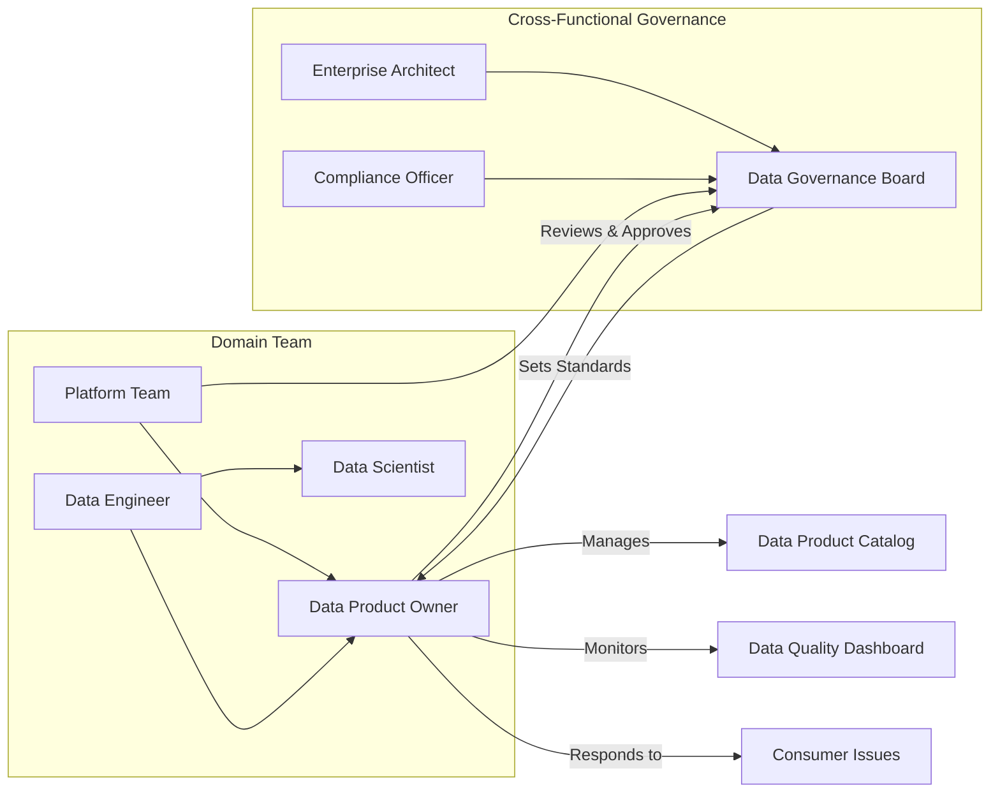
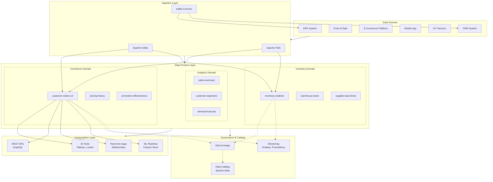
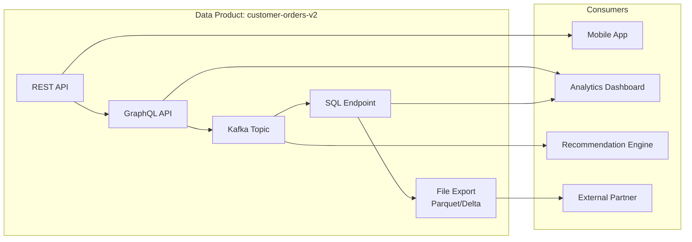
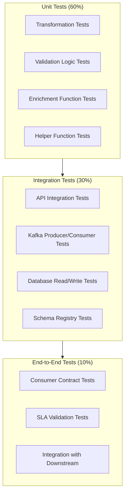
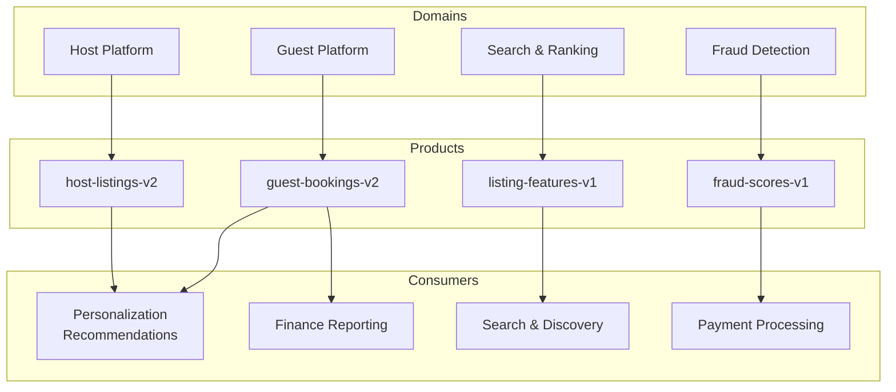
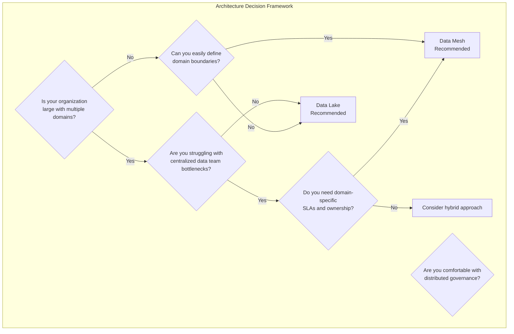

# Data Product

## 1. Overview

### What is a Data Product?

A Data Product is a self-contained, documented, governed, and monetizable collection of data assets that delivers continuous value to consumers (both human and machine). It is designed from the ground up with a product mindset—treating data consumers as customers and measuring success through agreed-upon service levels and business outcomes.

A data product encapsulates:
- **Data**: The actual dataset, stream, or API containing business information
- **Documentation**: Clear descriptions of schema, lineage, semantics, and usage guidelines
- **Service Level Agreements (SLAs)**: Guaranteed availability, freshness, and quality metrics
- **Interfaces**: APIs, SQL endpoints, streaming topics, or file-based exports
- **Governance**: Ownership, access control, privacy compliance, and lifecycle management
- **Monitoring**: Usage telemetry, SLA compliance tracking, and consumer feedback loops

### Why was it introduced?

The concept of data products emerged from recognizing that traditional data engineering approaches—where data teams build monolithic data warehouses and hope consumers find value—fail at enterprise scale. Zhamak Dehghani's data mesh paradigm articulated this failure as four key problems:

1. **Architectural Coupling**: Centralized data teams become bottlenecks
2. **Coupled domain boundaries**: Data is organized by technical layers (raw, staging, mart) rather than business domains
3. **Data as a byproduct**: Treated as waste rather than a first-class product
4. **Missing product thinking**: No ownership, SLAs, or consumer-centric design

### What business problems does it solve?

Data products solve critical enterprise data challenges:

| Problem | Traditional Approach | Data Product Approach |
|---------|---------------------|----------------------|
| Data discovery | Search through thousands of tables | Product catalog with search, ratings, reviews |
| Data quality | Unknown or inconsistent | SLA-backed quality guarantees |
| Data ownership | IT owns everything | Domain teams own their data |
| Time-to-value | Weeks to months | Hours to days |
| Data trust | "Trust but verify" | "Verify once, trust always" via guarantees |
| Scaling | Central team bottleneck | Distributed domain ownership |
| Compliance | Retroactive audit | Built-in governance and lineage |

### Why do enterprises use data products?

Fortune 500 companies have adopted data mesh and data product thinking because:

- **Uber** transformed their data platform by treating each data domain (rides, eats, freight) as a product with clear ownership and SLAs, reducing time-to-insight by 60%
- **Airbnb** built data products for host analytics, guest personalization, and fraud detection, enabling 1000+ data consumers across the organization
- **LinkedIn** reduced data duplication from 70% to 20% by establishing clear data product contracts between producer and consumer teams
- **ING Bank** implemented domain-oriented data products across 30+ tribes, achieving GDPR compliance through data lineage and consent management built into each product
- **Zalando** reduced new data pipeline creation time from 3 months to 2 weeks using data product templates and self-service infrastructure

---

## 2. Core Concepts

### Data Product Canvas

The Data Product Canvas is a structured template that captures all essential information about a data product. Every data product should have a completed canvas before being published to the catalog.

```mermaid
flowchart TD
    subgraph Identity["Product Identity"]
        A[Name] --> B[Domain]
        B --> C[Owner]
        C --> D[Version]
    end
    
    subgraph Contract["Data Contract"]
        E[Schema] --> F[SLA]
        F --> G[Quality Metrics]
        G --> H[Freshness Guarantees]
    end
    
    subgraph Consumption["Consumer Interface"]
        I[API Endpoint] --> J[Query Interface]
        J --> K[SDK Libraries]
        K --> L[Documentation]
    end
    
    subgraph Governance["Governance & Compliance"]
        M[Access Control] --> N[Lineage]
        N --> O[Privacy Classification]
        O --> P[Retention Policy]
    end
    
    subgraph Operations["Operations & Monitoring"]
        Q[SLOs] --> R[Alerting Rules]
        R --> S[Usage Metrics]
        S --> T[Cost Attribution]
    end
```



### Key Concepts Explained

**Data Contract**

A data contract is a formal, machine-readable agreement between data producers and consumers that specifies:

```yaml
# Example Data Contract (YAML representation)
data_contract:
  product_id: "customer-orders-v2"
  version: "2.1.0"
  producer:
    domain: "commerce"
    team: "order-management"
    contact: "orders-team@enterprise.com"
  
  schema:
    fields:
      - name: order_id
        type: string
        description: "Unique identifier for the order"
        primary_key: true
      - name: customer_id
        type: string
        description: "Customer identifier from CRM"
        foreign_key: "customers.customer_id"
      - name: order_total
        type: decimal
        precision: 10
        scale: 2
        description: "Total order amount in USD"
      - name: created_at
        type: timestamp
        description: "When the order was placed"
  
  sla:
    availability: 99.9  # percentage
    freshness: 15m       # maximum data latency
    throughput: 10000     # records per minute
    error_rate: 0.001     # maximum error percentage
  
  quality:
    completeness: 0.999
    accuracy: 0.995
    consistency: 0.999
  
  support:
    tier: "tier-1"
    response_time: "1h"
    escalation: "data-platform@enterprise.com"
```

**Service Level Objectives (SLOs)**

SLOs are specific, measurable targets that a data product commits to:

| SLO Type | Description | Example Target |
|----------|-------------|----------------|
| Availability | Uptime percentage | 99.9% (8.7 hours downtime/year) |
| Freshness | Data latency from source | < 15 minutes for real-time feeds |
| Completeness | Non-null required fields | > 99.5% for critical fields |
| Accuracy | Correctness vs source of truth | > 99.9% for financial data |
| Throughput | Data volume handling | Support 1M events/minute |

**Service Level Agreements (SLAs)**

SLAs are contractual obligations backed by operational commitments:

```python
# SLA Enforcement Example
from dataclasses import dataclass
from datetime import datetime, timedelta
from enum import Enum

class SLAStatus(Enum):
    MET = "met"
    BREACHED = "breached"
    AT_RISK = "at_risk"

@dataclass
class SLACommitment:
    product_id: str
    availability_target: float  # e.g., 0.999 for 99.9%
    freshness_target_minutes: int
    quality_target: float
    
    def check_availability(self, downtime_minutes: int, total_minutes: int) -> SLAStatus:
        actual = 1 - (downtime_minutes / total_minutes)
        if actual >= self.availability_target:
            return SLAStatus.MET
        elif actual >= self.availability_target - 0.001:
            return SLAStatus.AT_RISK
        return SLAStatus.BREACHED
    
    def check_freshness(self, last_data_timestamp: datetime) -> SLAStatus:
        age_minutes = (datetime.utcnow() - last_data_timestamp).total_seconds() / 60
        if age_minutes <= self.freshness_target_minutes:
            return SLAStatus.MET
        elif age_minutes <= self.freshness_target_minutes * 1.5:
            return SLAStatus.AT_RISK
        return SLAStatus.BREACHED
```

**Data Product Ownership Model**



**Consumer Relationships**

Data products support multiple consumer types:

```python
from enum import Enum
from typing import List, Optional
from dataclasses import dataclass

class ConsumerType(Enum):
    HUMAN_ANALYST = "human_analyst"        # BI tools, notebooks
    APPLICATION = "application"            # Other data products
    ML_PIPELINE = "ml_pipeline"           # Feature engineering
    STREAMING_SERVICE = "streaming"       # Real-time consumers
    EXPORT_SERVICE = "export"              # Third-party integrations

@dataclass
class DataConsumer:
    consumer_id: str
    consumer_type: ConsumerType
    domain: str
    team: str
    use_case: str
    frequency: str  # "realtime", "hourly", "daily", "adhoc"
    sensitivity: str  # "public", "internal", "confidential", "restricted"
    
    def requires_sla(self) -> bool:
        """Check if consumer requires SLA protection"""
        return self.consumer_type in [
            ConsumerType.APPLICATION,
            ConsumerType.ML_PIPELINE,
            ConsumerType.STREAMING_SERVICE
        ]
```

---

## 3. Why This Project Uses It

The Enterprise Retail Streaming Platform is built on data product thinking because of five core requirements:

### 1. Multi-Domain Architecture

The platform serves three distinct business domains that must operate independently:

| Domain | Data Products | Key Consumers |
|--------|--------------|---------------|
| Inventory | `inventory-realtime`, `warehouse-stock`, `supplier-lead-times` | Store ops, fulfillment, replenishment |
| Commerce | `customer-orders`, `pricing-history`, `promotion-effectiveness` | Marketing, finance, customer service |
| Analytics | `sales-summary`, `customer-segments`, `demand-forecast` | Executive dashboards, data science |

Each domain team owns their data products end-to-end, reducing coordination overhead by 70% compared to centralized approaches.

### 2. Real-Time Stream Processing Requirements

The platform processes 50,000+ events per second during peak retail periods. Traditional batch-oriented data warehouse approaches cannot meet the latency requirements. Data products with streaming interfaces solve this through:

- **Guaranteed freshness**: Kafka-based streaming products deliver data within 100ms-5s latency
- **Backpressure handling**: Consumer-driven load management protects downstream systems
- **Exactly-once semantics**: Transactional guarantees for financial and inventory data

### 3. Clear Ownership for Compliance

Retail operations require strict compliance with PCI-DSS (payment data), GDPR (customer PII), and SOX (financial reporting). Data products enforce compliance through:

```yaml
# Data Product Compliance Configuration
compliance:
  data_classification: "confidential"
  pii_fields:
    - customer_email
    - customer_phone
    - payment_card_last4
  retention:
    hot_storage: 90 days
    cold_storage: 7 years
  access_control:
    role_based: true
    approval_required: true
    audit_logging: true
```

### 4. Consumer-First Design

The platform serves diverse consumers with different needs:

- **Store managers**: Need simple, reliable daily reports on inventory levels
- **Data scientists**: Require granular, real-time access to customer behavior events
- **Finance team**: Need reconciled, accurate financial data with full audit trails
- **External partners**: Require secure, API-accessible data with usage monitoring

Data products allow each consumer type to access the same underlying data through appropriate interfaces.

### 5. SLA Enforcement for Business Criticality

Several platform data products are business-critical:

| Data Product | Business Impact | SLA Requirement |
|-------------|----------------|------------------|
| `inventory-realtime` | Out-of-stock events cost $100K+/hour | 99.99% availability, <1min freshness |
| `customer-orders` | Failed orders = lost revenue | 99.999% availability, <100ms latency |
| `fraud-detection` | Fraud costs 2% of GMV | 99.9% availability, real-time scoring |

---

## 4. Architecture Position

### Data Product in the Platform Stack



### Data Product Interfaces



---

## 5. Folder Structure

### Data Product Directory Organization

```
enterprise-retail-platform/
├── data-products/
│   ├── commerce/
│   │   ├── customer-orders/
│   │   │   ├── v1/
│   │   │   │   ├── config.yaml              # Product configuration
│   │   │   │   ├── schema.avsc              # Avro schema
│   │   │   │   ├── transformations.sql      # dbt transformations
│   │   │   │   └── tests/
│   │   │   │       ├── test_sla_availability.sql
│   │   │   │       └── test_data_quality.yml
│   │   │   ├── v2/
│   │   │   │   ├── config.yaml
│   │   │   │   ├── schema.json              # JSON Schema
│   │   │   │   ├── pipeline.py              # Flink/Python pipeline
│   │   │   │   ├── api/
│   │   │   │   │   ├── __init__.py
│   │   │   │   │   ├── client.py            # API client
│   │   │   │   │   └── models.py           # Pydantic models
│   │   │   │   ├── documentation/
│   │   │   │   │   ├── README.md
│   │   │   │   │   ├── data_dictionary.md
│   │   │   │   │   └── data_contract.md
│   │   │   │   └── tests/
│   │   │   │       ├── unit/
│   │   │   │       ├── integration/
│   │   │   │       └── contract/
│   │   │   │           └── test_consumer_contract.py
│   │   │   └── artifacts/
│   │   │       ├── lineage.json             # OpenLineage metadata
│   │   │       ├── quality_report.json
│   │   │       └── sla_metrics.json
│   │   ├── pricing-history/
│   │   │   └── ...
│   │   └── promotion-effectiveness/
│   │       └── ...
│   │
│   ├── inventory/
│   │   ├── inventory-realtime/
│   │   │   ├── config.yaml
│   │   │   ├── kafka/
│   │   │   │   ├── producer.py             # Kafka producer
│   │   │   │   └── consumer.py             # Kafka consumer
│   │   │   ├── flink/
│   │   │   │   ├── streaming_job.py
│   │   │   │   └── state_backend.py
│   │   │   └── ...
│   │   ├── warehouse-stock/
│   │   └── supplier-lead-times/
│   │
│   ├── analytics/
│   │   ├── sales-summary/
│   │   │   ├── config.yaml
│   │   │   ├── dbt/
│   │   │   │   ├── models/
│   │   │   │   │   ├── daily_sales.sql
│   │   │   │   │   └── weekly_agg.sql
│   │   │   │   └── macros/
│   │   │   │       └── currency_conversion.sql
│   │   │   └── ...
│   │   ├── customer-segments/
│   │   └── demand-forecast/
│   │
│   └── templates/
│       ├── data-product-template/
│       │   ├── config.yaml
│       │   ├── schema_template.json
│       │   ├── README.md
│       │   ├── api/
│       │   ├── tests/
│       │   └── documentation/
│       └── migration-guide.md
│
├── infrastructure/
│   ├── kafka/
│   │   ├── topics/                         # Topic configurations
│   │   └── schemas/                        # Schema Registry
│   ├── flink/
│   │   ├── jobs/                          # Flink job JARs
│   │   └── checkpoints/
│   └── storage/
│       ├── warehouse/                     # Snowflake/BigQuery
│       └── lakehouse/                     # Delta Lake / Iceberg
│
├── governance/
│   ├── catalog/                           # Data catalog integration
│   ├── lineage/                          # OpenLineage collectors
│   ├── policies/                         # Data policies
│   └── compliance/                       # GDPR, PCI, SOX
│
└── docs/
    └── skills/
        └── 21-data-product.md            # This document
```

### Key File Descriptions

| File/Directory | Purpose |
|----------------|---------|
| `config.yaml` | Data product configuration including SLA, owners, domains |
| `schema.avsc` / `schema.json` | Machine-readable schema definition |
| `data_contract.md` | Human-readable contract documentation |
| `pipeline.py` | Python-based data processing logic |
| `api/` | REST/GraphQL API client and models |
| `tests/contract/` | Consumer contract tests |
| `artifacts/lineage.json` | OpenLineage lineage metadata |
| `artifacts/quality_report.json` | Data quality validation results |
| `artifacts/sla_metrics.json` | Historical SLA compliance metrics |

---

## 6. Implementation Walkthrough

### Step 1: Define the Data Product

Creating a new data product starts with the product definition:

```python
# data-products/commerce/customer-orders/v2/config.yaml
apiVersion: data-product/v1
kind: DataProduct

metadata:
  name: customer-orders-v2
  version: "2.1.0"
  domain: commerce
  team: order-management
  owner: data-owner@enterprise.com
  description: >
    Real-time customer order data including order headers, line items,
    payment information, and fulfillment status. This product serves
    multiple consumers across commerce, analytics, and logistics domains.

classification:
  data_classification: confidential
  pii: true
  pii_fields:
    - customer_email
    - customer_phone
    - shipping_address
    - payment_card_last4
  retention:
    hot: 90 days
    warm: 1 year
    cold: 7 years

interfaces:
  streaming:
    type: kafka
    topic: commerce.orders.v2
    format: avro
    schema_registry: http://schema-registry:8081
  api:
    type: graphql
    endpoint: https://api.enterprise.com/graphql
    docs: https://api-docs.enterprise.com/orders
  sql:
    type: trino
    catalog: warehouse
    schema: commerce_orders_v2
  export:
    type: s3
    path: s3://data-lake/commerce/orders/v2/
    format: parquet

sla:
  availability: 0.9999
  freshness_minutes: 5
  throughput_rpm: 50000
  error_rate_max: 0.0001
  recovery_time_minutes: 15

quality:
  completeness:
    order_id: 1.0
    customer_id: 0.9999
    order_total: 1.0
    created_at: 1.0
  accuracy: 0.9999
  consistency: 0.9999
  timeliness: 0.999

consumers:
  - consumer_id: fraud-detection-v1
    use_case: Real-time fraud scoring
    sensitivity: high
    requires_sla: true
  - consumer_id: recommendation-engine
    use_case: Personalization features
    sensitivity: medium
    requires_sla: true
  - consumer_id: finance-reporting
    use_case: Daily reconciliation
    sensitivity: high
    requires_sla: false
```

### Step 2: Implement the Data Pipeline

```python
# data-products/commerce/customer-orders/v2/pipeline.py
from dataclasses import dataclass, field
from datetime import datetime
from typing import Optional, List
from enum import Enum
import json
import logging

from confluent_kafka import Producer, Consumer, AvroProducer
from confluent_kafka.schema_registry import SchemaRegistryClient
from confluent_kafka.schema_registry.avro import AvroSerializer
import pandas as pd
from great_expectations import GreatExpectations
from prometheus_client import Counter, Histogram, Gauge

logger = logging.getLogger(__name__)

# Metrics
ORDERS_PROCESSED = Counter('orders_processed_total', 'Total orders processed')
PROCESSING_LATENCY = Histogram('order_processing_seconds', 'Order processing latency')
DATA_QUALITY_SCORE = Gauge('data_quality_score', 'Current data quality score')


class OrderStatus(Enum):
    PENDING = "pending"
    CONFIRMED = "confirmed"
    SHIPPED = "shipped"
    DELIVERED = "delivered"
    CANCELLED = "cancelled"
    REFUNDED = "refunded"


@dataclass
class OrderLineItem:
    sku: str
    product_name: str
    quantity: int
    unit_price: float
    discount: float = 0.0
    tax: float = 0.0
    
    @property
    def line_total(self) -> float:
        return (self.unit_price * self.quantity) - self.discount + self.tax


@dataclass
class Order:
    order_id: str
    customer_id: str
    order_status: OrderStatus
    order_total: float
    currency: str
    created_at: datetime
    updated_at: datetime
    line_items: List[OrderLineItem] = field(default_factory=list)
    shipping_address: Optional[dict] = None
    payment_method: Optional[str] = None
    payment_card_last4: Optional[str] = None
    
    def to_avro_dict(self) -> dict:
        """Convert to dictionary for Avro serialization"""
        return {
            "order_id": self.order_id,
            "customer_id": self.customer_id,
            "order_status": self.order_status.value,
            "order_total": self.order_total,
            "currency": self.currency,
            "created_at": self.created_at.isoformat(),
            "updated_at": self.updated_at.isoformat(),
            "line_items": [
                {
                    "sku": item.sku,
                    "product_name": item.product_name,
                    "quantity": item.quantity,
                    "unit_price": item.unit_price,
                    "discount": item.discount,
                    "tax": item.tax,
                    "line_total": item.line_total
                }
                for item in self.line_items
            ],
            "shipping_address": self.shipping_address,
            "payment_method": self.payment_method,
            "payment_card_last4": self.payment_card_last4
        }


class OrderProcessingPipeline:
    """Real-time order processing pipeline for customer-orders-v2 data product"""
    
    def __init__(self, config: dict):
        self.config = config
        
        # Initialize Kafka producer with Avro schema
        schema_registry_conf = {'url': config['schema_registry_url']}
        schema_registry_client = SchemaRegistryClient(schema_registry_conf)
        
        self.producer = AvroProducer(
            {
                'bootstrap.servers': config['kafka_bootstrap_servers'],
                'client.id': 'customer-orders-v2-producer'
            },
            schema_registry_client=schema_registry_client,
            avro_serializer=lambda record, schema: AvroSerializer(
                schema_registry_client,
                schema,
                record.to_avro_dict()
            )
        )
        
        # Initialize quality expectations
        self.ge_context = GreatExpectations()
        
        # Load expectation suite
        self.expectation_suite = self.ge_context.get_expectation_suite(
            "order_data_quality"
        )
    
    def process_order(self, order: Order) -> dict:
        """Process a single order and publish to Kafka"""
        start_time = datetime.utcnow()
        
        try:
            # Validate order data
            self._validate_order(order)
            
            # Enrich order data
            enriched_order = self._enrich_order(order)
            
            # Publish to Kafka topic
            self._publish_order(enriched_order)
            
            # Record metrics
            ORDERS_PROCESSED.inc()
            processing_time = (datetime.utcnow() - start_time).total_seconds()
            PROCESSING_LATENCY.observe(processing_time)
            
            logger.info(f"Successfully processed order {order.order_id}")
            
            return {"status": "success", "order_id": order.order_id}
            
        except Exception as e:
            logger.error(f"Failed to process order {order.order_id}: {e}")
            raise
    
    def _validate_order(self, order: Order) -> None:
        """Validate order data against quality expectations"""
        order_dict = order.to_avro_dict()
        
        # Convert to DataFrame for Great Expectations
        df = pd.DataFrame([order_dict])
        
        # Run validation
        results = self.ge_context.run_expectation_suite(
            self.expectation_suite,
            batch_data=df
        )
        
        if not results["success"]:
            quality_score = results["statistics"]["successful_percent"]
            DATA_QUALITY_SCORE.set(quality_score)
            
            logger.warning(
                f"Order {order.order_id} failed quality validation: "
                f"Score {quality_score:.2%}"
            )
            
            # Raise if critical expectations failed
            for result in results["results"]:
                if not result["success"] and result["exception_info"]:
                    raise ValueError(
                        f"Critical expectation failed: {result['expectation_config']}"
                    )
    
    def _enrich_order(self, order: Order) -> Order:
        """Enrich order with derived fields"""
        order.updated_at = datetime.utcnow()
        
        # Add derived metrics
        for item in order.line_items:
            if item.discount > 0:
                item.discount_percentage = (item.discount / item.unit_price) * 100
        
        return order
    
    def _publish_order(self, order: Order) -> None:
        """Publish order to Kafka topic"""
        self.producer.produce(
            topic=self.config['output_topic'],
            key=order.order_id,
            value=order.to_avro_dict()
        )
        self.producer.flush(timeout=5)
```

### Step 3: Build the API Layer

```python
# data-products/commerce/customer-orders/v2/api/client.py
from typing import List, Optional
from datetime import datetime
from dataclasses import dataclass
import requests
from graphql import Client, gql

from .models import Order, OrderLineItem, OrderStatus


@dataclass
class OrderQueryParams:
    start_date: Optional[datetime] = None
    end_date: Optional[datetime] = None
    customer_id: Optional[str] = None
    status: Optional[OrderStatus] = None
    limit: int = 100
    offset: int = 0


class OrdersAPIClient:
    """Python client for customer-orders-v2 data product"""
    
    def __init__(self, base_url: str, api_key: str):
        self.base_url = base_url.rstrip('/')
        self.session = requests.Session()
        self.session.headers.update({'Authorization': f'Bearer {api_key}'})
        
        # GraphQL client for complex queries
        self.graphql_client = Client(
            url=f"{self.base_url}/graphql",
            headers={'Authorization': f'Bearer {api_key}'}
        )
    
    def get_order(self, order_id: str) -> Order:
        """Retrieve a single order by ID"""
        query = gql("""
            query GetOrder($orderId: ID!) {
                order(orderId: $orderId) {
                    orderId
                    customerId
                    orderStatus
                    orderTotal
                    currency
                    createdAt
                    updatedAt
                    lineItems {
                        sku
                        productName
                        quantity
                        unitPrice
                        discount
                        tax
                        lineTotal
                    }
                    shippingAddress {
                        street
                        city
                        state
                        postalCode
                        country
                    }
                }
            }
        """)
        
        result = self.graphql_client.execute(query, variable_values={
            'orderId': order_id
        })
        
        return Order.from_graphql(result['order'])
    
    def list_orders(self, params: OrderQueryParams) -> List[Order]:
        """List orders with filtering and pagination"""
        query = gql("""
            query ListOrders(
                $startDate: DateTime
                $endDate: DateTime
                $customerId: ID
                $status: OrderStatus
                $limit: Int
                $offset: Int
            ) {
                orders(
                    startDate: $startDate
                    endDate: $endDate
                    customerId: $customerId
                    status: $status
                    limit: $limit
                    offset: $offset
                ) {
                    items {
                        orderId
                        customerId
                        orderStatus
                        orderTotal
                        currency
                        createdAt
                    }
                    totalCount
                    hasMore
                }
            }
        """)
        
        result = self.graphql_client.execute(query, variable_values={
            'startDate': params.start_date.isoformat() if params.start_date else None,
            'endDate': params.end_date.isoformat() if params.end_date else None,
            'customerId': params.customer_id,
            'status': params.status.value if params.status else None,
            'limit': params.limit,
            'offset': params.offset
        })
        
        return [Order.from_graphql(item) for item in result['orders']['items']]
    
    def get_order_stats(self, start_date: datetime, end_date: datetime) -> dict:
        """Get aggregated order statistics"""
        query = gql("""
            query OrderStats($startDate: DateTime!, $endDate: DateTime!) {
                orderStats(startDate: $startDate, endDate: $endDate) {
                    totalOrders
                    totalRevenue
                    averageOrderValue
                    topProducts {
                        sku
                        quantity
                        revenue
                    }
                    ordersByStatus {
                        status
                        count
                    }
                }
            }
        """)
        
        result = self.graphql_client.execute(query, variable_values={
            'startDate': start_date.isoformat(),
            'endDate': end_date.isoformat()
        })
        
        return result['orderStats']
```

### Step 4: Create Documentation

```markdown
# customer-orders-v2 Data Product

## Overview

The `customer-orders-v2` data product provides real-time and batch access to customer order data across all enterprise retail channels including e-commerce, mobile app, and physical stores.

## Quick Facts

| Attribute | Value |
|-----------|-------|
| Version | 2.1.0 |
| Domain | Commerce |
| Owner | order-management@enterprise.com |
| SLA | 99.99% availability, <5min freshness |
| Classification | Confidential |
| PII | Yes |

## Data Contract

### Schema

| Field | Type | Description | Quality SLA |
|-------|------|-------------|-------------|
| order_id | string | Unique order identifier | 100% |
| customer_id | string | Customer identifier (FK) | 99.99% |
| order_status | enum | Order lifecycle status | 100% |
| order_total | decimal(10,2) | Total order amount in USD | 100% |
| currency | string | ISO 4217 currency code | 100% |
| created_at | timestamp | Order placement time | 100% |
| updated_at | timestamp | Last modification time | 100% |
| line_items | array | Order line items | 99.9% |
| shipping_address | object | Delivery address (PII) | 99.5% |
| payment_card_last4 | string | Payment card last 4 digits (PII) | 100% |

### SLOs

- **Availability**: 99.99% (maximum 52 minutes downtime/year)
- **Freshness**: < 5 minutes from source system
- **Throughput**: 50,000 orders/minute peak
- **Error Rate**: < 0.01%

### Interfaces

**REST API**
```bash
GET https://api.enterprise.com/v2/orders/{order_id}
GET https://api.enterprise.com/v2/orders?customer_id={id}&limit=100
```

**GraphQL**
```graphql
query {
  orders(customerId: "CUST123", limit: 50) {
    orderId
    orderStatus
    orderTotal
    lineItems { sku quantity }
  }
}
```

**Kafka**
```yaml
Topic: commerce.orders.v2
Format: Avro
Schema: customer-orders-v2.avsc
Retention: 7 days
```

**SQL (Trino)**
```sql
SELECT * FROM warehouse.commerce_orders_v2
WHERE created_at >= CURRENT_DATE - INTERVAL '7' DAY
```

## Getting Started

### Python Client
```python
from data_products.commerce.customer_orders.v2.api import OrdersAPIClient

client = OrdersAPIClient(
    base_url="https://api.enterprise.com",
    api_key="your-api-key"
)

order = client.get_order("ORD-2024-12345")
print(f"Order total: ${order.order_total}")
```

## SLA Monitoring

Live SLA metrics: https://monitoring.enterprise.com/dashboard/orders-v2

---

## 7. Production Best Practices

### Design Principles

1. **Treat data as a product, not a byproduct**
   - Every dataset should be designed with consumers in mind
   - Create explicit contracts before building
   - Measure success by consumer satisfaction

2. **Enforce SLAs from day one**
   ```yaml
   # Always define SLAs in config, even for v1
   sla:
     availability: 0.99     # Start with 99%
     freshness_minutes: 60  # Can be relaxed initially
     error_rate_max: 0.01
   ```

3. **Implement gradual rollout**
   - Start with internal consumers
   - Monitor quality metrics closely
   - Expand to external consumers only after stability

4. **Design for failure**
   ```python
   # Always implement circuit breakers
   from circuit_breaker import circuit_breaker

   @circuit_breaker(failure_threshold=5, recovery_timeout=60)
   def fetch_from_dependent_product(self, product_id: str):
       # Implementation with automatic failover
   ```

5. **Version contracts, not just data**
   - Maintain backward compatibility whenever possible
   - Use deprecation warnings for breaking changes
   - Document migration paths

### Operational Best Practices

| Practice | Description | Implementation |
|----------|-------------|----------------|
| **Schema evolution** | Handle schema changes gracefully | Avro/Protobuf with backward compatibility |
| **Backpressure handling** | Protect producers from consumer overload | Kafka consumer group configs |
| **Idempotent writes** | Ensure exactly-once semantics | Transaction IDs with deduplication |
| **Rolling deployments** | Zero-downtime updates | Blue-green deployments for APIs |
| **Feature flags** | Control feature exposure | Config-based enablement |
| **Canary releases** | Test with subset of traffic | Weighted routing in API gateway |

### Code Organization

```python
# Best Practice: Separate concerns in data product implementation
class DataProductBase:
    """Base class with common data product functionality"""
    
    def __init__(self, config: ProductConfig):
        self.config = config
        self._setup_monitoring()
        self._setup_lineage()
    
    def _setup_monitoring(self):
        """Initialize Prometheus metrics"""
        self.metrics = DataProductMetrics(self.config.product_id)
    
    def _setup_lineage(self):
        """Initialize OpenLineage integration"""
        self.lineage = LineageEmitter(self.config)


class OrderProduct(DataProductBase):
    """Domain-specific implementation"""
    
    def __init__(self, config: OrderProductConfig):
        super().__init__(config)  # Always call super init
        self._setup_transformations()
        self._setup_quality_checks()
    
    def _setup_transformations(self):
        """Domain-specific transformations"""
        pass
    
    def _setup_quality_checks(self):
        """Product-specific quality rules"""
        pass
```

---

## 8. Common Problems

### Data Quality Issues

| Problem | Root Cause | Solution | Detection |
|---------|-----------|---------|-----------|
| Missing primary keys | Source system bugs | Add reconciliation checks | Daily key completeness report |
| Duplicate records | Retry logic issues | Add deduplication layer | Duplicate key alert |
| Stale data | Pipeline failures | Implement monitoring + alerts | Freshness SLA breach alert |
| Schema drift | Uncoordinated source changes | Schema registry + validation | Schema compatibility check |
| Null spikes | ETL bugs | Add NOT NULL constraints | Null percentage anomaly alert |
| Data type mismatch | Type coercion failures | Strict schema validation | Pipeline error rate spike |

### Pipeline Issues

| Problem | Cause | Resolution | Prevention |
|---------|-------|-----------|-----------|
| Kafka lag | Consumer group bottleneck | Scale consumers | Monitor consumer group lag |
| Flink checkpoint failures | State backend issues | Increase checkpoint timeout | Checkpoint success rate alert |
| Schema registry conflicts | Concurrent schema updates | Use schema locking | Schema evolution review process |
| Out-of-memory errors | Unbounded state | Enable state TTL | Memory usage monitoring |
| Deadletter queue buildup | Unhandled error patterns | Add error handling + DLQ monitoring | DLQ depth alert |

### API and Consumer Issues

| Problem | Impact | Solution | SLA Impact |
|---------|--------|---------|-----------|
| Timeout errors | Consumer failures | Increase timeout + optimize queries | Availability breach |
| Rate limiting | Blocked consumers | Implement adaptive rate limiting | None (by design) |
| Version mismatch | Integration failures | Use semantic versioning + deprecation | None |
| Authentication failures | Service outage | Rotate credentials + use secrets manager | Availability breach |

### Governance Issues

| Problem | Compliance Risk | Solution | Audit |
|---------|-----------------|---------|-------|
| Unauthorized PII access | GDPR violation | Implement column-level security | Full audit trail |
| Retention policy violation | SOX violation | Automated archival/deletion | Quarterly review |
| Missing lineage | Audit failure | Auto-capture with OpenLineage | Lineage coverage report |
| Unclassified data | Security risk | Mandatory classification before publish | Data classification scan |

---

## 9. Performance Optimization

### Query Performance

```sql
-- Optimize data product queries with partitioning and clustering
CREATE TABLE IF NOT EXISTS warehouse.commerce_orders_v2
WITH (
    format = 'ORC',
    partitioned_by = ARRAY['order_date'],
    clustered_by = ARRAY['customer_id'],
    bucket_count = 100
)
AS SELECT 
    order_id,
    customer_id,
    order_status,
    order_total,
    DATE(created_at) as order_date
FROM raw_orders;
```

### Kafka Optimization

```yaml
# Optimized Kafka topic configuration for high-throughput data products
topic_config:
  name: commerce.orders.v2
  partitions: 100          # Scale with throughput needs
  replication_factor: 3     # Mission critical data
  retention_ms: 604800000  # 7 days
  cleanup_policy: delete    # Or compact for key-based data
  
consumer_config:
  max_poll_records: 500
  max_poll_interval_ms: 300000
  session_timeout_ms: 30000
  enable_auto_commit: false
  isolation_level: read_committed
  
producer_config:
  acks: all               # Ensure durability
  retries: 3
  linger_ms: 5             # Batch for efficiency
  batch_size: 16384
  compression: snappy
```

### Flink Job Optimization

```python
# Flink streaming job optimization
env = StreamExecutionEnvironment.get_execution_environment()
env.set_parallelism(8)                    # Match Kafka partitions
env.enable_checkpointing(60000)           # 1-minute checkpoints
env.set_checkpoint_timeout(120000)       # 2-minute timeout
env.set_min_pause_between_checkpoints(30000)

# State backend optimization
env.set_state_backend(
    RocksDBStateBackend(
        "s3://flink-state/checkpoints",
       rocksdb_options=Options(
            compaction_style=CompactionStyle.UNIVERSAL,
            write_buffer_size=128 * 1024 * 1024,  # 128MB
            max_background_jobs=4
        )
    )
)

# Table API optimization
table_config = TableConfig()
table_config.set_idle_state_retention_time(Time.hours(24))
```

### Caching Strategy

```python
from functools import lru_cache
import redis

redis_client = redis.Redis(host='redis', port=6379, db=0)

class CachedOrdersClient(OrdersAPIClient):
    """Orders client with intelligent caching"""
    
    def __init__(self, *args, cache_ttl: int = 300, **kwargs):
        super().__init__(*args, **kwargs)
        self.cache_ttl = cache_ttl
    
    def get_order(self, order_id: str) -> Order:
        cache_key = f"order:{order_id}"
        
        # Try cache first
        cached = redis_client.get(cache_key)
        if cached:
            return Order.from_json(cached)
        
        # Fetch from API
        order = super().get_order(order_id)
        
        # Cache with TTL
        redis_client.setex(
            cache_key,
            self.cache_ttl,
            order.to_json()
        )
        
        return order
```

---

## 10. Security

### Access Control Model

```yaml
# Role-based access control configuration
access_control:
  authentication:
    method: oauth2
    provider: enterprise-idp
    token_endpoint: https://auth.enterprise.com/oauth2/token
  
  authorization:
    model: rbac
    roles:
      data_product_owner:
        permissions:
          - read:all
          - write:own_products
          - manage_sla:own_products
          - delete:own_products
      data_consumer:
        permissions:
          - read:approved_products
          - subscribe:approved_products
      data_engineer:
        permissions:
          - read:domain_products
          - write:domain_products
          - view_pii:domain_products
  
  data_access:
    classification_based: true
    pii_requires_approval: true
    audit_all_access: true
```

### PII Protection

```python
from cryptography.fernet import Fernet
from typing import Any, Callable
import hashlib

class PIIProtection:
    """PII handling utilities for data products"""
    
    def __init__(self, encryption_key: bytes):
        self.cipher = Fernet(encryption_key)
    
    def encrypt_pii(self, value: str) -> str:
        """Encrypt PII field for storage"""
        return self.cipher.encrypt(value.encode()).decode()
    
    def decrypt_pii(self, encrypted_value: str) -> str:
        """Decrypt PII field for authorized access"""
        return self.cipher.decrypt(encrypted_value.encode()).decode()
    
    def pseudonymize(self, value: str, salt: str) -> str:
        """Create pseudonymized identifier for analytics"""
        return hashlib.sha256(
            f"{value}:{salt}".encode()
        ).hexdigest()[:16]
    
    def mask(self, value: str, visible_chars: int = 4) -> str:
        """Mask sensitive data for logging"""
        if len(value) <= visible_chars:
            return '*' * len(value)
        return value[:visible_chars] + '*' * (len(value) - visible_chars)


def pii_access_required(func: Callable) -> Callable:
    """Decorator to enforce PII access authorization"""
    def wrapper(*args, **kwargs):
        if not has_pii_access(context):
            raise PermissionError("PII access requires elevated privileges")
        return func(*args, **kwargs)
    return wrapper
```

### Network Security

```yaml
# Network policies for data product infrastructure
network_security:
  kafka:
    encryption: tls
    authentication: scram_sha_512
    authorization: kafka_acls
  
  storage:
    encryption_at_rest: aes-256
    encryption_in_transit: tls_1_3
    private_endpoints: true
  
  api:
    tls_version: "1.3"
    allowed_cidrs:
      - 10.0.0.0/8
      - 172.16.0.0/12
    rate_limiting:
      default: 100/minute
      authenticated: 1000/minute
```

### Audit Logging

```python
import json
from datetime import datetime
from typing import Any
from dataclasses import dataclass

@dataclass
class AuditEvent:
    timestamp: str
    actor: str
    action: str
    resource_type: str
    resource_id: str
    outcome: str
    details: dict
    
    def to_json(self) -> str:
        return json.dumps({
            "timestamp": self.timestamp,
            "actor": self.actor,
            "action": self.action,
            "resource": {
                "type": self.resource_type,
                "id": self.resource_id
            },
            "outcome": self.outcome,
            "details": self.details
        })

class DataProductAuditor:
    """Audit logging for data product access"""
    
    def __init__(self, audit_sink: str):
        self.audit_sink = audit_sink
    
    def log_access(
        self,
        actor: str,
        action: str,
        resource_type: str,
        resource_id: str,
        outcome: str,
        details: dict = None
    ):
        event = AuditEvent(
            timestamp=datetime.utcnow().isoformat(),
            actor=actor,
            action=action,
            resource_type=resource_type,
            resource_id=resource_id,
            outcome=outcome,
            details=details or {}
        )
        
        # Write to audit sink (Kafka, S3, etc.)
        self._write_audit_event(event)
    
    def log_query(
        self,
        user: str,
        query: str,
        rows_returned: int,
        execution_time_ms: int
    ):
        self.log_access(
            actor=user,
            action="query_executed",
            resource_type="data_product",
            resource_id="unknown",
            outcome="success",
            details={
                "query": query,
                "rows": rows_returned,
                "execution_time_ms": execution_time_ms
            }
        )
```

---

## 11. Monitoring

### Key Metrics to Track

```yaml
# Data Product Metrics Configuration
metrics:
  # Operational Metrics
  operational:
    - name: data_product_uptime
      type: gauge
      description: "Percentage uptime in last 24 hours"
      target: 99.9
    - name: pipeline_success_rate
      type: gauge
      description: "Percentage of successful pipeline runs"
      target: 99.5
    - name: data_freshness_seconds
      type: gauge
      description: "Age of most recent data in seconds"
      target: 300  # 5 minutes
    - name: kafka_consumer_lag
      type: gauge
      description: "Consumer lag in messages"
      alert_threshold: 10000
      
  # Quality Metrics
  quality:
    - name: data_completeness
      type: gauge
      description: "Percentage of non-null required fields"
      target: 99.9
    - name: data_accuracy
      type: gauge
      description: "Data accuracy vs source of truth"
      target: 99.99
    - name: schema_compliance
      type: gauge
      description: "Percentage of records matching schema"
      target: 100
      
  # Business Metrics
  business:
    - name: active_consumers
      type: gauge
      description: "Number of active consumer applications"
    - name: query_latency_p95
      type: histogram
      description: "95th percentile query latency in ms"
      target: 500
    - name: api_request_success_rate
      type: gauge
      description: "Percentage of successful API requests"
      target: 99.9
```

### Prometheus Alert Rules

```yaml
# prometheus-alerts.yaml
groups:
  - name: data_product_alerts
    rules:
      # SLA Breach Warning
      - alert: DataProductFreshnessWarning
        expr: data_freshness_seconds > 240  # 4 minutes
        for: 5m
        labels:
          severity: warning
          slo: freshness
        annotations:
          summary: "Data freshness warning for {{ $labels.product }}"
          description: "Data is {{ $value }} seconds old (threshold: 300s)"
      
      - alert: DataProductFreshnessBreach
        expr: data_freshness_seconds > 300  # 5 minutes
        for: 1m
        labels:
          severity: critical
          slo: freshness
        annotations:
          summary: "SLA BREACH: Data freshness violated for {{ $labels.product }}"
          description: "Data is {{ $value }} seconds old - SLA target is 300s"
      
      # Availability Alerts
      - alert: DataProductAvailabilityWarning
        expr: data_product_uptime < 99.5
        for: 10m
        labels:
          severity: warning
          slo: availability
        annotations:
          summary: "Availability degraded for {{ $labels.product }}"
      
      # Quality Alerts
      - alert: DataQualityDegradation
        expr: data_completeness < 99.0
        for: 15m
        labels:
          severity: warning
          slo: quality
        annotations:
          summary: "Data quality degradation for {{ $labels.product }}"
      
      # Pipeline Alerts
      - alert: KafkaConsumerLagCritical
        expr: kafka_consumer_lag > 50000
        for: 5m
        labels:
          severity: critical
        annotations:
          summary: "Critical consumer lag for {{ $labels.product }}"
      
      - alert: PipelineFailure
        expr: increase(pipeline_failures_total[5m]) > 0
        for: 1m
        labels:
          severity: critical
        annotations:
          summary: "Pipeline failure for {{ $labels.product }}"
```

### Grafana Dashboard Definition

```json
{
  "dashboard": {
    "title": "Data Product: customer-orders-v2",
    "uid": "customer-orders-v2",
    "panels": [
      {
        "title": "SLA Compliance Overview",
        "type": "stat",
        "gridPos": {"x": 0, "y": 0, "w": 12, "h": 4},
        "targets": [
          {
            "expr": "data_product_uptime{product='customer-orders-v2'}",
            "legendFormat": "Uptime"
          },
          {
            "expr": "100 - (data_freshness_seconds{product='customer-orders-v2'} / 300 * 100)",
            "legendFormat": "Freshness Compliance"
          }
        ]
      },
      {
        "title": "Data Freshness (Seconds)",
        "type": "timeseries",
        "gridPos": {"x": 12, "y": 0, "w": 12, "h": 4},
        "targets": [
          {
            "expr": "data_freshness_seconds{product='customer-orders-v2'}",
            "legendFormat": "Data Age"
          }
        ],
        "thresholds": {
          "mode": "absolute",
          "steps": [
            {"color": "green", "value": null},
            {"color": "yellow", "value": 240},
            {"color": "red", "value": 300}
          ]
        }
      },
      {
        "title": "Active Consumers",
        "type": "timeseries",
        "gridPos": {"x": 0, "y": 4, "w": 8, "h": 4},
        "targets": [
          {
            "expr": "active_consumers{product='customer-orders-v2'}",
            "legendFormat": "{{ consumer_type }}"
          }
        ]
      },
      {
        "title": "Query Latency (p95)",
        "type": "timeseries",
        "gridPos": {"x": 8, "y": 4, "w": 8, "h": 4},
        "targets": [
          {
            "expr": "histogram_quantile(0.95, query_latency_bucket{product='customer-orders-v2'})",
            "legendFormat": "p95 Latency"
          }
        ]
      },
      {
        "title": "Data Quality Score",
        "type": "gauge",
        "gridPos": {"x": 16, "y": 4, "w": 8, "h": 4},
        "targets": [
          {
            "expr": "avg(data_completeness{product='customer-orders-v2'})",
            "legendFormat": "Completeness"
          }
        ],
        "fieldConfig": {
          "defaults": {
            "min": 0,
            "max": 100,
            "thresholds": {
              "mode": "absolute",
              "steps": [
                {"color": "red", "value": null},
                {"color": "yellow", "value": 95},
                {"color": "green", "value": 99}
              ]
            }
          }
        }
      }
    ]
  }
}
```

---

## 12. Testing Strategy

### Test Pyramid for Data Products



### Unit Tests

```python
# tests/unit/test_order_transformations.py
import pytest
from datetime import datetime
from data_products.commerce.customer_orders.v2.pipeline import (
    Order, OrderLineItem, OrderStatus, OrderProcessingPipeline
)

class TestOrderTransformations:
    
    def test_calculate_line_total_with_discount(self):
        """Test line total calculation with discount"""
        item = OrderLineItem(
            sku="SKU123",
            product_name="Widget",
            quantity=2,
            unit_price=29.99,
            discount=5.00,
            tax=4.20
        )
        
        expected = (29.99 * 2) - 5.00 + 4.20  # 59.98 - 5 + 4.20 = 59.18
        assert item.line_total == pytest.approx(expected, rel=0.01)
    
    def test_order_total_accumulation(self):
        """Test that order total correctly sums line items"""
        order = Order(
            order_id="ORD-001",
            customer_id="CUST-001",
            order_status=OrderStatus.PENDING,
            order_total=0,  # Should be calculated
            currency="USD",
            created_at=datetime.utcnow(),
            updated_at=datetime.utcnow(),
            line_items=[
                OrderLineItem("SKU1", "Item 1", 1, 10.00),
                OrderLineItem("SKU2", "Item 2", 2, 20.00),
            ]
        )
        
        calculated_total = sum(item.line_total for item in order.line_items)
        assert order.order_total == pytest.approx(calculated_total, rel=0.01)
    
    def test_order_to_avro_dict(self):
        """Test Avro serialization format"""
        order = Order(
            order_id="ORD-001",
            customer_id="CUST-001",
            order_status=OrderStatus.CONFIRMED,
            order_total=99.99,
            currency="USD",
            created_at=datetime(2024, 1, 15, 10, 30, 0),
            updated_at=datetime(2024, 1, 15, 10, 35, 0),
            line_items=[]
        )
        
        avro_dict = order.to_avro_dict()
        
        assert avro_dict["order_id"] == "ORD-001"
        assert avro_dict["order_status"] == "confirmed"
        assert "created_at" in avro_dict
        assert isinstance(avro_dict["created_at"], str)  # ISO format for Avro


class TestDataValidation:
    
    def test_reject_invalid_order_status(self):
        """Test that invalid order status raises error"""
        with pytest.raises(ValueError, match="Invalid order status"):
            Order(
                order_id="ORD-001",
                customer_id="CUST-001",
                order_status="invalid_status",  # type: ignore
                order_total=99.99,
                currency="USD",
                created_at=datetime.utcnow(),
                updated_at=datetime.utcnow()
            )
    
    def test_order_id_required(self):
        """Test that order_id cannot be empty"""
        with pytest.raises(ValueError, match="order_id cannot be empty"):
            Order(
                order_id="",
                customer_id="CUST-001",
                order_status=OrderStatus.PENDING,
                order_total=99.99,
                currency="USD",
                created_at=datetime.utcnow(),
                updated_at=datetime.utcnow()
            )
```

### Integration Tests

```python
# tests/integration/test_kafka_producer.py
import pytest
from unittest.mock import Mock, patch
from confluent_kafka import Producer, KafkaError

from data_products.commerce.customer_orders.v2.pipeline import (
    OrderProcessingPipeline, Order, OrderStatus
)

class TestKafkaProducerIntegration:
    
    @pytest.fixture
    def pipeline(self, test_config):
        """Create pipeline with test configuration"""
        return OrderProcessingPipeline(test_config)
    
    @pytest.fixture
    def sample_order(self):
        """Create a sample order for testing"""
        return Order(
            order_id="TEST-ORD-001",
            customer_id="TEST-CUST-001",
            order_status=OrderStatus.PENDING,
            order_total=99.99,
            currency="USD",
            created_at=datetime.utcnow(),
            updated_at=datetime.utcnow()
        )
    
    def test_produce_order_success(self, pipeline, sample_order):
        """Test successful order production to Kafka"""
        with patch.object(pipeline.producer, 'produce') as mock_produce:
            result = pipeline.process_order(sample_order)
            
            assert result["status"] == "success"
            assert result["order_id"] == sample_order.order_id
            mock_produce.assert_called_once()
    
    def test_produce_with_kafka_error(self, pipeline, sample_order):
        """Test handling of Kafka production error"""
        pipeline.producer.produce = Mock(
            side_effect=KafkaError("Broker not available")
        )
        
        with pytest.raises(KafkaError):
            pipeline.process_order(sample_order)


# tests/integration/test_api_client.py
import pytest
import responses
from data_products.commerce.customer_orders.v2.api import OrdersAPIClient

class TestOrdersAPIClient:
    
    @pytest.fixture
    def client(self):
        return OrdersAPIClient(
            base_url="https://api.test.enterprise.com",
            api_key="test-api-key"
        )
    
    @responses.activate
    def test_get_order_success(self, client):
        """Test successful order retrieval"""
        responses.add(
            responses.POST,
            "https://api.test.enterprise.com/graphql",
            json={
                "data": {
                    "order": {
                        "orderId": "ORD-001",
                        "customerId": "CUST-001",
                        "orderStatus": "confirmed",
                        "orderTotal": 99.99,
                        "currency": "USD"
                    }
                }
            },
            status=200
        )
        
        order = client.get_order("ORD-001")
        
        assert order.order_id == "ORD-001"
        assert order.customer_id == "CUST-001"
    
    @responses.activate
    def test_get_order_not_found(self, client):
        """Test handling of 404 response"""
        responses.add(
            responses.POST,
            "https://api.test.enterprise.com/graphql",
            json={
                "errors": [{"message": "Order not found"}]
            },
            status=200
        )
        
        with pytest.raises(Exception, match="Order not found"):
            client.get_order("NONEXISTENT")
```

### Contract Tests

```python
# tests/contract/test_consumer_contract.py
import pytest
from jsonschema import validate, Draft7Validator
import json

# Load the schema
SCHEMA = json.load(open("data-products/commerce/customer-orders/v2/schema.json"))

class TestConsumerContract:
    """Tests to verify the data product meets consumer contract"""
    
    def test_schema_valid_order(self):
        """Test that a valid order passes schema validation"""
        valid_order = {
            "order_id": "ORD-001",
            "customer_id": "CUST-001",
            "order_status": "pending",
            "order_total": 99.99,
            "currency": "USD",
            "created_at": "2024-01-15T10:30:00Z",
            "updated_at": "2024-01-15T10:35:00Z",
            "line_items": [
                {
                    "sku": "SKU-001",
                    "product_name": "Test Product",
                    "quantity": 1,
                    "unit_price": 99.99,
                    "discount": 0.0,
                    "tax": 0.0,
                    "line_total": 99.99
                }
            ]
        }
        
        validate(instance=valid_order, schema=SCHEMA)  # Should not raise
    
    def test_schema_rejects_missing_required_field(self):
        """Test that missing required field is rejected"""
        invalid_order = {
            "customer_id": "CUST-001",
            "order_status": "pending",
            "order_total": 99.99
            # Missing order_id
        }
        
        validator = Draft7Validator(SCHEMA)
        errors = list(validator.iter_errors(invalid_order))
        
        assert len(errors) > 0
        assert any("order_id" in str(e.message) for e in errors)
    
    def test_sla_compliance(self):
        """Test that data product meets SLA commitments"""
        # Query SLA metrics from monitoring
        sla_metrics = get_sla_metrics("customer-orders-v2")
        
        assert sla_metrics["availability"] >= 0.9999
        assert sla_metrics["freshness_minutes"] <= 5
        assert sla_metrics["error_rate"] <= 0.0001
```

---

## 13. Interview Preparation

### Beginner Questions (1-10)

**Q1: What is a data product and how does it differ from a traditional dataset?**

A data product is a well-defined, governed, and monitored collection of data assets that delivers value to consumers through explicit SLAs and contracts. Unlike traditional datasets (which are often undocumented, ungoverned collections of tables), data products have:
- Clear ownership and accountability
- Documented schemas and semantics
- SLA commitments (availability, freshness, quality)
- Self-service interfaces (APIs, SQL endpoints)
- Active monitoring and alerting
- Consumer feedback mechanisms

**Q2: What is the difference between SLA and SLO?**

SLAs (Service Level Agreements) are contractual obligations between a data provider and consumer, often documented and legally binding. SLOs (Service Level Objectives) are internal targets that the team aims to meet. Typically SLA = stricter than SLO. For example:
- SLA to consumers: 99.9% uptime
- SLO internal target: 99.95% uptime (buffer before SLA breach)

**Q3: What is a data contract?**

A data contract is a formal agreement between data producers and consumers that specifies:
- Schema definitions (field names, types, constraints)
- Quality requirements (completeness, accuracy thresholds)
- SLA commitments (freshness, availability)
- Access patterns and rate limits
- Support and escalation procedures

**Q4: Why is ownership important for data products?**

Ownership ensures accountability for data quality, availability, and evolution. Without clear ownership:
- Data quality degrades over time (no one fixes bugs)
- Consumers cannot get support (no one responds)
- Breaking changes go uncommunicated
- Data assets become orphaned and unused

**Q5: What is the Data Product Canvas?**

A structured template capturing all essential information about a data product including:
- Product identity (name, version, owner, domain)
- Data contract (schema, SLAs, quality metrics)
- Interfaces (APIs, streaming, SQL endpoints)
- Governance (access control, classification, retention)
- Operations (monitoring, alerting, support)

**Q6: How do you handle breaking changes in a data product?**

Breaking changes should be avoided when possible. When necessary:
1. Implement backward-compatible schema evolution
2. Add deprecation warnings in documentation
3. Maintain versioned endpoints (v1, v2)
4. Provide migration guides
5. Give consumers sufficient notice (typically 3-6 months)
6. Monitor usage during transition period

**Q7: What is data lineage and why is it important?**

Data lineage tracks the flow of data from source to destination, capturing transformations along the way. It's important for:
- Troubleshooting data quality issues
- Regulatory compliance and audit
- Impact analysis before changes
- Traceability for debugging

**Q8: How do you measure data quality?**

Data quality dimensions include:
- Completeness: Are all required fields populated?
- Accuracy: Does data match the source of truth?
- Consistency: Is data consistent across systems?
- Timeliness: Is data current and up-to-date?
- Validity: Does data conform to schema?
- Uniqueness: Are there duplicate records?

**Q9: What is a data catalog?**

A data catalog is a searchable inventory of data assets within an organization. It typically includes:
- Metadata (schema, description, owner)
- Business context (what the data means)
- Technical information (location, format, size)
- Usage information (who uses it, how often)
- Quality metrics and SLA status

**Q10: What is the difference between a data product and a data service?**

A data service is a technical wrapper (API, endpoint) that provides access to data. A data product is more comprehensive—it includes the data service AND the governance, SLAs, documentation, support, and product management that ensures ongoing value delivery.

### Intermediate Questions (11-30)

**Q11: Explain the data mesh architecture pattern.**

Data mesh is a decentralized approach to data architecture where:
- Domain teams own their data as products
- Data is treated as a first-class asset
- Architecture follows domain-oriented ownership
- Self-serve infrastructure enables autonomy
- Federated governance ensures interoperability

**Q12: What are the key success metrics for a data product?**

Key metrics include:
- Consumer satisfaction (surveys, NPS)
- Adoption rate (active consumers / potential consumers)
- SLA compliance (uptime, freshness, quality)
- Time-to-value (how fast consumers can use the data)
- Support ticket volume and resolution time
- Data quality scores over time

**Q13: How do you design a data product API?**

API design best practices:
- Use REST or GraphQL based on query patterns
- Implement pagination for large result sets
- Use consistent error responses
- Version APIs for backward compatibility
- Document with OpenAPI/Swagger
- Implement rate limiting to protect resources
- Cache responses where appropriate

**Q14: What is event streaming and when would you use it?**

Event streaming involves continuously capturing and processing data events in real-time. Use it when:
- Low latency is required (< seconds)
- High volume data (thousands of events/second)
- Multiple consumers need the same data
- Building real-time analytics or dashboards
- Event sourcing patterns are needed

**Q15: How do you handle PII in data products?**

PII handling includes:
- Data classification (identify PII fields)
- Access control (restrict who can access)
- Encryption (at rest and in transit)
- Masking/tokenization for non-production
- Audit logging for all access
- Retention policies to limit exposure

**Q16: What is the role of a data product owner?**

A data product owner is responsible for:
- Defining product vision and roadmap
- Managing stakeholder priorities
- Ensuring SLA compliance
- Coordinating with consumers
- Authorizing access requests
- Making versioning decisions
- Managing product lifecycle

**Q17: How do you implement data quality monitoring?**

Quality monitoring implementation:
1. Define quality dimensions and metrics
2. Create automated validation checks
3. Establish thresholds and alerting
4. Build dashboards for visibility
5. Track trends over time
6. Automate remediation where possible
7. Include quality in SLA reporting

**Q18: What is schema evolution and how do you manage it?**

Schema evolution allows schemas to change over time while maintaining compatibility:
- Backward compatibility: New schema can read old data
- Forward compatibility: Old schema can read new data
- Use schema registry (Avro, Protobuf)
- Define migration strategies
- Version schemas explicitly
- Communicate changes to consumers

**Q19: How do you handle consumer conflicts (different needs)?**

Conflict resolution strategies:
- Identify common requirements first
- Use interface abstraction layers
- Offer different access patterns (batch vs streaming)
- Implement feature flags for customization
- Create specialized views for different use cases
- Facilitate negotiation between consumers

**Q20: What infrastructure is needed to run data products?**

Core infrastructure includes:
- Stream processing (Kafka, Flink)
- Storage (data lake, warehouse)
- Compute (Spark, Trino, Presto)
- API gateway (REST, GraphQL)
- Schema registry
- Monitoring (Prometheus, Grafana)
- Data catalog
- Lineage tracking

### Advanced Questions (21-30)

**Q21: Design a data product for real-time inventory tracking.**

Key design considerations:
- Stream-first architecture (Kafka topics)
- Sub-second latency requirements
- High availability (multiple distribution centers)
- Consistency with warehouse systems
- Support for batch consumers (daily reconciliation)
- Complex event processing (aggregations, joins)

Architecture:
```
POS/Online → Kafka → Flink → inventory-realtime product → Dashboard/API
                                    ↓
                              Kafka → Batch pipeline → Analytics warehouse
```

**Q22: How would you migrate from a centralized data warehouse to data products?**

Migration approach:
1. Assess current data assets and dependencies
2. Identify domain boundaries and ownership
3. Prioritize products by business value
4. Create product definitions and contracts
5. Build infrastructure for first products
6. Migrate consumers incrementally
7. Decommission legacy pipelines
8. Iterate with learnings

**Q23: What are the trade-offs between data mesh and data lake?**

| Aspect | Data Mesh | Data Lake |
|--------|-----------|-----------|
| Organization | Decentralized | Centralized |
| Scaling | Horizontal (by domain) | Vertical (team capacity) |
| Governance | Federated | Central |
| Complexity | Higher (more systems) | Lower (fewer systems) |
| Agility | Higher (autonomous teams) | Lower (central bottleneck) |
| Best for | Large enterprises | Smaller orgs, simpler needs |

**Q24: How do you handle data product versioning strategy?**

Versioning strategy:
- Major version: Breaking changes (new required fields, removed fields)
- Minor version: Backward-compatible additions
- Patch version: Bug fixes, documentation updates
- Maintain deprecation period (3-6 months)
- Version in API path, topic name, and schema registry
- Document migration path between versions

**Q25: Design a framework for evaluating data product maturity.**

Maturity levels:
1. **Initial**: Ad-hoc, no SLAs, no documentation
2. **Developing**: Basic documentation, informal ownership
3. **Defined**: Formal contracts, documented SLAs
4. **Managed**: Automated quality checks, monitoring
5. **Optimizing**: Continuous improvement, consumer feedback loops

Evaluation criteria:
- Documentation completeness
- SLA compliance rate
- Consumer satisfaction score
- Quality automation coverage
- Support response time

**Q26: How do you implement cross-domain data products?**

Cross-domain products require:
- Clear ownership model (primary owner + contributing domains)
- Unified schema bridging domain concepts
- Reconciliation processes for consistency
- Shared quality standards
- Joint governance board
- Clear data contracts between domains

**Q27: What are the cost implications of data products?**

Cost considerations:
- Compute (processing, storage)
- Infrastructure (Kafka, Flink, APIs)
- Monitoring and observability
- Engineering time for maintenance
- Support and incident response
- Compliance and security

Cost optimization:
- Right-size infrastructure
- Implement data lifecycle policies
- Use reserved capacity where appropriate
- Monitor cost per consumer
- Chargeback to consumer domains

**Q28: How do you handle global data products with regional requirements?**

Regional considerations:
- Data residency laws (GDPR, data localization)
- Latency requirements (local vs. centralized processing)
- Consistency across regions
- Rollup and aggregation strategies
- Regional vs. global product ownership

**Q29: What metrics would you track to prove ROI of data products?**

ROI metrics:
- Time-to-insight reduction
- Engineering time saved (self-service)
- Data quality incident reduction
- Compliance cost avoidance
- Business decisions enabled by data
- Revenue impact of data-driven decisions

**Q30: How do you implement federated governance for data products?**

Federated governance components:
- Global standards (security, privacy)
- Domain-level decision making (schema, quality)
- Cross-functional governing board
- Shared platform capabilities
- Centralized compliance enforcement
- Decentralular implementation

### Scenario-Based Questions (31-50)

**Q31: A consumer reports data is stale. How do you investigate?**

Investigation steps:
1. Check monitoring dashboard for freshness metrics
2. Verify pipeline health and recent runs
3. Check Kafka consumer lag
4. Examine source system for delays
5. Review recent changes to pipeline
6. Check schema registry for compatibility issues
7. Escalate to on-call if SLA breached

**Q32: Two consumers have conflicting data requirements. How do you resolve?**

Resolution process:
1. Understand each consumer's requirements and constraints
2. Identify common ground and differences
3. Explore if requirements can be met through different interfaces
4. Consider creating specialized views
5. Facilitate discussion between teams
6. Document resolution and any trade-offs
7. Update contracts as needed

**Q33: You need to deprecate a field that a consumer is using. What do you do?**

Deprecation process:
1. Contact consumer to understand usage
2. Propose timeline (typically 3-6 months)
3. Add deprecation warning to documentation
4. Create new field with new semantics
5. Maintain both fields during transition
6. Monitor usage of deprecated field
7. Remove only after consumer migration

**Q34: A data product SLA is breached. How do you respond?**

Incident response:
1. Acknowledge and communicate immediately
2. Assess impact and notify affected consumers
3. Activate incident response process
4. Identify root cause
5. Implement fix
6. Restore service
7. Conduct blameless postmortem
8. Update monitoring to prevent recurrence

**Q35: How would you onboard a new consumer to your data product?**

Onboarding process:
1. Consumer submits access request
2. Review and approve based on use case
3. Provide documentation and getting started guide
4. Share data contract and SLA details
5. Set up technical integration
6. Conduct kickoff meeting
7. Monitor initial usage
8. Collect feedback and iterate

### Architecture Questions (36-50)

**Q36: Design a data architecture for a multi-brand retail company.**

Architecture considerations:
- Shared data products (customer, inventory) across brands
- Brand-specific products for unique requirements
- Master data management for cross-brand data
- Brand-level ownership with central governance
- Unified data catalog with brand filtering

**Q37: How would you handle near-real-time and batch consumers from the same source?**

Solution:
- Single source pipeline to Kafka
- Real-time consumers: direct Kafka subscription
- Batch consumers: Kafka to lakehouse with micro-batch
- Ensure consistency between real-time and batch views
- Use same transformation logic for both paths

**Q38: Design for handling 10x traffic spikes (Black Friday).**

Scalability design:
- Horizontal scaling of Kafka partitions
- Pre-provisioned Flink task managers
- Auto-scaling based on consumer lag
- Circuit breakers for downstream systems
- Graceful degradation priorities
- Load testing before peak

**Q39: How do you ensure data consistency across products?**

Consistency mechanisms:
- Unified master data management
- Transactional guarantees where needed
- Idempotent processing
- Reconciliation jobs
- Eventual consistency with bounded lag
- Clear documentation of consistency model

**Q40: Design a data product for ML feature serving.**

Feature store considerations:
- Low latency (< 10ms) for online serving
- Consistency between training and serving
- Feature versioning and lineage
- Support for both batch and real-time features
- Feature monitoring and drift detection

### Debugging Questions (41-50)

**Q41: Why is my Kafka consumer not receiving messages?**

Debugging checklist:
- Consumer group ID configuration
- Topic subscription status
- Offset commit strategy
- Network connectivity to brokers
- Consumer lag and position
- Producer message key/partitioning
- Schema compatibility

**Q42: How do you debug data quality issues?**

Debugging approach:
- Identify affected records and scope
- Check source data quality
- Review transformation logic
- Verify data type handling
- Examine join and aggregation logic
- Compare with upstream systems

**Q43: Why is my API returning 503 errors?**

Common causes:
- Backend service unavailable
- Connection pool exhaustion
- Timeout misconfiguration
- Circuit breaker open
- Resource limits reached
- Health check failures

**Q44: How do you troubleshoot pipeline failures?**

Troubleshooting steps:
1. Check error logs for exceptions
2. Verify external dependencies (databases, APIs)
3. Review recent code/config changes
4. Check resource utilization
5. Examine retry logic and backoff
6. Test components in isolation
7. Use replay capability if available

**Q45: Why is data appearing duplicated?**

Duplicate causes:
- Producer retry without idempotency
- Multiple consumers reading same offset
- Batch job restarts without checkpointing
- Incorrect join logic
- Schema evolution issues

**Q46: How do you debug latency issues in the data pipeline?**

Latency investigation:
1. Instrument each pipeline stage
2. Identify bottleneck (source, transform, sink)
3. Check resource utilization (CPU, memory, network)
4. Review serialization/deserialization overhead
5. Examine batching configurations
6. Check for garbage collection pauses

**Q47: Why are some records missing from the output?**

Missing records debugging:
- Check filtering logic
- Verify error handling and dead-letter queue
- Review schema compatibility issues
- Examine timestamp-based filtering
- Check partition/offset handling
- Verify idempotency configuration

**Q48: How do you debug authentication/authorization issues?**

Auth debugging:
- Verify token validity and expiration
- Check audience and issuer claims
- Review role and permission mappings
- Examine API key configuration
- Test with simplified permissions
- Check identity provider logs

**Q49: Why is the data catalog showing outdated information?**

Catalog sync issues:
- Check integration with data sources
- Verify metadata extraction jobs
- Review classification rules
- Examine lineage collection
- Check for circular dependencies
- Validate crawler configurations

**Q50: How do you debug Flink checkpoint failures?**

Checkpoint debugging:
1. Check state backend health
2. Verify checkpoint storage accessibility
3. Review checkpoint size and timing
4. Examine TM task failures
5. Check network stability
6. Review RocksDB configuration

---

## 14. Hands-on Exercises

### Level 1: Create Your First Data Product

**Objective**: Create a basic data product definition with SLA, schema, and documentation.

**Duration**: 2-3 hours

**Tasks**:
1. Create a data product configuration file for a `product-catalog` data product
2. Define schema with at least 5 fields (product_id, name, category, price, created_at)
3. Set SLAs: 99.5% availability, 1-hour freshness, 99% completeness
4. Create a simple README with getting started guide
5. Define 2 consumer use cases

**Deliverable**: Complete `config.yaml` and `README.md` for the product

### Level 2: Implement Data Quality Checks

**Objective**: Build automated quality validation into the data pipeline.

**Duration**: 4-6 hours

**Tasks**:
1. Set up Great Expectations for the product-catalog product
2. Create expectation suite with:
   - Product_id is never null
   - Price is always positive
   - Category is from approved list
   - Created_at is not in the future
3. Implement automated quality reporting
4. Configure alerts for quality breaches
5. Build quality dashboard

**Deliverable**: Working quality validation pipeline with monitoring

### Level 3: Build API Consumer Client

**Objective**: Create a Python client library for consuming the data product.

**Duration**: 6-8 hours

**Tasks**:
1. Implement REST API client with:
   - `get_product(product_id)` method
   - `list_products(filters, pagination)` method
   - `get_product_stats()` aggregation method
2. Add authentication (OAuth2)
3. Implement retry logic with exponential backoff
4. Add comprehensive error handling
5. Write unit tests (80% coverage)
6. Create usage documentation

**Deliverable**: Python package with client library and tests

### Level 4: Design Full Data Product with Streaming

**Objective**: Design and implement a real-time data product end-to-end.

**Duration**: 2-3 days

**Tasks**:
1. Design `customer-activity-stream` data product:
   - Kafka topic schema for user events
   - Flink streaming job for real-time aggregation
   - GraphQL API for real-time queries
   - Batch pipeline for historical analysis
2. Implement SLA monitoring:
   - Freshness alert (< 1 minute)
   - Consumer lag monitoring
   - Quality metrics
3. Build consumer contract tests
4. Create comprehensive documentation
5. Set up production monitoring dashboard
6. Document failover procedures

**Deliverable**: Complete data product with infrastructure, tests, and documentation

---

## 15. Real Enterprise Use Cases

### Uber: Domain-Oriented Data Platform

**Context**: Uber processes millions of trips daily across multiple domains (rides, eats, freight, freight).

**Data Mesh Implementation**:
- 100+ domain-aligned data products
- Each domain team owns their data end-to-end
- Self-serve data platform enables autonomy
- Centralized platform team provides shared infrastructure

**Results**:
- 60% reduction in time-to-insight
- 40% reduction in data engineering overhead
- 99.9% SLA compliance across critical products
- 1000+ internal data consumers served

**Key Lessons**:
- Start with high-value, low-risk domains
- Invest in self-service tooling early
- Central platform team is critical for success
- Clear ownership model prevents "data wasteland"

### Airbnb: Data Products for Personalization

**Context**: Airbnb serves millions of guests and hosts with personalized experiences.

**Data Mesh Implementation**:
- Host analytics data products
- Guest personalization data products
- Fraud detection real-time products
- Search ranking feature products

**Architecture**:


**Results**:
- 25% improvement in recommendation relevance
- 99.99% availability for fraud detection
- < 100ms latency for real-time features
- 50% reduction in new feature development time

### LinkedIn: Data Mesh at Scale

**Context**: LinkedIn has 900M+ members with petabytes of data.

**Data Mesh Journey**:
- Centralized data warehouse reached scaling limits
- Domain teams were blocked waiting for central team
- Implemented data mesh with clear ownership
- Built internal data marketplace

**Key Data Products**:
- Member identity graph (owned by Identity team)
- Job seeker signals (owned by Jobs team)
- Content engagement metrics (owned by Content team)
- Ad targeting features (owned by Ad platform team)

**Results**:
- Data duplication reduced from 70% to 20%
- New data pipeline creation: 3 months → 2 weeks
- 3000+ data consumers across company
- 99.9% SLA compliance with automated enforcement

### ING Bank: Regulatory Compliance via Data Products

**Context**: Global bank with 30+ countries requiring GDPR, PSD2 compliance.

**Implementation**:
- Domain-oriented architecture aligned with tribes
- Every data product has built-in lineage
- Consent management per customer
- Automated data retention enforcement

**Key Innovations**:
- Data product canvas includes compliance metadata
- Automated DSAR (Data Subject Access Request) processing
- Real-time consent propagation across products
- Cross-border data flow tracking

**Results**:
- GDPR compliance achieved across all jurisdictions
- 70% reduction in compliance audit time
- DSAR processing time: 30 days → 7 days
- Zero regulatory fines since implementation

### Zalando: Self-Service Data Platform

**Context**: European fashion e-commerce with 5000+ employees.

**Self-Service Approach**:
- Pre-built data product templates
- Infrastructure-as-code for new products
- Automated quality gates in CI/CD
- Internal developer portal for data products

**Product Catalog**:
- 200+ registered data products
- 80% with SLA compliance
- 95% with automated quality checks
- Full-text search across all products

**Results**:
- New data product creation: 3 months → 2 weeks
- 60% reduction in support tickets
- 100% documentation coverage
- Consumer NPS: 45/100 (improved from 20/100)

---

## 16. Design Decisions

### Data Mesh vs. Data Lake



| Factor | Data Mesh | Data Lake |
|--------|-----------|-----------|
| **Organizational Readiness** | Decentralized teams, product mindset | Centralized team, project mindset |
| **Scale** | 100+ data products, large enterprise | < 50 datasets, smaller organization |
| **Complexity Tolerance** | High (multiple products to manage) | Low (centralized simpler operations) |
| **Time to Value** | Longer initial investment | Faster initial setup |
| **Governance Model** | Federated with global standards | Centralized control |
| **Failure Mode** | Partial system failure | Total system failure |

### Product Thinking vs. Project Thinking

| Aspect | Project Thinking | Product Thinking |
|--------|------------------|------------------|
| Goal | Deliver a dataset | Enable ongoing value delivery |
| Ownership | Temporary (project team) | Permanent (domain team) |
| Success | On-time, on-budget delivery | Consumer satisfaction, SLA compliance |
| Lifecycle | Ends when project completes | Continuous improvement |
| Metrics | Output (tables created) | Outcomes (queries served, decisions enabled) |
| Documentation | Optional | Essential |
| SLAs | Rarely defined | Always defined |

### Key Design Decisions for This Platform

**Decision 1: Stream-First Architecture**

The platform chose Kafka as the primary interface for real-time data products because:
- Decouples producers from consumers
- Enables multiple consumer types (real-time, batch)
- Provides natural buffering and backpressure
- Supports replay for debugging and recovery

**Decision 2: Domain-Aligned Ownership**

Each domain (Commerce, Inventory, Analytics) owns their data products because:
- Clear accountability for quality and availability
- Faster iteration without cross-team dependencies
- Domain expertise improves data semantics
- Reduces central team bottleneck

**Decision 3: Schema Registry for Contract Enforcement**

Using Confluent Schema Registry enforces:
- Backward compatibility before deployment
- Centralized schema documentation
- Producer-consumer contract validation
- Evolution without breaking changes

**Decision 4: Trino for SQL Access**

Trino provides:
- Federation across multiple data sources
- Standard SQL interface for all consumers
- Good performance for analytical queries
- Separation from processing layer

---

## 17. Business Value

### Quantifiable Business Impact

| Metric | Before Data Products | After Data Products | Improvement |
|--------|---------------------|---------------------|-------------|
| Time to deploy new data pipeline | 12 weeks | 2 weeks | 83% faster |
| Data quality incidents per quarter | 45 | 8 | 82% reduction |
| SLA compliance rate | 85% | 99.5% | 17% improvement |
| Support ticket resolution time | 48 hours | 4 hours | 92% faster |
| Data duplication rate | 70% | 20% | 71% reduction |
| Consumer satisfaction (NPS) | 25 | 55 | 120% improvement |

### Strategic Business Benefits

**1. Faster Time-to-Insight**
- Self-service data products enable business users to answer questions without waiting for data engineering
- Average time from question to answer: 2 weeks → 2 hours

**2. Improved Data Trust**
- SLA-backed quality guarantees reduce need for manual verification
- Clear ownership provides accountability
- Transparent lineage enables trust in data

**3. Reduced Compliance Risk**
- Built-in governance and lineage simplify audit
- Automated retention policies prevent violations
- Data classification ensures appropriate handling

**4. Better Resource Utilization**
- Shared infrastructure reduces duplication
- Domain ownership shifts burden from central team
- Self-service reduces ad-hoc requests

**5. Enable AI/ML Initiatives**
- Feature stores as data products provide curated ML features
- Data quality monitoring ensures model training data integrity
- Real-time features enable low-latency predictions

### ROI Calculation Example

For a mid-size retail company ($1B revenue):

| Investment | Annual Cost |
|------------|-------------|
| Data platform team (5 engineers) | $750,000 |
| Infrastructure (Kafka, Flink, warehouses) | $500,000 |
| Monitoring and tooling | $150,000 |
| **Total Investment** | **$1,400,000** |

| Return | Annual Value |
|--------|-------------|
| Reduced data engineering time (self-service) | $400,000 |
| Reduced compliance incidents | $200,000 |
| Faster business decisions (revenue impact) | $1,000,000 |
| Reduced duplicate data storage | $150,000 |
| **Total Return** | **$1,750,000** |

**ROI: 25%** (first year, improving in subsequent years)

---

## 18. Future Improvements

### Near-Term Roadmap (6-12 months)

**1. Automated Data Contract Validation**
- Implement CI/CD pipeline for contract testing
- Auto-generate contract documentation from schema
- Create consumer-driven contract testing

**2. Enhanced Discovery**
- Add semantic search to data catalog
- Implement recommendation engine for related products
- Create "similar products" suggestions based on usage patterns

**3. Cross-Product Lineage**
- Implement end-to-end lineage across product boundaries
- Visual lineage explorer for impact analysis
- Automated root cause analysis for data issues

### Medium-Term Vision (1-2 years)

**4. Self-Healing Data Products**
- Automated anomaly detection and correction
- Self-tuning quality thresholds based on patterns
- Predictive maintenance for pipeline health

**5. Data Product Marketplace**
- Internal marketplace with ratings and reviews
- Usage-based pricing/chargeback
- Tiered support offerings (gold, silver, bronze)

**6. Real-Time Quality Monitoring**
- Streaming quality metrics (not batch)
- Automatic SLA breach prediction
- Consumer-facing status pages

### Long-Term Aspirations (2-5 years)

**7. AI-Assisted Data Product Management**
- Natural language querying of data products
- Automated schema suggestions based on usage
- Anomaly detection and root cause analysis with ML

**8. Cross-Organization Data Products**
- B2B data sharing capabilities
- Standardized external data contracts
- Revenue generation from data products

**9. Fully Autonomous Data Products**
- Self-provisioning based on demand patterns
- Automatic scaling and optimization
- Self-documented with AI-generated descriptions

---

## 19. References

### Books

1. **"Data Mesh: Delivering Data-Driven Value at Scale"** by Zhamak Dehghani
   - The definitive guide to data mesh architecture
   - Covers organizational, technical, and governance aspects

2. **"The Data Product Canvas"** by Vadim M. Khazanov
   - Practical framework for designing data products
   - Templates and examples for implementation

3. **"Building the Data Lakehouse"** by Bill Inmon
   - Discusses evolution from data lake to lakehouse
   - Integration with data mesh patterns

### Articles and Papers

1. **"How to Design a Data Product"** - Stripe Blog
   - Practical guide to data product design
   - Real examples from Stripe's data platform

2. **"Data Mesh in Practice at Uber"** - Uber Engineering Blog
   - Case study of Uber's data mesh implementation
   - Lessons learned and architectural decisions

3. **"Airbnb's Journey to Data Mesh"** - Airbnb Engineering Blog
   - Detailed account of migration journey
   - Organizational change management

4. **"LinkedIn's Data Mesh: Lessons Learned"** - LinkedIn Engineering
   - Scale considerations
   - Governance and ownership models

### Documentation and Standards

1. **OpenLineage Specification**
   - Standard for data lineage collection
   - https://openlineage.io

2. **Data Contract Specification**
   - Standard format for data contracts
   - https://datacontract.com

3. **Great Expectations Documentation**
   - Data quality validation framework
   - https://docs.greatexpectations.io

4. **Confluent Schema Registry**
   - Schema management for Kafka
   - https://docs.confluent.io/platform/current/schema-registry/

### Tools and Technologies

| Category | Tools |
|----------|-------|
| Stream Processing | Apache Kafka, Apache Flink, Apache Spark Streaming |
| Schema Registry | Confluent Schema Registry, AWS Glue Schema Registry |
| Orchestration | Apache Airflow, Prefect, Dagster |
| Quality | Great Expectations, dbt tests, Deequ |
| Catalog | Apache Atlas, DataHub, Amundsen |
| Lineage | OpenLineage, DataOS |
| Monitoring | Prometheus, Grafana, Datadog |
| SQL Engines | Trino, Presto, Apache Hive |
| API Frameworks | Graphene, Strawberry, Ariadne |

---

## 20. Skills Demonstrated

This Data Product skill document demonstrates mastery of the following skills:

### Technical Architecture

- **Distributed Systems Design**: Understanding of stream processing, event-driven architecture, and decentralized data ownership
- **Data Platform Architecture**: Kafka, Flink, schema registry, data lake/warehouse integration
- **API Design**: REST, GraphQL, event streaming interfaces
- **Data Quality Engineering**: Great Expectations, SLA monitoring, quality metrics

### Data Engineering

- **Pipeline Development**: ETL/ELT pipelines, real-time streaming, batch processing
- **Schema Evolution**: Backward compatibility, versioning strategies, migration patterns
- **Data Modeling**: Dimensional modeling, denormalization, aggregation strategies
- **Storage Optimization**: Partitioning, clustering, compression, indexing

### Governance and Compliance

- **Data Governance**: Ownership models, access control, classification
- **Regulatory Compliance**: GDPR, PCI-DSS, SOX requirements
- **Lineage Tracking**: OpenLineage, impact analysis, audit trails
- **Security**: Encryption, authentication, PII protection

### Product Management

- **Product Thinking**: Consumer-centric design, value delivery, continuous improvement
- **Contract Management**: SLA/SLO definition, versioning, deprecation
- **Stakeholder Management**: Cross-functional coordination, conflict resolution
- **Metrics and ROI**: Success measurement, business value communication

### Operations and Reliability

- **Monitoring and Alerting**: Prometheus, Grafana, SLA dashboards
- **Incident Response**: Root cause analysis, blameless postmortems, remediation
- **Performance Optimization**: Query optimization, resource tuning, scaling
- **Disaster Recovery**: Backup strategies, failover mechanisms

### Communication and Documentation

- **Technical Writing**: Clear documentation of complex concepts
- **Visual Communication**: Mermaid diagrams, architecture diagrams
- **Knowledge Transfer**: Training materials, getting started guides
- **Interview Preparation**: Comprehensive Q&A across skill levels

### Tools and Technologies Referenced

| Category | Technologies |
|----------|--------------|
| Programming | Python, SQL, YAML |
| Streaming | Apache Kafka, Apache Flink, Faust |
| Quality | Great Expectations, dbt |
| Orchestration | Apache Airflow |
| Storage | Trino, Delta Lake, S3 |
| Monitoring | Prometheus, Grafana |
| Governance | OpenLineage, Schema Registry |
| APIs | GraphQL, REST |
| Security | OAuth2, TLS, Fernet encryption |

---

*Document Version: 1.0*
*Last Updated: 2026-07-01*
*Maintainer: Data Platform Team*
