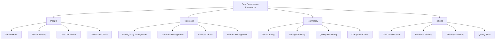
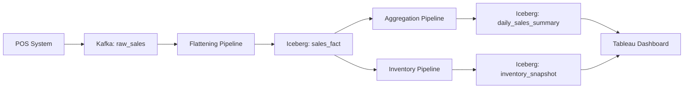
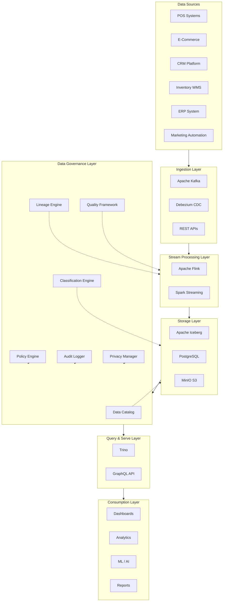
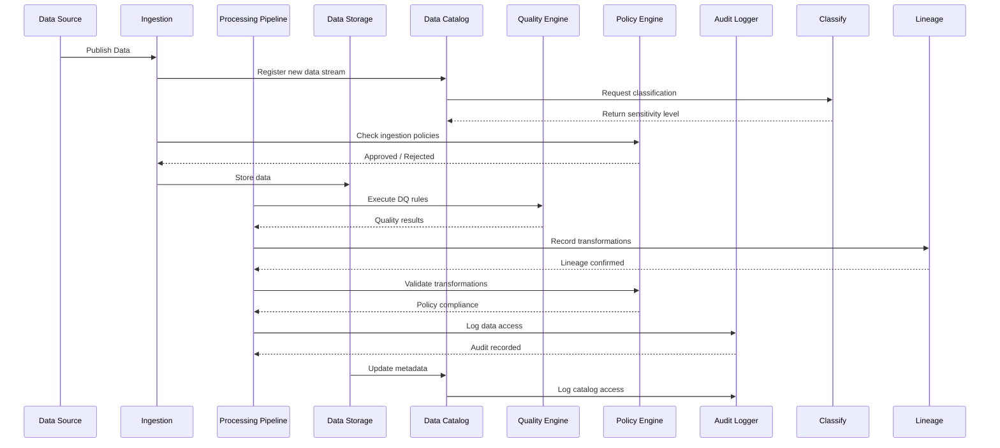
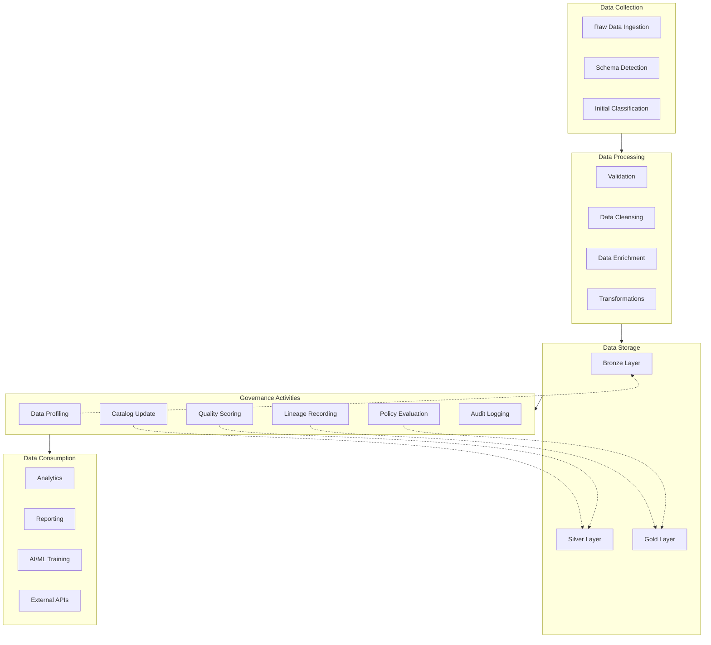
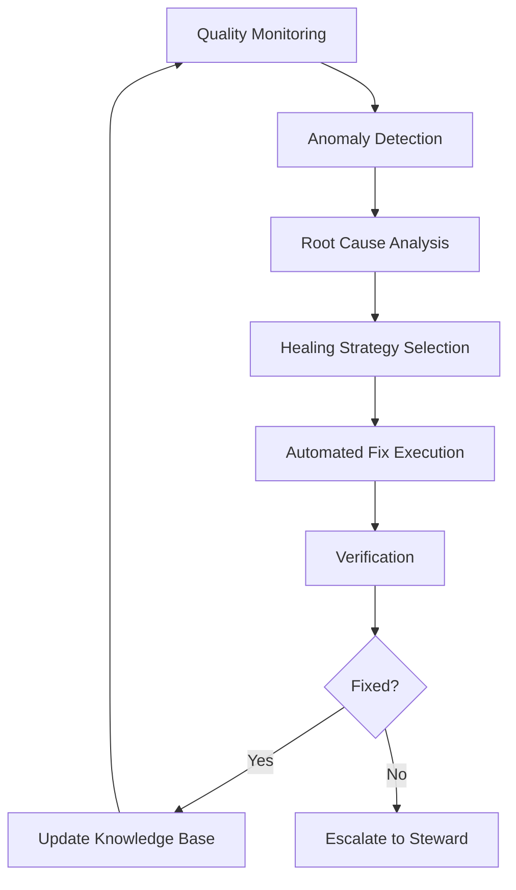

# Data Governance

## 1. Overview

### What is Data Governance?

Data Governance is a comprehensive framework of policies, processes, standards, and technologies that organizations use to manage, protect, and optimize their data assets. It encompasses the entire lifecycle of data from creation and collection to storage, processing, distribution, and eventual disposal. At its core, data governance establishes accountability for data quality, privacy, security, and compliance across the enterprise.

The discipline emerged in the early 2000s as organizations recognized that siloed data management approaches were insufficient for meeting regulatory requirements and enabling data-driven decision making. Today, data governance has evolved into a strategic capability that directly impacts an organization's ability to compete, comply with regulations, and maintain customer trust.

### Why was it created?

Data governance emerged as a formal discipline in response to several converging factors. The exponential growth of enterprise data, coupled with increasing regulatory requirements and high-profile data breaches, exposed the inadequacy of ad-hoc data management approaches. Organizations realized that without systematic oversight, data becomes unreliable, insecure, and ultimately worthless despite its potential value.

The Sarbanes-Oxley Act of 2002 marked a turning point, mandating that publicly traded companies implement controls over financial data. This regulatory pressure forced organizations to formalize their data management practices. Similarly, the introduction of GDPR in 2018 and HIPAA compliance requirements drove further adoption of governance frameworks across industries.

Beyond compliance, the rise of business intelligence and analytics created demand for reliable, consistent data across departments. Marketing needed to share customer data with operations; finance needed visibility into operational metrics. Without governance, each department created its own definitions and standards, leading to conflicting reports and organizational dysfunction.

### What business problems does it solve?

Data governance addresses critical enterprise challenges:

**Data Quality Degradation**: Without governance, organizations experience cascading data quality issues. Customer records become duplicated across systems, product information becomes inconsistent, and financial figures disagree between departments. A leading retail company discovered they had 47 different definitions of "active customer" across their organization, making any aggregate analysis meaningless. Data governance establishes authoritative definitions and quality standards that restore confidence in analytics.

**Regulatory Non-Compliance**: Enterprises face an ever-expanding landscape of regulations including GDPR, CCPA, HIPAA, SOX, PCI-DSS, and industry-specific requirements. Non-compliance can result in fines exceeding hundreds of millions of dollars, reputational damage, and loss of customer trust. Data governance provides the controls, documentation, and audit trails necessary to demonstrate compliance and respond to regulatory inquiries.

**Data Silos and Fragmentation**: When data governance is absent, departments create isolated data stores with incompatible formats, conflicting definitions, and no interoperability. A Fortune 500 retailer found their marketing team was analyzing customer purchase data that was 30 days stale compared to the operations team, leading to poorly timed promotions and missed revenue opportunities. Governance breaks down silos through standardized data models, shared dictionaries, and integrated pipelines.

**Security Breaches and Data Leaks**: Ungoverned data is often unsecured data. Sensitive customer information, intellectual property, and financial records may be accessible to unauthorized users or stored in unprotected systems. Data governance implements classification schemes, access controls, and encryption standards that protect data assets throughout their lifecycle.

**Poor Decision Making**: When executives cannot trust their data, they revert to intuition-based decisions or demand multiple redundant reports to "verify" numbers. This creates organizational paralysis and slows response to market changes. Data governance provides lineage visibility and quality metrics that enable confident, data-driven decisions.

**High Data Management Costs**: Without governance, organizations spend enormous resources on data reconciliation, error correction, and crisis management. Studies indicate that data professionals spend up to 80% of their time on data preparation and cleaning rather than analysis. Governance automation and preventive controls dramatically reduce these wastefully high costs.

### Why do enterprises use it?

Enterprise adoption of data governance continues to accelerate for compelling reasons:

**Regulatory Pressure**: The average enterprise now operates under 35+ overlapping regulatory frameworks requiring data governance. Financial institutions face Basel III, MiFID II, and Dodd-Frank requirements. Healthcare organizations must comply with HIPAA and emerging state-level privacy laws. Retailers navigate PCI-DSS, state privacy regulations, and industry standards. Without comprehensive governance, compliance becomes prohibitively expensive and risky.

**Digital Transformation Initiatives**: Organizations undergoing digital transformation require reliable data as the foundation for AI/ML initiatives, customer experience improvements, and operational automation. A manufacturing company undertaking predictive maintenance discovered that their IoT sensor data was 40% incomplete due to poor data collection practices. Data governance ensures digital initiatives start with high-quality, trustworthy data.

**Cloud Migration Complexity**: Moving to multi-cloud and hybrid cloud architectures exponentially increases data management complexity. Data governance provides the policies and metadata management necessary to maintain control across distributed environments. Organizations migrating to cloud without governance invariably experience data quality issues, security gaps, and compliance violations.

**M&A Activity**: Mergers and acquisitions introduce enormous data integration challenges. Two companies with different systems, definitions, and processes must rapidly unify their data landscapes. Data governance frameworks provide the structure for rapid, controlled integration while maintaining business continuity.

**Customer Trust Imperative**: In an era of frequent data breaches and privacy scandals, customers increasingly demand transparency about how their data is used. Organizations with strong governance practices can make credible privacy commitments and demonstrate accountability, building competitive advantage through trust.

---

## 2. Core Concepts

### Data Governance Framework



### Key Governance Concepts with Examples

**Data Ownership**

Data ownership establishes hierarchical accountability for data assets throughout the organization. Each data domain has an executive-level owner responsible for strategic decisions, a functional owner handling day-to-day decisions, and operational owners managing specific datasets.

```python
from dataclasses import dataclass
from datetime import datetime
from enum import Enum
from typing import Optional, List

class DataDomain(Enum):
    CUSTOMER = "customer"
    PRODUCT = "product"
    FINANCIAL = "financial"
    INVENTORY = "inventory"
    SUPPLY_CHAIN = "supply_chain"
    EMPLOYEE = "employee"
    MARKETING = "marketing"

class SensitivityLevel(Enum):
    PUBLIC = "public"
    INTERNAL = "internal"
    CONFIDENTIAL = "confidential"
    RESTRICTED = "restricted"

@dataclass
class DataOwner:
    owner_id: str
    name: str
    email: str
    domain: DataDomain
    role: str
    escalation_path: List[str]
    created_at: datetime
    is_active: bool = True

@dataclass
class DataAsset:
    asset_id: str
    name: str
    domain: DataDomain
    sensitivity: SensitivityLevel
    owner: DataOwner
    steward: Optional[str] = None
    description: str = ""
    business_definition: str = ""
    technical_location: str = ""
    last_quality_check: Optional[datetime] = None
    quality_score: float = 0.0
```

**Data Stewardship**

Data stewards are the operational backbone of data governance, responsible for implementing policies, resolving data quality issues, and ensuring compliance within their assigned domains. Stewards work at the intersection of business and technical teams, translating business requirements into data management practices.

```python
@dataclass
class DataSteward:
    steward_id: str
    name: str
    email: str
    domain: DataDomain
    responsibilities: List[str]
    certifications: List[str]
    escalation_threshold: int = 10  # Issues before escalation
    assigned_assets: List[str] = None
    
    def __post_init__(self):
        self.assigned_assets = self.assigned_assets or []

class StewardshipWorkflow:
    def __init__(self):
        self.issues = []
        self.resolution_times = {}
        
    def create_issue(self, asset_id: str, issue_type: str, 
                     severity: str, description: str) -> dict:
        issue = {
            "issue_id": f"DG-{len(self.issues) + 1:05d}",
            "asset_id": asset_id,
            "type": issue_type,
            "severity": severity,
            "description": description,
            "status": "open",
            "created_at": datetime.now(),
            "assignee": None
        }
        self.issues.append(issue)
        return issue
    
    def assign_issue(self, issue_id: str, steward: DataSteward):
        for issue in self.issues:
            if issue["issue_id"] == issue_id:
                issue["assignee"] = steward.name
                issue["assigned_at"] = datetime.now()
                
    def resolve_issue(self, issue_id: str, resolution: str):
        for issue in self.issues:
            if issue["issue_id"] == issue_id:
                issue["status"] = "resolved"
                issue["resolution"] = resolution
                issue["resolved_at"] = datetime.now()
                elapsed = (issue["resolved_at"] - issue["created_at"]).days
                self.resolution_times[issue_id] = elapsed
```

**Data Catalog**

A data catalog is a centralized inventory of all data assets within an organization, providing discoverability, understanding, and traceability. Modern data catalogs combine automated discovery with crowdsourced annotations to maintain comprehensive metadata.

```python
from typing import Dict, List, Optional
import json

class DataCatalog:
    def __init__(self):
        self.assets: Dict[str, dict] = {}
        self.metadata_templates: Dict[str, dict] = {}
        self.glossary_terms: Dict[str, dict] = {}
        
    def register_asset(self, asset: DataAsset, technical_metadata: dict,
                       operational_metadata: dict) -> str:
        catalog_entry = {
            "asset": asset,
            "technical": {
                "schema": technical_metadata.get("schema", {}),
                "storage_location": technical_metadata.get("location", ""),
                "format": technical_metadata.get("format", ""),
                "size_bytes": technical_metadata.get("size", 0),
                "partitioning": technical_metadata.get("partitioning", []),
                "indexes": technical_metadata.get("indexes", [])
            },
            "operational": {
                "row_count": operational_metadata.get("row_count", 0),
                "refresh_frequency": operational_metadata.get("frequency", ""),
                "last_refresh": operational_metadata.get("last_refresh"),
                "data_latency": operational_metadata.get("latency", ""),
                "upstream_sources": operational_metadata.get("sources", [])
            },
            "discovery": {
                "discovered_at": datetime.now(),
                "last_profiled": None,
                "certified": False,
                "certified_by": None,
                "certified_at": None
            }
        }
        self.assets[asset.asset_id] = catalog_entry
        return asset.asset_id
    
    def search(self, query: str, filters: dict = None) -> List[dict]:
        results = []
        query_lower = query.lower()
        
        for asset_id, entry in self.assets.items():
            asset = entry["asset"]
            
            # Text match on name, description, domain
            if (query_lower in asset.name.lower() or
                query_lower in asset.description.lower() or
                query_lower in asset.domain.value.lower()):
                if self._apply_filters(entry, filters):
                    results.append(entry)
                    
        return sorted(results, 
                      key=lambda x: x["asset"].quality_score, 
                      reverse=True)
    
    def _apply_filters(self, entry: dict, filters: dict) -> bool:
        if not filters:
            return True
        asset = entry["asset"]
        
        if "domain" in filters and asset.domain.value != filters["domain"]:
            return False
        if "sensitivity" in filters:
            if asset.sensitivity.value not in filters["sensitivity"]:
                return False
        if "min_quality" in filters:
            if asset.quality_score < filters["min_quality"]:
                return False
                
        return True
```

**Data Lineage**

Data lineage tracks the complete lifecycle of data elements from origin through all transformations to final consumption. Lineage provides impact analysis capabilities, enables root cause analysis of quality issues, and supports regulatory audit requirements.



```python
class DataLineage:
    def __init__(self):
        self.nodes: Dict[str, LineageNode] = {}
        self.edges: List[LineageEdge] = []
        self.transformations: Dict[str, Transformation] = {}
        
    def record_transformation(self, source_ids: List[str], 
                               target_id: str,
                               transformation: Transformation):
        self.transformations[target_id] = transformation
        
        for source_id in source_ids:
            edge = LineageEdge(
                edge_id=f"{source_id}->{target_id}",
                source=source_id,
                target=target_id,
                transformation_type=transformation.type,
                transformation_logic=transformation.logic,
                recorded_at=datetime.now()
            )
            self.edges.append(edge)
            
    def get_upstream_lineage(self, asset_id: str, 
                              max_depth: int = 10) -> List[dict]:
        lineage = []
        visited = set()
        
        def traverse(node_id: str, depth: int):
            if depth > max_depth or node_id in visited:
                return
            visited.add(node_id)
            
            for edge in self.edges:
                if edge.target == node_id:
                    source_node = self.nodes.get(edge.source)
                    lineage.append({
                        "node": edge.source,
                        "depth": depth,
                        "transformation": edge.transformation_type,
                        "logic": edge.transformation_logic
                    })
                    traverse(edge.source, depth + 1)
                    
        traverse(asset_id, 0)
        return lineage
    
    def get_downstream_impact(self, asset_id: str,
                               max_depth: int = 10) -> List[dict]:
        impact = []
        visited = set()
        
        def traverse(node_id: str, depth: int):
            if depth > max_depth or node_id in visited:
                return
            visited.add(node_id)
            
            for edge in self.edges:
                if edge.source == node_id:
                    impact.append({
                        "node": edge.target,
                        "depth": depth,
                        "transformation": edge.transformation_type,
                        "consumers": self._get_consumers(edge.target)
                    })
                    traverse(edge.target, depth + 1)
                    
        traverse(asset_id, 0)
        return impact
    
    def _get_consumers(self, asset_id: str) -> List[str]:
        consumers = []
        for edge in self.edges:
            if edge.source == asset_id:
                consumers.append(edge.target)
        return consumers
```

**Data Classification**

Data classification assigns sensitivity labels to data assets, determining how they must be handled, stored, transmitted, and disposed of. Classification schemes typically follow a four to five tier model with increasingly restrictive controls at higher sensitivity levels.

```python
class DataClassifier:
    SENSITIVITY_LEVELS = {
        "public": {
            "color": "green",
            "encryption_required": False,
            "access_control": "authenticated",
            "retention_period": "7 years",
            "compliance_requirements": []
        },
        "internal": {
            "color": "yellow",
            "encryption_required": True,
            "access_control": "role_based",
            "retention_period": "7 years",
            "compliance_requirements": ["internal_policy"]
        },
        "confidential": {
            "color": "orange",
            "encryption_required": True,
            "access_control": "explicit_grant",
            "retention_period": "10 years",
            "compliance_requirements": ["internal_policy", "SOX"]
        },
        "restricted": {
            "color": "red",
            "encryption_required": True,
            "access_control": "strict_need_basis",
            "retention_period": "10 years +",
            "compliance_requirements": ["GDPR", "HIPAA", "PCI"]
        }
    }
    
    def classify_asset(self, asset: DataAsset, 
                       content_scan_results: dict = None) -> SensitivityLevel:
        # Rule-based classification
        if self._contains_pii(asset):
            return SensitivityLevel.CONFIDENTIAL
        
        if self._contains_health_financial(asset):
            return SensitivityLevel.RESTRICTED
        
        if self._contains_intellectual_property(asset):
            return SensitivityLevel.CONFIDENTIAL
        
        if content_scan_results:
            if content_scan_results.get("pii_count", 0) > 0:
                return SensitivityLevel.CONFIDENTIAL
            if content_scan_results.get("financial_count", 0) > 0:
                return SensitivityLevel.CONFIDENTIAL
                
        return SensitivityLevel.INTERNAL
    
    def _contains_pii(self, asset: DataAsset) -> bool:
        pii_patterns = ["email", "phone", "ssn", "passport", 
                        "date_of_birth", "address", "name"]
        asset_lower = asset.name.lower() + asset.description.lower()
        return any(pattern in asset_lower for pattern in pii_patterns)
    
    def _contains_health_financial(self, asset: DataAsset) -> bool:
        sensitive_patterns = ["health", "medical", "diagnosis", 
                               "treatment", "bank_account", "credit_card"]
        asset_lower = asset.name.lower() + asset.description.lower()
        return any(pattern in asset_lower for pattern in sensitive_patterns)
    
    def _contains_intellectual_property(self, asset: DataAsset) -> bool:
        ip_patterns = ["source_code", "algorithm", "trade_secret",
                        "proprietary", "formula", "blueprint"]
        asset_lower = asset.name.lower() + asset.description.lower()
        return any(pattern in asset_lower for pattern in ip_patterns)
```

**Data Quality Rules**

Data quality rules define the expectations that data must meet and specify how to measure and enforce those expectations. Comprehensive DQ rules cover completeness, accuracy, consistency, timeliness, uniqueness, and validity.

```python
from enum import Enum
from typing import Callable, List, Dict, Any

class DQDimension(Enum):
    COMPLETENESS = "completeness"      # Are required fields populated?
    ACCURACY = "accuracy"              # Does data reflect real world?
    CONSISTENCY = "consistency"        # Is data consistent across systems?
    TIMELINESS = "timeliness"           # Is data current enough for use?
    UNIQUENESS = "uniqueness"          # Are there unnecessary duplicates?
    VALIDITY = "validity"              # Does data conform to formats/rules?

class DQRule:
    def __init__(self, rule_id: str, dimension: DQDimension,
                 description: str, sql_validation: str,
                 threshold: float = 1.0):
        self.rule_id = rule_id
        self.dimension = dimension
        self.description = description
        self.sql_validation = sql_validation
        self.threshold = threshold
        
    def evaluate(self, connection) -> DQResult:
        cursor = connection.cursor()
        cursor.execute(self.sql_validation)
        result = cursor.fetchone()
        return DQResult(
            rule_id=self.rule_id,
            dimension=self.dimension,
            passed=result["passed"],
            actual_value=result["value"],
            threshold=self.threshold,
            evaluated_at=datetime.now()
        )

class DQResult:
    def __init__(self, rule_id: str, dimension: DQDimension,
                 passed: bool, actual_value: Any,
                 threshold: float, evaluated_at: datetime):
        self.rule_id = rule_id
        self.dimension = dimension
        self.passed = passed
        self.actual_value = actual_value
        self.threshold = threshold
        self.evaluated_at = evaluated_at
        
    def to_dict(self) -> dict:
        return {
            "rule_id": self.rule_id,
            "dimension": self.dimension.value,
            "passed": self.passed,
            "value": self.actual_value,
            "threshold": self.threshold,
            "evaluated_at": self.evaluated_at.isoformat()
        }

# Example DQ Rules Configuration
DQ_RULES = [
    DQRule(
        rule_id="DQ-CUST-001",
        dimension=DQDimension.COMPLETENESS,
        description="Email address must be populated for all customers",
        sql_validation="""
            SELECT 
                CASE 
                    WHEN COUNT(*) = 0 THEN true
                    ELSE false
                END as passed,
                COUNT(*) as value
            FROM customer
            WHERE email IS NULL OR email = ''
        """,
        threshold=0.0
    ),
    DQRule(
        rule_id="DQ-CUST-002",
        dimension=DQDimension.VALIDITY,
        description="Email addresses must match valid email format",
        sql_validation="""
            SELECT 
                CASE 
                    WHEN COUNT(*) = 0 THEN true
                    ELSE false
                END as passed,
                COUNT(*) as value
            FROM customer
            WHERE email NOT LIKE '%@%.%' 
                AND email IS NOT NULL AND email != ''
        """,
        threshold=0.0
    ),
    DQRule(
        rule_id="DQ-ORD-001",
        dimension=DQDimension.ACCURACY,
        description="Order total must equal sum of line items",
        sql_validation="""
            SELECT 
                CASE 
                    WHEN COUNT(*) = 0 THEN true
                    ELSE false
                END as passed,
                COUNT(*) as value
            FROM orders o
            WHERE o.order_total != (
                SELECT COALESCE(SUM(l.quantity * l.unit_price), 0)
                FROM order_lineitems l
                WHERE l.order_id = o.order_id
            )
        """,
        threshold=0.0
    ),
    DQRule(
        rule_id="DQ-ORD-002",
        dimension=DQDimension.TIMELINESS,
        description="Orders must be processed within 24 hours",
        sql_validation="""
            SELECT 
                CASE 
                    WHEN COUNT(*) = 0 THEN true
                    ELSE false
                END as passed,
                COUNT(*) as value
            FROM orders
            WHERE order_status = 'pending'
                AND created_at < NOW() - INTERVAL '24 hours'
        """,
        threshold=0.01  # Allow 1% violation rate
    )
]
```

**Compliance Management**

```python
class ComplianceManager:
    REGULATIONS = {
        "GDPR": {
            "full_name": "General Data Protection Regulation",
            "jurisdiction": "European Union",
            "key_requirements": [
                "Lawful basis for processing",
                "Data subject rights",
                "Privacy by design",
                "Breach notification 72 hours",
                "Data portability"
            ],
            "penalties": "Up to 4% global revenue or €20M"
        },
        "CCPA": {
            "full_name": "California Consumer Privacy Act",
            "jurisdiction": "California, USA",
            "key_requirements": [
                "Right to know",
                "Right to delete",
                "Right to opt-out",
                "Non-discrimination"
            ],
            "penalties": "$7500 per intentional violation"
        },
        "SOX": {
            "full_name": "Sarbanes-Oxley Act",
            "jurisdiction": "United States",
            "key_requirements": [
                "Internal controls documentation",
                "Financial data accuracy",
                "Audit trails",
                "Executive certification"
            ],
            "penalties": "Criminal prosecution"
        },
        "HIPAA": {
            "full_name": "Health Insurance Portability and Accountability Act",
            "jurisdiction": "United States",
            "key_requirements": [
                "PHI protection",
                "Access controls",
                "Audit logging",
                "Breach notification"
            ],
            "penalties": "Up to $1.5M per violation category"
        },
        "PCI_DSS": {
            "full_name": "Payment Card Industry Data Security Standard",
            "jurisdiction": "Global",
            "key_requirements": [
                "Cardholder data encryption",
                "Network security",
                "Access control",
                "Vulnerability management"
            ],
            "penalties": "Monthly fines from $5000-$100000"
        }
    }
    
    def assess_compliance(self, regulation: str, data_assets: List[DataAsset]
                          ) -> ComplianceAssessment:
        reqs = self.REGULATIONS[regulation]["key_requirements"]
        findings = []
        risk_score = 0.0
        
        for asset in data_assets:
            for req in reqs:
                if self._gaps_requirement(asset, req):
                    findings.append({
                        "asset_id": asset.asset_id,
                        "requirement": req,
                        "gap": self._describe_gap(asset, req),
                        "risk_level": self._assess_risk(asset, req)
                    })
                    risk_score += self._risk_weight(req)
                    
        return ComplianceAssessment(
            regulation=regulation,
            assessment_date=datetime.now(),
            total_assets=len(data_assets),
            assets_with_gaps=len(set(f["asset_id"] for f in findings)),
            findings=findings,
            risk_score=risk_score,
            compliance_status="COMPLIANT" if risk_score == 0 else "PARTIAL"
        )
```

---

## 3. Why This Project Uses It

The Enterprise Retail Streaming Platform requires data governance for several critical reasons that directly impact business operations, regulatory compliance, and competitive advantage.

### Regulatory Compliance Requirements

The retail industry faces an increasingly complex regulatory landscape. The platform processes customer personal information including names, addresses, email addresses, and purchase histories—all of which fall under privacy regulations. GDPR applies to any EU customer data, requiring explicit consent, data minimization, and the ability to delete all personal data upon request. CCPA grants California residents rights to know what data is collected and to opt out of sales. State-level privacy laws in Virginia, Colorado, Connecticut, and other jurisdictions add additional requirements.

Beyond privacy regulations, the platform must comply with PCI-DSS since it handles payment card data. This requires strict controls over cardholder information, encryption standards, access management, and audit logging. SOX compliance is relevant for financial reporting accuracy, requiring controls over revenue recognition and financial data integrity.

The platform's data governance framework provides the enforcement mechanism for these requirements. Data classification ensures all personal data receives appropriate controls. Lineage tracking enables demonstrating compliance during audits. Retention policies ensure data is not kept longer than necessary. Access controls restrict personal data to authorized personnel with legitimate business needs.

### Multi-Tenant Data Isolation

The platform serves multiple retail clients from a shared infrastructure. Each client requires assurance that their data remains isolated from competitors' data. Data governance implements strict access controls, encryption at rest and in transit, and monitoring that detects and prevents cross-tenant data leakage. Without governance, the risk of inadvertent data mixing or unauthorized access would make multi-tenancy untenable.

### Data Quality for Analytics

The platform's value proposition depends on providing accurate, timely analytics to retail clients. Inventory levels must reflect reality within minutes. Sales figures must reconcile with financial systems. Customer insights must be based on complete, deduplicated data. Data governance establishes quality standards, monitors for violations, and creates feedback loops that continuously improve data quality.

When a major retailer questioned their dashboard numbers, data lineage allowed tracing each metric back to its source systems, confirming accuracy. Without this capability, such questions would require weeks of manual investigation.

### Operational Efficiency

The platform processes data from diverse sources including point-of-sale systems, e-commerce platforms, inventory management systems, and third-party data providers. Each source has different formats, conventions, and quality characteristics. Data governance standardizes how data is modeled, transformed, and validated as it flows through the platform. This reduces the custom processing required for each new data source and ensures consistent behavior across the platform.

### Risk Management

Data breaches represent existential risk for a platform handling sensitive consumer data. A single breach can result in regulatory fines, lawsuits, reputational damage, and loss of client trust. Data governance reduces breach risk through classification-driven access controls, encryption requirements, monitoring, and incident response procedures. When breaches do occur, governance ensures rapid, coordinated response.

### Customer Trust and Competitive Advantage

Retail clients increasingly evaluate data partners based on their governance practices. During vendor selection, retailers conduct security and privacy assessments that evaluate data handling practices. Strong governance demonstrates professionalism and reduces perceived risk. The platform's governance framework provides audit documentation, security certifications, and compliance attestations that differentiate it from competitors with weaker practices.

---

## 4. Architecture Position

### Data Governance in the Platform Stack



### Governance Component Interactions



### Governance Data Flow



---

## 5. Folder Structure

The data governance implementation follows a modular structure that separates concerns while maintaining tight integration with the broader platform. The governance-related code resides in dedicated modules with clear interfaces to data pipeline, storage, and query components.

```
retail-streaming-platform/
├── src/
│   └── governance/                     # Data Governance module
│       ├── __init__.py
│       ├── core/                       # Core governance concepts
│       │   ├── __init__.py
│       │   ├── owner.py               # Data ownership models
│       │   ├── steward.py              # Data stewardship models
│       │   ├── asset.py                # Data asset models
│       │   ├── classification.py       # Classification engine
│       │   └── exceptions.py           # Governance exceptions
│       ├── catalog/                    # Data catalog implementation
│       │   ├── __init__.py
│       │   ├── catalog.py              # Main catalog service
│       │   ├── search.py               # Search functionality
│       │   ├── metadata.py             # Metadata management
│       │   └── api.py                  # Catalog REST API
│       ├── lineage/                    # Lineage tracking
│       │   ├── __init__.py
│       │   ├── tracker.py              # Lineage recording
│       │   ├── graph.py                # Lineage graph operations
│       │   ├── impact.py               # Impact analysis
│       │   └── visualization.py        # Lineage visualization
│       ├── quality/                    # Data quality framework
│       │   ├── __init__.py
│       │   ├── rules.py                # DQ rule definitions
│       │   ├── engine.py               # Rule evaluation engine
│       │   ├── dimensions.py           # Quality dimensions
│       │   ├── monitoring.py           # Continuous monitoring
│       │   └── reporting.py             # Quality reporting
│       ├── policy/                     # Policy management
│       │   ├── __init__.py
│       │   ├── policies.py             # Policy definitions
│       │   ├── engine.py              # Policy evaluation
│       │   ├── compliance.py          # Compliance checking
│       │   └── retention.py           # Retention rules
│       ├── privacy/                    # Privacy management
│       │   ├── __init__.py
│       │   ├── consent.py             # Consent management
│       │   ├── anonymization.py        # Data anonymization
│       │   ├── rights.py              # Data subject rights
│       │   └── pii.py                 # PII detection/tracking
│       ├── security/                   # Security integration
│       │   ├── __init__.py
│       │   ├── access_control.py       # Access control enforcement
│       │   ├── encryption.py          # Encryption management
│       │   └── masking.py             # Data masking
│       ├── audit/                      # Audit logging
│       │   ├── __init__.py
│       │   ├── logger.py              # Audit event capture
│       │   ├── retention.py           # Audit log retention
│       │   └── reporting.py           # Audit reporting
│       ├── api/                        # Governance APIs
│       │   ├── __init__.py
│       │   ├── graphql/               # GraphQL schema
│       │   │   ├── __init__.py
│       │   │   ├── schema.py
│       │   │   ├── queries.py
│       │   │   └── mutations.py
│       │   └── rest/                  # REST endpoints
│       │       ├── __init__.py
│       │       ├── catalog.py
│       │       ├── lineage.py
│       │       ├── quality.py
│       │       └── policy.py
│       ├── integration/               # Platform integrations
│       │   ├── __init__.py
│       │   ├── kafka.py               # Kafka integration
│       │   ├── iceberg.py             # Iceberg integration
│       │   ├── trino.py               # Trino integration
│       │   └── airflow.py             # Airflow integration
│       └── config/
│           ├── __init__.py
│           ├── settings.py            # Governance settings
│           └── rules_config.py        # DQ rule configurations
├── tests/
│   └── governance/
│       ├── __init__.py
│       ├── test_catalog.py
│       ├── test_lineage.py
│       ├── test_quality.py
│       ├── test_policy.py
│       └── test_integration.py
├── config/
│   └── governance/
│       ├── default_policies.yaml     # Default policy templates
│       ├── classification_matrix.yaml # Classification rules
│       └── retention_matrix.yaml      # Retention schedules
├── docs/
│   └── governance/
│       ├── policies/                  # Policy documentation
│       ├── standards/                # Governance standards
│       └── runbooks/                  # Operational runbooks
└── scripts/
    └── governance/
        ├── initialize_catalog.py     # Catalog initialization
        ├── import_glossary.py         # Glossary import
        └── generate_report.py         # Report generation
```

### Key Governance Directory Purposes

**`core/`** contains fundamental governance models that define ownership, stewardship, and asset management concepts. These models are referenced throughout the governance system and provide the domain language for governance activities.

**`catalog/`** implements the data catalog functionality including asset registration, metadata management, search, and discovery. The catalog serves as the central registry of all data assets and their associated governance metadata.

**`lineage/`** tracks data flow through the platform, recording transformations, enabling impact analysis, and providing visualization capabilities. Lineage is essential for debugging data issues and demonstrating compliance.

**`quality/`** implements the data quality framework including rule definitions, evaluation engines, monitoring, and reporting. Quality scores propagate through the system to inform downstream consumers.

**`policy/`** manages data policies including retention, access, and usage policies. The policy engine evaluates whether operations comply with established rules.

**`privacy/`** handles privacy-specific concerns including consent management, PII detection, anonymization, and data subject rights fulfillment.

**`security/`** integrates with the broader platform security infrastructure to enforce access controls, encryption, and data masking based on governance classifications.

**`audit/`** captures all governance-relevant events for compliance auditing, security investigation, and operational monitoring.

---

## 6. Implementation Walkthrough

### Configuration Setup

The data governance framework uses a hierarchical configuration system that allows different settings per environment while maintaining consistency.

```python
# config/governance/settings.py
from pydantic import BaseModel
from typing import Dict, List, Optional
from enum import Enum

class Environment(Enum):
    DEVELOPMENT = "development"
    STAGING = "staging"
    PRODUCTION = "production"

class GovernanceSettings(BaseModel):
    environment: Environment
    debug: bool = False
    
    # Catalog settings
    catalog_url: str
    catalog_index_name: str = "data_assets"
    
    # Lineage settings
    lineage_backend: str = "postgresql"
    lineage_connection_pool_size: int = 10
    
    # Quality settings
    quality_check_interval_seconds: int = 3600
    quality_score_threshold: float = 0.95
    
    # Policy settings
    policy_evaluation_timeout_seconds: int = 30
    policy_cache_ttl_seconds: int = 300
    
    # Privacy settings
    pii_detection_enabled: bool = True
    consent_required_regions: List[str] = ["EU", "CA"]
    
    # Audit settings
    audit_log_retention_days: int = 2555  # 7 years for SOX
    audit_async_enabled: bool = True

class DatabaseConfig(BaseModel):
    host: str
    port: int = 5432
    database: str
    username: str
    password: str
    ssl_mode: str = "require"
    
class S3Config(BaseModel):
    endpoint: str
    bucket: str
    access_key: str
    secret_key: str
    region: str

# Environment-specific configurations
ENVIRONMENTS = {
    "development": GovernanceSettings(
        environment=Environment.DEVELOPMENT,
        debug=True,
        catalog_url="http://localhost:8080",
        quality_score_threshold=0.80
    ),
    "staging": GovernanceSettings(
        environment=Environment.STAGING,
        debug=False,
        catalog_url="http://governance-staging.internal:8080",
        quality_score_threshold=0.90
    ),
    "production": GovernanceSettings(
        environment=Environment.PRODUCTION,
        debug=False,
        catalog_url="http://governance-prod.internal:8080",
        quality_score_threshold=0.95,
        audit_log_retention_days=2555,
        consent_required_regions=["EU", "CA", "VA", "CO", "CT"]
    )
}
```

### Policy Configuration

Policies are defined declaratively and enforced programmatically. This separation allows policy updates without code changes.

```yaml
# config/governance/default_policies.yaml
policies:
  - policy_id: "RET-001"
    name: "Customer PII Protection"
    description: "All customer PII must be encrypted at rest and in transit"
    applicability:
      domains: ["customer"]
      sensitivity_levels: ["confidential", "restricted"]
      patterns: ["*pii*", "*personal*", "*email*", "*phone*"]
    requirements:
      encryption:
        at_rest: true
        in_transit: true
        algorithm: "AES-256"
      access_control:
        authentication: "required"
        authorization: "role_based"
        roles: ["data_analyst", "data_engineer", "data_scientist"]
      audit:
        log_access: true
        log_modifications: true
        retention_days: 2555
    enforcement:
      stage: "storage"
      action: "block_violation"
    compliance:
      regulations: ["GDPR", "CCPA"]
      penalties: "Financial and legal action"

  - policy_id: "RET-002"
    name: "Financial Data Integrity"
    description: "Financial transaction data must maintain accuracy and auditability"
    applicability:
      domains: ["financial", "order"]
      sensitivity_levels: ["confidential", "restricted"]
      patterns: ["*revenue*", "*transaction*", "*payment*"]
    requirements:
      accuracy:
        tolerance: 0.001  # 0.1% tolerance
        reconciliation_frequency: "daily"
      completeness:
        required_fields: ["amount", "currency", "timestamp", "account_id"]
      lineage:
        track_transformations: true
        require_source_documentation: true
      retention:
        minimum_years: 7
        storage_class: "glacier"
    enforcement:
      stage: "pipeline"
      action: "alert_and_block_critical"
    compliance:
      regulations: ["SOX", "PCI-DSS"]
      penalties: "Regulatory violation"

  - policy_id: "RET-003"
    name: "Data Retention Compliance"
    description: "Data must be retained and disposed of according to regulatory requirements"
    applicability:
      domains: ["*"]
      sensitivity_levels: ["*"]
    requirements:
      retention:
        public: 1095  # 3 years
        internal: 2555  # 7 years
        confidential: 3650  # 10 years
        restricted: 3650  # 10 years minimum
      disposal:
        method: "secure_delete"
        certification_required: true
        documentation_required: true
    enforcement:
      stage: "storage"
      action: "alert_expiring"
    compliance:
      regulations: ["GDPR", "SOX", "CCPA"]

  - policy_id: "RET-004"
    name: "Real-Time Data Freshness"
    description: "Operational data must meet freshness requirements for business use"
    applicability:
      domains: ["inventory", "order"]
      data_types: ["operational"]
    requirements:
      latency:
        inventory_updates: "< 5 minutes"
        order_status: "< 1 minute"
        pricing: "< 30 seconds"
      availability:
        uptime_sla: 99.9
        monitoring: "continuous"
      alerting:
        breach_threshold: 1.5x target latency
    enforcement:
      stage: "pipeline"
      action: "alert"
    compliance:
      regulations: []
```

### Data Quality Rule Configuration

```yaml
# config/governance/quality_rules.yaml
quality_frameworks:
  customer_domain:
    rules:
      - rule_id: "DQ-CUST-001"
        name: "Email Completeness"
        dimension: "completeness"
        description: "Email must be populated for all customers with email consent"
        sql: |
          SELECT 
            CASE 
              WHEN COUNT(*) = 0 THEN TRUE
              ELSE FALSE
            END AS passed,
            COUNT(*) AS violations
          FROM customer
          WHERE email_consent = TRUE 
            AND (email IS NULL OR email = '')
        threshold: 0
        severity: "critical"
        owner: "customer_data_steward"
        
      - rule_id: "DQ-CUST-002"
        name: "Email Format Validity"
        dimension: "validity"
        description: "Email addresses must conform to email format"
        sql: |
          SELECT 
            CASE 
              WHEN COUNT(*) = 0 THEN TRUE
              ELSE FALSE
            END AS passed,
            COUNT(*) AS violations
          FROM customer
          WHERE email IS NOT NULL 
            AND email != ''
            AND email !~* '^[A-Za-z0-9._%+-]+@[A-Za-z0-9.-]+\.[A-Za-z]{2,}$'
        threshold: 0
        severity: "high"
        owner: "customer_data_steward"
        
      - rule_id: "DQ-CUST-003"
        name: "Phone Number Validity"
        dimension: "validity"
        description: "Phone numbers must contain only valid characters"
        sql: |
          SELECT 
            CASE 
              WHEN COUNT(*) = 0 THEN TRUE
              ELSE FALSE
            END AS passed,
            COUNT(*) AS violations
          FROM customer
          WHERE phone IS NOT NULL 
            AND phone != ''
            AND phone !~ '^\+?[1-9]\d{1,14}$'
        threshold: 0.01  # 1% allowance for international formats
        severity: "medium"
        
      - rule_id: "DQ-CUST-004"
        name: "Address Completeness"
        dimension: "completeness"
        description: "Shipping addresses must have required fields"
        sql: |
          SELECT 
            CASE 
              WHEN COUNT(*) = 0 THEN TRUE
              ELSE FALSE
            END AS passed,
            COUNT(*) AS violations
          FROM customer_address
          WHERE address_type = 'shipping'
            AND (street IS NULL OR city IS NULL 
              OR state IS NULL OR postal_code IS NULL 
              OR country IS NULL)
        threshold: 0
        severity: "high"

  order_domain:
    rules:
      - rule_id: "DQ-ORD-001"
        name: "Order Total Accuracy"
        dimension: "accuracy"
        description: "Order total must equal sum of line items"
        sql: |
          SELECT 
            CASE 
              WHEN COUNT(*) = 0 THEN TRUE
              ELSE FALSE
            END AS passed,
            COUNT(*) AS violations,
            SUM(abs(order_total - calculated_total)) as total_variance
          FROM (
            SELECT 
              o.order_id,
              o.order_total,
              COALESCE(SUM(l.quantity * l.unit_price), 0) AS calculated_total
            FROM orders o
            LEFT JOIN order_lineitems l ON o.order_id = l.order_id
            GROUP BY o.order_id, o.order_total
            HAVING abs(o.order_total - COALESCE(SUM(l.quantity * l.unit_price), 0)) > 0.01
          ) violations
        threshold: 0
        severity: "critical"
        alert_channels: ["slack", "email"]
        
      - rule_id: "DQ-ORD-002"
        name: "Order Date Validity"
        dimension: "validity"
        description: "Order dates must be within reasonable bounds"
        sql: |
          SELECT 
            CASE 
              WHEN COUNT(*) = 0 THEN TRUE
              ELSE FALSE
            END AS passed,
            COUNT(*) AS violations
          FROM orders
          WHERE order_date < '2020-01-01'
             OR order_date > CURRENT_DATE + 1
        threshold: 0
        severity: "high"
        
      - rule_id: "DQ-ORD-003"
        name: "Duplicate Order Detection"
        dimension: "uniqueness"
        description: "Orders must not have duplicate line items"
        sql: |
          SELECT 
            CASE 
              WHEN COUNT(*) = 0 THEN TRUE
              ELSE FALSE
            END AS passed,
            COUNT(*) AS violations
          FROM (
            SELECT order_id, product_id, COUNT(*) as cnt
            FROM order_lineitems
            GROUP BY order_id, product_id
            HAVING COUNT(*) > 1
          ) duplicates
        threshold: 0
        severity: "high"
```

### Workflow Implementation

```python
# Workflow for handling data quality violations
from enum import Enum
from typing import List, Dict
from datetime import datetime, timedelta

class ViolationSeverity(Enum):
    LOW = "low"
    MEDIUM = "medium"
    HIGH = "high"
    CRITICAL = "critical"

class ViolationWorkflow:
    def __init__(self, notification_service, ticket_service):
        self.notification = notification_service
        self.tickets = ticket_service
        self.escalation_rules = {
            ViolationSeverity.CRITICAL: {
                "notify_immediately": ["data_governance_lead", "domain_owner"],
                "ticket_required": True,
                "ticket_priority": "P1",
                "escalation_hours": 0
            },
            ViolationSeverity.HIGH: {
                "notify_immediately": ["data_steward"],
                "ticket_required": True,
                "ticket_priority": "P2",
                "escalation_hours": 4
            },
            ViolationSeverity.MEDIUM: {
                "notify_immediately": [],
                "ticket_required": True,
                "ticket_priority": "P3",
                "escalation_hours": 24
            },
            ViolationSeverity.LOW: {
                "notify_immediately": [],
                "ticket_required": False,
                "ticket_priority": "P4",
                "escalation_hours": 72
            }
        }
        
    def process_violation(self, violation: DQResult, asset: DataAsset):
        severity = self._determine_severity(violation)
        rules = self.escalation_rules[severity]
        
        # Create ticket if required
        ticket = None
        if rules["ticket_required"]:
            ticket = self.tickets.create({
                "title": f"DQ Violation: {violation.rule_id}",
                "description": self._format_violation_description(
                    violation, asset
                ),
                "priority": rules["ticket_priority"],
                "assignee": asset.steward,
                "labels": ["data_quality", violation.dimension.value]
            })
            
        # Send immediate notifications
        for recipient in rules["notify_immediately"]:
            self.notification.send_immediate(
                recipient=recipient,
                subject=f"CRITICAL Data Quality Violation: {asset.name}",
                message=self._format_notification_message(
                    violation, asset, ticket
                ),
                channels=["slack", "email"]
            )
            
        # Schedule escalation if applicable
        if rules["escalation_hours"] > 0 and ticket:
            self._schedule_escalation(
                ticket, rules["escalation_hours"]
            )
            
        return ticket
        
    def _determine_severity(self, violation: DQResult) -> ViolationSeverity:
        if not violation.passed:
            if violation.actual_value > 1000:
                return ViolationSeverity.CRITICAL
            elif violation.actual_value > 100:
                return ViolationSeverity.HIGH
            elif violation.actual_value > 10:
                return ViolationSeverity.MEDIUM
            else:
                return ViolationSeverity.LOW
        return ViolationSeverity.LOW
```

---

## 7. Production Best Practices

### Catalog Management Best Practices

**Implement Automated Discovery**: Configure catalog connectors to automatically discover new data assets as they are created. Set up scheduled crawlers that scan data storage locations and register new tables, files, and streams without manual intervention. This prevents shadow data from forming and ensures comprehensive governance coverage.

```python
# Automated catalog discovery configuration
class CatalogDiscovery:
    def __init__(self, catalog: DataCatalog, connectors: List[Connector]):
        self.catalog = catalog
        self.connectors = connectors
        self.schedule = Schedule(cron="0 */4 * * *")  # Every 4 hours
        
    async def run_discovery(self):
        for connector in self.connectors:
            assets = await connector.discover_assets()
            
            for asset in assets:
                existing = self.catalog.find_by_location(
                    asset.location
                )
                
                if not existing:
                    # Auto-classify and register
                    classification = self._classify_asset(asset)
                    self.catalog.register_asset(
                        asset=asset,
                        classification=classification,
                        discovery_source=connector.name
                    )
                    await self._notify_new_asset(asset)
                else:
                    # Update metadata
                    await self._update_metadata(existing, asset)
```

**Enforce Rich Metadata Standards**: Require minimum metadata standards before assets are marked as "certified." At minimum, each asset should have a business description, owner assignment, sensitivity classification, and quality score. Use workflow gates that prevent certification until standards are met.

**Maintain a Business Glossary**: Integrate business terminology into the catalog. Each business concept should have a definition, synonyms, related terms, and mappings to physical data assets. This bridges the gap between technical and business stakeholders.

### Lineage Best Practices

**Capture Lineage at Transformation Points**: Instrument all data pipelines to record lineage when data is transformed. Focus on critical transformations that change data semantics, aggregations, or joins that combine datasets.

```python
# Lineage capture decorator for pipeline functions
from functools import wraps

def capture_lineage(operation_name: str, 
                   transformation_type: str):
    def decorator(func):
        @wraps(func)
        async def wrapper(source_data, target_data, context):
            lineage = context.lineage_tracker
            
            # Record input lineage
            source_ids = await lineage.resolve_asset_ids(
                context.get_source_locations()
            )
            
            # Execute transformation
            result = await func(source_data, target_data, context)
            
            # Record output lineage
            target_id = await lineage.register_asset(
                name=context.target_asset_name,
                location=context.target_location,
                metadata={"operation": operation_name}
            )
            
            transformation = Transformation(
                type=transformation_type,
                logic=f"{func.__name__}::{operation_name}",
                source_ids=source_ids,
                target_id=target_id,
                executed_at=datetime.now(),
                execution_id=context.run_id
            )
            
            await lineage.record(transformation)
            return result
            
        return wrapper
    return decorator

# Usage in pipeline code
@pipeline.stage("aggregate_daily_sales")
@partition_by("region")
@capture_lineage(
    operation_name="daily_sales_aggregation",
    transformation_type="aggregation"
)
async def aggregate_sales(source_df, target_df, context):
    return source_df.groupBy("region", "date").agg(
        sum("revenue").alias("total_revenue"),
        count("order_id").alias("order_count"),
        avg("discount").alias("avg_discount")
    )
```

**Use Lineage for Root Cause Analysis**: When quality issues arise, use lineage to quickly identify potential sources. The ability to trace a data element back through its complete history dramatically reduces mean time to resolution.

### Quality Best Practices

**Implement Layered Quality Checks**: Apply different quality checks at different stages of the pipeline. Bronze layer checks focus on completeness and basic validity. Silver layer checks enforce business rules and cross-system consistency. Gold layer checks validate that aggregations and calculations are correct.

**Set Meaningful Thresholds**: Avoid setting thresholds at 100% unless absolutely necessary. Some data quality issues are acceptable within tolerance. Setting unrealistic thresholds leads to alert fatigue and causes teams to ignore violations. Instead, set thresholds based on business impact and historical trends.

```python
# Adaptive threshold calculation
class AdaptiveQualityThreshold:
    def __init__(self, history_days: int = 30):
        self.history_days = history_days
        
    def calculate_threshold(self, rule_id: str, 
                             business_impact: str) -> float:
        historical = self._get_historical_violations(rule_id)
        
        if not historical:
            return self._get_default_threshold(business_impact)
            
        # Calculate baseline as 99th percentile of historical
        baseline = np.percentile(historical, 99)
        
        # Add buffer for normal variation
        buffer = baseline * 0.1
        
        return min(baseline + buffer, 1.0)
        
    def _get_default_threshold(self, impact: str) -> float:
        return {
            "critical": 0.99,
            "high": 0.95,
            "medium": 0.90,
            "low": 0.80
        }.get(impact, 0.95)
```

### Policy Best Practices

**Separate Policy Definition from Enforcement**: Store policies in declarative configuration files that can be version controlled and reviewed through standard change processes. Keep enforcement logic separate so policy changes don't require code deployments.

**Implement Policy Testing**: Before deploying new policies, test them against production-like data to verify they work as intended and don't create unintended consequences. Use shadow mode to evaluate policies without enforcement.

```python
# Policy testing framework
class PolicyTestFramework:
    def __init__(self, policy_engine: PolicyEngine):
        self.engine = policy_engine
        self.test_results = []
        
    def test_policy(self, policy: Policy, 
                    test_cases: List[TestCase]) -> TestReport:
        results = []
        
        for case in test_cases:
            # Execute policy in shadow mode
            result = self.engine.evaluate(
                policy=policy,
                data=case.data,
                enforcement_mode="shadow"
            )
            
            results.append({
                "test_case": case.name,
                "expected": case.expected_decision,
                "actual": result.decision,
                "passed": result.decision == case.expected_decision,
                "details": result.reason
            })
            
        return TestReport(
            policy_id=policy.policy_id,
            results=results,
            overall_passed=all(r["passed"] for r in results)
        )
```

### Security Best Practices

**Implement Defense in Depth**: Never rely on a single security control. Combine classification, access controls, encryption, and monitoring to create overlapping layers of protection. If one control fails, others provide backup.

**Classify Data Before Processing**: Always determine data sensitivity before processing. Build classification checks into data pipelines so that appropriate controls are applied automatically. Unclassified data should receive the most restrictive default classification until reviewed.

**Rotate Credentials Regularly**: Automate credential rotation for all data access points. Use short-lived credentials wherever possible. Avoid hardcoding credentials in code or configuration files.

---

## 8. Common Problems

| Problem | Cause | Impact | Solution |
|---------|-------|--------|----------|
| **Duplicate Customer Records** | Multiple systems creating records without deduplication keys | Incorrect analytics, duplicate marketing, customer frustration | Implement golden record management with probabilistic matching, establish authoritative customer ID system |
| **Stale Dashboard Data** | Pipeline delays, failed jobs not alerting, unclear freshness requirements | Poor business decisions based on outdated information | Define explicit freshness SLAs per dataset, implement freshness monitoring, create automatic alerts for SLA breaches |
| **Conflicting Metric Definitions** | Different teams using different calculations for same metric | Inconsistent reporting, inability to reconcile numbers, lost confidence in data | Create authoritative metric definitions in business glossary, implement metric validation, require certification for KPI datasets |
| **Unauthorized Data Access** | Overly permissive access controls, lack of regular access reviews | Data breaches, compliance violations, privacy incidents | Implement role-based access with regular recertification, classify all data, monitor access patterns for anomalies |
| **Pipeline Failures Silent** | Insufficient monitoring, no alerting on pipeline health | Data freshness issues undetected, downstream impact | Implement comprehensive pipeline monitoring with SLA tracking, alert on any pipeline delay beyond threshold |
| **PII in Unintended Locations** | Data pipelines copying PII to non-production environments, improper masking | Compliance violations, breach risk amplification | Scan all environments for PII, enforce masking in non-production, implement data lineage to track PII flow |
| **Data Retention Non-Compliance** | No automated enforcement of retention policies, manual deletion processes | Regulatory violations, unnecessary storage costs | Automate retention enforcement at storage layer, implement legal hold capabilities, audit deletion processes |
| **Quality Score Gaming** | Teams optimizing for quality metrics rather than actual quality | False sense of data quality, issues masked | Measure quality holistically across dimensions, include data consumer feedback, audit quality processes |
| **Glossary Not Adopted** | Business glossary not integrated into tools, no incentives for contribution | Continued definition confusion, no shared understanding | Integrate glossary into catalog search, require glossary terms for certified assets, recognize stewards for contributions |
| **Lineage Gaps** | Transformations not instrumented, manual processes outside governance | Incomplete impact analysis, hidden data risks | Extend lineage coverage incrementally, focus on critical paths first, automate lineage capture in standard tools |

---

## 9. Performance Optimization

### Catalog Search Optimization

```python
from elasticsearch import Elasticsearch
from typing import List, Optional
import asyncio

class OptimizedCatalogSearch:
    def __init__(self, es_client: Elasticsearch):
        self.es = es_client
        self.index_name = "data_assets"
        
    async def search_async(self, query: str, 
                           filters: dict,
                           pagination: dict) -> dict:
        # Build optimized Elasticsearch query
        es_query = {
            "bool": {
                "must": [
                    {
                        "multi_match": {
                            "query": query,
                            "fields": [
                                "name^3",
                                "description^2", 
                                "business_terms^2",
                                "column_names",
                                "tags"
                            ],
                            "type": "best_fields",
                            "fuzziness": "AUTO"
                        }
                    }
                ],
                "filter": self._build_filters(filters),
                "should": [
                    {"term": {"certified": {""value": True, "boost": 2}}}
                ]
            }
        }
        
        # Execute with scrolling for large result sets
        if pagination.get("use_scroll"):
            return await self._scroll_search(
                es_query, 
                pagination["scroll_size"]
            )
            
        # Standard search with pagination
        response = await asyncio.to_thread(
            self.es.search,
            index=self.index_name,
            query=es_query,
            from_=pagination.get("offset", 0),
            size=pagination.get("limit", 20),
            sort=[
                {"_score": "desc"},
                {"last_profiled": "desc"}
            ],
            highlight={
                "fields": {
                    "name": {},
                    "description": {}
                }
            }
        )
        
        return {
            "total": response["hits"]["total"]["value"],
            "results": [self._format_hit(h) for h in response["hits"]["hits"]],
            "took_ms": response["took"]
        }
        
    def _build_filters(self, filters: dict) -> List[dict]:
        es_filters = []
        
        if filters.get("domain"):
            es_filters.append({"term": {"domain": filters["domain"]}})
            
        if filters.get("sensitivity"):
            es_filters.append({
                "terms": {"sensitivity": filters["sensitivity"]}
            })
            
        if filters.get("owner"):
            es_filters.append({"term": {"owner.name": filters["owner"]}})
            
        if filters.get("min_quality_score"):
            es_filters.append({
                "range": {"quality_score": 
                    {"gte": filters["min_quality_score"]}
                }
            })
            
        if filters.get("created_after"):
            es_filters.append({
                "range": {"created_at": 
                    {"gte": filters["created_after"]}
                }
            })
            
        return es_filters
```

### Quality Engine Optimization

```python
import numpy as np
from concurrent.futures import ThreadPoolExecutor
from typing import List, Callable

class ParallelQualityEngine:
    def __init__(self, db_pool, max_workers: int = 10):
        self.db_pool = db_pool
        self.max_workers = max_workers
        
    def evaluate_rules_parallel(self, rules: List[DQRule],
                                  assets: List[DataAsset]
                                  ) -> List[DQResult]:
        # Group rules by evaluation complexity
        simple_rules = []
        complex_rules = []
        
        for rule in rules:
            if self._is_simple_rule(rule):
                simple_rules.append(rule)
            else:
                complex_rules.append(rule)
                
        results = []
        
        # Execute simple rules in batch
        if simple_rules:
            batch_results = self._execute_batch(simple_rules, assets)
            results.extend(batch_results)
            
        # Execute complex rules in parallel with thread pool
        with ThreadPoolExecutor(max_workers=self.max_workers) as executor:
            futures = {
                executor.submit(self._evaluate_complex_rule, rule, assets): rule
                for rule in complex_rules
            }
            
            for future in futures:
                results.append(future.result())
                
        return results
        
    def _execute_batch(self, rules: List[DQRule], 
                       assets: List[DataAsset]) -> List[DQResult]:
        # Consolidate multiple rules into single query
        combined_sql = self._combine_rule_queries(rules)
        
        with self.db_pool.connection() as conn:
            cursor = conn.cursor()
            cursor.execute(combined_sql)
            rows = cursor.fetchall()
            
        results = []
        for row in rows:
            for rule in rules:
                if rule.rule_id == row["rule_id"]:
                    results.append(DQResult(
                        rule_id=rule.rule_id,
                        dimension=rule.dimension,
                        passed=row["passed"],
                        actual_value=row["value"],
                        threshold=rule.threshold,
                        evaluated_at=datetime.now()
                    ))
                    
        return results
        
    def _combine_rule_queries(self, rules: List[DQRule]) -> str:
        # UNION ALL multiple DQ checks into single query
        subqueries = []
        
        for rule in rules:
            subqueries.append(f"""
                SELECT 
                    '{rule.rule_id}' as rule_id,
                    ({rule.sql_validation}) as evaluation
            """)
            
        return f"""
            SELECT * FROM (
                {' UNION ALL '.join(subqueries)}
            ) combined
        """
```

### Caching Strategy

```python
import redis
import json
from typing import Any, Optional
from functools import wraps

class GovernanceCache:
    def __init__(self, redis_client: redis.Redis):
        self.redis = redis_client
        self.default_ttl = 300  # 5 minutes
        
    def get_cached(self, key: str) -> Optional[Any]:
        cached = self.redis.get(key)
        if cached:
            return json.loads(cached)
        return None
        
    def set_cached(self, key: str, value: Any, 
                   ttl: int = None) -> None:
        ttl = ttl or self.default_ttl
        self.redis.setex(
            key,
            ttl,
            json.dumps(value)
        )
        
    def invalidate(self, pattern: str) -> int:
        keys = self.redis.keys(pattern)
        if keys:
            return self.redis.delete(*keys)
        return 0
        
    def cached(self, key_prefix: str, ttl: int = None):
        def decorator(func):
            @wraps(func)
            def wrapper(*args, **kwargs):
                # Generate cache key from function name and arguments
                cache_key = f"governance:{key_prefix}:{func.__name__}:{hash(str(args))}"
                
                # Check cache
                cached_result = self.get_cached(cache_key)
                if cached_result is not None:
                    return cached_result
                    
                # Execute function
                result = func(*args, **kwargs)
                
                # Cache result
                self.set_cached(cache_key, result, ttl)
                
                return result
            return wrapper
        return decorator

# Usage with caching
cache = GovernanceCache(redis_client)

@cache.cached("classification", ttl=3600)
def get_classification(asset_id: str) -> SensitivityLevel:
    # Expensive classification lookup
    return classified_asset.sensitivity
```

---

## 10. Security

### Authentication and Authorization

```python
from enum import Enum
from typing import Set, List
from dataclasses import dataclass
from datetime import datetime, timedelta

class AuthMethod(Enum):
    API_KEY = "api_key"
    OAUTH2 = "oauth2"
    JWT = "jwt"
    IAM = "iam"  # AWS IAM, GCP IAM, etc.

class Permission(Enum):
    CATALOG_READ = "catalog:read"
    CATALOG_WRITE = "catalog:write"
    CATALOG_ADMIN = "catalog:admin"
    LINEAGE_READ = "lineage:read"
    QUALITY_READ = "quality:read"
    QUALITY_WRITE = "quality:write"
    POLICY_READ = "policy:read"
    POLICY_WRITE = "policy:write"
    POLICY_ADMIN = "policy:admin"
    AUDIT_READ = "audit:read"
    SENSITIVE_DATA_ACCESS = "sensitive:access"
    DATA_EXPORT = "data:export"

@dataclass
class User:
    user_id: str
    email: str
    roles: Set[str]
    auth_method: AuthMethod
    mfa_enabled: bool = False
    last_auth: Optional[datetime] = None
    
class RBACEngine:
    def __init__(self):
        self.role_permissions = {
            "data_engineer": {
                Permission.CATALOG_READ,
                Permission.CATALOG_WRITE,
                Permission.LINEAGE_READ,
                Permission.QUALITY_READ,
                Permission.QUALITY_WRITE,
            },
            "data_analyst": {
                Permission.CATALOG_READ,
                Permission.LINEAGE_READ,
                Permission.QUALITY_READ,
            },
            "data_scientist": {
                Permission.CATALOG_READ,
                Permission.LINEAGE_READ,
                Permission.QUALITY_READ,
                Permission.SENSITIVE_DATA_ACCESS,
            },
            "data_steward": {
                Permission.CATALOG_READ,
                Permission.CATALOG_WRITE,
                Permission.LINEAGE_READ,
                Permission.QUALITY_READ,
                Permission.QUALITY_WRITE,
                Permission.POLICY_READ,
            },
            "governance_admin": {
                Permission.CATALOG_ADMIN,
                Permission.LINEAGE_READ,
                Permission.QUALITY_READ,
                Permission.QUALITY_WRITE,
                Permission.POLICY_READ,
                Permission.POLICY_WRITE,
                Permission.POLICY_ADMIN,
                Permission.AUDIT_READ,
                Permission.SENSITIVE_DATA_ACCESS,
            },
            "auditor": {
                Permission.CATALOG_READ,
                Permission.LINEAGE_READ,
                Permission.QUALITY_READ,
                Permission.POLICY_READ,
                Permission.AUDIT_READ,
            }
        }
        
    def check_permission(self, user: User, 
                         permission: Permission) -> bool:
        if not user.mfa_enabled and user.auth_method == AuthMethod.JWT:
            return False  # Require MFA for JWT access
            
        for role in user.roles:
            if permission in self.role_permissions.get(role, set()):
                return True
                
        return False
        
    def get_effective_permissions(self, user: User) -> Set[Permission]:
        permissions = set()
        for role in user.roles:
            permissions.update(
                self.role_permissions.get(role, set())
            )
        return permissions
```

### Compliance Frameworks

```python
class ComplianceFramework:
    def __init__(self, audit_logger: AuditLogger):
        self.audit = audit_logger
        
    def check_gdpr_compliance(self, data_asset: DataAsset,
                               processing_context: dict) -> dict:
        findings = []
        
        # Lawful basis check
        if not processing_context.get("lawful_basis"):
            findings.append({
                "requirement": "lawful_basis",
                "status": "non_compliant",
                "detail": "No lawful basis documented for processing"
            })
            
        # Data minimization check
        if data_asset.sensitivity == SensitivityLevel.RESTRICTED:
            if processing_context.get("purpose") not in ["contract", 
                                                          "legal_obligation",
                                                          "legitimate_interest"]:
                findings.append({
                    "requirement": "data_minimization",
                    "status": "warning",
                    "detail": "Restricted data used for broad purpose"
                })
                
        # Retention check
        retention_policy = self._get_retention_policy(data_asset)
        if retention_policy:
            age_days = (datetime.now() - data_asset.created_at).days
            if age_days > retention_policy["max_days"]:
                findings.append({
                    "requirement": "storage_limitation",
                    "status": "non_compliant",
                    "detail": f"Data held for {age_days} days, "
                             f"exceeds {retention_policy['max_days']}"
                })
                
        return {
            "regulation": "GDPR",
            "compliant": len([f for f in findings 
                             if f["status"] == "non_compliant"]) == 0,
            "findings": findings
        }
        
    def check_pci_dss_compliance(self, data_asset: DataAsset) -> dict:
        findings = []
        
        # Cardholder data check
        if "card_number" in data_asset.name.lower() or \
           "pan" in data_asset.name.lower():
            
            # Encryption check
            if not data_asset.encrypted:
                findings.append({
                    "requirement": "encryption",
                    "status": "non_compliant",
                    "detail": "Cardholder data not encrypted at rest"
                })
                
            # Access control check
            if data_asset.access_control != "strict":
                findings.append({
                    "requirement": "access_control",
                    "status": "non_compliant",
                    "detail": "Cardholder data access not restricted"
                })
                
            # Audit logging check
            if not data_asset.audit_log_enabled:
                findings.append({
                    "requirement": "audit_logging",
                    "status": "non_compliant",
                    "detail": "Access to cardholder data not logged"
                })
                
        return {
            "regulation": "PCI-DSS",
            "compliant": len(findings) == 0,
            "findings": findings
        }
        
    def check_sox_compliance(self, financial_assets: List[DataAsset]
                             ) -> dict:
        findings = []
        
        for asset in financial_assets:
            # Completeness check
            if not hasattr(asset, 'reconciliation_enabled') or \
               not asset.reconciliation_enabled:
                findings.append({
                    "asset": asset.asset_id,
                    "requirement": "internal_controls",
                    "status": "non_compliant",
                    "detail": "No reconciliation controls defined"
                })
                
            # Audit trail check
            if not asset.lineage_tracked:
                findings.append({
                    "asset": asset.asset_id,
                    "requirement": "audit_trail",
                    "status": "non_compliant",
                    "detail": "Lineage not tracked for financial data"
                })
                
            # Access logging check
            if not asset.access_logged:
                findings.append({
                    "asset": asset.asset_id,
                    "requirement": "access_logging",
                    "status": "non_compliant",
                    "detail": "Access to financial data not logged"
                })
                
        return {
            "regulation": "SOX",
            "compliant": len(findings) == 0,
            "assets_reviewed": len(financial_assets),
            "findings": findings
        }
```

### Encryption Implementation

```python
from cryptography.fernet import Fernet
from cryptography.hazmat.primitives import hashes
from cryptography.hazmat.primitives.kdf.pbkdf2 import PBKDF2
from base64 import urlsafe_b64encode
import boto3
from typing import Optional

class EncryptionManager:
    def __init__(self, kms_client, key_id: str):
        self.kms = kms_client
        self.key_id = key_id
        self._local_fernet = None
        
    def get_encryption_key(self, context: dict = None) -> bytes:
        """Get data encryption key from AWS KMS."""
        response = self.kms.generate_data_key(
            KeyId=self.key_id,
            EncryptionContext=context or {},
            KeySpec='AES_256'
        )
        return response['Plaintext']
        
    def encrypt_field(self, plaintext: str, 
                      context: dict = None) -> str:
        """Encrypt a single field using KMS-managed key."""
        key = self.get_encryption_key(context)
        fernet = Fernet(urlsafe_b64encode(key))
        encrypted = fernet.encrypt(plaintext.encode())
        return encrypted.decode()
        
    def decrypt_field(self, ciphertext: str,
                      context: dict = None) -> str:
        """Decrypt a field using KMS-managed key."""
        key = self.get_encryption_key(context)
        fernet = Fernet(urlsafe_b64encode(key))
        decrypted = fernet.decrypt(ciphertext.encode())
        return decrypted.decode()
        
    def re_encrypt_with_new_key(self, data: str, 
                                 old_key: bytes,
                                 new_context: dict) -> str:
        """Re-encrypt data with a new key (key rotation)."""
        # Decrypt with old key
        old_fernet = Fernet(urlsafe_b64encode(old_key))
        plaintext = old_fernet.decrypt(data.encode())
        
        # Encrypt with new key
        new_key = self.get_encryption_key(new_context)
        new_fernet = Fernet(urlsafe_b64encode(new_key))
        return new_fernet.encrypt(plaintext).decode()
```

---

## 11. Monitoring

### Key Metrics

```python
from prometheus_client import Counter, Histogram, Gauge, Summary
from dataclasses import dataclass
from datetime import datetime, timedelta
from typing import Dict, List

# Prometheus metrics definitions
CATALOG_ASSETS = Gauge(
    'governance_catalog_assets_total',
    'Total number of registered data assets',
    ['domain', 'sensitivity']
)

CATALOG_SEARCH_LATENCY = Histogram(
    'governance_catalog_search_duration_seconds',
    'Catalog search latency',
    ['result_count_bucket']
)

LINEAGE_EDGE_COUNT = Gauge(
    'governance_lineage_edges_total',
    'Total lineage edges tracked',
    ['transformation_type']
)

DQ_SCORE = Gauge(
    'governance_quality_score',
    'Data quality score',
    ['domain', 'asset']
)

DQ_VIOLATIONS = Counter(
    'governance_quality_violations_total',
    'Data quality violations',
    ['rule_id', 'severity', 'domain']
)

DQ_CHECK_DURATION = Histogram(
    'governance_quality_check_duration_seconds',
    'Time to execute DQ checks'
)

POLICY_EVALUATIONS = Counter(
    'governance_policy_evaluations_total',
    'Policy evaluations',
    ['policy_id', 'decision']
)

POLICY_EVALUATION_DURATION = Histogram(
    'governance_policy_evaluation_duration_seconds',
    'Policy evaluation latency',
    ['policy_id']
)

AUDIT_EVENTS = Counter(
    'governance_audit_events_total',
    'Audit events captured',
    ['event_type', 'severity']
)

DATA_ACCESS_DENIED = Counter(
    'governance_access_denied_total',
    'Access denied events',
    ['reason', 'data_domain']
)

@dataclass
class GovernanceMetrics:
    catalog_metrics: Dict
    lineage_metrics: Dict
    quality_metrics: Dict
    policy_metrics: Dict
    security_metrics: Dict
    
    def to_prometheus_format(self) -> str:
        lines = []
        
        # Catalog metrics
        for domain in self.catalog_metrics['by_domain']:
            lines.append(
                f'governance_catalog_assets_total{{domain="{domain["domain"]}",'
                f'sensitivity="{domain["sensitivity"]}"}} {domain["count"]}'
            )
            
        # Quality metrics
        for asset in self.quality_metrics['by_asset']:
            lines.append(
                f'governance_quality_score{{domain="{asset["domain"]}",'
                f'asset="{asset["asset"]}"}} {asset["score"]}'
            )
            
        return '\n'.join(lines)
```

### Dashboard Configuration

```yaml
# Grafana dashboard configuration for governance monitoring
dashboards:
  - title: "Data Governance Overview"
    uid: "governance-overview"
    panels:
      - title: "Catalog Health"
        type: "stat"
        targets:
          - expr: "sum(governance_catalog_assets_total)"
            legendFormat: "Total Assets"
          - expr: "sum(governance_catalog_assets_total{sensitivity=\"restricted\"})"
            legendFormat: "Restricted Assets"
        alerts:
          - name: "RestrictedAssetSpike"
            condition: "increase(restricted_assets[1h]) > 10%"
            severity: "warning"
            
      - title: "Data Quality Score by Domain"
        type: "timeseries"
        targets:
          - expr: 'avg(governance_quality_score) by (domain)'
            legendFormat: "{{domain}}"
        thresholds:
          - value: 0.95
            color: "green"
          - value: 0.90
            color: "yellow"
          - value: 0.80
            color: "orange"
          - value: 0
            color: "red"
            
      - title: "DQ Violations Trend"
        type: "timeseries"
        targets:
          - expr: 'rate(governance_quality_violations_total[5m])'
            legendFormat: "{{rule_id}} - {{severity}}"
        stack: true
        
      - title: "Lineage Coverage"
        type: "gauge"
        targets:
          - expr: 'sum(governance_lineage_edges_total) / sum(governance_catalog_assets_total)'
            legendFormat: "Lineage Coverage %"
        thresholds:
          - value: 0.8
            color: "green"
          - value: 0.6
            color: "yellow"
          - value: 0
            color: "red"
            
      - title: "Policy Evaluations"
        type: "piechart"
        targets:
          - expr: 'sum by (decision) (governance_policy_evaluations_total)'
            legendFormat: "{{decision}}"
            
      - title: "Access Denials"
        type: "bargauge"
        targets:
          - expr: 'topk(10, sum by (reason, data_domain) (governance_access_denied_total))'
            legendFormat: "{{reason}} - {{data_domain}}"
        alerts:
          - name: "ExcessiveDenials"
            condition: "sum(access_denied_total[5m]) > 100"
            severity: "critical"
```

### Alert Configuration

```yaml
# Alert rules for governance monitoring
alert_rules:
  - name: "Data Quality Critical"
    description: "Critical data quality violations detected"
    condition: |
      sum(rate(governance_quality_violations_total{severity="critical"}[1h])) > 5
    severity: "critical"
    channels: ["pagerduty", "slack-governance", "email"]
    annotations:
      summary: "Critical DQ violations detected"
      description: "{{ $value }} critical violations in the last hour"
      
  - name: "Catalog Stale"
    description: "Catalog not updated recently"
    condition: |
      time() - governance_catalog_last_update_timestamp > 86400
    severity: "warning"
    channels: ["slack-governance"]
    
  - name: "Lineage Gaps"
    description: "Critical data assets missing lineage"
    condition: |
      count(governance_catalog_assets_total{sensitivity="restricted", lineage_tracked="false"}) > 0
    severity: "high"
    channels: ["slack-governance", "email"]
    
  - name: "Policy Violation Spike"
    description: "Unusual number of policy violations"
    condition: |
      sum(rate(governance_policy_evaluations_total{decision="denied"}[5m])) > 
      avg(sum(rate(governance_policy_evaluations_total{decision="denied"}[5m])) over 7d) * 3
    severity: "high"
    channels: ["slack-governance", "email"]
    
  - name: "Sensitive Data Exposure Risk"
    description: "Restricted data detected in non-compliant location"
    condition: |
      governance_sensitive_data_misplaced_total > 0
    severity: "critical"
    channels: ["pagerduty", "slack-security", "email"]
```

---

## 12. Testing Strategy

### Unit Testing

```python
import pytest
from governance.core.classification import DataClassifier
from governance.core.asset import DataAsset
from governance.quality.rules import DQRule, DQDimension
from governance.policy.engine import PolicyEngine

class TestDataClassification:
    def test_pii_detection_email(self):
        classifier = DataClassifier()
        
        asset = DataAsset(
            asset_id="test-001",
            name="customer_email_table",
            domain=DataDomain.CUSTOMER,
            sensitivity=SensitivityLevel.INTERNAL,
            owner=None,
            description="Customer email addresses"
        )
        
        result = classifier._contains_pii(asset)
        assert result == True
        
    def test_pii_detection_phone(self):
        classifier = DataClassifier()
        
        asset = DataAsset(
            asset_id="test-002",
            name="contact_information",
            domain=DataDomain.CUSTOMER,
            sensitivity=SensitivityLevel.INTERNAL,
            owner=None,
            description="Customer contact info"
        )
        
        result = classifier._contains_pii(asset)
        assert result == True
        
    def test_non_pii_asset(self):
        classifier = DataClassifier()
        
        asset = DataAsset(
            asset_id="test-003",
            name="product_sales_summary",
            domain=DataDomain.PRODUCT,
            sensitivity=SensitivityLevel.PUBLIC,
            owner=None,
            description="Daily product sales aggregates"
        )
        
        result = classifier._contains_pii(asset)
        assert result == False
        
    def test_classification_rules(self):
        classifier = DataClassifier()
        
        # Test confidential classification for PII
        asset = DataAsset(
            asset_id="test-004",
            name="customer_pii_data",
            domain=DataDomain.CUSTOMER,
            sensitivity=SensitivityLevel.INTERNAL,
            owner=None,
            description="Customer PII including SSN"
        )
        
        result = classifier.classify_asset(asset)
        assert result == SensitivityLevel.CONFIDENTIAL

class TestDQRuleEvaluation:
    def test_completeness_rule_pass(self):
        rule = DQRule(
            rule_id="test-001",
            dimension=DQDimension.COMPLETENESS,
            description="Email required",
            sql_validation="""
                SELECT true as passed, 0 as value
            """,
            threshold=0
        )
        
        # Mock database result
        result = DQResult(
            rule_id=rule.rule_id,
            dimension=rule.dimension,
            passed=True,
            actual_value=0,
            threshold=rule.threshold,
            evaluated_at=datetime.now()
        )
        
        assert result.passed == True
        
    def test_completeness_rule_fail(self):
        rule = DQRule(
            rule_id="test-002",
            dimension=DQDimension.COMPLETENESS,
            description="Email required",
            sql_validation="""
                SELECT false as passed, 10 as value
            """,
            threshold=0
        )
        
        result = DQResult(
            rule_id=rule.rule_id,
            dimension=rule.dimension,
            passed=False,
            actual_value=10,
            threshold=rule.threshold,
            evaluated_at=datetime.now()
        )
        
        assert result.passed == False
        assert result.actual_value == 10

class TestPolicyEngine:
    def test_access_allowed_with_proper_role(self):
        engine = PolicyEngine()
        
        decision = engine.evaluate(
            policy=MOCK_POLICY,
            user=User(
                user_id="user-001",
                email="engineer@company.com",
                roles={"data_engineer"},
                auth_method=AuthMethod.JWT,
                mfa_enabled=True
            ),
            resource=DataAsset(
                asset_id="res-001",
                name="customer_data",
                domain=DataDomain.CUSTOMER,
                sensitivity=SensitivityLevel.CONFIDENTIAL,
                owner=None
            ),
            action="read"
        )
        
        assert decision.allowed == True
        
    def test_access_denied_without_proper_role(self):
        engine = PolicyEngine()
        
        decision = engine.evaluate(
            policy=MOCK_POLICY,
            user=User(
                user_id="user-002",
                email="intern@company.com",
                roles={"intern"},
                auth_method=AuthMethod.JWT,
                mfa_enabled=True
            ),
            resource=DataAsset(
                asset_id="res-001",
                name="customer_data",
                domain=DataDomain.CUSTOMER,
                sensitivity=SensitivityLevel.CONFIDENTIAL,
                owner=None
            ),
            action="read"
        )
        
        assert decision.allowed == False
```

### Integration Testing

```python
import pytest
from pytest_bdd import scenarios, given, when, then

scenarios('../features/governance.feature')

@given('a data asset with PII fields')
def pii_asset():
    return DataAsset(
        asset_id="cust-001",
        name="customer_pii",
        domain=DataDomain.CUSTOMER,
        sensitivity=SensitivityLevel.CONFIDENTIAL,
        owner=DataOwner(
            owner_id="owner-001",
            name="John Doe",
            email="john@company.com",
            domain=DataDomain.CUSTOMER,
            role="Domain Owner",
            escalation_path=[],
            created_at=datetime.now()
        ),
        description="Customer PII data"
    )

@when('the asset is registered in the catalog')
def register_asset(pii_asset, catalog):
    return catalog.register_asset(pii_asset)

@then('the asset should be automatically classified')
def verify_classification(pii_asset, classifier):
    result = classifier.classify_asset(pii_asset)
    assert result in [SensitivityLevel.CONFIDENTIAL, 
                     SensitivityLevel.RESTRICTED]

@then('lineage should be recorded for the registration event')
def verify_lineage(pii_asset, lineage_tracker):
    lineage = lineage_tracker.get_upstream_lineage(pii_asset.asset_id)
    assert len(lineage) >= 0  # Registration is an origin point
    
@then('access should require authentication')
def verify_access_control(pii_asset, policy_engine):
    decision = policy_engine.evaluate(
        policy=DEFAULT_ACCESS_POLICY,
        user=ANONYMOUS_USER,
        resource=pii_asset,
        action="read"
    )
    assert decision.allowed == False
```

### End-to-End Testing

```python
# tests/e2e/test_governance_pipeline.py
import pytest
from kubernetes.client import CoreV1Api
from datetime import datetime

class TestGovernanceE2E:
    def test_data_quality_pipeline_execution(self):
        """Test that DQ pipeline runs and produces results."""
        # Trigger DQ pipeline
        pipeline_run = trigger_pipeline(
            pipeline_name="daily-dq-check",
            parameters={
                "domains": ["customer", "product", "order"],
                "severity_filter": "high"
            }
        )
        
        # Wait for completion
        result = wait_for_completion(
            pipeline_run.id,
            timeout=3600
        )
        
        assert result.status == "success"
        assert result.violations_count < 100
        
    def test_policy_enforcement_on_data_ingestion(self):
        """Test that policy blocks non-compliant data ingestion."""
        # Attempt to ingest data that violates policy
        ingestion_result = ingest_data(
            dataset="test_customer_data",
            options={
                "encrypt": False  # Violates RET-001
            }
        )
        
        assert ingestion_result.rejected == True
        assert "RET-001" in ingestion_result.violations
        
    def test_data_retention_enforcement(self):
        """Test that expired data is automatically archived."""
        # Create data with past retention date
        data_id = create_test_data(
            created_at=datetime.now() - timedelta(days=2556),
            retention_policy="internal"
        )
        
        # Run retention enforcement
        retention_result = run_retention_enforcement(
            dry_run=False
        )
        
        # Verify data was archived
        assert was_archived(data_id) == True
        
    def test_gdpr_data_deletion_request(self):
        """Test complete deletion of customer data under GDPR."""
        # Submit deletion request
        request_id = submit_deletion_request(
            customer_id="EU-CUST-12345",
            regulation="GDPR",
            verification_method="email"
        )
        
        # Verify deletion request workflow
        deletion_status = wait_for_deletion_completion(request_id)
        
        assert deletion_status.completed == True
        assert deletion_status.verification_sent == True
```

---

## 13. Interview Preparation

### Beginner Questions (1-30)

**Q1: What is data governance and why is it important?**

A: Data governance is a comprehensive framework of policies, processes, standards, and technologies that organizations use to manage, protect, and optimize their data assets. It ensures data is accurate, secure, and properly managed throughout its lifecycle.

Importance stems from several factors: regulatory compliance requirements (GDPR, CCPA, HIPAA, SOX), preventing data quality degradation, enabling trustworthy analytics, protecting sensitive information, reducing operational costs, and supporting digital transformation initiatives. Without governance, organizations experience siloed data, inconsistent definitions, compliance risks, and poor decision-making based on unreliable data.

**Q2: What is the difference between data ownership and data stewardship?**

A: Data ownership is a business concept that establishes accountability at a strategic level. Data owners are typically executives or senior managers responsible for a data domain (like customer data or financial data). They make decisions about data usage, approve access requests, and are accountable for data quality and compliance within their domain.

Data stewardship is the operational implementation of governance. Data stewards are subject matter experts who work hands-on with data to ensure quality, resolve issues, implement policies, and serve as the point of contact for data-related questions. They translate owner decisions into actionable practices.

In practice, an owner might say "customer address data must be complete and accurate for shipping purposes," while a steward would implement validation rules, monitor data quality, and resolve address data issues.

**Q3: What are the key components of a data governance framework?**

A: The key components include:

- **People**: Data owners, stewards, custodians, and a Chief Data Officer who establish accountability and assign responsibilities
- **Processes**: Workflows for data quality management, issue resolution, access requests, and policy enforcement
- **Policies**: Rules that define how data should be handled, including classification, retention, access, and usage policies
- **Technology**: Tools for data cataloging, lineage tracking, quality monitoring, policy enforcement, and audit logging
- **Standards**: Data models, naming conventions, definition standards, and quality thresholds

These components must work together cohesively to achieve effective governance.

**Q4: What is a data catalog and what are its key features?**

A: A data catalog is a centralized inventory of all data assets within an organization. Key features include:

- Asset registration and metadata management
- Search and discovery capabilities with filtering
- Business glossary integration
- Data lineage visibility
- Data quality scores and history
- Classification and sensitivity labeling
- Owner and steward assignments
- Usage analytics and popularity metrics

A well-designed catalog enables both technical and business users to find, understand, and trust data assets.

**Q5: What is data lineage and why is it important?**

A: Data lineage tracks the complete lifecycle of data elements from origin through all transformations to final consumption. It shows how data flows through systems, what transformations it undergoes, and where it ends up.

Importance includes:

- **Impact analysis**: When changing a data source, lineage shows what downstream assets might be affected
- **Root cause analysis**: When quality issues arise, lineage helps trace back to the source
- **Compliance**: Regulations like SOX require demonstrating data provenance for financial information
- **Trust**: Users can verify where data comes from and how it's processed

**Q6: What are the common data quality dimensions?**

A: The six primary data quality dimensions (DAMA-DMBOK framework) are:

- **Completeness**: Are all required fields populated?
- **Accuracy**: Does data reflect the real-world entity it represents?
- **Consistency**: Is data consistent within a system and across systems?
- **Timeliness**: Is data current enough for its intended use?
- **Uniqueness**: Are there unnecessary duplicates?
- **Validity**: Does data conform to expected formats and rules?

Other dimensions sometimes added include accessibility, portability, and interpretability.

**Q7: What is data classification and why is it necessary?**

A: Data classification assigns sensitivity labels to data assets based on their content and business criticality. Typical levels include Public, Internal, Confidential, and Restricted.

Classification is necessary because:

- It determines how data must be protected (encryption, access controls)
- It ensures appropriate handling based on regulatory requirements
- It helps prioritize governance efforts on the most sensitive data
- It provides a foundation for access control decisions
- It enables consistent policy application across similar data types

**Q8: What is the difference between data masking and data anonymization?**

A: Data masking transforms data to obscure sensitive values while maintaining usability for certain purposes. Examples include replacing real phone numbers with fake but format-preserving numbers in test environments.

Data anonymization irreversibly removes or transforms data so individuals cannot be identified, even with additional information. Techniques include pseudonymization, aggregation, and k-anonymity. Anonymized data is not considered personal data under GDPR.

Masking allows recovery of original data (with proper access), while anonymization is permanent and cannot be reversed.

**Q9: What are the key requirements of GDPR?**

A: Key GDPR requirements include:

- **Lawful basis**: Processing must have a valid legal basis (consent, contract, legitimate interest, etc.)
- **Purpose limitation**: Data can only be used for specified, explicit purposes
- **Data minimization**: Only collect data necessary for the purpose
- **Accuracy**: Keep data accurate and up to date
- **Storage limitation**: Don't keep data longer than necessary
- **Security**: Implement appropriate security measures
- **Accountability**: Demonstrate compliance with policies
- **Data subject rights**: Honor requests for access, rectification, deletion, portability

**Q10: What is a data quality rule?**

A: A data quality rule is a formal specification that defines expectations for data. Rules specify what to check (the logic), how to measure it (the dimension), and what threshold is acceptable.

Example rule: "Email addresses must not be null for customers with email consent" - this checks completeness, uses SQL to validate, and expects zero violations.

DQ rules are the foundation of automated quality monitoring and enable consistent, repeatable data validation.

**Q11: What is the role of a Data Steward?**

A: Data stewards are responsible for the day-to-day governance activities within their assigned data domains. Their responsibilities include:

- Implementing data quality rules and monitoring adherence
- Investigating and resolving data quality issues
- Approving changes to master data
- Ensuring data meets quality standards before certification
- Acting as Subject Matter Expert for data-related questions
- Working with technical teams to implement governance requirements
- Documenting data definitions and business rules

**Q12: What is a business glossary?**

A: A business glossary is a centralized repository of business terminology that provides standardized definitions for data elements. It includes:

- Business terms (like "Customer", "Revenue", "Order")
- Standardized definitions approved by business owners
- Related synonyms and aliases
- Mappings to physical data assets (where the term appears in data)
- Ownership information (who owns the definition)

Glossaries bridge the gap between technical and business language, ensuring everyone uses consistent terminology.

**Q13: What is data retention policy?**

A: A data retention policy defines how long different types of data must be kept based on business, legal, and regulatory requirements. It specifies:

- Retention periods for each data category
- Criteria for determining retention duration
- Processes for secure deletion when retention expires
- Legal hold procedures for data required in investigations
- Documentation requirements for retention decisions

Retention policies balance the need to keep data for analysis and compliance against storage costs and privacy risks.

**Q14: What is the difference between data governance and data management?**

A: Data governance is the overarching framework of rules and decision-making authority. It defines who is accountable, what policies exist, and how decisions are made.

Data management is the operational execution of those policies through engineering, tools, and processes. It includes building and maintaining data pipelines, implementing storage solutions, and performing day-to-day data handling.

Governance without management is theory without practice. Management without governance is chaos without direction.

**Q15: What is master data management?**

A: Master Data Management (MDM) is the process of creating and managing a single, authoritative view of key business entities like customers, products, suppliers, and locations. MDM addresses challenges with:

- Duplicate records (multiple records for the same real-world entity)
- Inconsistent attributes (different spellings, formats, or values)
- Fragmented ownership (no single source of truth)

MDM uses techniques like probabilistic matching, deterministic matching, and survivorship rules to create golden records.

**Q16: What is a data quality score?**

A: A data quality score is a numerical representation of how complete, accurate, and reliable a dataset is. Typically calculated as a weighted average across quality dimensions.

Example: An 85% quality score might mean 95% completeness, 90% accuracy, 100% validity, and 55% timeliness, weighted and combined.

Scores enable comparison across datasets, tracking improvement over time, and triggering alerts when quality drops below thresholds.

**Q17: What is SOX compliance in data governance?**

A: The Sarbanes-Oxley Act requires publicly traded companies to implement internal controls over financial reporting. In data governance, SOX compliance involves:

- Documenting controls over financial data
- Ensuring data integrity for financial reporting
- Maintaining audit trails for data changes
- Implementing segregation of duties
- Regular testing and certification of controls

SOX requires demonstrating that reported financial figures can be traced back to source systems through controlled processes.

**Q18: What is the difference between PII and sensitive PII?**

A: PII (Personally Identifiable Information) is any information that can identify an individual, directly or indirectly. Examples include name, email, phone number, SSN, and IP address.

Sensitive PII requires stricter handling because its misuse could cause harm or discrimination. This includes SSN, driver's license number, passport number, biometric data, health information, and financial account information.

Sensitive PII typically requires additional controls like encryption, heightened access restrictions, and specific consent requirements.

**Q19: What is a data issue workflow?**

A: A data issue workflow defines the process for identifying, reporting, investigating, and resolving data quality problems. Typical steps include:

1. Issue detected (automated or manual)
2. Issue logged with details and severity
3. Assignment to appropriate steward
4. Investigation and root cause analysis
5. Resolution implemented
6. Verification and closure
7. Prevention measures identified

Workflows ensure consistent handling and accountability for data issues.

**Q20: What is data provenance?**

A: Data provenance is the documentation of data's origin and thechain of custody as it moves through systems. It answers questions like:

- Where did this data come from?
- What processes transformed it?
- Who owned the data at each stage?
- What changes were made and when?

Provenance is essential for data quality troubleshooting, regulatory compliance, and establishing trust in analytical results.

**Q21: What is a data contract?**

A: A data contract is a formal agreement between data producers and consumers that specifies:

- Data schema and expected format
- Quality standards and SLAs
- Availability commitments
- Update frequency expectations
- Support and escalation procedures

Data contracts formalize expectations and create accountability, reducing friction between teams.

**Q22: What is the difference between preventive and detective controls in data governance?**

A: Preventive controls stop issues before they occur. Examples include validation rules that reject invalid data, access controls that prevent unauthorized access, and classification requirements that ensure data is labeled before processing.

Detective controls identify issues after they occur. Examples include quality monitoring that detects anomalies, audit logging that identifies unauthorized access, and reconciliation that finds discrepancies.

Effective governance uses both: preventive controls to reduce issues, detective controls to catch what slips through.

**Q23: What is a data steward council?**

A: A data steward council is a cross-functional group of data stewards that meets regularly to:

- Discuss cross-domain data issues
- Share best practices and lessons learned
- Prioritize data quality improvements
- Resolve conflicts between domains
- Coordinate policy implementation
- Review governance metrics and progress

The council provides coordination and ensures consistent stewardship practices across the organization.

**Q24: What is metadata management?**

A: Metadata management involves creating, maintaining, and using metadata (data about data). This includes:

- Technical metadata: schema, data types, storage locations
- Operational metadata: row counts, refresh times, processing history
- Business metadata: definitions, owners, sensitivity labels
- Process metadata: lineage, transformation logic

Good metadata management enables discovery, understanding, and trust in data assets.

**Q25: What is the difference between data quality monitoring and data quality testing?**

A: Data quality monitoring is continuous, ongoing evaluation of data in production. It runs on a schedule, alerts on violations, and tracks trends over time.

Data quality testing is point-in-time validation, typically during development or before data changes. It ensures new data or changes meet quality requirements before production deployment.

Monitoring watches the running system; testing validates changes before they reach production.

**Q26: What is a golden record?**

A: A golden record is the single, authoritative, best-version of a data entity that represents the truth about a real-world object. For customers, this might be the consolidated record with the most complete and recent accurate information.

Golden records are created through master data management processes that resolve duplicates, reconcile conflicting information, and select the most reliable sources.

**Q27: What is data masking and when is it used?**

A: Data masking transforms sensitive data to protect it while maintaining usability. Common techniques include:

- Static masking: permanently replaces data (used in test environments)
- Dynamic masking: masks data on-the-fly at query time
- Pseudonymization: replaces identifiers with tokens

Masking is used in non-production environments, for user training, and when sharing data with third parties.

**Q28: What is a data governance maturity model?**

A: A maturity model describes stages of governance capability:

1. **Initial**: Ad-hoc, no formal governance
2. **Developing**: Basic processes exist but inconsistent
3. **Defined**: Standard processes established organization-wide
4. **Managed**: Quantitative management and continuous improvement
5. **Optimizing**: Innovation and optimization of governance

Models help organizations assess current state and plan improvement roadmaps.

**Q29: What is the difference between data lineage at technical and business levels?**

A: Technical lineage shows the physical flow: which table feeds which pipeline, what SQL transformations occur, how data is aggregated.

Business lineage shows the conceptual flow: how customer orders become revenue metrics, what business rules apply, which definitions change the meaning.

Business lineage is more accessible to non-technical stakeholders and connects governance to business value.

**Q30: What is a data quality improvement program?**

A: A data quality improvement program is a structured approach to identifying, prioritizing, and fixing data quality issues. Key elements include:

- Baseline measurement of current quality
- Root cause analysis of quality problems
- Prioritization based on business impact
- Improvement initiatives with owners and timelines
- Measurement of improvement and celebration of wins
- Ongoing monitoring to prevent regression

Programs turn one-time fixes into sustained quality management.

### Intermediate Questions (31-60)

**Q31: How would you design a data governance program from scratch?**

A: A comprehensive approach includes:

1. **Assessment**: Evaluate current state across people, processes, technology, and policies
2. **Strategy**: Define vision, goals, and success metrics aligned with business objectives
3. **Operating Model**: Choose centralized, decentralized, or federated model
4. **Organization**: Establish roles (CDO, owners, stewards), RACI, and council structure
5. **Policies**: Define initial policies (classification, retention, access)
6. **Technology**: Select and implement catalog, lineage, quality, and policy tools
7. **Processes**: Implement workflows for issue management, access requests, certification
8. **Communication**: Training, change management, and adoption programs
9. **Measurement**: Define KPIs and dashboards to track progress
10. **Iteration**: Continuous improvement based on feedback and metrics

Start with high-impact, achievable quick wins to build momentum.

**Q32: How do you handle data governance in a multi-cloud environment?**

A: Multi-cloud governance requires:

1. **Unified classification**: Single classification scheme applied consistently across clouds
2. **Cloud-agnostic metadata**: Central catalog with connectors to each cloud's data stores
3. **Consistent lineage**: Track data flows across cloud boundaries
4. **Policy portability**: Define policies once, enforce across platforms
5. **Access federation**: Use cloud-native IAM integrated with central identity provider
6. **Encryption management**: Handle keys consistently across cloud key management systems
7. **Monitoring aggregation**: Collect governance metrics from all clouds into single view

Cloud-agnostic tools and strong metadata management are essential.

**Q33: What strategies would you use to improve data quality?**

A: Improvement strategies include:

1. **Root cause analysis**: Understand WHY quality issues occur, not just what the issues are
2. **Source validation**: Fix quality at the point of entry, not downstream
3. **Process improvement**: Change processes that create bad data
4. **Technology controls**: Implement validation rules in pipelines
5. **Incentive alignment**: Make data quality part of producer accountability
6. **Consumer feedback**: Enable consumers to report quality issues
7. **Prioritization**: Focus on high-impact, high-frequency issues first
8. **Automation**: Automate routine quality checks and fixes
9. **Monitoring**: Track quality trends to measure improvement
10. **Recognition**: Celebrate teams that achieve quality goals

Sustainable improvement requires addressing causes, not just symptoms.

**Q34: How would you implement data lineage in a complex data platform?**

A: Implementation approach:

1. **Identify critical paths**: Focus on high-value, high-risk data flows first
2. **Instrument transformations**: Add lineage capture at each transformation point
3. **Use standards**: Adopt lineage formats like OpenLineage for interoperability
4. **Capture at ingestion**: Record source system metadata when data enters
5. **Automated and manual**: Combine automatic capture with manual documentation
6. **Store centrally**: Maintain lineage in dedicated store for querying
7. **Visualize access**: Provide user-friendly lineage browsers
8. **Integrate with catalog**: Connect lineage to catalog assets
9. **Automate propagation**: Ensure lineage is captured for all pipeline runs
10. **Validate completeness**: Regular audits to ensure lineage coverage

Incremental implementation focusing on critical paths beats attempting complete coverage immediately.

**Q35: How do you handle data governance for real-time streaming data?**

A: Streaming data governance requires:

1. **Schema governance**: Enforce schemas at stream registration time
2. **Quality in stream**: Apply quality rules to stream processing jobs
3. **Freshness monitoring**: Track latency SLAs for stream consumers
4. **Lineage for streams**: Capture lineage for windowed aggregations and joins
5. **Dynamic classification**: Classify data as it streams based on content
6. **Access control**: Implement authentication for stream consumers
7. **Retention for streams**: Define retention policies for data at rest vs. in flight
8. **Alerting**: Real-time alerts for quality or policy violations

Streaming introduces timing challenges that batch processing doesn't face.

**Q36: What metrics should a data governance program track?**

A: Key metrics include:

**Adoption metrics**: Catalog coverage, steward assignments, glossary completeness
**Quality metrics**: Quality scores by domain, violation counts, DQ SLAs met
**Process metrics**: Issue resolution time, access request turnaround, certification rate
**Risk metrics**: Unclassified data percentage, policy violations, audit findings
**Impact metrics**: Time to find trusted data, reduction in duplicate issues

Metrics should connect to business outcomes where possible.

**Q37: How would you approach data governance for a merger or acquisition?**

A: M&A governance approach:

1. **Rapid assessment**: Understand both organizations' governance maturity
2. **Data mapping**: Identify overlapping data assets requiring integration
3. **Conflict resolution**: Define which definitions, policies, systems win
4. **Integration priorities**: Sequence integration based on critical data needs
5. **Security consolidation**: Harmonize access controls and classifications
6. **Privacy compliance**: Ensure combined data meets regulatory requirements
7. **Communication**: Clear guidance on which governance applies where
8. **Migration planning**: Move toward unified governance over time

Start with integration of critical data, expand governance gradually.

**Q38: How do you ensure data governance doesn't become a bottleneck to innovation?**

A: Balancing governance and agility:

1. **Self-service**: Enable approved access without manual approval for standard cases
2. **Fast-track paths**: Expedited processes for low-risk data access
3. **Shadow mode**: Evaluate new policies without enforcement initially
4. **Innovation sandboxes**: Pre-classified, pre-approved data for experimentation
5. **Clear SLAs**: Timely response to governance requests
6. **Delegation**: Push decisions to data stewards, not just central governance
7. **Automation**: Automated policy evaluation where possible
8. **Feedback loops**: Learn from friction points and address them

Governance should enable trust in data, not impede access to it.

**Q39: What is the role of AI/ML in data governance?**

A: AI/ML applications in governance include:

1. **Automated classification**: ML models that predict sensitivity based on content
2. **Anomaly detection**: Identifying unusual patterns in data quality or access
3. **Root cause analysis**: ML-assisted investigation of quality issues
4. **Metadata suggestions**: Auto-generating metadata based on data patterns
5. **Duplicate detection**: Probabilistic matching for golden records
6. **Natural language queries**: Enabling search via natural language
7. **Predictive quality**: Forecasting quality trends before violations occur
8. **Policy recommendations**: Suggesting policies based on data patterns

AI augments human governance, not replaces it.

**Q40: How would you handle a data breach involving personal data under GDPR?**

A: Breach response:

1. **Containment**: Immediately stop the breach, isolate affected systems
2. **Assessment**: Determine scope - what data, how many individuals affected
3. **Notification to authorities**: Report to supervisory authority within 72 hours
4. **Communication to affected individuals**: Notify affected people without undue delay
5. **Remediation**: Fix vulnerabilities, strengthen controls
6. **Documentation**: Maintain records of breach and response
7. **Regulatory cooperation**: Work with authorities on investigation
8. **Post-incident review**: Analyze root cause and improve defenses

Speed and transparency are essential - delayed notification risks heavier fines.

**Q41: What is a data mesh and how does it relate to governance?**

A: Data mesh is a decentralized data architecture where domains own their data as products. Governance in data mesh:

1. **Federated governance**: Central standards, local implementation
2. **Domain data ownership**: Each domain is accountable for their data products
3. **Self-serve infrastructure**: Standardized platforms that domains use
4. **Data as a product**: Each domain treats their data like a product with consumers
5. **Built-in governance**: Governance embedded in self-serve tools

Data mesh distributes governance responsibility while maintaining enterprise consistency.

**Q42: How do you govern data in a machine learning pipeline?**

A: ML pipeline governance includes:

1. **Training data governance**: Ensure training data meets quality standards
2. **Feature governance**: Catalog and standardize features across models
3. **Model lineage**: Track which data and parameters produced which model
4. **Bias monitoring**: Check for discriminatory outcomes across demographic groups
5. **Model transparency**: Document model purpose, limitations, and acceptable use
6. **Version control**: Track model versions and their training data
7. **Inference monitoring**: Track model predictions and outcomes
8. **Retraining triggers**: Define when models need retraining based on quality drift

ML introduces unique governance challenges around reproducibility and bias.

**Q43: What strategies exist for data localization compliance?**

A: Data localization strategies:

1. **Regional deployment**: Host data in required geographic locations
2. **Data routing**: Direct data to appropriate region at ingestion
3. **Tokenization gateway**: Store identifiers locally, tokenize sensitive fields centrally
4. **Aggregation in region**: Pre-aggregate locally, ship only aggregates globally
5. **Consent-based routing**: Route based on data subject's location and consent
6. **Pseudonymization at edge**: Pseudonymize before cross-border transfer

Technical architecture must align with regulatory geographic requirements.

**Q44: How do you build a business case for data governance investment?**

A: Building the business case:

1. **Quantify current costs**: Data quality issues, compliance penalties, productivity losses
2. **Estimate governance benefits**: Reduced rework, faster analytics, avoided penalties
3. **Benchmark comparison**: Industry data on governance ROI
4. **Risk reduction value**: Cost of potential breaches or compliance failures
5. **Revenue enablement**: Better data enables better decisions and customer experiences
6. **Build phased approach**: Show quick wins before major investment

Frame governance as risk management and revenue enabler, not just cost center.

**Q45: What is the difference between metadata repository and data lineage tool?**

A: Metadata repository catalogs WHAT data exists - assets, schemas, definitions, owners. It answers "where does customer data live?"

Data lineage tracks HOW data flows - transformations, dependencies, data movement. It answers "how did this number get calculated?"

Repository enables discovery; lineage enables trust and impact analysis. They're complementary.

**Q46: How would you govern API access to sensitive data?**

A: API governance approach:

1. **API classification**: Classify APIs based on data sensitivity they expose
2. **Authentication**: Require API keys, OAuth tokens, or other authentication
3. **Rate limiting**: Prevent abuse and excessive data extraction
4. **Access logging**: Log all API access for audit trail
5. **Data masking**: Mask sensitive fields in API responses based on consumer
6. **Version control**: Maintain versions to enable graceful deprecation
7. **Contract enforcement**: Ensure consumers accept data terms
8. **Monitoring**: Track access patterns for anomalies

APIs are a common data leak vector requiring extra scrutiny.

**Q47: What is the role of data governance in data democratization?**

A: Governance enables democratization:

1. **Trust establishment**: Without governance, users can't trust unfamiliar data
2. **Self-service catalog**: Enables finding data without expert help
3. **Quality transparency**: Shows quality scores so users assess fitness for use
4. **Clear access paths**: Formalizes how to request and obtain access
5. **Definition standards**: Eliminates confusion about what terms mean
6. **Safety guardrails**: Prevents users from accidentally misusing sensitive data

Democratization without governance leads to chaos; governance without democratization creates bottlenecks.

**Q48: How do you handle governance for third-party and vendor data?**

A: Third-party data governance:

1. **Vendor assessment**: Evaluate vendor's security and governance practices
2. **Data contracts**: Specify quality, lineage, and usage requirements
3. **Classification**: Apply your classification to vendor data based on content
4. **Lineage tracking**: Track vendor data through your pipelines
5. **Usage restrictions**: Define what purposes vendor data can be used for
6. **Monitoring**: Track vendor data quality over time
7. **Audit rights**: Contractually enable audits of vendor practices
8. **Exit planning**: Plan for vendor relationship ending or data discontinuing

Vendor data requires as much rigor as internal data.

**Q49: What is a data health check and how would you conduct one?**

A: Data health check assesses fitness for use:

1. **Define purpose**: What business decisions will this data support?
2. **Profile data**: Analyze structure, values, distributions, patterns
3. **Assess quality**: Evaluate completeness, accuracy, timeliness
4. **Check lineage**: Verify source and transformation history
5. **Review metadata**: Confirm definitions, owners, sensitivity are documented
6. **Test usability**: Can users access and use the data as expected?
7. **Compare to requirements**: Does quality meet business needs?
8. **Report findings**: Document health score and improvement recommendations

Health checks validate that governance is working effectively.

**Q50: How do you manage governance for data at the edge (IoT, mobile)?**

A: Edge data governance:

1. **Edge classification**: Classify data at point of creation
2. **Local quality**: Apply quality rules at edge before transmission
3. **Selective sync**: Don't sync all data - apply retention at edge
4. **Secure transmission**: Encrypt data in transit from edge devices
5. **Identity management**: Authenticate edge devices and validate data provenance
6. **Offline capability**: Governance policies work when disconnected
7. **Aggregation**: Pre-aggregate at edge, reduce data volume
8. **Central oversight**: Central visibility into edge data health

Edge introduces challenges around connectivity, scale, and physical security.

### Advanced Questions (61-90)

**Q61: How would you architect a governance system to be self-healing?**

A: Self-healing governance architecture:

1. **Automated detection**: Continuous quality monitoring with automatic alerting
2. **Root cause identification**: ML-assisted analysis to identify causes
3. **Prescriptive remediation**: Workflows that guide stewards through fixes
4. **Automated correction**: For certain issues, automatically apply known fixes
5. **Feedback loops**: Quality results inform upstream improvements
6. **Policy adaptation**: ML models adjust thresholds based on patterns
7. **Self-service repair**: Enable data producers to fix issues directly
8. **Escalation automation**: Automatically escalate if issues persist

Self-healing reduces manual effort and speeds issue resolution.

**Q62: Design a governance framework for a real-time analytics platform.**

A: Real-time governance design:

1. **Schema registry governance**: Enforce schemas before data enters streams
2. **Stream quality processing**: Apply windowed quality rules in stream processors
3. **Latency SLAs**: Define freshness requirements per consumer use case
4. **Dynamic classification**: Classify events based on content as they arrive
5. **Lineage for aggregations**: Track lineage through tumbling/sliding windows
6. **Real-time alerting**: Immediate alerts for quality violations
7. **Micro-batch lineage**: Capture lineage at low latency
8. **Stream access control**: Authentication and authorization for stream consumption
9. **Windowed retention**: Different retention for raw vs. aggregated streams
10. **Consumer agreements**: Formal SLAs between stream providers and consumers

Real-time introduces latency constraints that batch governance doesn't have.

**Q63: How would you implement privacy-preserving analytics across organizational boundaries?**

A: Cross-organization privacy analytics:

1. **Federated learning**: Train models locally, share only model updates
2. **Differential privacy**: Add noise to query results to prevent individual identification
3. **Secure multi-party computation**: Encrypt data during joint computation
4. **Data clean rooms**: Process data in controlled environments without sharing raw data
5. **Tokenization exchanges**: Match records using tokens, not actual identifiers
6. **Aggregation thresholds**: Suppress results below minimum group sizes
7. **Contractual frameworks**: Define permitted uses and restrictions legally
8. **Audit capabilities**: Verify privacy protections are maintained

Technical and contractual controls work together.

**Q64: How do you govern data products in a data-as-a-product operating model?**

A: Data product governance:

1. **Product thinking**: Each domain treats their data as a product with consumers
2. **SLA definition**: Clear quality, availability, and freshness commitments
3. **Product owners**: Individual accountable for each data product
4. **Versioning**: Track changes to data products and notify consumers
5. **Deprecation policies**: Clear process for retiring data products
6. **Quality as features**: Document quality characteristics like product features
7. **Consumer feedback**: Systematic collection and response to feedback
8. **Usage analytics**: Track which data products are used and valued

Data products make governance concrete and accountable.

**Q65: Design a governance architecture that supports both centralization and domain autonomy.**

A: Federated governance architecture:

1. **Central standards**: Classification taxonomy, naming conventions, quality dimensions
2. **Local implementation**: Domains implement standards within their scope
3. **Domain ownership**: Each domain owns their data products and quality
4. **Cross-domain coordination**: Councils and working groups for cross-domain issues
5. **Federated catalog**: Unified view across domains with local curation
6. **Shared lineage**: Track data flows across domain boundaries
7. **Policy federation**: Core policies apply everywhere, domains add specifics
8. **Technology platforms**: Shared tools that domains use consistently
9. **Governance of governance**: Process for evolving central vs. local responsibilities

Federated models balance consistency with agility and domain expertise.

**Q66: How would you use graph databases for governance at scale?**

A: Graph-based governance architecture:

1. **Asset graph**: Nodes are data assets, edges are relationships
2. **Lineage as edges**: Transformations connect assets in dependency graph
3. **Impact analysis**: Graph traversal identifies downstream dependencies
4. **Policy propagation**: Policies flow through relationship edges
5. **Community detection**: Find related assets through graph clustering
6. **Influence paths**: Trace how changes propagate through systems
7. **Policy conflicts**: Graph shows overlapping/conflicting policies
8. **Social network**: Data steward relationships as social graph

Graph databases handle interconnected governance relationships efficiently.

**Q67: How do you implement governance for a lakehouse architecture?**

A: Lakehouse governance:

1. **Layer-specific policies**: Different rules for bronze, silver, gold
2. **Catalog integration**: Unity Catalog, Hive Metastore integration
3. **Storage isolation**: Separate containers for sensitivity levels
4. **Access control**: IAM roles for table/column-level access
5. **Quality gates**: Validation at layer transitions
6. **Lineage through layers**: Track data through transformation chains
7. **Time travel governance**: Controls for accessing historical versions
8. **Schema evolution policies**: Rules for how schemas can change

Lakehouse introduces multiple transformation stages requiring nuanced governance.

**Q68: Design a governance framework for AI model risk management.**

A: Model risk governance:

1. **Model inventory**: Comprehensive catalog of all ML models
2. **Model documentation**: Purpose, methodology, training data, limitations
3. **Training data governance**: Ensure training data quality and representativeness
4. **Bias testing**: Regular testing across protected demographic groups
5. **Performance monitoring**: Track model accuracy and drift over time
6. **Model lineage**: Track what data and code produced which model
7. **Approval workflows**: Change control for model updates
8. **Shadow deployment**: Test models in parallel before production
9. **Explainability**: Document how models make predictions
10. **Incident response**: Process for when models produce harmful outputs

Models carry risk requiring formal governance like critical software systems.

**Q69: How would you architect governance for event-driven microservices?**

A: Event governance architecture:

1. **Event schema registry**: Centralized schema definitions for all events
2. **Contract governance**: API-style contracts between services
3. **Event lineage**: Track events through consumer-producer chains
4. **Dead letter handling**: Governance process for unprocessable events
5. **Replay governance**: Rules for when and how events can be replayed
6. **Ordering guarantees**: Understand and govern event ordering semantics
7. **Retention for events**: Different retention for event stores vs. projections
8. **Consumer group policies**: Rules for consumer group access and responsibility

Event-driven architectures introduce causal lineage challenges.

**Q70: How do you measure and communicate governance ROI to executives?**

A: ROI measurement approach:

1. **Baseline metrics**: Document current state of quality issues, compliance costs
2. **Avoided costs**: Measure compliance violations avoided, breaches prevented
3. **Productivity gains**: Hours saved finding/trusting data, reduced rework
4. **Revenue impact**: Faster time to insight, better decisions enabled
5. **Risk reduction**: Insurance against fines, reputational damage
6. **Benchmarking**: Compare metrics to industry peers where data exists

Executive communication: Connect governance to business outcomes, use business language, show trends not just point-in-time metrics, celebrate wins.

**Q71: Design a governance operating model for global organizations.**

A: Global governance operating model:

1. **Global standards**: Universal classification, policies, quality dimensions
2. **Regional implementation**: Local execution respecting regional regulations
3. **Regional stewards**: Local experts who understand regional context
4. **Cross-regional coordination**: Mechanisms for sharing practices and resolving conflicts
5. **Data residency controls**: Technical enforcement of geographic data boundaries
6. **Regional regulatory expertise**: Understand CCPA, GDPR, PDPA, etc.
7. **Translation/localization**: Adapt governance for local language/context
8. **24/7 coverage**: Staggered global stewardship for critical issues

Global governance must balance consistency with regional appropriateness.

**Q72: How would you implement continuous compliance monitoring?**

A: Continuous compliance architecture:

1. **Policy as code**: Encode compliance requirements in executable policies
2. **Automated evidence collection**: Automatically gather compliance artifacts
3. **Real-time monitoring**: Continuous checking, not periodic audits
4. **Compliance dashboards**: Real-time visibility into compliance posture
5. **Exception workflows**: Process for documenting and approving exceptions
6. **Integration with GRC**: Connect with enterprise risk management
7. **Regulatory change tracking**: Monitor regulatory landscape changes
8. **Automated reporting**: Generate compliance reports automatically

Continuous monitoring shifts from point-in-time audits to always-on compliance.

**Q73: How do you govern data lineage in a highly interconnected data ecosystem?**

A: Interconnected ecosystem lineage:

1. **Canonical lineage model**: Standard format that all systems emit
2. **Automated capture**: Lineage emitted automatically from transformation engines
3. **Lineage aggregation**: Central store combining lineage from all sources
4. **Graph visualization**: Interactive exploration of complex lineage graphs
5. **Critical path identification**: Highlight most important lineage paths
6. **Lineage quality**: Track confidence in lineage completeness
7. **Distributed tracing**: Apply observability patterns to data flows
8. **Abstracted views**: Business lineage layered over technical lineage

Complex ecosystems require scalable, standardized lineage approaches.

**Q74: Design a governance framework for data monetization initiatives.**

A: Data monetization governance:

1. **Value classification**: Categorize data by revenue potential
2. **Pricing framework**: Consistent approach to data product pricing
3. **Consent verification**: Ensure data subjects have consented to commercial use
4. **Privacy impact assessment**: Evaluate privacy risks of monetization use cases
5. **Contract templates**: Standard agreements for data sharing/selling
6. **Revenue sharing**: Clear rules for data revenue allocation
7. **Quality commitments**: SLAs for data products sold externally
8. **Marketplace governance**: Rules for third-party data exchanges
9. **Ethical guidelines**: Principles beyond legal compliance
10. **Customer relationship**: How data monetization affects customer trust

Data monetization requires balancing revenue with responsibility.

**Q75: How would you architect governance for a multi-tenant SaaS data platform?**

A: Multi-tenant governance:

1. **Tenant isolation**: Strict separation of tenant data at all levels
2. **Classification per tenant**: Allow tenants to set their own classifications
3. **Cross-tenant lineage prevention**: Technical controls prevent cross-tenant visibility
4. **Tenant-level policies**: Tenant-specific retention, access controls
5. **Audit per tenant**: Separate audit trails per tenant
6. **Compliance certification**: Maintain certifications that cover all tenants
7. **Data residency options**: Allow tenants to choose data locations
8. **Tenant governance visibility**: Dashboards showing tenant governance metrics

Multi-tenant requires isolation and customization without sacrificing efficiency.

### Scenario-Based Questions (76-95)

**Q76: You're told that sales data shows a 50% spike in orders. How would you investigate if this is real or a data quality issue?**

A: Investigation approach:

1. **Check data freshness**: Are you looking at complete data or partial?
2. **Compare time periods**: Is this across comparable periods?
3. **Source validation**: Check if source systems show the same increase
4. **Lineage tracing**: Trace data back to source, check each transformation
5. **Granularity analysis**: Look at order-level details, not just aggregates
6. **Business context**: Were there promotions, seasonal factors, or other explanations?
7. **Duplicate check**: Are orders being counted twice somewhere?
8. **Quality scores**: Check if any quality rules fired for this data
9. **Reconciliation**: Compare with financial systems
10. **Talk to producers**: Business stakeholders may have insight

Root cause could be a real trend, a pipeline bug, a duplicate issue, or a reporting error.

**Q77: A data scientist wants access to customer PII for a new ML model. How do you evaluate this request?**

A: Evaluation approach:

1. **Purpose verification**: What is the legitimate business purpose?
2. **Data minimization**: Can they achieve the goal with less sensitive data?
3. **Consent check**: Do customers consent to this use of their data?
4. **Privacy impact**: What are the privacy risks to individuals?
5. **Alternative approaches**: Could pseudonymization or aggregation work?
6. **Security controls**: What safeguards will protect the data?
7. **Retention plan**: How long will they keep it, how will they delete?
8. **Monitoring**: How will you detect misuse?
9. **Approval chain**: Does this need privacy team sign-off?
10. **Documentation**: How will this use be recorded and audited?

Balance innovation with protection - say yes to legitimate value, no to unnecessary risk.

**Q78: Two business units have different definitions for "active customer." How do you resolve this?**

A: Resolution approach:

1. **Document current definitions**: Understand what each team means
2. **Identify business purpose**: Why does each definition exist?
3. **Analyze usage**: How is each definition used in reporting?
4. **Find common ground**: Are there shared core elements?
5. **Propose unified definition**: Create definition that serves both purposes
6. **Impact analysis**: How would changing definitions affect historical data and reports?
7. **Stakeholder alignment**: Get buy-in from both teams
8. **Approval process**: Get formal approval through governance council
9. **Migration plan**: Gradually migrate to new definition
10. **Communication**: Clearly communicate change to all stakeholders

Sometimes multiple definitions coexist if use cases genuinely differ.

**Q79: Your company is launching in a new region with stricter privacy laws. What governance changes are needed?**

A: Required changes:

1. **Data mapping**: Where does the new region's data reside?
2. **Consent requirements**: What consents are needed for processing?
3. **Data subject rights**: Implement processes for new rights (if any)
4. **Retention review**: Adjust retention for local requirements
5. **Cross-border restrictions**: Can data leave the region?
6. **Local storage**: Must data be stored within the region?
7. **Privacy notices**: Update privacy policy for local requirements
8. **Training**: Train staff on new local requirements
9. **Incident response**: Update breach notification for local authorities
10. **Vendor assessment**: Ensure vendors comply with local laws

Work with legal counsel on region-specific requirements.

**Q80: During an audit, you discover that some data doesn't have proper lineage documentation. How do you handle this?**

A: Handling approach:

1. **Assess scope**: How much data is affected?
2. **Remediation plan**: Can you reconstruct lineage from other sources?
3. **Risk assessment**: What's the compliance risk of missing lineage?
4. **Interim controls**: What compensating controls can you implement?
5. **Root cause analysis**: Why does lineage gaps exist?
6. **Process fix**: How do you prevent future gaps?
7. **Documentation**: Document what you know and don't know
8. **Regulator communication**: Should you proactively inform auditors?
9. **Resource allocation**: Get resources for remediation
10. **Follow-up audit**: Verify gap is closed

Be transparent - auditors value honesty and remediation more than perfection.

**Q81: A major data quality incident affects customer billing. Senior leadership asks for root cause. Walk through your investigation.**

A: Investigation framework:

1. **Immediate containment**: Stop the bleeding - correct billing
2. **Scope assessment**: How many customers affected, how much dollar impact?
3. **Incident command**: Assign incident commander, establish war room
4. **Timeline reconstruction**: Build timeline of what happened when
5. **Data lineage tracing**: Trace bad data back to source
6. **Quality rule review**: Which rules passed that shouldn't have?
7. **Process review**: What process failures allowed this?
8. **System examination**: Technical investigation of pipeline failures
9. **Human factors**: Were there manual errors, missed signals?
10. **Root cause identification**: Determine true underlying cause
11. **Contribution analysis**: What multiple factors combined to cause incident?
12. **Corrective actions**: Immediate fixes and long-term prevention
13. **Executive briefing**: Present findings to leadership

Root cause is rarely single - usually multiple failures align.

**Q82: You're implementing a new data platform. How do you ensure governance is built in, not bolted on?**

A: Implementation approach:

1. **Governance design phase**: Include governance architects in platform design
2. **Data model governance**: Standardized models from day one
3. **Classification required**: Can't store data without classification
4. **Catalog integration**: Catalog is primary discovery mechanism
5. **Lineage by default**: Automatic lineage capture for all pipelines
6. **Quality gates**: Quality checks in CI/CD for data pipelines
7. **Policy enforcement**: Policies enforced by platform, not individuals
8. **Self-service governance**: Easy compliance built into tools
9. **Reference architecture**: Governance patterns teams can follow
10. **Center of excellence**: Support team for governance questions

Platform design choices shape what governance is easy vs. hard.

**Q83: A data steward is consistently missing quality issues in their domain. How do you address this?**

A: Addressing approach:

1. **Understand situation**: Are they overloaded, untrained, or disengaged?
2. **Workload review**: Is their portfolio too large?
3. **Training needs**: Do they need additional skills?
4. **Tools and automation**: Are they equipped with proper tools?
5. **Feedback**: Give specific examples of missed issues
6. **Set expectations**: Clear SLAs and quality standards
7. **Support plan**: Provide additional coaching and resources
8. **Monitor closely**: Track their metrics going forward
9. **Recognition**: Acknowledge improvements when they occur
10. **Escalation**: If no improvement, escalate to management

Address constructively first; governance needs buy-in, not fear.

**Q84: Your organization wants to adopt a "data lake" approach but leadership is concerned about governance chaos. How would you address this?**

A: Approach:

1. **Lakehouse architecture**: Use lakehouse pattern with managed tables
2. **Zone model**: Clear zones (raw, refined, curated) with governance rules
3. **Self-service with guardrails**: Enable easy access within guardrails
4. **Catalog-first**: Must register in catalog before accessing
5. **Automated discovery**: Crawlers find new data automatically
6. **Classification on write**: Require classification when data enters lake
7. **Quality enforcement**: Quality gates before data is promoted between zones
8. **Lineage by default**: Capture lineage automatically
9. **Use-case based access**: Access based on use case approval
10. **Success metrics**: Track governance adoption and quality improvements

Modern lakehouse architectures embed governance in the platform.

**Q85: How would you govern the use of generative AI on company data?**

A: AI governance approach:

1. **Inventory AI tools**: What AI tools are being used, by whom?
2. **Data classification for AI**: Can this data be used for AI training/inference?
3. **Consent verification**: Has consent been obtained for AI use?
4. **Input validation**: What goes into AI might come out - protect inputs
5. **Output classification**: AI outputs may contain sensitive information
6. **Intellectual property**: Who owns AI-generated insights?
7. **Vendor assessment**: What are the AI vendors doing with data?
8. **Bias monitoring**: Are AI outputs fair and unbiased?
9. **Human review**: When is human review required for AI outputs?
10. **Audit trails**: Log AI inputs and outputs for compliance

AI introduces new vectors for data exposure and misuse.

**Q86: During a vendor security assessment, you find the vendor has weaker governance than your organization. What do you do?**

A: Action plan:

1. **Risk assessment**: Quantify the risk of using this vendor
2. **Contractual requirements**: What can you require in the vendor contract?
3. **Technical controls**: Can you encrypt data the vendor can't access?
4. **Data minimization**: Can you share less data, or less sensitive data?
5. **Compensating controls**: What additional controls reduce risk?
6. **Remediation plan**: Can vendor improve within your timeline?
7. **Escalation**: Should leadership approve this risk?
8. **Monitoring**: Enhanced monitoring if you proceed
9. **Exit planning**: If vendor can't meet standards, plan to leave
10. **Alternatives**: Are there more secure vendor options?

Don't compromise your standards; either fix the vendor or find alternatives.

**Q87: Your data quality has improved, but data usage is low. How do you increase adoption?**

A: Adoption approach:

1. **Understand barriers**: Survey users on why they're not using data
2. **Improve discoverability**: Better catalog search, more metadata
3. **Champion network**: Data champions in each team who promote usage
4. **Success stories**: Share examples of data-driven decisions
5. **Ease of access**: Streamline access request process
6. **Quality transparency**: Make quality scores visible and understandable
7. **Training**: Help users understand available data and tools
8. **Self-service tools**: Make it easy to explore data without engineering help
9. **Remove friction**: Address specific complaints about current experience
10. **Incentives**: Recognize teams that use data effectively

Adoption requires making data valuable AND accessible.

**Q88: A business user finds a data quality issue and reports it to IT. IT says it's a business process issue. Business says it's an IT issue. How do you resolve this?**

A: Resolution approach:

1. **Facilitate dialogue**: Get both parties in the same room
2. **Map the data flow**: Where exactly does the issue occur?
3. **Identify responsible party**: Where is the authoritative source?
4. **Distinguish symptom vs. cause**: What needs fixing vs. what's working as designed
5. **RACI clarification**: Define who is responsible, accountable, consulted, informed
6. **Process improvement**: If it's a process issue, improve the process
7. **Technical fix**: If it's a technical issue, prioritize the fix
8. **Often both**: Usually both process and technical changes are needed
9. **Data steward involvement**: Steward helps facilitate resolution
10. **Prevent recurrence**: Update governance to prevent similar disputes

Data stewards should be empowered to resolve cross-functional issues.

**Q89: Your company is going through a cost reduction initiative. How do you justify maintaining governance investment?**

A: Justification approach:

1. **Quantify governance value**: What problems has governance prevented?
2. **Risk cost**: What's the cost of a single compliance failure or breach?
3. **Efficiency gains**: How has governance reduced wasted effort?
4. **Compare to alternatives**: Cost of governance vs. cost of chaos
5. **Minimum viable governance**: Identify must-have vs. nice-to-have
6. **Automation savings**: Highlight automation that reduces manual effort
7. **Regulatory necessity**: Some governance is required, not optional
8. **Right-sizing**: Demonstrate efficient operations, not bloated
9. **Strategic investment**: Position governance as enabler of data strategy
10. **Risk acceptance**: If they want to cut more, get formal risk acceptance

Present governance as protecting value and enabling efficiency, not overhead.

**Q90: A newly acquired company has no governance. Your enterprise has mature governance. How do you integrate them?**

A: Integration approach:

1. **Quick wins**: Fast governance wins that protect critical data
2. **Assess current state**: Understand their maturity and gaps
3. **Risk prioritization**: Focus on high-risk, high-value data first
4. **Cultural change**: Governance is as much cultural as technical
5. **Technology rollout**: Introduce your tools and platforms
6. **Process adoption**: Teach your processes and workflows
7. **Role establishment**: Appoint owners and stewards from acquired company
8. **Integration timeline**: 6-12 month plan to reach baseline
9. **Success metrics**: Demonstrate quick wins to build momentum
10. **Patience and support**: Change takes time, provide resources

Move fast on risks, slow on culture and process adoption.

### Architecture Questions (91-110)

**Q91: Design the architecture for a real-time data quality monitoring system.**

A: Architecture components:

1. **Stream processing**: Kafka Streams or Flink for real-time processing
2. **Rule execution engine**: In-stream validation against DQ rules
3. **Quality state store**: Store quality metrics and violations
4. **Alerting integration**: PagerDuty, Slack integration for notifications
5. **Dashboard service**: Real-time visualization of quality metrics
6. **Historical analysis**: Compare real-time to historical patterns
7. **Anomaly detection**: ML-based detection of unusual quality patterns
8. **Lineage integration**: Connect quality events to lineage graph
9. **Threshold management**: Centralized threshold configuration
10. **Self-healing triggers**: Automated actions on quality events

Key is low-latency detection and rapid alerting.

**Q92: How would you architect a globally distributed data catalog?**

A: Architecture design:

1. **Federated catalog**: Central catalog with regional instances
2. **Global schema**: Common data model for catalog entries
3. **Sync strategy**: Periodic synchronization between regions
4. **Local curation**: Regions manage their own assets
5. **Global search**: Federated search across regional catalogs
6. **Consistent indexing**: Elasticsearch or similar across regions
7. **Global glossary**: Central business glossary with local translations
8. **Cross-regional lineage**: Track lineage across geographic boundaries
9. **Data residency**: Respect geographic data boundaries
10. **Unified governance view**: Single pane of glass for enterprise view

Balance local autonomy with global consistency.

**Q93: Design a lineage system that handles millions of daily transformations.**

A: Scalable lineage architecture:

1. **Async lineage emission**: Don't block transformations for lineage
2. **Batch lineage writes**: Accumulate and write lineage in batches
3. **Graph database**: Use Neo4j or similar for lineage storage
4. **Lineage partitioning**: Partition by domain or time for parallelism
5. **Delta lineage**: Only record changes, not full snapshots
6. **Aggregation**: Pre-compute common lineage traversals
7. **Caching**: Cache lineage paths for frequently accessed assets
8. **Async queries**: Lineage queries should not block pipelines
9. **Approximate lineage**: For some use cases, sample rather than 100%
10. **Lineage compression**: Remove redundant lineage edges

Scalability requires async processing and efficient storage.

**Q94: How would you design a policy enforcement system that operates at line speed in data pipelines?**

A: Line-speed policy architecture:

1. **Policy compilation**: Pre-compile policies to executable rules
2. **Caching**: Cache policy decisions for repeated scenarios
3. **Sampling**: For high-volume streams, sample and extrapolate
4. **Deferred enforcement**: Queue violations for async action
5. **Simplified policies**: Policies that can be evaluated quickly
6. **Sidecar evaluation**: Separate service for heavy-weight evaluation
7. **Inline filtering**: For simple rules, filter in pipeline itself
8. **Aggregated compliance**: Track violations vs. allow with audit
9. **Pre-computed policy**: Materialize policy compliance in downstream
10. **Graceful degradation**: If policy system slows, prioritize critical policies

Tradeoff between comprehensive enforcement and pipeline performance.

**Q95: Design a governance data model that supports flexible policy definition.**

A: Data model design:

1. **Policy entity**: Core policy with conditions and actions
2. **Condition builder**: Flexible condition composition
3. **Action taxonomy**: Standardized set of possible actions
4. **Subject/object patterns**: Support for various subject and object types
5. **Policy inheritance**: Policies that inherit from parent policies
6. **Context variables**: Policies that reference dynamic context
7. **Version history**: Full audit of policy changes
8. **Dependencies**: Policy dependencies on other policies
9. **Exceptions**: Support for exception cases
10. **Metadata**: Rich metadata for policy management

Policy model must be flexible enough for diverse use cases.

### Debugging Questions (96-100)

**Q96: Users report that dashboard numbers don't match between systems. How do you debug this?**

A: Debugging approach:

1. **Establish ground truth**: Which system is authoritative?
2. **Define the discrepancy**: What's the exact difference (timing, amount)?
3. **Check data freshness**: Are systems looking at same point in time?
4. **Trace lineage**: Follow data from source through transformations
5. **Compare definitions**: Are "revenue" defined the same way?
6. **Check filters**: Are same filters applied in each system?
7. **Validate transformations**: Manually calculate expected result
8. **Check aggregation levels**: Are aggregations at same granularity?
9. **Review exceptions**: Any excluded records in one but not other?
10. **Test hypothesis**: Based on findings, verify root cause

Document findings and implement preventive measures.

**Q97: A data quality rule that was passing is now failing without code changes. How do you investigate?**

A: Investigation approach:

1. **Check rule definition**: Has the rule itself changed?
2. **Compare data samples**: What's different about current vs. past data?
3. **Check threshold**: Has threshold been adjusted?
4. **Review upstream changes**: Did source data change?
5. **Schema changes**: Did source schema change?
6. **Volume changes**: More data might expose edge cases
7. **Time zone issues**: Date/time handling might differ
8. **Character encoding**: Encoding changes can affect matching
9. **Environment differences**: Dev vs. prod might differ
10. **Dependency failures**: Upstream pipeline might be failing

Usually a data or environment change, not the rule itself.

**Q98: Access to sensitive data is slower than expected. How do you diagnose the performance issue?**

A: Diagnostic approach:

1. **Isolate component**: Is it auth, catalog lookup, or data retrieval?
2. **Check auth flow**: How many hops in authentication/authorization?
3. **Query catalog**: How is access policy being evaluated?
4. **Check encryption**: Is decryption causing delay?
5. **Network latency**: Is network between components slow?
6. **Database performance**: Are policy tables properly indexed?
7. **Caching**: Is policy decision cached appropriately?
8. **Connection pooling**: Are connections properly pooled?
9. **Data volume**: Is retrieval slow due to data volume?
10. **Concurrency**: Is performance degradation under load?

Performance issues often in auth/catalog lookup, not data retrieval.

**Q99: Lineage shows data flows to a system you didn't know had access. How do you investigate?**

A: Investigation approach:

1. **Verify lineage accuracy**: Is the lineage connection correct?
2. **Check access policies**: Who granted this access?
3. **Review recent changes**: What changed in the last 24-48 hours?
4. **Trace authorization**: How is this access allowed?
5. **Check for policy gaps**: Does a missing policy allow this?
6. **Interview owners**: Do they know about this access?
7. **Review service accounts**: Are there shared service accounts?
8. **Check for lateral movement**: Could this be a security concern?
9. **Remediate immediately**: Block unauthorized access
10. **Root cause fix**: Close the policy gap permanently

Could indicate security incident or governance gap.

**Q100: A data retention policy isn't being enforced. How do you troubleshoot?**

A: Troubleshooting approach:

1. **Verify policy exists**: Is the policy defined correctly?
2. **Check scope**: Does policy apply to this data?
3. **Review enforcement schedule**: Is the job running?
4. **Check execution logs**: Did the job succeed or fail?
5. **Verify data location**: Is data where policy expects?
6. **Test manually**: Run deletion manually to verify mechanism
7. **Check permissions**: Does deletion job have required permissions?
8. **Review exceptions**: Is data under legal hold?
9. **Audit trail**: Is deletion being logged properly?
10. **Confirm retention calculation**: Is date calculation correct?

Common issues: job failures, legal holds, scope mismatches.

---

## 14. Hands-on Exercises

### Level 1: Foundation (Beginner)

**Exercise 1: Classify a Dataset**

Objective: Learn to apply sensitivity classification to data assets.

Task:
1. Review the following data assets and classify them as Public, Internal, Confidential, or Restricted:
   - Product catalog with SKU, name, and price
   - Customer email addresses with purchase history
   - Employee Social Security numbers and compensation
   - Daily sales aggregates by region
   - Customer credit card numbers
   - Marketing campaign performance metrics
   - Supplier contracts and pricing
   - Customer health information (if selling supplements)

2. Document your classification rationale for each.

Solution approach:
- Apply classification criteria based on sensitivity and regulatory impact
- Consider PII, financial data, health data, and business-critical information
- Document reasoning for each classification

---

**Exercise 2: Write a Data Quality Rule**

Objective: Create a DQ rule to detect data quality issues.

Task:
Write a DQ rule in SQL that checks:
1. All customer email addresses are in valid format
2. No duplicate customer records (same email)
3. All orders have at least one line item
4. Product prices are positive numbers

Solution:

```sql
-- Rule 1: Email format validity
SELECT 
    CASE WHEN COUNT(*) = 0 THEN TRUE ELSE FALSE END as passed,
    COUNT(*) as violations
FROM customer
WHERE email IS NOT NULL 
    AND email != ''
    AND email !~* '^[A-Za-z0-9._%+-]+@[A-Za-z0-9.-]+\.[A-Za-z]{2,}$';

-- Rule 2: Duplicate customers
SELECT 
    CASE WHEN COUNT(*) = 0 THEN TRUE ELSE FALSE END as passed,
    COUNT(*) as violations
FROM (
    SELECT email, COUNT(*) as cnt
    FROM customer
    WHERE email IS NOT NULL AND email != ''
    GROUP BY email
    HAVING COUNT(*) > 1
) duplicates;

-- Rule 3: Order line items completeness
SELECT 
    CASE WHEN COUNT(*) = 0 THEN TRUE ELSE FALSE END as passed,
    COUNT(*) as violations
FROM orders o
WHERE NOT EXISTS (
    SELECT 1 FROM order_lineitems l 
    WHERE l.order_id = o.order_id
);

-- Rule 4: Positive prices
SELECT 
    CASE WHEN COUNT(*) = 0 THEN TRUE ELSE FALSE END as passed,
    COUNT(*) as violations
FROM product
WHERE price <= 0 OR price IS NULL;
```

---

**Exercise 3: Build a Simple Lineage Graph**

Objective: Understand how to represent data lineage.

Task:
Given this data flow:
```
POS System → Kafka (raw_sales) → Flink Pipeline → Iceberg (sales_fact)
→ Aggregation Job → Iceberg (daily_sales) → Tableau Dashboard
```

Draw/write:
1. A table showing each transformation
2. Identify upstream and downstream assets for the `daily_sales` table

Solution approach:
- Table format: Source → Transformation → Target
- Upstream of daily_sales: sales_fact, Flink Pipeline, Kafka, POS
- Downstream from daily_sales: Tableau Dashboard

---

**Exercise 4: Create a Data Request Workflow**

Objective: Document the process for requesting access to sensitive data.

Task:
Write a workflow that includes:
1. Requestor submits access request with justification
2. Data steward reviews request
3. Data owner approves or denies
4. If approved, technical access is provisioned
5. Access is logged and monitored

Solution approach:
- Use flowchart notation or BPMN-style steps
- Include decision points for approval
- Add SLA timeframes for each step

---

### Level 2: Intermediate (Working Knowledge)

**Exercise 5: Implement Automated Data Classification**

Objective: Build a classification engine based on content patterns.

Task:
Implement a Python function that:
1. Scans column names and sample data
2. Identifies PII patterns (email, phone, SSN, address)
3. Returns suggested sensitivity level

```python
import re

PII_PATTERNS = {
    'email': r'[a-zA-Z0-9._%+-]+@[a-zA-Z0-9.-]+\.[a-zA-Z]{2,}',
    'phone': r'\+?[1-9]\d{1,14}',
    'ssn': r'\d{3}-\d{2}-\d{4}',
    'credit_card': r'\d{4}[\s-]?\d{4}[\s-]?\d{4}[\s-]?\d{4}'
}

def classify_column(column_name: str, sample_values: list) -> str:
    # Implementation
    pass
```

Solution: Check column names for keywords and validate sample values against regex patterns. Return CONFIDENTIAL if PII detected, INTERNAL otherwise.

---

**Exercise 6: Design a Golden Record Merge Strategy**

Objective: Resolve customer records to create golden records.

Task:
Given these customer records, determine the golden record:

| ID | Name | Email | Phone | Address | Source | Last Updated |
|----|------|-------|-------|---------|--------|--------------|
| 1 | John Smith | john@email.com | 555-1234 | 123 Main St | CRM | 2024-01-15 |
| 2 | J. Smith | john.smith@email.com | 555-1234 | NULL | Web | 2024-02-20 |
| 3 | John A. Smith | john@email.com | NULL | 123 Main Street | POS | 2024-03-01 |

Solution approach:
- Use deterministic matching on email (strong ID)
- Probabilistic matching on name + phone
- Survivorship rules: most recent for contact info, most complete record wins
- Golden record: John Smith, john@email.com, 555-1234, 123 Main St

---

**Exercise 7: Build a DQ Dashboard Query**

Objective: Create SQL queries for a governance dashboard.

Task:
Write queries that produce:
1. Quality score by domain (average of all rule pass rates)
2. Top 5 most violated rules this week
3. Trend of quality score over past 30 days

```sql
-- Quality score by domain
SELECT 
    domain,
    AVG(CASE WHEN passed THEN 100.0 ELSE 0.0 END) as quality_score
FROM dq_results r
JOIN data_assets a ON r.asset_id = a.asset_id
WHERE evaluated_at >= CURRENT_DATE - INTERVAL '7 days'
GROUP BY domain;

-- (Additional queries for top violations and trends)
```

---

**Exercise 8: Implement a Retention Policy Check**

Objective: Identify data eligible for deletion.

Task:
Write a query that identifies customer records eligible for deletion under GDPR's "right to be forgotten" where:
1. Customer requested deletion
2. Request is more than 30 days old
3. No active orders in past 2 years
4. No legal hold flag

```sql
SELECT c.customer_id, c.email, c.deletion_request_date
FROM customer c
WHERE c.deletion_requested = TRUE
  AND c.deletion_request_date < CURRENT_DATE - INTERVAL '30 days'
  AND c.legal_hold = FALSE
  AND NOT EXISTS (
      SELECT 1 FROM orders o 
      WHERE o.customer_id = c.customer_id 
        AND o.order_date > CURRENT_DATE - INTERVAL '2 years'
  );
```

---

### Level 3: Advanced (Working Production Systems)

**Exercise 9: Build a Lineage Impact Analysis Tool**

Objective: Create automated impact analysis for data changes.

Task:
Implement a function that:
1. Takes an asset_id as input
2. Returns all downstream dependents
3. Shows transformation path to each dependent
4. Estimates risk of changes to the source asset

```python
def analyze_downstream_impact(asset_id: str, 
                                lineage_store: LineageStore
                                ) -> ImpactReport:
    """
    Analyze downstream impact of changes to an asset.
    Returns list of affected assets with transformation paths.
    """
    # Implementation using graph traversal
    pass
```

Solution: Use BFS/DFS to traverse lineage graph from source to find all downstream assets. Include depth, transformation types, and consumer count in risk assessment.

---

**Exercise 10: Implement Policy Evaluation Engine**

Objective: Build a rules-based policy evaluation system.

Task:
Implement a policy engine that:
1. Loads policies from configuration
2. Evaluates policies against access requests
3. Supports conditions (time, role, data sensitivity)
4. Returns allow/deny with reasoning

```python
class PolicyEngine:
    def __init__(self, policy_store: PolicyStore):
        self.policies = policy_store.load_policies()
        
    def evaluate(self, request: AccessRequest) -> PolicyDecision:
        # Evaluate all applicable policies
        # Return decision with conditions/reasoning
        pass
```

Solution: Parse policies into condition trees. Evaluate conditions against request context. Combine results using policy precedence rules.

---

**Exercise 11: Build Automated Data Catalog Synchronization**

Objective: Keep catalog in sync with actual data assets.

Task:
Implement a catalog synchronizer that:
1. Connects to multiple data sources (S3, Kafka, databases)
2. Discovers new assets automatically
3. Updates catalog with new metadata
4. Detects deleted assets
5. Flags assets without recent profiling

```python
class CatalogSynchronizer:
    def __init__(self, catalog: DataCatalog, connectors: List[Connector]):
        self.catalog = catalog
        self.connectors = connectors
        
    async def sync_all(self):
        # Discover and update assets
        # Handle additions, changes, deletions
        # Profile new or stale assets
        pass
```

---

**Exercise 12: Design a Cross-Border Data Transfer Governance System**

Objective: Control data flows across geographic boundaries.

Task:
Implement controls that:
1. Classify data by geographic sensitivity
2. Track data residency requirements
3. Block or pseudonymize data before cross-border transfer
4. Audit all cross-border movements

```python
class DataResidencyController:
    def __init__(self, 
                 classification_engine: Classifier,
                 pseudonymization_service: PIIService):
        self.classifier = classification_engine
        self.pii = pseudonymization_service
        
    def evaluate_transfer(self, 
                          data: dict,
                          source_region: str,
                          target_region: str) -> TransferDecision:
        # Check classification and residency requirements
        # Return allow, block, or pseudonymize decision
        pass
```

---

### Level 4: Expert (Architecture and Strategy)

**Exercise 13: Design a Self-Healing Data Quality System**

Objective: Architect a system that automatically detects and fixes quality issues.

Task:
Design an architecture that:
1. Continuously monitors data quality
2. Detects anomalies using ML
3. Automatically investigates root causes
4. Initiates self-healing workflows
5. learns from past incidents to prevent recurrence



Solution: Include feedback loops, ML-based anomaly detection, automated remediation workflows, and steward escalation paths.

---

**Exercise 14: Architect a Real-Time Governance System**

Objective: Design governance that operates at streaming data speeds.

Task:
Design an architecture for real-time governance of streaming data that includes:
1. Schema validation at stream ingestion
2. Quality rules evaluated in stream processors
3. Lineage captured for streaming transformations
4. Policy enforcement with sub-second latency
5. Real-time alerting and dashboards

Consider: Flink vs. Kafka Streams, lineage formats, policy caching, and alert aggregation.

---

**Exercise 15: Create a Governance Maturity Assessment Framework**

Objective: Build a comprehensive assessment tool for evaluating governance maturity.

Task:
Design a framework that:
1. Assesses current state across all governance dimensions
2. Scores maturity on a defined scale
3. Identifies gaps and improvement opportunities
4. Creates a prioritized roadmap
5. Tracks improvement over time

```python
class GovernanceMaturityModel:
    DIMENSIONS = [
        'people', 'processes', 'technology', 
        'policies', 'quality', 'privacy'
    ]
    
    MATURITY_LEVELS = [
        'initial', 'developing', 'defined',
        'managed', 'optimizing'
    ]
    
    def assess(self, organization: Organization) -> MaturityReport:
        # Assess each dimension
        # Generate overall maturity score
        # Identify gaps and recommendations
        pass
```

---

## 15. Real Enterprise Use Cases

### Amazon

Amazon employs data governance at massive scale across their e-commerce, AWS, and logistics operations. Their governance framework centers on a proprietary data catalog called the "Data Warehouse" that tracks millions of data assets across the organization.

**Key Governance Practices**:

- **Automated Data Classification**: Amazon uses ML models to automatically classify data based on content patterns, sensitivity, and regulatory requirements. This classification drives automatic policy application across their infrastructure.

- **Domain-Oriented Ownership**: Rather than a centralized governance model, Amazon uses a federated approach where each business domain (retail, AWS, Prime Video) owns their data with shared enterprise standards.

- **Data Quality at Scale**: With petabytes of data, Amazon implements quality monitoring that samples and tests data rather than validating every record. ML models detect quality anomalies that warrant full validation.

- **Cross-Border Compliance**: Amazon's international operations require sophisticated data residency controls, with technical enforcement ensuring EU customer data remains within approved regions.

**Business Impact**: Amazon's governance enables same-hour delivery predictions, real-time inventory optimization across 300+ fulfillment centers, and personalized recommendations that drive 35% of their revenue.

### Walmart

Walmart operates one of the most complex retail data ecosystems, processing over 1 billion transactions daily across stores, e-commerce, and marketplace channels. Their governance framework is essential for supply chain optimization and customer analytics.

**Key Governance Practices**:

- **Supply Chain Data Lineage**: Walmart tracks inventory data from supplier through distribution to store shelf. Lineage enables traceback when quality issues arise and supports their food safety initiatives.

- **Real-Time Inventory Governance**: Each store's inventory levels are governed for accuracy, with automated reordering triggered by stock levels. Governance ensures inventory data is complete, accurate, and timely.

- **Customer Data Platform**: Walmart's CDP governs customer identity across online and in-store interactions, enabling 360-degree customer views while maintaining privacy compliance.

- **Supplier Data Standards**: Walmart requires suppliers to meet data quality standards, including product data completeness and accuracy. Non-compliant suppliers face integration blocks.

**Business Impact**: Walmart's governance-enabled analytics reduce inventory carrying costs by $1B+ annually and enable 99.9% product availability targets across 10,000+ stores.

### Netflix

Netflix's streaming platform serves 230 million subscribers across 190 countries, generating massive data volumes. Their governance framework supports content recommendation, subscriber analytics, and infrastructure optimization.

**Key Governance Practices**:

- ** viewingHistory Governance**: Netflix tracks what subscribers watch to power recommendations. Governance ensures this data is accurate for ML training while protecting subscriber privacy.

- **A/B Testing Infrastructure**: Every feature change at Netflix is tested with governance that ensures experimental data is properly isolated, documented, and analyzed for statistical significance.

- **Content Metadata Governance**: Netflix's content library is governed with rich metadata enabling search, recommendations, and content operations. Metadata quality directly impacts subscriber experience.

- **Global Regulatory Compliance**: With subscribers in diverse regulatory environments, Netflix implements region-specific data handling based on governance classification.

**Business Impact**: Netflix's recommendation system, enabled by governance, saves an estimated $1B annually in subscriber churn by delivering relevant content suggestions.

### Uber

Uber's platform coordinates millions of trips daily, requiring real-time governance of location data, transaction data, and user information across rides, eats, and freight operations.

**Key Governance Practices**:

- **Real-Time Location Data Governance**: Trip location data is governed for privacy (location data is pseudonymized after trip completion) and compliance (data retention for regulatory purposes).

- **Fraud Detection Governance**: Uber's fraud prevention systems govern access to sensitive pattern data, ensuring competitive fraud models while preventing unauthorized access.

- **Dynamic Pricing Data Lineage**: Surge pricing calculations trace back through demand data, ensuring pricing fairness and regulatory compliance.

- **Mercado and Freight Data**: New business units inherit Uber's governance framework while adding industry-specific controls for freight operations.

**Business Impact**: Uber's governance supports 15+ million daily trips with sub-second pricing calculations and fraud prevention that saves $500M+ annually.

### LinkedIn

LinkedIn's professional network hosts 900+ million member profiles, requiring governance for professional identity data, professional content, and enterprise recruiting analytics.

**Key Governance Practices**:

- **Professional Identity Governance**: Member profile data is governed with strong privacy controls, including granular visibility settings and data export capabilities.

- **Economic Graph Analytics**: LinkedIn's analytics on labor market trends use governed data with appropriate privacy protections, enabling insights without exposing individual member data.

- **Recruiter Analytics**: Enterprise customers access governed talent analytics, with data aggregation and anonymization protecting individual privacy.

- **Content Moderation Lineage**: Content flagging and moderation actions are governed with full audit trails for compliance and appeals processes.

**Business Impact**: LinkedIn's governance enables $3B+ annually in Talent Solutions revenue while maintaining member trust in professional data protection.

### Airbnb

Airbnb's two-sided marketplace connects millions of hosts and guests, requiring governance for listing data, booking transactions, and trust & safety information.

**Key Governance Practices**:

- **Listing Data Quality**: Host listing information is governed for completeness and accuracy, with quality scores affecting search ranking.

- **Trust & Safety Data**: Sensitive safety-related data is governed with restricted access, audit logging, and retention controls.

- **Personalized Pricing Governance**: Host pricing recommendations use governed historical data, ensuring fair treatment and avoiding discriminatory algorithms.

- **Community Health Metrics**: Airbnb's governance framework tracks platform health metrics while protecting individual host/guest privacy.

**Business Impact**: Airbnb's governance supports $50B+ in annual bookings with trust metrics that maintain marketplace integrity.

### Stripe

Stripe's payment infrastructure processes hundreds of billions of dollars annually, requiring governance for financial data, fraud patterns, and regulatory compliance.

**Key Governance Practices**:

- **PCI-DSS Compliance**: Stripe maintains PCI-DSS Level 1 certification through rigorous data governance controlling cardholder data access, encryption, and audit.

- **Financial Reconciliation**: All payment transactions are governed with lineage tracking enabling reconciliation across banking partners, customers, and Stripe's internal records.

- **Fraud Pattern Protection**: Fraud detection models use governed training data with access controls protecting sensitive fraud intelligence.

- **Revenue Recognition**: Stripe's revenue accounting is governed with controls ensuring SOX compliance for financial reporting.

**Business Impact**: Stripe's governance enables processing 500+ payment methods across 135+ currencies while maintaining 99.999% uptime and regulatory compliance in every market.

---

## 16. Design Decisions

### Centralized vs. Decentralized Governance

**Centralized Governance**

In centralized governance, a single team or office makes all data decisions, owns all data policies, and controls all data access. This approach ensures consistency, clear accountability, and reduces duplicate effort.

Advantages:
- **Consistency**: Uniform policies and standards across all teams
- **Clear Accountability**: Single point of ownership for decisions
- **Expertise Concentration**: Deep governance expertise in one place
- **Easier Compliance**: Simpler to ensure regulatory requirements are met
- **Reduced Duplication**: One team doesn't duplicate work of another

Disadvantages:
- **Bottlenecks**: Central team becomes a bottleneck for access requests
- **Limited Domain Knowledge**: Central team lacks deep operational knowledge
- **Poor Adoption**: Teams resist policies they don't understand or buy into
- **Scalability Limits**: Single team can't govern enterprise-scale data effectively
- **Innovation Slowdown**: Changes require central approval

**Decentralized Governance**

In decentralized governance, each business domain or team owns their data and makes their own governance decisions. Central governance provides standards and coordination but not control.

Advantages:
- **Domain Expertise**: Those closest to data understand it best
- **Faster Decisions**: Teams can act without central approval
- **Higher Adoption**: Teams follow policies they helped create
- **Scalability**: Governance scales with number of domains
- **Innovation**: Teams can experiment with governance approaches

Disadvantages:
- **Inconsistency**: Different domains may have conflicting standards
- **Coordination Challenges**: Cross-domain issues require extensive coordination
- **Duplication**: Multiple teams may solve the same problem independently
- **Gaps**: Some data may fall through the cracks without clear owner
- **Compliance Complexity**: Harder to demonstrate enterprise-wide compliance

**Federated Governance (Recommended)**

The recommended approach combines centralized and decentralized elements:

- **Central**: Standards, frameworks, policies, and tools
- **Domain**: Local ownership, stewardship, and implementation
- **Coordination**: Councils, working groups, and cross-domain processes

This balances consistency with agility and leverages domain expertise while maintaining enterprise coherence.

### Automated vs. Manual Governance

**Fully Manual Governance**

Manual governance relies on human processes, reviews, and approvals for all governance activities.

Advantages:
- **Flexibility**: Humans can handle exceptions and edge cases
- **Context Awareness**: Humans understand business context
- **Relationship Focus**: Builds relationships between teams
- **Low Initial Investment**: No technology required

Disadvantages:
- **Inconsistency**: Different humans apply rules differently
- **Scalability Limits**: Humans can't process at data scale
- **Slow**: Manual reviews take days, not seconds
- **Error Prone**: Humans miss things, especially at scale
- **Costly**: Manual processes require significant staffing

**Fully Automated Governance**

Automation handles governance through technology with minimal human intervention.

Advantages:
- **Speed**: Instant evaluation at data scale
- **Consistency**: Same rules applied everywhere identically
- **Auditability**: Every decision is logged automatically
- **Scalability**: Handles enterprise data volumes
- **24/7**: No human scheduling constraints

Disadvantages:
- **Initial Investment**: Technology requires significant investment
- **Complexity**: Hard to configure for complex scenarios
- **False Positives**: Automation may block legitimate needs
- **Exception Handling**: Can't handle novel situations well
- **Maintenance**: Requires ongoing engineering support

**Hybrid Approach (Recommended)**

Combine automation with human judgment where it adds value:

1. **Automate Where Possible**: Quality checks, access provisioning, classification
2. **Human Review for Exceptions**: Edge cases, high-risk decisions, novel situations
3. **Automation with Guardrails**: Auto-approve low-risk, require human for high-risk
4. **Continuous Improvement**: Use human decisions to improve automation

Automation handles the 80% of routine cases; humans handle the 20% requiring judgment.

### Data Governance vs. Data Engineering Ownership

**Data Engineering Owns Governance**

When data engineers own governance, they implement technical controls, build governance tooling, and enforce policies through pipelines.

Advantages:
- **Technical Integration**: Governance is embedded in data infrastructure
- **Speed**: Engineers can implement changes quickly
- **Consistent Enforcement**: Technical controls are uniformly applied
- **Automation Natural**: Engineers naturally automate processes

Disadvantages:
- **Business Disconnect**: Engineers may not understand business implications
- **Policy Gaps**: Technical controls may not cover all policy requirements
- **Bypass Risk**: Sophisticated users may circumvent technical controls
- **Business Alignment**: Engineering priorities may not match governance needs

**Dedicated Governance Owns Governance**

A dedicated governance team owns policies, standards, and governance processes with data engineering implementing technical controls.

Advantages:
- **Business Alignment**: Governance team focuses on business outcomes
- **Policy Rigor**: Deep expertise in regulatory requirements
- **Neutral Arbiter**: Not biased toward engineering convenience
- **Cross-Functional**: Can coordinate across organizational boundaries

Disadvantages:
- **Technical Disconnect**: May not understand technical constraints
- **Engineering Delays**: Changes require coordination with data engineering
- **Blameless Culture Risk**: Not responsible for technical implementation
- **Duplication**: Separate governance tooling from data infrastructure

**Shared Ownership (Recommended)**

Clear RACI that defines when each team owns governance:

- **Governance Team**: Policies, standards, compliance, issues
- **Data Engineering**: Technical implementation, tooling, automation
- **Joint**: Quality rules, catalog content, lineage coverage

Teams work as partners with shared success metrics.

---

## 17. Business Value

### Return on Investment

Data governance delivers measurable ROI across multiple dimensions:

**Compliance Cost Avoidance**

| Regulation | Potential Penalty | Governance Investment | ROI |
|------------|-------------------|----------------------|-----|
| GDPR | 4% global revenue | $500K - $2M | 10-50x |
| CCPA | $7,500/violation | $300K - $1M | 5-20x |
| SOX | Criminal prosecution | $1M - $5M | Depends on company size |
| HIPAA | $1.5M/violation category | $500K - $2M | 5-15x |
| PCI-DSS | $100K/month fines | $300K - $1M | 3-10x |

A single GDPR violation can cost hundreds of millions; governance investment to prevent such violations typically costs a fraction of potential penalties.

**Operational Efficiency Gains**

| Activity | Without Governance | With Governance | Time Saved |
|----------|-------------------|-----------------|------------|
| Finding trusted data | 2-4 hours | 15 minutes | 90% |
| Data reconciliation | 3 days | 2 hours | 85% |
| Data quality issue resolution | 1 week | 4 hours | 95% |
| New data integration | 6 weeks | 2 weeks | 65% |
| Audit preparation | 2 months | 1 week | 90% |

Data professionals spend 80% of time on data preparation without governance. Governance reduces this through automated discovery, quality monitoring, and self-service tooling.

**Revenue Impact**

- **Reduced Churn**: Better data enables better personalization, reducing customer churn by 10-25%
- **Increased Conversion**: Accurate inventory data reduces stockouts, improving conversion by 5-15%
- **Faster Time to Market**: Governed data accelerates analytics initiatives, reducing time-to-insight by 60%
- **New Revenue Streams**: Trusted data enables new data monetization opportunities

### Competitive Advantage

**Trust as a Differentiator**

In markets where competitors offer similar products, trust becomes a competitive advantage. Organizations with strong data governance can:
- Make credible privacy commitments to customers
- Demonstrate compliance to enterprise customers in vendor assessments
- Provide transparency about how data is used

**Decision Velocity**

Organizations with governed data make decisions faster because:
- Executives trust data without verification
- Analysis starts with known-quality data
- Disputes about numbers are resolved quickly

Companies making faster decisions capture market opportunities competitors miss.

**Innovation Enablement**

Strong governance enables safer experimentation:
- Data scientists can access data without lengthy approval processes
- New use cases can be validated quickly with known-quality data
- Failed experiments don't compromise production data quality

---

## 18. Future Improvements

### AI-Powered Governance

**Automated Policy Generation**

Future systems will use AI to analyze data patterns and automatically generate appropriate policies. ML models will understand regulatory requirements and business context, suggesting policies that human stewards review and approve.

**Predictive Quality**

ML models will predict data quality issues before they occur, analyzing patterns that precede violations and triggering preventive actions. This moves governance from reactive to proactive.

**Natural Language Interfaces**

Business users will interact with governance systems through natural language, asking questions like "What data do I need for the Q4 earnings report?" and receiving guided access.

### Real-Time Governance

**Streaming Data Governance**

As organizations adopt real-time data architectures, governance will operate at streaming speeds. Quality rules will evaluate in stream processors, lineage will be captured with minimal latency, and policies will enforce in real-time.

**Edge Governance**

IoT and edge computing will require governance that operates at the edge. Classification, quality evaluation, and policy enforcement will happen where data is created.

### Privacy-Preserving Technologies

**Federated Analytics**

Analytics that never centralize raw data will become mainstream. Governance frameworks will track consent and policy compliance across federated computations.

**Differential Privacy**

Formal privacy guarantees will be built into governance frameworks, enabling analytics that protect individual privacy while providing accurate aggregate insights.

### Organizational Evolution

**Data Product Teams**

Organizations will evolve toward data product teams that own end-to-end lifecycle of data products, including governance responsibilities. This aligns incentives for quality and innovation.

**Governance Automation**

The governance team of the future will be primarily engineers building automation rather than analysts performing manual reviews. Human stewards will focus on exception handling and policy innovation.

---

## 19. References

### Books

- **"Data Governance: The Definitive Guide"** by Susan Moore - Comprehensive guide covering people, processes, and technology
- **"A Manager's Guide to Data Governance"** by John B. Broom - Practical guidance for implementing governance programs
- **"The Data Warehouse Toolkit"** by Ralph Kimball - Foundational data modeling concepts
- **"Data Quality: The Field Guide"** by Tom Redman - Deep dive into data quality management
- **"Information Governance: Concepts, Strategies, and Best Practices"** by Robert Smallwood - Strategic approach to enterprise information governance

### Frameworks

- **DAMA-DMBOK** (Data Management Body of Knowledge) - Industry-standard data management framework
- **DCAM** (Data Management Capability Assessment Model) - Capability maturity framework
- **COBIT** - IT governance framework with data governance components
- **Gartner's Data Governance Maturity Model** - Maturity assessment approach

### Regulations

- **GDPR** - General Data Protection Regulation (EU)
- **CCPA** - California Consumer Privacy Act
- **HIPAA** - Health Insurance Portability and Accountability Act
- **SOX** - Sarbanes-Oxley Act
- **PCI-DSS** - Payment Card Industry Data Security Standard
- **PDPA** - Personal Data Protection Act (Singapore, Thailand, Malaysia)

### Tools and Technologies

- **Apache Atlas** - Open-source metadata and lineage platform
- **DataHub** - Metadata platform for data discovery and governance
- **OpenLineage** - Open standard for lineage metadata
- **Great Expectations** - Data quality testing framework
- **dbt** - Data transformation with built-in governance features

### Conferences

- **DAMA International** - Data management conferences worldwide
- **Dataversity Data Governance Conference** - Industry event
- **Strata Data Conference** - Data engineering and governance tracks
- **Big Data Conference** - Data governance sessions

### Industry Reports

- **Gartner Data Governance Research** - Annual assessments and guidance
- **Forrester Data Governance Wave** - Vendor landscape analysis
- **IDC Data Governance Maturity Research** - Market benchmarks

---

## 20. Skills Demonstrated

| Attribute | Value |
|-----------|-------|
| **Skill Name** | Data Governance |
| **Difficulty** | 4/5 |
| **Industry Demand** | 5/5 |
| **Typical Job Roles** | Data Governance Manager, Data Steward, Data Catalog Lead, Compliance Analyst, Chief Data Officer, Data Quality Analyst |
| **Interview Frequency** | 4/5 |
| **Estimated Learning Time** | 6-12 months |
| **Portfolio Value** | Very High - demonstrates ability to build enterprise-scale data management |
| **Resume Keywords** | Data Governance, Data Quality, Data Catalog, Lineage, Metadata Management, Data Stewardship, Compliance, GDPR, CCPA, SOX, Policy Enforcement, Access Control, PII, Data Classification, Retention Policy |
| **Related Skills** | Data Engineering, Data Modeling, SQL, Regulatory Compliance, Project Management, Data Analysis, Cloud Platforms (AWS/Azure/GCP), Data Privacy, Master Data Management |
| **Certifications** | Certified Data Management Professional (CDMP), DGPO Certified Data Governance Professional, IBM Data Governance Council, SAP Data Governance Certified |
| **Common Mistakes** | Implementing governance as bureaucracy rather than enabler, focusing on tools over people/processes, failing to gain executive sponsorship, treating governance as one-time project, not measuring governance value |
| **Key Takeaways** | Governance enables trust in data, which enables confident decision-making; successful governance balances control with accessibility; automation is essential for scale; governance must evolve with technology and regulations |
