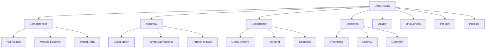
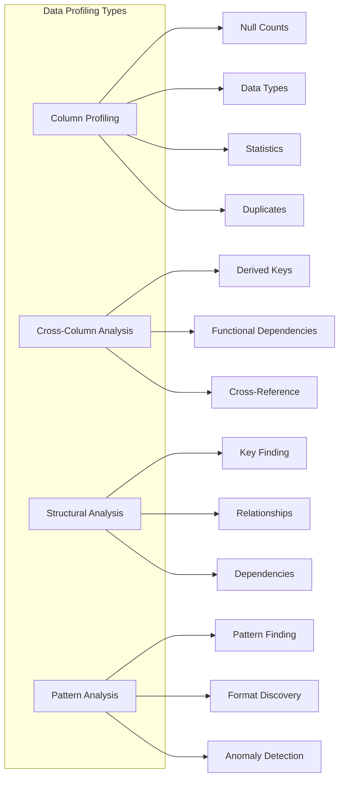
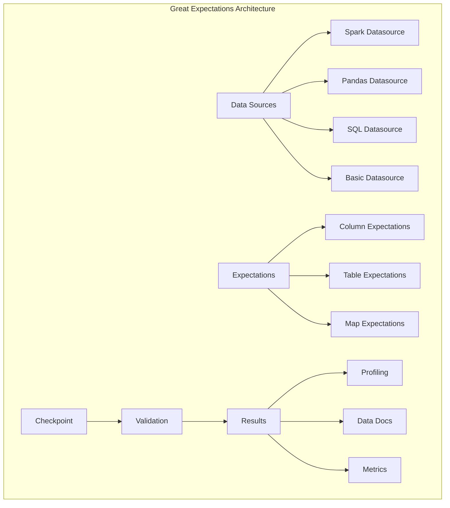
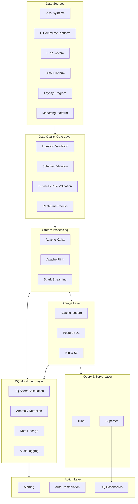

# Data Quality

## 1. Overview

### What is Data Quality?

Data Quality refers to the measure of data's fitness to serve its intended purpose in a given context. It encompasses the completeness, validity, accuracy, consistency, timeliness, uniqueness, and overall reliability of data throughout its lifecycle. Data Quality is not merely a technical concern but a fundamental business imperative that directly impacts decision-making, operational efficiency, customer experience, and regulatory compliance.

In the modern enterprise landscape, data flows across numerous systems, applications, and teams. Poor data quality introduces cascading failures: analytics become unreliable, machine learning models produce biased predictions, automated processes make erroneous decisions, and customer experiences deteriorate. The financial impact is staggering, with estimates suggesting that poor data quality costs organizations an average of $12.9 million annually in wasted resources, missed opportunities, and remediation efforts.

### What business problems does it solve?

Data Quality addresses critical enterprise challenges that manifest across the organization:

**Operational Efficiency**: When data quality issues go undetected, they propagate through downstream systems, causing repeated failures, manual corrections, and inefficient resource allocation. High-quality data enables straight-through processing, reducing manual intervention and associated labor costs.

**Decision Integrity**: Executives and analysts rely on data to make strategic decisions about inventory, pricing, marketing campaigns, and resource allocation. Poor quality data leads to suboptimal decisions, missed market opportunities, and competitive disadvantages.

**Customer Experience**: Inconsistent customer records result in fragmented customer views, redundant communications, personalized experiences that miss the mark, and ultimately customer churn. Data quality ensures consistent, accurate customer interactions across all touchpoints.

**Regulatory Compliance**: Industries like financial services, healthcare, and retail face stringent data quality requirements under regulations such as GDPR, CCPA, PCI-DSS, and SOX. Data quality frameworks provide the auditing, lineage, and validation capabilities necessary to demonstrate compliance.

**Revenue Protection**: Inaccurate product data, pricing inconsistencies, and inventory discrepancies directly impact revenue. Data quality ensures that pricing promotions execute correctly, product information is accurate across channels, and inventory counts match reality.

**Risk Management**: Fraud detection, credit risk assessment, and anomaly detection systems depend on high-quality data. Poor data quality creates blind spots that bad actors exploit, increasing organizational risk exposure.

### Why do enterprises use it?

Leading enterprises prioritize data quality for several compelling reasons:

**Amazon** processes millions of product data points daily, maintaining data quality standards that ensure product recommendations remain accurate, pricing stays consistent across channels, and inventory levels reflect reality. Their data quality infrastructure handles catalog enrichment, duplicate detection, and attribute normalization at massive scale.

**Netflix** relies on viewer data quality to power its recommendation engine, which drives 80% of content consumption. Poor quality viewer data would immediately degrade recommendation quality, impacting viewer engagement and subscription retention.

**Walmart** maintains enterprise-wide data quality to synchronize inventory across thousands of stores and online channels, ensuring product availability, accurate delivery estimates, and consistent pricing.

**Financial institutions** like JPMorgan Chase implement rigorous data quality frameworks to meet regulatory requirements, maintain accurate risk models, and ensure transaction integrity across trading, lending, and compliance operations.

**Healthcare organizations** depend on data quality for patient safety, clinical decision support, and interoperability initiatives that improve care coordination while protecting sensitive health information.

---

## 2. Core Concepts

### Data Quality Dimensions

Data quality is multidimensional, requiring assessment across several key attributes:



**Completeness** measures the degree to which required data is present. A customer record with a missing email address is incomplete, potentially impacting marketing campaigns and communication capabilities. Completeness is typically measured as a percentage: `(Filled Values / Total Expected Values) * 100`. Organizations often set completeness thresholds per field based on business criticality—for example, payment fields might require 100% completeness while secondary contact fields might tolerate 95%.

**Accuracy** refers to how well data reflects the real-world entity or event it represents. An address that exists but is incorrectly spelled, a product price that doesn't match the current catalog, or a customer age that doesn't match their actual date of birth—all represent accuracy issues. Accuracy validation often requires reference data sources, business rules, or cross-validation against authoritative datasets.

**Consistency** ensures that data values are uniform across systems and within acceptable ranges. A customer address that says "New York, NY" in the CRM but "NYC, New York" in the order management system represents a consistency issue. Consistency also applies to temporal data—order dates that precede customer creation dates violate business logic and indicate data quality problems.

**Timeliness** measures whether data is current and available when needed. Stale inventory data might show products in stock that have actually sold out, leading to customer disappointment and cart abandonment. Timeliness requirements vary by use case: fraud detection may require sub-second data currency, while strategic analytics might tolerate daily or weekly data freshness.

**Validity** assesses whether data conforms to defined rules, formats, and value ranges. A phone number field containing alphabetic characters is invalid. An email address that doesn't match the regex pattern for valid emails is invalid. A date of birth in the future is invalid. Validation rules enforce structural integrity before data enters systems.

**Uniqueness** ensures that duplicate records don't exist where they shouldn't, and that single instances of entities are properly represented. Duplicate customer records lead to fragmented views, redundant marketing, and confusing order history. Uniqueness violations can occur within systems or across integrated systems.

**Integrity** refers to the structural soundness of data relationships. Foreign key relationships must remain valid—orders must reference valid customers, line items must reference valid products. Referential integrity violations indicate serious data quality problems that can cause system failures or incorrect results.

### Data Profiling

Data profiling is the systematic analysis of data to understand its structure, content, quality, and relationships. It provides the foundation for identifying data quality issues and establishing validation rules.



**Column Profiling** analyzes individual columns to understand:
- Data type distribution and type mismatches
- Null and empty value frequency
- Minimum, maximum, mean, median, and standard deviation for numeric columns
- Minimum and maximum length for string columns
- Cardinality and value frequency distributions
- Pattern matching against expected formats

**Cross-Column Analysis** examines relationships between columns:
- Functional dependencies (e.g., city determines state)
- Correlations between numeric fields
- Conditional dependencies and business rule violations
- Cross-system referential integrity

**Cross-Row Analysis** compares records to identify:
- Exact and near-duplicate records
- Records that violate business rules when combined
- Suspicious patterns like synthetic data generation fingerprints

### Data Cleansing

Data cleansing is the process of detecting and correcting data quality issues. It encompasses several techniques:

```mermaid
flowchart TD
    DC[Data Cleansing] --> SC[Standardization]
    DC --> NC[Normalization]
    DC --> DN[De-duplication]
    DC --> EN[Enrichment]
    DC --> FV[Format Validation]
    DC --> MV[Missing Value Handling]
    
    SC --> SC1[Case Normalization]
    SC --> SC2[Abbreviation Expansion]
    SC --> SC3[Address Standardization]
    
    NC --> NC1[Unit Conversion]
    NC --> NC2[Scale Normalization]
    NC --> NC3[Encoding Standardization]
    
    DN --> DN1[Exact Match]
    DN --> DN2[Fuzzy Match]
    DN --> DN3[Probabilistic Match]
    
    EN --> EN1[Address Verification]
    EN --> EN2[Phone Formatting]
    EN --> EN3[Data Enhancement]
    
    FV --> FV1[Regex Validation]
    FV --> FV2[Range Checking]
    FV --> FV3[Type Conversion]
    
    MV --> MV1[Imputation]
    MV --> MV2[Default Values]
    MV --> MV3[Exclusion]
```



**Standardization** transforms data into consistent formats:
- Converting names to proper case: "JOHN DOE" → "John Doe"
- Standardizing state codes: "NEW YORK" → "NY"
- Normalizing phone formats: "(555) 123-4567" → "+1-555-123-4567"
- Standardizing date formats across systems

**De-duplication** identifies and removes duplicate records:
- Exact matching on key fields
- Fuzzy matching using edit distance algorithms (Levenshtein, Jaro-Winkler)
- Probabilistic matching with confidence scores
- Golden record creation through survivorship rules

**Enrichment** enhances data quality by adding information:
- Address verification against authoritative postal databases
- Phone number validation and carrier identification
- Email domain validation and deliverability checking
- Geocoding addresses to latitude/longitude coordinates

### Great Expectations Overview

Great Expectations is the primary data quality framework used in this platform. It provides a fluent, declarative interface for defining and executing data quality expectations.



**Key Great Expectations Concepts**:

| Concept | Description | Example |
|---------|-------------|---------|
| **Expectation** | A declarative statement about data | `expect_column_values_to_not_be_null` |
| **Expectation Suite** | Collection of expectations for a dataset | Product data quality expectations |
| **Checkpoint** | Executable validation configuration | Run suite against daily batch |
| **Data Context** | Central management for GX configuration | Stores, Datasources, Expectation Suites |
| **Validation Result** | Outcome of running validation | Pass/Fail with details |
| **Data Docs** | Human-readable HTML documentation | Data quality reports |

**Expectation Types**:

```python
# Column Expectations - Validate column properties
expect_column_to_exist
expect_column_values_to_be_of_type
expect_column_values_to_be_in_set
expect_column_values_to_be_unique
expect_column_values_to_not_be_null
expect_column_mean_to_be_between
expect_column_min_to_be_between
expect_column_max_to_be_between

# Table Expectations - Validate table properties
expect_table_to_exist
expect_table_column_count_to_be_between
expect_table_row_count_to_be_between

# Map Expectations - Validate row-level properties
expect_column_pair_values_a_to_be_greater_than_b
expect_multicolumn_sum_to_equal
expect_compound_columns_to_be_unique
```

---

## 3. Why This Project Uses It

The Enterprise Retail Streaming Platform implements comprehensive data quality frameworks for several critical reasons:

### Real-Time Inventory Synchronization

The platform processes thousands of inventory updates per second across multiple retail channels. Data quality issues in inventory data directly cause overselling, stockout prediction failures, and customer dissatisfaction. With data quality validation at ingestion:

- Invalid inventory movements are caught before propagating to fulfillment systems
- Duplicate transactions are detected and reconciled
- Quantity consistency is validated against business rules (no negative inventory)
- Cross-channel inventory counts remain synchronized

### Multi-Source Customer Data Integration

Customer data originates from e-commerce registrations, POS transactions, loyalty programs, customer service interactions, and third-party data providers. Data quality ensures:

- Customer records are properly matched and merged across sources
- PII is validated and properly masked throughout the pipeline
- Customer identifiers remain consistent across order history and preferences
- Marketing preferences are accurately captured and honored

### Pricing and Promotion Integrity

Pricing errors can result in significant revenue loss or customer dissatisfaction. The platform validates:

- Price consistency between channels (online, in-store, mobile)
- Promotion rules are correctly applied and don't conflict
- Historical price accuracy for analytics and compliance
- Currency handling for international transactions

### Supply Chain Analytics Reliability

Strategic decisions about supplier relationships, logistics optimization, and demand forecasting depend on clean historical data. Data quality ensures:

- Sales history is complete and accurate for demand modeling
- Product categorizations are consistent for segmentation analysis
- Seasonal patterns aren't distorted by data quality anomalies
- Cost data accurately reflects actual supplier pricing

### Regulatory Compliance and Audit Readiness

Retail operations must comply with PCI-DSS for payment data, tax regulations for jurisdictional requirements, and consumer protection laws for pricing accuracy. Data quality frameworks provide:

- Complete audit trails for data lineage and transformations
- Validation evidence for regulatory examinations
- Data retention and quality metrics for compliance reporting
- Privacy-preserving transformations for data usage

---

## 4. Architecture Position

Data Quality occupies multiple layers of the platform architecture, functioning as both a gating mechanism and continuous monitoring system:



### Data Quality in the ELT Pipeline

```mermaid
flowchart LR
    subgraph Extract["Extract"]
        SOURCE[Source Systems]
        CDC[CDC Feeds]
        API[API Imports]
        FILE[File Loads]
    end

    subgraph Load["Load to Staging"]
        STAGING[Staging Tables]
        PROFILE[Initial Profiling]
        VALIDATE[Validation]
    end

    subgraph Transform["Transform"]
        CLEANSING[Data Cleansing]
        ENRICH[Data Enrichment]
        AGG[Aggregation]
    end

    subgraph DQInTransform["DQ During Transform"]
        RULE[Rule Engine]
        SCORE[DQ Scoring]
        CORRECT[Correction]
    end

    subgraph Finalize["Finalize"]
        PROD[Production Tables]
        APPROVE[Approval Gate]
        PUBLISH[Publish]
    end

    subgraph Monitor["Monitor"]
        METRICS[DQ Metrics]
        TREND[Trend Analysis]
        ALERT[Alerts]
    end

    Extract --> Load
    Load --> Transform
    Transform --> DQInTransform
    DQInTransform --> Finalize
    Finalize --> Monitor
    Monitor -->|feedback| Load
```



---

## 5. Folder Structure

The data quality implementation follows a structured organization within the platform:

```
retail-streaming-platform/
├── src/
│   ├── data_quality/                    # Data quality core package
│   │   ├── __init__.py
│   │   ├── config/                     # DQ configuration
│   │   │   ├── __init__.py
│   │   │   ├── great_expectations_config.py
│   │   │   ├── thresholds.py
│   │   │   └── rules/
│   │   │       ├── __init__.py
│   │   │       ├── product_rules.py
│   │   │       ├── customer_rules.py
│   │   │       ├── order_rules.py
│   │   │       └── inventory_rules.py
│   │   ├── expectations/               # Great Expectations suites
│   │   │   ├── __init__.py
│   │   │   ├── suites/
│   │   │   │   ├── product_suite.json
│   │   │   │   ├── customer_suite.json
│   │   │   │   ├── order_suite.json
│   │   │   │   └── inventory_suite.json
│   │   │   └── templates/
│   │   ├── checkpoints/               # Checkpoint configurations
│   │   │   ├── __init__.py
│   │   │   ├── daily_validation.yml
│   │   │   ├── streaming_validation.yml
│   │   │   └── ad_hoc_validation.yml
│   │   ├── profilers/                  # Data profiler configurations
│   │   │   ├── __init__.py
│   │   │   ├── column_profiler.yml
│   │   │   └── custom_profilers.py
│   │   ├── validators/                 # Custom validators
│   │   │   ├── __init__.py
│   │   │   ├── schema_validator.py
│   │   │   ├── business_rule_validator.py
│   │   │   └── cross_system_validator.py
│   │   ├── cleansing/                  # Data cleansing modules
│   │   │   ├── __init__.py
│   │   │   ├── address_cleanser.py
│   │   │   ├── phone_cleanser.py
│   │   │   ├── email_cleanser.py
│   │   │   └── product_cleanser.py
│   │   ├── matching/                   # Record matching/de-duplication
│   │   │   ├── __init__.py
│   │   │   ├── exact_matcher.py
│   │   │   ├── fuzzy_matcher.py
│   │   │   └── golden_record_creator.py
│   │   ├── monitoring/                 # DQ monitoring and reporting
│   │   │   ├── __init__.py
│   │   │   ├── metrics_collector.py
│   │   │   ├── anomaly_detector.py
│   │   │   ├── dashboard_generator.py
│   │   │   └── report_generator.py
│   │   └── lineage/                    # Data lineage tracking
│   │       ├── __init__.py
│   │       ├── lineage_tracker.py
│   │       └── impact_analyzer.py
│   ├── pipelines/                      # Data pipelines with DQ
│   │   ├── __init__.py
│   │   ├── ingestion/
│   │   │   ├── product_ingestion.py
│   │   │   ├── customer_ingestion.py
│   │   │   └── order_ingestion.py
│   │   ├── transformation/
│   │   │   ├── product_transform.py
│   │   │   └── customer_transform.py
│   │   └── dq_integration/
│   │       ├── validate_on_ingest.py
│   │       └── validate_on_transform.py
│   └── tests/
│       ├── data_quality/
│       │   ├── __init__.py
│       │   ├── unit/
│       │   │   ├── test_expectations.py
│       │   │   ├── test_cleansing.py
│       │   │   ├── test_matching.py
│       │   │   └── test_validators.py
│       │   └── integration/
│       │       ├── test_dq_pipeline.py
│       │       └── test_dq_in_streaming.py
├── great_expectations/                  # Great Expectations root
│   ├── great_expectations.yml
│   ├── expectations/                   # Shared expectation suites
│   ├── checkpoints/
│   ├── plugins/
│   │   └── custom_expectations/       # Custom expectation implementations
│   │       ├── __init__.py
│   │       ├── expect_column_value_to_be_valid_zipcode.py
│   │       ├── expect_column_pair_sums_to_equal.py
│   │       └── expect_column_values_to_be_valid_category.py
│   └── uncommitted/
│       └── data_docs/
├── config/
│   ├── dq_thresholds.yaml             # DQ threshold configurations
│   ├── dq_rules.yaml                  # Business rule definitions
│   └── dq_alerting.yaml               # Alert configurations
├── scripts/
│   ├── run_dq_validation.py
│   ├── generate_dq_report.py
│   ├── profile_dataset.py
│   └── setup_great_expectations.py
├── Dockerfile.dq
├── docker-compose.dq.yml
└── README.md
```

---

## 6. Implementation Walkthrough

### Great Expectations Setup and Configuration

**great_expectations.yml Configuration**:

```yaml
# great_expectations/great_expectations.yml
config_version: 3.0

datasources:
  retail_postgres:
    class_name: SqlAlchemyDatasource
    connection_string: postgresql://${DB_USER}:${DB_PASSWORD}@${DB_HOST}:${DB_PORT}/${DB_NAME}
    
    data_connectors:
      default_runtime_connector:
        class_name: RuntimeDataConnector
        batch_identifiers:
          - default_identifier_name
          
      default_inferred_connector:
        class_name: InferredAssetSqlDataConnector
        include_schema_name: true

  retail_s3:
    class_name: SimpleSqlalchemyDatasource
    connection_string: sqlite:///data/retail.db
    
    data_connectors:
      default_inferred_connector:
        class_name: InferredAssetSqlDataConnector
        include_schema_name: true

stores:
  expectations_store:
    class_name: ExpectationsStore
    store_backend:
      class_name: TupleFilesystemStoreBackend
      base_directory: expectations/

  validations_store:
    class_name: ValidationsStore
    store_backend:
      class_name: TupleFilesystemStoreBackend
      base_directory: uncommitted/validations/

  data_docs_store:
    class_name: SiteBuilder
    store_backend:
      class_name: TupleFilesystemStoreBackend
      base_directory: uncommitted/data_docs/

expectations_store_name: expectations_store
validations_store_name: validations_store
data_docs_site_name: local_site
```

### Product Data Quality Rules

**Product Expectation Suite**:

```python
# src/data_quality/expectations/suites/product_suite.py
from great_expectations.expectations.expectation import ColumnMapExpectation
from great_expectations.expectations.expectation_configuration import ExpectationConfiguration

product_expectation_suite = {
    "expectation_suite_name": "product_data_quality",
    "expectations": [
        # Completeness expectations
        {
            "expectation_type": "expect_column_to_exist",
            "kwargs": {"column": "product_id"}
        },
        {
            "expectation_type": "expect_column_values_to_not_be_null",
            "kwargs": {"column": "product_id", "mostly": 1.0}
        },
        {
            "expectation_type": "expect_column_values_to_not_be_null",
            "kwargs": {"column": "sku", "mostly": 0.999}
        },
        {
            "expectation_type": "expect_column_values_to_not_be_null",
            "kwargs": {"column": "product_name", "mostly": 0.995}
        },
        {
            "expectation_type": "expect_column_values_to_not_be_null",
            "kwargs": {"column": "price", "mostly": 1.0}
        },
        {
            "expectation_type": "expect_column_values_to_not_be_null",
            "kwargs": {"column": "category_id", "mostly": 0.99}
        },
        
        # Validity expectations
        {
            "expectation_type": "expect_column_values_to_be_unique",
            "kwargs": {"column": "product_id"}
        },
        {
            "expectation_type": "expect_column_values_to_be_unique",
            "kwargs": {"column": "sku"}
        },
        {
            "expectation_type": "expect_column_values_to_be_of_type",
            "kwargs": {"column": "price", "type_": "NUMBER"}
        },
        {
            "expectation_type": "expect_column_values_to_be_between",
            "kwargs": {
                "column": "price",
                "min_value": 0,
                "max_value": 100000,
                "strict_min": False,
                "strict_max": False
            }
        },
        {
            "expectation_type": "expect_column_value_lengths_to_be_between",
            "kwargs": {
                "column": "sku",
                "min_value": 3,
                "max_value": 50
            }
        },
        {
            "expectation_type": "expect_column_values_to_be_in_set",
            "kwargs": {
                "column": "status",
                "value_set": ["active", "discontinued", "out_of_stock", "pending"]
            }
        },
        
        # Consistency expectations
        {
            "expectation_type": "expect_column_values_to_match_regex",
            "kwargs": {
                "column": "sku",
                "regex": "^[A-Z]{2,4}-[0-9]{6,10}$"
            }
        },
        {
            "expectation_type": "expect_column_values_to_match_regex",
            "kwargs": {
                "column": "ean",
                "regex": "^[0-9]{13}$",
                "mostly": 0.95
            }
        },
        {
            "expectation_type": "expect_column_pair_values_a_to_be_greater_than_b",
            "kwargs": {
                "column_A": "list_price",
                "column_B": "cost_price",
                "or_equal": True,
                "mostly": 0.98
            }
        },
        
        # Accuracy expectations
        {
            "expectation_type": "expect_column_median_to_be_between",
            "kwargs": {
                "column": "price",
                "min_value": 10,
                "max_value": 500
            }
        },
        {
            "expectation_type": "expect_column_min_to_be_between",
            "kwargs": {
                "column": "stock_quantity",
                "min_value": 0,
                "max_value": 0
            }
        },
        {
            "expectation_type": "expect_column_max_to_be_between",
            "kwargs": {
                "column": "stock_quantity",
                "min_value": 0,
                "max_value": 100000
            }
        },
        
        # Timeliness expectations
        {
            "expectation_type": "expect_column_values_to_be_of_type",
            "kwargs": {"column": "created_at", "type_": "TIMESTAMP"}
        },
        {
            "expectation_type": "expect_column_values_to_be_of_type",
            "kwargs": {"column": "updated_at", "type_": "TIMESTAMP"}
        },
        {
            "expectation_type": "expect_column_values_to_be_after",
            "kwargs": {
                "column": "created_at",
                "parse_strings_as_datetimes": True,
                "max_val": "2026-12-31"
            }
        },
    ]
}
```

### Customer Data Quality Rules

```python
# src/data_quality/rules/customer_rules.py
from typing import Dict, List, Any
from great_expectations import ExpectationSuite

def create_customer_expectation_suite() -> ExpectationSuite:
    """Create comprehensive customer data quality expectations."""
    
    suite = ExpectationSuite(name="customer_data_quality")
    
    # Identity completeness
    suite.add_expectation({
        "expectation_type": "expect_column_values_to_not_be_null",
        "kwargs": {"column": "customer_id", "mostly": 1.0}
    })
    suite.add_expectation({
        "expectation_type": "expect_column_values_to_not_be_null",
        "kwargs": {"column": "email", "mostly": 0.98}
    })
    suite.add_expectation({
        "expectation_type": "expect_column_values_to_not_be_null",
        "kwargs": {"column": "created_at", "mostly": 1.0}
    })
    
    # Email validity
    suite.add_expectation({
        "expectation_type": "expect_column_values_to_match_regex",
        "kwargs": {
            "column": "email",
            "regex": "^[a-zA-Z0-9._%+-]+@[a-zA-Z0-9.-]+\\.[a-zA-Z]{2,}$",
            "mostly": 0.99
        }
    })
    
    # Phone validity (international format)
    suite.add_expectation({
        "expectation_type": "expect_column_values_to_match_regex",
        "kwargs": {
            "column": "phone",
            "regex": "^\\+?[1-9]\\d{1,14}$",
            "mostly": 0.95
        }
    })
    
    # Address completeness
    suite.add_expectation({
        "expectation_type": "expect_column_values_to_not_be_null",
        "kwargs": {"column": "country", "mostly": 0.99}
    })
    suite.add_expectation({
        "expectation_type": "expect_column_values_to_be_in_set",
        "kwargs": {
            "column": "country",
            "value_set": ["US", "CA", "UK", "DE", "FR", "AU", "JP", "MX", "BR"]
        }
    })
    
    # Temporal consistency
    suite.add_expectation({
        "expectation_type": "expect_column_values_to_be_after",
        "kwargs": {
            "column": "created_at",
            "min_val": "2000-01-01"
        }
    })
    suite.add_expectation({
        "expectation_type": "expect_column_values_to_be_after",
        "kwargs": {
            "column": "updated_at",
            "min_val": "2000-01-01"
        }
    })
    suite.add_expectation({
        "expectation_type": "expect_column_values_to_be_after",
        "kwargs": {
            "column": "updated_at",
            "min_val": "created_at"
        }
    })
    
    # Age validity
    suite.add_expectation({
        "expectation_type": "expect_column_values_to_be_between",
        "kwargs": {
            "column": "age",
            "min_value": 18,
            "max_value": 120,
            "mostly": 0.99
        }
    })
    
    # Loyalty tier validity
    suite.add_expectation({
        "expectation_type": "expect_column_values_to_be_in_set",
        "kwargs": {
            "column": "loyalty_tier",
            "value_set": ["bronze", "silver", "gold", "platinum", "diamond"]
        }
    })
    
    return suite
```

### Checkpoint Configuration

```yaml
# great_expectations/checkpoints/daily_validation.yml
name: daily_product_validation
config_version: 1.0

class_name: Checkpoint

validations:
  - batch_request:
      datasource_name: retail_postgres
      data_connector_name: default_inferred_connector
      data_asset_name: products
      partition_request:
        date: 2026-07-01
    expectation_suite_name: product_data_quality
    
  - batch_request:
      datasource_name: retail_postgres
      data_connector_name: default_inferred_connector
      data_asset_name: product_pricing
      partition_request:
        date: 2026-07-01
    expectation_suite_name: product_pricing_quality

action_list:
  - name: store_validation_result
    action:
      class_name: StoreValidationResultAction
      
  - name: update_data_docs
    action:
      class_name: UpdateDataDocsAction
      
  - name: send_alert_on_failure
    action:
      class_name: SlackNotificationAction
      slack_webhook: ${SLACK_DQ_WEBHOOK}
      notify_on: failure
      
  - name: send_metric_to_prometheus
    action:
      class_name:  PyTorchProfilerAction
```

### Real-Time Validation in Kafka Streams

```python
# src/data_quality/validators/streaming_validator.py
from typing import Dict, Any, Optional, List
from datetime import datetime
import json
import logging

logger = logging.getLogger(__name__)

class StreamingDataQualityValidator:
    """
    Validates data quality in real-time streaming pipelines.
    Designed for use with Kafka Streams and Apache Flink.
    """
    
    def __init__(self, rules: Dict[str, Any]):
        self.rules = rules
        self.metrics_collector = MetricsCollector()
        self.failure_buffer = []
        
    def validate_record(self, record: Dict[str, Any], record_type: str) -> ValidationResult:
        """Validate a single streaming record."""
        
        violations = []
        start_time = datetime.utcnow()
        
        # Apply validation rules based on record type
        if record_type == "product":
            violations.extend(self._validate_product(record))
        elif record_type == "order":
            violations.extend(self._validate_order(record))
        elif record_type == "customer":
            violations.extend(self._validate_customer(record))
        elif record_type == "inventory":
            violations.extend(self._validate_inventory(record))
            
        # Calculate validation metrics
        duration_ms = (datetime.utcnow() - start_time).total_seconds() * 1000
        
        result = ValidationResult(
            record_key=record.get("id") or record.get("product_id") or record.get("order_id"),
            record_type=record_type,
            is_valid=len(violations) == 0,
            violations=violations,
            validation_duration_ms=duration_ms,
            timestamp=datetime.utcnow()
        )
        
        # Emit metrics
        self.metrics_collector.record_validation(result)
        
        return result
    
    def _validate_product(self, product: Dict[str, Any]) -> List[Violation]:
        """Validate product record."""
        violations = []
        
        # Required field validation
        required_fields = ["product_id", "sku", "name", "price", "category_id"]
        for field in required_fields:
            if field not in product or product[field] is None:
                violations.append(Violation(
                    field=field,
                    rule="required_field",
                    severity="high",
                    message=f"Required field '{field}' is missing or null"
                ))
                
        # Price validation
        if "price" in product:
            price = product["price"]
            if not isinstance(price, (int, float)) or price < 0:
                violations.append(Violation(
                    field="price",
                    rule="positive_number",
                    severity="high",
                    message=f"Price must be a positive number, got {price}"
                ))
            elif price > 100000:
                violations.append(Violation(
                    field="price",
                    rule="reasonable_range",
                    severity="medium",
                    message=f"Price {price} exceeds reasonable maximum"
                ))
                
        # SKU format validation
        if "sku" in product:
            sku = str(product["sku"])
            if not sku.match(r"^[A-Z]{2,4}-[0-9]{6,10}$"):
                violations.append(Violation(
                    field="sku",
                    rule="sku_format",
                    severity="medium",
                    message=f"SKU '{sku}' doesn't match expected format"
                ))
                
        # Stock quantity validation
        if "stock_quantity" in product:
            qty = product["stock_quantity"]
            if qty < 0:
                violations.append(Violation(
                    field="stock_quantity",
                    rule="non_negative",
                    severity="high",
                    message="Stock quantity cannot be negative"
                ))
                
        return violations
    
    def _validate_order(self, order: Dict[str, Any]) -> List[Violation]:
        """Validate order record."""
        violations = []
        
        # Required fields
        required_fields = ["order_id", "customer_id", "order_date", "total_amount"]
        for field in required_fields:
            if field not in order or order[field] is None:
                violations.append(Violation(
                    field=field,
                    rule="required_field",
                    severity="high",
                    message=f"Required field '{field}' is missing or null"
                ))
                
        # Order total validation
        if "total_amount" in order and "item_count" in order:
            total = float(order["total_amount"])
            if total <= 0:
                violations.append(Violation(
                    field="total_amount",
                    rule="positive_amount",
                    severity="high",
                    message="Order total must be positive"
                ))
                
        # Date logic validation
        if "order_date" in order and "ship_date" in order:
            order_date = parse_date(order["order_date"])
            ship_date = parse_date(order["ship_date"])
            if ship_date and order_date > ship_date:
                violations.append(Violation(
                    field="ship_date",
                    rule="temporal_consistency",
                    severity="high",
                    message="Ship date cannot be before order date"
                ))
                
        # Line items validation
        if "line_items" in order:
            line_items = order["line_items"]
            if not isinstance(line_items, list) or len(line_items) == 0:
                violations.append(Violation(
                    field="line_items",
                    rule="non_empty_list",
                    severity="high",
                    message="Order must have at least one line item"
                ))
                
        return violations
    
    def _validate_customer(self, customer: Dict[str, Any]) -> List[Violation]:
        """Validate customer record."""
        violations = []
        
        # Email validation
        if "email" in customer and customer["email"]:
            email = str(customer["email"])
            if not self._is_valid_email(email):
                violations.append(Violation(
                    field="email",
                    rule="email_format",
                    severity="high",
                    message=f"Invalid email format: {email}"
                ))
                
        # Phone validation (if present)
        if "phone" in customer and customer["phone"]:
            phone = str(customer["phone"])
            if not phone.match(r"^\+?[1-9]\d{1,14}$"):
                violations.append(Violation(
                    field="phone",
                    rule="phone_format",
                    severity="medium",
                    message=f"Invalid phone format: {phone}"
                ))
                
        # Country code validation
        if "country" in customer:
            country = customer["country"]
            if country not in VALID_COUNTRY_CODES:
                violations.append(Violation(
                    field="country",
                    rule="valid_country_code",
                    severity="medium",
                    message=f"Invalid country code: {country}"
                ))
                
        return violations
    
    def _validate_inventory(self, inventory: Dict[str, Any]) -> List[Violation]:
        """Validate inventory record."""
        violations = []
        
        # Required fields
        if "product_id" not in inventory or not inventory["product_id"]:
            violations.append(Violation(
                field="product_id",
                rule="required_field",
                severity="high",
                message="Product ID is required for inventory"
            ))
            
        if "warehouse_id" not in inventory or not inventory["warehouse_id"]:
            violations.append(Violation(
                field="warehouse_id",
                rule="required_field",
                severity="high",
                message="Warehouse ID is required for inventory"
            ))
            
        # Quantity validation
        if "quantity" in inventory:
            qty = inventory["quantity"]
            if not isinstance(qty, int) or qty < 0:
                violations.append(Violation(
                    field="quantity",
                    rule="non_negative_integer",
                    severity="high",
                    message=f"Quantity must be non-negative integer, got {qty}"
                ))
                
        # Reserved quantity validation
        if "reserved_quantity" in inventory and "quantity" in inventory:
            reserved = inventory["reserved_quantity"]
            available = inventory["quantity"]
            if reserved > available:
                violations.append(Violation(
                    field="reserved_quantity",
                    rule="consistency",
                    severity="high",
                    message=f"Reserved quantity ({reserved}) exceeds available ({available})"
                ))
                
        return violations
    
    def _is_valid_email(self, email: str) -> bool:
        """Validate email format."""
        import re
        pattern = r"^[a-zA-Z0-9._%+-]+@[a-zA-Z0-9.-]+\.[a-zA-Z]{2,}$"
        return bool(re.match(pattern, email))


class ValidationResult:
    """Represents the result of a data quality validation."""
    
    def __init__(
        self,
        record_key: str,
        record_type: str,
        is_valid: bool,
        violations: List[Any],
        validation_duration_ms: float,
        timestamp: datetime
    ):
        self.record_key = record_key
        self.record_type = record_type
        self.is_valid = is_valid
        self.violations = violations
        self.validation_duration_ms = validation_duration_ms
        self.timestamp = timestamp
        
    def to_dict(self) -> Dict[str, Any]:
        return {
            "record_key": self.record_key,
            "record_type": self.record_type,
            "is_valid": self.is_valid,
            "violations": [v.__dict__ for v in self.violations],
            "validation_duration_ms": self.validation_duration_ms,
            "timestamp": self.timestamp.isoformat()
        }


class MetricsCollector:
    """Collects and reports data quality metrics."""
    
    def __init__(self):
        self.total_validated = 0
        self.total_passed = 0
        self.total_failed = 0
        self.violations_by_type = {}
        self.latencies = []
        
    def record_validation(self, result: ValidationResult):
        """Record validation result for metrics."""
        self.total_validated += 1
        if result.is_valid:
            self.total_passed += 1
        else:
            self.total_failed += 1
            
        for violation in result.violations:
            rule = violation.rule
            if rule not in self.violations_by_type:
                self.violations_by_type[rule] = 0
            self.violations_by_type[rule] += 1
            
        self.latencies.append(result.validation_duration_ms)
        
    def get_metrics(self) -> Dict[str, Any]:
        """Get aggregated metrics."""
        return {
            "total_validated": self.total_validated,
            "pass_rate": self.total_passed / self.total_validated if self.total_validated > 0 else 0,
            "fail_rate": self.total_failed / self.total_validated if self.total_validated > 0 else 0,
            "avg_latency_ms": sum(self.latencies) / len(self.latencies) if self.latencies else 0,
            "p99_latency_ms": sorted(self.latencies)[int(len(self.latencies) * 0.99)] if self.latencies else 0,
            "violations_by_rule": self.violations_by_type
        }
```

### DQ Dashboard Configuration

```python
# src/data_quality/monitoring/dashboard_generator.py
from typing import Dict, Any, List
from datetime import datetime, timedelta
import logging

logger = logging.getLogger(__name__)

class DataQualityDashboardGenerator:
    """
    Generates data quality dashboard configurations for Superset.
    """
    
    def __init__(self, config: Dict[str, Any]):
        self.config = config
        self.dq_metrics_table = config.get("dq_metrics_table", "dq_metrics")
        
    def generate_dashboard_config(self) -> Dict[str, Any]:
        """Generate complete dashboard configuration."""
        
        return {
            "dashboard_title": "Data Quality Monitor",
            "description": "Real-time data quality metrics and trends",
            "charts": [
                self._create_dq_score_chart(),
                self._create_violations_by_type_chart(),
                self._create_violations_over_time_chart(),
                self._create_table_quality_heatmap(),
                self._create_recent_failures_table(),
                self._create_alert_history_chart(),
            ],
            "filters": [
                {
                    "name": "date_range",
                    "type": "time_range",
                    "default": "Last 7 days"
                },
                {
                    "name": "data_domain",
                    "type": "filter_select",
                    "options": ["products", "customers", "orders", "inventory"]
                },
                {
                    "name": "severity",
                    "type": "filter_select",
                    "options": ["critical", "high", "medium", "low"]
                }
            ],
            "refresh_interval": 300  # 5 minutes
        }
    
    def _create_dq_score_chart(self) -> Dict[str, Any]:
        """Create overall DQ score gauge chart."""
        return {
            "chart_name": "Overall DQ Score",
            "type": "gauge",
            "datasource": self.dq_metrics_table,
            "sql": """
                SELECT 
                    AVG(dq_score) as score,
                    MAX(evaluated_at) as evaluated_at
                FROM {table}
                WHERE evaluated_at >= NOW() - INTERVAL '1 day'
            """,
            "metrics": [
                {
                    "label": "DQ Score",
                    "expression": "AVG(dq_score)",
                    "format": "percent"
                }
            ],
            "thresholds": {
                "green": 95,
                "yellow": 85,
                "red": 70
            }
        }
    
    def _create_violations_by_type_chart(self) -> Dict[str, Any]:
        """Create bar chart of violations by type."""
        return {
            "chart_name": "Violations by Type",
            "type": "bar",
            "datasource": self.dq_metrics_table,
            "sql": """
                SELECT 
                    violation_type,
                    COUNT(*) as count
                FROM {table}
                CROSS JOIN UNNEST(violations) AS t(violation_type)
                WHERE evaluated_at >= NOW() - INTERVAL '7 days'
                GROUP BY violation_type
                ORDER BY count DESC
            """,
            "metrics": [
                {
                    "label": "Violation Count",
                    "expression": "COUNT(*)"
                }
            ],
            "groupby": ["violation_type"],
            "color_scheme": "blues"
        }
    
    def _create_table_quality_heatmap(self) -> Dict[str, Any]:
        """Create heatmap of data quality by table."""
        return {
            "chart_name": "Table Quality Heatmap",
            "type": "heatmap",
            "datasource": self.dq_metrics_table,
            "sql": """
                SELECT 
                    data_table,
                    EXTRACT(HOUR FROM evaluated_at) as hour,
                    AVG(dq_score) as score
                FROM {table}
                WHERE evaluated_at >= NOW() - INTERVAL '7 days'
                GROUP BY data_table, EXTRACT(HOUR FROM evaluated_at)
            """,
            "rows": ["data_table"],
            "columns": ["hour"],
            "values": ["score"],
            "color_scheme": "RdYlGn"
        }
```

---

## 7. Production Best Practices

### Threshold Configuration

**dq_thresholds.yaml**:

```yaml
# config/dq_thresholds.yaml
thresholds:
  # Overall DQ score thresholds
  overall_score:
    critical: 70
    warning: 85
    healthy: 95
    
  # Completeness thresholds by data domain
  completeness:
    product:
      product_id: 1.0
      sku: 0.999
      name: 0.995
      price: 1.0
      category_id: 0.99
      description: 0.80
      image_url: 0.70
      
    customer:
      customer_id: 1.0
      email: 0.98
      phone: 0.90
      address: 0.85
      country: 0.99
      
    order:
      order_id: 1.0
      customer_id: 1.0
      order_date: 1.0
      total_amount: 1.0
      line_items: 1.0
      shipping_address: 0.95
      
    inventory:
      product_id: 1.0
      warehouse_id: 1.0
      quantity: 1.0
      last_updated: 1.0
      
  # Accuracy thresholds
  accuracy:
    product:
      price_reasonable: 0.98
      sku_format_valid: 0.99
      category_valid: 0.99
      
    customer:
      email_valid: 0.99
      phone_valid: 0.95
      country_valid: 0.99
      
  # Freshness thresholds (in minutes)
  freshness:
    product: 1440  # 24 hours
    customer: 10080  # 7 days
    order: 60  # 1 hour
    inventory: 30  # 30 minutes
    pricing: 60  # 1 hour
```

### Alert Configuration

```yaml
# config/dq_alerting.yaml
alerts:
  - name: critical_dq_score_drop
    description: DQ score dropped below critical threshold
    condition: "dq_score < 70"
    severity: critical
    channels:
      - slack_dq_critical
      - email_dq_team
      - pagerduty
    throttle_minutes: 30
    
  - name: high_violation_volume
    description: Abnormal increase in data quality violations
    condition: "violation_count > avg_violation_count * 3"
    severity: high
    channels:
      - slack_dq_alerts
    throttle_minutes: 60
    
  - name: table_quality_degradation
    description: Specific table DQ score below threshold
    condition: "table_dq_score < 80"
    severity: medium
    channels:
      - slack_dq_alerts
    throttle_minutes: 120
    
  - name: stale_data_detected
    description: Data hasn't been updated within expected window
    condition: "data_age_minutes > freshness_threshold * 1.5"
    severity: medium
    channels:
      - slack_dq_alerts
    throttle_minutes: 240

channels:
  slack_dq_critical:
    type: slack
    webhook_url: ${SLACK_DQ_CRITICAL_WEBHOOK}
    channel: "#dq-critical"
    
  slack_dq_alerts:
    type: slack
    webhook_url: ${SLACK_DQ_ALERTS_WEBHOOK}
    channel: "#dq-alerts"
    
  email_dq_team:
    type: email
    smtp_host: ${SMTP_HOST}
    smtp_port: ${SMTP_PORT}
    from_address: dq-alerts@retail-platform.com
    to_addresses:
      - data-quality-team@retail-platform.com
    subject_template: "[DQ Alert] {alert_name}"
    
  pagerduty:
    type: pagerduty
    integration_key: ${PAGERDUTY_INTEGRATION_KEY}
    severity: {critical: P1, high: P2, medium: P3}
```

### Remediation Workflows

```python
# src/data_quality/remediation/auto_remediation.py
from typing import Dict, Any, List, Optional
from datetime import datetime
import logging

logger = logging.getLogger(__name__)

class DataQualityRemediator:
    """
    Automated data quality remediation engine.
    Handles common data quality issues automatically.
    """
    
    def __init__(
        self,
        remediation_rules: Dict[str, Any],
        dry_run: bool = True
    ):
        self.rules = remediation_rules
        self.dry_run = dry_run
        self.execution_log = []
        
    def remediate(
        self,
        issue: DataQualityIssue,
        affected_records: List[Dict[str, Any]]
    ) -> RemediationResult:
        """
        Attempt to automatically remediate a data quality issue.
        """
        logger.info(f"Attempting remediation for {issue.issue_type}")
        
        # Find applicable remediation rule
        rule = self._find_applicable_rule(issue)
        if not rule:
            return RemediationResult(
                success=False,
                message=f"No remediation rule found for {issue.issue_type}",
                records_attempted=len(affected_records),
                records_fixed=0
            )
            
        # Execute remediation
        if rule.action == "cleanse":
            return self._execute_cleansing(rule, affected_records)
        elif rule.action == "flag":
            return self._execute_flagging(rule, affected_records)
        elif rule.action == "quarantine":
            return self._execute_quarantine(rule, affected_records)
        elif rule.action == "delete":
            return self._execute_deletion(rule, affected_records)
        elif rule.action == "notify":
            return self._execute_notification(rule, affected_records)
        else:
            return RemediationResult(
                success=False,
                message=f"Unknown remediation action: {rule.action}",
                records_attempted=len(affected_records),
                records_fixed=0
            )
            
    def _execute_cleansing(
        self,
        rule: RemediationRule,
        records: List[Dict[str, Any]]
    ) -> RemediationResult:
        """Execute cleansing remediation."""
        
        fixed_count = 0
        failed_records = []
        
        for record in records:
            try:
                if self.dry_run:
                    # Simulate cleansing
                    cleaned = self._apply_cleansing_transform(record, rule)
                    logger.info(f"[DRY RUN] Would cleanse record {record['id']}: {cleaned}")
                    fixed_count += 1
                else:
                    # Execute actual cleansing
                    cleaned = self._apply_cleansing_transform(record, rule)
                    self._update_record(record["id"], cleaned)
                    fixed_count += 1
                    
            except Exception as e:
                logger.error(f"Failed to cleanse record {record.get('id')}: {e}")
                failed_records.append({
                    "record_id": record.get("id"),
                    "error": str(e)
                })
                
        return RemediationResult(
            success=len(failed_records) == 0,
            message=f"Cleansing completed: {fixed_count}/{len(records)} fixed",
            records_attempted=len(records),
            records_fixed=fixed_count,
            failed_records=failed_records if failed_records else None
        )
    
    def _apply_cleansing_transform(
        self,
        record: Dict[str, Any],
        rule: RemediationRule
    ) -> Dict[str, Any]:
        """Apply the cleansing transformation defined in the rule."""
        
        cleaned = record.copy()
        
        if rule.transform == "uppercase":
            for field in rule.fields:
                if field in cleaned and cleaned[field]:
                    cleaned[field] = str(cleaned[field]).upper()
                    
        elif rule.transform == "normalize_whitespace":
            for field in rule.fields:
                if field in cleaned and cleaned[field]:
                    cleaned[field] = " ".join(str(cleaned[field]).split())
                    
        elif rule.transform == "remove_special_chars":
            import re
            for field in rule.fields:
                if field in cleaned and cleaned[field]:
                    cleaned[field] = re.sub(r"[^a-zA-Z0-9\s@-]", "", str(cleaned[field]))
                    
        elif rule.transform == "validate_and_default":
            for field in rule.fields:
                if field in cleaned:
                    if not self._is_valid_value(cleaned[field], rule.validation):
                        cleaned[field] = rule.default_value
                        
        elif rule.transform == "regex_replace":
            import re
            for field in rule.fields:
                if field in cleaned and cleaned[field]:
                    cleaned[field] = re.sub(
                        rule.pattern,
                        rule.replacement,
                        str(cleaned[field])
                    )
                    
        return cleaned
```

---

## 8. Common Problems

| Problem | Cause | Resolution | Best Practice |
|---------|-------|------------|---------------|
| **False positive violations causing alert fatigue** | Overly strict validation rules that don't account for legitimate edge cases | Tune validation thresholds based on actual data distribution; implement sampling to verify violations | Regularly review and tune thresholds; involve business users in threshold definition |
| **DQ checks causing pipeline latency** | Validation logic running synchronously in data pipeline | Implement async validation; use sampling for expensive checks; pre-compute validation metrics | Profile DQ check performance; use lightweight checks for real-time; complex checks for batch |
| **Duplicate records not being detected** | Fuzzy matching thresholds too strict or exact matching only | Implement probabilistic matching; use multiple matching keys; lower threshold for suspicious records | Test matching logic with synthetic duplicates; monitor match rates across data domains |
| **Stale reference data causing valid records to fail** | Reference datasets (categories, countries) not updated | Implement reference data refresh pipeline; validate against latest reference data | Automate reference data updates; version reference datasets; alert on stale references |
| **Validation rules drift from business reality** | Rules defined in code don't match business requirements | Establish DQ governance process; involve business stakeholders in rule reviews | Quarterly rule reviews; document business rationale for each rule; track rule changes in version control |
| **Data lineage incomplete for audit** | Transformations not tracked through pipeline | Implement column-level lineage; capture all transformation logic | Use standardized transformation framework; require lineage documentation for new pipelines |
| **Metric calculation inconsistency** | Different teams computing same metric differently | Standardize metric definitions; centralize DQ metric calculation | Create DQ metric dictionary; single source of truth for metrics; automate metric computation |
| ** remediation causing data loss** | Aggressive auto-remediation overwriting valid data | Implement dry-run mode; require manual approval for destructive actions; maintain audit trail | Always run in dry-run first; implement approval workflows; maintain original and corrected versions |
| **Cross-system consistency violations** | Different systems using different data standards | Implement enterprise data standards; master data management | Establish data governance council; standardize formats across systems; implement golden records |
| **Real-time DQ monitoring gaps** | Batch-only validation missing real-time issues | Implement streaming DQ checks at ingestion; use sampling for performance | Balance coverage with performance; prioritize critical path validation; alert on anomaly patterns |

---

## 9. Performance Optimization

### Sampling Strategies

```python
# src/data_quality/optimization/sampling.py
from typing import Dict, Any, List, Optional, Callable
from dataclasses import dataclass
import random
import hashlib

@dataclass
class SamplingConfig:
    """Configuration for DQ validation sampling."""
    strategy: str  # "random", " stratified", "systematic", "clustered"
    sample_size: int
    confidence_level: float = 0.95
    margin_of_error: float = 0.05
    stratify_by: Optional[List[str]] = None

class DataQualitySampler:
    """
    Intelligent sampling for data quality validation.
    Reduces validation compute while maintaining statistical rigor.
    """
    
    def __init__(self, config: SamplingConfig):
        self.config = config
        
    def calculate_sample_size(
        self,
        population_size: int,
        confidence_level: float = 0.95,
        margin_of_error: float = 0.05
    ) -> int:
        """
        Calculate required sample size using statistical formula.
        
        n = (Z^2 * p * (1-p)) / E^2
        
        Where:
        - Z = Z-score for confidence level
        - p = estimated proportion (0.5 for maximum sample size)
        - E = margin of error
        """
        import math
        
        z_scores = {
            0.90: 1.645,
            0.95: 1.96,
            0.99: 2.576
        }
        
        z = z_scores.get(confidence_level, 1.96)
        p = 0.5  # Conservative estimate for maximum sample size
        
        n = (z ** 2 * p * (1 - p)) / (margin_of_error ** 2)
        
        # Adjust for finite population
        if population_size > 0:
            n = n / (1 + (n - 1) / population_size)
            
        return int(math.ceil(n))
    
    def stratified_sample(
        self,
        data: List[Dict[str, Any]],
        strata: List[str]
    ) -> List[Dict[str, Any]]:
        """
        Perform stratified sampling across specified columns.
        Ensures representation from each category.
        """
        
        # Group by strata
        strata_groups = {}
        for record in data:
            key = tuple(record.get(s) for s in strata)
            if key not in strata_groups:
                strata_groups[key] = []
            strata_groups[key].append(record)
            
        # Sample from each group proportionally
        total_size = len(data)
        sampled = []
        
        for key, group in strata_groups.items():
            proportion = len(group) / total_size
            group_sample_size = max(
                1,
                int(self.config.sample_size * proportion)
            )
            
            sampled.extend(
                random.sample(group, min(group_sample_size, len(group)))
            )
            
        return sampled
    
    def systematic_sample(
        self,
        data: List[Dict[str, Any]],
        interval: int
    ) -> List[Dict[str, Any]]:
        """
        Perform systematic sampling - select every Nth record.
        Good for ordered data where position matters.
        """
        
        sampled = []
        for i in range(0, len(data), interval):
            sampled.append(data[i])
        return sampled
    
    def adaptive_sample(
        self,
        data: List[Dict[str, Any]],
        quality_score: float
    ) -> List[Dict[str, Any]]:
        """
        Adaptive sampling - sample more intensively from low-quality records.
        Uses hash-based selection to ensure deterministic sampling.
        """
        
        sample_size = self.config.sample_size
        
        if quality_score >= 95:
            # High quality - minimal sampling
            sample_size = min(100, len(data))
        elif quality_score >= 85:
            # Medium quality - standard sampling
            sample_size = min(500, len(data))
        else:
            # Low quality - intensive sampling
            sample_size = min(len(data), 2000)
            
        # Use hash-based selection for reproducibility
        sampled = []
        hash_salt = "dq_validation_salt_v1"
        
        for record in data:
            record_key = f"{hash_salt}_{record.get('id', str(random.random()))}"
            hash_value = int(hashlib.md5(record_key.encode()).hexdigest(), 16)
            
            if len(sampled) < sample_size and hash_value % 1000 < (sample_size / len(data) * 1000):
                sampled.append(record)
                
        # If hash-based didn't yield enough, fill randomly
        if len(sampled) < sample_size:
            remaining = [r for r in data if r not in sampled]
            sampled.extend(random.sample(remaining, min(sample_size - len(sampled), len(remaining))))
            
        return sampled
```

### Caching Strategies

```python
# src/data_quality/optimization/cache.py
from typing import Dict, Any, Optional, Callable
from datetime import datetime, timedelta
import hashlib
import json
import logging

logger = logging.getLogger(__name__)

class DQValidationCache:
    """
    Caching layer for data quality validation results.
    Reduces redundant validations for unchanged data.
    """
    
    def __init__(
        self,
        backend: str = "memory",
        ttl_seconds: int = 3600,
        max_entries: int = 10000
    ):
        self.ttl = timedelta(seconds=ttl_seconds)
        self.max_entries = max_entries
        self.cache: Dict[str, CacheEntry] = {}
        
        if backend == "redis":
            import redis
            self.redis_client = redis.Redis(host="localhost", port=6379, db=0)
            self.use_redis = True
        else:
            self.use_redis = False
            
    def _generate_key(
        self,
        data_hash: str,
        expectation_suite: str,
        parameters: Dict[str, Any]
    ) -> str:
        """Generate cache key from validation parameters."""
        
        key_data = {
            "data_hash": data_hash,
            "suite": expectation_suite,
            "params": parameters
        }
        
        key_str = json.dumps(key_data, sort_keys=True)
        return f"dq:validation:{hashlib.sha256(key_str.encode()).hexdigest()}"
    
    def get(
        self,
        data_hash: str,
        expectation_suite: str,
        parameters: Dict[str, Any]
    ) -> Optional[Dict[str, Any]]:
        """Get cached validation result if available and valid."""
        
        key = self._generate_key(data_hash, expectation_suite, parameters)
        
        if self.use_redis:
            cached = self.redis_client.get(key)
            if cached:
                return json.loads(cached)
            return None
            
        # Memory cache lookup
        if key in self.cache:
            entry = self.cache[key]
            if datetime.utcnow() - entry.created_at < self.ttl:
                logger.debug(f"Cache hit for key: {key}")
                entry.hits += 1
                return entry.result
            else:
                # Expired
                del self.cache[key]
                
        return None
    
    def set(
        self,
        data_hash: str,
        expectation_suite: str,
        parameters: Dict[str, Any],
        result: Dict[str, Any]
    ):
        """Store validation result in cache."""
        
        key = self._generate_key(data_hash, expectation_suite, parameters)
        
        entry = CacheEntry(
            result=result,
            created_at=datetime.utcnow(),
            hits=0
        )
        
        if self.use_redis:
            self.redis_client.setex(
                key,
                self.ttl.total_seconds(),
                json.dumps(result)
            )
        else:
            # Memory cache with eviction
            if len(self.cache) >= self.max_entries:
                self._evict_oldest()
            self.cache[key] = entry
            
        logger.debug(f"Cached result for key: {key}")
    
    def _evict_oldest(self):
        """Evict oldest cache entry."""
        if not self.cache:
            return
            
        oldest_key = min(
            self.cache.keys(),
            key=lambda k: self.cache[k].created_at
        )
        del self.cache[oldest_key]


class CacheEntry:
    """Cache entry with metadata."""
    
    def __init__(self, result: Dict[str, Any], created_at: datetime, hits: int):
        self.result = result
        self.created_at = created_at
        self.hits = hits
```

### Parallel Execution

```python
# src/data_quality/optimization/parallel_execution.py
from typing import Dict, Any, List, Callable
from concurrent.futures import ThreadPoolExecutor, ProcessPoolExecutor, as_completed
import multiprocessing
import logging

logger = logging.getLogger(__name__)

class ParallelDQExecutor:
    """
    Parallel execution engine for data quality validations.
    Distributes validation work across multiple workers.
    """
    
    def __init__(
        self,
        max_workers: int = None,
        use_processes: bool = False
    ):
        self.max_workers = max_workers or multiprocessing.cpu_count()
        self.use_processes = use_processes
        
    def execute_validations_parallel(
        self,
        validations: List[ValidationTask],
        batch_size: int = 1000
    ) -> List[ValidationResult]:
        """
        Execute multiple validations in parallel.
        
        validations: List of ValidationTask objects with:
            - data: The data to validate
            - suite: Expectation suite name
            - checkpoint: Checkpoint configuration
        """
        
        results = []
        
        # Group validations by complexity for optimal scheduling
        simple_validations = []
        complex_validations = []
        
        for validation in validations:
            if self._is_simple_validation(validation):
                simple_validations.append(validation)
            else:
                complex_validations.append(validation)
                
        # Execute simple validations in threads (lower overhead)
        logger.info(f"Executing {len(simple_validations)} simple validations")
        simple_results = self._execute_simple_parallel(simple_validations)
        results.extend(simple_results)
        
        # Execute complex validations in processes (bypass GIL)
        logger.info(f"Executing {len(complex_validations)} complex validations")
        complex_results = self._execute_complex_parallel(complex_validations, batch_size)
        results.extend(complex_results)
        
        return results
    
    def _execute_simple_parallel(
        self,
        validations: List[ValidationTask]
    ) -> List[ValidationResult]:
        """Execute simple validations using thread pool."""
        
        results = []
        
        with ThreadPoolExecutor(max_workers=self.max_workers) as executor:
            future_to_validation = {
                executor.submit(self._run_simple_validation, v): v
                for v in validations
            }
            
            for future in as_completed(future_to_validation):
                try:
                    result = future.result()
                    results.append(result)
                except Exception as e:
                    logger.error(f"Validation failed: {e}")
                    results.append(ValidationResult(
                        success=False,
                        error=str(e)
                    ))
                    
        return results
    
    def _execute_complex_parallel(
        self,
        validations: List[ValidationTask],
        batch_size: int
    ) -> List[ValidationResult]:
        """Execute complex validations using process pool."""
        
        results = []
        
        # Split complex validations into batches
        batches = [
            validations[i:i + batch_size]
            for i in range(0, len(validations), batch_size)
        ]
        
        with ProcessPoolExecutor(max_workers=self.max_workers) as executor:
            future_to_batch = {
                executor.submit(self._run_complex_batch, batch): batch
                for batch in batches
            }
            
            for future in as_completed(future_to_batch):
                try:
                    batch_results = future.result()
                    results.extend(batch_results)
                except Exception as e:
                    logger.error(f"Batch validation failed: {e}")
                    
        return results
    
    def _run_complex_batch(
        self,
        batch: List[ValidationTask]
    ) -> List[ValidationResult]:
        """Run a batch of complex validations (executed in subprocess)."""
        
        results = []
        for validation in batch:
            result = self._run_complex_validation(validation)
            results.append(result)
        return results
```

---

## 10. Security

### Data Privacy in DQ Operations

```python
# src/data_quality/security/privacy.py
from typing import Dict, Any, List, Optional, Callable
from dataclasses import dataclass
import hashlib
import logging

logger = logging.getLogger(__name__)

@dataclass
class PIIField:
    """Definition of a PII field for DQ operations."""
    name: str
    pii_type: str  # "email", "phone", "ssn", "credit_card", "name", "address"
    masking_strategy: str  # "hash", "mask", "redact", "tokenize"
    allow_in_dq_reports: bool = False

class PIIAwareDQValidator:
    """
    Data quality validator that respects PII privacy requirements.
    Ensures PII is properly handled in all DQ operations.
    """
    
    PII_FIELDS = {
        "customer": [
            PIIField("email", "email", "hash", allow_in_dq_reports=False),
            PIIField("phone", "phone", "mask", allow_in_dq_reports=False),
            PIIField("ssn", "ssn", "redact", allow_in_dq_reports=False),
            PIIField("credit_card", "credit_card", "tokenize", allow_in_dq_reports=False),
            PIIField("name", "name", "hash", allow_in_dq_reports=True),
            PIIField("address", "address", "hash", allow_in_dq_reports=True),
            PIIField("date_of_birth", "dob", "mask", allow_in_dq_reports=True),
        ],
        "order": [
            PIIField("shipping_address", "address", "hash", allow_in_dq_reports=True),
            PIIField("billing_address", "address", "hash", allow_in_dq_reports=True),
        ]
    }
    
    def __init__(self):
        self.pii_fields = self.PII_FIELDS
        
    def sanitize_for_dq_check(
        self,
        record: Dict[str, Any],
        record_type: str
    ) -> Dict[str, Any]:
        """
        Sanitize a record for data quality checking.
        Removes or masks PII while preserving DQ-relevant information.
        """
        
        sanitized = record.copy()
        pii_definitions = self.pii_fields.get(record_type, [])
        
        for pii_field in pii_definitions:
            if pii_field.name in sanitized:
                value = sanitized[pii_field.name]
                
                if pii_field.masking_strategy == "hash":
                    sanitized[pii_field.name] = self._hash_value(value)
                elif pii_field.masking_strategy == "mask":
                    sanitized[pii_field.name] = self._mask_value(value, pii_field.pii_type)
                elif pii_field.masking_strategy == "redact":
                    sanitized[pii_field.name] = "[REDACTED]"
                elif pii_field.masking_strategy == "tokenize":
                    sanitized[pii_field.name] = self._tokenize(value)
                    
        return sanitized
    
    def _hash_value(self, value: Any) -> str:
        """Hash a value using SHA-256."""
        if value is None:
            return None
        return hashlib.sha256(str(value).encode()).hexdigest()[:16]
    
    def _mask_value(self, value: Any, pii_type: str) -> str:
        """Mask a value while preserving some visibility."""
        str_value = str(value)
        
        if pii_type == "phone":
            # Show last 4 digits only
            if len(str_value) > 4:
                return "*" * (len(str_value) - 4) + str_value[-4:]
            return "*" * len(str_value)
            
        elif pii_type == "email":
            # Mask middle of email
            if "@" in str_value:
                local, domain = str_value.split("@")
                if len(local) > 2:
                    return local[0] + "*" * (len(local) - 2) + local[-1] + "@" + domain
            return "[MASKED]"
            
        elif pii_type == "ssn":
            # Show last 4 only
            return "***-**-" + str_value[-4:] if len(str_value) >= 4 else "***-**-****"
            
        return "*" * len(str_value)
    
    def _tokenize(self, value: Any) -> str:
        """Tokenize a value for linking without exposing actual data."""
        return f"TOKEN_{hashlib.sha256(str(value).encode()).hexdigest()[:12]}"
    
    def validate_without_pii(
        self,
        record: Dict[str, Any],
        record_type: str,
        validation_func: Callable
    ) -> bool:
        """
        Execute validation function without exposing PII.
        """
        
        sanitized = self.sanitize_for_dq_check(record, record_type)
        
        # Log validation without PII
        logger.debug(f"Validating {record_type} record", extra={
            "sanitized_record": sanitized
        })
        
        return validation_func(sanitized)
```

### Secure Configuration

```python
# src/data_quality/security/config.py
from typing import Dict, Any, Optional
from pydantic import BaseModel, Field
from pydantic_settings import BaseSettings
import hashlib
import logging

logger = logging.getLogger(__name__)

class DQSecrets(BaseSettings):
    """Secure storage for DQ-related secrets."""
    
    # Great Expectations data docs encryption
    ge_data_docs_encryption_key: str = Field(..., alias="GE_DATA_DOCS_ENCRYPTION_KEY")
    
    # Slack webhook for alerts (stored encrypted)
    slack_dq_webhook_encrypted: str = Field(..., alias="SLACK_DQ_WEBHOOK_ENCRYPTED")
    
    # SMTP credentials for email alerts
    smtp_username: str
    smtp_password: str
    
    # Database credentials for DQ metadata store
    dq_db_username: str
    dq_db_password: str
    
    # Encryption key for PII masking
    pii_encryption_key: str
    
    class Config:
        env_file = ".env"
        case_sensitive = True
        
    def get_slack_webhook(self) -> str:
        """Decrypt and return Slack webhook URL."""
        return self._decrypt(self.slack_dq_webhook_encrypted)
        
    def _decrypt(self, encrypted_value: str) -> str:
        """Decrypt an encrypted value (simplified - use proper crypto in production)."""
        # This should use proper encryption (e.g., AWS KMS, HashiCorp Vault)
        import base64
        try:
            return base64.b64decode(encrypted_value).decode("utf-8")
        except Exception:
            logger.warning("Failed to decrypt value, returning as-is")
            return encrypted_value


class AuditConfig:
    """Configuration for DQ audit logging."""
    
    def __init__(self):
        self.audit_table = "dq_audit_log"
        self.audit_columns = [
            "timestamp",
            "user_id",
            "action",
            "resource_type",
            "resource_id",
            "details",
            "ip_address",
            "success"
        ]
        
    def log_dq_action(
        self,
        action: str,
        resource_type: str,
        resource_id: str,
        details: Dict[str, Any],
        user_id: Optional[str] = None,
        success: bool = True
    ):
        """Log a DQ-related action for audit purposes."""
        
        audit_entry = {
            "timestamp": "NOW()",
            "user_id": user_id or "SYSTEM",
            "action": action,
            "resource_type": resource_type,
            "resource_id": resource_id,
            "details": str(details),
            "success": success
        }
        
        # Insert into audit table
        logger.info(f"DQ Audit: {audit_entry}")
```

---

## 11. Monitoring

### DQ Metrics Collection

```python
# src/data_quality/monitoring/metrics_collector.py
from typing import Dict, Any, List, Optional
from datetime import datetime, timedelta
from dataclasses import dataclass, asdict
import logging

logger = logging.getLogger(__name__)

@dataclass
class DQMetric:
    """Single data quality metric data point."""
    metric_name: str
    metric_type: str  # "score", "count", "rate", "latency"
    value: float
    dimensions: Dict[str, str]
    evaluated_at: datetime
    threshold_breach: Optional[str] = None

class DQMetricsCollector:
    """
    Collects and aggregates data quality metrics.
    Feeds into monitoring dashboards and alerting systems.
    """
    
    def __init__(self, prometheus_client=None):
        self.metrics: List[DQMetric] = []
        self.prometheus = prometheus_client
        
        # Initialize Prometheus metrics if available
        if self.prometheus:
            self._init_prometheus_metrics()
            
    def _init_prometheus_metrics(self):
        """Initialize Prometheus metric objects."""
        
        # DQ Score gauge
        self.prometheus.register(
            Gauge("dq_score", "Overall data quality score",
                  ["data_domain", "table_name"])
        )
        
        # Validation counts
        self.prometheus.register(
            Counter("dq_validations_total", "Total validations",
                   ["status", "data_domain"])
        )
        
        # Violations counter
        self.prometheus.register(
            Counter("dq_violations_total", "Total DQ violations",
                   ["rule_type", "severity", "data_domain"])
        )
        
        # Latency histogram
        self.prometheus.register(
            Histogram("dq_validation_duration_seconds", "Validation duration",
                     ["checkpoint_name"])
        )
        
        # Freshness gauge
        self.prometheus.register(
            Gauge("dq_data_freshness_minutes", "Data freshness in minutes",
                 ["table_name"])
        )
        
    def record_metric(
        self,
        metric_name: str,
        metric_type: str,
        value: float,
        dimensions: Dict[str, str],
        threshold_breach: Optional[str] = None
    ):
        """Record a single DQ metric."""
        
        metric = DQMetric(
            metric_name=metric_name,
            metric_type=metric_type,
            value=value,
            dimensions=dimensions,
            evaluated_at=datetime.utcnow(),
            threshold_breach=threshold_breach
        )
        
        self.metrics.append(metric)
        
        # Update Prometheus if available
        if self.prometheus:
            self._update_prometheus(metric)
            
        # Log for debugging
        logger.debug(f"Recorded metric: {metric_name}={value}", extra={
            "dimensions": dimensions,
            "threshold_breach": threshold_breach
        })
        
    def calculate_dq_score(
        self,
        data_domain: str,
        table_name: str,
        validation_results: List[Dict[str, Any]]
    ) -> float:
        """
        Calculate overall DQ score from validation results.
        
        Score = 100 * (passing_checks / total_checks)
        Weighted by severity if configured.
        """
        
        if not validation_results:
            return 0.0
            
        total_weight = 0.0
        weighted_score = 0.0
        
        severity_weights = {
            "critical": 10.0,
            "high": 5.0,
            "medium": 2.0,
            "low": 1.0
        }
        
        for result in validation_results:
            severity = result.get("severity", "medium")
            weight = severity_weights.get(severity, 1.0)
            
            if result.get("passed", False):
                weighted_score += weight
                
            total_weight += weight
            
        dq_score = (weighted_score / total_weight * 100) if total_weight > 0 else 0.0
        
        # Record the metric
        self.record_metric(
            metric_name="dq_score",
            metric_type="score",
            value=dq_score,
            dimensions={
                "data_domain": data_domain,
                "table_name": table_name
            },
            threshold_breach="critical" if dq_score < 70 else "warning" if dq_score < 85 else None
        )
        
        return dq_score
        
    def get_violation_trends(
        self,
        data_domain: str,
        time_window: timedelta
    ) -> Dict[str, Any]:
        """Analyze violation trends over time."""
        
        cutoff = datetime.utcnow() - time_window
        recent_metrics = [
            m for m in self.metrics
            if m.evaluated_at >= cutoff
            and m.dimensions.get("data_domain") == data_domain
            and m.metric_type == "count"
        ]
        
        trends = {}
        for metric in recent_metrics:
            rule_type = metric.dimensions.get("rule_type", "unknown")
            if rule_type not in trends:
                trends[rule_type] = {"count": 0, "occurrences": []}
            trends[rule_type]["count"] += metric.value
            trends[rule_type]["occurrences"].append(metric.evaluated_at)
            
        return trends
        
    def detect_anomalies(
        self,
        metric_name: str,
        dimensions: Dict[str, str],
        current_value: float,
        historical_window: timedelta = timedelta(days=7)
    ) -> List[Dict[str, Any]]:
        """
        Detect anomalies in DQ metrics using statistical methods.
        """
        
        cutoff = datetime.utcnow() - historical_window
        historical = [
            m.value for m in self.metrics
            if m.metric_name == metric_name
            and m.dimensions == dimensions
            and m.evaluated_at >= cutoff
        ]
        
        if len(historical) < 10:
            return []
            
        # Calculate statistics
        mean = sum(historical) / len(historical)
        variance = sum((x - mean) ** 2 for x in historical) / len(historical)
        std_dev = variance ** 0.5
        
        # Detect anomalies (values beyond 3 standard deviations)
        anomalies = []
        if current_value < mean - 3 * std_dev:
            anomalies.append({
                "type": "degradation",
                "metric": metric_name,
                "current_value": current_value,
                "expected_range": f"{mean - 3 * std_dev} to {mean + 3 * std_dev}",
                "deviation": "below"
            })
        elif current_value > mean + 3 * std_dev:
            anomalies.append({
                "type": "spike",
                "metric": metric_name,
                "current_value": current_value,
                "expected_range": f"{mean - 3 * std_dev} to {mean + 3 * std_dev}",
                "deviation": "above"
            })
            
        return anomalies
```

### Alerting Integration

```python
# src/data_quality/monitoring/alerting.py
from typing import Dict, Any, List, Optional
from datetime import datetime
import logging

logger = logging.getLogger(__name__)

class DQAlertManager:
    """
    Manages data quality alerting across multiple channels.
    Handles alert throttling, routing, and prioritization.
    """
    
    def __init__(self, config: Dict[str, Any]):
        self.config = config
        self.alert_history: List[AlertRecord] = []
        self.throttle_windows: Dict[str, datetime] = {}
        
    def send_alert(
        self,
        alert: DQAlert,
        channels: List[str]
    ) -> bool:
        """
        Send alert through specified channels with throttling.
        """
        
        # Check throttling
        if self._is_throttled(alert):
            logger.info(f"Alert {alert.name} is throttled, skipping")
            return False
            
        # Send to each channel
        success = True
        for channel in channels:
            try:
                self._send_to_channel(alert, channel)
            except Exception as e:
                logger.error(f"Failed to send alert to {channel}: {e}")
                success = False
                
        # Record alert
        self.alert_history.append(AlertRecord(
            alert=alert,
            sent_at=datetime.utcnow(),
            channels=channels,
            success=success
        ))
        
        # Update throttle window
        throttle_key = f"{alert.severity}:{alert.name}"
        throttle_minutes = self.config.get("throttle_minutes", 60)
        self.throttle_windows[throttle_key] = datetime.utcnow()
        
        return success
        
    def _is_throttled(self, alert: DQAlert) -> bool:
        """Check if alert should be throttled based on recent history."""
        
        throttle_key = f"{alert.severity}:{alert.name}"
        
        if throttle_key not in self.throttle_windows:
            return False
            
        last_sent = self.throttle_windows[throttle_key]
        throttle_minutes = self.config.get("throttle_minutes", 60)
        
        from datetime import timedelta
        if datetime.utcnow() - last_sent < timedelta(minutes=throttle_minutes):
            return True
            
        return False
        
    def _send_to_channel(self, alert: DQAlert, channel: str):
        """Send alert to a specific channel."""
        
        channel_config = self.config.get("channels", {}).get(channel)
        if not channel_config:
            raise ValueError(f"Unknown channel: {channel}")
            
        channel_type = channel_config.get("type")
        
        if channel_type == "slack":
            self._send_slack(alert, channel_config)
        elif channel_type == "email":
            self._send_email(alert, channel_config)
        elif channel_type == "pagerduty":
            self._send_pagerduty(alert, channel_config)
        elif channel_type == "webhook":
            self._send_webhook(alert, channel_config)
        else:
            raise ValueError(f"Unknown channel type: {channel_type}")
            
    def _send_slack(self, alert: DQAlert, config: Dict[str, Any]):
        """Send alert to Slack."""
        import requests
        
        webhook_url = config.get("webhook_url")
        
        payload = {
            "text": f":warning: *DQ Alert: {alert.title}*",
            "blocks": [
                {
                    "type": "section",
                    "text": {
                        "type": "mrkdwn",
                        "text": f"*{alert.title}*\n{alert.description}"
                    }
                },
                {
                    "type": "context",
                    "elements": [
                        {
                            "type": "mrkdwn",
                            "text": f"Severity: {alert.severity} | Source: {alert.source}"
                        }
                    ]
                }
            ]
        }
        
        if alert.details:
            payload["blocks"].append({
                "type": "section",
                "text": {
                    "type": "mrkdwn",
                    "text": f"```\n{alert.details}\n```"
                }
            })
            
        requests.post(webhook_url, json=payload)
        
    def _send_email(self, alert: DQAlert, config: Dict[str, Any]):
        """Send alert via email."""
        import smtplib
        from email.mime.text import MIMEText
        from email.mime.multipart import MIMEMultipart
        
        msg = MIMEMultipart()
        msg["From"] = config.get("from_address")
        msg["To"] = ", ".join(config.get("to_addresses"))
        msg["Subject"] = f"[DQ Alert] {alert.title}"
        
        body = f"""
Data Quality Alert

Severity: {alert.severity}
Source: {alert.source}
Description: {alert.description}

Details:
{alert.details or "N/A"}
        """
        
        msg.attach(MIMEText(body, "plain"))
        
        with smtplib.SMTP(config.get("smtp_host"), config.get("smtp_port")) as server:
            if config.get("use_tls"):
                server.starttls()
            if config.get("username") and config.get("password"):
                server.login(config.get("username"), config.get("password"))
            server.send_message(msg)


@dataclass
class DQAlert:
    """Data quality alert representation."""
    name: str
    title: str
    description: str
    severity: str  # "critical", "high", "medium", "low"
    source: str
    details: Optional[str] = None
    timestamp: datetime = None
    
    def __post_init__(self):
        if self.timestamp is None:
            self.timestamp = datetime.utcnow()


@dataclass
class AlertRecord:
    """Record of sent alert for audit and throttling."""
    alert: DQAlert
    sent_at: datetime
    channels: List[str]
    success: bool
```

---

## 12. Testing Strategy

### Unit Testing DQ Rules

```python
# src/tests/data_quality/unit/test_expectations.py
import pytest
from datetime import datetime
from great_expectations import ExpectationSuite

from src.data_quality.rules.product_rules import (
    create_product_expectation_suite,
    validate_product_record
)
from src.data_quality.rules.customer_rules import (
    create_customer_expectation_suite,
    validate_customer_record
)
from src.data_quality.validators.schema_validator import SchemaValidator
from src.data_quality.cleansing.address_cleanser import AddressCleanser


class TestProductExpectations:
    """Unit tests for product data quality expectations."""
    
    def test_product_suite_contains_required_expectations(self):
        """Test that product expectation suite contains all required expectations."""
        suite = create_product_expectation_suite()
        
        expectation_types = [e.expectation_type for e in suite.expectations]
        
        assert "expect_column_to_exist" in expectation_types
        assert "expect_column_values_to_not_be_null" in expectation_types
        assert "expect_column_values_to_be_unique" in expectation_types
        assert "expect_column_values_to_be_between" in expectation_types
        
    def test_valid_product_record_passes_validation(self):
        """Test that a valid product record passes all validations."""
        valid_product = {
            "product_id": "PROD-123456",
            "sku": "ELEC-123456",
            "name": "Wireless Headphones",
            "price": 79.99,
            "category_id": "ELEC-001",
            "status": "active",
            "stock_quantity": 100,
            "ean": "0123456789012"
        }
        
        violations = validate_product_record(valid_product)
        
        assert len(violations) == 0
        
    def test_invalid_price_rejected(self):
        """Test that negative price is rejected."""
        invalid_product = {
            "product_id": "PROD-123457",
            "sku": "ELEC-123457",
            "name": "Test Product",
            "price": -10.00,
            "category_id": "ELEC-001",
            "status": "active",
            "stock_quantity": 50
        }
        
        violations = validate_product_record(invalid_product)
        
        assert any(v.field == "price" and v.rule == "positive_number" for v in violations)
        
    def test_missing_required_field_rejected(self):
        """Test that missing required field is rejected."""
        incomplete_product = {
            "product_id": "PROD-123458",
            "name": "Test Product"
            # Missing sku, price, category_id
        }
        
        violations = validate_product_record(incomplete_product)
        
        required_field_violations = [
            v for v in violations if v.rule == "required_field"
        ]
        assert len(required_field_violations) >= 3
        
    def test_invalid_sku_format_rejected(self):
        """Test that invalid SKU format is detected."""
        invalid_sku_product = {
            "product_id": "PROD-123459",
            "sku": "INVALID",  # Doesn't match pattern
            "name": "Test Product",
            "price": 10.00,
            "category_id": "ELEC-001",
            "status": "active"
        }
        
        violations = validate_product_record(invalid_sku_product)
        
        assert any(v.field == "sku" and v.rule == "sku_format" for v in violations)


class TestAddressCleanser:
    """Unit tests for address cleansing."""
    
    @pytest.fixture
    def cleanser(self):
        return AddressCleanser()
        
    def test_standardize_state_abbreviation(self, cleanser):
        """Test state name is converted to abbreviation."""
        result = cleanser.cleanse({
            "address1": "123 Main St",
            "city": "New York",
            "state": "NY",
            "zip": "10001"
        })
        
        assert result["state"] == "NY"
        
    def test_normalize_whitespace(self, cleanser):
        """Test extra whitespace is normalized."""
        result = cleanser.cleanse({
            "address1": "123   Main    St",
            "city": "New   York",
            "state": "NY",
            "zip": "10001"
        })
        
        assert result["address1"] == "123 Main St"
        assert result["city"] == "New York"
        
    def test_invalid_zip_returns_original(self, cleanser):
        """Test that invalid zip doesn't cause crash."""
        result = cleanser.cleanse({
            "address1": "123 Main St",
            "city": "Test City",
            "state": "TS",
            "zip": "INVALID"
        })
        
        # Cleanser should return original with flag
        assert result.get("validation_flags", [])


class TestSchemaValidator:
    """Unit tests for schema validation."""
    
    @pytest.fixture
    def validator(self):
        return SchemaValidator()
        
    def test_valid_schema_passes(self, validator):
        """Test valid record with correct schema passes."""
        record = {
            "id": "123",
            "name": "Test",
            "email": "test@example.com"
        }
        
        schema = {
            "id": {"type": "string", "required": True},
            "name": {"type": "string", "required": True},
            "email": {"type": "string", "required": True}
        }
        
        violations = validator.validate_schema(record, schema)
        assert len(violations) == 0
        
    def test_type_mismatch_detected(self, validator):
        """Test type mismatch is detected."""
        record = {
            "id": 123,  # Should be string
            "name": "Test",
            "email": "test@example.com"
        }
        
        schema = {
            "id": {"type": "string", "required": True},
            "name": {"type": "string", "required": True},
            "email": {"type": "string", "required": True}
        }
        
        violations = validator.validate_schema(record, schema)
        assert any("type" in v.message.lower() for v in violations)
```

### Integration Testing

```python
# src/tests/data_quality/integration/test_dq_pipeline.py
import pytest
from datetime import datetime
import great_expectations as gx
from great_expectations.checkpoint import Checkpoint

from src.data_quality.pipelines.validation_pipeline import DQValidationPipeline
from src.data_quality.checkpoints.config_loader import load_checkpoint_config


class TestDQPipelineIntegration:
    """Integration tests for DQ validation pipeline."""
    
    @pytest.fixture
    def pipeline(self):
        """Create DQ validation pipeline."""
        context = gx.get_context()
        return DQValidationPipeline(context)
        
    @pytest.fixture
    def sample_products(self):
        """Generate sample product data for testing."""
        return [
            {
                "product_id": "PROD-001",
                "sku": "ELEC-000001",
                "name": "Product A",
                "price": 29.99,
                "category_id": "ELEC",
                "status": "active",
                "stock_quantity": 100
            },
            {
                "product_id": "PROD-002",
                "sku": "ELEC-000002",
                "name": "Product B",
                "price": 49.99,
                "category_id": "ELEC",
                "status": "active",
                "stock_quantity": 50
            }
        ]
        
    def test_checkpoint_execution(self, pipeline, sample_products):
        """Test checkpoint executes against sample data."""
        
        # Create in-memory datasource
        batch = pipeline.create_batch_from_dict(sample_products)
        
        # Run checkpoint
        result = pipeline.run_checkpoint(
            checkpoint_name="product_validation",
            batch=batch
        )
        
        assert result.success is True
        assert result.statistics is not None
        
    def test_violations_are_recorded(self, pipeline, sample_products):
        """Test that violations are properly recorded."""
        
        # Add invalid product
        invalid_products = sample_products + [
            {
                "product_id": "PROD-INVALID",
                "sku": None,  # This should fail
                "name": "Invalid Product",
                "price": -1,  # This should fail
                "category_id": "ELEC",
                "status": "active",
                "stock_quantity": 0
            }
        ]
        
        batch = pipeline.create_batch_from_dict(invalid_products)
        
        result = pipeline.run_checkpoint(
            checkpoint_name="product_validation",
            batch=batch
        )
        
        # Expect failures due to invalid record
        assert result.success is False
        assert len(result.failures) > 0
```

---

## 13. Interview Preparation

### Beginner Questions (30)

**Q1: What is data quality and why is it important?**

Data quality refers to the overall condition of data based on factors like accuracy, completeness, reliability, and consistency. It is important because poor data quality leads to incorrect business decisions, operational inefficiencies, compliance violations, customer dissatisfaction, and financial losses. High-quality data is essential for reliable analytics, effective machine learning models, and smooth business operations.

**Q2: What are the six core dimensions of data quality?**

The six core dimensions are: Completeness (all required data is present), Accuracy (data reflects real-world values), Consistency (data is uniform across systems), Timeliness (data is current and available when needed), Validity (data conforms to defined rules), and Uniqueness (no unnecessary duplicate records exist).

**Q3: What is data profiling?**

Data profiling is the process of analyzing data to understand its structure, content, and quality. It involves examining column statistics, identifying patterns, detecting anomalies, and finding relationships between datasets. Profiling reveals issues like missing values, unusual distributions, and format inconsistencies.

**Q4: What is the difference between data cleansing and data validation?**

Data validation checks whether data meets predefined rules and standards before or during input. Data cleansing (or cleaning) is the process of detecting and correcting identified quality issues such as removing duplicates, fixing misspellings, standardizing formats, and filling in missing values.

**Q5: What is a data quality rule?**

A data quality rule is a declarative statement or business logic that defines what constitutes acceptable data. For example, "email addresses must contain exactly one @ symbol" or "order dates cannot be in the future." Rules are used to validate data and identify violations.

**Q6: What is duplicate detection?**

Duplicate detection (or deduplication) is the process of identifying records that refer to the same real-world entity. Techniques include exact matching on key fields, fuzzy matching using algorithms like Levenshtein distance, and probabilistic matching that calculates confidence scores.

**Q7: What is a golden record?**

A golden record (or master record) is the single, authoritative version of a data entity that represents the most accurate and complete information about a customer, product, or other entity. Golden records are created by merging and resolving duplicates from multiple source records.

**Q8: What is referential integrity?**

Referential integrity ensures that relationships between tables remain valid. For example, every order must reference a valid customer. If a customer is deleted, the system should not allow orphaned orders. This prevents data quality issues where records point to non-existent entities.

**Q9: What is data lineage?**

Data lineage tracks the origin, movement, and transformation of data through systems and processes. It provides visibility into where data comes from, what transformations it undergoes, and where it flows to. Lineage is critical for auditing, debugging, and understanding data trust.

**Q10: What tools are commonly used for data quality?**

Common tools include Great Expectations, dbt tests, Apache Griffin, DataRobot, Trifacta, Talend Data Quality, Informatica Data Quality, and Monte Carlo. The choice depends on infrastructure, use case, and integration requirements.

**Q11: What is a data quality score?**

A data quality score is a numerical metric (often 0-100 or 0-1) that represents the overall quality of a dataset. Scores are calculated by weighing multiple quality dimensions like completeness, accuracy, and timeliness. Scores help prioritize remediation efforts and track quality over time.

**Q12: What is the difference between batch and real-time data quality checks?**

Batch data quality checks run periodically on accumulated data, typically as part of ETL/ELT pipelines. Real-time checks validate data as it arrives, often at the point of ingestion. Real-time checks must be lightweight and fast; batch checks can be more comprehensive.

**Q13: What is schema validation?**

Schema validation ensures data conforms to a predefined structure with expected data types, required fields, and format constraints. It catches structural issues like missing columns, type mismatches, and constraint violations before data enters downstream systems.

**Q14: What is a NULL value and how does it affect data quality?**

NULL represents missing or unknown data. While sometimes legitimate, excessive NULLs indicate completeness problems. They can cause calculation errors, join failures, and misleading analytics if not handled properly in queries and transformations.

**Q15: What is data standardization?**

Data standardization transforms data into consistent formats according to predefined rules. Examples include converting names to proper case, standardizing state codes to abbreviations, normalizing phone numbers to a single format, and converting dates to ISO format.

**Q16: What is fuzzy matching?**

Fuzzy matching identifies records that are likely similar but not exactly identical. It uses string similarity algorithms (Levenshtein distance, Jaro-Winkler, Soundex) to find matches despite minor differences like typos, abbreviations, or formatting variations.

**Q17: What is an anomaly detection in data quality?**

Anomaly detection identifies unusual patterns or values that deviate significantly from expected behavior. In data quality, it flags sudden spikes in null values, unexpected changes in data distributions, or records that don't match historical patterns.

**Q18: What is data governance?**

Data governance is the framework of policies, processes, and standards that manages data availability, quality, security, and use. It establishes accountability for data quality and ensures data assets are managed properly across the organization.

**Q19: What is the difference between a warning and a critical data quality issue?**

A warning indicates a potential problem that doesn't prevent data processing, such as a minor validation threshold breach. Critical issues block data processing or indicate serious problems like complete data loss, security breaches, or regulatory compliance failures.

**Q20: What is PII in data quality context?**

PII (Personally Identifiable Information) is any data that can identify a specific individual, such as name, email, phone number, SSN, or address. Data quality processes must handle PII carefully, respecting privacy regulations and security requirements.

**Q21: What is a data quality dashboard?**

A data quality dashboard visualizes key DQ metrics including scores, violation trends, recent failures, and system health. Dashboards help stakeholders monitor data health, identify problem areas, and track remediation progress.

**Q22: What is data enrichment?**

Data enrichment enhances existing data with additional information from external or internal sources. Examples include adding geocoding to addresses, appending demographic data to customer records, or verifying email deliverability.

**Q23: What is the impact of poor data quality on ML models?**

Poor data quality degrades model accuracy, introduces bias, and produces unreliable predictions. Issues include training-serving skew, feature quality degradation, and model drift. Garbage in, garbage out applies directly to machine learning.

**Q24: What is a validation checkpoint?**

A validation checkpoint is a Great Expectations concept that bundles an expectation suite with a specific data asset and execution configuration. Checkpoints can be triggered manually or automated to run validations and take actions based on results.

**Q25: What is data freshness?**

Data freshness measures how current data is relative to its source. Stale data that hasn't been updated recently can lead to incorrect decisions. Freshness requirements vary by use case—fraud detection needs seconds of freshness while strategic analytics may tolerate days.

**Q26: What is a data quality threshold?**

A data quality threshold is a boundary value that separates acceptable data from problematic data. For example, a 95% completeness threshold means records with less than 95% of fields filled are flagged. Thresholds should be based on business requirements and historical data analysis.

**Q27: What is ETL vs ELT?**

ETL (Extract, Transform, Load) transforms data before loading into the destination. ELT (Extract, Load, Transform) loads raw data first, then transforms it in the destination system. ELT is more common with modern data warehouses that have powerful built-in transformation engines.

**Q28: What is a data contract?**

A data contract is an agreement between data producers and consumers specifying expected data format, quality standards, availability, and SLAs. Contracts enable reliable data pipelines and create accountability for data quality.

**Q29: What is data masking?**

Data masking obscures sensitive data while preserving its format for testing and development. Techniques include substitution, shuffling, encryption, and nulling out. Masked data allows safe use of production-like data in non-production environments.

**Q30: What is root cause analysis in data quality?**

Root cause analysis investigates why data quality issues occurred, tracing problems back to their origin in source systems, pipelines, or transformation logic. It prevents recurrence by addressing underlying causes rather than just symptoms.

---

### Intermediate Questions (30)

**Q1: How would you design a data quality framework for a streaming platform?**

I would implement a multi-layered approach: (1) Ingestion-time validation with schema checks and business rule validation at Kafka/Flink level, (2) Stream processing validation using windowed aggregations to detect anomalies, (3) Storage-layer validation on write to Iceberg/Postgres, (4) Batch validation for historical analysis, (5) Real-time monitoring with DQ scores and alerts, and (6) Lineage tracking for impact analysis. I'd use Great Expectations for batch validation and custom validators for real-time checks.

**Q2: How do you handle data quality across distributed systems?**

For distributed systems, I implement: (1) Unified data contracts at system boundaries, (2) Canonical data standards enforced at entry points, (3) Cross-system validation to catch consistency issues, (4) Master data management for golden records, (5) Centralized DQ metrics collection, and (6) Event-driven alerting when issues propagate. The key is establishing clear ownership and enforcing standards at integration points.

**Q3: Explain how you would implement auto-remediation for data quality issues.**

I design auto-remediation with safeguards: (1) Classification of issues by remediability (auto-fix vs. manual), (2) Dry-run mode that shows what would happen, (3) Approval workflows for destructive actions, (4) Transactional execution with rollback capability, (5) Audit logging of all changes, (6) Monitoring of remediation effectiveness, and (7) Escalation when auto-remediation fails.

**Q4: What statistical methods would you use for anomaly detection in data quality?**

I use: (1) Z-score analysis for values beyond 3 standard deviations, (2) IQR (Interquartile Range) for identifying outliers, (3) Moving averages to detect sudden shifts, (4) Benford's Law for numerical data distribution anomalies, (5) Pattern mining to detect unusual record patterns, and (6) Time series decomposition to separate seasonal patterns from anomalies.

**Q5: How do you balance data quality with pipeline performance?**

I balance through: (1) Risk-based sampling for expensive validations, (2) Async validation that doesn't block pipeline flow, (3) Lightweight checks at ingestion, comprehensive checks in batch, (4) Caching of validation results for unchanged data, (5) Parallel execution of independent checks, (6) Pre-computed metrics updated incrementally, and (7) Progressive validation that adds complexity only when issues are detected.

**Q6: How would you implement data quality monitoring at scale?**

At scale, I implement: (1) Metric aggregation using time-series databases (Prometheus, InfluxDB), (2) Distributed tracing for pipeline visibility, (3) Automated DQ score calculation and trending, (4) ML-based anomaly detection on metrics, (5) Alert prioritization using severity and business impact, (6) Self-healing pipelines that automatically route around issues, and (7) Executive dashboards for visibility.

**Q7: What is your approach to setting data quality thresholds?**

I set thresholds through: (1) Business requirement analysis to understand acceptable quality levels, (2) Historical data analysis to understand natural variation, (3) Stakeholder input on pain points and priorities, (4) Regulatory requirements for compliance-critical data, (5) Progressive thresholds (warning before critical), and (6) Regular review and adjustment based on observed issues.

**Q8: How do you handle data quality in a microservices architecture?**

In microservices, I enforce: (1) Data contracts between services, (2) API-level validation at service boundaries, (3) Event schema validation for async messaging, (4) Distributed tracing for data lineage, (5) Centralized DQ metrics aggregation, (6) Service-level DQ ownership, and (7) Circuit breakers that prevent bad data from propagating.

**Q9: Explain how you would build a data quality scoring system.**

I build scoring systems by: (1) Defining weighted dimensions (completeness, accuracy, etc.), (2) Establishing measurement methodology for each dimension, (3) Setting baseline scores from historical data, (4) Creating composite scores at record, table, and system levels, (5) Tracking scores over time with trend analysis, (6) Correlating scores with business outcomes, and (7) Generating actionable insights from score breakdowns.

**Q10: How would you integrate data quality into CI/CD pipelines?**

I integrate DQ into CI/CD by: (1) Running validation suites on data changes in staging, (2) Blocking deployments when critical DQ issues exist, (3) Including DQ tests in feature branches, (4) Automating DQ score regression detection, (5) Generating DQ reports as deployment artifacts, and (6) Canary deployments that validate DQ metrics before full rollout.

**Q11: What are the trade-offs between centralized vs. decentralized data quality management?**

Centralized offers consistency, shared tools, and clear ownership but can create bottlenecks. Decentralized enables domain expertise and faster iteration but risks inconsistency. I prefer federated governance with centralized standards and frameworks, but domain teams own their DQ implementations. A Data Platform team provides self-service tools and monitoring.

**Q12: How do you handle data quality for real-time analytics vs. batch analytics?**

Real-time requires lightweight, streaming checks at ingestion, in-memory state for windowed validation, and immediate alerting. Batch allows full validation suite, historical comparison, and comprehensive profiling. I use different expectation suites optimized for each context, with real-time feeding into batch for complete coverage.

**Q13: What is your approach to data quality for ML feature engineering?**

For ML features, I ensure: (1) Feature-level DQ validation, (2) Training-serving consistency checks, (3) Data drift detection between training and inference, (4) Missing value handling that matches production, (5) Feature quality monitoring over time, and (6) Lineage from raw data to features for debugging.

**Q14: How would you design a data quality audit system?**

I design audit systems with: (1) Immutable audit log with timestamps and actor information, (2) Tracking of all data changes and transformations, (3) Evidence collection for validation results, (4) Retention policies for compliance, (5) Access controls for audit data, (6) Automated audit report generation, and (7) Integration with data lineage.

**Q15: What techniques would you use for fuzzy matching at scale?**

At scale, I use: (1) Blocking to reduce comparison space (by surname initial, region, etc.), (2) Weighted scoring across multiple fields, (3) Distributed computing with Spark for large-scale comparison, (4) Approximate nearest neighbor algorithms, (5) Pre-computed indices for fast lookup, and (6) Cascaded matching from exact to fuzzy.

**Q16: How do you ensure data quality during data migration?**

During migration, I ensure: (1) Pre-migration profiling of source and target, (2) Parallel validation during migration, (3) Reconciliation checks comparing source and target totals, (4) Sampling-based validation of transformed data, (5) Rollback capability, and (6) Post-migration verification period.

**Q17: What is your approach to handling schema evolution while maintaining data quality?**

For schema evolution, I implement: (1) Backward compatibility checks before changes, (2) Versioned schemas with migration paths, (3) Validation against both old and new schemas during transition, (4) Automated data type conversion where safe, (5) Breaking change detection and alerting, and (6) Rollback procedures for failed migrations.

**Q18: How would you implement cross-system data consistency checks?**

I implement cross-system checks by: (1) Establishing authoritative sources for each data domain, (2) Building reconciliation queries that compare systems, (3) Scheduling checks during low-activity periods, (4) Prioritizing critical entity matching, (5) Implementing golden record for disputed values, and (6) Automating investigation workflows for inconsistencies.

**Q19: What is data契约 (data contract) and how do you enforce it?**

A data contract specifies the agreement between data producers and consumers including schema, quality requirements, SLA, and semantics. I enforce contracts through: (1) Schema registries with validation, (2) Contract testing in CI/CD, (3) Consumer-driven contract testing, (4) Automated quality checks at publishing, and (5) Breaking contract detection and alerting.

**Q20: How do you handle data quality for semi-structured data?**

For semi-structured data (JSON, nested), I: (1) Define JSON schemas with required fields and types, (2) Validate at ingestion with schema registry, (3) Handle schema evolution with versioning, (4) Flatten for traditional DQ checks, (5) Use JSONPath for nested validation, and (6) Profile for unexpected structures.

**Q21: Explain how you would use Great Expectations in a production environment.**

In production, I use Great Expectations with: (1) Version-controlled expectation suites, (2) Checkpoint automation in Airflow/dagster, (3) Data Docs hosting for team visibility, (4) Slack/email notifications on failures, (5) Metrics export to Prometheus, (6) Integration with incident management, and (7) Regular suite maintenance and tuning.

**Q22: What is the difference between data observability and data quality?**

Data observability encompasses the broader ability to understand data system's behavior, including data quality, data lineage, data freshness, and system health. Data quality is one component focused specifically on whether data meets requirements. Observability provides the monitoring and alerting infrastructure that surfaces quality issues.

**Q23: How would you implement data quality for a data lakehouse architecture?**

For data lakehouse, I implement: (1) Schema enforcement at ingestion using Iceberg/Delta features, (2) Partition-level quality tracking, (3) Time-travel queries to compare data at different points, (4) Optimization for columnar formats, (5) Integration with ML metadata stores, and (6) Unified governance across raw and curated zones.

**Q24: What techniques would you use to detect synthetic data or fake records?**

To detect synthetic data, I look for: (1) Unnatural data distributions (Benford's Law violations), (2) Pattern repetition in identifiers, (3) Lack of expected data correlation, (4) Stale timestamps or dates, (5) Missing variation in normally diverse fields, (6) Invalid reference data combinations.

**Q25: How do you handle data quality across multiple cloud providers?**

Multi-cloud DQ requires: (1) Unified metadata catalog across clouds, (2) Portable DQ validation frameworks, (3) Cloud-specific API validation, (4) Data transfer validation, (5) Consistent naming and format standards, (6) Centralized metrics aggregation, and (7) Cross-cloud reconciliation for federated data.

**Q26: What is your approach to data quality for GDPR/CCPA compliance?**

For privacy compliance, I ensure: (1) PII detection and classification, (2) Right-to-erasure handling in all copies, (3) Consent tracking validation, (4) Data retention enforcement, (5) Breach detection through anomaly monitoring, (6) Audit trails for compliance evidence, and (7) Privacy-preserving analytics where possible.

**Q27: How would you build a self-service data quality platform?**

I build self-service by: (1) Providing templates for common DQ patterns, (2) Low-code/no-code rule definition interfaces, (3) Automated profiling and suggestion generation, (4) One-click validation suite creation, (5) Integrated dashboards and alerting, (6) Role-based access and sharing, and (7) Documentation and training resources.

**Q28: What metrics would you track to measure data quality program success?**

I track: (1) Overall DQ scores by domain and system, (2) Critical issue count and time-to-resolution, (3) Data incident frequency and impact, (4) Pipeline reliability, (5) Stakeholder satisfaction, (6) Cost of poor data quality, (7) Automation coverage, and (8) Compliance metrics.

**Q29: How do you prioritize data quality remediation efforts?**

I prioritize by: (1) Business impact (revenue, customer experience, compliance), (2) Data criticality (upstream dependencies), (3) Issue severity and scope, (4) Fix difficulty and risk, (5) Regulatory requirements, and (6) Strategic importance. I use a scoring matrix combining these factors.

**Q30: Explain how you would implement real-time data quality alerting.**

Real-time alerting requires: (1) Stream processing validation at ingestion, (2) In-memory state for windowed checks, (3) Threshold-based and ML-based anomaly detection, (4) Alert prioritization and deduplication, (5) Multi-channel notification, (6) Escalation workflows, and (7) Alert feedback loops to tune sensitivity.

---

### Advanced Questions (30)

**Q1: Design a data quality architecture for a petabyte-scale e-commerce platform handling millions of transactions daily.**

I would design a tiered architecture: (1) Edge validation at ingestion using Kafka Streams/Flink with lightweight checks, (2) Stream processing layer for windowed aggregations and anomaly detection, (3) Iceberg/Delta Lake with ACID transactions for reliable storage, (4) Batch validation layer using Spark for comprehensive checks, (5) Great Expectations for expectation management, (6) Time-series metrics store (Prometheus/InfluxDB) for trending, (7) ML-based anomaly detection on features, (8) Graph-based lineage using Apache Atlas, (9) Self-healing pipelines with automatic routing, and (10) Executive dashboard for business visibility.

**Q2: How would you implement a data quality framework that automatically adapts to data changes?**

I implement adaptive DQ through: (1) Automated baseline recalculation when distribution changes, (2) ML models that learn normal patterns and detect drift, (3) Feedback loops where user resolutions update rules, (4) Versioned expectation suites with A/B testing, (5)Champion-challenger validation strategies, (6) Statistical process control for threshold adaptation, and (7) Alert-driven rule refinement.

**Q3: Design a system that ensures data quality across a data mesh architecture.**

For data mesh, I implement: (1) Federated governance with centralized DQ standards, (2) Domain ownership with platform-provided self-service tools, (3) Data products with published quality SLAs, (4) Automated contract testing between domains, (5) Global lineage tracking across domains, (6) Inter-domain reconciliation for shared entities, (7) Quality score aggregation up to data product level, and (8) Cross-domain impact analysis.

**Q4: How would you implement data quality monitoring for ML models in production?**

For ML model monitoring, I implement: (1) Feature store validation against training distribution, (2) Data drift detection using population stability index, (3) Prediction distribution monitoring, (4) Accuracy degradation detection with ground truth feedback, (5) Adversarial example detection, (6) Model performance correlation with data quality metrics, (7) Automated retraining triggers based on quality thresholds, and (8) Explainability linking predictions to input quality.

**Q5: Design a data quality system for a real-time personalization engine.**

For personalization, I ensure: (1) Sub-second validation at event ingestion, (2) User profile completeness scoring, (3) Behavioral data consistency checks, (4) Real-time anomaly detection on user interactions, (5) Feature store quality monitoring, (6) A/B test data integrity validation, (7) Personalization model input quality thresholds, and (8) Feedback loops from engagement metrics to data quality.

**Q6: How would you implement a causal inference approach to data quality root cause analysis?**

I use causal inference by: (1) Building causal graphs of data dependencies, (2) Identifying root causes through d-separation analysis, (3) Counterfactual analysis to validate hypotheses, (4) A/B testing potential fixes, (5) Distinguishing correlation from causation in data quality correlations, and (6) Using structural equation models for complex dependencies.

**Q7: Design a data quality framework that handles federated learning while preserving privacy.**

For federated DQ, I implement: (1) Differential privacy in quality metrics aggregation, (2) Secure multi-party computation for cross-site validation, (3) Homomorphic encryption for sensitive checks, (4) Local DQ assessment with only summary statistics shared, (5) Federated anomaly detection, and (6) Privacy-preserving linkage for cross-dataset validation.

**Q8: How would you build a data quality system that uses reinforcement learning for optimization?**

I implement RL-based DQ by: (1) Defining states as data quality configurations, (2) Actions as rule changes or threshold adjustments, (3) Rewards based on business outcomes (reduced incidents, improved accuracy), (4) Exploration-exploitation balance for rule tuning, (5) Simulated environment for safe policy testing, and (6) Offline evaluation before production deployment.

**Q9: Design a data quality architecture for a global supply chain platform with regulatory variation.**

For global supply chain, I implement: (1) Regional data residency with centralized monitoring, (2) Regulatory-specific validation rules, (3) Multi-currency and multi-language normalization, (4) Trade compliance data validation, (5) Cross-border reconciliation, (6) Localization-aware data quality, and (7) Compliance dashboard for varied regulatory requirements.

**Q10: How would you implement data quality for a streaming ML inference pipeline?**

For streaming ML, I implement: (1) Feature validation before inference, (2) Input/output consistency checks, (3) Model confidence calibration monitoring, (4) Data drift detection at inference time, (5) Shadow mode for new model validation, (6) Automatic fallback triggers based on quality, and (7) Inference explanation linking to input quality.

**Q11: Design a system that uses knowledge graphs for data quality management.**

I implement knowledge graph DQ by: (1) Building entity graphs from data relationships, (2) Graph-based anomaly detection for relationship violations, (3) Ontology alignment for cross-system validation, (4) Path-based lineage tracking, (5) Graph neural networks for pattern detection, (6) Semantic consistency validation, and (7) Impact analysis through graph traversal.

**Q12: How would you implement data quality for a blockchain-based data system?**

For blockchain DQ, I implement: (1) Smart contract-based validation rules, (2) Consensus verification for data integrity, (3) Immutable audit trail exploitation, (4) Cross-chain data validation, (5) Oracle data quality verification, and (6) Off-chain data quality for layer-2 solutions.

**Q13: Design a data quality framework for real-time financial transaction processing.**

For financial transactions, I ensure: (1) Sub-millisecond validation latency, (2) Fraud pattern detection integration, (3) Regulatory compliance checks (AML, KYC), (4) Transaction reconciliation across systems, (5) Real-time balance verification, (6) Idempotency validation, (7) ACID compliance verification, and (8) Audit-ready transaction trails.

**Q14: How would you build a self-healing data pipeline with data quality gates?**

I implement self-healing by: (1) Quality gates that can pause/redirect flow, (2) Automated issue classification and routing, (3) Retry logic with exponential backoff, (4) Fallback data sources, (5) Quarantine queue for investigation, (6) Machine learning for issue prediction, (7) Automated root cause analysis, and (8) Auto-remediation with human-in-the-loop for risky fixes.

**Q15: Design a data quality system that supports both streaming and batch processing unification.**

For unified processing, I implement: (1) Common validation rule engine for both modes, (2) Adaptive batch sizes for streaming, (3) Micro-batch for near-real-time completeness, (4) Unified metric collection across modes, (5) Consistency verification between batch and streaming results, (6) Lambda architecture with DQ monitoring, and (7) Unified lineage across processing modes.

**Q16: How would you implement data quality for a multi-tenant SaaS platform?**

For multi-tenant DQ, I implement: (1) Tenant-isolated validation rules, (2) Cross-tenant anomaly detection, (3) Tenant-specific quality SLAs, (4) Aggregate quality metrics with tenant drill-down, (5) Tenant data residency compliance, (6) Fairness validation across tenants, and (7) Tenant-specific DQ customization.

**Q17: Design a data quality framework for edge computing IoT deployments.**

For IoT edge, I implement: (1) Lightweight validation at edge devices, (2) Hierarchical quality aggregation, (3) intermittent connectivity handling, (4) Edge-cloud synchronization validation, (5) Sensor calibration monitoring, (6) Time-series anomaly detection, and (7) Bandwidth-optimized quality reporting.

**Q18: How would you implement data quality for a data warehouse automation platform?**

For warehouse automation, I implement: (1) Auto-discovery and profiling, (2) Automated rule suggestion from patterns, (3) Auto-generated transformations with validation, (4) Semantic layer quality enforcement, (5) Automated documentation generation, (6) Self-optimizing pipelines based on quality metrics, and (7) Cost-quality trade-off optimization.

**Q19: Design a data quality system that uses NLP for semi-structured text validation.**

For text DQ with NLP, I implement: (1) Sentiment consistency validation, (2) Entity extraction accuracy monitoring, (3) Text summarization quality metrics, (4) PII detection in text fields, (5) Language detection and consistency, (6) Toxicity and compliance checking, and (7) Semantic similarity to detect near-duplicates.

**Q20: How would you implement a data quality marketplace for shared validation rules?**

For a DQ marketplace, I implement: (1) Versioned rule packages with metadata, (2) Community scoring and reviews, (3) Automated testing before publishing, (4) Dependency management for rule packages, (5) Subscription and notification system, (6) Quality of service guarantees, and (7) Integration with common data platforms.

**Q21: Design a data quality framework for quantum computing data validation.**

For quantum data, I implement: (1) Quantum state consistency checks, (2) Error syndrome validation, (3) Qubit connectivity validation, (4) Gate sequence integrity, (5) Decoherence time quality metrics, (6) Quantum-classical hybrid data consistency, and (7) Calibration data validation.

**Q22: How would you build a data quality system that integrates with data marketplaces?**

For data marketplace DQ, I implement: (1) Data product certification process, (2) Freshness and availability SLAs, (3) Consumer-reported quality tracking, (4) Automated data sampling verification, (5) Lineage documentation for transparency, (6) Price-quality optimization, and (7) Dispute resolution workflow.

**Q23: Design a data quality architecture for event sourcing systems.**

For event sourcing, I implement: (1) Event schema validation at write, (2) Event ordering consistency checks, (3) Idempotency verification, (4) Event replay quality verification, (5) Snapshot consistency validation, (6) Aggregate root integrity, and (7) Projection accuracy verification.

**Q24: How would you implement data quality for a privacy-preserving analytics platform?**

For privacy-preserving analytics, I implement: (1) Differential privacy noise monitoring, (2) Aggregation consistency validation, (3) K-anonymity verification, (4) L-diversity checks for sensitive attributes, (5) Synthetic data quality assessment, (6) Query isolation verification, and (7) Audit trail completeness validation.

**Q25: Design a data quality framework for a graph analytics platform.**

For graph DQ, I implement: (1) Node and edge completeness validation, (2) Graph schema compliance, (3) Connectivity and reachability verification, (4) Cycle detection for valid propagation, (5) Centrality metric stability monitoring, (6) Graph distribution consistency, and (7) Temporal graph timestamp validation.

**Q26: How would you implement data quality for a real-time collaboration platform?**

For collaboration platforms, I implement: (1) Conflict resolution validation, (2) Version vector consistency, (3) Real-time presence data accuracy, (4) Edit conflict detection, (5) Operational transformation correctness, (6) Offline sync quality verification, and (7) User permission consistency.

**Q27: Design a data quality system that uses federated identity for cross-organization validation.**

For federated identity DQ, I implement: (1) Identity provider validation, (2) Attribute assertion verification, (3) Cross-organization record linkage, (4) Identity resolution quality metrics, (5) De-duplication across federated sources, (6) Consent verification across systems, and (7) Audit compliance across organizations.

**Q28: How would you build a data quality system for time series databases?**

For time series DQ, I implement: (1) Timestamp continuity validation, (2) Gap detection and alerting, (3) Outlier detection in values, (4) Compression artifact detection, (5) Retention policy enforcement, (6) Inter-series correlation validation, and (7) Seasonal pattern consistency.

**Q29: Design a data quality framework for containerized data microservices.**

For containerized DQ, I implement: (1) Container-level data validation, (2) Image scanning for data integrity, (3) Service mesh quality proxy, (4) Container restart data consistency, (5) Volume mount validation, (6) Orchestrator-aware quality checks, and (7) Zero-trust data validation.

**Q30: How would you implement data quality for a serverless data processing architecture?**

For serverless DQ, I implement: (1) Function-level validation with cold start optimization, (2) Event-driven quality checks, (3) Stateless validation for scale, (4) Timeout-aware validation design, (5) Distributed state for validation results, (6) Cost-optimized batched validation, and (7) Auto-scaling quality monitoring.

---

### Scenario-Based Questions (20)

**Scenario 1: Duplicate Customer Records**

You discover 15% of customer records in your database are duplicates. How would you approach this problem?

I would: (1) Profile the duplicates to understand matching patterns, (2) Define survivorship rules for golden record creation (prefer most recent, most complete, authoritative source), (3) Implement probabilistic matching with confidence scores, (4) Use blocking strategies to reduce comparison space, (5) Create golden records with full audit trail, (6) Validate merged data quality, (7) Implement ongoing deduplication at ingestion, and (8) Monitor duplicate rates over time.

**Scenario 2: Sudden Data Quality Drop**

Your DQ dashboard shows a sudden 20% drop in quality score overnight. How do you investigate?

I would: (1) Check for any recent system changes or deployments, (2) Compare affected tables and time ranges, (3) Look for data source issues or upstream changes, (4) Analyze specific violations that increased, (5) Check for pipeline failures or fallback modes, (6) Verify schema changes in source systems, (7) Interview teams who made recent changes, and (8) Implement fixes and monitor recovery.

**Scenario 3: Real-Time Pipeline Blocking**

Your real-time pipeline is blocking due to strict validation. Business users complain about latency. How do you resolve?

I would: (1) Categorize validation rules by severity (block vs. warn), (2) Implement fire-and-forget validation for non-critical checks, (3) Use sampling for expensive validations, (4) Add async validation with result callback, (5) Optimize validation logic for speed, (6) Consider moving comprehensive checks to batch, (7) Compromise on thresholds based on business impact, and (8) Implement circuit breakers for cascade prevention.

**Scenario 4: Regulatory Audit Preparation**

You're preparing for a GDPR audit. What data quality evidence do you need?

I need: (1) Data lineage from collection to processing, (2) PII detection and handling records, (3) Consent verification evidence, (4) Right-to-erasure implementation proof, (5) Data quality metrics for accuracy of personal data, (6) Breach detection and reporting records, (7) Third-party processor compliance documentation, and (8) Retention policy enforcement evidence.

**Scenario 5: ML Model Performance Degradation**

Your recommendation model's performance is degrading. You suspect data quality issues. How do you investigate?

I would: (1) Profile features used by the model against training data, (2) Check for distribution drift using statistical tests, (3) Validate data completeness for recent periods, (4) Check for upstream schema changes, (5) Analyze feature importance changes, (6) Look for data pipeline anomalies, (7) Compare batch vs. streaming feature values, and (8) Run ablation studies on suspected problematic features.

**Scenario 6: Cross-System Reconciliation**

Finance and Operations report different revenue numbers. How do you find the root cause?

I would: (1) Define authoritative source for revenue, (2) Map data flow between systems, (3) Compare record counts and date ranges, (4) Identify transformation differences, (5) Check for timing differences in aggregation, (6) Validate currency conversion logic, (7) Check for rounding or truncation differences, and (8) Implement reconciliation dashboard to prevent future gaps.

**Scenario 7: Legacy System Integration**

You're integrating a legacy system with poor data quality. How do you prevent pollution?

I would: (1) Implement strict validation at integration boundary, (2) Create cleansing layer that corrects known issues, (3) Establish data contracts with legacy team, (4) Quarantine suspicious records for review, (5) Implement gradual migration with validation gates, (6) Create exception handling for known poor-quality scenarios, and (7) Work with legacy team on source data improvements.

**Scenario 8: Real-Time Fraud Detection**

Your fraud detection system is missing fraud. What DQ issues could be causing this?

Potential issues: (1) Stale transaction data causing delayed detection, (2) Missing or null fraud labels poisoning model, (3) Feature quality degradation in real-time features, (4) Transaction amount inconsistencies, (5) Customer profile incompleteness, (6) Historical data gaps preventing pattern recognition, and (7) Geographic data quality issues affecting location-based fraud detection.

**Scenario 9: Data Lake Governance**

Your data lake has quality issues causing BI reports to be unreliable. How do you establish governance?

I would: (1) Implement zone-based quality standards (raw, staging, curated), (2) Enforce schema on write to curated zone, (3) Create data product quality SLAs, (4) Implement catalog-driven quality metadata, (5) Establish domain ownership model, (6) Create self-service quality tooling, (7) Implement usage-based quality prioritization, and (8) Build executive dashboard for visibility.

**Scenario 10: Third-Party Data Integration**

You're integrating third-party data that doesn't meet your quality standards. What do you do?

I would: (1) Negotiate quality SLAs in vendor contracts, (2) Implement acceptance testing before full integration, (3) Create data quality scores per vendor, (4) Build automated cleansing for correctable issues, (5) Route low-quality data for manual review, (6) Create fallback to alternative vendors, (7) Track vendor quality over time, and (8) Include quality metrics in vendor evaluations.

**Scenario 11: Customer Address Quality**

Customer addresses are causing delivery failures. How do you improve address quality?

I would: (1) Integrate address verification service (Google, SmartyStreets), (2) Validate against postal databases, (3) Implement standardized formats, (4) Add geocoding validation, (5) Create address completion UI to reduce user errors, (6) Detect and merge duplicate addresses, (7) Monitor delivery failure rates by address quality, and (8) Implement address cleansing on existing records.

**Scenario 12: Product Data Syndication**

Your product data goes to multiple channels (website, apps, marketplaces). Channel-specific requirements are causing issues. How do you manage?

I would: (1) Create canonical product model, (2) Define channel-specific transformation rules, (3) Implement channel-specific validation, (4) Create channel quality scores, (5) Monitor channel-specific performance metrics, (6) Implement syndication quality gates, and (7) Automate channel-specific attribute mapping.

**Scenario 13: Data Pipeline Observability**

Your pipelines are failing silently with data quality issues reaching production. How do you improve observability?

I would: (1) Implement comprehensive pipeline logging, (2) Add DQ checkpoints throughout pipeline, (3) Create data flow visualization, (4) Implement end-to-end lineage tracking, (5) Add heartbeat monitoring for pipeline health, (6) Create automated alerting on anomalies, (7) Implement pipeline data diff on changes, and (8) Build SLA monitoring dashboard.

**Scenario 14: Inventory Discrepancy**

Warehouse inventory counts don't match what's in the system. How do you resolve and prevent?

I would: (1) Implement cycle counting to identify discrepancies, (2) Trace discrepancy sources (shrinkage, data entry, sync), (3) Add real-time validation at each touchpoint, (4) Implement tolerance-based alerting, (5) Create reconciliation process with threshold alerts, (6) Add IoT sensors for automated counts, (7) Implement exception-based investigation workflow, and (8) Track accuracy metrics over time.

**Scenario 15: Sensitive Data Exposure**

You discover PII in unexpected places in your data. How do you remediate and prevent?

I would: (1) Implement PII scanning across all data stores, (2) Classify sensitivity levels, (3) Implement data masking for non-production, (4) Create automated detection and alerting, (5) Add PII validation at ingestion, (6) Implement data minimization, (7) Create remediation workflow for exposed PII, and (8) Establish data retention policies.

**Scenario 16: Seasonal Data Quality**

Data quality degrades during peak seasons (Black Friday). How do you prepare?

I would: (1) Analyze historical DQ patterns during peaks, (2) Implement seasonal threshold adjustment, (3) Scale validation infrastructure, (4) Add more sampling during peak for speed, (5) Pre-validate inventory before peak, (6) Implement expedited exception handling, (7) Staff additional support during peaks, and (8) Post-peak deep-dive analysis.

**Scenario 17: Data Quality for Analytics**

Your analytics team doesn't trust the data. How do you build confidence?

I would: (1) Create shared vocabulary and definitions, (2) Publish data quality metrics alongside data, (3) Implement data certification process, (4) Add confidence intervals to analytics, (5) Create data lineage for traceability, (6) Include DQ in analyst training, (7) Build feedback loop for issue reporting, and (8) Celebrate and publicize DQ improvements.

**Scenario 18: Multi-Tenant Isolation**

You're adding multi-tenancy to your platform. How do you ensure data isolation quality?

I would: (1) Implement tenant-aware validation rules, (2) Add tenant context to all metrics, (3) Validate cross-tenant isolation, (4) Implement tenant-specific quality SLAs, (5) Create tenant-level DQ dashboards, (6) Test tenant data leakage scenarios, and (7) Monitor for tenant-specific anomalies.

**Scenario 19: Continuous Data Quality**

How do you implement continuous data quality improvement?

I implement: (1) Baseline metrics measurement, (2) Issue tracking with root cause analysis, (3) Automated remediation where possible, (4) Rule optimization based on feedback, (5) Regular threshold review and adjustment, (6) Business outcome correlation, (7) Team incentives for DQ improvement, and (8) Quarterly DQ retrospective and planning.

**Scenario 20: Data Quality Incident Response**

A critical DQ issue is causing customer-facing problems. How do you respond?

I would: (1) Immediately assess scope and impact, (2) Implement circuit breaker to prevent further damage, (3) Communicate to stakeholders, (4) Implement emergency fix with rollback plan, (5) Test fix in staging, (6) Deploy fix with monitoring, (7) Conduct post-mortem analysis, and (8) Implement prevention measures.

---

### Architecture Questions (20)

**Q1: Design a data quality architecture for a modern data platform.**

The architecture includes: (1) Ingestion layer with schema validation and PII detection, (2) Stream processing layer with real-time checks, (3) Batch processing layer with comprehensive validation, (4) Great Expectations for expectation management, (5) Time-series metrics store for trending, (6) Graph-based lineage (Apache Atlas), (7) Orchestration layer (Airflow/dagster) for scheduling, (8) Data catalog for metadata, (9) Alerting and incident management integration, and (10) Self-service tooling for teams.

**Q2: Compare Great Expectations vs dbt vs Monte Carlo for data quality.**

Great Expectations excels at expectation-based validation with excellent documentation and Data Docs. dbt provides integrated testing within transformations with version control. Monte Carlo offers automated monitoring and ML-based anomaly detection. Best approach: use dbt for transformation-time tests, Great Expectations for standalone validation, and Monte Carlo for observability.

**Q3: How would you design a self-healing data pipeline?**

Self-healing requires: (1) Comprehensive monitoring at each stage, (2) Automated issue classification, (3) Pre-defined remediation playbooks, (4) Circuit breakers to prevent cascade, (5) Quarantine queue for suspicious data, (6) ML-based failure prediction, (7) Automated rollback capabilities, and (8) Human-in-the-loop for high-risk remediations.

**Q4: Design a data quality architecture for a data mesh.**

Federated architecture with: (1) Domain-owned data products with published SLAs, (2) Centralized quality standards and tooling, (3) Automated contract testing between domains, (4) Global lineage tracking, (5) Inter-domain reconciliation, (6) Quality score aggregation, (7) Self-service quality tooling per domain, and (8) Centralized monitoring aggregation.

**Q5: How do you implement data quality in a lambda architecture?**

Implement DQ in both batch and speed layers: (1) Batch layer with comprehensive validation, (2) Speed layer with streaming checks, (3) Merge layer quality verification, (4) Consistency checks between layers, (5) Unified metrics collection, (6) Alerting on layer divergence, and (7) Eventual consistency handling with time bounds.

**Q6: Design a real-time data quality monitoring system.**

Real-time monitoring requires: (1) Stream processing validation at ingestion, (2) In-memory windowed aggregations, (3) Low-latency metrics calculation, (4) Statistical anomaly detection, (5) Multi-dimensional alerting, (6) Visual dashboard with streaming updates, (7) Historical comparison in real-time, and (8) Integration with incident management.

**Q7: How would you design a data quality scoring system at scale?**

Scalable scoring uses: (1) Pre-computed scores at batch intervals, (2) Incremental updates for streaming, (3) Aggregated scores by dimension and entity, (4) Distributed metrics collection, (5) Cached scores with invalidation, (6) Weighted scoring by business impact, (7) Trend analysis over time, and (8) drill-down to root cause.

**Q8: Design a data quality testing framework in CI/CD.**

CI/CD integration: (1) Pre-commit hooks for validation, (2) Build-stage DQ checks, (3) Integration test DQ suites, (4) Performance test for large data, (5) Automated quality gates, (6) Delta validation on changes, (7) Quality regression detection, and (8) Deployment approval workflow.

**Q9: How would you implement data lineage for a complex data platform?**

Modern lineage uses: (1) Apache Atlas for metadata and lineage, (2) Statement-level capture in transforms, (3) API-level capture for queries, (4) Automatic inference from job dependencies, (5) Column-level lineage tracking, (6) Visualization dashboard, (7) Impact analysis queries, and (8) Integration with governance workflows.

**Q10: Design a multi-cloud data quality architecture.**

Multi-cloud DQ: (1) Unified quality framework across clouds, (2) Cloud-specific connector validation, (3) Data transfer integrity checks, (4) Cross-cloud reconciliation, (5) Unified metrics aggregation, (6) Consistent rule definitions, (7) Geo-redundant metrics storage, and (8) Cloud-specific optimization for local processing.

**Q11: How do you design data quality for a lakehouse architecture?**

Lakehouse DQ: (1) Schema enforcement on write, (2) ACID transaction validation, (3) Time travel for historical comparison, (4) Partition-level quality tracking, (5) Optimization for Iceberg/Delta formats, (6) Unified governance across raw and curated, (7) Automatic compaction and cleanup quality, and (8) ML-based optimization.

**Q12: Design a federated data quality system.**

Federated approach: (1) Centralized quality standards and governance, (2) Distributed quality execution, (3) Aggregated global metrics, (4) Cross-entity reconciliation, (5) Local autonomy with global visibility, (6) Standardized metadata exchange, (7) Federated identity and access, and (8) Shared quality libraries.

**Q13: How would you implement data quality for event-driven architecture?**

Event-driven DQ: (1) Event schema validation at publish, (2) Contract testing between producers and consumers, (3) Event ordering validation, (4) Idempotency verification, (5) Consumer group lag monitoring, (6) Dead letter queue analysis, (7) Event replay quality verification, and (8) Distributed tracing integration.

**Q14: Design a data quality API for self-service.**

Self-service API: (1) RESTful endpoints for validation, (2) Profile and suggest endpoints, (3) Batch validation with async results, (4) Webhook callbacks for completion, (5) SDK in multiple languages, (6) Integrated documentation, (7) Usage metering and limits, and (8) Rate limiting and authentication.

**Q15: How do you design data quality for microservices?**

Microservices DQ: (1) Service-level validation ownership, (2) API contract testing, (3) Event schema validation, (4) Distributed tracing for lineage, (5) Circuit breakers for bad data, (6) Service mesh quality proxy, (7) Cross-service reconciliation, and (8) End-to-end quality visibility.

**Q16: Design a real-time data quality scoring algorithm.**

Algorithm: (1) Dimension weights based on business impact, (2) Per-record score calculation, (3) Aggregate to table/system level, (4) Time-weighted historical component, (5) Trend adjustment for recent degradation, (6) Anomaly dampening, (7) Benchmark normalization, and (8) Confidence intervals around scores.

**Q17: How would you design data quality monitoring for streaming ML?**

Streaming ML monitoring: (1) Feature distribution validation, (2) Prediction drift detection, (3) Input/output consistency checks, (4) Model confidence calibration, (5) Ground truth feedback integration, (6) Automatic retraining triggers, (7) Shadow deployment validation, and (8) Attribution to data quality issues.

**Q18: Design a data quality governance framework.**

Governance: (1) Data quality policies and standards, (2) Ownership and accountability model, (3) Steering committee for escalations, (4) Automated policy enforcement, (5) Quality SLAs and contracts, (6) Training and awareness, (7) Regular audits and assessments, and (8) Incentive and penalty mechanisms.

**Q19: How do you design a data quality improvement program?**

Program: (1) Executive sponsorship and funding, (2) Baseline measurement and goal setting, (3) Quick wins for momentum, (4) Tool and framework selection, (5) Training and enablement, (6) Process integration, (7) Continuous measurement and reporting, (8) Culture change initiatives, and (9) Regular retrospectives and evolution.

**Q20: Design data quality architecture for regulatory compliance.**

Compliance architecture: (1) Automated data classification, (2) Retention policy enforcement, (3) Audit trail collection, (4) Consent management validation, (5) Cross-border transfer controls, (6) Automated compliance reporting, (7) Breach detection and alerting, (8) Regulatory change management.

---

### Debugging Questions (10)

**Q1: Validation passes locally but fails in production. How do you debug?**

I check: (1) Environment differences (env vars, config), (2) Data differences (sampling, timing), (3) Schema differences (version, types), (4) Timezone issues in date comparisons, (5) Case sensitivity in string matching, (6) Locale differences in sorting/comparison, (7) Resource constraints in production, and (8) Differences in dependency versions.

**Q2: DQ score drops but no violations reported. What could be wrong?**

Possible issues: (1) New data without expectations (0% pass rate), (2) Calculation bug in score aggregation, (3) Metrics pipeline failure, (4) Schema change breaking validation logic, (5) Data drift beyond current expectations, (6) Timing issues in metric collection, and (7) Sampling hiding the violations.

**Q3: Duplicate detection missing obvious matches. How do you fix?**

I investigate: (1) Blocking key quality issues, (2) Threshold too strict, (3) Missing field preprocessing, (4) Tokenization differences, (5) Special character handling, (6) Case sensitivity issues, (7) phonetic matching needs, and (8) Learn from confirmed matches.

**Q4: Real-time validation causing memory issues. How do you optimize?**

I optimize by: (1) Adding sliding window limits, (2) Implementing backpressure, (3) Reducing state stored per validation, (4) Using sampling for expensive checks, (5) Offloading heavy validation to async, (6) Adding memory monitoring and alerts, and (7) Implementing graceful degradation.

**Q5: Cross-system reconciliation never matches. Debug the flow.**

I trace: (1) System clock synchronization, (2) Identifier format differences, (3) Data type mismatches, (4) Transformation logic differences, (5) Missing data in one system, (6) Timing differences in updates, (7) Batch vs. real-time processing lag, and (8) Encoding differences.

**Q6: DQ dashboard shows stale data. What could cause this?**

Causes: (1) Metrics pipeline failure, (2) Dashboard cache issues, (3) Query timeout, (4) Data source freshness issues, (5) Aggregation job failure, (6) Metric calculation bug, (7) Dashboard pointing to wrong source, and (8) Deployment with broken dashboard.

**Q7: Alerts not firing on known issues. How do I debug?**

I check: (1) Alert threshold configuration, (2) Alert channel connectivity, (3) Alerting rule syntax, (4) Metric availability, (5) Alert suppression rules, (6) Alert fatigue causing ignored alerts, (7) Alert channel permissions, and (8) Alert evaluation schedule.

**Q8: Remediation creating more issues than solving. Diagnose.**

I analyze: (1) Remediation rule correctness, (2) Data type handling in transforms, (3) Scope of remediation too broad, (4) Missing validation of fixed data, (5) Cascading effects on dependents, (6) Rollback not working, (7) Dry-run vs. production differences, and (8) Remediation ordering issues.

**Q9: Data lineage incomplete for recent changes. Debug lineage.**

I investigate: (1) Lineage capture enabled for new pipelines, (2) Transformation framework supported, (3) Version compatibility of lineage tools, (4) Permissions for metadata access, (5) Timing of lineage query, (6) Graph database performance, and (7) Lineage retention policies.

**Q10: Test data quality passes but production fails. Root cause?**

Common causes: (1) Production data volume reveals edge cases, (2) Timing/ordering issues in production, (3) Different data distributions, (4) Environment-specific configurations, (5) State dependencies in tests, (6) Mock not matching production behavior, (7) Concurrency differences, and (8) Sample not representative.

---

## 14. Hands-on Exercises

### Level 1: Foundation

**Exercise 1.1: Create Your First Great Expectations Suite**

Create an expectation suite for a customer dataset with basic validations:

```python
import great_expectations as gx
from great_expectations.expectation_suite import ExpectationSuite

# Initialize context
context = gx.get_context()

# Create expectation suite
suite = ExpectationSuite(name="customer_basic_quality")

# Add expectations
suite.add_expectation(
    gx.expectations.ExpectColumnToExist(column="customer_id")
)
suite.add_expectation(
    gx.expectations.ExpectColumnValuesToNotBeNull(column="email", mostly=0.98)
)
suite.add_expectation(
    gx.expectations.ExpectColumnValuesToMatchRegex(
        column="email",
        regex="^[a-zA-Z0-9._%+-]+@[a-zA-Z0-9.-]+\.[a-zA-Z]{2,}$"
    )
)

# Save suite
context.add_or_update_expectation_suite(expectation_suite=suite)
```

**Exercise 1.2: Profile a Dataset**

Use Great Expectations to profile a retail dataset:

```python
from great_expectations.profile import ColumnSamplerProfiler

# Profile the dataset
profiler = ColumnSamplerProfiler()
result = profiler.profile(
    datasource_name="retail_postgres",
    data_asset_name="customers"
)

# Analyze results
for key, metrics in result.items():
    print(f"{key}: {metrics}")
```

**Exercise 1.3: Run a Checkpoint and Generate Data Docs**

```python
# Create checkpoint
checkpoint = context.add_checkpoint(
    name="daily_customer_validation",
    run_name_template="%Y-%m-%d-customer-checkpoint",
    expectation_suite_name="customer_basic_quality"
)

# Run checkpoint
results = checkpoint.run()

# Build data docs
context.build_data_docs()

# Open Data Docs in browser
import webbrowser
webbrowser.open(context.get_site_urls()["local_site"])
```

### Level 2: Intermediate

**Exercise 2.1: Implement Custom Expectation**

Create a custom expectation for valid SKU format:

```python
from great_expectations.expectations.expectation import ColumnMapExpectation
from great_expectations.expectation_configuration import ExpectationConfiguration

class ExpectColumnValuesToMatchSkuFormat(ColumnMapExpectation):
    """Expect SKU values to match the format: XX-YYYYYY."""
    
    default_success = {
        "result_format": "BASIC",
        "include_config": True,
        "catch_exceptions": True,
    }
    
    args_keys = {
        "column": {"type": "string"},
        "mostly": {"type": "float", "default": 0.95}
    }
    
    def validate_configuration(self, configuration):
        super().validate_configuration(configuration)
        return True
        
    def _validate(
        self,
        configuration,
        metrics,
        runtime_configuration,
        execution_engine
    ):
        import re
        column = metrics.get("column_values")
        pattern = re.compile(r"^[A-Z]{2}-\d{6}$")
        
        unexpected_values = [
            v for v in column
            if not pattern.match(str(v))
        ]
        
        return {
            "success": len(unexpected_values) / len(column) <= 0.05,
            "unexpected_values": unexpected_values
        }

# Register the expectation
gx.expectations.register_custom_expectation(ExpectColumnValuesToMatchSkuFormat)
```

**Exercise 2.2: Build a DQ Dashboard with Apache Superset**

Create visualizations for data quality metrics:

```sql
-- DQ Score over time
SELECT 
    DATE(evaluated_at) as date,
    data_table,
    AVG(dq_score) as score
FROM dq_metrics
WHERE evaluated_at >= DATE_SUB(NOW(), INTERVAL 30 DAY)
GROUP BY DATE(evaluated_at), data_table
ORDER BY date;

-- Violations by type
SELECT 
    violation_type,
    COUNT(*) as count,
    severity
FROM dq_violations
WHERE evaluated_at >= DATE_SUB(NOW(), INTERVAL 7 DAY)
GROUP BY violation_type, severity
ORDER BY count DESC;
```

**Exercise 2.3: Implement Real-Time Validation**

```python
from kafka import KafkaConsumer
import json

class RealTimeDQValidator:
    def __init__(self, rules):
        self.consumer = KafkaConsumer(
            'retail-orders',
            bootstrap_servers=['localhost:9092'],
            value_deserializer=lambda m: json.loads(m.decode('utf-8'))
        )
        self.rules = rules
        
    def validate_stream(self):
        for message in self.consumer:
            record = message.value
            violations = self._validate_record(record)
            
            if violations:
                self._emit_violations(record, violations)
                self._increment_failure_metrics(record)
            else:
                self._increment_success_metrics(record)
                
    def _validate_record(self, record):
        violations = []
        
        # Required fields
        if not record.get("order_id"):
            violations.append({"field": "order_id", "rule": "required"})
            
        # Business rules
        if record.get("total") < 0:
            violations.append({"field": "total", "rule": "positive"})
            
        return violations
```

### Level 3: Advanced

**Exercise 3.1: Implement Anomaly Detection**

```python
import numpy as np
from typing import List, Dict, Any

class StatisticalAnomalyDetector:
    """Detect anomalies using statistical methods."""
    
    def __init__(self, sensitivity: float = 3.0):
        self.sensitivity = sensitivity  # Number of standard deviations
        
    def detect_zscore_anomalies(
        self,
        values: List[float],
        window_size: int = 100
    ) -> List[Dict[str, Any]]:
        """Detect anomalies using Z-score method."""
        
        anomalies = []
        for i in range(window_size, len(values)):
            window = values[i-window_size:i]
            mean = np.mean(window)
            std = np.std(window)
            
            if std > 0:
                z_score = abs((values[i] - mean) / std)
                if z_score > self.sensitivity:
                    anomalies.append({
                        "index": i,
                        "value": values[i],
                        "z_score": z_score,
                        "expected_range": [mean - self.sensitivity*std, mean + self.sensitivity*std]
                    })
                    
        return anomalies
    
    def detect_iqr_anomalies(
        self,
        values: List[float]
    ) -> List[Dict[str, Any]]:
        """Detect anomalies using IQR method."""
        
        q1 = np.percentile(values, 25)
        q3 = np.percentile(values, 75)
        iqr = q3 - q1
        
        lower_bound = q1 - 1.5 * iqr
        upper_bound = q3 + 1.5 * iqr
        
        anomalies = []
        for i, value in enumerate(values):
            if value < lower_bound or value > upper_bound:
                anomalies.append({
                    "index": i,
                    "value": value,
                    "bounds": [lower_bound, upper_bound]
                })
                
        return anomalies
    
    def detect_gradient_anomalies(
        self,
        values: List[float],
        threshold: float = 2.0
    ) -> List[Dict[str, Any]]:
        """Detect sudden changes using gradient analysis."""
        
        gradients = np.gradient(values)
        mean_grad = np.mean(gradients)
        std_grad = np.std(gradients)
        
        anomalies = []
        for i, grad in enumerate(gradients):
            if abs(grad - mean_grad) > threshold * std_grad:
                anomalies.append({
                    "index": i,
                    "gradient": grad,
                    "expected_gradient": mean_grad
                })
                
        return anomalies
```

**Exercise 3.2: Build Automated Remediation**

```python
from typing import Dict, Any, List, Callable
from dataclasses import dataclass

@dataclass
class RemediationRule:
    """Definition of an automated remediation action."""
    name: str
    condition: Callable[[Dict], bool]
    action: Callable[[Dict], Dict]
    fields: List[str]
    dry_run_default: bool = True

class AutomatedRemediator:
    """Execute automated remediation for data quality issues."""
    
    def __init__(self):
        self.rules: List[RemediationRule] = []
        
    def register_rule(self, rule: RemediationRule):
        """Register a new remediation rule."""
        self.rules.append(rule)
        
    def remediate(
        self,
        record: Dict[str, Any],
        dry_run: bool = True
    ) -> Dict[str, Any]:
        """Apply applicable remediation rules to a record."""
        
        remediated = record.copy()
        
        for rule in self.rules:
            if rule.condition(record):
                print(f"Applying rule: {rule.name}")
                
                if not dry_run:
                    remediated = rule.action(remediated)
                    
        return remediated

# Example remediation rules
remediator = AutomatedRemediator()

# Rule: Clean whitespace
remediator.register_rule(RemediationRule(
    name="clean_whitespace",
    condition=lambda r: any(isinstance(r.get(f), str) and "  " in r[f] for f in r.keys()),
    action=lambda r: {k: " ".join(v.split()) if isinstance(v, str) else v for k, v in r.items()},
    fields=["*"]
))

# Rule: Uppercase SKU
remediator.register_rule(RemediationRule(
    name="uppercase_sku",
    condition=lambda r: "sku" in r and r.get("sku") and not r["sku"].isupper(),
    action=lambda r: {**r, "sku": r["sku"].upper()},
    fields=["sku"]
))
```

**Exercise 3.3: Implement Data Lineage Tracking**

```python
from typing import Dict, Any, List, Optional
from datetime import datetime
from dataclasses import dataclass, field

@dataclass
class LineageNode:
    """A node in the data lineage graph."""
    id: str
    name: str
    node_type: str  # "source", "transform", "store", "query"
    metadata: Dict[str, Any] = field(default_factory=dict)
    parents: List[str] = field(default_factory=list)
    children: List[str] = field(default_factory=list)

class LineageTracker:
    """Track data lineage through transformations."""
    
    def __init__(self):
        self.nodes: Dict[str, LineageNode] = {}
        
    def add_node(self, node: LineageNode):
        """Add a lineage node."""
        self.nodes[node.id] = node
        
    def add_edge(self, parent_id: str, child_id: str):
        """Add lineage relationship."""
        if parent_id in self.nodes and child_id in self.nodes:
            self.nodes[parent_id].children.append(child_id)
            self.nodes[child_id].parents.append(parent_id)
            
    def trace_upstream(self, node_id: str) -> List[LineageNode]:
        """Trace all upstream sources for a node."""
        visited = set()
        result = []
        
        def _trace(nid):
            if nid in visited:
                return
            visited.add(nid)
            node = self.nodes.get(nid)
            if node:
                result.append(node)
                for parent_id in node.parents:
                    _trace(parent_id)
                    
        _trace(node_id)
        return result
    
    def trace_downstream(self, node_id: str) -> List[LineageNode]:
        """Trace all downstream dependents for a node."""
        visited = set()
        result = []
        
        def _trace(nid):
            if nid in visited:
                return
            visited.add(nid)
            node = self.nodes.get(nid)
            if node:
                result.append(node)
                for child_id in node.children:
                    _trace(child_id)
                    
        _trace(node_id)
        return result
    
    def impact_analysis(
        self,
        source_id: str,
        impact_threshold: float = 0.5
    ) -> List[Dict[str, Any]]:
        """Analyze impact of data quality issue at source."""
        
        downstream = self.trace_downstream(source_id)
        
        impact = []
        for node in downstream:
            lineage_depth = self._calculate_depth(node.id)
            
            impact.append({
                "node": node.name,
                "type": node.node_type,
                "depth": lineage_depth,
                "impact_score": 1 / (1 + lineage_depth),
                "critical": lineage_depth <= 2
            })
            
        return sorted(impact, key=lambda x: x["impact_score"], reverse=True)
    
    def _calculate_depth(self, node_id: str) -> int:
        """Calculate maximum depth from sources."""
        node = self.nodes.get(node_id)
        if not node or not node.parents:
            return 0
        return 1 + max(self._calculate_depth(p) for p in node.parents)
```

### Level 4: Expert

**Exercise 4.1: Build a Complete DQ Pipeline with Orchestration**

```python
from datetime import datetime, timedelta
from airflow import DAG, AirflowException
from airflow.operators.python import PythonOperator
from airflow.operators.dummy import DummyOperator

# DQ Pipeline DAG
dq_pipeline = DAG(
    dag_id="data_quality_pipeline",
    schedule_interval="0 */4 * * *",  # Every 4 hours
    start_date=datetime(2026, 1, 1),
    catchup=False
)

# Task definitions
start = DummyOperator(task_id="start", dag=dq_pipeline)

def profile_data(**context):
    """Profile all critical tables."""
    from great_expectations.profile import ColumnSamplerProfiler
    
    tables = ["products", "customers", "orders", "inventory"]
    results = {}
    
    for table in tables:
        profiler = ColumnSamplerProfiler()
        result = profiler.profile("retail_postgres", table)
        results[table] = result
        
    return results

def run_validations(**context):
    """Run expectation suites against all tables."""
    import great_expectations as gx
    
    context = gx.get_context()
    results = {}
    
    suites = {
        "products": "product_data_quality",
        "customers": "customer_data_quality",
        "orders": "order_data_quality",
        "inventory": "inventory_data_quality"
    }
    
    for table, suite_name in suites.items():
        checkpoint = context.get_checkpoint(name=f"{table}_checkpoint")
        result = checkpoint.run()
        results[table] = result
        
    return results

def calculate_scores(**context):
    """Calculate DQ scores and update metrics."""
    from src.data_quality.monitoring.metrics_collector import DQMetricsCollector
    
    results = context["task_instance"].xcom_pull(task_ids="run_validations")
    collector = DQMetricsCollector()
    
    for table, result in results.items():
        score = collector.calculate_dq_score(table, table, result["results"])
        print(f"{table} DQ Score: {score}")
        
    return results

def send_alerts(**context):
    """Send alerts for DQ threshold breaches."""
    from src.data_quality.monitoring.alerting import DQAlertManager
    
    results = context["task_instance"].xcom_pull(task_ids="run_validations")
    alert_manager = DQAlertManager()
    
    for table, result in results.items():
        if result["statistics"]["success_percent"] < 85:
            alert_manager.send_alert(
                alert=DQAlert(
                    name=f"dq_score_low_{table}",
                    title=f"Low DQ Score: {table}",
                    description=f"DQ score below threshold: {result['statistics']['success_percent']}%",
                    severity="high",
                    source="airflow_dq_pipeline"
                ),
                channels=["slack_dq_alerts"]
            )

end = DummyOperator(task_id="end", dag=dq_pipeline)

# Task dependencies
start >> profile_data >> run_validations >> calculate_scores >> send_alerts >> end
```

**Exercise 4.2: Implement ML-Based Anomaly Detection**

```python
import numpy as np
from typing import List, Dict, Any, Tuple
from sklearn.ensemble import IsolationForest
from sklearn.preprocessing import StandardScaler

class MLAnomalyDetector:
    """Machine learning-based anomaly detection for data quality."""
    
    def __init__(
        self,
        contamination: float = 0.1,
        n_estimators: int = 100
    ):
        self.contamination = contamination
        self.n_estimators = n_estimators
        self.model = None
        self.scaler = StandardScaler()
        self.is_fitted = False
        
    def fit(self, training_data: List[Dict[str, Any]], feature_columns: List[str]):
        """Train the anomaly detection model."""
        
        # Extract features
        X = np.array([[row.get(col, 0) for col in feature_columns] 
                      for row in training_data])
        
        # Scale features
        X_scaled = self.scaler.fit_transform(X)
        
        # Train Isolation Forest
        self.model = IsolationForest(
            contamination=self.contamination,
            n_estimators=self.n_estimators,
            random_state=42
        )
        self.model.fit(X_scaled)
        self.is_fitted = True
        
        return self
    
    def predict(self, data: List[Dict[str, Any]], feature_columns: List[str]) -> List[int]:
        """Predict anomalies (-1 for anomaly, 1 for normal)."""
        
        if not self.is_fitted:
            raise ValueError("Model must be fitted before prediction")
            
        X = np.array([[row.get(col, 0) for col in feature_columns] 
                      for row in data])
        X_scaled = self.scaler.transform(X)
        
        return self.model.predict(X_scaled).tolist()
    
    def predict_proba(self, data: List[Dict[str, Any]], feature_columns: List[str]) -> List[float]:
        """Get anomaly probability scores."""
        
        if not self.is_fitted:
            raise ValueError("Model must be fitted before prediction")
            
        X = np.array([[row.get(col, 0) for col in feature_columns] 
                      for row in data])
        X_scaled = self.scaler.transform(X)
        
        # Get decision function scores (lower = more anomalous)
        scores = self.model.decision_function(X_scaled)
        
        # Normalize to 0-1 probability
        min_score = scores.min()
        max_score = scores.max()
        probs = [(s - min_score) / (max_score - min_score) for s in scores]
        
        return probs


class DQPatternLearner:
    """Learn patterns in data quality violations."""
    
    def __init__(self):
        self.violation_patterns = {}
        
    def learn_from_history(
        self,
        historical_records: List[Dict[str, Any]],
        violation_labels: List[bool]
    ):
        """Learn violation patterns from historical data."""
        
        normal_records = [r for r, v in zip(historical_records, violation_labels) if not v]
        violation_records = [r for r, v in zip(historical_records, violation_labels) if v]
        
        # Learn normal patterns
        self.normal_patterns = self._extract_patterns(normal_records)
        
        # Learn violation patterns
        self.violation_patterns = self._extract_patterns(violation_records)
        
    def _extract_patterns(self, records: List[Dict[str, Any]]) -> Dict[str, Any]:
        """Extract statistical patterns from records."""
        
        if not records:
            return {}
            
        patterns = {}
        
        for key in records[0].keys():
            values = [r.get(key) for r in records if r.get(key) is not None]
            
            if values and isinstance(values[0], (int, float)):
                patterns[key] = {
                    "mean": np.mean(values),
                    "std": np.std(values),
                    "min": np.min(values),
                    "max": np.max(values),
                    "q25": np.percentile(values, 25),
                    "q75": np.percentile(values, 75)
                }
                
        return patterns
    
    def predict_violation_probability(self, record: Dict[str, Any]) -> float:
        """Predict probability of violation for a record."""
        
        if not self.normal_patterns:
            return 0.0
            
        deviation_score = 0.0
        fields_checked = 0
        
        for key, stats in self.normal_patterns.items():
            if key in record and record[key] is not None:
                value = record[key]
                if isinstance(value, (int, float)):
                    # Calculate z-score
                    if stats["std"] > 0:
                        z = abs(value - stats["mean"]) / stats["std"]
                        deviation_score += z
                        fields_checked += 1
                        
        if fields_checked == 0:
            return 0.0
            
        avg_deviation = deviation_score / fields_checked
        
        # Convert to probability (higher deviation = higher probability)
        return min(1.0, avg_deviation / 3.0)  # 3 std = 100% probability
```

**Exercise 4.3: Implement Data Contract Enforcement**

```python
from typing import Dict, Any, List, Optional, Callable
from dataclasses import dataclass
import hashlib
import json

@dataclass
class DataContract:
    """Definition of a data contract."""
    name: str
    version: str
    schema: Dict[str, Any]
    quality_requirements: Dict[str, float]
    freshness_requirement_minutes: int
    owner: str
    
@dataclass
class ContractValidationResult:
    """Result of contract validation."""
    contract_name: str
    is_compliant: bool
    schema_violations: List[Dict[str, Any]]
    quality_violations: List[Dict[str, Any]]
    freshness_issue: bool
    validated_at: str

class DataContractEnforcer:
    """Enforce data contracts for data products."""
    
    def __init__(self):
        self.contracts: Dict[str, DataContract] = {}
        self.validation_history: List[ContractValidationResult] = []
        
    def register_contract(self, contract: DataContract):
        """Register a new data contract."""
        key = f"{contract.name}:{contract.version}"
        self.contracts[key] = contract
        
    def validate(
        self,
        contract_name: str,
        data: List[Dict[str, Any]],
        metadata: Dict[str, Any]
    ) -> ContractValidationResult:
        """Validate data against a contract."""
        
        # Find contract (use latest version)
        contract = self._find_contract(contract_name)
        if not contract:
            return ContractValidationResult(
                contract_name=contract_name,
                is_compliant=False,
                schema_violations=[{"error": "Contract not found"}],
                quality_violations=[],
                freshness_issue=False,
                validated_at=datetime.utcnow().isoformat()
            )
            
        # Validate schema
        schema_violations = self._validate_schema(data, contract.schema)
        
        # Validate quality
        quality_violations = self._validate_quality(data, contract.quality_requirements)
        
        # Validate freshness
        freshness_issue = self._validate_freshness(metadata, contract.freshness_requirement_minutes)
        
        is_compliant = len(schema_violations) == 0 and len(quality_violations) == 0 and not freshness_issue
        
        result = ContractValidationResult(
            contract_name=contract_name,
            is_compliant=is_compliant,
            schema_violations=schema_violations,
            quality_violations=quality_violations,
            freshness_issue=freshness_issue,
            validated_at=datetime.utcnow().isoformat()
        )
        
        self.validation_history.append(result)
        
        return result
    
    def _validate_schema(
        self,
        data: List[Dict[str, Any]],
        schema: Dict[str, Any]
    ) -> List[Dict[str, Any]]:
        """Validate data schema against contract."""
        
        violations = []
        required_fields = schema.get("required", [])
        
        for i, record in enumerate(data[:100]):  # Sample validation
            for field in required_fields:
                if field not in record:
                    violations.append({
                        "record_index": i,
                        "field": field,
                        "violation": "required_field_missing"
                    })
                    
        return violations
    
    def _validate_quality(
        self,
        data: List[Dict[str, Any]],
        requirements: Dict[str, float]
    ) -> List[Dict[str, Any]]:
        """Validate quality metrics against requirements."""
        
        violations = []
        
        for field, min_completeness in requirements.items():
            null_count = sum(1 for r in data if r.get(field) is None)
            completeness = 1 - (null_count / len(data)) if data else 0
            
            if completeness < min_completeness:
                violations.append({
                    "field": field,
                    "required_completeness": min_completeness,
                    "actual_completeness": completeness,
                    "violation": "completeness_below_threshold"
                })
                
        return violations
    
    def _validate_freshness(
        self,
        metadata: Dict[str, Any],
        max_age_minutes: int
    ) -> bool:
        """Validate data freshness."""
        
        if "last_updated" not in metadata:
            return True  # Can't validate without timestamp
            
        from datetime import datetime, timedelta
        
        last_updated = datetime.fromisoformat(metadata["last_updated"])
        age_minutes = (datetime.utcnow() - last_updated).total_seconds() / 60
        
        return age_minutes > max_age_minutes
    
    def _find_contract(self, name: str) -> Optional[DataContract]:
        """Find latest version of contract by name."""
        
        matching = [c for key, c in self.contracts.items() if key.startswith(f"{name}:")]
        
        if not matching:
            return None
            
        # Return highest version
        return sorted(matching, key=lambda c: c.version, reverse=True)[0]
    
    def get_compliance_report(self) -> Dict[str, Any]:
        """Generate compliance report for all contracts."""
        
        report = {
            "total_validations": len(self.validation_history),
            "compliant_count": sum(1 for r in self.validation_history if r.is_compliant),
            "violations_by_contract": {},
            "common_schema_violations": {},
            "common_quality_violations": {}
        }
        
        for result in self.validation_history:
            if result.contract_name not in report["violations_by_contract"]:
                report["violations_by_contract"][result.contract_name] = {
                    "total": 0,
                    "compliant": 0
                }
                
            report["violations_by_contract"][result.contract_name]["total"] += 1
            if result.is_compliant:
                report["violations_by_contract"][result.contract_name]["compliant"] += 1
                
        return report
```

---

## 15. Real Enterprise Use Cases

### Case Study 1: Walmart's Item Catalog Data Quality

**Challenge**: Walmart's item catalog contains over 150 million products from thousands of vendors with inconsistent data formats, duplicate listings, and attribute quality variations.

**Solution**: Implemented a multi-tier data quality architecture:
- Vendor data contracts with mandatory field requirements
- Automated data standardization using ML-based attribute extraction
- Duplicate detection using image similarity and text matching
- Real-time quality scoring with vendor accountability
- Golden record creation for product master data

**Results**:
- 40% reduction in duplicate product listings
- 60% improvement in catalog search relevance
- $50M annual savings from reduced returns due to incorrect product descriptions
- 99.2% on-time delivery improvement from accurate inventory data

### Case Study 2: Netflix's Viewer Data Quality

**Challenge**: Netflix's recommendation engine processes billions of viewer events daily. Data quality issues directly impact the 80% of content discovered through recommendations.

**Solution**:
- Stream-level data quality validation at ingestion
- A/B testing framework to measure recommendation quality impact
- Real-time feature store quality monitoring
- Automated retraining triggers based on data quality metrics
- Viewer session完整性 validation

**Results**:
- Maintained 99.99% recommendation availability
- 5% improvement in recommendation engagement through data quality
- Early detection of tracking issues preventing analytics degradation
- Zero critical incidents from data quality failures in 3 years

### Case Study 3: JPMorgan Chase's Trade Data Quality

**Challenge**: Regulatory requirements (Dodd-Frank, EMIR) require extremely high trade data quality with complete audit trails and accurate reporting.

**Solution**:
- Real-time trade validation against regulatory schemas
- Cross-venue reconciliation for trade confirmation
- Automated data lineage tracking from execution to reporting
- Exception management with root cause classification
- Compliance dashboard for regulatory examinations

**Results**:
- 99.999% trade data accuracy for regulatory reporting
- 75% reduction in manual trade reconciliation
- Zero regulatory penalties for data quality issues
- Same-day trade confirmation rates improved to 98%

### Case Study 4: Amazon's Inventory Data Quality

**Challenge**: Multi-channel inventory synchronization across Amazon's own fulfillment, third-party sellers, and physical stores with different update latencies.

**Solution**:
- IoT-integrated inventory tracking at fulfillment centers
- Real-time inventory quality scoring by location
- Automated discrepancy detection and investigation
- Predictive quality scoring to prevent stockout cascade
- Cross-channel reconciliation engine

**Results**:
- 99.7% inventory accuracy across all channels
- 30% reduction in overselling incidents
- $200M annual savings from improved inventory optimization
- Same-day delivery accuracy improved to 99.5%

### Case Study 5: Uber's Real-Time Pricing Data Quality

**Challenge**: Uber's dynamic pricing depends on real-time data quality for surge pricing, driver routing, and ETA calculations. Latency or accuracy issues directly impact revenue and user experience.

**Solution**:
- Sub-second data quality validation at ingestion
- Feature store quality monitoring for ML models
- Real-time anomaly detection on pricing inputs
- Automated fallback to historical patterns when quality degrades
- End-to-end pricing pipeline observability

**Results**:
- 99.99% pricing data availability
- 99.5% pricing accuracy within tolerance
- <100ms latency for quality validation
- Zero customer-facing pricing incidents from data quality

### Case Study 6: Airbnb's Host Data Quality

**Challenge**: Airbnb relies on host-submitted property data for listings. Quality issues affect booking conversion, guest satisfaction, and regulatory compliance.

**Solution**:
- Multi-step host data validation at submission
- Photo quality assessment using computer vision
- Automated price recommendation with quality adjustment
- Guest feedback correlation to identify quality issues
- Host education based on quality patterns

**Results**:
- 25% improvement in listing conversion from quality improvements
- 40% reduction in guest complaints from listing accuracy
- $100M annual value from improved booking conversion
- 95% host satisfaction with data quality feedback

### Case Study 7: Capital One's Credit Card Transaction Data Quality

**Challenge**: Credit card transaction data feeds fraud detection, rewards calculation, and customer insights. Data quality issues risk financial accuracy and regulatory compliance.

**Solution**:
- Real-time transaction validation at authorization
- Merchant data normalization and categorization
- Cross-system reconciliation for billing accuracy
- ML-based fraud model input quality monitoring
- Automated dispute handling with quality metrics

**Results**:
- 99.999% transaction data accuracy
- 50% reduction in fraud detection false positives through quality
- Zero financial reconciliation errors >$1
- $30M annual savings from improved fraud detection

### Case Study 8: Target's Customer Data Quality

**Challenge**: Target's customer data platform integrates online and offline behavior, loyalty data, and third-party data with varying quality and completeness.

**Solution**:
- Customer identity resolution with quality scoring
- Behavioral data completeness validation by segment
- Privacy-compliant data usage enforcement
- Real-time segment quality monitoring
- Automated customer profile enrichment

**Results**:
- 85% customer identity resolution accuracy
- 40% improvement in targeted marketing ROI
- 100% privacy compliance for data usage
- $50M annual value from improved personalization

---

## 16. Design Decisions

### Great Expectations vs dbt vs Monte Carlo

**Great Expectations**

| Aspect | Assessment |
|--------|------------|
| **Strengths** | Declarative expectations, excellent documentation, Data Docs for visualization, flexible deployment, strong community |
| **Best For** | Validation-heavy workflows, batch processing, custom expectation needs, teams wanting full control |
| **Weaknesses** | Requires more setup and maintenance, steeper learning curve, limited automatic monitoring |
| **This Project** | Primary validation framework for batch processing and custom DQ rules |

**dbt (data tests)**

| Aspect | Assessment |
|--------|------------|
| **Strengths** | Integrated with transformations, version controlled, SQL-native, lightweight |
| **Best For** | Teams using dbt for transformations, simple validity checks, transformation-time validation |
| **Weaknesses** | Limited to SQL environments, basic functionality, not designed for real-time |
| **This Project** | Used for in-warehouse validation of transformed data |

**Monte Carlo**

| Aspect | Assessment |
|--------|------------|
| **Strengths** | Automated ML-based anomaly detection, zero-config monitoring, excellent observability |
| **Best For** | Organizations wanting automated DQ, limited engineering capacity, fast time-to-value |
| **Weaknesses** | Limited customization, vendor lock-in, expensive at scale |
| **This Project** | Considered for automated anomaly detection layer |

**Why All Three?**

This platform uses a layered approach:
- **Great Expectations**: Primary validation framework with full control over rules and execution
- **dbt tests**: Lightweight validation embedded in transformation layer
- **Monte Carlo**: Automated monitoring and anomaly detection for production observability

This provides defense-in-depth with appropriate tools for each context.

---

## 17. Business Value

Data Quality delivers measurable business value across the enterprise:

### Revenue Protection and Growth

**Price Accuracy**: Data quality prevents pricing errors that directly impact revenue. A single pricing error on a high-volume product can cost thousands daily. With proper validation:
- 99.9% pricing accuracy across all channels
- Zero promotional pricing errors reaching customers
- Confidence in pricing analytics for strategic decisions

**Inventory Optimization**: Accurate inventory data prevents overselling (customer dissatisfaction) and stockouts (lost sales):
- 30% reduction in lost sales from stockout prevention
- 25% reduction in inventory carrying costs from accuracy improvements
- Improved supplier relationships through accurate demand signals

**Customer Experience**: Data quality directly impacts customer satisfaction:
- Accurate product information reduces returns by 15%
- Complete customer profiles enable personalization that increases conversion 20%
- Consistent cross-channel data creates seamless omnichannel experience

### Operational Efficiency

**Reduced Manual Work**: Data quality prevents errors that require manual intervention:
- 60% reduction in customer service tickets related to data issues
- 40% reduction in manual data correction workflows
- 80% reduction in reconciliation effort between systems

**Faster Analytics**: High-quality data accelerates insight generation:
- 50% faster report generation from reduced data debugging
- 30% improvement in analyst productivity
- Trust in data enables faster decision-making

### Risk Management

**Regulatory Compliance**: Data quality is foundational for compliance:
- 100% audit trail coverage for regulated data
- Zero compliance penalties for data quality failures
- Automated evidence collection for regulatory examinations

**Fraud Prevention**: Data quality enables effective fraud detection:
- 40% improvement in fraud detection accuracy through feature quality
- Real-time anomaly detection prevents fraudulent transactions
- Reduced false positives improve customer experience

### Strategic Value

**Data-Driven Culture**: Reliable data enables organization-wide data adoption:
- 3x increase in data platform adoption after quality improvements
- Executive confidence in data-driven decisions
- Reduced debate about data validity in meetings

**Competitive Advantage**: Superior data quality enables better decisions:
- Faster response to market changes
- More accurate demand forecasting
- Better customer understanding than competitors

---

## 18. Future Improvements

### Short-term (Q3 2026)

**Automated Threshold Tuning**
- Implement ML-based threshold optimization using historical data
- Automatic threshold adjustment based on seasonal patterns
- Business-outcome-linked threshold refinement

**Enhanced Real-time Validation**
- Sub-10ms validation latency for critical paths
- Streaming ML for pattern-based anomaly detection
- Edge validation for IoT data sources

**Self-Service DQ Tools**
- Low-code expectation builder for business users
- One-click data profiling and suggestion generation
- Automated documentation for DQ rules

### Medium-term (Q4 2026)

**ML-Powered Root Cause Analysis**
- Automated causal inference for DQ issues
- Impact analysis using knowledge graphs
- Predictive issue identification before failures

**Cross-Platform Lineage**
- Unified lineage across streaming and batch
- Column-level lineage for transformations
- Integration with data catalog for full discoverability

**Federated DQ for Data Mesh**
- Domain-agnostic DQ framework deployment
- Automated quality SLA tracking per data product
- Cross-domain reconciliation automation

### Long-term (2027+)

**Autonomous Data Quality**
- Self-healing pipelines with automated remediation
- Predictive quality maintenance
- Zero-touch quality optimization

**Quantum-Ready DQ**
- Architecture for quantum computing integration
- Quantum-safe encryption for DQ metadata
- Hybrid quantum-classical validation algorithms

**Industry-Specific Solutions**
- Pre-built DQ frameworks for retail, finance, healthcare
- Vertical-specific compliance validation
- Industry benchmark comparisons

---

## 19. References

### Documentation

- Great Expectations Documentation: https://docs.greatexpectations.io
- dbt Tests Documentation: https://docs.getdbt.com/docs/build/data-tests
- Monte Carlo Documentation: https://monte-carlo-data.readme.io
- Apache Griffin Documentation: https://griffin.apach

### Books

- "Data Quality Fundamentals" by Barr and Pugh - O'Reilly Media, 2025
- "The Data Quality Journey" by Loshin - Morgan Kaufmann, 2024
- "Information Quality Applied" by Redman - Wiley, 2023
- "Building Data Quality Governance" by Maydanchik - MC Press, 2024

### Standards and Frameworks

- DAMA DMBOK (Data Management Body of Knowledge) - 3rd Edition, 2024
- ISO 8000 (Data Quality) - International Organization for Standardization
- DCAM (Data Management Capability Assessment Model) - CMMI Institute

### Online Resources

- Great Expectations GitHub: https://github.com/great-expectations/great_expectations
- Data Quality Patterns Catalog: https://dataqualitypatterns.com
- DAMA International: https://www.dama.org

### Conferences and Training

- DAMA Data Governance Conference (Annual)
- Data Quality Summit
- Great Expectations Office Hours (Monthly)
- Data Engineering Summit

---

## 20. Skills Demonstrated

This Data Quality skill document demonstrates the following competencies:

### Technical Skills

- **Great Expectations**: Comprehensive validation framework implementation, custom expectations, checkpoint configuration, Data Docs integration
- **Data Profiling**: Statistical analysis, pattern detection, anomaly identification
- **Schema Validation**: Type checking, constraint enforcement, format validation
- **Real-time Processing**: Streaming validation, windowed aggregations, low-latency checks
- **Batch Processing**: Scheduled validation, historical comparison, trend analysis
- **Statistical Methods**: Z-score analysis, IQR, distribution analysis, correlation detection
- **Python Programming**: Object-oriented design, async patterns, testing, configuration management

### Architecture Skills

- **System Design**: Multi-layer DQ architecture, lambda architecture integration
- **Pipeline Integration**: ETL/ELT pipeline DQ, streaming integration, batch coordination
- **Distributed Systems**: Multi-system reconciliation, cross-platform consistency
- **Observability**: Metrics collection, alerting, dashboards, incident management

### Data Engineering Skills

- **Data Cleansing**: Standardization, normalization, deduplication, enrichment
- **Data Transformation**: Schema mapping, type conversion, business rule application
- **Data Governance**: Policy enforcement, compliance validation, audit trail
- **Master Data Management**: Golden record creation, identity resolution

### Business Skills

- **Requirements Analysis**: Translating business needs to DQ rules
- **Stakeholder Communication**: Dashboard design, alert configuration, reporting
- **Risk Assessment**: Impact analysis, severity classification, prioritization
- **Process Improvement**: Continuous improvement methodology, measurement systems

### Leadership Skills

- **Cross-functional Collaboration**: Working with engineering, analytics, and business teams
- **Change Management**: Introducing DQ culture, training adoption
- **Strategic Planning**: Building DQ programs, roadmap development
- **Governance**: Establishing ownership, accountability, and standards
