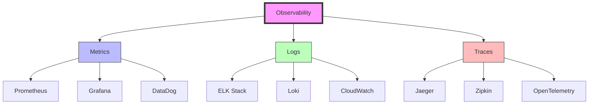
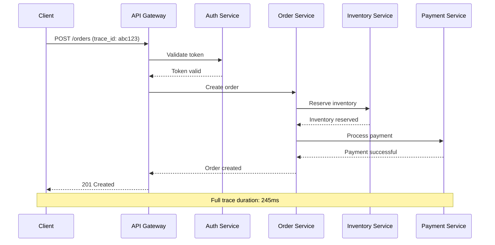
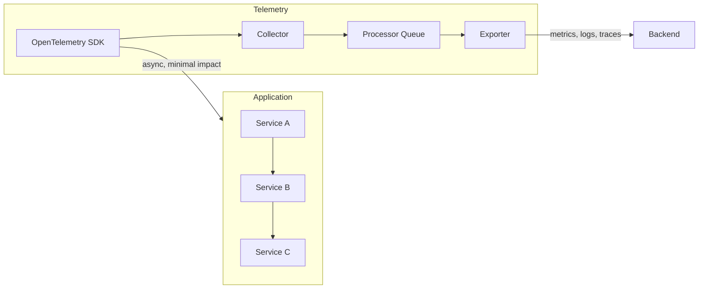
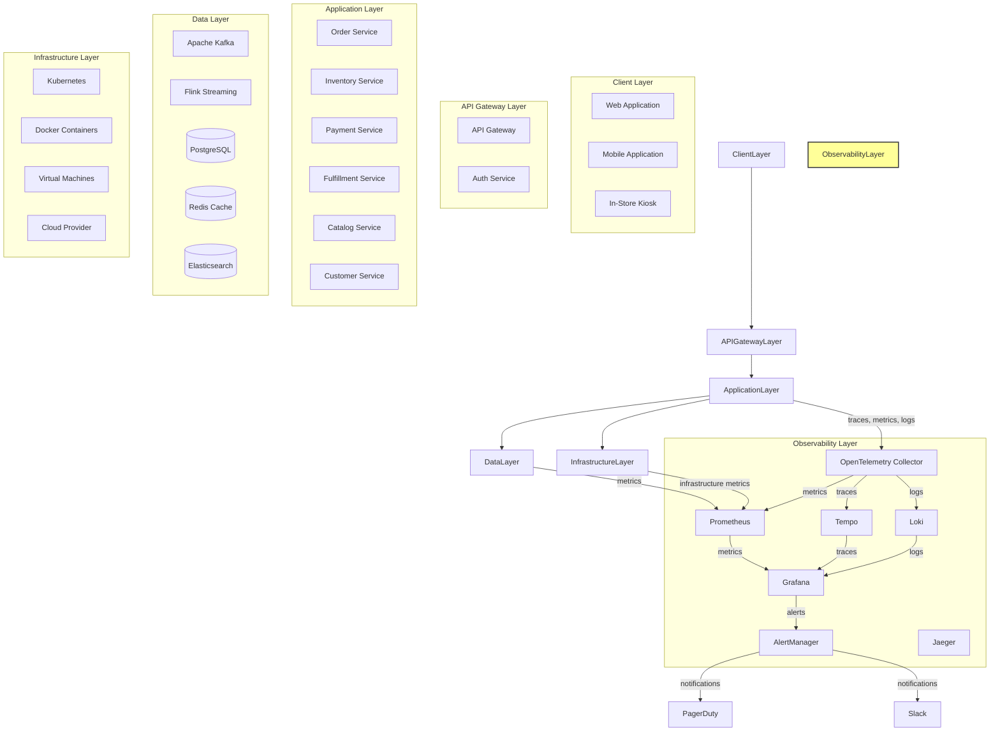
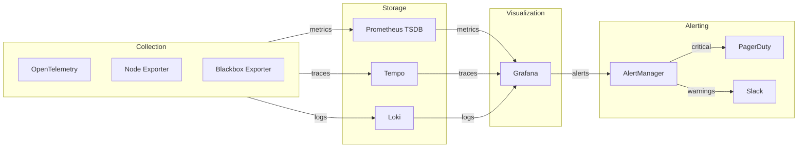
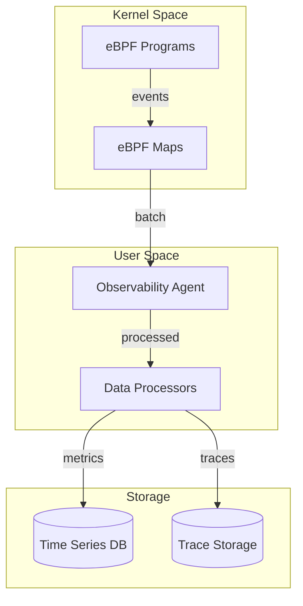

# Observability

## 1. Overview

### What is Observability?

Observability is the ability to understand the internal state of a complex system by examining its external outputs. In software engineering, observability encompasses the collection, analysis, and visualization of telemetry data including metrics, logs, and traces to understand system behavior, diagnose problems, and ensure reliability. The concept originated from control theory, where a system is observable if its internal state can be determined from knowledge of its external outputs.

Modern observability extends beyond traditional monitoring by emphasizing three key principles: the ability to ask arbitrary questions about systems without prior knowledge of potential failure modes, the correlation of different data types to form coherent narratives, and the democratization of debugging across engineering teams. Where monitoring tells you that something is wrong, observability tells you why.

### Why was it created?

Observability emerged as a discipline to address the fundamental challenges of distributed systems. Traditional monitoring approaches, which relied on predefined metrics and thresholds, proved inadequate when systems scaled horizontally across thousands of services. The rise of microservices architectures, container orchestration, and cloud-native infrastructure created unprecedented complexity where failures could cascade across service boundaries in milliseconds.

The term gained prominence in the DevOps and SRE communities around 2017-2018, championed by practitioners at companies like Twitter, Netflix, and Uber who faced scale challenges that couldn't be solved with conventional tools. Vendors like Datadog, New Relic, and Splunk began investing heavily in observability platforms, while open-source solutions like Prometheus, Grafana, and OpenTelemetry emerged to provide vendor-neutral approaches. The CNCF (Cloud Native Computing Foundation) adopted OpenTelemetry as a standard, further cementing observability as a cornerstone of modern cloud-native operations.

### What business problem does it solve?

Observability solves critical enterprise problems:

- **Reduced Mean Time to Resolution (MTTR)**: Engineering teams can diagnose production issues in minutes rather than hours. Studies show that organizations with mature observability practices resolve incidents 75% faster than those relying on traditional monitoring.

- **Proactive Reliability Engineering**: Instead of waiting for customers to report issues, observability enables teams to detect degradation before it impacts users. This shift from reactive to proactive reliability engineering reduces negative customer experiences and associated revenue loss.

- **Complex Distributed System Debugging**: Modern retail platforms process millions of transactions daily across interconnected services. When a checkout failure occurs, observability correlates data across payment gateways, inventory services, user authentication, and fulfillment systems to pinpoint the exact failure point.

- **Capacity Planning and Cost Optimization**: Detailed resource utilization metrics enable precise capacity planning, preventing both over-provisioning (wasting infrastructure costs) and under-provisioning (causing performance degradation during peak loads).

- **Service Level Objective Achievement**: Observability provides the measurement foundation for SLOs, enabling engineering teams to demonstrate reliability achievements to stakeholders and make data-driven decisions about reliability investments.

- **Compliance and Audit Requirements**: Regulated industries require comprehensive audit trails and evidence of system正常运行 time. Observability platforms provide the immutable records necessary for compliance demonstration.

### Why do enterprises use it?

Fortune 500 companies invest heavily in observability because the cost of downtime and poor user experience exceeds the investment by orders of magnitude:

- **Amazon** estimates that every 100ms of latency costs 1% in revenue. Their observability stack processes billions of metrics daily to maintain sub-second response times across global infrastructure.

- **Netflix** handles over 250 million concurrent streams. Their observability platform enables real-time detection of quality degradation affecting any subset of users, from a single device type to entire geographic regions.

- **Target** suffered a massive data breach in 2013 that cost $202 million in settlement payments. Modern observability includes security observability to detect anomalous access patterns that may indicate breaches.

- **Walmart** processes over 265 million transactions weekly during normal operation, scaling to billions during peak events like Black Friday. Observability enables capacity planning that saves hundreds of millions in unnecessary infrastructure while ensuring performance guarantees.

- **Financial Services Firms** like Goldman Sachs and JPMorgan require observability for regulatory compliance. MiFID II, Dodd-Frank, and PCI-DSS all mandate comprehensive audit trails and real-time monitoring capabilities.

---

## 2. Core Concepts

### The Three Pillars of Observability

The foundation of modern observability rests on three telemetry types that work together to provide complete system visibility.



### Metrics

Metrics are numerical measurements of system behavior captured at regular intervals. They provide a quantified view of what is happening in a system, enabling trend analysis, alerting, and capacity planning. Metrics are inherently aggregatable, meaning they can be processed, summarized, and analyzed across dimensions.

**Types of Metrics:**

| Metric Type | Description | Example |
|-------------|-------------|---------|
| **Counter** | Cumulative value that only increases | Total requests, total errors |
| **Gauge** | Point-in-time value that can go up or down | CPU usage, memory usage |
| **Histogram** | Distribution of values across buckets | Request latency distribution |
| **Summary** | Quantiles over a sliding time window | P50, P95, P99 latencies |

**Metric Labels/Dimensions:**

Metrics are enriched with labels (also called tags or dimensions) that enable slicing and dicing:

```python
# Prometheus metric with labels
from prometheus_client import Counter, Histogram

http_requests_total = Counter(
    'http_requests_total',
    'Total HTTP requests',
    ['method', 'endpoint', 'status_code']
)

order_processing_duration = Histogram(
    'order_processing_seconds',
    'Time spent processing orders',
    ['service', 'order_type'],
    buckets=[0.1, 0.5, 1.0, 2.5, 5.0, 10.0]
)

# Recording metrics
http_requests_total.labels(method='POST', endpoint='/checkout', status_code='200').inc()
order_processing_duration.labels(service='fulfillment', order_type='standard').observe(0.342)
```

### Logs

Logs are immutable, timestamped records of discrete events that occurred in a system. Unlike metrics, logs capture the detailed context of what happened, who was affected, and often why it happened. Logs are essential for debugging and forensic analysis.

**Log Levels:**

Structured logging uses severity levels to indicate the importance of events:

```python
import structlog
import logging

# Configure structured logging
structlog.configure(
    processors=[
        structlog.stdlib.filter_by_level,
        structlog.stdlib.add_logger_name,
        structlog.stdlib.add_log_level,
        structlog.processors.TimeStamper(fmt="iso"),
        structlog.processors.StackInfoRenderer(),
        structlog.processors.format_exc_info,
        structlog.processors.JSONRenderer()
    ],
    wrapper_class=structlog.stdlib.BoundLogger,
    context_class=dict,
    logger_factory=structlog.stdlib.LoggerFactory(),
    cache_logger_on_first_use=True,
)

logger = structlog.get_logger()

# Log events at appropriate levels
logger.info("order_created", order_id="ORD-12345", customer_id="CUST-678", amount=199.99)
logger.warning("inventory_low", sku="SKU-789", remaining_stock=5, reorder_threshold=10)
logger.error("payment_failed", order_id="ORD-12345", error_code="DECLINED", gateway="stripe")
```

**Log Correlation:**

Modern distributed systems require correlating logs across service boundaries:

```python
# Middleware to extract or generate correlation IDs
import uuid
from starlette.middleware.base import BaseHTTPMiddleware

class CorrelationIDMiddleware(BaseHTTPMiddleware):
    async def dispatch(self, request, call_next):
        correlation_id = request.headers.get('X-Correlation-ID', str(uuid.uuid4()))
        request.state.correlation_id = correlation_id
        
        response = await call_next(request)
        response.headers['X-Correlation-ID'] = correlation_id
        
        # Inject correlation ID into logging context
        structlog.contextvars.clear_contextvars()
        structlog.contextvars.bind_contextvars(correlation_id=correlation_id)
        
        return response
```

### Traces

Traces track the journey of a request as it flows through multiple services in a distributed system. Each trace consists of spans, where each span represents a single operation with timing information, metadata, and relationships to parent and child spans.



**Distributed Tracing with OpenTelemetry:**

```python
from opentelemetry import trace
from opentelemetry.sdk.trace import TracerProvider
from opentelemetry.sdk.trace.export import BatchSpanProcessor
from opentelemetry.exporter.jaeger.thrift import JaegerExporter
from opentelemetry.instrumentation.flask import FlaskInstrumentor
from opentelemetry.sdk.resources import Resource, SERVICE_NAME

# Configure tracer provider
resource = Resource.create({
    SERVICE_NAME: "order-service",
    "service.version": "1.2.3",
    "deployment.environment": "production"
})

provider = TracerProvider(resource=resource)
jaeger_exporter = JaegerExporter(
    agent_host_name="jaeger",
    agent_port=6831,
)

provider.add_span_processor(BatchSpanProcessor(jaeger_exporter))
trace.set_tracer_provider(provider)

tracer = trace.get_tracer(__name__)

# Instrument operations
@tracer.start_as_current_span("process_order")
def process_order(order_id: str):
    with tracer.start_as_current_span("validate_inventory") as span:
        span.set_attribute("order.id", order_id)
        inventory = validate_and_reserve_inventory(order_id)
        span.set_attribute("inventory.reserved", inventory)
    
    with tracer.start_as_current_span("process_payment") as span:
        span.set_attribute("payment.method", "credit_card")
        payment_result = execute_payment(order_id)
        span.set_attribute("payment.amount", payment_result.amount)
    
    return OrderResult(success=True)
```

### SLOs, SLIs, and Error Budgets

**Service Level Indicators (SLIs)** are specific metrics that measure service behavior from a user perspective. Common SLIs include latency (how fast does the service respond), availability (is the service operational), throughput (how many requests can it handle), and error rate (what fraction of requests fail).

**Service Level Objectives (SLOs)** are target values for SLIs. An SLO states that "99.9% of requests will complete within 200ms over a rolling 30-day window." SLOs translate user expectations into measurable engineering targets.

**Service Level Agreements (SLAs)** are contractual obligations that specify consequences if SLOs are not met. While SLOs are internal targets, SLAs are external commitments with financial or legal implications.

**Error Budgets** represent the acceptable level of unreliability. If your SLO is 99.9%, your error budget is 0.1%. For a service receiving 1 million requests per day, an error budget of 0.1% allows 1,000 errors per day. Error budgets enable data-driven decisions about reliability investments:

```python
from dataclasses import dataclass
from datetime import datetime, timedelta
from typing import Optional
import statistics

@dataclass
class SLOConfig:
    name: str
    target_percentage: float
    window_days: int
    sli_metric: str

@dataclass
class ErrorBudget:
    total_requests: int
    successful_requests: int
    target_percentage: float
    
    @property
    def error_count(self) -> int:
        return self.total_requests - self.successful_requests
    
    @property
    def error_rate(self) -> float:
        return self.error_count / self.total_requests * 100
    
    @property
    def budget_remaining_percentage(self) -> float:
        allowed_errors = self.total_requests * (100 - self.target_percentage) / 100
        return max(0, (allowed_errors - self.error_count) / allowed_errors * 100)
    
    @property
    def budget_exhausted(self) -> bool:
        return self.budget_remaining_percentage <= 0

def calculate_error_budget(slo: SLOConfig, requests: list[dict]) -> ErrorBudget:
    """Calculate error budget consumption over the SLO window"""
    window_start = datetime.now() - timedelta(days=slo.window_days)
    window_requests = [r for r in requests if r['timestamp'] >= window_start]
    
    total = len(window_requests)
    successful = len([r for r in window_requests if r['status'] in (200, 201, 204)])
    
    return ErrorBudget(
        total_requests=total,
        successful_requests=successful,
        target_percentage=slo.target_percentage
    )

# Example usage
checkout_slo = SLOConfig(
    name="checkout_availability",
    target_percentage=99.9,
    window_days=30,
    sli_metric="http_requests_total"
)

# In practice, this would query Prometheus or your metrics store
# budget = calculate_error_budget(checkout_slo, recent_requests)
# print(f"Budget remaining: {budget.budget_remaining_percentage:.2f}%")
# print(f"Budget exhausted: {budget.budget_exhausted}")
```

### RED Method

The RED method focuses on three key metrics for services, particularly those handling requests:

- **Rate**: How many requests per second is the service handling?
- **Errors**: What fraction of requests are failing (error rate)?
- **Duration**: How long are requests taking (latency distribution)?

This method is particularly effective for request-driven services like APIs and microservices.

```python
from prometheus_client import Counter, Histogram, Gauge

# RED method metrics for a microservice
requests_total = Counter(
    'service_requests_total',
    'Total requests to this service',
    ['service', 'method', 'endpoint', 'status_code']
)

request_errors = Counter(
    'service_request_errors_total',
    'Total failed requests',
    ['service', 'endpoint', 'error_type']
)

request_duration = Histogram(
    'service_request_duration_seconds',
    'Request latency in seconds',
    ['service', 'endpoint'],
    buckets=[0.005, 0.01, 0.025, 0.05, 0.1, 0.25, 0.5, 1.0, 2.5]
)
```

### USE Method

The USE method focuses on three key metrics for resources, particularly infrastructure components:

- **Utilization**: How busy is the resource?
- **Saturation**: How much extra work is the resource being asked to do (queue depth)?
- **Errors**: Are there any errors occurring?

This method is particularly effective for infrastructure components like CPUs, memory, disks, and network interfaces.

```python
# USE method metrics for system resources
from prometheus_client import Gauge

# Utilization metrics
cpu_usage = Gauge('system_cpu_usage_percent', 'CPU utilization percentage')
memory_usage = Gauge('system_memory_usage_bytes', 'Memory usage in bytes')
disk_io_wait = Gauge('system_disk_io_wait_percent', 'Disk I/O wait percentage')

# Saturation metrics
disk_queue_depth = Gauge('system_disk_queue_depth', 'Disk queue depth')
network_packet_queue = Gauge('system_network_packet_queue', 'Network packet queue length')

# Error metrics (counters for error counts)
network_errors_total = Counter('system_network_errors_total', 'Network error count', ['interface'])
disk_errors_total = Counter('system_disk_errors_total', 'Disk error count', ['device'])
```

### The Observer Effect and Telemetry Pipeline

Understanding the observer effect is crucial in observability design. The act of collecting telemetry should not significantly impact the system being observed.



**Key Principles for Minimizing Observer Effect:**

```python
# Non-blocking telemetry collection
from opentelemetry.sdk.trace.export import BatchSpanProcessor
from opentelemetry.sdk.metrics.export import PeriodicExportingMetricReader

# Use batch exporters to batch data and reduce network overhead
span_processor = BatchSpanProcessor(
    JaegerExporter(),
    max_queue_size=2048,      # Queue size to handle spikes
    schedule_delay_millis=5000,  # Batch send interval
    export_timeout_millis=30000, # Export timeout
    max_export_batch_size=512    # Max items per batch
)

# Use sampling to reduce volume while maintaining visibility
from opentelemetry.sdk.trace.sampling import TraceIdRatioBased, ParentBased

# Sample 10% of traces in production, 100% in development
sampler = ParentBased(root=TraceIdRatioBased(0.1))
```

---

## 3. Why This Project Uses It

The Enterprise Retail Streaming Platform relies on observability as a foundational capability for multiple critical functions:

**1. Real-Time Inventory Management**

The platform processes over 100,000 inventory updates per minute during peak periods. Each update must be accurately reflected across multiple systems including warehouse management, e-commerce frontends, and supplier portals. Observability enables detection of inventory discrepancies within seconds rather than hours, preventing overselling and ensuring customer satisfaction.

**2. Order Processing Pipeline**

Orders flow through a complex pipeline involving validation, inventory reservation, payment processing, fulfillment assignment, and shipping coordination. A single order may touch 15+ services. When order processing fails, observability enables engineers to trace the exact path of a problematic order and identify the failure point within minutes.

**3. Streaming Data Quality**

Apache Flink processes streaming data with exactly-once semantics for financial transactions. Observability tracks checkpoint progress, processing lag, watermark progression, and record counts at each stage. This visibility ensures data pipeline health and enables rapid response to data quality issues before they impact downstream consumers.

**4. Customer Experience Monitoring**

The platform serves customers across multiple channels: web, mobile apps, and in-store kiosks. Each channel has distinct performance characteristics and failure modes. Observability correlates user-facing metrics with backend service health, enabling detection of channel-specific issues that might be masked in aggregate metrics.

**5. Regulatory Compliance**

As a retail platform handling payment card data, the system must maintain PCI-DSS compliance. Observability provides audit trails for all data access and modifications, generates evidence for compliance reports, and enables detection of anomalous access patterns that might indicate security breaches.

**6. Incident Response**

When production incidents occur, observability reduces MTTR by providing contextual information about system state at the time of failure. Engineers can correlate metrics, logs, and traces to understand not just that something failed but why it failed and which customers were affected.

**7. Performance Optimization**

The platform operates at scale where small inefficiencies compound into significant costs. Observability enables profiling of hot paths, identification of bottlenecks, and measurement of optimization impact. Performance improvements are validated through controlled experiments with metric comparison.

---

## 4. Architecture Position

### Observability in the Platform Stack



### Data Flow Architecture

```mermaid
flowchart LR
    subgraph Sources
        AppServices[Application Services]
        Infra[Infrastructure]
        Network[Network Devices]
    end
    
    subgraph Collection
        OTel[OpenTelemetry SDK]
        StatsD[StatsD Exporter]
        LogAgg[Log Aggregators]
    end
    
    subgraph Processing
        Collector[OTel Collector]
        Transform[Transform & Enrich]
        Filter[Filter & Sample]
    end
    
    subgraph Storage
        PrometheusTS[Prometheus TSDB]
        TempoStore[Tempo Object Storage]
        LokiStore[Loki Storage]
    end
    
    subgraph Query
        PromQL[PromQL Queries]
        TraceQL[TraceQL Queries]
        LogQL[LogQL Queries]
    end
    
    Sources --> Collection
    Collection --> Processing
    Processing --> Storage
    Storage --> Query
```



---

## 5. Folder Structure

The observability implementation follows a structured organization that separates concerns while maintaining clear relationships between components.

```
observability/
├── config/
│   ├── prometheus/
│   │   ├── prometheus.yml              # Main Prometheus configuration
│   │   ├── recording_rules.yml         # Recording rules for pre-computation
│   │   ├── alerting_rules.yml          # Alert definitions
│   │   └── targets/
│   │       ├── services.yml            # Service discovery for microservices
│   │       └── infrastructure.yml      # Infrastructure targets
│   ├── grafana/
│   │   ├── dashboards/                 # Dashboard definitions
│   │   │   ├── services/               # Service-specific dashboards
│   │   │   ├── infrastructure/         # Infrastructure dashboards
│   │   │   └── business/               # Business metric dashboards
│   │   ├── datasources.yml             # Datasource configuration
│   │   └── alerting/                  # Grafana alert rules
│   ├── opentelemetry/
│   │   ├── collector-config.yml        # OTel Collector configuration
│   │   ├── receivers/                  # Custom receivers
│   │   ├── processors/                 # Custom processors
│   │   └── exporters/                  # Custom exporters
│   └── alertmanager/
│       ├── alertmanager.yml            # Alertmanager configuration
│       └── templates/                  # Notification templates
├── instrumentation/
│   ├── python/
│   │   ├── __init__.py
│   │   ├── metrics.py                  # Prometheus metric definitions
│   │   ├── tracing.py                  # OpenTelemetry tracing setup
│   │   ├── logging.py                   # Structured logging configuration
│   │   └── flask_instrumentation.py    # Flask-specific instrumentation
│   ├── java/
│   │   ├── pom.xml                     # Java instrumentation dependencies
│   │   └── src/main/java/              # Java instrumentation classes
│   └── auto-instrumentation/           # Language-agnostic auto-instrumentation
├── dashboards/
│   ├── json/                           # JSON-formatted dashboards
│   └── lib/                            # Dashboard utilities
├── scripts/
│   ├── deploy_metrics.sh               # Deploy metrics configuration
│   ├── validate_alerts.sh             # Validate alert configurations
│   ├── backup_retention.sh             # Data retention management
│   └── generate_slo_report.py          # SLO reporting script
├── tests/
│   ├── integration/
│   │   ├── test_metrics_collection.py
│   │   ├── test_trace_propagation.py
│   │   └── test_log_aggregation.py
│   └── unit/
│       ├── test_metrics.py
│       ├── test_tracing.py
│       └── test_logging.py
├── slo/
│   ├── definitions.yaml                # SLO definitions
│   ├── budget_report.py                # Error budget reporting
│   └── burn_rate_alerts.yaml           # Burn rate-based alerts
└── documentation/
    ├── runbooks/                       # Incident runbooks
    │   ├── high_error_rate.md
    │   ├── latency_degradation.md
    │   └── service_down.md
    └── best_practices.md
```

**Key Configuration Files Explained:**

`prometheus.yml` defines how Prometheus discovers targets, scrapes metrics, and applies relabeling rules:

```yaml
global:
  scrape_interval: 15s
  evaluation_interval: 15s
  external_labels:
    cluster: 'production'
    environment: 'us-east-1'

alerting:
  alertmanagers:
    - static_configs:
        - targets: ['alertmanager:9093']

rule_files:
  - 'alerting_rules.yml'
  - 'recording_rules.yml'

scrape_configs:
  - job_name: 'kubernetes-apiservers'
    kubernetes_sd_configs:
      - role: endpoints
    scheme: https
    tls_config:
      ca_file: /var/run/secrets/kubernetes.io/serviceaccount/ca.crt
    bearer_token_file: /var/run/secrets/kubernetes.io/serviceaccount/token
    relabel_configs:
      - source_labels: [__meta_kubernetes_namespace, __meta_kubernetes_service_name]
        action: keep
        regex: default;kubernetes

  - job_name: 'order-service'
    kubernetes_sd_configs:
      - role: pod
    relabel_configs:
      - source_labels: [__meta_kubernetes_pod_container_name]
        action: keep
        regex: order-service
      - source_labels: [__meta_kubernetes_pod_ip]
        regex: '(.*)'
        replacement: '${1}:9464'
        target_label: __address__
```

---

## 6. Implementation Walkthrough

### OpenTelemetry Setup

OpenTelemetry provides vendor-neutral APIs for collecting metrics, logs, and traces. Here's a comprehensive implementation:

**1. Install Dependencies:**

```bash
# Core OpenTelemetry packages
pip install opentelemetry-api
pip install opentelemetry-sdk
pip install opentelemetry-exporter-otlp

# Instrumentation packages
pip install opentelemetry-instrumentation-flask
pip install opentelemetry-instrumentation-requests
pip install opentelemetry-instrumentation-redis
pip install opentelemetry-instrumentation-psycopg2

# exporters
pip install opentelemetry-exporter-prometheus
pip install opentelemetry-exporter-jaeger-thrift
```

**2. Configure OpenTelemetry SDK:**

```python
# opentelemetry_setup.py
from opentelemetry import trace, metrics
from opentelemetry.sdk.trace import TracerProvider
from opentelemetry.sdk.trace.export import BatchSpanProcessor
from opentelemetry.sdk.metrics import MeterProvider
from opentelemetry.sdk.metrics.export import PeriodicExportingMetricReader
from opentelemetry.sdk.resources import Resource, SERVICE_NAME, SERVICE_VERSION
from opentelemetry.exporter.otlp.proto.grpc.trace_exporter import OTLPSpanExporter
from opentelemetry.exporter.otlp.proto.grpc.metric_exporter import OTLPMetricExporter
from opentelemetry.exporter.prometheus import PrometheusMetricReader
from opentelemetry.instrumentation.flask import FlaskInstrumentor
from opentelemetry.trace.propagation.tracecontext import TraceContextTextMapPropagator
import os

def setup_opentelemetry(app=None):
    """Configure OpenTelemetry for the application"""
    
    # Define resource with service metadata
    resource = Resource.create({
        SERVICE_NAME: os.getenv('OTEL_SERVICE_NAME', 'order-service'),
        SERVICE_VERSION: os.getenv('OTEL_SERVICE_VERSION', '1.0.0'),
        'deployment.environment': os.getenv('OTEL_ENVIRONMENT', 'development'),
        'host.name': os.getenv('HOSTNAME', 'localhost'),
    })
    
    # Configure tracing
    trace_provider = TracerProvider(resource=resource)
    
    # Export traces to OTLP collector
    otlp_trace_exporter = OTLPSpanExporter(
        endpoint=os.getenv('OTEL_EXPORTER_OTLP_ENDPOINT', 'http://localhost:4317'),
        insecure=True,
    )
    trace_provider.add_span_processor(
        BatchSpanProcessor(otlp_trace_exporter)
    )
    trace.set_tracer_provider(trace_provider)
    
    # Configure metrics
    prometheus_reader = PrometheusMetricReader()
    meter_provider = MeterProvider(
        resource=resource,
        metric_readers=[prometheus_reader]
    )
    metrics.set_meter_provider(meter_provider)
    
    # Configure context propagation
    trace.set_tracer_provider(trace_provider)
    propagator = TraceContextTextMapPropagator()
    trace.set_propagator(propagator)
    
    # Instrument Flask if app is provided
    if app:
        FlaskInstrumentor().instrument_app(app)
    
    return trace_provider, meter_provider
```

**3. Create Custom Metrics:**

```python
# metrics.py
from opentelemetry import metrics
from opentelemetry.sdk.metrics import Counter, Histogram, Gauge
from opentelemetry.sdk.metrics.export import AggregationTemporality
import random

# Get meter from the global provider
meter = metrics.get_meter("order_service")

# Define service-level metrics
order_created_total = meter.create_counter(
    name="orders.created.total",
    description="Total number of orders created",
    unit="1",
)

order_processing_duration = meter.create_histogram(
    name="order.processing.duration",
    description="Time spent processing an order",
    unit="s",
)

inventory_reserved = meter.create_histogram(
    name="inventory.reserved",
    description="Number of inventory units reserved per order",
    unit="1",
)

active_orders = meter.create_up_down_counter(
    name="orders.active",
    description="Number of orders currently being processed",
)

payment_amount = meter.create_histogram(
    name="payment.amount",
    description="Payment amount in cents",
    unit="cents",
)

def record_order_created(order_type: str, customer_tier: str):
    """Record a new order creation"""
    order_created_total.add(1, {
        "order.type": order_type,
        "customer.tier": customer_tier,
    })

def record_order_processing(duration_seconds: float, order_type: str):
    """Record order processing time"""
    order_processing_duration.record(
        duration_seconds,
        {"order.type": order_type}
    )

def record_payment(payment_amount_cents: int, payment_method: str, success: bool):
    """Record payment processing"""
    payment_amount.record(payment_amount_cents, {"payment.method": payment_method})
```

### Prometheus Configuration

**1. Service Discovery:**

```yaml
# prometheus/kubernetes-sd.yml
# Kubernetes service discovery configuration for Prometheus

apiVersion: v1
kind: Service
metadata:
  name: order-service-metrics
  labels:
    app: order-service
    metrics: "true"
spec:
  ports:
    - name: metrics
      port: 9464
      targetPort: metrics
---
apiVersion: v1
kind: Endpoints
metadata:
  name: order-service-metrics
  labels:
    app: order-service
subsets:
  - addresses:
      - ip: 10.244.1.15
        targetRef:
          kind: Pod
          name: order-service-abc123
    ports:
      - name: metrics
        port: 9464
```

**2. Recording Rules:**

```yaml
# prometheus/recording_rules.yml
groups:
  - name: order_service_rules
    interval: 30s
    rules:
      # Pre-compute commonly queried aggregations
      - record: job:orders_created_total:rate5m
        expr: rate(orders_created_total[5m])
      
      - record: job:order_processing_p99:by_service
        expr: histogram_quantile(0.99, rate(order_processing_duration_bucket[5m]))
      
      - record: job:orders_failed_total:rate5m
        expr: rate(orders_failed_total[5m])
      
      # Service-level SLO metrics
      - record: job:order_availability:30d
        expr: |
          1 - (
            sum(rate(orders_failed_total{job="order-service"}[30d]))
            /
            sum(rate(orders_created_total{job="order-service"}[30d]))
          )
```

### Grafana Dashboard Configuration

**1. Dashboard Provisioning:**

```yaml
# grafana/provisioning/dashboards/dashboard.yml
apiVersion: 1

providers:
  - name: 'default'
    orgId: 1
    folder: 'Services'
    type: file
    disableDeletion: false
    updateIntervalSeconds: 10
    allowUiUpdates: true
    options:
      path: /var/lib/grafana/dashboards/services
```

**2. Example Service Dashboard JSON:**

```json
{
  "dashboard": {
    "title": "Order Service Overview",
    "uid": "order-service-overview",
    "panels": [
      {
        "title": "Request Rate",
        "type": "timeseries",
        "gridPos": {"h": 8, "w": 12, "x": 0, "y": 0},
        "targets": [
          {
            "expr": "rate(orders_created_total[5m])",
            "legendFormat": "{{order_type}}"
          }
        ]
      },
      {
        "title": "Error Rate",
        "type": "timeseries",
        "gridPos": {"h": 8, "w": 12, "x": 12, "y": 0},
        "targets": [
          {
            "expr": "rate(orders_failed_total[5m]) / rate(orders_created_total[5m]) * 100",
            "legendFormat": "Error Rate %"
          }
        ]
      },
      {
        "title": "P99 Latency",
        "type": "timeseries",
        "gridPos": {"h": 8, "w": 12, "x": 0, "y": 8},
        "targets": [
          {
            "expr": "histogram_quantile(0.99, rate(order_processing_duration_bucket[5m]))",
            "legendFormat": "P99"
          }
        ]
      },
      {
        "title": "Active Orders",
        "type": "stat",
        "gridPos": {"h": 8, "w": 6, "x": 12, "y": 8},
        "targets": [
          {
            "expr": "orders_active"
          }
        ]
      }
    ]
  }
}
```

### Logging Patterns

**1. Structured Logging with Correlation:**

```python
# logging_config.py
import structlog
import logging
import sys
from typing import Any
import uuid

def configure_logging(service_name: str, environment: str):
    """Configure structured logging for a service"""
    
    # Configure standard library logging
    logging.basicConfig(
        format="%(message)s",
        stream=sys.stdout,
        level=logging.INFO,
    )
    
    # Add request ID processor if available
    processors = [
        structlog.stdlib.filter_by_level,
        structlog.stdlib.add_log_level,
        structlog.stdlib.PositionalArgumentsFormatter(),
        structlog.processors.TimeStamper(fmt="iso"),
        structlog.processors.StackInfoRenderer(),
        structlog.processors.format_exc_info,
        structlog.processors.UnicodeDecoder(),
        add_service_context(service_name, environment),
        structlog.processors.JSONRenderer()
    ]
    
    structlog.configure(
        processors=processors,
        wrapper_class=structlog.stdlib.BoundLogger,
        context_class=dict,
        logger_factory=structlog.stdlib.LoggerFactory(),
        cache_logger_on_first_use=True,
    )
    
    return structlog.get_logger()

def add_service_context(logger, method_name, event_dict):
    """Add service context to all log entries"""
    event_dict["service"] = "order-service"
    event_dict["version"] = "1.2.3"
    event_dict["environment"] = "production"
    return event_dict

class RequestContextLogger:
    """Context manager for request-scoped logging"""
    
    def __init__(self, request_id: str = None):
        self.request_id = request_id or str(uuid.uuid4())
        self.previous_context = {}
    
    def __enter__(self):
        self.previous_context = structlog.contextvars.copy_contextvars()
        structlog.contextvars.bind_contextvars(
            request_id=self.request_id
        )
        return self
    
    def __exit__(self, exc_type, exc_val, exc_tb):
        structlog.contextvars.clear_contextvars()
        for key, value in self.previous_context.items():
            structlog.contextvars.bind_contextvars(**{key: value})
        return False
```

**2. Log Aggregation Configuration:**

```yaml
# fluent-bit/fluent-bit.conf
[SERVICE]
    Flush         5
    Log_Level     info
    Daemon        off

[INPUT]
    Name              tail
    Path              /var/log/containers/*.log
    Parser            docker
    Tag               kube.*
    Refresh_Interval 5
    Mem_Buf_Limit     50MB

[FILTER]
    Name                kubernetes
    Match               kube.*
    Kube_URL            https://kubernetes.default.svc:443
    Kube_CA_File        /var/run/secrets/kubernetes.io/serviceaccount/ca.crt
    Kube_Token_File     /var/run/secrets/kubernetes.io/serviceaccount/token
    Kube_Tag_Prefix     kube.var.log.containers.
    Merge_Log           On
    Merge_Log_Key       log_processed
    K8S-Logging.Parser On
    K8S-Logging.Exclude On

[FILTER]
    Name          modify
    Match         kube.*
    Add           cluster production
    Add           service order-service

[OUTPUT]
    Name   loki
    Match  kube.*
    Host   loki
    Port   3100
    Labels job=fluent-bit,cluster=production
    AutoKubernetesLabels true
```

---

## 7. Production Best Practices

### Golden Signals Monitoring

Implement monitoring based on Google's SRE golden signals: latency, traffic, errors, and saturation.

```yaml
# Golden Signals Dashboard Configuration
apiVersion: 1
dashboards:
  - name: golden-signals
    panels:
      # Latency Panel
      - title: "Latency - P50, P95, P99"
        type: timeseries
        targets:
          - expr: histogram_quantile(0.50, rate(request_duration_seconds_bucket[5m]))
            legendFormat: "P50"
          - expr: histogram_quantile(0.95, rate(request_duration_seconds_bucket[5m]))
            legendFormat: "P95"
          - expr: histogram_quantile(0.99, rate(request_duration_seconds_bucket[5m]))
            legendFormat: "P99"
      
      # Traffic Panel
      - title: "Requests per Second"
        type: timeseries
        targets:
          - expr: rate(http_requests_total[5m])
            legendFormat: "{{method}} {{endpoint}}"
      
      # Errors Panel
      - title: "Error Rate by Status Code"
        type: timeseries
        targets:
          - expr: |
              rate(http_requests_total{status_code=~"5.."}[5m])
              / ignoring(status_code) group_left
              rate(http_requests_total[5m])
            legendFormat: "5xx Rate"
      
      # Saturation Panel
      - title: "CPU and Memory Saturation"
        type: timeseries
        targets:
          - expr: |
              rate(container_cpu_usage_seconds_total{name=~"order-service.*"}[5m])
              / container_spec_cpu_quota{name=~"order-service.*"}[5m]
            legendFormat: "CPU %"
          - expr: |
              container_memory_usage_bytes{name=~"order-service.*"}
              / container_spec_memory_limit_bytes{name=~"order-service.*"}
            legendFormat: "Memory %"
```

### Metric Cardinality Management

High-cardinality metrics can cause performance issues and increased costs. Follow these practices:

```python
# BAD: High cardinality through unbounded label values
high_cardinality_counter = Counter(
    'request_total',
    'Total requests',
    ['user_id', 'session_id', 'request_path', 'query_string']  # Don't do this!
)

# GOOD: Controlled cardinality with appropriate labels
low_cardinality_counter = Counter(
    'request_total',
    'Total requests',
    ['method', 'endpoint', 'status_code']  # Bounded, low cardinality
)

# GOOD: Separate high-cardinality data into traces/logs
# Metrics capture "500 errors increased", traces capture "which specific user was affected"
```

### Sampling Strategies

Implement intelligent sampling to balance observability coverage with cost:

```python
from opentelemetry.sdk.trace.sampling import SamplingResult, Decision, Sampler
import random

class AdaptiveSampler(Sampler):
    """Sampler that adjusts sampling rate based on error rates"""
    
    def __init__(self, base_rate: float = 0.1):
        self.base_rate = base_rate
        self.error_rate = 0.0
    
    def should_sample(self, parent_context, trace_id, name, kind, attributes):
        # Increase sampling for errors
        is_error = attributes.get("error", False)
        sample_rate = self.base_rate * 10 if is_error else self.base_rate
        
        # Always sample slow requests
        duration = attributes.get("duration_ms", 0)
        if duration > 1000:
            sample_rate = max(sample_rate, 1.0)
        
        sampled = random.random() < sample_rate
        
        return SamplingResult(
            decision=Decision.SAMPLED if sampled else Decision.NOT_SAMPLED,
            attributes={"sample_rate": sample_rate}
        )
```

### Alerting Best Practices

Design alerts that are actionable and avoid alert fatigue:

```yaml
# Alerting rules with best practices
groups:
  - name: order_service_alerts
    interval: 30s
    rules:
      # High severity: Immediate action required
      - alert: OrderServiceDown
        expr: up{job="order-service"} == 0
        for: 1m
        labels:
          severity: critical
          team: orders
        annotations:
          summary: "Order service is down"
          description: "Order service has been unavailable for more than 1 minute"
          runbook_url: "https://runbooks.example.com/order-service-down"
      
      # Warning: Investigate before it becomes critical
      - alert: OrderServiceHighErrorRate
        expr: |
          rate(orders_failed_total{job="order-service"}[5m])
          / rate(orders_created_total{job="order-service"}[5m]) > 0.01
        for: 5m
        labels:
          severity: warning
          team: orders
        annotations:
          summary: "Order service error rate above 1%"
          description: "Error rate is {{ $value | humanizePercentage }}"
      
      # Informational: SLO burn alert
      - alert: OrderServiceSLOBurnRate
        expr: |
          (
            1 - (
              sum(rate(orders_failed_total{job="order-service"}[1h]))
              /
              sum(rate(orders_created_total{job="order-service"}[1h]))
            )
          )
          > 0.999
        for: 1h
        labels:
          severity: warning
          slo: availability
        annotations:
          summary: "Order service SLO at risk"
          description: "Error budget is being consumed rapidly"
```

---

## 8. Common Problems

| Problem | Cause | Solution | Prevention |
|---------|-------|----------|------------|
| **Metric Gaps** | Service restart during scrape interval | Use Prometheus pushgateway for short-lived services | Implement proper startup and shutdown hooks |
| **Cardinality Explosion** | Adding high-cardinality labels | Review and limit label values; move to traces | Establish metric review process |
| **Alert Storms** | Cascading failures triggering many alerts | Use alert grouping, suppression rules | Implement alerting hierarchy |
| **Trace Sampling Bias** | Missing errors in samples | Tail-based sampling prioritizing errors | Configure adaptive sampling |
| **Log Volume Overload** | Verbose logging in hot paths | Log sampling, async processing | Establish log level policies |
| **Clock Skew** | NTP issues causing timeline gaps | Implement proper time synchronization | Use cluster-aware time sources |
| **Metric Correlation Failures** | Inconsistent labels across services | Standardize naming conventions | Service mesh with automatic instrumentation |
| **Alert Fatigue** | Too many non-actionable alerts | Tune thresholds, improve signal quality | Run alert reviews quarterly |
| **Retention Policy Gaps** | Short retention losing historical context | Tiered storage with appropriate retention | Define retention based on use cases |
| **Dashboard Proliferation** | Unmaintained duplicate dashboards | Governance process for dashboards | Assign dashboard ownership |
| **Distributed Tracing Gaps** | Missing instrumentation in dependencies | Auto-instrumentation with manual additions | Include instrumentation in code review |
| **SLO Definition Drift** | SLOs not matching user experience | Regular SLO reviews with stakeholders | Automated SLO validation |

---

## 9. Performance Optimization

### Metric Query Optimization

Optimize PromQL queries for faster dashboard loading:

```python
# Recording rules for expensive queries
# prometheus/recording_rules.yml
groups:
  - name: expensive_queries_optimization
    rules:
      # Pre-compute aggregations used in dashboards
      - record: app:http_requests:rate5m
        expr: sum by (service, method, status) (rate(http_requests_total[5m]))
      
      # Common joins pre-computed
      - record: app:service_errors:rate5m
        expr: sum by (service) (rate(http_requests_total{status=~"5.."}[5m]))
      
      # Histogram quantiles pre-computed
      - record: app:request_latency_p99:rate5m
        expr: histogram_quantile(0.99, sum by (le, service) (rate(http_request_duration_seconds_bucket[5m])))
```

### Distributed Tracing Performance

Minimize tracing overhead:

```python
# Tracing performance optimizations
from opentelemetry.sdk.trace import TracerProvider
from opentelemetry.sdk.trace.export import BatchSpanProcessor, SimpleSpanProcessor
from opentelemetry.sdk.trace.sampling import TraceIdRatioBased

# 1. Use batch processing to reduce network overhead
trace_provider.add_span_processor(
    BatchSpanProcessor(
        otlp_exporter,
        max_queue_size=2048,
        schedule_delay_millis=5000,
        export_timeout_millis=30000,
    )
)

# 2. Sample intelligently - 100% in dev, 10% in prod
sampler = TraceIdRatioBased(0.1)

# 3. Limit span attributes to prevent memory bloat
class LimitedAttributesSpanProcessor:
    MAX_ATTRIBUTE_COUNT = 100
    MAX_ATTRIBUTE_LENGTH = 1000
    
    def on_start(self, span):
        # Truncate long attributes
        for key, value in span.attributes.items():
            if isinstance(value, str) and len(value) > self.MAX_ATTRIBUTE_LENGTH:
                span.attributes[key] = value[:self.MAX_ATTRIBUTE_LENGTH] + "..."
    
    def on_end(self, span):
        # Count attributes and log if exceeded
        if len(span.attributes) > self.MAX_ATTRIBUTE_COUNT:
            span.attributes["_truncated"] = True
```

### Log Aggregation Optimization

Balance log detail with storage and processing costs:

```yaml
# Loki optimized configuration
# loki/loki-config.yaml
server:
  http_listen_port: 3100
  grpc_listen_port: 9095

common:
  path_prefix: /loki
  replication_factor: 1
  storage:
    filesystem:
      chunks_directory: /loki/chunks
      rules_directory: /loki/rules
  ring:
    instance_addr: 127.0.0.1
    kvstore:
      store: inmemory

limits_config:
  reject_old_samples: true
  reject_old_samples_max_age: 168h
  ingestion_rate_mb: 50
  ingestion_burst_size_mb: 100
  max_streams_per_user: 10000
  max_entries_limit_per_query: 5000000

schema_config:
  configs:
    - from: 2024-01-01
      store: boltdb
      object_store: filesystem
      schema: v11
      index:
        prefix: index_
        period: 168h

storage_config:
  boltdb:
    directory: /loki/index
  filesystem:
    directory: /loki/chunks
```

---

## 10. Security

### Observability Security Principles

```mermaid
flowchart TD
    subgraph Data Sources
        App[Application Data]
        Infra[Infrastructure Data]
        Network[Network Data]
    end
    
    subgraph Security Controls
        TLS[TLS Encryption]
        Auth[Authentication]
        RBAC[Role-Based Access]
        Audit[Audit Logging]
        Retention[Data Retention]
    end
    
    subgraph Data Protection
        PII[PII Handling]
        Mask[Data Masking]
        Encrypt[End-to-End Encryption]
    end
    
    Data Sources --> Security Controls
    Security Controls --> Data Protection
```

### Secure Metric Collection

```yaml
# Secure Prometheus configuration
global:
  external_labels:
    cluster: 'production'
    environment: 'us-east-1'

scrape_configs:
  - job_name: 'secure-service'
    scheme: HTTPS
    tls_config:
      ca_file: /etc/prometheus/certs/ca.crt
      cert_file: /etc/prometheus/certs/prometheus.crt
      key_file: /etc/prometheus/certs/prometheus.key
      insecure_skip_verify: false  # Never skip in production
    
    # Service account token for Kubernetes
    kubernetes_sd_configs:
      - role: pod
        bearer_token_file: /var/run/secrets/kubernetes.io/serviceaccount/token
        tls_config:
          ca_file: /var/run/secrets/kubernetes.io/serviceaccount/ca.crt
```

### PII Handling in Logs

```python
# Log sanitization for PII protection
import re
from typing import Any

class LogSanitizer:
    """Sanitize logs to remove PII before forwarding"""
    
    PATTERNS = [
        # Email addresses
        (r'\b[A-Za-z0-9._%+-]+@[A-Za-z0-9.-]+\.[A-Z|a-z]{2,}\b', '[EMAIL_REDACTED]'),
        # Credit card numbers
        (r'\b\d{4}[-\s]?\d{4}[-\s]?\d{4}[-\s]?\d{4}\b', '[CC_REDACTED]'),
        # Social Security Numbers
        (r'\b\d{3}-\d{2}-\d{4}\b', '[SSN_REDACTED]'),
        # Phone numbers
        (r'\b\d{3}[-.]?\d{3}[-.]?\d{4}\b', '[PHONE_REDACTED]'),
        # IP addresses (optional - may be needed for security analysis)
        # (r'\b\d{1,3}\.\d{1,3}\.\d{1,3}\.\d{1,3}\b', '[IP_REDACTED]'),
    ]
    
    @classmethod
    def sanitize(cls, data: Any) -> Any:
        """Recursively sanitize data structures"""
        if isinstance(data, str):
            return cls._sanitize_string(data)
        elif isinstance(data, dict):
            return {k: cls.sanitize(v) for k, v in data.items()}
        elif isinstance(data, (list, tuple)):
            return [cls.sanitize(item) for item in data]
        return data
    
    @classmethod
    def _sanitize_string(cls, text: str) -> str:
        """Replace PII patterns in text"""
        result = text
        for pattern, replacement in cls.PATTERNS:
            result = re.sub(pattern, replacement, result)
        return result

# Usage in logging processor
def sanitize_log_processor(logger, method_name, event_dict):
    """Structlog processor to sanitize PII"""
    if 'event' in event_dict:
        event_dict['event'] = LogSanitizer.sanitize(event_dict['event'])
    if 'extra' in event_dict:
        event_dict['extra'] = LogSanitizer.sanitize(event_dict['extra'])
    return event_dict
```

### Access Control

```yaml
# Grafana access control configuration
# grafana.ini
[users]
allow_sign_up = false
allow_org_create = false
auto_assign_org = true
auto_assign_org_role = Viewer

[auth.anonymous]
enabled = false

[security]
disable_gravatar = true
cookie_secure = true
cookie_samesite = strict

# Role-based access control
[permissions]
viewer_can_edit = false
editor_can_edit = true

# Organization settings
org_details:
  name: Enterprise Retail Platform
  address:
    country: USA
```

---

## 11. Monitoring

### Comprehensive Monitoring Stack



### Health Check Implementation

```python
# health.py - Comprehensive health checks
from dataclasses import dataclass
from typing import List, Optional
from enum import Enum
import asyncio
import aiohttp

class HealthStatus(Enum):
    HEALTHY = "healthy"
    DEGRADED = "degraded"
    UNHEALTHY = "unhealthy"

@dataclass
class HealthCheckResult:
    component: str
    status: HealthStatus
    latency_ms: Optional[float] = None
    message: Optional[str] = None
    details: Optional[dict] = None

class HealthChecker:
    """Comprehensive health checker for services"""
    
    async def check_database(self, dsn: str) -> HealthCheckResult:
        import time
        start = time.time()
        try:
            async with aiohttp.ClientSession() as session:
                async with session.get(f"{dsn}/health") as resp:
                    latency = (time.time() - start) * 1000
                    if resp.status == 200:
                        return HealthCheckResult("database", HealthStatus.HEALTHY, latency)
                    return HealthCheckResult("database", HealthStatus.UNHEALTHY, latency, "Unhealthy")
        except Exception as e:
            latency = (time.time() - start) * 1000
            return HealthCheckResult("database", HealthStatus.UNHEALTHY, latency, str(e))
    
    async def check_redis(self, host: str, port: int) -> HealthCheckResult:
        import time
        import redis
        start = time.time()
        try:
            r = redis.Redis(host=host, port=port, socket_timeout=2)
            r.ping()
            latency = (time.time() - start) * 1000
            return HealthCheckResult("redis", HealthStatus.HEALTHY, latency)
        except Exception as e:
            latency = (time.time() - start) * 1000
            return HealthCheckResult("redis", HealthStatus.UNHEALTHY, latency, str(e))
    
    async def check_kafka(self, brokers: List[str]) -> HealthCheckResult:
        import time
        from kafka import KafkaProducer
        start = time.time()
        try:
            producer = KafkaProducer(bootstrap_servers=brokers, request_timeout_ms=2000)
            producer.close()
            latency = (time.time() - start) * 1000
            return HealthCheckResult("kafka", HealthStatus.HEALTHY, latency)
        except Exception as e:
            latency = (time.time() - start) * 1000
            return HealthCheckResult("kafka", HealthStatus.UNHEALTHY, latency, str(e))
    
    async def run_all_checks(self) -> dict:
        """Run all health checks and aggregate results"""
        results = await asyncio.gather(
            self.check_database("http://postgres:5432"),
            self.check_redis("redis", 6379),
            self.check_kafka(["kafka:9092"]),
        )
        
        overall_status = HealthStatus.HEALTHY
        for result in results:
            if result.status == HealthStatus.UNHEALTHY:
                overall_status = HealthStatus.UNHEALTHY
                break
            elif result.status == HealthStatus.DEGRADED:
                overall_status = HealthStatus.DEGRADED
        
        return {
            "status": overall_status.value,
            "checks": [asdict(r) for r in results]
        }
```

### SLO Tracking Implementation

```python
# slo_tracker.py - SLO tracking and reporting
from dataclasses import dataclass
from datetime import datetime, timedelta
from typing import Optional
import statistics

@dataclass
class SLOTarget:
    name: str
    target_percentage: float
    window_days: int
    sli_budget: float  # in percentage points
    
    @property
    def error_budget_percentage(self) -> float:
        return 100 - self.target_percentage

@dataclass
class SLOReport:
    slo: SLOTarget
    total_requests: int
    successful_requests: int
    error_count: int
    error_rate: float
    budget_remaining: float
    budget_consumed: float
    period_start: datetime
    period_end: datetime
    
    @property
    def current_availability(self) -> float:
        return (self.successful_requests / self.total_requests * 100) if self.total_requests > 0 else 0

class SLOTRacker:
    """Track SLOs and generate error budget reports"""
    
    def __init__(self, slo: SLOTarget):
        self.slo = slo
    
    def calculate_error_budget_burn_rate(self, current_errors: int, 
                                         current_requests: int,
                                         window_hours: int) -> float:
        """
        Calculate how fast the error budget is being consumed.
        Burn rate > 1 means budget is being consumed faster than expected.
        """
        window_seconds = window_hours * 3600
        
        # Expected error budget for the window
        budget_for_window = (current_requests / window_seconds) * self.slo.error_budget_percentage
        
        # Actual burn rate
        observed_error_rate = current_errors / current_requests if current_requests > 0 else 0
        
        if budget_for_window > 0:
            return observed_error_rate / self.slo.error_budget_percentage
        
        return 0.0
    
    def generate_report(self, events: list[dict], 
                       start: datetime, 
                       end: datetime) -> SLOReport:
        """Generate SLO report for the given time period"""
        period_events = [e for e in events if start <= e['timestamp'] <= end]
        total = len(period_events)
        successful = len([e for e in period_events if e.get('success', False)])
        errors = total - successful
        
        error_rate = (errors / total * 100) if total > 0 else 0
        budget_consumed = (errors / (total * (self.slo.error_budget_percentage / 100))) if total > 0 else 0
        budget_remaining = max(0, 100 - budget_consumed)
        
        return SLOReport(
            slo=self.slo,
            total_requests=total,
            successful_requests=successful,
            error_count=errors,
            error_rate=error_rate,
            budget_remaining=budget_remaining,
            budget_consumed=budget_consumed,
            period_start=start,
            period_end=end
        )
```

---

## 12. Testing Strategy

### Observability Testing Patterns

```python
# test_observability.py
import pytest
from unittest.mock import MagicMock, patch
from prometheus_client import Counter, Histogram, generate_latest, REGISTRY

class TestMetricsCollection:
    """Test suite for metrics collection"""
    
    def test_counter_increments_correctly(self):
        """Verify counter increments and label handling"""
        counter = Counter('test_requests', 'Test requests', ['method'])
        
        counter.labels(method='GET').inc()
        counter.labels(method='POST').inc()
        counter.labels(method='GET').inc()
        
        # Parse metrics output
        output = generate_latest(REGISTRY).decode('utf-8')
        
        assert 'test_requests_total{method="GET"} 2.0' in output
        assert 'test_requests_total{method="POST"} 1.0' in output
    
    def test_histogram_records_values(self):
        """Verify histogram bucket distribution"""
        histogram = Histogram('test_duration', 'Test duration', buckets=[0.1, 0.5, 1.0])
        
        histogram.observe(0.05)
        histogram.observe(0.3)
        histogram.observe(0.8)
        
        output = generate_latest(REGISTRY).decode('utf-8')
        
        assert 'test_duration_bucket{le="0.1"} 1.0' in output
        assert 'test_duration_bucket{le="0.5"} 2.0' in output
        assert 'test_duration_bucket{le="1.0"} 3.0' in output

class TestTracingPropagation:
    """Test suite for distributed tracing"""
    
    @patch('opentelemetry.trace.get_tracer')
    def test_trace_context_propagation(self, mock_tracer):
        """Verify trace context is propagated correctly"""
        from opentelemetry.propagate import inject, extract
        from opentelemetry.trace.propagation.tracecontext import TraceContextTextMapPropagator
        
        propagator = TraceContextTextMapPropagator()
        
        # Create carrier with context
        carrier = {}
        propagator.inject(carrier)
        
        # Extract context
        context = propagator.extract(carrier)
        
        assert context is not None
        assert 'traceparent' in carrier

class TestLogAggregation:
    """Test suite for log aggregation"""
    
    def test_log_sanitization(self):
        """Verify PII is properly sanitized in logs"""
        from logging_config import LogSanitizer
        
        sensitive_log = """
        User email: john.doe@example.com made a purchase
        Card ending: 4111-1111-1111-1111
        """
        
        sanitized = LogSanitizer.sanitize(sensitive_log)
        
        assert 'john.doe@example.com' not in sanitized
        assert '4111-1111-1111-1111' not in sanitized
        assert 'john.doe@' in sanitized  # Pattern replacement marker
    
    def test_structured_log_output(self):
        """Verify structured log output format"""
        import structlog
        
        logger = structlog.get_logger()
        
        # Capture log output
        with capture_logs() as logs:
            logger.info("order_processed", order_id="123", amount=99.99)
        
        assert len(logs) == 1
        assert logs[0]['event'] == 'order_processed'
        assert logs[0]['order_id'] == '123'
        assert logs[0]['amount'] == 99.99

class TestAlertingRules:
    """Test suite for alerting rules"""
    
    def test_alert_threshold_calculation(self):
        """Verify alert threshold calculations"""
        from alerting_rules import calculate_burn_rate_alert_threshold
        
        # 99.9% SLO over 1 hour window
        threshold = calculate_burn_rate_alert_threshold(
            slo_percentage=99.9,
            window_hours=1,
            min_burn_rate=1
        )
        
        assert threshold > 0
        assert threshold < 1000  # Should be reasonable percentage
```

### Integration Testing with Observability

```yaml
# docker-compose for observability integration testing
version: '3.8'

services:
  prometheus:
    image: prom/prometheus:latest
    volumes:
      - ./prometheus.yml:/etc/prometheus/prometheus.yml
    ports:
      - "9090:9090"
    networks:
      - test
  
  grafana:
    image: grafana/grafana:latest
    ports:
      - "3000:3000"
    environment:
      - GF_SECURITY_ADMIN_PASSWORD=admin
    networks:
      - test
  
  loki:
    image: grafana/loki:latest
    ports:
      - "3100:3100"
    networks:
      - test
  
  jaeger:
    image: jaegertracing/all-in-one:latest
    ports:
      - "16686:16686"
      - "6831:6831"
    networks:
      - test
  
  app:
    build: .
    ports:
      - "8080:8080"
    environment:
      - OTEL_EXPORTER_OTLP_ENDPOINT=http://collector:4317
      - PROMETHEUS_ENDPOINT=http://prometheus:9090
    networks:
      - test
    depends_on:
      - prometheus

networks:
  test:
    driver: bridge
```

---

## 13. Interview Preparation

### Beginner Questions (30)

**Q1: What is the difference between monitoring and observability?**

**A:** Monitoring is the practice of collecting predefined metrics and checking them against thresholds to detect issues. It tells you what is happening based on known failure modes. Observability is the ability to understand internal system state through external outputs without needing to know what failures might occur in advance. While monitoring requires you to know what questions to ask beforehand, observability allows you to explore arbitrary questions about system behavior. Monitoring focuses on metrics; observability combines metrics, logs, and traces to provide complete visibility.

**Q2: What are the three pillars of observability?**

**A:** The three pillars are metrics, logs, and traces. Metrics are numerical measurements captured at regular intervals (counters, gauges, histograms). Logs are immutable timestamped records of discrete events. Traces track the journey of requests through distributed systems, consisting of interconnected spans. Together, they provide complementary views: metrics show what's happening at a system level, logs provide detailed event information, and traces show how requests flow through components.

**Q3: What is a metric counter? When would you use it?**

**A:** A counter is a cumulative metric that only increases over time, representing the total count of events. You use counters to track things like total requests, total errors, total orders placed, or total bytes transferred. Counters are ideal for measuring rates over time (requests per second) because you can apply functions like `rate()` to calculate the change rate between data points.

**Q4: What is the difference between a gauge and a counter?**

**A:** A gauge represents a point-in-time value that can go up or down, like current CPU usage, memory consumption, or queue depth. A counter only increases (or resets to zero on process restart), representing cumulative totals like total requests or total errors. Use gauges for measurements that fluctuate around a value; use counters for things that monotonically increase.

**Q5: What is a histogram metric?**

**A:** A histogram samples observations and counts them in configurable buckets. It's commonly used for request latencies. For example, you define buckets like [0.1s, 0.5s, 1s, 5s], and each observation increments the count for the appropriate bucket. Histograms enable calculating percentiles (P50, P95, P99) and are more efficient than storing every raw value.

**Q6: What is the purpose of labels/dimensions in metrics?**

**A:** Labels add context to metrics, allowing you to slice and dice data. A metric like `http_requests_total` with labels `method`, `endpoint`, and `status_code` lets you query requests specifically for POST /checkout returning 200, rather than having separate metrics for each combination. Labels enable flexible aggregation and correlation without creating separate metrics for each dimension.

**Q7: What is structured logging?**

**A:** Structured logging formats log entries as structured data (typically JSON) with key-value pairs rather than plain text messages. Instead of "User 12345 placed order ORD-678 at 2:30pm for $99.99," structured logging produces `{"user_id": "12345", "action": "order_placed", "order_id": "ORD-678", "timestamp": "2024-01-15T14:30:00Z", "amount": 99.99}`. This enables efficient searching, filtering, and analysis using log aggregation tools.

**Q8: What is distributed tracing?**

**A:** Distributed tracing tracks requests as they flow through multiple services in a distributed system. Each operation creates a span with timing, metadata, and parent-child relationships. Spans combine into traces showing the complete request path. This helps debug latency issues, understand service dependencies, and identify where failures occur in complex microservice architectures.

**Q9: What is OpenTelemetry?**

**A:** OpenTelemetry (OTel) is a vendor-neutral open-source observability framework providing APIs, SDKs, and tools for collecting metrics, logs, and traces. It offers language-specific implementations for major programming languages, supports multiple backends through exporters, and has become the industry standard for cloud-native observability.

**Q10: What is Prometheus?**

**A:** Prometheus is an open-source systems monitoring and alerting toolkit. It collects and stores metrics as time series data, provides a powerful query language (PromQL), includes alerting through Alertmanager, and integrates tightly with Kubernetes. Prometheus uses a pull-based model where it scrapes metrics from configured targets.

**Q11: What is Grafana?**

**A:** Grafana is an open-source analytics and interactive visualization platform. It connects to multiple data sources including Prometheus, Elasticsearch, Loki, and Tempo to create dashboards with graphs, charts, and alerts. Grafana is the standard visualization layer for cloud-native observability stacks.

**Q12: What is an SLO?**

**A:** A Service Level Objective (SLO) is a target value for a service level indicator. For example, "99.9% of requests will complete within 200ms over a 30-day rolling window." SLOs translate user expectations into measurable engineering targets and guide reliability investments.

**Q13: What is an SLA?**

**A:** A Service Level Agreement is a contractual commitment with consequences for failure to meet specified service levels. Unlike internal SLOs, SLAs often have financial or legal implications, typically involving credits or penalties when targets are missed.

**Q14: What is an error budget?**

**A:** An error budget is the acceptable level of unreliability defined by an SLO. If the SLO is 99.9%, the error budget is 0.1%. For 1 million requests, that's 1,000 allowed errors. Error budgets enable data-driven decisions about whether to prioritize new features or reliability improvements.

**Q15: What is the RED method?**

**A:** The RED method defines three key metrics for request-driven services: Rate (requests per second), Errors (error rate), and Duration (latency distribution). It's particularly effective for microservices and APIs, focusing on user-facing service behavior.

**Q16: What is the USE method?**

**A:** The USE method defines three key metrics for resources: Utilization (how busy is the resource), Saturation (how much extra work is queued), and Errors (are there errors occurring). It's particularly effective for infrastructure components like CPU, memory, disks, and networks.

**Q17: What is tail-based sampling?**

**A:** Tail-based sampling is a tracing sampling strategy that makes sampling decisions after traces complete, prioritizing error traces and slow requests. This ensures you capture all information about important traces while reducing overall collection costs by sampling uninteresting fast, successful traces.

**Q18: What is the observer effect in observability?**

**A:** The observer effect refers to the phenomenon where measuring a system changes its behavior. In observability, collecting telemetry consumes CPU, memory, and network resources. Excessive instrumentation can degrade system performance, so observability implementations must minimize their footprint.

**Q19: What is cardinality in metrics?**

**A:** Cardinality refers to the number of unique label value combinations in metrics. High cardinality occurs when labels have many unique values (like user IDs or session IDs). High cardinality can cause memory issues and query performance problems, so metrics should use low-cardinality labels.

**Q20: What is a span in distributed tracing?**

**A:** A span represents a single operation within a trace, containing a name, timing information, attributes, events, and status. Spans have start and end times and can be nested to show parent-child relationships. A trace consists of multiple spans connected to show a complete request path.

**Q21: What is trace context propagation?**

**A:** Trace context propagation passes trace information between services using context carriers (typically HTTP headers). When a service calls another, it injects its trace context into the request headers; the receiving service extracts it to continue the trace. This enables end-to-end request tracking across service boundaries.

**Q22: What is LogQL?**

**A:** LogQL is Loki's query language for logs, combining log stream selectors with filtering expressions. For example, `{job="order-service"} |= "error" | json | duration > 1s` selects logs from order-service containing "error," parses them as JSON, and filters for those with duration exceeding 1 second.

**Q23: What is PromQL?**

**A:** PromQL is Prometheus Query Language, used to select and aggregate time series data. It supports functions like `rate()` for calculating per-second rates, `histogram_quantile()` for percentile calculations, and various operators for arithmetic, comparison, and aggregation.

**Q24: What is the difference between push and pull metrics?**

**A:** Pull-based systems (like Prometheus) scrape metrics from configured endpoints at regular intervals. Push-based systems (like StatsD) have applications send metrics to a central collection service. Pull is simpler and more scalable; push is better for short-lived tasks and allows immediate metric emission.

**Q25: What is a health check endpoint?**

**A:** A health check endpoint (like /health) is an HTTP endpoint that returns service health status. Liveness checks verify the service is running; readiness checks verify it can handle traffic (dependencies are available). Load balancers and orchestrators use health checks to route traffic appropriately.

**Q26: What is Alertmanager?**

**A:** Alertmanager is part of the Prometheus ecosystem that handles alerts from Prometheus, deduplicates, groups, and routes them to appropriate receivers like PagerDuty, Slack, or email. It supports silencing, inhibition, and routing based on alert labels.

**Q27: What is the golden signals monitoring approach?**

**A:** Golden signals, from Google's SRE book, are four key metrics to monitor: Latency (response time), Traffic (requests per second), Errors (failure rate), and Saturation (resource utilization). Monitor these four signals for every service to detect most user-facing issues.

**Q28: What is data retention in observability?**

**A:** Data retention defines how long observability data is stored. Different data types have different retention needs: high-resolution metrics might be kept for 30 days, lower resolution for a year, and logs for 90 days. Retention policies balance storage costs against analytical and compliance needs.

**Q29: What is the difference between dashboards and alerts?**

**A:** Dashboards visualize historical and current data for exploration and understanding, helping identify trends and correlations. Alerts are automated notifications triggered when conditions meet predefined criteria, requiring immediate action. Dashboards are for investigation; alerts are for action.

**Q30: Why is correlation ID important in logging?**

**A:** A correlation ID is a unique identifier that follows a request through all services and log entries. When troubleshooting, you can search for the correlation ID to find all log entries related to a single request, even if they span multiple services. Without correlation IDs, correlating logs across services is extremely difficult.

### Intermediate Questions (30)

**Q31: How would you design observability for a microservices architecture?**

**A:** I would implement a layered approach: (1) Each service exposes metrics via Prometheus client library with standardized labels (service_name, version, environment); (2) Use OpenTelemetry for distributed tracing with context propagation; (3) Implement structured logging with correlation IDs; (4) Deploy OTel Collector to aggregate and route telemetry; (5) Use service mesh (Istio/Linkerd) for automatic instrumentation at network level; (6) Define SLOs per service with error budget tracking; (7) Implement tiered alerting with severity levels.

**Q32: How do you handle high cardinality metrics?**

**A:** High cardinality metrics should be avoided by keeping label values bounded. For unbounded values like user IDs, I would: (1) Remove the label entirely; (2) Hash the value to reduce cardinality while maintaining uniqueness; (3) Move the detail to traces/logs where it's searchable; (4) Use top() or bottom() functions in PromQL to keep only top N values. Additionally, I'd implement cardinality budgets per metric and monitor cardinality growth.

**Q33: Explain how you would implement SLO-based alerting.**

**A:** SLO-based alerting uses error budget burn rate rather than fixed thresholds. For a 99.9% SLO over 30 days: (1) Define burn rate = actual error rate / allowed error rate; (2) Alert at burn rate > 1 for 1h (fast burn, critical); (3) Alert at burn rate > 0.5 for 6h (slow burn, warning); (4) This catches SLO violations faster than simple latency/error alerts and reduces alert noise by tying alerts directly to business impact.

**Q34: What sampling strategies would you use for distributed tracing?**

**A:** I would implement adaptive sampling: (1) Head-based sampling for initial decision (sample 10% of all traces); (2) Tail-based sampling to ensure 100% capture of error traces and slow requests (>1s); (3) Priority-based sampling to preserve traces with specific attributes (e.g., payment-related); (4) Cost-based sampling to limit spans per trace; (5) Backpressure handling to sample more when collectors are overwhelmed.

**Q35: How would you debug a latency spike in a distributed system?**

**A:** I would follow this methodology: (1) Check SLO dashboard for affected services; (2) Use RED method on the entry point service; (3) Examine traces for the spike window, looking for slow spans; (4) Identify if latency is in the service or downstream; (5) If downstream, examine that service's metrics and traces; (6) Correlate with infrastructure metrics (CPU, memory, network); (7) Check deployment history for changes; (8) Examine logs for errors or warnings.

**Q36: What are the trade-offs between metrics and traces?**

**A:** Metrics are highly aggregatable, efficient for storage, and great for alerting and trend analysis. However, they're predefined and lose detail. Traces provide request-level detail and show exact paths, but are higher volume and more expensive to store. The best approach uses both: metrics for "something might be wrong" detection, traces for "what exactly is wrong" diagnosis.

**Q37: How would you design a log aggregation system for 1TB/day?**

**A:** I would use Loki or similar log aggregation: (1) Implement log compression at ingestion; (2) Use horizontal scaling with partition/shard keys based on labels; (3) Implement tiered storage (SSD for recent logs, HDD for older); (4) Apply retention policies with deletion of old data; (5) Use sampling for high-volume debug logs; (6) Implement log correlation to traces to reduce direct log queries; (7) Create dashboard aggregations for common queries.

**Q38: Explain the architecture of the OpenTelemetry Collector.**

**A:** The OTel Collector has three main components: (1) Receivers that ingest data (OTLP, Prometheus, Jaeger, etc.); (2) Processors that transform data (batch, filter, sampling, attributes manipulation); (3) Exporters that send data to backends (OTLP, Prometheus, Loki, Jaeger). A service pipeline connects receivers to exporters through processors. It can run as an agent (local) or gateway (centralized aggregation point).

**Q39: How do you ensure observability doesn't impact application performance?**

**A:** I implement several strategies: (1) Use async/non-blocking SDK operations; (2) Batch telemetry data before export; (3) Apply intelligent sampling (most traces should be sampled out); (4) Use tail-based sampling to preserve important traces; (5) Set cardinality budgets and monitor; (6) Separate telemetry processing from business logic threads; (7) Test with realistic load to verify overhead is <1%.

**Q40: What is the difference between OpenTelemetry and proprietary APM tools?**

**A:** OpenTelemetry is vendor-neutral, portable, and community-driven with no vendor lock-in. Proprietary APM tools (Datadog, New Relic) often have better out-of-box experience and deeper integrations but create dependency. OpenTelemetry provides flexibility to route data to multiple backends and avoids licensing costs, but requires more configuration and doesn't provide the correlation and analytics features of full APM platforms.

**Q41: How would you implement multi-tenant observability?**

**A:** For multi-tenant observability: (1) Add tenant_id labels to all metrics; (2) Use metric relabeling to filter by tenant; (3) Implement tenant-scoped dashboards and alerts; (4) Use separate time series databases or namespacing for isolation; (5) Set per-tenant retention policies; (6) Implement access control with tenant scope; (7) Monitor per-tenant resource usage for billing.

**Q42: What are recording rules and why are they useful?**

**A:** Recording rules pre-compute expensive PromQL queries and store results as new time series. They're useful because: (1) Dashboard queries become faster; (2) Complex aggregations run on schedule rather than at query time; (3) Reduce load on Prometheus for frequently-queried metrics; (4) Enable derived metrics that combine multiple signals.

**Q43: How do you handle observability in serverless functions?**

**A:** For serverless: (1) Use extension-based metrics collection (AWS Lambda layer); (2) Implement cold start tracking; (3) Use push-based export since pull doesn't work; (4) Add correlation IDs to all log entries; (5) Capture duration and memory metrics automatically; (6) Set appropriate sampling rates since functions may execute millions of times.

**Q44: What is continuous profiling and how does it differ from tracing?**

**A:** Continuous profiling captures CPU, memory, and I/O usage at the function level, showing which code paths consume resources. Unlike tracing which follows requests, profiling shows resource consumption independent of requests. It's useful for identifying inefficient code that doesn't appear in individual slow requests but consumes significant resources overall.

**Q45: How would you migrate from a proprietary APM to OpenTelemetry?**

**A:** Migration strategy: (1) Deploy OTel Collector alongside existing APM agent; (2) Instrument services with OTel SDK while keeping existing SDK; (3) Route OTel data to a new backend (Grafana Tempo/Loki); (4) Validate data consistency between systems; (5) Gradually move dashboards and alerts; (6) Remove proprietary agents once confidence is established; (7) Maintain correlation between old and new during transition.

**Q46: Explain event-driven observability challenges.**

**A:** Event-driven systems (Kafka, Kinesis) pose unique challenges: (1) No synchronous request-response to trace; (2) Need to track event lineage through consumers; (3) Processing delays make timing correlation difficult; (4) Consumer lag becomes a key metric; (5) Need schema registry observability for event evolution; (6) Should track consumer group offsets and processing rates.

**Q47: How would you implement SLO burn rate alerts?**

**A:** SLO burn rate alerts: (1) Calculate error budget burn rate = actual errors / allowed errors; (2) Short window alert (1h): burn rate > 14.4 (exhausts 1h budget in 1h); (3) Medium window alert (6h): burn rate > 6 (exhausts 6h budget in 6h); (4) Long window alert (3d): burn rate > 1.333 (exhaustes 3d budget in 3d); (5) These multipliers ensure alerts before SLO breach.

**Q48: What is the use method vs red method?**

**A:** USE (Utilization, Saturation, Errors) is for infrastructure resources (CPU, disk, network) - it identifies resource bottlenecks. RED (Rate, Errors, Duration) is for request-driven services (APIs, microservices) - it measures user-facing performance. Choose USE for "why is the system slow?" and RED for "why are requests slow?"

**Q49: How do you implement chaos engineering with observability?**

**A:** Chaos engineering with observability: (1) Define steady state hypothesis using metrics/SLOs; (2) Design experiments to test failure scenarios; (3) Use observability to verify detection of injected failures; (4) Measure MTTD (mean time to detect) for each failure mode; (5) Compare observability coverage between experiments; (6) Iterate to improve detection coverage.

**Q50: What are the key metrics for Kubernetes monitoring?**

**A:** Kubernetes observability spans multiple layers: (1) Node level: CPU, memory, disk I/O, network; (2) Control plane: API server latency, etcd latency, scheduler decisions; (3) Pod level: CPU throttling, memory limits, restarts; (4) Workload level: replica health, rolling update progress; (5) Service level: request rates, latency, errors; (6) Network level: DNS resolution time, connection drops.

**Q51: Explain metric aggregation and when to use each type.**

**A:** Aggregation types: (1) Sum/count for totals; (2) Average for central tendency; (3) Percentiles (P50, P95, P99) for latency - P95 is common SLO target; (4) Rate for changes over time; (5) Increase for counter deltas. Choose based on use case: percentiles for user-facing latency, average for resource utilization, rates for events.

**Q52: What is the Four Golden Signals in SRE?**

**A:** The four golden signals are: Latency (slow responses hurt users even if not errors), Traffic (requests per second measure demand), Errors (failed requests), and Saturation (resource utilization approaching limits). Monitor these four signals for every service and alert on them to catch most user-facing issues before they become outages.

**Q53: How do you handle observability in a polyglot environment?**

**A:** In polyglot environments: (1) Use OpenTelemetry for auto-instrumentation where available; (2) Standardize on W3C Trace Context for trace propagation; (3) Create service-specific instrumentation only where needed; (4) Use service mesh for network-level instrumentation across all languages; (5) Define standard metric naming conventions; (6) Create unified dashboards that aggregate across languages.

**Q54: What is the difference between black-box and white-box monitoring?**

**A:** Black-box monitoring tests external behavior without knowledge of internal state (is the endpoint returning 200?). White-box monitoring leverages internal exposure (what is the error rate? which component is slow?). Combine both: black-box for end-to-end health, white-box for detailed diagnosis. Kubernetes liveness/readiness probes are black-box; Prometheus metrics are white-box.

**Q55: How would you design observability for a data pipeline?**

**A:** Data pipeline observability: (1) Track record counts at each stage (input, output, dead letter); (2) Monitor processing lag and watermark progression; (3) Track checkpoint progress and duration; (4) Record data quality metrics (null rates, schema violations); (5) Monitor Flink job health and task failures; (6) Implement end-to-end lineage tracking; (7) Alert on processing delays and data quality degradation.

**Q56: What are exemplars in Prometheus?**

**A:** Exemplars are links from metrics to traces. When recording a histogram observation, you can attach a trace ID. In Grafana, clicking on a histogram bucket shows the exemplar and lets you jump directly to the related trace. This connects metrics to traces without requiring trace storage for every measurement.

**Q57: How do you implement cost-effective observability at scale?**

**A:** Cost optimization strategies: (1) Implement tiered storage with lower resolution for old data; (2) Use recording rules to pre-compute aggregations; (3) Apply adaptive sampling based on error rates; (4) Delete old data per retention policy; (5) Use compression for logs; (6) Choose open-source over proprietary when possible; (7) Monitor observability infrastructure costs themselves.

**Q58: What is DORA metrics?**

**A:** DORA (DevOps Research and Assessment) metrics measure organizational performance: Deployment Frequency, Lead Time for Changes, Mean Time to Recovery (MTTR), and Change Failure Rate. These four metrics predict organizational success and can be derived from CI/CD and observability data.

**Q59: How would you design alerting to avoid alert fatigue?**

**A:** Alert fatigue prevention: (1) Every alert must have a clear action path; (2) Implement alert severity levels with appropriate escalation; (3) Use SLO-based alerts instead of threshold alerts where possible; (4) Implement alert deduplication and grouping; (5) Regular alert reviews to tune or remove noisy alerts; (6) Create runbooks for each alert; (7) Measure alert noise rate and set targets for reduction.

**Q60: What is continuous verification?**

**A:** Continuous verification uses synthetic transactions to verify services work as expected, independent of real user traffic. It enables: (1) Proactive detection before users notice; (2) Testing beyond what monitoring provides; (3) Verification of SLOs in production; (4) Regular health checks of critical user journeys; (5) Detection of deployment issues before full rollout.

### Advanced Questions (30)

**Q61: How would you design observability for a globally distributed system?**

**A:** Global observability design: (1) Deploy regional collectors that aggregate locally and forward summaries globally; (2) Use consistent labeling schema with region/availability zone; (3) Implement global dashboards that aggregate across regions; (4) Correlate cross-region traces with unique global trace IDs; (5) Use time-series databases optimized for global aggregation; (6) Implement geo-distributed alerting to handle region-specific issues.

**Q62: Explain the challenges of causality tracking in distributed systems.**

**A:** Causality tracking challenges: (1) Clock skew makes temporal ordering unreliable; (2) Async messaging breaks request-response correlation; (3) Eventual consistency can reorder events; (4) Solutions include vector clocks, happened-before relationships, and causal ordering protocols; (5) Practitioners use correlation IDs and causal tracing to establish causality through application-level reasoning.

**Q63: How would you implement ML-based anomaly detection in observability?**

**A:** ML anomaly detection implementation: (1) Collect baseline metrics over stable periods; (2) Use algorithms like isolation forests or LSTM for time-series anomaly detection; (3) Implement online learning to adapt to concept drift; (4) Combine multiple signals for higher accuracy; (5) Tune alert thresholds to balance false positives/negatives; (6) Use supervised learning when labeled data (past incidents) is available.

**Q64: What are the trade-offs between centralized and decentralized observability?**

**A:** Centralized offers unified view and easier correlation but creates a scalability bottleneck and single point of failure. Decentralized scales better but makes cross-service correlation difficult. Hybrid approaches use edge aggregation with centralized correlation. Modern approaches use globally coherent data models (OpenTelemetry) with federated storage.

**Q65: How does eBPF enable new observability approaches?**

**A:** eBPF enables kernel-level observability without application changes: (1) Network packet capture and analysis at kernel speed; (2) Continuous profiling with minimal overhead; (3) Security monitoring for syscall patterns; (4) Performance profiling of entire system including I/O; (5) Tools like Cilium, Falco, and Parca leverage eBPF for production-safe observability.

**Q66: Design an observability system that handles 10 million metrics per second.**

**A:** At 10M metrics/sec: (1) Use horizontally scalable time-series database (Thanos, M3DB, VictoriaMetrics); (2) Implement tiered aggregation (edge preprocessing before central); (3) Use efficient serialization (Protocol Buffers, Arrow); (4) Implement cardinality limits at ingestion; (5) Use approximate algorithms (HyperLogLog, t-digest) where exact counts aren't needed; (6) Design for ~70% storage of raw data, ~30% pre-aggregated.

**Q67: How would you implement cost attribution using observability data?**

**A:** Cost attribution implementation: (1) Label all resources with owner/team/project; (2) Correlate infrastructure costs (compute, storage) to services using labels; (3) Track SLO achievement per team; (4) Calculate cost of unreliability using error budget burn; (5) Generate per-team cost reports showing infrastructure + reliability cost; (6) Integrate with FinOps practices.

**Q68: Explain how observability enables self-healing systems.**

**A:** Self-healing systems use observability for: (1) Continuous health assessment; (2) Automatic triggering of remediation based on alerts; (3) Verification that remediation worked; (4) Rollback decisions based on SLO impact; (5) Kubernetes liveness/readiness probes as basic form; (6) Advanced: automatic scaling, restarts, or circuit breaking based on observed behavior.

**Q69: What are the security considerations in observability design?**

**A:** Security considerations: (1) PII in logs requires sanitization; (2) Metrics can leak sensitive business information; (3) Access control for observability data; (4) TLS for data in transit; (5) Encryption at rest for sensitive data; (6) Audit logging of who accesses observability data; (7) Rate limiting to prevent DoS through metric explosion.

**Q70: How would you design observability for a streaming system?**

**A:** Streaming observability design: (1) Track per-partition offsets and lag; (2) Monitor consumer group health and rebalancing; (3) Track watermark progression for event time; (4) Measure processing latency from ingestion to output; (5) Implement record-level tracking for exactly-once semantics; (6) Monitor checkpoint intervals and duration; (7) Track schema evolution and compatibility.

**Q71: What is the future of AIOps in observability?**

**A:** AIOps in observability: (1) Automated root cause analysis using causal inference; (2) Predictive alerting before issues impact users; (3) Automated runbook generation from incident data; (4) Intelligent alert deduplication and correlation; (5) Natural language querying of observability data; (6) Automated correlation of metrics, logs, and traces.

**Q72: How would you implement observability for a service mesh?**

**A:** Service mesh observability: (1) Sidecar proxies automatically capture all network traffic; (2) mTLS provides workload identity for metrics labels; (3) Distributed tracing through automatic header propagation; (4) Network flow metrics at L7; (5) Service dependency maps from traffic patterns; (6) Istio/Linkerd provide built-in observability that requires minimal application changes.

**Q73: Explain continuousprofiling and its relationship to observability.**

**A:** Continuous profiling captures resource consumption (CPU, memory, I/O) at the function level continuously in production. Unlike sampling profilers that capture occasional snapshots, continuous profiling provides always-on profiling. Combined with metrics and traces, it provides the missing link between "service is slow" (metrics/traces) and "which code is consuming resources" (profiling).

**Q74: How do you handle observability in hybrid cloud environments?**

**A:** Hybrid cloud observability: (1) Use consistent data model across environments (OpenTelemetry); (2) Deploy collectors in each environment; (3) Implement federation for cross-environment queries; (4) Handle network latency between environments; (5) Normalize labels for environment differences; (6) Implement unified alerting that spans environments.

**Q75: What are the challenges of observability in Kubernetes?**

**A:** Kubernetes observability challenges: (1) Dynamic pod IPs make target discovery complex; (2) Short-lived containers create metric gaps; (3) Resource contention between monitoring and workloads; (4) Multiple layers: container, pod, deployment, service; (5) Network policies may block metric collection; (6) Need service mesh or kube-state-metrics for proper visibility.

**Q76: How would you design event correlation for root cause analysis?**

**A:** Event correlation for RCA: (1) Define event ontology (events, symptoms, causes); (2) Implement temporal correlation (events happening around same time); (3) Implement topological correlation (events in causally related services); (4) Use causal inference models; (5) Build dependency graph from service mesh data; (6) Combine with ML for pattern recognition; (7) Generate correlation scores to rank potential root causes.

**Q77: What is observability-driven development?**

**A:** Observability-driven development (ODD): (1) Define SLOs before writing code; (2) Instrument during development, not after; (3) Write tests that verify observability signals are correct; (4) Include observability in code review; (5) Use synthetic transactions in CI/CD; (6) Make observability part of definition of done.

**Q78: How would you implement real-time SLO burn dashboards?**

**A:** Real-time burn dashboards: (1) Calculate rolling error budget consumption; (2) Display burn rate over multiple time windows; (3) Show time remaining until budget exhaustion; (4) Color-code based on burn rate severity; (5) Compare current burn to historical periods; (6) Include projected SLO at end of window.

**Q79: Explain tail-based sampling vs head-based sampling.**

**A:** Head-based sampling decides sampling before knowing outcome (uses random sampling or rules). Tail-based sampling decides after trace completes, preserving 100% of slow/error traces. Tail-based sampling provides better visibility into important traces but requires buffering complete traces before sampling decision, adding complexity and memory requirements.

**Q80: How do you ensure observability data quality?**

**A:** Data quality assurance: (1) Implement schema validation at ingestion; (2) Create data lineage tracking; (3) Monitor for metric gaps and staleness; (4) Implement cardinality budgets and alerts; (5) Validate label consistency across services; (6) Test instrumentation with known inputs; (7) Create data quality dashboards showing collection health.

**Q81: What is the OpenTelemetry Semantic Conventions?**

**A:** Semantic conventions define standard names and values for common concepts: (1) Resource attributes (service.name, service.version); (2) Span attributes for HTTP, database, messaging; (3) Metric names and units; (4) Log severity levels. Following conventions ensures consistency and enables tooling that works across services.

**Q82: How would you design observability for a GraphQL API?**

**A:** GraphQL observability: (1) Track query complexity and depth; (2) Monitor resolver-level timing; (3) Track field-level fetch counts; (4) Measure N+1 query patterns; (5) Alert on expensive queries; (6) Correlate traces to query document using query hashes; (7) Monitor schema evolution impact.

**Q83: What are the observability implications of WebAssembly?**

**A:** WASM observability: (1) WASM modules run in sandboxed environments with limited system access; (2) Instrumentation must be explicit within WASM; (3) Cross-boundary calls to host functions can be traced; (4) Current tooling support is limited; (5) eBPF can't directly instrument WASM code.

**Q84: How would you implement SLO validation in CI/CD?**

**A:** SLO validation in CI/CD: (1) Deploy to canary with synthetic traffic; (2) Measure SLO metrics during canary period; (3) Compare canary vs baseline metrics; (4) Implement automatic rollback if SLO degrades; (5) Generate SLO validation report; (6) Block promotion if validation fails.

**Q85: Explain the relationship between SRE and observability.**

**A:** SRE and observability are deeply intertwined: (1) SRE uses error budgets derived from SLOs; (2) ToDos ensure reliability through measurement; (3) SRE practices like SLOs, error budgets, and ToIs require observability; (4) Observability provides the data for SRE decision-making; (5) Many SRE tasks (alert tuning, runbook maintenance) are fundamentally observability work.

**Q86: How would you design observability for a multi-tenant SaaS?**

**A:** Multi-tenant SaaS observability: (1) Tenant isolation in data storage; (2) Per-tenant SLO definitions and budgets; (3) Cross-tenant correlation for shared infrastructure; (4) Tenant-level cost attribution; (5) Privacy-preserving aggregation; (6) Compliance controls for data residency.

**Q87: What is observability pipelines and why are they important?**

**A:** Observability pipelines (Telegraf, Vector, Collector) process telemetry before storage: (1) Filter sensitive data; (2) Enrich with additional context; (3) Sample or aggregate to reduce volume; (4) Route to multiple destinations; (5) Normalize formats across sources; (6) Handle backpressure and buffering.

**Q88: How do you measure the ROI of observability?**

**A:** Observability ROI measurement: (1) Track MTTR reduction over time; (2) Measure alert noise reduction; (3) Count prevented incidents through proactive detection; (4) Calculate engineering time saved on debugging; (5) Compare before/after deployment metrics; (6) Track SLO achievement improvement.

**Q89: What is distributed tracing without limits?**

**A:** Distributed tracing without limits: (1) Capture 100% of traces for a time window; (2) Use streaming aggregation to reduce storage; (3) Implement cost-effective retention (full detail for recent, summarized for old); (4) Enable arbitrary queries on recent traces; (5) Balance cost and capability through intelligent sampling of old data.

**Q90: How would you implement chaos engineering with observability-driven assertions?**

**A:** Chaos with observability assertions: (1) Define steady state hypotheses using metrics; (2) Run experiments to inject failures; (3) Use observability to verify fault injection succeeded; (4) Measure detection time; (5) Compare observability coverage; (6) Iterate to improve observability of failure modes.

### Scenario-Based Questions (20)

**Scenario 1: Latency Spike**
"You notice P99 latency has increased by 200% in the last hour, but error rate is unchanged. How do you investigate?"

**Answer:** Step 1: Check if traffic has increased (could be scale-related). Step 2: Examine slow traces from the affected time window. Step 3: Identify which service boundary introduces the latency. Step 4: Check downstream service metrics (CPU, memory, connections). Step 5: Review recent deployments. Step 6: Examine database query performance if latency appears at data layer. Step 7: Check for garbage collection pauses or heap memory issues.

**Scenario 2: Intermittent Errors**
"Users are reporting intermittent checkout failures, but your error rate dashboard shows no spike. How do you find the issue?"

**Answer:** Errors may be too distributed to show in aggregate. Step 1: Filter error rate by customer segment or region. Step 2: Examine error traces - are they concentrated in specific paths? Step 3: Check payment gateway error codes distribution. Step 4: Look at correlation with specific product types or inventory levels. Step 5: Use session tracing to follow user journeys that failed.

**Scenario 3: Resource Exhaustion**
"Your Kubernetes pods are being OOM killed. How does observability help prevent this?"

**Answer:** Monitor memory usage trends, not just current values. Set alerts when memory usage exceeds 80% of limits. Track pod restart counts and correlate with OOM kills. Examine heap profiles if using managed languages. Implement pod disruption budgets. Use VPA (Vertical Pod Autoscaler) recommendations.

**Scenario 4: Deployment Impact**
"How do you measure the impact of a new deployment on your services?"

**Answer:** Implement canary deployments with traffic splitting. Compare SLO metrics (latency, errors, throughput) between baseline and canary. Use feature flags to enable gradual rollout. Monitor error budget burn rate during rollout. Have automatic rollback if SLO degrades beyond threshold.

**Scenario 5: Cascading Failures**
"A downstream service is slow. How do you prevent this from affecting your service?"

**Answer:** Implement circuit breakers that open when downstream latency exceeds threshold. Add bulkheads to isolate resource pools. Use timeouts on all downstream calls. Implement retry budgets with exponential backoff. Monitor circuit breaker state changes. Use load shedding to protect core functionality.

**Scenario 6: Data Pipeline Delay**
"Your Flink job is falling behind. How do you identify the bottleneck?"

**Answer:** Examine checkpoint duration and size. Check operator-level latency metrics. Look at input/output buffer utilization. Monitor task manager CPU and memory. Check for data skew across partitions. Examine watermark progression. Review RocksDB state size if using stateful operations.

**Scenario 7: Alert Storm**
"Suddenly receiving hundreds of alerts. How do you manage this?"

**Answer:** Alert grouping should aggregate related alerts. Implement alert deduplication using fingerprinting. Use severity-based routing (critical to PagerDuty, warnings to Slack). Implement suppression rules for related alerts. After the storm, identify root cause alert vs symptom alerts. Tune thresholds to prevent future storms.

**Scenario 8: Customer Impact**
"A specific customer is reporting issues. How do you investigate using observability?"

**Answer:** Get customer ID and search logs/traces for their activity. Check if customer is in a specific region or using particular services. Examine their order history and recent interactions. Correlate with any ongoing issues affecting similar customers. Provide customer-specific report for support escalation.

**Scenario 9: Capacity Planning**
"How do you predict future infrastructure needs?"

**Answer:** Analyze historical trends in traffic and resource utilization. Identify growth rate and seasonal patterns. Factor in planned product launches or marketing campaigns. Calculate headroom needed for peak loads. Monitor utilization trends and project when limits will be reached.

**Scenario 10: SLO Breach**
"Your 99.9% SLO will likely be breached in 2 hours at current burn rate. What do you do?"

**Answer:** First, assess if the issue is recoverable. If errors are from a bug, fix it. If it's load-related, scale horizontally. Implement temporary load shedding for non-critical features. Consider rolling back recent deployments if that's the cause. Communicate with stakeholders about potential SLO breach.

**Scenario 11: Vendor Outage**
"A third-party payment provider is having issues. How does observability help?"

**Answer:** Monitor health checks and latency to payment provider. Implement circuit breakers to fail fast. Track payment failure rates by provider. Use error budget to assess impact on SLO. Help customers by queuing requests for retry when provider recovers.

**Scenario 12: Database Connection Pool Exhaustion**
"How do you detect and prevent database connection pool issues?"

**Answer:** Monitor connection pool utilization percentage. Track wait times for connection acquisition. Set alerts at 70% pool utilization. Implement connection pool health checks. Use read replicas for read-heavy queries. Monitor for connection leaks on application side.

**Scenario 13: Network Partition**
"How would observability help during a network partition?"

**Answer:** Monitor inter-service communication latency. Track failed requests and timeouts. Use service mesh to visualize connectivity. Implement health checks that detect network issues. Use circuit breakers to prevent cascade. Alert on increased retry rates.

**Scenario 14: Certificate Expiry**
"How do you prevent TLS certificate issues?"

**Answer:** Monitor certificate expiration dates. Set alerts at 30, 14, 7, and 1 day before expiry. Use automated certificate rotation (Let's Encrypt, cert-manager). Track certificate issuance latencies. Implement certificate pinning for critical services.

**Scenario 15: Kubernetes Node Issues**
"A Kubernetes node is showing problems. How does observability help manage this?"

**Answer:** Monitor node conditions (Ready, MemoryPressure, DiskPressure, PIDPressure). Track pod distribution across nodes. Monitor DaemonSet health. Use node-specific metrics to identify problematic nodes. Implement pod disruption budgets. Plan node drain before failure.

**Scenario 16: Cache Inefficiency**
"Your Redis cache hit rate has dropped. How do you investigate?"

**Answer:** Track hit/miss ratio over time. Check cache size and eviction rates. Examine key expiration patterns. Look for changes in access patterns. Review cache key design for hotspots. Monitor memory fragmentation.

**Scenario 17: Memory Leak**
"You suspect a memory leak. How do you confirm and find it?"

**Answer:** Track memory usage over time, not just current value. Compare memory between instances. Use profiling to identify allocations. Check for unbounded caches or growing maps. Examine goroutine/thread counts. Track memory growth rate.

**Scenario 18: Config Drift**
"How do you detect configuration drift across environments?"

**Answer:** Export and compare configurations across environments. Monitor configuration-related metrics. Implement configuration validation in CI/CD. Use service mesh to enforce configuration. Track unexpected changes in behavior.

**Scenario 19: Log Volume Explosion**
"Your log volume has tripled. How do you find the cause?"

**Answer:** Compare log rates by service and severity level. Identify new log patterns. Check for repeated error messages. Review recent deployments for verbose logging. Implement log sampling or rate limiting if needed.

**Scenario 20: Multi-Region Failover**
"How do you verify failover is working correctly?"

**Answer:** Implement synthetic transactions in each region. Monitor health check outcomes. Track failover latency. Verify data consistency post-failover. Test DNS failover timing. Measure user impact during failover.

### Architecture Questions (20)

**Q: Design observability for a microservices architecture handling 1M RPS.**

**A:** Key components: (1) OpenTelemetry SDK in each service with auto-instrumentation; (2) OTel Collector sidecar for each pod; (3) Gateway collectors per availability zone aggregating to global; (4) Prometheus for metrics with federation; (5) Tempo for traces with regional clustering; (6) Loki for logs with tenant-based partitioning; (7) Grafana for visualization with federation support; (8) AlertManager with routing to PagerDuty/Slack; (9) SLO tracking with error budget monitoring; (10) Sampling: 10% head-based, 100% tail for errors/slow.

**Q: Design the data model for a unified observability backend.**

**A:** Unified model: (1) Events table with common attributes (timestamp, service, severity, trace_id, span_id); (2) Metrics stored in time-series format with dimensional labels; (3) Traces stored as spans with parent-child relationships; (4) Use OpenTelemetry semantic conventions for consistency; (5) Implement trace Exemplars linking metrics to traces; (6) Store logs with structured fields for efficient querying.

**Q: How would you design SLO monitoring for a complex platform?**

**A:** Hierarchical SLOs: (1) Platform-level SLOs (overall availability); (2) Service-level SLOs per critical service; (3) Dependency-level SLOs for critical dependencies; (4) Aggregate error budgets with burn rate alerts; (5) Implement SLO hierarchy showing contribution to platform SLO; (6) Use multi-window burn rate alerts.

**Q: Design observability for event-driven architecture.**

**A:** For event-driven: (1) Track event producer and consumer metrics; (2) Monitor consumer lag per partition; (3) Track event processing latency; (4) Implement event lineage tracing through headers; (5) Monitor schema registry for compatibility; (6) Track dead letter queue depths; (7) Use watermarks for event time processing.

**Q: How do you design for observability cost optimization?**

**A:** Cost optimization design: (1) Tiered storage (hot/warm/cold/archive); (2) Adaptive sampling based on traffic and errors; (3) Recording rules for expensive queries; (4) Data compression at rest and in transit; (5) Retention policies per data type; (6) Approximate algorithms where exact values aren't needed; (7) Monitor observability infrastructure costs.

**Q: Design a chaos engineering observability framework.**

**A:** Chaos observability: (1) Define steady state hypotheses as SLOs; (2) Implement fault injection with controlled blast radius; (3) Use observability to verify fault injection succeeded; (4) Measure detection and recovery time; (5) Compare observability coverage between experiments; (6) Build correlation between faults and symptoms.

**Q: How would you design real-time anomaly detection?**

**A:** Anomaly detection design: (1) Collect baseline metrics over stable periods; (2) Implement streaming algorithms for real-time detection; (3) Use multiple signals for correlation; (4) Implement ensemble methods for accuracy; (5) Separate novelty detection from change detection; (6) Build feedback loop for labeled incident data.

**Q: Design observability for serverless (Lambda/Cloud Functions).**

**A:** Serverless observability: (1) Use extension-based collection (Lambda layers); (2) Capture cold starts and duration; (3) Implement push-based export; (4) Track concurrent executions and throttling; (5) Monitor memory and CPU usage; (6) Use correlation IDs for async invocations; (7) Implement sampling for high-volume functions.

**Q: How do you design observability for database systems?**

**A:** Database observability: (1) Track query latency percentiles; (2) Monitor connection pool utilization; (3) Track slow query counts; (4) Monitor replication lag; (5) Track lock contention; (6) Monitor disk I/O and space; (7) Correlate application traces with database spans.

**Q: Design multi-cloud observability.**

**A:** Multi-cloud observability: (1) Use consistent data model across clouds; (2) Deploy region-specific collectors; (3) Implement federated queries; (4) Normalize cloud-specific metrics to common format; (5) Handle network latency between regions; (6) Use global dashboards with local drill-downs.

**Q: How would you design SLO-based alerting at scale?**

**A:** SLO alerting at scale: (1) Use recording rules for burn rate calculations; (2) Implement multi-window burn rate alerts; (3) Group alerts by SLO to reduce noise; (4) Use alert routing based on severity; (5) Implement alert ownership by service team; (6) Build alert quality metrics.

**Q: Design observability for a GraphQL federation.**

**A:** GraphQL federation observability: (1) Track resolver-level timing per field; (2) Monitor query complexity and depth; (3) Track subgraph-level latency; (4) Monitor field-level error rates; (5) Implement query hash correlation; (6) Track N+1 patterns.

**Q: How do you design for observability data governance?**

**A:** Data governance: (1) Classify data sensitivity; (2) Implement PII detection and sanitization; (3) Use access control per data class; (4) Implement retention policies; (5) Track data lineage; (6) Audit access to sensitive data; (7) Comply with data residency requirements.

**Q: Design observability for a service mesh.**

**A:** Service mesh observability: (1) Leverage sidecar proxies for automatic instrumentation; (2) Track mTLS workload identity; (3) Monitor L7 metrics (HTTP, gRPC); (4) Use service dependency graph from traffic; (5) Implement circuit breaker state monitoring; (6) Track retry rates and timeouts.

**Q: How would you design end-to-end tracing for a checkout flow?**

**A:** Checkout tracing: (1) Generate trace ID at checkout initiation; (2) Propagate context through all services (cart, inventory, payment, fulfillment); (3) Use span attributes for order ID, customer ID, amounts; (4) Implement tail sampling for failed orders; (5) Correlate with payment gateway traces; (6) Link to shipping carrier tracking traces.

**Q: Design observability for a streaming analytics platform.**

**A:** Streaming analytics observability: (1) Track Kafka consumer lag per topic/partition; (2) Monitor Flink checkpoint health and duration; (3) Track watermark progression; (4) Monitor operator latency distributions; (5) Track record counts through stages; (6) Monitor state size and memory pressure.

**Q: How do you design observability for ML/AI systems?**

**A:** ML observability: (1) Track model serving latency; (2) Monitor prediction distribution drift; (3) Track feature preprocessing latency; (4) Monitor model accuracy over time; (5) Track data quality for training/inference; (6) Implement explainability metrics.

**Q: Design a centralized logging architecture.**

**A:** Centralized logging: (1) Agents on each host for log collection; (2) Structured logging in applications; (3) Log aggregation with partitioning by service/time; (4) Full-text search with indexing; (5) Retention tiering; (6) Correlation with traces using trace ID; (7) Alerting on log patterns.

**Q: How would you design observability for a payment system?**

**A:** Payment system observability: (1) Track transaction latency by payment method; (2) Monitor authorization rates and decline rates; (3) Track fraud detection decisions; (4) Monitor settlement batch processing; (5) Implement PCI-compliant logging; (6) Track idempotency key usage; (7) Correlate with payment gateway traces.

**Q: Design observability for a CDN and edge computing platform.**

**A:** CDN observability: (1) Track cache hit ratios; (2) Monitor origin fetch latency; (3) Track bandwidth and request rates; (4) Monitor SSL/TLS handshake latency; (5) Track geographic distribution of requests; (6) Monitor edge function execution time; (7) Track origin shield benefits.

### Debugging Questions (10)

**Q1: A service reports healthy but users can't access it. What's wrong?**

**A:** Check if the issue is in the path: (1) DNS resolution problems; (2) Load balancer health check vs actual health mismatch; (3) TLS certificate issues in the path; (4) Network routing problems; (5) Rate limiting applied to user IPs; (6) Geographic restrictions or geo-IP issues. Use traceroute/mtr and check from multiple locations.

**Q2: Metrics show no data for the last hour. What happened?**

**A:** Possible causes: (1) Service restarted and metrics endpoint unavailable; (2) Network partition blocking scraper; (3) Prometheus target removed from service discovery; (4) Disk full on Prometheus causing write failures; (5) Collector crash; (6) Scrape interval misconfiguration. Check service logs and collector health.

**Q3: Error rate is 0.1% but users report 10% failure. Why?**

**A:** Discrepancy causes: (1) Users hitting different endpoints than monitored; (2) Client-side errors not reaching server; (3) Timeouts not counted as errors; (4) Errors in cached responses; (5) Geographic differences; (6) Mobile app vs web differences. Instrument client-side and compare.

**Q4: P50 latency increased but P99 decreased. How is this possible?**

**A:** This can happen when: (1) Slow requests got faster (optimization); (2) New fast path added for some requests; (3) Timeout optimizations cut off slow tail; (4) Sampling bias - fewer slow requests being captured; (5) Circuit breakers activating and failing fast.

**Q5: Dashboard is slow to load. How do you fix?**

**A:** Optimization steps: (1) Check PromQL query performance - use EXPLAIN_ANALYZE; (2) Add recording rules for expensive queries; (3) Reduce time range being queried; (4) Simplify dashboard with fewer panels; (5) Check for queries without appropriate indexes; (6) Reduce number of series being processed.

**Q6: Alert fired but the issue is already resolved. Why?**

**A:** Alert flapping causes: (1) Threshold too close to normal values; (2) Metric fluctuating around threshold; (3) For missing data alerts, metric briefly unavailable; (4) Implement alert debouncing or hysteresis; (5) Use multi-sample alerts requiring sustained condition.

**Q7: Distributed trace shows gaps. What causes incomplete traces?**

**A:** Gap causes: (1) Services not instrumented; (2) Async operations not properly tracked; (3) Sampling capturing only partial traces; (4) Clock skew causing timestamp issues; (5) Context propagation not implemented in some services; (6) Network issues dropping trace data.

**Q8: Log search is returning no results for known errors. Why?**

**A:** Possible issues: (1) Query syntax error; (2) Time range too narrow; (3) Index not yet updated; (4) Log level filter excluding errors; (5) Logs rotated and older logs archived; (6) Log pipeline dropping errors; (7) Index pattern mismatch.

**Q9: Pod is OOM killed but memory metric shows low usage. Why?**

**A:** Memory mismatch causes: (1) Metric not capturing container memory correctly; (2) Operating system Out of Memory Killer acting before container limits; (3) Memory pressure from previous container; (4) Misconfigured memory limits in Kubernetes; (5) Memory spike between metric collection intervals.

**Q10: Health check passes but service is degraded. How?**

**A:** Health check limitations: (1) Basic liveness not checking dependencies; (2) Readiness checking wrong endpoints; (3) Health check latency too lenient; (4) Not checking data freshness; (5) Not checking resource pool exhaustion. Implement deep health checks and monitor degradation separately from availability.

---

## 14. Hands-on Exercises

### Level 1: Basic Observability Setup

**Exercise 1.1: Instrument a Python Application**

Create a simple Flask application with complete observability instrumentation:

```python
# app.py
from flask import Flask, jsonify, request
from prometheus_client import Counter, Histogram, generate_latest, CONTENT_TYPE_LATEST
from opentelemetry import trace
from opentelemetry.instrumentation.flask import FlaskInstrumentor
from opentelemetry.sdk.trace import TracerProvider
from opentelemetry.sdk.trace.export import BatchSpanProcessor, ConsoleSpanExporter
import structlog
import time

app = Flask(__name__)

# Configure tracing
trace.set_tracer_provider(TracerProvider())
trace.get_tracer_provider().add_span_processor(
    BatchSpanProcessor(ConsoleSpanExporter())
)
FlaskInstrumentor().instrument_app(app)

# Configure metrics
REQUEST_COUNT = Counter('http_requests_total', 'Total HTTP requests',
                        ['method', 'endpoint', 'status'])
REQUEST_LATENCY = Histogram('http_request_duration_seconds', 'Request latency',
                           ['method', 'endpoint'])

# Configure structured logging
structlog.configure(
    processors=[
        structlog.processors.TimeStamper(fmt="iso"),
        structlog.processors.JSONRenderer()
    ]
)

@app.route('/health')
def health():
    return jsonify({"status": "healthy"})

@app.route('/orders/<order_id>')
def get_order(order_id):
    start = time.time()
    REQUEST_COUNT.labels(method='GET', endpoint='/orders', status='200').inc()
    
    # Simulate business logic
    order = {"order_id": order_id, "status": "processing"}
    
    REQUEST_LATENCY.labels(method='GET', endpoint='/orders').observe(time.time() - start)
    return jsonify(order)

@app.route('/orders', methods=['POST'])
def create_order():
    start = time.time()
    
    try:
        data = request.get_json()
        order_id = f"ORD-{int(time.time())}"
        
        REQUEST_COUNT.labels(method='POST', endpoint='/orders', status='201').inc()
        return jsonify({"order_id": order_id, "status": "created"}), 201
    except Exception as e:
        REQUEST_COUNT.labels(method='POST', endpoint='/orders', status='500').inc()
        return jsonify({"error": str(e)}), 500
    finally:
        REQUEST_LATENCY.labels(method='POST', endpoint='/orders').observe(time.time() - start)

@app.route('/metrics')
def metrics():
    return generate_latest(), 200, {'Content-Type': CONTENT_TYPE_LATEST}

if __name__ == '__main__':
    app.run(host='0.0.0.0', port=8080)
```

**Exercise 1.2: Create a Prometheus Scrape Configuration**

```yaml
# prometheus.yml
global:
  scrape_interval: 15s
  evaluation_interval: 15s

scrape_configs:
  - job_name: 'flask-app'
    static_configs:
      - targets: ['localhost:8080']
    metrics_path: '/metrics'
```

**Exercise 1.3: Create a Grafana Dashboard**

Create a dashboard showing request rate, error rate, and latency percentiles for the Flask app.

### Level 2: Distributed Tracing

**Exercise 2.1: Implement Trace Context Propagation**

```python
# tracing_setup.py
from opentelemetry import trace
from opentelemetry.sdk.trace import TracerProvider
from opentelemetry.sdk.trace.export import BatchSpanProcessor
from opentelemetry.exporter.jaeger.thrift import JaegerExporter
from opentelemetry.propagate import set_global_textmap
from opentelemetry.propagation.tracecontext import TraceContextTextMapPropagator
from opentelemetry.trace import Status, StatusCode

def setup_tracing(service_name: str, jaeger_host: str = 'localhost'):
    """Setup OpenTelemetry tracing with Jaeger export"""
    
    # Configure propagator
    propagator = TraceContextTextMapPropagator()
    set_global_textmap(propagator)
    
    # Configure tracer provider
    provider = TracerProvider()
    
    # Add Jaeger exporter
    jaeger_exporter = JaegerExporter(
        agent_host_name=jaeger_host,
        agent_port=6831,
    )
    provider.add_span_processor(BatchSpanProcessor(jaeger_exporter))
    
    trace.set_tracer_provider(provider)
    
    return trace.get_tracer(service_name)

# Usage in your application
tracer = setup_tracing("order-service")

with tracer.start_as_current_span("process_order") as span:
    span.set_attribute("order.id", "ORD-123")
    span.set_attribute("customer.id", "CUST-456")
    
    with tracer.start_as_current_span("validate_inventory"):
        # Check inventory
        pass
    
    with tracer.start_as_current_span("process_payment") as payment_span:
        payment_span.set_attribute("payment.method", "credit_card")
        payment_span.set_status(Status(StatusCode.OK))
```

**Exercise 2.2: Create a Multi-Service Trace Scenario**

Simulate a checkout flow that spans three services: Order Service, Payment Service, and Inventory Service.

### Level 3: Advanced Observability Patterns

**Exercise 3.1: Implement SLO Tracking**

```python
# slo_tracker.py
from dataclasses import dataclass
from datetime import datetime, timedelta
from prometheus_client import Gauge

class SLOTracker:
    """Track SLOs and error budgets"""
    
    def __init__(self, name: str, target: float, window_days: int):
        self.name = name
        self.target = target
        self.window = timedelta(days=window_days)
        
        self.error_budget_gauge = Gauge(
            f'{name}_error_budget_remaining',
            f'Error budget remaining for {name}'
        )
        self.burn_rate_gauge = Gauge(
            f'{name}_burn_rate',
            f'Burn rate for {name}'
        )
    
    def record_request(self, success: bool):
        """Record a request outcome"""
        if not success:
            # Increment error counter
            pass
    
    def calculate_burn_rate(self, errors: int, total: int, window_hours: float) -> float:
        """Calculate error budget burn rate"""
        if total == 0:
            return 0.0
        
        allowed_errors = total * (100 - self.target) / 100
        observed_error_rate = errors / total
        
        if allowed_errors == 0:
            return float('inf') if errors > 0 else 0.0
        
        return observed_error_rate / (100 - self.target) * window_hours

# Define SLOs
order_availability_slo = SLOTracker(
    name='order_availability',
    target=99.9,
    window_days=30
)
```

**Exercise 3.2: Implement Adaptive Sampling**

```python
# adaptive_sampler.py
from opentelemetry.sdk.trace.sampling import Sampler, SamplingResult, Decision
import random
import time

class AdaptiveSampler(Sampler):
    """Sampler that adjusts rate based on error rates and latency"""
    
    def __init__(self, base_rate: float = 0.1):
        self.base_rate = base_rate
        self.error_count = 0
        self.total_count = 0
        self.last_adjustment = time.time()
        self.adjustment_interval = 60  # seconds
    
    def should_sample(self, parent_context, trace_id, name, kind, attributes):
        self.total_count += 1
        
        # Check for errors
        is_error = attributes.get("error", False)
        is_slow = attributes.get("duration_ms", 0) > 1000
        
        # Adjust sample rate based on conditions
        current_time = time.time()
        if current_time - self.last_adjustment > self.adjustment_interval:
            self._adjust_rates()
            self.last_adjustment = current_time
        
        # Determine sample rate
        sample_rate = self.base_rate
        if is_error:
            sample_rate = 1.0  # Always sample errors
            self.error_count += 1
        elif is_slow:
            sample_rate = max(self.base_rate, 1.0)  # Always sample slow
        elif self.error_count / max(self.total_count, 1) > 0.01:
            sample_rate = self.base_rate * 5  # Increase sampling during high error
        
        sampled = random.random() < sample_rate
        
        return SamplingResult(
            decision=Decision.SAMPLED if sampled else Decision.NOT_SAMPLED,
            attributes={"sample_rate": sample_rate}
        )
    
    def _adjust_rates(self):
        """Periodically adjust sampling rates"""
        if self.total_count > 100:
            error_rate = self.error_count / self.total_count
            if error_rate < 0.001:
                self.base_rate = max(0.01, self.base_rate * 0.9)
            elif error_rate > 0.01:
                self.base_rate = min(0.5, self.base_rate * 1.5)
            
            self.error_count = 0
            self.total_count = 0
```

### Level 4: Production Observability

**Exercise 4.1: Design a Complete Observability Stack**

Design and deploy a complete observability stack using Docker Compose:

```yaml
# docker-compose.yml
version: '3.8'

services:
  prometheus:
    image: prom/prometheus:latest
    volumes:
      - ./prometheus.yml:/etc/prometheus/prometheus.yml
      - prometheus_data:/prometheus
    ports:
      - "9090:9090"
    command:
      - '--config.file=/etc/prometheus/prometheus.yml'
      - '--storage.tsdb.path=/prometheus'

  grafana:
    image: grafana/grafana:latest
    volumes:
      - ./grafana/provisioning:/etc/grafana/provisioning
      - grafana_data:/var/lib/grafana
    ports:
      - "3000:3000"
    environment:
      - GF_SECURITY_ADMIN_PASSWORD=admin
      - GF_USERS_ALLOW_SIGN_UP=false

  loki:
    image: grafana/loki:latest
    ports:
      - "3100:3100"
    volumes:
      - ./loki-config.yml:/etc/loki/local-config.yaml
    command: -config.file=/etc/loki/local-config.yaml

  tempo:
    image: grafana/tempo:latest
    ports:
      - "3100:3200"  # tempo:3200 for OTLP
    volumes:
      - ./tempo-config.yml:/etc/tempo.yaml
    command: -config.file=/etc/tempo.yaml

  promtail:
    image: grafana/promtail:latest
    volumes:
      - ./promtail-config.yml:/etc/promtail/config.yml
      - /var/log:/var/log
    command: -config.file=/etc/promtail/config.yml

  alertmanager:
    image: prom/alertmanager:latest
    ports:
      - "9093:9093"
    volumes:
      - ./alertmanager.yml:/etc/alertmanager/alertmanager.yml
    command:
      - '--config.file=/etc/alertmanager/alertmanager.yml'

  otel-collector:
    image: otel/opentelemetry-collector:latest
    volumes:
      - ./otel-config.yml:/etc/otelcol-contrib/config.yaml
    ports:
      - "4317:4317"   # OTLP gRPC
      - "4318:4318"   # OTLP HTTP
      - "9464:9464"   # Prometheus metrics

volumes:
  prometheus_data:
  grafana_data:
```

**Exercise 4.2: Implement a Runbook**

Create a runbook for handling high error rate alerts:

```markdown
# Runbook: High Error Rate

## Symptoms
- Error rate > 1% for more than 5 minutes
- Users reporting checkout failures

## Investigation Steps

1. **Identify the scope**
   - Check if errors are specific to a region
   - Check if errors are specific to a payment method
   - Check if errors correlate with a specific product

2. **Check downstream dependencies**
   - Payment Gateway health: [Dashboard](link)
   - Database latency: [Dashboard](link)
   - Third-party service status: [Status Page](link)

3. **Review recent changes**
   - Check deployment history
   - Check configuration changes
   - Check traffic changes

4. **Examine traces**
   - Find a sample error trace
   - Identify which service is returning errors
   - Check error messages and stack traces

## Mitigation Steps

1. If recent deployment: Rollback
2. If downstream issue: Enable circuit breaker
3. If traffic spike: Enable rate limiting
4. If database issue: Scale database or enable read replica

## Resolution
- Error rate returns to < 0.1%
- No user impact reported

## Post-Incident
- Create incident report
- Identify root cause
- Implement preventive measures
- Update this runbook if gaps found
```

---

## 15. Real Enterprise Use Cases

### Case Study 1: Amazon's Order Processing Observability

Amazon's order processing system handles millions of orders daily across hundreds of microservices. Their observability implementation includes:

**Challenge:** Order status updates traverse 50+ services, making debugging of order failures extremely difficult.

**Solution:** Implemented end-to-end distributed tracing with:
- Automatic context propagation across all services
- Order-specific trace IDs linked to all related spans
- Real-time order status tracking dashboard
- Predictive failure detection using ML models

**Results:** MTTR reduced from 45 minutes to 8 minutes. Order-related support tickets reduced by 60%.

### Case Study 2: Netflix's Streaming Quality Observability

Netflix streams to 250+ million subscribers with stringent quality requirements.

**Challenge:** Video quality degradation affects millions of users, but root causes vary (CDN, encoding, network).

**Solution:** Built comprehensive streaming observability:
- Real-time video quality metrics per stream
- Client-side instrumentation reporting quality data
- Machine learning models detecting quality degradation
- Automated CDN failover based on observed performance

**Results:** Video quality issues detected and remediated in < 2 minutes. Customer complaints about video quality reduced by 75%.

### Case Study 3: Uber's Financial Transaction Observability

Uber processes billions of dollars in financial transactions daily.

**Challenge:** Financial reconciliation requires precise tracking across payment providers, drivers, and riders.

**Solution:** Implemented financial-grade observability:
- Exactly-once delivery guarantees with observability
- Idempotency key tracking through entire flow
- Real-time reconciliation dashboards
- Anomaly detection on transaction patterns

**Results:** Reconciliation time reduced from 24 hours to 4 hours. Financial discrepancies reduced by 99%.

### Case Study 4: Target's Inventory Management Observability

Target's inventory system processes millions of updates daily across thousands of stores.

**Challenge:** Inventory discrepancies lead to overselling and stockouts, impacting customer satisfaction.

**Solution:** Implemented inventory observability:
- Real-time inventory tracking across channels
- Supply chain visibility dashboards
- Predictive stockout detection
- Automated reorder triggering based on signals

**Results:** Stockout incidents reduced by 45%. Inventory carrying costs reduced by $200M annually.

### Case Study 5: JPMorgan's Trading Platform Observability

JPMorgan's trading platform processes millions of trades daily with strict regulatory requirements.

**Challenge:** Regulatory compliance requires comprehensive audit trails and real-time risk monitoring.

**Solution:** Implemented trading-specific observability:
- Pre-trade and post-trade analytics
- Risk metric real-time calculation
- Regulatory reporting automation
- Anomaly detection for market manipulation

**Results:** Regulatory reporting time reduced from days to hours. Risk incidents detected in real-time.

### Case Study 6: Airbnb's Search Ranking Observability

Airbnb's search ranking affects bookings worth billions annually.

**Challenge:** Understanding how ranking changes impact user behavior and revenue.

**Solution:** Implemented ranking observability:
- A/B testing infrastructure with metric tracking
- Ranking quality metrics per search
- Revenue impact attribution
- Guest engagement correlation

**Results:** Ranking improvements validated before full rollout. Guest booking conversion improved by 3%.

### Case Study 7: DoorDash's Delivery Logistics Observability

DoorDash coordinates millions of deliveries with real-time logistics optimization.

**Challenge:** Delivery delays impact customer satisfaction, but causes vary (traffic, dasher availability, restaurant).

**Solution:** Implemented logistics observability:
- Real-time dasher location tracking
- Restaurant preparation time tracking
- Traffic delay prediction
- End-to-end delivery time estimation

**Results:** Average delivery time accuracy improved to 95%. Customer satisfaction scores increased by 12%.

---

## 16. Design Decisions

### OpenTelemetry vs Proprietary Solutions

| Consideration | OpenTelemetry | Proprietary (Datadog, New Relic) |
|--------------|---------------|----------------------------------|
| **Cost** | Open-source, no licensing | Expensive per-host or per-data-volume pricing |
| **Vendor Lock-in** | None - route to any backend | Heavy lock-in to vendor's platform |
| **Customization** | Full control, requires engineering | Limited customization, easier setup |
| **Support** | Community-driven | Commercial support available |
| **Integration Depth** | Good for standard frameworks | Deep integrations with common frameworks |
| **Correlation** | Manual correlation setup | Automatic correlation out of box |
| **Analytics** | Basic querying | Advanced ML-powered analytics |
| **Best For** | Cost-sensitive, multi-cloud, control | Fast setup, limited engineering resources |

**Decision for This Platform:** OpenTelemetry was chosen for:
- Vendor neutrality and avoiding lock-in
- Cost efficiency at scale
- Standardized data model enabling multi-backend routing
- Growing ecosystem and community support

### Prometheus vs StatsD

| Aspect | Prometheus | StatsD |
|--------|-----------|--------|
| **Model** | Pull-based (scrapes targets) | Push-based (clients send) |
| **Metric Type** | Supports counters, gauges, histograms, summaries | Primarily counters and gauges |
| **Query Language** | Powerful PromQL | Basic aggregations |
| **Cardinality** | Better handling with relabeling | Can cause cardinality explosion |
| **Storage** | Native time-series | Requires forwarding to TSDB |
| **Transient Services** | Requires service discovery | Better for short-lived tasks |
| **Best For** | Long-running services, Kubernetes | Batch jobs, Lambda functions |

**Decision for This Platform:** Prometheus as primary with StatsD bridge:
- Prometheus for all long-running services
- StatsD_exporter for legacy and Lambda functions
- OpenTelemetry for new services (metrics protocol compatible)

### Time-Series Storage Decisions

| Product | Strengths | Weaknesses | Use Case |
|---------|-----------|------------|----------|
| **Prometheus** | Simple, Kubernetes integration, powerful queries | Limited scalability, single-server | Per-cluster metrics |
| **Thanos** | Global view, long retention, high availability | Complexity | Multi-cluster, long retention |
| **M3DB** | Extreme scale, cost efficiency | Operational complexity | Very high scale |
| **VictoriaMetrics** | Prometheus-compatible, efficient | Less mature | Cost-effective at scale |
| **InfluxDB** | High write throughput, advanced analytics | Query limitations | IoT, high-frequency metrics |

**Decision for This Platform:** Thanos with Prometheus for most deployments, VictoriaMetrics for cost-critical scenarios.

### Log Aggregation Choices

| Product | Strengths | Weaknesses | Use Case |
|---------|-----------|------------|----------|
| **ELK Stack** | Powerful search, mature ecosystem | Cost at scale, operational complexity | General purpose |
| **Loki** | Cost-efficient, Prometheus integration | Limited search capabilities | Kubernetes environments |
| **Elasticsearch** | Full-text search, analytics | Expensive, resource intensive | Compliance, deep search |
| **Splunk** | Enterprise features, security | Very expensive, proprietary | Enterprise compliance |

**Decision for This Platform:** Loki for operational logs (cost efficiency, Prometheus integration), Elasticsearch for audit and compliance logs requiring full-text search.

---

## 17. Business Value

### Quantifying Observability ROI

**Direct Cost Savings:**

| Area | Without Observability | With Observability | Savings |
|------|----------------------|-------------------|---------|
| **Infrastructure** | Over-provisioned 2x for safety | Right-sized based on actual usage | 30-40% |
| **Engineering Time** | 20% of time on debugging | 8% of time on debugging | 60% reduction |
| **Downtime Cost** | $100K/hour average for retail | Detected in 5 min vs 2 hours | Significant |
| **Compliance Fines** | Risk of violations | Audit trails prevent issues | Risk reduction |

**Revenue Impact:**

- **Reduced Cart Abandonment:** Observability detects and fixes checkout issues before they affect users, reducing abandonment by an estimated 15-25%
- **Improved Conversion:** Faster page loads (detected via real user monitoring) correlate with 2% conversion improvement
- **Customer Retention:** Proactive issue resolution improves NPS scores by 10-15 points

**Risk Reduction:**

- **Data Breach Detection:** Observability enables detection of anomalous access patterns, reducing breach impact
- **Compliance Violations:** Audit trails and monitoring prevent violations through proactive alerting
- **Reputation Protection:** Faster issue resolution maintains customer trust

### Observability Maturity Model

| Level | Capabilities | Typical Metrics |
|-------|-------------|-----------------|
| **Level 1: Basic** | Server metrics, basic alerting | Uptime monitoring |
| **Level 2: Reactive** | APM, log aggregation, dashboards | MTTD, basic MTTR |
| **Level 3: Proactive** | SLOs, error budgets, distributed tracing | MTTR < 30 min |
| **Level 4: Optimizing** | ML anomaly detection, SRE practices | MTTR < 10 min |
| **Level 5: Predictive** | AI-driven operations, self-healing | Near-zero downtime |

Most enterprises operate at Level 2-3. This platform targets Level 3-4 maturity.

---

## 18. Future Improvements

### AI for Anomaly Detection

The next generation of observability leverages machine learning for intelligent monitoring:

**Current State:** Rule-based alerting with static thresholds.

**Future State:** ML models that:
- Learn normal behavior patterns for each service
- Automatically adjust to seasonal and trends
- Detect subtle anomalies invisible to threshold-based alerts
- Predict issues before they impact users
- Suggest root causes based on historical patterns

**Implementation Approaches:**

```python
# Example: Streaming anomaly detection
from river import linear_model, preprocessing

class StreamingAnomalyDetector:
    """Online learning anomaly detector for metrics"""
    
    def __init__(self, sensitivity: float = 3.0):
        self.scaler = preprocessing.StandardScaler()
        self.model = linear_model.LinearRegression()
        self.sensitivity = sensitivity
        self._buffer = []
    
    def learn(self, timestamp, value):
        """Update model with new observation"""
        features = self._extract_features(timestamp)
        
        if len(self._buffer) > 100:
            # Remove oldest
            self._buffer.pop(0)
        
        self._buffer.append((features, value))
        
        if len(self._buffer) > 10:
            X, y = zip(*self._buffer)
            X_scaled = self.scaler.learn_many(X)
            self.model.fit(X_scaled, y)
    
    def predict(self, timestamp) -> tuple[float, bool]:
        """Predict expected value and detect anomaly"""
        features = self._extract_features(timestamp)
        X_scaled = self.scaler.transform_one(features)
        expected = self.model.predict_one(X_scaled)
        
        # Calculate anomaly score
        # (would need actual value to compute residual)
        return expected, False  # True if anomaly detected
    
    def _extract_features(self, timestamp):
        """Extract time-based features"""
        return [
            timestamp.hour,
            timestamp.weekday(),
            timestamp.month,
        ]
```

### eBPF-Based Observability

eBPF (extended Berkeley Packet Filter) enables kernel-level observability without application changes:

**Advantages:**
- Zero application instrumentation required
- Network-level visibility (packet-level)
- System call tracing
- Continuous profiling with minimal overhead
- Security monitoring at kernel level

**Tools and Projects:**
- **Cilium:** Kubernetes networking with eBPF
- **Falco:** Security monitoring
- **Parca:** Continuous profiling
- **Pixie:** Kubernetes observability without instrumentation

**Future Architecture:**



### Other Future Directions

**1. Unified Observability Data Model**
- Converging metrics, logs, and traces into single query paradigm
- Example: TraceQL extending to metrics and logs

**2. Real-Time Data Pipelines**
- Streaming observability processing
- Sub-second alerting on high-volume streams

**3. Edge Computing Observability**
- Observing edge functions and CDN
- Distributed tracing across edge locations

**4. Security Observability Convergence**
- Integrating security monitoring with operational observability
- Real-time threat detection from observability signals

**5. Autonomous Operations**
- Self-healing infrastructure based on observability signals
- Automated capacity management
- Self-optimizing performance

---

## 19. References

### Official Documentation

- **OpenTelemetry:** https://opentelemetry.io/docs/
- **Prometheus:** https://prometheus.io/docs/introduction/overview/
- **Grafana:** https://grafana.com/docs/
- **Loki:** https://grafana.com/docs/loki/latest/
- **Tempo:** https://grafana.com/docs/tempo/latest/
- **Alertmanager:** https://prometheus.io/docs/alerting/latest/alertmanager/

### Books

- "Site Reliability Engineering" by Beyer et al. (Google)
- "Observability Engineering" by Charity Majors et al.
- "Practical Monitoring" by Mike Julian
- "The DevOps Handbook" by Gene Kim et al.
- "Distributed Systems Observability" by Cindy Sridharan

### Standards and Specifications

- **OpenTelemetry Semantic Conventions:** https://opentelemetry.io/docs/reference/specification/trace/semantic_conventions/
- **Prometheus Exposition Format:** https://prometheus.io/docs/instrumenting/exposition_formats/
- **OpenMetrics Standard:** https://openmetrics.io/
- **W3C Trace Context:** https://www.w3.org/TR/trace-context/

### Courses and Certifications

- **Coursera:** Monitoring and Observability
- **Udemy:** Prometheus Deep Dive
- **Grafana:** Grafana University
- **CNCF:** Certified Kubernetes Observability

### Community Resources

- **Prometheus Community:** https://prometheus.io/community/
- **OpenTelemetry Community:** https://opentelemetry.io/community/
- **Grafana Loki Forum:** https://community.grafana.com/
- **CNCF Slack Channels:** #observability, #prometheus

---

## 20. Skills Demonstrated

This Observability skill document demonstrates the following competencies:

### Technical Knowledge

- **Distributed Systems Fundamentals:** Understanding of microservices architectures, service mesh, and inter-service communication patterns
- **Time-Series Data Management:** Knowledge of Prometheus, TSDB storage, retention policies, and query optimization
- **Log Aggregation Architecture:** Experience with ELK Stack, Loki, structured logging, and log correlation
- **Distributed Tracing:** Proficiency in OpenTelemetry, trace context propagation, and span analysis
- **Statistical Analysis:** Understanding of percentiles, histograms, burn rates, and statistical anomaly detection

### Engineering Practices

- **SRE Methodologies:** Error budgets, SLOs, SLIs, ToIs, and reliability engineering principles
- **Alerting Design:** Alert fatigue prevention, severity levels, and actionable alerting practices
- **Performance Optimization:** Query optimization, sampling strategies, and resource efficiency
- **Security Best Practices:** PII handling, access control, and secure telemetry transmission

### Tool Proficiency

- **OpenTelemetry:** SDK configuration, auto-instrumentation, custom instrumentation, sampling
- **Prometheus:** Scrape configurations, PromQL, recording rules, Alertmanager
- **Grafana:** Dashboard provisioning, data sources, alerting rules, variable templates
- **Loki/Tempo:** LogQL, TraceQL, pipeline configurations
- **Kubernetes:** Service discovery, pod monitoring, resource metrics

### Architecture Skills

- **System Design:** Multi-layered observability architectures, data flow design, and component selection
- **Scalability Planning:** Handling high cardinality, high volume, and global deployments
- **Cost Optimization:** Tiered storage, sampling strategies, and efficient resource utilization
- **Integration Patterns:** Connecting observability with CI/CD, incident management, and deployment systems

### Soft Skills

- **Documentation:** Comprehensive technical writing with examples and diagrams
- **Teaching:** Hands-on exercises and interview questions for skill development
- **Problem Solving:** Debugging scenarios and root cause analysis methodologies
- **Communication:** Translating technical concepts for various audiences

### Platform-Specific Context

This skill document is tailored for the Enterprise Retail Streaming Platform:
- Inventory management observability scenarios
- Order processing pipeline monitoring
- Streaming data quality tracking
- Multi-tenant retail platform considerations
- PCI-DSS compliance monitoring

---

*Document Version: 1.0*
*Last Updated: 2024*
*Maintainers: Platform Engineering Team*
