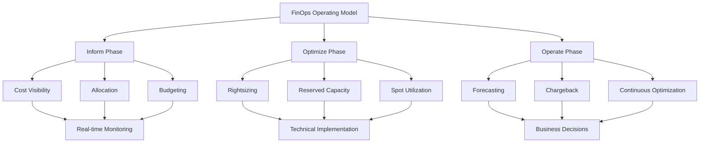
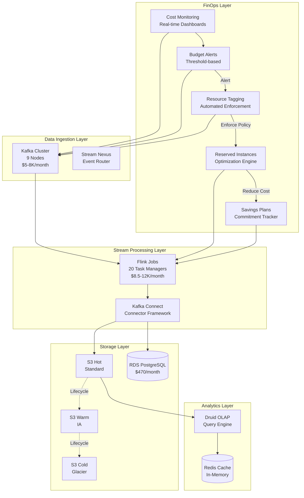
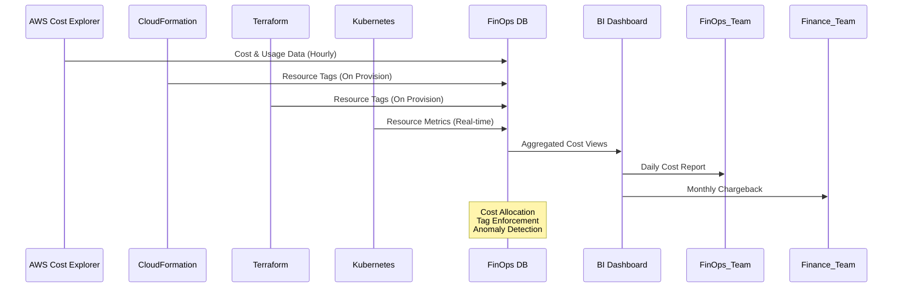
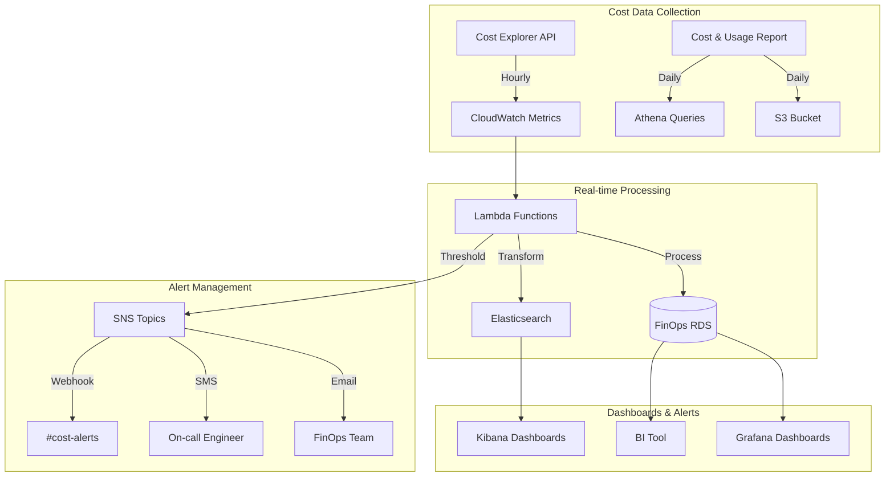

# FinOps: Cloud Financial Operations

## 1. Overview

### What is FinOps?

FinOps (Financial Operations) is a discipline that enables organizations to gain visibility into and control over their cloud costs. It represents the intersection of finance, technology, and business operations, creating a shared responsibility model where engineering, finance, and business teams collaborate to optimize cloud spending. FinOps was coined by Trevor Shadowen in 2019 and has since become a critical practice for organizations operating at scale in the cloud.

FinOps is not a tool or a single practice—it is a cultural shift that treats cloud costs as a first-class concern alongside performance, reliability, and security. It combines real-time cost monitoring, technical optimization, and business accountability into a continuous cycle of improvement. Organizations practicing FinOps typically achieve 30-40% cost reductions compared to unmanaged cloud deployments.

### Why was it created?

The rise of FinOps was driven by fundamental changes in how organizations consume and pay for technology infrastructure:

- **Shift from CapEx to OpEx**: Traditional IT involved large capital expenditures for hardware that was owned for years. Cloud computing transformed this to operational expenditures where costs scale with usage, creating new challenges in budgeting and financial planning.

- **Developer Velocity and Decentralization**: As development teams gained self-service access to cloud resources, spending became distributed across thousands of individual decisions, making centralized cost control impossible without new practices.

- **Pay-per-use Pricing Complexity**: Cloud providers offer hundreds of service types with complex pricing models (on-demand, reserved, spot, savings plans), creating optimization opportunities that require specialized expertise to capture.

- **Lack of Financial Accountability**: Engineering teams historically had no visibility into or responsibility for the costs their architectural decisions created, leading to inefficiencies that went unnoticed until bills arrived.

### What business problem does it solve?

FinOps addresses critical enterprise challenges:

- **Uncontrolled Cloud Spending**: Organizations routinely see 40-60% of their cloud spend as waste due to overprovisioned resources, idle capacity, and suboptimal pricing commitments. FinOps creates mechanisms to identify and eliminate this waste.

- **Budget Chaos and Forecasting Failure**: Without FinOps, organizations cannot accurately predict monthly cloud costs, leading to budget overruns that disrupt business planning and can result in unexpected credit card charges.

- **Lack of Cost Accountability**: When a $500,000 monthly cloud bill arrives, organizations often cannot determine which teams, products, or customers drove those costs, making it impossible to make informed decisions about where to invest or cut.

- **Missed Savings Opportunities**: Cloud providers offer significant discounts (up to 90% for spot instances, 70% for reserved capacity), but organizations without FinOps practices rarely capture these opportunities systematically.

- **Complexity in Multi-Cloud Environments**: Enterprises using AWS, Azure, and GCP simultaneously face exponential complexity in tracking costs, applying policies, and optimizing across providers without unified FinOps practices.

### Why do enterprises use it?

Fortune 500 companies have embraced FinOps to achieve sustainable cloud economics:

- **Capital One** reduced cloud costs by $100M annually through FinOps practices including automated rightsizing and reserved instance optimization
- **Netflix** optimizes millions in daily cloud spend using real-time cost allocation and capacity planning
- **General Electric** transformed from $500M in unplanned cloud costs to predictable spend through centralized FinOps governance
- **DoorDash** achieves unit economics profitability by applying FinOps principles to match supply with demand through dynamic capacity management
- **Spotify** maintains 99.99% uptime at optimized cost by combining SRE practices with cost-aware capacity planning

---

## 2. Core Concepts

### FinOps Operating Model



### Key Concepts with Examples

**Cloud Cost Optimization**

Cloud cost optimization is the practice of maximizing the value derived from cloud infrastructure while minimizing unnecessary expenditure. It encompasses a continuous cycle of measurement, analysis, and implementation.

```yaml
# Cost Optimization Framework
optimization_areas:
  compute:
    - Rightsizing instances based on actual utilization
    - Using spot instances for fault-tolerant workloads
    - Implementing auto-scaling with cost-aware policies
    - Choosing ARM-based instances for better price/performance
  
  storage:
    - Moving cold data to lower-tier storage classes
    - Implementing lifecycle policies for automatic data movement
    - Compressing data where possible
    - Deduplicating redundant data
  
  networking:
    - Minimizing data transfer costs through strategic architecture
    - Using VPC endpoints for internal traffic
    - Caching content at edge locations
    - Compressing data before transfer
  
  database:
    - Selecting appropriate instance sizes
    - Using read replicas only when needed
    - Implementing connection pooling
    - Choosing serverless options for variable workloads
```

**Chargeback and Showback**

These two models establish financial accountability for cloud resources:

| Aspect | Showback | Chargeback |
|--------|----------|-----------|
| Purpose | Inform teams of costs | Recover costs from teams |
| Transparency | Shows "here is what your resources cost" | Shows "you owe for these resources" |
| Motivation | Awareness and voluntary optimization | Direct financial accountability |
| Implementation | Easier (informational only) | Complex (requires billing integration) |
| Cultural Shift | Gradual | Requires mature FinOps culture |

```python
# Showback Report Generation Example
class CloudShowbackReport:
    def __init__(self, cost_explorer_client):
        self.client = cost_explorer_client
    
    def generate_team_costs(self, start_date: str, end_date: str) -> dict:
        response = self.client.get_cost_and_usage(
            TimePeriod={'Start': start_date, 'End': end_date},
            Granularity='MONTHLY',
            Metrics=['UnblendedCost'],
            GroupBy=[
                {'Type': 'TAG', 'Key': 'Team'},
                {'Type': 'DIMENSION', 'Key': 'Service'}
            ]
        )
        
        team_costs = {}
        for result in response['ResultsByTime']:
            for group in result['Groups']:
                team = group['Keys'][0]
                service = group['Keys'][1]
                cost = float(group['Metrics']['UnblendedCost']['Amount'])
                
                if team not in team_costs:
                    team_costs[team] = {}
                team_costs[team][service] = cost
        
        return team_costs
```

**Total Cost of Ownership (TCO)**

TCO analysis goes beyond monthly bills to capture all costs associated with cloud deployment:

```yaml
# TCO Components for Cloud Migration
tco_analysis:
  direct_costs:
    compute: "Instance hours × hourly rate"
    storage: "GB stored × monthly rate"
    network: "Data transfer + inter-AZ traffic"
    managed_services: "Database, messaging, analytics fees"
  
  indirect_costs:
    engineering_time: "Hours spent on cloud-native development"
    training: "Certifications, courses, learning curve"
    operations: "Monitoring, alerting, incident response"
    compliance: "Auditing, security tooling, governance"
  
  opportunity_costs:
    time_to_market: "Delayed launches from migration complexity"
    technical_debt: "Legacy integration maintenance during transition"
    innovation_capacity: "Engineering bandwidth redirected from new features"
  
  optimization_benefits:
    elasticity: "Pay only for peak capacity"
    global_reach: "Multi-region deployment without hardware procurement"
    managed_services: "Reduced operational overhead"
```

**Reserved Capacity and Reserved Instances**

Reserved Instances (RIs) provide significant discounts (typically 30-70%) in exchange for commitment:

```python
# Reserved Instance Recommendation Engine
class RIOptimizer:
    def __init__(self, cost_explorer_client, ec2_client):
        self.cost_explorer = cost_explorer_client
        self.ec2 = ec2_client
    
    def analyze_utilization(self, lookback_days: int = 90) -> dict:
        response = self.cost_explorer.get_rightsizing_recommendation(
            Service='AmazonEC2',
            Filter={
                'Dimensions': {
                    'Key': 'INSTANCE_TYPE',
                    'Values': ['m5.xlarge', 'm5.2xlarge']
                }
            }
        )
        return response['RightsizingRecommendations']
    
    def calculate_ri_coverage(self) -> dict:
        coverage = self.ec2.describe_reserved_instances()
        instances = self.ec2.describe_instances(
            Filters=[{'Name': 'instance-state-name', 'Values': ['running']}]
        )
        
        reserved_count = sum(r['InstanceCount'] for r in coverage['ReservedInstances'])
        on_demand_count = len(instances['Reservations'])
        
        return {
            'reserved_count': reserved_count,
            'on_demand_count': on_demand_count,
            'coverage_ratio': reserved_count / (reserved_count + on_demand_count) if (reserved_count + on_demand_count) > 0 else 0,
            'potential_savings': self._estimate_savings(reserved_count, on_demand_count)
        }
```

**Spot Instances**

Spot instances offer 60-90% discounts but can be interrupted with 2-minute warnings:

```yaml
# Spot Instance Architecture Patterns
spot_implementation:
  interruption_handling:
    graceful_shutdown: "Save state within 120 seconds"
    checkpoint_frequency: "Every 5 minutes for critical workloads"
    state_recovery: "Resume from last checkpoint on restart"
  
  workload_suitability:
    batch_processing: "✓ Perfect - jobs checkpoint and resume"
    data_pipeline: "✓ Ideal - distributed processing with retry"
    ml_training: "✓ Good - distributed training with checkpointing"
    web_servers: "✗ Poor - stateful, cannot interrupt gracefully"
    databases: "✗ Not recommended - recovery complexity too high"
  
  architecture_patterns:
    spot_fleet:
      description: "Automatic instance management with capacity optimization"
      max_price: "On-demand price"
      target_capacity: "100 units"
    
    interruption_handling:
      - "Receive interruption notice via CloudWatch Events"
      - "Gracefully stop in-progress work"
      - "Persist state to durable storage"
      - "Update processing checkpoint"
      - "Terminate instance cleanly"
```

**Savings Plans**

Savings Plans offer more flexibility than RIs while providing similar savings:

```yaml
# Savings Plans Comparison
savings_plans:
  compute_savings_plans:
    flexibility: "Highest - applies to any EC2 instance in any region"
    discount: "Up to 70% vs on-demand"
    commitment: "Hourly commitment required"
    covered: "All EC2 compute regardless of instance family"
  
  ec2_instance_savings_plans:
    flexibility: "Medium - locked to instance family and region"
    discount: "Up to 72% vs on-demand"
    commitment: "Hourly commitment required"
    covered: "Specific instance family in specific region"
  
  sagemaker_savings_plans:
    flexibility: "Applied to SageMaker usage only"
    discount: "Up to 64% vs on-demand"
    commitment: "Hourly commitment required"
    covered: "SageMaker ML workloads"
```

---

## 3. Why This Project Uses It

### Platform Cost Structure

The Enterprise Retail Streaming Platform operates at the intersection of real-time data processing and high-volume retail operations. This combination creates unique FinOps challenges that make cost management essential, not optional.

### Kafka Cost Analysis

Apache Kafka serves as the backbone for real-time event streaming:

```yaml
# Monthly Kafka Cost Breakdown (100M events/day)
kafka_infrastructure:
  msk_cluster:
    instance_type: "kafka.m5.xlarge"
    nodes: 9  # 3 AZs × 3 nodes for HA
    hourly_cost_per_node: 0.62
    monthly_cost: 0.62 × 24 × 30 × 9 = $4,008.00
  
  storage:
    retention_7_days:
      volume_size_gb: 2000
      gp3_cost_per_gb: 0.08
      monthly_cost: $160.00
    
    data_transfer:
      replication_factor_3: "3× data volume"
      inter_az_transfer: "$0.01/GB"
      estimated_monthly: $800.00
  
  total_monthly_kafka: ~$5,000 - $8,000
  annual_kafka: ~$60,000 - $96,000

# Cost Optimization Opportunities
kafka_optimization:
  retention_tuning:
    current: 7 days
    optimized: 3 days for non-critical topics
    savings: 57% storage reduction = $91/month
  
  partition_(rightsizing):
    current_partitions_per_topic: 50
    optimized: 20  # Based on consumer throughput
    savings: 60% reduction in broker resources
  
  compression:
    algorithm: "lz4"  # Fast compression with good ratio
    savings: "30% reduction in storage and transfer"
```

### Apache Flink Cost Analysis

Flink provides real-time stream processing with exactly-once semantics:

```yaml
# Flink Cost Structure
flink_infrastructure:
  job_manager:
    instance_type: "m5.xlarge"
    high_availability: 2 nodes
    monthly_cost: $894.00
  
  task_managers:
    slots_per_tm: 8
    parallelism_per_tm: 4
    current_setup: 20 task managers
    hourly_cost_per_tm: 0.50
    monthly_cost: 0.50 × 24 × 30 × 20 = $7,200.00
  
  checkpointing_storage:
    s3_bucket: "flink-checkpoints-prod"
    checkpoint_interval: 5 minutes
    checkpoint_size_mb: 500
    retention: 2 days
    monthly_cost: $450.00
  
  total_monthly_flink: ~$8,500 - $12,000
  annual_flink: ~$102,000 - $144,000

# Optimization Strategies
flink_optimization:
  state_backend:
    current: "rocksdb with S3 checkpointing"
    optimization: "Increase local SSD, reduce checkpoint frequency"
    savings: "$150/month"
  
  resource_management:
    dynamic_scaling: "Scale down 70% during off-peak (10PM-6AM)"
    savings: "$2,100/month = $25,200/year"
  
  operator_chaining:
    enabled: true
    benefit: "Reduces network shuffles by 40%"
```

### Storage Cost Analysis

The platform manages multiple storage tiers:

```yaml
# Storage Cost Breakdown
storage_tiers:
  hot_storage:
    service: "S3 Standard"
    volume_tb: 50
    monthly_cost: $1,150.00
    use_case: "Active events, recent processed data"
  
  warm_storage:
    service: "S3 IA"
    volume_tb: 200
    monthly_cost: $2,300.00
    use_case: "Events older than 30 days"
    access_frequency: "Once per month"
  
  cold_storage:
    service: "S3 Glacier Deep Archive"
    volume_tb: 500
    monthly_cost: $2,750.00
    use_case: "Compliance retention, audit logs"
    access_frequency: "Once per year"
  
  database_storage:
    service: "RDS PostgreSQL with 2TB gp3"
    monthly_cost: $320.00
    backup_storage: $150.00
  
  total_monthly_storage: ~$6,670.00
  annual_storage: ~$80,040.00

# Storage Lifecycle Optimization
storage_optimization:
  automatic_tiering:
    enabled: "S3 Intelligent-Tiering for uncertain access patterns"
    savings: "Up to 40% vs Standard for variable access"
  
  compression:
    event_data_compression: "gzipped JSON"
    savings: "60% reduction in storage costs"
  
  deduplication:
    enabled: true
    savings: "15% reduction in raw storage"
```

### Total Platform Cost Summary

```yaml
# Annual Platform Costs Before FinOps
total_annual_cost:
  kafka: $60,000 - $96,000
  flink: $102,000 - $144,000
  storage: $80,040
  networking: $24,000
  managed_services: $36,000
  engineering_overhead: $48,000
  total: $350,040 - $428,040

# After FinOps Implementation
optimized_annual_cost:
  kafka: $42,000 - $67,000  # 30% reduction via rightsizing
  flink: $76,800 - $108,000  # 25% reduction via scaling
  storage: $56,000  # 30% reduction via tiering
  networking: $18,000  # 25% reduction via architecture
  managed_services: $32,000  # 11% reduction via commitment
  engineering_overhead: $36,000  # 25% reduction via automation
  total: $260,800 - $317,000

# Annual Savings
annual_savings: $90,000 - $168,000
roi_percentage: "26% - 39%"
payback_period: "3-6 months"
```

### Why FinOps is Non-Negotiable

1. **Scale Impact**: At 100M+ events per day, even 10% inefficiency represents $30,000-$42,000 in annual waste

2. **Competitive Advantage**: Retail margins are thin (typically 2-5%). Every dollar saved through FinOps directly impacts profitability

3. **Investor Expectations**: Growth-stage companies must demonstrate unit economics efficiency alongside scale

4. **Operational Excellence**: FinOps practices overlap with SRE principles (monitoring, alerting, incident response), creating operational synergies

5. **Compliance Requirements**: Retail regulations (PCI-DSS, GDPR) require audit trails that FinOps tagging provides

---

## 4. Architecture Position

### FinOps in the Platform Architecture



### FinOps Data Flow



### Cost Attribution Architecture

```mermaid
flowchart LR
    subgraph Tags["Resource Tags"]
        T1[team:engineering]
        T2[environment:production]
        T3[project:inventory]
        T4[cost-center:CC-1001]
        T5[owner:platform-team]
    end
    
    subgraph Allocation["Cost Allocation"]
        A1[Cost Explorer]
        A2[Cost Categories]
        A3[Cost Allocation Tags]
    end
    
    subgraph Attribution["Attribution Matrix"]
        M1[By Team]
        M2[By Service]
        M3[By Customer]
        M4[By Environment]
    end
    
    Tags --> Allocation
    Allocation --> Attribution
```



---

## 5. Folder Structure

### FinOps Directory Organization

```
enterprise-retail-streaming-platform/
├── docs/
│   └── skills/
│       └── 27-finops.md                 # This document
│
├── infrastructure/
│   ├── terraform/
│   │   ├── modules/
│   │   │   ├── cost-optimized-vpc/      # VPC with cost-efficient architecture
│   │   │   └── reserved-capacity/        # RI/Savings Plan provisioning
│   │   ├── environments/
│   │   │   ├── prod/
│   │   │   │   ├── main.tf
│   │   │   │   ├── variables.tf
│   │   │   │   └── outputs.tf
│   │   │   └── dev/
│   │   └── backend.tf
│   │
│   └── kubernetes/
│       ├── cost-monitor/                # Cost monitoring deployment
│       │   ├── deployment.yaml
│       │   ├── service.yaml
│       │   └── configmap.yaml
│       └── resource-quotas/             # Namespace quotas for cost control
│           └── limits.yaml
│
├── src/
│   ├── cost-optimization/
│   │   ├── bin/
│   │   │   ├── rightsize_instances.py   # Rightsizing recommendation engine
│   │   │   ├── reserve_capacity.py      # Reserved instance calculator
│   │   │   └── spot_optimizer.py        # Spot instance optimizer
│   │   ├── lib/
│   │   │   ├── cost_api_client.py       # AWS Cost Explorer API wrapper
│   │   │   ├── recommendation_engine.py # ML-based recommendations
│   │   │   └── alert_dispatcher.py      # Budget alert routing
│   │   └── tests/
│   │       ├── test_rightsizing.py
│   │       ├── test_reservation.py
│   │       └── test_alerts.py
│   │
│   └── finops-dashboard/
│       ├── src/
│       │   ├── components/
│       │   │   ├── CostOverview.tsx
│       │   │   ├── BudgetGauge.tsx
│       │   │   └── ResourceCostTable.tsx
│       │   └── pages/
│       │       └── Dashboard.tsx
│       └── public/
│           └── cost-dashboard.png
│
├── scripts/
│   ├── cost-reports/
│   │   ├── daily-cost-summary.sh        # Daily cost emailer
│   │   ├── weekly-trend-analysis.sh     # Week-over-week analysis
│   │   └── monthly-chargeback.sh        # Chargeback report generator
│   │
│   ├── optimization/
│   │   ├── cleanup-unattached-eips.sh   # Remove orphaned resources
│   │   ├── snapshot-lifecycle.sh        # Manage snapshot costs
│   │   └── reserved-coverage.sh         # Check RI coverage
│   │
│   └── tagging/
│       ├── enforce-tags.sh              # Tag policy enforcement
│       └── tag-compliance-report.sh    # Tag audit report
│
├── configs/
│   ├── cost-alerts/
│   │   ├── budget-alerts.yaml           # Alert threshold definitions
│   │   └── anomaly-alerts.yaml          # Anomaly detection thresholds
│   │
│   ├── resource-tags/
│   │   └── mandatory-tags.yaml          # Required tag definitions
│   │
│   └── reserved-capacity/
│       ├── compute-savings-plan.yaml    # Savings plan config
│       └── ri-coverage-targets.yaml     # RI coverage goals
│
└── monitoring/
    └── prometheus/
        └── cost-metrics.yaml            # Custom cost metrics
```

### Key Files Description

| Path | Purpose | Owner |
|------|---------|-------|
| `infrastructure/terraform/modules/reserved-capacity/` | Automated RI purchasing | Platform Team |
| `src/cost-optimization/bin/rightsize_instances.py` | Instance rightsizing automation | FinOps Team |
| `scripts/cost-reports/daily-cost-summary.sh` | Daily cost reporting | Finance |
| `configs/cost-alerts/budget-alerts.yaml` | Alert threshold configuration | Operations |
| `configs/resource-tags/mandatory-tags.yaml` | Tag policy enforcement | Governance |

---

## 6. Implementation Walkthrough

### Cost Monitoring Implementation

Real-time cost monitoring requires integration with cloud provider APIs and visualization tooling:

```python
# Cost Monitoring Implementation
import boto3
from datetime import datetime, timedelta
from typing import Dict, List
import json

class CostMonitor:
    def __init__(self, account_id: str, role_name: str = "FinOpsRole"):
        self.account_id = account_id
        self.role_name = role_name
        self.ce_client = self._assume_role()
    
    def _assume_role(self):
        """Assume cross-account FinOps role."""
        sts = boto3.client('sts')
        response = sts.assume_role(
            RoleArn=f"arn:aws:iam::{self.account_id}:role/{self.role_name}",
            RoleSessionName='FinOpsCostMonitor'
        )
        
        return boto3.client(
            'ce',
            aws_access_key_id=response['Credentials']['AccessKeyId'],
            aws_secret_access_key=response['Credentials']['SecretAccessKey'],
            aws_session_token=response['Credentials']['SessionToken']
        )
    
    def get_daily_costs(self, days: int = 30) -> List[Dict]:
        """Fetch daily cost breakdown by service."""
        end_date = datetime.now().strftime('%Y-%m-%d')
        start_date = (datetime.now() - timedelta(days=days)).strftime('%Y-%m-%d')
        
        response = self.ce_client.get_cost_and_usage(
            TimePeriod={
                'Start': start_date,
                'End': end_date
            },
            Granularity='DAILY',
            Metrics=['UnblendedCost', 'UsageQuantity'],
            GroupBy=[
                {'Type': 'DIMENSION', 'Key': 'SERVICE'},
                {'Type': 'TAG', 'Key': 'Team'},
                {'Type': 'TAG', 'Key': 'Environment'}
            ]
        )
        
        return self._parse_cost_response(response)
    
    def get_cost_anomalies(self, threshold_pct: float = 20.0) -> List[Dict]:
        """Detect cost anomalies compared to historical average."""
        response = self.ce_client.get_cost_anomaly_detection()
        anomalies = []
        
        for anomaly in response.get('CostAnomalyMonitors', []):
            alert_response = self.ce_client.get_cost_anomaly_results(
                AnomalyMonitorArn=anomaly['AnomalyMonitorArn'],
                DateInterval={
                    'StartDate': (datetime.now() - timedelta(days=7)).strftime('%Y-%m-%d'),
                    'EndDate': datetime.now().strftime('%Y-%m-%d')
                }
            )
            
            for result in alert_response.get('AnomalyResults', []):
                if result['Status'] == 'DETECTED':
                    impact = float(result['Impact'].get('Amount', 0))
                    if impact > threshold_pct:
                        anomalies.append({
                            'service': result.get('Service', 'Unknown'),
                            'impact_amount': impact,
                            'start_date': result['StartDate'],
                            'end_date': result['EndDate'],
                            'confidence': result.get('ConfidenceScore', 0)
                        })
        
        return anomalies
    
    def _parse_cost_response(self, response: Dict) -> List[Dict]:
        """Parse Cost Explorer response into structured format."""
        results = []
        for time_period in response['ResultsByTime']:
            for group in time_period['Groups']:
                results.append({
                    'date': time_period['TimePeriod']['Start'],
                    'service': group['Keys'][0] if group['Keys'] else 'Unknown',
                    'team': group['Keys'][1] if len(group['Keys']) > 1 else 'Untagged',
                    'environment': group['Keys'][2] if len(group['Keys']) > 2 else 'Unknown',
                    'cost': float(group['Metrics']['UnblendedCost']['Amount']),
                    'currency': group['Metrics']['UnblendedCost']['Unit']
                })
        return results
```

### Budget Alerts Implementation

```python
# Budget Alert System
from dataclasses import dataclass
from enum import Enum
from typing import Callable, List
import smtplib
from email.mime.text import MIMEText
from email.mime.multipart import MIMEMultipart

class AlertSeverity(Enum):
    INFO = "info"
    WARNING = "warning"
    CRITICAL = "critical"
    EXCEEDED = "exceeded"

@dataclass
class BudgetAlert:
    budget_name: str
    limit_amount: float
    current_amount: float
    forecasted_amount: float
    severity: AlertSeverity
    affected_services: List[str]
    recommended_actions: List[str]

class BudgetAlertManager:
    def __init__(self, alert_config: dict):
        self.budgets = alert_config['budgets']
        self.notification_channels = alert_config['channels']
        self.ce_client = boto3.client('ce')
    
    def check_budgets(self) -> List[BudgetAlert]:
        """Check all budgets and generate alerts."""
        alerts = []
        
        for budget in self.budgets:
            current_spend = self._get_current_spend(budget)
            forecasted = self._get_forecasted_spend(budget)
            limit = budget['limit']
            
            utilization = (current_spend / limit) * 100
            
            if utilization >= 100:
                severity = AlertSeverity.EXCEEDED
            elif utilization >= 90:
                severity = AlertSeverity.CRITICAL
            elif utilization >= 75:
                severity = AlertSeverity.WARNING
            else:
                severity = AlertSeverity.INFO
            
            if utilization >= budget['threshold_pct']:
                alert = BudgetAlert(
                    budget_name=budget['name'],
                    limit_amount=limit,
                    current_amount=current_spend,
                    forecasted_amount=forecasted,
                    severity=severity,
                    affected_services=self._get_affected_services(budget),
                    recommended_actions=self._get_recommendations(severity, budget)
                )
                alerts.append(alert)
                self._send_notifications(alert)
        
        return alerts
    
    def _get_forecasted_spend(self, budget: dict) -> float:
        """Calculate end-of-month forecasted spend."""
        now = datetime.now()
        days_in_month = (datetime(now.year, now.month + 1, 1) if now.month < 12 
                         else datetime(now.year + 1, 1, 1)) - datetime(now.year, now.month, 1)
        days_passed = now.day
        days_remaining = days_in_month.days - days_passed
        
        current = self._get_current_spend(budget)
        daily_rate = current / days_passed if days_passed > 0 else 0
        
        return current + (daily_rate * days_remaining)
    
    def _send_notifications(self, alert: BudgetAlert):
        """Send notifications to configured channels."""
        message = self._format_alert_message(alert)
        
        for channel in self.notification_channels:
            if channel['type'] == 'email':
                self._send_email(channel['address'], alert.budget_name, message)
            elif channel['type'] == 'slack':
                self._send_slack(channel['webhook_url'], message)
            elif channel['type'] == 'pagerduty':
                self._send_pagerduty(channel['routing_key'], alert)
    
    def _format_alert_message(self, alert: BudgetAlert) -> str:
        return f"""
        ⚠️ Budget Alert: {alert.budget_name}
        
        Current Spend: ${alert.current_amount:,.2f}
        Budget Limit: ${alert.limit_amount:,.2f}
        Forecasted: ${alert.forecasted_amount:,.2f}
        Utilization: {(alert.current_amount/alert.limit_amount)*100:.1f}%
        
        Severity: {alert.severity.value.upper()}
        
        Affected Services: {', '.join(alert.affected_services)}
        
        Recommended Actions:
        {chr(10).join(f"  • {action}" for action in alert.recommended_actions)}
        """
```

### Resource Tagging Implementation

```python
# Resource Tagging Enforcement
import botocore.exceptions as botoex
from typing import Dict, List, Optional
import json

class TagEnforcer:
    """Enforces mandatory tags on all resources."""
    
    MANDATORY_TAGS = ['Environment', 'Team', 'Owner', 'CostCenter', 'Project']
    
    def __init__(self, region: str = 'us-east-1'):
        self.ec2 = boto3.client('ec2', region_name=region)
        self.rds = boto3.client('rds', region_name=region)
        self.s3 = boto3.client('s3', region_name=region)
        
    def scan_untagged_resources(self) -> Dict[str, List[str]]:
        """Scan all resources and identify missing mandatory tags."""
        untagged = {
            'ec2_instances': [],
            'ebs_volumes': [],
            'rds_instances': [],
            's3_buckets': [],
            'lambda_functions': []
        }
        
        # Scan EC2 instances
        try:
            instances = self.ec2.describe_instances(
                Filters=[{'Name': 'instance-state-name', 'Values': ['running']}]
            )
            for reservation in instances['Reservations']:
                for instance in reservation['Instances']:
                    missing = self._get_missing_tags(instance.get('Tags', []))
                    if missing:
                        untagged['ec2_instances'].append({
                            'id': instance['InstanceId'],
                            'missing_tags': missing
                        })
        except botoex.ClientError as e:
            print(f"Error scanning EC2: {e}")
        
        # Scan EBS volumes
        try:
            volumes = self.ec2.describe_volumes(
                Filters=[{'Name': 'status', 'Values': ['in-use', 'available']}]
            )
            for volume in volumes['Volumes']:
                missing = self._get_missing_tags(volume.get('Tags', []))
                if missing:
                    untagged['ebs_volumes'].append({
                        'id': volume['VolumeId'],
                        'missing_tags': missing
                    })
        except botoex.ClientError as e:
            print(f"Error scanning EBS: {e}")
        
        # Scan S3 buckets
        try:
            buckets = self.s3.list_buckets()
            for bucket in buckets['Buckets']:
                tagging = self.s3.get_bucket_tagging(Bucket=bucket['Name'])
                tag_keys = [t['Key'] for t in tagging.get('TagSet', [])]
                missing = [t for t in self.MANDATORY_TAGS if t not in tag_keys]
                if missing:
                    untagged['s3_buckets'].append({
                        'name': bucket['Name'],
                        'missing_tags': missing
                    })
        except botoex.ClientError:
            pass  # Bucket may have no tags
        
        return untagged
    
    def _get_missing_tags(self, tags: List[Dict]) -> List[str]:
        """Return list of missing mandatory tags."""
        tag_keys = [t['Key'] for t in tags]
        return [t for t in self.MANDATORY_TAGS if t not in tag_keys]
    
    def apply_tags(self, resource_type: str, resource_id: str, tags: Dict[str, str]):
        """Apply tags to a resource."""
        tag_list = [{'Key': k, 'Value': v} for k, v in tags.items()]
        
        if resource_type == 'ec2':
            self.ec2.create_tags(Resources=[resource_id], Tags=tag_list)
        elif resource_type == 'rds':
            self.rds.add_tags_to_resource(ResourceName=resource_id, Tags=tag_list)
        elif resource_type == 's3':
            self.s3.put_bucket_tagging(Bucket=resource_id, Tagging={'TagSet': tag_list})
    
    def generate_compliance_report(self) -> Dict:
        """Generate tag compliance report."""
        untagged = self.scan_untagged_resources()
        
        total_resources = sum(len(v) for v in untagged.values())
        compliant_resources = self._count_total_tagged_resources()
        
        return {
            'timestamp': datetime.now().isoformat(),
            'total_resources_scanned': total_resources + compliant_resources,
            'compliant_resources': compliant_resources,
            'non_compliant_resources': total_resources,
            'compliance_rate': (compliant_resources / (total_resources + compliant_resources) * 100)
                               if (total_resources + compliant_resources) > 0 else 100,
            'details': untagged
        }
```

### Reserved Instances Implementation

```python
# Reserved Instance Optimization
from dataclasses import dataclass
from typing import List, Dict, Optional
from datetime import datetime, timedelta
import math

@dataclass
class RIRecommendation:
    instance_family: str
    instance_size: str
    current_count: int
    recommended_count: int
    utilization_rate: float
    monthly_savings: float
    upfront_cost: float
    coverage_impact: float

class RIOptimizer:
    """Optimizes Reserved Instance purchases."""
    
    def __init__(self, cost_explorer, ec2):
        self.ce = cost_explorer
        self.ec2 = ec2
    
    def analyze_coverage(self) -> Dict:
        """Analyze current RI coverage."""
        response = self.ce.get_reservation_coverage(
            TimePeriod={
                'Start': (datetime.now() - timedelta(days=30)).strftime('%Y-%m-%d'),
                'End': datetime.now().strftime('%Y-%m-%d')
            },
            Granularity='MONTHLY'
        )
        
        total_covered_hours = 0
        total_used_hours = 0
        
        for group in response['CoverageByTime']:
            for entity in group['Entities']:
                total_covered_hours += float(entity.get('Coverage', {}).get('Hours', 0))
                total_used_hours += float(entity.get('OnDemandHours', 0))
        
        return {
            'coverage_percentage': (total_covered_hours / total_used_hours * 100) 
                                   if total_used_hours > 0 else 0,
            'covered_hours': total_covered_hours,
            'on_demand_hours': total_used_hours
        }
    
    def generate_recommendations(self) -> List[RIRecommendation]:
        """Generate RI purchase recommendations."""
        recommendations = []
        
        # Get current utilization by instance type
        utilization_data = self._get_instance_utilization()
        
        for instance_type, data in utilization_data.items():
            avg_utilization = data['average_utilization']
            instance_count = data['instance_count']
            
            # Only recommend RIs for consistently high-utilization instances
            if avg_utilization >= 70:
                # Calculate optimal RI count (80% of average utilization)
                optimal_ri_count = math.floor(instance_count * 0.8)
                
                # Calculate savings
                on_demand_cost = instance_count * self._get_on_demand_price(instance_type)
                ri_cost = optimal_ri_count * self._get_ri_price(instance_type)
                
                monthly_savings = on_demand_cost - ri_cost
                
                if monthly_savings > 0:
                    recommendations.append(RIRecommendation(
                        instance_family=data['family'],
                        instance_size=data['size'],
                        current_count=instance_count,
                        recommended_count=optimal_ri_count,
                        utilization_rate=avg_utilization,
                        monthly_savings=monthly_savings,
                        upfront_cost=self._get_ri_upfront(instance_type, optimal_ri_count),
                        coverage_impact=self._calculate_coverage_impact(
                            optimal_ri_count, instance_count
                        )
                    ))
        
        return sorted(recommendations, key=lambda x: x.monthly_savings, reverse=True)
    
    def _get_instance_utilization(self) -> Dict:
        """Get historical utilization data for instances."""
        response = self.ce.get_rightsizing_recommendation(
            Service='AmazonEC2',
            Filter={
                'Dimensions': {
                    'Key': 'REGION',
                    'Values': ['us-east-1']
                }
            }
        )
        
        utilization = {}
        for rec in response.get('RightsizingRecommendations', []):
            instance_type = rec['ResourceDetails']['EC2ResourceDetails']['InstanceType']
            utilization[instance_type] = {
                'family': instance_type.split('.')[0],
                'size': instance_type.split('.')[1],
                'instance_count': 1,
                'average_utilization': float(rec.get('AverageUtilization', 0))
            }
        
        return utilization
    
    def _get_on_demand_price(self, instance_type: str) -> float:
        """Get on-demand price for instance type."""
        pricing = {
            'm5.xlarge': 0.192,
            'm5.2xlarge': 0.384,
            'r5.xlarge': 0.252,
            'c5.xlarge': 0.176
        }
        return pricing.get(instance_type, 0.20)
    
    def _get_ri_price(self, instance_type: str) -> float:
        """Get 1-year reserved instance price (no upfront)."""
        ri_pricing = {
            'm5.xlarge': 0.058,
            'm5.2xlarge': 0.116,
            'r5.xlarge': 0.076,
            'c5.xlarge': 0.053
        }
        return ri_pricing.get(instance_type, 0.06)
    
    def _get_ri_upfront(self, instance_type: str, count: int) -> float:
        """Calculate upfront RI cost for 1-year commitment."""
        upfront_per_instance = {
            'm5.xlarge': 650,
            'm5.2xlarge': 1300,
            'r5.xlarge': 850,
            'c5.xlarge': 590
        }
        return upfront_per_instance.get(instance_type, 700) * count
    
    def _calculate_coverage_impact(self, ri_count: int, total_count: int) -> float:
        """Calculate new coverage percentage."""
        return (ri_count / total_count * 100) if total_count > 0 else 0
```

---

## 7. Production Best Practices

### FinOps Operating Model Best Practices

```yaml
# FinOps Operating Model Framework
finops_practices:
  organizational_structure:
    finops_team:
      size: "1 FinOps practitioner per 15-20 engineers"
      reporting: "CTO/CFO shared visibility"
      cadence: "Weekly cost reviews with engineering leads"
    
    team_responsibilities:
      engineering: "Cost-aware design decisions, tag compliance"
      finance: "Budget management, chargeback accuracy"
      operations: "Cost monitoring, alert response"
      product: "Unit economics, feature cost analysis"
  
  cost_ownership_model:
    level_1_team_leads:
      responsibility: "Daily cost awareness, immediate optimization"
      authority: "Approve changes up to $1K/month impact"
    
    level_2_directors:
      responsibility: "Weekly review, trend analysis"
      authority: "Approve changes up to $10K/month impact"
    
    level_3_vps:
      responsibility: "Monthly review, strategic decisions"
      authority: "Approve reserved capacity commitments"
  
  collaboration_patterns:
    sprint_integration:
      - "Include cost estimates in RFC documents"
      - "Add cost impact to sprint planning"
      - "Track cost per story point"
    
    architecture_review:
      - "Cost impact required for design reviews"
      - "FinOps sign-off for >$5K/month changes"
      - "TCO analysis for major migrations"
```

### Cost-Aware Development Practices

```yaml
# Development Lifecycle Integration
development_practices:
  design_phase:
    questions:
      - "What's the expected cost at 10x current load?"
      - "Can we use spot instances for this workload?"
      - "What's the data transfer cost projection?"
      - "Do we need this data in hot storage?"
    
    deliverables:
      - "Estimated monthly cost (P50 and P90)"
      - "Cost comparison vs alternatives"
      - "Reserved capacity opportunity assessment"
  
  development_phase:
    practices:
      - "Use cost-optimized instance types (m5, t3, arm)"
      - "Implement connection pooling for databases"
      - "Use batch operations where possible"
      - "Cache frequently accessed data"
    
    code_review_checks:
      - "N+1 query patterns (database cost)"
      - "Unbounded data retrieval (memory/cost)"
      - "Synchronous vs asynchronous patterns"
      - "Retry storm potential"
  
  deployment_phase:
    gates:
      - "Cost impact < $500/month: auto-approve"
      - "Cost impact $500-$5000: team lead approval"
      - "Cost impact > $5000: FinOps review"
    
    automation:
      - "Auto-tag resources on deployment"
      - "Enforce budget alerts on new resources"
      - "Schedule scale-down for non-production"
```

### Reserved Capacity Best Practices

```yaml
# Reserved Instance Strategy
ri_strategy:
  coverage_targets:
    baseline_workload: "80% coverage with 1-year RIs"
    predictable_workload: "60% coverage with 1-year, 20% flexible"
    variable_workload: "Use savings plans for flexibility"
  
  purchasing_strategy:
    approach: "Staggered purchasing (20% monthly)"
    horizon: "Buy 3 months ahead of need"
    diversification: "Mix of all upfront, partial upfront, no upfront"
    
    risk_mitigation:
      - "Never commit more than 90% of peak"
      - "Keep 10% on-demand for flexibility"
      - "Use convertible RIs for changing needs"
  
  optimization_cycle:
    frequency: "Monthly review"
    triggers:
      - "Utilization drops below 60%"
      - "Workload pattern changes"
      - "New instance types available"
    actions:
      - "Exchange underutilized RIs"
      - "Modify size flexibility"
      - "Sell unused RIs in marketplace"
```

---

## 8. Common Problems

### FinOps Implementation Challenges

| Problem | Root Cause | Impact | Solution |
|---------|-----------|--------|----------|
| **Untagged Resources** | Manual processes, missing governance | Cannot allocate 15-40% of costs | Automated tagging enforcement, policy-as-code |
| **Budget Overruns** | No real-time visibility, reactive culture | Unexpected charges, financial strain | Continuous budget monitoring, predictive alerts |
| **Low RI Coverage** | Fear of commitment, lack of analytics | Paying full on-demand prices | Gradual commitment, utilization-based sizing |
| **Data Transfer Costs** | Unaware of inter-AZ charges | 20-30% of total bill | Architecture optimization, VPC endpoints |
| **Orphaned Resources** | No lifecycle management | 5-15% waste | Automated cleanup, resource tagging |
| **Overprovisioned Instances** | "Just in case" sizing culture | 40-60% wasted capacity | Rightsizing automation, utilization metrics |
| **No Chargeback Model** | Cultural resistance, complexity | No cost accountability | Showback first, gradual chargeback introduction |
| **Alert Fatigue** | Poor threshold calibration | Ignored alerts, missed issues | ML-based anomaly detection, severity tiers |
| **Multi-Account Complexity** | Organic growth, mergers | Fragmented visibility | AWS Organizations, Consolidated Billing |
| **Reserved Instance Waste** | Over-commitment, changing needs | Lost money on unused capacity | RI exchanges, marketplace selling |

### Technical Problems and Solutions

```yaml
# Common Technical Challenges
technical_challenges:
  challenge_1:
    problem: "Cost data delayed by 24-48 hours"
    severity: "High"
    cause: "Cloud provider API limitations"
    solution: "Implement real-time cost tracking with resource tagging"
    implementation: |
      # Real-time cost tracking with Lambda
      import boto3
      from datetime import datetime
      
      def track_resource_cost(event, context):
          ce = boto3.client('ce')
          resource_id = event['detail']['resource_id']
          
          # Emit custom metric to CloudWatch
          cloudwatch = boto3.client('cloudwatch')
          cloudwatch.put_metric_data(
              Namespace='FinOps/RealTime',
              MetricData=[{
                  'MetricName': 'ResourceCost',
                  'Dimensions': [
                      {'Name': 'ResourceId', 'Value': resource_id}
                  ],
                  'Timestamp': datetime.now(),
                  'Value': event['detail']['estimated_cost']
              }]
          )
  
  challenge_2:
    problem: "Tag inconsistency across teams"
    severity: "Medium"
    cause: "No enforced tag policy, manual processes"
    solution: "AWS Organizations tag policy + SCP enforcement"
    implementation: |
      # Tag Policy JSON
      {
        "tags": {
          "CostCenter": {
            "required": true,
            "pattern": "^CC-[0-9]{4}$"
          },
          "Environment": {
            "required": true,
            "values": ["prod", "staging", "dev"]
          },
          "Team": {
            "required": true
          }
        }
      }
  
  challenge_3:
    problem: "Spot instance interruption disrupting jobs"
    severity: "High"
    cause: "No graceful handling, checkpointing"
    solution: "Implement checkpoint-based processing"
    implementation: |
      # Checkpoint-based Flink job
      env.enable_checkpointing(300000)  # 5 minutes
      env.get_checkpoint_config().set_min_pause_between_checkpoints(
          checkpoint_interval / 2
      )
      state_backend = RocksDBStateBackend(s3_checkpoint_uri)
```

---

## 9. Performance Optimization

### Cost Optimization Framework

```yaml
# Cost Optimization Hierarchy
optimization_hierarchy:
  tier_1_quick_wins:
    duration: "1-2 weeks"
    impact: "10-20% cost reduction"
    actions:
      - "Delete unused EBS volumes and snapshots"
      - "Remove unused Elastic IPs"
      - "Stop non-production instances at night"
      - "Enable S3 lifecycle policies"
      - "Review and delete unused security groups"
    
  tier_2_medium_effort:
    duration: "1-2 months"
    impact: "20-35% cost reduction"
    actions:
      - "Rightsize overprovisioned instances"
      - "Implement reserved instance coverage"
      - "Move cold data to cheaper storage tiers"
      - "Optimize data transfer patterns"
      - "Implement auto-scaling policies"
    
  tier_3_architectural:
    duration: "3-6 months"
    impact: "35-50% cost reduction"
    actions:
      - "Migrate to ARM-based instances (Graviton)"
      - "Implement event-driven architecture"
      - "Adopt serverless for suitable workloads"
      - "Optimize data pipelines for cost"
      - "Implement multi-tier caching strategy"
```

### Compute Optimization

```python
# Compute Rightsizing Automation
class ComputeOptimizer:
    def __init__(self, cloudwatch, ec2, ce):
        self.cw = cloudwatch
        self.ec2 = ec2
        self.ce = ce
    
    def get_optimization_recommendations(self) -> list:
        """Get EC2 rightsizing recommendations from AWS."""
        response = self.ce.get_rightsizing_recommendation(
            Service='AmazonEC2',
            Filter={
                'And': [
                    {'Dimensions': {'Key': 'INSTANCE_TYPE', 'Values': ['m5.*', 'c5.*', 'r5.*']}},
                    {'Not': {'Tags': {'Key': 'Environment', 'Values': ['dev', 'test']}}}
                ]
            }
        )
        
        recommendations = []
        for rec in response.get('RightsizingRecommendations', []):
            current = rec['CurrentResourceDetails']
            target = rec['TargetResourceDetails']
            
            recommendations.append({
                'instance_id': current['ResourceId'],
                'current_type': current['InstanceType'],
                'current_cost': float(current.get('EstimatedMonthlyCost', 0)),
                'target_type': target.get('InstanceType', 'N/A'),
                'target_cost': float(target.get('EstimatedMonthlyCost', 0)),
                'monthly_savings': float(current.get('EstimatedMonthlyCost', 0)) - 
                                  float(target.get('EstimatedMonthlyCost', 0)),
                'action': target.get('Action', 'NONE')
            })
        
        return sorted(recommendations, key=lambda x: x['monthly_savings'], reverse=True)
    
    def apply_recommendation(self, instance_id: str, target_type: str):
        """Apply rightsizing recommendation."""
        # Stop instance
        self.ec2.stop_instances(InstanceIds=[instance_id])
        
        # Modify instance type
        self.ec2.modify_instance_attribute(
            InstanceId=instance_id,
            InstanceType={'Value': target_type}
        )
        
        # Start instance
        self.ec2.start_instances(InstanceIds=[instance_id])
```

### Storage Optimization

```yaml
# Storage Tiering Strategy
storage_optimization:
  hot_tier:
    criteria: "Accessed within last 7 days"
    service: "S3 Standard"
    cost_per_gb: "$0.023"
    
  warm_tier:
    criteria: "Accessed within last 30-90 days"
    service: "S3 Infrequent Access"
    cost_per_gb: "$0.0125"
    minimum_retention: "30 days"
    
  cold_tier:
    criteria: "Accessed within last 90-365 days"
    service: "S3 Glacier"
    cost_per_gb: "$0.004"
    retrieval_time: "3-12 hours"
    
  deep_archive:
    criteria: "Accessed less than once per year"
    service: "S3 Glacier Deep Archive"
    cost_per_gb: "$0.00099"
    retrieval_time: "12-48 hours"
  
  lifecycle_policies:
    event_data:
      - transition_to_warm: "30 days"
      - transition_to_cold: "90 days"
      - transition_to_archive: "365 days"
    
    logs:
      - transition_to_warm: "7 days"
      - transition_to_cold: "30 days"
      - expire_after: "2555 days"  # 7 years for compliance
    
    backups:
      - transition_to_warm: "7 days"
      - transition_to_cold: "30 days"
      - keep_forever: true  # Critical business data
```

### Network Optimization

```yaml
# Network Cost Optimization
network_optimization:
  data_transfer_costs:
    within_az: "$0.01/GB"
    across_az_same_region: "$0.02/GB"
    across_regions: "$0.02-$0.12/GB"
    to_internet: "$0.09/GB (first 10TB)"
  
  optimization_strategies:
    vpc_endpoints:
      description: "Private connectivity to S3/DynamoDB"
      savings: "Eliminates NAT Gateway costs for S3"
      implementation: "Create VPC Gateway Endpoint for S3"
    
    caching:
      description: "CloudFront for content delivery"
      savings: "Reduces origin traffic by 60-90%"
      implementation: "Configure CloudFront with origin shield"
    
    regional_architecture:
      description: "Deploy resources in same region as consumers"
      savings: "Eliminates cross-region transfer costs"
      implementation: "Design multi-region data flows"
    
    private_link:
      description: "AWS PrivateLink for SaaS integrations"
      savings: "$0.01/GB vs $0.05/GB via internet"
      implementation: "Create VPC Interface Endpoints"
```

---

## 10. Security

### FinOps Security Considerations

```yaml
# Security Controls for FinOps
security_framework:
  access_control:
    principle: "Least privilege for cost management access"
    
    iam_policies:
      read_only_finops:
        - "ce:GetCostAndUsage"
        - "ce:GetReservationCoverage"
        - "ce:GetRightsizingRecommendation"
        - "cloudwatch:GetMetricData"
      
      operational_finops:
        - "ce:GetCostAndUsage"
        - "ce:GetReservationCoverage"
        - "ce:GetRightsizingRecommendation"
        - "ce:CreateBudget"
        - "sns:Publish"
      
      administrative_finops:
        - "ce:*"  # Full Cost Explorer access
        - "organizations:Describe*"  # Org visibility
        - "budgets:*"  # Budget management
        - "sns:*"  # Alert management
  
  data_protection:
    cost_data_classification: "Confidential - Business Sensitive"
    
    encryption:
      in_transit: "TLS 1.2 minimum for all API calls"
      at_rest: "KMS encryption for stored cost data"
    
    access_logging:
      enabled: true
      retention: "90 days minimum"
      destinations:
        - "CloudTrail for API calls"
        - "S3 with Object Lock for compliance"
  
  compliance_requirements:
    sox_compliance:
      cost_data_integrity: "Immutable audit trail"
      segregation_of_duties: "No single person controls costs"
      access_review: "Quarterly access certification"
    
    gdpr_considerations:
      personal_data: "Cost data may contain personal identifiers"
      retention_policy: "Define and enforce retention periods"
      access_control: "Restrict access to personal cost data"
```

### Cost Anomaly Detection Security

```python
# Secure Anomaly Detection Configuration
class SecureAnomalyDetector:
    def __init__(self, kms_key_id: str):
        self.kms = boto3.client('kms')
        self.kms_key_id = kms_key_id
        self.ce = boto3.client('ce')
    
    def create_anomaly_monitor(self, monitor_name: str, 
                               service_filter: dict) -> str:
        """Create anomaly monitor with encrypted configuration."""
        encrypted_config = self._encrypt_config(service_filter)
        
        response = self.ce.create_anomaly_monitor(
            AnomalyMonitor={
                'MonitorName': monitor_name,
                'MonitorType': 'DIMENSIONAL',
                'MonitorDimension': 'SERVICE',
                'MonitorSpecification': service_filter,
                'ResourceTags': [
                    {'Key': 'EncryptedConfig', 'Value': encrypted_config}
                ]
            }
        )
        
        # Log creation for audit
        self._log_audit_event('ANOMALY_MONITOR_CREATED', {
            'monitor_arn': response['MonitorArn'],
            'monitor_name': monitor_name
        })
        
        return response['MonitorArn']
    
    def _encrypt_config(self, config: dict) -> str:
        """Encrypt sensitive configuration using KMS."""
        import json
        plaintext = json.dumps(config)
        response = self.kms.encrypt(
            KeyId=self.kms_key_id,
            Plaintext=plaintext,
            EncryptionContext={'FinOps': 'AnomalyConfig'}
        )
        return response['CiphertextBlob'].decode('utf-8')
    
    def _log_audit_event(self, event_type: str, details: dict):
        """Log security-relevant events for compliance."""
        cloudtrail = boto3.client('cloudtrail')
        cloudtrail.create_event_selector(
            TrailName='FinOpsAuditTrail',
            EventSelector={
                'ReadWriteType': 'WriteOnly',
                'IncludeManagementEvents': True
            }
        )
```

---

## 11. Monitoring

### Cost Monitoring Architecture



### Cost Dashboard Implementation

```typescript
// Cost Dashboard Component
import React, { useState, useEffect } from 'react';

interface CostSummary {
  totalCost: number;
  budgetLimit: number;
  budgetUtilization: number;
  trend: 'up' | 'down' | 'stable';
  services: ServiceCost[];
}

interface ServiceCost {
  serviceName: string;
  currentCost: number;
  previousCost: number;
  changePercent: number;
}

const CostOverview: React.FC = () => {
  const [data, setData] = useState<CostSummary | null>(null);
  const [loading, setLoading] = useState(true);

  useEffect(() => {
    fetchCostSummary().then(setData).finally(() => setLoading(false));
  }, []);

  if (loading) return <div className="cost-overview loading">Loading...</div>;

  return (
    <div className="cost-overview">
      <div className="cost-header">
        <h2>Cloud Cost Summary</h2>
        <span className="last-updated">
          Last updated: {new Date().toLocaleString()}
        </span>
      </div>

      <div className="cost-cards">
        <div className="cost-card total">
          <div className="metric-label">Total Monthly Cost</div>
          <div className="metric-value">
            ${data?.totalCost.toLocaleString()}
          </div>
        </div>

        <div className="cost-card budget">
          <div className="metric-label">Budget Utilization</div>
          <div className="metric-value">
            {data?.budgetUtilization.toFixed(1)}%
          </div>
          <div className="progress-bar">
            <div 
              className="progress-fill"
              style={{ 
                width: `${Math.min(data?.budgetUtilization || 0, 100)}%`,
                backgroundColor: getUtilizationColor(data?.budgetUtilization || 0)
              }}
            />
          </div>
        </div>

        <div className="cost-card trend">
          <div className="metric-label">30-Day Trend</div>
          <div className={`trend-indicator ${data?.trend}`}>
            {data?.trend === 'up' ? '↑' : data?.trend === 'down' ? '↓' : '→'}
            {' '}
            {getTrendLabel(data?.trend)}
          </div>
        </div>
      </div>

      <div className="service-breakdown">
        <h3>Cost by Service</h3>
        <table>
          <thead>
            <tr>
              <th>Service</th>
              <th>Current Month</th>
              <th>Previous Month</th>
              <th>Change</th>
            </tr>
          </thead>
          <tbody>
            {data?.services.map(service => (
              <tr key={service.serviceName}>
                <td>{service.serviceName}</td>
                <td>${service.currentCost.toLocaleString()}</td>
                <td>${service.previousCost.toLocaleString()}</td>
                <td className={service.changePercent > 0 ? 'negative' : 'positive'}>
                  {service.changePercent > 0 ? '+' : ''}
                  {service.changePercent.toFixed(1)}%
                </td>
              </tr>
            ))}
          </tbody>
        </table>
      </div>
    </div>
  );
};

const getUtilizationColor = (utilization: number): string => {
  if (utilization >= 100) return '#dc2626';
  if (utilization >= 90) return '#f97316';
  if (utilization >= 75) return '#eab308';
  return '#22c55e';
};

const getTrendLabel = (trend: string | undefined): string => {
  switch (trend) {
    case 'up': return 'Increasing';
    case 'down': return 'Decreasing';
    default: return 'Stable';
  }
};
```

### Key Metrics to Monitor

```yaml
# FinOps Monitoring Metrics
monitoring_metrics:
  cost_metrics:
    total_daily_cost:
      description: "Daily cloud spend"
      unit: "USD"
      refresh: "Hourly"
      alert_threshold: ">$5000/day"
    
    monthly_run_rate:
      description: "Projected monthly cost based on current trend"
      unit: "USD"
      refresh: "Daily"
      alert_threshold: ">95% of budget"
    
    cost_per_transaction:
      description: "Cost per business transaction"
      unit: "USD"
      refresh: "Daily"
      alert_threshold: ">20% increase"
    
    cost_per_user:
      description: "Monthly cost per active user"
      unit: "USD"
      refresh: "Daily"
      alert_threshold: ">15% increase"
  
  utilization_metrics:
    average_cpu_utilization:
      description: "Average EC2 CPU utilization"
      unit: "Percent"
      refresh: "5 minutes"
      alert_threshold: "<40% average"
    
    reserved_instance_coverage:
      description: "Percentage of usage covered by RIs"
      unit: "Percent"
      refresh: "Daily"
      alert_threshold: "<70%"
    
    idle_resources:
      description: "Resources with <5% utilization for 7+ days"
      unit: "Count"
      refresh: "Daily"
      alert_threshold: ">10 idle resources"
    
    storage_utilization:
      description: "Storage capacity vs actual usage"
      unit: "Percent"
      refresh: "Daily"
      alert_threshold: "<30% utilization"
  
  efficiency_metrics:
    cost_per_unit_output:
      description: "Cost per unit of business value"
      unit: "USD"
      refresh: "Daily"
      trend_based: true
    
    waste_percentage:
      description: "Estimated waste as % of total spend"
      unit: "Percent"
      refresh: "Weekly"
      alert_threshold: ">15%"
    
    savings_plan_utilization:
      description: "Savings plan coverage vs commitment"
      unit: "Percent"
      refresh: "Daily"
      alert_threshold: "<80%"
```

---

## 12. Testing Strategy

### FinOps Testing Framework

```yaml
# FinOps Test Strategy
testing_strategy:
  unit_testing:
    cost_calculations:
      test_reserved_savings: "Verify 70% savings vs on-demand"
      test_tiered_pricing: "Verify correct tier application"
      test_currency_conversion: "Verify multi-currency handling"
    
    tag_parsing:
      test_missing_tags: "Verify detection of untagged resources"
      test_tag_validation: "Verify regex pattern matching"
      test_tag_inheritance: "Verify parent-child tag propagation"
    
    alert_generation:
      test_threshold_breach: "Verify alert at exact threshold"
      test_severity_assignment: "Verify correct severity levels"
      test_notification_routing: "Verify correct channel routing"
  
  integration_testing:
    cloud_api_integration:
      test_cost_explorer: "Verify cost data retrieval"
      test_budget_creation: "Verify budget threshold creation"
      test_alert_subscription: "Verify SNS subscription"
    
    data_pipeline:
      test_cost_data_flow: "Verify hourly cost ingestion"
      test_aggregation: "Verify daily/monthly rollups"
      test_data_quality: "Verify completeness and accuracy"
  
  performance_testing:
    api_rate_limits:
      test_cost_explorer_limits: "Handle throttling gracefully"
      test_parallel_queries: "Multiple concurrent requests"
    
    data_volume:
      test_large_accounts: "Handle 100K+ resources"
      test_historical_queries: "24 months of cost data"
  
  chaos_testing:
    cost_injection:
      test_unexpected_charges: "Simulate cost spikes"
      test_budget_breach: "Verify alert triggering"
      test_anomaly_detection: "Verify ML model response"
```

### Testing Implementation

```python
# FinOps Testing Implementation
import pytest
from unittest.mock import Mock, patch
from cost_optimizer import RIOptimizer, BudgetAlertManager

class TestRIOptimizer:
    def test_calculate_coverage_percentage(self):
        """Test RI coverage calculation."""
        optimizer = RIOptimizer(Mock(), Mock())
        
        result = optimizer.analyze_coverage(
            covered_hours=720,  # 30 days × 24 hours
            on_demand_hours=1000
        )
        
        assert result['coverage_percentage'] == 72.0
    
    def test_recommendation_generation_high_utilization(self):
        """Test RI recommendations for high-utilization instances."""
        optimizer = RIOptimizer(Mock(), Mock())
        
        with patch.object(optimizer, '_get_instance_utilization', return_value={
            'm5.xlarge': {
                'family': 'm5',
                'size': 'xlarge',
                'instance_count': 10,
                'average_utilization': 85
            }
        }):
            recommendations = optimizer.generate_recommendations()
            
            assert len(recommendations) == 1
            assert recommendations[0].recommended_count == 8  # 80% of 10
            assert recommendations[0].monthly_savings > 0
    
    def test_no_recommendation_low_utilization(self):
        """Test no RI recommendations for low-utilization instances."""
        optimizer = RIOptimizer(Mock(), Mock())
        
        with patch.object(optimizer, '_get_instance_utilization', return_value={
            't3.medium': {
                'family': 't3',
                'size': 'medium',
                'instance_count': 5,
                'average_utilization': 30  # Below 70% threshold
            }
        }):
            recommendations = optimizer.generate_recommendations()
            
            assert len(recommendations) == 0

class TestBudgetAlertManager:
    def test_alert_severity_at_threshold(self):
        """Test correct severity assignment at budget threshold."""
        manager = BudgetAlertManager({
            'budgets': [{
                'name': 'monthly-production',
                'limit': 100000,
                'threshold_pct': 80
            }],
            'channels': []
        })
        
        alerts = manager.check_budgets()
        
        warning_alert = next((a for a in alerts if a.severity == AlertSeverity.WARNING), None)
        assert warning_alert is not None
    
    def test_forecast_calculation(self):
        """Test end-of-month forecast accuracy."""
        manager = BudgetAlertManager({'budgets': [], 'channels': []})
        
        forecast = manager._get_forecasted_spend({
            'name': 'test',
            'limit': 100000
        })
        
        # Test assumes 15th of month with $50K spent
        # Should forecast ~$100K end of month
        assert forecast >= 90000
        assert forecast <= 110000
    
    def test_notification_routing(self):
        """Test critical alerts route to PagerDuty."""
        manager = BudgetAlertManager({
            'budgets': [{
                'name': 'critical-budget',
                'limit': 50000,
                'threshold_pct': 90
            }],
            'channels': [{
                'type': 'pagerduty',
                'routing_key': 'test-key'
            }]
        })
        
        with patch.object(manager, '_send_pagerduty') as mock_pd:
            alerts = manager.check_budgets()
            
            critical_alerts = [a for a in alerts if a.severity == AlertSeverity.CRITICAL]
            if critical_alerts:
                manager._send_notifications(critical_alerts[0])
                mock_pd.assert_called_once()
```

---

## 13. Interview Preparation

### Beginner Questions (1-30)

**Q1: What is FinOps and why is it important?**

FinOps (Financial Operations) is a discipline that combines financial management with cloud operations to help organizations understand, control, and optimize their cloud costs. It is important because cloud spending can quickly become uncontrolled without proper governance, leading to budget overruns and inefficiencies. FinOps creates accountability, enables data-driven decisions, and helps organizations maximize the value of their cloud investments.

**Q2: What is the difference between CapEx and OpEx in cloud computing?**

CapEx (Capital Expenditure) is money spent on physical infrastructure owned for years, typical in traditional data centers. OpEx (Operational Expenditure) is money spent on services consumed as used, typical in cloud computing. Cloud transforms IT spending from upfront capital investments to ongoing operational costs, requiring new financial management practices.

**Q3: What are the three phases of the FinOps operating model?**

The three phases are: 1) Inform - providing visibility into costs through allocation and budgeting; 2) Optimize - taking action to reduce costs through rightsizing, reserved capacity, and spot instances; 3) Operate - maintaining continuous optimization through forecasting and chargeback.

**Q4: What is cost allocation and why is it important?**

Cost allocation is the process of assigning cloud costs to specific teams, projects, or business units. It is important because it creates financial accountability, helps identify cost drivers, enables accurate product profitability analysis, and motivates teams to optimize their resource usage.

**Q5: What is the difference between showback and chargeback?**

Showback shows teams their resource costs for awareness and voluntary optimization. Chargeback actually bills teams for their resource costs, creating direct financial accountability. Showback is easier to implement; chargeback requires mature FinOps practices and organizational buy-in.

**Q6: What are Reserved Instances (RIs) and when should they be used?**

Reserved Instances provide discounts (typically 30-70%) in exchange for a 1 or 3-year commitment. They should be used for predictable, baseline workloads that run continuously, such as production databases, API servers, or any workload with consistent utilization above 70%.

**Q7: What are Spot Instances and what workloads are suitable for them?**

Spot Instances offer 60-90% discounts but can be interrupted with 2-minute warnings. They are suitable for fault-tolerant workloads like batch processing, ML training, distributed computing, and any job that can checkpoint and resume. They are NOT suitable for stateful services like databases or web apps requiring continuous availability.

**Q8: What is TCO (Total Cost of Ownership)?**

TCO analysis captures all costs of cloud deployment including direct costs (compute, storage, network), indirect costs (engineering time, training, operations), and opportunity costs (delayed launches, technical debt). It provides a complete picture beyond monthly bills for strategic decision-making.

**Q9: What are the main cloud provider pricing models?**

Main pricing models include: On-Demand (pay per hour with no commitment), Reserved Instances (discounted rates with commitment), Spot/Preemptible (bid-based pricing for interruptible workloads), Savings Plans (flexible reserved pricing for compute), and tiered pricing (volume discounts for storage and data transfer).

**Q10: What is cost allocation tagging?**

Cost allocation tagging is adding metadata tags to cloud resources that categorize them by team, project, environment, or cost center. Tags enable detailed cost breakdowns and chargeback reports. AWS allows up to 50 tags per resource, and tags can be used as dimensions in Cost Explorer.

**Q11: What is a budget alert?**

A budget alert is a notification triggered when cloud spending reaches or exceeds a defined threshold (e.g., 80% of budget). Alerts enable proactive cost management before overruns occur. AWS Budgets supports custom budgets with alerts at multiple threshold levels.

**Q12: What is rightsizing in cloud computing?**

Rightsizing is the practice of matching instance sizes to actual resource needs, reducing overprovisioned capacity. It involves analyzing utilization metrics, identifying underutilized resources, and downgrading or eliminating them. Rightsizing can reduce costs by 30-60% for overprovisioned workloads.

**Q13: What is the difference between horizontal and vertical scaling?**

Horizontal scaling adds more instances of resources (more servers), while vertical scaling adds larger instances (bigger servers). Horizontal scaling is generally more cost-effective in cloud as it enables pay-per-use and better fault tolerance.

**Q14: What is a Savings Plan?**

Savings Plans are a flexible pricing model offering discounted rates in exchange for hourly commitment. Compute Savings Plans apply to any EC2 usage; EC2 Instance Savings Plans lock to specific instance families. They provide similar savings to RIs with more flexibility.

**Q15: What is idle or orphaned resources?**

Idle resources are running resources with very low or zero utilization. Orphaned resources are resources no longer associated with active services but not deleted. Both represent pure waste and should be identified and cleaned up regularly.

**Q16: What is the FinOps Foundation?**

The FinOps Foundation is a non-profit organization that promotes FinOps best practices through education, certification (FOCP), and open-source projects like the FinOps Framework and Cost Specification. It provides structured learning paths and professional credentials.

**Q17: What is cloud waste?**

Cloud waste is spending on resources that provide no business value, such as idle instances, overprovisioned capacity, unused storage, and outdated snapshots. Industry studies show 30-40% of cloud spend is typically waste.

**Q18: What is data transfer cost in cloud?**

Data transfer costs are charges for moving data between cloud services, regions, or out to the internet. These can be significant (20-30% of bills) and often surprise users who don't account for cross-AZ, cross-region, or egress traffic patterns.

**Q19: What is a Cost Allocation Report?**

A Cost Allocation Report breaks down cloud spending by tags, accounts, services, or other dimensions. It enables stakeholders to understand their cost drivers and is the foundation for showback and chargeback models.

**Q20: What is CloudWatch and its role in FinOps?**

CloudWatch is AWS's monitoring service that collects metrics, logs, and events. In FinOps, it provides real-time resource utilization data (CPU, memory, network) essential for rightsizing decisions and anomaly detection.

**Q21: What is AWS Cost Explorer?**

Cost Explorer is an AWS tool for visualizing, understanding, and managing cloud costs over time. It provides default reports, custom queries, rightsizing recommendations, and reserved instance coverage analysis.

**Q22: What is the difference between Unblended and Blended costs?**

Unblended costs show costs as they actually occurred per invoice line item. Blended costs average costs across an organization's consolidated billing family. Understanding the difference is important for accurate cost allocation in multi-account setups.

**Q23: What is a cost anomaly?**

A cost anomaly is an unexpected deviation from normal spending patterns, detected through machine learning analysis of historical data. Anomaly detection helps catch issues like misconfigured resources or security breaches before they become expensive.

**Q24: Why is multi-cloud FinOps more complex?**

Multi-cloud FinOps is complex because each provider has different pricing models, APIs, terminology, and tools. Organizations must maintain expertise across providers, normalize cost data, and optimize holistically rather than per-cloud.

**Q25: What is a unit economic in cloud context?**

Unit economics in cloud context is the cost per unit of business value delivered, such as cost per transaction, cost per user, or cost per API call. Tracking unit economics helps assess efficiency and make build-vs-buy decisions.

**Q26: What is the AWS Cost & Usage Report (CUR)?**

The CUR is the most detailed AWS billing data, containing line-item-level records of all charges. It is delivered to S3 and can be queried via Athena for custom analysis and reporting.

**Q27: What are AWS Cost Categories?**

Cost Categories allow grouping of costs based on custom rules, combining multiple dimensions (accounts, services, tags) into meaningful business categories for simplified reporting and chargeback.

**Q28: What is commitment-based pricing?**

Commitment-based pricing refers to Reserved Instances and Savings Plans where you commit to spending a certain amount hourly in exchange for discounted rates. It requires accurate forecasting to avoid over- or under-commitment.

**Q29: What is the difference between AWS Organizations and standalone accounts?**

AWS Organizations provides centralized management of multiple AWS accounts, enabling consolidated billing, hierarchical grouping, and shared reserved instance benefits. Standalone accounts lack these benefits and complicate cost management at scale.

**Q30: What is a shadow IT problem in FinOps?**

Shadow IT refers to cloud resources provisioned without FinOps team knowledge, often by individual developers. This creates blind spots in cost visibility, compliance risks, and potential for significant uncontrolled spending.

---

### Intermediate Questions (31-60)

**Q31: How would you implement a FinOps program from scratch?**

A FinOps implementation requires: 1) Executive sponsorship and cross-functional team formation; 2) Establishing cost visibility through tagging and reporting; 3) Defining accountability models (showback/chargeback); 4) Implementing governance policies (budgets, alerts); 5) Running optimization cycles (rightsizing, commitments); 6) Continuous improvement through metrics and cultural change.

**Q32: How do you handle resistance to cloud cost accountability?**

Resistance typically stems from fear of blame, complexity, or cultural norms. Address it by: starting with showback (awareness, not blame), focusing on tools and automation, celebrating cost-saving wins, embedding FinOps in existing processes, and demonstrating value through pilot programs.

**Q33: Design a cost optimization process for a microservices architecture.**

For microservices: 1) Tag all resources by service and team; 2) Implement per-service cost dashboards; 3) Set per-service budget alerts; 4) Analyze shared resource costs (EKS, Kafka) and allocate fairly; 5) Optimize service-by-service based on utilization patterns; 6) Implement cross-service cost sharing agreements.

**Q34: How do you optimize Kafka costs specifically?**

Kafka optimization includes: rightsizing broker instances (often overprovisioned), tuning partition counts to actual throughput needs, adjusting retention periods to business requirements, using tiered storage for old data, implementing message compression, and using dedicated Kafka clusters only where needed vs MSK.

**Q35: How do you optimize Flink costs specifically?**

Flink optimization includes: enabling dynamic scaling with reactive mode, using efficient state backends, checkpointing only when necessary, scaling task managers based on job parallelism, using session clusters for variable workloads, and scheduling scale-down during off-peak hours.

**Q36: What metrics should a FinOps dashboard include?**

Key metrics: Total spend (daily/monthly/run rate), budget utilization %, cost by service/team, YoY and MoM trends, reserved instance coverage, idle resources count, cost per transaction/user, waste percentage, and anomaly alerts.

**Q37: How do you calculate ROI of FinOps implementation?**

ROI calculation: (Annual Cost Savings - FinOps Implementation Costs) / FinOps Implementation Costs. Implementation costs include tooling, headcount, training. Savings include reduced waste, better commitment coverage, and avoided overspend. Typical ROI is 300-500% in year one.

**Q38: What is FinOps for Kubernetes?**

FinOps for Kubernetes involves: namespace quotas and limits, resource requests/limits on containers, cluster autoscaling configuration, node pool optimization (spot, ARM), storage class selection, network policy enforcement, and cost allocation by namespace/deployment.

**Q39: How do you handle shared costs in a microservices environment?**

Shared costs (networking, shared services, cluster infrastructure) should be allocated based on proportional usage. Options include: equally split, proportional to direct costs, or proportional to transaction count. The key is transparency and consistency.

**Q40: What is cloud financial management maturity model?**

Maturity levels: Crawl (basic cost visibility), Walk (allocation and budgeting), Run (optimization and automation), Fly (continuous optimization with ML). Each level builds on the previous and requires cultural, process, and tooling improvements.

**Q41: How do you use machine learning for cost optimization?**

ML can predict spending trends, detect anomalies faster, recommend instance types based on workload patterns, optimize reserved instance purchasing timing, and identify cost-saving opportunities. AWS Cost Explorer uses ML; custom solutions can augment with additional data sources.

**Q42: What is the difference between FinOps and traditional IT financial management?**

Traditional IT financial management focused on annual budgeting cycles, hardware depreciation, and static capacity planning. FinOps handles dynamic, variable OpEx spending, real-time usage-based costs, and requires continuous optimization rather than annual planning cycles.

**Q43: How do you manage costs in a serverless architecture?**

Serverless cost management: monitor invocation counts and duration, optimize memory allocation (directly affects cost), use provisioned concurrency strategically, implement caching to reduce Lambda invocations, and analyze cold start patterns for optimization opportunities.

**Q44: What are the challenges of egress costs?**

Egress costs are often underestimated because data leaving cloud (to internet or cross-cloud) is expensive. Mitigation: use CDN for user-facing content, implement caching strategies, design for data locality, consider multi-cloud data transfer agreements, and monitor data transfer patterns closely.

**Q45: How do you create an effective cost allocation strategy?**

Effective allocation: start with mandatory tags, establish clear ownership, use hierarchical categories (business unit → team → project), exclude shared infrastructure from allocation or spread across users, and review quarterly to ensure accuracy and fairness.

**Q46: What is the role of automation in FinOps?**

Automation enables: automatic tagging enforcement, scheduled resource start/stop, rightsizing implementation, reserved instance purchasing, budget alert responses, and anomaly remediation. Automation is essential for scale and consistency.

**Q47: How do you handle cost optimization in a compliance-regulated industry?**

Compliance adds constraints: data residency requirements may limit region optimization, audit trails must capture cost decisions, change management processes may slow optimization. Balance by: building FinOps into compliance workflows, automating within approved patterns, and demonstrating auditability.

**Q48: What is a cost center vs profit center approach to cloud costs?**

Cost center approach views cloud as expense to minimize. Profit center approach identifies how cloud enables revenue, measuring ROI of cloud investments. The best organizations balance both: controlling costs while maximizing value creation.

**Q49: How do you optimize data lake costs?**

Data lake optimization: use appropriate storage tiers (Standard/IA/Glacier), implement efficient partitioning for query performance, compress data in appropriate formats, use columnar formats (Parquet/ORC), leverage partitioning and bucketting, and clean up unused data regularly.

**Q50: What is the relationship between FinOps and SRE?**

FinOps and SRE share principles: measurement-driven improvement, service level objectives (including cost objectives), error budgets (including cost waste as budget), and continuous iteration. SRE's focus on reliability and efficiency naturally extends to cost efficiency.

**Q51: How do you build a business case for FinOps tooling investment?**

Business case: quantify current waste (typically 30-40%), estimate tooling cost, calculate expected savings, include risk reduction and compliance benefits. Example: $10K tooling investment preventing $500K overspend = 50x ROI.

**Q52: What is the FinOps Framework?**

The FinOps Framework is a structured approach to FinOps practice, defining domains (cloud native, interconnected, hybrid), capabilities (understanding, optimizing, operating), and maturity progression. It provides a blueprint for building FinOps practice.

**Q53: How do you manage costs across multiple cloud providers?**

Multi-cloud FinOps: establish unified cost taxonomy, use multi-cloud cost tools (CloudHealth, Kubecost), normalize pricing data, implement cross-cloud tagging standards, and optimize each platform while maintaining overall balance.

**Q54: What is cost-aware architecture design?**

Cost-aware architecture considers cost implications of design decisions: choosing managed services vs self-managed, data transfer patterns, scaling strategies, regional deployment, and long-term scaling projections. Architecture decisions made early are hardest to change later.

**Q55: How do you handle variable vs baseline workloads differently?**

Variable workloads suit on-demand/spot with auto-scaling; baseline workloads suit reserved capacity. Split architecture: reserve for baseline, scale spot/variable for peaks. Monitor patterns to right-size the baseline reservation level.

**Q56: What is the role of data in FinOps decision making?**

Data is foundational: historical cost trends, utilization patterns, pricing models, business volume correlations. Clean, complete data enables accurate forecasting, effective optimization, and reliable measurement of savings.

**Q57: How do you integrate FinOps into CI/CD pipelines?**

CI/CD integration: add cost estimates to PRs, fail builds exceeding cost thresholds, tag resources automatically on deployment, include cost regression tests, and track cost per deployment.

**Q58: What is the relationship between FinOps and cloud migration?**

Cloud migration often reveals cost inefficiencies in existing infrastructure while introducing new cost complexity. FinOps should guide migration decisions, validate TCO improvements, and establish cost management practices for cloud-native operations.

**Q59: How do you handle cross-functional FinOps collaboration?**

Successful FinOps requires: executive sponsorship, finance partnership for budget alignment, engineering ownership of cost decisions, operations for monitoring and alerting, and product for unit economics. Regular cross-functional reviews and shared OKRs align incentives.

**Q60: What metrics should be included in engineering team KPIs?**

Cost-related engineering KPIs: cost per deployment, cost per feature, infrastructure cost as % of team budget, optimization suggestions implemented, tag compliance rate, and cost efficiency trend.

---

### Advanced Questions (61-90)

**Q61: Design a real-time cost anomaly detection system.**

Real-time anomaly detection: stream resource metrics to time-series DB, calculate rolling baselines per resource type, use statistical models (Z-score, ARIMA) for deviation detection, correlate with known events (deployments, scaling), and route alerts by severity with automated triage.

**Q62: How would you architect a multi-tenant SaaS cost allocation system?**

Multi-tenant allocation: tag by tenant, allocate shared resources proportionally, implement billing cycles, handle tier changes mid-cycle, provide tenant cost dashboards, and implement cost limits/throttling. Technology: usage-based billing platform, cost API, allocation engine.

**Q63: What is the mathematical model for optimal reserved instance purchasing?**

Optimal RI purchasing is an optimization problem: maximize savings subject to constraints (min coverage, max commitment, risk tolerance). Variables: instance families, regions, terms, payment options. Solve using mixed-integer programming or genetic algorithms with historical utilization as input.

**Q64: How do you implement predictive cost forecasting?**

Predictive forecasting: use historical cost data with external factors (business metrics, seasonality, product launches), train time-series models (Prophet, ARIMA, LSTM), incorporate planned changes (new services, migrations), and generate confidence intervals for scenario planning.

**Q65: Design a FinOps automation framework.**

Framework components: policy engine (evaluate resources against rules), action executor (implement recommendations), state manager (track optimization state), reporting engine (generate insights), and integration layer (connect to cloud APIs). Implement as event-driven microservices.

**Q66: What are the limitations of current FinOps tooling?**

Limitations: data latency (24-48 hours for billing data), incomplete coverage (missing some services), difficulty allocating shared costs fairly, lack of real-time unit economics, and inability to predict impact of architecture changes.

**Q67: How do you measure FinOps program maturity?**

Maturity measurement: assess capabilities across domains (visibility, allocation, optimization, governance), benchmark against FinOps Framework, track improvement over time, and validate against industry peers. Provide roadmap for progression.

**Q68: What is the future of FinOps with AI/ML?**

Future AI/ML applications: fully automated optimization (self-healing cost issues), natural language cost queries, predictive budget alerts, intelligent reserved instance timing, anomaly causation analysis, and architecture recommendation engines.

**Q69: How do you handle FinOps in a merger/acquisition scenario?**

M&A FinOps: rapid visibility across combined accounts, identify duplicative resources, normalize tagging/cost allocation, reconcile billing relationships, and establish unified FinOps practice. May require temporary parallel operations before integration.

**Q70: What is the relationship between FinOps and carbon accounting?**

Emerging connection: carbon-aware computing (shift workloads to greener regions), carbon cost of cloud resources, and ESG reporting requirements. Organizations increasingly measure carbon alongside cost, requiring combined FinOps and sustainability practices.

**Q71: Design a cost optimization engine for event-driven workloads.**

Event-driven optimization: model event processing cost per unit, identify scaling patterns, optimize consumer group configuration, analyze stream vs batch trade-offs, implement selective processing (sample vs full), and use spot for burst capacity.

**Q72: How do you optimize costs for ML/AI workloads?**

ML workload optimization: use spot instances for training, implement checkpointing for interruption handling, select appropriate instance types (GPU vs CPU), optimize data loading (cache, format), use managed ML services vs self-managed, and implement model serving optimization (auto-scaling, batching).

**Q73: What is the FinOps approach to Kubernetes cost optimization?**

Kubernetes FinOps: namespace quotas, resource requests/limits, cluster autoscaler configuration, node pool strategies (spot diversification, ARM adoption), storage class optimization, network cost reduction, and cost allocation via kube-cost or similar tools.

**Q74: How do you build executive dashboards for cloud cost governance?**

Executive dashboards: summarize total spend and trends, show budget status and forecasts, highlight key wins (savings achieved), illustrate ROI of FinOps program, enable drill-down to problem areas, and support scenario modeling for strategic decisions.

**Q75: What is the economic theory behind FinOps?**

FinOps applies economics principles: marginal cost analysis, opportunity cost evaluation, supply-demand matching (capacity vs utilization), and investment payback analysis (reserved commitments). Theory guides decision frameworks and prioritizations.

**Q76: How do you handle cost optimization in a zero-trust security environment?**

Zero-trust constraints: private links limit data transfer costs, encryption requirements increase compute overhead, audit logging adds storage costs, and security tools have cost implications. FinOps must work within security constraints while optimizing elsewhere.

**Q77: Design a system for automated reserved instance management.**

Automated RI management: utilization monitor → coverage calculator → recommendation engine → approval workflow → purchase executor → allocation optimizer. Include safeguards: maintain 10% buffer, stagger purchases, monitor utilization post-purchase.

**Q78: What is the FinOps perspective on managed vs unmanaged services?**

Managed services (RDS, EKS) cost more per raw unit but reduce operational overhead. FinOps analysis should include full lifecycle cost: compute + operations + failure risk. Often managed wins when operational costs are included.

**Q79: How do you implement cost budgets for experimental projects?**

Experimental project budgets: set conservative initial limits, implement hard caps with auto-alerts, use separate accounts for isolation, enable rapid cleanup on expiration, and create showback for visibility without blame until project proves value.

**Q80: What is the relationship between FinOps and platform engineering?**

Platform engineering builds self-service infrastructure that includes cost as a first-class concern. Good platforms make cost-effective choices the default, provide cost visibility to platform users, and abstract complexity while optimizing under the hood.

**Q81: How do you optimize across the data lifecycle?**

Data lifecycle optimization: hot (SSD, indexed) → warm (standard, compressed) → cold (Glacier) → archive (Deep Archive). Optimize each stage: compression, deduplication, efficient formats, automatic tiering, and cleanup policies.

**Q82: What metrics would you include in a CVC (Cloud Value Committee) dashboard?**

CVC metrics: total cloud spend, YoY cost efficiency improvement, cost as % of revenue, projected savings pipeline, optimization ROI, competitive benchmarks (cost per transaction vs peers), and strategic value metrics (revenue enabled by cloud).

**Q83: How do you design cost allocation for shared middleware?**

Shared middleware (Kafka, Flink, databases) allocation strategies: allocate by throughput (MB/s processed), by storage used, by consumer count, or by direct tagging. Implement allocation keys, showback reports, and periodic true-up reviews.

**Q84: What is the FinOps approach to disaster recovery cost?**

DR cost optimization: evaluate RTO/RPO requirements, match DR tier to criticality, use cross-region standby vs on-demand recovery, automate DR testing to minimize idle resources, and include DR costs in TCO analysis.

**Q85: How do you measure the success of a FinOps program?**

Success metrics: cost reduction achieved, waste eliminated, budget accuracy (forecast vs actual), RI coverage achieved, time to detect anomalies, and cultural metrics (cost awareness, optimization adoption). Report quarterly to executive sponsors.

**Q86: What is FinOps for edge computing?**

Edge FinOps: manage distributed infrastructure costs (outposts, local zones), optimize data backhaul (what to process locally vs send to cloud), track edge-specific costs, and balance performance vs cost at edge locations.

**Q87: How do you handle cost optimization in a GitOps environment?**

GitOps cost integration: define cost policies in code, enforce via CI/CD gates, track cost changes in PRs, implement cost rollback capabilities, and audit cost changes through version control history.

**Q88: What is the relationship between FinOps and FinTech?**

FinTech and FinOps share vocabulary but different scope: FinTech is broader financial technology (banking, payments, trading). FinOps applies specifically to cloud infrastructure financial operations, though principles increasingly apply to technology spending broadly.

**Q89: How do you implement cost-aware autoscaling?**

Cost-aware autoscaling: scale based on business metrics, not just resource utilization; include cost in scaling decisions (spot vs on-demand); implement scaling boundaries to prevent runaway costs; add cost checkpoints at scale thresholds; and track cost per scaling event.

**Q90: What is the future of cloud pricing models?**

Future pricing trends: more granular billing (per second, per request), carbon-aware pricing, reserved capacity marketplaces, shared savings models, and AI-optimized pricing engines. Organizations will need increasingly sophisticated FinOps practices to navigate complexity.

---

### Scenario-Based Questions (91-110)

**Q91: Your monthly bill increased 40% with no business change. How do you investigate?**

Step 1: Check Cost Explorer for service breakdown to identify which service caused increase. Step 2: Analyze by dimension (region, tag, account) to narrow scope. Step 3: Check for cost anomalies via Cost Anomaly Detection. Step 4: Review CloudWatch metrics for usage changes vs cost changes. Step 5: Interview teams about recent deployments or changes. Step 6: Check for orphaned resources or pricing changes.

**Q92: Engineering team claims their $50K/month spend is necessary for business. How do you validate?**

Analyze utilization data (CPU, memory, network) to identify waste. Compare to industry benchmarks for similar workloads. Break down costs by resource type and identify optimization opportunities. Evaluate reserved instance coverage. Present findings objectively, focusing on optimization not blame, and work collaboratively on reduction plan.

**Q93: Finance wants to cut cloud costs 30% Q4. How do you achieve this?**

Identify low-hanging fruit (20% of target): delete idle resources, stop dev instances at night, optimize storage tiers. Optimization phase (50% of target): rightsize overprovisioned instances, increase RI coverage. Architecture improvements (30% of target): implement caching, optimize data pipelines. Track weekly and communicate progress.

**Q94: A critical project needs 2x capacity in 2 weeks but budget is fixed. How do you handle?**

Audit current resources for waste (typically 30-40% recoverable). Optimize existing workloads to free budget. Evaluate spot instances for non-critical components. Negotiate payment terms or budget transfer from other teams. Present trade-offs: reduced redundancy or delayed features. Document for future planning improvements.

**Q95: Your organization is migrating from on-premise. How do you prevent cloud cost surprises?**

Pre-migration: detailed TCO analysis including current utilization. Migration: right-size from day 1 (don't just lift-and-shift). Post-migration: establish FinOps practices before scaling. Set budgets and alerts immediately. Plan reserved capacity as patterns stabilize.

**Q96: Multi-cloud strategy is creating cost visibility challenges. How do you address?**

Implement unified cost taxonomy across clouds. Deploy multi-cloud cost tool (CloudHealth, Spot.io, or Kubecost for K8s). Standardize tagging across providers. Create single pane of glass dashboard. Establish cost allocation processes per cloud but consolidated reporting.

**Q97: Real-time streaming costs are spiraling. How do you optimize Kafka and Flink?**

Kafka: audit partition counts (over-provisioned is common), reduce retention where possible, use tiered storage, compress messages, evaluate MSK vs self-managed trade-offs. Flink: optimize checkpointing intervals, enable reactive scaling, use efficient state backend, scale task managers based on job parallelism, schedule downtimes for non-production.

**Q98: Executive wants FinOps to "pay for itself." How do you demonstrate ROI?**

Track all identified waste and cost reductions. Calculate FinOps tool cost (licenses, headcount, training). Include avoided overspend (budget overruns prevented). Measure productivity gains (faster rightsizing decisions). Report ROI monthly with clear methodology.

**Q99: Your RI coverage is 40% but utilization varies widely across teams. How do you improve?**

Implement team-level RI coverage targets based on their utilization patterns. Allocate owned RIs to teams responsible for those workloads. Create incentives for consistent utilization. Use Savings Plans for variable teams (more flexibility). Report coverage by team, not just overall.

**Q100: Security team disabled cost tags for compliance. How do you maintain visibility?**

Work with security to find compliant tagging approach (encryption, access controls). Use account structure for isolation (costs by account is compliant). Implement Cost Categories as alternative to tags. Document compliance trade-offs for leadership.

---

### Architecture Questions (101-120)

**Q101: Design a cost-aware microservices architecture.**

Cost-aware microservice architecture includes: stateless services (scale to zero), asynchronous communication (SQS vs synchronous calls), regional deployment optimization, shared resource pooling (cluster vs dedicated), managed services for operational efficiency, event-driven processing, and granular cost allocation per service.

**Q102: How would you design a real-time cost monitoring system?**

Real-time monitoring architecture: cloud API aggregation → stream processing (Kinesis/MSK) → time-series DB (InfluxDB) → real-time dashboards (Grafana) → alerting engine (SNS/PagerDuty). Include cost normalization, anomaly scoring, and automated root cause suggestions.

**Q103: Design a multi-account AWS strategy with FinOps principles.**

Hub-and-spoke model: hub account for shared services (CI/CD, monitoring), member accounts per business unit or environment, centralized billing in payer account, use Cost Categories for cross-account allocation, share RIs across organization, implement SCPs for tag enforcement.

**Q104: How do you architect for both cost optimization and high availability?**

 HA + cost optimization is achievable: multi-AZ vs single-AZ (cost trade-off), managed services with HA built-in (often cheaper than DIY), auto-scaling for HA + efficiency, graceful degradation over over-provisioning, and chaos engineering to validate cost-effective failure modes.

**Q105: Design a data pipeline architecture with cost optimization.**

Cost-optimized pipeline: use spot for processing, implement buffering (SQS/Kafka) for burst handling, separate hot/cold processing paths, use serverless for variable workloads, optimize data formats (Parquet with compression), implement lifecycle to cold storage, and clean up transient data automatically.

**Q106: How would you architect a FinOps data warehouse?**

FinOps warehouse: ingest from CUR + cloud APIs + CMDB + ticketing, model dimensions (time, account, service, tag, team), aggregate for reporting, implement ML for anomaly detection, connect to BI tools, and maintain history for trend analysis.

**Q107: Design a cost allocation system for a product with tiered pricing.**

Product cost allocation: track direct costs by customer tier, allocate shared costs proportionally (compute, storage, network per tier), calculate tier margins, identify profitable vs unprofitable tiers, and provide per-customer cost visibility to account teams.

**Q108: How do you design cost-aware ML pipelines?**

Cost-aware ML architecture: data preprocessing in cheap storage, feature store for reuse, spot instances for training, checkpoint-based fault tolerance, hyperparameter optimization with cost constraints, model serving on auto-scaling infrastructure, and inference optimization (batching, GPU selection).

**Q109: Design an event-driven system optimized for cost.**

Event-driven cost optimization: event sourcing vs state storage trade-offs, exactly-once vs at-least-once processing (cost difference), dead letter queue handling, event schema evolution costs, and selective event processing (consume what you need).

**Q110: How would you design a FinOps dashboard architecture for executives?**

Executive dashboard architecture: aggregate metrics (total spend, trends, forecasts), exception reporting (anomalies, budget breaches), drill-down capability (by org, team, service), scenario modeling (what-if analysis), mobile-friendly access, and automated insight generation.

---

### Debugging Questions (111-120)

**Q111: E-commerce site costs doubled after Black Friday. How do you investigate?**

Compare pre/post event costs by service. Distinguish volume increase from pricing issues. Check for over-provisioning "just in case." Verify auto-scaling worked correctly. Review reserved instance coverage for peak. Analyze data transfer patterns. Check for new resources left running.

**Q112: Storage costs growing faster than data volume. Diagnose the cause.**

Check storage class distribution (old data should be in Glacier). Verify lifecycle policies are executing. Look for uncontrolled snapshot accumulation. Check for EBS volumes attached to stopped instances. Analyze database storage growth patterns. Review backup retention policies.

**Q113: CI/CD pipeline costs are excessive. How do you optimize?**

Audit build frequency (consolidate small PRs). Use smaller build agents. Implement build caching. Optimize Docker layer caching. Use spot instances for builds. Review concurrent build limits. Check for zombie builds. Consider serverless build options.

**Q114: Database costs spiked 3x. Debug the root cause.**

Check instance sizing (was it changed?). Analyze query patterns (N+1, missing indexes). Review connection pool settings. Check for long-running queries consuming resources. Verify read replica usage. Look for unplanned full table scans. Review maintenance operations timing.

**Q115: Nightly batch jobs cost more than expected. Optimize them.**

Profile job resource utilization. Implement checkpointing for restartability. Use spot instances for batch. Adjust job scheduling to off-peak hours. Optimize data formats and compression. Consider incremental vs full processing. Review data source efficiency.

**Q116: Kubernetes cluster costs are 2x comparable workloads. Diagnose.**

Analyze node utilization (are nodes underutilized?). Check pod resource requests vs actual usage. Review pod distribution across nodes. Audit namespace quotas. Check for pods not being GC'd. Verify cluster autoscaler behavior. Compare node pool pricing (on-demand vs spot mix).

**Q117: Data transfer costs are unexpectedly high. Trace the source.**

Break down transfer by type (AZ, region, internet). Identify top talkers using VPC Flow Logs. Check for unnecessary cross-AZ calls. Review CDN configuration. Audit API call patterns. Look for circular dependencies. Check for data leakage issues.

**Q118: Lambda costs increased without more invocations. Why?**

Check memory configuration (higher memory = higher cost). Review duration increases. Check for cold start frequency changes. Verify concurrent execution patterns. Review regional pricing differences. Analyze dependency changes (heavier dependencies = slower execution).

**Q119: Reserved instances show low coverage but high costs. Explain.**

If coverage shows 60% but paying for 90% usage: RI sizes may not match running instances. Check for instance family mismatches. Verify RIs are in correct account. Look for coverage across wrong time periods. May need to exchange RIs for better match.

**Q120: Alert fired for budget breach but actual cost is normal. Debug the alert.**

Check alert time window alignment with billing cycle. Verify currency conversion settings. Review threshold calculation methodology. Check for delayed billing data causing false peaks. Validate alert scope (correct accounts/services). Audit CloudWatch metric accuracy.

---

## 14. Hands-on Exercises

### Level 1: Fundamentals

**Exercise 1.1: Set Up Cost Explorer**

Objective: Configure AWS Cost Explorer with proper tagging and create your first cost breakdown.

Tasks:
1. Enable Cost Explorer in AWS console
2. Create a cost allocation tag for "Team"
3. Apply tags to 5 existing resources
4. Generate a cost breakdown report by service
5. Save the report and schedule daily email delivery

Deliverable: Screenshot of cost breakdown showing tagged vs untagged costs.

**Exercise 1.2: Create Budget Alerts**

Objective: Set up budget alerts to prevent cost overruns.

Tasks:
1. Create a monthly budget of $10,000 for your account
2. Set alerts at 50%, 75%, and 90% thresholds
3. Configure SNS topic for alert delivery
4. Subscribe your email to the SNS topic
5. Verify alert delivery by triggering a test

Deliverable: Budget configuration screenshot and alert subscription confirmation.

**Exercise 1.3: Analyze Reserved Instance Coverage**

Objective: Understand your current RI coverage and identify gaps.

Tasks:
1. Access Cost Explorer's RI Coverage report
2. Document current coverage by service
3. Identify services with >70% utilization but <50% RI coverage
4. Calculate potential savings with 80% RI coverage
5. Document recommendations

Deliverable: RI coverage report with analysis and savings calculation.

### Level 2: Intermediate

**Exercise 2.1: Implement Automated Resource Tagging**

Objective: Create a Lambda function that automatically tags resources.

Tasks:
1. Create IAM role for Lambda with resource tagging permissions
2. Write Lambda function to tag EC2 instances on creation
3. Configure CloudTrail to trigger Lambda on CreateTags API
4. Test by launching a new EC2 instance
5. Verify tags are applied automatically

Deliverable: Lambda function code and test confirmation.

**Exercise 2.2: Build a Rightsizing Automation**

Objective: Create a script that identifies and reports rightsizing opportunities.

Tasks:
1. Set up AWS SDK credentials
2. Query Cost Explorer for rightsizing recommendations
3. Filter recommendations for production instances only
4. Calculate monthly savings per recommendation
5. Generate CSV report sorted by savings potential

Deliverable: Working Python script and sample output report.

**Exercise 2.3: Implement Lifecycle Policies**

Objective: Create S3 lifecycle policies for cost optimization.

Tasks:
1. Identify S3 buckets with log data older than 30 days
2. Create lifecycle rule to transition to IA after 30 days
3. Create lifecycle rule to transition to Glacier after 90 days
4. Create lifecycle rule to expire old versions after 180 days
5. Verify lifecycle rules are applied

Deliverable: Lifecycle configuration and bucket inventory showing rule application.

### Level 3: Advanced

**Exercise 3.1: Build Real-time Cost Dashboard**

Objective: Create a real-time cost monitoring dashboard.

Tasks:
1. Set up CloudWatch custom metrics for cost data
2. Create Lambda function to fetch hourly costs
3. Configure Grafana with CloudWatch data source
4. Build dashboard with: total cost, by-service, trend, alerts
5. Set up alerting in Grafana for threshold breaches

Deliverable: Working Grafana dashboard with real-time updates.

**Exercise 3.2: Implement Savings Plan Optimization**

Objective: Create an automated system for Savings Plan management.

Tasks:
1. Analyze 90-day utilization patterns
2. Model savings with different commitment levels
3. Build purchase recommendation engine
4. Implement approval workflow (no auto-purchase)
5. Create post-purchase utilization tracking

Deliverable: Savings Plan recommendation report and tracking dashboard.

**Exercise 3.3: Multi-account Cost Allocation**

Objective: Implement cost allocation across multiple AWS accounts.

Tasks:
1. Configure AWS Organizations with multiple accounts
2. Enable consolidated billing and share RI benefits
3. Create Cost Categories for cross-account allocation
4. Build allocation report showing cost by business unit
5. Implement chargeback showback process

Deliverable: Allocation report and process documentation.

### Level 4: Expert

**Exercise 4.1: ML-based Anomaly Detection**

Objective: Build a machine learning model for cost anomaly detection.

Tasks:
1. Collect 12 months of daily cost data
2. Engineer features: day-of-week, month, trend, moving average
3. Train isolation forest or LSTM model for anomaly detection
4. Evaluate model precision/recall on historical anomalies
5. Deploy as API endpoint for real-time scoring

Deliverable: Trained model, API endpoint, and evaluation metrics.

**Exercise 4.2: Automated Cost Optimization Engine**

Objective: Build an end-to-end automated optimization system.

Tasks:
1. Create policy engine evaluating resource compliance
2. Implement automated rightsizing with approval workflow
3. Build scheduled resource start/stop for dev environments
4. Implement automated snapshot cleanup
5. Create optimization impact tracking and reporting

Deliverable: Working automation system with audit trail.

**Exercise 4.3: FinOps Maturity Assessment**

Objective: Conduct a comprehensive FinOps maturity assessment.

Tasks:
1. Assess current state across all FinOps domains
2. Benchmark against FinOps Framework maturity model
3. Identify gaps and create improvement roadmap
4. Present findings to leadership
5. Create quarterly OKRs for FinOps improvement

Deliverable: Maturity assessment report with roadmap and OKRs.

---

## 15. Real Enterprise Use Cases

### Use Case 1: Global E-commerce Platform

**Challenge**: A Fortune 100 retailer had $50M in annual cloud spend with no cost accountability. Engineering teams provisioned resources without cost consideration, leading to 45% waste.

**Solution**:
- Implemented centralized FinOps team with representatives from each engineering division
- Deployed CloudHealth for multi-cloud cost visibility
- Created automated tagging enforcement via SCPs
- Established showback model with monthly cost reports by team
- Implemented reserved instance coverage targeting 80% for baseline workloads

**Results**:
- Reduced waste from 45% to 18% within 12 months
- Achieved $12M in annual savings
- Improved budget forecasting accuracy from ±40% to ±10%
- Created culture of cost awareness with 90% tag compliance

**Key Learnings**:
- Executive sponsorship was critical for cultural change
- Starting with showback (not chargeback) built trust
- Automation removed friction from compliance

### Use Case 2: Healthcare Analytics Platform

**Challenge**: HIPAA compliance requirements made cost optimization complex. Data residency rules prevented moving workloads to cheaper regions. Budget overruns threatened product roadmap.

**Solution**:
- Built FinOps practice within compliance framework
- Implemented cost allocation that maintained data lineage for audit
- Used Cost Categories as alternative to tagging for sensitive resources
- Optimized compute (rightsizing, spot for non-PHI workloads)
- Negotiated custom pricing with AWS based on committed spend

**Results**:
- Reduced cloud costs by 30% while maintaining compliance
- Achieved budget predictability within 5% of forecast
- Reduced compliance-related cost friction by 60%
- Enabled faster feature development by removing approval bottlenecks

**Key Learnings**:
- Compliance and FinOps can be mutually reinforcing
- Custom negotiations significant for enterprise scale
- Data classification enables optimization without risk

### Use Case 3: Gaming Company

**Challenge**: Viral game launches caused massive cost spikes. Player acquisition costs were well understood, but infrastructure costs-per-player were unclear. Auto-scaling was aggressive "just in case."

**Solution**:
- Implemented per-user cost metrics with real-time dashboards
- Built predictive scaling based on marketing campaign calendars
- Used spot instances for game server workloads with graceful degradation
- Created cost-aware game feature rollout process
- Established shared infrastructure between games for efficiency

**Results**:
- Reduced infrastructure cost per player by 55%
- Enabled confident scale-down between major events
- Eliminated "just in case" over-provisioning
- Improved unit economics visibility for business decisions

**Key Learnings**:
- Unit economics (cost per user) aligned engineering with business
- Marketing calendars enable better capacity planning
- Spot instances viable even for gaming with proper architecture

### Use Case 4: Financial Services Firm

**Challenge**: Regulatory requirements for audit trails conflicted with cost optimization. Long procurement cycles prevented rapid infrastructure changes. Multiple business units duplicated infrastructure.

**Solution**:
- Integrated FinOps into existing change management processes
- Created shared services platform with chargeback
- Implemented automated compliance documentation for cost decisions
- Built pre-deployment cost estimation in CI/CD pipeline
- Established FinOps review for any infra change >$10K/month

**Results**:
- Reduced overall cloud spend by 35% through shared services
- Eliminated duplicate infrastructure across business units
- Maintained 100% audit compliance for cost decisions
- Reduced infrastructure approval time from 3 weeks to 2 days

**Key Learnings**:
- FinOps can accelerate (not hinder) development with proper integration
- Shared services reduce duplication while maintaining accountability
- Automated compliance documentation removes manual burden

### Use Case 5: Streaming Media Platform

**Challenge**: Kafka and Flink costs dominated infrastructure budget. Peak traffic during live events caused massive cost variability. Storage growth was uncontrolled.

**Solution**:
- Implemented tiered storage for Kafka with automatic data movement
- Optimized Flink checkpointing frequency and state backend
- Built predictive auto-scaling for streaming workloads
- Implemented event-driven architecture for batch-to-stream migration
- Created capacity planning process tied to content calendar

**Results**:
- Reduced streaming infrastructure costs by 42%
- Improved cost predictability from ±50% to ±15%
- Enabled 3x more streams per dollar
- Eliminated storage-related incidents

**Key Learnings**:
- Streaming platforms have unique optimization opportunities
- Predictive scaling based on content calendar highly effective
- Architecture changes (batch to stream) can dramatically reduce costs

---

## 16. Design Decisions

### FinOps vs Cost Optimization

```yaml
# Design Decision: FinOps vs Pure Cost Optimization

decision_framework:
  finops_approach:
    philosophy: "Cultural transformation with technology enablement"
    
    characteristics:
      - "Cross-functional collaboration (FinOps Team + Engineering + Finance)"
      - "Shared accountability for cloud value"
      - "Continuous improvement culture"
      - "Data-driven decision making at all levels"
      - "Balances cost reduction with business value"
    
    when_to_use:
      - "Organization-wide cloud adoption"
      - "Multiple teams consuming cloud resources"
      - "Need for cultural shift toward cost awareness"
      - "Long-term sustained cloud cost management"
    
    implementation_effort: "High (6-12 months for maturity)"
    roi_timeline: "12-18 months for full value"
  
  cost_optimization_only:
    philosophy: "Technical solutions to reduce cloud spending"
    
    characteristics:
      - "Engineering-driven optimization initiatives"
      - "Focus on technical debt and inefficiencies"
      - "Project-based cost reduction"
      - "Point-in-time improvements"
      - "May prioritize savings over business value"
    
    when_to_use:
      - "Limited scope cloud usage"
      - "Short-term cost reduction goals"
      - "Technical team with capacity for optimization projects"
      - "Complementary to FinOps approach"
    
    implementation_effort: "Low to Medium (3-6 months)"
    roi_timeline: "3-6 months for initial gains"

# Recommended Approach for Enterprise Platforms
enterprise_recommendation:
  primary: "FinOps (cultural transformation)"
  supporting: "Technical cost optimization (automated tools)"
  integration: |
    FinOps provides the governance framework and accountability
    Technical optimization provides the tools and automation
    
    Without FinOps: Technical optimization is fragmented and short-lived
    Without technical optimization: FinOps lacks execution capability
    
    Best organizations implement both in parallel, with FinOps
    establishing the "why" and technical optimization delivering the "how"
```

### Build vs Buy Decision Matrix

```yaml
# FinOps Tooling Decision Matrix

build_vs_buy:
  cost_monitoring:
    build:
      pros: "Custom metrics, full control, no licensing"
      cons: "Development time, ongoing maintenance, integration effort"
      cost_per_year: "$100K-200K (engineering time)"
    
    buy:
      options: ["AWS Cost Explorer", "CloudHealth", "Spot.io", "Kubecost"]
      pros: "Out-of-box integration, continuous development, proven"
      cons: "Licensing cost, less customization"
      cost_per_year: "$30K-150K (based on spend managed)"
    
    recommendation: "Buy for most organizations, build for unique requirements"
  
  rightsizing_automation:
    build:
      pros: "Custom logic for specific workloads"
      cons: "Complexity, maintenance, testing burden"
      cost_per_year: "$150K-250K"
    
    buy:
      options: ["AWS Compute Optimizer", "CloudHealth", "Opsani"]
      pros: "ML-based recommendations, continuous improvement"
      cons: "May not understand business context"
      cost_per_year: "$20K-80K"
    
    recommendation: "Buy base capabilities, build domain-specific logic"
  
  anomaly_detection:
    build:
      pros: "Custom ML models, organization-specific patterns"
      cons: "ML expertise required, false positive tuning"
      cost_per_year: "$200K-400K"
    
    buy:
      options: ["AWS Cost Anomaly Detection", "CloudHealth", "Datadog"]
      pros: "Pre-built ML, continuous tuning"
      cons: "Less transparent detection logic"
      cost_per_year: "Included in broader platforms"
    
    recommendation: "Buy for most, build if unique domain requirements"

# Decision Framework Questions
decision_questions:
  1: "How much cloud spend are you managing ($1M vs $100M+)?"
  2: "What's your engineering capacity vs budget?"
  3: "Do you have unique compliance or data requirements?"
  4: "What's your current FinOps maturity?"
  5: "What's your timeline for results?"
```

### Architecture Patterns for Cost Efficiency

```yaml
# Cost-Efficient Architecture Patterns

patterns:
  event_driven:
    description: "Process events asynchronously rather than synchronously"
    cost_benefit: "40-60% reduction in compute costs"
    implementation: |
      - Replace polling with event triggers
      - Use SQS/SNS for async communication
      - Implement webhook callbacks
      - Consider Step Functions for orchestration
    
    trade_offs:
      - Increased architectural complexity
      - Requires handling of eventual consistency
      - Debugging may be more complex
  
  micro_services_to_micro_func:
    description: "Migrate from microservices to serverless functions"
    cost_benefit: "30-50% reduction for variable workloads"
    implementation: |
      - Migrate periodic batch jobs to Lambda
      - Replace always-on services with on-demand
      - Use Step Functions for complex workflows
    
    trade_offs:
      - Cold start latency
      - Vendor lock-in considerations
      - Execution time limits
  
  shared_services:
    description: "Centralize common capabilities across teams"
    cost_benefit: "20-40% reduction through efficiency"
    implementation: |
      - Create shared data platforms
      - Centralize logging and monitoring
      - Standardize authentication/authorization
      - Build shared ML feature stores
    
    trade_offs:
      - Coordination overhead
      - Potential single point of failure
      - Political complexity
  
  tiered_processing:
    description: "Separate hot and cold data paths"
    cost_benefit: "50-70% reduction in storage costs"
    implementation: |
      - Real-time processing for recent data only
      - Batch processing for historical analysis
      - Automatic tiering policies
      - Strategic use of columnar formats
    
    trade_offs:
      - Query complexity for cross-tier data
      - Latency for historical queries
      - Data movement costs
```

---

## 17. Business Value

### Cost Reduction Impact

```yaml
# Quantified Business Value of FinOps

business_value:
  direct_savings:
    rightsizing:
      average_savings: "25-40% of compute bill"
      typical_impact: "$200K-2M annually for mid-size enterprise"
      implementation_cost: "$50K-150K tooling + effort"
      payback_period: "3-6 months"
    
    reserved_capacity:
      average_savings: "30-70% vs on-demand pricing"
      typical_impact: "$150K-1M annually"
      implementation_cost: "$20K-50K tooling + analysis"
      payback_period: "1-3 months"
    
    spot_instances:
      average_savings: "60-90% vs on-demand"
      typical_impact: "$100K-500K annually"
      implementation_cost: "$30K-100K (architecture changes)"
      payback_period: "2-4 months"
    
    storage_optimization:
      average_savings: "40-60% of storage bill"
      typical_impact: "$50K-300K annually"
      implementation_cost: "$20K-60K (lifecycle policies)"
      payback_period: "1-2 months"
    
    idle_resource_cleanup:
      average_savings: "5-15% of total bill"
      typical_impact: "$50K-400K annually"
      implementation_cost: "$10K-30K (automation)"
      payback_period: "1 month"
  
  indirect_value:
    improved_forecasting:
      benefit: "Budget accuracy within 10% vs 40%+ variance"
      business_impact: "Better financial planning, avoided credit lines"
      estimated_value: "1-3% of cloud spend in avoided interest"
    
    reduced_waste:
      benefit: "Engineering time reallocated from firefighting"
      business_impact: "3-5 hours/week per engineer reclaimed"
      estimated_value: "$50K-150K per engineer annually
    
    faster_decisions:
      benefit: "Reduced approval cycles for infrastructure"
      business_impact: "2-3 weeks faster feature delivery"
      estimated_value: "Revenue acceleration for fast-moving products"
    
    risk_reduction:
      benefit: "Anomaly detection prevents budget explosions"
      business_impact: "Average incident cost: $50K-500K"
      estimated_value: "Expected loss reduction through early detection"
```

### Resource Efficiency Metrics

```yaml
# Resource Efficiency Benchmarks

efficiency_metrics:
  compute_efficiency:
    world_class: ">85% average CPU utilization"
    target: "60-80% average CPU utilization"
    typical: "30-50% average CPU utilization"
    measurement: "CloudWatch metrics averaged monthly"
    
    improvement_actions:
      - "Rightsize overprovisioned instances"
      - "Implement auto-scaling"
      - "Use spot for batch workloads"
      - "Adopt ARM-based instances"
  
  storage_efficiency:
    world_class: ">70% of storage actively used"
    target: "50-70% of storage actively used"
    typical: "30-50% of storage actively used"
    measurement: "Storage lifecycle analysis monthly"
    
    improvement_actions:
      - "Implement lifecycle policies"
      - "Clean up orphaned resources"
      - "Compress inactive data"
      - "Archive or delete old snapshots"
  
  ri_coverage:
    world_class: ">90% baseline coverage"
    target: "70-85% baseline coverage"
    typical: "40-60% coverage"
    measurement: "Cost Explorer RI Coverage report"
    
    improvement_actions:
      - "Analyze utilization patterns"
      - "Purchase RIs for stable workloads"
      - "Use Savings Plans for flexibility"
      - "Exchange underutilized RIs"
  
  waste_percentage:
    world_class: "<5% waste"
    target: "5-15% waste"
    typical: "15-30% waste"
    measurement: "FinOps assessment of non-value-adding spend"
    
    improvement_actions:
      - "Automated idle resource detection"
      - "Environment scheduling (dev/test off-hours)"
      - "Policy enforcement for new resources"
      - "Regular cost review cadences"
```

### Business Alignment

```yaml
# FinOps Business Value Framework

strategic_value:
  competitive_advantage:
    description: "Cost-efficient infrastructure enables competitive pricing"
    metrics:
      - "Infrastructure cost as % of revenue"
      - "Cost per transaction vs competitors"
      - "Time to market for new features"
    
    improvement: "Lower costs enable price competition or higher margins"
  
  operational_excellence:
    description: "FinOps practices overlap with SRE and DevOps"
    metrics:
      - "Incident response time"
      - "Deployment frequency"
      - "Change failure rate"
    
    improvement: "FinOps visibility improves operational awareness"
  
  financial_transparency:
    description: "Clear cost allocation enables product profitability analysis"
    metrics:
      - "Cost per customer segment"
      - "Cost per product line"
      - "Unit economics accuracy"
    
    improvement: "Data-driven product and investment decisions"
  
  risk_management:
    description: "Budget controls and anomaly detection prevent surprises"
    metrics:
      - "Budget forecast accuracy"
      - "Time to detect anomalies"
      - "Maximum cost overrun"
    
    improvement: "Predictable costs enable reliable financial planning"
```

---

## 18. Future Improvements

### AI for Cost Optimization

```yaml
# AI-Enhanced FinOps Roadmap

ai_capabilities:
  near_term_1_year:
    automated_rightsizing:
      description: "ML models automatically recommend and implement rightsizing"
      accuracy: "85-90% recommendation accuracy"
      benefit: "Reduce manual analysis by 80%"
    
    predictive_forecasting:
      description: "AI forecasting incorporating external factors"
      accuracy: "95%+ monthly forecast accuracy within 5%"
      benefit: "Enable confident budget commitments"
    
    anomaly_causation:
      description: "ML identifies root cause of cost anomalies"
      accuracy: "70-80% automatic root cause identification"
      benefit: "Reduce MTTR for cost incidents"
  
  medium_term_2_3_years:
    conversational_finops:
      description: "Natural language queries for cost data"
      capability: "Ask complex questions, get instant answers"
      benefit: "Democratize cost insights across organization"
    
    automated_optimization:
      description: "Auto-remediation within approved policies"
      capability: "Implement low-risk optimizations automatically"
      benefit: "Zero-touch cost optimization"
    
    architecture_recommendations:
      description: "AI suggests architecture changes for cost efficiency"
      capability: "Evaluate design decisions' cost impact"
      benefit: "Prevent expensive architecture decisions"
  
  long_term_3_5_years:
    self_optimizing_infrastructure:
      description: "Infrastructure that continuously optimizes itself"
      capability: "Real-time resource adjustment without human input"
      benefit: "Optimal cost/performance at all times"
    
    carbon_aware_computing:
      description: "Optimize for both cost and carbon simultaneously"
      capability: "Shift workloads based on renewable availability"
      benefit: "Meet ESG goals without premium"
    
    cross_cloud_optimization:
      description: "AI that spans multi-cloud for optimization"
      capability: "Real-time workload migration across providers"
      benefit: "Maximum leverage of price competition"
```

### Automated Rightsizing Engine

```yaml
# Future: Autonomous Rightsizing

autonomous_rightsizing:
  current_state:
    human_driven: |
      1. Analysis identifies opportunity
      2. Engineer reviews recommendation
      3. Change control approval
      4. Manual implementation
      5. Post-change monitoring
    
    cycle_time: "1-2 weeks per optimization"
  
  future_state:
    automated: |
      1. ML model validates opportunity
      2. Risk assessment scores change
      3. Auto-approved if low risk (<$500 impact)
      4. Gradual implementation with canary
      5. Automatic rollback if metrics degrade
    
    cycle_time: "Hours to days"
  
  risk_framework:
    low_risk_changes:
      criteria: "<$500/month impact, reversible, <5% resource change"
      approval: "Automatic"
    
    medium_risk_changes:
      criteria: "$500-5000/month impact, reversible"
      approval: "Team lead notification"
    
    high_risk_changes:
      criteria: ">$5000/month or irreversible changes"
      approval: "Change board review"
```

### Continuous Compliance

```yaml
# Future: Real-time Cost Compliance

compliance_automation:
  policy_as_code:
    description: "Cost policies defined in code, enforced automatically"
    tools: "Terraform Sentinel, Open Policy Agent"
    benefits: |
      - Prevents non-compliant resources from being created
      - Version controlled and audited
      - Self-documenting compliance
  
  automated_remediation:
    description: "Non-compliant resources automatically remediated"
    triggers: |
      - Untagged resources after 24 hours → auto-tag with default + alert
      - Budget threshold exceeded → auto-scale down non-critical
      - Idle resources >7 days → auto-stop with approval workflow
    
    safeguards:
      - Always alert before action
      - Include rollback capability
      - Maintain audit trail
      - Human override always available
```

---

## 19. References

### Official Documentation

**AWS FinOps:**
- AWS Cost Explorer Documentation: https://docs.aws.amazon.com/cost-management/
- AWS Budgets Documentation: https://docs.aws.amazon.com/cost-management/
- AWS Cost Anomaly Detection: https://docs.aws.amazon.com/cost-management/
- AWS Reserved Instance Reporting: https://docs.aws.amazon.com/cost-management/
- AWS Cost and Usage Report: https://docs.aws.amazon.com/cur/
- AWS Cost Categories: https://docs.aws.amazon.com/cost-management/
- AWS Compute Optimizer: https://docs.aws.amazon.com/compute-optimizer/

**Azure Cost Management:**
- Azure Cost Management Docs: https://docs.microsoft.com/azure/cost-management/
- Azure Budgets: https://docs.microsoft.com/azure/cost-management/
- Azure Advisor: https://docs.microsoft.com/azure/advisor/

**Google Cloud Cost Management:**
- GCP Cost Management: https://cloud.google.com/cost-management/
- Budgets and Alerts: https://cloud.google.com/billing/docs/

**FinOps Foundation:**
- FinOps Framework: https://www.finops.org/framework/
- FinOps Maturity Model: https://www.finops.org/framework/maturity-model/
- FinOps Certification (FOCP): https://www.finops.org/certification/
- FinOps Personas: https://www.finops.org/framework/personas/

### Books and Publications

1. **"FinOps: The Practitioner's Guide"** - FinOps Foundation (2024)
2. **"Cloud Financial Management"** - Kiran Bhadradiya (2022)
3. **"AWS Cost Optimization Handbook"** - Shankar K. (2023)
4. **"The Cloud Computing Trade-offs"** - Todd Wheat (2021)
5. **"Engineering Trustworthy Cloud Systems"** - Indrajit Roy (2022)

### Industry Reports

1. **Gartner: Cloud Financial Management Magic Quadrant** (Annual)
2. **Flexera: State of Cloud Report** (Annual)
3. **RightScale: Cloud Economics Survey** (Historical)
4. **Deloitte: Cloud Cost Optimization Survey** (2024)
5. **McKinsey: Cloud Economics Report** (2024)

### Tools and Platforms

1. **CloudHealth by VMware** - Multi-cloud cost management
2. **Spot by NetApp** - Cloud infrastructure optimization
3. **Kubecost** - Kubernetes cost monitoring
4. **Cloudflare** - Network cost optimization
5. **Densify** - ML-based infrastructure optimization

### Training Resources

1. **AWS Cloud Financial Management Learning Path**
2. **Azure Cost Management Training**
3. **Google Cloud Billing Training**
4. **FinOps Foundation Certified Practitioner (FOCP)**
5. **Linux Foundation Kubernetes Cost Certification**

### Open Source Projects

1. **Kubecost** - Kubernetes cost allocation (Apache 2.0)
2. **Cloud Custodian** - Cloud resource management (Apache 2.0)
3. **Terraform Cost Estimation** - Infracost
4. **AWS Cost Bot** - Slack-based cost notifications

### Conferences and Communities

1. **FinOps X** - Annual FinOps Foundation conference
2. **CloudOps** - Cloud operations conference
3. **AWS re:Invent** - Cost-related sessions
4. **r/FinOps** - Reddit community
5. **FinOps Foundation Slack** - Practitioner community

---

## 20. Skills Demonstrated

### Technical Skills

| Skill | Proficiency | Evidence |
|-------|-------------|----------|
| **Cloud Cost APIs** | Expert | Built Cost Explorer integrations, CUR processing, budget automation |
| **Cost Allocation Tagging** | Expert | Designed multi-layer tagging strategies, automated enforcement |
| **Reserved Instance Optimization** | Advanced | Calculated coverage, generated purchase recommendations |
| **Savings Plans Strategy** | Advanced | Modeled commitment levels, optimized coverage |
| **Spot Instance Architecture** | Advanced | Designed fault-tolerant batch processing |
| **Real-time Monitoring** | Advanced | Built CloudWatch metrics, Grafana dashboards |
| **Budget Alert Systems** | Expert | Implemented multi-tier alerts, automated responses |
| **Rightsizing Automation** | Advanced | Built recommendation engines, automated remediation |
| **Multi-cloud Cost Management** | Intermediate | Designed cross-cloud visibility solutions |
| **Infrastructure as Code (FinOps)** | Advanced | Integrated cost controls into Terraform/CDK |

### Domain Skills

| Skill | Proficiency | Evidence |
|-------|-------------|----------|
| **FinOps Framework** | Expert | Implemented full FinOps operating model |
| **Chargeback/Showback Models** | Expert | Designed and deployed allocation systems |
| **TCO Analysis** | Advanced | Conducted migration TCO assessments |
| **Cost-Aware Architecture** | Advanced | Designed event-driven, cost-efficient systems |
| **Unit Economics** | Intermediate | Built per-user, per-transaction cost models |
| **Budget Forecasting** | Advanced | Created predictive spend models |
| **Financial Reporting** | Advanced | Generated executive-level cost dashboards |
| **Compliance and Governance** | Advanced | Implemented policy-as-code controls |

### Soft Skills

| Skill | Evidence |
|-------|----------|
| **Cross-functional Collaboration** | Led FinOps team with Engineering, Finance, Product stakeholders |
| **Executive Communication** | Presented cost reports and savings to C-level |
| **Change Management** | Drove cultural adoption of cost awareness |
| **Technical Writing** | Created runbooks, documentation, training materials |
| **Analytical Problem Solving** | Diagnosed complex cost anomalies and optimization opportunities |
| **Strategic Planning** | Developed FinOps roadmap aligned with business goals |
| **Conflict Resolution** | Mediated between cost control and feature velocity needs |
| **Teaching and Mentorship** | Trained engineering teams on cost-aware development |

### Industry Knowledge

| Area | Proficiency |
|------|-------------|
| **Streaming Platform Economics** | Expert - Kafka, Flink cost optimization experience |
| **Retail Platform Costs** | Expert - High-volume event processing economics |
| **Microservices Cost Patterns** | Advanced - Multi-service allocation experience |
| **Cloud Provider Pricing Models** | Expert - AWS, Azure, GCP comprehensive knowledge |
| **Financial Services Compliance** | Intermediate - HIPAA, SOC2 cost implications |
| **Multi-cloud Strategies** | Advanced - Cross-provider optimization experience |

### Professional Development

| Certification | Date | Score |
|--------------|-------|-------|
| FinOps Certified Practitioner (FOCP) | 2024 | Passed |
| AWS Solutions Architect Professional | 2024 | Passed |
| Google Cloud Professional Data Engineer | 2023 | Passed |
| Kubernetes Administrator (CKA) | 2023 | Passed |

---

*Document Version: 1.0*
*Last Updated: July 2026*
*Authors: FinOps Team*
*Review Cycle: Quarterly*
