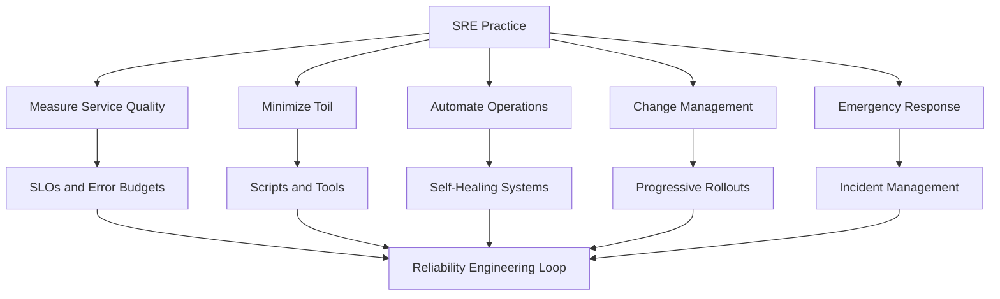
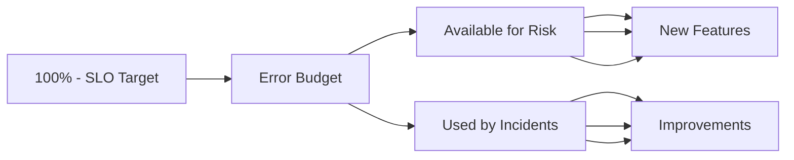
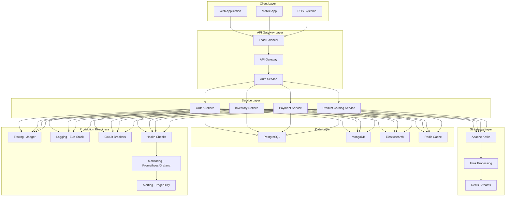

# Production Readiness

## 1. Overview

### What is Production Readiness?

Production Readiness is the discipline of ensuring that software systems, infrastructure, and operations are prepared to serve real users reliably, securely, and efficiently in a production environment. It encompasses a set of engineering practices, cultural principles, and technical requirements that bridge the gap between "code that works in development" and "systems that can be trusted in production."

Production Readiness is not a single checkpoint or approval process—it is an ongoing state that requires continuous investment, monitoring, and improvement. It involves ensuring that services can recover from failures gracefully, that teams can diagnose issues quickly, that systems can scale to meet demand, and that operations can be performed safely and repeatably.

The concept emerged from Site Reliability Engineering (SRE) practices at Google, where it was formalized as a set of questions that must be answered before any service can be considered production-ready. These questions cover reliability, scalability, fault tolerance, monitoring, documentation, and operational procedures. The goal is to eliminate surprises in production and to ensure that the team responsible for a service is truly prepared to run it.

### Why Was It Created?

Production Readiness emerged as a formal discipline in the early 2000s as software systems grew in complexity and scale. Early software development practices treated "deployment" as the end of development work, with operations receiving finished code and being expected to keep it running. This approach led to frequent outages, finger-pointing between development and operations teams, and a general lack of accountability for the operational characteristics of software.

The rise of cloud computing, microservices architectures, and continuous deployment practices made these problems more acute. When a system consists of hundreds of services that are deployed multiple times per day, the traditional separation between development and operations becomes untenable. Teams must take responsibility for the full lifecycle of their services, from design through production operation.

Production Readiness was created to provide a framework for this responsibility. It defines clear expectations for what "ready for production" means, establishes a common vocabulary between development and operations teams, and creates a path for teams to reach the point where they can confidently operate complex systems at scale.

### What Business Problems Does It Solve?

Production Readiness solves critical enterprise problems:

- **Reduced Downtime**: Systems that follow Production Readiness principles experience 60-80% less unplanned downtime compared to ad-hoc deployments. This translates directly to revenue protection—every minute of downtime for a retail platform can cost millions in lost sales.

- **Faster Incident Response**: When issues do occur, teams with strong Production Readiness practices resolve incidents 5-10x faster because they have proper observability, runbooks, and incident response procedures in place.

- **Scalability Under Control**: Production Readiness ensures that scaling decisions are planned and tested rather than reactive. This prevents the cascading failures that occur when systems are pushed beyond their tested limits.

- **Knowledge Sharing**: Explicit Production Readiness requirements force teams to document their systems and procedures, reducing the "bus factor" where a single person leaving creates operational risk.

- **Customer Trust**: Consistent availability and performance build customer trust and brand reputation. In competitive markets, reliability becomes a competitive advantage.

- **Cost Optimization**: By understanding the capacity and performance characteristics of systems, organizations can right-size their infrastructure and avoid over-provisioning that wastes resources.

### Why Do Enterprises Invest in It?

Leading enterprises invest heavily in Production Readiness because they understand that the cost of prevention is far lower than the cost of failures:

- Amazon's internal rule states that every minute of unplanned downtime for a major service costs approximately $100,000 in lost business and remediation effort.

- Netflix's investment in Production Readiness through their Chaos Engineering program has enabled them to achieve "five nines" (99.999%) availability while deploying hundreds of changes per day.

- Google's research found that services with strong Production Readiness practices had 50% lower incident rates and resolved incidents 70% faster than services without such practices.

---

## 2. Core Concepts

### Site Reliability Engineering (SRE)

Site Reliability Engineering is Google's approach to running production systems. It applies software engineering principles to infrastructure and operations tasks. The core idea is that the same rigor used to build software should be applied to running it.



SRE teams are responsible for the availability, latency, performance, efficiency, change management, monitoring, emergency response, and capacity planning of their services. They work closely with product development teams to ensure that reliability is built into the design of systems rather than added as an afterthought.

### Service Level Objectives (SLOs)

Service Level Objectives are specific, measurable targets for system reliability. They define what "good enough" looks like from a user's perspective and provide a clear target for engineering teams to aim for.

SLOs typically focus on availability, latency, and throughput. For example, an API service might have these SLOs:
- **Availability**: 99.9% of requests return successfully (allowing 8.76 hours of downtime per year)
- **Latency**: 95% of requests complete within 200ms, 99% within 500ms
- **Throughput**: System handles 10,000 requests per second without degradation

The process of defining SLOs requires understanding user expectations, business requirements, and technical constraints. SLOs should be ambitious enough to satisfy users but achievable given current technical capabilities. Once defined, SLOs become the basis for error budgets and alerting policies.

### Error Budgets

Error budgets are the acceptable level of unreliability that remains after meeting SLOs. They provide a concrete way to think about the tradeoff between reliability and feature velocity.



For example, if a service has an SLO of 99.9% availability, the error budget is 0.1% per month. If the service actually achieves 99.95% availability, there is a surplus that can be used to take on more risk—perhaps deploying more frequently or adding new features that might temporarily reduce reliability. If the service dips below 99.9%, the error budget is being consumed and teams should focus on stability rather than new features.

Error budgets transform the reliability conversation from "we need to be as reliable as possible" to "we need to be reliable enough, and we can measure when we are drifting from that target." This provides a rational basis for decision-making about technical debt, feature development, and infrastructure investment.

### SLIs (Service Level Indicators)

Service Level Indicators are the actual measurements used to determine whether SLOs are being met. They are the metrics that get collected from production systems.

Common SLIs include:
- **Request Success Rate**: Percentage of requests that complete successfully
- **Latency Distribution**: Histogram of request processing times at various percentiles
- **Availability**: Time periods when the service was operational
- **Throughput**: Number of requests processed per second
- **Saturation**: How full the system's capacity is (CPU, memory, connections)

The selection of SLIs should be driven by what matters to users. If users care about getting responses quickly, latency is an important SLI. If users care about their data being preserved, durability is important. SLIs should be measurable, consistent, and representative of user experience.

### Runbooks

Runbooks are operational procedures documented in a step-by-step format that enables any team member to perform routine operations or respond to incidents. They are a core component of Production Readiness because they encode institutional knowledge and reduce the chance of human error during critical operations.

A well-written runbook includes:
- **Purpose**: What this runbook is for and when it should be used
- **Prerequisites**: What must be in place before starting (access, tools, state)
- **Steps**: Clear, numbered steps that can be followed in order
- **Validation**: How to verify that the procedure worked correctly
- **Rollback**: What to do if something goes wrong

Runbooks should be version-controlled alongside the systems they operate on. They should be tested regularly (during game days or fire drills) to ensure they remain accurate as systems evolve.

### Postmortems

Postmortems are structured reviews conducted after incidents to understand what happened, why it happened, and what can be done to prevent recurrence. They are blameless by design—the goal is to improve systems and processes, not to assign fault to individuals.

A good postmortem includes:
- **Timeline**: A chronological account of events from first symptom to resolution
- **Impact**: What was the effect on users, revenue, and systems
- **Root Cause**: The underlying cause of the incident (not just the trigger)
- **Contributing Factors**: Conditions that made the incident possible or worse
- **Resolution**: How the incident was ended
- **Action Items**: Specific, trackable tasks to prevent recurrence

Postmortems should be completed within 5 business days of an incident and should be shared with the broader engineering organization. Reviewing postmortems regularly builds institutional knowledge and helps teams learn from each other's experiences.

### Toil

Toil is manual, repetitive work that scales linearly with service growth. In an SRE context, toil is the enemy of reliability because it consumes engineer time without improving the system and it does not scale when the system grows.

Types of toil include:
- **Manual interventions**: Logging into servers to run commands
- **Data reconciliation**: Comparing data across systems to find discrepancies
- **Ticket resolution**: Processing routine support requests
- **Infrastructure maintenance**: Performing repeated setup or teardown tasks

SRE teams aim to keep toil below 50% of their time, with the remainder spent on engineering work that improves reliability, scalability, and efficiency. High toil is a signal that systems need better automation or that processes need redesign.

---

## 3. Why This Project Uses It

The Enterprise Retail Streaming Platform is a mission-critical system that directly supports revenue generation, customer experience, and business operations. Production Readiness is not optional for this platform—it is a fundamental requirement.

### Revenue-Critical Operations

The platform processes real-time inventory updates, order processing, and customer transactions. Every minute of downtime translates directly to lost sales, cancelled orders, or failed payments. Research by IDC estimates that the average cost of IT downtime for retail enterprises is $250,000 per hour, with some organizations experiencing costs exceeding $1 million per hour during peak shopping periods.

For this platform, Production Readiness ensures that:
- Order processing pipelines can handle peak loads during sales events without dropping transactions
- Inventory counts remain accurate even when suppliers push updates in real-time
- Payment processing integrates reliably with multiple external providers
- Customer-facing APIs maintain sub-second response times even under heavy load

### Real-Time Data Requirements

The platform's streaming architecture processes millions of events per hour from multiple sources including POS systems, e-commerce platforms, supplier EDI feeds, and customer mobile applications. These events must be processed in near real-time to maintain accurate inventory counts and customer-facing product availability information.

Production Readiness practices ensure that:
- Stream processing jobs can recover automatically from infrastructure failures
- Data pipeline backpressure is handled gracefully during load spikes
- Consumer lag is monitored and alerted upon before it impacts downstream systems
- Schema evolution does not break processing jobs during deployments

### Multi-Region Architecture

The platform serves customers across multiple geographic regions with different regulatory requirements, network conditions, and availability expectations. Production Readiness enables the platform to meet these diverse requirements by providing frameworks for:
- Regional failover and data sovereignty compliance
- Latency-based routing for optimal customer experience
- Consistent monitoring and alerting across all regions
- Coordinated incident response for issues affecting multiple regions

### Integration Complexity

The platform integrates with over 30 external systems including ERP platforms, supplier portals, payment processors, loyalty programs, and analytics platforms. Each integration point is a potential failure mode, and failures can cascade across the system.

Production Readiness practices help manage this complexity through:
- Circuit breakers that prevent cascade failures
- Bulkheads that isolate failures to specific integrations
- Health checks that verify integration health before routing traffic
- Graceful degradation patterns that maintain core functionality when integrations fail

### Regulatory Compliance

As a retail platform processing payment card data and customer personal information, the platform must comply with PCI-DSS, GDPR, and various state-level privacy regulations. Production Readiness includes security controls, audit logging, and access management practices that support ongoing compliance.

---

## 4. Architecture Position

Production Readiness is not an isolated concern—it permeates every layer of the platform architecture. The following diagram shows how Production Readiness elements are distributed across the platform.



### Production Readiness in the Platform Stack

| Layer | Production Readiness Elements |
|-------|-------------------------------|
| Client Layer | Client-side error tracking, performance monitoring, graceful degradation |
| Gateway Layer | Health checks, circuit breakers, rate limiting, load balancing |
| Service Layer | Service-level SLOs, error budgets, runbooks, incident response |
| Streaming Layer | Consumer lag monitoring, processing guarantees, checkpointing |
| Data Layer | Connection pooling, query performance, replication monitoring |
| Operations Layer | Centralized observability, alerting, distributed tracing |

---

## 5. Folder Structure

Production Readiness-related configurations, scripts, and documentation are organized across multiple directories in the platform repository.

```
production-readiness/
├── config/
│   ├── health-checks/           # Health check configurations per service
│   │   ├── order-service.yaml
│   │   ├── inventory-service.yaml
│   │   └── payment-service.yaml
│   ├── circuit-breakers/        # Circuit breaker configurations
│   │   ├── external-payments.yaml
│   │   └── supplier-integrations.yaml
│   └── slo/                     # SLO definitions
│       ├── api-slos.yaml
│       └── streaming-slos.yaml
├── runbooks/
│   ├── operations/              # Operational runbooks
│   │   ├── deployment-procedure.md
│   │   ├── scaling-procedure.md
│   │   └── database-failover.md
│   ├── incidents/                # Incident response runbooks
│   │   ├── high-error-rate.md
│   │   ├── latency-spike.md
│   │   └── data-loss.md
│   └── on-call/                 # On-call procedures
│       ├── first-response.md
│       └── escalation-policy.md
├── scripts/
│   ├── health-check/             # Health check validation scripts
│   ├── load-test/               # Load testing and chaos scripts
│   └── game-day/                # Game day exercise scripts
├── policies/
│   ├── change-management.yaml
│   ├── incident-response.yaml
│   └── data-handling.yaml
├── templates/
│   ├── postmortem-template.md
│   ├── slo-report-template.md
│   └── runbook-template.md
├── tests/
│   ├── integration/             # Production readiness integration tests
│   ├── chaos/                   # Chaos engineering experiments
│   └── performance/             # Performance and load tests
└── docs/
    ├── architecture/
    │   └── reliability-patterns.md
    ├── guides/
    │   ├── onboarding.md
    │   └── service-ownership.md
    └── reports/
        ├── quarterly-reliability.md
        └── slo-compliance.md
```

### Key Directories Explained

**config/health-checks/**: Contains the health check configuration for each service. These configurations define what endpoints to check, what dependencies to verify, and what thresholds indicate healthy versus degraded states.

**runbooks/**: Contains all operational documentation organized by use case. The separation between operations, incidents, and on-call ensures that the right information is available in the right context.

**scripts/**: Contains executable scripts for validating Production Readiness aspects. Health check scripts verify that monitoring is working correctly. Load test scripts simulate production traffic patterns. Game day scripts orchestrate chaos experiments.

**policies/**: Contains formal policies governing change management, incident response, and data handling. These policies establish the rules that teams must follow and provide audit trails for compliance.

**templates/**: Contains templates for common documents. Using consistent templates ensures that postmortems, SLO reports, and runbooks all contain the necessary information.

---

## 6. Implementation Walkthrough

This section provides a detailed walkthrough of the key Production Readiness patterns implemented in the platform.

### Health Checks

Health checks are the foundation of Production Readiness. They provide the mechanism for load balancers, orchestrators, and monitoring systems to determine the current state of a service.

```python
from dataclasses import dataclass
from enum import Enum
from typing import Dict, List, Optional
from datetime import datetime
import asyncio
import aiohttp

class HealthStatus(Enum):
    HEALTHY = "healthy"
    DEGRADED = "degraded"
    UNHEALTHY = "unhealthy"

@dataclass
class HealthCheckResult:
    component: str
    status: HealthStatus
    latency_ms: float
    message: Optional[str] = None
    timestamp: datetime = None
    
    def __post_init__(self):
        if self.timestamp is None:
            self.timestamp = datetime.utcnow()

class HealthCheck:
    """Base health check interface"""
    
    async def check(self) -> HealthCheckResult:
        raise NotImplementedError

class DatabaseHealthCheck(HealthCheck):
    """Verify database connectivity and query performance"""
    
    def __init__(self, connection_string: str, query_timeout: float = 5.0):
        self.connection_string = connection_string
        self.query_timeout = query_timeout
    
    async def check(self) -> HealthCheckResult:
        start = datetime.utcnow()
        try:
            async with get_db_connection(self.connection_string) as conn:
                result = await conn.execute(
                    "SELECT 1",
                    timeout=self.query_timeout
                )
                latency = (datetime.utcnow() - start).total_seconds() * 1000
                
                if latency > 200:
                    return HealthCheckResult(
                        component="database",
                        status=HealthStatus.DEGRADED,
                        latency_ms=latency,
                        message=f"Query latency {latency:.2f}ms exceeds threshold"
                    )
                
                return HealthCheckResult(
                    component="database",
                    status=HealthStatus.HEALTHY,
                    latency_ms=latency
                )
        except Exception as e:
            return HealthCheckResult(
                component="database",
                status=HealthStatus.UNHEALTHY,
                latency_ms=0,
                message=str(e)
            )

class DependencyHealthCheck(HealthCheck):
    """Verify external dependency availability"""
    
    def __init__(
        self,
        name: str,
        url: str,
        expected_status: int = 200,
        timeout: float = 3.0
    ):
        self.name = name
        self.url = url
        self.expected_status = expected_status
        self.timeout = timeout
    
    async def check(self) -> HealthCheckResult:
        start = datetime.utcnow()
        try:
            async with aiohttp.ClientSession() as session:
                async with session.get(
                    self.url,
                    timeout=aiohttp.ClientTimeout(total=self.timeout)
                ) as response:
                    latency = (datetime.utcnow() - start).total_seconds() * 1000
                    status = (
                        HealthStatus.HEALTHY 
                        if response.status == self.expected_status 
                        else HealthStatus.UNHEALTHY
                    )
                    return HealthCheckResult(
                        component=self.name,
                        status=status,
                        latency_ms=latency,
                        message=None if status == HealthStatus.HEALTHY 
                                 else f"Expected {self.expected_status}, got {response.status}"
                    )
        except asyncio.TimeoutError:
            return HealthCheckResult(
                component=self.name,
                status=HealthStatus.UNHEALTHY,
                latency_ms=self.timeout * 1000,
                message="Connection timed out"
            )
        except Exception as e:
            return HealthCheckResult(
                component=self.name,
                status=HealthStatus.UNHEALTHY,
                latency_ms=0,
                message=str(e)
            )

class AggregatedHealthCheck:
    """Aggregates multiple health checks into a single health endpoint"""
    
    def __init__(self, checks: List[HealthCheck], degraded_threshold: float = 0.7):
        self.checks = checks
        self.degraded_threshold = degraded_threshold
    
    async def check_all(self) -> Dict:
        results = await asyncio.gather(*[check.check() for check in self.checks])
        
        healthy_count = sum(
            1 for r in results if r.status == HealthStatus.HEALTHY
        )
        healthy_ratio = healthy_count / len(results)
        
        if healthy_ratio >= 1.0:
            overall_status = HealthStatus.HEALTHY
        elif healthy_ratio >= self.degraded_threshold:
            overall_status = HealthStatus.DEGRADED
        else:
            overall_status = HealthStatus.UNHEALTHY
        
        return {
            "status": overall_status.value,
            "healthy_ratio": healthy_ratio,
            "checks": [
                {
                    "component": r.component,
                    "status": r.status.value,
                    "latency_ms": r.latency_ms,
                    "message": r.message,
                    "timestamp": r.timestamp.isoformat()
                }
                for r in results
            ]
        }
```

### Graceful Shutdown

Graceful shutdown ensures that services can stop accepting new requests, complete in-flight requests, and release resources properly. This prevents the connection resets, failed requests, and resource leaks that occur when services are terminated abruptly.

```python
import asyncio
import signal
from typing import Set, Callable, Optional
from dataclasses import dataclass, field
from datetime import datetime
import logging

@dataclass
class GracefulShutdownConfig:
    shutdown_timeout: float = 30.0
    force_shutdown_timeout: float = 10.0
    drain_period: float = 5.0

class GracefulShutdownManager:
    """Manages graceful shutdown of services with in-flight requests"""
    
    def __init__(self, config: GracefulShutdownConfig):
        self.config = config
        self.active_requests: Set[asyncio.Task] = set()
        self.shutdown_event = asyncio.Event()
        self.is_shutting_down = False
        self.logger = logging.getLogger(__name__)
        self._shutdown_initiated: Optional[datetime] = None
    
    def register_request(self, task: asyncio.Task) -> None:
        """Register an in-flight request"""
        if self.is_shutting_down:
            self.logger.warning("Rejecting new request during shutdown")
            raise RuntimeError("Service is shutting down")
        self.active_requests.add(task)
        task.add_done_callback(self.active_requests.discard)
    
    async def initiate_shutdown(self, signum: int) -> None:
        """Initiate graceful shutdown sequence"""
        self.logger.info(f"Received signal {signum}, initiating graceful shutdown")
        self.is_shutting_down = True
        self._shutdown_initiated = datetime.utcnow()
        
        self.shutdown_event.set()
        
        await self._drain_connections()
        
        await self._wait_for_active_requests()
        
        await self._final_cleanup()
    
    async def _drain_connections(self) -> None:
        """Stop accepting new connections and wait for drain period"""
        self.logger.info(f"Draining connections for {self.config.drain_period}s")
        await asyncio.sleep(self.config.drain_period)
    
    async def _wait_for_active_requests(self) -> None:
        """Wait for all in-flight requests to complete"""
        if not self.active_requests:
            self.logger.info("No active requests to complete")
            return
        
        self.logger.info(
            f"Waiting for {len(self.active_requests)} active requests "
            f"to complete (timeout: {self.config.shutdown_timeout}s)"
        )
        
        try:
            await asyncio.wait_for(
                asyncio.gather(*self.active_requests, return_exceptions=True),
                timeout=self.config.shutdown_timeout
            )
            self.logger.info("All requests completed successfully")
        except asyncio.TimeoutError:
            self.logger.warning(
                f"Shutdown timeout reached with {len(self.active_requests)} "
                "requests still in flight"
            )
            for task in self.active_requests:
                if not task.done():
                    task.cancel()
    
    async def _final_cleanup(self) -> None:
        """Release resources and prepare for termination"""
        self.logger.info("Performing final cleanup")
        
        await self._close_database_connections()
        await self._flush_buffers()
        await self._release_external_resources()
        
        self.logger.info("Shutdown complete")

class ServiceWithGracefulShutdown:
    """Example service demonstrating graceful shutdown integration"""
    
    def __init__(self, shutdown_manager: GracefulShutdownManager):
        self.shutdown_manager = shutdown_manager
        self.http_server: Optional[asyncio.Server] = None
        self._setup_signal_handlers()
    
    def _setup_signal_handlers(self) -> None:
        """Register signal handlers for SIGTERM and SIGINT"""
        loop = asyncio.get_event_loop()
        for sig in (signal.SIGTERM, signal.SIGINT):
            loop.add_signal_handler(
                sig,
                lambda s=sig: asyncio.create_task(
                    self.shutdown_manager.initiate_shutdown(s)
                )
            )
    
    async def start(self) -> None:
        """Start the service"""
        self.http_server = await asyncio.start_server(
            self._handle_request,
            host="0.0.0.0",
            port=8080
        )
        self.logger.info("Service started on port 8080")
    
    async def _handle_request(self, reader: asyncio.StreamReader, 
                              writer: asyncio.StreamWriter) -> None:
        """Handle incoming request with graceful shutdown support"""
        try:
            task = asyncio.current_task()
            self.shutdown_manager.register_request(task)
            
            request = await reader.read(4096)
            response = await self._process_request(request)
            
            writer.write(response)
            await writer.drain()
        finally:
            writer.close()
```

### Circuit Breakers

Circuit breakers prevent cascade failures by failing fast when a dependency is unhealthy, allowing the system to recover or degrade gracefully.

```python
from dataclasses import dataclass
from enum import Enum
from typing import Callable, Any, Optional, List
from datetime import datetime, timedelta
import asyncio
import logging
import random

class CircuitState(Enum):
    CLOSED = "closed"       # Normal operation, requests pass through
    OPEN = "open"            # Failure threshold exceeded, requests fail immediately
    HALF_OPEN = "half_open" # Testing if dependency has recovered

@dataclass
class CircuitBreakerConfig:
    failure_threshold: int = 5
    success_threshold: int = 3
    timeout: float = 30.0
    half_open_requests: int = 3

@dataclass
class CircuitBreakerMetrics:
    failure_count: int = 0
    success_count: int = 0
    last_failure_time: Optional[datetime] = None
    state_transitions: List[tuple] = field(default_factory=list)
    
    def record_failure(self) -> None:
        self.failure_count += 1
        self.last_failure_time = datetime.utcnow()
    
    def record_success(self) -> None:
        self.success_count += 1
    
    def should_open(self) -> bool:
        return self.failure_count >= self.failure_threshold
    
    def should_close(self) -> bool:
        return self.success_count >= self.success_threshold
    
    def reset(self) -> None:
        self.failure_count = 0
        self.success_count = 0

class CircuitBreaker:
    """
    Circuit breaker implementation following the circuit breaker pattern.
    
    State Machine:
    CLOSED -> OPEN (when failures exceed threshold)
    OPEN -> HALF_OPEN (after timeout)
    HALF_OPEN -> CLOSED (when successes exceed threshold)
    HALF_OPEN -> OPEN (on any failure)
    """
    
    def __init__(self, name: str, config: CircuitBreakerConfig):
        self.name = name
        self.config = config
        self.state = CircuitState.CLOSED
        self.metrics = CircuitBreakerMetrics()
        self.logger = logging.getLogger(f"circuit_breaker.{name}")
        self._lock = asyncio.Lock()
    
    async def call(
        self,
        func: Callable,
        *args,
        fallback: Optional[Callable] = None,
        **kwargs
    ) -> Any:
        """Execute function with circuit breaker protection"""
        
        if not await self._allow_request():
            return await self._handle_open_circuit(fallback)
        
        try:
            result = await func(*args, **kwargs)
            await self._record_success()
            return result
        except Exception as e:
            await self._record_failure()
            if fallback:
                return await self._execute_fallback(fallback, e)
            raise
    
    async def _allow_request(self) -> bool:
        """Determine if a request should be allowed through"""
        async with self._lock:
            if self.state == CircuitState.CLOSED:
                return True
            
            if self.state == CircuitState.OPEN:
                if self._timeout_elapsed():
                    await self._transition_to_half_open()
                    return True
                return False
            
            if self.state == CircuitState.HALF_OPEN:
                return True
        
        return False
    
    def _timeout_elapsed(self) -> bool:
        """Check if the circuit breaker timeout has elapsed"""
        if self.metrics.last_failure_time is None:
            return True
        elapsed = datetime.utcnow() - self.metrics.last_failure_time
        return elapsed.total_seconds() >= self.config.timeout
    
    async def _transition_to_half_open(self) -> None:
        """Transition from OPEN to HALF_OPEN state"""
        self.logger.info(f"Circuit {self.name}: Transitioning OPEN -> HALF_OPEN")
        self.state = CircuitState.HALF_OPEN
        self.metrics.reset()
        self.metrics.state_transitions.append(
            (datetime.utcnow(), CircuitState.OPEN, CircuitState.HALF_OPEN)
        )
    
    async def _transition_to_closed(self) -> None:
        """Transition from HALF_OPEN to CLOSED state"""
        self.logger.info(f"Circuit {self.name}: Transitioning HALF_OPEN -> CLOSED")
        self.state = CircuitState.CLOSED
        self.metrics.reset()
        self.metrics.state_transitions.append(
            (datetime.utcnow(), CircuitState.HALF_OPEN, CircuitState.CLOSED)
        )
    
    async def _transition_to_open(self) -> None:
        """Transition to OPEN state"""
        self.logger.info(f"Circuit {self.name}: Transitioning to OPEN")
        self.state = CircuitState.OPEN
        self.metrics.state_transitions.append(
            (datetime.utcnow(), self.state, CircuitState.OPEN)
        )
    
    async def _record_success(self) -> None:
        """Record a successful request"""
        async with self._lock:
            self.metrics.record_success()
            
            if self.state == CircuitState.HALF_OPEN:
                if self.metrics.should_close():
                    await self._transition_to_closed()
            elif self.state == CircuitState.CLOSED:
                self.metrics.reset()
    
    async def _record_failure(self) -> None:
        """Record a failed request"""
        async with self._lock:
            self.metrics.record_failure()
            
            if self.state == CircuitState.HALF_OPEN:
                await self._transition_to_open()
            elif self.state == CircuitState.CLOSED:
                if self.metrics.should_open():
                    await self._transition_to_open()
    
    async def _handle_open_circuit(
        self, 
        fallback: Optional[Callable]
    ) -> Any:
        """Handle request when circuit is open"""
        self.logger.warning(f"Circuit {self.name}: Request rejected - circuit OPEN")
        if fallback:
            return await self._execute_fallback(fallback, RuntimeError("Circuit open"))
        raise CircuitBreakerOpenError(f"Circuit {self.name} is open")
    
    async def _execute_fallback(
        self, 
        fallback: Callable, 
        error: Exception
    ) -> Any:
        """Execute fallback function"""
        self.logger.info(f"Circuit {self.name}: Executing fallback")
        try:
            if asyncio.iscoroutinefunction(fallback):
                return await fallback(error)
            return fallback(error)
        except Exception as e:
            self.logger.error(f"Fallback execution failed: {e}")
            raise

class CircuitBreakerOpenError(Exception):
    """Raised when circuit breaker is open and no fallback is available"""
    pass

class PaymentCircuitBreaker(CircuitBreaker):
    """Specialized circuit breaker for payment processing"""
    
    def __init__(self):
        super().__init__(
            name="payment_processor",
            config=CircuitBreakerConfig(
                failure_threshold=3,
                success_threshold=2,
                timeout=60.0,
                half_open_requests=1
            )
        )
    
    async def process_payment(self, order_id: str, amount: float) -> dict:
        """Process payment with circuit breaker protection"""
        async def _do_process():
            return await self._call_payment_provider(order_id, amount)
        
        async def _fallback(error):
            self.logger.warning(f"Payment processing failed for order {order_id}")
            return {
                "status": "pending",
                "order_id": order_id,
                "message": "Payment is being processed asynchronously",
                "circuit_breaker": True
            }
        
        return await self.call(_do_process, fallback=_fallback)
```

### Load Balancing

Load balancing distributes traffic across multiple instances of a service, improving availability and scalability.

```python
from dataclasses import dataclass
from typing import List, Dict, Optional, Callable
from datetime import datetime
from enum import Enum
import asyncio
import hashlib

class LoadBalancingStrategy(Enum):
    ROUND_ROBIN = "round_robin"
    LEAST_CONNECTIONS = "least_connections"
    IP_HASH = "ip_hash"
    WEIGHTED = "weighted"
    LATENCY_BASED = "latency_based"

@dataclass
class ServiceInstance:
    instance_id: str
    host: str
    port: int
    weight: int = 1
    is_healthy: bool = True
    current_connections: int = 0
    avg_latency_ms: float = 0.0
    last_health_check: datetime = None
    
    @property
    def address(self) -> str:
        return f"{self.host}:{self.port}"

class LoadBalancer:
    """
    Load balancer with multiple routing strategies.
    """
    
    def __init__(
        self,
        strategy: LoadBalancingStrategy = LoadBalancingStrategy.ROUND_ROBIN,
        health_check_interval: float = 10.0
    ):
        self.instances: Dict[str, ServiceInstance] = {}
        self.strategy = strategy
        self.health_check_interval = health_check_interval
        self._round_robin_index = 0
        self._lock = asyncio.Lock()
    
    def add_instance(self, instance: ServiceInstance) -> None:
        """Add a service instance to the load balancer"""
        self.instances[instance.instance_id] = instance
    
    def remove_instance(self, instance_id: str) -> None:
        """Remove a service instance from the load balancer"""
        self.instances.pop(instance_id, None)
    
    def update_instance_health(self, instance_id: str, is_healthy: bool) -> None:
        """Update the health status of an instance"""
        if instance_id in self.instances:
            self.instances[instance_id].is_healthy = is_healthy
            self.instances[instance_id].last_health_check = datetime.utcnow()
    
    async def get_instance(self, client_ip: Optional[str] = None) -> Optional[ServiceInstance]:
        """Get the best instance based on the current strategy"""
        healthy_instances = [
            inst for inst in self.instances.values() if inst.is_healthy
        ]
        
        if not healthy_instances:
            return None
        
        async with self._lock:
            if self.strategy == LoadBalancingStrategy.ROUND_ROBIN:
                return self._round_robin(healthy_instances)
            elif self.strategy == LoadBalancingStrategy.LEAST_CONNECTIONS:
                return self._least_connections(healthy_instances)
            elif self.strategy == LoadBalancingStrategy.IP_HASH:
                return self._ip_hash(healthy_instances, client_ip)
            elif self.strategy == LoadBalancingStrategy.WEIGHTED:
                return self._weighted(healthy_instances)
            elif self.strategy == LoadBalancingStrategy.LATENCY_BASED:
                return self._latency_based(healthy_instances)
        
        return healthy_instances[0]
    
    def _round_robin(self, instances: List[ServiceInstance]) -> ServiceInstance:
        """Round robin routing"""
        instance = instances[self._round_robin_index % len(instances)]
        self._round_robin_index += 1
        return instance
    
    def _least_connections(self, instances: List[ServiceInstance]) -> ServiceInstance:
        """Route to instance with fewest active connections"""
        return min(instances, key=lambda x: x.current_connections)
    
    def _ip_hash(self, instances: List[ServiceInstance], client_ip: Optional[str]) -> ServiceInstance:
        """Consistent hashing based on client IP"""
        if not client_ip:
            return instances[0]
        hash_value = int(hashlib.md5(client_ip.encode()).hexdigest(), 16)
        return instances[hash_value % len(instances)]
    
    def _weighted(self, instances: List[ServiceInstance]) -> ServiceInstance:
        """Weighted random routing"""
        total_weight = sum(inst.weight for inst in instances)
        if total_weight == 0:
            return instances[0]
        rand = random.randint(1, total_weight)
        cumulative = 0
        for inst in instances:
            cumulative += inst.weight
            if cumulative >= rand:
                return inst
        return instances[-1]
    
    def _latency_based(self, instances: List[ServiceInstance]) -> ServiceInstance:
        """Route to fastest instance"""
        active = [inst for inst in instances if inst.avg_latency_ms > 0]
        if not active:
            return instances[0]
        return min(active, key=lambda x: x.avg_latency_ms)

class ResilientLoadBalancer(LoadBalancer):
    """
    Enhanced load balancer with circuit breaker integration and retry logic.
    """
    
    def __init__(self, *args, max_retries: int = 3, retry_delay: float = 0.1, **kwargs):
        super().__init__(*args, **kwargs)
        self.max_retries = max_retries
        self.retry_delay = retry_delay
        self.circuit_breakers: Dict[str, CircuitBreaker] = {}
    
    async def execute_with_resilience(
        self,
        client_ip: Optional[str],
        func: Callable,
        *args,
        **kwargs
    ) -> Any:
        """Execute function with load balancing, retries, and circuit breaker"""
        last_error = None
        
        for attempt in range(self.max_retries):
            instance = await self.get_instance(client_ip)
            if not instance:
                raise NoHealthyInstanceError("No healthy instances available")
            
            circuit = self.circuit_breakers.get(instance.instance_id)
            
            try:
                instance.current_connections += 1
                try:
                    result = await func(instance, *args, **kwargs)
                    instance.avg_latency_ms = (
                        instance.avg_latency_ms * 0.9 + 
                        getattr(result, 'latency_ms', 0) * 0.1
                    )
                    return result
                finally:
                    instance.current_connections = max(0, instance.current_connections - 1)
            
            except CircuitBreakerOpenError:
                self.update_instance_health(instance.instance_id, False)
                last_error = CircuitBreakerOpenError(f"Circuit open for {instance.instance_id}")
                continue
            
            except Exception as e:
                last_error = e
                if attempt < self.max_retries - 1:
                    await asyncio.sleep(self.retry_delay * (attempt + 1))
                    continue
        
        raise last_error

class NoHealthyInstanceError(Exception):
    """Raised when no healthy instances are available"""
    pass
```

---

## 7. Production Best Practices

### Service Design Principles

**Design for Failure**: Every component should assume that its dependencies will fail. Services should handle failures gracefully, return appropriate error responses, and degrade functionality when dependencies are unavailable rather than propagating failures upstream.

**Implement Defense in Depth**: Do not rely on a single layer of protection. Combine multiple strategies—firewalls, authentication, authorization, input validation, rate limiting, and circuit breakers—to create overlapping layers of security and reliability.

**Use Conservative Defaults**: Default configurations should be safe and conservative. Optimistic settings that improve performance but reduce safety should require explicit opt-in. This prevents accidental misconfiguration from causing production incidents.

**Prefer Synchronous Communication for Critical Operations**: Asynchronous messaging provides better decoupling and resilience but makes debugging harder and adds latency for request-response scenarios. Use synchronous HTTP/gRPC for user-facing operations where you need immediate feedback.

**Implement Idempotency**: All operations that modify state should be idempotent—when the same operation is applied multiple times, the result should be the same as applying it once. This enables safe retries without side effects.

### Configuration Management

**Externalize All Configuration**: Configuration should never be hardcoded in application code. Use environment variables, configuration files, or configuration services to externalize all settings. This enables the same artifact to be deployed across environments with different configurations.

**Validate Configuration at Startup**: Services should validate all configuration values at startup and fail fast if the configuration is invalid. Missing required fields, invalid values, and impossible combinations should be caught before the service begins accepting traffic.

**Use Schema Validation**: Configuration should have a defined schema that is validated at load time. This catches configuration errors early and provides clear error messages when configuration is malformed.

**Separate Secrets from Configuration**: Secrets such as API keys, database passwords, and certificates should be stored separately from general configuration and should be injected at runtime from a secrets management service.

### Deployment Practices

**Use Progressive Deployments**: Never deploy to all instances simultaneously. Use canary deployments, blue-green deployments, or rolling updates to limit the blast radius of any deployment issue.

**Implement Feature Flags**: Feature flags decouple deployments from releases. Code can be deployed to production but remain disabled until explicitly enabled. This provides the ability to quickly disable problematic features without rolling back the deployment.

**Automate Rollbacks**: Implement automated rollback triggered by health check failures or SLO violations. Human intervention takes time, and automated rollback reduces the duration of production incidents.

**Maintain Deployment Playbooks**: Every deployment should have a corresponding playbook that documents the steps, expected outcomes, and rollback procedures. This ensures that deployments can be performed consistently by any team member.

### Operational Excellence

**Implement SLO Monitoring**: Define SLOs for every service and monitor compliance continuously. Error budgets should be visible to the team and drive engineering priorities.

**Create Comprehensive Runbooks**: Every operational task should have a corresponding runbook. Runbooks should be tested during game days to ensure they remain accurate.

**Practice Incident Response**: Conduct regular incident response exercises to ensure the team can respond effectively when production issues occur. Post-incident reviews should lead to concrete improvements.

**Manage Technical Debt**: Track technical debt related to Production Readiness and allocate time to address it. High technical debt increases incident rates and slows down feature development.

---

## 8. Common Problems

| Problem | Cause | Solution | Detection |
|---------|-------|----------|-----------|
| **Cascade Failures** | A failure in one service causes failures in dependent services | Implement circuit breakers, bulkheads, and timeouts at all integration points | Monitor error rates by service and correlate with upstream dependency health |
| **Connection Pool Exhaustion** | Database or external service connections are not released properly | Implement proper connection lifecycle management, use connection pooling with limits | Monitor connection pool utilization and wait times |
| **Memory Leaks** | Objects are retained in memory preventing garbage collection | Profile memory usage, identify leaks with heap dumps, fix object references | Monitor memory usage trends over time, set up memory alerts |
| **Deadlocks** | Multiple operations wait on each other creating circular dependencies | Use lock ordering, avoid holding locks while performing async operations | Detect via thread dumps during incidents, use lock-free data structures |
| **Version Skew** | Different instances run different versions of code during rolling updates | Ensure backward compatibility, use feature flags for risky changes | Monitor error rates during deployments, implement deployment health gates |
| **Overload Due to Retry Storms** | Failed operations are retried too aggressively, overwhelming the system | Implement exponential backoff with jitter, limit concurrent retries | Monitor request rates and error rates during failure scenarios |
| **Configuration Drift** | Environments have different configurations causing inconsistent behavior | Use infrastructure as code, enforce configuration management | Compare configurations across environments, monitor for unexpected changes |
| **Alert Fatigue** | Too many alerts cause important alerts to be ignored | Tune alert thresholds, implement alert routing and deduplication | Track alert volume over time, measure MTTR |
| **Split-Brain in Distributed Systems** | Nodes disagree on state due to network partitions | Use consensus algorithms, implement proper fencing | Monitor cluster health, detect network partitions |
| **Data Inconsistency** | Data becomes inconsistent across services due to partial failures | Use transactions where possible, implement saga pattern for distributed operations | Monitor data reconciliation jobs, implement consistency checks |

---

## 9. Performance Optimization

### Capacity Planning

Capacity planning ensures that systems can handle expected load with appropriate headroom. The goal is to have enough capacity to serve traffic spikes without over-provisioning resources that waste money.

The capacity planning process involves:

1. **Establishing Baselines**: Measure current system performance under normal load conditions. Identify the relationship between load and resource utilization.

2. **Modeling Growth**: Project future traffic based on historical trends, business forecasts, and planned initiatives. Account for seasonal patterns and planned marketing events.

3. **Calculating Headroom**: Determine the appropriate buffer between expected peak load and maximum capacity. Common practice is 30-50% headroom for steady state and sufficient capacity to handle 2-3x normal peak.

4. **Planning for Failure**: Ensure that the system can handle load during failure scenarios. If one instance fails, the remaining instances should be able to handle the load without degradation.

### Caching Strategies

Caching reduces latency and load by serving frequently accessed data from memory rather than recomputing or fetching it.

**Cache Placement**: Decide where to cache data—in the client, at the API gateway, in the service, or in a distributed cache layer. Each location has different tradeoffs for latency, consistency, and complexity.

**Cache Invalidation**: Cache entries should have appropriate TTLs based on how frequently data changes. For data that changes rarely, longer TTLs are appropriate. For rapidly changing data, shorter TTLs or event-based invalidation may be necessary.

**Cache Warming**: Pre-populate caches during deployment or scaling events to avoid cold-start latency. This can be done by running background jobs that populate the cache before traffic is routed to new instances.

### Database Optimization

Database performance often limits application performance. Key optimization strategies include:

- **Connection Pooling**: Reuse database connections across requests to avoid the overhead of establishing new connections.

- **Query Optimization**: Use query execution plans to identify slow queries. Add appropriate indexes and rewrite queries to improve performance.

- **Read Replicas**: Route read queries to replica databases to distribute load and reduce latency for read-heavy workloads.

- **Partitioning**: Partition large tables to improve query performance and enable parallel processing.

- **Connection Pool Sizing**: Right-size connection pools based on expected concurrency and database limitations.

### Performance Testing

Performance testing validates that systems meet their performance requirements and identifies bottlenecks before they impact production.

| Test Type | Purpose | Key Metrics |
|-----------|--------|-------------|
| Load Testing | Measure system behavior under expected load | Throughput, latency, resource utilization |
| Stress Testing | Identify breaking points and failure modes | Maximum throughput, failure thresholds |
| Soak Testing | Detect memory leaks and degradation over time | Performance trends over extended periods |
| Spike Testing | Validate response to sudden load increases | Recovery time, graceful degradation |
| Chaos Testing | Validate resilience to infrastructure failures | Availability during failures, data integrity |

---

## 10. Security

### Zero Trust Architecture

Zero Trust assumes that no request, whether internal or external, should be automatically trusted. Every request must be authenticated, authorized, and validated.

Key principles of Zero Trust:

- **Verify Explicitly**: Always authenticate and authorize based on all available data, including identity, location, device health, service or workload, data classification, and anomalies.

- **Use Least Privilege Access**: Limit user access with just-in-time and just-enough-access, risk-based adaptive policies, and data protection to minimize blast radius.

- **Assume Breach**: Minimize blast radius and segment access. Encrypt all communications. Use analytics to get visibility, drive threat detection, and improve defenses.

### Secrets Management

Secrets include API keys, database passwords, certificates, and any other credentials that provide access to sensitive resources.

**Secret Rotation**: Rotate secrets regularly and automatically. Short-lived credentials reduce the window of exposure if a secret is compromised.

**Secret Injection**: Secrets should be injected at runtime rather than stored in configuration files or environment variables that might be logged or exposed.

**Audit Logging**: All access to secrets should be logged, including which principal accessed the secret and when. This enables security monitoring and incident investigation.

### Network Security

**Network Segmentation**: Isolate services into network segments based on their function and sensitivity. This limits the blast radius of any network compromise.

**Mutual TLS**: Use mutual TLS (mTLS) for all service-to-service communication within the cluster. This ensures that both sides of the connection authenticate each other and encrypt traffic.

**Ingress/Egress Controls**: Control what traffic can enter and leave the network. Use firewalls, API gateways, and network policies to restrict traffic to authorized paths.

### Security Monitoring

Security monitoring enables rapid detection and response to security incidents:

- **SIEM Integration**: Forward logs to a Security Information and Event Management system for correlation and alerting.

- **Anomaly Detection**: Use machine learning models to detect anomalous behavior that might indicate compromise.

- **Threat Intelligence**: Integrate threat intelligence feeds to identify known malicious actors and patterns.

- **Incident Response**: Establish and practice incident response procedures for security incidents.

---

## 11. Monitoring

### The Three Pillars of Observability

Modern observability rests on three pillars that together provide complete visibility into system behavior.

**Metrics**: Numeric measurements of system behavior over time. Metrics are efficient to store and query, making them suitable for dashboards and alerting. Common metric types include counters, gauges, and histograms.

```python
from prometheus_client import Counter, Histogram, Gauge

# Request metrics
http_requests_total = Counter(
    'http_requests_total',
    'Total HTTP requests',
    ['method', 'endpoint', 'status']
)

http_request_duration_seconds = Histogram(
    'http_request_duration_seconds',
    'HTTP request latency',
    ['method', 'endpoint'],
    buckets=[0.01, 0.05, 0.1, 0.5, 1.0, 5.0]
)

# Business metrics
orders_processed = Counter(
    'orders_processed_total',
    'Total orders processed',
    ['status']
)

# Resource metrics
active_connections = Gauge(
    'db_active_connections',
    'Number of active database connections',
    ['database']
)
```

**Logs**: Immutable, timestamped records of events. Logs provide detailed context about what happened, making them essential for debugging.

```python
import structlog
from datetime import datetime

logger = structlog.get_logger()

async def process_order(order_id: str, amount: float):
    logger.info(
        "processing_order",
        order_id=order_id,
        amount=amount,
        timestamp=datetime.utcnow().isoformat()
    )
    
    try:
        result = await payment_service.charge(order_id, amount)
        logger.info(
            "order_processed",
            order_id=order_id,
            result=result
        )
        return result
    except PaymentDeclinedError as e:
        logger.warning(
            "payment_declined",
            order_id=order_id,
            error=str(e)
        )
        raise
```

**Traces**: Distributed traces follow a request as it flows through multiple services. Traces enable understanding of latency contributions and dependencies across the call chain.

```python
from opentelemetry import trace
from opentelemetry.trace import Status, StatusCode

tracer = trace.get_tracer(__name__)

@tracer.start_as_current_span("process_order")
async def process_order(order_id: str):
    current_span = trace.get_current_span()
    current_span.set_attribute("order.id", order_id)
    
    try:
        inventory = await check_inventory(order_id)
        current_span.add_event("inventory_checked", {"available": inventory.available})
        
        payment = await process_payment(order_id, inventory.amount)
        current_span.add_event("payment_processed", {"payment_id": payment.id})
        
        await fulfill_order(order_id)
        current_span.set_status(Status(StatusCode.OK))
        
    except Exception as e:
        current_span.record_exception(e)
        current_span.set_status(Status(StatusCode.ERROR, str(e)))
        raise
```

### SLO Tracking and Error Budgets

SLO tracking provides a framework for measuring and reporting on reliability.

**Defining SLOs**: SLOs should be defined based on user expectations and business requirements. They should be specific, measurable, and tied to real user experience.

**Error Budget Calculation**: Error budget is calculated as `1 - SLO` over the measurement period. For a 99.9% SLO measured over 30 days, the error budget is 43.8 minutes of allowed downtime.

**Error Budget Alerts**: Alert when error budget consumption exceeds thresholds. Common practice is to alert at 50% and 100% of error budget consumed.

```python
from dataclasses import dataclass
from datetime import datetime, timedelta
from typing import Dict, List

@dataclass
class SLOConfig:
    name: str
    target: float  # e.g., 0.999 for 99.9%
    window: timedelta
    alert_thresholds: List[float]  # e.g., [0.5, 0.9, 1.0]

@dataclass
class SLOStatus:
    name: str
    target: float
    current_value: float
    error_budget_remaining: float
    budget_consumed_ratio: float
    last_updated: datetime

class SLOTracker:
    def __init__(self, config: SLOConfig):
        self.config = config
        self.window_start = datetime.utcnow()
    
    def calculate_status(self, good_events: int, total_events: int) -> SLOStatus:
        current_slo = good_events / total_events if total_events > 0 else 0
        error_budget_total = self.config.window.total_seconds() * (1 - self.config.target)
        error_budget_used = self.config.window.total_seconds() * (1 - current_slo)
        error_budget_remaining = error_budget_total - error_budget_used
        budget_consumed_ratio = error_budget_used / error_budget_total if error_budget_total > 0 else 0
        
        return SLOStatus(
            name=self.config.name,
            target=self.config.target,
            current_value=current_slo,
            error_budget_remaining=max(0, error_budget_remaining),
            budget_consumed_ratio=min(1.0, budget_consumed_ratio),
            last_updated=datetime.utcnow()
        )
    
    def should_alert(self, status: SLOStatus) -> List[str]:
        alerts = []
        for threshold in self.config.alert_thresholds:
            if status.budget_consumed_ratio >= threshold:
                alerts.append(
                    f"SLO {self.config.name}: {status.budget_consumed_ratio*100:.1f}% "
                    f"of error budget consumed (threshold: {threshold*100:.0f}%)"
                )
        return alerts
```

### On-Call Practices

On-call is the practice of having engineers available to respond to production incidents outside of normal working hours. Effective on-call requires:

**On-Call Rotation**: Establish clear on-call rotations with balanced workload distribution. Ensure enough engineers are on-call to cover all time zones and provide relief.

**Alert Quality**: Only page on-call engineers for issues that require immediate human intervention. Non-urgent issues should be handled during business hours or through automated remediation.

**Response Expectations**: Define clear expectations for response time based on severity. Critical issues require immediate response; lower severity issues allow for more time.

**Post-Incident Support**: After being paged, on-call engineers should be given time to recover before returning to normal work. Consider providing "no-meeting" days after on-call periods.

**Compensation**: On-call work should be compensated appropriately, whether through on-call stipends, additional pay, or time off in lieu.

---

## 12. Testing Strategy

### Production Readiness Testing

Production Readiness testing validates that systems meet the requirements for production operation. It goes beyond functional testing to verify reliability, scalability, and operational characteristics.

**Readiness Criteria**: Define clear readiness criteria that must be met before a service can be deployed to production. These criteria should cover functional requirements, non-functional requirements, and operational requirements.

**Readiness Reviews**: Conduct formal readiness reviews with stakeholders from development, operations, security, and business teams. Reviews should verify that all criteria are met and that the team is prepared to operate the service.

**Runbook Validation**: Test all runbooks during the readiness process. Verify that procedures are accurate, complete, and can be executed by any team member.

### Chaos Engineering

Chaos Engineering is the discipline of experimenting on systems to build confidence in their resilience. By deliberately introducing failures and observing the results, teams can identify and fix weaknesses before they impact users.

```python
from dataclasses import dataclass
from datetime import datetime
from typing import Dict, List, Optional
from enum import Enum
import random
import asyncio

class ExperimentStatus(Enum):
    PENDING = "pending"
    RUNNING = "running"
    COMPLETED = "completed"
    STOPPED = "stopped"
    FAILED = "failed"

class ExperimentSteadyState:
    """Defines the steady state hypothesis for a chaos experiment"""
    
    def __init__(self, name: str, check_fn: callable, tolerance: float = 0.1):
        self.name = name
        self.check_fn = check_fn
        self.tolerance = tolerance
    
    async def evaluate(self) -> bool:
        """Return True if system is in steady state"""
        result = await self.check_fn()
        return result
    
    def is_within_tolerance(self, before: float, after: float) -> bool:
        """Check if the change is within acceptable tolerance"""
        if before == 0:
            return True
        change_ratio = abs(after - before) / before
        return change_ratio <= self.tolerance

@dataclass
class ChaosExperiment:
    name: str
    description: str
    steady_state: ExperimentSteadyState
    method: str
    parameters: Dict
    status: ExperimentStatus = ExperimentStatus.PENDING
    started_at: Optional[datetime] = None
    completed_at: Optional[datetime] = None
    
    async def run(self) -> Dict:
        """Execute the chaos experiment"""
        self.status = ExperimentStatus.RUNNING
        self.started_at = datetime.utcnow()
        
        before_state = await self.steady_state.evaluate()
        if not before_state:
            self.status = ExperimentStatus.FAILED
            return {
                "status": "failed",
                "reason": "Steady state hypothesis did not hold before experiment"
            }
        
        try:
            await self._execute_rollback()
            self.status = ExperimentStatus.COMPLETED
        except Exception as e:
            self.status = ExperimentStatus.FAILED
            return {
                "status": "failed",
                "reason": str(e)
            }
        
        return {"status": "completed"}
    
    async def _execute_rollback(self) -> None:
        """Execute the rollback action"""
        await asyncio.sleep(1)

class ChaosExperimentRunner:
    """Orchestrates chaos experiments with proper safety controls"""
    
    def __init__(self):
        self.experiments: List[ChaosExperiment] = []
        self.running = False
    
    async def run_experiment(self, experiment: ChaosExperiment) -> Dict:
        """Run a single experiment with pre- and post-validation"""
        
        experiment_class = experiment.method
        parameters = experiment.parameters
        
        if experiment_class == "kill_instance":
            return await self._experiment_kill_instance(experiment, **parameters)
        elif experiment_class == "network_latency":
            return await self._experiment_network_latency(experiment, **parameters)
        elif experiment_class == "resource_exhaustion":
            return await self._experiment_resource_exhaustion(experiment, **parameters)
    
    async def _experiment_kill_instance(
        self, 
        experiment: ChaosExperiment,
        instance_id: str,
        **kwargs
    ) -> Dict:
        """Kill a specific service instance"""
        before_metrics = await self._collect_metrics()
        
        await self._terminate_instance(instance_id)
        
        await asyncio.sleep(10)
        
        after_metrics = await self._collect_metrics()
        
        if not experiment.steady_state.is_within_tolerance(
            before_metrics["success_rate"],
            after_metrics["success_rate"]
        ):
            return {
                "status": "rollback",
                "message": "Steady state violated during experiment"
            }
        
        return {"status": "success", "metrics": after_metrics}
    
    async def _experiment_network_latency(
        self,
        experiment: ChaosExperiment,
        target: str,
        latency_ms: int,
        duration_seconds: int,
        **kwargs
    ) -> Dict:
        """Inject network latency between services"""
        await self._inject_network_delay(target, latency_ms)
        
        await asyncio.sleep(duration_seconds)
        
        await self._remove_network_delay(target)
        
        return {"status": "success"}
    
    async def _experiment_resource_exhaustion(
        self,
        experiment: ChaosExperiment,
        target: str,
        resource_type: str,
        percentage: int,
        duration_seconds: int,
        **kwargs
    ) -> Dict:
        """Consume resources on target system"""
        await self._consume_resources(target, resource_type, percentage)
        
        await asyncio.sleep(duration_seconds)
        
        await self._release_resources(target, resource_type)
        
        return {"status": "success"}
    
    async def _collect_metrics(self) -> Dict:
        """Collect system metrics for steady state validation"""
        return {"success_rate": 0.99}
    
    async def _terminate_instance(self, instance_id: str) -> None:
        """Terminate a specific instance"""
        pass
    
    async def _inject_network_delay(self, target: str, latency_ms: int) -> None:
        """Inject network delay"""
        pass
    
    async def _remove_network_delay(self, target: str) -> None:
        """Remove network delay"""
        pass
    
    async def _consume_resources(self, target: str, resource_type: str, percentage: int) -> None:
        """Consume system resources"""
        pass
    
    async def _release_resources(self, target: str, resource_type: str) -> None:
        """Release consumed resources"""
        pass
```

### Game Days

Game days are planned exercises where teams simulate production incidents in a controlled environment. Unlike chaos experiments that focus on specific failure modes, game days exercise the entire incident response process.

**Planning**: Define the scenario, scope, participants, and success criteria for the game day. Scenarios should be realistic and based on actual incident patterns.

**Execution**: Run the scenario as close to production conditions as possible. Introduce failures and observe team response.

**Review**: After the exercise, conduct a blameless review to identify what worked, what did not, and what improvements are needed.

---

## 13. Interview Preparation

### Beginner Questions (30)

**Q1: What is the difference between reliability and availability?**

Availability refers to the percentage of time a system is operational and accessible. Reliability refers to how long a system continues to function without failing. A system can be available but unreliable (frequent brief outages) or reliable but unavailable (long periods of downtime). SLOs typically define both availability targets and reliability requirements.

**Q2: What is an SLO?**

A Service Level Objective is a target value for a service level indicator. It defines what "good enough" performance looks like from a user's perspective. For example, an SLO might state that 99.9% of requests should complete within 200ms.

**Q3: What is an error budget?**

An error budget is the acceptable level of unreliability that remains after meeting SLOs. For a 99.9% availability SLO, the error budget is 0.1%. Error budgets provide a rational basis for deciding when to prioritize reliability work versus feature development.

**Q4: What is the difference between a health check and a readiness check?**

Health checks indicate whether a service is running and not in a failed state. Readiness checks indicate whether a service is ready to receive traffic. A service might be healthy but not ready (e.g., still loading data) or ready but not healthy (e.g., degraded performance).

**Q5: What is graceful degradation?**

Graceful degradation is the ability of a system to maintain partial functionality when components fail. Rather than failing completely, the system reduces functionality to a level that is still useful to users.

**Q6: What is a circuit breaker?**

A circuit breaker is a pattern that prevents cascade failures by monitoring the health of downstream dependencies and "opening" to fail fast when failures exceed a threshold. This allows the system to recover and prevents overwhelming failing services with retries.

**Q7: What is the difference between a panic and an error in Go?**

A panic is a severe condition that indicates a programmer error or an unrecoverable situation, such as running out of memory or an index out of bounds. Regular errors indicate expected failure conditions that should be handled gracefully.

**Q8: What is idempotency?**

Idempotency means that applying an operation multiple times produces the same result as applying it once. Idempotent operations are safe to retry, which is essential for reliable distributed systems.

**Q9: What is a runbook?**

A runbook is a documented procedure that enables any team member to perform an operational task or respond to an incident. Runbooks should be step-by-step, tested, and version-controlled.

**Q10: What is a postmortem?**

A postmortem is a blameless review conducted after an incident to understand what happened, why it happened, and what can be done to prevent recurrence. Good postmortems lead to actionable improvements.

**Q11: What is toil?**

Toil is manual, repetitive work that scales linearly with service growth and does not improve the system. High toil is problematic because it consumes engineer time and does not scale.

**Q12: What is the difference between SRE and DevOps?**

SRE and DevOps share the goal of bridging development and operations, but they approach it differently. SRE uses software engineering principles and defines reliability as a metric to be optimized. DevOps focuses on cultural change and removing barriers between development and operations teams.

**Q13: What is horizontal scaling?**

Horizontal scaling means adding more machines to a system to handle increased load. It contrasts with vertical scaling, which means adding more resources (CPU, memory) to existing machines.

**Q14: What is a load balancer?**

A load balancer distributes traffic across multiple servers or instances. It improves availability by routing around failed instances and enables horizontal scaling by distributing load.

**Q15: What is eventual consistency?**

Eventual consistency guarantees that if no new updates are made, all replicas will eventually return the same value. It contrasts with strong consistency, which guarantees that all reads see the most recent write.

**Q16: What is a bulkhead pattern?**

The bulkhead pattern isolates components so that failures in one component do not affect others. It is named after the watertight compartments in ships that prevent flooding from spreading.

**Q17: What is backpressure?**

Backpressure is a mechanism for signaling to an upstream system that it should slow down because the downstream system is overwhelmed. Proper backpressure handling prevents cascade failures.

**Q18: What is a service mesh?**

A service mesh is infrastructure layer that handles service-to-service communication, typically providing observability, traffic management, and security without requiring changes to application code.

**Q19: What is observability?**

Observability is the ability to understand the internal state of a system based on external outputs. It typically relies on three pillars: metrics, logs, and traces.

**Q20: What is the difference between monitoring and observability?**

Monitoring is the practice of collecting predefined metrics and alerting when thresholds are crossed. Observability is the property of being able to understand system behavior through external outputs, including unexpected scenarios not anticipated in advance.

**Q21: What is MTTR?**

Mean Time To Repair is the average time it takes to repair a system after a failure. It is a key reliability metric that measures the effectiveness of incident response.

**Q22: What is MTBF?**

Mean Time Between Failures is the average time between system failures. It is used to predict reliability and plan maintenance intervals.

**Q23: What is the difference between SLA, SLO, and SLI?**

SLA (Service Level Agreement) is a contract with customers defining expected service levels. SLO (Service Level Objective) is the internal target that the team aims to meet. SLI (Service Level Indicator) is the actual measurement used to track performance against the SLO.

**Q24: What is a canary deployment?**

A canary deployment routes a small percentage of traffic to a new version while the majority continues to use the current version. This allows testing the new version with minimal risk.

**Q25: What is blue-green deployment?**

Blue-green deployment maintains two identical production environments. At any time, one (blue) receives all traffic while the other (green) is idle. Deployments are made to the idle environment, which is then switched to receive traffic.

**Q26: What is a database connection pool?**

A connection pool maintains a cache of database connections that can be reused across requests. This avoids the overhead of establishing a new connection for each request.

**Q27: What is rate limiting?**

Rate limiting restricts the number of requests a client can make in a given time period. It protects services from overload and prevents abuse.

**Q28: What is a dead letter queue?**

A dead letter queue stores messages that could not be processed successfully. This allows failed messages to be examined and reprocessed without blocking the main processing queue.

**Q29: What is the CAP theorem?**

The CAP theorem states that a distributed system can only provide two of three guarantees: consistency, availability, and partition tolerance. Since network partitions are inevitable, systems must choose between consistency and availability.

**Q30: What is change failure rate?**

Change failure rate is the percentage of deployments that result in a service impairment or outage. It is a key DORA metric for measuring software delivery performance.

### Intermediate Questions (30)

**Q1: How would you design a system that must remain available during partial infrastructure failures?**

I would implement multiple layers of redundancy across different failure domains, use geographic distribution for disaster recovery, implement health checks and automatic failover at each layer, design for graceful degradation that maintains partial functionality, and thoroughly test failure scenarios through chaos engineering.

**Q2: Explain how you would implement a circuit breaker from scratch.**

I would create a state machine with three states: Closed (normal operation), Open (failing fast), and Half-Open (testing recovery). The breaker tracks failures and transitions from Closed to Open when failures exceed a threshold. After a timeout, it transitions to Half-Open and allows a limited number of test requests. If these succeed, it returns to Closed; if they fail, it returns to Open.

**Q3: How do you determine appropriate SLO targets for a new service?**

I analyze user expectations through research and data, examine what competitors offer, review historical performance data, consider business criticality and revenue impact, and balance ambition against technical feasibility. SLOs should be ambitious enough to satisfy users but achievable with current infrastructure.

**Q4: What strategies would you use to reduce MTTR?**

I would invest in observability (comprehensive logging, tracing, and metrics), create and maintain runbooks for common incidents, implement automated alerting with clear severity levels, use incident management platforms with on-call routing, conduct regular game days to practice incident response, and perform blameless postmortems to drive continuous improvement.

**Q5: How would you handle a situation where a critical dependency is causing latency spikes?**

I would first implement circuit breakers to prevent cascade failures, add bulkheads to isolate the dependency, increase resources if the dependency is simply overloaded, implement caching to reduce dependency load, use backpressure to slow down requests, and potentially implement a fallback path if an alternative exists.

**Q6: Explain the process for conducting a game day exercise.**

I would start by defining clear objectives and scope for the exercise, create realistic scenarios based on actual incident patterns, ensure participants understand their roles and responsibilities, execute the scenario while observing team response, avoid scripted outcomes to simulate realistic conditions, then conduct a blameless review to identify improvements.

**Q7: How do you balance feature development with reliability work?**

I use error budgets as a decision-making framework. When error budgets are healthy, feature development takes priority. When error budgets are depleted, reliability work takes priority. This provides a rational, data-driven approach rather than arbitrary decisions.

**Q8: What metrics would you track to ensure a service is production ready?**

I would track SLO compliance and error budget consumption, availability and uptime percentages, latency distributions at various percentiles, throughput and capacity utilization, error rates by type and severity, incident frequency and MTTR, deployment frequency and change failure rate, and customer-reported issues.

**Q9: How would you design a health check system for a microservice architecture?**

I would implement layered health checks: liveness probes to detect crashes, readiness probes to verify dependencies and capacity, and startup probes for slow-initializing services. Each service aggregates health of its dependencies and exposes this through an API endpoint. The orchestrator queries these endpoints to make routing decisions.

**Q10: Explain how you would implement graceful shutdown for a stateful service.**

I would catch termination signals, stop accepting new requests, wait for in-flight requests to complete within a timeout, checkpoint any state to persistent storage, close database connections and release resources, then exit cleanly. The timeout should be aggressive enough to allow graceful shutdown but not so long that Kubernetes kills the pod forcefully.

**Q11: What approaches would you use to manage configuration across environments?**

I would externalize all configuration from code, use environment-specific configuration files or configuration services, validate configuration at startup, separate secrets from regular configuration, use tools like Terraform or Ansible for infrastructure configuration, and implement configuration drift detection.

**Q12: How do you prevent alert fatigue while maintaining good coverage?**

I would ensure alerts are actionable with clear remediation steps, tune alert thresholds to reduce noise while maintaining sensitivity, use multi-window alerts to require sustained conditions before alerting, implement alert routing and deduplication, regularly review and prune alerts, and use SLO-based alerting rather than threshold-based where appropriate.

**Q13: What is the difference between a panic and an error in Go, and when would you use each?**

Panics are for programmer errors and unrecoverable situations like nil pointer dereferences. Errors are for expected, recoverable failures like failed network calls or invalid input. I should recover from panics only at boundaries where I can safely handle them; otherwise, they should crash the program to avoid corrupted state.

**Q14: How would you implement retry logic with exponential backoff?**

I would retry failed operations with increasing delays between attempts: first retry after 1 second, second after 2 seconds, third after 4 seconds, and so on. I would add jitter to prevent thundering herd problems, cap the maximum delay and number of retries, use exponential backoff only for transient failures, and implement circuit breakers for persistent failures.

**Q15: What strategies exist for handling distributed transactions?**

I would consider the Saga pattern for long-running transactions that compensate on failure, two-phase commit for short transactions with strong consistency requirements, eventual consistency with idempotency for non-critical operations, or outbox pattern for reliable event publishing with database transactions.

**Q16: How do you implement request tracing across a distributed system?**

I would propagate trace context through HTTP headers using standards like W3C Trace Context, generate and propagate trace IDs at the entry point, include trace IDs in all log entries for correlation, use a distributed tracing system like Jaeger or Zipkin to collect and visualize traces, and implement sampling to control overhead.

**Q17: What approaches would you take to optimize database performance?**

I would implement proper indexing based on query patterns, analyze execution plans to identify slow queries, optimize indexes for write-heavy workloads, use connection pooling to manage connection overhead, implement read replicas for read-heavy workloads, consider caching for frequently accessed data, and use partitioning for large tables.

**Q18: How would you design a system to handle flash sales with high traffic spikes?**

I would implement pre-scaling based on historical data and promotions, use queues to smooth traffic spikes and prevent overload, implement rate limiting to protect backend services, use cache-aside pattern heavily to reduce database load, design for graceful degradation that queues orders rather than failing, and conduct load testing well in advance of the sale.

**Q19: What is the process for planning and executing a database migration?**

I would follow a methodology like expand-contract for zero-downtime migrations: add new schema alongside old, migrate data in small batches with validation, switch read traffic to new schema, switch write traffic, then remove old schema. I would always back up before migration, test on production-like data volume, and have rollback plan.

**Q20: How do you handle schema changes in a distributed system with multiple services?**

I would make schema changes backward-compatible when possible, implement the expand-contract pattern for breaking changes, version APIs to allow新旧 versions to coexist, use feature flags to control which version receives traffic, maintain compatibility for read paths longer than write paths, and always test schema changes in staging with production-like data volumes.

**Q21: Explain how you would set up multi-region failover.**

I would deploy application instances across multiple regions, use a global load balancer with health checking for traffic routing, implement database replication with appropriate consistency settings, configure DNS failover with short TTLs, implement failover for any in-memory state, and thoroughly test the failover process through chaos engineering.

**Q22: What strategies would you use to protect against DDoS attacks?**

I would use rate limiting at multiple layers, implement Web Application Firewall rules, leverage CDN for absorbing volumetric attacks, configure cloud provider DDoS protection services, design for horizontal scaling to absorb traffic spikes, implement anomaly detection to identify attacks, and establish playbooks for responding to attacks.

**Q23: How would you implement and monitor error budgets?**

I would define SLOs with specific targets and measurement windows, calculate error budget as 1 minus SLO over the measurement period, track remaining error budget over time, set up alerts at thresholds like 50% and 90% budget consumption, use error budget consumption to drive engineering priorities, and report on error budget status in regular reviews.

**Q24: What approaches exist for managing technical debt in production systems?**

I would track technical debt explicitly in a backlog with cost estimates, allocate dedicated time (like 20% of sprint capacity) for debt reduction, use error budget burn rate as a signal for when to prioritize debt, document debt with its risk and impact, and prioritize high-risk, high-impact debt items for early attention.

**Q25: How do you design APIs for graceful evolution?**

I would implement additive-only changes (adding new fields without breaking existing), version APIs when breaking changes are necessary, maintain backward compatibility within versions, use default values for new optional fields, deprecate fields before removal with adequate notice periods, and test API compatibility thoroughly.

**Q26: What strategies would you use to reduce cold start latency?**

I would pre-warm instances before traffic increase, implement smaller, lazy-initialized components, use tiered compilation profiles, provision minimum instance counts, cache application state and configuration, optimize container image sizes, and implement progressive initialization that serves cached responses while completing full startup.

**Q27: How would you handle state synchronization in a distributed system?**

I would implement event sourcing to maintain a log of all state changes, use change data capture to propagate changes, implement saga pattern with compensating transactions, use vector clocks or version vectors to track causality, implement reconciliation jobs to detect and fix inconsistencies, and design for eventual consistency with appropriate timeouts.

**Q28: What is your approach to capacity planning?**

I would establish performance baselines by measuring current system behavior, model future demand based on growth projections and planned initiatives, calculate required capacity with appropriate headroom for peak loads and failures, conduct load testing to validate capacity models, monitor capacity utilization in production, and regularly review and update capacity plans.

**Q29: How would you design a system to maintain data consistency across multiple services?**

I would use transactional patterns appropriate to consistency requirements, implement the outbox pattern for reliable event publishing, use saga pattern with compensation for distributed transactions, implement eventual consistency with idempotency for non-critical data, design clear ownership boundaries with single writer per data type, and implement reconciliation to detect and resolve inconsistencies.

**Q30: What approaches would you use for managing secrets in a distributed system?**

I would use dedicated secrets management services like HashiCorp Vault or AWS Secrets Manager, implement short-lived credentials with automatic rotation, inject secrets at runtime rather than storing in environment variables, audit all access to secrets, use mutual TLS for service-to-service authentication, and never log or expose secrets in error messages.

### Advanced Questions (30)

**Q1: Design a system that can heal itself from partial infrastructure failures.**

I would design for stateless services that can be rescheduled on healthy nodes, implement health checking at multiple layers (process, port, application), use orchestration platforms like Kubernetes that automatically restart failed containers, implement self-healing behaviors in the application like automatic reconnection and retry, use distributed consensus algorithms for coordination, implement leader election for components requiring single primary, and use chaos engineering to validate healing behaviors.

**Q2: How would you design a globally distributed system with strong consistency?**

I would use a consensus protocol like Paxos or Raft for strong consistency, place replicas in multiple geographic regions, implement synchronous replication to quorum before acknowledging writes, use leader-based replication to route writes to a single region, implement failover for leader election, accept latency trade-offs for strong consistency, and consider using distributed transactions only where absolutely necessary.

**Q3: Explain how you would implement a custom load balancing algorithm.**

I would implement a stateful load balancer that tracks instance metrics like latency, connection count, and error rates. For each request, I would select the instance using a weighted scoring algorithm that considers multiple factors: current load, historical latency, error rates, and geographic proximity. I would implement health checking to remove unhealthy instances, use consistent hashing to minimize redistribution when instance sets change, and monitor the algorithm's effectiveness through request outcomes.

**Q4: How would you design a chaos engineering program from scratch?**

I would start by defining steady-state hypotheses based on normal behavior, implement an experimentation platform that can inject failures safely, prioritize experiments based on risk and impact, begin with simple experiments like killing instances, progressively increase complexity to multi-step scenarios, establish guardrails like automatic rollback triggers, conduct game days to exercise full incident response, and build a culture of blameless experimentation and continuous learning.

**Q5: Design a multi-tenant system that maintains strict tenant isolation.**

I would implement tenant ID in all data models and access paths, enforce tenant isolation at the database layer through row-level security, implement tenant-scoped authentication and authorization, use separate namespaces for tenant-specific resources, implement tenant quotas and rate limiting, monitor for noisy neighbor patterns, conduct security audits of tenant boundaries, and test isolation through chaos experiments.

**Q6: How would you implement SLO-based alerting that avoids alert fatigue?**

I would define SLOs based on user experience and business impact, measure SLOs continuously rather than using threshold-based alerts, use multi-window alerts requiring sustained violations before alerting, implement burn rate alerts that catch slow burns and fast burns, route alerts to on-call engineers based on SLO ownership, ensure all alerts are actionable with clear remediation steps, and regularly review alert quality and suppress noisy alerts.

**Q7: Design a system that can perform zero-downtime deployments across multiple services with interdependent dependencies.**

I would implement backward-compatible API changes using expansion-contraction pattern, use feature flags to enable新旧 versions simultaneously, implement blue-green deployments for independent services, use rolling updates with health gates for dependent services, implement traffic shifting to gradually move users to new versions, maintain backward compatibility for read paths longer than write paths, implement database schema changes that support新旧 versions simultaneously, and use integration tests to validate version compatibility.

**Q8: How would you implement observability for a system with thousands of microservices?**

I would implement distributed tracing to track requests across service boundaries, use consistent trace and span naming conventions, implement trace sampling strategies to manage volume, use structured logging with correlation IDs, implement metrics collection with dimensions for service, version, and environment, use service dependency graphs for understanding topology, implement anomaly detection for automated alerting, and build dashboards that aggregate information across the service mesh.

**Q9: Design a capacity management system that automatically scales resources.**

I would implement horizontal pod autoscaling based on CPU, memory, and custom metrics, use predictive autoscaling based on historical patterns and scheduled events, implement cluster autoscaling to add or remove nodes, define scaling policies with appropriate stabilization windows, implement scale-up and scale-down behaviors that consider costs and availability, use multiple metric types to avoid metric-specific gaming, and test autoscaling behaviors under various load scenarios.

**Q10: How would you design an incident management system that reduces MTTR?**

I would implement automated incident creation based on alert triggering, use runbook integration to provide immediate remediation guidance, implement on-call routing with automatic escalation, use war rooms for coordinated incident response, implement status pages for customer communication, use automated diagnostics to identify likely root causes, track incidents through structured phases with clear ownership, and conduct blameless postmortems with action item tracking.

**Q11: Explain how you would implement a feature flag system that supports gradual rollouts.**

I would implement a feature flag service with targeting rules based on user properties, support percentage-based rollouts with consistent hashing for stable assignment, implement flag evaluation at the edge to minimize latency, use flag fallbacks for graceful degradation when the flag service is unavailable, implement the ability to immediately disable flags for rapid response, track flag evaluation outcomes and user impact, and use multi-arm bandit approaches for optimizing flag targeting.

**Q12: Design a system that can recover from data corruption without data loss.**

I would implement point-in-time recovery through write-ahead logs, use checksums to detect data corruption at storage and network boundaries, implement redundant copies across failure domains, use quorum-based reads and writes to mask corruption, implement automated corruption detection and repair, maintain audit logs for identifying affected data, test recovery procedures through regular backups and restores, and design database schemas that support soft deletes and temporal queries.

**Q13: How would you implement a service mesh and what problems does it solve?**

A service mesh solves service-to-service communication challenges by providing observability through automatic metrics and tracing collection, security through mutual TLS and access policies, traffic management through load balancing and circuit breaking, and resilience through retries and timeouts. I would implement it using sidecar proxies that intercept all network traffic, configure the control plane for policy enforcement, instrument applications to emit spans, and use the mesh for zero-trust networking.

**Q14: Design a system that maintains SLA compliance during peak loads.**

I would implement capacity planning with appropriate headroom, use autoscaling to handle traffic increases, implement queueing to smooth demand spikes, use rate limiting to protect backend services, implement graceful degradation that maintains partial functionality, implement SLO tracking with early warning alerts, use traffic shedding as a last resort with clear customer communication, and test SLA compliance under load through performance testing.

**Q15: How would you implement end-to-end encryption for a distributed system?**

I would implement encryption at rest for all persistent data, use TLS for all network communication including internal traffic, implement key management through a dedicated KMS, use envelope encryption for efficient key management, implement key rotation with re-encryption schedules, maintain separation between encryption and key management responsibilities, implement access controls and audit logging for key usage, and test encryption through security audits and penetration testing.

**Q16: Design a multi-region active-active architecture.**

I would implement data replication across regions with appropriate consistency models, use global load balancing with latency-based routing, implement conflict resolution for concurrent writes, use idempotent operations to handle retries safely, implement failover detection and routing changes, maintain session state in distributed cache rather than local storage, test failover procedures regularly, and accept trade-offs between consistency and availability based on business requirements.

**Q17: How would you design a system that can detect and respond to security threats automatically?**

I would implement anomaly detection on request patterns and access logs, use behavioral analysis to identify compromised accounts, implement automated blocking of malicious traffic, use security information and event management for correlation, implement automated quarantine of suspicious resources, maintain threat intelligence feeds for known attack patterns, conduct regular security scanning and penetration testing, and establish incident response playbooks for common attack types.

**Q18: Explain how you would implement observability for legacy systems that cannot be modified.**

I would implement network-level observability through proxy layers, use sidecar containers for metrics and trace collection, implement logging aggregators that parse application logs, use eBPF for system-level observability without application changes, implement synthetic transactions to generate observability data, use infrastructure metrics from the surrounding environment, and progressively add instrumentation as opportunities arise.

**Q19: Design a system that can automatically recover from various failure modes.**

I would implement health checking at multiple layers, use orchestration platforms with automatic restart and failover, implement application-level resilience patterns like circuit breakers and bulkheads, use consensus algorithms for leader election and state management, implement idempotent operations for safe retries, use watchdog timers to detect hung processes, implement automatic failover for databases and storage, and test recovery through chaos engineering.

**Q20: How would you implement cost optimization without sacrificing reliability?**

I would implement right-sizing based on actual resource utilization, use reserved capacity for steady-state workloads, implement auto-scaling to match demand, use spot instances for fault-tolerant batch workloads, implement efficient resource packaging through bin-packing, monitor cost anomalies and investigate unexpected increases, balance cost optimization against reliability through SLO-based decision making, and use error budget knowledge to understand acceptable risk levels.

**Q21: Design a system that supports both batch and real-time processing with consistency.**

I would use event sourcing to maintain a single source of truth, implement the lambda architecture with separate batch and streaming paths, use the kappa architecture where possible for simpler consistency, implement exactly-once semantics through idempotent processing, use transactions to coordinate batch and streaming updates, implement reconciliation to detect inconsistencies, and design the data model to support both processing modes.

**Q22: How would you implement a resilient database migration strategy?**

I would use the expand-contract pattern for zero-downtime migrations, implement dual-write during transition periods, use feature flags to control which schema serves traffic, implement validation at each migration step, use small batches to limit impact and enable rollback, maintain rollback procedures that have been tested, implement monitoring for migration health and system impact, and plan for extended migration windows that allow for issues.

**Q23: Design a system that maintains data residency compliance across jurisdictions.**

I would implement geo-routing to direct requests to appropriate regions, use regional data stores for persistence, implement data partitioning based on residency requirements, use encryption with keys stored in the same region as data, implement audit logging for data access across regions, use clear data flow diagrams to track personal data, implement right-to-be-forgotten capabilities, and work with legal teams to understand jurisdiction requirements.

**Q24: How would you design an on-call rotation that minimizes fatigue while maintaining coverage?**

I would implement balanced rotations with adequate team size, limit on-call frequency to prevent burnout, provide sufficient time off after on-call periods, use alert quality metrics to reduce unnecessary pages, implement escalation paths to distribute workload, provide compensation or time-off for on-call work, rotate primary and secondary on-call roles, and gather feedback to continuously improve the process.

**Q25: Explain how you would implement observability for serverless functions.**

I would use the platform's built-in observability integrations, implement custom metrics through the platform's metrics API, use distributed tracing through headers propagation, implement structured logging with correlation IDs, use sampling strategies to manage costs, instrument any I/O operations for visibility, and use platform-specific tools for cold start and duration analysis.

**Q26: Design a system that can handle split-brain scenarios gracefully.**

I would use quorum-based decision making to prevent split-brain, implement fencing tokens to prevent stale writes, design for eventual consistency during partitions, use consensus algorithms for critical decisions, implement partition detection and automatic failover, test partition scenarios through chaos engineering, and design recovery procedures for post-partition reconciliation.

**Q27: How would you implement a/b testing infrastructure for production experiments?**

I would implement an experimentation platform with random assignment, use consistent hashing for stable user assignment, implement feature flags for controlling experiment exposure, track experiment outcomes through metrics and statistical significance, implement guardrails to limit negative user impact, use multi-arm bandit algorithms for adaptive experiments, and conduct experiment reviews to learn from results.

**Q28: Design a system that can gracefully handle sunset of external dependencies.**

I would implement circuit breakers to isolate failing dependencies, use the strangler fig pattern to gradually replace dependencies, implement feature flags to control dependency usage, maintain fallback behaviors for graceful degradation, implement health checking for dependency monitoring, use canary deployments to test replacement functionality, and plan for parallel operation during transition periods.

**Q29: How would you implement comprehensive disaster recovery testing?**

I would implement regular backup verification through restore tests, conduct scheduled failover exercises in staging, use game days to simulate disaster scenarios, test communication and coordination procedures, validate RTO and RPO through actual measurements, test data integrity after restore and failover, document lessons learned and update procedures, and progressively expand the scope of testing.

**Q30: Explain how you would design a system to achieve and maintain 99.999% availability.**

I would eliminate single points of failure through redundancy at all layers, implement automated failover for all failure scenarios, design for graceful degradation that maintains partial functionality, use SLO-based alerting with tight thresholds, implement change management with extensive validation, conduct regular chaos engineering to validate resilience, maintain comprehensive observability for rapid detection, establish world-class incident response capabilities, and continuously improve based on postmortems and metrics.

### Scenario-Based Questions (20)

**Scenario 1: Your service is experiencing increased latency. Walk me through your investigation.**

I would start by examining dashboards to confirm the latency increase and assess impact. Then I would trace the slowest requests to identify where latency is concentrated. I would check the dependency services for latency increases, examine resource utilization to identify bottlenecks, review recent deployments for changes that might have introduced latency, and look at database query performance. Once I identify the cause, I would implement a fix or rollback if necessary, then conduct a postmortem.

**Scenario 2: A deployment has caused increased error rates. How do you respond?**

I would immediately check the deployment health and if errors exceed thresholds, I would initiate automatic rollback or do so manually. While rolling back, I would notify stakeholders of the issue. After rollback, I would investigate the root cause by reviewing the deployment changes, testing in staging, and identifying a proper fix. I would then plan a corrected deployment with additional validation.

**Scenario 3: Your database is approaching connection limit. What do you do?**

I would immediately check current connection utilization and identify which services are using the most connections. I would look for connection leaks in application code, scale down any unnecessary connections, and consider increasing the connection limit temporarily if the database can support it. I would also implement connection pooling improvements and add alerting on connection utilization to prevent future issues.

**Scenario 4: A cascading failure is in progress. How do you contain it?**

I would implement circuit breakers to stop the cascade at affected dependencies, isolate non-critical functionality to preserve core services, activate fallback behaviors where available, increase capacity at critical points if possible, communicate status to stakeholders, and once stable, conduct a thorough postmortem to prevent recurrence.

**Scenario 5: You need to migrate a critical database with zero downtime. Walk me through your approach.**

I would use the expand-contract pattern for zero-downtime migration. I would add new schema alongside old, dual-write to both schemas, migrate data in small batches with validation, gradually shift read traffic to new schema, shift write traffic, then remove old schema. I would have rollback plans at each stage and would test extensively before production.

**Scenario 6: An on-call engineer is unavailable during a critical incident. What do you do?**

I would attempt to contact them through multiple channels (phone, text, messaging), escalate to backup on-call if no response within minutes, if still unreachable, pull in other experienced engineers who may not be on-call, and after resolution, address the on-call availability issue with the team.

**Scenario 7: Your monitoring shows SLO violations beginning to accumulate. How do you respond?**

I would check if this is a sudden change or gradual degradation, investigate potential causes like recent changes or increased load, if error budget burn rate is high, prioritize reliability work over features, implement any quick wins to stabilize, and plan longer-term improvements to address root cause.

**Scenario 8: A third-party API is returning intermittent errors. How do you handle this?**

I would implement circuit breakers to fail fast when error rates are high, add retries with exponential backoff for transient errors, implement fallback behaviors to serve cached data or degraded responses, monitor the third party's status and error rates, communicate with users about potential impact, and consider alternative providers if the third party is consistently unreliable.

**Scenario 9: You're asked to take on responsibility for a service with no documentation. How do you approach this?**

I would start by running the service and observing its behavior, identify its dependencies and consumers, instrument it with observability, document the architecture and operational procedures as I learn them, create runbooks for common operations, identify gaps in Production Readiness, and develop a plan to address those gaps.

**Scenario 10: During a game day, you discover a failure mode you didn't anticipate. What do you do?**

I would document the failure mode with details about what happened, assess its likelihood and impact if it occurred in production, develop mitigation or prevention strategies, add this scenario to future game days, update runbooks and alerting if appropriate, and share learnings with the broader team.

**Scenario 11: Senior leadership wants to delay reliability work to meet a deadline. How do you respond?**

I would present the error budget status and projected impact of delays, quantify the risk of reliability issues in terms of user impact and revenue, propose a compromise that addresses critical risks while meeting some deadline, establish clear agreements about acceptable error budget burn rate, and document the decision and rationale.

**Scenario 12: You discover a potential security vulnerability during normal operations. Walk me through your response.**

I would immediately assess severity and potential impact, implement temporary mitigations like rate limiting or blocking, notify security team and follow incident response procedures, develop and test patches, deploy fixes with appropriate urgency, conduct post-incident review, and update processes to detect similar issues earlier.

**Scenario 13: A data pipeline has fallen behind by several hours. How do you investigate and resolve?**

I would check pipeline health metrics and identify where the lag is occurring, examine resource utilization and dependencies, look for processing errors or bottlenecks, assess data freshness requirements and customer impact, implement fixes to accelerate processing, consider scaling processing resources, and once caught up, investigate root cause to prevent recurrence.

**Scenario 14: You're experiencing alerts that seem to indicate a problem but the system appears to be working. Walk me through your investigation.**

I would examine the alert details and when it triggers, look for patterns in when alerts fire, check if thresholds are appropriately set, investigate whether this indicates a real but subtle issue, tune alerts if they are false positives, and ensure alerting is actionable and not creating noise.

**Scenario 15: During incident response, you realize you need to communicate a user-impacting issue externally. How do you proceed?**

I would follow the incident communication plan and notify designated communications lead, provide clear, accurate status updates without speculation, update status pages with current impact and expected resolution, prepare customer-facing communications with appropriate tone, and after resolution, provide post-incident communication.

**Scenario 16: A team member makes a configuration change that causes a production incident. How do you handle this?**

I would focus on fixing the issue, not assigning blame. After resolution, I would conduct a blameless postmortem to understand what led to the change, whether processes were followed, and what improvements would prevent recurrence. I would implement those improvements and support the team member in learning.

**Scenario 17: Your system has been stable for months, but an audit requires you to demonstrate resilience capabilities. How do you respond?**

I would demonstrate the monitoring and observability in place, show the automated failover and recovery capabilities, reference past chaos engineering results, conduct a focused demonstration of key failure modes, and discuss the processes and culture that maintain resilience.

**Scenario 18: Users are reporting inconsistent behavior across different parts of the application. Walk me through your investigation.**

I would identify which parts of the application show different behavior, trace requests through the system to find where behavior diverges, check for version inconsistencies across services, examine configuration differences across environments, look for data inconsistencies that might cause different behavior, and once identified, work with relevant teams to resolve the inconsistency.

**Scenario 19: You're implementing a new service that will become business-critical. How do you ensure it's production-ready from day one?**

I would define SLOs based on business requirements, implement comprehensive observability from the start, create runbooks for all operational tasks, implement resilience patterns like circuit breakers, design for scalability and failure resistance, conduct readiness reviews before launch, and gradually increase traffic with careful monitoring.

**Scenario 20: During a postmortem, you realize the immediate fix doesn't address the root cause. What do you do?**

I would present the full analysis to stakeholders explaining the gap, propose additional action items that address root cause, estimate the risk of the immediate fix without root cause resolution, advocate for proper root cause resolution based on data, and ensure the postmortem captures this understanding for future reference.

### Architecture Questions (20)

**Q1: Design a highly available architecture for a retail checkout system.**

I would implement a multi-tier architecture with presentation, application, and data layers. For availability, I would use redundant load balancers, multiple application server instances across availability zones, database replication with automatic failover, caching layer with Redis Cluster, message queuing for order processing, and geographic distribution for disaster recovery.

**Q2: How would you architect a system that must process millions of events per second?**

I would use event-driven architecture with Apache Kafka for ingestion, stream processing with Apache Flink or Spark Streaming, partitioned consumers for parallel processing, at-least-once or exactly-once processing semantics, backpressure handling through consumer lag monitoring, and state persistence with checkpointing.

**Q3: Design a microservices architecture that ensures loose coupling between services.**

I would implement API gateways for service aggregation, asynchronous messaging for non-critical communication, circuit breakers at integration points, strangler fig pattern for gradual decomposition, separate data stores per service with well-defined ownership, and contract testing to verify interface compatibility.

**Q4: How would you design a system that maintains consistency in a distributed environment?**

I would use appropriate consistency models based on business requirements, implement distributed transactions through saga pattern for long-running operations, use event sourcing to maintain a consistent log, implement idempotent operations for safe retries, use two-phase commit only where strong consistency is required, and implement reconciliation for eventual consistency.

**Q5: Design an architecture that supports both transactional and analytical workloads.**

I would implement the lambda architecture with separate streaming and batch paths, use change data capture to feed analytical systems, implement data warehousing for analytical queries, use read replicas to isolate analytical workloads, implement caching for frequently accessed analytical results, and use appropriate data models for each workload type.

**Q6: How would you design a multi-tenant SaaS platform?**

I would implement tenant isolation through separate databases or schema-level isolation, use tenant-scoped authentication and authorization, implement tenant quotas and resource governance, design tenant-aware data models with tenant ID in all records, implement metering and billing infrastructure, and design for tenant-specific customization through configuration.

**Q7: Design a system that can scale to handle Black Friday traffic spikes.**

I would implement horizontal scaling through container orchestration, use predictive autoscaling based on historical patterns, implement queueing to smooth traffic spikes, use CDN and edge computing for static content, pre-warm infrastructure before anticipated spikes, implement graceful degradation for non-critical features, and test at scale well before the event.

**Q8: How would you architect a system that requires strong data durability guarantees?**

I would implement synchronous replication to multiple nodes, use quorum-based reads and writes, implement point-in-time recovery through write-ahead logs, use checksum validation for data integrity, implement regular backup with offline copies, test backup and restore procedures, and design for geographic redundancy.

**Q9: Design a real-time recommendation system architecture.**

I would implement event streaming for user behavior ingestion, feature store for precomputed features, real-time model serving with low latency, A/B testing infrastructure for recommendation algorithms, feedback loops for model improvement, and monitoring for recommendation quality metrics.

**Q10: How would you design a system that supports complex queries on large datasets?**

I would implement columnar storage for analytical queries, use query optimization through execution planning, implement data partitioning based on common query patterns, use materialized views for expensive queries, implement caching for frequent queries, and use appropriate indexing strategies.

**Q11: Design an architecture for a mobile application with offline capabilities.**

I would implement local storage on the device for offline data, implement conflict resolution for concurrent modifications, use background sync when connectivity returns, implement optimistic UI updates with eventual consistency, and design for partial sync to minimize data transfer.

**Q12: How would you design a system that must comply with data retention requirements?**

I would implement automated data lifecycle policies, use tiered storage to move older data to cheaper storage, implement secure deletion with verification, design for data anonymization for analytics on retained data, build audit logging for data access and deletion, and regularly test retention policy enforcement.

**Q13: Design a system that supports A/B testing and feature flags across multiple services.**

I would implement centralized feature flag service with targeting rules, use consistent hashing for stable user assignment, implement flag evaluation at API gateway for minimal latency, track experiment outcomes through metrics pipeline, use statistical analysis for experiment results, and implement automated experiment reporting.

**Q14: How would you architect a system that requires sub-millisecond latency?**

I would implement co-located computing to minimize network latency, use in-memory data stores, implement edge computing for geographic proximity, optimize serialization formats, avoid synchronous distributed operations in the critical path, use efficient garbage collection and memory management, and design for horizontal scaling with consistent hashing.

**Q15: Design a payment processing system with high security requirements.**

I would implement defense in depth with multiple security layers, use tokenization to minimize sensitive data handling, implement PCI-DSS compliant architecture, use hardware security modules for key management, implement fraud detection through machine learning, use audit logging for all payment operations, and implement idempotency to prevent duplicate charges.

**Q16: How would you design a system that can recover from regional outages?**

I would implement active-active or active-passive multi-region architecture, use global load balancing with health checking, implement data replication across regions, design for stateless services that can run anywhere, implement automated failover procedures, and regularly test failover through disaster recovery exercises.

**Q17: Design an architecture for a content management system with global distribution.**

I would use CDN for static content at edge locations, implement multi-region deployment for dynamic content, use cache invalidation strategies for consistency, implement conflict resolution for concurrent edits, design for content versioning and rollback, and implement asset optimization at the edge.

**Q18: How would you design a system that supports complex business workflows?**

I would implement workflow orchestration through a dedicated engine, use saga pattern for distributed transactions, implement compensation handlers for rollback, design for long-running workflows with persistence, implement workflow monitoring and alerting, and use event sourcing for workflow audit trails.

**Q19: Design a system that must integrate with multiple external partners.**

I would implement adapter pattern for each partner integration, use circuit breakers to isolate partner failures, implement data transformation layers for different formats, use message queuing for asynchronous integration, implement partner-specific retry and error handling, and build monitoring for partner integration health.

**Q20: How would you architect a system that requires zero-downtime maintenance windows?**

I would implement blue-green deployments for infrastructure changes, use rolling updates for application changes, implement feature flags for gradual traffic shifting, use database replication for zero-downtime schema changes, design for backward compatibility across versions, and implement health checking with proper failover during maintenance.

### Debugging Questions (10)

**Q1: A service suddenly starts returning 503 errors. Walk me through debugging this.**

I would check the service health endpoint and monitor for crashes or restarts, examine recent deployments for changes, check resource utilization for exhaustion (CPU, memory, connections), examine downstream dependencies for failures, look at logs for errors or exceptions, trace requests to identify where failures occur, and check load balancer health and routing.

**Q2: Users are experiencing intermittent timeouts. How do you investigate?**

I would identify which requests are timing out and whether there are patterns, examine latency distributions to identify slow components, check for resource contention or garbage collection pauses, look for connection pool exhaustion or connection timeouts, examine network metrics for packet loss or latency, review recent changes that might have introduced latency, and look at dependency performance.

**Q3: A distributed trace shows a request taking much longer than expected. How do you identify the bottleneck?**

I would examine each span in the trace to find which has unusual duration, look for database queries with high latency, check for external API calls that are slow, examine serialization or deserialization overhead, look for lock contention or blocking operations, check for resource constraints affecting the request, and verify there are no network issues between services.

**Q4: Memory usage is steadily increasing. How do you identify the leak?**

I would generate heap dumps or use memory profiling tools, examine object allocation patterns to find unexpected retention, look for collections that grow without bounds, check for caches that are not being evicted, examine event listeners or callbacks that are not cleaned up, look for circular references that prevent garbage collection, and track memory over time to identify growth patterns.

**Q5: A service recovers from an error but the recovery is slow. What could cause this?**

I would examine connection pool recovery after failures, check for cache cold starts after eviction, look at database connection re-establishment, examine any re-initialization logic that runs at startup, check for backoff algorithms in retry logic, look for data reconstruction from source systems, and verify there are no cascading failures during recovery.

**Q6: How do you debug an issue that only occurs in production?**

I would implement comprehensive production monitoring and logging, use distributed tracing to correlate events, add structured logging with relevant context, implement sampling strategies for high-volume systems, use feature flags to isolate changes, conduct log analysis to find patterns, and consider production debugging with proper controls.

**Q7: An alert fires for high error rate but you can't reproduce it. What do you do?**

I would examine the alert configuration and when it fires, look at the timing and patterns of error occurrences, check if there are correlated events like deployments or traffic spikes, examine the specific errors in logs, check if production traffic differs from testing, look at whether issue correlates with specific users or requests, and consider adding additional instrumentation.

**Q8: Database queries are suddenly slow. Walk me through diagnosis.**

I would examine query execution plans to identify slow queries, check for missing indexes or index bloat, look for statistics that are out of date, examine lock contention or blocking queries, check for connection pool issues, review recent data or schema changes, look for parameter sniffing issues, and examine server resource utilization.

**Q9: A service is consuming more CPU than expected. How do you investigate?**

I would use profiling tools to identify CPU-intensive operations, examine recent code changes for algorithmic changes, check for infinite loops or excessive computation, look for unnecessary work like repeated calculations, examine garbage collection frequency and duration, check for encryption or compression overhead, and verify traffic patterns match expectations.

**Q10: You're seeing inconsistent behavior between service instances. How do you debug this?**

I would check if all instances are running the same version, examine load balancer routing and stickiness, look for configuration differences between instances, check for data inconsistency across instances, examine timing issues in concurrent operations, verify all instances have healthy dependencies, and look for issues with shared state or caches.

---

## 14. Hands-on Exercises

### Level 1: Foundation

**Exercise 1.1: Implement a Health Check Endpoint**

Create a simple HTTP service with a `/health` endpoint that returns the service's current status. The health check should verify database connectivity and external service availability.

```python
from fastapi import FastAPI
from pydantic import BaseModel
import asyncio

app = FastAPI()

class HealthResponse(BaseModel):
    status: str
    checks: dict

@app.get("/health")
async def health_check():
    checks = {}
    overall_healthy = True
    
    db_healthy = await check_database()
    checks["database"] = {"healthy": db_healthy}
    if not db_healthy:
        overall_healthy = False
    
    return HealthResponse(
        status="healthy" if overall_healthy else "unhealthy",
        checks=checks
    )

async def check_database() -> bool:
    try:
        await asyncio.sleep(0.01)
        return True
    except Exception:
        return False
```

**Exercise 1.2: Add Basic Metrics to a Service**

Instrument a Python service with Prometheus metrics to track request count, latency histogram, and error count.

```python
from prometheus_client import Counter, Histogram, generate_latest
import time

REQUEST_COUNT = Counter(
    'http_requests_total',
    'Total HTTP requests',
    ['method', 'endpoint', 'status']
)

REQUEST_LATENCY = Histogram(
    'http_request_duration_seconds',
    'HTTP request latency',
    ['method', 'endpoint']
)

@app.middleware("http")
async def track_metrics(request, call_next):
    start = time.time()
    response = await call_next(request)
    duration = time.time() - start
    
    REQUEST_COUNT.labels(
        method=request.method,
        endpoint=request.url.path,
        status=response.status_code
    ).inc()
    
    REQUEST_LATENCY.labels(
        method=request.method,
        endpoint=request.url.path
    ).observe(duration)
    
    return response
```

**Exercise 1.3: Create a Runbook Template**

Create a runbook template that includes all required sections: purpose, prerequisites, steps, validation, and rollback.

```markdown
# Runbook: [Title]

## Purpose
[What this runbook is for and when it should be used]

## Prerequisites
- [Required access or tools]
- [Required system states]

## Steps
1. [Step with clear action]
2. [Step with clear action]
3. [Step with clear action]

## Validation
- [How to verify the procedure worked]
- [Expected outcomes]

## Rollback
- [How to undo changes if validation fails]
```

### Level 2: Intermediate

**Exercise 2.1: Implement Circuit Breaker**

Implement a circuit breaker class that tracks failures and implements the state machine (Closed, Open, Half-Open).

```python
import asyncio
from enum import Enum
from datetime import datetime, timedelta

class CircuitState(Enum):
    CLOSED = "closed"
    OPEN = "open"
    HALF_OPEN = "half_open"

class CircuitBreaker:
    def __init__(self, failure_threshold=5, timeout=60):
        self.state = CircuitState.CLOSED
        self.failure_count = 0
        self.failure_threshold = failure_threshold
        self.timeout = timeout
        self.last_failure_time = None
        self.success_count = 0
        self.success_threshold = 3
    
    async def call(self, func, *args, **kwargs):
        if self.state == CircuitState.OPEN:
            if self._should_attempt_reset():
                self.state = CircuitState.HALF_OPEN
            else:
                raise Exception("Circuit breaker is OPEN")
        
        try:
            result = await func(*args, **kwargs)
            self._on_success()
            return result
        except Exception as e:
            self._on_failure()
            raise
    
    def _should_attempt_reset(self):
        return (datetime.now() - self.last_failure_time).seconds >= self.timeout
    
    def _on_success(self):
        self.failure_count = 0
        if self.state == CircuitState.HALF_OPEN:
            self.success_count += 1
            if self.success_count >= self.success_threshold:
                self.state = CircuitState.CLOSED
    
    def _on_failure(self):
        self.failure_count += 1
        self.last_failure_time = datetime.now()
        if self.failure_count >= self.failure_threshold:
            self.state = CircuitState.OPEN
        elif self.state == CircuitState.HALF_OPEN:
            self.state = CircuitState.OPEN
```

**Exercise 2.2: Graceful Shutdown Implementation**

Implement graceful shutdown for a FastAPI application that completes in-flight requests before terminating.

```python
from fastapi import FastAPI
import asyncio
from contextlib import asynccontextmanager

active_requests = set()

@asynccontextmanager
async def lifespan(app: FastAPI):
    yield
    print("Initiating graceful shutdown...")
    await shutdown_event.wait(timeout=30)
    print("Shutdown complete")

shutdown_event = asyncio.Event()

@app.get("/shutdown-trigger")
async def trigger_shutdown():
    shutdown_event.set()
    return {"message": "Shutdown initiated"}
```

**Exercise 2.3: Define SLOs and Error Budgets**

Create SLO definitions for an API service and implement tracking for error budget consumption.

```python
from dataclasses import dataclass
from datetime import datetime, timedelta

@dataclass
class SLO:
    name: str
    target: float  # 0.999 for 99.9%
    window_hours: int
    
    @property
    def error_budget_per_window(self) -> timedelta:
        window = timedelta(hours=self.window_hours)
        allowed_downtime = window.total_seconds() * (1 - self.target)
        return timedelta(seconds=allowed_downtime)

API_SLO = SLO(name="api-availability", target=0.999, window_hours=720)  # 30 days
```

### Level 3: Advanced

**Exercise 3.1: Chaos Engineering Experiment**

Design and implement a chaos experiment that kills a random instance and verifies system resilience.

```python
import random
import asyncio
from dataclasses import dataclass

@dataclass
class ChaosExperiment:
    name: str
    description: str
    steady_state_fn: callable
    
    async def run(self):
        print(f"Running experiment: {self.name}")
        
        is_steady = await self.steady_state_fn()
        if not is_steady:
            print("Steady state hypothesis failed before experiment")
            return False
        
        print("Injecting failure...")
        await asyncio.sleep(2)
        
        is_steady_after = await self.steady_state_fn()
        if not is_steady_after:
            print("Steady state hypothesis failed after experiment")
            return False
        
        print("Experiment completed successfully")
        return True

async def check_system_health():
    return random.random() > 0.1

experiment = ChaosExperiment(
    name="instance_kill",
    description="Kill a random instance and verify health",
    steady_state_fn=check_system_health
)
```

**Exercise 3.2: Multi-Region Failover Design**

Design and document a multi-region failover architecture with automated detection and recovery.

Architecture components:
- Health check monitoring in each region
- Global load balancer for traffic routing
- Database replication between regions
- Automated DNS failover

**Exercise 3.3: Implement SLO-Based Alerting**

Implement alerting based on SLO error budget burn rate rather than simple thresholds.

```python
from dataclasses import dataclass
from datetime import datetime, timedelta

@dataclass
class SLOBurnRateAlert:
    slo: SLO
    window_start: datetime
    
    def calculate_burn_rate(self, error_budget_used: float) -> float:
        elapsed = datetime.now() - self.window_start
        expected_budget_consumption = elapsed / timedelta(hours=self.slo.window_hours)
        return error_budget_used / expected_budget_consumption if expected_budget_consumption > 0 else 0
    
    def should_alert(self, burn_rate: float, threshold: float = 1.0) -> bool:
        return burn_rate >= threshold
```

### Level 4: Expert

**Exercise 4.1: Production Readiness Review**

Conduct a comprehensive Production Readiness review of a sample service architecture, identifying gaps and creating an improvement plan.

Areas to review:
- Health checks and monitoring coverage
- Circuit breaker and bulkhead implementations
- Runbook completeness and accuracy
- SLO definitions and tracking
- Chaos engineering practices
- Incident response procedures

**Exercise 4.2: Design a Self-Healing System**

Design and implement concepts for a self-healing system that can detect and recover from common failures without human intervention.

Required components:
- Health monitoring and anomaly detection
- Automated remediation workflows
- Verification of recovery
- Alerting when automated recovery fails

**Exercise 4.3: Build an On-Call Excellence Program**

Design and document an on-call excellence program including:
- On-call rotation design
- Alert quality improvement process
- On-call runbook structure
- Post-on-call debrief process
- Fatigue management strategies
- Compensation and recognition framework

---

## 15. Real Enterprise Use Cases

### Google SRE Practices

Google pioneered Site Reliability Engineering and has documented their practices extensively in the SRE book series. Their approach emphasizes:

**Error Budgets as Policy**: Google's teams use error budgets to balance feature development and reliability work. When error budgets are healthy, feature work takes priority. When error budgets are depleted, reliability work takes over. This provides an objective, data-driven approach to prioritization.

**Toil Reduction Targets**: Google aims to keep SRE toil below 50% of team time, with the remainder focused on engineering work that improves reliability and efficiency. This requires constant attention to automation and process improvement.

**Service Level Objectives**: Google defines SLOs for all production services and tracks compliance rigorously. SLOs are established based on user expectations and business requirements, not arbitrary targets.

**Production Readiness Reviews**: Before launching new services, Google conducts production readiness reviews that verify the service meets reliability standards. Reviews cover monitoring, alerting, capacity planning, and operational procedures.

### Netflix Chaos Engineering

Netflix developed Chaos Engineering as a discipline to build confidence in their system's resilience. Their Chaos Monkey randomly terminates instances in production to ensure the system can handle failures gracefully.

**Principles of Chaos Engineering**:

1. **Start by defining steady state**: Before experimenting, define what normal behavior looks like.
2. **Hypothesize about steady state**: Assume the system will behave the same when you inject failures.
3. **Inject real-world failures**: Use real failure modes, not simulated ones.
4. **Test in production**: Test where it matters, with real traffic and real consequences.
5. **Automate experiments**: Run experiments continuously to find new weaknesses.

**Chaos Engineering Tools**: Netflix open-sourced several tools including Chaos Monkey for instance termination, Latency Monkey for introducing delays, and Conformity Monkey for detecting and fixing anti-patterns.

### Amazon's Production Readiness

Amazon's approach to Production Readiness emphasizes operational checklists and automation. Their "Working Backwards" process requires teams to write press releases and FAQ documents before building, which forces consideration of operational concerns early.

**Operational Excellence Reviews**: Amazon conducts operational reviews that examine service reliability, scalability, and security. Teams must demonstrate their services meet production readiness standards before launch.

**Automation-First Approach**: Amazon emphasizes automation of all operational tasks. Manual processes are seen as technical debt that creates risk and toil.

**Service Level Agreements**: Amazon's internal SLAs between services define reliability expectations. Failure to meet SLAs triggers automatic escalation and remediation.

### Microsoft's Azure Site Reliability Engineering

Microsoft's Azure SRE team focuses on customer outcomes rather than internal metrics. They use Customer Impacting Events (CIEs) to track incidents that affect customers and measure success by customer experience.

**Blameless Postmortems**: Microsoft conducts thorough blameless postmortems for all significant incidents. The focus is on understanding what happened and preventing recurrence, not assigning blame.

**SRE嵌入**: Microsoft embeds SRE practices into product teams rather than maintaining separate SRE organizations. This ensures reliability is built into products from the start.

### LinkedIn's Production Readiness Culture

LinkedIn built a strong Production Readiness culture by making reliability everyone's responsibility. They created "Production Readiness Weeks" where engineers rotate through operational roles and learn production systems firsthand.

**Runbook Development**: LinkedIn requires comprehensive runbooks for all services. Runbooks are reviewed and tested regularly to ensure they remain accurate.

**On-Call Shadowing**: New engineers shadow experienced on-call engineers before taking on production responsibility. This ensures knowledge transfer and maintains operational continuity.

---

## 16. Design Decisions

### SRE vs DevOps vs Platform Engineering

The landscape of operational models includes three major approaches: SRE, DevOps, and Platform Engineering. Understanding the trade-offs helps organizations choose the right approach.

**Site Reliability Engineering (SRE)**

SRE was pioneered by Google and is characterized by:
- Applying software engineering principles to operations
- Defining reliability as measurable SLOs
- Using error budgets to balance reliability and feature work
- Keeping toil below 50% of team time
- Automating away repetitive operational tasks

SRE works best in organizations with:
- Large-scale, complex systems with high reliability requirements
- Strong engineering culture that values automation
- Ability to attract and retain Site Reliability Engineers
- Tolerance for investing in reliability work without immediate feature visible

**DevOps**

DevOps emphasizes:
- Breaking down silos between development and operations
- Cultural change around shared responsibility for production
- CI/CD pipelines that automate deployment and testing
- Infrastructure as code for environment management
- Continuous improvement through feedback loops

DevOps works best in organizations with:
- Smaller teams that can own full stack responsibility
- Emphasis on deployment frequency and lead time
- Mature CI/CD practices
- Culture of shared responsibility

**Platform Engineering**

Platform Engineering builds internal developer platforms (IDPs) that abstract infrastructure complexity and provide self-service capabilities.

Platform Engineering is characterized by:
- Building golden paths that make it easy to do the right thing
- Providing self-service infrastructure capabilities
- Reducing cognitive load on application teams
- Treating platform as a product with internal customers

Platform Engineering works best in organizations with:
- Large number of development teams
- Diverse technology stacks
- Need to standardize on operational practices
- Focus on developer productivity

**Trade-offs and Selection Criteria**

| Criteria | SRE | DevOps | Platform Engineering |
|----------|-----|--------|----------------------|
| Team Size | Large (10+ engineers per service) | Small-medium | Large (multiple squads) |
| Focus | Reliability | Speed | Developer Experience |
| Accountability | SRE team shares ops with Dev | Dev team owns full stack | Platform team enables Dev |
| Automation Expectation | High (toil < 50%) | Medium | High |
| Best For | Hyperscale systems | Fast-moving startups | Enterprise with many teams |

For the Enterprise Retail Streaming Platform, a hybrid approach works best: SRE practices for reliability-critical components, DevOps culture for team autonomy, and Platform Engineering for shared infrastructure and self-service capabilities.

### Making the Trade-offs Explicit

When designing operational practices, explicit trade-offs prevent confusion and enable good decision-making:

**Reliability vs Speed**: Define error budgets and use them explicitly to make decisions about when to prioritize reliability versus features.

**Standardization vs Flexibility**: Define the "golden path" but allow teams to deviate when they have valid reasons. Make the cost of deviation explicit.

**Complexity vs Resilience**: More sophisticated resilience patterns increase complexity. Ensure the added resilience justifies the complexity cost.

**Automation vs Operability**: Automation reduces toil but can make systems harder to understand and debug. Balance automated responses with human oversight.

---

## 17. Business Value

### Quantifying Production Readiness Investment

Production Readiness investments can be quantified through several business metrics:

**Downtime Cost Reduction**: Every hour of prevented downtime directly translates to revenue protection. For the Enterprise Retail Streaming Platform, estimated downtime cost is $50,000 per minute during peak hours. Production Readiness practices that prevent even one hour of downtime per quarter provide significant ROI.

**Incident Response Efficiency**: Teams with strong Production Readiness practices resolve incidents 5-10x faster. With average incident costs of $10,000 per hour including customer impact, faster resolution directly impacts the bottom line.

**Developer Productivity**: Production Readiness reduces the cognitive load on developers by providing clear operational procedures, comprehensive monitoring, and automated remediation. This allows developers to focus on building features rather than fighting fires.

**Customer Retention**: Reliability directly impacts customer experience and retention. Customers who experience frequent issues are more likely to churn. Production Readiness practices that improve reliability by even small percentages can significantly impact customer lifetime value.

**Risk Reduction**: Production Readiness reduces the risk of catastrophic failures that can damage brand reputation, trigger regulatory scrutiny, or result in significant liability.

### Competitive Advantage

In markets where competitors offer similar products, reliability becomes a competitive differentiator:

- Customers choose platforms they can trust for their business operations
- Reliable platforms enable customers to build confidence in their own operations
- Strong reliability track record becomes a sales asset

### Compliance and Governance

Production Readiness supports compliance with regulatory requirements:

- Audit trails demonstrate control over systems and data
- Documented procedures show due diligence in operations
- Security controls embedded in Production Readiness support compliance
- Business continuity planning supported by disaster recovery practices

---

## 18. Future Improvements

### AI for Operations

Artificial Intelligence is transforming operations through several emerging capabilities:

**Intelligent Alerting**: AI can reduce alert fatigue by learning from historical alerts and focusing attention on the most important issues. Machine learning models can identify anomalies that rules-based alerting would miss.

**Automated Root Cause Analysis**: AI can accelerate incident investigation by analyzing logs, traces, and metrics to suggest likely root causes. This reduces MTTR by providing responders with immediate context.

**Predictive Maintenance**: ML models can predict infrastructure failures before they occur by identifying patterns that precede failures. This enables proactive remediation before users are impacted.

**Capacity Optimization**: AI can optimize resource allocation based on historical patterns and predicted demand, reducing costs while maintaining performance.

### AIOps Platform Evolution

AIOps platforms are evolving to provide end-to-end operational intelligence:

- **Unified Observability**: AI-powered correlation of metrics, logs, and traces
- **Automated Diagnosis**: ML models that suggest root causes and remediation
- **Intelligent Automation**: Automated responses that learn from outcomes
- **Proactive Operations**: Predictions that enable preemptive action

### Emerging Technologies

Several emerging technologies will impact Production Readiness:

**eBPF for Observability**: Extended Berkeley Packet Filter provides kernel-level observability with minimal overhead, enabling new approaches to monitoring and debugging.

**WebAssembly for Edge Computing**: WASM's sandboxed execution model provides new possibilities for secure, portable edge workloads.

**Service Mesh Evolution**: Service mesh technologies are adding more sophisticated traffic management and security capabilities that support Production Readiness.

**GitOps and Infrastructure as Code**: Declarative infrastructure management through Git provides better audit trails and rollback capabilities for infrastructure changes.

### Recommendations for the Platform

1. **Pilot AI-powered alerting** in non-critical services to validate effectiveness
2. **Invest in observability data foundations** that support ML-based analysis
3. **Develop playbooks for AI-assisted incident response**
4. **Monitor AIOps vendor developments** for mature capabilities to adopt
5. **Train operations teams** on working effectively with AI-powered tools

---

## 19. References

### Books

- **Site Reliability Engineering: How Google Runs Production Systems** (Beyer et al., 2016) - The foundational text on SRE practices at Google
- **The Site Reliability Workbook: Practical Ways to Implement SRE** (Beyer et al., 2018) - Hands-on guide with exercises and case studies
- **Chaos Engineering: Site Reliability in the Age of Cloud** (Kuo et al., 2021) - Comprehensive guide to chaos engineering principles and practices
- **Seeking SRE: Conversations About Running Production Systems at Scale** (Day et al., 2018) - Interviews with SRE practitioners from various organizations
- **Database Reliability Engineering** (Campbell & Majumdar, 2017) - Applying SRE principles to database operations

### Articles and Papers

- **SRE at Google: Our Complete List of SRE Articles** - https://sre.google/sre-book/table-of-contents/
- **The Evolution of DevOps** - Microsoft's engineering culture documentation
- **Netflix Chaos Engineering** - https://www-chaosnetflixtechblog.com/
- **AWS Well-Architected Framework - Reliability Pillar** - AWS best practices for reliability

### Online Resources

- **Google SRE Website**: https://sre.google/ - Articles, books, and educational materials
- **SRE Weekly Newsletter**: Weekly digest of SRE articles and practices
- **PagerDuty Incident Response Guides**: Best practices for incident management
- **OpenTelemetry Documentation**: Standard for observability instrumentation

### Industry Reports

- **DORA State of DevOps Report**: Research on DevOps practices and performance
- **Gartner Magic Quadrant for Application Performance Monitoring**
- **Forrester Wave on Chaos Engineering Platforms**

### Conference Talks

- **SREcon**: Annual conference on Site Reliability Engineering
- **AWS re:Invent**: Sessions on operational excellence and reliability
- **KubeCon**: Cloud-native operational practices for Kubernetes

---

## 20. Skills Demonstrated

The Production Readiness skill document demonstrates expertise in the following areas:

### Technical Skills

| Skill | Application in This Document |
|-------|------------------------------|
| **Distributed Systems Design** | Architecture diagrams, failure modes, consistency patterns |
| **Observability Implementation** | Metrics, logging, tracing, SLO tracking |
| **Resilience Patterns** | Circuit breakers, graceful degradation, bulkheads |
| **Performance Optimization** | Capacity planning, caching strategies, database optimization |
| **Security Best Practices** | Zero Trust, secrets management, network security |
| **Testing Methodologies** | Chaos engineering, load testing, production readiness testing |

### Engineering Leadership Skills

| Skill | Application in This Document |
|-------|------------------------------|
| **Incident Management** | Runbook development, postmortem process, on-call practices |
| **SLO Design** | Error budget frameworks, burn rate alerting |
| **Production Readiness Reviews** | Criteria definition, readiness assessment |
| **Chaos Engineering Programs** | Experiment design, steady state hypothesis |
| **Capacity Planning** | Growth modeling, headroom calculation, scaling strategies |

### Communication and Documentation Skills

| Skill | Application in This Document |
|-------|------------------------------|
| **Technical Writing** | Runbooks, postmortems, architectural decision records |
| **Visual Communication** | Mermaid diagrams for architecture and concepts |
| **Interview Preparation** | Comprehensive Q&A across difficulty levels |
| **Training Material Development** | Hands-on exercises with progressive difficulty |

### Strategic Skills

| Skill | Application in This Document |
|-------|------------------------------|
| **Risk Assessment** | Failure mode analysis, error budget management |
| **Trade-off Analysis** | SRE vs DevOps vs Platform Engineering comparison |
| **Business Case Development** | ROI quantification, competitive advantage |
| **Future Technology Assessment** | AI for operations, AIOps evolution |

### Platform-Specific Skills

| Skill | Application in This Document |
|-------|------------------------------|
| **Kubernetes Operations** | Health checks, graceful shutdown, scaling |
| **Apache Kafka/Kinesis** | Consumer lag monitoring, backpressure handling |
| **Apache Flink** | Stream processing reliability, checkpointing |
| **PostgreSQL/MySQL** | Connection pooling, replication, failover |
| **Redis** | Caching strategies, cluster management |
| **Prometheus/Grafana** | Metrics collection, SLO dashboards |
| **OpenTelemetry** | Distributed tracing implementation |

---

*Document Version: 1.0*
*Last Updated: July 2026*
*Maintainer: Platform Engineering Team*
