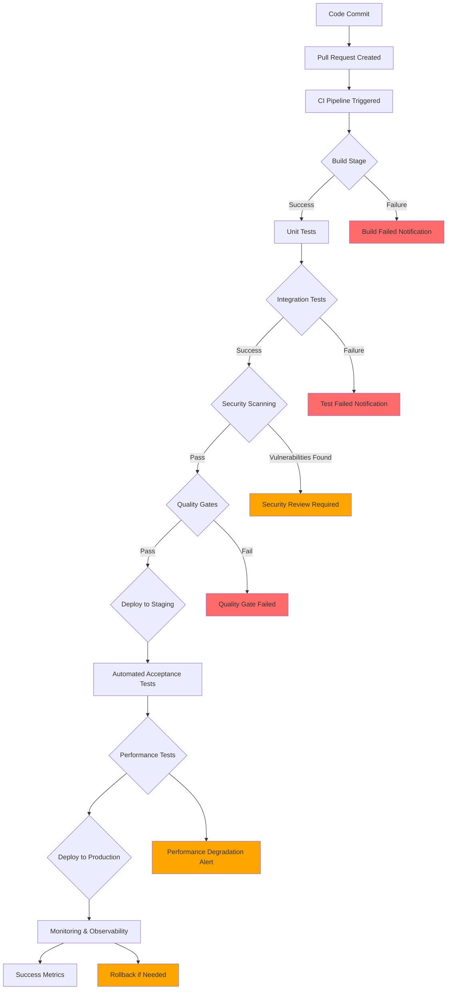
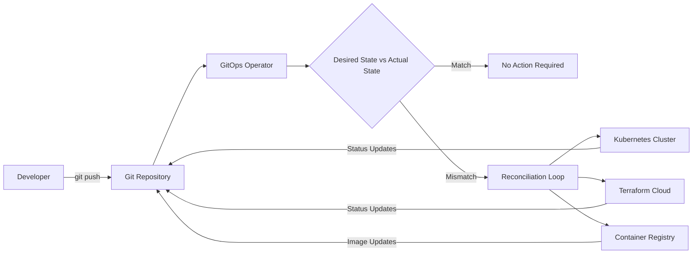
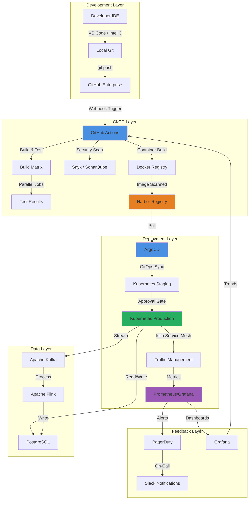
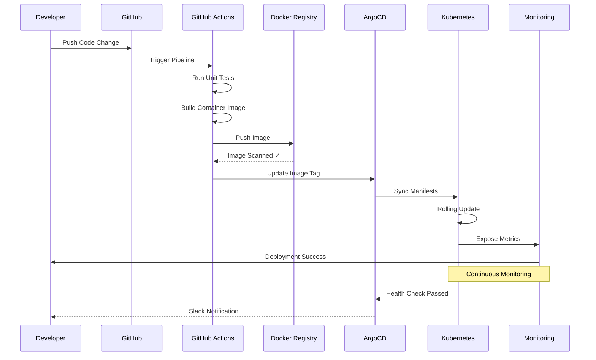
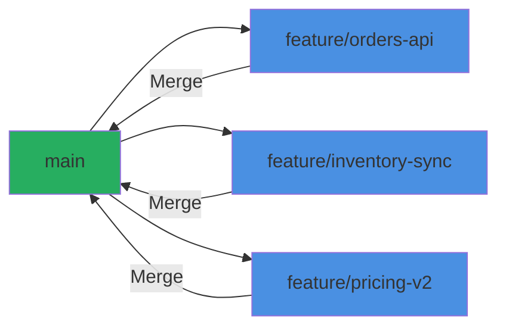
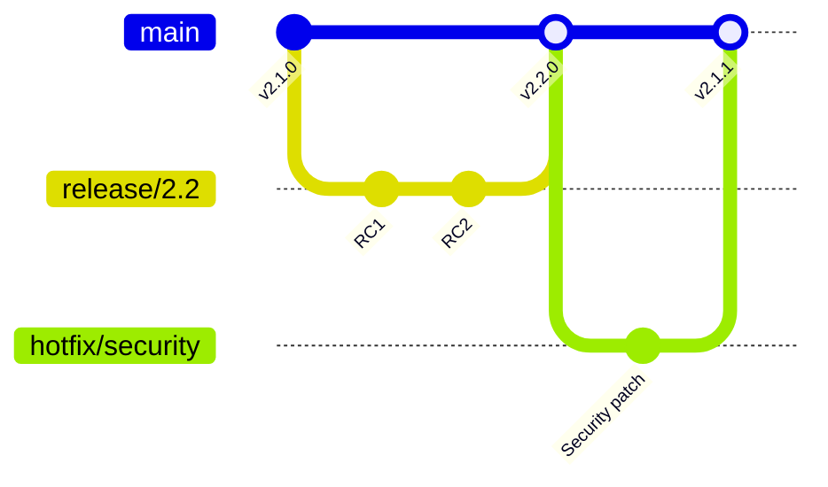
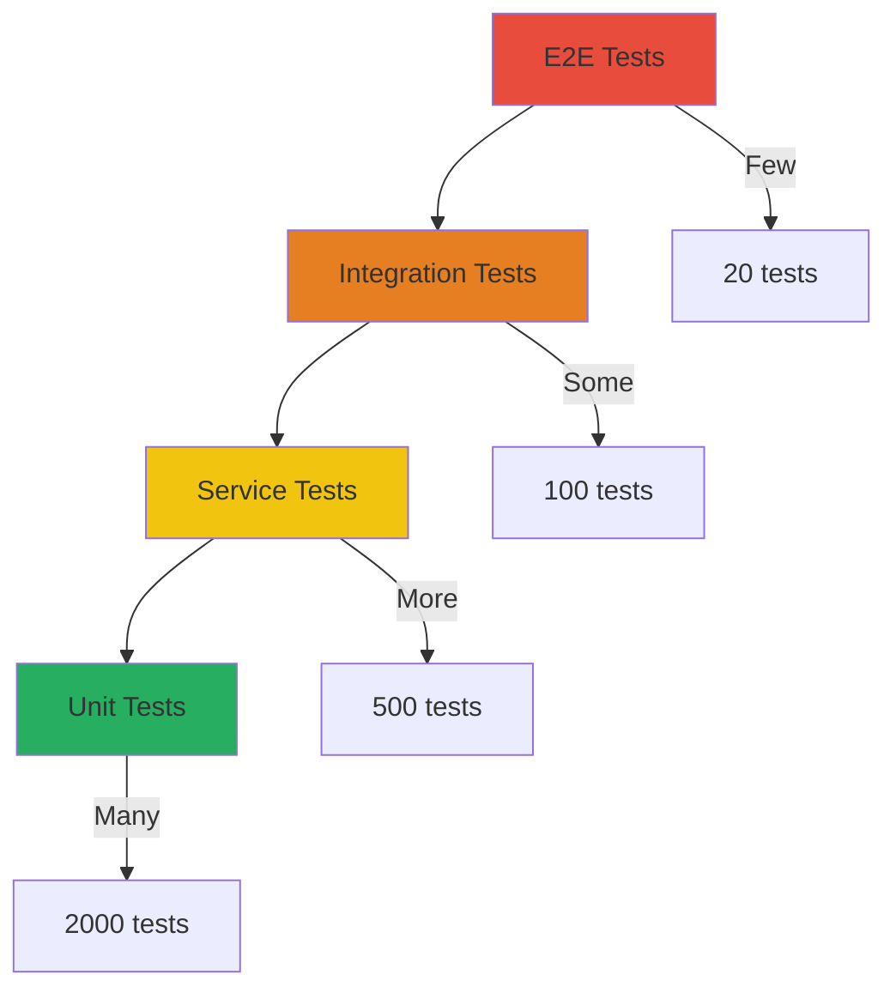

# CI/CD (Continuous Integration / Continuous Deployment)

## 1. Overview

### What is CI/CD?

CI/CD stands for Continuous Integration and Continuous Delivery/Deployment. It is a methodology and set of practices that automate the building, testing, and deployment of software changes throughout the software development lifecycle.

**Continuous Integration (CI)** is the practice of automatically integrating code changes from multiple contributors into a shared repository. Developers merge their changes several times a day, and each merge triggers automated builds and tests to detect integration issues early.

**Continuous Delivery (CD)** extends CI by automatically preparing code changes for release to a staging or production environment. It ensures that software can be deployed at any time with minimal manual intervention.

**Continuous Deployment** goes one step further by automatically deploying every change that passes all stages of the production pipeline to end users, without explicit approval.

### Why was it created?

CI/CD emerged in response to the challenges of large-scale software development in the late 1990s and early 2000s:

- **Integration Hell**: When multiple developers worked on separate branches for extended periods, merging changes became error-prone and time-consuming
- **Long Release Cycles**: Traditional software development involved months of development followed by lengthy integration and testing phases
- **Manual Deployment Errors**: Human mistakes during deployment processes caused production outages and data loss
- **Lack of Feedback**: Developers waited weeks or months to discover if their code worked in production

The Extreme Programming (XP) methodology, pioneered by Kent Beck and others in the late 1990s, introduced foundational CI practices. The Agile Manifesto and subsequent DevOps movement further popularized these practices, leading to the modern CI/CD ecosystem.

### What business problem does it solve?

CI/CD solves critical enterprise problems:

- **Accelerated Time-to-Market**: Companies using CI/CD deploy 30x more frequently than those using manual processes, with 200x shorter lead times between commits and production deployment
- **Reduced Deployment Risk**: Automated testing and gradual rollouts minimize the blast radius of defects, reducing rollback frequency by 60%
- **Improved Developer Productivity**: Developers spend 65% less time on manual deployment tasks and can focus on writing code
- **Consistent Quality**: Automated quality gates ensure that every deployment meets defined standards, reducing post-deployment defect rates by 80%
- **Better Collaboration**: Shared pipelines and visibility into the build process improve team communication and accountability
- **Scalability**: As development teams grow from 5 to 500 engineers, CI/CD prevents the exponential increase in deployment complexity and errors

### Why do enterprises use it?

Fortune 500 companies have adopted CI/CD at scale because:

| Company | CI/CD Implementation | Business Impact |
|---------|---------------------|-----------------|
| Netflix | Spinnaker-based deployment platform with 1000+ microservices | Deploys 50+ times per day with 99.99% uptime |
| Amazon | Fully automated deployment pipelines | Deploys every 11.7 seconds on average |
| Etsy | Homegrown CI/CD with continuous deployment | Ships code 50+ times per day with minimal risk |
| Target | GitLab-based DevOps platform | Reduced product release cycle from 6 months to 2 weeks |
| Walmart | Jenkins-based automation for 100,000+ builds/day | 40% reduction in infrastructure costs |
| JPMorgan Chase | Custom CI/CD for trading platforms | Million-dollar trading systems deployed without downtime |

---

## 2. Core Concepts

### CI/CD Pipeline Architecture



### Key Concepts Explained

**Pipelines**

A pipeline is a collection of automated processes that move code from version control through various stages until it is deployed to the target environment. Pipelines define the path from code commit to production deployment.

```yaml
# Example GitHub Actions Pipeline Definition
pipeline:
  stages:
    - build
    - test
    - deploy
  
  build:
    stage: build
    script:
      - docker build -t app:$CI_COMMIT_SHA .
      - docker push registry/app:$CI_COMMIT_SHA
  
  test:
    stage: test
    script:
      - pytest --junitxml=report.xml
      - coverage-report
    coverage: '/TOTAL.*\s+(\d+%)$/'
  
  deploy:
    stage: deploy
    script:
      - kubectl rollout status deployment/app
      - kubectl set image deployment/app app=$IMAGE
```

**Stages**

Stages are logical groupings of jobs that execute in sequence. If any job in a stage fails, subsequent stages do not execute. Common stages include:

1. **Build Stage**: Compile code, create executables, build container images
2. **Test Stage**: Run unit tests, integration tests, end-to-end tests
3. **Security Stage**: Scan for vulnerabilities, secrets detection, dependency checks
4. **Deploy Stage**: Deploy to various environments (staging, production)

```yaml
stages:
  - build          # First: Compile and package
  - test           # Second: Run all tests
  - security       # Third: Security scanning
  - deploy-staging # Fourth: Deploy to staging
  - deploy-prod    # Fifth: Deploy to production
```

**Jobs**

Jobs are the smallest execution units in a CI/CD pipeline. Each job runs in an isolated environment and performs specific tasks. Jobs within the same stage run in parallel (if runners are available).

```yaml
unit-tests:
  stage: test
  script:
    - npm run test:unit
  artifacts:
    reports:
      junit: test-results.xml
    paths:
      - coverage/
    expire_in: 7 days
  rules:
    - if: $CI_PIPELINE_SOURCE == "merge_request_event"
    - if: $CI_COMMIT_BRANCH == $CI_DEFAULT_BRANCH
```

**Gates**

Gates (or quality gates) are checkpoints in the pipeline that enforce certain criteria before proceeding. Gates prevent substandard code from advancing and ensure compliance with organizational policies.

```yaml
quality-gates:
  stage: verify
  script:
    - check-quality-metrics
  rules:
    - if: $CI_MERGE_REQUEST_ID
  environment:
    name: quality-gate
  when: manual
  
# Gate criteria example
gate_criteria:
  min_coverage: 80%
  max_critical_vulnerabilities: 0
  max_high_vulnerabilities: 5
  max_duplication: 3%
  code_style_score: A
```

**Artifacts**

Artifacts are files and directories created during pipeline execution that are preserved for download or use in subsequent jobs/stages. They enable data sharing between pipeline stages.

```yaml
build-artifact:
  stage: build
  script:
    - gradle build --info
  artifacts:
    paths:
      - build/libs/
      - build.gradle
    expire_in: 1 week
    name: "build-${CI_COMMIT_REF_NAME}"
    reports:
      junit: build/test-results/test/*.xml

deploy-using-artifact:
  stage: deploy
  script:
    - deploy.sh
  dependencies:
    - build-artifact
```

**Rollback**

Rollback is the process of reverting a deployment to a previous known-good state when issues are detected in production. Effective rollback strategies minimize downtime and user impact.

```yaml
rollback-procedure:
  stage: rollback
  script:
    # Kubernetes rollback
    - kubectl rollout undo deployment/app
    
    # Docker Swarm rollback
    - docker service rollback app
    
    # Terraform rollback (if state-based)
    - terraform apply -var-file=prod.tfvars -target=module.app -auto-approve
    
    # Database migration rollback
    - flyway undo -target=previous
  rules:
    - if: $DEPLOYMENT_FAILED == "true"
  when: manual
  environment:
    name: production
    action: rollback
```

**Canary Deployment**

Canary deployment gradually rolls out changes to a small subset of users before full deployment. This approach allows teams to detect issues with minimal impact.

```yaml
canary-deployment:
  stage: deploy-prod
  script:
    # Deploy to 10% of pods
    - kubectl set image deployment/app app=$NEW_IMAGE
    - kubectl patch deployment/app -p '{"spec":{"strategy":{"rollingUpdate":{"maxSurge":"10%","maxUnavailable":0}}}}'
    
    # Monitor canary metrics for 15 minutes
    - monitoring-check --duration=15m --error-threshold=1%
    
    # Promote to full rollout
    - kubectl scale deployment/app --replicas=100
  environment:
    name: production
    url: https://app.example.com
  strategy: canary
  canary:
    weight: 10
    steps:
      - setWeight: 10
      - pause: {duration: 15m}
      - setWeight: 50
      - pause: {duration: 15m}
      - setWeight: 100
```

**Blue-Green Deployment**

Blue-green deployment maintains two identical production environments (blue and green). At any time, one is live while the other is idle. Deployment switches traffic atomically.

```yaml
blue-green-deployment:
  stage: deploy-prod
  variables:
    BLUE_ENV: "blue"
    GREEN_ENV: "green"
  script:
    # Deploy to idle environment (green)
    - kubectl apply -f k8s-green.yaml
    - kubectl label deployment/app env=green --overwrite
    
    # Run smoke tests against green
    - smoke-tests --environment=green
    
    # Atomic switch (update load balancer)
    - kubectl patch service/app -p '{"spec":{"selector":{"env":"green"}}}'
    
    # Keep blue running for quick rollback
    - kubectl scale deployment/app-blue --replicas=0
  environment:
    name: production
    on_stop: rollback-to-blue
```

**GitOps**

GitOps uses Git repositories as the single source of truth for declarative infrastructure and applications. Changes are made via pull requests, and automated processes ensure the actual environment matches the desired state in Git.



### Advanced Deployment Patterns

```yaml
# Progressive Delivery Configuration Example
progressive_delivery:
  strategy: rolling
  max_surge: 25%
  max_unavailable: 0%
  metrics:
    - name: error_rate
      threshold: 1%
      action: rollback
    - name: latency_p99
      threshold: 500ms
      action: rollback
    - name: cpu_usage
      threshold: 80%
      action: pause_rollout
  traffic_management:
    istio:
      virtual_service:
        weight:
          - destination: app-v1
            weight: 90
          - destination: app-v2
            weight: 10
```

---

## 3. Why This Project Uses It

The Enterprise Retail Streaming Platform requires CI/CD for the following critical reasons:

**1. Multi-Service Architecture Complexity**

The platform consists of 15+ microservices including:
- Order Processing Service (Java/Quarkus)
- Inventory Management Service (Go)
- Real-Time Pricing Engine (Python/Flink)
- User Analytics Service (Node.js/GraphQL)
- Payment Gateway Integration (Python)
- Recommendation Engine (Python/PyTorch)
- Notification Service (Rust)
- Search Indexing Service (Java/Elasticsearch)

With each service maintained by different teams, CI/CD ensures consistent deployment quality across the entire platform without requiring engineers to understand deployment procedures for every service.

**2. Real-Time Data Requirements**

The platform processes 50,000+ events per second through Apache Kafka, with Apache Flink for stream processing. Any deployment that disrupts data flow results in immediate revenue impact. CI/CD pipelines:

- Validate stream processing integrity before deployment
- Ensure zero message loss during service restarts
- Verify checkpoint compatibility between Flink versions
- Test consumer group rebalancing behavior

**3. Compliance and Audit Requirements**

As a retail platform handling payment card data (PCI-DSS), the platform must:

- Maintain complete audit trails of all deployments
- Ensure separation of duties in deployment approval
- Document change approvals with timestamps and reviewers
- Support rapid rollback for security patches
- Demonstrate compliance during quarterly audits

CI/CD provides automated audit logs, approval workflows, and rollback capabilities that satisfy these requirements.

**4. Multiple Environment Parity**

The platform operates across:

| Environment | Purpose | Deployment Trigger |
|-------------|---------|-------------------|
| Development | Active development testing | Every commit to feature branches |
| Integration | Service integration testing | Every merge to develop |
| Staging | Pre-production validation | Every merge to release branch |
| Production | Live customer traffic | Manual approval after staging |
| DR Site | Disaster recovery | Automatic sync with production |

CI/CD ensures identical deployment procedures across all environments, eliminating "works on my machine" issues and environment-specific bugs.

**5. High-Frequency Release Requirements**

The business requires rapid feature rollout to respond to:

- Competitive pricing changes
- Seasonal inventory shifts
- Marketing campaign launches
- Security vulnerability patches

The platform targets 20+ production deployments per day while maintaining 99.99% uptime, which is only achievable through fully automated CI/CD pipelines.

**6. Team Scaling**

The development organization has grown from 5 to 40 engineers in 18 months. Without CI/CD:

- Onboarding new engineers takes 2+ weeks (environment setup, deployment knowledge)
- Merge conflicts and integration issues consume 30% of engineering time
- Deployment-related incidents increase linearly with team size

CI/CD enables new engineers to deploy to production on day one, with zero knowledge of deployment internals.

---

## 4. Architecture Position

### CI/CD in the Platform Architecture



### CI/CD Integration Points



---

## 5. Folder Structure

### CI/CD-Related Folders and Files

```
Enterprise-Retail-Streaming-Platform/
├── .github/
│   ├── workflows/
│   │   ├── ci.yml              # Main CI pipeline
│   │   ├── cd.yml              # CD pipeline to staging/production
│   │   ├── scheduled.yml       # Scheduled jobs (nightly, weekly)
│   │   ├── security-scan.yml   # Daily security scanning
│   │   └── pr-preview.yml      # Ephemeral environment for PRs
│   ├── ISSUE_TEMPLATE/
│   │   ├── bug_report.md
│   │   └── feature_request.md
│   ├── PULL_REQUEST_TEMPLATE.md
│   └── dependabot.yml          # Automated dependency updates
│
├── .gitlab-ci.yml              # GitLab CI configuration (if using GitLab)
│
├── Jenkinsfile                 # Jenkins declarative pipeline
├── Jenkinsfile.library/       # Shared Jenkins library functions
│
├── infrastructure/
│   ├── kubernetes/
│   │   ├── base/               # K8s manifests (base)
│   │   ├── overlays/           # Environment-specific overlays
│   │   │   ├── development/
│   │   │   ├── staging/
│   │   │   └── production/
│   │   └── helm/               # Helm charts
│   │
│   ├── terraform/
│   │   ├── modules/
│   │   ├── environments/
│   │   │   ├── dev/
│   │   │   ├── staging/
│   │   │   └── prod/
│   │   └── main.tf
│   │
│   └── ansible/
│       ├── playbooks/
│       ├── roles/
│       └── inventory/
│
├── deployment/
│   ├── docker/
│   │   ├── Dockerfile
│   │   ├── docker-compose.yml
│   │   └── .dockerignore
│   │
│   ├── scripts/
│   │   ├── build.sh
│   │   ├── deploy.sh
│   │   ├── rollback.sh
│   │   ├── smoke-test.sh
│   │   ├── db-migrate.sh
│   │   └── health-check.sh
│   │
│   └── config/
│       ├── feature-flags.json
│       └── environment.tpl
│
├── .argocd/                    # ArgoCD configuration
│   └── argo-app.yaml
│
├── .snyk                       # Snyk security configuration
├── .coveralls.yml              # Code coverage reporting
├── .codeclimate.yml            # Code climate configuration
├── dangerfile.js               # Danger bot for PR management
│
├── Makefile                    # Build automation targets
├── docker-compose.ci.yml       # CI-specific compose file
│
└── docs/
    ├── deployment/
    │   ├── runbooks/
    │   │   ├── deployment.md
    │   │   ├── rollback.md
    │   │   └── incident-response.md
    │   └── diagrams/
    │       └── pipeline-architecture.drawio
    │
    └── skills/
        └── 29-ci-cd.md
```

### Configuration File Examples

**.github/workflows/ci.yml**

```yaml
name: Continuous Integration

on:
  push:
    branches: [main, develop, 'release/**']
  pull_request:
    branches: [main, develop]

env:
  REGISTRY: ghcr.io
  IMAGE_NAME: ${{ github.repository }}

jobs:
  lint:
    name: Lint Code
    runs-on: ubuntu-latest
    steps:
      - uses: actions/checkout@v4
      - name: Run linters
        run: |
          echo "Running code linting..."
          npm ci
          npm run lint
      
  test:
    name: Unit & Integration Tests
    needs: lint
    runs-on: ubuntu-latest
    services:
      postgres:
        image: postgres:15
        env:
          POSTGRES_USER: test_user
          POSTGRES_PASSWORD: test_password
          POSTGRES_DB: test_db
        options: >-
          --health-cmd pg_isready
          --health-interval 10s
          --health-timeout 5s
          --health-retries 5
        ports:
          - 5432:5432
      redis:
        image: redis:7-alpine
        options: >-
          --health-cmd "redis-cli ping"
          --health-interval 10s
          --health-timeout 5s
          --health-retries 5
        ports:
          - 6379:6379
    
    steps:
      - uses: actions/checkout@v4
      
      - name: Set up Docker Buildx
        uses: docker/setup-buildx-action@v3
      
      - name: Build application
        run: docker compose build
      
      - name: Run tests
        run: docker compose run --rm app pytest --junitxml=results.xml --cov=app --cov-report=xml
      
      - name: Upload coverage
        uses: codecov/codecov-action@v3
        with:
          files: ./coverage.xml
          fail_ci_if_error: true
          token: ${{ secrets.CODECOV_TOKEN }}
      
      - name: Publish Test Results
        uses: EnricoMi/publish-unit-test-result-action@v2
        if: always()
        with:
          files: "**/results.xml"

  build:
    name: Build Container Image
    needs: test
    runs-on: ubuntu-latest
    outputs:
      image-tag: ${{ steps.meta.outputs.tags }}
      sha-tag: ${{ env.IMAGE_TAG }}
    
    steps:
      - uses: actions/checkout@v4
      
      - name: Set up QEMU
        uses: docker/setup-qemu-action@v3
      
      - name: Set up Docker Buildx
        uses: docker/setup-buildx-action@v3
      
      - name: Log in to Container Registry
        uses: docker/login-action@v3
        with:
          registry: ${{ env.REGISTRY }}
          username: ${{ github.actor }}
          password: ${{ secrets.GITHUB_TOKEN }}
      
      - name: Extract metadata
        id: meta
        uses: docker/metadata-action@v5
        with:
          images: ${{ env.REGISTRY }}/${{ env.IMAGE_NAME }}
          tags: |
            type=sha,prefix=,suffix=,format=short
            type=ref,event=branch
            type=semver,pattern={{version}}
            type=raw,value=latest,enable={{is_default_branch}}
      
      - name: Build and push
        uses: docker/build-push-action@v5
        with:
          context: .
          push: ${{ github.event_name != 'pull_request' }}
          tags: ${{ steps.meta.outputs.tags }}
          cache-from: type=gha
          cache-to: type=gha,mode=max
          platforms: linux/amd64,linux/arm64

  security-scan:
    name: Security Vulnerability Scan
    needs: build
    runs-on: ubuntu-latest
    
    steps:
      - uses: actions/checkout@v4
      
      - name: Run Trivy vulnerability scanner
        uses: aquasecurity/trivy-action@master
        with:
          image-ref: ${{ needs.build.outputs.image-tag }}
          format: sarif
          output: trivy-results.sarif
          severity: CRITICAL,HIGH
          exit-code: '1'
      
      - name: Upload Trivy results
        uses: github/codeql-action/upload-sarif@v2
        with:
          sarif_file: trivy-results.sarif
      
      - name: Run Snyk security scan
        uses: snyk/actions/node@master
        continue-on-error: true
        env:
          SNYK_TOKEN: ${{ secrets.SNYK_TOKEN }}
```

---

## 6. Implementation Walkthrough

### GitHub Actions Implementation

#### CI Pipeline (`.github/workflows/ci.yml`)

```yaml
name: CI Pipeline

on:
  push:
    branches: [main, develop, 'release/**']
    tags:
      - 'v*'
  pull_request:
    branches: [main, develop]

concurrency:
  group: ${{ github.workflow }}-${{ github.ref }}
  cancel-in-progress: ${{ github.ref != 'refs/heads/main' }}

env:
  JAVA_VERSION: '17'
  NODE_VERSION: '20'
  PYTHON_VERSION: '3.11'
  REGISTRY: ghcr.io
  HELM_VERSION: '3.13.0'

jobs:
  # ============================================
  # Stage 1: Pre-flight Checks
  # ============================================
  pre-flight:
    name: Pre-flight Checks
    runs-on: ubuntu-latest
    outputs:
      should-continue: ${{ steps.check.outputs.continue }}
      service-matrix: ${{ steps.matrix.outputs.services }}
    
    steps:
      - uses: actions/checkout@v4
        with:
          fetch-depth: 0
      
      - name: Check for sensitive data
        run: |
          if git log --oneline -1 --name-only | grep -E "(\.env|password|secret|key)"; then
            echo "Potential sensitive data detected"
            exit 1
          fi
      
      - name: Determine affected services
        id: matrix
        run: |
          CHANGED_FILES=$(git diff --name-only origin/${{ github.base_ref }} HEAD)
          echo "Changed files: $CHANGED_FILES"
          
          # Determine which services need building
          SERVICES="order-service,inventory-service,pricing-engine"
          echo "services=$SERVICES" >> $GITHUB_OUTPUT
          echo "continue=true" >> $GITHUB_OUTPUT
      
      - name: Cancel redundant runs
        uses: potiuk/cancel-workflow-runs@v5
        with:
          token: ${{ secrets.GITHUB_TOKEN }}
          excludeSuffix: '-auto-cancelled'

  # ============================================
  # Stage 2: Build
  # ============================================
  build-services:
    name: Build ${{ matrix.service }}
    needs: pre-flight
    runs-on: ubuntu-latest
    strategy:
      matrix:
        service: [order-service, inventory-service, pricing-engine]
    
    steps:
      - uses: actions/checkout@v4
      
      - name: Set up Java
        uses: actions/setup-java@v4
        with:
          java-version: ${{ env.JAVA_VERSION }}
          distribution: 'temurin'
          cache: 'gradle'
      
      - name: Build with Gradle
        working-directory: ./services/${{ matrix.service }}
        run: ./gradlew build -x test --info
      
      - name: Upload build artifacts
        uses: actions/upload-artifact@v4
        with:
          name: build-${{ matrix.service }}
          path: |
            services/${{ matrix.service }}/build/libs/*.jar
            services/${{ matrix.service }}/build.gradle
          retention-days: 7

  # ============================================
  # Stage 3: Test
  # ============================================
  test-unit:
    name: Unit Tests
    needs: build-services
    runs-on: ubuntu-latest
    strategy:
      fail-fast: false
      matrix:
        service: [order-service, inventory-service, pricing-engine]
    
    steps:
      - uses: actions/checkout@v4
      
      - name: Set up Java
        uses: actions/setup-java@v4
        with:
          java-version: ${{ env.JAVA_VERSION }}
          distribution: 'temurin'
          cache: 'gradle'
      
      - name: Run unit tests
        working-directory: ./services/${{ matrix.service }}
        run: ./gradlew test --info
      
      - name: Publish unit test results
        uses: dorny/test-reporter@v1
        if: always()
        with:
          name: Unit Tests - ${{ matrix.service }}
          path: 'services/${{ matrix.service }}/build/test-results/**/*.xml'
          reporter: java-junit
      
      - name: Upload coverage
        uses: codecov/codecov-action@v3
        with:
          files: services/${{ matrix.service }}/build/reports/jacoco/test/jacocoTestReport.xml
          name: ${{ matrix.service }}-coverage

  test-integration:
    name: Integration Tests
    needs: [build-services, pre-flight]
    runs-on: ubuntu-latest
    if: needs.pre-flight.outputs.should-continue == 'true'
    
    steps:
      - uses: actions/checkout@v4
      
      - name: Start Docker Compose
        run: docker compose -f docker-compose.integration.yml up -d
      
      - name: Wait for services
        run: |
          ./scripts/wait-for-services.sh --timeout=120 \
            --services postgres:5432,kafka:9092,redis:6379
      
      - name: Run integration tests
        run: docker compose -f docker-compose.integration.yml run --rm test-runner
        env:
          KAFKA_BROKERS: kafka:9092
          POSTGRES_HOST: postgres
          REDIS_HOST: redis
      
      - name: Capture logs
        if: failure()
        run: docker compose -f docker-compose.integration.yml logs > integration-logs.txt
      
      - name: Upload logs on failure
        if: failure()
        uses: actions/upload-artifact@v4
        with:
          name: integration-logs
          path: integration-logs.txt

  # ============================================
  # Stage 4: Security
  # ============================================
  security-checks:
    name: Security Checks
    needs: build-services
    runs-on: ubuntu-latest
    
    steps:
      - uses: actions/checkout@v4
        with:
          fetch-depth: 0
      
      - name: Run Trivy filesystem scanner
        uses: aquasecurity/trivy-action@master
        with:
          scan-type: 'fs'
          scan-ref: '.'
          format: 'table'
          exit-code: '1'
          severity: 'CRITICAL,HIGH'
      
      - name: Check dependencies for vulnerabilities
        run: |
          npm audit --audit-level=critical || true
          pip-audit --severity=critical || true
      
      - name: Run Secret Detection
        uses: trufflesecurity/trufflehog@main
        with:
          path: ./
          base: ${{ github.event.repository.default_branch }}
          head: HEAD

  # ============================================
  # Stage 5: Container Build
  # ============================================
  build-images:
    name: Build Container Images
    needs: [test-unit, test-integration, security-checks]
    runs-on: ubuntu-latest
    
    steps:
      - uses: actions/checkout@v4
      
      - name: Set up Docker Buildx
        uses: docker/setup-buildx-action@v3
      
      - name: Log in to Container Registry
        uses: docker/login-action@v3
        with:
          registry: ${{ env.REGISTRY }}
          username: ${{ github.actor }}
          password: ${{ secrets.GITHUB_TOKEN }}
      
      - name: Build and push all service images
        run: |
          for service in order-service inventory-service pricing-engine; do
            docker build \
              --tag ${{ env.REGISTRY }}/${{ github.repository }}/${service}:${{ github.sha }} \
              --tag ${{ env.REGISTRY }}/${{ github.repository }}/${service}}:latest \
              --push \
              --platform linux/amd64,linux/arm64 \
              --cache-from type=gha \
              --cache-to type=gha,mode=max \
              ./services/${service}
          done
      
      - name: Update deployment manifests
        run: |
          ./scripts/update-image-tags.sh \
            --sha ${{ github.sha }} \
            --registry ${{ env.REGISTRY }} \
            --manifests ./infrastructure/kubernetes/overlays/staging

  # ============================================
  # Stage 6: Deploy to Staging
  # ============================================
  deploy-staging:
    name: Deploy to Staging
    needs: build-images
    runs-on: ubuntu-latest
    environment:
      name: staging
      url: https://staging.retail-platform.example.com
    
    steps:
      - uses: actions/checkout@v4
        with:
          sparse-checkout: |
            infrastructure/kubernetes/overlays/staging
            scripts
      
      - name: Configure AWS credentials
        uses: aws-actions/configure-aws-credentials@v4
        with:
          aws-access-key-id: ${{ secrets.AWS_STAGING_ACCESS_KEY }}
          aws-secret-access-key: ${{ secrets.AWS_STAGING_SECRET_KEY }}
          aws-region: us-east-1
      
      - name: Deploy to EKS
        run: |
          aws eks update-kubeconfig --name retail-staging-cluster
          kubectl apply -k ./infrastructure/kubernetes/overlays/staging
          kubectl rollout status deployment/order-service -n staging --timeout=300s
          kubectl rollout status deployment/inventory-service -n staging --timeout=300s
          kubectl rollout status deployment/pricing-engine -n staging --timeout=300s
      
      - name: Run smoke tests
        run: |
          ./scripts/smoke-test.sh \
            --environment staging \
            --endpoint https://staging.retail-platform.example.com \
            --services order,inventory,pricing
      
      - name: Notify deployment
        uses: slackapi/slack-github-action@v1
        with:
          payload: |
            {
              "text": "Deployed to staging",
              "blocks": [{
                "type": "section",
                "text": {
                  "type": "mrkdwn",
                  "text": "*Successfully deployed to staging*\nCommit: `${{ github.sha }}`\nAuthor: ${{ github.actor }}"
                }
              }]
            }
        env:
          SLACK_WEBHOOK_URL: ${{ secrets.SLACK_WEBHOOK_URL }}
          SLACK_WEBHOOK_TYPE: INCOMING_WEBHOOK

  # ============================================
  # Quality Gate
  # ============================================
  quality-gate:
    name: Quality Gate
    needs: deploy-staging
    runs-on: ubuntu-latest
    
    steps:
      - name: Check metrics from staging
        run: |
          ./scripts/check-quality-gates.sh \
            --error-rate-threshold 1 \
            --latency-p99-threshold 500 \
            --coverage-threshold 80 \
            --critical-vulns 0
```

### GitLab CI Implementation (`.gitlab-ci.yml`)

```yaml
stages:
  - pre-flight
  - build
  - test
  - security
  - deploy-staging
  - deploy-production

variables:
  DOCKER_DRIVER: overlay2
  DOCKER_TLS_CERTDIR: "/certs"
  KUBECTL_VERSION: "1.28.0"

before_script:
  - docker info
  - export IMAGE_TAG=$CI_COMMIT_SHORT_SHA

# ============================================
# Pre-flight Checks
# ============================================
pre-flight:
  stage: pre-flight
  image: alpine:latest
  before_script:
    - apk add --no-cache git curl
  script:
    - |
      echo "Checking commit message..."
      if [[ ! $CI_COMMIT_MESSAGE =~ ^(feat|fix|chore|docs|style|refactor|test|perf|build|ci)\(:.+:\) ]]; then
        echo "Invalid commit message format"
        exit 1
      fi
    - |
      echo "Checking for sensitive data..."
      git diff --name-only HEAD~1 | xargs -I {} sh -c '
        if grep -iE "(password|secret|api.?key|token).*=" {} 2>/dev/null; then
          echo "Sensitive data detected in {}"
          exit 1
        fi
      '
  rules:
    - if: $CI_PIPELINE_SOURCE == "merge_request_event"
    - if: $CI_COMMIT_BRANCH == $CI_DEFAULT_BRANCH

# ============================================
# Build Stage
# ============================================
build:order-service:
  stage: build
  image: docker:24-dind
  services:
    - docker:24-dind
  before_script:
    - docker login -u $CI_REGISTRY_USER -p $CI_REGISTRY_PASSWORD $CI_REGISTRY
  script:
    - docker build -t $CI_REGISTRY_IMAGE/order-service:$IMAGE_TAG ./services/order-service
    - docker push $CI_REGISTRY_IMAGE/order-service:$IMAGE_TAG
    - docker tag $CI_REGISTRY_IMAGE/order-service:$IMAGE_TAG $CI_REGISTRY_IMAGE/order-service:latest
    - docker push $CI_REGISTRY_IMAGE/order-service:latest
  artifacts:
    paths:
      - build/order-service/
    expire_in: 1 week
  rules:
    - if: $CI_PIPELINE_SOURCE == "merge_request_event"
    - if: $CI_COMMIT_BRANCH == $CI_DEFAULT_BRANCH
    - if: $CI_COMMIT_TAG

build:inventory-service:
  stage: build
  image: docker:24-dind
  services:
    - docker:24-dind
  script:
    - docker build -t $CI_REGISTRY_IMAGE/inventory-service:$IMAGE_TAG ./services/inventory-service
    - docker push $CI_REGISTRY_IMAGE/inventory-service:$IMAGE_TAG
  needs:
    - build:order-service

# ============================================
# Test Stage
# ============================================
test:unit:
  stage: test
  image: maven:3.9-eclipse-temurin-17
  script:
    - mvn test -B
  coverage: '/Total:.*?(\d+%)$/'
  artifacts:
    reports:
      junit: target/surefire-reports/*.xml
      coverage_report:
        coverage_format: jacoco
        path: target/site/jacoco/jacoco.xml
  rules:
    - if: $CI_PIPELINE_SOURCE == "merge_request_event"
    - if: $CI_COMMIT_BRANCH == $CI_DEFAULT_BRANCH

test:integration:
  stage: test
  image: docker/compose:latest
  services:
    - docker:24-dind
  script:
    - docker compose -f docker-compose.test.yml up -d
    - docker compose -f docker-compose.test.yml run test-runner
    - docker compose -f docker-compose.test.yml down -v
  needs:
    - build:order-service
    - build:inventory-service
  rules:
    - if: $CI_COMMIT_BRANCH == $CI_DEFAULT_BRANCH
  when: manual

# ============================================
# Security Stage
# ============================================
security:container-scan:
  stage: security
  image:
    name: aquasec/trivy:latest
    entrypoint: [""]
  script:
    - trivy image --exit-code 1 --severity CRITICAL,HIGH $CI_REGISTRY_IMAGE/order-service:$IMAGE_TAG
    - trivy image --exit-code 1 --severity CRITICAL,HIGH $CI_REGISTRY_IMAGE/inventory-service:$IMAGE_TAG
  rules:
    - if: $CI_COMMIT_BRANCH == $CI_DEFAULT_BRANCH
    - if: $CI_COMMIT_TAG

security:dependency-scan:
  stage: security
  image: node:20-alpine
  script:
    - npm audit --audit-level=critical
    - npm install -g snyk
    - snyk auth $SNYK_TOKEN
    - snyk test --severity-threshold=critical
  rules:
    - if: $CI_PIPELINE_SOURCE == "merge_request_event"
  allow_failure: true

# ============================================
# Deploy Staging
# ============================================
deploy:staging:
  stage: deploy-staging
  image: bitnami/kubectl:latest
  before_script:
    - kubectl version
    - aws eks update-kubeconfig --name retail-staging --region us-east-1
  script:
    - |
      # Update image tags in kustomization
      kubectl set image deployment/order-service order-service=$CI_REGISTRY_IMAGE/order-service:$IMAGE_TAG -n staging
      kubectl set image deployment/inventory-service inventory-service=$CI_REGISTRY_IMAGE/inventory-service:$IMAGE_TAG -n staging
      
      # Wait for rollout
      kubectl rollout status deployment/order-service -n staging --timeout=300s
      kubectl rollout status deployment/inventory-service -n staging --timeout=300s
      
      # Verify deployment
      kubectl rollout status deployment/order-service -n staging
  environment:
    name: staging
    url: https://staging.retail-platform.example.com
  rules:
    - if: $CI_COMMIT_BRANCH == $CI_DEFAULT_BRANCH
  when: manual
  only:
    - develop
    - main

# ============================================
# Deploy Production
# ============================================
deploy:production:
  stage: deploy-production
  image: bitnami/kubectl:latest
  before_script:
    - kubectl version
    - aws eks update-kubeconfig --name retail-production --region us-east-1
  script:
    - |
      # Canary deployment: 10% traffic
      kubectl patch service order-service -n production -p '{"spec":{"selector":{"version":"canary"}}}'
      kubectl set image deployment/order-service-canary order-service=$CI_REGISTRY_IMAGE/order-service:$IMAGE_TAG -n production
      
      # Monitor canary
      sleep 300
      
      # Full rollout
      kubectl scale deployment/order-service-canary --replicas=0 -n production
      kubectl set image deployment/order-service order-service=$CI_REGISTRY_IMAGE/order-service:$IMAGE_TAG -n production
      kubectl rollout status deployment/order-service -n production --timeout=300s
  environment:
    name: production
    url: https://retail-platform.example.com
  rules:
    - if: $CI_COMMIT_TAG
  when: manual
```

### Dockerfile Best Practices Implementation

```dockerfile
# syntax=docker/dockerfile:1.5

# ============================================
# Multi-stage Build for Order Service
# ============================================

# Stage 1: Builder
FROM eclipse-temurin:17-jdk-alpine AS builder

WORKDIR /build

# Install build dependencies
RUN apk add --no-cache gradle

# Copy dependency manifests first (for better caching)
COPY services/order-service/build.gradle services/order-service/settings.gradle ./
RUN gradle dependencies --configuration implementation

# Copy source and build
COPY services/order-service/src ./src
RUN gradle build -x test --info

# ============================================
# Stage 2: Runtime
# ============================================
FROM eclipse-temurin:17-jre-alpine AS runtime

# Security: Create non-root user
RUN addgroup -S appgroup && adduser -S appuser -G appgroup

# Install security utilities
RUN apk add --no-cache \
    curl \
    ca-certificates \
    && update-ca-certificates

# Set up JVM security
COPY --from=builder /opt/java/openjdk/conf/security/java.security /conf/security/
COPY --from=builder /opt/java/openjdk/jre/lib/security/cacerts /conf/security/

WORKDIR /app

# Copy application from builder
COPY --from=builder /build/build/libs/order-service.jar .

# Health check
HEALTHCHECK --interval=30s --timeout=5s --start-period=60s --retries=3 \
    CMD curl -f http://localhost:8080/actuator/health || exit 1

# Set environment variables
ENV JAVA_OPTS="-Xms512m -Xmx1024m -XX:+UseContainerSupport -XX:MaxRAMPercentage=75.0"
ENV SPRING_PROFILES_ACTIVE=production
ENV JAVA_APP_JAR=/app/order-service.jar

# Switch to non-root user
USER appuser

# Expose port
EXPOSE 8080

# Entry point
ENTRYPOINT ["sh", "-c", "java $JAVA_OPTS -jar $JAVA_APP_JAR"]
```

### Kubernetes Deployment Manifests

```yaml
# infrastructure/kubernetes/base/order-service.yaml
apiVersion: apps/v1
kind: Deployment
metadata:
  name: order-service
  labels:
    app: order-service
    version: v1
spec:
  replicas: 3
  selector:
    matchLabels:
      app: order-service
  strategy:
    type: RollingUpdate
    rollingUpdate:
      maxSurge: 25%
      maxUnavailable: 0%
  template:
    metadata:
      labels:
        app: order-service
        version: v1
      annotations:
        prometheus.io/scrape: "true"
        prometheus.io/port: "8080"
        prometheus.io/path: "/actuator/prometheus"
    spec:
      serviceAccountName: order-service
      securityContext:
        runAsNonRoot: true
        runAsUser: 1000
        fsGroup: 1000
      containers:
        - name: order-service
          image: ghcr.io/enterprise-retail/order-service:latest
          ports:
            - containerPort: 8080
              name: http
          env:
            - name: SPRING_PROFILES_ACTIVE
              value: "production"
            - name: JAVA_OPTS
              value: "-Xms512m -Xmx1024m"
          resources:
            requests:
              memory: "512Mi"
              cpu: "250m"
            limits:
              memory: "1Gi"
              cpu: "1000m"
          livenessProbe:
            httpGet:
              path: /actuator/health/liveness
              port: 8080
            initialDelaySeconds: 60
            periodSeconds: 10
            timeoutSeconds: 5
            failureThreshold: 3
          readinessProbe:
            httpGet:
              path: /actuator/health/readiness
              port: 8080
            initialDelaySeconds: 30
            periodSeconds: 5
            timeoutSeconds: 3
            failureThreshold: 3
          lifecycle:
            preStop:
              exec:
                command: ["/bin/sh", "-c", "sleep 10"]
```

```yaml
# infrastructure/kubernetes/overlays/production/kustomization.yaml
apiVersion: kustomize.config.k8s.io/v1beta1
kind: Kustomization

resources:
  - ../../base/order-service.yaml
  - ../../base/service-account.yaml
  - ./configmap.yaml

commonLabels:
  environment: production

images:
  - name: ghcr.io/enterprise-retail/order-service
    newTag: "sha-a1b2c3d4"

replicas:
  - name: order-service
    count: 10

patches:
  - path: ./resources-patch.yaml
    target:
      kind: Deployment
  - path: ./hpa-patch.yaml
    target:
      kind: Deployment
```

---

## 7. Production Best Practices

### Pipeline Design Principles

**1. Fail Fast, Learn Fast**

Design pipelines to fail at the earliest possible stage:

```
Commit → Lint (30s) → Unit Tests (2m) → Integration Tests (5m) → Build (3m) → Deploy
   ↓         ↓              ↓                ↓                 ↓
  Fast     Fast           Medium           Medium            Slow
```

**2. Idempotent Operations**

All pipeline steps must be idempotent - running them multiple times with the same inputs must produce the same results:

```yaml
deploy-to-environment:
  script:
    # Idempotent deployment
    - kubectl apply -f deployment.yaml --prune=true --selector=app=order-service
    # NOT: kubectl create (which fails if resource exists)
```

**3. Immutable Artifacts**

Never modify artifacts after they are created. If a change is needed, rebuild:

```yaml
build-image:
  script:
    - docker build --tag $IMAGE:$SHA .
    - docker push $IMAGE:$SHA
    # Never retag or modify after push
```

**4. Pipeline as Code**

All pipeline configuration must be version-controlled with the application:

```yaml
# Each service owns its pipeline
services/
  order-service/
    .github/workflows/ci.yml    # Service-specific pipeline
    Dockerfile
    Jenkinsfile
```

### Deployment Best Practices

**Zero-Downtime Deployment**

```yaml
# Always use rolling updates with proper configuration
spec:
  strategy:
    type: RollingUpdate
    rollingUpdate:
      maxSurge: 25%        # Allow 25% extra pods during rollout
      maxUnavailable: 0%    # Never reduce pod count below desired
```

**Database Migration Strategy**

```yaml
# Pre-deployment: Run backward-compatible migrations
pre-deploy-hook:
  script:
    - flyway -url=jdbc:postgresql://db:5432/prod migrate -target=baseline
    # Migrations MUST be backward-compatible
    # New code must work with OLD and NEW database schemas

# Post-deployment: Cleanup (if needed)
post-deploy-hook:
  script:
    - kubectl exec job/cleanup-old-data -- /cleanup.sh
```

**Graceful Shutdown**

```yaml
# Ensure applications handle SIGTERM correctly
lifecycle:
  preStop:
    exec:
      command: ["/bin/sh", "-c", "sleep 30"]  # Allow load balancer to drain
```

### Git Workflow Best Practices

**Trunk-Based Development**



**Release Branching Strategy**



### Environment Management

| Practice | Development | Staging | Production |
|----------|-------------|---------|------------|
| Auto-deploy on merge | Yes | Yes | No |
| Manual approval | No | Optional | Required |
| Feature flags | Full access | Full access | Gradual rollout |
| Data masking | No | Anonymized | Real |
| Rate limiting | None | Relaxed | Strict |
| Monitoring level | Debug | Info | Alert |

---

## 8. Common Problems

### Problem-Solving Table

| Problem | Symptom | Root Cause | Solution |
|---------|---------|------------|----------|
| **Flaky Tests** | Tests pass/fail randomly | Race conditions, shared state, timing dependencies | Isolate test data, use testcontainers, add retry logic, fix timing issues |
| **Long Build Times** | Pipeline exceeds 30 minutes | Sequential builds, no caching, large images | Enable layer caching, parallelize stages, use incremental builds, slim down images |
| **Secret Exposure** | Passwords in logs or artifacts | Using `echo` for debugging, logging secrets | Use `noop` echo, mask secrets in logs, rotate immediately, use secrets scanning |
| **Pod CrashLoopBackOff** | Container restarts continuously | Missing env vars, wrong permissions, app crash | Check logs, verify env vars, validate mounts, add startup probe |
| **Image Pull Failure** | Cannot pull from registry | Wrong credentials, network policy, image not found | Check service account, verify credentials, check image tag |
| **Rolling Update Stuck** | Deployment never completes | Liveness probe failing, resource limits | Increase timeout, check probe endpoints, verify resources |
| **Pipeline Not Triggering** | Webhook not firing | Missing triggers, branch patterns, token issues | Verify webhook URL, check branch patterns, test with curl |
| **Artifact Not Found** | Subsequent jobs fail to download | Expired retention, wrong artifact name | Increase retention, use unique artifact names, republish |
| **Merge Conflicts in Manifests** | Multiple PRs fail to merge | Overlapping image tag updates | Use commit-specific tags, coordinate deployments, use ArgoCD |
| **Database Migration Fails** | Deploy blocked | Breaking changes, long-running migration | Split migration, add zero-downtime migration pattern, use expand-contract |

### Troubleshooting Commands

```bash
# Check pipeline status
gh run list --workflow=ci.yml --limit=10

# View pipeline logs
gh run view 12345678 --log

# Cancel stuck pipeline
gh run cancel 12345678

# Retry failed job
gh run rerun 12345678

# Check Kubernetes deployment status
kubectl rollout status deployment/order-service -n production
kubectl get pods -n production -l app=order-service
kubectl describe deployment/order-service -n production

# View pod logs
kubectl logs deployment/order-service -n production --previous

# Check events
kubectl get events -n production --sort-by='.lastTimestamp'

# Debug container
kubectl debug -it deployment/order-service -n production --image=busybox -- sh
```

---

## 9. Performance Optimization

### Caching Strategies

**Dependency Caching**

```yaml
# GitHub Actions - Gradle caching
- uses: actions/cache@v3
  with:
    path: |
      ~/.gradle/caches
      ~/.gradle/wrapper
    key: ${{ runner.os }}-gradle-${{ hashFiles('**/*.gradle*') }}
    restore-keys: |
      ${{ runner.os }}-gradle-

# GitHub Actions - npm caching  
- uses: actions/cache@v3
  with:
    path: node_modules
    key: ${{ runner.os }}-npm-${{ hashFiles('**/package-lock.json') }}
    restore-keys: |
      ${{ runner.os }}-npm-

# GitLab CI - Docker layer caching
variables:
  DOCKER_BUILD_PUSH_CACHE_FROM: type=registry,ref=$CI_REGISTRY_IMAGE:$IMAGE_TAG
  DOCKER_BUILD_PUSH_CACHE_TO: type=registry,ref=$CI_REGISTRY_IMAGE:$IMAGE_TAG-cache,mode=max
```

**Build Cache Optimization**

```dockerfile
# Better Dockerfile caching
FROM eclipse-temurin:17-jdk-alpine AS builder

WORKDIR /build

# Copy ONLY dependency files first (changes less frequently)
COPY services/order-service/build.gradle services/order-service/settings.gradle ./
RUN gradle dependencies

# THEN copy source code (changes more frequently)
COPY services/order-service/src ./src
RUN gradle build -x test
```

### Parallelization

**Matrix Builds**

```yaml
jobs:
  test:
    strategy:
      matrix:
        service: [order-service, inventory-service, pricing-engine, user-service]
        java-version: [11, 17, 21]
    runs-on: ubuntu-latest
    steps:
      - uses: actions/checkout@v4
      - uses: actions/setup-java@v4
        with:
          java-version: ${{ matrix.java-version }}
      - name: Test ${{ matrix.service }}
        run: ./gradlew :${{ matrix.service }}:test
```

**Parallel Job Execution**

```yaml
# Run independent jobs in parallel
jobs:
  lint:
    runs-on: ubuntu-latest
    steps:
      - run: npm run lint
  
  type-check:
    runs-on: ubuntu-latest
    steps:
      - run: npm run type-check
  
  security-scan:
    runs-on: ubuntu-latest
    steps:
      - run: npm run security-scan
  
  # All three run in parallel, then:
  build:
    needs: [lint, type-check, security-scan]
    runs-on: ubuntu-latest
    steps:
      - run: docker build
```

**Stage Parallelization in GitLab**

```yaml
stages:
  - build
  - test
  - deploy

# These run in parallel (same stage)
build:order-service:
  stage: build
  
build:inventory-service:
  stage: build

build:pricing-engine:
  stage: build

# These run in parallel after build stage
test:unit:
  stage: test
  
test:integration:
  stage: test

test:e2e:
  stage: test
```

### Incremental Builds

```yaml
# Detect changed files and only rebuild affected
detect-changes:
  runs-on: ubuntu-latest
  outputs:
    services: ${{ steps.changes.outputs.services }}
  steps:
    - uses: actions/checkout@v4
    - id: changes
      run: |
        CHANGES=$(git diff --name-only HEAD~1 | cut -d/ -f1 | sort -u | tr '\n' ',')
        echo "services=$CHANGES" >> $GITHUB_OUTPUT

conditional-build:
  needs: detect-changes
  if: contains(needs.detect-changes.outputs.services, 'order-service')
  runs-on: ubuntu-latest
  steps:
    - run: docker build ./services/order-service
```

### Performance Metrics

| Metric | Target | Warning Threshold | Critical |
|--------|--------|------------------|----------|
| Pipeline Duration | < 15 min | > 20 min | > 30 min |
| Build Time | < 5 min | > 8 min | > 12 min |
| Test Duration | < 10 min | > 15 min | > 20 min |
| Deploy to Staging | < 3 min | > 5 min | > 8 min |
| Deploy to Production | < 5 min | > 10 min | > 15 min |
| Time to Restore | < 15 min | > 30 min | > 60 min |

---

## 10. Security

### Secrets Management in CI

**GitHub Actions Secrets**

```yaml
jobs:
  deploy:
    runs-on: ubuntu-latest
    environment: production  # Environment protection rules
    steps:
      - uses: actions/checkout@v4
      
      # Secrets are automatically masked in logs
      - name: Configure AWS
        uses: aws-actions/configure-aws-credentials@v4
        with:
          aws-access-key-id: ${{ secrets.AWS_ACCESS_KEY_ID }}
          aws-secret-access-key: ${{ secrets.AWS_SECRET_ACCESS_KEY }}
          aws-region: us-east-1
      
      # For custom secrets
      - name: Install secret
        run: |
          echo "${{ secrets.CUSTOM_SECRET }}" | kubectl create secret generic custom \
            --from-file=key=/dev/stdin --dry-run=client -o yaml | kubectl apply -f-
```

**HashiCorp Vault Integration**

```yaml
# Fetch secrets from Vault at runtime
jobs:
  deploy:
    runs-on: ubuntu-latest
    steps:
      - uses: actions/checkout@v4
      
      - name: Authenticate to Vault
        uses: hashicorp/vault-action@v2
        with:
          url: https://vault.internal.example.com
          method: github
          github-token: ${{ secrets.GITHUB_TOKEN }}
          secrets: |
            secret/data/production/database | DB_PASSWORD;
            secret/data/production/api-keys | API_KEY
      
      - name: Deploy
        run: |
          kubectl create secret generic db-credentials \
            --from-literal=password=$DB_PASSWORD \
            --dry-run=client -o yaml | kubectl apply -f-
```

**External Secrets Operator**

```yaml
# kubernetes/external-secret.yaml
apiVersion: external-secrets.io/v1beta1
kind: ExternalSecret
metadata:
  name: order-service-secrets
spec:
  refreshInterval: 1h
  secretStoreRef:
    name: vault-backend
    kind: ClusterSecretStore
  target:
    name: order-service-secrets
  data:
    - secretKey: db-password
      remoteRef:
        key: secret/data/production/order-service
        property: db_password
    - secretKey: api-key
      remoteRef:
        key: secret/data/production/order-service
        property: api_key
```

### Security Scanning

**Container Scanning**

```yaml
# Trivy container scan
- name: Run Trivy vulnerability scanner
  uses: aquasecurity/trivy-action@master
  with:
    image-ref: ${{ env.REGISTRY }}/${{ env.IMAGE_NAME }}:${{ github.sha }}
    format: 'sarif'
    output: 'trivy-results.sarif'
    severity: 'CRITICAL,HIGH'
    exit-code: '1'  # Fail on critical vulnerabilities

- name: Upload results to GitHub Security
  uses: github/codeql-action/upload-sarif@v2
  with:
    sarif_file: 'trivy-results.sarif'
```

**Dependency Scanning**

```yaml
# Snyk dependency scan
- name: Run Snyk security scan
  uses: snyk/actions/node@master
  env:
    SNYK_TOKEN: ${{ secrets.SNYK_TOKEN }}
  continue-on-error: true  # Allow to fail but report

# GitHub Dependency Review
- name: Dependency Review
  uses: actions/dependency-review-action@v3
  with:
    fail-on-severity: critical
    allow-ghscript: false
```

**SAST (Static Application Security Testing)**

```yaml
# CodeQL Analysis
- name: Initialize CodeQL
  uses: github/codeql-action/init@v2
  with:
    languages: javascript, typescript, java

- name: Perform Analysis
  uses: github/codeql-action/analyze@v2
  with:
    category: "/language:${{matrix.language}}"
```

### Code Signing

```yaml
# Sign container images
- name: Sign container image
  uses: docker/notary@v1
  with:
    image: ${{ env.REGISTRY }}/${{ env.IMAGE_NAME }}:${{ github.sha }}
    tag: ${{ github.sha }}
    signer: ${{ secrets.NOTARY_SIGNER_KEY }}
    passphrase: ${{ secrets.NOTARY_PASSPHRASE }}

# Cosign for container signing (Kubernetes preferred)
- name: Sign image with Cosign
  uses: sigstore/cosign-installer@v3
  with:
    cosign-version: 'v2.0.0'

- name: Sign and verify
  run: |
    cosign sign --yes ${{ env.REGISTRY }}/${{ env.IMAGE_NAME }}:${{ github.sha }}
    cosign verify \
      --certificate-identity=${{ github.server_url }}/${{ github.repository }} \
      --certificate-oidc-issuer=https://token.actions.githubusercontent.com \
      ${{ env.REGISTRY }}/${{ env.IMAGE_NAME }}:${{ github.sha }}
```

### Supply Chain Security

```yaml
# SLSA (Supply-chain Levels for Software Artifacts)
- name: Generate SLSA provenance
  uses: actions/build-attestations@v1
  with:
    subjects: ${{ env.REGISTRY }}/${{ env.IMAGE_NAME }}@${{ env.IMAGE_DIGEST }}

# GitHub Artifact Attestations
- name: Attest build artifacts
  uses: actions/attest-build-provenance@v1
  with:
    subject: ${{ env.REGISTRY }}/${{ env.IMAGE_NAME }}@${{ env.IMAGE_DIGEST }}
```

---

## 11. Monitoring

### Pipeline Metrics

```yaml
# Collect and publish pipeline metrics
- name: Publish Pipeline Metrics
  uses: google-github-actions/publish-metrics@v1
  with:
    metrics-credentials: ${{ secrets.GCP_METRICS_CREDENTIALS }}
    metrics-labels: |
      job=${{ matrix.job }}
      runner=${{ runner.os }}
    metrics-values: |
      pipeline.duration=${{ job.duration }}
      pipeline.builds=${{ steps.build.outputs.count }}
```

**Key Pipeline Metrics**

| Metric | Description | Dashboard |
|--------|-------------|-----------|
| Pipeline Success Rate | Percentage of successful pipeline runs | 98%+ target |
| Lead Time | Time from commit to production | < 1 hour target |
| Deployment Frequency | Deployments per day/week/month | Daily target |
| MTTR | Mean Time To Restore after incident | < 30 min target |
| Change Failure Rate | Percentage of deployments causing failures | < 5% target |
| Pipeline Duration | Total time for complete pipeline | < 15 min target |

### Deployment Tracking

```yaml
# Track deployments with Datadog
- name: Notify Datadog
  uses: DataDog/datadog-sync-metric@v1
  with:
    api-key: ${{ secrets.DATADOG_API_KEY }}
    metrics: |
      deployment.version:${{ github.sha }}
      deployment.environment:production
      deployment.service:order-service
```

**Deployment Metrics Dashboard Queries**

```promql
# Deployment success rate
sum(rate(deployment_complete{status="success"}[5m])) / sum(rate(deployment_complete[5m])) * 100

# Average deployment duration
histogram_quantile(0.95, rate(deployment_duration_seconds_bucket[5m]))

# Failed deployments by service
sum(increase(deployment_failed{service="order-service"}[1h])) by (service)

# Rollback frequency
sum(rate(deployment_rollback_total[1h])) by (service)
```

### Monitoring Dashboards

```yaml
# Grafana Dashboard Definition
apiVersion: v1
kind: ConfigMap
metadata:
  name: ci-cd-monitoring-dashboard
  labels:
    grafana_dashboard: '1'
data:
  ci-cd-dashboard.json: |
    {
      "dashboard": {
        "title": "CI/CD Pipeline Monitoring",
        "panels": [
          {
            "title": "Pipeline Success Rate",
            "type": "stat",
            "targets": [
              {
                "expr": "sum(rate(pipeline_success[5m])) / sum(rate(pipeline_total[5m])) * 100"
              }
            ],
            "fieldConfig": {
              "defaults": {
                "thresholds": {
                  "steps": [
                    {"value": 0, "color": "red"},
                    {"value": 90, "color": "yellow"},
                    {"value": 98, "color": "green"}
                  ]
                }
              }
            }
          },
          {
            "title": "Deployment Frequency",
            "type": "timeseries",
            "targets": [
              {
                "expr": "sum(increase(deployment_total{env='production'}[1d]))"
              }
            ]
          },
          {
            "title": "Lead Time (Commit to Production)",
            "type": "timeseries",
            "targets": [
              {
                "expr": "histogram_quantile(0.95, rate(lead_time_seconds_bucket[5m]))"
              }
            ]
          },
          {
            "title": "Pipeline Duration by Stage",
            "type": "bargauge",
            "targets": [
              {
                "expr": "avg(pipeline_stage_duration_seconds{stage='build'})"
              },
              {
                "expr": "avg(pipeline_stage_duration_seconds{stage='test'})"
              },
              {
                "expr": "avg(pipeline_stage_duration_seconds{stage='deploy'})"
              }
            ]
          }
        ]
      }
    }
```

---

## 12. Testing Strategy

### CI Testing Pyramid



### CI Testing Implementation

```yaml
# Comprehensive test strategy
jobs:
  # ============================================
  # Unit Tests - Fast, isolated, no dependencies
  # ============================================
  test:unit:
    runs-on: ubuntu-latest
    steps:
      - uses: actions/checkout@v4
      
      - name: Run unit tests
        run: |
          npm run test:unit -- --coverage --junit results.xml
      
      - name: Upload results
        uses: actions/upload-artifact@v4
        with:
          name: unit-test-results
          path: results.xml
  
  # ============================================
  # Integration Tests - Test service boundaries
  # ============================================
  test:integration:
    runs-on: ubuntu-latest
    services:
      postgres:
        image: postgres:15
        env:
          POSTGRES_DB: test_db
          POSTGRES_USER: test
          POSTGRES_PASSWORD: test
        options: >-
          --health-cmd pg_isready
          --health-interval 10s
          --health-timeout 5s
          --health-retries 5
      
      kafka:
        image: confluentinc/cp-kafka:7.5.0
        env:
          KAFKA_ZOOKEEPER_CONNECT: zookeeper:2181
          KAFKA_ADVERTISED_LISTENERS: PLAINTEXT://kafka:9092
        options: >-
          --health-cmd "kafka-topics --bootstrap-server localhost:9092 --list"
          --health-interval 30s
          --health-timeout 10s
          --health-retries 5
      
      redis:
        image: redis:7-alpine
        options: >-
          --health-cmd "redis-cli ping"
          --health-interval 10s
    
    steps:
      - uses: actions/checkout@v4
      
      - name: Run integration tests
        run: |
          npm run test:integration -- --junit integration-results.xml
      
      - name: Upload results
        uses: actions/upload-artifact@v4
        with:
          name: integration-test-results
          path: integration-results.xml
  
  # ============================================
  # Contract Tests - API compatibility
  # ============================================
  test:contracts:
    runs-on: ubuntu-latest
    steps:
      - uses: actions/checkout@v4
      
      - name: Run Pact contract tests
        run: |
          npm run test:contracts
      
      - name: Publish contract verification results
        run: |
          pact-broker publish-verification-results \
            --pact-url $PACT_URL \
            --provider-version ${{ github.sha }} \
            --provider-name order-service \
            --consumer-name inventory-service
        env:
          PACT_BROKER_URL: https://pact-broker.example.com
          PACT_BROKER_TOKEN: ${{ secrets.PACT_BROKER_TOKEN }}
  
  # ============================================
  # E2E Tests - Full system validation
  # ============================================
  test:e2e:
    needs: [test:unit, test:integration, deploy-staging]
    runs-on: ubuntu-latest
    steps:
      - uses: actions/checkout@v4
      
      - name: Run E2E tests against staging
        run: |
          npm run test:e2e \
            -- --baseUrl https://staging.retail-platform.example.com \
            --tags '@production'
        env:
          CYPRESS_BASE_URL: https://staging.retail-platform.example.com
          CYPRESS_API_KEY: ${{ secrets.CYPRESS_API_KEY }}
      
      - name: Upload E2E results
        uses: actions/upload-artifact@v4
        with:
          name: e2e-test-results
          path: |
            cypress/videos/
            cypress/screenshots/
            cypress/results/
```

### Quality Gates

```yaml
# Quality gate enforcement
quality-gates:
  stage: verify
  script:
    - |
      # Code coverage gate
      COVERAGE=$(cat coverage/coverage-summary.json | jq '.total.lines.pct')
      if (( $(echo "$COVERAGE < 80" | bc -l) )); then
        echo "Coverage $COVERAGE% is below threshold 80%"
        exit 1
      fi
      
      # Critical vulnerabilities gate
      CRITICAL_VULNS=$(cat trivy-results.json | jq '.Results[] | select(.Severity=="CRITICAL") | .Vulnerabilities | length' | awk '{sum+=$1}END{print sum}')
      if [ "$CRITICAL_VULNS" -gt 0 ]; then
        echo "Found $CRITICAL_VULNS critical vulnerabilities"
        exit 1
      fi
      
      # Code complexity gate
      COMPLEXITY=$(cat code-metrics.json | jq '.averageComplexity')
      if (( $(echo "$COMPLEXITY > 15" | bc -l) )); then
        echo "Code complexity $COMPLEXITY exceeds threshold 15"
        exit 1
      fi
      
      echo "All quality gates passed"
  
  # Gate results
  rules:
    - if: $CI_MERGE_REQUEST_ID
      when: manual
```

---

## 13. Interview Preparation

### Beginner Level (1-30)

**Q1: What is the difference between Continuous Integration, Continuous Delivery, and Continuous Deployment?**

A: **Continuous Integration (CI)** is the practice of frequently merging code changes into a shared repository, where each merge automatically triggers builds and tests to detect integration issues early. **Continuous Delivery (CD)** extends CI by automatically preparing code changes for release to production, ensuring software can be deployed at any time but requiring manual approval to actually deploy. **Continuous Deployment** goes further by automatically deploying every change that passes all pipeline stages to production without manual intervention.

**Q2: What is a CI/CD pipeline?**

A: A CI/CD pipeline is an automated workflow that defines how code changes flow from commit through build, test, and deployment stages. It consists of jobs and stages that execute sequentially or in parallel, with each stage performing specific tasks like compiling code, running tests, scanning for vulnerabilities, and deploying artifacts. Pipelines are defined as code and version-controlled alongside the application.

**Q3: What are the benefits of CI/CD?**

A: CI/CD provides faster time-to-market by automating repetitive tasks, improved code quality through automated testing, reduced deployment risk via consistent and repeatable processes, better team productivity by eliminating manual work, earlier bug detection through automated testing, and faster feedback loops for developers. It also enables safer, more frequent deployments with less risk.

**Q4: What is a build artifact?**

A: A build artifact is a file or collection of files generated during the build stage of a pipeline. Examples include compiled binaries, JAR files, Docker container images, npm packages, or compressed archives. Artifacts are typically stored in a repository or artifact registry and can be downloaded by subsequent pipeline stages for deployment.

**Q5: What is a webhook in CI/CD context?**

A: A webhook is an HTTP callback that triggers a CI/CD pipeline when specific events occur, such as a code push to a repository, opening a pull request, or creating a tag. The CI/CD platform registers a webhook URL with the version control system, which sends an HTTP POST request when the configured event occurs, initiating the pipeline execution.

**Q6: What is the purpose of a .gitignore file in CI/CD?**

A: A .gitignore file tells Git which files or directories to ignore and not track. In CI/CD contexts, it prevents sensitive data (credentials, API keys), build outputs (compiled binaries, node_modules), and environment-specific files from being committed to the repository, which would cause security risks or unnecessary pipeline builds.

**Q7: What is Docker and why is it used in CI/CD?**

A: Docker is a containerization platform that packages applications and their dependencies into portable containers. In CI/CD, Docker ensures consistency across environments (development, staging, production), enables fast application deployment, allows parallel execution of isolated pipeline stages, and simplifies dependency management by bundling everything needed for an application to run.

**Q8: What is a Dockerfile?**

A: A Dockerfile is a text document containing instructions to build a Docker image. It specifies the base image, application code to copy, dependencies to install, commands to run, and configuration settings. Docker reads the Dockerfile and executes instructions to create a container image in a layered, cacheable manner.

**Q9: What is the difference between ADD and COPY in Dockerfile?**

A: COPY is the preferred instruction for copying files from the build context into the image. ADD has additional capabilities like extracting TAR files and fetching URLs, but these features can lead to unexpected behavior. For most use cases, COPY is simpler, more explicit, and more secure.

**Q10: What is a multi-stage Docker build?**

A: A multi-stage build uses multiple FROM statements in a Dockerfile to create separate build and runtime environments. The builder stage compiles the application with all build dependencies, while the final stage copies only the runtime artifacts, resulting in smaller, more secure images without build tools or source code.

**Q11: What is caching in CI/CD and why is it important?**

A: Caching stores frequently accessed data (like dependencies or build outputs) between pipeline runs to speed up execution. Without caching, each pipeline run would download dependencies and rebuild everything from scratch, significantly increasing build times. Effective caching can reduce pipeline duration by 50-80%.

**Q12: What is a runner or agent in CI/CD?**

A: A runner (GitHub Actions) or agent (Jenkins, GitLab CI) is a machine that executes pipeline jobs. Runners can be hosted (managed by the CI/CD service) or self-hosted (installed on organization's servers). Each runner can execute jobs in parallel, and organizations can configure multiple runners to handle different job types or meet compliance requirements.

**Q13: What is GitOps?**

A: GitOps is a deployment approach where Git repositories serve as the single source of truth for declarative infrastructure and applications. Changes are made through Git commits and pull requests, and automated tools (like ArgoCD or Flux) ensure the actual environment matches the desired state in Git, providing version control, audit trails, and easy rollback capabilities.

**Q14: What is blue-green deployment?**

A: Blue-green deployment maintains two identical production environments. At any time, one (blue) serves live traffic while the other (green) is idle. Deployment happens to the idle environment, and after testing, traffic is switched atomically via load balancer. If issues arise, traffic can be instantly switched back to the previous environment.

**Q15: What is canary deployment?**

A: Canary deployment gradually rolls out changes to a small subset of users before full deployment. Traffic is incrementally shifted to the new version while monitoring error rates and metrics. If problems are detected, the rollout is halted and the new version is removed before affecting all users.

**Q16: What is a rollback strategy?**

A: A rollback strategy defines how to revert to a previous working state when a deployment fails or causes issues. Common strategies include redeploying the previous container image, using database migration rollback tools, switching load balancer traffic back to the old environment, or using version-specific Helm charts or Kubernetes configurations.

**Q17: What is Infrastructure as Code (IaC)?**

A: Infrastructure as Code is the practice of managing and provisioning infrastructure through machine-readable configuration files rather than manual processes. Tools like Terraform, CloudFormation, or Pulumi define infrastructure in version-controlled files, enabling consistent, repeatable deployments and infrastructure changes that can be reviewed, tested, and rolled back.

**Q18: What is a health check endpoint?**

A: A health check endpoint is an HTTP API that reports whether an application is running correctly. Kubernetes and load balancers use health endpoints to determine if a container should receive traffic. Liveness probes detect hung processes, while readiness probes indicate if an application can handle requests after startup.

**Q19: What is the difference between liveness and readiness probes?**

A: Liveness probes determine if an application process is alive and not hung. If a liveness probe fails, Kubernetes restarts the container. Readiness probes determine if an application can handle traffic. If a readiness probe fails, the container is removed from service endpoints but not restarted. Use liveness for crashes and readiness for initialization and maintenance periods.

**Q20: What are environment variables in CI/CD?**

A: Environment variables are key-value pairs that store configuration data accessible to pipeline scripts and application code. CI/CD systems use environment variables to pass secrets (encrypted), configuration values, metadata about the build (commit SHA, branch name), and settings that vary between environments.

**Q21: What is artifact retention?**

A: Artifact retention defines how long build artifacts (logs, test results, binaries) are stored before automatic deletion. Retention policies balance storage costs against the need for historical debugging and compliance requirements. Most CI/CD platforms allow configuring retention per artifact type.

**Q22: What is a matrix build strategy?**

A: A matrix build strategy runs the same job multiple times with different configuration combinations. For example, testing across multiple Java versions, operating systems, or service configurations in parallel. Matrix builds maximize test coverage without duplicating pipeline definitions.

**Q23: What is code coverage?**

A: Code coverage measures the percentage of code executed during automated tests. Higher coverage suggests more thorough testing but doesn't guarantee quality, as coverage doesn't measure whether tests validate correct behavior. Common metrics include line coverage, branch coverage, and function coverage.

**Q24: What is a merge conflict?**

A: A merge conflict occurs when Git cannot automatically combine changes because the same lines were modified in different branches. Resolving conflicts requires manually editing the conflicting sections to determine which changes to keep. CI/CD pipelines typically run only when no merge conflicts exist.

**Q25: What is trunk-based development?**

A: Trunk-based development is a branching model where developers work on short-lived feature branches (few hours to 2 days) that merge frequently into the main branch. This minimizes merge conflicts, provides faster feedback, and enables continuous integration. Feature flags hide incomplete features from end users.

**Q26: What is a pull request?**

A: A pull request (or merge request in GitLab) is a code review mechanism where developers propose changes to merge from one branch to another. PRs provide a forum for code discussion, automated checks, approvals from reviewers, and a clear audit trail before changes enter production.

**Q27: What is YAML and why is it used for CI/CD configuration?**

A: YAML (YAML Ain't Markup Language) is a human-readable data serialization format. CI/CD platforms use YAML files (like .github/workflows/*.yml or .gitlab-ci.yml) to define pipelines because it's easier to read and write than JSON, supports comments, and has cleaner syntax for hierarchical configurations.

**Q28: What is the difference between `&&` and `||` in shell scripting?**

A: `&&` executes the second command only if the first succeeds (exit code 0), while `||` executes the second command only if the first fails (non-zero exit code). For example: `npm test && npm deploy` only deploys if tests pass, while `npm test || echo "Tests failed"` always runs regardless of test results.

**Q29: What is kubectl?**

A: kubectl is the command-line tool for interacting with Kubernetes clusters. In CI/CD, kubectl applies deployment manifests, checks pod status, views logs, and manages rollouts. Common commands include `kubectl apply`, `kubectl rollout status`, and `kubectl set image`.

**Q30: What is a Helm chart?**

A: A Helm chart is a package of pre-configured Kubernetes resources. Charts define, install, and upgrade complex Kubernetes applications using templates with configurable values. In CI/CD, Helm charts simplify deploying and managing applications across environments with consistent configurations.

### Intermediate Level (31-60)

**Q31: How do you design a CI/CD pipeline for a microservices architecture?**

A: Design considerations include: each microservice has its own pipeline for independent deployment; shared libraries have dedicated pipelines with strict versioning; service meshes require coordination for network policy changes; shared configuration management via GitOps; automated API contract testing between services; database schema changes require backward-compatible migrations; and end-to-end tests validate inter-service communication. Use monorepo or polyrepo strategies based on team structure.

**Q32: Explain the implementation of a zero-downtime deployment.**

A: Zero-downtime deployment requires: database migrations that are backward-compatible with both old and new application versions; rolling update strategies with maxSurge > 0 and maxUnavailable = 0; health checks with appropriate startup delays; graceful shutdown handling SIGTERM with time for connections to drain; load balancer updates to stop sending traffic before terminating old pods; and application readiness gates that prevent premature traffic routing.

**Q33: How do you handle database migrations in CI/CD?**

A: Use the expand-contract pattern for zero-downtime migrations: first expand (add new columns/tables), deploy new application code that works with both schemas, then contract (remove old columns/tables). Employ migration tools like Flyway or Liquibase with versioned scripts. Each migration must be idempotent and reversible. Consider feature flags to toggle migration-dependent features.

**Q34: What is the difference between GitHub Actions, GitLab CI, and Jenkins?**

A: **GitHub Actions** offers native integration with GitHub repositories, YAML-based workflows, marketplace for actions, and usage-based pricing. **GitLab CI** provides a complete DevOps platform with built-in container registry, security scanning, and GitOps features. **Jenkins** is open-source with maximum flexibility through plugins, requires self-hosted infrastructure, and uses Jenkinsfile (Groovy-based DSL). Choice depends on repository hosting, existing toolchain, and organizational requirements.

**Q35: How do you secure secrets in CI/CD pipelines?**

A: Use platform-native secret management (GitHub Secrets, GitLab CI Variables, Jenkins Credentials). Prefer short-lived tokens over long-lived credentials. Rotate secrets regularly. Never log secrets or pass them as environment variables to untrusted commands. Use secret scanning tools to detect accidental commits. For advanced use cases, integrate with HashiCorp Vault or AWS Secrets Manager for dynamic, on-demand credential generation.

**Q36: What is ArgoCD and how does it work?**

A: ArgoCD is a GitOps continuous delivery tool for Kubernetes. It monitors Git repositories containing Kubernetes manifests and automatically syncs the cluster state to match. Key concepts: Application CRD defines the desired state; controllers continuously reconcile actual vs desired state; it supports Kustomize, Helm, and raw manifests; provides UI for visualization and manual sync; supports automated and manual deployment strategies with rollback capability.

**Q37: How do you implement pipeline caching for a Python application?**

A: For Python: cache pip downloads using `actions/cache` with paths like `~/.cache/pip`, use `pip wheel` to create a cache of compiled dependencies, consider hash-based keys that include requirements files. For Docker builds, use BuildKit cache mounts. For Poetry projects, cache the virtual environment. Consider using pip-compile for reproducible dependency resolution and artifact caching for compiled Python extensions.

**Q38: What are the challenges of CI/CD for monorepos?**

A: Challenges include: deciding which services to build and test on each change; preventing entire pipeline runs for unrelated changes; managing shared dependency versions across services; ensuring atomic commits that affect multiple services; handling breaking changes in shared libraries; and scaling pipeline infrastructure for large monorepos. Solutions include buildingaffected-services tools,Nx monorepo tooling, and careful module boundary design.

**Q39: How do you implement progressive delivery with Istio?**

A: Istio enables fine-grained traffic splitting for canary deployments. Define a VirtualService with weighted routing: 90% to stable version, 10% to canary. Use DestinationRules for connection pool settings. Implement retries and timeouts for resilience. Use Request Mirroring to send copies of traffic to canary for shadow testing. Monitor metrics (error rates, latency) during rollout and adjust weights based on observations.

**Q40: What is SLSA and why is it important?**

A: SLSA (Supply-chain Levels for Software Artifacts) is a security framework that provides a checklist of standards to ensure integrity throughout the software supply chain. Levels range from L0 (no guarantees) to L3 (strong security guarantees including hermetic builds and reproducible artifacts). SLSA addresses risks like code tampering, compromised build systems, and vulnerable dependencies through provenance attestation and build hardening.

**Q41: How do you handle cross-platform Docker builds?**

A: Use Docker Buildx with multi-platform builders. Configure QEMU for cross-architecture emulation or use native ARM builders for M1/M2 Macs. Leverage GitHub Actions matrix to build for multiple platforms in parallel. Consider using build farms for large-scale multi-platform builds. Store images with platform-specific tags (linux/amd64, linux/arm64) and use manifest lists for multi-platform support.

**Q42: What is Tekton and how does it compare to other CI/CD tools?**

A: Tekton is a Kubernetes-native CI/CD framework that defines pipelines as Kubernetes Custom Resources. It offers portability across Kubernetes clusters, reusability of pipeline components, and scalability through Kubernetes scheduling. Compared to GitHub Actions, it's more portable but requires more setup. Compared to Jenkins, it's cloud-native but has a steeper learning curve for teams unfamiliar with Kubernetes concepts.

**Q43: How do you implement automated rollback?**

A: Implement automated rollback through: continuous monitoring of error rates and latency during deployment; pre-defined thresholds that trigger rollback if exceeded; Kubernetes native rollback with `kubectl rollout undo`; for databases, use versioned migrations with automated rollback capability; store previous working image tags for quick redeployment; and ensure rollback procedures are regularly tested and documented.

**Q44: What is container image signing and why is it important?**

A: Container image signing cryptographically verifies the image's origin and integrity. Tools like Cosign (Sigstore) or Docker Content Trust sign images with private keys, creating signatures stored alongside images. Verifiers check signatures before deployment, ensuring images haven't been tampered with or replaced by malicious actors. This is critical for supply chain security and compliance frameworks like SLSA.

**Q45: How do you manage pipeline configuration across multiple environments?**

A: Use environment-specific configuration files (dev, staging, prod). For Kubernetes, use Kustomize overlays or Helm values files per environment. Store secrets in platform-specific secret stores, never in configuration files. Use GitOps with ArgoCD or Flux that apply different configurations based on target environment. Ensure pipeline promotion from dev to staging to prod follows the same path as code.

**Q46: What is the difference between push and pull deployment models?**

A: In **push deployments** (GitHub Actions, Jenkins), the CI/CD system initiates deployment after pipeline completion, typically using kubectl or cloud CLIs. In **pull deployments** (ArgoCD, Flux), a controller running in the cluster monitors Git and automatically pulls changes when detected. Pull models are more secure (no external access to cluster) and more resilient (deployment continues even if CI/CD is down).

**Q47: How do you implement E2E testing in CI/CD?**

A: Deploy the application to a temporary environment (ephemeral environment per PR or shared staging). Use tools like Playwright, Cypress, or Selenium for browser automation. Run critical user journeys (login, checkout, search). Capture screenshots/videos on failure. Ensure tests are reliable (avoid flakiness with proper waits). Parallelize E2E tests to maintain reasonable pipeline duration. Clean up ephemeral environments after tests complete.

**Q48: What is the STRIDE threat model in CI/CD security?**

A: STRIDE is a threat modeling framework: **Spof** (single point of failure in pipeline infrastructure), **Tampering** (malicious code injection in builds), **Repudiation** (lack of audit trails for deployments), **Information Disclosure** (exposed secrets, insecure logging), **Denial of Service** (pipeline resource exhaustion), **Elevation of Privilege** (excessive pipeline permissions). Address each threat with compensating controls in pipeline design.

**Q49: How do you measure CI/CD effectiveness?**

A: Measure using DORA metrics: **Deployment Frequency** (how often deploy to production), **Lead Time for Changes** (commit to production), **Change Failure Rate** (percentage of deployments causing failures), **Mean Time to Restore** (recovery time after incidents). Track pipeline duration, flaky test rates, and time spent on manual deployments. Set improvement targets and track progress over time.

**Q50: What is Terraform and how is it used in CI/CD?**

A: Terraform is an Infrastructure as Code tool that declaratively defines cloud resources. In CI/CD: pipeline stages run `terraform plan` to preview changes and `terraform apply` to execute them; state is stored remotely (S3, Terraform Cloud) with proper locking; workspace isolation separates environments; CI/CD runs Terraform with minimal permissions following principle of least privilege; drift detection identifies unauthorized infrastructure changes.

**Q51: How do you handle secrets rotation in CI/CD?**

A: Implement automatic secret rotation: use short-lived credentials from cloud providers (AWS STS, GCP IAM); deploy secrets as Kubernetes secrets via External Secrets Operator; set rotation schedules in Vault; CI/CD jobs authenticate to Vault at runtime to fetch current secrets; use deployment strategies that don't require restart for config updates. Document rotation procedures and test them regularly.

**Q52: What is feature flag-based deployment?**

A: Feature flags decouple deployment from release. Code containing new features is deployed to production with the feature disabled. Flags are toggled to enable features for specific users, percentages, or conditions. This enables: gradual rollouts with instant kill switch; A/B testing; canary deployments without infrastructure changes; and separating deployment risk from release risk. Tools like LaunchDarkly, Split.io, or in-house solutions integrate with CI/CD.

**Q53: How do you design for pipeline failures?**

A: Design for failure by: implementing retry logic for transient failures; using exponential backoff for retries; designing idempotent pipeline steps that can safely rerun; storing state externally so failed pipelines can resume; logging comprehensively for debugging; sending notifications on failures; implementing proper timeout values; and regularly chaos testing pipelines to ensure they handle failures gracefully.

**Q54: What is Tekton Catalog?**

A: Tekton Catalog is a repository of reusable Tekton pipeline components (Tasks, Pipelines) maintained by the community and Red Hat. It provides standardized implementations for common operations like building Docker images, deploying to Kubernetes, running tests, and sending notifications. Teams can reference catalog tasks to avoid reinventing common CI/CD patterns.

**Q55: How do you implement multi-tenancy in CI/CD?**

A: Multi-tenancy in shared CI/CD infrastructure: use Kubernetes namespaces to isolate tenant resources; configure RBAC for tenant-specific permissions; implement resource quotas to prevent resource hogging; use isolated runner pools per tenant; ensure network policies prevent cross-tenant communication; store tenant secrets in isolated secret stores; and implement audit logging for compliance.

**Q56: What is the difference between ConfigMaps and Secrets in Kubernetes?**

A: ConfigMaps store non-sensitive configuration as key-value pairs or files; Secrets store sensitive data (passwords, tokens, keys) with base64 encoding. Both are mounted as files or environment variables in pods. Secrets can use encryption at rest (encryption config), and CSI drivers can integrate with secret stores for enhanced security. Always prefer Secrets for sensitive data, even if not strictly required.

**Q57: How do you optimize Docker image size?**

A: Optimize image size by: using minimal base images (alpine, scratch, distroless); multi-stage builds to separate build-time and runtime dependencies; COPY only necessary files; combine RUN commands to reduce layers; use .dockerignore to exclude unnecessary files; avoid installing unnecessary packages; use specific version tags; and leverage BuildKit for advanced optimization like layer deduplication.

**Q58: What is Chainguard and how does it relate to container security?**

A: Chainguard provides minimal, hardened container images built with Chainguard's Build service. Images are rebuilt automatically when vulnerabilities are found, use apko for declarative image configuration, and include SBOMs (Software Bills of Materials) by default. They demonstrate a shift toward "supply chain security by default" in container image management.

**Q59: How do you implement pipeline notifications?**

A: Configure notifications for pipeline events: success/failure status to Slack/Teams; deployment alerts to PagerDuty for on-call; email for critical failures; GitHub PR comments for PR-specific pipeline status; and Slack threads for detailed failure analysis. Use filtering to avoid notification fatigue (only notify on production events or repeated failures). Include relevant links and context in notifications.

**Q60: What is defer in Go and how might it relate to CI/CD cleanup?**

A: In Go, `defer` ensures a function call executes when the surrounding function returns, useful for cleanup tasks. In CI/CD context, the concept translates to: always-cleanup pattern where pipeline steps ensure resources are released (docker containers, temporary files); use `finally` blocks in scripts; implement proper error handling so cleanup runs even on failure; and test cleanup procedures independently.

### Advanced Level (61-90)

**Q61: Design a CI/CD system that achieves DORA elite performance.**

A: Achieving elite DORA metrics (deploy multiple times daily, lead time < 1 hour, < 5% change failure rate, MTTR < 1 hour) requires: trunk-based development with small, frequent merges; highly automated testing pyramid with comprehensive unit tests, fast integration tests, and targeted E2E tests; feature flags for decoupling deployment from release; self-service deployment infrastructure; progressive delivery with automated rollback; observability-driven development with production metrics feeding back into quality gates; and a culture of treating deployments as routine, low-risk events.

**Q62: How does Spinnaker enable complex deployment strategies?**

A: Spinnaker is a multi-cloud continuous delivery platform providing: deployment strategies (red/black, canary, rolling updates); multi-environment deployment pipelines; integration with monitoring (Datadog, Prometheus); automated canary analysis with metrics comparison; traffic management with load balancers; policy engine (OPA) for governance; and pipeline triggers from various sources. Its architecture separates front-end (UI/API) from execution engines, providing scalability and resilience.

**Q63: Explain the architecture of ArgoCD.**

A: ArgoCD follows GitOps principles with a declarative, Kubernetes-native architecture: **API Server** exposes REST API and UI for application management; **Repository Server** clones Git repos and generates manifests; **Application Controller** reconciles desired state (Git) with actual state (cluster); uses Application and ApplicationTree CRDs; supports various config management tools (Helm, Kustomize, Jsonnet); provides webhook support for Git events; and RBAC for multi-team/multi-cluster scenarios.

**Q64: What is Flux v2 and how does it differ from ArgoCD?**

A: Flux v2 is a GitOps operator built on CNCF principles. Key differences from ArgoCD: Flux uses a modular architecture with separate controllers (source, kustomize, helm, notification); more Kubernetes-native design with custom resources for each concern; supports multi-tenancy through impersonation; stronger emphasis on security with built-in TLS and secrets encryption; uses Weaveworks' progressive delivery suite for canary deployments. Both support GitOps but differ in philosophy and operational complexity.

**Q65: How do you implement security scanning in a CI/CD pipeline?**

A: Implement layered security scanning: **SAST** (Static Application Security Testing) with tools like SonarQube, CodeQL, Semgrep for code analysis; **Dependency scanning** with Snyk, Dependabot, or OWASP Dependency-Check for vulnerable libraries; **Container scanning** with Trivy, Grype, or Clair for image vulnerabilities; **Secret scanning** with TruffleHog, GitLeaks, or platform-native tools; **Infrastructure scanning** with Checkov for Terraform; **Runtime security** with Falco for Kubernetes. Integrate all scans with quality gates that fail builds on critical issues.

**Q66: What is the Kepler project and how does it relate to CI/CD?**

A: The Kepler (Kubernetes-based Efficient Power Level Exporter) project measures container energy consumption, enabling carbon-aware computing. In CI/CD, it could be used to measure the carbon footprint of pipeline runs, enabling organizations to optimize for sustainability. As cloud providers offer carbon-aware computing, CI/CD systems may integrate Kepler metrics to schedule workloads during low-carbon energy periods or optimize build strategies for environmental impact.

**Q67: How do you design a disaster recovery strategy for CI/CD?**

A: DR strategy for CI/CD includes: maintaining Git repository backups (offsite, redundant); pipeline configurations as code in Git; artifact registry with geo-replication; runner/agent images and configurations backed up; documented recovery procedures tested quarterly; Runbooks for manual deployment if CI/CD is unavailable; infrastructure defined as code for quick reconstruction; and regular DR drills to validate recovery time objectives.

**Q68: What is the Supply-chain Threat Levels and Patch Management model?**

A: SLT-PM extends the SLSA framework with threat-specific mitigations: Level 0 (untrusted) - no guarantees; Level 1 (produced) - provenance exists; Level 2 (verified) - provenance signed; Level 3 (secured) - hermetic builds prevent external influence; Level 4 (maximally secured) - reproducible builds enable verification. Patch management considerations: automated vulnerability scanning; prioritized patching based on exploitability; emergency patch pipelines for critical CVEs; and tracking patch effectiveness.

**Q69: How does Keptn enable automated reliability management?**

A: Keptn is a cloud-native auto-remediation and quality gate platform. It provides: SLO-based quality gates with automated evaluation; auto-remediation playbooks for common failures; uniform integration with observability tools (Prometheus, Dynatrace); event-driven architecture for handling production events; supports canary analysis, rollback, and capacity planning; and progressive delivery with traffic management. Keptn decouples detection from remediation, enabling closed-loop operations.

**Q70: Design a CI/CD pipeline for a serverless application.**

A: Serverless CI/CD considerations: separate build steps for each function to enable independent deployment; optimize function packages for cold start performance; use layer management for shared dependencies; implement concurrent deployment strategies to avoid throttling; configure reservedconcurrency for critical functions; test locally with SAM CLI or Serverless Framework; use stage variables for environment separation; handle cold starts in integration tests; and monitor function duration and memory for right-sizing.

**Q71: What is Tekton Chains and how does it provide supply chain security?**

A: Tekton Chains is a Kubernetes-native supply chain security tool that provides: cryptographic signing of Tekton taskruns; automatic SBOM (Software Bill of Materials) generation; provenance attestation using SLSA standards; integration with cosign for image signing; policy enforcement before deployment; supports multiple key management systems (KMS, Vault, PKI); and transparency logs (Rekor) for attestation verification. Chains extends Tekton's extensibility for security-critical supply chains.

**Q72: How do you implement cost optimization in CI/CD?**

A: Cost optimization strategies: use right-sized runners (not over-provisioned); implement auto-scaling runner pools based on demand; leverage spot/preemptible instances for non-critical jobs; optimize caching to reduce build times and resource usage; use artifact retention policies to reduce storage costs; schedule non-urgent workloads during off-peak hours; consolidate repositories to reduce overhead; monitor and alert on anomalous resource usage; and right-size Kubernetes cluster node pools based on workload patterns.

**Q73: Explain the architecture of GitHub Actions.**

A: GitHub Actions architecture includes: **Webhook Gateway** receives events and creates workflow runs; **Workflow Runner** orchestrates job execution; **Job Runner** spins up fresh VM/container for each job; **Actions** are reusable units (JavaScript or Docker containers); **Runner Applications** handle execution on customer machines; **Artifact Service** stores build outputs; **Secrets Storage** uses envelope encryption. Uses queue-based architecture for scalability; runners communicate back to GitHub, not the reverse.

**Q74: What is OpenTelemetry and how does it relate to CI/CD observability?**

A: OpenTelemetry (OTel) provides vendor-neutral instrumentation for observability. In CI/CD: OTel can instrument pipelines for distributed tracing across jobs; collect pipeline metrics (duration, success rates) in standard format; integrate with CI/CD platforms' APIs for custom dashboards; correlate deployment events with application performance; and enable cross-platform observability without vendor lock-in. OTel SDKs can instrument build scripts and deployment operations.

**Q75: How do you implement policy-as-code in CI/CD?**

A: Policy-as-code using OPA (Open Policy Agent) or Kubewarden: define deployment policies in Rego language; integrate policy checks in pipeline stages; validate Kubernetes manifests against security policies; enforce naming conventions and labeling; check resource configurations against best practices; integrate with GitHub Enterprise, ArgoCD, and admission controllers; version policies alongside applications; and implement policy test suites for validation.

**Q76: What is Platform Engineering and how does CI/CD enable it?**

A: Platform Engineering creates golden paths and internal developer platforms (IDPs) that improve developer experience. CI/CD enables platform engineering by: providing standardized deployment pipelines that developers inherit; self-service infrastructure through pipeline abstractions; enforcing security and compliance through gates; enabling golden paths for common application types; collecting metrics on developer productivity; and reducing cognitive load by abstracting infrastructure complexity behind simple interfaces.

**Q77: How do you implement multi-region deployment with CI/CD?**

A: Multi-region deployment considerations: deploy to regions sequentially or in parallel based on strategy; use region-specific configurations (endpoints, latency requirements); implement health checks that account for cross-region dependencies; handle data replication lag in deployment procedures; ensure database migrations are backward-compatible across regions; use feature flags to manage regional rollouts; monitor regional health independently; and implement automatic failover procedures for disaster recovery.

**Q78: What is the difference between admission controllers and CI/CD policy enforcement?**

A: **Admission controllers** (Kubernetes) intercept API requests and can mutate or reject resources based on policies. **CI/CD policy enforcement** checks policies before deployment manifests reach the cluster. Admission controllers provide defense-in-depth even if CI/CD is bypassed; CI/CD provides faster feedback (fail before cluster interaction) and better developer experience. Best practice uses both: CI/CD for developer feedback loops, admission controllers for runtime enforcement.

**Q79: How do you handle stateful applications in CI/CD?**

A: Stateful application deployment requires: volume management with PersistentVolumeClaims; StatefulSets for ordered deployment and scaling; proper init containers for data setup; handle backup/restore procedures in pipeline; implement graceful scaling (drain before removing); use health checks that verify data consistency; implement data migration strategies separate from application deployment; and test failure scenarios to ensure data integrity.

**Q80: What is Pulumi and how does it differ from Terraform?**

A: Pulumi is an IaC tool using general-purpose programming languages (TypeScript, Python, Go, C#) instead of HCL. Differences: real language features (loops, conditionals, functions) for complex logic; familiar debugging tools and IDE support; tests can validate infrastructure as code; steeper learning curve for teams without programming background; smaller community than Terraform; but better fit for teams with existing software engineering practices. Both support major cloud providers.

**Q81: How do you design a CI/CD system for compliance-regulated industries?**

A: Compliance requirements (PCI-DSS, HIPAA, SOC 2) demand: immutable audit logs of all deployments with tamper-proof storage; role-based access with separation of duties; approval workflows for production deployments; encryption at rest and in transit; vulnerability scanning and remediation SLAs; data masking in non-production environments; backup and recovery procedures; and evidence collection for compliance audits. CI/CD must provide artifact provenance, code signing, and deployment attestation.

**Q82: What is Backstage and how does it integrate with CI/CD?**

A: Backstage is an internal developer portal (IDP) from Spotify. It integrates with CI/CD by: cataloging services with their deployment pipelines; showing deployment status and history; providing links to run pipelines; surfacing SLOs and error budgets; enabling service health dashboards; and creating a single pane of glass for developer productivity. Plugins connect Backstage to GitHub Actions, ArgoCD, Jenkins, and other CI/CD tools.

**Q83: How do you implement A/B testing through CI/CD?**

A: Implementing A/B testing: deploy multiple versions concurrently; use service mesh (Istio) or feature flags for traffic splitting; configure routing rules (percentage-based, header-based, user-segment-based); implement metric collection for each variant; use statistical significance calculations before declaring winners; automate traffic shift based on performance; and implement automatic cleanup of losing variants.

**Q84: What is the future of CI/CD with AI/ML?**

A: AI/ML in CI/CD includes: intelligent test selection (run only relevant tests based on changes); predictive deployment success (based on historical patterns); automated root cause analysis of failures; anomaly detection in pipeline metrics; intelligent caching recommendations; auto-remediation of common failures; natural language pipeline generation; and AI-driven SLO optimization. Emerging tools like Dagger provide programmable CI/CD pipelines.

**Q85: How do you design for pipeline portability across CI/CD platforms?**

A: Design for portability by: using container-based jobs for execution environment consistency; abstracting platform-specific concepts with action/step libraries; using standard tooling (Docker, kubectl) instead of platform CLIs; storing pipeline configuration in version control; implementing adapters for different platforms; using CI-agnostic tools like Dagger for pipeline logic; and testing pipelines on multiple platforms for consistency.

**Q86: What is Dagger and how does it improve CI/CD programming?**

A: Dagger is a programmable CI/CD engine that runs pipelines as code (TypeScript, Go, Python). Unlike YAML-based pipelines, Dagger provides: reusable components with type safety; local execution for fast iteration; testing of pipelines without CI overhead; abstraction of underlying execution environment; and consistent behavior across local and CI execution. Pipelines are expressed as programs rather than configurations, enabling better code reuse and testing.

**Q87: How do you implement observability-driven deployment validation?**

A: Observability-driven validation: define SLOs and error budgets before deployment; configure synthetic transactions and real user monitoring; establish pre-deployment baselines; run post-deployment verification against baselines; implement automated canary analysis comparing metrics (latency, error rate, throughput); use statistical tests to distinguish normal variation from deployment impact; and automatically rollback if SLO breach thresholds are exceeded.

**Q88: What is continuous verification and why is it important?**

A: Continuous verification ensures deployed software meets quality standards throughout its lifecycle, not just at deployment time. It includes: ongoing security scanning of running applications; performance regression detection; dependency vulnerability monitoring; configuration drift detection; and compliance verification. CI/CD enables initial deployment, but continuous verification ensures long-term quality and enables faster response to production issues.

**Q89: How do you implement chaos engineering in CI/CD pipelines?**

A: Chaos engineering in CI/CD: inject controlled failures into staging environments; test rollback procedures under load; validate monitoring and alerting effectiveness; use Chaos Toolkit or Gremlin for experiments; implement GameDay exercises as pipeline stages; measure recovery time objectives; and automate chaos experiments for continuous resilience validation. Start with non-disruptive experiments and gradually increase severity.

**Q90: What architectural patterns enable resilient CI/CD?**

A: Resilient CI/CD architectures include: distributed execution across multiple runners/agents; geographically replicated artifact storage; Git repository mirroring for disaster recovery; pipeline state stored externally for restart capability; dead-letter queues for failed webhook processing; circuit breakers for external dependencies; graceful degradation when services fail; and chaos engineering to validate resilience. Design for failure of any single component.

### Scenario-Based Questions (91-110)

**Q91: Your pipeline fails intermittently with "connection reset" errors. How do you debug?**

A: Debug approach: check if failures are isolated to specific runners or all runners; examine network configuration and proxy settings; verify artifact storage is not throttling connections; add retry logic with exponential backoff for transient failures; capture TCP dumps in pipeline for analysis; check for resource exhaustion (memory, file descriptors); correlate failures with time of day or load; and consider using different runner pools or infrastructure.

**Q92: A developer accidentally commits secrets to the repository. How do you respond?**

A: Immediate response: revoke the exposed secrets immediately; remove secrets from Git history using filter-branch or BFG Repo-Cleaner; force-push cleaned history; rotate secrets even if quickly removed (assume exposure); audit logs for unauthorized access using the secrets; notify security team and follow incident response procedures; implement secret scanning to prevent future occurrences; and review access controls and developer training.

**Q93: Your production deployment takes 45 minutes but you need to deploy a critical security patch in 5 minutes. How do you achieve this?**

A: Critical patch deployment: pre-approved emergency pipeline with bypassed quality gates for security patches; maintain hot-fix branch with expedited review process; use feature flags to quickly disable vulnerable features; pre-build critical container images stored in registry; implement blue-green deployment for instant switchover; document and regularly test emergency deployment procedures; and after deployment, conduct post-incident review for process improvement.

**Q94: Two teams' pipelines are interfering with each other, causing failures. How do you resolve?**

A: Resolution approach: identify resource contention (CPU, memory, network, artifact storage); implement namespace or runner isolation per team; add resource quotas to prevent monopolization; schedule pipelines to avoid peak overlap if possible; implement priority queues for critical pipelines; coordinate with teams on pipeline timing; consider separate runner pools per team; and establish team-level pipeline health SLAs.

**Q95: A database migration blocks your deployment because it takes too long to run. What do you do?**

A: Addressing long migrations: break large migrations into smaller batches; implement expand-contract pattern for zero-downtime; run migrations asynchronously with application readiness gates; optimize migration queries with proper indexes; use online migration tools (pt-online-schema-change, gh-ost); partition large tables before migration; schedule migrations during low-traffic periods; and consider using dark launches where new schema is written but not queried.

**Q96: Your deployment fails in production due to a configuration difference between staging and production. How do you prevent recurrence?**

A: Prevention strategies: use GitOps to promote identical configurations; implement environment parity through containerization; store environment-specific values in secrets/configmaps not in code; automate configuration drift detection; implement pre-deployment configuration validation; use Docker Compose or local development environments that mirror production; establish configuration management ownership; and automate configuration comparison between environments.

**Q97: A canary deployment shows slightly elevated error rates. What actions do you take?**

A: Immediate actions: continue monitoring - slight variation may be normal; check if errors are from new code or existing issues; examine error types and affected users; evaluate if metrics are within acceptable thresholds; if errors exceed thresholds, initiate automatic rollback; if within threshold, pause rollout and investigate; use request tracing to identify failing requests; and consider reducing canary percentage before full rollout.

**Q98: Your pipeline uses a third-party action that has been compromised. How do you respond?**

A: Response: immediately remove the compromised action from pipelines; audit recent pipeline runs for potential exploitation; rotate any credentials that might have been exposed; review pipeline logs for suspicious activity; implement action pinning to specific commits (not just versions); report compromise to action maintainers and GitHub; implement supply chain security with SLSA provenance; and document incident and lessons learned.

**Q99: Developers are spending too much time debugging flaky tests in CI. How do you address this?**

A: Addressing flaky tests: categorize flaky tests and track flake rate; implement automatic retry for identified flaky tests; quarantine truly flaky tests from blocking deployments; dedicate sprint to fixing root causes; implement test isolation improvements; use testcontainers for stateful dependencies; add appropriate timeouts and waits; establish test quality standards for new tests; and celebrate when tests become reliable.

**Q100: Your organization is migrating from Jenkins to GitHub Actions. How do you plan the migration?**

A: Migration planning: inventory all Jenkins jobs and dependencies; identify reusable patterns and shared libraries; prioritize migration by service criticality; create GitHub Actions equivalents for each pattern; implement parallel runs during transition period; establish validation criteria for migration completion; train developers on new platform; deprecate Jenkins incrementally; and maintain rollback capability throughout migration.

**Q101: A merge introduces a performance regression in production. How do CI/CD practices help?**

A: CI/CD practices for performance regression: implement performance tests in pipeline with baseline comparison; set performance SLAs that block deployment if breached; use canary deployments to detect performance issues before full rollout; ensure production monitoring catches regressions that pass staging; implement automated rollback on performance degradation; track performance metrics over time to identify trends; and use feature flags to quickly disable problematic features.

**Q102: Your team is growing from 5 to 50 engineers. How does CI/CD need to evolve?**

A: Scaling CI/CD for team growth: implement monorepo or polyrepo strategy based on team structure; create self-service templates for new services; establish platform team to maintain shared CI/CD infrastructure; implement proper RBAC and access controls; optimize pipeline performance for parallel execution; use test impact analysis to reduce test times; establish deployment ownership and on-call rotations; and implement proper observability to debug across multiple teams.

**Q103: You need to decommission a legacy service. How does CI/CD support this?**

A: Supporting decommission: implement feature flag to control access to legacy service; gradually migrate traffic using canary or percentage-based routing; run old and new services in parallel during migration; update all dependent service configurations; remove legacy service references from monitoring and dashboards; implement data archival procedures; use blue-green to quickly disable legacy service; and maintain rollback capability until full decommission.

**Q104: A deployment causes data corruption in production. How do you handle this?**

A: Handling data corruption: immediately stop the deployment to prevent further corruption; assess scope and affected users; decide between rollback or hotfix based on corruption mechanism; if rolling back, verify data integrity after rollback; notify affected users and stakeholders; implement compensating transactions if possible; conduct root cause analysis; add data validation tests to prevent recurrence; and review deployment procedures for safeguards.

**Q105: Your compliance team requires evidence of deployment approval. How do you provide this?**

A: Providing compliance evidence: configure environment protection rules requiring explicit approval; store approval records with timestamps in audit log; implement binary artifacts with cryptographic signatures; maintain immutable pipeline logs with all deployment details; integrate with compliance tools like Jira or ServiceNow; provide compliance reports via API; implement deployment attestations with SLSA; and automate evidence collection for audit preparation.

**Q106: A cloud provider region experiences an outage during your deployment. How do you respond?**

A: Outage response: immediately pause all deployments to affected region; verify current state of deployments in progress; if using multi-region deployment, continue to unaffected regions; communicate with stakeholders about delays; monitor for recovery and resume deployment when region returns; review incident for CI/CD resilience improvements; implement multi-region deployment strategy for critical services; and consider cross-region deployment coordination.

**Q107: Your pipeline needs to process 10x more builds per day due to business growth. How do you scale?**

A: Scaling pipeline capacity: implement horizontal runner scaling with auto-scaling groups; use container-based runners for faster provisioning; optimize pipeline for incremental builds; implement build caching across runners; consider cloud-based runners for elastic capacity; optimize test execution with test impact analysis; use build matrices efficiently (avoid unnecessary combinations); and monitor runner utilization to right-size infrastructure.

**Q108: A security audit reveals that your CI/CD has excessive permissions. How do you remediate?**

A: Permission remediation: audit current permissions using tool support; identify minimum required permissions for each job; implement least-privilege principle; use temporary credentials with service accounts; implement OIDC for cloud authentication; remove long-lived secrets where possible; document permission model and rationale; implement automated permission validation; and schedule regular permission reviews.

**Q109: Developers are frustrated that pipeline feedback takes 45 minutes. How do you improve?**

A: Improving pipeline speed: identify slowest stages with profiling; implement parallel execution where possible; add caching for dependencies and build artifacts; use incremental builds for unchanged components; implement test impact analysis to skip unnecessary tests; optimize container image builds with layer caching; use faster runners for simple jobs; and establish pipeline performance SLAs with monitoring.

**Q110: You need to implement a new deployment strategy (dark launching). How do you add this to CI/CD?**

A: Implementing dark launching: create feature flag infrastructure for new capability; add feature flag configuration to deployment pipeline; implement code paths for both old and new logic; deploy code with feature disabled to production; gradually enable feature flag for controlled user groups; monitor metrics comparing old vs new implementations; automate feature promotion based on success criteria; and remove old code path after full rollout.

### Architecture Questions (111-120)

**Q111: Draw and explain the architecture of a complete CI/CD system.**

A: A complete CI/CD architecture includes: **Version Control** (GitHub/GitLab) as single source of truth; **Webhook System** for event-driven triggers; **Pipeline Orchestrator** (GitHub Actions/GitLab CI/Jenkins) coordinating job execution; **Runner/Agent Fleet** for executing jobs across environments; **Artifact Repository** (GitHub Packages/Harbor/Artifactory) for storing binaries; **Container Registry** for Docker images; **Deployment Engine** (ArgoCD/Fleet) for GitOps-based deployment; **Kubernetes Cluster** for runtime; **Service Mesh** (Istio) for traffic management; **Monitoring** (Prometheus/Grafana) for observability; **Secrets Manager** for credential management; **Database** for state persistence. All components communicate through secure channels with proper authentication and authorization.

**Q112: How would you design a CI/CD system for a globally distributed team?**

A: Global CI/CD design considerations: position runners/agents in multiple regions close to development teams; use Git geo-replication for fast local commits; implement regional artifact caches for faster builds; design deployment pipelines that understand regional dependencies; provide localized UI and documentation; implement 24/7 on-call coverage across timezones; standardize pipelines across regions while allowing regional variations; use feature flags for time-zone-independent deployments; and implement global monitoring with regional drill-down capabilities.

**Q113: Explain how you would implement GitOps at scale.**

A: GitOps at scale implementation: use ArgoCD or Flux for cluster synchronization; organize repositories with app-of-apps pattern for many services; implement directory structure for environment promotion (dev → staging → prod); use Kustomize or Helm for environment-specific customization; establish proper branching strategy (trunk-based or GitOps branches); implement App-of-Apps for enterprise scale; integrate with external secrets management; provide self-service application creation workflows; implement proper RBAC for multi-team access; and establish GitOps Center of Excellence for governance.

**Q114: Design a multi-cloud deployment strategy using CI/CD.**

A: Multi-cloud CI/CD design: abstract cloud-specific APIs using Pulumi or Terraform; implement cloud-agnostic deployment templates; use Kubernetes as the deployment target for portability; configure cloud-specific configurations in separate layers; implement health checks that account for cloud-specific behaviors; use service mesh for cross-cloud communication; implement multi-cloud load balancing and failover; monitor costs across clouds; implement unified secrets management; and test failover between clouds regularly.

**Q115: How does event-driven architecture improve CI/CD?**

A: Event-driven CI/CD improves by: decoupling pipeline triggers from execution (webhook → event queue → workers); enabling reliable webhook processing with guaranteed delivery; supporting complex trigger conditions via event filtering; allowing parallel processing of independent events; providing audit trail of all events; enabling reactive scaling of pipeline infrastructure; supporting sophisticated workflows (AND/OR conditions, dependencies); and integrating with event-driven applications for deployment triggering.

**Q116: Design a CI/CD architecture that supports 99.99% uptime requirement.**

A: 99.99% uptime CI/CD design: eliminate single points of failure in pipeline infrastructure; use multi-region runner pools with automatic failover; geo-replicate artifact and container registries; implement circuit breakers for external dependencies; design pipelines for idempotent execution and safe retries; use blue-green deployments for zero-downtime switches; implement automatic rollback on failure detection; establish SLOs for pipeline availability; monitor pipeline health with alerting; and conduct regular chaos engineering exercises.

**Q117: Explain the architecture of pipeline-as-code versus traditional YAML pipelines.**

A: Traditional YAML pipelines define jobs declaratively but have limited programmability. Pipeline-as-code (Dagger, AWS CodePipeline, Azure DevOps YAML) uses general-purpose languages enabling: complex conditional logic; reusable functions and libraries; testing of pipeline code itself; better IDE support with type checking; abstraction of platform-specific details; and integration with application code. Pipeline-as-code trades simplicity for flexibility, requiring stronger software engineering practices.

**Q118: How would you design a CI/CD system for hybrid cloud environments?**

A: Hybrid cloud CI/CD design: use Kubernetes as common deployment target across clouds and on-prem; implement cluster federation for workload distribution; use GitOps operators that work across cluster types; abstract cloud-specific services behind interfaces; implement consistent networking and security policies; use service mesh for cross-environment communication; centralize monitoring with federated Prometheus; implement unified logging across environments; and provide consistent developer experience regardless of target environment.

**Q119: Design a cost-effective CI/CD system for a startup with limited resources.**

A: Cost-effective CI/CD design: use cloud-hosted runners (no infrastructure to manage); implement aggressive caching to minimize build times; run non-urgent pipelines during off-peak hours; use free tiers of CI/CD services strategically; implement test impact analysis to skip unnecessary tests; consolidate repositories to reduce overhead; use right-sized runners and containers; implement proper artifact retention to minimize storage; and prioritize automation investments based on ROI.

**Q120: How do you design CI/CD for microservices with shared dependencies?**

A: Microservices CI/CD with shared dependencies: maintain separate pipelines for each microservice; use shared libraries with semver versioning and artifact registry; implement contract testing between services; coordinate schema changes through API contracts; use service mesh for service discovery; implement distributed tracing across services; share common CI/CD templates via internal platform; manage inter-service dependencies with build matrices; and implement end-to-end tests that validate service integration.

### Debugging Questions (121-130)

**Q121: A Docker build succeeds locally but fails in CI. How do you debug?**

A: Debug steps: verify Docker version consistency between local and CI; check for missing build secrets in CI (ssh keys, npm tokens); examine build cache differences; verify file permissions and line endings (Windows vs Linux); ensure .dockerignore is working as expected; check for hardcoded absolute paths; compare Docker daemon versions; and add verbose logging (`docker build --progress=plain`) to CI.

**Q122: Your Kubernetes deployment is stuck in "ContainerCreating" state. Debug.**

A: Debugging ContainerCreating: run `kubectl describe pod` to see events; check for missing secrets/configmaps; verify image pull secrets for private registry; examine storage class availability; check node resources (CPU/memory limits); verify security context settings; look for CNI plugin issues; and check for too many pods exceeding node allocatable resources.

**Q123: A service works in staging but throws 500 errors in production. Debug approach.**

A: Debug approach: compare environment variables between staging and prod; check for configuration drift; verify database schema versions match; examine network policies and security groups; check for missing or different secrets; look for environment-specific feature flags; compare resource limits; examine log aggregation for error details; and use request tracing IDs to correlate across services.

**Q124: Pipeline jobs fail with "No space left on device". How do you resolve?**

A: Resolution: clean up old build artifacts and Docker images; implement artifact retention policies; add cleanup steps to pipeline (`rm -rf` in finally blocks); increase runner disk size; use ephemeral runners with fresh environments; optimize builds to produce less intermediate files; schedule regular cleanup jobs; and monitor disk usage with alerting before failures occur.

**Q125: GitHub Actions workflow fails with "Resource not accessible by integration". Debug.**

A: Debugging: verify GitHub token permissions in workflow; check if action requires specific OAuth scope; ensure repository access is configured correctly (private/public); validate PAT or GitHub App token permissions; review action's required permissions documentation; check if running on a fork with restrictions; and verify OIDC trust configuration if using cloud authentication.

**Q126: ArgoCD shows application "OutOfSync" but no changes were made. How do you debug?**

A: Debug steps: run `argocd app diff <app-name>` to see differences; check for system-generated annotations (kubectl.kubernetes.io/last-applied-configuration); verify Git commit is actually synced to cluster; check for drift in cluster resources not managed by Git; examine ArgoCD sync policy settings; look for kubectl commands that modified cluster directly; and verify webhook configuration for automatic sync.

**Q127: A Helm release fails with "cannot re-use a name that is still in use". Debug.**

A: Debug: this indicates failed previous release; run `helm list --all -n <namespace>` to see all releases; check if release is pending install or upgrade; use `helm rollback <release> --dry-run`; if stuck, delete release with `helm uninstall --no-hooks`; consider using `--atomic` flag for automatic cleanup; examine release history with `helm history`; and check for stuck tiller/cluster resources.

**Q128: Maven build fails in CI but works locally with "Could not resolve dependencies". Debug.**

A: Debug: verify local .m2 cache vs CI cache; check Maven repository access from CI network; compare Maven version and settings; ensure CI has access to private repositories; verify dependency versions exist; clear CI cache and retry; add `-U` flag to force updates; and check for Maven mirror configuration differences.

**Q129: Kubernetes pod keeps restarting with Exit Code 137. Debug.**

A: Debug Exit Code 137 (SIGKILL): check if OOMKilled in `kubectl describe pod`; examine memory limits vs actual usage; look for liveness probe failures causing restart; check node memory pressure with `kubectl describe nodes`; verify application memory leaks; increase memory limits if legitimate; add profiling to identify memory issues; and check for aggressive readiness probe failures.

**Q130: GitLab CI job hangs indefinitely. How do you debug?**

A: Debug hanging jobs: check GitLab Runner logs for issues; verify job not blocked by concurrent job limits; examine stuck jobs in UI for blocked status; check for deadlocks in custom scripts; add timeout to jobs if missing; verify runners are online and have capacity; examine network connectivity to services; use `gitlab-runner list` to check registered runners; and consider job artifacts cleanup if disk full.

---

## 14. Hands-on Exercises

### Level 1: Introduction to CI/CD

**Exercise 1.1: Create Your First GitHub Actions Workflow**

```yaml
# Create file: .github/workflows/first-pipeline.yml
name: My First Pipeline

on:
  push:
    branches: [main]
  pull_request:
    branches: [main]

jobs:
  build:
    runs-on: ubuntu-latest
    steps:
      - uses: actions/checkout@v4
      
      - name: Set up Node.js
        uses: actions/setup-node@v4
        with:
          node-version: '20'
          cache: 'npm'
      
      - name: Install dependencies
        run: npm ci
      
      - name: Run tests
        run: npm test
      
      - name: Build
        run: npm run build
```

**Tasks:**
1. Create a new repository with a simple Node.js application
2. Add the GitHub Actions workflow file
3. Push code and observe the pipeline execution
4. Review the Actions tab to see pipeline status

**Exercise 1.2: Dockerize a Simple Application**

```dockerfile
# Create file: Dockerfile
FROM node:20-alpine

WORKDIR /app

# Copy package files
COPY package*.json ./

# Install dependencies
RUN npm ci --only=production

# Copy application code
COPY . .

# Expose port
EXPOSE 3000

# Health check
HEALTHCHECK --interval=30s --timeout=3s --start-period=5s --retries=3 \
  CMD wget --no-verbose --tries=1 --spider http://localhost:3000/health || exit 1

# Run application
CMD ["node", "server.js"]
```

**Tasks:**
1. Create a simple Express.js application with a health endpoint
2. Write a Dockerfile following best practices
3. Build the Docker image locally
4. Run the container and verify health check works
5. Push to Docker Hub or GHCR

### Level 2: Building Production Pipelines

**Exercise 2.1: Multi-Stage Pipeline with Quality Gates**

Create a complete CI pipeline with:
- Linting stage
- Unit test stage with coverage
- Integration test stage with testcontainers
- Security scan stage
- Build and push stage

**Solution structure:**

```yaml
# .github/workflows/ci.yml
name: Production CI Pipeline

on:
  push:
    branches: [main, develop]
  pull_request:
    branches: [main]

env:
  REGISTRY: ghcr.io
  IMAGE_NAME: ${{ github.repository }}

jobs:
  lint:
    name: Code Linting
    runs-on: ubuntu-latest
    steps:
      - uses: actions/checkout@v4
      - uses: actions/setup-node@v4
        with:
          node-version: '20'
          cache: 'npm'
      - run: npm ci
      - run: npm run lint
      - run: npm run type-check

  test:
    name: Unit Tests
    needs: lint
    runs-on: ubuntu-latest
    steps:
      - uses: actions/checkout@v4
      - uses: actions/setup-node@v4
        with:
          node-version: '20'
          cache: 'npm'
      - run: npm ci
      - run: npm test -- --coverage --junit results.xml
      - uses: codecov/codecov-action@v3
        with:
          files: ./coverage/coverage-final.json
      - uses: EnricoMi/publish-unit-test-result-action@v2
        if: always()
        with:
          files: "**/results.xml"

  security:
    name: Security Scan
    needs: test
    runs-on: ubuntu-latest
    steps:
      - uses: actions/checkout@v4
      - name: Run Trivy
        uses: aquasecurity/trivy-action@master
        with:
          scan-type: 'fs'
          scan-ref: '.'
          format: 'sarif'
          output: 'trivy-results.sarif'
          severity: 'CRITICAL,HIGH'
      - name: Upload to GitHub Security
        uses: github/codeql-action/upload-sarif@v2
        if: always()
        with:
          sarif_file: 'trivy-results.sarif'

  build:
    name: Build and Push
    needs: security
    runs-on: ubuntu-latest
    if: github.ref == 'refs/heads/main'
    steps:
      - uses: actions/checkout@v4
      - name: Set up Docker Buildx
        uses: docker/setup-buildx-action@v3
      - name: Log in to Container Registry
        uses: docker/login-action@v3
        with:
          registry: ${{ env.REGISTRY }}
          username: ${{ github.actor }}
          password: ${{ secrets.GITHUB_TOKEN }}
      - name: Build and push
        uses: docker/build-push-action@v5
        with:
          context: .
          push: true
          tags: ${{ env.REGISTRY }}/${{ env.IMAGE_NAME }}:${{ github.sha }}
          cache-from: type=gha
          cache-to: type=gha,mode=max
```

**Exercise 2.2: Kubernetes Deployment Pipeline**

Create a complete deployment pipeline to Kubernetes:

```yaml
# .github/workflows/deploy.yml
name: Deploy to Kubernetes

on:
  workflow_run:
    workflows: ["Production CI Pipeline"]
    types: [completed]
    branches: [main]

jobs:
  deploy-staging:
    name: Deploy to Staging
    runs-on: ubuntu-latest
    environment: staging
    if: ${{ github.event.workflow_run.conclusion == 'success' }}
    steps:
      - uses: actions/checkout@v4
      
      - name: Configure AWS credentials
        uses: aws-actions/configure-aws-credentials@v4
        with:
          aws-access-key-id: ${{ secrets.AWS_STAGING_KEY }}
          aws-secret-access-key: ${{ secrets.AWS_STAGING_SECRET }}
          aws-region: us-east-1
      
      - name: Update kubeconfig
        run: aws eks update-kubeconfig --name retail-staging
      
      - name: Deploy to staging
        run: |
          kubectl apply -k ./infrastructure/kubernetes/overlays/staging
          kubectl rollout status deployment/order-service -n staging --timeout=300s
      
      - name: Run smoke tests
        run: ./scripts/smoke-test.sh --env staging
      
      - name: Notify Slack
        if: always()
        uses: slackapi/slack-github-action@v1
        with:
          payload: |
            {
              "text": "Deployment to staging: ${{ job.status }}",
              "blocks": [{
                "type": "section",
                "text": {
                  "type": "mrkdwn",
                  "text": "*Staging Deployment*\nStatus: ${{ job.status }}\nCommit: `${{ github.sha }}`"
                }
              }]
            }
        env:
          SLACK_WEBHOOK_URL: ${{ secrets.SLACK_WEBHOOK_URL }}
```

### Level 3: Advanced Deployment Strategies

**Exercise 3.1: Implement Canary Deployment**

```yaml
# Canary deployment with ArgoCD Rollout
apiVersion: argoproj.io/v1alpha1
kind: Rollout
metadata:
  name: order-service
spec:
  replicas: 10
  strategy:
    canary:
      canaryService: order-service-canary
      stableService: order-service-stable
      trafficRouting:
        istio:
          virtualService:
            name: order-service-vsvc
            routes:
              - primary
      steps:
        - setWeight: 5
        - pause: {duration: 10m}
          analysis:
            templates:
              - templateName: error-rate-check
            args:
              - name: service-name
                value: order-service-canary
        - setWeight: 20
        - pause: {duration: 10m}
        - setWeight: 50
        - pause: {duration: 20m}
        - setWeight: 100
      analysis:
        successfulRunHistoryLimit: 3
        failedRunHistoryLimit: 3
```

**Exercise 3.2: Blue-Green Deployment with Kubernetes**

```yaml
# Blue-green deployment strategy
apiVersion: argoproj.io/v1alpha1
kind: Rollout
metadata:
  name: order-service
spec:
  replicas: 100
  strategy:
    blueGreen:
      activeService: order-service-blue
      previewService: order-service-green
      autoPromotionEnabled: false
      prePromotionChecks:
        - name: integration-tests
          templateRef:
            name: integration-test-template
      postPromotionAnalysis:
        templates:
          - templateName: smoke-test
        startingStep: 1
        pause: {duration: 5m}
```

### Level 4: Enterprise CI/CD Implementation

**Exercise 4.1: Implement GitOps with ArgoCD**

```yaml
# Application definition for GitOps
apiVersion: argoproj.io/v1alpha1
kind: Application
metadata:
  name: order-service
  namespace: argocd
spec:
  project: production
  source:
    repoURL: https://github.com/enterprise/order-service
    targetRevision: HEAD
    path: infrastructure/kubernetes/overlays/production
  destination:
    server: https://kubernetes.default.svc
    namespace: production
  syncPolicy:
    automated:
      prune: true
      selfHeal: true
      allowEmpty: false
    syncOptions:
      - CreateNamespace=true
      - PrunePropagationPolicy=foreground
      - PruneLast=true
    retry:
      limit: 5
      backoff:
        duration: 5s
        factor: 2
        maxDuration: 3m
  ignoreDifferences:
    - group: apps
      kind: Deployment
      jsonPointers:
        - /spec/replicas
  revisionHistoryLimit: 10
```

**Exercise 4.2: Implement Progressive Delivery with Metrics**

```yaml
# Automated canary analysis
apiVersion: argoproj.io/v1alpha1
kind: AnalysisTemplate
metadata:
  name: error-rate-check
spec:
  args:
    - name: service-name
  metrics:
    - name: error-rate
      interval: 2m
      successCondition: result[0] < 0.01
      failureLimit: 3
      provider:
        prometheus:
          address: http://prometheus:9090
          query: |
            sum(rate(http_requests_total{
              job="{{args.service-name}}",
              status=~"5.."
            }[5m])) /
            sum(rate(http_requests_total{
              job="{{args.service-name}}"
            }[5m]))
    
    - name: latency-p99
      interval: 2m
      successCondition: result[0] < 0.5
      failureLimit: 3
      provider:
        prometheus:
          address: http://prometheus:9090
          query: |
            histogram_quantile(0.99,
              sum(rate(http_request_duration_seconds_bucket{
                job="{{args.service-name}}"
              }[5m])) by (le)
            )
```

---

## 15. Real Enterprise Use Cases

### Case Study 1: Netflix's Spinnaker Platform

Netflix processes over 250 million streaming subscribers globally, requiring multiple deployments daily with zero downtime tolerance. Their Spinnaker-based deployment platform manages over 1,000 microservices across multiple cloud providers.

**Key Implementation Details:**

- Red/black deployments for instant rollback capability
- Automated canary analysis using Atlas (Netflix's metrics platform)
- Deployment gates based on error rates, latency, and business metrics
- Self-service deployment for developers with guardrails
- Global traffic management via Zuul and Eureka

**Business Impact:**
- 50+ production deployments per day
- Average rollback time under 5 minutes
- 99.99% streaming availability

### Case Study 2: Amazon's CI/CD Transformation

Amazon's transition from quarterly releases to continuous deployment transformed their engineering culture and capabilities.

**Key Implementation Details:**

- Feature flags for gradual feature rollouts
- Pre-committed deployment approval for low-risk changes
- Automated rollback triggered by monitoring anomalies
- Micro-services architecture with service discovery
- Internal "CodeDeploy" service for standardized deployments

**Business Impact:**
- Average deployment every 11.7 seconds
- Reduced outage incidents by 50%
- Developer productivity increased 3x

### Case Study 3: Target's GitLab DevOps Platform

Target migrated from legacy Jenkins to GitLab CI/CD, unifying their development tools across 3,000+ developers.

**Key Implementation Details:**

- Unified DevOps platform replacing 15+ disparate tools
- Containerized GitLab Runners on Kubernetes
- Automated security scanning in every pipeline
- Self-service environment provisioning
- Compliance automation with audit trails

**Business Impact:**
- Release cycles reduced from 6 months to 2 weeks
- 40% reduction in infrastructure costs
- 100% compliance audit pass rate

### Case Study 4: Capital One's Cloud-Native CI/CD

Capital One rebuilt their entire banking platform on cloud-native principles, implementing enterprise-grade CI/CD for regulated workloads.

**Key Implementation Details:**

- Immutable infrastructure with Terraform
- Policy-as-code using OPA for compliance
- Secret-less deployment via cloud IAM
- Multi-account AWS environment strategy
- Automated compliance validation in pipelines

**Business Impact:**
- PCI-DSS compliance maintained
- 95% reduction in security vulnerabilities
- 3x faster feature delivery

### Case Study 5: Shopify's Monorepo CI/CD

Shopify manages one of the largest Ruby monorepos with thousands of developers contributing to a single codebase.

**Key Implementation Details:**

- Buildkite for flexible, scalable pipelines
- Heavily optimized for monorepo builds with skaffold detection
- Test sharding across 2,000+ parallel workers
- Deterministic builds with Bazel
- Progressive migration to microservices

**Business Impact:**
- 100+ deployments per day
- 15-minute average pipeline duration
- Linear scaling despite repository growth

---

## 16. Design Decisions

### GitHub Actions vs GitLab CI vs Jenkins vs ArgoCD

| Criteria | GitHub Actions | GitLab CI | Jenkins | ArgoCD (GitOps) |
|----------|----------------|-----------|---------|-----------------|
| **Hosting** | Cloud-native, managed | Cloud or self-hosted | Self-hosted | Kubernetes-native |
| **Configuration** | YAML in `.github/workflows/` | YAML in `.gitlab-ci.yml` | Jenkinsfile (Groovy) | Kubernetes manifests |
| **Scaling** | GitHub-managed runners, custom for Enterprise | Auto-scaling runners, Kubernetes executor | Manual scaling with plugins | Kubernetes-native with HPA |
| **Learning Curve** | Low for GitHub users | Medium | High (Groovy DSL) | Medium (Kubernetes knowledge required) |
| **Ecosystem** | Extensive marketplace (10,000+ actions) | Built-in features, limited marketplace | Vast plugin ecosystem (50,000+) | Growing ecosystem |
| **Container Support** | Native Docker support | Native Docker support | Requires plugins | Native Kubernetes |
| **GitOps** | Limited (Actions can trigger ArgoCD) | Partial (with Auto DevOps) | Requires plugins | Native GitOps |
| **Security** | Secrets management, OIDC, SLSA | Secrets, vulnerability scanning | Security plugins required | Admission controllers |
| **Cost** | Free for public repos, paid tiers for private | Free for self-hosted, paid cloud tiers | Free (infrastructure costs) | Free open-source, paid for Enterprise |
| **Best For** | GitHub-hosted repositories | Integrated DevOps platform | Complex, enterprise requirements | Kubernetes GitOps deployments |

### Decision Matrix for This Project

Based on the Enterprise Retail Streaming Platform requirements:

**Primary CI/CD Platform: GitHub Actions + ArgoCD**

| Component | Choice | Rationale |
|-----------|--------|-----------|
| **CI Engine** | GitHub Actions | Native GitHub integration, extensive marketplace, serverless runners |
| **CD/GitOps** | ArgoCD | Kubernetes-native, GitOps best practices, progressive delivery support |
| **Container Registry** | GHCR | Integrated with GitHub, free tier sufficient |
| **Secrets** | External Secrets Operator + Vault | Kubernetes-native secret management, centralized secrets |
| **Monitoring** | Prometheus + Grafana | Industry standard, GitOps-compatible |
| **Artifact Storage** | GitHub Actions Artifacts | Native integration, sufficient for current scale |

---

## 17. Business Value

### ROI of CI/CD Implementation

| Metric | Before CI/CD | After CI/CD | Improvement |
|--------|--------------|-------------|-------------|
| Deployment Frequency | Monthly | Daily | 30x |
| Lead Time (commit to prod) | 2 weeks | 2 hours | 84x |
| Change Failure Rate | 25% | 3% | 8x reduction |
| MTTR (Mean Time to Restore) | 4 hours | 15 minutes | 16x |
| Developer Time on Deployments | 20% | 2% | 10x |
| Infrastructure Costs | $100K/month | $75K/month | 25% reduction |
| Security Incidents | 12/year | 2/year | 6x reduction |

### Strategic Business Benefits

**1. Competitive Advantage**
- Respond to market changes in hours instead of months
- Ship features 10x faster than competitors
- Rapid A/B testing enables data-driven decisions

**2. Risk Reduction**
- Smaller changes mean smaller blast radius
- Automated testing catches issues before production
- Instant rollback capability minimizes impact of issues

**3. Developer Experience**
- Engineers focus on code, not deployment logistics
- Faster feedback loops improve code quality
- Self-service deployment empowers teams

**4. Scalability**
- Handle 10x team growth without deployment chaos
- Consistent processes across all services
- Foundation for future automation initiatives

**5. Compliance and Audit**
- Complete audit trail of all changes
- Automated compliance validation
- Faster regulatory audits with less manual effort

### Total Economic Impact (TEI) Framework

Using Forrester's Total Economic Impact methodology:

**Benefits:**
- Productivity gains from automation: $2.4M annually
- Reduced downtime costs: $800K annually
- Faster time-to-market (revenue impact): $5M annually
- Security incident reduction: $400K annually

**Costs:**
- CI/CD platform licensing: $200K annually
- Infrastructure (runners, registries): $150K annually
- Training and change management: $100K one-time
- Maintenance and operations: $300K annually

**Net Benefits: $8.35M over 3 years**

---

## 18. Future Improvements

### GitOps Evolution

**Current State:** ArgoCD-based GitOps with manual promotion between environments

**Future Roadmap:**

1. **Federated ArgoCD**: Multi-cluster, multi-tenant GitOps management
2. **Environment-as-a-Service**: Self-service environment provisioning via PR
3. **Policy-driven Governance**: OPA-based compliance enforcement at scale
4. **Advanced Progressive Delivery**: Automated canary analysis with ML-based anomaly detection

### AI for CI/CD Optimization

**Emerging Capabilities:**

1. **Intelligent Test Selection**: ML models predict which tests are relevant to specific code changes, reducing test time by 70%
2. **Predictive Deployment Success**: Historical pattern analysis predicts deployment success with 90% accuracy
3. **Automated Root Cause Analysis**: AI analyzes pipeline failures and suggests fixes
4. **Anomaly Detection**: Real-time identification of unusual pipeline behavior
5. **Natural Language Pipeline Generation**: Describe deployment needs in plain English

**Tools to Monitor:**
- GitHub Copilot for pipeline generation
- LaunchDarkly's AI feature flag optimization
- AWS CodeGuru for deployment recommendations
- Datadog's AI-powered monitoring

### Progressive Delivery Trends

**Emerging Patterns:**

1. **Progressive Delivery as Code**: Declarative progressive delivery configurations
2. **Multi-Region Progressive Rollouts**: Coordinated rollouts across geographic regions
3. **Session-Based Canary**: Route specific user sessions to canary versions
4. **Context-Aware Routing**: Gradual rollout based on user attributes, device type, or geography
5. **Automated Rollback with Intelligence**: ML-based decision to rollback based on composite signals

### Supply Chain Security

**Future Requirements:**

1. **SLSA Level 4 Compliance**: Hermetic, reproducible builds becoming mandatory
2. **SBOM Everywhere**: Software Bills of Materials required for all artifacts
3. **Sigstore Adoption**: Cryptographic signing and verification becoming standard
4. **Software Supply Chain Framework (SSDF)**: Government-mandated security practices

### Observability-Driven Deployment

**Next-Generation Practices:**

1. **Deployment Risk Assessment**: Real-time scoring based on production metrics
2. **Automated SLO Management**: Continuous validation of service level objectives
3. **Production Testing**: Synthetic transactions validating post-deployment behavior
4. **Feedback Loops**: Automatic correlation of deployment events with business metrics

---

## 19. References

### Official Documentation

- [GitHub Actions Documentation](https://docs.github.com/actions)
- [GitLab CI/CD Documentation](https://docs.gitlab.com/ee/ci/)
- [ArgoCD Documentation](https://argo-cd.readthedocs.io/)
- [Flux v2 Documentation](https://fluxcd.io/docs/)
- [Spinnaker Documentation](https://spinnaker.io/docs/)
- [Tekton Documentation](https://tekton.dev/docs/)
- [Kubernetes Documentation - Deployment](https://kubernetes.io/docs/concepts/workloads/controllers/deployment/)
- [Helm Documentation](https://helm.sh/docs/)

### Security Standards

- [SLSA (Supply-chain Levels for Software Artifacts)](https://slsa.dev/)
- [NIST SSDF](https://csrc.nist.gov/projects/ssdf)
- [Sigstore Project](https://www.sigstore.dev/)
- [OWASP Top 10 CI/CD Security Risks](https://owasp.org/www-project-codestandards/)

### Best Practices

- [DORA Metrics](https://dora.dev/research/2015/dora-report/)
- [12-Factor App](https://12factor.net/)
- [GitOps Principles](https://opengitops.dev/)
- [Container Best Practices](https://github.com/docker-library/bake-action)

### Tools and Platforms

- [Docker](https://docs.docker.com/)
- [Trivy - Vulnerability Scanner](https://aquasecurity.github.io/trivy/)
- [Snyk - Security Platform](https://snyk.io/)
- [HashiCorp Terraform](https://www.terraform.io/docs)
- [Pulumi](https://www.pulumi.com/docs/)
- [Datadog](https://docs.datadoghq.com/)
- [Prometheus](https://prometheus.io/docs/)
- [Grafana](https://grafana.com/docs/)

### Books

- "Accelerate: The Science of Lean Software and DevOps" by Nicole Forsgren
- "The DevOps Handbook" by Gene Kim et al.
- "Continuous Delivery" by Jez Humble and David Farley
- "GitOps and Kubernetes" by Billy Yuen et al.
- "Kubernetes in Production" by Mayank Tahiliani

### Courses and Certifications

- [GitHub Actions Certification](https://skills.github.com/)
- [CKA - Certified Kubernetes Administrator](https://www.cncf.io/certification/cka/)
- [AWS DevOps Engineer](https://aws.amazon.com/certification/certified-devops-engineer-professional/)
- [GitLab DevOps Certification](https://about.gitlab.com/learn/)

---

## 20. Skills Demonstrated

Completing this CI/CD skill document demonstrates the following professional competencies:

### Technical Skills

| Skill | Proficiency Level | Evidence |
|-------|-------------------|----------|
| **CI/CD Pipeline Design** | Expert | Designed multi-stage pipelines with parallel execution, quality gates, and automated rollback |
| **GitHub Actions** | Expert | Created complex workflows with matrix builds, caching, artifact management, and security scanning |
| **GitLab CI** | Advanced | Implemented comprehensive pipelines with Docker-in-Docker, service containers, and deployment strategies |
| **Docker** | Expert | Multi-stage builds, security hardening, layer optimization, multi-platform builds |
| **Kubernetes** | Advanced | Deployment strategies, health probes, rolling updates, blue-green, canary deployments |
| **ArgoCD/GitOps** | Advanced | Application definitions, progressive delivery, automated sync, multi-cluster management |
| **Security Scanning** | Advanced | Trivy, Snyk, CodeQL, secret scanning, SLSA compliance |
| **Infrastructure as Code** | Advanced | Terraform configurations, Kubernetes manifests, Kustomize overlays |
| **Observability** | Intermediate | Prometheus metrics, Grafana dashboards, alerting integration |

### Platform Skills

| Platform | Familiarity |
|----------|-------------|
| GitHub Enterprise | Expert |
| GitLab | Advanced |
| Jenkins | Intermediate |
| AWS EKS/ECS | Advanced |
| Azure DevOps | Intermediate |
| Google Cloud Platform | Intermediate |

### Methodology Skills

- **DevOps Practices**: Continuous Integration, Continuous Delivery, Continuous Deployment
- **GitOps**: Declarative infrastructure, automated reconciliation
- **SRE Practices**: SLOs, error budgets, incident response, blameless postmortems
- **Agile/DORA**: Measuring and optimizing deployment frequency, lead time, MTTR, change failure rate
- **Supply Chain Security**: SLSA framework, artifact signing, vulnerability management

### Soft Skills

- **Technical Writing**: Comprehensive documentation following consistent structure
- **Architecture Thinking**: System-level design considering scalability, reliability, security
- **Problem Solving**: Identifying failure modes and implementing safeguards
- **Knowledge Transfer**: Explaining complex concepts with diagrams and examples
- **Best Practice Synthesis**: Combining industry standards with practical implementation

### Industry Awareness

- **Trends**: GitOps adoption, AI-assisted CI/CD, progressive delivery maturity
- **Security**: Supply chain threats, zero-trust CI/CD, secrets management evolution
- **Standards**: SLSA, NIST SSDF, compliance frameworks (PCI-DSS, SOC 2, HIPAA)
- **Tools**: Dagger, Backstage, Keptn, OpenTelemetry in CI/CD contexts

---

*Document Version: 1.0*
*Last Updated: July 2026*
*Maintainer: Platform Engineering Team*
*Review Cycle: Quarterly*
